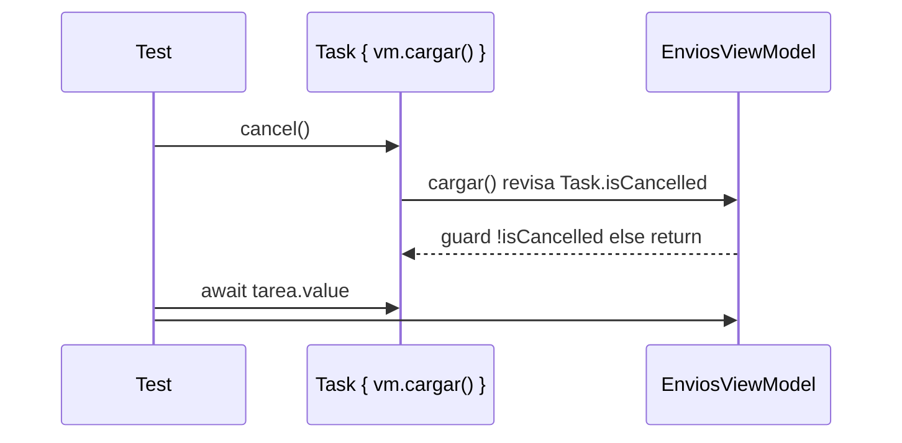
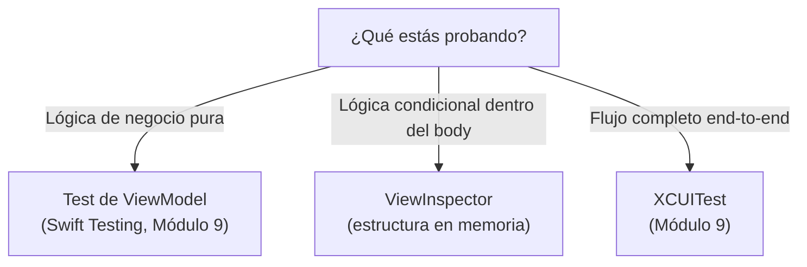
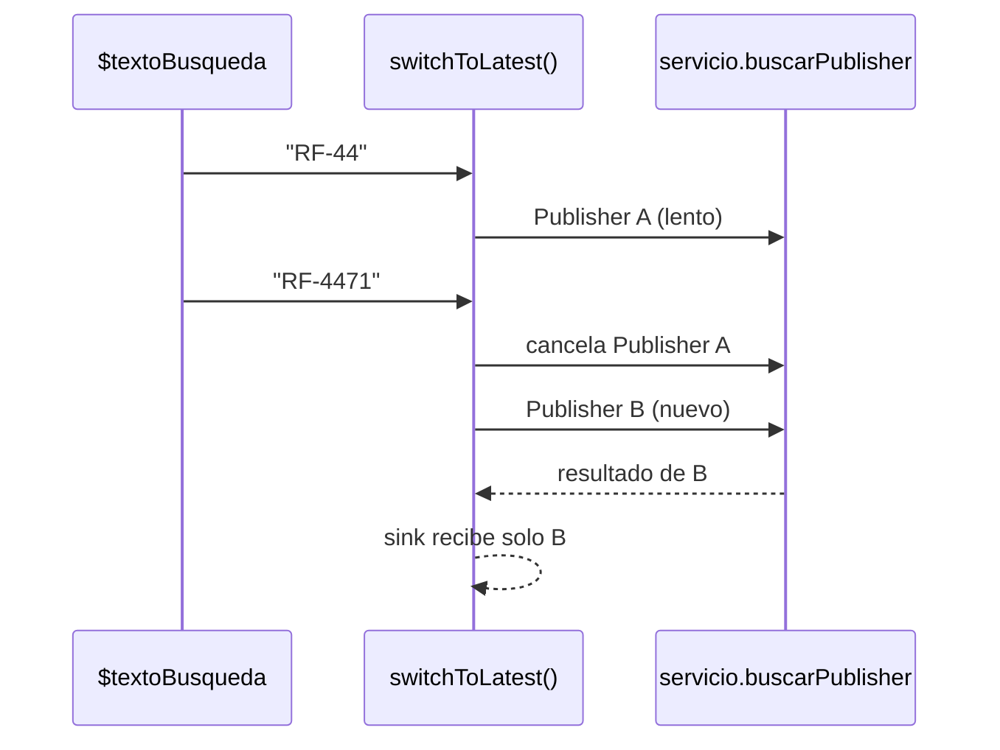
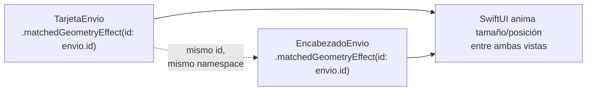
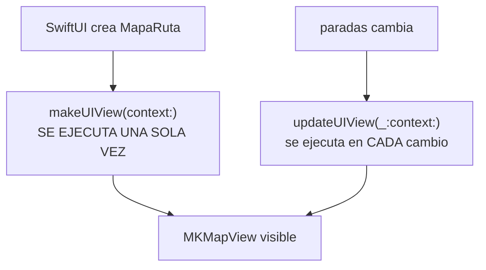

# Módulo 14: SwiftUI Master: pruebas, animación e interoperabilidad


## Aprende construyendo

### Tema 1: XCTest y pruebas asíncronas

#### Paso 1 · Objetivo y preparación
Al finalizar vas a testear que cancelar la carga de `EnviosViewModel.cargar()` a mitad de camino detiene efectivamente la tarea, en vez de dejarla sobrescribir el estado más tarde. Prerrequisitos: Módulo 9 completo.
#### Paso 2 · Contexto y caso real
Si un conductor sale de `ListaEnvios` antes de que termine de cargar, la tarea de red debería cancelarse; nadie confirmó todavía que `cargar()` respeta esa cancelación en vez de seguir corriendo en segundo plano.
#### Paso 3 · Teoría, modelo mental y analogía
Testear cancelación exige provocarla explícitamente dentro del test y confirmar que el trabajo posterior al punto de cancelación nunca se ejecuta — no alcanza con que el test "no crashee".
#### Paso 4 · Demostración guiada
```swift
@Test func cargarSeDetieneAlCancelar() async {
    let vm = EnviosViewModel(servicio: ServicioAPILento())
    let tarea = Task { await vm.cargar() }
    tarea.cancel()
    await tarea.value
    #expect(vm.envios.isEmpty) // nunca llegó a asignar el resultado
}
```
Resultado esperado: con `ServicioAPILento` (un fake que demora artificialmente antes de responder), cancelar la `Task` antes de que `obtenerEnvios()` complete deja `vm.envios` vacío — `cargar()` respeta `Task.isCancelled` y nunca sobrescribe el estado con una respuesta que ya no importa.
#### Paso 5 · Práctica guiada
Pista: quitá cualquier chequeo de cancelación dentro de `cargar()` — ese es el fallo deliberado: el test falla, porque `cargar()` asigna el resultado de todas formas aunque la tarea que lo contiene ya haya sido cancelada, pudiendo sobrescribir un estado más reciente con uno obsoleto.
#### Paso 6 · Práctica independiente
Corregí el Paso 5 agregando `guard !Task.isCancelled else { return }` antes de asignar `envios` dentro de `cargar()`, y agregá un segundo test que confirme que, sin cancelar, `cargar()` sí asigna el resultado normalmente.
#### Paso 7 · Cierre y evidencia
Entregá el test de cancelación del Paso 4, el fallo por falta de chequeo del Paso 5, y el test del camino sin cancelar del Paso 6; explicá por qué testear cancelación requiere provocarla explícitamente, no inferirla de que el test "pasó rápido". Siguiente paso: estudia ViewInspector para testear la vista misma, no solo el ViewModel. Errores comunes: no verificar `Task.isCancelled` antes de efectos secundarios, cancelar sin esperar `tarea.value` (dejando el assert corriendo antes de que la cancelación surta efecto), y asumir que cancelar una `Task` detiene instantáneamente código síncrono en ejecución. Fuentes oficiales: https://developer.apple.com/documentation/swift/task y https://developer.apple.com/documentation/testing.
**¿Por qué es importante?** Porque una tarea cancelada que sigue escribiendo estado puede sobrescribir datos más recientes con una respuesta obsoleta que ya no debería importar.
**Evidencia de aprendizaje:** entrega test de cancelación, fallo por falta de chequeo y test del camino sin cancelar.
**Conceptos clave:** cancelación cooperativa de `Task`, verificación explícita en vez de inferida.

**Diagrama: test de cancelación cooperativa**


```mermaid
sequenceDiagram
    participant Test
    participant Tarea as Task { vm.cargar() }
    participant VM as EnviosViewModel
    Test->>Tarea: cancel()
    Tarea->>VM: cargar() revisa Task.isCancelled
    VM-->>Tarea: guard !isCancelled else return
    Test->>Tarea: await tarea.value
    Test->>VM: #expect(vm.envios.isEmpty)
```

En el proyecto integrador RutaFlow, `EnviosViewModel.cargar()` vive en `examples/rutaflow/ios/RutaFlowApp/ViewModels/EnviosViewModel.swift`. Límite de la decisión: no conviene agregar un chequeo de cancelación a cada función `async` trivial sin efectos secundarios reales — ahí la cancelación no cambia nada observable; reservá el chequeo explícito específicamente para funciones que, como `cargar()`, escriben estado compartido que una respuesta obsoleta podría sobrescribir.

### Tema 2: ViewInspector con criterio

#### Paso 1 · Objetivo y preparación
Al finalizar vas a usar ViewInspector para confirmar que `ListaEnvios` muestra "Sin envíos" cuando `vm.envios` está vacío, decidiendo cuándo ese test vale más que uno de XCUITest. Prerrequisitos: Módulo 9 completo.
#### Paso 2 · Contexto y caso real
Un XCUITest que verifique el mensaje de lista vacía lanza la app completa solo para confirmar un `if` dentro del `body` de una vista; ViewInspector permite inspeccionar la estructura de la vista directamente, sin lanzar nada.
#### Paso 3 · Teoría, modelo mental y analogía
ViewInspector recorre el árbol de vistas SwiftUI en memoria y permite hacer asserts sobre su estructura — útil para lógica condicional de la vista misma, no un reemplazo de testear el ViewModel ni de un XCUITest end-to-end.
#### Paso 4 · Demostración guiada
```swift
import ViewInspector

@Test func muestraMensajeCuandoNoHayEnvios() throws {
    let vista = ListaEnvios(vm: EnviosViewModel(envios: []))
    let texto = try vista.inspect().find(text: "Sin envíos")
    #expect(try texto.string() == "Sin envíos")
}
```
Resultado esperado: el test encuentra el texto "Sin envíos" dentro del árbol de `ListaEnvios` cuando `vm.envios` está vacío, sin lanzar el simulador ni renderizar nada en pantalla — una verificación de estructura, no de píxeles.
#### Paso 5 · Práctica guiada
Pista: cambiá el texto real de la vista de "Sin envíos" a "No hay envíos" sin actualizar el test — ese es el fallo deliberado: el test de ViewInspector falla con un mensaje claro, pero si en cambio hubieras usado una captura de pantalla para "verificar visualmente", un cambio de texto así podría pasar inadvertido en una revisión apurada.
#### Paso 6 · Práctica independiente
Corregí el Paso 5 unificando el texto a una sola versión, y agregá un segundo test que confirme lo contrario: que "Sin envíos" NO aparece cuando `vm.envios` tiene al menos un elemento.
#### Paso 7 · Cierre y evidencia
Entregá el test de estructura del Paso 4, el fallo detectado en el Paso 5, y el test del caso contrario del Paso 6; explicá cuándo ViewInspector vale el esfuerzo (lógica condicional dentro del `body`) frente a cuándo un test de ViewModel ya cubre lo importante sin necesidad de inspeccionar la vista. Siguiente paso: estudia Combine avanzado. Errores comunes: usar ViewInspector para probar lógica que en realidad vive en el ViewModel, acoplar tests a detalles de implementación interna que cambian seguido, y reemplazar todos los XCUITest por ViewInspector perdiendo cobertura end-to-end real. Fuentes oficiales: https://github.com/nalexn/ViewInspector y https://developer.apple.com/documentation/swiftui.
**¿Por qué es importante?** Porque ViewInspector verifica estructura de la vista sin lanzar la app completa, pero solo vale la pena para lógica condicional que realmente vive en el `body`, no como sustituto de testear el ViewModel.
**Evidencia de aprendizaje:** entrega test de estructura, fallo detectado y test del caso contrario.
**Conceptos clave:** inspección de estructura en memoria frente a XCUITest end-to-end, límite de cuándo cada uno vale su costo.

**Diagrama: ViewInspector vs XCUITest vs test de ViewModel**


```mermaid
flowchart TD
    A["¿Qué estás probando?"] -->|Lógica de negocio pura| B["Test de ViewModel\n(Swift Testing, Módulo 9)"]
    A -->|Lógica condicional dentro del body| C["ViewInspector\n(estructura en memoria)"]
    A -->|Flujo completo end-to-end| D["XCUITest\n(Módulo 9)"]
```

En el proyecto integrador RutaFlow, `ListaEnvios` vive en `examples/rutaflow/ios/ContentView.swift`.

### Tema 3: Combine avanzado

#### Paso 1 · Objetivo y preparación
Al finalizar vas a corregir una condición de carrera en la búsqueda de guías de RutaFlow (Módulo 7), donde una respuesta vieja puede sobrescribir una más nueva, usando `switchToLatest()`. Prerrequisitos: Módulo 7 completo.
#### Paso 2 · Contexto y caso real
Si un operador escribe "RF-44" y de inmediato completa a "RF-4471", salen dos búsquedas de red casi simultáneas; si la primera (más lenta por alguna razón de red) responde después de la segunda, su resultado viejo sobrescribe el resultado correcto y más reciente.
#### Paso 3 · Teoría, modelo mental y analogía
`.map` seguido de `.switchToLatest()` cancela automáticamente el Publisher anterior cuando llega un nuevo valor de entrada — solo el resultado de la búsqueda más reciente puede llegar a completar.
#### Paso 4 · Demostración guiada
```swift
$textoBusqueda
    .debounce(for: .milliseconds(300), scheduler: RunLoop.main)
    .map { texto in servicio.buscarPublisher(texto) } // cada letra produce un nuevo Publisher
    .switchToLatest() // cancela el Publisher anterior si todavía no completó
    .sink { resultados in self.resultados = resultados }
    .store(in: &cancelables)
```
Resultado esperado: al escribir "RF-44" y de inmediato "RF-4471", `switchToLatest()` cancela la suscripción a la búsqueda de "RF-44" en el instante en que llega el nuevo Publisher de "RF-4471" — solo el resultado de "RF-4471" puede llegar al `sink`, sin importar cuál respuesta de red llegue primero.
#### Paso 5 · Práctica guiada
Pista: reemplazá `.switchToLatest()` por `.flatMap { $0 }` sin límite de concurrencia — ese es el fallo deliberado: ahora ambas búsquedas siguen corriendo en paralelo sin cancelarse, y si la respuesta de "RF-44" llega después, su resultado viejo sobrescribe el de "RF-4471" en el `sink`, mostrando resultados incorrectos para lo que el operador realmente escribió.
#### Paso 6 · Práctica independiente
Corregí el Paso 5 restaurando `.switchToLatest()`, y escribí (con un fake de `ServicioAPI` que controlás manualmente) un test que confirme explícitamente que la respuesta de la primera búsqueda, si llega tarde, nunca aparece en `resultados`.
#### Paso 7 · Cierre y evidencia
Entregá la cadena con `switchToLatest()` del Paso 4, la condición de carrera provocada en el Paso 5, y el test del Paso 6; explicá la diferencia entre `.flatMap` (deja correr todos los Publishers internos en paralelo) y `.switchToLatest()` (cancela el anterior ante cada nuevo valor). Siguiente paso: estudia animaciones con matchedGeometryEffect. Errores comunes: usar `.flatMap` sin límite cuando en realidad se necesita cancelar resultados obsoletos, no testear explícitamente el caso de respuesta fuera de orden, y confundir `switchToLatest` con "la búsqueda más rápida gana" (en realidad cancela, no compite). Fuentes oficiales: https://developer.apple.com/documentation/combine/publisher/switchtolatest() y https://developer.apple.com/documentation/combine.
**¿Por qué es importante?** Porque sin cancelar explícitamente búsquedas obsoletas, una respuesta de red fuera de orden puede mostrarle al usuario un resultado que no corresponde a lo que realmente escribió.
**Evidencia de aprendizaje:** entrega cadena con switchToLatest, condición de carrera provocada y test de respuesta fuera de orden.
**Conceptos clave:** `.flatMap` frente a `.switchToLatest()`, cancelación automática de Publishers obsoletos.

**Diagrama: switchToLatest cancela lo anterior**


```mermaid
sequenceDiagram
    participant Input as $textoBusqueda
    participant SL as switchToLatest()
    participant API as servicio.buscarPublisher
    Input->>SL: "RF-44"
    SL->>API: Publisher A (lento)
    Input->>SL: "RF-4471"
    SL->>API: cancela Publisher A
    SL->>API: Publisher B (nuevo)
    API-->>SL: resultado de B
    SL-->>SL: sink recibe solo B
```

En el proyecto integrador RutaFlow, esta cadena vive en `examples/rutaflow/ios/ContentView.swift`.

### Tema 4: Animaciones y matchedGeometryEffect

#### Paso 1 · Objetivo y preparación
Al finalizar vas a animar la transición de una `TarjetaEnvio` en `ListaEnvios` hacia `DetalleEnvio`, de forma que la tarjeta parezca expandirse en vez de cambiar de golpe. Prerrequisitos: Módulo 1 completo.
#### Paso 2 · Contexto y caso real
Hoy, tocar una `TarjetaEnvio` navega instantáneamente a `DetalleEnvio` sin ninguna continuidad visual; el usuario pierde de vista qué tarjeta tocó exactamente.
#### Paso 3 · Teoría, modelo mental y analogía
`matchedGeometryEffect` vincula dos vistas distintas (una en cada pantalla) con un mismo `id` dentro de un mismo `namespace`, y SwiftUI anima la transición de tamaño y posición entre ambas — como si fuera literalmente la misma vista moviéndose.
#### Paso 4 · Demostración guiada
```swift
@Namespace var espacioAnimacion

// En ListaEnvios:
TarjetaEnvio(envio: envio)
    .matchedGeometryEffect(id: envio.id, in: espacioAnimacion)

// En DetalleEnvio (mismo namespace compartido):
EncabezadoEnvio(envio: envio)
    .matchedGeometryEffect(id: envio.id, in: espacioAnimacion)
```
Resultado esperado: al tocar una `TarjetaEnvio`, su versión en `DetalleEnvio` se anima expandiéndose suavemente desde la posición y tamaño exactos de la tarjeta original, en vez de un corte instantáneo entre pantallas.
#### Paso 5 · Práctica guiada
Pista: usá un `id` distinto en cada lado (`envio.id` en `ListaEnvios` pero `envio.guia` en `DetalleEnvio`) — ese es el fallo deliberado: SwiftUI no reconoce ninguna relación entre ambas vistas, y la transición vuelve a ser un corte instantáneo sin ninguna animación, sin ningún error visible que explique por qué.
#### Paso 6 · Práctica independiente
Corregí el Paso 5 usando el mismo `id` (`envio.id`) en ambos lados, y agregá una segunda `matchedGeometryEffect` para animar también el ícono de estado del envío entre ambas pantallas, con su propio `id` distinto al de la tarjeta completa.
#### Paso 7 · Cierre y evidencia
Entregá la transición animada del Paso 4, la transición rota por `id` inconsistente del Paso 5, y la segunda animación agregada del Paso 6; explicá por qué `matchedGeometryEffect` exige que el `id` sea idéntico en ambos lados y qué pasa silenciosamente (sin error) cuando no lo es. Siguiente paso: estudia cómo embeber vistas de UIKit dentro de SwiftUI. Errores comunes: usar un `namespace` distinto en cada pantalla, IDs inconsistentes entre los dos lados de la transición, y animar demasiados elementos simultáneamente sin medir el impacto en el frame rate. Fuentes oficiales: https://developer.apple.com/documentation/swiftui/view/matchedgeometryeffect(id:in:properties:anchor:issource:) y https://developer.apple.com/documentation/swiftui/animations.
**¿Por qué es importante?** Porque una transición animada que conserva continuidad visual comunica relación espacial de una forma que un corte instantáneo no puede.
**Evidencia de aprendizaje:** entrega transición animada, fallo por id inconsistente y segunda animación agregada.
**Conceptos clave:** `Namespace` compartido, `id` idéntico entre ambos lados de la transición.

**Diagrama: matchedGeometryEffect con id compartido**


```mermaid
flowchart LR
    A["TarjetaEnvio\n.matchedGeometryEffect(id: envio.id)"] -.->|mismo id,\nmismo namespace| B["EncabezadoEnvio\n.matchedGeometryEffect(id: envio.id)"]
    A --> C["SwiftUI anima tamaño/posición\nentre ambas vistas"]
    B --> C
```

En el proyecto integrador RutaFlow, esta transición vive en `examples/rutaflow/ios/DetalleEntregaView.swift`. Límite de la decisión: `matchedGeometryEffect` no conviene para transiciones entre vistas sin relación visual real (dos pantallas completamente distintas) — ahí una transición estándar de `NavigationStack` es más clara; reservalo específicamente cuando dos vistas distintas representan visualmente el mismo elemento de datos, como esta tarjeta que se expande.

### Tema 5: UIViewRepresentable

#### Paso 1 · Objetivo y preparación
Al finalizar vas a envolver un `MKMapView` (UIKit) dentro de SwiftUI con `UIViewRepresentable`, mostrando la ubicación de los envíos de una ruta de RutaFlow. Prerrequisitos: Módulo 10 completo.
#### Paso 2 · Contexto y caso real
SwiftUI tiene `Map`, pero RutaFlow necesita una funcionalidad específica de `MKMapView` (anotaciones personalizadas con el estado de cada parada) que la versión SwiftUI no expone directamente.
#### Paso 3 · Teoría, modelo mental y analogía
`UIViewRepresentable` exige implementar `makeUIView` (crea la vista una sola vez) y `updateUIView` (sincroniza cambios de estado de SwiftUI hacia la vista de UIKit) — un traductor entre el mundo declarativo de SwiftUI y el mundo imperativo de UIKit.
#### Paso 4 · Demostración guiada
```swift
struct MapaRuta: UIViewRepresentable {
    let paradas: [Parada]

    func makeUIView(context: Context) -> MKMapView { MKMapView() }

    func updateUIView(_ mapView: MKMapView, context: Context) {
        mapView.removeAnnotations(mapView.annotations)
        let anotaciones = paradas.map { parada in
            let punto = MKPointAnnotation()
            punto.coordinate = parada.coordenada
            punto.title = parada.direccion
            return punto
        }
        mapView.addAnnotations(anotaciones)
    }
}
```
Resultado esperado: al cambiar `paradas` desde SwiftUI (por ejemplo, al completar una entrega y quitarla de la lista), `updateUIView` se llama automáticamente y el mapa refleja las anotaciones actualizadas, sin ningún código manual de sincronización.
#### Paso 5 · Práctica guiada
Pista: movés la creación de las anotaciones a `makeUIView` en vez de `updateUIView`, "para no repetir código en cada actualización" — ese es el fallo deliberado: ahora el mapa muestra siempre las paradas de la primera vez que se creó la vista, y completar una entrega nunca actualiza lo que se ve en el mapa, porque `makeUIView` solo se ejecuta una vez.
#### Paso 6 · Práctica independiente
Corregí el Paso 5 devolviendo la lógica de anotaciones a `updateUIView`, y agregá un `Coordinator` (con `makeCoordinator()`) que implemente `MKMapViewDelegate` para personalizar el color del pin según si la parada está pendiente o entregada.
#### Paso 7 · Cierre y evidencia
Entregá el `UIViewRepresentable` del Paso 4, el mapa congelado del Paso 5, y el `Coordinator` con delegate del Paso 6; explicá la diferencia entre qué código corre una sola vez (`makeUIView`) y qué código debe correr en cada actualización de estado (`updateUIView`). Siguiente paso: estudia `UIViewControllerRepresentable` para envolver controladores completos. Errores comunes: poner lógica dependiente del estado en `makeUIView` en vez de `updateUIView`, olvidar limpiar anotaciones viejas antes de agregar las nuevas, y no implementar un Coordinator cuando la vista de UIKit necesita un delegate. Fuentes oficiales: https://developer.apple.com/documentation/swiftui/uiviewrepresentable y https://developer.apple.com/documentation/mapkit/mkmapview.
**¿Por qué es importante?** Porque confundir `makeUIView` con `updateUIView` produce una vista de UIKit que nunca refleja cambios posteriores de estado, un bug silencioso sin ningún error visible.
**Evidencia de aprendizaje:** entrega UIViewRepresentable funcional, mapa congelado detectado y Coordinator con delegate agregado.
**Conceptos clave:** `makeUIView` (una sola vez) frente a `updateUIView` (cada actualización), Coordinator como delegate de UIKit.

**Diagrama: ciclo de vida de UIViewRepresentable**


```mermaid
flowchart TD
    A["SwiftUI crea MapaRuta"] --> B["makeUIView(context:)\nSE EJECUTA UNA SOLA VEZ"]
    C["paradas cambia"] --> D["updateUIView(_:context:)\nse ejecuta en CADA cambio"]
    B --> E["MKMapView visible"]
    D --> E
```

En el proyecto integrador RutaFlow, `MapaRuta` vive en `examples/rutaflow/ios/RutaFlowApp/Vistas/MapaRuta.swift`.

### Tema 6: UIViewControllerRepresentable y Coordinator

#### Paso 1 · Objetivo y preparación
Al finalizar vas a envolver `UIImagePickerController` (para fotografiar la prueba de entrega) con `UIViewControllerRepresentable`, usando un `Coordinator` para recibir la foto de vuelta en SwiftUI. Prerrequisitos: Tema 5 de este módulo.
#### Paso 2 · Contexto y caso real
SwiftUI no tiene un picker de cámara propio; `UIImagePickerController` es un `UIViewController` completo de UIKit con su propio delegate, que SwiftUI no puede recibir directamente sin un puente.
#### Paso 3 · Teoría, modelo mental y analogía
`UIViewControllerRepresentable` envuelve el controlador completo; como el delegate de UIKit necesita un objeto que lo implemente (no una closure), un `Coordinator` actúa como ese delegate y reenvía el resultado hacia una `Binding` de SwiftUI.
#### Paso 4 · Demostración guiada
```swift
struct SelectorFotoEntrega: UIViewControllerRepresentable {
    @Binding var foto: UIImage?

    func makeUIViewController(context: Context) -> UIImagePickerController {
        let picker = UIImagePickerController()
        picker.sourceType = .camera
        picker.delegate = context.coordinator
        return picker
    }

    func updateUIViewController(_ picker: UIImagePickerController, context: Context) {}

    func makeCoordinator() -> Coordinator { Coordinator(foto: $foto) }

    class Coordinator: NSObject, UIImagePickerControllerDelegate, UINavigationControllerDelegate {
        @Binding var foto: UIImage?
        init(foto: Binding<UIImage?>) { _foto = foto }
        func imagePickerController(_ picker: UIImagePickerController, didFinishPickingMediaWithInfo info: [UIImagePickerController.InfoKey: Any]) {
            foto = info[.originalImage] as? UIImage
        }
    }
}
```
Resultado esperado: al tomar una foto, `imagePickerController(_:didFinishPickingMediaWithInfo:)` se dispara en el `Coordinator`, que asigna la imagen a `foto`; como `foto` es una `Binding` compartida con la vista que presentó el picker, esa vista se actualiza automáticamente con la nueva foto.
#### Paso 5 · Práctica guiada
Pista: quitá `picker.delegate = context.coordinator` de `makeUIViewController` — ese es el fallo deliberado: la cámara sigue abriéndose y tomando fotos con normalidad, pero `foto` nunca se actualiza, porque nadie quedó escuchando el callback del delegate; el fallo es silencioso, sin ningún error ni crash.
#### Paso 6 · Práctica independiente
Corregí el Paso 5 restaurando la asignación del delegate, y agregá el método `imagePickerControllerDidCancel` para cerrar el picker cuando el conductor cancela sin tomar foto.
#### Paso 7 · Cierre y evidencia
Entregá el picker funcional del Paso 4, el fallo silencioso por delegate faltante del Paso 5, y el manejo de cancelación del Paso 6; explicá por qué un `UIViewController` con delegate de UIKit necesita específicamente un `Coordinator` (una clase), y no alcanzaría con una closure como en integraciones más simples. Siguiente paso: cerrá el módulo integrando esta pantalla al flujo de confirmación de entrega del proyecto integrador. Errores comunes: olvidar asignar el delegate al Coordinator, no manejar el caso de cancelación del picker, y actualizar estado de SwiftUI directamente desde el Coordinator sin pasar por una `Binding` o callback explícito. Fuentes oficiales: https://developer.apple.com/documentation/swiftui/uiviewcontrollerrepresentable y https://developer.apple.com/documentation/uikit/uiimagepickercontroller.
**¿Por qué es importante?** Porque sin un Coordinator correctamente asignado como delegate, un `UIViewControllerRepresentable` puede parecer funcionar mientras falla silenciosamente en devolver el resultado a SwiftUI.
**Evidencia de aprendizaje:** entrega picker funcional, fallo silencioso detectado y manejo de cancelación agregado.
**Conceptos clave:** Coordinator como puente de delegate entre UIKit y SwiftUI, fallos silenciosos sin error visible.

**Diagrama: Coordinator como puente de delegate**

```mermaid
flowchart LR
    A["UIImagePickerController"] -->|delegate = context.coordinator| B["Coordinator\n(NSObject, UIImagePickerControllerDelegate)"]
    B -->|didFinishPickingMediaWithInfo| C["foto = info[.originalImage]"]
    C -->|@Binding| D["Vista SwiftUI se actualiza"]
```

En el proyecto integrador RutaFlow, `SelectorFotoEntrega` vive en `examples/rutaflow/ios/RutaFlowApp/Vistas/SelectorFotoEntrega.swift`. Límite de la decisión: `UIViewControllerRepresentable` con `Coordinator` no conviene cuando SwiftUI ya expone una API nativa equivalente (como `PhotosPicker` para seleccionar de la galería) — ahí usar la API nativa es más simple; reservá este puente específicamente para controladores de UIKit sin equivalente SwiftUI directo, como `UIImagePickerController` con cámara.

---

## Laboratorio práctico

Cierra el proyecto integrador RutaFlow probando, animando e interoperando con UIKit donde SwiftUI todavía no alcanza.

1. Escribe un test de cancelación cooperativa para `EnviosViewModel.cargar()` con Swift Testing, confirmando que una tarea cancelada no sobrescribe estado con una respuesta obsoleta.
2. Usa ViewInspector para confirmar que `ListaEnvios` muestra el texto "Sin envíos" exactamente cuando la lista está vacía, sin lanzar la app completa.
3. Compón dos búsquedas de ruta con `.switchToLatest()` y confirma que una respuesta tardía nunca sobrescribe a una más reciente.
4. Anima la transición de `TarjetaEnvio` a `DetalleEnvio` con `matchedGeometryEffect` y un `id` consistente entre ambas vistas.
5. Envuelve `MKMapView` con `UIViewRepresentable`, confirmando que `updateUIView` (no solo `makeUIView`) refleja cambios posteriores de las paradas.
6. Envuelve `UIImagePickerController` con `UIViewControllerRepresentable` y un `Coordinator`, confirmando que el delegate conectado entrega la foto capturada a la vista SwiftUI.

La entrega contiene el código de los seis Temas, los tests en verde, y la reproducción de cada fallo deliberado (cancelación ignorada, estructura rota, condición de carrera, `id` inconsistente, mapa congelado, delegate faltante) junto con su corrección.

## Trazabilidad de la auditoría original

- **Pruebas en SwiftUI**: cubierto en los Temas 1 (XCTest y pruebas asíncronas) y 2 (ViewInspector) de este módulo.
- **Animaciones en SwiftUI**: cubierto en el Tema 4 (matchedGeometryEffect) de este módulo.
- **Interoperabilidad con UIKit**: cubierto en los Temas 5 (UIViewRepresentable) y 6 (UIViewControllerRepresentable y Coordinator) de este módulo.
- **Combine Avanzado**: cubierto mediante fundamento, laboratorio y evidencia del capítulo.
