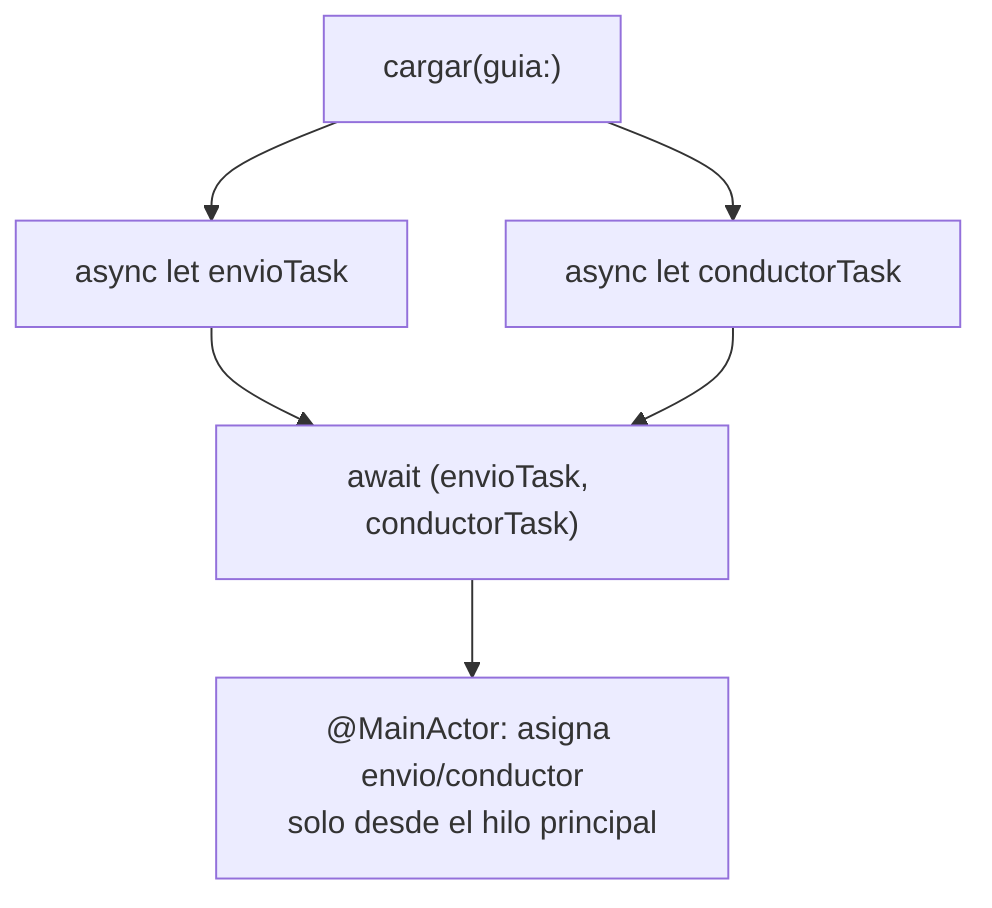

# Módulo 4: Concurrencia moderna: async/await


## Aprende construyendo

### Tema 1: async/await y Task

#### Paso 1 · Objetivo y preparación
Al finalizar vas a cargar el detalle de un envío de RutaFlow con `async`/`await` dentro de `.task`, y a confirmar que se cancela sola si el conductor sale de la pantalla antes de que termine. Prerrequisitos: Módulo 3 completo.
#### Paso 2 · Contexto y caso real
Si `DetalleEnvio` tarda un segundo en traer los datos de `ShipmentEvents` y el conductor vuelve atrás antes de que termine, esa carga no debería seguir corriendo ni intentar actualizar una vista que ya no existe.
#### Paso 3 · Teoría, modelo mental y analogía
`async`/`await` deja leer código asíncrono en el orden natural en que ocurre, sin callbacks anidados; `.task` vinculado al ciclo de vida cancela automáticamente si la vista desaparece, como cancelar un pedido si el cliente ya se fue del restaurante.
#### Paso 4 · Demostración guiada desde cero
```swift
func obtenerEnvio(guia: String) async throws -> Envio {
    try await Task.sleep(for: .seconds(1)) // simula la consulta real a ShipmentEvents
    return Envio(guia: guia)
}

struct DetalleEnvio: View {
    let guia: String
    @State private var envio: Envio?
    var body: some View {
        Group {
            if let envio { Text("Envío: \(envio.guia)") } else { ProgressView() }
        }
        .task {
            do { envio = try await obtenerEnvio(guia: guia) }
            catch { print("error: \(error)") }
        }
    }
}
```
Resultado esperado: la vista muestra un `ProgressView` mientras espera, y el texto del envío apenas termina `obtenerEnvio` — si el conductor navega hacia atrás antes del segundo de espera, SwiftUI cancela automáticamente esa `Task` sin que `envio` llegue a asignarse sobre una vista que ya no existe.
#### Paso 5 · Práctica guiada
Pista: reemplazá `.task { ... }` por `Task { ... }` suelto (sin vincularlo al ciclo de vida de la vista) dentro de `onAppear` — ese es el fallo deliberado: si el conductor sale de `DetalleEnvio` antes de que termine `obtenerEnvio`, esa tarea sigue corriendo de fondo sin que nadie la cancele, y cuando termine va a intentar asignar `envio` sobre una vista que ya no está en pantalla.
#### Paso 6 · Práctica independiente
Corregí el Paso 5 volviendo a `.task`, y agregá un timeout real con `Task.sleep` + `race` manual (o `withTimeout` si tu versión de Swift lo soporta) para que `obtenerEnvio` falle explícitamente si tarda más de 3 segundos, en vez de esperar indefinidamente.
#### Paso 7 · Cierre y evidencia
Entregá la carga cancelable del Paso 4, la tarea huérfana del Paso 5, y el timeout agregado del Paso 6; explicá por qué `.task` resuelve un problema que `Task` suelto dentro de `onAppear` no resuelve. Siguiente paso: estudia networking. Errores comunes: bloquear MainActor, ignorar cancellation, compartir clase mutable y capturar self fuerte. Fuentes oficiales: https://developer.apple.com/documentation/swift/concurrency y https://docs.swift.org/swift-book/documentation/the-swift-programming-language/concurrency/.
**¿Por qué es importante?** Porque las apps móviles deben seguir respondiendo mientras esperan red, disco o sensores.
**Evidencia de aprendizaje:** entrega actor, tareas, cancelación, fallo y medición.
**Conceptos clave:** código asíncrono que se lee como si fuera síncrono, cancelación automática vinculada al ciclo de vida.

```swift
func obtenerUsuario(id: String) async throws -> Usuario {
    try await Task.sleep(for: .seconds(1)) // simula una llamada de red
    return Usuario(id: id, nombre: "Ana")
}
```

```swift
.task { // se cancela automáticamente si la vista desaparece
    do { usuario = try await obtenerUsuario(id: "1") }
    catch { mostrarError(error) }
}
```

Una función marcada `async` puede suspender su ejecución en un punto de espera (`await`) sin bloquear el hilo que la invoca, y el código que la llama se lee de forma lineal y secuencial exactamente como código síncrono normal, en vez del anidamiento de closures de callback que dominaba el manejo de asincronía en Swift previo a esta característica; este es el mismo principio de "funciones suspendibles que se leen linealmente" compartido con `suspend` en Kotlin (Módulo 2 del track de Kotlin Multiplatform) y con `async`/`await` en JavaScript (Módulo 5 del track de JavaScript), una convergencia entre lenguajes hacia el mismo modelo mental para expresar asincronía de forma legible.

El modificador `.task { }` en una vista SwiftUI lanza una `Task` vinculada automáticamente al ciclo de vida de esa vista específica: si la vista desaparece de la pantalla antes de que la tarea complete, SwiftUI cancela automáticamente esa `Task`, evitando el problema clásico de intentar actualizar el estado de una vista que ya no existe, sin que el desarrollador tenga que gestionar manualmente esa cancelación.

**Analogía:** `async`/`await` es como poder escribir instrucciones de cocina en el orden natural en que ocurren ("hierve el agua, luego agrega la pasta"), en vez de tener que estructurarlas como una cadena de notas de "cuando termines esto, avísame para hacer lo siguiente" (callbacks anidados); `.task` vinculado al ciclo de vida es como cancelar automáticamente un pedido si el cliente que lo hizo ya se retiró del restaurante.

**¿Por qué es importante?** `async`/`await` permite leer código asíncrono de forma lineal, mucho más fácil de razonar que el "callback hell" de versiones anteriores de Swift; `.task` cancela automáticamente su trabajo si la vista desaparece, evitando actualizaciones sobre una vista ya inexistente.

**Código del ejemplo:**

```swift
func obtenerUsuario(id: String) async throws -> Usuario {
    try await Task.sleep(for: .seconds(1))
    return Usuario(id: id, nombre: "Ana")
}
.task { usuario = try await obtenerUsuario(id: "1") }  // cancelado automáticamente si la vista desaparece
```

* Proyecto: proyecto integrador RutaFlow
* Visualización: concepto mostrado en diagrama

### Tema 2: Actors para estado mutable seguro

#### Paso 1 · Objetivo y preparación
Al finalizar vas a proteger con un `actor` el contador de "entregas confirmadas hoy" de RutaFlow contra una condición de carrera real entre tareas concurrentes. Prerrequisitos: Tema 1 de este módulo.
#### Paso 2 · Contexto y caso real
Si varias confirmaciones de entrega llegan casi al mismo tiempo (varios conductores confirmando en simultáneo), un contador compartido sin protección podría perder actualizaciones, el mismo problema de `capacidad -= 1` que ya viste en el Módulo 8 de Foundations, ahora en Swift.
#### Paso 3 · Teoría, modelo mental y analogía
Un `actor` es una caja fuerte con un único mecanismo de acceso que atiende solicitudes una a la vez, sin importar cuántas lleguen al mismo tiempo — el compilador garantiza la serialización, no la disciplina de quien llama.
#### Paso 4 · Demostración guiada desde cero
```swift
actor ContadorEntregas {
    private var confirmadasHoy = 0
    func confirmar() -> Int {
        confirmadasHoy += 1
        return confirmadasHoy
    }
}

let contador = ContadorEntregas()
await withTaskGroup(of: Int.self) { group in
    for _ in 1...100 {
        group.addTask { await contador.confirmar() }
    }
}
print(await contador.confirmar()) // debería ser 101 tras 100 confirmaciones concurrentes + esta
```
Resultado esperado: tras 100 confirmaciones concurrentes, el contador llega exactamente a 101 — ninguna actualización se pierde, porque el actor serializa el acceso a `confirmadasHoy` sin que escribas ningún lock manual.
#### Paso 5 · Práctica guiada
Pista: reemplazá `actor ContadorEntregas` por `class ContadorEntregas` (sin protección) y repetí las 100 confirmaciones concurrentes — ese es el fallo deliberado: el resultado final rara vez es exactamente 101; algunas actualizaciones se pisan entre sí, la misma condición de carrera del Módulo 8 de Foundations, ahora sin ningún mecanismo que la prevenga.
#### Paso 6 · Práctica independiente
Corregí el Paso 5 volviendo a `actor`, y agregá un método `reiniciar()` al actor para poner el contador en cero al empezar un nuevo día — confirmá que llamarlo desde fuera del actor también exige `await`, igual que `confirmar()`.
#### Paso 7 · Cierre y evidencia
Entregá el contador correcto con `actor` del Paso 4, la condición de carrera real con `class` del Paso 5, y el método `reiniciar()` del Paso 6; explicá por qué el compilador rechaza acceder a `confirmadasHoy` sin `await` desde fuera del actor. Siguiente paso: estudia networking. Errores comunes: bloquear MainActor, ignorar cancellation, compartir clase mutable y capturar self fuerte. Fuentes oficiales: https://developer.apple.com/documentation/swift/concurrency y https://docs.swift.org/swift-book/documentation/the-swift-programming-language/concurrency/.
**¿Por qué es importante?** Porque las apps móviles deben seguir respondiendo mientras esperan red, disco o sensores.
**Evidencia de aprendizaje:** entrega actor, tareas, cancelación, fallo y medición.
**Conceptos clave:** acceso serializado garantizado por el compilador, sin locks manuales.

```swift
actor CacheTareas {
    private var datos: [String: Tarea] = [:]
    func guardar(_ tarea: Tarea) { datos[tarea.id] = tarea }
}
```

Un `actor` es un tipo de referencia (similar a una `class`) cuyo estado interno mutable está protegido automáticamente por el compilador de Swift contra el acceso concurrente no seguro: dos llamadas concurrentes desde distintas partes del código nunca pueden modificar `datos` simultáneamente de forma que corrompan su estado interno, dado que el compilador serializa automáticamente el acceso al aislamiento del actor, rechazando en tiempo de compilación cualquier intento de acceso directo no seguro desde fuera del actor sin pasar por `await`.

Esta garantía elimina una categoría completa de bugs de concurrencia (data races) sin requerir locks, mutexes o primitivas de sincronización manual explícitas por parte del desarrollador, un enfoque que traslada la responsabilidad de correctitud de concurrencia desde la disciplina manual del programador hacia una verificación automática del compilador, de forma análoga (aunque con mecanismos internos distintos) a `Mutex` en Kotlin Coroutines (Módulo 3 del track de Kotlin Multiplatform), donde también se busca proteger estado mutable compartido de accesos concurrentes inseguros.

**Analogía:** un actor es como una caja fuerte con un único mecanismo de acceso que atiende solicitudes una a la vez en estricto orden de llegada, sin importar cuántas personas intenten acceder simultáneamente: el propio mecanismo (no la disciplina de quienes solicitan acceso) garantiza que nunca dos personas manipulen el contenido al mismo tiempo.

**¿Por qué es importante?** Un actor previene data races (corrupción de estado mutable por acceso concurrente no serializado) que una `class` normal no previene, con la garantía verificada por el compilador en vez de depender de la disciplina manual del desarrollador con locks explícitos.

**Código del ejemplo:**

```swift
actor CacheTareas {
    private var datos: [String: Tarea] = [:]
    func guardar(_ tarea: Tarea) { datos[tarea.id] = tarea }
}
// El compilador exige `await` para acceder desde fuera del actor, serializando el acceso automáticamente
```

* Proyecto: proyecto integrador RutaFlow
* Visualización: concepto mostrado en diagrama

### Tema 3: TaskGroup y MainActor

#### Paso 1 · Objetivo y preparación
Al finalizar vas a traer en paralelo los datos de envío y de conductor con `TaskGroup`, y a confirmar que `@MainActor` protege la actualización de la UI. Prerrequisitos: Tema 2 de este módulo.
#### Paso 2 · Contexto y caso real
`DetalleEnvio` necesita tanto los datos del envío como los del conductor asignado — traerlos uno después del otro duplicaría el tiempo de espera sin necesidad, cuando podrían pedirse al mismo tiempo.
#### Paso 3 · Teoría, modelo mental y analogía
`TaskGroup` lanza tareas hijas en paralelo dentro de un ámbito bien definido, garantizando que todas completen o se cancelen antes de retornar; `@MainActor` garantiza, verificado por el compilador, que la UI solo se actualiza desde el hilo principal.
#### Paso 4 · Demostración guiada desde cero
```swift
@MainActor @Observable
class DetalleEnvioViewModel {
    var envio: Envio?
    var conductor: Conductor?

    func cargar(guia: String) async throws {
        async let envioTask = obtenerEnvio(guia: guia)
        async let conductorTask = obtenerConductor(guia: guia)
        (envio, conductor) = try await (envioTask, conductorTask)
    }
}
```
Resultado esperado: `obtenerEnvio` y `obtenerConductor` corren en paralelo (el tiempo total es el de la más lenta de las dos, no la suma de ambas), y `envio`/`conductor` se asignan solo desde el hilo principal, porque toda la clase está marcada `@MainActor`. `@Observable` (Módulo 2) reemplaza aquí a `ObservableObject`/`@Published`: SwiftUI rastrea automáticamente qué propiedades lee cada vista, sin necesitar el wrapper `@Published` en cada una.
#### Paso 5 · Práctica guiada
Pista: quitá `@MainActor` de `DetalleEnvioViewModel` y llamá `cargar(guia:)` desde una `Task.detached` en segundo plano — ese es el fallo deliberado: sin `@MainActor`, nada impide que `envio`/`conductor` se asignen desde un hilo en segundo plano, el mismo error que provoca crashes intermitentes difíciles de reproducir al actualizar una `@Published` fuera del hilo principal.
#### Paso 6 · Práctica independiente
Corregí el Paso 5 restaurando `@MainActor`, y agregá una tercera consulta en paralelo (`obtenerHistorialRuta`) al mismo `TaskGroup`/`async let`, confirmando que las tres corren simultáneamente sin que el código se vuelva secuencial por accidente.
#### Paso 7 · Cierre y evidencia
Entregá las dos consultas paralelas del Paso 4, el crash potencial sin `@MainActor` del Paso 5, y la tercera consulta agregada del Paso 6; explicá por qué el compilador puede detectar el error de hilo del Paso 5 en tiempo de compilación, no solo en producción. Siguiente paso: estudia networking. Errores comunes: bloquear MainActor, ignorar cancellation, compartir clase mutable y capturar self fuerte. Fuentes oficiales: https://developer.apple.com/documentation/swift/concurrency y https://docs.swift.org/swift-book/documentation/the-swift-programming-language/concurrency/.
**¿Por qué es importante?** Porque las apps móviles deben seguir respondiendo mientras esperan red, disco o sensores.
**Evidencia de aprendizaje:** entrega actor, tareas, cancelación, fallo y medición.
**Conceptos clave:** concurrencia estructurada con recolección de resultados en paralelo, aislamiento garantizado al hilo principal.

```swift
let (usuario, pedidos) = try await withThrowingTaskGroup(of: Any.self) { group in
    group.addTask { try await obtenerUsuario() }
    group.addTask { try await obtenerPedidos() }
    // recolecta ambos resultados en paralelo
}
```

`TaskGroup` (bajo el paraguas de "concurrencia estructurada") lanza múltiples tareas hijas en paralelo dentro de un ámbito bien definido, garantizando que todas ellas completen (o se cancelen) antes de que el bloque del `TaskGroup` retorne, evitando el problema de tareas "huérfanas" que sobreviven más allá del contexto donde fueron creadas, un problema común en modelos de concurrencia no estructurados donde una tarea lanzada podría seguir ejecutándose indefinidamente sin ninguna relación clara con el código que la originó.

```swift
@MainActor @Observable
class EnviosViewModel {
    var envios: [Envio] = [] // garantizado: solo se modifica desde el hilo principal
}
```

Marcar una clase (o una propiedad específica) con `@MainActor` garantiza, verificado por el compilador, que cualquier acceso a su estado ocurre específicamente en el hilo principal, el único hilo desde el cual es seguro actualizar la UI en UIKit/SwiftUI; esto previene un error extremadamente común en apps con concurrencia (actualizar propiedades observadas por la UI desde un hilo en segundo plano, provocando comportamiento indefinido o crashes intermitentes difíciles de reproducir) al detectarlo en tiempo de compilación en vez de descubrirlo como un bug esporádico en producción.

**Analogía:** un `TaskGroup` es como un supervisor que lanza varios equipos a trabajar en paralelo pero se asegura de que todos hayan terminado (o hayan sido detenidos) antes de dar por cerrado el proyecto completo, sin dejar ningún equipo trabajando sin supervisión después de que el proyecto oficialmente concluyó; `@MainActor` es como una regla de seguridad de fábrica que exige que cierta maquinaria delicada (la UI) solo pueda ser operada por un único operador designado, verificada automáticamente antes de permitir que cualquier otro trabajador intente tocarla.

**¿Por qué es importante?** `TaskGroup` garantiza que las tareas hijas lanzadas en paralelo completen dentro de un ámbito bien definido, evitando tareas huérfanas; `@MainActor` previene, verificado por el compilador, actualizaciones inseguras de UI desde hilos en segundo plano.

**Código del ejemplo:**

```swift
withThrowingTaskGroup(of: Any.self) { group in
    group.addTask { try await obtenerUsuario() }
    group.addTask { try await obtenerPedidos() }
}
// Ambas tareas corren en paralelo, y el bloque no retorna hasta que ambas completen
```

**Diagrama: TaskGroup en paralelo + @MainActor**



En el proyecto integrador RutaFlow, `DetalleEnvioViewModel` vive en `examples/rutaflow/ios/DetalleEntregaView.swift`. Límite de la decisión: `TaskGroup`/`async let` no conviene cuando las tareas dependen secuencialmente una de la otra (necesitás el resultado de la primera para pedir la segunda) — ahí `await` secuencial es correcto; reservá el paralelismo específicamente para tareas verdaderamente independientes como este caso.

---


## Laboratorio práctico

**Objetivo del laboratorio:** construir una función `async` que combina dos llamadas de red en paralelo con `TaskGroup`.

**Requisitos previos:** Módulo 3 completado.

| Paso | Acción | Código | Explicación |
|---|---|---|---|
| 1 | Escribir una función `async` con `Task.sleep` | Ver Tema 1 | Simula una llamada de red |
| 2 | Lanzarla desde una vista con `.task { }` | Ver Tema 1 | Muestra el resultado al llegar |
| 3 | Crear un actor con estado mutable compartido | Ver Tema 2 | Verifica el acceso serializado |
| 4 | Combinar dos llamadas async con `TaskGroup` | Ver Tema 3 | En paralelo, junta ambos resultados |
| 5 | Marcar una clase con `@MainActor` | Ver Tema 3 | Explica la garantía de hilo principal |

**Verificación:** el laboratorio se considera exitoso si las dos llamadas dentro del `TaskGroup` corren efectivamente en paralelo (el tiempo total es aproximadamente el máximo de ambas, no la suma), y si el compilador rechaza cualquier intento de acceso directo no seguro al estado interno del actor desde fuera de él.

**Errores comunes y soluciones**

- **Usar una `class` normal en vez de un `actor` para estado mutable compartido entre tareas concurrentes.** Arriesga data races; usa `actor` para acceso serializado garantizado.
- **Lanzar tareas en secuencia con `await` sucesivos cuando podrían correr en paralelo.** Usa `TaskGroup` para ejecutarlas simultáneamente y reducir el tiempo total.
- **Actualizar el estado de un ViewModel observado por la UI desde un contexto no aislado al hilo principal.** Marca la clase o propiedad con `@MainActor` para prevenir esto en tiempo de compilación.

---

* Proyecto: proyecto integrador RutaFlow
* Visualización: concepto mostrado en diagrama
