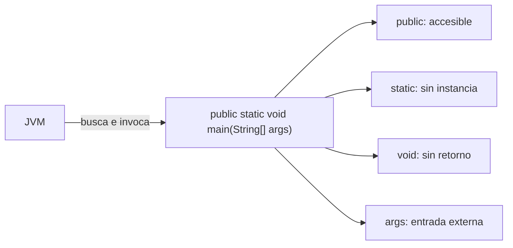
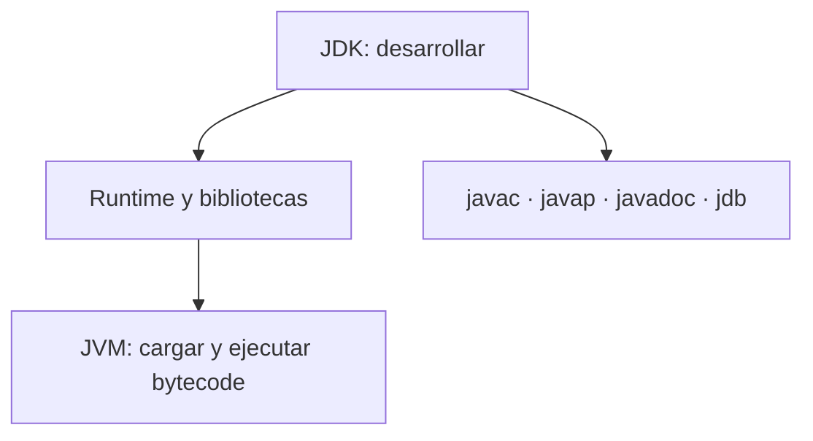

# Módulo 0: Sintaxis, tipos y el modelo de la JVM


## Antes de comenzar: instala Java correctamente

Necesitas un **JDK**, no solo “Java”. El JDK incluye el compilador `javac`, la JVM y herramientas de diagnóstico. Usaremos una versión LTS reciente (Java 21 o superior), Visual Studio Code con **Extension Pack for Java**, y Git.

| Sistema | Instalación | Nota importante |
|---|---|---|
| Windows | Instala Eclipse Temurin JDK y VS Code; marca la opción de configurar `JAVA_HOME` | Abre una terminal nueva después de instalar |
| macOS | `brew install --cask temurin` y `brew install git` | En Mac Apple Silicon usa el instalador ARM64 |
| Ubuntu/Debian | `sudo apt update && sudo apt install -y openjdk-21-jdk git` | No instales únicamente `jre` |

Verifica con `java --version` y `javac --version`: ambas versiones deben coincidir. Crea una carpeta `hola-java`, abre allí VS Code y guarda:

```java
public class Hola {
    public static void main(String[] args) {
        System.out.println("Mi entorno Java funciona");
    }
}
```

Ejecuta `javac Hola.java` y luego `java Hola`. El primer comando produce `Hola.class`; el segundo lo ejecuta en la JVM. En Windows, si `javac` no se reconoce, revisa `JAVA_HOME` y que `%JAVA_HOME%\bin` esté en `Path`.

## Aprende construyendo

### Tema 1: Del código fuente a la JVM

#### Paso 1 · Objetivo y preparación
Al finalizar podrás ejecutar este concepto desde cero. Prerrequisitos: JDK 21, Maven y un editor. Verifica java --version y mvn --version.

#### Paso 2 · Contexto y caso real
En un caso real de una plataforma de entregas, el programa debe transformar entradas, aplicar reglas y producir resultados repetibles en distintos equipos.

#### Paso 3 · Teoría, modelo mental y analogía
Java compila a bytecode y la JVM lo ejecuta con seguridad y portabilidad. La sintaxis, tipos y flujo forman un contrato que el compilador ayuda a comprobar. La analogía es una receta traducida a instrucciones que varias cocinas pueden ejecutar con el mismo resultado.

#### Paso 4 · Demostración guiada desde cero
Desde una **carpeta vacía**, crea `src/Saludo.java` y observa cada artefacto:
```bash
mkdir java-bytecode && cd java-bytecode
mkdir src out
```
```java
public final class Saludo {
    public static void main(String[] args) {
        // javac convierte esta instrucción en bytecode dentro de Saludo.class.
        System.out.println("Hola desde la JVM");
    }
}
```
```bash
javac -d out src/Saludo.java
find out -name '*.class'
javap -c -classpath out Saludo
java -cp out Saludo
```
**Resultado esperado:** existe `out/Saludo.class`, `javap` muestra instrucciones como `getstatic` e `invokevirtual`, y la JVM imprime `Hola desde la JVM`. **Fallo deliberado:** ejecuta `java -cp src Saludo`; aparece `ClassNotFoundException` porque el bytecode está en `out`, no en `src`. Corrige el *classpath*.
```java
package com.example;
public class Main {
  public static void main(String[] args) {
    System.out.println("resultado reproducible");
  }
}
```
Compila con javac y ejecuta con java; explica paquete, clase, método y salida.

#### Paso 5 · Práctica guiada
Pista: ejecuta javac -d out src/main/java/com/example/Main.java y java -cp out com.example.Main; cambia un tipo para provocar un fallo deliberado, lee el diagnóstico y corrígelo. Resultado esperado: salida reproducible.

#### Paso 6 · Práctica independiente
Crea otra clase que procese un dato de entrega, añade una entrada válida y otra inválida, y explica la decisión de tipos o flujo.

#### Paso 7 · Cierre y evidencia
Guarda estructura, comandos, salida y log; como siguiente paso añade una prueba automatizada con Maven. Errores comunes: confundir JDK con JVM, ejecutar desde la carpeta incorrecta, ignorar paquetes y mezclar tipos sin conversión explícita. Fuentes oficiales: https://dev.java/learn/ y https://docs.oracle.com/en/java/javase/21/.
**¿Por qué es importante?** Porque comprender la ejecución evita copiar comandos sin saber qué componente actúa.
**Evidencia de aprendizaje:** entrega código, bytecode compilado, comandos, salida y diagnóstico del fallo.
**Conceptos clave:** bytecode, portabilidad, `javac`/`java`.

Entender este ciclo `javac`/`java` es la base para diagnosticar cualquier error de compilación o de classpath que aparezca al construir el proyecto integrador de este track, mucho después de este tema.

**Cuándo no usarlo:** invocar `javac`/`java` manualmente como aquí es apropiado para entender el ciclo de compilación; en un proyecto real con múltiples clases y dependencias externas, Maven o Gradle (módulos posteriores) gestionan classpath y compilación automáticamente, evitando invocar el compilador archivo por archivo a mano.

Java no compila directamente a código máquina nativo específico de un procesador (como sí lo hacen C o C++), sino a bytecode: una representación intermedia (`Hola.class`) que no depende de ningún procesador específico, sino de una máquina virtual, la JVM (Java Virtual Machine), que interpreta o compila ese bytecode a código máquina real en el momento de la ejecución, específicamente para el procesador y sistema operativo donde esa JVM concreta se ejecuta. `javac Hola.java` realiza la compilación de código fuente a bytecode, generando el archivo `.class`; `java Hola` invoca la JVM, que carga ese archivo `.class` y lo ejecuta.

Esta arquitectura de dos pasos es la base del lema histórico de Java "write once, run anywhere" (escribe una vez, ejecuta en cualquier lugar): el mismo archivo `.class` compilado una única vez puede ejecutarse sin recompilar en cualquier sistema operativo o arquitectura de procesador que tenga una JVM disponible, dado que la JVM específica de cada plataforma es la responsable de traducir ese bytecode universal al código máquina específico de esa plataforma particular, en vez de que el desarrollador tenga que recompilar el código fuente por separado para cada plataforma de destino distinta (como sí sería necesario con un lenguaje que compila directamente a código máquina nativo).

**Analogía:** el bytecode es como una partitura musical universal, escrita una única vez, que distintos músicos (las JVMs de cada plataforma) pueden interpretar correctamente en sus propios instrumentos específicos, sin que el compositor original tenga que reescribir la partitura para cada instrumento distinto.

**¿Por qué es importante?** Compilar a bytecode en vez de código máquina nativo directamente es lo que permite que un mismo programa Java compilado una sola vez se ejecute sin recompilar en cualquier plataforma que tenga una JVM disponible.

**Código del ejemplo:**

```java
public class Hola {
    public static void main(String[] args) {
        System.out.println("Hola Java");
    }
}
```
```bash
javac Hola.java   # compila a bytecode: genera Hola.class
java Hola          # la JVM interpreta/compila el bytecode y lo ejecuta
```

### Tema 2: public static void main — qué significa cada palabra

#### Paso 1 · Objetivo y preparación
Al finalizar podrás ejecutar este concepto desde cero. Prerrequisitos: JDK 21, Maven y un editor. Verifica java --version y mvn --version.

#### Paso 2 · Contexto y caso real
En un caso real de una plataforma de entregas, el programa debe transformar entradas, aplicar reglas y producir resultados repetibles en distintos equipos.

#### Paso 3 · Teoría, modelo mental y analogía
Java compila a bytecode y la JVM lo ejecuta con seguridad y portabilidad. La sintaxis, tipos y flujo forman un contrato que el compilador ayuda a comprobar. La analogía es una receta traducida a instrucciones que varias cocinas pueden ejecutar con el mismo resultado.

#### Paso 4 · Demostración guiada desde cero
Desde una **carpeta vacía**, crea `src/PuntoEntrada.java`:
```bash
mkdir java-main && cd java-main
mkdir src out
```
```java
public final class PuntoEntrada {
    public static void main(String[] args) {
        // args recibe cada argumento escrito después del nombre de la clase.
        System.out.printf("argumentos=%d, primero=%s%n", args.length, args[0]);
    }
}
```
```bash
javac -d out src/PuntoEntrada.java
java -cp out PuntoEntrada guia-123
```
**Resultado esperado:** `argumentos=1, primero=guia-123`. **Fallo deliberado:** elimina `static`, recompila y ejecuta; la JVM informa que no encuentra un método `main` válido. `static` permite invocarlo sin crear antes un objeto.

#### Paso 5 · Práctica guiada
Pista: ejecuta javac -d out src/main/java/com/example/Main.java y java -cp out com.example.Main; cambia un tipo para provocar un fallo deliberado, lee el diagnóstico y corrígelo. Resultado esperado: salida reproducible.

#### Paso 6 · Práctica independiente
Crea otra clase que procese un dato de entrega, añade una entrada válida y otra inválida, y explica la decisión de tipos o flujo.

#### Paso 7 · Cierre y evidencia
Guarda estructura, comandos, salida y log; como siguiente paso añade una prueba automatizada con Maven. Errores comunes: confundir JDK con JVM, ejecutar desde la carpeta incorrecta, ignorar paquetes y mezclar tipos sin conversión explícita. Fuentes oficiales: https://dev.java/learn/ y https://docs.oracle.com/en/java/javase/21/.
**¿Por qué es importante?** Porque comprender la ejecución evita copiar comandos sin saber qué componente actúa.
**Evidencia de aprendizaje:** entrega código, bytecode compilado, comandos, salida y diagnóstico del fallo.
**Objetivo:** construir y diagnosticar el punto de entrada de una aplicación Java entendiendo cada modificador, los argumentos y una firma inválida.

**Conceptos clave:** punto de entrada, pertenencia a la clase frente a instancia.

`public static void main(String[] args)` es la firma exacta que la JVM busca como punto de entrada de cualquier programa Java ejecutable, y cada palabra de esa firma tiene un significado preciso y necesario: `public` hace que el método sea accesible desde cualquier lugar, incluyendo desde fuera de la propia clase, necesario porque la JVM (que no es parte del código de la aplicación) necesita poder invocarlo desde el exterior; `static` indica que el método pertenece a la clase en sí, no a una instancia particular de esa clase, siendo esto crucial porque la JVM invoca `main` sin haber creado previamente ningún objeto de esa clase — si `main` no fuera `static`, la JVM necesitaría una instancia ya existente para invocarlo, pero no existe ninguna todavía en ese punto de la ejecución.

`void` indica que el método no devuelve ningún valor (el programa simplemente termina cuando `main` retorna, sin que la JVM espere ni use un valor de retorno de esa llamada específica); `main` es el nombre exacto que la JVM busca por convención estricta, sin el cual no reconocería ese método como el punto de entrada; `String[] args` es el arreglo de argumentos de línea de comandos que se pasan al ejecutar el programa (`java Hola argumento1 argumento2` haría que `args` contenga `["argumento1", "argumento2"]`), permitiendo parametrizar la ejecución del programa desde fuera sin necesidad de recompilarlo.

**Analogía:** `main` es como la puerta principal marcada específicamente para que cualquier visitante (la JVM) sepa exactamente por dónde entrar, sin necesidad de que alguien dentro del edificio (una instancia ya creada) lo reciba primero en la puerta.

**¿Por qué es importante?** Cada palabra de `public static void main(String[] args)` cumple un propósito necesario y preciso para que la JVM pueda localizar e invocar ese método como punto de entrada sin necesitar una instancia previamente existente de la clase.

**Diagrama:**



### Tema 3: JDK, JRE y JVM

#### Paso 1 · Objetivo y preparación
Al finalizar podrás ejecutar este concepto desde cero. Prerrequisitos: JDK 21, Maven y un editor. Verifica java --version y mvn --version.

#### Paso 2 · Contexto y caso real
En un caso real de una plataforma de entregas, el programa debe transformar entradas, aplicar reglas y producir resultados repetibles en distintos equipos.

#### Paso 3 · Teoría, modelo mental y analogía
Java compila a bytecode y la JVM lo ejecuta con seguridad y portabilidad. La sintaxis, tipos y flujo forman un contrato que el compilador ayuda a comprobar. La analogía es una receta traducida a instrucciones que varias cocinas pueden ejecutar con el mismo resultado.

#### Paso 4 · Demostración guiada desde cero
Desde una **carpeta vacía**, crea `src/Entorno.java` y relaciona cada comando con su responsabilidad:
```bash
mkdir java-entorno && cd java-entorno
mkdir src out
java --version
javac --version
```
```java
public final class Entorno {
    public static void main(String[] args) {
        // Estas propiedades describen la JVM que ejecuta el bytecode.
        System.out.println(System.getProperty("java.vm.name"));
        System.out.println(System.getProperty("java.version"));
    }
}
```
```bash
javac -d out src/Entorno.java
java -cp out Entorno
```
**Resultado esperado:** `javac` y `java` muestran la misma línea mayor, y el programa informa el nombre de la VM. **Fallo deliberado:** prueba `javacc --version`; “command not found” no es un error de Java sino un nombre de herramienta incorrecto. Si `java` existe pero `javac` no, instalaste un runtime sin compilador o el JDK no está en `PATH`.

#### Paso 5 · Práctica guiada
Pista: ejecuta javac -d out src/main/java/com/example/Main.java y java -cp out com.example.Main; cambia un tipo para provocar un fallo deliberado, lee el diagnóstico y corrígelo. Resultado esperado: salida reproducible.

#### Paso 6 · Práctica independiente
Crea otra clase que procese un dato de entrega, añade una entrada válida y otra inválida, y explica la decisión de tipos o flujo.

#### Paso 7 · Cierre y evidencia
Guarda estructura, comandos, salida y log; como siguiente paso añade una prueba automatizada con Maven. Errores comunes: confundir JDK con JVM, ejecutar desde la carpeta incorrecta, ignorar paquetes y mezclar tipos sin conversión explícita. Fuentes oficiales: https://dev.java/learn/ y https://docs.oracle.com/en/java/javase/21/.
**¿Por qué es importante?** Porque comprender la ejecución evita copiar comandos sin saber qué componente actúa.
**Evidencia de aprendizaje:** entrega código, bytecode compilado, comandos, salida y diagnóstico del fallo.
**Conceptos clave:** desarrollo frente a ejecución, herramientas incluidas en cada nivel.

La JVM es específicamente la máquina virtual que ejecuta bytecode, el componente mínimo necesario para correr cualquier programa Java ya compilado; el JRE (Java Runtime Environment) incluye la JVM más las librerías estándar necesarias para que los programas Java se ejecuten correctamente (las clases básicas como `String`, `ArrayList`, etc., que un programa típico necesita en tiempo de ejecución, no solo el motor de ejecución del bytecode en sí); el JDK (Java Development Kit) incluye el JRE completo más las herramientas necesarias específicamente para desarrollar programas Java, no solo ejecutarlos (`javac` el compilador, un debugger, `javap` para inspeccionar bytecode, y otras herramientas de desarrollo).

Para escribir y compilar código Java se necesita el JDK completo, dado que incluye `javac`; para simplemente ejecutar un `.jar` ya compilado por alguien más, en principio bastaría con el JRE, aunque en la práctica moderna la mayoría de entornos instala directamente el JDK completo incluso para casos de solo ejecución, dado que las distribuciones actuales del JDK ya son razonablemente livianas y evitan tener que gestionar dos instalaciones separadas según el caso de uso específico.

**Analogía:** la JVM es como el motor de un vehículo (lo mínimo necesario para moverse); el JRE es el vehículo completo listo para conducir (motor más todo lo necesario para circular); el JDK es ese mismo vehículo más un taller completo de herramientas para repararlo y modificarlo, necesario solo para quien construye o modifica vehículos, no para quien simplemente los conduce.

**¿Por qué es importante?** Distinguir JDK, JRE y JVM aclara exactamente qué instalar según si el objetivo es desarrollar código Java (JDK) o simplemente ejecutar un programa ya compilado (JRE, aunque en la práctica se suele instalar el JDK completo de todas formas).

**Diagrama:**



### Tema 4: Tipos primitivos vs referencias

#### Paso 1 · Objetivo y preparación
Al finalizar podrás ejecutar este concepto desde cero. Prerrequisitos: JDK 21, Maven y un editor. Verifica java --version y mvn --version.

#### Paso 2 · Contexto y caso real
En un caso real de una plataforma de entregas, el programa debe transformar entradas, aplicar reglas y producir resultados repetibles en distintos equipos.

#### Paso 3 · Teoría, modelo mental y analogía
Java compila a bytecode y la JVM lo ejecuta con seguridad y portabilidad. La sintaxis, tipos y flujo forman un contrato que el compilador ayuda a comprobar. La analogía es una receta traducida a instrucciones que varias cocinas pueden ejecutar con el mismo resultado.

#### Paso 4 · Demostración guiada desde cero
Desde una **carpeta vacía**, crea `src/ValoresYReferencias.java`:
```bash
mkdir java-tipos && cd java-tipos
mkdir src out
```
```java
public final class ValoresYReferencias {
    public static void main(String[] args) {
        int original = 5;
        int copia = original;
        copia = 9; // Cambia la copia del primitivo.

        int[] rutaA = {1, 2};
        int[] rutaB = rutaA;
        rutaB[0] = 99; // Ambas variables alcanzan el mismo arreglo.
        System.out.printf("%d %d | %d %d%n", original, copia, rutaA[0], rutaB[0]);
    }
}
```
Ejecuta `javac -d out src/ValoresYReferencias.java && java -cp out ValoresYReferencias`. **Salida esperada:** `5 9 | 99 99`. **Fallo deliberado:** declara `Integer intentos = null;` y suma `int total = intentos + 1`; aparece `NullPointerException` durante *unboxing*. Valida la ausencia antes de convertir el wrapper a primitivo.

#### Paso 5 · Práctica guiada
Pista: ejecuta javac -d out src/main/java/com/example/Main.java y java -cp out com.example.Main; cambia un tipo para provocar un fallo deliberado, lee el diagnóstico y corrígelo. Resultado esperado: salida reproducible.

#### Paso 6 · Práctica independiente
Crea otra clase que procese un dato de entrega, añade una entrada válida y otra inválida, y explica la decisión de tipos o flujo.

#### Paso 7 · Cierre y evidencia
Guarda estructura, comandos, salida y log; como siguiente paso añade una prueba automatizada con Maven. Errores comunes: confundir JDK con JVM, ejecutar desde la carpeta incorrecta, ignorar paquetes y mezclar tipos sin conversión explícita. Fuentes oficiales: https://dev.java/learn/ y https://docs.oracle.com/en/java/javase/21/.
**¿Por qué es importante?** Porque comprender la ejecución evita copiar comandos sin saber qué componente actúa.
**Evidencia de aprendizaje:** entrega código, bytecode compilado, comandos, salida y diagnóstico del fallo.
**Objetivo:** predecir cuándo Java copia un valor y cuándo una variable contiene una referencia, evitando `null` y unboxing accidental.

**Conceptos clave:** valor directo frente a apuntador a un objeto, wrappers.

Un tipo primitivo (`int edad = 30;`) almacena su valor directamente en la variable (típicamente en la pila de ejecución, un área de memoria de acceso rápido y de ciclo de vida ligado al alcance donde la variable se declara), sin ninguna capa de indirección adicional; un tipo referencia (`String nombre = "Ana";`) almacena en la variable no el dato en sí, sino una referencia (conceptualmente un apuntador) hacia un objeto real ubicado en el heap (un área de memoria separada, gestionada por el recolector de basura, Módulo 11), de modo que la variable "apunta hacia" ese objeto en vez de contenerlo directamente.

Los tipos wrapper (`Integer edadObjeto = 30;`, la versión objeto correspondiente al primitivo `int`) existen específicamente para los casos donde Java requiere que un valor se trate como un objeto (por ejemplo, para almacenarlo dentro de una colección genérica como `List<Integer>`, dado que los genéricos de Java no admiten directamente tipos primitivos, Módulo 2), a costa de la sobrecarga adicional de memoria e indirección que un objeto conlleva frente a un primitivo puro, siendo esta la razón por la que Java sigue ofreciendo primitivos además de sus wrappers correspondientes, en vez de usar únicamente objetos para todo: los primitivos son más eficientes en memoria y velocidad para el caso extremadamente común de valores numéricos simples usados directamente.

**Analogía:** un tipo primitivo es como llevar el efectivo directamente en el bolsillo; un tipo referencia es como llevar una llave de una caja fuerte donde el objeto real está guardado en otro lugar — acceder al contenido real requiere primero seguir esa referencia hasta la caja fuerte correspondiente.

**¿Por qué es importante?** Los tipos primitivos almacenan su valor directamente, siendo más eficientes; los tipos referencia apuntan a objetos en el heap, necesarios cuando Java requiere tratar ese valor como un objeto completo (por ejemplo, dentro de colecciones genéricas).

**Código del ejemplo:**

```java
int edad = 30;              // primitivo: valor directo en la pila
String nombre = "Ana";       // referencia: variable apunta a un objeto en el heap
Integer edadObjeto = 30;     // wrapper: versión objeto del primitivo int
```

### Tema 5: Variables, conversiones y `String`

#### Paso 1 · Objetivo y preparación
Al finalizar podrás ejecutar este concepto desde cero. Prerrequisitos: JDK 21, Maven y un editor. Verifica java --version y mvn --version.

#### Paso 2 · Contexto y caso real
En un caso real de una plataforma de entregas, el programa debe transformar entradas, aplicar reglas y producir resultados repetibles en distintos equipos.

#### Paso 3 · Teoría, modelo mental y analogía
Java compila a bytecode y la JVM lo ejecuta con seguridad y portabilidad. La sintaxis, tipos y flujo forman un contrato que el compilador ayuda a comprobar. La analogía es una receta traducida a instrucciones que varias cocinas pueden ejecutar con el mismo resultado.

#### Paso 4 · Demostración guiada desde cero
Desde una **carpeta vacía**, crea `src/Conversiones.java`:
```bash
mkdir java-conversiones && cd java-conversiones
mkdir src out
```
```java
import java.math.BigDecimal;

public final class Conversiones {
    public static void main(String[] args) {
        int cantidad = Integer.parseInt("12"); // Convierte texto validable en número.
        BigDecimal tarifa = new BigDecimal("19.90");
        String estado = new String("ENTREGADO");
        System.out.println(tarifa.multiply(BigDecimal.valueOf(cantidad)));
        System.out.println(estado.equals("ENTREGADO"));
    }
}
```
Ejecuta `javac -d out src/Conversiones.java && java -cp out Conversiones`. **Resultado esperado:** `238.80` y `true`. **Fallo deliberado:** cambia `"12"` por `"doce"`; `NumberFormatException` identifica una entrada que no puede convertirse. Captúrala en la frontera y pide un dato válido, sin inventar cero como valor silencioso.

#### Paso 5 · Práctica guiada
Pista: ejecuta javac -d out src/main/java/com/example/Main.java y java -cp out com.example.Main; cambia un tipo para provocar un fallo deliberado, lee el diagnóstico y corrígelo. Resultado esperado: salida reproducible.

#### Paso 6 · Práctica independiente
Crea otra clase que procese un dato de entrega, añade una entrada válida y otra inválida, y explica la decisión de tipos o flujo.

#### Paso 7 · Cierre y evidencia
Guarda estructura, comandos, salida y log; como siguiente paso añade una prueba automatizada con Maven. Errores comunes: confundir JDK con JVM, ejecutar desde la carpeta incorrecta, ignorar paquetes y mezclar tipos sin conversión explícita. Fuentes oficiales: https://dev.java/learn/ y https://docs.oracle.com/en/java/javase/21/.
**¿Por qué es importante?** Porque comprender la ejecución evita copiar comandos sin saber qué componente actúa.
**Evidencia de aprendizaje:** entrega código, bytecode compilado, comandos, salida y diagnóstico del fallo.

Convertir con `BigDecimal` desde texto (nunca `double`) para valores monetarios es exactamente la regla que aplicará el proyecto integrador de este track en cualquier campo de precio o tarifa, evitando errores de precisión que un `double` introduciría silenciosamente.

**Cuándo no usarlo:** `BigDecimal` es más lento y verboso que `double`; para cálculos donde la precisión decimal exacta no importa (una posición en pantalla, un porcentaje aproximado de progreso), `double` sigue siendo la opción correcta — resérvalo para dinero y cualquier cálculo donde un error de redondeo tenga consecuencias reales.

**Objetivo:** convertir entradas externas sin perder precisión ni confundir identidad con contenido.

**Conceptos clave:** inferencia local, conversión segura, precisión e inmutabilidad.

Una variable tiene un tipo estático que limita qué valores y operaciones son válidos. `var` permite que el compilador infiera ese tipo a partir del inicializador, pero no vuelve dinámica la variable: después de `var intentos = 3`, `intentos` continúa siendo `int` y no puede recibir un `String`. Usa `var` cuando el tipo resulte evidente en la misma línea; escribe el tipo explícito cuando comunique una unidad o contrato importante.

Una conversión ampliadora, como `int` a `long`, conserva todos los valores posibles y Java puede aplicarla implícitamente. Una conversión reductora necesita un *cast* porque puede descartar información. `(int) 3_000_000_000L` no “convierte correctamente” el número: conserva solo los bits que caben y produce otro valor. Para datos externos usa `Integer.parseInt` y maneja `NumberFormatException`; para cálculos monetarios evita `double` y modela decimales con `BigDecimal` construido desde texto.

`String` es una referencia a un objeto inmutable. Métodos como `toUpperCase()` devuelven otra cadena; no modifican la original. Compara contenido con `equals`, no con `==`: `==` compara si dos referencias apuntan al mismo objeto, algo que puede parecer funcionar con literales por el *string pool* y fallar cuando una cadena llega desde entrada o red.

```java
package academia.fundamentos;

import java.math.BigDecimal;

public final class Conversiones {
    public static void main(String[] args) {
        var textoCantidad = "12";                 // el tipo inferido sigue siendo String
        int cantidad = Integer.parseInt(textoCantidad);
        long cantidadAmpliada = cantidad;          // ampliación segura
        BigDecimal tarifa = new BigDecimal("19.90");

        String estado = new String("ENTREGADO");
        System.out.println(estado == "ENTREGADO");      // false: identidad
        System.out.println(estado.equals("ENTREGADO")); // true: contenido
        System.out.println(tarifa.multiply(BigDecimal.valueOf(cantidadAmpliada)));
    }
}
```

**Ejecución y diagnóstico:** guarda el ejemplo en `src/main/java/academia/fundamentos/Conversiones.java`, compílalo con `javac -d out src/main/java/academia/fundamentos/Conversiones.java` y ejecútalo con `java -cp out academia.fundamentos.Conversiones`. Cambia `"12"` por `"doce"`: el error esperado es `NumberFormatException`. Corrígelo validando la entrada en la frontera, no ocultando la excepción con un valor arbitrario.

**Analogía:** convertir un `long` a `int` es intentar guardar el contenido de un depósito grande en uno pequeño: el recipiente no amplía su capacidad y parte de la información queda fuera.

**¿Por qué es importante?** Tipos, conversiones e igualdad determinan si el programa conserva el dato real o toma una decisión silenciosamente equivocada.

### Tema 6: Operadores, precedencia y control de flujo

#### Paso 1 · Objetivo y preparación
Al finalizar podrás ejecutar este concepto desde cero. Prerrequisitos: JDK 21, Maven y un editor. Verifica java --version y mvn --version.

#### Paso 2 · Contexto y caso real
En un caso real de una plataforma de entregas, el programa debe transformar entradas, aplicar reglas y producir resultados repetibles en distintos equipos.

#### Paso 3 · Teoría, modelo mental y analogía
Java compila a bytecode y la JVM lo ejecuta con seguridad y portabilidad. La sintaxis, tipos y flujo forman un contrato que el compilador ayuda a comprobar. La analogía es una receta traducida a instrucciones que varias cocinas pueden ejecutar con el mismo resultado.

#### Paso 4 · Demostración guiada desde cero
Desde una **carpeta vacía**, crea `src/ControlEntrega.java`:
```bash
mkdir java-control && cd java-control
mkdir src out
```
```java
public final class ControlEntrega {
    enum Estado { CREADA, EN_RUTA, ENTREGADA }

    static String mensaje(Estado estado) {
        return switch (estado) {
            case CREADA -> "Guía creada";
            case EN_RUTA -> "Conductor en recorrido";
            case ENTREGADA -> "Entrega confirmada";
        };
    }

    public static void main(String[] args) { System.out.println(mensaje(Estado.EN_RUTA)); }
}
```
Ejecuta `javac -d out src/ControlEntrega.java && java -cp out ControlEntrega`. **Resultado esperado:** `Conductor en recorrido`. **Fallo deliberado:** agrega `CANCELADA` al enum y recompila sin agregar una rama; el compilador detecta que la expresión `switch` dejó de ser exhaustiva. Añade el comportamiento del nuevo estado.

#### Paso 5 · Práctica guiada
Pista: ejecuta javac -d out src/main/java/com/example/Main.java y java -cp out com.example.Main; cambia un tipo para provocar un fallo deliberado, lee el diagnóstico y corrígelo. Resultado esperado: salida reproducible.

#### Paso 6 · Práctica independiente
Crea otra clase que procese un dato de entrega, añade una entrada válida y otra inválida, y explica la decisión de tipos o flujo.

#### Paso 7 · Cierre y evidencia
Guarda estructura, comandos, salida y log; como siguiente paso añade una prueba automatizada con Maven. Errores comunes: confundir JDK con JVM, ejecutar desde la carpeta incorrecta, ignorar paquetes y mezclar tipos sin conversión explícita. Fuentes oficiales: https://dev.java/learn/ y https://docs.oracle.com/en/java/javase/21/.
**¿Por qué es importante?** Porque comprender la ejecución evita copiar comandos sin saber qué componente actúa.
**Evidencia de aprendizaje:** entrega código, bytecode compilado, comandos, salida y diagnóstico del fallo.
**Objetivo:** escribir decisiones exhaustivas y ciclos con límites demostrables para las transiciones de una entrega.

**Conceptos clave:** agrupación explícita, cortocircuito, ramas exhaustivas y ciclos terminables.

La precedencia determina qué operación se evalúa primero, pero depender de que el lector memorice toda la tabla dificulta mantener el código. Usa paréntesis para expresar la intención cuando se combinan operadores. `&&` y `||` realizan cortocircuito: la expresión derecha no se evalúa si el resultado ya está decidido. Ese mecanismo permite verificar `paquete != null && paquete.pesoKg() > 0` sin desreferenciar `null`; usar `&` obliga a evaluar ambos lados y produciría `NullPointerException`.

Elige `if` para rangos o reglas heterogéneas y `switch` para decidir según un conjunto discreto. Un `switch` moderno puede ser una expresión que devuelve un valor y evita variables mutables temporales. En ciclos, define antes la condición de salida y comprueba los límites: `i < elementos.length` visita índices válidos; `i <= elementos.length` intenta acceder una posición inexistente.

```java
enum Estado { CREADO, EN_RUTA, ENTREGADO, CANCELADO }

static String mensaje(Estado estado) {
    return switch (estado) {
        case CREADO -> "Guía registrada";
        case EN_RUTA -> "Conductor en recorrido";
        case ENTREGADO -> "Entrega confirmada";
        case CANCELADO -> "Envío cancelado";
    };
}

static boolean pesoValido(Paquete paquete) {
    return paquete != null && paquete.pesoKg() > 0 && paquete.pesoKg() <= 50;
}
```

**Fallo deliberado:** reemplaza el primer `&&` por `&` y llama `pesoValido(null)`. Lee la línea exacta del *stack trace* y explica por qué se evaluó `paquete.pesoKg()`. Después agrega un nuevo valor al `enum`: el compilador señalará que el `switch` dejó de ser exhaustivo, convirtiendo una evolución del dominio en feedback inmediato.

**Analogía:** el cortocircuito es un control de acceso por etapas: si la primera condición ya rechaza la entrada, no se ejecutan controles que requieren que esa entrada exista.

**¿Por qué es importante?** Una condición correcta no solo produce `true` o `false`; también controla qué operaciones llegan a ejecutarse y qué fallos quedan imposibilitados.

### Tema 7: Arreglos, wrappers y paso de argumentos

#### Paso 1 · Objetivo y preparación
Al finalizar podrás ejecutar este concepto desde cero. Prerrequisitos: JDK 21, Maven y un editor. Verifica java --version y mvn --version.

#### Paso 2 · Contexto y caso real
En un caso real de una plataforma de entregas, el programa debe transformar entradas, aplicar reglas y producir resultados repetibles en distintos equipos.

#### Paso 3 · Teoría, modelo mental y analogía
Java compila a bytecode y la JVM lo ejecuta con seguridad y portabilidad. La sintaxis, tipos y flujo forman un contrato que el compilador ayuda a comprobar. La analogía es una receta traducida a instrucciones que varias cocinas pueden ejecutar con el mismo resultado.

#### Paso 4 · Demostración guiada desde cero
Desde una **carpeta vacía**, crea `src/Argumentos.java`:
```bash
mkdir java-argumentos && cd java-argumentos
mkdir src out
```
```java
import java.util.Arrays;

public final class Argumentos {
    static void modificar(int[] referenciaCopiada) {
        referenciaCopiada[0] = 99;       // Muta el arreglo compartido.
        referenciaCopiada = new int[]{7}; // Solo reasigna el parámetro local.
    }
    public static void main(String[] args) {
        int[] paradas = {1, 2, 3};
        modificar(paradas);
        System.out.println(Arrays.toString(paradas));
    }
}
```
Ejecuta `javac -d out src/Argumentos.java && java -cp out Argumentos`. **Salida esperada:** `[99, 2, 3]`, no `[7]`. **Fallo deliberado:** recorre con `i <= paradas.length`; aparece `ArrayIndexOutOfBoundsException` al intentar el índice 3, mientras el último válido es 2.

#### Paso 5 · Práctica guiada
Pista: ejecuta javac -d out src/main/java/com/example/Main.java y java -cp out com.example.Main; cambia un tipo para provocar un fallo deliberado, lee el diagnóstico y corrígelo. Resultado esperado: salida reproducible.

#### Paso 6 · Práctica independiente
Crea otra clase que procese un dato de entrega, añade una entrada válida y otra inválida, y explica la decisión de tipos o flujo.

#### Paso 7 · Cierre y evidencia
Guarda estructura, comandos, salida y log; como siguiente paso añade una prueba automatizada con Maven. Errores comunes: confundir JDK con JVM, ejecutar desde la carpeta incorrecta, ignorar paquetes y mezclar tipos sin conversión explícita. Fuentes oficiales: https://dev.java/learn/ y https://docs.oracle.com/en/java/javase/21/.
**¿Por qué es importante?** Porque comprender la ejecución evita copiar comandos sin saber qué componente actúa.
**Evidencia de aprendizaje:** entrega código, bytecode compilado, comandos, salida y diagnóstico del fallo.
**Objetivo:** recorrer secuencias con límites seguros y predecir exactamente qué puede modificar un método.

**Conceptos clave:** tamaño fijo, autoboxing, aliasing y Java siempre pasa por valor.

Un arreglo conserva una secuencia contigua de elementos de un mismo tipo y su longitud no cambia después de crearlo. Los índices comienzan en cero; el último índice válido es `length - 1`. Para una colección que crece o decrece usa `ArrayList` (Módulo 2), no copies arreglos manualmente en cada inserción.

Java **siempre pasa argumentos por valor**. Al pasar un `int`, el método recibe una copia del número. Al pasar un objeto, recibe una copia de la referencia: ambas referencias apuntan inicialmente al mismo objeto, por lo que el método puede mutarlo si el tipo es mutable, pero reasignar su parámetro no cambia la variable del llamador. Decir “Java pasa objetos por referencia” oculta esta diferencia y produce predicciones equivocadas.

Los wrappers permiten representar primitivos como objetos y admitir `null`, pero el autounboxing puede fallar. `Integer intentos = null; int total = intentos + 1;` lanza `NullPointerException` al intentar extraer el `int`. No uses `null` como un tercer estado implícito: valida o modela la ausencia explícitamente.

```java
static void reemplazar(int[] copiaReferencia) {
    copiaReferencia[0] = 99;       // muta el mismo arreglo observado por el llamador
    copiaReferencia = new int[]{7}; // solo reasigna la copia local de la referencia
}

int[] paradas = {1, 2, 3};
reemplazar(paradas);
System.out.println(java.util.Arrays.toString(paradas)); // [99, 2, 3]
```

**Predicción antes de ejecutar:** explica por qué el resultado no es `[7]`. Luego cambia el ciclo que recorre `paradas` de `< paradas.length` a `<= paradas.length`; identifica `ArrayIndexOutOfBoundsException`, el índice solicitado y el rango válido informado por el error.

**Analogía:** copiar una referencia es entregar una segunda dirección de la misma bodega, no construir otra bodega; cambiar mercancía se observa desde ambas direcciones, pero sustituir el papel con la dirección no mueve la bodega original.

**¿Por qué es importante?** Entender qué se copia permite anticipar mutaciones, aliasing y errores de límites antes de ejecutar el programa.

### Tema 8: Entrada y APIs estándar sin aprender APIs obsoletas como modelo principal

#### Paso 1 · Objetivo y preparación
Al finalizar podrás ejecutar este concepto desde cero. Prerrequisitos: JDK 21, Maven y un editor. Verifica java --version y mvn --version.

#### Paso 2 · Contexto y caso real
En un caso real de una plataforma de entregas, el programa debe transformar entradas, aplicar reglas y producir resultados repetibles en distintos equipos.

#### Paso 3 · Teoría, modelo mental y analogía
Java compila a bytecode y la JVM lo ejecuta con seguridad y portabilidad. La sintaxis, tipos y flujo forman un contrato que el compilador ayuda a comprobar. La analogía es una receta traducida a instrucciones que varias cocinas pueden ejecutar con el mismo resultado.

#### Paso 4 · Demostración guiada desde cero
Desde una **carpeta vacía**, crea `src/FechaEntrega.java`:
```bash
mkdir java-fechas && cd java-fechas
mkdir src out
```
```java
import java.time.LocalDate;
import java.time.format.DateTimeParseException;

public final class FechaEntrega {
    public static void main(String[] args) {
        try {
            LocalDate fecha = LocalDate.parse(args[0]); // ISO: año-mes-día.
            System.out.println("fecha válida=" + fecha);
        } catch (DateTimeParseException | ArrayIndexOutOfBoundsException error) {
            System.out.println("Usa una fecha como 2026-07-22");
        }
    }
}
```
Ejecuta `javac -d out src/FechaEntrega.java && java -cp out FechaEntrega 2026-07-22`. **Resultado esperado:** `fecha válida=2026-07-22`. **Fallo deliberado:** usa `2026-02-31`; `LocalDate.parse` rechaza la fecha imposible y el programa presenta la ayuda controlada. En una aplicación real conserva también la causa técnica en logs internos.

#### Paso 5 · Práctica guiada
Pista: ejecuta javac -d out src/main/java/com/example/Main.java y java -cp out com.example.Main; cambia un tipo para provocar un fallo deliberado, lee el diagnóstico y corrígelo. Resultado esperado: salida reproducible.

#### Paso 6 · Práctica independiente
Crea otra clase que procese un dato de entrega, añade una entrada válida y otra inválida, y explica la decisión de tipos o flujo.

#### Paso 7 · Cierre y evidencia
Guarda estructura, comandos, salida y log; como siguiente paso añade una prueba automatizada con Maven. Errores comunes: confundir JDK con JVM, ejecutar desde la carpeta incorrecta, ignorar paquetes y mezclar tipos sin conversión explícita. Fuentes oficiales: https://dev.java/learn/ y https://docs.oracle.com/en/java/javase/21/.
**¿Por qué es importante?** Porque comprender la ejecución evita copiar comandos sin saber qué componente actúa.
**Evidencia de aprendizaje:** entrega código, bytecode compilado, comandos, salida y diagnóstico del fallo.

Elegir `java.time` sobre `Date`/`Calendar`, y recibir el reloj como dependencia en vez de llamar `LocalDate.now()` directamente, es exactamente lo que necesitará el proyecto integrador de este track para que su lógica de fechas sea probable de forma determinista.

**Cuándo no usarlo:** `Random` con semilla fija es apropiado para pruebas reproducibles; usar esa misma semilla fija para generar tokens, contraseñas o cualquier valor con implicaciones de seguridad es exactamente el error que `SecureRandom` existe para prevenir — la elección depende de si el valor generado protege algo o no.

**Objetivo:** validar entrada externa y elegir APIs de fecha, configuración y aleatoriedad según su semántica.

**Conceptos clave:** validación en la frontera, `java.time`, configuración y aleatoriedad apropiada.

`Scanner` es adecuado para ejercicios de consola si verificas `hasNextInt()` antes de `nextInt()` y consumes correctamente el salto de línea antes de llamar `nextLine()`. En aplicaciones reales, la entrada puede venir de HTTP, mensajería o archivos, pero la regla se conserva: convierte y valida en la frontera; el dominio debe recibir tipos válidos, no texto sin interpretar.

Para fechas nuevas prefiere `java.time`: `LocalDate` representa una fecha sin hora ni zona; `Instant`, un punto global en el tiempo; `ZonedDateTime`, una fecha-hora asociada a reglas de zona. `Date` y `Calendar` siguen existiendo por compatibilidad, pero su mutabilidad y API difícil de razonar no los convierten en el punto de partida recomendado. Para dinero, fechas y medidas, el tipo debe expresar la semántica y evitar valores ambiguos.

`System.getenv()` lee configuración del entorno; no registres secretos al imprimir su contenido. `Math.random()` sirve para demostraciones simples, `Random` para simulaciones reproducibles con semilla y `SecureRandom` para tokens u otros valores sensibles. Una semilla fija es una ventaja en pruebas porque reproduce el mismo escenario, y una vulnerabilidad si se usa para generar credenciales.

```java
import java.time.LocalDate;
import java.time.Period;
import java.util.Random;

LocalDate nacimiento = LocalDate.parse("1995-08-17");
int edad = Period.between(nacimiento, LocalDate.now()).getYears();
Random simulacion = new Random(42); // reproducible para una prueba
int demoraMinutos = simulacion.nextInt(5, 31);
System.out.printf("edad=%d, demora=%d min%n", edad, demoraMinutos);
```

**Decisión profesional:** no uses `LocalDate.now()` directamente dentro de una regla que debas probar de forma determinista; recibe un `Clock` o la fecha actual como dependencia. Provoca una fecha inválida (`"31/02/2025"`), observa `DateTimeParseException` y muestra un mensaje de dominio sin perder la causa técnica en el registro interno.

**Analogía:** las APIs estándar son instrumentos de medición distintos: una fecha civil, un instante global y una fecha con zona responden preguntas diferentes, aunque todas parezcan “tiempo”.

**¿Por qué es importante?** Elegir el tipo y la API según la semántica evita pruebas inestables, fechas ambiguas, secretos expuestos y números supuestamente aleatorios que no cumplen su propósito.

---

## Ruta de proyecto progresivo desde carpeta vacía

No crees un proyecto desechable por módulo. Conserva un único repositorio que evoluciona durante todo el track y etiqueta cada hito (`git tag modulo-N`). Empieza con `mkdir academia-java && cd academia-java && git init && gradle init --type java-application`. Ejecuta el comando paso a paso, inspecciona los archivos generados y registra versiones y precondiciones en el README.

| Hito | Evolución acumulativa | Evidencia antes de avanzar |
|---|---|---|
| Base | dominio y colecciones. | Arranque reproducible, commit limpio y prueba mínima. |
| Aplicación | I/O, concurrencia y datos. | Casos normales, límite y error automatizados. |
| Integración | Conecta capas y reemplaza dobles por infraestructura controlada. | Diagrama, contratos y prueba de integración. |
| Experto | testing, profiling y seguridad. | Perfil o threat model, telemetría y runbook de recuperación. |

Al iniciar cada laboratorio crea una rama `modulo-N`, implementa el incremento, verifica el criterio de éxito y fusiona solo con pruebas verdes. Si un módulo necesita un experimento aislado, colócalo en `experiments/modulo-N/`; el producto acumulativo permanece ejecutable. Al terminar, otra persona debe poder clonar el repositorio y reproducir el último hito siguiendo únicamente el README.


## Construcción guiada del capítulo

**Objetivo del laboratorio:** compilar y ejecutar un programa Java que procese entrada del usuario con validación de tipos, inspeccionando el bytecode generado.

**Requisitos previos:** ninguno (módulo introductorio del track).

| Paso | Acción | Código | Explicación |
|---|---|---|---|
| 1 | Escribir y compilar `Hola.java` | Ver Tema 1 | Observa el `.class` generado |
| 2 | Declarar los 8 tipos primitivos y un `String` | Ver Tema 4 | Distingue primitivos de referencias |
| 3 | Leer un número con `Scanner` y validar | — | Maneja el caso de entrada incorrecta |
| 4 | Investigar JDK vs JRE vs JVM | Ver Tema 3 | Documenta cuál necesitas para cada caso |
| 5 | Inspeccionar el bytecode con `javap -c` | Ver Tema 1 | Observa las instrucciones generadas |
| 6 | Procesar cantidad y tarifa sin perder precisión | Ver Tema 5 | Compara `double` y `BigDecimal` construido desde texto |
| 7 | Modelar estados del envío con `enum` y `switch` | Ver Tema 6 | Agrega un estado y observa la exhaustividad |
| 8 | Predecir mutaciones y reasignaciones de un arreglo | Ver Tema 7 | Explica valor frente a copia de referencia |
| 9 | Calcular una fecha con `java.time` | Ver Tema 8 | Prueba una entrada válida y una fecha imposible |

**Verificación:** el laboratorio se considera exitoso si el programa compila y ejecuta correctamente, si maneja apropiadamente una entrada inválida del usuario sin terminar abruptamente, y si puedes explicar al menos tres instrucciones del bytecode generado por `javap`.

**Errores comunes y soluciones**

- **Confundir `JRE` con `JDK` al instalar el entorno de desarrollo.** Para desarrollar necesitas el JDK, que incluye `javac`.
- **Olvidar que `main` debe ser exactamente `public static void main(String[] args)`.** Cualquier desviación de esa firma exacta impide que la JVM lo reconozca como punto de entrada.
- **Asumir que un tipo primitivo puede usarse directamente en una colección genérica.** Usa el wrapper correspondiente (`Integer`, no `int`, dentro de `List<Integer>`).
- **Comparar texto con `==`.** Usa `equals` para contenido; `==` solo responde si las referencias son idénticas.
- **Afirmar que Java pasa objetos por referencia.** Java copia la referencia por valor; se puede mutar el objeto apuntado, pero no reasignar la variable del llamador.
- **Usar `double` para una tarifa monetaria.** Usa `BigDecimal` desde una representación decimal textual y define la política de redondeo.

---
