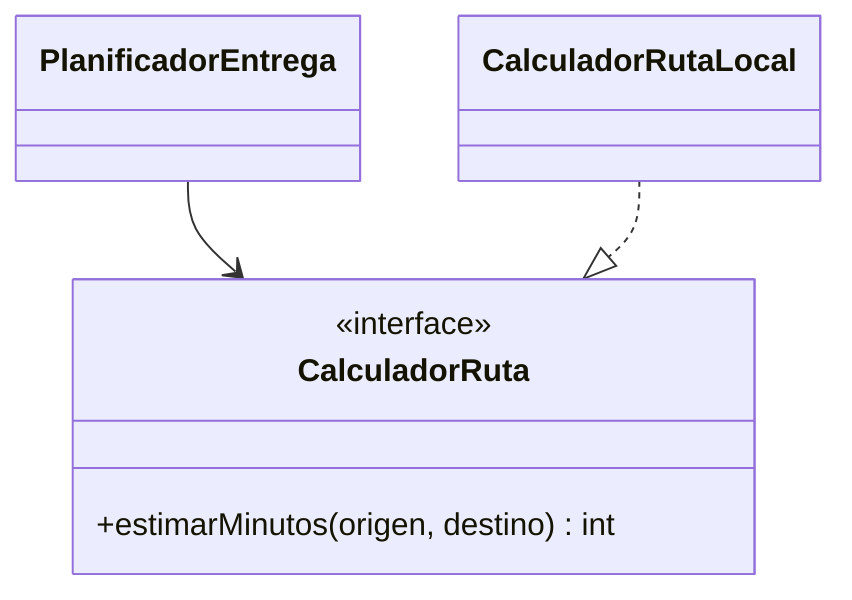

# Módulo 1: Programación orientada a objetos


## Aprende construyendo

### Tema 1: Clases, objetos, constructores y encapsulación

**Conceptos clave:** identidad, estado válido, comportamiento y protección de invariantes.

Una clase define el contrato y la implementación de un tipo; un objeto es una instancia concreta creada a partir de esa definición. Los campos representan estado y los métodos representan operaciones válidas sobre ese estado. Encapsular no significa únicamente escribir campos `private` y generar getters/setters: significa impedir que el objeto pueda existir en un estado inválido y exponer operaciones con significado de dominio.

El constructor establece las invariantes desde el nacimiento del objeto. Si una guía debe tener identificador y peso positivo, valida allí y no permitas una instancia parcialmente válida que “se complete después”. `this` referencia la instancia actual y permite distinguir un parámetro de un campo con el mismo nombre. Una clase no declara constructor de retorno; si se escribe `void Guia(...)`, se creó un método ordinario y Java seguirá usando otro constructor disponible.

```java
package academia.entregas;

import java.util.Objects;

public final class Guia {
    private final String numero;
    private final double pesoKg;

    public Guia(String numero, double pesoKg) {
        this.numero = Objects.requireNonNull(numero, "numero obligatorio");
        if (numero.isBlank()) throw new IllegalArgumentException("numero vacío");
        if (pesoKg <= 0 || pesoKg > 50) {
            throw new IllegalArgumentException("peso fuera del rango (0, 50]");
        }
        this.pesoKg = pesoKg;
    }

    public String numero() { return numero; }
    public double pesoKg() { return pesoKg; }

    public boolean requiereManejoEspecial() {
        return pesoKg > 25;
    }
}
```

Guarda esta clase en `src/main/java/academia/entregas/Guia.java`. Crea `src/test/java/academia/entregas/GuiaTest.java` con un caso válido y casos para número vacío, peso cero y peso mayor de 50. El resultado esperado es que ningún consumidor pueda construir una `Guia` inválida, sin depender de recordar una llamada posterior a `validar()`.

**Decisión:** prefiere composición antes que herencia cuando un objeto “tiene” una capacidad en vez de “ser” una especialización que respeta el contrato completo del padre. No añadas setters a campos inmutables solo por costumbre; agrega una operación con nombre de dominio cuando exista una transición válida.

**Analogía:** una clase es el reglamento de admisión y operación de una bodega; el constructor controla qué entra y los métodos definen las operaciones permitidas, no solamente la forma exterior del edificio.

**¿Por qué es importante?** Si una clase protege sus invariantes, el resto del sistema puede confiar en sus objetos y deja de repetir validaciones defensivas después de cada operación.

#### Construcción RutaFlow: una guía siempre válida

Añade `Guia.java` al proyecto acumulativo del módulo anterior y crea `src/main/java/academia/entregas/GuiaDemo.java`. En su `main`, construye `new Guia("RF-1001", 12.5)` e imprime número, peso y si requiere manejo especial. Ejecuta `javac -d out src/main/java/academia/entregas/Guia.java src/main/java/academia/entregas/GuiaDemo.java` y `java -cp out academia.entregas.GuiaDemo`; el resultado esperado contiene `RF-1001`, `12.5` y `false`.

Provoca dos fallos: número vacío y peso `0`. Debes ver `IllegalArgumentException` con el mensaje de la invariante incumplida. Modifica después el límite de manejo especial mediante una constante con nombre y crea una segunda guía de 30 kg para comprobar `true`. No agregues un setter de peso: si el negocio permite corregirlo, diseña una operación que vuelva a validar el nuevo valor. RutaFlow usará `Guia` como raíz inicial del dominio.

### Tema 2: Herencia y sobreescritura

**Conceptos clave:** `extends`, `@Override`, polimorfismo de subtipo.

`class Perro extends Animal` establece que `Perro` hereda todos los miembros no privados de `Animal`, pudiendo además sobreescribir (`@Override`) el comportamiento de métodos heredados para especializarlo: `Animal` define `hablar()` devolviendo `"..."`, y `Perro` sobreescribe ese mismo método para devolver `"Guau"`, de modo que invocar `hablar()` sobre una referencia de tipo `Animal` que en realidad apunta a un objeto `Perro` en tiempo de ejecución invoca la versión sobreescrita de `Perro`, no la de `Animal`, un comportamiento llamado polimorfismo de subtipo: el método que efectivamente se ejecuta se determina por el tipo real del objeto en tiempo de ejecución, no por el tipo declarado de la variable que lo referencia.

La anotación `@Override` no es estrictamente obligatoria para que la sobreescritura funcione, pero es una buena práctica fuertemente recomendada: le pide al compilador que verifique que el método efectivamente sobreescribe uno existente en la superclase con la misma firma exacta, detectando en tiempo de compilación errores comunes como escribir mal el nombre del método (creando accidentalmente un método nuevo no relacionado en vez de sobreescribir el esperado) o usar una firma ligeramente distinta a la de la superclase.

#### Enfoque técnico: qué significa `@` en Java

El carácter `@` introduce una **anotación**: metadatos asociados a una declaración o a un uso de tipo. Una anotación no es un comentario y tampoco ejecuta comportamiento por sí sola. Su efecto aparece únicamente cuando alguna herramienta la interpreta: el compilador (`@Override`), un procesador durante el build, una librería que usa reflexión en runtime o un framework como Spring. Por eso escribir una anotación cuyo consumidor no está configurado puede compilar y, aun así, no producir el efecto que la persona esperaba.

Java incluye anotaciones del lenguaje como `@Override`, `@Deprecated`, `@SuppressWarnings`, `@SafeVarargs` y `@FunctionalInterface`. También permite declarar anotaciones propias con `@interface`. `@Target` limita dónde se pueden colocar —clase, método, campo, parámetro o uso de tipo— y `@Retention` decide cuánto tiempo existen: solo en el código fuente (`SOURCE`), dentro del archivo `.class` (`CLASS`) o disponibles mediante reflexión durante la ejecución (`RUNTIME`). Esta decisión importa: un framework que inspecciona anotaciones al ejecutar no puede encontrar una anotación retenida únicamente en el código fuente.

```java
import java.lang.annotation.ElementType;
import java.lang.annotation.Retention;
import java.lang.annotation.RetentionPolicy;
import java.lang.annotation.Target;

@Target(ElementType.METHOD)
@Retention(RetentionPolicy.RUNTIME)
public @interface Auditable {
    String accion();
}

final class EntregaService {
    @Auditable(accion = "confirmar-entrega")
    void confirmar(String entregaId) {
        // La anotación solo describe intención.
        // Un interceptor o componente de auditoría debe interpretarla.
    }
}
```

En este ejemplo, `@Auditable` tiene un elemento obligatorio llamado `accion`. Su retención `RUNTIME` permite que un interceptor la descubra mediante reflexión; `METHOD` impide usarla accidentalmente sobre una clase o un campo. La lógica de auditoría no debe esconder reglas del dominio dentro de la anotación: confirmar una entrega sigue siendo responsabilidad del caso de uso. La anotación sirve para conectar una preocupación transversal —registrar quién realizó una acción— sin mezclar esa infraestructura con la regla principal.

**Error que debes saber diagnosticar:** crear `@Auditable` sin `@Retention(RUNTIME)` y esperar que un interceptor la encuentre. El código compila, pero la consulta por reflexión devuelve que la anotación no existe. Comprueba primero su política de retención, después el `@Target` y finalmente que el procesador, interceptor o framework encargado de interpretarla esté realmente registrado.

**Analogía:** la herencia es como una plantilla base de un formulario que las subclases pueden personalizar, manteniendo la mayoría de los campos originales pero reescribiendo ciertas secciones específicas según sus necesidades particulares; `@Override` es como marcar explícitamente que una sección personalizada efectivamente reemplaza una sección existente de la plantilla original, y no una sección completamente nueva sin relación con la plantilla base.

**¿Por qué es importante?** El polimorfismo de subtipo permite que el mismo código que opera sobre una referencia `Animal` ejecute automáticamente el comportamiento específico de la subclase real en tiempo de ejecución, sin necesidad de conocer de antemano esa subclase concreta.

**Código del ejemplo:**

```java
class Animal {
    String hablar() { return "..."; }
}
class Perro extends Animal {
    @Override
    String hablar() { return "Guau"; }
}
```

#### Construcción RutaFlow: comportamiento polimórfico y anotaciones reales

En vez de animales, crea `src/main/java/academia/entregas/Notificador.java`, `NotificadorCorreo.java` y `NotificadorConsola.java`. Define `String enviar(String guia)` en la clase base y sobrescríbelo con `@Override`. En `NotificacionDemo.java`, guarda ambas implementaciones en un arreglo `Notificador[]` y recórrelo. Compila con `javac -d out src/main/java/academia/entregas/*.java` y ejecuta `java -cp out academia.entregas.NotificacionDemo`; la salida debe cambiar según el objeto real aunque la variable sea del tipo padre.

Escribe mal la firma como `enviar(int guia)` manteniendo `@Override`: el compilador debe indicar que el método no sobrescribe ninguno. Corrige la firma y añade `Auditable.java` en el mismo paquete con retención `RUNTIME`; verifica desde `NotificacionDemo` con `getDeclaredMethod(...).isAnnotationPresent(Auditable.class)`. Cambia la retención a `SOURCE`, predice `false` y compruébalo. Así separas el polimorfismo del mecanismo que interpreta metadatos y evitas creer que `@` ejecuta magia por sí solo.

### Tema 3: Interfaces, clases abstractas y cuándo usar cada una

**Conceptos clave:** contrato sin implementación, comportamiento compartido parcial, múltiple implementación de interfaces.

Una interfaz (`interface Volador { void volar(); }`) define un contrato puro: qué métodos debe tener cualquier clase que la implemente, sin proporcionar ninguna implementación propia por defecto (salvo métodos `default` explícitamente marcados como tales, un caso especial más avanzado), permitiendo que clases completamente no relacionadas entre sí en su jerarquía de herencia (una clase `Pajaro` y una clase `Avion`, por ejemplo, sin ninguna relación de herencia común) implementen el mismo contrato `Volador`, algo que Java permite hacer con múltiples interfaces simultáneamente (`class Pajaro implements Volador, Comestible`), a diferencia de la herencia de clases, donde Java solo permite extender una única superclase.

Una clase abstracta (`abstract class Forma { abstract double area(); void describir() {...} }`) es apropiada en cambio cuando existe comportamiento genuinamente compartido entre subclases relacionadas entre sí (el método `describir()`, con una implementación concreta compartida por todas las subclases de `Forma`), combinado con métodos abstractos que cada subclase concreta debe implementar por su cuenta (`area()`, sin implementación en la clase abstracta, dado que el cálculo específico depende de qué forma geométrica concreta sea cada subclase). La elección entre ambas se resume en si existe comportamiento compartido real que valga la pena centralizar (clase abstracta) frente a un contrato puro que clases potencialmente no relacionadas deben cumplir (interfaz).

**Analogía:** una interfaz es como un contrato de servicio que múltiples empresas completamente distintas y no relacionadas entre sí pueden firmar, comprometiéndose a ofrecer ciertos servicios específicos sin que el contrato les dicte cómo implementarlos internamente; una clase abstracta es como una franquicia que comparte cierta infraestructura y procedimientos comunes reales entre todas sus sucursales, dejando que cada sucursal específica implemente únicamente los detalles particulares de su operación local.

**¿Por qué es importante?** Elegir entre clase abstracta e interfaz según si existe comportamiento compartido real (clase abstracta) o solo un contrato puro (interfaz) produce un diseño de jerarquía de clases más claro y correctamente alineado con la relación real entre los tipos involucrados.

**Código del ejemplo:**

```java
interface Volador {
    void volar();
}
class Pajaro implements Volador {
    public void volar() { System.out.println("Vuela"); }
}

abstract class Forma {
    abstract double area();              // sin implementación: cada subclase la define
    void describir() { System.out.println("Área: " + area()); } // con implementación, compartida
}
```

#### Construcción RutaFlow: intercambiar proveedores sin cambiar el caso de uso

Crea `src/main/java/academia/entregas/CalculadorRuta.java` como interfaz con `int estimarMinutos(String origen, String destino)`. Implementa `CalculadorRutaLocal` con un valor determinista y crea `PlanificadorEntrega`, que recibe la interfaz en su constructor. Este flujo expresa la dependencia correcta:



Compila los tres archivos y un `PlanificadorDemo.java` con `javac -d out src/main/java/academia/entregas/*.java`; ejecuta `java -cp out academia.entregas.PlanificadorDemo` y verifica `Tiempo estimado: 25 min`. Elimina temporalmente la implementación de `estimarMinutos`: el compilador exige implementar el contrato o declarar abstracta la clase. Como modificación, añade una implementación de prueba que devuelva 5 sin tocar `PlanificadorEntrega`. Este incremento prepara RutaFlow para sustituir el cálculo local por un proveedor de mapas sin acoplar el dominio a su SDK.

### Tema 4: Sobrecarga vs sobreescritura, y modificadores de acceso

**Conceptos clave:** misma firma vs distintas firmas, niveles de visibilidad.

La sobrecarga (overload) define múltiples métodos con el mismo nombre pero distintas firmas (distinto número o tipo de parámetros) dentro de la misma clase: `int sumar(int a, int b)` y `double sumar(double a, double b)` son dos métodos distintos que el compilador resuelve según los tipos de los argumentos pasados en cada llamada específica, una decisión tomada en tiempo de compilación; la sobreescritura (override, Tema 2) redefine el comportamiento de un método heredado con exactamente la misma firma en una subclase, una decisión resuelta en tiempo de ejecución según el tipo real del objeto.

Los modificadores de acceso controlan la visibilidad de un miembro de una clase en círculos concéntricos de alcance creciente: `private` restringe el acceso exclusivamente a la propia clase; sin modificador explícito (package-private, el nivel por defecto cuando no se escribe ninguno) permite acceso desde cualquier clase del mismo paquete; `protected` extiende ese acceso también a subclases, incluso si están en otro paquete distinto; `public` permite acceso desde cualquier lugar sin restricción alguna, la misma jerarquía de visibilidad estudiada de forma más general en el Módulo 4 del track de JavaScript sobre encapsulación, aquí con la sintaxis y granularidad específica de Java.

**Analogía:** la sobrecarga es como tener varias entradas distintas a un mismo edificio, cada una diseñada para un tipo distinto de visitante que llega con diferente equipaje; la sobreescritura es como una sucursal específica de una franquicia que decide atender a sus visitantes de una forma particular y distinta a como lo especifica el manual general de la franquicia, sin cambiar el nombre del procedimiento que sigue.

**¿Por qué es importante?** Sobrecarga y sobreescritura resuelven problemas distintos (múltiples formas de invocar un método según sus argumentos, frente a redefinir el comportamiento heredado); los modificadores de acceso controlan con precisión granular quién puede ver y usar cada miembro de una clase.

**Código del ejemplo:**

```java
int sumar(int a, int b) { return a + b; }
double sumar(double a, double b) { return a + b; } // sobrecarga: mismo nombre, firma distinta

// private (solo la clase) < package-private (mismo paquete) < protected (+ subclases) < public (todos)
```

#### Construcción RutaFlow: una API pequeña y deliberada

Crea `src/main/java/academia/entregas/Cotizador.java` con dos sobrecargas: `cotizar(Guia guia)` y `cotizar(Guia guia, BigDecimal descuento)`. Mantén privado `validarDescuento`, deja los métodos de negocio públicos y evita `protected` mientras no exista una extensión legítima. En `CotizadorDemo.java`, invoca ambas firmas. Ejecuta `javac -d out src/main/java/academia/entregas/*.java` y `java -cp out academia.entregas.CotizadorDemo`; la salida esperada muestra una tarifa completa y otra descontada.

Provoca un error de compilación intentando llamar `validarDescuento` desde el demo; el mensaje confirma la frontera de encapsulación. Después crea por accidente dos métodos que solo difieran en el tipo de retorno: Java informa que la firma ya está definida, porque el retorno no participa en la sobrecarga. Elimina esa variante y modifica la API para que un descuento inválido produzca un mensaje de dominio claro. Este diseño mantiene mínima la superficie pública que otros módulos de RutaFlow deberán conservar.

---


## Construcción guiada del capítulo

**Objetivo del laboratorio:** construir una jerarquía de clases con herencia, una interfaz y una clase abstracta.

**Requisitos previos:** Módulo 0 completado.

| Paso | Acción | Código | Explicación |
|---|---|---|---|
| 1 | Construir `Guia` con invariantes en el constructor | Ver Tema 1 | Impide número vacío y peso inválido |
| 2 | Crear `Animal` y `Perro` con `@Override` | Ver Tema 2 | Verifica el polimorfismo de subtipo |
| 3 | Definir `Volador` e implementarla en `Pajaro` | Ver Tema 3 | Contrato puro sin implementación |
| 4 | Crear `Forma` abstracta con `Circulo`/`Cuadrado` | Ver Tema 3 | Comportamiento compartido + métodos abstractos |
| 5 | Sobrecargar `sumar()` con distintas firmas | Ver Tema 4 | Compara con sobreescritura |
| 6 | Aplicar `private`/`protected`/`public` | Ver Tema 4 | Explica cuándo usar cada uno |

**Verificación:** el laboratorio se considera exitoso si invocar un método sobre una referencia `Animal` que apunta a un `Perro` ejecuta correctamente la versión sobreescrita, y si la jerarquía distingue apropiadamente qué comportamiento pertenece a una interfaz frente a una clase abstracta.

**Errores comunes y soluciones**

- **Confundir sobrecarga con sobreescritura.** La sobrecarga define métodos con firmas distintas en la misma clase; la sobreescritura redefine un método heredado con la misma firma exacta.
- **Usar una clase abstracta cuando una interfaz sería más apropiada.** Si no hay comportamiento compartido real entre subclases no relacionadas, prefiere una interfaz.
- **Olvidar `@Override` al sobreescribir un método.** Sin ella, el compilador no verifica que efectivamente estás sobreescribiendo un método existente con la firma correcta.

---
