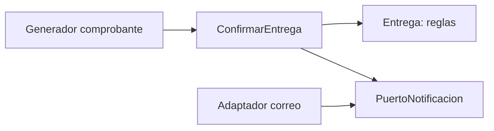

# Módulo 12: Buenas prácticas y patrones de diseño


## Aprende construyendo

### Tema 1: Builder — constructores con muchos parámetros opcionales

#### Paso 1 · Objetivo y preparación
Al finalizar podrás aplicar este diseño desde cero. Prerrequisitos: JDK 21 y un editor. Comprueba java --version.

#### Paso 2 · Contexto y caso real
En un caso real, una tarifa puede tener muchas opciones y una ruta puede cambiar de estrategia; el diseño debe conservar legibilidad y permitir pruebas.

#### Paso 3 · Teoría, modelo mental y analogía
Builder separa construcción de representación; Factory centraliza creación; Strategy intercambia algoritmos por contrato. SOLID son heurísticas para reducir acoplamiento, no reglas para añadir clases sin necesidad. La analogía es un menú: ofrece combinaciones válidas sin obligar al cliente a conocer la cocina.

#### Paso 4 · Demostración guiada desde cero
Parte de una carpeta vacía:
```bash
mkdir ejemplo-java-m12
cd ejemplo-java-m12
mkdir -p src/main/java/com/example
```
Crea src/main/java/com/example/Delivery.java con un Builder y una Strategy de tarifa; compila con javac -d out y ejecuta.

#### Paso 5 · Práctica guiada
Pista: elimina deliberadamente un valor obligatorio para provocar un fallo deliberado de validación; lee el mensaje y corrígelo. Resultado esperado: objeto válido y estrategia seleccionada.

#### Paso 6 · Práctica independiente
Compara una solución directa con Builder/Factory, mide clases creadas y justifica cuándo no usar un patrón; añade pruebas de sustitución.

#### Paso 7 · Cierre y evidencia
Guarda código, salida y decisión; como siguiente paso estudia arquitectura. Errores comunes: patrón por moda, interfaces vacías, Builder mutable compartido y violar sustitución. Fuentes oficiales: https://refactoring.guru/design-patterns y https://dev.java/learn/classes-objects/.
**¿Por qué es importante?** Porque los patrones son vocabulario para resolver problemas, no plantillas obligatorias.
**Evidencia de aprendizaje:** entrega dos diseños comparados, prueba de fallo y justificación.
**Conceptos clave:** encadenamiento fluido, evitar confusión de orden de argumentos.

Un constructor con muchos parámetros, varios de ellos opcionales (`new Pedido("Ana", "Laptop", 2, null, true, false, 15.5, ...)`), es propenso a errores de uso: es fácil confundir el orden de los argumentos posicionales, especialmente cuando varios comparten el mismo tipo (¿cuál booleano corresponde a qué opción específica?), y no queda ninguna indicación clara en el sitio de la llamada de qué representa cada valor individual sin consultar constantemente la firma del constructor. El patrón Builder (`Pedido pedido = Pedido.builder().cliente("Ana").producto("Laptop").cantidad(2).build();`) resuelve este problema encadenando llamadas a métodos con nombres descriptivos, uno por cada campo que se desea establecer, en el orden que resulte más natural para quien construye el objeto, omitiendo directamente cualquier campo opcional que no aplique en ese caso específico, sin necesidad de pasar `null` o valores por defecto explícitos como marcadores de posición para cada campo omitido.

Esta legibilidad mejorada es particularmente valiosa cuando el número de campos es considerable y muchos son genuinamente opcionales, dado que el código resultante en el sitio de la llamada se vuelve autoexplicativo (`.cliente("Ana").producto("Laptop")` deja claro exactamente qué representa cada valor, sin ambigüedad posicional), a diferencia de un constructor tradicional con muchos parámetros posicionales, donde esa claridad depende completamente de que quien lee el código recuerde o consulte constantemente el orden exacto de la firma.

**Analogía:** un constructor con muchos parámetros posicionales es como llenar un formulario sin ninguna etiqueta en sus casillas, donde el orden exacto de llenado importa críticamente y es fácil confundir una casilla con otra; un Builder es como un formulario con cada campo claramente etiquetado por su nombre, donde simplemente se completan las casillas relevantes en cualquier orden natural, dejando en blanco las que no aplican, sin riesgo de confusión.

**¿Por qué es importante?** El patrón Builder evita la confusión de orden de argumentos posicionales de un constructor con muchos parámetros, especialmente cuando varios son opcionales o comparten el mismo tipo.

**Código del ejemplo:**

```java
Pedido pedido = Pedido.builder()
    .cliente("Ana")
    .producto("Laptop")
    .cantidad(2)
    .build();
```

### Tema 2: Factory y Strategy

#### Paso 1 · Objetivo y preparación
Al finalizar podrás aplicar este diseño desde cero. Prerrequisitos: JDK 21 y un editor. Comprueba java --version.

#### Paso 2 · Contexto y caso real
En un caso real, una tarifa puede tener muchas opciones y una ruta puede cambiar de estrategia; el diseño debe conservar legibilidad y permitir pruebas.

#### Paso 3 · Teoría, modelo mental y analogía
Builder separa construcción de representación; Factory centraliza creación; Strategy intercambia algoritmos por contrato. SOLID son heurísticas para reducir acoplamiento, no reglas para añadir clases sin necesidad. La analogía es un menú: ofrece combinaciones válidas sin obligar al cliente a conocer la cocina.

#### Paso 4 · Demostración guiada desde cero
Parte de una carpeta vacía:
```bash
mkdir ejemplo-java-m12
cd ejemplo-java-m12
mkdir -p src/main/java/com/example
```
Crea src/main/java/com/example/Delivery.java con un Builder y una Strategy de tarifa; compila con javac -d out y ejecuta.

#### Paso 5 · Práctica guiada
Pista: elimina deliberadamente un valor obligatorio para provocar un fallo deliberado de validación; lee el mensaje y corrígelo. Resultado esperado: objeto válido y estrategia seleccionada.

#### Paso 6 · Práctica independiente
Compara una solución directa con Builder/Factory, mide clases creadas y justifica cuándo no usar un patrón; añade pruebas de sustitución.

#### Paso 7 · Cierre y evidencia
Guarda código, salida y decisión; como siguiente paso estudia arquitectura. Errores comunes: patrón por moda, interfaces vacías, Builder mutable compartido y violar sustitución. Fuentes oficiales: https://refactoring.guru/design-patterns y https://dev.java/learn/classes-objects/.
**¿Por qué es importante?** Porque los patrones son vocabulario para resolver problemas, no plantillas obligatorias.
**Evidencia de aprendizaje:** entrega dos diseños comparados, prueba de fallo y justificación.
**Conceptos clave:** creación centralizada según un criterio, algoritmos intercambiables sin modificar el código consumidor.

Una Factory centraliza la lógica de decidir qué implementación concreta de una interfaz crear según cierto criterio (`NotificadorFactory.crear("email")` devolviendo un `EmailNotificador`, o `NotificadorFactory.crear("sms")` devolviendo un `SmsNotificador`, ambos implementando la misma interfaz `Notificador`), centralizando esa lógica de decisión en un único lugar en vez de dispersarla en cada punto del código que necesita crear una de esas implementaciones, facilitando además agregar un nuevo tipo de notificador en el futuro modificando únicamente la Factory, sin tocar el código que consume las notificaciones ya creadas.

Strategy encapsula un algoritmo intercambiable detrás de una interfaz común (`interface CalculadoraDescuento { double calcular(double precio); }`, con implementaciones concretas como `DescuentoNavidad`), permitiendo que el código que usa esa estrategia (`double precioFinal = estrategia.calcular(precioOriginal);`) permanezca completamente ajeno a cuál implementación específica de descuento está actualmente activa, delegando esa decisión a quien configura o inyecta la estrategia concreta a usar en cada contexto, sin que el código consumidor necesite ninguna lógica condicional propia (`if`/`switch`) para decidir qué algoritmo aplicar en cada caso.

**Analogía:** una Factory es como un departamento de compras centralizado que decide, según el tipo de pedido, a qué proveedor específico contactar, sin que cada departamento de la empresa que necesita un producto tenga que conocer y decidir individualmente entre todos los proveedores posibles; Strategy es como intercambiar el motor de un vehículo modular sin que el resto del vehículo necesite saber ni importarle cuál motor específico está instalado en cada momento, mientras cumpla con la misma interfaz de conexión esperada.

**¿Por qué es importante?** Factory centraliza la lógica de creación según un criterio, facilitando agregar nuevas implementaciones sin tocar el código consumidor; Strategy permite intercambiar algoritmos completos sin que el código que los usa necesite lógica condicional propia para elegir entre ellos.

**Código del ejemplo:**

```java
interface Notificador { void enviar(String mensaje); }
class NotificadorFactory {
    static Notificador crear(String tipo) {
        return switch (tipo) {
            case "email" -> new EmailNotificador();
            case "sms" -> new SmsNotificador();
            default -> throw new IllegalArgumentException("Tipo desconocido");
        };
    }
}

interface CalculadoraDescuento { double calcular(double precio); }
class DescuentoNavidad implements CalculadoraDescuento {
    public double calcular(double precio) { return precio * 0.8; }
}
double precioFinal = estrategia.calcular(precioOriginal); // no sabe (ni le importa) cuál estrategia está activa
```

### Tema 3: SOLID y cuándo NO aplicar un patrón

#### Paso 1 · Objetivo y preparación
Al finalizar podrás aplicar este diseño desde cero. Prerrequisitos: JDK 21 y un editor. Comprueba java --version.

#### Paso 2 · Contexto y caso real
En un caso real, una tarifa puede tener muchas opciones y una ruta puede cambiar de estrategia; el diseño debe conservar legibilidad y permitir pruebas.

#### Paso 3 · Teoría, modelo mental y analogía
Builder separa construcción de representación; Factory centraliza creación; Strategy intercambia algoritmos por contrato. SOLID son heurísticas para reducir acoplamiento, no reglas para añadir clases sin necesidad. La analogía es un menú: ofrece combinaciones válidas sin obligar al cliente a conocer la cocina.

#### Paso 4 · Demostración guiada desde cero
Parte de una carpeta vacía:
```bash
mkdir ejemplo-java-m12
cd ejemplo-java-m12
mkdir -p src/main/java/com/example
```
Crea src/main/java/com/example/Delivery.java con un Builder y una Strategy de tarifa; compila con javac -d out y ejecuta.

#### Paso 5 · Práctica guiada
Pista: elimina deliberadamente un valor obligatorio para provocar un fallo deliberado de validación; lee el mensaje y corrígelo. Resultado esperado: objeto válido y estrategia seleccionada.

#### Paso 6 · Práctica independiente
Compara una solución directa con Builder/Factory, mide clases creadas y justifica cuándo no usar un patrón; añade pruebas de sustitución.

#### Paso 7 · Cierre y evidencia
Guarda código, salida y decisión; como siguiente paso estudia arquitectura. Errores comunes: patrón por moda, interfaces vacías, Builder mutable compartido y violar sustitución. Fuentes oficiales: https://refactoring.guru/design-patterns y https://dev.java/learn/classes-objects/.
**¿Por qué es importante?** Porque los patrones son vocabulario para resolver problemas, no plantillas obligatorias.
**Evidencia de aprendizaje:** entrega dos diseños comparados, prueba de fallo y justificación.
**Conceptos clave:** responsabilidad única, sobre-ingeniería evitable.

El principio de responsabilidad única (la "S" de SOLID) es, en la práctica, el más fácil de violar sin notarlo gradualmente con el tiempo: una clase `Pedido` que originalmente solo modelaba los datos de un pedido, pero que con el tiempo acumuló también la lógica de enviar emails de confirmación y de generar PDFs de factura, tiene en realidad tres razones distintas y no relacionadas para cambiar (un cambio en el modelo de datos del pedido, un cambio en cómo se envían emails, un cambio en cómo se generan PDFs), cada una debería justificar modificar una clase distinta y separada (`Pedido`, `EmailService`, `PdfGenerator`), en vez de acumularse todas en la misma clase original, que termina acoplando responsabilidades sin relación real entre sí.

Reconocer cuándo NO aplicar un patrón de diseño es una habilidad igualmente importante que saber aplicarlos: si una Factory solo tiene un único caso posible (un `if` con una única rama, sin ninguna perspectiva realista de que se agregue una segunda implementación alguna vez), o si un Strategy nunca tendrá genuinamente una segunda implementación alternativa real en el futuro previsible, introducir ese patrón agrega una capa de indirección (una interfaz, una clase de Factory) sin ningún beneficio real a cambio, dado que no existe la variabilidad que esos patrones están diseñados específicamente para gestionar; en esos casos, código simple y directo, sin la indirección adicional, es preferible a una flexibilidad teórica que en la práctica nunca llega a usarse.

**Analogía:** una clase que viola la responsabilidad única es como una persona con tres trabajos completamente distintos y no relacionados entre sí, donde un cambio en las condiciones de cualquiera de los tres trabajos afecta inevitablemente a la misma persona, aunque los otros dos trabajos no tengan ninguna relación real con ese cambio específico; aplicar un patrón sin necesidad real es como instalar un sistema de intercambio modular elaborado para una pieza que nunca, en la práctica, necesitará intercambiarse por otra alternativa distinta.

**¿Por qué es importante?** Separar responsabilidades no relacionadas en clases distintas (principio de responsabilidad única) facilita el mantenimiento aislado de cada una; reconocer cuándo un patrón no aporta beneficio real evita la indirección innecesaria de una flexibilidad que nunca se usa en la práctica.

**Diagrama:**



---


## Construcción guiada del capítulo

**Objetivo del laboratorio:** refactorizar un módulo propio aplicando al menos dos patrones de diseño justificados por una necesidad real.

**Requisitos previos:** Módulos 0-11 completados.

| Paso | Acción | Código | Explicación |
|---|---|---|---|
| 1 | Implementar Builder para un objeto con campos opcionales | Ver Tema 1 | Evita confusión de orden de argumentos |
| 2 | Implementar una Factory según un parámetro | Ver Tema 2 | Centraliza la lógica de creación |
| 3 | Implementar Strategy para un algoritmo intercambiable | Ver Tema 2 | Sin modificar el código consumidor |
| 4 | Refactorizar una clase que viola SRP | Ver Tema 3 | Separa sus responsabilidades distintas |
| 5 | Identificar un caso de sobre-ingeniería en tu propio código | Ver Tema 3 | Documenta por qué el patrón no aportaría valor ahí |

**Verificación:** el laboratorio se considera exitoso si los patrones aplicados resuelven un problema real y concreto del código (no solo se aplican por aplicar), y si el ejemplo de sobre-ingeniería identificado está correctamente justificado con una razón específica.

**Errores comunes y soluciones**

- **Aplicar un patrón sin una necesidad real detrás.** Verifica primero que existe genuina variabilidad o complejidad que el patrón resuelve.
- **Dejar una clase acumulando responsabilidades no relacionadas con el tiempo.** Revisa periódicamente si una clase tiene más de una razón real para cambiar.
- **Confundir Factory con Strategy.** Factory decide qué crear; Strategy encapsula un algoritmo intercambiable ya creado.

---
