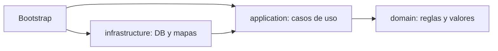

# Módulo 13: Proyecto integrador


## Aprende construyendo

### Tema 1: Arquitectura por capas del proyecto integrador

#### Paso 1 · Objetivo y preparación
Al finalizar podrás ensamblar un proyecto Java desde cero. Prerrequisitos: JDK 21, Maven, Docker y un editor.

#### Paso 2 · Contexto y caso real
En un caso real, una aplicación de entregas combina dominio, persistencia, concurrencia y pruebas; el estudiante debe saber dónde colocar cada archivo y cómo verificarlo.

#### Paso 3 · Teoría, modelo mental y analogía
Una arquitectura por capas separa entrada, caso de uso, dominio y adaptadores. Concurrencia exige límites; testing demuestra invariantes; el build fija el artefacto. La analogía es una central completa: recepción, planificación, almacén y salida tienen responsabilidades y métricas distintas.

#### Paso 4 · Demostración guiada desde cero
Parte de una carpeta vacía:
```bash
mkdir ejemplo-java-m13
cd ejemplo-java-m13
mvn -B archetype:generate -DgroupId=com.example -DartifactId=delivery -DarchetypeArtifactId=maven-archetype-quickstart -DinteractiveMode=false
cd delivery
mvn test
# El código vive en src/main/java y las pruebas en src/test/java.
```
Crea src/main/java/com/example/delivery/domain/Delivery.java, paquetes application y adapter, y una prueba en src/test/java; ejecuta el build.

#### Paso 5 · Práctica guiada
Pista: rompe deliberadamente la regla de negocio para provocar un fallo deliberado de test, lee la aserción y corrígela. Resultado esperado: build verde y estructura documentada.

#### Paso 6 · Práctica independiente
Añade persistencia en memoria, un ExecutorService limitado, pruebas unitarias e integración; documenta un escenario de recuperación.

#### Paso 7 · Cierre y evidencia
Guarda árbol, comandos, pruebas y README; como siguiente paso aplica la revisión a Spring Boot. Errores comunes: lógica en controllers, hilos sin cierre, tests acoplados y dependencias flotantes. Fuentes oficiales: https://maven.apache.org/guides/ y https://dev.java/learn/.
**¿Por qué es importante?** Porque integrar las piezas demuestra que puedes mantener un sistema y no solo completar ejercicios aislados.
**Evidencia de aprendizaje:** entrega proyecto, pruebas, build reproducible y retrospectiva.
**Conceptos clave:** separación dominio/servicio/infraestructura, cohesión por responsabilidad.

El proyecto integrador organiza el código en capas claramente separadas: `dominio/` contiene los modelos de datos inmutables usando records y sealed interfaces (Módulo 7), representando los conceptos centrales del negocio sin ninguna dependencia hacia detalles de infraestructura; `servicio/` contiene la lógica de negocio propiamente dicha, incluyendo el procesamiento concurrente de tareas usando virtual threads (Módulo 5) para operaciones con I/O; `infraestructura/` contiene los detalles concretos de persistencia y clientes externos, la capa más propensa a cambiar según decisiones técnicas específicas (qué base de datos usar, qué API externa consumir) sin que ese cambio deba afectar la lógica de negocio central en `servicio/`.

Esta separación por capas refleja el mismo principio de cohesión y responsabilidad única estudiado en el Módulo 12: cada capa tiene una razón de cambio distinta y bien delimitada (el modelo de dominio cambia cuando cambian los conceptos del negocio en sí; el servicio cambia cuando cambian las reglas de negocio; la infraestructura cambia cuando cambian las decisiones técnicas de implementación), y estructurar el código según esas fronteras facilita razonar sobre qué parte del sistema se ve afectada por un cambio específico, sin tener que rastrear ese impacto a través de código mezclado sin una separación clara de responsabilidades.

**Analogía:** la arquitectura por capas es como una empresa organizada en departamentos con responsabilidades claramente delimitadas: diseño de producto (dominio), operaciones (servicio) y logística externa (infraestructura), donde un cambio en el proveedor logístico externo no debería requerir que el departamento de diseño de producto cambie nada de su propio trabajo.

**¿Por qué es importante?** Separar el código en capas con responsabilidades bien delimitadas (dominio, servicio, infraestructura) facilita razonar sobre el impacto de un cambio específico, aislando las razones de cambio de cada capa.

**Diagrama:**



#### Construcción RutaFlow: esqueleto ejecutable

En `settings.gradle.kts` conserva los módulos domain, application, infrastructure y cli. Crea `RegistrarGuia` en application, `Guia` en domain y `RepositorioGuiasEnMemoria` en infrastructure; `Main.java` ensambla por constructor. Ejecuta `./gradlew :rutaflow-cli:run`; la salida esperada confirma `RF-1001` sin que domain importe Gradle, Jackson, SQL o logging.

Introduce accidentalmente un import de infrastructure en domain y comprueba que el grafo de módulos impida compilar. Corrige definiendo el puerto en application. Como modificación, sustituye el repositorio en memoria por otro fake sin tocar el caso de uso. Esta estructura es inicial, no una regla universal: si dos capas solo delegan sin decisión ni frontera, simplifica.

### Tema 2: Integrando concurrencia, modelado y testing

#### Paso 1 · Objetivo y preparación
Al finalizar podrás ensamblar un proyecto Java desde cero. Prerrequisitos: JDK 21, Maven, Docker y un editor.

#### Paso 2 · Contexto y caso real
En un caso real, una aplicación de entregas combina dominio, persistencia, concurrencia y pruebas; el estudiante debe saber dónde colocar cada archivo y cómo verificarlo.

#### Paso 3 · Teoría, modelo mental y analogía
Una arquitectura por capas separa entrada, caso de uso, dominio y adaptadores. Concurrencia exige límites; testing demuestra invariantes; el build fija el artefacto. La analogía es una central completa: recepción, planificación, almacén y salida tienen responsabilidades y métricas distintas.

#### Paso 4 · Demostración guiada desde cero
Parte de una carpeta vacía:
```bash
mkdir ejemplo-java-m13
cd ejemplo-java-m13
mvn -B archetype:generate -DgroupId=com.example -DartifactId=delivery -DarchetypeArtifactId=maven-archetype-quickstart -DinteractiveMode=false
cd delivery
mvn test
```
Crea src/main/java/com/example/delivery/domain/Delivery.java, paquetes application y adapter, y una prueba en src/test/java; ejecuta el build.

#### Paso 5 · Práctica guiada
Pista: rompe deliberadamente la regla de negocio para provocar un fallo deliberado de test, lee la aserción y corrígela. Resultado esperado: build verde y estructura documentada.

#### Paso 6 · Práctica independiente
Añade persistencia en memoria, un ExecutorService limitado, pruebas unitarias e integración; documenta un escenario de recuperación.

#### Paso 7 · Cierre y evidencia
Guarda árbol, comandos, pruebas y README; como siguiente paso aplica la revisión a Spring Boot. Errores comunes: lógica en controllers, hilos sin cierre, tests acoplados y dependencias flotantes. Fuentes oficiales: https://maven.apache.org/guides/ y https://dev.java/learn/.
**¿Por qué es importante?** Porque integrar las piezas demuestra que puedes mantener un sistema y no solo completar ejercicios aislados.
**Evidencia de aprendizaje:** entrega proyecto, pruebas, build reproducible y retrospectiva.
**Conceptos clave:** procesamiento paralelo con resultado modelado como sealed interface, tests aislados con mocks.

El procesamiento concurrente del proyecto integrador combina virtual threads (Módulo 5) para procesar múltiples tareas en paralelo con un modelo de resultado expresado como sealed interface (Módulo 7): `sealed interface ResultadoProcesamiento permits Exito, Error {}`, con `record Exito(String datos) implements ResultadoProcesamiento {}` y `record Error(String motivo) implements ResultadoProcesamiento {}`, permitiendo que cada tarea procesada concurrentemente devuelva explícitamente si tuvo éxito o falló, sin recurrir a lanzar excepciones para el caso de fallo esperado (un fallo individual de una tarea entre muchas no debería necesariamente interrumpir el procesamiento del resto), y con el compilador garantizando, mediante pattern matching exhaustivo (Módulo 7), que el código que procesa esos resultados maneje explícitamente ambos casos posibles.

Cada tarea se envía a un `Executors.newVirtualThreadPerTaskExecutor()` (Módulo 5), permitiendo procesar un volumen considerable de tareas concurrentemente incluso si cada una involucra I/O bloqueante, sin el costo de memoria que threads de plataforma tradicionales impondrían para ese mismo volumen; la lógica de negocio que decide cómo procesar cada tarea individual se prueba de forma aislada con JUnit 5 y Mockito (Módulo 9), mockeando cualquier dependencia externa (como un repositorio o cliente de red) para verificar la lógica de decisión en sí, sin depender de infraestructura real durante las pruebas.

**Analogía:** este procesamiento integrado es como una línea de producción con múltiples estaciones de trabajo simultáneas (virtual threads) donde cada producto terminado se etiqueta explícitamente como aprobado o rechazado (el sealed interface de resultado), con inspectores de calidad (los tests) que verifican la lógica de cada estación de forma aislada, usando maquetas de las materias primas externas (los mocks) en vez de depender de que la cadena de suministro real esté disponible durante cada inspección de calidad.

**¿Por qué es importante?** Modelar el resultado de un procesamiento concurrente como una sealed interface permite manejar explícitamente éxito y error sin recurrir a excepciones para casos esperados, con el compilador garantizando el manejo exhaustivo de ambos casos; probar la lógica de negocio aislada con mocks permite verificarla sin depender de infraestructura real.

**Código del ejemplo:**

```java
sealed interface ResultadoProcesamiento permits Exito, Error {}
record Exito(String datos) implements ResultadoProcesamiento {}
record Error(String motivo) implements ResultadoProcesamiento {}

List<ResultadoProcesamiento> resultados;
try (var executor = Executors.newVirtualThreadPerTaskExecutor()) {
    resultados = tareas.stream()
        .map(t -> executor.submit(() -> procesar(t)))
        .map(this::obtenerResultado)
        .toList();
}
```

#### Construcción RutaFlow: lote parcial y observable

Crea `rutaflow-application/src/main/java/.../ProcesarLote.java`, recibe una lista de guías y un puerto de consulta, y devuelve un resultado sealed por elemento conservando el orden. Usa virtual threads dentro de un alcance cerrado y limita llamadas externas con un semáforo. Ejecuta `./gradlew :rutaflow-application:test`; deben comprobarse lote totalmente exitoso, un fallo parcial y cancelación/timeout.

Haz que una tarea lance excepción sin traducirla y observa cómo `Future.get` la envuelve; corrige convirtiendo únicamente fallos esperados a `Error`, dejando bugs visibles. Como modificación, incluye índice y guía en cada resultado y verifica que no se comparta una lista mutable. RutaFlow no reintenta automáticamente operaciones no idempotentes: esa política pertenece al contrato del puerto.

### Tema 3: Build reproducible y cierre del track

#### Paso 1 · Objetivo y preparación
Al finalizar podrás ensamblar un proyecto Java desde cero. Prerrequisitos: JDK 21, Maven, Docker y un editor.

#### Paso 2 · Contexto y caso real
En un caso real, una aplicación de entregas combina dominio, persistencia, concurrencia y pruebas; el estudiante debe saber dónde colocar cada archivo y cómo verificarlo.

#### Paso 3 · Teoría, modelo mental y analogía
Una arquitectura por capas separa entrada, caso de uso, dominio y adaptadores. Concurrencia exige límites; testing demuestra invariantes; el build fija el artefacto. La analogía es una central completa: recepción, planificación, almacén y salida tienen responsabilidades y métricas distintas.

#### Paso 4 · Demostración guiada desde cero
Parte de una carpeta vacía:
```bash
mkdir ejemplo-java-m13
cd ejemplo-java-m13
mvn -B archetype:generate -DgroupId=com.example -DartifactId=delivery -DarchetypeArtifactId=maven-archetype-quickstart -DinteractiveMode=false
cd delivery
mvn test
```
Crea src/main/java/com/example/delivery/domain/Delivery.java, paquetes application y adapter, y una prueba en src/test/java; ejecuta el build.

#### Paso 5 · Práctica guiada
Pista: rompe deliberadamente la regla de negocio para provocar un fallo deliberado de test, lee la aserción y corrígela. Resultado esperado: build verde y estructura documentada.

#### Paso 6 · Práctica independiente
Añade persistencia en memoria, un ExecutorService limitado, pruebas unitarias e integración; documenta un escenario de recuperación.

#### Paso 7 · Cierre y evidencia
Guarda árbol, comandos, pruebas y README; como siguiente paso aplica la revisión a Spring Boot. Errores comunes: lógica en controllers, hilos sin cierre, tests acoplados y dependencias flotantes. Fuentes oficiales: https://maven.apache.org/guides/ y https://dev.java/learn/.
**¿Por qué es importante?** Porque integrar las piezas demuestra que puedes mantener un sistema y no solo completar ejercicios aislados.
**Evidencia de aprendizaje:** entrega proyecto, pruebas, build reproducible y retrospectiva.
**Conceptos clave:** ejecución con un solo comando, Java moderno como reducción de boilerplate.

Configurar el build con Gradle o Maven (Módulo 8) de forma que cualquier persona pueda clonar el repositorio y ejecutar la aplicación completa con un único comando (`./gradlew run` o `mvn compile exec:java`, según la herramienta elegida) elimina la fricción de configuración manual que de otro modo requeriría instrucciones extensas y propensas a desactualizarse sobre cómo preparar el entorno correctamente; declarar explícitamente todas las dependencias necesarias en el archivo de build (en vez de asumir que están disponibles globalmente en el sistema de quien ejecuta el proyecto) garantiza que el build sea reproducible: el mismo resultado exacto sin importar en qué máquina específica se ejecute, siempre que se use la misma versión declarada de cada dependencia.

Java moderno (17 hasta 21) reduce significativamente el boilerplate que históricamente se le criticaba al lenguaje frente a alternativas más recientes, sin sacrificar ninguna de las ventajas fundamentales de la JVM (tipado fuerte verificado en compilación, rendimiento maduro tras décadas de optimización del runtime, y un ecosistema de librerías extremadamente extenso y probado en producción): records eliminan el boilerplate de clases de datos inmutables, pattern matching elimina el boilerplate del casteo manual clásico, y virtual threads eliminan la necesidad de reescribir código en un estilo asíncrono basado en callbacks solo para lograr alta concurrencia con I/O bloqueante — la combinación de estas features hace que Java se sienta hoy tan productivo como cualquier lenguaje más reciente, sin abandonar ninguna de las garantías que hicieron a Java una elección confiable durante décadas de uso en producción a gran escala.

**Analogía:** un build reproducible con un solo comando es como entregar un electrodoméstico completamente ensamblado y listo para enchufar, en vez de una caja de piezas sueltas con instrucciones ambiguas que cada persona podría interpretar y ensamblar de forma ligeramente distinta; las features modernas de Java son como actualizaciones a una herramienta tradicional confiable que eliminan pasos manuales tediosos sin comprometer la solidez fundamental que la hizo confiable durante tanto tiempo.

**¿Por qué es importante?** Un build reproducible ejecutable con un solo comando elimina fricción de configuración manual y garantiza el mismo resultado en cualquier máquina; las features modernas de Java reducen boilerplate histórico sin sacrificar el tipado fuerte ni el rendimiento maduro de la JVM.

**Prueba en terminal:**

```bash
./gradlew run   # o: mvn compile exec:java
# cualquier persona clona el repo y ejecuta con un único comando
```

#### Construcción RutaFlow: clonación limpia como prueba

Completa `academia-java/README.md` con JDK requerido y conserva el arranque en `rutaflow-cli/src/main/java/com/rutaflow/cli/Main.java`. Documenta `./gradlew clean check`, `./gradlew :rutaflow-cli:run` y salida exacta. Genera wrapper, bloqueos y verificación de dependencias. Desde una copia limpia sin caché ejecuta `./gradlew --no-build-cache clean check` y el comando de arranque; el resultado esperado es el mismo hito RutaFlow sin variables secretas para el modo local.

Quita una dependencia declarada y verifica que el build falle, en vez de usar un JAR global del IDE. Como modificación, crea CI con JDK fijo, artefacto y checksum, y prueba el JAR producido, no clases sueltas. Reproducible significa entradas controladas y artefacto trazable; no garantiza bytes idénticos entre sistemas si el build aún incorpora timestamps o herramientas distintas.

---

## Proyecto transversal RutaFlow: Motor de tarifas

RutaFlow conecta este track con una plataforma completa de paquetería. La implementación de referencia está en `examples/rutaflow/java/PricingEngine.java`; se estudia como punto de partida pequeño, no como sistema terminado.

### Capacidad y fundamento

Modela dinero con `BigDecimal`, unidades en nombres y entrada validada. `PricingRule` aplica abierto/cerrado porque existen variantes reales —peso, distancia, zona, contrato—; el motor no conoce detalles de cada regla. `List.copyOf` evita que el llamador cambie reglas después de construir el motor.

### Implementación guiada

1. Copia el contrato y escribe primero casos normales, límite, inválidos y duplicados.
2. Ejecuta la referencia, provoca un fallo y explica el mensaje antes de modificarla.
3. Implementa una mejora pequeña manteniendo nombres de dominio, efectos visibles y errores tipados.
4. Integra con el contrato del track anterior sin compartir tablas, estado mutable ni detalles de framework.
5. Registra la decisión en el README y etiqueta el hito de RutaFlow correspondiente.

### Verificación profesional

Implementa reglas base, sobrepeso y zona remota; prueba bordes, escala y redondeo HALF_EVEN. Añade una regla sin modificar el motor y crea una prueba de contrato que todas las reglas deben cumplir: cargo no negativo, determinista y sin mutar la solicitud.

El capítulo se completa cuando la evidencia permite a otra persona reproducir el flujo y explicar qué garantías ofrece y cuáles todavía no.


## Construcción guiada del capítulo

**Objetivo del laboratorio:** construir la aplicación integradora completa con arquitectura por capas, procesamiento concurrente, tests y build reproducible.

**Requisitos previos:** Módulos 0-12 completados.

| Paso | Acción | Código | Explicación |
|---|---|---|---|
| 1 | Diseñar la arquitectura por capas | Ver Tema 1 | `dominio/`, `servicio/`, `infraestructura/` |
| 2 | Implementar procesamiento con virtual threads | Ver Tema 2 | Modela el resultado como sealed interface |
| 3 | Modelar el dominio con records y sealed interfaces | Módulo 7 | Donde sea apropiado |
| 4 | Escribir tests con JUnit 5 y Mockito | Módulo 9 | Para la lógica de negocio crítica |
| 5 | Configurar el build reproducible | Ver Tema 3 | Ejecutable con un solo comando |

**Verificación:** el laboratorio (y el track completo) se considera exitoso si la aplicación procesa tareas concurrentemente sin condiciones de carrera, si el manejo de éxito/error está modelado explícitamente y verificado exhaustivamente por el compilador, y si cualquier persona puede clonar y ejecutar el proyecto con un único comando documentado.

**Errores comunes y soluciones**

- **Mezclar lógica de dominio con detalles de infraestructura.** Mantén el dominio libre de dependencias hacia infraestructura concreta.
- **Usar excepciones para casos de fallo esperados en procesamiento concurrente masivo.** Modela el resultado como una sealed interface con casos de éxito y error explícitos.
- **Dejar el build sin documentar el comando de ejecución.** Documenta claramente cómo clonar y ejecutar el proyecto con un solo comando.

---
