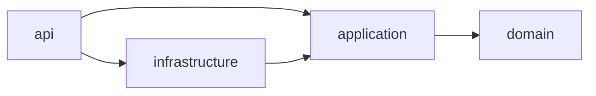

# Módulo 15: Java Master — builds, pruebas y observabilidad

Este capítulo endurece el proyecto multi-módulo del Módulo 14 como producto mantenible. Trabaja sobre ese mismo repositorio; no crea seis demostraciones aisladas.

## Aprende construyendo

### Tema 1: Maven avanzado

#### Paso 1 · Objetivo y preparación
Al finalizar podrás usar Maven Enforcer para bloquear un build con versiones divergentes de una dependencia. Prerrequisitos: JDK 21, Maven y un editor. Verifica java --version y mvn --version.

#### Paso 2 · Contexto y caso real
Dos módulos de un mismo proyecto multi-módulo declaran versiones distintas de Jackson sin que nadie lo note, hasta que en producción una clase serializa con un comportamiento y otra con otro, según qué versión ganó la resolución de dependencias transitivas de Maven.

#### Paso 3 · Teoría, modelo mental y analogía
`dependencyManagement` fija la versión que usarán los módulos sin añadir la dependencia por sí solo; un BOM coordina familias compatibles; Maven Enforcer puede exigir versión de JDK y prohibir dependencias divergentes, deteniendo el build antes de producir un artefacto aparentemente correcto. La analogía: un catálogo de compras corporativo que fija qué versión exacta de cada proveedor está autorizada, en vez de que cada departamento negocie la suya por separado.

#### Paso 4 · Demostración guiada desde cero
Parte de una carpeta vacía:
```bash
mkdir ejemplo-maven-enforcer
cd ejemplo-maven-enforcer
mkdir -p domain/src/main/java app/src/main/java
```
Crea `experiments/maven-multimodulo/pom.xml` como padre con `packaging=pom` y `<modules><module>domain</module><module>app</module></modules>`. Declara en `domain/pom.xml` la versión `2.15.0` de `jackson-databind`, y en `app/pom.xml` la versión `2.17.0` (deliberadamente distinta). Agrega `maven-enforcer-plugin` al padre con la regla `dependencyConvergence`.

#### Paso 5 · Práctica guiada
Pista: ejecuta `./mvnw -pl app -am clean verify` con las versiones divergentes para provocar deliberadamente que Enforcer falle con `Failed while enforcing releasability`; lee el mensaje, que señala las dos versiones en conflicto. Resultado esperado: centralizar la versión de Jackson en un BOM del padre y hacer que ambos módulos hereden de él corrige el fallo.

#### Paso 6 · Práctica independiente
Cambia el requisito de Java del Enforcer a una versión que no tengas instalada (por ejemplo `[22,)`), verifica que el build falle con una causa clara antes de compilar, y genera `mvn help:effective-pom` para documentar de dónde proviene cada configuración heredada.

#### Paso 7 · Cierre y evidencia
Guarda el fallo de Enforcer por versiones divergentes, la corrección con BOM, y el fallo por versión de JDK incompatible; como siguiente paso compara el mismo problema resuelto con Gradle. Errores comunes: usar perfiles de Maven para secretos o reglas de negocio en vez de solo diferencias del proceso de build, y mantener dos builds de producción (Maven y Gradle) en paralelo sin necesidad. Fuentes oficiales: https://maven.apache.org/enforcer/maven-enforcer-plugin/.
**¿Por qué es importante?** Un build empresarial debe detectar versiones divergentes y entornos inválidos antes de producir un artefacto aparentemente correcto.
**Evidencia de aprendizaje:** entrega el fallo de Enforcer, su corrección con BOM y el fallo por JDK incompatible.
**Conceptos clave:** reactor, `dependencyManagement`, BOM, perfiles, Enforcer y wrapper.

Maven distingue declarar una versión administrada de incorporar una dependencia: `dependencyManagement` fija la versión que usarán los módulos cuando declaren el artefacto, pero no lo añade al classpath. Un BOM coordina familias compatibles. El reactor calcula el orden de construcción entre módulos; `mvn -pl api -am verify` construye el módulo elegido y sus dependencias internas.

Los perfiles no deben convertir el build en una configuración secreta por ambiente. Úsalos para diferencias del proceso de construcción, no para contraseñas ni reglas de negocio. Maven Enforcer puede exigir JDK, prohibir dependencias duplicadas o vulnerables y detener un entorno incompatible antes de compilar.

**¿Por qué es importante?** Un build empresarial debe detectar versiones divergentes y entornos inválidos antes de producir un artefacto aparentemente correcto.

#### Aplicación práctica

Crea `experiments/maven-multimodulo/pom.xml` como padre `packaging=pom`, con módulos `domain` y `app`; ubica el arranque en `experiments/maven-multimodulo/app/src/main/java/com/academia/app/Main.java`. Añade `maven-wrapper`, `maven-enforcer-plugin` y JUnit administrado:

```xml
<modules><module>domain</module><module>app</module></modules>
```

Ejecuta `./mvnw -pl app -am clean verify`; el resultado esperado es construir primero domain y luego app con `BUILD SUCCESS`.

Declara dos versiones incompatibles de Jackson y ejecuta `./mvnw dependency:tree`; corrige centralizando la versión mediante BOM. Cambia el requisito de Java a una versión ausente y verifica que Enforcer falle con causa clara. Como modificación, genera `effective-pom` y explica de dónde proviene cada configuración. El proyecto conserva Gradle como build oficial; este experimento compara Maven sin mantener dos builds de producción.

Este mismo Enforcer es el que protegería al Proyecto integrador (Módulo 13) de un despliegue con dependencias silenciosamente divergentes entre módulos.

**Cuándo no usarlo:** en un proyecto de un solo módulo sin riesgo real de divergencia de versiones, Enforcer con reglas estrictas es ceremonia adicional sin beneficio proporcional.

### Tema 2: Gradle y builds reproducibles

#### Paso 1 · Objetivo y preparación
Al finalizar podrás producir un JAR con hash idéntico en dos builds sucesivos usando Gradle. Prerrequisitos: JDK 21, Gradle y un editor. Verifica java --version.

#### Paso 2 · Contexto y caso real
Un pipeline de CI reconstruye el mismo commit dos veces (una en la laptop de un desarrollador, otra en el runner de CI) y obtiene JARs con hashes distintos, porque el manifest incluye un timestamp de compilación que cambia en cada build, dificultando verificar que el artefacto desplegado es realmente el que se probó.

#### Paso 3 · Teoría, modelo mental y analogía
El wrapper fija la versión de Gradle; toolchains selecciona el JDK de compilación; el bloqueo de dependencias registra versiones resueltas. Un build reproducible evita timestamps u orden no determinista. La analogía: una receta de cocina que produce exactamente el mismo plato sin importar quién la siga, porque cada ingrediente y cada paso están fijados sin ambigüedad.

#### Paso 4 · Demostración guiada desde cero
Parte de una carpeta vacía:
```bash
mkdir ejemplo-gradle-reproducible
cd ejemplo-gradle-reproducible
gradle wrapper --gradle-version 8.10
```
En `build.gradle.kts` declara `java { toolchain { languageVersion = JavaLanguageVersion.of(21) } }` y `tasks.withType<Jar> { isPreserveFileTimestamps = false; isReproducibleFileOrder = true }`. Ejecuta `./gradlew clean build` dos veces y compara `sha256sum build/libs/*.jar` entre ambas ejecuciones.

#### Paso 5 · Práctica guiada
Pista: agrega deliberadamente la hora actual (`System.currentTimeMillis()`) al manifest del JAR para provocar hashes distintos entre builds sucesivos; compara los `sha256sum`. Resultado esperado: quitar la hora del manifest (o usar un valor de versión estable) hace que ambos hashes coincidan.

#### Paso 6 · Práctica independiente
Ejecuta `./gradlew --write-verification-metadata sha256 help` para fijar checksums de dependencias, y `./gradlew build --configuration-cache`; si aparece una advertencia de lectura no declarada, identifica la tarea responsable y corrígela.

#### Paso 7 · Cierre y evidencia
Guarda ambos hashes SHA-256 (antes y después de quitar el timestamp), y el archivo de verification metadata generado; como siguiente paso organiza el proyecto en módulos sin ciclos. Errores comunes: subir credenciales a `gradle.properties`, y asumir que la caché de build acelera tareas no deterministas. Fuentes oficiales: https://docs.gradle.org/current/userguide/build_cache.html.
**¿Por qué es importante?** El mismo commit debe producir el mismo contenido y dependencias tanto en una laptop limpia como en CI.
**Evidencia de aprendizaje:** entrega los hashes comparados antes/después de eliminar el timestamp del manifest.
**Conceptos clave:** wrapper, toolchains, dependency locking, verification metadata, build cache y configuration cache.

El wrapper fija la versión de Gradle y toolchains selecciona el JDK de compilación. El bloqueo de dependencias registra versiones resueltas; la verificación valida checksum o firma para detectar artefactos modificados. Un build reproducible también evita timestamps o orden no determinista dentro de archivos y separa entradas/salidas de cada tarea.

La caché acelera solo tareas deterministas. Una tarea que consulta la hora o una variable no declarada puede devolver un resultado viejo. `--configuration-cache` exige que la configuración no conserve objetos no serializables ni lea estado externo arbitrariamente.

**¿Por qué es importante?** El mismo commit debe producir el mismo contenido y dependencias tanto en una laptop limpia como en CI.

#### Aplicación práctica

En `gradle/wrapper/gradle-wrapper.properties` fija la distribución; en `build.gradle.kts` declara toolchain Java 21 y activa JAR reproducible:

```kotlin
java { toolchain { languageVersion = JavaLanguageVersion.of(21) } }
tasks.withType<Jar> { isPreserveFileTimestamps = false; isReproducibleFileOrder = true }
```

Ejecuta `./gradlew dependencies --write-locks`, `./gradlew --write-verification-metadata sha256 help` y dos veces `./gradlew clean build --build-cache`. Compara `sha256sum` del JAR: el resultado esperado es idéntico si entradas y entorno contractual no cambian.

Agrega la hora actual al manifest y observa hashes distintos; elimínala o recibe un valor de versión estable. Como modificación, ejecuta `./gradlew build --configuration-cache` y corrige lecturas no declaradas. No subas credenciales a propiedades de Gradle: el proyecto recibe secretos únicamente en runtime.

Un build reproducible es lo que permite firmar y auditar con confianza el artefacto final del Proyecto integrador (Módulo 13).

**Cuándo no usarlo:** para un prototipo interno que nunca se despliega ni se audita, perseguir reproducibilidad bit a bit del JAR es esfuerzo desproporcionado.

### Tema 3: Proyectos multi-módulo sin ciclos

#### Paso 1 · Objetivo y preparación
Al finalizar podrás escribir una prueba ArchUnit que impida que `domain` dependa de `infrastructure`. Prerrequisitos: JDK 21, Gradle y un editor. Verifica java --version.

#### Paso 2 · Contexto y caso real
Un desarrollador nuevo, bajo presión de tiempo, importa una clase de `infrastructure` (un cliente HTTP) directamente en `domain` para resolver rápido un caso de uso; nadie lo nota en el code review y la arquitectura por capas empieza a erosionarse silenciosamente.

#### Paso 3 · Teoría, modelo mental y analogía
`domain` no conoce frameworks; `application` depende de domain; adaptadores implementan puertos; `api` ensambla. `api(project(...))` expone tipos a consumidores, mientras `implementation` mantiene la dependencia interna oculta. La analogía: un organigrama donde cada departamento solo puede solicitar recursos de los departamentos que tiene explícitamente autorizados, nunca al revés.

#### Paso 4 · Demostración guiada desde cero
Parte de una carpeta vacía:
```bash
mkdir ejemplo-archunit-capas
cd ejemplo-archunit-capas
mkdir -p domain/src/main/java application/src/main/java infrastructure/src/main/java api/src/main/java architecture-tests/src/test/java
```
En `settings.gradle.kts` incluye los cuatro módulos. Crea `architecture-tests/src/test/java/academia/arquitectura/DependencyRulesTest.java` con ArchUnit: una regla `noClasses().that().resideInAPackage("..domain..").should().dependOnClassesThat().resideInAPackage("..infrastructure..")`.

#### Paso 5 · Práctica guiada
Pista: importa deliberadamente una clase de `infrastructure` desde `domain` para provocar que la prueba ArchUnit falle con un mensaje que señala exactamente la clase y el paquete infractor. Resultado esperado: eliminar el import prohibido hace que la prueba de arquitectura vuelva a pasar.

#### Paso 6 · Práctica independiente
Ejecuta `./gradlew projects` y `./gradlew build`, confirma que el grafo de dependencias coincide con el diagrama esperado, y agrega una segunda regla ArchUnit que impida un ciclo entre `application` e `infrastructure`.

#### Paso 7 · Cierre y evidencia
Guarda el fallo de ArchUnit provocado por el import prohibido, su corrección, y la salida de `./gradlew projects` confirmando el grafo sin ciclos; como siguiente paso escribe pruebas unitarias con JUnit y Mockito. Errores comunes: convertir cada paquete en un módulo sin que el límite lo justifique, y dejar convention plugins que expresan decisiones inestables. Fuentes oficiales: https://www.archunit.org/.
**¿Por qué es importante?** Un ciclo entre módulos revela responsabilidades mal ubicadas y dificulta pruebas, despliegue y evolución independiente.
**Evidencia de aprendizaje:** entrega el fallo de ArchUnit, su corrección y el grafo de módulos verificado.
**Conceptos clave:** API frente a implementación, dirección de dependencia, convenciones y pruebas de arquitectura.

Separar módulos solo aporta valor cuando cada límite tiene una responsabilidad y una API pequeña. `domain` no conoce frameworks; `application` depende de domain; adaptadores implementan puertos; `api` ensambla. `api(project(...))` expone tipos a consumidores, mientras `implementation` mantiene la dependencia interna.

Los convention plugins evitan copiar veinte archivos de build, pero deben expresar decisiones comunes estables. Un catálogo de versiones centraliza coordenadas sin convertir cada librería en dependencia global.



**¿Por qué es importante?** Un ciclo entre módulos revela responsabilidades mal ubicadas y dificulta pruebas, despliegue y evolución independiente.

#### Aplicación práctica

En `settings.gradle.kts` incluye los cuatro módulos y crea `build-logic/src/main/kotlin/academia.java-conventions.gradle.kts`. Ejecuta `./gradlew projects` y `./gradlew build`; el grafo debe coincidir con Mermaid. Intenta importar una clase de infraestructura desde domain: el error de compilación esperado protege la dirección.

Como modificación, mueve el contrato requerido a application y haz que infraestructura lo implemente. Añade una prueba ArchUnit en `architecture-tests/src/test/java/.../DependencyRulesTest.java`. No conviertas cada paquete en módulo: el costo solo se justifica cuando el límite necesita propiedad y dependencias distintas.

Esta es la misma estructura de módulos (domain/application/infrastructure/api) que organiza el Proyecto integrador (Módulo 13).

**Cuándo no usarlo:** en un proyecto pequeño de un solo equipo, dividir en cuatro módulos con reglas ArchUnit es sobre-ingeniería; paquetes bien organizados dentro de un módulo bastan hasta que el proyecto crece.

### Tema 4: JUnit 5, Mockito y assertions expresivas

#### Paso 1 · Objetivo y preparación
Al finalizar podrás escribir un test que combine un fake de repositorio y un mock de notificación para un caso de uso real. Prerrequisitos: JDK 21, Gradle y un editor. Verifica java --version.

#### Paso 2 · Contexto y caso real
Un caso de uso `ConfirmarEntrega` debe confirmar la entrega en el repositorio y notificar al cliente; probarlo con una base de datos real y un servicio de notificación real sería lento y frágil, pero probarlo mockeando absolutamente todo (incluida la lógica de dominio) no demostraría nada real.

#### Paso 3 · Teoría, modelo mental y analogía
JUnit ejecuta pruebas; Mockito reemplaza colaboradores; AssertJ expresa resultados legibles. Prefiere objetos reales o fakes simples para repositorios, y mocks solo cuando la interacción (que se llamó a algo) forma parte del contrato observable. La analogía: un ensayo de teatro donde el protagonista (el caso de uso) es real, el escenario (el repositorio) es una maqueta funcional, y solo se verifica que ciertas señales específicas (la notificación) efectivamente se dispararon.

#### Paso 4 · Demostración guiada desde cero
Parte de una carpeta vacía:
```bash
mkdir ejemplo-confirmar-entrega
cd ejemplo-confirmar-entrega
mkdir -p application/src/main/java application/src/test/java
```
Crea `application/src/test/java/academia/application/ConfirmarEntregaTest.java` con un fake en memoria de `RepositorioGuias` (una `Map` simple) y un `@Mock PuertoNotificacion notificacion`. Escribe `@Test void confirma_y_notifica()` que llame `casoDeUso.confirmar("GUIA-1")`, verifique `assertThat(resultado.estado()).isEqualTo(ENTREGADA)` y `verify(notificacion).enviar(any(EventoEntrega.class))`. Ejecuta `./gradlew :application:test`.

#### Paso 5 · Práctica guiada
Pista: elimina deliberadamente la llamada real al fake de repositorio dentro del caso de uso (deja el método vacío) para provocar que el test falle en la aserción de estado, no en la de notificación; observa cuál aserción específica detecta la regresión. Resultado esperado: restaurar la llamada al repositorio corrige el fallo.

#### Paso 6 · Práctica independiente
Agrega `verifyNoMoreInteractions(notificacion)` después del `verify` y observa cómo bloquea un refactor inocuo que agrega una segunda notificación legítima; documenta cuándo esa aserción estricta vale la pena y cuándo no.

#### Paso 7 · Cierre y evidencia
Guarda el test completo, el fallo provocado al vaciar el repositorio y su corrección, y el análisis de `verifyNoMoreInteractions`; como siguiente paso escribe una prueba de integración real con Testcontainers. Errores comunes: mockear la clase bajo prueba en vez de sus dependencias, y verificar cada llamada privada acoplando la suite a la implementación. Fuentes oficiales: https://junit.org/junit5/docs/current/user-guide/ y https://assertj.github.io/doc/.
**¿Por qué es importante?** Una suite rápida pierde valor si permite falsos positivos o se rompe ante cualquier refactor interno.
**Evidencia de aprendizaje:** entrega el test, el fallo detectado por la aserción de estado y el análisis de `verifyNoMoreInteractions`.
**Conceptos clave:** pirámide de pruebas, extensión, fakes, mocks, captors y aserciones de dominio.

JUnit ejecuta pruebas; Mockito reemplaza colaboradores; AssertJ expresa resultados. Un mock no demuestra que SQL, JSON o HTTP funcionen. Prefiere objetos reales para valores y fakes para repositorios sencillos; usa mocks cuando la interacción forma parte del contrato o provocar el caso real resulta lento o inseguro.

Las pruebas deben observar comportamiento. Verificar cada llamada privada acopla la suite a la implementación. Un `ArgumentCaptor` ayuda a inspeccionar un mensaje enviado, pero una aserción sobre el resultado suele ser más estable.

**¿Por qué es importante?** Una suite rápida pierde valor si permite falsos positivos o se rompe ante cualquier refactor interno.

#### Aplicación práctica

Crea `application/src/test/java/com/academia/application/ConfirmarEntregaTest.java`. Usa un fake de repositorio y un mock de `PuertoNotificacion`:

```java
@Test void confirma_y_notifica() {
    var resultado = casoDeUso.confirmar("GUIA-1");
    assertThat(resultado.estado()).isEqualTo(ENTREGADA);
    verify(notificacion).enviar(any(EventoEntrega.class));
}
```

Ejecuta `./gradlew :application:test`; deben pasar casos normal, duplicado y fallo de notificación definido por el contrato.

Elimina la llamada real al repositorio y observa qué prueba detecta la regresión. Añade luego `verifyNoMoreInteractions` indiscriminadamente y comprueba cómo bloquea un refactor inocuo; elimínalo salvo que llamadas extra sean un riesgo real. Como modificación, crea una aserción `assertThat(entrega).isEntregada()` que muestre contexto de dominio al fallar.

Esta suite es la que protege el caso de uso central del Proyecto integrador (Módulo 13) en cada cambio.

**Cuándo no usarlo:** mockear un objeto de valor simple sin comportamiento (un `record` inmutable) es más ceremonia que usar directamente una instancia real.

### Tema 5: Pruebas de integración reproducibles

#### Paso 1 · Objetivo y preparación
Al finalizar podrás probar un repositorio contra una base de datos PostgreSQL real usando Testcontainers. Prerrequisitos: JDK 21, Gradle, Docker en ejecución y un editor. Verifica java --version y docker --version.

#### Paso 2 · Contexto y caso real
Un repositorio probado únicamente con mocks de método nunca detecta que una migración de Flyway tiene un nombre de columna mal escrito, o que un tipo `NUMERIC` de PostgreSQL redondea de forma distinta a como el desarrollador asumió al leerlo como `double`.

#### Paso 3 · Teoría, modelo mental y analogía
Una integración ejercita al menos dos componentes reales y el protocolo entre ellos. Testcontainers levanta una versión explícita de PostgreSQL en Docker; una migración crea el esquema real usado en producción. La analogía: probar un puente construyendo una sección real y pasando peso real sobre ella, en vez de solo calcular en papel que debería soportarlo.

#### Paso 4 · Demostración guiada desde cero
Parte de una carpeta vacía:
```bash
mkdir ejemplo-testcontainers-postgres
cd ejemplo-testcontainers-postgres
mkdir -p infrastructure/src/integrationTest/java infrastructure/src/main/resources/db/migration
```
Crea una migración Flyway `V1__crear_guias.sql` con una tabla `guias(id, monto NUMERIC(10,2), fecha DATE)`. Crea `infrastructure/src/integrationTest/java/academia/infrastructure/RepositorioGuiasIT.java` con `@Container static PostgreSQLContainer<?> db = new PostgreSQLContainer<>("postgres:17-alpine")`, que inserte y recupere una guía verificando que el monto decimal y la fecha coincidan exactamente. Ejecuta `./gradlew :infrastructure:integrationTest`.

#### Paso 5 · Práctica guiada
Pista: rompe deliberadamente el nombre de una columna en la migración (`monto` → `montoo`) para provocar un fallo de SQL real al ejecutar el test contra PostgreSQL real; lee el mensaje de error SQL exacto. Resultado esperado: corregir el nombre de la columna en la migración restaura el test en verde.

#### Paso 6 · Práctica independiente
Agrega WireMock simulando una respuesta HTTP `429 Too Many Requests` seguida de una respuesta exitosa, y verifica que tu cliente HTTP reintenta con un límite acotado en vez de reintentar indefinidamente.

#### Paso 7 · Cierre y evidencia
Guarda el fallo de SQL provocado por el nombre de columna incorrecto, su corrección, y la prueba de reintento acotado con WireMock; como siguiente paso configura logging estructurado para diagnosticar en producción. Errores comunes: reutilizar una base mutable compartida entre pruebas, y usar esperas fijas en vez de esperar una condición observable. Fuentes oficiales: https://testcontainers.com/ y https://wiremock.org/.
**¿Por qué es importante?** Los adaptadores fallan en sus contratos concretos, no en la interfaz idealizada por una prueba unitaria.
**Evidencia de aprendizaje:** entrega el fallo SQL provocado, su corrección y la prueba de reintento con WireMock.
**Conceptos clave:** frontera real, Testcontainers, migraciones, WireMock, aislamiento y contrato.

Una integración ejercita al menos dos componentes reales y el protocolo entre ellos. Testcontainers levanta una versión explícita de PostgreSQL; una migración crea el esquema usado en producción; WireMock simula HTTP a nivel de red. Esto detecta problemas que un mock de método no puede representar: tipos SQL, headers, timeouts y serialización.

Cada prueba debe controlar datos y tiempo. Reutilizar una base mutable compartida introduce dependencia de orden. Esperas fijas vuelven la suite lenta y frágil; espera una condición observable con límite.

**¿Por qué es importante?** Los adaptadores fallan en sus contratos concretos, no en la interfaz idealizada por una prueba unitaria.

#### Aplicación práctica

Crea `infrastructure/src/integrationTest/java/com/academia/infrastructure/RepositorioGuiasIT.java`, configura PostgreSQL Testcontainers y Flyway:

```java
@Container static PostgreSQLContainer<?> db =
    new PostgreSQLContainer<>("postgres:17-alpine");
```

Ejecuta `./gradlew :infrastructure:integrationTest`; el resultado esperado inserta y recupera una guía con decimales y fecha exactos.

Rompe el nombre de una columna en la migración y conserva el error SQL como evidencia; corrige la migración antes de avanzar. Añade WireMock para respuesta 429 seguida de éxito y verifica reintento acotado. Como modificación, ejecuta dos veces y en paralelo para comprobar aislamiento. En CI, separa unitarias rápidas de integración sin omitir estas últimas para publicar.

Estas pruebas de integración son las que dan confianza real al desplegar el Proyecto integrador (Módulo 13) contra su base de datos de producción.

**Cuándo no usarlo:** para lógica de dominio pura sin ningún componente externo real, una prueba de integración con Testcontainers es más lenta y menos útil que una prueba unitaria simple.

### Tema 6: SLF4J, Logback, MDC y logging estructurado

#### Paso 1 · Objetivo y preparación
Al finalizar podrás configurar logging JSON con `traceId` correlacionado y detectar contexto MDC contaminado entre solicitudes. Prerrequisitos: JDK 21, Gradle y un editor. Verifica java --version.

#### Paso 2 · Contexto y caso real
Durante un incidente en producción, un equipo necesita reconstruir exactamente qué pasó con la guía `GUIA-42`, pero los logs no tienen ningún identificador común entre las líneas de las distintas capas que procesaron esa solicitud, obligando a adivinar por timestamp cuáles líneas pertenecen al mismo request.

#### Paso 3 · Teoría, modelo mental y analogía
SLF4J es una fachada; Logback es una implementación. MDC adjunta `traceId` al hilo actual, pero debe limpiarse explícitamente o un pool de hilos puede filtrar contexto de una operación anterior a la siguiente. La analogía: una etiqueta de seguimiento de paquete que viaja adjunta a cada escaneo del envío, pero que debe retirarse al entregar para no confundirse con el siguiente paquete que use la misma cinta transportadora.

#### Paso 4 · Demostración guiada desde cero
Parte de una carpeta vacía:
```bash
mkdir ejemplo-mdc-correlacion
cd ejemplo-mdc-correlacion
mkdir -p api/src/main/resources api/src/main/java/academia/api
```
Crea `api/src/main/resources/logback.xml` con un encoder JSON. Crea `api/src/main/java/academia/api/CorrelationFilter.java` con `try (var ignored = MDC.putCloseable("traceId", traceId)) { chain.doFilter(request, response); }`. Ejecuta `./gradlew :api:run`, procesa dos solicitudes con distinto `traceId` y verifica en los logs los campos `timestamp`, `level`, `traceId` y `message`.

#### Paso 5 · Práctica guiada
Pista: quita deliberadamente el `try-with-resources` y usa `MDC.put(...)` sin `MDC.remove(...)` al final, en un servidor con pool de hilos reutilizados, para provocar que una segunda solicitud procesada por el mismo hilo herede el `traceId` de la primera; observa el `traceId` incorrecto en los logs de la segunda solicitud. Resultado esperado: restaurar `try-with-resources` (que limpia el MDC automáticamente al salir) corrige el contexto contaminado.

#### Paso 6 · Práctica independiente
Agrega un appender en memoria a la configuración de test, escribe una prueba que confirme que ningún campo del log contiene un token o email completo, y verifica que un stack trace de una excepción aparece una sola vez (no una vez por cada capa que la propaga).

#### Paso 7 · Cierre y evidencia
Guarda el `traceId` contaminado provocado por el pool de hilos, su corrección con `try-with-resources`, y la prueba que rechaza datos sensibles en los logs; como siguiente paso ejecuta el laboratorio completo del capítulo. Errores comunes: registrar tokens o documentos de identidad en texto plano, y loguear la misma excepción en cada capa multiplicando ruido. Fuentes oficiales: https://logback.qos.ch/manual/mdc.html.
**¿Por qué es importante?** Durante un incidente se necesita reconstruir una operación sin exponer datos personales ni buscar texto ambiguo entre millones de líneas.
**Evidencia de aprendizaje:** entrega el `traceId` contaminado, su corrección y la prueba de datos sensibles.
**Conceptos clave:** fachada, implementación, niveles, contexto, JSON, datos sensibles y cardinalidad.

SLF4J es una fachada; Logback es una implementación. Parametrizar `log.info("guia={} estado={}", guia, estado)` evita concatenar cuando el nivel está deshabilitado. MDC adjunta `traceId`, `guiaId` o centro al hilo actual, pero debe limpiarse; con pools o virtual threads, un contexto abandonado puede contaminar otra operación.

Logs estructurados producen campos consultables. No registres tokens, direcciones completas ni documentos. Un error debe incluir contexto y excepción una sola vez; registrarlo en cada capa multiplica ruido. Logs complementan métricas y trazas, no las reemplazan.

**¿Por qué es importante?** Durante un incidente se necesita reconstruir una operación sin exponer datos personales ni buscar texto ambiguo entre millones de líneas.

#### Aplicación práctica

Crea `api/src/main/resources/logback.xml` con salida JSON y `api/src/main/java/com/academia/api/CorrelationFilter.java`, que cierre el contexto:

```java
try (var ignored = MDC.putCloseable("traceId", traceId)) {
    chain.doFilter(request, response);
}
```

Ejecuta `./gradlew :api:run`, procesa dos solicitudes y verifica campos `timestamp`, `level`, `traceId`, `guiaId` y `message` sin secretos.

Omite temporalmente el cierre del MDC y ejecuta solicitudes sobre un pool: identifica contexto heredado incorrecto y restáuralo con try-with-resources. Como modificación, añade una prueba con appender en memoria que rechace claves sensibles y confirma que un stack trace aparece una sola vez. El proyecto limita identificadores de alta cardinalidad en métricas, aunque sí puedan vivir controladamente en logs.

Este logging correlacionado es lo que permitiría diagnosticar un incidente real en el Proyecto integrador (Módulo 13) sin adivinar qué líneas pertenecen a qué solicitud.

**Cuándo no usarlo:** en un script de línea de comandos de un solo uso sin concurrencia ni solicitudes paralelas, la correlación con MDC no aporta nada; un `println` es suficiente.

## Construcción guiada del capítulo

Ejecuta `./gradlew clean check integrationTest`, inspecciona dependencias y artefactos, y arranca el proyecto con logging JSON. La entrega incluye hashes reproducibles, grafo de módulos, reportes unitarios/integración y dos logs correlacionados. Si otra persona necesita una configuración manual no documentada, el capítulo aún no está completo.

## Trazabilidad de la auditoría original

- **Maven/Gradle:** los temas 1 y 2 comparan ambos modelos y dejan Gradle como única fuente productiva.
- **Testing:** los temas 4 y 5 separan pruebas unitarias, dobles e integración real.
- **Logging:** el tema 6 implementa SLF4J, Logback, MDC y salida estructurada sin datos sensibles.
