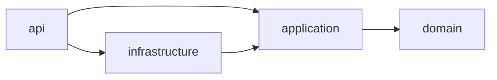

# Módulo 15: Java Master — builds, pruebas y observabilidad

Este capítulo endurece RutaFlow como producto mantenible. Trabaja sobre el repositorio multi-módulo anterior; no crea seis demostraciones aisladas.

## Aprende construyendo

### Tema 1: Maven avanzado

**Conceptos clave:** reactor, `dependencyManagement`, BOM, perfiles, Enforcer y wrapper.

Maven distingue declarar una versión administrada de incorporar una dependencia: `dependencyManagement` fija la versión que usarán los módulos cuando declaren el artefacto, pero no lo añade al classpath. Un BOM coordina familias compatibles. El reactor calcula el orden de construcción entre módulos; `mvn -pl rutaflow-api -am verify` construye el módulo elegido y sus dependencias internas.

Los perfiles no deben convertir el build en una configuración secreta por ambiente. Úsalos para diferencias del proceso de construcción, no para contraseñas ni reglas de negocio. Maven Enforcer puede exigir JDK, prohibir dependencias duplicadas o vulnerables y detener un entorno incompatible antes de compilar.

**¿Por qué es importante?** Un build empresarial debe detectar versiones divergentes y entornos inválidos antes de producir un artefacto aparentemente correcto.

#### Construcción RutaFlow

Crea `experiments/maven-rutaflow/pom.xml` como padre `packaging=pom`, con módulos `domain` y `app`; ubica el arranque en `experiments/maven-rutaflow/app/src/main/java/com/rutaflow/app/Main.java`. Añade `maven-wrapper`, `maven-enforcer-plugin` y JUnit administrado:

```xml
<modules><module>domain</module><module>app</module></modules>
```

Ejecuta `./mvnw -pl app -am clean verify`; el resultado esperado es construir primero domain y luego app con `BUILD SUCCESS`.

Declara dos versiones incompatibles de Jackson y ejecuta `./mvnw dependency:tree`; corrige centralizando la versión mediante BOM. Cambia el requisito de Java a una versión ausente y verifica que Enforcer falle con causa clara. Como modificación, genera `effective-pom` y explica de dónde proviene cada configuración. RutaFlow conserva Gradle como build oficial; este experimento compara Maven sin mantener dos builds de producción.

### Tema 2: Gradle y builds reproducibles

**Conceptos clave:** wrapper, toolchains, dependency locking, verification metadata, build cache y configuration cache.

El wrapper fija la versión de Gradle y toolchains selecciona el JDK de compilación. El bloqueo de dependencias registra versiones resueltas; la verificación valida checksum o firma para detectar artefactos modificados. Un build reproducible también evita timestamps o orden no determinista dentro de archivos y separa entradas/salidas de cada tarea.

La caché acelera solo tareas deterministas. Una tarea que consulta la hora o una variable no declarada puede devolver un resultado viejo. `--configuration-cache` exige que la configuración no conserve objetos no serializables ni lea estado externo arbitrariamente.

**¿Por qué es importante?** El mismo commit debe producir el mismo contenido y dependencias tanto en una laptop limpia como en CI.

#### Construcción RutaFlow

En `gradle/wrapper/gradle-wrapper.properties` fija la distribución; en `build.gradle.kts` declara toolchain Java 21 y activa JAR reproducible:

```kotlin
java { toolchain { languageVersion = JavaLanguageVersion.of(21) } }
tasks.withType<Jar> { isPreserveFileTimestamps = false; isReproducibleFileOrder = true }
```

Ejecuta `./gradlew dependencies --write-locks`, `./gradlew --write-verification-metadata sha256 help` y dos veces `./gradlew clean build --build-cache`. Compara `sha256sum` del JAR: el resultado esperado es idéntico si entradas y entorno contractual no cambian.

Agrega la hora actual al manifest y observa hashes distintos; elimínala o recibe un valor de versión estable. Como modificación, ejecuta `./gradlew build --configuration-cache` y corrige lecturas no declaradas. No subas credenciales a propiedades de Gradle: RutaFlow recibe secretos únicamente en runtime.

### Tema 3: Proyectos multi-módulo sin ciclos

**Conceptos clave:** API frente a implementación, dirección de dependencia, convenciones y pruebas de arquitectura.

Separar módulos solo aporta valor cuando cada límite tiene una responsabilidad y una API pequeña. `rutaflow-domain` no conoce frameworks; `application` depende de domain; adaptadores implementan puertos; `api` ensambla. `api(project(...))` expone tipos a consumidores, mientras `implementation` mantiene la dependencia interna.

Los convention plugins evitan copiar veinte archivos de build, pero deben expresar decisiones comunes estables. Un catálogo de versiones centraliza coordenadas sin convertir cada librería en dependencia global.



**¿Por qué es importante?** Un ciclo entre módulos revela responsabilidades mal ubicadas y dificulta pruebas, despliegue y evolución independiente.

#### Construcción RutaFlow

En `settings.gradle.kts` incluye los cuatro módulos y crea `build-logic/src/main/kotlin/rutaflow.java-conventions.gradle.kts`. Ejecuta `./gradlew projects` y `./gradlew build`; el grafo debe coincidir con Mermaid. Intenta importar una clase de infraestructura desde domain: el error de compilación esperado protege la dirección.

Como modificación, mueve el contrato requerido a application y haz que infraestructura lo implemente. Añade una prueba ArchUnit en `rutaflow-architecture-tests/src/test/java/.../DependencyRulesTest.java`. No conviertas cada paquete en módulo: el costo solo se justifica cuando el límite necesita propiedad y dependencias distintas.

### Tema 4: JUnit 5, Mockito y assertions expresivas

**Conceptos clave:** pirámide de pruebas, extensión, fakes, mocks, captors y aserciones de dominio.

JUnit ejecuta pruebas; Mockito reemplaza colaboradores; AssertJ expresa resultados. Un mock no demuestra que SQL, JSON o HTTP funcionen. Prefiere objetos reales para valores y fakes para repositorios sencillos; usa mocks cuando la interacción forma parte del contrato o provocar el caso real resulta lento o inseguro.

Las pruebas deben observar comportamiento. Verificar cada llamada privada acopla la suite a la implementación. Un `ArgumentCaptor` ayuda a inspeccionar un mensaje enviado, pero una aserción sobre el resultado suele ser más estable.

**¿Por qué es importante?** Una suite rápida pierde valor si permite falsos positivos o se rompe ante cualquier refactor interno.

#### Construcción RutaFlow

Crea `rutaflow-application/src/test/java/com/rutaflow/application/ConfirmarEntregaTest.java`. Usa un fake de repositorio y un mock de `PuertoNotificacion`:

```java
@Test void confirma_y_notifica() {
    var resultado = casoDeUso.confirmar("RF-1");
    assertThat(resultado.estado()).isEqualTo(ENTREGADA);
    verify(notificacion).enviar(any(EventoEntrega.class));
}
```

Ejecuta `./gradlew :rutaflow-application:test`; deben pasar casos normal, duplicado y fallo de notificación definido por el contrato.

Elimina la llamada real al repositorio y observa qué prueba detecta la regresión. Añade luego `verifyNoMoreInteractions` indiscriminadamente y comprueba cómo bloquea un refactor inocuo; elimínalo salvo que llamadas extra sean un riesgo real. Como modificación, crea una aserción `assertThat(entrega).isEntregada()` que muestre contexto de dominio al fallar.

### Tema 5: Pruebas de integración reproducibles

**Conceptos clave:** frontera real, Testcontainers, migraciones, WireMock, aislamiento y contrato.

Una integración ejercita al menos dos componentes reales y el protocolo entre ellos. Testcontainers levanta una versión explícita de PostgreSQL; una migración crea el esquema usado en producción; WireMock simula HTTP a nivel de red. Esto detecta problemas que un mock de método no puede representar: tipos SQL, headers, timeouts y serialización.

Cada prueba debe controlar datos y tiempo. Reutilizar una base mutable compartida introduce dependencia de orden. Esperas fijas vuelven la suite lenta y frágil; espera una condición observable con límite.

**¿Por qué es importante?** Los adaptadores fallan en sus contratos concretos, no en la interfaz idealizada por una prueba unitaria.

#### Construcción RutaFlow

Crea `rutaflow-infrastructure/src/integrationTest/java/com/rutaflow/infrastructure/RepositorioGuiasIT.java`, configura PostgreSQL Testcontainers y Flyway:

```java
@Container static PostgreSQLContainer<?> db =
    new PostgreSQLContainer<>("postgres:17-alpine");
```

Ejecuta `./gradlew :rutaflow-infrastructure:integrationTest`; el resultado esperado inserta y recupera una guía con decimales y fecha exactos.

Rompe el nombre de una columna en la migración y conserva el error SQL como evidencia; corrige la migración antes de avanzar. Añade WireMock para respuesta 429 seguida de éxito y verifica reintento acotado. Como modificación, ejecuta dos veces y en paralelo para comprobar aislamiento. En CI, separa unitarias rápidas de integración sin omitir estas últimas para publicar.

### Tema 6: SLF4J, Logback, MDC y logging estructurado

**Conceptos clave:** fachada, implementación, niveles, contexto, JSON, datos sensibles y cardinalidad.

SLF4J es una fachada; Logback es una implementación. Parametrizar `log.info("guia={} estado={}", guia, estado)` evita concatenar cuando el nivel está deshabilitado. MDC adjunta `traceId`, `guiaId` o centro al hilo actual, pero debe limpiarse; con pools o virtual threads, un contexto abandonado puede contaminar otra operación.

Logs estructurados producen campos consultables. No registres tokens, direcciones completas ni documentos. Un error debe incluir contexto y excepción una sola vez; registrarlo en cada capa multiplica ruido. Logs complementan métricas y trazas, no las reemplazan.

**¿Por qué es importante?** Durante un incidente se necesita reconstruir una operación sin exponer datos personales ni buscar texto ambiguo entre millones de líneas.

#### Construcción RutaFlow

Crea `rutaflow-api/src/main/resources/logback.xml` con salida JSON y `rutaflow-api/src/main/java/com/rutaflow/api/CorrelationFilter.java`, que cierre el contexto:

```java
try (var ignored = MDC.putCloseable("traceId", traceId)) {
    chain.doFilter(request, response);
}
```

Ejecuta `./gradlew :rutaflow-api:run`, procesa dos solicitudes y verifica campos `timestamp`, `level`, `traceId`, `guiaId` y `message` sin secretos.

Omite temporalmente el cierre del MDC y ejecuta solicitudes sobre un pool: identifica contexto heredado incorrecto y restáuralo con try-with-resources. Como modificación, añade una prueba con appender en memoria que rechace claves sensibles y confirma que un stack trace aparece una sola vez. RutaFlow limita identificadores de alta cardinalidad en métricas, aunque sí puedan vivir controladamente en logs.

## Construcción guiada del capítulo

Ejecuta `./gradlew clean check integrationTest`, inspecciona dependencias y artefactos, y arranca RutaFlow con logging JSON. La entrega incluye hashes reproducibles, grafo de módulos, reportes unitarios/integración y dos logs correlacionados. Si otra persona necesita una configuración manual no documentada, el capítulo aún no está completo.

## Trazabilidad de la auditoría original

- **Maven/Gradle:** los temas 1 y 2 comparan ambos modelos y dejan Gradle como única fuente productiva.
- **Testing:** los temas 4 y 5 separan pruebas unitarias, dobles e integración real.
- **Logging:** el tema 6 implementa SLF4J, Logback, MDC y salida estructurada sin datos sensibles.
