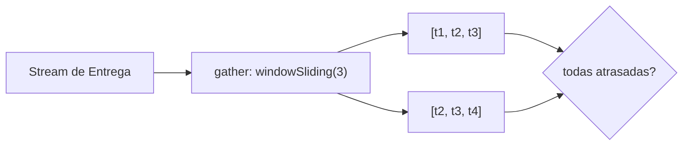

# Módulo 4: Streams y programación funcional


## Aprende construyendo

### Tema 1: Stream API — map, filter, reduce, collect

#### Paso 1 · Objetivo y preparación
Al finalizar podrás reemplazar un bucle manual con acumulador por un pipeline declarativo de `filter`/`map`/`collect`. Prerrequisitos: JDK 25 y un editor. Comprueba java --version.

#### Paso 2 · Contexto y caso real
Un reporte necesita los nombres de todas las entregas activas de una lista, y el total de tarifas cobradas; escribirlo con bucles manuales y variables acumuladoras oculta la intención detrás de la mecánica de iteración.

#### Paso 3 · Teoría, modelo mental y analogía
`filter`/`map` son operaciones intermedias perezosas; `collect`/`sum` son terminales y disparan la ejecución completa en una única pasada. La analogía: una línea de ensamblaje donde cada estación transforma la pieza a medida que pasa, sin esperar a que todas completen el paso anterior.

#### Paso 4 · Demostración guiada desde cero
Parte de una carpeta vacía:
```bash
mkdir ejemplo-stream-pipeline
cd ejemplo-stream-pipeline
mkdir -p src/main/java/academia/streams
```
Crea `ReporteEntregas.java` con una lista de entregas (activa/inactiva, con tarifa) y dos versiones del mismo cálculo: una con bucle `for` manual y acumulador, otra con `stream().filter().map().collect()`. Compila y ejecuta, comparando ambos resultados:
```bash
javac -d out src/main/java/academia/streams/ReporteEntregas.java
java -cp out academia.streams.ReporteEntregas
```

#### Paso 5 · Práctica guiada
Pista: agrega deliberadamente un elemento con tarifa negativa para provocar un fallo de expectativa en el total; confirma que ambas versiones (bucle y stream) lo suman igual, y decide si el filtro debería excluir tarifas inválidas. Resultado esperado: ambos enfoques producen el mismo total, correcto o incorrecto según el mismo criterio.

#### Paso 6 · Práctica independiente
Agrega `Collectors.groupingBy` para agrupar las entregas por estado, y `reduce` para calcular el total de tarifas sin usar `sum()`; confirma que el resultado de `reduce` coincide con el de `mapToDouble().sum()`.

#### Paso 7 · Cierre y evidencia
Guarda ambas versiones (bucle y stream), la comparación de resultados y el agrupamiento por estado; como siguiente paso estudia Optional. Errores comunes: mutar una variable externa al stream desde dentro de un `map`/`forEach` (efecto secundario oculto), reutilizar el mismo stream dos veces (lanza `IllegalStateException`, un stream solo se consume una vez), y usar `forEach` con lógica compleja cuando `collect`/`reduce` expresarían mejor la intención. Fuentes oficiales: https://dev.java/learn/api/streams/ y https://docs.oracle.com/javase/8/docs/api/java/util/stream/Stream.html.
**¿Por qué es importante?** Porque un pipeline declarativo solo es más claro que un bucle manual si de verdad describe la transformación sin ocultar efectos secundarios dentro de un `map` o `filter` que debería ser una función pura.
**Evidencia de aprendizaje:** entrega ambas versiones (bucle manual y stream) con el mismo resultado, y el agrupamiento por estado con `Collectors.groupingBy`.
**Conceptos clave:** pipeline declarativo, operaciones intermedias vs terminales.

Reemplazar bucles manuales por pipelines de Streams es el estilo que usarás en cada reporte o agregación del proyecto integrador de este track.

**Cuándo no usarlo:** un pipeline de Streams con varios `map`/`filter` encadenados puede ser más difícil de depurar paso a paso que un bucle explícito; para lógica con múltiples condiciones interdependientes o que necesita romper la iteración a mitad de camino, un bucle `for` tradicional puede seguir siendo más claro.

Un stream describe una secuencia de operaciones a aplicar sobre una colección de forma declarativa: `personas.stream().filter(p -> p.getEdad() >= 18).map(Persona::getNombre).collect(Collectors.toList())` expresa directamente "filtra las personas mayores de edad, transforma cada una a su nombre, y recolecta el resultado en una lista", en vez de escribir manualmente un bucle imperativo con una lista auxiliar acumulando resultados paso a paso, un estilo que se enfoca en describir qué transformación se desea, no en los detalles mecánicos de cómo iterar y acumular.

`filter` y `map` son operaciones intermedias: no ejecutan nada por sí solas, sino que describen un paso de la cadena, devolviendo un nuevo stream sobre el que se puede seguir encadenando más operaciones; `collect` (o `reduce`, `sum`, `count`, y similares) es una operación terminal, la que efectivamente dispara la ejecución de todo el pipeline completo de operaciones intermedias descritas previamente, procesando cada elemento de la colección original una única vez a través de toda la cadena, en vez de crear colecciones intermedias completas entre cada paso (`filter` no produce una lista filtrada completa antes de que `map` empiece; ambas operaciones se aplican elemento por elemento en una única pasada perezosa, disparada únicamente por la operación terminal final). `reduce()` (`empleados.stream().mapToDouble(Empleado::getSalario).sum()`) combina todos los elementos del stream en un único resultado acumulado, apropiado para agregaciones como sumas, máximos, o concatenaciones.

**Analogía:** un pipeline de streams es como una línea de ensamblaje donde cada estación (`filter`, `map`) realiza su transformación específica sobre cada pieza a medida que pasa, sin necesidad de esperar a que todas las piezas completen una estación antes de que la siguiente estación comience a trabajar con las primeras piezas ya procesadas; la operación terminal es la que efectivamente enciende la línea de ensamblaje completa.

**¿Por qué es importante?** El estilo declarativo de Streams describe qué transformación se desea en vez de los detalles mecánicos de iteración manual, y su evaluación perezosa (solo disparada por la operación terminal) evita crear colecciones intermedias innecesarias entre cada paso de la cadena.

**Código del ejemplo:**

```java
List<String> nombresMayores = personas.stream()
    .filter(p -> p.getEdad() >= 18)
    .map(Persona::getNombre)
    .collect(Collectors.toList());

double totalSalarios = empleados.stream()
    .mapToDouble(Empleado::getSalario)
    .sum();
```

### Tema 2: Optional — evitar null explícitamente

#### Paso 1 · Objetivo y preparación
Al finalizar podrás reemplazar un método que devuelve `null` por uno que devuelve `Optional`, forzando al llamador a decidir explícitamente qué hacer ante la ausencia. Prerrequisitos: JDK 25 y un editor. Comprueba java --version.

#### Paso 2 · Contexto y caso real
Buscar una entrega por id en una lista puede no encontrar ninguna coincidencia; devolver `null` en ese caso deja que cualquier consumidor olvide verificarlo y provoque un `NullPointerException` mucho más adelante, lejos de la causa real.

#### Paso 3 · Teoría, modelo mental y analogía
`Optional<T>` como tipo de retorno obliga, en el propio sistema de tipos, a considerar el caso "no hay valor" antes de compilar. La analogía: una caja que explícitamente puede estar vacía, frente a entregar algo que podría ser el objeto real o nada, sin ninguna indicación visible.

#### Paso 4 · Demostración guiada desde cero
Parte de una carpeta vacía:
```bash
mkdir ejemplo-optional-busqueda
cd ejemplo-optional-busqueda
mkdir -p src/main/java/academia/busqueda
```
Crea `RepositorioEntregas.java` con un método `buscarPorId(int id)` que devuelva `Optional<Entrega>`, y un `Main` que lo consuma con `orElseThrow`. Compila y ejecuta con un id existente y uno inexistente:
```bash
javac -d out src/main/java/academia/busqueda/RepositorioEntregas.java
java -cp out academia.busqueda.Main
```

#### Paso 5 · Práctica guiada
Pista: cambia deliberadamente la firma a que devuelva `Entrega` directamente (pudiendo ser `null`) para provocar un fallo deliberado; invoca un método sobre el resultado sin verificar y observa el `NullPointerException`. Resultado esperado: restaurando `Optional<Entrega>` y `orElseThrow`, el caso ausente se maneja explícitamente con un mensaje claro.

#### Paso 6 · Práctica independiente
Agrega `orElse(entregaPorDefecto)` y `orElseGet(() -> calcularAlternativa())` como dos formas adicionales de manejar la ausencia, y explica en qué caso usarías cada una de las tres.

#### Paso 7 · Cierre y evidencia
Guarda el repositorio, las tres formas de manejar ausencia y el `NullPointerException` provocado al usar `null`; como siguiente paso estudia streams paralelos. Errores comunes: llamar `.get()` sobre un `Optional` sin verificar `isPresent()` antes (lanza `NoSuchElementException` igual que un `null` no verificado lanzaría `NullPointerException`), usar `Optional` como tipo de un campo o parámetro en vez de como tipo de retorno, y envolver en `Optional` un valor que en realidad nunca debería estar ausente. Fuentes oficiales: https://dev.java/learn/api/streams/ y https://docs.oracle.com/javase/8/docs/api/java/util/stream/Stream.html.
**¿Por qué es importante?** Porque `Optional` como tipo de retorno obliga, en el propio sistema de tipos, a que el código que llama considere explícitamente el caso de ausencia antes de compilar, en vez de descubrirlo en producción con un `NullPointerException`.
**Evidencia de aprendizaje:** entrega `buscarPorId` devolviendo `Optional<Entrega>`, las tres formas de manejar la ausencia (`orElseThrow`/`orElse`/`orElseGet`), y el `NullPointerException` provocado al volver a `null` sin verificar.
**Conceptos clave:** ausencia de valor explícita en el tipo, `orElseThrow`.

Cada búsqueda que puede no encontrar resultado en el proyecto integrador de este track (`buscarPorId`, `buscarPorEmail`) debería devolver `Optional`, nunca `null`.

**Cuándo no usarlo:** usar `Optional` como tipo de un campo de una clase o como parámetro de un método (en vez de como tipo de retorno) es un uso desaconsejado que la propia documentación de Java señala; su diseño está pensado específicamente para valores de retorno que pueden estar ausentes.

`Optional<Persona> buscarPorId(int id) { return personas.stream().filter(p -> p.getId() == id).findFirst(); }` devuelve un `Optional<Persona>` en vez de devolver directamente `Persona` (que podría ser `null` si no se encuentra ningún resultado): esta diferencia en el tipo de retorno obliga, en el propio sistema de tipos, a que cualquier código que invoque este método considere explícitamente el caso "no hay valor", en vez de descubrir esa ausencia únicamente en producción mediante un `NullPointerException` inesperado al intentar usar un valor que resultó ser `null` sin haberlo verificado previamente.

`buscarPorId(5).orElseThrow(() -> new NoSuchElementException("No encontrado"))` es una de las formas explícitas de manejar el caso vacío de un `Optional`, lanzando una excepción con un mensaje claro y específico si efectivamente no hay valor presente; otras alternativas incluyen `orElse(valorPorDefecto)` (proporcionar un valor de reemplazo), `orElseGet(() -> calcular())` (calcular un valor de reemplazo solo si es necesario, de forma perezosa), o `ifPresent(valor -> usar(valor))` (ejecutar una acción solo si hay un valor presente, sin lanzar ninguna excepción). Cualquiera de estas formas obliga a una decisión explícita sobre qué hacer ante la ausencia de valor, en contraste con simplemente devolver `null` y confiar (sin ninguna garantía del compilador) en que quien llama recuerde verificarlo antes de usarlo.

**Analogía:** `Optional` es como una caja que explícitamente puede estar vacía o contener un objeto, obligando a quien la recibe a abrir la caja y verificar su contenido antes de intentar usarlo; devolver `null` directamente es como entregar algo que podría ser el objeto real o simplemente nada, sin ninguna indicación visible de cuál de los dos casos es, hasta que se intenta usar y potencialmente falla.

**¿Por qué es importante?** `Optional` obliga, en el propio tipo de retorno, a que el código que llama considere explícitamente el caso de ausencia de valor, reemplazando con ventaja la práctica de devolver `null` directamente y confiar en que se verifique manualmente sin ninguna garantía del compilador.

**Código del ejemplo:**

```java
Optional<Persona> buscarPorId(int id) {
    return personas.stream().filter(p -> p.getId() == id).findFirst();
}
Persona persona = buscarPorId(5).orElseThrow(() -> new NoSuchElementException("No encontrado"));
```

### Tema 3: Streams paralelos y referencias a métodos

#### Paso 1 · Objetivo y preparación
Al finalizar podrás medir si `parallelStream()` realmente mejora el rendimiento frente a `stream()` en un caso concreto, en vez de asumirlo. Prerrequisitos: JDK 25 y un editor. Comprueba java --version.

#### Paso 2 · Contexto y caso real
Verificar si un número grande es primo para una lista de un millón de candidatos es CPU-intensivo y sin efectos secundarios compartidos; es exactamente el tipo de operación donde vale la pena medir si paralelizar realmente ayuda.

#### Paso 3 · Teoría, modelo mental y analogía
`parallelStream()` divide el trabajo entre varios hilos gestionados por `ForkJoinPool.commonPool()`; el overhead de dividir y recombinar solo se justifica con datasets grandes y operaciones CPU-intensivas. La analogía: dividir una tarea grande entre varios trabajadores que después deben coordinarse para combinar resultados parciales — para una tarea pequeña, coordinar cuesta más que hacerla solo.

#### Paso 4 · Demostración guiada desde cero
Parte de una carpeta vacía:
```bash
mkdir ejemplo-parallel-stream
cd ejemplo-parallel-stream
mkdir -p src/main/java/academia/paralelo
```
Crea `ContarPrimos.java` con un método `esPrimo(long n)` y mide, con `System.nanoTime()`, cuánto tarda contar los primos entre 2 y 2 000 000 usando `stream()` frente a `parallelStream()`. Compila y ejecuta:
```bash
javac -d out src/main/java/academia/paralelo/ContarPrimos.java
java -cp out academia.paralelo.ContarPrimos
```

#### Paso 5 · Práctica guiada
Pista: repite la misma medición con un rango pequeño (2 a 100) para provocar un fallo deliberado de expectativa; en ese caso `parallelStream()` puede ser igual de lento o más lento que `stream()`. Resultado esperado: confirmas que el beneficio del paralelismo depende del tamaño real del trabajo, no es automático.

#### Paso 6 · Práctica independiente
Reemplaza las lambdas `n -> esPrimo(n)` por la referencia a método `this::esPrimo`, y confirma que el comportamiento y el tiempo medido no cambian, solo la legibilidad del código.

#### Paso 7 · Cierre y evidencia
Guarda ambas mediciones (rango grande y pequeño) y la conclusión sobre cuándo paraleliza realmente; como siguiente paso estudia concurrencia con `ExecutorService`. Errores comunes: asumir que `parallelStream()` siempre es más rápido sin medir, paralelizar un pipeline con efectos secundarios sobre estado compartido mutable (introduce condiciones de carrera reales), y paralelizar una colección pequeña donde el overhead de coordinación supera cualquier beneficio. Fuentes oficiales: https://dev.java/learn/api/streams/ y https://docs.oracle.com/javase/8/docs/api/java/util/stream/Stream.html.
**¿Por qué es importante?** Porque el beneficio de `parallelStream()` depende del tamaño real del dataset y del costo de la operación, nunca es automático — medir con datos reales es la única forma confiable de saber si realmente ayuda en un caso concreto.
**Evidencia de aprendizaje:** entrega la medición con rango grande (donde paralelizar gana) y con rango pequeño (donde no gana o pierde), y la conclusión sobre cuándo se justifica el paralelismo.
**Conceptos clave:** `parallelStream()`, overhead de paralelización, `Clase::metodo`.

Antes de paralelizar cualquier procesamiento pesado del proyecto integrador de este track, medirás igual que aquí si el dataset y la operación justifican el overhead de `parallelStream()`.

**Cuándo no usarlo:** `parallelStream()` no aporta nada (y puede empeorar el rendimiento) para colecciones pequeñas, operaciones rápidas, o pipelines con efectos secundarios sobre estado compartido mutable — en ese último caso además introduce condiciones de carrera reales (Módulo 5).

`numeros.parallelStream().filter(this::esPrimo).count()` divide el procesamiento del stream entre múltiples hilos automáticamente gestionados por el framework de streams (usando internamente el mismo pool de hilos compartido `ForkJoinPool.commonPool()`), apropiado específicamente para datasets grandes combinados con operaciones genuinamente intensivas en CPU y sin efectos secundarios compartidos entre los elementos procesados (dado que la paralelización introduce el riesgo de condiciones de carrera si las operaciones del stream modifican estado compartido mutable, Módulo 5).

Para colecciones pequeñas, o para operaciones simples y rápidas, el overhead de coordinar la división del trabajo entre múltiples hilos y de recombinar los resultados parciales al final supera cualquier ganancia teórica de paralelización, resultando frecuentemente en un rendimiento peor que el equivalente secuencial (`stream()`, sin paralelizar); medir con datos reales del caso específico (en vez de asumir que "paralelo siempre es más rápido") es la única forma confiable de determinar si `parallelStream()` efectivamente aporta un beneficio neto en una situación concreta.

Las referencias a métodos (`Persona::getNombre`, equivalente exacto a la lambda `p -> p.getNombre()`) son una forma más concisa de expresar una lambda que simplemente invoca un método existente sobre su argumento, sin agregar ninguna lógica adicional propia, siendo preferibles por legibilidad en ese caso específico frente a escribir la lambda completa de forma explícita.

**Analogía:** un stream paralelo es como dividir una tarea grande entre varios trabajadores que luego deben coordinarse para combinar sus resultados parciales; para una tarea pequeña, el tiempo de organizar esa división y coordinación entre trabajadores puede superar fácilmente el tiempo que hubiera tomado simplemente completar la tarea uno mismo sin ayuda adicional.

**¿Por qué es importante?** Un stream paralelo solo mejora el rendimiento con datasets grandes y operaciones CPU-intensivas sin efectos secundarios compartidos; usarlo indiscriminadamente en casos pequeños o simples puede empeorar el rendimiento por el overhead de coordinación.

**Código del ejemplo:**

```java
long conteo = numeros.parallelStream().filter(this::esPrimo).count();
// Útil solo para datasets grandes y operaciones CPU-intensivas sin efectos secundarios

.map(Persona::getNombre)   // equivalente a .map(p -> p.getNombre())
```

### Tema 4: Stream Gatherers (Java 24)

#### Paso 1 · Objetivo y preparación
Al finalizar vas a usar `Stream.gather()` con `Gatherers.windowSliding(3)` para detectar 3 entregas consecutivas atrasadas en un stream de registros de entrega, algo que `filter`/`map` no pueden expresar porque solo ven un elemento a la vez. Prerrequisitos: JDK 24+ y Tema 1 de este módulo.

#### Paso 2 · Contexto y caso real
El equipo quiere alertar cuando un conductor acumula 3 entregas atrasadas consecutivas (no 3 atrasadas en cualquier orden); `filter(this::estaAtrasada)` solo puede filtrar elementos individuales, perdiendo por completo la relación de orden/vecindad entre ellos.

#### Paso 3 · Teoría, modelo mental y analogía
`Stream.gather()` (finalizado en Java 24) permite definir operaciones intermedias personalizadas con estado propio entre elementos, algo que `map`/`filter`/`reduce` no permiten porque procesan cada elemento de forma aislada; `Gatherers.windowSliding(n)` agrupa cada `n` elementos consecutivos en una ventana deslizante. La analogía: mirar una fila de personas de una en una (filter/map) frente a mirar siempre a las últimas 3 personas juntas para detectar un patrón entre ellas.

#### Paso 4 · Demostración guiada desde cero
Crea `src/main/java/academia/streams/DetectorAtrasos.java`:
```java
List<List<Entrega>> ventanas = entregas.stream()
    .gather(Gatherers.windowSliding(3))
    .filter(ventana -> ventana.stream().allMatch(Entrega::estaAtrasada))
    .toList();
```
Resultado esperado: `ventanas` contiene solo las ventanas de 3 entregas consecutivas donde las tres están atrasadas, ignorando cualquier entrega atrasada aislada que no forme parte de una racha de 3 seguidas.

#### Paso 5 · Práctica guiada
Pista: reemplazá `gather(Gatherers.windowSliding(3))` por un simple `filter(Entrega::estaAtrasada)` "para simplificar". Ese es el fallo deliberado: ahora el pipeline detecta cualquier entrega atrasada individual, sin importar si forma parte de una racha consecutiva o es un caso aislado entre entregas a tiempo, generando alertas de "racha de 3 atrasos" para conductores que en realidad tuvieron un solo atraso ocasional.

#### Paso 6 · Práctica independiente
Corregí el Paso 5 restaurando `gather(Gatherers.windowSliding(3))`, y agregá una prueba con una secuencia mixta (a tiempo, atrasada, a tiempo, atrasada, atrasada, atrasada) confirmando que solo se detecta la racha real de 3 consecutivas al final.

#### Paso 7 · Cierre y evidencia
Entregá el pipeline con `Gatherers.windowSliding` del Paso 4, la detección de atrasos aislados sin relación de orden del Paso 5, y la prueba con secuencia mixta del Paso 6; explicá qué tipo de lógica (que depende de la relación entre elementos vecinos) `filter`/`map` no pueden expresar pero un gatherer sí. Siguiente paso: aplica el mismo criterio de "medir antes de paralelizar" a streams paralelos. Errores comunes: intentar resolver lógica de ventana/vecindad con filter/map puro, usar gather() para transformaciones simples que map ya resuelve, y no considerar el costo de materializar cada ventana como una lista nueva. Fuentes oficiales: https://openjdk.org/jeps/485 y https://docs.oracle.com/en/java/javase/24/core/stream-gatherers.html.
**¿Por qué es importante?** Porque una transformación declarativa puede hacer visible la regla, pero solo si la operación elegida puede expresar genuinamente la relación entre elementos que el caso real requiere.
**Evidencia de aprendizaje:** entrega pipeline con gatherer, detección incorrecta sin relación de orden reproducida y prueba con secuencia mixta confirmada.
**Conceptos clave:** Stream.gather(), Gatherers.windowSliding, estado entre elementos vecinos, operación intermedia personalizada.

Cada regla de negocio del proyecto integrador de este track que dependa de la relación entre elementos consecutivos (ej. detectar una racha de reintentos fallidos) se beneficia de un gatherer en vez de intentar forzarla con filter/map puro.

**Cuándo no usarlo:** para una transformación elemento por elemento sin ninguna relación de vecindad u orden entre ellos, `map`/`filter` siguen siendo más simples y claros que definir o usar un gatherer.

`Stream.gather()` completa la API de Streams agregando la capacidad de definir operaciones intermedias con estado propio entre elementos consecutivos; `Gatherers` (la clase utilitaria con implementaciones estándar) incluye `windowSliding(n)` para ventanas deslizantes de tamaño fijo, `windowFixed(n)` para ventanas no superpuestas, y `fold` para una reducción con estado acumulado explícito paso a paso.



**Analogía:** procesar un stream con `filter`/`map` es como revisar una fila de personas de una en una sin memoria de quién pasó antes; un gatherer como `windowSliding` es como mirar siempre a las últimas 3 personas juntas, permitiendo detectar un patrón que depende genuinamente de la relación entre elementos vecinos.

**¿Por qué es importante?** `Stream.gather()` permite expresar declarativamente operaciones que dependen de la relación entre elementos consecutivos, algo que `map`/`filter`/`reduce` no pueden expresar por sí solos.

**Código del ejemplo:**

```java
List<List<Entrega>> ventanas = entregas.stream()
    .gather(Gatherers.windowSliding(3))
    .filter(ventana -> ventana.stream().allMatch(Entrega::estaAtrasada))
    .toList();
```

---


## Construcción guiada del capítulo

**Objetivo del laboratorio:** construir un pipeline de procesamiento de datos con Streams que reemplace loops manuales.

**Requisitos previos:** Módulos 0-3 completados.

| Paso | Acción | Código | Explicación |
|---|---|---|---|
| 1 | Filtrar y transformar con `filter`/`map`/`collect` | Ver Tema 1 | Reemplaza un loop manual equivalente |
| 2 | Sumar con `reduce`/`mapToDouble().sum()` | Ver Tema 1 | Agregación declarativa |
| 3 | Reemplazar un método que devuelve `null` por `Optional` | Ver Tema 2 | Maneja el caso vacío con `orElseThrow` |
| 4 | Comparar `stream()` vs `parallelStream()` con datos grandes | Ver Tema 3 | Mide el tiempo real, no asumas |
| 5 | Reemplazar lambdas verbosas por referencias a métodos | Ver Tema 3 | Donde aplique directamente |
| 6 | Detectar una racha con `Gatherers.windowSliding` | Ver Tema 4 | Lógica que `filter`/`map` no pueden expresar |

**Verificación:** el laboratorio se considera exitoso si el pipeline con Streams produce el mismo resultado que el loop manual equivalente, si la comparación de `stream()` vs `parallelStream()` incluye una medición real de tiempo, y si el gatherer detecta correctamente solo las rachas reales de 3 elementos consecutivos.

**Errores comunes y soluciones**

- **Usar `parallelStream()` para colecciones pequeñas.** El overhead de coordinación puede superar cualquier ganancia; mide con datos reales.
- **Seguir devolviendo `null` en vez de `Optional`.** Cambia la firma del método para forzar el manejo explícito del caso vacío.
- **Usar lambdas verbosas donde una referencia a método sería más clara.** Prefiere `Clase::metodo` cuando la lambda simplemente invoca ese método.
- **Intentar resolver lógica de ventana/vecindad con `filter`/`map` puro.** Esas operaciones no ven elementos vecinos; usa un gatherer como `windowSliding`.

---
