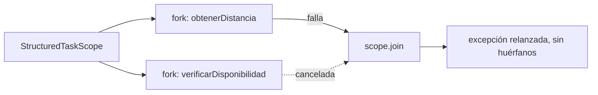
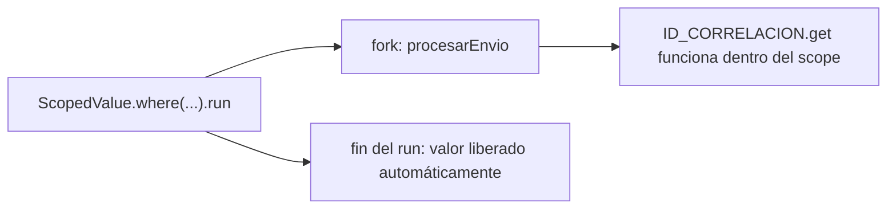

# Módulo 5: Concurrencia — hilos y virtual threads


## Aprende construyendo

### Tema 1: ExecutorService y gestión de hilos

#### Paso 1 · Objetivo y preparación
Al finalizar podrás reemplazar la creación manual de un `Thread` por tarea con un `ExecutorService` de pool fijo, cerrado correctamente. Prerrequisitos: JDK 21 y un editor. Comprueba java --version.

#### Paso 2 · Contexto y caso real
Procesar 200 solicitudes de cálculo de tarifa creando un `Thread` nuevo para cada una agota rápidamente la memoria disponible; limitar el trabajo concurrente a un pool fijo de tamaño conocido evita ese problema.

#### Paso 3 · Teoría, modelo mental y analogía
Un pool de hilos reutiliza un número fijo de hilos ya creados, en vez de crear y destruir uno por tarea. La analogía: contratar y despedir un trabajador nuevo para cada tarea breve, frente a mantener un equipo fijo ya entrenado que toma la siguiente tarea disponible.

#### Paso 4 · Demostración guiada desde cero
Parte de una carpeta vacía:
```bash
mkdir ejemplo-executor-pool
cd ejemplo-executor-pool
mkdir -p src/main/java/academia/concurrencia
```
Crea `ProcesadorTarifas.java` que mida, con `Thread` crudo primero y con `Executors.newFixedThreadPool(4)` después, el tiempo de procesar 200 tareas breves. Compila y ejecuta, cerrando el pool en un bloque `finally`:
```bash
javac -d out src/main/java/academia/concurrencia/ProcesadorTarifas.java
java -cp out academia.concurrencia.ProcesadorTarifas
```

#### Paso 5 · Práctica guiada
Pista: omite deliberadamente `pool.shutdown()` en el `finally` para provocar un fallo diagnosticable; el proceso de la JVM no termina porque el pool sigue esperando tareas. Resultado esperado: restaurar el `shutdown()` correcto en `finally` hace que el proceso termine normalmente.

#### Paso 6 · Práctica independiente
Reemplaza `submit()` individual por `invokeAll()` para enviar las 200 tareas de una vez y esperar a que todas terminen antes de continuar; compara el código resultante con el de `submit()` uno por uno.

#### Paso 7 · Cierre y evidencia
Guarda ambas versiones (Thread crudo y pool), el bug del pool sin cerrar y la corrección; como siguiente paso estudia CompletableFuture. Errores comunes: crear un hilo por tarea sin límite, bloquear el common pool, ignorar cancelación y usar synchronized sin medir. Fuentes oficiales: https://dev.java/learn/concurrency/ y https://docs.oracle.com/en/java/javase/21/core/virtual-threads.html.
**¿Por qué es importante?** Porque concurrencia sin límites convierte una mejora de latencia en una caída de servicio.
**Evidencia de aprendizaje:** entrega implementación, fallo de carrera, corrección y medición.
**Conceptos clave:** pool de hilos, reutilización, `submit`/`shutdown`.

Cada operación concurrente del proyecto integrador de este track (procesar un lote de tareas, consultar varias fuentes a la vez) usará un `ExecutorService` con un tamaño de pool medido, nunca un `Thread` por tarea sin límite.

**Cuándo no usarlo:** para un puñado de tareas ocasionales (menos de una decena, sin repetirse con frecuencia), crear un `ExecutorService` y gestionarlo correctamente es más ceremonia que simplemente esperar secuencialmente o lanzar un par de `Thread` directos.

Crear un `Thread` manualmente por cada tarea concurrente es costoso (cada thread de plataforma tradicional consume aproximadamente 1 MB de memoria para su stack, y el sistema operativo impone límites prácticos de miles, no millones, de threads de plataforma simultáneos) y no reutiliza recursos entre tareas sucesivas; `ExecutorService pool = Executors.newFixedThreadPool(4); pool.submit(() -> procesarTarea());` gestiona un conjunto fijo de hilos reutilizables (un "pool"), donde cada tarea enviada con `submit()` se ejecuta en uno de esos hilos ya existentes tan pronto como quede disponible, en vez de crear un hilo completamente nuevo para cada tarea individual, reduciendo significativamente el overhead de creación y destrucción repetida de hilos para cargas de trabajo con muchas tareas concurrentes.

`pool.shutdown()` inicia un cierre ordenado del pool, permitiendo que las tareas ya en curso completen normalmente, pero rechazando cualquier tarea nueva enviada después de esa llamada; `invokeAll()` envía un conjunto de tareas simultáneamente y bloquea hasta que todas completen, devolviendo sus resultados combinados, apropiado cuando se necesita esperar explícitamente a que un lote completo de tareas termine antes de continuar. `ScheduledExecutorService` extiende esta misma idea para tareas que deben ejecutarse después de un retraso específico, o repetidamente a intervalos regulares, sin necesidad de gestionar manualmente temporizadores.

**Analogía:** crear un `Thread` por tarea es como contratar y despedir a un trabajador completamente nuevo para cada tarea individual, incluso si esas tareas son breves y frecuentes; un `ExecutorService` es como mantener un equipo fijo de trabajadores ya entrenados, asignándoles nuevas tareas conforme quedan disponibles, sin el costo repetido de contratar y despedir para cada tarea individual.

**¿Por qué es importante?** `ExecutorService` reutiliza un pool de hilos existente en vez de crear y destruir hilos individuales por cada tarea, reduciendo significativamente el overhead para cargas con muchas tareas concurrentes.

**Código del ejemplo:**

```java
ExecutorService pool = Executors.newFixedThreadPool(4);
pool.submit(() -> procesarTarea());
pool.shutdown();
```

### Tema 2: CompletableFuture

#### Paso 1 · Objetivo y preparación
Al finalizar podrás encadenar una obtención de datos asíncrona, una transformación y un manejo de errores centralizado con `CompletableFuture`. Prerrequisitos: JDK 21 y un editor. Comprueba java --version.

#### Paso 2 · Contexto y caso real
Consultar la tarifa de una ruta requiere primero obtener la distancia (una llamada lenta) y luego calcular el precio con ella; anidar callbacks manualmente para esta secuencia se vuelve ilegible apenas se agrega un paso más.

#### Paso 3 · Teoría, modelo mental y analogía
`CompletableFuture` compone pasos asíncronos dependientes como una cadena lineal (`thenApply`, `thenCompose`), con `exceptionally` centralizando el manejo de errores de toda la cadena. La analogía: encargar tareas sucesivas a distintos proveedores, donde cada uno empieza su parte solo cuando el anterior entrega la suya, sin que quien encarga espere bloqueado frente a cada uno.

#### Paso 4 · Demostración guiada desde cero
Parte de una carpeta vacía:
```bash
mkdir ejemplo-completable-future
cd ejemplo-completable-future
mkdir -p src/main/java/academia/asincrono
```
Crea `CalculoTarifa.java` con `CompletableFuture.supplyAsync(() -> obtenerDistancia(ruta)).thenApply(distancia -> calcularTarifa(distancia)).thenAccept(tarifa -> ...).exceptionally(...)`. Compila y ejecuta:
```bash
javac -d out src/main/java/academia/asincrono/CalculoTarifa.java
java -cp out academia.asincrono.CalculoTarifa
```

#### Paso 5 · Práctica guiada
Pista: haz que `obtenerDistancia` lance una excepción deliberadamente para provocar un fallo en medio de la cadena; confirma que `exceptionally` la captura sin necesidad de un `try/catch` en cada paso intermedio. Resultado esperado: el error se maneja en un único lugar, no en cada etapa.

#### Paso 6 · Práctica independiente
Agrega un segundo paso asíncrono con `thenCompose` (que a su vez devuelva otro `CompletableFuture`, por ejemplo verificar disponibilidad del conductor) y confirma que la cadena completa sigue siendo lineal y legible.

#### Paso 7 · Cierre y evidencia
Guarda la cadena completa, la salida exitosa y el error capturado por `exceptionally`; como siguiente paso estudia virtual threads. Errores comunes: crear un hilo por tarea sin límite, bloquear el common pool, ignorar cancelación y usar synchronized sin medir. Fuentes oficiales: https://dev.java/learn/concurrency/ y https://docs.oracle.com/en/java/javase/21/core/virtual-threads.html.
**¿Por qué es importante?** Porque concurrencia sin límites convierte una mejora de latencia en una caída de servicio.
**Evidencia de aprendizaje:** entrega implementación, fallo de carrera, corrección y medición.
**Conceptos clave:** composición de operaciones asíncronas, manejo de errores en la cadena.

Cada secuencia de llamadas dependientes entre sí del proyecto integrador de este track (obtener datos, transformarlos, reaccionar al resultado) se beneficiará de esta misma composición lineal en vez de callbacks anidados.

**Cuándo no usarlo:** para una única llamada asíncrona sin pasos dependientes posteriores, encadenar `CompletableFuture` agrega sintaxis sin beneficio; basta con `supplyAsync` y esperar su resultado directamente.

`CompletableFuture` representa un valor que estará disponible en el futuro como resultado de una operación asíncrona, permitiendo encadenar transformaciones y reacciones sobre ese valor futuro sin bloquear el hilo actual esperando su resultado:

```java
CompletableFuture.supplyAsync(() -> obtenerDatos())
    .thenApply(datos -> transformar(datos))
    .thenAccept(resultado -> System.out.println(resultado))
    .exceptionally(error -> {
        log.error("Falló", error);
        return null;
    });
```

Esta cadena encadena una obtención de datos asíncrona, una transformación de esos datos, una acción final con el resultado, y un manejo de errores que se activa si cualquier paso anterior de la cadena falla.

Esta composición fluida resuelve el problema de anidar callbacks asíncronos sucesivos de forma manual (el llamado "callback hell", un problema análogo al estudiado para JavaScript en el Módulo 5 del track de JavaScript sobre Promesas), permitiendo expresar una secuencia de pasos asíncronos dependientes entre sí como una cadena lineal legible, en vez de callbacks anidados progresivamente más profundos; `thenCompose` encadena otra operación que a su vez devuelve un `CompletableFuture` (aplanando el resultado, análogo conceptualmente a `flatMap`), mientras `exceptionally` captura cualquier error ocurrido en cualquier punto anterior de toda la cadena, centralizando el manejo de errores en un único lugar en vez de repetirlo en cada paso individual.

**Analogía:** `CompletableFuture` es como encargar una serie de tareas sucesivas a distintos proveedores, donde cada proveedor solo empieza su parte cuando el anterior efectivamente entrega su resultado, sin que quien encargó todo el proceso tenga que esperar bloqueado presencialmente frente a cada proveedor mientras trabaja.

**¿Por qué es importante?** `CompletableFuture` permite componer operaciones asíncronas dependientes entre sí de forma legible y lineal, con manejo de errores centralizado, evitando la anidación progresiva de callbacks manuales.

**Código del ejemplo:**

```java
CompletableFuture.supplyAsync(() -> obtenerDatos())
    .thenApply(datos -> transformar(datos))
    .thenAccept(resultado -> System.out.println(resultado))
    .exceptionally(error -> { log.error("Falló", error); return null; });
```

### Tema 3: Virtual threads

#### Paso 1 · Objetivo y preparación
Al finalizar podrás lanzar decenas de miles de tareas concurrentes de I/O bloqueante con virtual threads, algo inviable con threads de plataforma. Prerrequisitos: JDK 21 y un editor. Comprueba java --version.

#### Paso 2 · Contexto y caso real
Simular 50 000 solicitudes de tracking de entregas que cada una espera una respuesta de red simulada agotaría la memoria disponible con threads de plataforma tradicionales (aproximadamente 1 MB de stack cada uno); con virtual threads es viable.

#### Paso 3 · Teoría, modelo mental y analogía
Un virtual thread es gestionado por la JVM, no mapea 1:1 a un hilo del sistema operativo, y se suspende automáticamente durante una espera de I/O liberando el "carrier thread" real. La analogía: una sala de espera compartida y económica donde miles esperan a la vez, y solo se asigna un recurso físico real a quien está siendo atendido en ese instante.

#### Paso 4 · Demostración guiada desde cero
Parte de una carpeta vacía:
```bash
mkdir ejemplo-virtual-threads
cd ejemplo-virtual-threads
mkdir -p src/main/java/academia/virtuales
```
Crea `TrackingMasivo.java` que lance 50 000 tareas con `Executors.newVirtualThreadPerTaskExecutor()`, cada una simulando una espera de I/O con `Thread.sleep(50)`. Compila y ejecuta, midiendo el tiempo total:
```bash
javac -d out src/main/java/academia/virtuales/TrackingMasivo.java
java -cp out academia.virtuales.TrackingMasivo
```

#### Paso 5 · Práctica guiada
Pista: cambia deliberadamente el executor a `Executors.newFixedThreadPool(200)` con las mismas 50 000 tareas para provocar un fallo de expectativa; el tiempo total aumenta drásticamente porque solo 200 tareas pueden esperar a la vez. Resultado esperado: confirmas que los virtual threads permiten mucha más concurrencia de I/O con el mismo hardware.

#### Paso 6 · Práctica independiente
Reemplaza `Thread.sleep(50)` por un cálculo puro de CPU (por ejemplo, contar primos) y repite la comparación; confirma que ahí los virtual threads no ofrecen ninguna ventaja sobre un pool de plataforma bien dimensionado.

#### Paso 7 · Cierre y evidencia
Guarda ambas mediciones (I/O bloqueante y CPU pura) y la conclusión sobre cuándo virtual threads ayudan; como siguiente paso estudia condiciones de carrera. Errores comunes: crear un hilo por tarea sin límite, bloquear el common pool, ignorar cancelación y usar synchronized sin medir. Fuentes oficiales: https://dev.java/learn/concurrency/ y https://docs.oracle.com/en/java/javase/21/core/virtual-threads.html.
**¿Por qué es importante?** Porque concurrencia sin límites convierte una mejora de latencia en una caída de servicio.
**Evidencia de aprendizaje:** entrega implementación, fallo de carrera, corrección y medición.
**Conceptos clave:** hilos gestionados por la JVM, costo de memoria drásticamente menor, ideal para I/O bloqueante.

Cualquier operación del proyecto integrador de este track dominada por espera de I/O (consultar varias fuentes externas a la vez) se beneficiará de virtual threads exactamente como en esta medición.

**Cuándo no usarlo:** los virtual threads no aceleran cálculo puro de CPU; para código CPU-intensivo sin I/O bloqueante, un pool de threads de plataforma bien dimensionado al número de núcleos disponibles sigue siendo la elección correcta.

Un thread de plataforma tradicional está respaldado directamente por un hilo del sistema operativo, con un costo de memoria considerable (aproximadamente 1 MB de stack por thread) y un límite práctico impuesto por el sistema operativo de, típicamente, unos pocos miles de threads simultáneos como máximo razonable; un virtual thread (introducido de forma estable en Java 21, resultado del proyecto Loom) es gestionado enteramente por la JVM en vez de mapear directamente a un hilo del sistema operativo, consumiendo una fracción diminuta de esa memoria, y permitiendo lanzar cientos de miles (o incluso millones) de tareas concurrentes con código de aspecto completamente síncrono y familiar, sin necesidad de reescribir la lógica en un estilo asíncrono basado en callbacks o `CompletableFuture` explícito.

```java
try (var executor = Executors.newVirtualThreadPerTaskExecutor()) {
    for (int i = 0; i < 100_000; i++) {
        executor.submit(() -> hacerLlamadaIO());
    }
}
```

Este bloque lanza 100,000 tareas concurrentes, cada una en su propio virtual thread dedicado, un volumen que sería completamente inviable con threads de plataforma tradicionales debido a su costo de memoria; la JVM multiplexa internamente muchos virtual threads sobre un número mucho más pequeño de threads de plataforma reales (llamados "carrier threads"), suspendiendo automáticamente un virtual thread mientras espera una operación de I/O bloqueante (una llamada de red, una consulta a base de datos) y liberando ese carrier thread real para que atienda a otro virtual thread mientras tanto, siendo esta la razón por la que los virtual threads son particularmente apropiados para cargas dominadas por I/O bloqueante, donde la mayor parte del tiempo de cada tarea se pasa esperando una respuesta externa, no calculando activamente.

**Analogía:** un thread de plataforma es como reservar una habitación de hotel completa dedicada exclusivamente a una única tarea, con un costo fijo considerable sin importar cuánto tiempo esa tarea pase simplemente esperando sin hacer nada; un virtual thread es como una sala de espera compartida y económica donde miles de personas pueden esperar simultáneamente, y solo se asigna un recurso físico real (el carrier thread) a quien efectivamente está siendo atendido en ese instante específico, liberándolo inmediatamente para atender a otra persona en cuanto la primera simplemente vuelve a esperar.

**¿Por qué es importante?** Los virtual threads consumen una fracción de la memoria de los threads de plataforma y permiten lanzar cientos de miles de tareas concurrentes con código síncrono familiar, siendo especialmente apropiados para cargas dominadas por I/O bloqueante.

**Código del ejemplo:**

```java
try (var executor = Executors.newVirtualThreadPerTaskExecutor()) {
    for (int i = 0; i < 100_000; i++) {
        executor.submit(() -> hacerLlamadaIO());
    }
}
```

### Tema 4: Condiciones de carrera y sincronización

#### Paso 1 · Objetivo y preparación
Al finalizar podrás reproducir una condición de carrera real con un contador compartido y corregirla con `synchronized`. Prerrequisitos: JDK 21 y un editor. Comprueba java --version.

#### Paso 2 · Contexto y caso real
Cien hilos incrementando simultáneamente un contador compartido de "entregas procesadas hoy" sin ninguna coordinación pierden incrementos silenciosamente: el total final es menor al esperado, sin ningún error explícito.

#### Paso 3 · Teoría, modelo mental y analogía
`contador++` son en realidad tres operaciones (leer, sumar, escribir); dos hilos pueden leer el mismo valor antes de que cualquiera escriba el incrementado, perdiendo uno de los dos. La analogía: dos personas mirando el mismo saldo de una cuenta compartida al mismo tiempo, cada una decidiendo retirar dinero basándose en ese saldo ya obsoleto.

#### Paso 4 · Demostración guiada desde cero
Parte de una carpeta vacía:
```bash
mkdir ejemplo-condicion-carrera
cd ejemplo-condicion-carrera
mkdir -p src/main/java/academia/concurrencia
```
Crea `ContadorEntregas.java` con un campo `int contador` incrementado por 100 hilos concurrentes sin sincronización, y compara con la misma clase usando `synchronized void incrementar()`. Compila y ejecuta ambas versiones:
```bash
javac -d out src/main/java/academia/concurrencia/ContadorEntregas.java
java -cp out academia.concurrencia.ContadorEntregas
```

#### Paso 5 · Práctica guiada
Pista: ejecuta la versión sin sincronizar varias veces seguidas para provocar el fallo deliberado; el resultado final varía entre ejecuciones y es menor a 100 veces la cantidad de incrementos por hilo. Resultado esperado: con `synchronized`, el resultado es siempre el mismo valor correcto, sin importar cuántas veces lo ejecutes.

#### Paso 6 · Práctica independiente
Reemplaza `synchronized` por `AtomicInteger` (usando `incrementAndGet()`) y confirma que el resultado sigue siendo correcto y determinista, sin necesidad de un bloque `synchronized` explícito.

#### Paso 7 · Cierre y evidencia
Guarda ambas versiones (sin sincronizar y con `synchronized`/`AtomicInteger`), los resultados inconsistentes y el resultado corregido; como siguiente paso estudia NIO.2. Errores comunes: crear un hilo por tarea sin límite, bloquear el common pool, ignorar cancelación y usar synchronized sin medir. Fuentes oficiales: https://dev.java/learn/concurrency/ y https://docs.oracle.com/en/java/javase/21/core/virtual-threads.html.
**¿Por qué es importante?** Porque concurrencia sin límites convierte una mejora de latencia en una caída de servicio.
**Evidencia de aprendizaje:** entrega implementación, fallo de carrera, corrección y medición.
**Conceptos clave:** acceso concurrente no coordinado, `synchronized`, primitivas de coordinación.

Cualquier contador o estado mutable compartido entre hilos del proyecto integrador de este track necesitará esta misma protección (`synchronized`, `AtomicInteger` o una estructura concurrente), nunca acceso concurrente sin coordinar.

**Cuándo no usarlo:** `synchronized` en cada acceso a un contador de alta frecuencia introduce contención entre hilos; para ese caso específico, `AtomicInteger` (basado en operaciones atómicas de hardware) suele rendir mejor que un bloque `synchronized` completo.

Una condición de carrera ocurre cuando múltiples hilos acceden y modifican el mismo estado compartido mutable sin ninguna coordinación explícita entre ellos, produciendo resultados incorrectos que dependen del orden impredecible en que el sistema operativo efectivamente intercala la ejecución de esos hilos: dos hilos incrementando el mismo contador (`contador++`, que en realidad son tres operaciones separadas a nivel de máquina: leer el valor actual, sumarle uno, y escribir el resultado) pueden ambos leer el mismo valor antes de que cualquiera de los dos escriba su resultado incrementado, perdiendo efectivamente uno de los dos incrementos sin que ningún error explícito se produzca, simplemente un resultado final incorrecto y silencioso.

`synchronized void incrementar() { contador++; }` garantiza acceso exclusivo a la sección crítica marcada: solo un hilo a la vez puede ejecutar ese método sobre la misma instancia en un momento dado, bloqueando a cualquier otro hilo que intente invocarlo simultáneamente hasta que el primero termine, eliminando la posibilidad de que dos hilos lean el mismo valor obsoleto antes de que cualquiera escriba su resultado. `ReentrantLock` ofrece un mecanismo de bloqueo más flexible que `synchronized` (permitiendo, por ejemplo, intentar adquirir el bloqueo con un tiempo límite, o verificar si está actualmente bloqueado sin bloquearse); `Semaphore` limita el número de hilos que pueden acceder simultáneamente a un recurso a un máximo configurable; `CountDownLatch` permite que uno o más hilos esperen hasta que un conjunto de operaciones en otros hilos complete; `CyclicBarrier` sincroniza un grupo fijo de hilos para que todos esperen mutuamente hasta llegar juntos a un punto común antes de continuar.

**Analogía:** una condición de carrera es como dos personas mirando el mismo saldo de una cuenta compartida al mismo tiempo, cada una decidiendo retirar dinero basándose en ese saldo ya obsoleto para cuando efectivamente actualizan el registro, terminando con un saldo final incorrecto sin que ninguna operación individual haya fallado explícitamente; `synchronized` es como una ventanilla única que solo atiende a una persona a la vez para esa cuenta específica, garantizando que cada consulta y actualización del saldo ocurra de forma completamente aislada respecto a cualquier otra.

**¿Por qué es importante?** Una condición de carrera produce resultados incorrectos silenciosos dependientes del orden impredecible de ejecución de los hilos; `synchronized` y otras primitivas de coordinación garantizan acceso exclusivo o coordinado a estado compartido mutable, eliminando esa impredecibilidad.

**Código del ejemplo:**

```java
synchronized void incrementar() { contador++; } // garantiza acceso exclusivo a la sección crítica
```

### Tema 5: Structured Concurrency (StructuredTaskScope, Java 25)

#### Paso 1 · Objetivo y preparación
Al finalizar vas a lanzar dos subtareas relacionadas (distancia y disponibilidad del conductor) con `StructuredTaskScope`, cancelando automáticamente la otra si cualquiera falla. Prerrequisitos: JDK 25 y un editor. Comprueba java --version. **`StructuredTaskScope` todavía es una feature en preview (JEP 505, quinta ronda) en Java 25**, no finalizada: compilar y ejecutar requiere las banderas `--enable-preview --release 25` explícitas.

#### Paso 2 · Contexto y caso real
El servicio de tracking lanza dos llamadas relacionadas con `CompletableFuture` por separado (distancia y disponibilidad del conductor); si la de distancia falla, la de disponibilidad sigue corriendo en segundo plano sin que nadie la cancele, consumiendo recursos para un resultado que ya no se va a usar.

#### Paso 3 · Teoría, modelo mental y analogía
Structured concurrency trata un grupo de subtareas relacionadas como una única unidad: todas nacen dentro del mismo scope y ese scope no termina hasta que todas terminan (o se cancelan). La analogía: un padre que lleva a sus hijos a un museo — si uno se pierde, no se va dejando a los demás dispersos; reúne o cancela el paseo completo antes de continuar.

#### Paso 4 · Demostración guiada desde cero
Crea `src/main/java/academia/concurrencia/CalculoTarifaEstructurado.java`:
```java
try (var scope = StructuredTaskScope.open(StructuredTaskScope.Joiner.<Object>allSuccessfulOrThrow())) {
    Subtask<Double> distancia = scope.fork(() -> obtenerDistancia(ruta));
    Subtask<Boolean> disponible = scope.fork(() -> verificarDisponibilidad(conductorId));
    scope.join();
    return calcularTarifa(distancia.get(), disponible.get());
}
```
```bash
javac --release 25 --enable-preview -d out src/main/java/academia/concurrencia/CalculoTarifaEstructurado.java
java --enable-preview -cp out academia.concurrencia.CalculoTarifaEstructurado
```
Resultado esperado: si `obtenerDistancia` lanza una excepción, `scope.join()` cancela automáticamente `verificarDisponibilidad` (si todavía no terminó) y relanza la excepción original, sin dejar ninguna subtarea corriendo de forma huérfana en segundo plano. La JVM además imprime una advertencia de que estás usando funcionalidades en preview.



#### Paso 5 · Práctica guiada
Pista: reemplazá el `StructuredTaskScope` por dos `CompletableFuture.supplyAsync(...)` independientes sin ningún scope que los agrupe, y hacé que el primero lance una excepción. Ese es el fallo deliberado: el segundo `CompletableFuture` sigue ejecutándose completo en segundo plano, sin que nadie lo cancele ni lo espere, consumiendo el carrier thread para un resultado que la tarifa final ya no va a usar porque el cálculo ya falló.

#### Paso 6 · Práctica independiente
Corregí el Paso 5 volviendo a `StructuredTaskScope` con `fork`/`join`, y agregá una tercera subtarea (por ejemplo, registrar el intento en un log de auditoría) confirmando que las tres se cancelan juntas si cualquiera falla.

#### Paso 7 · Cierre y evidencia
Entregá el scope con cancelación conjunta del Paso 4, la subtarea huérfana del Paso 5, y la tercera subtarea agregada del Paso 6; explicá por qué estructurar la concurrencia como un árbol (con el mismo ciclo de vida que su scope padre) elimina las fugas de subtareas que `CompletableFuture` suelto no previene. Siguiente paso: estudia Scoped Values, el complemento de structured concurrency para propagar contexto sin ThreadLocal. Errores comunes: lanzar subtareas con CompletableFuture sin ningún scope que las agrupe y cancele juntas, no leer `Subtask.get()` solo después de `join()`, y usar structured concurrency para tareas que no están genuinamente relacionadas entre sí. Fuentes oficiales: https://openjdk.org/jeps/505 y https://docs.oracle.com/en/java/javase/25/core/structured-concurrency.html.
**¿Por qué es importante?** Un grupo de subtareas relacionadas que no comparte un ciclo de vida común puede dejar trabajo huérfano corriendo en segundo plano cuando una falla, consumiendo recursos para un resultado que ya nadie espera.
**Evidencia de aprendizaje:** entrega scope con cancelación conjunta funcionando, subtarea huérfana reproducida y tercera subtarea agregada correctamente.
**Conceptos clave:** StructuredTaskScope, fork, join, Joiner, cancelación conjunta, árbol de tareas.

Cada operación del proyecto integrador de este track que dependa de varias subtareas relacionadas (ej. validar un pedido consultando stock y precio a la vez) debería usar structured concurrency en vez de lanzar `CompletableFuture` sueltos sin ningún scope que los agrupe.

**Cuándo no usarlo:** para una única tarea asíncrona sin ninguna otra subtarea relacionada, `StructuredTaskScope` agrega ceremonia sin beneficio; basta con `Executors.newVirtualThreadPerTaskExecutor()` y esperar ese único resultado.

Structured concurrency (todavía en preview en Java 25 — JEP 505, quinta ronda, sin fecha confirmada de finalización) trata un conjunto de subtareas lanzadas dentro de un mismo `StructuredTaskScope` como una única unidad de trabajo con un ciclo de vida compartido: el scope no puede cerrarse (saliendo del bloque `try`) hasta que todas sus subtareas hayan terminado, y un `Joiner` como `allSuccessfulOrThrow()` cancela automáticamente las subtareas restantes en cuanto cualquiera falla, en vez de dejarlas corriendo de forma huérfana sin que el código que las lanzó se entere o las controle.

**Analogía:** `StructuredTaskScope` es como un padre que lleva a sus hijos a un museo: todos entran juntos y el padre no se va hasta reunir a todos (o decide terminar el paseo para todos si uno se pierde), en vez de que cada hijo deambule de forma independiente sin que nadie sepa cuándo terminaron ni pueda reunirlos si algo sale mal.

**¿Por qué es importante?** `StructuredTaskScope` garantiza que un grupo de subtareas relacionadas comparta un ciclo de vida común, cancelando el resto automáticamente si cualquiera falla, eliminando las subtareas huérfanas que `CompletableFuture` suelto no previene.

**Código del ejemplo:**

```java
try (var scope = StructuredTaskScope.open(StructuredTaskScope.Joiner.<Object>allSuccessfulOrThrow())) {
    Subtask<Double> distancia = scope.fork(() -> obtenerDistancia(ruta));
    Subtask<Boolean> disponible = scope.fork(() -> verificarDisponibilidad(conductorId));
    scope.join();
    return calcularTarifa(distancia.get(), disponible.get());
}
```

### Tema 6: Scoped Values frente a ThreadLocal (Java 25)

#### Paso 1 · Objetivo y preparación
Al finalizar vas a propagar un ID de correlación a través de virtual threads hijos con `ScopedValue`, evitando el crecimiento de memoria que produce `ThreadLocal` heredable con cientos de miles de virtual threads. Prerrequisitos: Tema 3 y Tema 5 de este módulo.

#### Paso 2 · Contexto y caso real
El servicio usa un `ThreadLocal<String>` heredable para propagar el ID de correlación de cada solicitud a los virtual threads que lanza para procesarla; bajo una carga de 500.000 virtual threads simultáneos, el heap crece de forma sostenida porque cada copia heredada del `ThreadLocal` queda retenida hasta que el hilo específico termine y sea recolectado.

#### Paso 3 · Teoría, modelo mental y analogía
`ScopedValue` vincula un valor a una porción específica y acotada de código (no al hilo completo como `ThreadLocal`): el valor es inmutable durante ese scope, se propaga automáticamente a los virtual threads hijos lanzados dentro de él, y se libera automáticamente al salir del bloque, sin retenerlo indefinidamente. La analogía: un gafete de visitante que solo es válido dentro del edificio y se devuelve automáticamente al salir, en vez de una llave que el visitante se queda y alguien debe recordar reclamar después.

#### Paso 4 · Demostración guiada desde cero
Crea `src/main/java/academia/concurrencia/ContextoCorrelacion.java`:
```java
static final ScopedValue<String> ID_CORRELACION = ScopedValue.newInstance();

ScopedValue.where(ID_CORRELACION, generarId()).run(() -> {
    try (var scope = StructuredTaskScope.open()) {
        scope.fork(() -> procesarEnvio());   // ID_CORRELACION.get() funciona aquí también
        scope.join();
    }
});
```
Resultado esperado: dentro del bloque `run`, cualquier código (incluidas las subtareas lanzadas con `StructuredTaskScope`) puede leer `ID_CORRELACION.get()` con el mismo valor, y ese valor deja de existir automáticamente apenas el bloque `run` termina, sin ninguna llamada manual de limpieza.



#### Paso 5 · Práctica guiada
Pista: reemplazá `ScopedValue` por un `InheritableThreadLocal<String>` para propagar el mismo ID de correlación, y lanzá 500.000 virtual threads que lo hereden. Ese es el fallo deliberado: cada virtual thread retiene su propia copia heredada del `ThreadLocal` durante toda su vida, y con esa cantidad de virtual threads simultáneos el heap crece de forma medible y sostenida, justo el problema de memoria que los virtual threads estaban destinados a evitar.

#### Paso 6 · Práctica independiente
Corregí el Paso 5 volviendo a `ScopedValue`, y medí el uso de heap antes y después del cambio lanzando la misma carga de 500.000 virtual threads, confirmando que `ScopedValue` no muestra ese crecimiento sostenido.

#### Paso 7 · Cierre y evidencia
Entregá la propagación con `ScopedValue` del Paso 4, el crecimiento de heap con `ThreadLocal` heredable del Paso 5, y la medición comparativa del Paso 6; explicá por qué un valor inmutable y acotado a un scope es más apropiado que un valor mutable heredado por cientos de miles de virtual threads. Siguiente paso: estudia NIO.2 para completar el manejo de datos del proyecto integrador. Errores comunes: usar `ThreadLocal` heredable como propagación de contexto por defecto con virtual threads, intentar mutar un `ScopedValue` desde dentro de su propio scope (son inmutables por diseño), y no medir el uso real de memoria antes de descartar el problema como "poco probable". Fuentes oficiales: https://openjdk.org/jeps/506 y https://docs.oracle.com/en/java/javase/25/core/scoped-values.html.
**¿Por qué es importante?** `ThreadLocal` heredable retiene una copia por cada hilo que lo hereda durante toda su vida; con cientos de miles de virtual threads esa retención se vuelve un problema de memoria real que `ScopedValue` evita por diseño.
**Evidencia de aprendizaje:** entrega propagación con ScopedValue funcionando, crecimiento de heap con ThreadLocal heredable reproducido y medición comparativa confirmada.
**Conceptos clave:** ScopedValue, inmutabilidad, propagación acotada a un scope, costo de ThreadLocal heredable con virtual threads.

Cada ID de correlación o contexto de solicitud que el proyecto integrador de este track propague hacia subtareas concurrentes debería usar `ScopedValue` en vez de `ThreadLocal` heredable cuando el código corre sobre virtual threads.

**Cuándo no usarlo:** para un valor que necesita mutarse después de establecerse (no solo leerse dentro de un scope fijo), `ScopedValue` no aplica por diseño; ese caso sigue siendo apropiado para un `ThreadLocal` mutable tradicional, usado con moderación.

`ScopedValue` (finalizado en Java 25) resuelve específicamente el problema que `ThreadLocal` heredable tiene con virtual threads: en vez de copiar el valor a cada hilo hijo y retenerlo durante toda la vida de ese hilo, `ScopedValue` vincula el valor únicamente a la ejecución de un bloque de código específico (el cuerpo de `run()` o `call()`), propagándolo a cualquier virtual thread lanzado dentro de ese bloque sin copia retenida indefinidamente, y liberándolo automáticamente apenas el bloque termina — una diferencia que importa precisamente cuando se lanzan cientos de miles de virtual threads, la escala donde `ThreadLocal` heredable se vuelve costoso.

**Analogía:** `ScopedValue` es como un gafete de visitante que solo es válido mientras estás dentro del edificio y se devuelve automáticamente en la salida; `ThreadLocal` heredable es como entregarle una copia de la llave del edificio a cada visitante que entra, confiando en que alguien se encargue de recolectarlas todas después.

**¿Por qué es importante?** `ScopedValue` propaga contexto inmutable a virtual threads hijos sin la retención de memoria que produce `ThreadLocal` heredable a la escala de cientos de miles de hilos.

**Código del ejemplo:**

```java
static final ScopedValue<String> ID_CORRELACION = ScopedValue.newInstance();

ScopedValue.where(ID_CORRELACION, generarId()).run(() -> {
    try (var scope = StructuredTaskScope.open()) {
        scope.fork(() -> procesarEnvio());
        scope.join();
    }
});
```

---


## Construcción guiada del capítulo

**Objetivo del laboratorio:** construir un servicio concurrente que procese N tareas en paralelo usando virtual threads, corrigiendo una condición de carrera provocada intencionalmente.

**Requisitos previos:** Módulos 0-4 completados.

| Paso | Acción | Código | Explicación |
|---|---|---|---|
| 1 | Lanzar un `Thread` manual y luego con `ExecutorService` | Ver Tema 1 | Compara la reutilización de hilos |
| 2 | Provocar una condición de carrera y corregirla | Ver Tema 4 | Con `synchronized` |
| 3 | Componer llamadas con `CompletableFuture` | Ver Tema 2 | `thenCompose` + `exceptionally` |
| 4 | Crear 100,000 virtual threads | Ver Tema 3 | Compara el uso de memoria contra threads de plataforma |
| 5 | Medir latencia de I/O con threads de plataforma vs virtuales | Ver Tema 3 | Con 1000 tareas de I/O bloqueante |
| 6 | Agrupar subtareas relacionadas con `StructuredTaskScope` | Ver Tema 5 | Cancelación conjunta si una falla |
| 7 | Propagar contexto con `ScopedValue` a virtual threads hijos | Ver Tema 6 | Sin el crecimiento de heap de ThreadLocal heredable |

**Verificación:** el laboratorio se considera exitoso si el contador sin sincronizar muestra un resultado incorrecto reproducible, corregido correctamente con `synchronized`, si la comparación de virtual threads muestra una diferencia mensurable de uso de memoria o de capacidad de concurrencia frente a threads de plataforma, y si el scope de structured concurrency cancela correctamente una subtarea hermana cuando la otra falla.

**Errores comunes y soluciones**

- **Crear un `Thread` nuevo por cada tarea en cargas con muchas tareas.** Usa un `ExecutorService` para reutilizar hilos.
- **Modificar estado compartido sin sincronización.** Usa `synchronized`, `ReentrantLock`, o estructuras concurrentes como `ConcurrentHashMap`.
- **Usar virtual threads para código CPU-intensivo puro sin I/O.** Los virtual threads no aceleran cálculo puro; su beneficio es específico para I/O bloqueante.
- **Lanzar subtareas relacionadas con `CompletableFuture` suelto en vez de `StructuredTaskScope`.** Sin un scope que las agrupe, una subtarea puede quedar huérfana corriendo en segundo plano si su hermana falla.
- **Usar `ThreadLocal` heredable para propagar contexto a virtual threads masivos.** Cada hilo retiene su copia heredada; `ScopedValue` libera el valor automáticamente al salir del scope.

---
