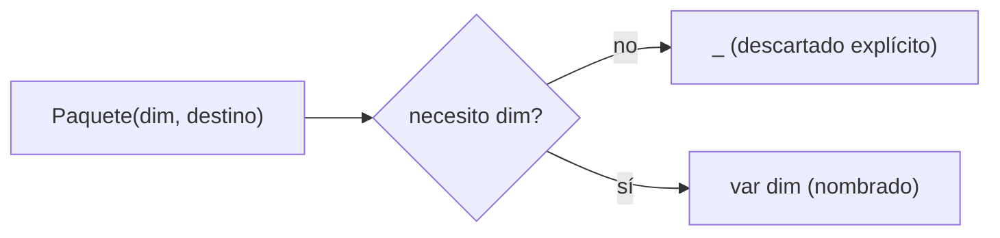

# Módulo 7: Records, sealed classes y pattern matching


## Aprende construyendo

### Tema 1: record — modelos inmutables sin boilerplate

#### Paso 1 · Objetivo y preparación
Al finalizar podrás modelar una entidad inmutable con `record`, con constructor compacto que valida sus invariantes. Prerrequisitos: JDK 21 y un editor. Comprueba java --version.

#### Paso 2 · Contexto y caso real
Una guía de entrega (número, peso, estado) no debería cambiar sus datos una vez creada; cualquier "actualización" real debería producir una nueva instancia, nunca mutar la existente en un lugar donde otro código todavía la referencia.

#### Paso 3 · Teoría, modelo mental y analogía
`record Guia(String numero, double pesoKg) {}` genera automáticamente constructor, getters (`numero()`, `pesoKg()`), `equals`/`hashCode`/`toString`, sin boilerplate manual. La analogía: un formulario impreso con campos en tinta permanente — para datos distintos, imprimes uno nuevo, no tachas el existente.

#### Paso 4 · Demostración guiada desde cero
Parte de una carpeta vacía:
```bash
mkdir ejemplo-record-guia
cd ejemplo-record-guia
mkdir -p src/main/java/academia/records
```
Crea `Guia.java` como `record` con un constructor compacto que valide `numero` no vacío y `pesoKg` positivo. Compila y ejecuta un `Main` que cree dos instancias con los mismos valores y confirme `equals()` por valor:
```bash
javac -d out src/main/java/academia/records/Guia.java
java -cp out academia.records.Main
```

#### Paso 5 · Práctica guiada
Pista: intenta asignar directamente `guia.pesoKg = 10` para provocar un fallo deliberado de compilación; los componentes de un record no tienen setters. Resultado esperado: confirmas que la única forma de "cambiar" un valor es construir una nueva instancia.

#### Paso 6 · Práctica independiente
Agrega un segundo record `Destinatario` y anídalo dentro de `Guia`; escribe una prueba que confirme que dos `Guia` con el mismo `Destinatario` (mismos valores) son `equals()`, aunque sean instancias distintas.

#### Paso 7 · Cierre y evidencia
Guarda `Guia`, la validación del constructor compacto y la prueba de igualdad por valor; como siguiente paso estudia sealed interfaces. Errores comunes: usar records para entidades mutables, abrir jerarquías por comodidad y ocultar un default que traga estados. Fuentes oficiales: https://dev.java/learn/classes-objects/records/ y https://openjdk.org/jeps/409.
**¿Por qué es importante?** Porque el lenguaje puede hacer que estados imposibles sean difíciles de representar.
**Evidencia de aprendizaje:** entrega jerarquía, switch exhaustivo, fallo y corrección.
**Conceptos clave:** generación automática de constructor/getters/equals/hashCode/toString, inmutabilidad.

Cada entidad de solo-datos del proyecto integrador de este track (una guía, una tarifa, una dirección) que no necesite identidad mutable debería modelarse como `record`, no como una clase tradicional con getters/setters manuales.

**Cuándo no usarlo:** un `record` no es apropiado para una entidad que genuinamente necesita mutar su estado a lo largo del tiempo (por ejemplo, una entidad gestionada por un ORM que actualiza campos en la base de datos); para esos casos, una clase tradicional con campos mutables sigue siendo la herramienta correcta.

`record Punto(int x, int y) {}` declara una clase inmutable completa en una única línea: el compilador genera automáticamente un constructor que acepta ambos componentes, métodos de acceso con el mismo nombre que cada componente (`p.x()`, `p.y()`, en vez de la convención `getX()`/`getY()` de una clase tradicional), y sobreescribe `equals()`, `hashCode()` y `toString()` basándose en el valor de todos los componentes declarados, reemplazando por completo el boilerplate que una clase POJO (Plain Old Java Object) tradicional requeriría escribir manualmente (o generar con un IDE, o delegar a una librería externa como Lombok) para lograr exactamente el mismo resultado.

Los componentes de un record son inherentemente inmutables (no existe ningún método generado automáticamente para modificar `x` o `y` después de construir el `Punto`), reflejando la intención de diseño de que un record modele datos que, una vez creados, no cambian — cualquier "modificación" real requiere construir una nueva instancia del record con los valores actualizados, en vez de mutar la instancia existente, el mismo principio de inmutabilidad estudiado de forma más general para signals en el Módulo 2 del track de Angular, aquí aplicado como una característica estructural del propio lenguaje Java para modelar datos.

**Analogía:** un record es como un formulario impreso con campos ya fijados en tinta permanente en el momento de imprimirse: puedes leer cualquier campo cuantas veces quieras, pero no puedes tachar y reescribir un valor existente; si necesitas datos distintos, imprimes un formulario completamente nuevo con los valores correctos, en vez de modificar el existente.

**¿Por qué es importante?** `record` elimina el boilerplate que una clase POJO tradicional requeriría para constructor, getters, `equals`, `hashCode` y `toString`, mientras impone inmutabilidad estructural como parte del diseño del lenguaje.

**Código del ejemplo:**

```java
record Punto(int x, int y) {}
// genera automáticamente: constructor, getters (x(), y()), equals, hashCode y toString

Punto p = new Punto(3, 4);
p.x(); // 3
```

### Tema 2: sealed — jerarquías cerradas y exhaustividad

#### Paso 1 · Objetivo y preparación
Al finalizar podrás cerrar una jerarquía de estados con `sealed`/`permits`, de modo que agregar un estado nuevo sin actualizar el código existente falle en compilación. Prerrequisitos: JDK 21 y un editor. Comprueba java --version.

#### Paso 2 · Contexto y caso real
Una entrega tiene un conjunto fijo de estados posibles (creada, en tránsito, entregada); si el código que procesa esos estados no se entera cuando alguien agrega un estado nuevo (cancelada), el nuevo estado queda silenciosamente sin manejar en producción.

#### Paso 3 · Teoría, modelo mental y analogía
`sealed interface EstadoEntrega permits Creada, EnTransito, Entregada {}` restringe qué tipos pueden implementar la interfaz, verificado por el compilador. La analogía: una lista cerrada y oficial de sucursales autorizadas de una franquicia, donde no se permite abrir una nueva sin actualizar esa lista.

#### Paso 4 · Demostración guiada desde cero
Parte de una carpeta vacía:
```bash
mkdir ejemplo-sealed-estados
cd ejemplo-sealed-estados
mkdir -p src/main/java/academia/estados
```
Crea `EstadoEntrega.java` como `sealed interface` con tres records implementándola (`Creada`, `EnTransito`, `Entregada`), y un método que use un `switch` exhaustivo sobre esos estados sin rama `default`. Compila y ejecuta:
```bash
javac -d out src/main/java/academia/estados/EstadoEntrega.java
java -cp out academia.estados.Main
```

#### Paso 5 · Práctica guiada
Pista: agrega un cuarto record `Cancelada implements EstadoEntrega` a la cláusula `permits` sin actualizar el `switch` existente para provocar un fallo deliberado de compilación; el compilador señala exactamente qué switch no cubre el caso nuevo. Resultado esperado: agregar la rama faltante restaura la compilación.

#### Paso 6 · Práctica independiente
Intenta declarar una quinta implementación de `EstadoEntrega` en otro archivo sin agregarla a `permits`; confirma que el compilador la rechaza inmediatamente.

#### Paso 7 · Cierre y evidencia
Guarda la jerarquía sellada, el error de compilación al agregar un estado nuevo sin manejarlo, y la corrección; como siguiente paso estudia pattern matching. Errores comunes: usar records para entidades mutables, abrir jerarquías por comodidad y ocultar un default que traga estados. Fuentes oficiales: https://dev.java/learn/classes-objects/records/ y https://openjdk.org/jeps/409.
**¿Por qué es importante?** Porque el lenguaje puede hacer que estados imposibles sean difíciles de representar.
**Evidencia de aprendizaje:** entrega jerarquía, switch exhaustivo, fallo y corrección.
**Conceptos clave:** `permits`, lista explícita de implementaciones válidas, verificación de exhaustividad.

Cada conjunto cerrado de estados del proyecto integrador de este track (estado de una entrega, tipo de notificación, rol de usuario) debería modelarse como `sealed`, para que el compilador obligue a manejar un estado nuevo en cada switch existente.

**Cuándo no usarlo:** `sealed` no tiene sentido para un conjunto de tipos genuinamente abierto a extensión externa (por ejemplo, un plugin que terceros pueden implementar); en ese caso una interfaz normal, sin restricción de `permits`, es la elección correcta.

`sealed interface Forma permits Circulo, Cuadrado {}` declara explícitamente, mediante la cláusula `permits`, exactamente qué clases o interfaces tienen permitido implementar o extender `Forma`, una restricción verificada por el compilador: ningún otro código, en ningún otro lugar del proyecto, puede crear una implementación adicional no listada en esa cláusula `permits`, a diferencia de una interfaz normal sin `sealed`, que cualquier clase en cualquier lugar puede implementar libremente sin ninguna restricción del compilador.

Esta restricción deliberada habilita una capacidad adicional en el pattern matching de switch (Tema 3): dado que el compilador conoce exactamente el conjunto completo y cerrado de implementaciones posibles de una sealed interface, puede verificar en tiempo de compilación que un switch sobre esa interfaz cubre absolutamente todos los casos posibles, sin necesidad de una rama `default` como red de seguridad — si en el futuro se agrega una nueva implementación a la lista `permits` pero se olvida agregar su caso correspondiente en algún switch existente en el código, el compilador falla inmediatamente en ese punto, señalando exactamente dónde falta cubrir el nuevo caso, en vez de dejar ese olvido como un bug silencioso que solo se manifestaría en producción cuando efectivamente se procese un objeto de ese nuevo tipo no contemplado.

**Analogía:** `sealed` es como una lista cerrada y oficial de sucursales autorizadas de una franquicia, donde no se permite abrir una sucursal nueva no autorizada explícitamente en esa lista; esto permite que cualquier proceso que dependa de conocer todas las sucursales existentes (como un switch exhaustivo) pueda confiar con certeza en que esa lista está efectivamente completa y no puede haber una sucursal adicional no contemplada apareciendo por sorpresa.

**¿Por qué es importante?** `sealed` permite que el compilador verifique exhaustividad en un switch sin necesidad de una rama `default`, detectando en tiempo de compilación cualquier caso nuevo agregado a la jerarquía que se haya olvidado cubrir en algún switch existente.

**Código del ejemplo:**

```java
sealed interface Forma permits Circulo, Cuadrado {}
record Circulo(double radio) implements Forma {}
record Cuadrado(double lado) implements Forma {}
```

### Tema 3: Pattern matching exhaustivo y para instanceof

#### Paso 1 · Objetivo y preparación
Al finalizar podrás calcular el costo de envío según el estado sellado de una entrega usando pattern matching, sin casteo manual. Prerrequisitos: JDK 21 y un editor. Comprueba java --version.

#### Paso 2 · Contexto y caso real
Calcular si una entrega puede reprogramarse depende de su estado exacto (no se puede reprogramar una ya `Entregada`); expresar esa lógica con casteos manuales anidados es más verboso y propenso a errores que un switch con pattern matching.

#### Paso 3 · Teoría, modelo mental y analogía
Un `switch` con pattern matching extrae directamente el valor ya tipado de cada rama, y el compilador verifica exhaustividad contra la jerarquía `sealed` (Tema 2), sin necesitar `default`. La analogía: verificar la identidad de alguien y recibir simultáneamente su credencial ya lista para usar, sin un paso adicional redundante.

#### Paso 4 · Demostración guiada desde cero
Parte de una carpeta vacía:
```bash
mkdir ejemplo-pattern-matching
cd ejemplo-pattern-matching
mkdir -p src/main/java/academia/patrones
```
Crea `CalculadoraReprogramacion.java` con un método `puedeReprogramarse(EstadoEntrega estado)` que use un `switch` exhaustivo sobre la jerarquía sellada del Tema 2 (`Creada` y `EnTransito` devuelven `true`, `Entregada` devuelve `false`). Compila y ejecuta:
```bash
javac -d out src/main/java/academia/patrones/CalculadoraReprogramacion.java
java -cp out academia.patrones.CalculadoraReprogramacion
```

#### Paso 5 · Práctica guiada
Pista: agrega el estado `Cancelada` (del Tema 2) a la jerarquía sin actualizar este switch para provocar un fallo deliberado de compilación; el compilador señala que `puedeReprogramarse` no cubre `Cancelada`. Resultado esperado: agregar esa rama restaura la compilación exhaustiva.

#### Paso 6 · Práctica independiente
Reescribe una comprobación equivalente usando el patrón clásico (`instanceof` + casteo manual) y compara la legibilidad con la versión de pattern matching; documenta en una frase cuál preferirías mantener.

#### Paso 7 · Cierre y evidencia
Guarda ambas versiones (pattern matching y casteo clásico) y el error de exhaustividad al agregar `Cancelada`; como siguiente paso estudia módulos y JPMS. Errores comunes: usar records para entidades mutables, abrir jerarquías por comodidad y ocultar un default que traga estados. Fuentes oficiales: https://dev.java/learn/classes-objects/records/ y https://openjdk.org/jeps/409.
**¿Por qué es importante?** Porque el lenguaje puede hacer que estados imposibles sean difíciles de representar.
**Evidencia de aprendizaje:** entrega jerarquía, switch exhaustivo, fallo y corrección.
**Conceptos clave:** switch sin default verificado, eliminación del casteo manual clásico.

Cada regla de negocio del proyecto integrador de este track que dependa del estado exacto de una entidad sellada se beneficiará de este mismo patrón: switch exhaustivo, sin `default`, verificado por el compilador.

**Cuándo no usarlo:** agregar una rama `default` a un switch exhaustivo sobre una sealed interface, "por si acaso", anula justamente la verificación de exhaustividad que `sealed` habilita — solo omite `default` cuando genuinamente quieres que el compilador te obligue a cubrir cada caso nuevo.

```java
double area(Forma forma) {
    return switch (forma) {
        case Circulo c -> Math.PI * c.radio() * c.radio();
        case Cuadrado q -> q.lado() * q.lado();
    };
}
```

Este switch combina pattern matching (extrayendo directamente `c`/`q` ya tipados correctamente según cada caso, sin casteo manual explícito) con la verificación de exhaustividad habilitada por `sealed` (Tema 2): el compilador verifica que este switch efectivamente cubre absolutamente todos los casos posibles de la sealed interface `Forma` (`Circulo` y `Cuadrado`, y ningún otro caso posible dado que `permits` los restringe exactamente a esos dos), permitiendo omitir por completo una rama `default`, dado que no existe ningún caso adicional posible que esa rama tendría que cubrir.

```java
if (obj instanceof Circulo c) {
    System.out.println(c.radio());
}
```

Este pattern matching para `instanceof` reemplaza el patrón clásico anterior (`if (obj instanceof Circulo) { Circulo c = (Circulo) obj; ... }`, que requería un casteo manual explícito y redundante inmediatamente después de la verificación `instanceof`) con una única expresión que verifica el tipo y simultáneamente declara una variable ya correctamente tipada (`c`) disponible directamente dentro del bloque donde la verificación resultó verdadera, eliminando la redundancia y el riesgo de un casteo manual incorrecto que el patrón clásico anterior conllevaba.

**Analogía:** un switch exhaustivo verificado por el compilador es como un formulario de clasificación que garantiza automáticamente que cada categoría posible de un conjunto cerrado y conocido tiene su propio casillero correspondiente, sin necesidad de un casillero genérico de "otros" como respaldo; pattern matching para instanceof es como verificar la identidad de alguien y recibir simultáneamente su credencial ya lista para usar, en vez de verificar la identidad y luego tener que solicitar la credencial por separado en un paso adicional redundante.

**¿Por qué es importante?** El pattern matching exhaustivo garantiza, verificado por el compilador, que ningún caso posible de una sealed interface quede sin cubrir; el pattern matching para instanceof elimina la redundancia y el riesgo del casteo manual clásico.

**Código del ejemplo:**

```java
double area(Forma forma) {
    return switch (forma) {
        case Circulo c -> Math.PI * c.radio() * c.radio();
        case Cuadrado q -> q.lado() * q.lado();
        // sin default: el compilador verifica que cubriste TODOS los casos posibles de Forma
    };
}

if (obj instanceof Circulo c) {
    System.out.println(c.radio()); // sin casteo manual: c ya es de tipo Circulo aquí
}
```

### Tema 4: Unnamed variables y patterns (_, Java 22)

#### Paso 1 · Objetivo y preparación
Al finalizar vas a usar el patrón `_` (unnamed variables, Java 22) para descartar explícitamente un componente de un record pattern que no necesitás, y en un bloque `catch` que no necesita la excepción. Prerrequisitos: JDK 22+ y Tema 2 de este módulo.

#### Paso 2 · Contexto y caso real
Al deconstruir un record `Paquete(Dimensiones dim, String destino)` con pattern matching, un método solo necesita `destino`; nombrar la parte que no usás con un identificador real genera una advertencia de "variable no utilizada" que el equipo aprendió a ignorar — y esa misma advertencia ignorada por costumbre ocultó, en un cambio reciente, una variable genuinamente olvidada en otro método completamente distinto.

#### Paso 3 · Teoría, modelo mental y analogía
Las unnamed patterns (`_`, finalizadas en Java 22) permiten descartar explícitamente un binding de un pattern match (record pattern, catch, o lambda) que no se va a usar, dejando una sintaxis reservada exclusivamente para "esto es deliberado", distinta de cualquier variable nombrada. La analogía: una casilla de formulario marcada "N/A" frente a una casilla vacía — nadie puede distinguir si la dejaron vacía a propósito o si se olvidaron de completarla.

#### Paso 4 · Demostración guiada desde cero
Crea `src/main/java/academia/patrones/ExtractorDestino.java`:
```java
String resumen(Paquete paquete) {
    return switch (paquete) {
        case Paquete(Dimensiones _, String destino) -> "Destino: " + destino;
    };
}
```
Resultado esperado: el compilador acepta `_` como un marcador explícito de "este componente del record pattern es deliberadamente ignorado", sin generar ninguna advertencia de variable no utilizada, y sin que `_` quede disponible como variable dentro del bloque.

Además, Java 15 introdujo los **text blocks** (`"""`) para escribir texto multilínea sin concatenar ni escapar comillas. Declara en el mismo archivo una consulta de ejemplo:
```java
String consulta = """
    SELECT numero, estado
    FROM entregas
    WHERE estado = 'EN_RUTA'
    """;
```
Resultado esperado: `consulta` contiene las tres líneas separadas por salto de línea, sin ningún `\n` ni `+` explícito en el código; Java elimina automáticamente la sangría común a todas las líneas, tomando como referencia la sangría de la comilla de cierre. **Fallo deliberado:** desalinea la comilla de cierre `""";` moviéndola una columna más a la izquierda que el texto interior. El compilador deja de eliminar correctamente la sangría incidental y cada línea del resultado aparece con un espacio extra al inicio que no estaba en la intención original — la sangría del delimitador de cierre, y no la del texto, es la que determina cuánto se recorta.

#### Paso 5 · Práctica guiada
Pista: nombrá la parte descartada con un identificador real sin uso (`Dimensiones dimensionesSinUsar`) en varios métodos distintos del proyecto, "para que quede más descriptivo". Ese es el fallo deliberado: el linter ahora reporta "variable no utilizada" en cada uno de esos métodos junto con las advertencias legítimas de variables genuinamente olvidadas, y el equipo termina ignorando TODAS las advertencias de esa categoría por volumen, incluyendo la que señalaba un error real.

#### Paso 6 · Práctica independiente
Corregí el Paso 5 reemplazando cada binding deliberadamente descartado por `_`, y confirmá que el linter ahora reporta únicamente las advertencias de variables genuinamente olvidadas, sin el ruido de las deliberadamente ignoradas.

#### Paso 7 · Cierre y evidencia
Entregá el record pattern con `_` del Paso 4, el text block de la consulta SQL con su fallo de sangría corregido, el ruido de advertencias por nombrar variables descartadas del Paso 5, y la señal limpia del linter del Paso 6; explicá por qué una sintaxis reservada exclusivamente para "descartado a propósito" reduce el ruido que oculta advertencias legítimas. Siguiente paso: aplica records, sealed interfaces, pattern matching, text blocks y unnamed variables juntos en el dominio del proyecto integrador (Módulo 13). Errores comunes: nombrar bindings descartados con nombres reales que generan ruido de lint, usar `_` para un binding que SÍ se usa más adelante (no compila), asumir que `_` es una variable utilizable (es un marcador, no un identificador), y desalinear la comilla de cierre de un text block esperando que la sangría se ajuste sola. Fuentes oficiales: https://openjdk.org/jeps/0 y https://docs.oracle.com/en/java/javase/22/language/unnamed-variables-and-patterns.html.
**¿Por qué es importante?** Porque el lenguaje puede hacer que estados imposibles sean difíciles de representar, y también que lo deliberadamente ignorado sea indistinguible de lo olvidado si no existe una sintaxis reservada para expresar esa intención.
**Evidencia de aprendizaje:** entrega record pattern con _, el text block SQL con su fallo de sangría corregido, ruido de advertencias reproducido y señal limpia del linter confirmada.
**Conceptos clave:** unnamed variables, unnamed patterns, _, catch sin binding, descartar un componente de un record pattern, text blocks (`"""`).

Cada deconstrucción del proyecto integrador de este track que no necesite todos los componentes de un record pattern debería usar `_` para los que descarta, en vez de nombrarlos igual sin usarlos.

**Cuándo no usarlo:** si existe cualquier posibilidad de que el binding se use más adelante en el mismo bloque, nómbralo normalmente; `_` no es una variable y el compilador rechaza cualquier intento de leerlo.

```java
try {
    return Integer.parseInt(texto);
} catch (NumberFormatException _) {
    return 0; // no necesitamos el detalle de la excepción, solo saber que ocurrió
}
```



Esta sintaxis también aplica a bloques `catch`, lambdas con parámetros no usados, y bucles `for` tradicionales con un índice no usado; en todos los casos, `_` deja una señal explícita e inconfundible de que ese binding es deliberadamente ignorado, distinta de cualquier variable nombrada (que el compilador y los linters tratan como potencialmente usada en otra parte).

**Analogía:** `_` es como una casilla de formulario marcada explícitamente "N/A"; una variable nombrada sin usar es como una casilla vacía — nadie puede distinguir con certeza si fue dejada vacía a propósito o si simplemente se olvidó completarla.

**¿Por qué es importante?** `_` elimina la ambigüedad entre "deliberadamente ignorado" y "olvidado", reduciendo el ruido de advertencias de variables no utilizadas que puede ocultar advertencias legítimas.

**Código del ejemplo:**

```java
String resumen(Paquete paquete) {
    return switch (paquete) {
        case Paquete(Dimensiones _, String destino) -> "Destino: " + destino;
    };
}
```

---


## Construcción guiada del capítulo

**Objetivo del laboratorio:** modelar un dominio inmutable con records y sealed interfaces, con pattern matching exhaustivo.

**Requisitos previos:** Módulos 0-6 completados.

| Paso | Acción | Código | Explicación |
|---|---|---|---|
| 1 | Definir `Punto` como record | Ver Tema 1 | Verifica los métodos generados automáticamente |
| 2 | Definir `Forma` como sealed interface | Ver Tema 2 | Con `Circulo` y `Cuadrado` como records |
| 3 | Escribir un switch exhaustivo sin `default` | Ver Tema 3 | Verifica el error del compilador si falta un caso |
| 4 | Usar pattern matching para instanceof | Ver Tema 3 | Sin casteo manual |
| 5 | Escribir un text block para SQL multilínea | Ver Tema 4 | Con `"""`, cuidando la sangría de la comilla de cierre |
| 6 | Descartar un componente de un record pattern con `_` | Ver Tema 4 | Sin ruido de lint por variables no utilizadas |

**Verificación:** el laboratorio se considera exitoso si agregar una nueva implementación a `permits` sin actualizar el switch existente produce un error de compilación (no un bug silencioso), si el modelo de dominio es completamente inmutable, y si el linter no reporta ninguna advertencia sobre los componentes descartados con `_`.

**Errores comunes y soluciones**

- **Agregar una rama `default` innecesaria a un switch exhaustivo sobre una sealed interface.** Omítela para que el compilador verifique exhaustividad real.
- **Intentar mutar un componente de un record.** Los records son inmutables; construye una nueva instancia con los valores actualizados.
- **Usar el casteo manual clásico donde pattern matching para instanceof sería más claro.** Prefiere `if (obj instanceof Tipo variable)`.
- **Nombrar un binding descartado con un identificador real.** Usa `_` para que el linter no mezcle ese ruido con advertencias legítimas de variables olvidadas.

---
