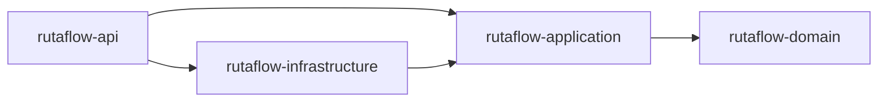

# Módulo 8: Build tools — Maven y Gradle


## Aprende construyendo

### Tema 1: pom.xml vs build.gradle.kts

#### Paso 1 · Objetivo y preparación
Al finalizar podrás crear un build reproducible desde cero. Prerrequisitos: JDK 21, Maven o Gradle y un editor. Comprueba java --version y mvn --version.

#### Paso 2 · Contexto y caso real
En un caso real, un equipo necesita compilar, probar y publicar el mismo artefacto en local y CI con dependencias verificables.

#### Paso 3 · Teoría, modelo mental y analogía
Maven y Gradle describen tareas, dependencias y plugins; scopes separan lo necesario en compilación de lo necesario en runtime. Un multi-módulo explicita límites y orden de construcción. La analogía es una línea de producción: cada estación tiene insumos y un resultado versionado.

#### Paso 4 · Demostración guiada desde cero
Parte de una carpeta vacía:
```bash
mkdir ejemplo-java-m8
cd ejemplo-java-m8
mvn -B archetype:generate -DgroupId=com.example -DartifactId=app -DarchetypeArtifactId=maven-archetype-quickstart -DinteractiveMode=false
cd app
mvn test
```
Revisa pom.xml, añade una dependencia fijada y ejecuta el ciclo completo.

#### Paso 5 · Práctica guiada
Pista: cambia deliberadamente una versión inexistente para provocar un fallo deliberado de resolución; lee el diagnóstico y corrígela. Resultado esperado: build verde y dependencia reproducible.

#### Paso 6 · Práctica independiente
Divide dominio y API en dos módulos, añade una prueba por módulo y documenta qué dependencias no deben cruzar la frontera.

#### Paso 7 · Cierre y evidencia
Guarda árbol, logs y archivo de dependencias; como siguiente paso conecta el build a CI. Errores comunes: versiones flotantes, scopes incorrectos, plugin sin fijar y módulos acoplados circularmente. Fuentes oficiales: https://maven.apache.org/guides/ y https://docs.gradle.org/current/userguide/.
**¿Por qué es importante?** Porque un build reproducible es parte del producto y de la cadena de suministro.
**Evidencia de aprendizaje:** entrega build verde, fallo corregido, árbol multi-módulo y explicación.
**Conceptos clave:** declaración de dependencias, XML declarativo frente a DSL de Kotlin.

Maven declara dependencias en un archivo `pom.xml` estructurado en XML: `<dependency><groupId>com.fasterxml.jackson.core</groupId><artifactId>jackson-databind</artifactId><version>2.17.0</version></dependency>`, un formato completamente declarativo donde el orden de las secciones sigue una convención estricta impuesta por Maven, con relativamente poca flexibilidad para lógica de configuración condicional o dinámica dentro del propio archivo de configuración.

Gradle, usando su Kotlin DSL, declara las mismas dependencias con una sintaxis considerablemente más concisa (`implementation("com.fasterxml.jackson.core:jackson-databind:2.17.0")`) y, al ser efectivamente código Kotlin ejecutable (no solo datos declarativos estáticos), permite expresar lógica de configuración condicional o programática cuando resulta necesaria (por ejemplo, aplicar cierta configuración solo bajo ciertas condiciones específicas del entorno de build), una flexibilidad que el XML puramente declarativo de Maven no ofrece con la misma naturalidad, aunque a cambio de una curva de aprendizaje inicial ligeramente mayor para quien no está familiarizado con Kotlin como lenguaje de configuración.

**Analogía:** `pom.xml` es como un formulario impreso con casillas fijas y un orden estricto predefinido, apropiado para casos estándar pero rígido ante necesidades especiales; el DSL de Gradle es como una hoja de cálculo programable donde se pueden escribir fórmulas y lógica condicional según se necesite, ofreciendo mayor flexibilidad a costa de requerir familiaridad con su sintaxis de programación.

**¿Por qué es importante?** Gradle (Kotlin DSL) ofrece mayor flexibilidad para lógica de configuración condicional que el XML puramente declarativo de Maven, a cambio de una curva de aprendizaje ligeramente mayor y menor previsibilidad estructural que la rigidez estándar de Maven.

**Configuración del ejemplo:**

```xml
<dependencies>
  <dependency>
    <groupId>com.fasterxml.jackson.core</groupId>
    <artifactId>jackson-databind</artifactId>
    <version>2.17.0</version>
  </dependency>
</dependencies>
```
```kotlin
dependencies {
    implementation("com.fasterxml.jackson.core:jackson-databind:2.17.0")
    testImplementation("org.junit.jupiter:junit-jupiter:5.10.0")
}
```

#### Construcción RutaFlow: elegir y fijar una herramienta

En la raíz del proyecto acumulativo conserva Gradle con `settings.gradle.kts`, `build.gradle.kts` y el wrapper. Declara Java 21 mediante toolchain, Jackson como `implementation` y JUnit como `testImplementation`. Ejecuta `./gradlew clean build`; el resultado esperado es `BUILD SUCCESSFUL` y un JAR bajo `build/libs/`.

Quita la versión de una dependencia y observa el error de resolución; restáurala o usa un catálogo de versiones controlado. Ejecuta `./gradlew dependencies` para entender qué llega transitivamente y añade bloqueo/verificación de dependencias. Como modificación, reproduce el build desde una clonación limpia usando solo el wrapper. RutaFlow no mantiene Maven y Gradle simultáneamente: se comparan para aprender, pero el producto elige uno para evitar dos fuentes de verdad.

### Tema 2: Ciclo de vida de build y scopes

#### Paso 1 · Objetivo y preparación
Al finalizar podrás crear un build reproducible desde cero. Prerrequisitos: JDK 21, Maven o Gradle y un editor. Comprueba java --version y mvn --version.

#### Paso 2 · Contexto y caso real
En un caso real, un equipo necesita compilar, probar y publicar el mismo artefacto en local y CI con dependencias verificables.

#### Paso 3 · Teoría, modelo mental y analogía
Maven y Gradle describen tareas, dependencias y plugins; scopes separan lo necesario en compilación de lo necesario en runtime. Un multi-módulo explicita límites y orden de construcción. La analogía es una línea de producción: cada estación tiene insumos y un resultado versionado.

#### Paso 4 · Demostración guiada desde cero
Parte de una carpeta vacía:
```bash
mkdir ejemplo-java-m8
cd ejemplo-java-m8
mvn -B archetype:generate -DgroupId=com.example -DartifactId=app -DarchetypeArtifactId=maven-archetype-quickstart -DinteractiveMode=false
cd app
mvn test
```
Revisa pom.xml, añade una dependencia fijada y ejecuta el ciclo completo.

#### Paso 5 · Práctica guiada
Pista: cambia deliberadamente una versión inexistente para provocar un fallo deliberado de resolución; lee el diagnóstico y corrígela. Resultado esperado: build verde y dependencia reproducible.

#### Paso 6 · Práctica independiente
Divide dominio y API en dos módulos, añade una prueba por módulo y documenta qué dependencias no deben cruzar la frontera.

#### Paso 7 · Cierre y evidencia
Guarda árbol, logs y archivo de dependencias; como siguiente paso conecta el build a CI. Errores comunes: versiones flotantes, scopes incorrectos, plugin sin fijar y módulos acoplados circularmente. Fuentes oficiales: https://maven.apache.org/guides/ y https://docs.gradle.org/current/userguide/.
**¿Por qué es importante?** Porque un build reproducible es parte del producto y de la cadena de suministro.
**Evidencia de aprendizaje:** entrega build verde, fallo corregido, árbol multi-módulo y explicación.
**Conceptos clave:** fases secuenciales, `mvn clean compile test package`, dependencias por scope.

Maven define un ciclo de vida de build compuesto por fases secuenciales estándar y predefinidas: `mvn clean compile test package` ejecuta, en orden, la limpieza de artefactos de builds anteriores, la compilación del código fuente, la ejecución de las pruebas, y el empaquetado del resultado final (típicamente un `.jar`), donde cada fase posterior implica automáticamente la ejecución de todas las fases anteriores necesarias (invocar `package` directamente ejecuta también `compile` y `test` primero, sin necesidad de invocarlas explícitamente por separado).

Las dependencias declaradas para un proyecto pueden restringirse a un scope específico según en qué momento del ciclo de vida son necesarias: `testImplementation` en Gradle (o `<scope>test</scope>` en Maven) declara que una dependencia (como JUnit) es necesaria únicamente para compilar y ejecutar las pruebas, no para el artefacto final de producción, garantizando que esa dependencia no se incluya en el `.jar` final que efectivamente se despliega, reduciendo su tamaño y evitando exponer dependencias de testing (que podrían tener sus propias vulnerabilidades de seguridad o simplemente peso innecesario) en el artefacto que efectivamente llega a producción.

**Analogía:** el ciclo de vida de build es como una línea de producción con etapas secuenciales obligatorias (limpiar, ensamblar, probar, empaquetar), donde solicitar el producto empaquetado final automáticamente implica que todas las etapas anteriores necesarias ya se completaron; un scope de dependencia es como especificar que cierta herramienta solo se necesita durante el control de calidad interno de la línea de producción, sin que esa herramienta específica se incluya dentro de la caja final que efectivamente se envía al cliente.

**¿Por qué es importante?** Separar dependencias por scope (compile, test, runtime) evita incluir dependencias innecesarias en el artefacto final de producción, reduciendo su tamaño y su superficie de exposición a vulnerabilidades no relevantes para producción.

**Prueba en terminal:**

```bash
mvn clean compile test package   # ciclo de vida: limpia, compila, prueba, empaqueta
```

#### Construcción RutaFlow: comprobar el artefacto real

En `academia-java/build.gradle.kts` conserva JUnit bajo `dependencies { testImplementation(...) }`. Ejecuta `./gradlew clean test jar` y abre el JAR con `jar tf build/libs/*.jar`. Verifica que contiene clases de producción y no `GuiaTest.class` ni JUnit. Ejecuta después las pruebas con `./gradlew test --info` y consulta el reporte `build/reports/tests/test/index.html`.

Mueve JUnit de `testImplementation` a `implementation`, vuelve a inspeccionar dependencias y explica por qué amplía innecesariamente el classpath de producción. Restáuralo y provoca una prueba fallida: el build debe detener el empaquetado publicable. Como modificación, añade una tarea `check` a CI y conserva reportes como evidencia. El artefacto RutaFlow solo se publica si compilación, pruebas y empaquetado representan el mismo commit; un build exitoso no garantiza por sí solo compatibilidad ni seguridad, que requieren pruebas y análisis separados.

### Tema 3: Proyectos multi-módulo

#### Paso 1 · Objetivo y preparación
Al finalizar podrás crear un build reproducible desde cero. Prerrequisitos: JDK 21, Maven o Gradle y un editor. Comprueba java --version y mvn --version.

#### Paso 2 · Contexto y caso real
En un caso real, un equipo necesita compilar, probar y publicar el mismo artefacto en local y CI con dependencias verificables.

#### Paso 3 · Teoría, modelo mental y analogía
Maven y Gradle describen tareas, dependencias y plugins; scopes separan lo necesario en compilación de lo necesario en runtime. Un multi-módulo explicita límites y orden de construcción. La analogía es una línea de producción: cada estación tiene insumos y un resultado versionado.

#### Paso 4 · Demostración guiada desde cero
Parte de una carpeta vacía:
```bash
mkdir ejemplo-java-m8
cd ejemplo-java-m8
mvn -B archetype:generate -DgroupId=com.example -DartifactId=app -DarchetypeArtifactId=maven-archetype-quickstart -DinteractiveMode=false
cd app
mvn test
```
Revisa pom.xml, añade una dependencia fijada y ejecuta el ciclo completo.

#### Paso 5 · Práctica guiada
Pista: cambia deliberadamente una versión inexistente para provocar un fallo deliberado de resolución; lee el diagnóstico y corrígela. Resultado esperado: build verde y dependencia reproducible.

#### Paso 6 · Práctica independiente
Divide dominio y API en dos módulos, añade una prueba por módulo y documenta qué dependencias no deben cruzar la frontera.

#### Paso 7 · Cierre y evidencia
Guarda árbol, logs y archivo de dependencias; como siguiente paso conecta el build a CI. Errores comunes: versiones flotantes, scopes incorrectos, plugin sin fijar y módulos acoplados circularmente. Fuentes oficiales: https://maven.apache.org/guides/ y https://docs.gradle.org/current/userguide/.
**¿Por qué es importante?** Porque un build reproducible es parte del producto y de la cadena de suministro.
**Evidencia de aprendizaje:** entrega build verde, fallo corregido, árbol multi-módulo y explicación.
**Conceptos clave:** separación de responsabilidades entre módulos, dependencias explícitas entre ellos.

Un proyecto multi-módulo divide una aplicación grande en subproyectos independientes que se compilan como parte de un mismo build coordinado, pero con límites explícitos entre ellos: un módulo `core` conteniendo la lógica de dominio central, y un módulo `api` que depende de `core` para exponer esa lógica a través de HTTP, con la configuración raíz compartida (`build.gradle.kts` en la raíz del proyecto) coordinando cómo se construyen ambos módulos juntos, mientras cada módulo mantiene su propio conjunto de dependencias específicas, declaradas explícitamente según lo que ese módulo particular efectivamente necesita, sin heredar automáticamente dependencias de otros módulos que no declaró explícitamente requerir.

Esta estructura refleja a nivel de proyecto completo el mismo principio de límites explícitos estudiado para JPMS en el Módulo 10: separar `core` de `api` en módulos de build distintos (no solo en paquetes distintos dentro de un único módulo) impone una verificación adicional a nivel de herramienta de build de que `api` efectivamente declara su dependencia hacia `core` de forma explícita, y previene que código de `core` acceda accidentalmente a tipos definidos únicamente en `api` (una dirección de dependencia que normalmente no tendría sentido en una arquitectura por capas bien diseñada), dado que `core`, al no declarar una dependencia hacia `api`, simplemente no tiene acceso a su código en tiempo de compilación.

**Analogía:** un proyecto multi-módulo es como una empresa organizada en departamentos separados con presupuestos y recursos propios declarados explícitamente, donde un departamento que necesita recursos de otro debe solicitarlos formalmente (declarar la dependencia), en vez de que todos los departamentos compartan automáticamente todos los recursos de todos los demás sin ninguna distinción ni control.

**¿Por qué es importante?** Un proyecto multi-módulo impone límites explícitos de dependencia entre subproyectos, verificados por la herramienta de build, previniendo dependencias accidentales en direcciones no deseadas dentro de la arquitectura del proyecto.

**Diagrama:**



#### Construcción RutaFlow: límites compilables

Edita `settings.gradle.kts` para incluir `rutaflow-domain`, `rutaflow-application`, `rutaflow-infrastructure` y `rutaflow-api`. En cada carpeta crea su `build.gradle.kts`; `application` depende de `domain`, `infrastructure` de `application`, y `api` ensambla ambas. Mueve `Guia` a domain y un caso de uso a application. Ejecuta `./gradlew build`; todos los módulos deben quedar verdes.

Declara accidentalmente que `domain` depende de `api` y observa el ciclo o la violación arquitectónica que debe impedir una prueba de arquitectura. Elimina esa dependencia y expón un puerto en application para que infraestructura lo implemente. Como modificación, ejecuta `./gradlew projects` y dibuja las dependencias reales, comparándolas con Mermaid. Estos límites permiten que RutaFlow sustituya consola, base de datos o framework sin reescribir reglas centrales.

---


## Construcción guiada del capítulo

**Objetivo del laboratorio:** construir un proyecto multi-módulo con Gradle (o Maven) con dependencias bien acotadas.

**Requisitos previos:** Módulos 0-7 completados.

| Paso | Acción | Código | Explicación |
|---|---|---|---|
| 1 | Crear un proyecto con Maven y otro con Gradle | `mvn archetype:generate` / `gradle init` | Compara la estructura generada |
| 2 | Agregar una dependencia externa en ambos | Ver Tema 1 | Ejecuta el build en ambos casos |
| 3 | Ejecutar el ciclo de vida completo de Maven | `mvn clean compile test package` | Verifica el orden de las fases |
| 4 | Configurar un scope test-only | Ver Tema 2 | Verifica que no va al artefacto final |
| 5 | Estructurar un proyecto multi-módulo | Ver Tema 3 | `core` + `api` dependiente de `core` |

**Verificación:** el laboratorio se considera exitoso si el artefacto final de producción no incluye dependencias declaradas con scope de test, y si el módulo `api` compila correctamente su dependencia explícita hacia `core`.

**Errores comunes y soluciones**

- **Declarar una dependencia de testing sin el scope apropiado.** Usa `testImplementation`/`<scope>test</scope>` para que no se incluya en el artefacto final.
- **Permitir que un módulo `core` dependa de un módulo `api`.** Verifica que la dirección de dependencia refleje la arquitectura por capas deseada.
- **Confundir la sintaxis entre `pom.xml` y `build.gradle.kts`.** Practica ambos formatos hasta sentirte cómodo con sus diferencias sintácticas.

---
