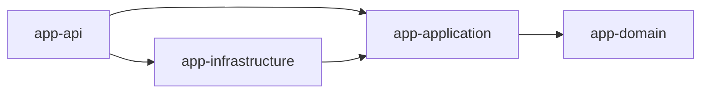

# Módulo 8: Build tools — Maven y Gradle


## Aprende construyendo

### Tema 1: pom.xml vs build.gradle.kts

#### Paso 1 · Objetivo y preparación
Al finalizar podrás generar un proyecto Maven desde cero y declarar una dependencia externa fijada por versión. Prerrequisitos: JDK 21, Maven o Gradle y un editor. Comprueba java --version y mvn --version.

#### Paso 2 · Contexto y caso real
Un equipo necesita compilar, probar y publicar el mismo artefacto en su máquina local y en CI, con dependencias exactamente reproducibles, no versiones que puedan resolver a un artefacto distinto según el día.

#### Paso 3 · Teoría, modelo mental y analogía
Maven declara dependencias en XML estructurado (`pom.xml`); Gradle las declara con su Kotlin DSL, más conciso y programable. La analogía: un formulario impreso con casillas fijas (Maven) frente a una hoja de cálculo programable con fórmulas (Gradle).

#### Paso 4 · Demostración guiada desde cero
Parte de una carpeta vacía:
```bash
mkdir ejemplo-maven-quickstart
cd ejemplo-maven-quickstart
mvn -B archetype:generate -DgroupId=academia.build -DartifactId=app -DarchetypeArtifactId=maven-archetype-quickstart -DinteractiveMode=false
cd app
mvn test
```
`mvn` es el comando que ejecuta Maven (aquí, el subcomando `archetype:generate` crea un proyecto desde una plantilla, y `test` corre las pruebas). Agrega `jackson-databind` fijada a una versión exacta en `pom.xml` y ejecuta de nuevo `mvn test`.

#### Paso 5 · Práctica guiada
Pista: fija deliberadamente una versión inexistente de `jackson-databind` (por ejemplo `99.99.99`) para provocar un fallo de resolución de dependencias; lee el mensaje de Maven, que identifica exactamente qué versión no pudo resolver. Resultado esperado: restaurar una versión real hace que el build vuelva a estar verde.

#### Paso 6 · Práctica independiente
Crea el mismo proyecto pero con Gradle (`gradle init`) y declara la misma dependencia en `build.gradle.kts`; compara ambas sintaxis lado a lado.

#### Paso 7 · Cierre y evidencia
Guarda ambos proyectos (Maven y Gradle), la dependencia fijada y el fallo de resolución provocado; como siguiente paso estudia el ciclo de vida de build. Errores comunes: versiones flotantes, scopes incorrectos, plugin sin fijar y módulos acoplados circularmente. Fuentes oficiales: https://maven.apache.org/guides/ y https://docs.gradle.org/current/userguide/.
**¿Por qué es importante?** Porque un build reproducible es parte del producto y de la cadena de suministro.
**Evidencia de aprendizaje:** entrega build verde, fallo corregido, árbol multi-módulo y explicación.
**Conceptos clave:** declaración de dependencias, XML declarativo frente a DSL de Kotlin.

Fijar versiones exactas de cada dependencia es un requisito del proyecto integrador de este track: un build que resuelve a una versión distinta en cada máquina no es reproducible ni auditable.

**Cuándo no usarlo:** para un script de un solo archivo sin dependencias externas, ni Maven ni Gradle aportan nada; `java` ejecutando directamente el archivo (sin build tool) es suficiente y más simple.

Maven declara dependencias en un archivo `pom.xml` estructurado en XML: `<dependency><groupId>com.fasterxml.jackson.core</groupId><artifactId>jackson-databind</artifactId><version>2.17.0</version></dependency>`, un formato completamente declarativo donde el orden de las secciones sigue una convención estricta impuesta por Maven, con relativamente poca flexibilidad para lógica de configuración condicional o dinámica dentro del propio archivo de configuración.

Gradle, usando su Kotlin DSL, declara las mismas dependencias con una sintaxis considerablemente más concisa (`implementation("com.fasterxml.jackson.core:jackson-databind:2.17.0")`) y, al ser efectivamente código Kotlin ejecutable (no solo datos declarativos estáticos), permite expresar lógica de configuración condicional o programática cuando resulta necesaria (por ejemplo, aplicar cierta configuración solo bajo ciertas condiciones específicas del entorno de build), una flexibilidad que el XML puramente declarativo de Maven no ofrece con la misma naturalidad, aunque a cambio de una curva de aprendizaje inicial ligeramente mayor para quien no está familiarizado con Kotlin como lenguaje de configuración.

**Analogía:** `pom.xml` es como un formulario impreso con casillas fijas y un orden estricto predefinido, apropiado para casos estándar pero rígido ante necesidades especiales; el DSL de Gradle es como una hoja de cálculo programable donde se pueden escribir fórmulas y lógica condicional según se necesite, ofreciendo mayor flexibilidad a costa de requerir familiaridad con su sintaxis de programación.

**¿Por qué es importante?** Gradle (Kotlin DSL) ofrece mayor flexibilidad para lógica de configuración condicional que el XML puramente declarativo de Maven, a cambio de una curva de aprendizaje ligeramente mayor y menor previsibilidad estructural que la rigidez estándar de Maven.

**Configuración del ejemplo:**

```xml
<dependencies>
  <dependency>
    <groupId>com.fasterxml.jackson.core</groupId>
    <artifactId>jackson-databind</artifactId>
    <version>2.17.0</version>
  </dependency>
</dependencies>
```
```kotlin
dependencies {
    implementation("com.fasterxml.jackson.core:jackson-databind:2.17.0")
    testImplementation("org.junit.jupiter:junit-jupiter:5.10.0")
}
```

### Tema 2: Ciclo de vida de build y scopes

#### Paso 1 · Objetivo y preparación
Al finalizar podrás demostrar que una dependencia con scope de test no llega al artefacto final de producción. Prerrequisitos: JDK 21, Maven y un editor. Comprueba java --version y mvn --version.

#### Paso 2 · Contexto y caso real
Un equipo descubre en una auditoría de seguridad que su `.jar` de producción incluye una librería de testing con una vulnerabilidad conocida, porque alguien declaró esa dependencia sin scope y quedó embebida en el artefacto que se despliega.

#### Paso 3 · Teoría, modelo mental y analogía
El ciclo de vida de Maven encadena fases obligatorias (`clean compile test package`); cada fase implica las anteriores. El scope de una dependencia decide en qué fases participa: `test` la limita a compilación y ejecución de pruebas, sin incluirla en el paquete final. La analogía: una línea de producción donde pedir el producto empaquetado implica que ya pasó por control de calidad, pero las herramientas de control de calidad no viajan dentro de la caja.

#### Paso 4 · Demostración guiada desde cero
Parte de una carpeta vacía:
```bash
mkdir ejemplo-scope-test
cd ejemplo-scope-test
mvn -B archetype:generate -DgroupId=academia.build -DartifactId=app -DarchetypeArtifactId=maven-archetype-quickstart -DinteractiveMode=false
cd app
mvn clean compile test package
```
`mvn clean compile test package` ejecuta las cuatro fases en orden. Revisa `target/app-1.0-SNAPSHOT.jar` con `jar tf target/app-1.0-SNAPSHOT.jar` y confirma que las clases de JUnit (scope `test`) no aparecen en el listado; el código fuente generado vive en `src/main/java/academia/build/App.java`.

#### Paso 5 · Práctica guiada
Pista: cambia deliberadamente el scope de JUnit de `test` a la ausencia de scope (compile por defecto) y reempaqueta; ahora las clases de JUnit sí aparecen en el jar. Resultado esperado: comparar ambos listados de `jar tf` te muestra en la práctica qué hace el scope.

#### Paso 6 · Práctica independiente
Agrega una segunda dependencia real (por ejemplo `jackson-databind`) sin scope, verifica que sí queda en el jar por ser necesaria en runtime, y documenta la diferencia frente a una dependencia de test.

#### Paso 7 · Cierre y evidencia
Guarda ambos listados de `jar tf` (con y sin scope test) y el pom.xml modificado; como siguiente paso divide el proyecto en módulos. Errores comunes: declarar dependencias de test sin scope, asumir que `package` no ejecuta `test` antes, y omitir `clean` entre builds con cambios de dependencias. Fuentes oficiales: https://maven.apache.org/guides/introduction/introduction-to-the-lifecycle.html.
**¿Por qué es importante?** Porque un artefacto de producción con dependencias de testing embebidas aumenta su superficie de ataque sin necesidad.
**Evidencia de aprendizaje:** entrega dos listados de `jar tf` comparados y la explicación de la diferencia.
**Conceptos clave:** fases secuenciales, `mvn clean compile test package`, dependencias por scope.

Maven define un ciclo de vida de build compuesto por fases secuenciales estándar y predefinidas: `mvn clean compile test package` ejecuta, en orden, la limpieza de artefactos de builds anteriores, la compilación del código fuente, la ejecución de las pruebas, y el empaquetado del resultado final (típicamente un `.jar`), donde cada fase posterior implica automáticamente la ejecución de todas las fases anteriores necesarias (invocar `package` directamente ejecuta también `compile` y `test` primero, sin necesidad de invocarlas explícitamente por separado).

Las dependencias declaradas para un proyecto pueden restringirse a un scope específico según en qué momento del ciclo de vida son necesarias: `testImplementation` en Gradle (o `<scope>test</scope>` en Maven) declara que una dependencia (como JUnit) es necesaria únicamente para compilar y ejecutar las pruebas, no para el artefacto final de producción, garantizando que esa dependencia no se incluya en el `.jar` final que efectivamente se despliega, reduciendo su tamaño y evitando exponer dependencias de testing (que podrían tener sus propias vulnerabilidades de seguridad o simplemente peso innecesario) en el artefacto que efectivamente llega a producción.

**Analogía:** el ciclo de vida de build es como una línea de producción con etapas secuenciales obligatorias (limpiar, ensamblar, probar, empaquetar), donde solicitar el producto empaquetado final automáticamente implica que todas las etapas anteriores necesarias ya se completaron; un scope de dependencia es como especificar que cierta herramienta solo se necesita durante el control de calidad interno de la línea de producción, sin que esa herramienta específica se incluya dentro de la caja final que efectivamente se envía al cliente.

**¿Por qué es importante?** Separar dependencias por scope (compile, test, runtime) evita incluir dependencias innecesarias en el artefacto final de producción, reduciendo su tamaño y su superficie de exposición a vulnerabilidades no relevantes para producción.

**Prueba en terminal:**

```bash
mvn clean compile test package   # ciclo de vida: limpia, compila, prueba, empaqueta
```

Verificar los scopes de dependencia antes de empaquetar es un paso de calidad que el proyecto integrador de este track exige en su pipeline de build.

**Cuándo no usarlo:** en un prototipo descartable de un solo archivo sin dependencias de test, distinguir scopes es sobreingeniería; solo importa una vez que hay una suite de pruebas real.

### Tema 3: Proyectos multi-módulo

#### Paso 1 · Objetivo y preparación
Al finalizar podrás dividir un proyecto Maven en dos módulos (`core` y `api`) con una dependencia explícita entre ellos. Prerrequisitos: JDK 21, Maven y un editor. Comprueba java --version y mvn --version.

#### Paso 2 · Contexto y caso real
Un proyecto de un solo módulo crece hasta que cualquier cambio en la lógica de dominio obliga a recompilar y volver a probar toda la capa HTTP también; separar `core` de `api` en módulos de build distintos hace explícito qué depende de qué y permite compilar y probar cada uno por separado.

#### Paso 3 · Teoría, modelo mental y analogía
Un proyecto multi-módulo agrupa subproyectos bajo un POM padre; cada módulo declara explícitamente sus propias dependencias, incluidas las dependencias hacia otros módulos del mismo proyecto. La analogía: departamentos con presupuesto propio que deben solicitar formalmente los recursos de otro departamento, en vez de compartirlo todo automáticamente.

#### Paso 4 · Demostración guiada desde cero
Parte de una carpeta vacía:
```bash
mkdir ejemplo-multimodulo && cd ejemplo-multimodulo
mvn -B archetype:generate -DgroupId=academia.build -DartifactId=core -DarchetypeArtifactId=maven-archetype-quickstart -DinteractiveMode=false
mvn -B archetype:generate -DgroupId=academia.build -DartifactId=api -DarchetypeArtifactId=maven-archetype-quickstart -DinteractiveMode=false
```
Crea un `pom.xml` raíz con `<modules><module>core</module><module>api</module></modules>`, y en `api/pom.xml` agrega una `<dependency>` hacia `academia.build:core`. Ejecuta `mvn -pl api -am compile` desde la raíz: `-am` (also-make) construye primero `core` porque `api` depende de él.

#### Paso 5 · Práctica guiada
Pista: elimina deliberadamente la dependencia de `api` hacia `core` en su pom.xml y compila `api` referenciando una clase de `core`; provocarás un fallo de compilación por símbolo no encontrado. Resultado esperado: restaurar la dependencia explícita corrige el fallo.

#### Paso 6 · Práctica independiente
Agrega un tercer módulo `infra` que dependa de `api`, y documenta por qué `core` no debería depender nunca de `infra` ni de `api`.

#### Paso 7 · Cierre y evidencia
Guarda la estructura de los tres módulos, el pom.xml raíz y el fallo de compilación provocado al romper la dependencia; como siguiente paso conecta el multi-módulo a un pipeline de CI. Errores comunes: dependencias circulares entre módulos, olvidar `-am` al compilar un módulo específico, y permitir que `core` dependa de módulos que deberían depender de él. Fuentes oficiales: https://maven.apache.org/guides/mini/guide-multiple-modules.html.
**¿Por qué es importante?** Porque separar módulos de build impone, a nivel de herramienta, los mismos límites arquitectónicos que el equipo diseñó a nivel de capas.
**Evidencia de aprendizaje:** entrega los tres módulos, el fallo de compilación provocado y su corrección.
**Conceptos clave:** separación de responsabilidades entre módulos, dependencias explícitas entre ellos.

Un proyecto multi-módulo divide una aplicación grande en subproyectos independientes que se compilan como parte de un mismo build coordinado, pero con límites explícitos entre ellos: un módulo `core` conteniendo la lógica de dominio central, y un módulo `api` que depende de `core` para exponer esa lógica a través de HTTP, con la configuración raíz compartida (`build.gradle.kts` en la raíz del proyecto) coordinando cómo se construyen ambos módulos juntos, mientras cada módulo mantiene su propio conjunto de dependencias específicas, declaradas explícitamente según lo que ese módulo particular efectivamente necesita, sin heredar automáticamente dependencias de otros módulos que no declaró explícitamente requerir.

Esta estructura refleja a nivel de proyecto completo el mismo principio de límites explícitos estudiado para JPMS en el Módulo 10: separar `core` de `api` en módulos de build distintos (no solo en paquetes distintos dentro de un único módulo) impone una verificación adicional a nivel de herramienta de build de que `api` efectivamente declara su dependencia hacia `core` de forma explícita, y previene que código de `core` acceda accidentalmente a tipos definidos únicamente en `api` (una dirección de dependencia que normalmente no tendría sentido en una arquitectura por capas bien diseñada), dado que `core`, al no declarar una dependencia hacia `api`, simplemente no tiene acceso a su código en tiempo de compilación.

**Analogía:** un proyecto multi-módulo es como una empresa organizada en departamentos separados con presupuestos y recursos propios declarados explícitamente, donde un departamento que necesita recursos de otro debe solicitarlos formalmente (declarar la dependencia), en vez de que todos los departamentos compartan automáticamente todos los recursos de todos los demás sin ninguna distinción ni control.

**¿Por qué es importante?** Un proyecto multi-módulo impone límites explícitos de dependencia entre subproyectos, verificados por la herramienta de build, previniendo dependencias accidentales en direcciones no deseadas dentro de la arquitectura del proyecto.

**Diagrama:**



La estructura `core`/`api` de este tema es, en miniatura, la misma separación que el Proyecto integrador (Módulo 13) exige entre la lógica de dominio y la capa que la expone.

**Cuándo no usarlo:** para una aplicación pequeña de un solo equipo y despliegue único, un multi-módulo añade sobrecarga de configuración sin beneficio; un solo módulo con paquetes bien organizados es suficiente hasta que el proyecto realmente lo justifique.

---


## Construcción guiada del capítulo

**Objetivo del laboratorio:** construir un proyecto multi-módulo con Gradle (o Maven) con dependencias bien acotadas.

**Requisitos previos:** Módulos 0-7 completados.

| Paso | Acción | Código | Explicación |
|---|---|---|---|
| 1 | Crear un proyecto con Maven y otro con Gradle | `mvn archetype:generate` / `gradle init` | Compara la estructura generada |
| 2 | Agregar una dependencia externa en ambos | Ver Tema 1 | Ejecuta el build en ambos casos |
| 3 | Ejecutar el ciclo de vida completo de Maven | `mvn clean compile test package` | Verifica el orden de las fases |
| 4 | Configurar un scope test-only | Ver Tema 2 | Verifica que no va al artefacto final |
| 5 | Estructurar un proyecto multi-módulo | Ver Tema 3 | `core` + `api` dependiente de `core` |

**Verificación:** el laboratorio se considera exitoso si el artefacto final de producción no incluye dependencias declaradas con scope de test, y si el módulo `api` compila correctamente su dependencia explícita hacia `core`.

**Errores comunes y soluciones**

- **Declarar una dependencia de testing sin el scope apropiado.** Usa `testImplementation`/`<scope>test</scope>` para que no se incluya en el artefacto final.
- **Permitir que un módulo `core` dependa de un módulo `api`.** Verifica que la dirección de dependencia refleje la arquitectura por capas deseada.
- **Confundir la sintaxis entre `pom.xml` y `build.gradle.kts`.** Practica ambos formatos hasta sentirte cómodo con sus diferencias sintácticas.

---
