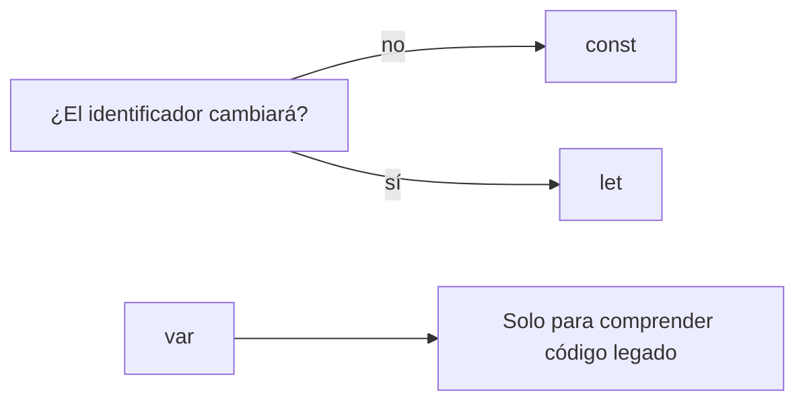
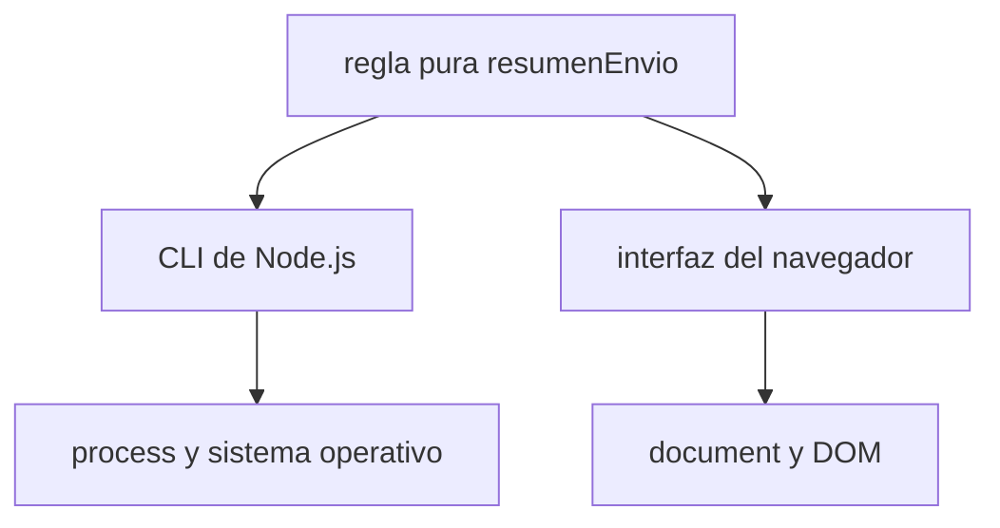

# Módulo 0: Fundamentos de JavaScript con ejemplos independientes

Cada tema comienza en su propia carpeta vacía. El proyecto integrador existe aparte y no es requisito para estudiar estas lecciones.

## Aprende construyendo

## Antes de comenzar: preparación del entorno

Instala [Node.js LTS](https://nodejs.org/en/download), [Visual Studio Code](https://code.visualstudio.com/) y [Git](https://git-scm.com/downloads). En Windows abre PowerShell; en macOS o Linux abre Terminal. Verifica:

```bash
node --version
npm --version
git --version
```

Las tres instrucciones deben mostrar una versión. Si `node` no se reconoce, cierra y abre la terminal; si continúa, reinstala Node.js LTS y permite que el instalador actualice `PATH`.

Crea el proyecto exactamente así:

```bash
mkdir academia-javascript
cd academia-javascript
npm init -y
mkdir src
```

```text
academia-javascript/
├── package.json
└── src/
```

### Tema 1: Variables — `const`, `let` y `var`

#### Paso 1 · Objetivo y preparación

Al finalizar podrás elegir `const` o `let`, explicar alcance, reasignación y mutación, y reconocer por qué `var` causa errores difíciles de ver.

**Conocimiento previo:** abrir una terminal, crear un archivo y ejecutar `node archivo.js`.

#### Paso 2 · Contexto y caso real

**¿Por qué es importante?** Un servicio necesita conservar una guía, cambiar el estado de una entrega y actualizar algunos datos. Si todos los valores pudieran cambiar desde cualquier lugar, sería difícil saber quién produjo un error. Declarar una variable expresa tanto un dato como la intención de modificarlo.

#### Paso 3 · Teoría con analogía

Una variable es una etiqueta que permite encontrar un valor. `const` fija la etiqueta al mismo valor; `let` permite reemplazar el valor asociado; `var` usa alcance de función y puede escapar de un bloque. Imagina casilleros: `const` impide cambiar de casillero, aunque un objeto guardado dentro todavía pueda actualizarse.

**Conceptos clave:** `const` no permite reasignación; `let` sí; ambas tienen alcance de bloque y zona muerta temporal. `var` tiene alcance de función y se inicializa como `undefined` durante el *hoisting*. Usa `const` por defecto y `let` solo cuando exista una reasignación deliberada.



#### Paso 4 · Demostración guiada desde cero

Crea desde una carpeta vacía `ejemplo-variables/src/01-variables.js`:

```bash
mkdir ejemplo-variables
cd ejemplo-variables
npm init -y
mkdir src
```

```javascript
// La guía identifica siempre la misma entrega: no se reasigna.
const guia = 'RF-001';

// El estado sí avanza durante el recorrido.
let estado = 'creado';

// const protege la referencia, no congela el objeto.
const envio = { guia, pesoKg: 2 };
envio.pesoKg = 2.5;
estado = 'en-ruta';

console.log(`${envio.guia} | ${estado} | ${envio.pesoKg} kg`);
```

Ejecuta desde `ejemplo-variables/`:

```bash
node src/01-variables.js
```

**Resultado esperado:** `RF-001 | en-ruta | 2.5 kg`.

**Fallo deliberado:** añade `guia = 'RF-002'`. Node mostrará `TypeError: Assignment to constant variable`. El error indica que intentaste cambiar la referencia protegida; no significa que `const` vuelva inmutable un objeto.

#### Paso 5 · Práctica guiada

Agrega `let intentos = 0`, increméntalo dos veces e inclúyelo en la salida. **Pista:** usa `intentos += 1`. Antes de ejecutar, predice el número final.

#### Paso 6 · Práctica independiente

Crea `const conductor = { nombre: 'Ana', disponible: true }`; cambia únicamente `disponible` y muestra el objeto. Después intenta reasignar `conductor` y explica con tus palabras por qué una operación funciona y la otra falla.

#### Paso 7 · Cierre y evidencia

Aprendiste a comunicar intención con `const` y `let`. El próximo tema explica qué clases de valores guardan esas variables. Demuestra el aprendizaje entregando la salida correcta, el `TypeError` provocado y una explicación de dos frases. Fuente oficial: [MDN — declaraciones y variables](https://developer.mozilla.org/es/docs/Web/JavaScript/Guide/Grammar_and_types#declaraciones).

**Errores comunes:** creer que `const` congela objetos; usar `let` para todo; declarar `var` dentro de un `if` esperando alcance de bloque.

### Tema 2: Tipos primitivos y `typeof`

#### Paso 1 · Objetivo y preparación

Al finalizar podrás reconocer los siete tipos primitivos, inspeccionarlos con `typeof` y validar correctamente `null`, arrays y números inválidos.

**Conocimiento previo:** variables con `const` y `let`.

#### Paso 2 · Contexto y caso real

**¿Por qué es importante?** En una aplicación una guía es texto, un peso es número y una entrega puede no tener conductor. Confundir esas categorías produce cálculos incorrectos y validaciones que aceptan datos imposibles.

#### Paso 3 · Teoría con analogía

Los tipos son categorías de equipaje: cada una admite operaciones diferentes. JavaScript tiene `string`, `number`, `boolean`, `undefined`, `null`, `symbol` y `bigint`. Objetos, arrays y funciones no son primitivos. `typeof null` devuelve históricamente `'object'`; por eso `null` se comprueba directamente. Para arrays usa `Array.isArray` y para `NaN`, `Number.isNaN`.

#### Paso 4 · Demostración guiada desde cero

Desde una carpeta vacía crea `ejemplo-tipos` y `src/02-tipos.js`:

```bash
mkdir ejemplo-tipos
cd ejemplo-tipos
npm init -y
mkdir src
```

```javascript
const envio = {
  guia: 'RF-001',                 // string
  pesoKg: 2.5,                    // number
  entregado: false,               // boolean
  conductor: null,                // ausencia intencional
  observacion: undefined,         // todavía no asignada
  idInterno: Symbol('envio'),      // identificador único
  eventos: 9_007_199_254_740_993n // bigint
};

for (const [campo, valor] of Object.entries(envio)) {
  console.log(campo, typeof valor);
}
console.log('conductor ausente:', envio.conductor === null);
```

```bash
node src/02-tipos.js
```

**Resultado esperado:** aparecen `string`, `number`, `boolean`, `object`, `undefined`, `symbol` y `bigint`; la última línea dice `true`.

**Fallo deliberado:** añade `console.log(JSON.stringify(envio))`. Obtendrás `TypeError: Do not know how to serialize a BigInt`. El diagnóstico es que JSON no representa `bigint`; convierte ese campo conscientemente a texto antes de serializar.

#### Paso 5 · Práctica guiada

Agrega `paradas: []` y predice `typeof envio.paradas`. **Pista:** después comprueba `Array.isArray(envio.paradas)`.

#### Paso 6 · Práctica independiente

Escribe `describirTipo(valor)` para distinguir `null`, array y los resultados normales de `typeof`. Prueba al menos nueve valores sin copiar una tabla de respuestas.

#### Paso 7 · Cierre y evidencia

Ya puedes inspeccionar un dato antes de operar con él. El siguiente tema muestra por qué JavaScript a veces convierte tipos automáticamente. Entrega la salida, el fallo de `BigInt` y los nueve casos de tu función. Fuente oficial: [MDN — tipos y estructuras](https://developer.mozilla.org/es/docs/Web/JavaScript/Guide/Data_structures).

**Errores comunes:** asumir que `typeof null` es `'null'`; detectar arrays con `typeof`; mezclar `number` y `bigint` en una operación.

### Tema 3: Conversión, coerción e igualdad

#### Paso 1 · Objetivo y preparación

Al finalizar convertirás datos externos explícitamente y elegirás `===` para evitar decisiones ocultas.

**Conocimiento previo:** tipos primitivos y `Number.isNaN`.

#### Paso 2 · Contexto y caso real

**¿Por qué es importante?** Los campos HTML y muchos parámetros HTTP llegan como texto. El proyecto puede recibir `'101'` aunque el identificador interno sea el número `101`. Compararlos sin una frontera clara puede encontrar la entrega equivocada.

#### Paso 3 · Teoría con analogía

La coerción implícita es un traductor que interviene sin que se lo pidas. `==` puede convertir operandos antes de comparar; `===` exige tipo y valor iguales. En código profesional convierte una vez al entrar (`Number`, `String`, `Boolean`) y luego opera con tipos conocidos.

#### Paso 4 · Demostración guiada desde cero

Desde una carpeta vacía crea `ejemplo-conversion` y `src/03-conversion.js`:

```bash
mkdir ejemplo-conversion
cd ejemplo-conversion
npm init -y
mkdir src
```

```javascript
function convertirId(texto) {
  const id = Number(texto);
  if (!Number.isInteger(id) || id <= 0) {
    throw new TypeError(`ID inválido: ${texto}`);
  }
  return id;
}

const idHttp = '101';
const idGuardado = 101;
console.log('sin convertir:', idHttp === idGuardado);
console.log('convertido:', convertirId(idHttp) === idGuardado);
```

```bash
node src/03-conversion.js
```

**Resultado esperado:** `sin convertir: false` y `convertido: true`.

**Fallo deliberado:** llama `convertirId('RF-101')`. El error debe conservar el dato rechazado. No lo “corrijas” usando `parseInt`, porque aceptaría parcialmente textos como `'101abc'`.

#### Paso 5 · Práctica guiada

Prueba `''`, `'0'`, `'7'` y `'7.5'`. **Pista:** escribe primero tu predicción y luego registra éxito o mensaje de error.

#### Paso 6 · Práctica independiente

Crea `convertirPeso(texto)` que acepte decimales positivos y rechace vacío, `NaN`, cero e infinito. Integra la función en el objeto de entrega del Tema 1.

#### Paso 7 · Cierre y evidencia

Aprendiste a validar en la frontera y mantener comparaciones predecibles. El siguiente tema construye mensajes legibles usando plantillas. Evidencia: tabla de cinco entradas con predicción y resultado. Fuente oficial: [MDN — igualdad estricta](https://developer.mozilla.org/es/docs/Web/JavaScript/Reference/Operators/Strict_equality).

**Errores comunes:** usar `==` para evitar convertir; aceptar el resultado `NaN`; confundir `Number('')`, que produce cero, con una entrada válida.

### Tema 4: Template literals y mensajes seguros

#### Paso 1 · Objetivo y preparación

Al finalizar construirás mensajes legibles con interpolación, valores opcionales y funciones pequeñas.

**Conocimiento previo:** objetos, conversión y funciones básicas.

#### Paso 2 · Contexto y caso real

**¿Por qué es importante?** Los conductores y operadores del proyecto necesitan mensajes claros sobre cada entrega. Concatenar muchas piezas con `+` dificulta ver espacios, unidades y valores faltantes.

#### Paso 3 · Teoría con analogía

Un template literal es una plantilla de etiqueta con espacios reservados. Usa acentos graves y `${expresión}`. Puede ocupar varias líneas. La interpolación convierte valores a texto, pero no escapa HTML automáticamente: para insertar datos de usuarios en una página usa `textContent`, no `innerHTML`.

#### Paso 4 · Demostración guiada desde cero

Desde una carpeta vacía crea `ejemplo-template` y `src/04-resumen.js`:

```bash
mkdir ejemplo-template
cd ejemplo-template
npm init -y
mkdir src
```

```javascript
function resumenEnvio(envio) {
  const destino = envio.destino ?? 'sin destino';
  return `Guía ${envio.guia}: ${envio.estado}\nDestino: ${destino}\nPeso: ${envio.pesoKg} kg`;
}

console.log(resumenEnvio({ guia: 'RF-001', estado: 'en-ruta', pesoKg: 2.5 }));
```

```bash
node src/04-resumen.js
```

**Resultado esperado:** tres líneas; la segunda termina en `sin destino`.

**Fallo deliberado:** reemplaza `??` por `||` y prueba un valor permitido igual a `0`. Observa que `||` también reemplaza valores *falsy* válidos; restaura `??` cuando solo quieras tratar `null` o `undefined`.

#### Paso 5 · Práctica guiada

Agrega conductor opcional. **Pista:** usa `envio.conductor?.nombre ?? 'sin asignar'` y prueba con y sin objeto.

#### Paso 6 · Práctica independiente

Construye `resumenRuta` con número de paradas, distancia y conductor. Luego muestra el resultado en un `<output>` usando `textContent` y explica por qué no elegiste `innerHTML`.

#### Paso 7 · Cierre y evidencia

Ahora puedes presentar datos sin perder legibilidad ni confundir ausencia con cero. El siguiente tema separa el lenguaje de las APIs de cada entorno. Evidencia: salidas con destino ausente, vacío y definido. Fuente oficial: [MDN — template literals](https://developer.mozilla.org/es/docs/Web/JavaScript/Reference/Template_literals).

**Errores comunes:** usar comillas normales; asumir que interpolar hace seguro el HTML; emplear `||` cuando cero o cadena vacía son datos válidos.

### Tema 5: JavaScript en navegador y Node.js

#### Paso 1 · Objetivo y preparación

Al finalizar distinguirás el lenguaje de su entorno y ejecutarás la misma regla del proyecto desde terminal y navegador.

**Conocimiento previo:** módulos, funciones y DOM básico; si aún no conoces DOM, sigue literalmente la demostración.

#### Paso 2 · Contexto y caso real

**¿Por qué es importante?** JavaScript puede calcular el resumen tanto en backend como en frontend, pero `document` solo existe en navegador y `process` pertenece a Node.js. Saber dónde vive una API evita copiar código que nunca podrá ejecutarse en ese entorno.

#### Paso 3 · Teoría con analogía

JavaScript es el idioma; navegador y Node.js son lugares donde se habla. Comparten sintaxis y objetos estándar, pero el navegador aporta DOM y almacenamiento web, mientras Node aporta archivos, procesos y red del servidor. Una regla pura puede compartirse; un adaptador dependiente del entorno debe permanecer en el borde.



#### Paso 4 · Demostración guiada desde cero

Desde una carpeta vacía crea `ejemplo-entorno-js`, ejecuta `npm init -y`, crea `src` y `web`, y añade `"type": "module"` a `package.json`. Mueve y exporta la función desde `src/resumen.js`, y crea `src/cli.js`:

```bash
mkdir ejemplo-entorno-js
cd ejemplo-entorno-js
npm init -y
mkdir src web
```

```javascript
import { resumenEnvio } from './resumen.js';
console.log(resumenEnvio({ guia: 'RF-001', estado: 'en-ruta', pesoKg: 2.5 }));
```

Crea también `web/index.html` y `web/app.js`:

```javascript
import { resumenEnvio } from '../src/resumen.js';
const salida = document.querySelector('#estado');
salida.textContent = resumenEnvio({ guia: 'RF-001', estado: 'en-ruta', pesoKg: 2.5 });
```

Sirve la carpeta —no abras el HTML con doble clic—:

```bash
node src/cli.js
npx serve .
```

**Resultado esperado:** terminal y `<output id="estado">` muestran el mismo resumen.

**Fallo deliberado:** escribe `document.querySelector` en `src/cli.js`; Node informa `ReferenceError: document is not defined`. El cálculo no falla: el adaptador está en el entorno incorrecto.

#### Paso 5 · Práctica guiada

Recibe la guía mediante `process.argv[2]` en la CLI. **Pista:** valida ausencia antes de llamar la función y muestra `Uso: node src/cli.js <guía>`.

#### Paso 6 · Práctica independiente

Agrega un formulario web que reciba guía y estado, pero conserva `resumenEnvio` sin referencias a `document` ni `process`. Demuestra la misma regla con una prueba de Node.

#### Paso 7 · Cierre y evidencia

Completaste un primer incremento del proyecto ejecutable en dos entornos. **Evidencia:** demuestra ambos resultados y el fallo deliberado; después explica qué parte es dominio y qué parte adaptador. El siguiente módulo introduce funciones y control de flujo. Fuentes oficiales: [Node.js ECMAScript modules](https://nodejs.org/api/esm.html) y [MDN — DOM](https://developer.mozilla.org/es/docs/Web/API/Document_Object_Model).

**Errores comunes:** abrir módulos con `file://`; importar una ruta incorrecta; usar `document` en Node; mezclar reglas del dominio con la actualización del DOM.

## Ruta de proyecto progresivo desde carpeta vacía

Conserva `academia-javascript/` para los siguientes módulos. Cada tema agrega una capacidad al mismo proyecto; no vuelvas a ejecutar `npm init` ni crees proyectos desechables. Antes de avanzar confirma que `node src/cli.js` y la interfaz web siguen mostrando el mismo resultado. Guarda el hito con Git solo cuando puedas reproducir éxito y fallo desde una terminal nueva.
