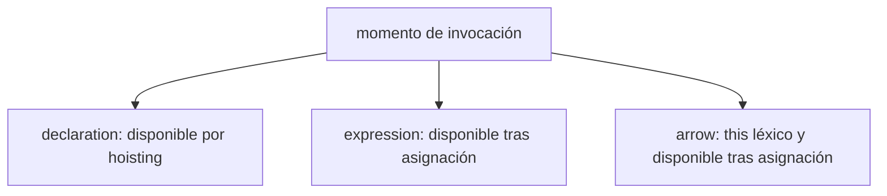
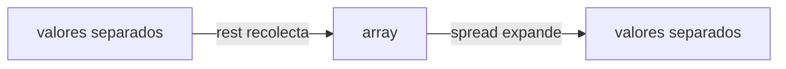
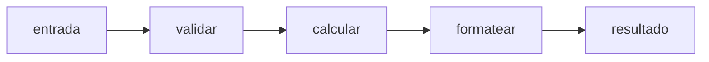
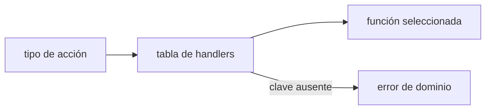
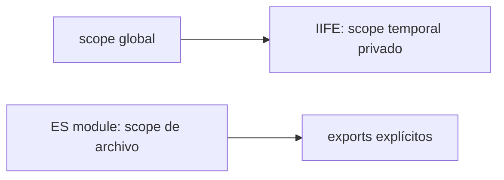

# Módulo 1: Operadores, control de flujo y funciones


## Aprende construyendo

### Tema 1: Tres formas de escribir una función

#### Paso 1 · Objetivo y preparación

Al finalizar podrás elegir declaración, expresión o función flecha según hoisting y `this`.

**Conocimiento previo:** variables, alcance y ejecución con Node.js.

#### Paso 2 · Contexto y caso real

**¿Por qué es importante?** Una aplicación calcula tarifas, formatea resultados y transforma entregas. Una sintaxis mal elegida puede ejecutarse antes de inicializarse o perder el receptor de `this`.

#### Paso 3 · Teoría con analogía

**Conceptos clave:** function declaration, function expression, arrow function, hoisting de funciones.

JavaScript ofrece tres sintaxis distintas para crear una función, y cada una tiene un comportamiento ligeramente distinto que conviene dominar con precisión. La function declaration (`function sumar(a, b) { return a + b; }`) se hoistea completa, no solo su nombre: esto significa que se puede invocar `sumar(2, 3)` en una línea de código anterior a donde está escrita la declaración, porque el motor de JavaScript procesa y registra la función completa antes de ejecutar el resto del script línea por línea. Esta propiedad permite, por ejemplo, organizar un archivo con la función principal al inicio y sus funciones auxiliares debajo, sin que el orden de lectura importe para la ejecución.

La function expression (`const sumar2 = function(a, b) { return a + b; };`) asigna una función anónima (o, opcionalmente, nombrada) a una variable, y sigue las reglas normales de hoisting de esa variable: si se usa `const` o `let`, la función no está disponible hasta que la línea de asignación se ejecuta (está en la Temporal Dead Zone hasta entonces, como se vio en el Módulo 0). Esta diferencia de comportamiento respecto a la declaración es importante: código que depende de invocar una function expression antes de su línea de definición fallará, mientras que el mismo código con una function declaration funcionaría sin problema.

Las arrow functions (`const sumar3 = (a, b) => a + b;`), introducidas en ES6, son la forma más concisa y tienen una diferencia semántica fundamental respecto a las dos anteriores, más allá de la sintaxis: no tienen su propio `this`. Una arrow function captura el valor de `this` del scope léxico donde fue definida (el mismo mecanismo de los closures que se estudiará en profundidad en el Módulo 2), en vez de que `this` dependa de cómo se invoca la función. Esta propiedad hace a las arrow functions especialmente útiles dentro de callbacks (por ejemplo, dentro de un método de un objeto que necesita preservar el `this` del objeto contenedor), pero inapropiadas para definir métodos de objeto que sí necesitan que `this` apunte dinámicamente al objeto sobre el que se invocan.

Elegir entre las tres formas no es arbitrario: usar function declarations para funciones de nivel superior que se quieren organizar libremente en el archivo (aprovechando el hoisting), function expressions cuando se necesita asignar condicionalmente distintas implementaciones a una misma variable, y arrow functions para callbacks concisos y para cualquier contexto donde se necesite preservar el `this` léxico externo, es la práctica más común y bien fundamentada en JavaScript moderno.

**Analogía:** una function declaration es como un empleado permanente ya contratado y en nómina desde el primer día de la empresa (disponible desde el inicio, sin importar en qué línea del organigrama aparezca escrito); una function expression es como un contratista que empieza a trabajar exactamente el día en que se firma su contrato (disponible solo a partir de esa línea); una arrow function es como un empleado que, sin importar a qué departamento lo transfieran, sigue reportando siempre al mismo jefe original con quien fue contratado (el `this` léxico no cambia según dónde se invoque).

**¿Por qué es importante?** Confundir estas tres formas —especialmente asumir que una arrow function se comporta como un método normal respecto a `this`— es una de las fuentes más comunes de bugs sutiles para quien aprende JavaScript, particularmente al escribir métodos de clase o callbacks dentro de objetos.

**Diagrama:**



#### Paso 4 · Demostración guiada desde cero

Desde una carpeta vacía crea `ejemplo-funciones`, ejecuta `npm init -y`, crea `src` y después `src/funciones.js`:

```bash
mkdir ejemplo-funciones
cd ejemplo-funciones
npm init -y
mkdir src
```

```javascript
function calcularTarifa(pesoKg) { // declaración: disponible por hoisting
  return pesoKg * 7.4;
}
const formatearDinero = function (valor) { // expresión: disponible tras asignación
  return `$${valor.toFixed(2)}`;
};
const presentar = (envio) => // flecha: útil para transformar cada elemento
  `${envio.guia}: ${formatearDinero(calcularTarifa(envio.pesoKg))}`;

console.log(presentar({ guia: 'RF-1', pesoKg: 2.5 }));
```

Ejecuta desde la raíz del proyecto:

```bash
node src/funciones.js
```

**Resultado esperado:** `RF-1: $18.50`.

**Fallo deliberado:** invoca `formatearDinero(10)` antes de declararla. El `ReferenceError` señala la zona muerta temporal; no lo ocultes cambiando arbitrariamente la sintaxis.

#### Construcción RutaFlow: funciones con una responsabilidad visible

Crea `academia-javascript/src/funciones.js` con `calcularTarifa` como declaración, `formatearDinero` como expresión y una arrow para transformar una lista de envíos. Ejecuta `node src/funciones.js`; el resultado esperado muestra `RF-1: $18.50` y explica cuál función puede invocarse antes de su definición.

Invoca la expression antes de inicializarla para observar `ReferenceError`; después usa una arrow como método que intenta leer `this.centro` y comprueba que no recibe el objeto. Corrige con método abreviado. RutaFlow usa arrows en callbacks y métodos normales cuando el receptor dinámico forma parte del contrato.

#### Paso 5 · Práctica guiada

Transforma dos entregas con `envios.map(presentar)`. **Pista:** `presentar` ya recibe cada elemento; predice ambas líneas antes de ejecutar.

#### Paso 6 · Práctica independiente

Crea un objeto `centro` con propiedad `nombre` y método `describir`. Provoca el fallo usando una flecha y corrígelo con método abreviado. Explica por qué las transformaciones sí conservan flechas.

#### Paso 7 · Cierre y evidencia

Ya eliges sintaxis por comportamiento. El siguiente tema combina parámetros por defecto con rest y spread. **Evidencia:** demuestra la salida, el `ReferenceError`, el fallo de `this` y sus correcciones. Fuente oficial: [MDN — funciones](https://developer.mozilla.org/es/docs/Web/JavaScript/Guide/Functions).

**Errores comunes:** usar flechas como métodos con `this` dinámico; invocar una expresión antes de inicializarla; escoger sintaxis solo por brevedad.

### Tema 2: Parámetros por defecto y rest/spread

#### Paso 1 · Objetivo y preparación

Al finalizar podrás definir valores opcionales, recolectar argumentos con rest y expandir arrays u objetos con spread sin confundir copia superficial con clonación profunda.

**Conocimiento previo:** funciones, arrays, objetos y diferencia entre reasignación y mutación.

#### Paso 2 · Contexto y caso real

**¿Por qué es importante?** Una tarifa combina cargos variables y una moneda predeterminada. Además, el estado de una entrega debe actualizarse sin alterar accidentalmente el objeto recibido por otra parte de la aplicación.

#### Paso 3 · Teoría con analogía

**Conceptos clave:** valores por defecto, rest para recolectar argumentos, spread para expandir.

Los parámetros por defecto permiten especificar un valor que se usará automáticamente cuando el argumento correspondiente no se proporciona (o se pasa explícitamente como `undefined`): `function crearUsuario(nombre, rol = "lector")` asigna `"lector"` a `rol` si se invoca `crearUsuario("Ana")` sin segundo argumento. Esto reemplaza el patrón anterior a ES6, mucho más verboso, de verificar manualmente `rol = rol || "lector";` dentro del cuerpo de la función (patrón que además tenía un bug sutil: fallaba si el valor válido proporcionado era `0`, `""` o `false`, valores falsy legítimos que el operador `||` interpretaba incorrectamente como "ausentes").

El operador rest (`...args` en la posición de un parámetro) recolecta un número variable de argumentos sueltos en un único array dentro del cuerpo de la función: `function total(...montos) { return montos.reduce((acc, m) => acc + m, 0); }` permite invocar `total(10, 20, 30)` con cualquier cantidad de argumentos, todos disponibles como el array `montos`. El operador spread (`...algo` en la posición de un argumento de llamada, o dentro de un literal de array/objeto) hace exactamente lo contrario: expande un iterable existente en elementos individuales, ya sea para pasarlos como argumentos separados a una función, para combinar arrays (`[...arr1, ...arr2]`), o para clonar y extender objetos sin mutarlos (`{...objetoOriginal, propiedadNueva: valor}`).

Es importante no confundir rest y spread simplemente porque comparten la misma sintaxis visual (`...`): la diferencia está en el contexto donde aparecen. En la definición de una función (`function f(...args)`), es rest, y recolecta; en una llamada a función o dentro de un literal (`f(...arr)`, `[...arr]`), es spread, y expande. Este par de operadores, introducidos ambos en ES6 y extendidos progresivamente a más contextos en versiones posteriores del lenguaje, reemplazó patrones mucho más verbosos que existían anteriormente, como usar el objeto `arguments` (que se discutirá en el Tema 5) o `Array.prototype.slice.call(...)` para lograr efectos similares.

Combinar parámetros por defecto con rest en la misma función es perfectamente válido y frecuente: `function log(nivel = "info", ...mensajes)` permite invocar tanto `log()` como `log("error", "algo falló", "detalle adicional")` con un comportamiento predecible en ambos casos, siempre que el parámetro rest se coloque, como exige la sintaxis del lenguaje, al final de la lista de parámetros.

**Analogía:** un parámetro por defecto es como un formulario que ya viene con un valor precompletado en un campo opcional, que el usuario puede sobreescribir si lo desea; rest es como una caja de recolección que junta todo lo que sobra de una lista variable de artículos en un solo paquete; spread es la acción inversa, sacar todos los artículos de un paquete existente y esparcirlos individualmente sobre la mesa.

**¿Por qué es importante?** Rest y spread eliminan la necesidad de patrones antiguos verbosos para manejar número variable de argumentos o para combinar/clonar estructuras de datos, y son omnipresentes en JavaScript moderno, incluyendo dentro de frameworks como React (props spread) y Node.js.

**Diagrama:**



#### Paso 4 · Demostración guiada desde cero

Desde una carpeta vacía crea `ejemplo-parametros`, ejecuta `npm init -y`, crea `src` y después `src/parametros.js`:

```bash
mkdir ejemplo-parametros
cd ejemplo-parametros
npm init -y
mkdir src
```

```javascript
// Rest reúne todos los cargos restantes en un array real.
function calcularTotal(moneda = 'COP', ...cargos) {
  const total = cargos.reduce((acumulado, cargo) => acumulado + cargo, 0);
  return { moneda, total };
}

const envioOriginal = { guia: 'RF-2', estado: 'creado' };
const tarifa = calcularTotal(undefined, ...[12_000, 3_500, 1_000]);

// Spread crea otro objeto de primer nivel; el original permanece igual.
const envioActualizado = { ...envioOriginal, tarifa };
console.log(envioOriginal);
console.log(envioActualizado);
```

Ejecuta desde `academia-javascript/`:

```bash
node src/parametros.js
```

**Resultado esperado:** el objeto original no contiene `tarifa`; el nuevo muestra `{ moneda: 'COP', total: 16500 }`.

**Fallo deliberado:** reemplaza `undefined` por `null`. El valor por defecto no se activa y la moneda queda `null`. Esto no es un error del motor: los parámetros por defecto solo sustituyen ausencia o `undefined`.

#### Construcción RutaFlow: tarifa compuesta sin mutación accidental

Crea `academia-javascript/src/parametros.js` con `calcularTotal(moneda = 'COP', ...cargos)` y una actualización de envío mediante `{ ...envio, total }`. Ejecuta `node src/parametros.js`; debes ver suma correcta, moneda por defecto y el objeto original sin propiedad `total`.

Pasa `undefined` y luego `null` como moneda para observar que solo el primero activa el valor por defecto. Haz una copia superficial de un objeto con dirección anidada, muta la dirección y comprueba que ambas referencias cambian. RutaFlow usa spread para actualizaciones pequeñas, no como clonación profunda universal.

#### Paso 5 · Práctica guiada

Agrega un cargo opcional por seguro y calcula de nuevo el total. **Pista:** prepara un array `cargos` y expándelo al llamar la función; no pases el array como un único cargo. Predice el resultado antes de ejecutar.

#### Paso 6 · Práctica independiente

Añade `direccion: { ciudad: 'Bogotá' }`, copia el envío con spread y cambia la ciudad en la copia. Explica por qué también cambia el original y corrige copiando explícitamente `direccion`. Demuestra ambos comportamientos con salidas diferentes.

#### Paso 7 · Cierre y evidencia

Ahora distingues rest —recolecta— de spread —expande o copia un nivel— y sabes cuándo actúa un valor por defecto. El siguiente tema usa funciones como datos para componer reglas. **Evidencia:** conserva la salida inicial, el caso `null`, la mutación anidada y su corrección. Fuente oficial: [MDN — rest parameters](https://developer.mozilla.org/es/docs/Web/JavaScript/Reference/Functions/rest_parameters) y [spread syntax](https://developer.mozilla.org/es/docs/Web/JavaScript/Reference/Operators/Spread_syntax).

**Errores comunes:** colocar rest antes del último parámetro; pasar un array sin expandir; creer que spread clona todos los niveles; esperar que `null` active el valor por defecto.

### Tema 3: Funciones de orden superior

#### Paso 1 · Objetivo y preparación

Al finalizar podrás recibir y devolver funciones para componer reglas pequeñas, y separar reglas puras de controles temporales como `debounce`.

**Conocimiento previo:** callbacks, rest parameters, arrays y manejo básico de errores.

#### Paso 2 · Contexto y caso real

**¿Por qué es importante?** Una aplicación calcula una tarifa en etapas: validar, calcular base, aplicar recargo y formatear. Una función monolítica dificulta identificar qué etapa falló; una composición muestra el recorrido del dato.

#### Paso 3 · Teoría con analogía

**Conceptos clave:** función que recibe función, función que devuelve función, composición.

Una función de orden superior es, por definición, cualquier función que reciba otra función como argumento, devuelva una función como resultado, o ambas cosas a la vez. Este concepto, tomado directamente de la programación funcional, es posible en JavaScript precisamente porque las funciones son "ciudadanos de primera clase": se pueden asignar a variables, pasar como argumentos y devolver como resultados, exactamente igual que cualquier otro valor del lenguaje como un número o un string.

`debounce(fn, ms)` es el ejemplo canónico de una función de orden superior extremadamente útil en la práctica: recibe una función `fn` y un tiempo `ms`, y devuelve una nueva función que, cada vez que se invoca, cancela cualquier temporizador pendiente de una invocación anterior y programa una nueva ejecución de `fn` solo si transcurre el tiempo `ms` completo sin que se vuelva a invocar la función devuelta. Este patrón resuelve un problema práctico muy común: evitar ejecutar una operación costosa (como una búsqueda contra un servidor) en cada pulsación de tecla de un campo de búsqueda, ejecutándola solo una vez que el usuario deja de escribir.

`pipe(...fns)` es otro ejemplo instructivo: recibe un número variable de funciones (usando rest, como se vio en el Tema 2) y devuelve una nueva función que, al invocarse con un valor `x`, aplica cada función de la lista en orden, pasando el resultado de una como entrada de la siguiente (`pipe(f, g, h)(x)` es equivalente a `h(g(f(x)))`). Este patrón de composición permite construir transformaciones complejas encadenando funciones pequeñas y bien definidas, en vez de escribir una única función monolítica que hace todo a la vez, mejorando tanto la legibilidad como la capacidad de probar cada paso de forma independiente.

El valor real de las funciones de orden superior no está en su elegancia sintáctica, sino en que permiten eliminar duplicación de código extrayendo un patrón de comportamiento común (como "esperar antes de ejecutar" en `debounce`, o "encadenar transformaciones" en `pipe`) en una única función reutilizable, parametrizada exactamente en los puntos donde varía cada caso de uso específico (qué función ejecutar, cuánto esperar, qué funciones encadenar).

**Analogía:** una función de orden superior es como una máquina que fabrica otras máquinas personalizadas: le entregas una especificación (la función `fn`) y algunos parámetros (como `ms`), y te devuelve una máquina nueva y lista para usar, con ese comportamiento específico ya incorporado, sin que tengas que construir esa máquina desde cero cada vez.

**¿Por qué es importante?** Las funciones de orden superior son la base de patrones extremadamente comunes en JavaScript moderno —`debounce`, `throttle`, `memoize`, `pipe`, `curry`— y entenderlas profundamente en este módulo facilita enormemente entender más adelante los Hooks de React o los operadores de RxJS en Angular, que son, en esencia, la misma idea aplicada a contextos más específicos.

**Diagrama:**



#### Paso 4 · Demostración guiada desde cero

Desde una carpeta vacía crea `ejemplo-composicion`, ejecuta `npm init -y`, crea `src` y después `src/composicion.js`:

```bash
mkdir ejemplo-composicion
cd ejemplo-composicion
npm init -y
mkdir src
```

```javascript
// Recibe funciones y devuelve otra función: es de orden superior.
const pipe = (...pasos) => (entrada) =>
  pasos.reduce((resultado, paso) => paso(resultado), entrada);

const validarPeso = (pesoKg) => {
  if (!Number.isFinite(pesoKg) || pesoKg <= 0) {
    throw new TypeError('El peso debe ser positivo');
  }
  return pesoKg;
};
const calcularBase = (pesoKg) => pesoKg * 7.4;
const aplicarRecargo = (total) => total * 1.1;

const calcularTarifa = pipe(validarPeso, calcularBase, aplicarRecargo);
console.log(calcularTarifa(2.5).toFixed(2));
```

```bash
node src/composicion.js
```

**Resultado esperado:** `20.35`.

**Fallo deliberado:** invierte `validarPeso` y `calcularBase`, y ejecuta con `-1`. El error aparece después de calcular un dato inválido; con efectos externos ese orden sería peligroso. Valida antes de transformar.

#### Construcción RutaFlow: componer reglas pequeñas

Crea `academia-javascript/src/composicion.js` con `pipe`, `validarPeso`, `calcularBase` y `aplicarRecargo`. Ejecuta `node src/composicion.js`; el resultado esperado es una tarifa reproducible y un error tipado para peso negativo. Cada función recibe un valor y devuelve otro sin leer variables globales.

Invierte el orden de dos pasos y observa una cifra distinta o un contrato roto. Después implementa un debounce pequeño, invócalo cinco veces y verifica una sola ejecución mediante contador. RutaFlow compone transformaciones puras; debounce pertenece al borde de interacción y no oculta reglas de negocio.

#### Paso 5 · Práctica guiada

Agrega `redondear = total => Math.round(total)` al final. **Pista:** predice la diferencia entre redondear antes y después del recargo; ejecuta ambos órdenes.

#### Paso 6 · Práctica independiente

Implementa `debounce(fn, 100)` en `src/interaccion.js`, llámalo cinco veces y demuestra con un contador que ejecuta una sola vez. Añade `cancel()` y prueba que una búsqueda cancelada no cambia el contador.

#### Paso 7 · Cierre y evidencia

Ya compones transformaciones puras y mantienes temporizadores en el borde. El siguiente tema modela decisiones y estados. **Evidencia:** demuestra el resultado de la tarifa, el peso rechazado, los órdenes comparados y las pruebas de ejecutar/cancelar debounce. Fuente oficial: [MDN — funciones de primera clase](https://developer.mozilla.org/es/docs/Glossary/First-class_Function).

**Errores comunes:** componer al revés; devolver un tipo incompatible; esconder efectos dentro de una regla; probar debounce sin controlar el tiempo.

### Tema 4: Control de flujo — if, switch y loops

#### Paso 1 · Objetivo y preparación

Al finalizar podrás elegir entre `if`, `switch`, tablas de funciones y bucles para expresar reglas sin ramas ocultas.

**Conocimiento previo:** objetos, funciones, arrays y operadores de comparación estricta.

#### Paso 2 · Contexto y caso real

**¿Por qué es importante?** Una aplicación debe impedir transiciones inválidas, como pasar una entrega cancelada a entregada. La estructura de control debe mostrar las reglas permitidas y fallar de forma explícita ante una acción desconocida.

#### Paso 3 · Teoría con analogía

**Conceptos clave:** `if/else`, `switch`, bucles, objetos de mapeo como alternativa a `switch`.

`if/else` y `switch` son las estructuras de control de flujo condicional más básicas de JavaScript, y funcionan de forma prácticamente idéntica a como lo hacen en la mayoría de lenguajes de programación con sintaxis similar a C. Sin embargo, un `switch` con muchos casos (cuatro o más) suele volverse difícil de leer y de mantener, especialmente cuando cada caso ejecuta una lógica sustancialmente distinta; en JavaScript, una alternativa idiomática y frecuentemente más legible es reemplazar el `switch` por un objeto literal que mapea cada posible valor a la función correspondiente, invocando la función seleccionada dinámicamente mediante acceso por corchetes (`objeto[clave]`).

Este patrón de "objeto de mapeo" (lookup table) tiene ventajas concretas sobre un `switch` extenso: es más fácil de extender (añadir un caso nuevo es simplemente añadir una entrada al objeto, sin tocar ninguna estructura de control existente), es más fácil de testear de forma aislada (cada función del objeto puede probarse independientemente sin necesidad de ejecutar el `switch` completo), y elimina el riesgo de olvidar un `break` en un caso de `switch`, un error extremadamente común que provoca que la ejecución "caiga" (fall through) accidentalmente al siguiente caso.

En cuanto a los bucles, JavaScript ofrece varias formas: `for` clásico (con contador explícito), `while` y `do...while` (basados en condición), y las formas más modernas `for...of` (para iterar sobre los valores de cualquier iterable: arrays, strings, Maps, Sets) y `for...in` (para iterar sobre las claves enumerables de un objeto, generalmente desaconsejado para arrays porque también itera sobre propiedades heredadas del prototipo si existen). Elegir el bucle correcto según el tipo de dato que se recorre —`for...of` para iterables, métodos funcionales como `map`/`filter` (Módulo 4) cuando se transforma una colección— produce código más legible que forzar siempre el mismo `for` clásico con índice numérico para cualquier situación.

Aunque los bucles siguen siendo necesarios en muchos contextos (especialmente cuando se necesita `break` o `continue` con lógica compleja, algo que los métodos funcionales de array no permiten de forma directa), gran parte del código JavaScript moderno prefiere los métodos funcionales sobre arrays (que se estudiarán en profundidad en el Módulo 4) por su mayor expresividad y menor propensión a errores de índice fuera de rango.

**Analogía:** un `switch` extenso es como un mostrador de atención al cliente con un único empleado que memoriza de memoria qué hacer para cada uno de veinte tipos de solicitud distintos, revisando mentalmente cada caso uno por uno hasta encontrar el correcto; un objeto de mapeo es como un mostrador con veinte casilleros claramente etiquetados, donde el cliente (o el código) simplemente consulta directamente el casillero correspondiente a su solicitud, sin recorrer los demás.

**¿Por qué es importante?** Reconocer cuándo un `switch` extenso se beneficiaría de convertirse en un objeto de mapeo, y elegir el tipo de bucle apropiado según la estructura de datos, son señales de código JavaScript idiomático y mantenible, frente a código que simplemente "funciona" pero es difícil de extender con seguridad.

**Diagrama:**



#### Paso 4 · Demostración guiada desde cero

Desde una carpeta vacía crea `ejemplo-estados`, ejecuta `npm init -y`, crea `src` y después `src/estados.js`:

```bash
mkdir ejemplo-estados
cd ejemplo-estados
npm init -y
mkdir src
```

```javascript
const transiciones = {
  creado: { asignar: 'asignado', cancelar: 'cancelado' },
  asignado: { iniciar: 'en-ruta', cancelar: 'cancelado' },
  'en-ruta': { entregar: 'entregado' },
};

function aplicar(estado, accion) {
  // ?. evita leer una acción sobre un estado sin transiciones.
  const siguiente = transiciones[estado]?.[accion];
  if (!siguiente) throw new Error(`Transición inválida: ${estado} -> ${accion}`);
  return siguiente;
}

let estado = 'creado';
for (const accion of ['asignar', 'iniciar', 'entregar']) {
  estado = aplicar(estado, accion);
  console.log(estado);
}
```

```bash
node src/estados.js
```

**Resultado esperado:** `asignado`, `en-ruta` y `entregado`, en ese orden.

**Fallo deliberado:** agrega `cancelar` después de `entregar`. El error debe indicar `entregado -> cancelar`; no agregues una transición solo para silenciarlo, porque el estado final es una regla del dominio.

#### Construcción RutaFlow: máquina de estados explícita

Crea `academia-javascript/src/estados.js` con handlers para `CREADA`, `EN_RUTA`, `ENTREGADA` y `CANCELADA`, y recorre una lista de eventos con `for...of`. Ejecuta `node src/estados.js`; la salida esperada muestra cada transición válida y rechaza una acción desconocida.

Elimina un `break` de una versión con switch para observar *fall-through* y luego reemplázala por tabla cuando los casos sean funciones intercambiables. Añade una transición y sus casos límite sin cambiar el despachador. RutaFlow no reemplaza todo switch por objetos: un switch pequeño y exhaustivo puede comunicar mejor un conjunto cerrado.

#### Paso 5 · Práctica guiada

Agrega el estado `en-bodega` entre `asignado` y `en-ruta`. **Pista:** modifica datos de la tabla, no la función `aplicar`; predice qué secuencia anterior dejará de ser válida.

#### Paso 6 · Práctica independiente

Implementa `procesarAcciones(estadoInicial, acciones)` que devuelva todos los estados visitados sin mutar el array recibido. Prueba camino feliz, acción desconocida y acción válida desde estado incorrecto.

#### Paso 7 · Cierre y evidencia

Ya puedes convertir reglas de transición en datos verificables. El siguiente tema reconoce patrones antiguos y los migra a módulos modernos. **Evidencia:** demuestra el resultado correcto, el fallo deliberado y tres pruebas de `procesarAcciones`. Fuente oficial: [MDN — control flow](https://developer.mozilla.org/es/docs/Web/JavaScript/Guide/Control_flow_and_error_handling).

**Errores comunes:** olvidar `break`; usar `for...in` para valores de un array; aceptar silenciosamente claves desconocidas; mezclar reglas con impresión en consola.

### Tema 5: IIFE y el objeto arguments

#### Paso 1 · Objetivo y preparación

Al finalizar podrás leer una IIFE y `arguments` en código legado, explicar sus límites y migrarlos a módulos ESM y parámetros rest.

**Conocimiento previo:** scope, funciones, rest y configuración `type: module`.

#### Paso 2 · Contexto y caso real

**¿Por qué es importante?** Una aplicación puede integrar bibliotecas antiguas que protegen variables con IIFE o reciben argumentos mediante `arguments`. Comprenderlas permite migrar sin romper comportamiento, pero no obliga a repetir esos patrones en código nuevo.

#### Paso 3 · Teoría con analogía

**Conceptos clave:** Immediately Invoked Function Expression, encapsulación, `arguments` frente a rest.

Una IIFE (Immediately Invoked Function Expression) es una función que se define y se invoca inmediatamente en la misma expresión, típicamente envuelta entre paréntesis para forzar al parser a interpretarla como una expresión y no como una declaración: `(function() { console.log("ejecutado de inmediato"); })();`. Antes de que `let`/`const` introdujeran el scope de bloque (Módulo 0) y los módulos ESM (Módulo 7) introdujeran un scope de archivo aislado, las IIFE eran la técnica principal para crear un scope privado y evitar contaminar el scope global con variables temporales, un patrón extremadamente común en el JavaScript anterior a 2015.

Aunque las IIFE han perdido buena parte de su relevancia práctica con la llegada de módulos ESM (cada módulo ya tiene su propio scope aislado por defecto, sin necesidad de envolver el código en una función autoejecutada), siguen apareciendo en código legado y en ciertos patrones específicos, como ejecutar código de inicialización asíncrono en el nivel superior de un script antes de que existiera el top-level `await`.

El objeto `arguments` es una estructura similar a un array (pero no un array real: no tiene métodos como `map` o `filter` directamente) disponible automáticamente dentro de cualquier función declarada con `function` (no disponible dentro de arrow functions), que contiene todos los argumentos con los que se invocó la función, sin importar cuántos parámetros formales se hayan declarado. Antes de la introducción del operador rest en ES6, `arguments` era la única forma de acceder a un número variable de argumentos, típicamente requiriendo convertirlo primero en un array real con `Array.prototype.slice.call(arguments)` para poder usar métodos de array sobre él.

En JavaScript moderno, el operador rest (Tema 2) ha reemplazado prácticamente por completo la necesidad de usar `arguments` directamente: `function f(...args)` produce un array real desde el inicio, con todos los métodos de array disponibles de inmediato, sin necesidad de conversión adicional, y además funciona de forma consistente incluso dentro de arrow functions (donde `arguments` simplemente no existe, heredándose en su lugar del scope contenedor si lo hay). Por esta razón, el código nuevo debería preferir siempre rest sobre `arguments`, reservando el conocimiento de este último principalmente para entender y mantener código legado existente.

**Analogía:** una IIFE es como una habitación temporal montada y desmontada en el mismo instante para una reunión privada de un solo uso, sin dejar rastro visible en el resto del edificio; `arguments` es como una bolsa genérica que automáticamente recoge todo lo que alguien te entrega en la puerta, sin etiquetar ni organizar nada, mientras que rest es una caja etiquetada y organizada específicamente para ese propósito desde el diseño mismo de la función.

**¿Por qué es importante?** Aunque las IIFE y `arguments` son menos centrales en JavaScript moderno que hace una década, reconocerlas es esencial para leer y mantener código legado, que sigue siendo extremadamente común en proyectos de larga vida en la industria.

**Diagrama:**



#### Paso 4 · Demostración guiada desde cero

Desde una carpeta vacía crea `ejemplo-legado`, ejecuta `npm init -y`, crea `src` y después `src/legado.cjs`:

```bash
mkdir ejemplo-legado
cd ejemplo-legado
npm init -y
mkdir src
```

```javascript
const tarifas = (function () {
  let consultas = 0; // queda encerrada en el scope de la IIFE
  return {
    total: function () {
      consultas += 1;
      const cargos = Array.from(arguments); // arguments no es un array real
      return cargos.reduce((suma, cargo) => suma + cargo, 0);
    },
    consultas: () => consultas,
  };
})();

console.log(tarifas.total(10, 20, 5));
console.log(tarifas.consultas());
```

```bash
node src/legado.cjs
```

**Resultado esperado:** `35` y `1`; `consultas` no existe en el scope global.

**Fallo deliberado:** reemplaza `Array.from(arguments)` por `arguments.map(...)`. Aparece `TypeError` porque `arguments` es similar a un array, pero no hereda sus métodos. Rest crea un array real y evita la conversión.

#### Construcción RutaFlow: reconocer legado y migrarlo

Crea `academia-javascript/src/legado.cjs` con una IIFE que exponga únicamente `crearContador`, y compara `arguments` con rest dentro de dos funciones. Ejecuta `node src/legado.cjs`; el resultado esperado mantiene la variable interna inaccesible y muestra que rest sí es un array real.

Intenta usar `arguments.map` para provocar `TypeError`; corrige convirtiendo o, preferiblemente, usando rest. Migra la IIFE a `src/contador.js` con ESM y export nombrado, actualizando `package.json` con `type: module`. RutaFlow aprende IIFE para mantener legado, pero el código nuevo usa módulos y contratos explícitos.

#### Paso 5 · Práctica guiada

Reemplaza `function () { ...arguments }` por `(...cargos) =>`. **Pista:** conserva primero las mismas salidas; separar refactorización y cambio de comportamiento facilita detectar una regresión.

#### Paso 6 · Práctica independiente

Crea `src/tarifas.js` con export nombrado `crearCalculadoraTarifas`, estado privado mediante closure y rest. Escribe un import en `src/usar-tarifas.js` y demuestra que dos calculadoras mantienen contadores independientes.

#### Paso 7 · Cierre y evidencia

Completaste funciones y control de flujo distinguiendo patrones vigentes de legado. El siguiente módulo profundiza en closures, `this` y prototipos. **Evidencia:** conserva las salidas antiguas, el `TypeError`, la versión ESM y la prueba de dos contadores. Fuentes oficiales: [MDN — IIFE](https://developer.mozilla.org/en-US/docs/Glossary/IIFE) y [`arguments`](https://developer.mozilla.org/es/docs/Web/JavaScript/Reference/Functions/arguments).

**Errores comunes:** creer que `arguments` es un array; buscarlo dentro de una arrow; migrar sintaxis y comportamiento a la vez; usar IIFE donde un módulo ya proporciona aislamiento.

---


## Construcción guiada del capítulo

**Objetivo del laboratorio:** construir una pequeña biblioteca de funciones utilitarias de orden superior, aplicando las tres formas de función, parámetros modernos y composición.

**Requisitos previos:** Node.js instalado, conocimiento del Módulo 0 (tipos, template literals).

| Paso | Acción | Código | Explicación |
|---|---|---|---|
| 1 | Escribir `sumar` en sus tres formas | `function sumar(a,b){}`, `const sumar2 = function(a,b){}`, `const sumar3 = (a,b)=>a+b` | Compara comportamiento de hoisting invocando cada una antes de su definición |
| 2 | Función con parámetro por defecto y rest | `function total(impuesto = 0, ...montos)` | Combina ambos mecanismos en una sola función |
| 3 | Combinar arrays y clonar objetos con spread | `[...a, ...b]`, `{...obj, nuevaProp: 1}` | Verifica que el original no se muta |
| 4 | Implementar `debounce(fn, ms)` | Ver Tema 3 | Pruébalo con `console.log` disparado por múltiples llamadas rápidas |
| 5 | Implementar `pipe(...fns)` | Ver Tema 3 | Verifica `pipe(f,g,h)(x) === h(g(f(x)))` con funciones simples |
| 6 | Reescribir un switch de 4 casos como objeto de mapeo | Ver Tema 4 | Compara legibilidad y facilidad de extensión |

**Verificación:** el laboratorio se considera exitoso si `pipe(x => x+1, x => x*2)(3)` devuelve `8`, y si `debounce` invocado 5 veces en rápida sucesión solo ejecuta la función una vez, tras el último de los 5 disparos.

**Errores comunes y soluciones**

- **Usar una arrow function como método de objeto y esperar que `this` apunte al objeto.** Recuerda que las arrow functions no tienen `this` propio; usa `function` normal o método abreviado (`metodo() {}`) para métodos que necesiten `this` dinámico.
- **Confundir rest y spread por la sintaxis idéntica (`...`).** Verifica el contexto: en la definición de parámetros es rest (recolecta), en una llamada o literal es spread (expande).
- **`pipe` compuesto en el orden equivocado.** Verifica que `pipe(f, g)(x)` aplica primero `f` y luego `g` sobre el resultado, no al revés (eso sería `compose`, el orden inverso).

---
