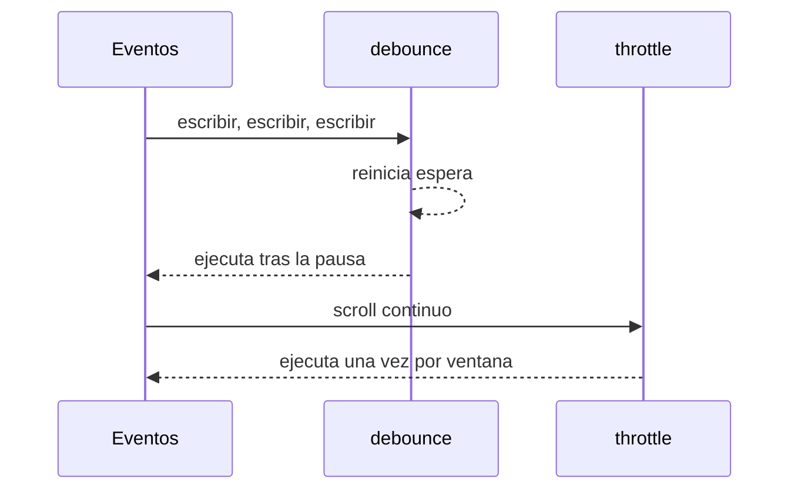
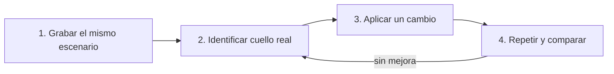
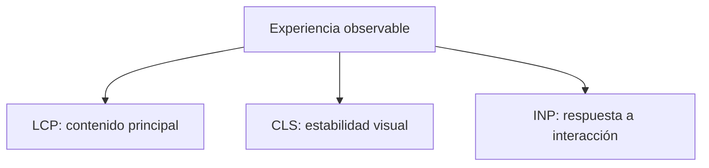

# Módulo 10: Patrones avanzados y rendimiento


## Aprende construyendo

### Tema 1: Debounce y throttle

#### Paso 1 · Objetivo y preparación

Al finalizar podrás implementar, probar y elegir entre `debounce` y `throttle` según la interacción, incluyendo cancelación al desmontar. Aplicarás espera a la búsqueda y frecuencia limitada al seguimiento del mapa de RutaFlow.

**Conocimiento previo:** closures, temporizadores, callbacks y fake timers de Vitest. Debes tener `npm test` funcionando y comprender que ambas utilidades cambian cuándo se ejecuta una función, no cuánto cuesta.

#### Paso 2 · Contexto y caso real

Buscar por cada tecla satura la API, mientras dejar de actualizar el mapa hasta que termine el movimiento hace que parezca congelado. En el proyecto RutaFlow, la semántica decidirá: pausa final para búsqueda y muestras periódicas para posición.

#### Paso 3 · Teoría, modelo mental y analogía

**Conceptos clave:** limitar frecuencia de ejecución, esperar pausa (debounce) frente a límite periódico (throttle).

`debounce` y `throttle`, ambos vistos parcialmente en módulos anteriores, resuelven el mismo problema general —limitar cuántas veces se ejecuta una función costosa ante eventos de alta frecuencia— pero con semánticas fundamentalmente distintas que conviene distinguir con precisión. `debounce(fn, ms)` retrasa la ejecución de `fn` hasta que transcurre un período de `ms` sin que se produzca una nueva invocación; cada nueva llamada reinicia el temporizador de espera, de modo que `fn` solo se ejecuta finalmente cuando la actividad se detiene por completo durante el intervalo especificado. `throttle(fn, ms)` garantiza que `fn` se ejecute como máximo una vez por cada intervalo de `ms`, sin importar cuántas veces se invoque la función devuelta durante ese intervalo, ejecutando inmediatamente en la primera invocación de cada ventana y bloqueando invocaciones adicionales hasta que la ventana actual termine.

La elección entre ambos depende de la naturaleza real del evento y del comportamiento deseado. Para un campo de búsqueda que dispara una petición al servidor en cada tecla presionada, `debounce` es la elección correcta: se quiere esperar a que el usuario termine de escribir (una pausa genuina en la actividad) antes de disparar la petición costosa, evitando peticiones innecesarias por cada tecla intermedia. Para un evento de scroll o de redimensionamiento de ventana que actualiza continuamente un indicador visual mientras el usuario interactúa, `throttle` es más apropiado: se necesita una respuesta periódica y continua durante la interacción activa (no solo al final, cuando esta se detiene), pero limitada a una frecuencia razonable que no sature el hilo principal con actualizaciones excesivamente frecuentes.

Un error conceptual común es intercambiar ambos patrones sin considerar esta diferencia semántica: usar `debounce` en un evento de scroll produciría actualizaciones solo al final del desplazamiento (sin ninguna respuesta visual durante el scroll activo, una experiencia pobre), mientras que usar `throttle` en un campo de búsqueda dispararía peticiones periódicas incluso mientras el usuario sigue escribiendo activamente (potencialmente disparando peticiones para términos de búsqueda incompletos e intermedios), en vez de esperar genuinamente a que termine.

Implementar ambos desde cero (en vez de depender siempre de una biblioteca externa como Lodash) es un ejercicio valioso para interiorizar completamente su mecánica interna basada en temporizadores y banderas de estado, un conocimiento que facilita diagnosticar comportamientos inesperados al usarlos en código real, especialmente en combinación con otras técnicas de optimización de este módulo.

**Analogía:** `debounce` es como un ascensor que espera a que nadie más pulse el botón durante unos segundos antes de finalmente cerrarse y partir, reiniciando la espera cada vez que alguien nuevo pulsa el botón mientras las puertas siguen abiertas; `throttle` es como un semáforo que permite el paso de vehículos exactamente una vez por cada ciclo fijo de tiempo, sin importar cuántos vehículos se acumulen esperando durante ese ciclo.

**¿Por qué es importante?** Elegir correctamente entre `debounce` y `throttle` según la semántica real del evento (esperar una pausa frente a limitar una frecuencia periódica sostenida) es una decisión de diseño de UX y de rendimiento con impacto directo y perceptible en la experiencia del usuario.

**Diagrama:**



#### Paso 4 · Demostración guiada desde cero

Desde una carpeta vacía crea `ejemplo-frecuencia`, ejecuta `npm init -y`, crea `src` y `test`, y después `src/frecuencia.js`:

```bash
mkdir ejemplo-frecuencia
cd ejemplo-frecuencia
npm init -y
npm install -D vitest
mkdir src test
```

```js
export function debounce(funcion, esperaMs) {
  let temporizador;
  function aplazada(...argumentos) {
    clearTimeout(temporizador);
    // Cada llamada sustituye la ejecución pendiente por la más reciente.
    temporizador = setTimeout(() => funcion(...argumentos), esperaMs);
  }
  aplazada.cancel = () => clearTimeout(temporizador);
  return aplazada;
}

export function throttle(funcion, intervaloMs) {
  let habilitada = true;
  return (...argumentos) => {
    if (!habilitada) return;
    habilitada = false;
    // La primera llamada se ejecuta; las demás esperan otra ventana.
    funcion(...argumentos);
    setTimeout(() => { habilitada = true; }, intervaloMs);
  };
}
```

Crea `test/frecuencia.test.js` con fake timers: invoca tres veces cada función, avanza el reloj y verifica una búsqueda tras 300 ms y muestras del mapa cada 100 ms.

Desde la raíz de `rutaflow-web`, ejecuta la prueba:

```bash
npm test -- src/utilidades/frecuencia.test.js
```

**Resultado esperado:** búsqueda se ejecuta una vez con el último texto; seguimiento produce actualizaciones durante el movimiento; la suite no espera tiempo real.

**Fallo deliberado:** intercambia ambas utilidades en la interfaz. La búsqueda emite términos parciales y el mapa no cambia hasta una pausa completa. Diagnostica comparando el comportamiento con la necesidad del usuario.

#### Paso 5 · Práctica guiada

Añade `cancel()` a throttle y ejecuta ambos cleanup al destruir la vista. **Pista:** conserva el id del temporizador, limpia estado y prueba que ningún callback se ejecuta después de desmontar.

#### Paso 6 · Práctica independiente

Implementa opciones leading/trailing explícitas y escribe una tabla temporal de llamadas esperadas. Prueba cancelación, contexto y últimos argumentos; decide con evidencia un intervalo para búsqueda y mapa.

#### Paso 7 · Cierre y evidencia

Ya puedes limitar frecuencia según intención, no por moda. El siguiente tema evitará cálculos repetidos únicamente cuando pureza, repetición y medición justifiquen memoria adicional. **Evidencia:** entrega implementación y tests, demuestra líneas temporales de ambos patrones y explica la degradación al intercambiarlos.

**Errores comunes:** confundir pausa con frecuencia; perder últimos argumentos; omitir cleanup; probar con espera real; aplicar throttle a una búsqueda sin aceptar resultados parciales.

**Fuentes oficiales:** [MDN — setTimeout](https://developer.mozilla.org/en-US/docs/Web/API/Window/setTimeout) y [Vitest — Timers](https://vitest.dev/guide/mocking/timers).

### Tema 2: Memoización

#### Paso 1 · Objetivo y preparación

Al finalizar podrás memoizar una función pura con caché limitada, medir aciertos y reconocer cuándo el coste de memoria supera el ahorro. Optimizarás un cálculo repetido de tarifa de RutaFlow sin almacenar respuestas cambiantes.

**Prerrequisitos:** funciones puras, closures, `Map`, serialización y `performance.now()`. Prepara datos deterministas; una comparación con entradas distintas no demuestra un acierto.

#### Paso 2 · Contexto y caso real

El panel recalcula varias veces la tarifa para la misma zona, peso y servicio durante un render. En este incremento del proyecto RutaFlow reutilizaremos resultados idénticos y limitaremos claves para impedir crecimiento indefinido.

#### Paso 3 · Teoría, modelo mental y analogía

**Conceptos clave:** cachear resultados por argumentos, funciones puras, coste de memoria frente a coste de cómputo.

Memoizar una función significa cachear el resultado de cada invocación según sus argumentos exactos, de modo que invocaciones repetidas con los mismos argumentos devuelvan el resultado cacheado inmediatamente, sin re-ejecutar el cálculo costoso. `memoize(fn)` genérico serializa los argumentos (por ejemplo, con `JSON.stringify`) para usarlos como clave de un `Map` (recordando el Módulo 4: `Map` es apropiado aquí precisamente porque las claves son dinámicas y no se conocen de antemano), almacenando el resultado calculado la primera vez que se ve una combinación específica de argumentos, y devolviendo directamente ese resultado cacheado en cualquier invocación posterior con los mismos argumentos exactos.

La memoización solo es válida y segura para funciones puras: funciones cuyo resultado depende exclusivamente de sus argumentos de entrada, sin ningún efecto secundario ni dependencia de estado externo mutable que pueda cambiar entre invocaciones. Memoizar una función que depende de un estado externo mutable (como la hora actual del sistema, o el contenido cambiante de una variable global) produciría resultados cacheados incorrectos y desactualizados, porque el caché no tiene forma de saber que el resultado "correcto" para los mismos argumentos podría ser distinto en una invocación posterior si el estado externo del que depende cambió mientras tanto.

Fibonacci calculado de forma recursiva ingenua es el ejemplo canónico de dónde la memoización tiene un impacto dramático: sin memoización, calcular `fibonacci(35)` recalcula los mismos subproblemas (como `fibonacci(20)`) millones de veces de forma redundante durante la recursión, un desperdicio exponencial de cómputo; con memoización, cada subproblema único se calcula exactamente una vez, y las invocaciones recursivas repetidas sobre el mismo subproblema simplemente consultan el caché, reduciendo drásticamente el tiempo total de cómputo de exponencial a lineal en el tamaño del problema.

Es importante reconocer cuándo la memoización es contraproducente: para funciones que raramente se invocan con los mismos argumentos exactos más de una vez (haciendo que el caché nunca se aproveche realmente, pero sí consuma memoria adicional de forma permanente y creciente para almacenar resultados que nunca vuelven a consultarse), o para funciones cuyo cálculo es en sí mismo más barato que el coste de serializar los argumentos y consultar el caché, memoizar añade overhead sin ningún beneficio real, un ejemplo concreto de optimización aplicada sin evidencia que realmente la justifique, precisamente el antipatrón que este módulo advierte evitar.

**Analogía:** la memoización es como un asistente que anota en un cuaderno cada respuesta que calcula para preguntas específicas, y antes de recalcular cualquier pregunta nueva, primero revisa si ya la respondió exactamente igual anteriormente, ahorrando el trabajo de recalcular; pero si las preguntas casi nunca se repiten exactamente igual, mantener ese cuaderno cada vez más grande solo añade peso sin ahorrar ningún trabajo real.

**¿Por qué es importante?** La memoización puede transformar el rendimiento de funciones recursivas con subproblemas superpuestos de exponencial a lineal, pero solo es aplicable a funciones puras, y su beneficio real depende de que los mismos argumentos se repitan efectivamente con frecuencia suficiente para justificar el coste de memoria del caché.

#### Paso 4 · Demostración guiada desde cero

Desde una carpeta vacía crea `ejemplo-memoizacion`, ejecuta `npm init -y`, crea `src` y después `src/memoize.js`:

```bash
mkdir ejemplo-memoizacion
cd ejemplo-memoizacion
npm init -y
mkdir src
```

```js
export function memoize(fn, limite = 100) {
  const cache = new Map();
  let aciertos = 0;
  function memoizada(...args) {
    const key = JSON.stringify(args);
    if (cache.has(key)) {
      aciertos += 1;
      return cache.get(key);
    }
    const resultado = fn(...args);
    // Elimina la entrada más antigua antes de superar el presupuesto.
    if (cache.size >= limite) cache.delete(cache.keys().next().value);
    cache.set(key, resultado);
    return cache.get(key);
  }
  memoizada.estadisticas = () => ({ entradas: cache.size, aciertos });
  return memoizada;
}
```

Crea `src/medir-tarifa.js`, importa una función pura `calcularTarifa` y `memoize`, ejecuta dos veces con `{ zona: "NORTE", pesoKg: 10 }` y muestra resultado, duración y estadísticas.

```bash
node src/performance/medir-tarifa.js
```

**Resultado esperado:** ambos valores coinciden, `entradas` vale `1` y `aciertos` vale `1`. Repite suficientes veces para medir; una duración diminuta aislada puede ser ruido.

**Fallo deliberado:** añade `Date.now()` al resultado de `calcularTarifa` y llama dos veces con los mismos argumentos. La segunda respuesta conserva la hora anterior: la función impura quedó obsoleta. Retira dependencia externa o conviértela en entrada.

#### Paso 5 · Práctica guiada

Implementa recencia real: al leer una clave, elimínala y vuelve a insertarla. **Pista:** con límite `2`, la secuencia A, B, A, C debe expulsar B.

#### Paso 6 · Práctica independiente

Compara tiempo y memoria con 1, 100 y 10 000 combinaciones únicas. Decide cuándo no memoizar y documenta restricciones de claves, invalidación y tamaño.

#### Paso 7 · Cierre y evidencia

Ya puedes intercambiar cómputo por memoria de forma explícita y limitada. El siguiente tema moverá cómputo bloqueante a otro hilo cuando la primera ejecución siga siendo costosa. **Evidencia:** demuestra acierto, expulsión, medición y resultado obsoleto; explica la clave elegida.

**Errores comunes:** memoizar funciones impuras; usar JSON con argumentos no serializables; permitir caché infinita; medir una llamada trivial; cachear red sin caducidad.

**Fuentes oficiales:** [MDN — Map](https://developer.mozilla.org/en-US/docs/Web/JavaScript/Reference/Global_Objects/Map) y [MDN — Performance.now](https://developer.mozilla.org/en-US/docs/Web/API/Performance/now).

### Tema 3: Web Workers para trabajo pesado

#### Paso 1 · Objetivo y preparación

Al finalizar podrás mover un cálculo CPU-intensivo a un Web Worker, intercambiar mensajes, manejar error y terminar trabajo obsoleto. Mantendrás interactiva la interfaz de RutaFlow mientras se ordenan candidatos de una ruta.

**Conocimiento previo:** ESM, eventos, Promesas, datos serializables y DevTools. Necesitas ejecutar el ejemplo mediante Vite; abrir HTML con `file://` cambia reglas de módulos y workers.

#### Paso 2 · Contexto y caso real

Ordenar miles de combinaciones de paradas puede ocupar el hilo principal y retrasar clics. En el proyecto RutaFlow, el worker hará cómputo puro y el hilo principal conservará DOM, estados de carga y cancelación.

#### Paso 3 · Teoría, modelo mental y analogía

**Conceptos clave:** hilo separado, `postMessage`, sin acceso al DOM.

Un Web Worker ejecuta JavaScript en un hilo completamente separado del hilo principal donde corre la interfaz de usuario, permitiendo realizar cálculos computacionalmente costosos (ordenar un volumen grande de datos, procesar imágenes, cálculos matemáticos intensivos) sin bloquear ni congelar la interactividad de la página mientras ese cálculo se ejecuta. Esto es fundamentalmente distinto de mover trabajo a una macrotask o microtask (Módulo 5): esas técnicas reorganizan cuándo se ejecuta el código dentro del mismo hilo único, pero el trabajo pesado en sí, una vez que le toca su turno de ejecución, sigue bloqueando completamente ese hilo único hasta que termina; un Web Worker, en cambio, ejecuta ese trabajo en un hilo genuinamente distinto y paralelo, dejando el hilo principal completamente libre para seguir respondiendo a interacciones del usuario mientras el worker calcula en paralelo.

La comunicación entre el hilo principal y un Worker ocurre exclusivamente mediante paso de mensajes asíncronos (`postMessage` para enviar, el evento `message` para recibir), nunca mediante acceso directo compartido a variables entre ambos contextos: el hilo principal invoca `worker.postMessage(datos)` para enviar datos de entrada al worker, y el worker, tras procesar esos datos en su propio hilo aislado, invoca `self.postMessage(resultado)` para devolver el resultado calculado de vuelta al hilo principal, que lo recibe mediante su propio listener del evento `message`. Los datos intercambiados deben ser serializables (estructuras de datos simples: objetos, arrays, valores primitivos), no pudiendo pasarse directamente referencias a funciones o a elementos del DOM.

Una limitación importante y fundamental de los Web Workers es que no tienen acceso directo al DOM: no pueden leer ni modificar elementos de la página directamente, precisamente porque el DOM no está diseñado para ser manipulado de forma segura desde múltiples hilos simultáneos. Esto significa que un Worker es apropiado exclusivamente para cómputo puro (procesar datos, calcular resultados), y cualquier actualización visual resultante de ese cómputo debe realizarse de vuelta en el hilo principal, tras recibir el resultado del Worker mediante `postMessage`, nunca directamente desde dentro del propio Worker.

Identificar correctamente qué trabajo es apropiado para mover a un Worker —cómputo puro, intensivo, sin necesidad de acceso al DOM— frente a qué trabajo no lo es —cualquier cosa que necesite leer o modificar la interfaz directamente— es la decisión de diseño clave al considerar esta técnica de optimización, reservándola específicamente para los casos donde efectivamente resuelve el problema real de congelamiento de la interfaz durante cómputo pesado.

**Analogía:** el hilo principal es como el gerente de una tienda que atiende directamente a los clientes en el mostrador; un Web Worker es como un empleado en la trastienda que realiza un inventario complejo y que se comunica con el gerente únicamente mediante notas escritas entregadas y recibidas (mensajes), nunca interrumpiendo directamente la atención al cliente en el mostrador, pero tampoco pudiendo atender directamente a ningún cliente por sí mismo desde la trastienda.

**¿Por qué es importante?** Los Web Workers son la solución correcta y específica para cómputo pesado que, de otro modo, congelaría perceptiblemente la interfaz de usuario durante su ejecución en el hilo único principal, siempre que ese trabajo no requiera acceso directo al DOM.

#### Paso 4 · Demostración guiada desde cero

Desde una carpeta vacía crea `ejemplo-web-worker`, ejecuta `npm init -y`, crea `src` y después `src/optimizar.worker.js`:

```bash
mkdir ejemplo-web-worker
cd ejemplo-web-worker
npm init -y
mkdir src
```

```js
self.onmessage = ({ data }) => {
  // El worker recibe una copia estructurada y nunca toca el DOM.
  const ordenadas = [...data.distancias].sort((a, b) => a - b);
  self.postMessage({ solicitudId: data.solicitudId, ordenadas });
};
```

Crea `src/cliente-optimizacion.js`:

```js
export function optimizarRuta(distancias, solicitudId) {
  const worker = new Worker(
    new URL("./optimizar-ruta.worker.js", import.meta.url),
    { type: "module" },
  );

  const resultado = new Promise((resolve, reject) => {
    worker.addEventListener("message", ({ data }) => resolve(data), { once: true });
    worker.addEventListener("error", reject, { once: true });
  }).finally(() => worker.terminate());

  worker.postMessage({ distancias, solicitudId });
  return { resultado, cancelar: () => worker.terminate() };
}
```

Invoca la función desde un botón, conserva otro botón que incremente un contador y ejecuta:

```bash
npm run dev
```

**Resultado esperado:** el contador sigue respondiendo mientras se ordena un lote grande; al finalizar se recibe el mismo `solicitudId` y distancias ascendentes.

**Fallo deliberado:** escribe `document.body.textContent = "listo"` dentro del worker. Aparece `ReferenceError: document is not defined`; elimina el acceso y actualiza DOM solo tras recibir `message` en el hilo principal.

#### Paso 5 · Práctica guiada

Cancela la solicitud anterior al iniciar una nueva y descarta mensajes con id obsoleto. **Pista:** conserva `cancelar`; un worker terminado no responde con un resultado útil, por lo que la UI debe salir del estado de carga.

#### Paso 6 · Práctica independiente

Compara duración y responsividad con cálculo principal y worker, incluyendo coste de copiar datos. Prueba mensaje válido, error, cancelación y payload no clonable; decide el tamaño mínimo que justifica el worker.

#### Paso 7 · Cierre y evidencia

Ya puedes separar cómputo de UI sin confundir asincronía con paralelismo. El siguiente tema usará Performance para confirmar si este trabajo era realmente el cuello. **Evidencia:** demuestra contador fluido, resultado, cancelación y `document` ausente; explica el contrato de mensajes.

**Errores comunes:** acceder al DOM; crear un worker por elemento pequeño; no terminarlo; enviar funciones o nodos no clonables; ignorar respuestas obsoletas y errores.

**Fuentes oficiales:** [MDN — Using Web Workers](https://developer.mozilla.org/en-US/docs/Web/API/Web_Workers_API/Using_web_workers) y [Vite — Web Workers](https://vite.dev/guide/features.html#web-workers).

### Tema 4: Profiling con DevTools

#### Paso 1 · Objetivo y preparación

Al finalizar podrás grabar un escenario reproducible, localizar una tarea larga en el flame chart, aplicar un solo cambio y comparar la misma métrica. Elaborarás evidencia de rendimiento para el filtro de RutaFlow.

**Prerrequisitos:** DevTools Performance, DOM, filtros de arrays y proyecto Vite. Cierra extensiones ruidosas, conserva el mismo equipo y usa el mismo conjunto de datos para antes y después.

#### Paso 2 · Contexto y caso real

El operador informa que el filtro “se siente lento”, pero esa frase no identifica causa ni magnitud. En este incremento del proyecto RutaFlow crearemos un escenario determinista, registraremos dispositivo y pasos y solo optimizaremos la función que el perfil señale.

#### Paso 3 · Teoría, modelo mental y analogía

**Conceptos clave:** grabación de rendimiento, flame chart, identificación de cuellos de botella reales.

La pestaña Performance de las herramientas de desarrollador del navegador permite grabar una interacción real de la aplicación (un clic, un scroll, una carga de página) y examinar exactamente qué funciones consumieron cuánto tiempo de ejecución durante esa interacción, mediante una visualización de "flame chart" (gráfico de llamas) que muestra la jerarquía de llamadas a funciones a lo largo del tiempo, con el ancho de cada bloque representando proporcionalmente cuánto tiempo consumió esa función específica. Esta herramienta convierte la optimización de rendimiento de una actividad especulativa (adivinar qué parte del código podría ser lenta) en una actividad basada en evidencia directa y medible (ver exactamente qué función específica consumió más tiempo real durante una interacción concreta y reproducible).

El flujo de trabajo recomendado es: grabar la interacción lenta específica que se quiere optimizar, identificar en el flame chart la función (o funciones) que consumen la porción más significativa del tiempo total registrado, entender por qué esa función específica es lenta (¿hace demasiado trabajo redundante? ¿podría beneficiarse de memoización? ¿bloquea el hilo principal con cómputo que podría moverse a un Worker?), aplicar la optimización específica dirigida a esa causa identificada, y finalmente volver a grabar la misma interacción para confirmar con números reales y comparables que la optimización tuvo el efecto esperado, no solo asumirlo sin verificación.

Este proceso deliberadamente evidencial contrasta con la optimización especulativa —aplicar memoización, `useMemo`, o cualquier otra técnica de optimización "porque parece buena práctica" sin haber medido primero si esa porción específica del código es realmente un cuello de botella relevante—, una práctica que Donald Knuth describió célebremente como "la raíz de todo mal" en programación quando se aplica prematuramente: optimizar código que no es realmente el cuello de botella no solo desperdicia esfuerzo, sino que frecuentemente añade complejidad innecesaria (memoización, por ejemplo, tiene un coste real de memoria y de mantenimiento) sin ningún beneficio medible real en el rendimiento percibido por el usuario final.

Practicar este flujo completo —grabar, identificar, optimizar dirigidamente, y volver a medir para confirmar— con una interacción real y lenta de una aplicación propia es la única forma de desarrollar intuición genuina y confiable sobre optimización de rendimiento basada en evidencia, en vez de depender de reglas generales memorizadas sin verificación en el contexto específico de cada aplicación real.

**Analogía:** el profiling es como un médico que ordena un examen específico (una radiografía) antes de prescribir un tratamiento, identificando exactamente dónde está el problema real, en vez de recetar un tratamiento genérico basado únicamente en una suposición sin verificación diagnóstica concreta.

**¿Por qué es importante?** Optimizar basándose en evidencia medible del profiler, en vez de intuición o convención, evita el desperdicio de esfuerzo en optimizaciones que no atacan el cuello de botella real, y proporciona números concretos y comparables para confirmar que una optimización aplicada realmente tuvo el efecto deseado.

**Diagrama:**



#### Paso 4 · Demostración guiada desde cero

Desde una carpeta vacía crea `ejemplo-profiling`, ejecuta `npm init -y`, crea `src` y `index.html`, y después `src/escenario-filtro.js`:

```bash
mkdir ejemplo-profiling
cd ejemplo-profiling
npm init -y
mkdir src
touch index.html
```

```js
export function crearGuias(cantidad = 10_000) {
  return Array.from({ length: cantidad }, (_, indice) => ({
    numero: `RF-${String(indice).padStart(5, "0")}`,
    estado: indice % 2 === 0 ? "CREADA" : "EN_RUTA",
  }));
}

export function filtrarGuias(guias, termino) {
  performance.mark("filtro-inicio");
  // Este trabajo deliberadamente simple será localizable por nombre y medida.
  const resultado = guias.filter((guia) => guia.numero.includes(termino));
  performance.mark("filtro-fin");
  performance.measure("filtro-rutaflow", "filtro-inicio", "filtro-fin");
  return resultado;
}
```

Desde una carpeta vacía crea `ejemplo-devtools`, ejecuta `npm init -y`, crea `src` y `docs`, y registra en `docs/filtro-guias.md` navegador, CPU throttling, cantidad, término, pasos, duración y capturas antes/después:

```bash
mkdir ejemplo-devtools
cd ejemplo-devtools
npm init -y
mkdir src docs
```

```bash
npm run dev
```

En Performance pulsa Record, escribe `RF-099`, detén y busca `filtro-rutaflow` y tareas largas. Repite tres veces y usa la mediana.

**Resultado esperado:** existe una medición en milisegundos asociada al mismo escenario y un bloque identificable en el flame chart; el documento contiene valores, no “parece mejor”.

**Fallo deliberado:** compara una grabación con 1 000 guías y otra con 100 000 o con throttling distinto. La diferencia no atribuye efecto al cambio de código. Descarta esa comparación y controla variables antes de concluir.

#### Paso 5 · Práctica guiada

Aplica una sola optimización sugerida por el perfil y repite tres grabaciones. **Pista:** si la mediana no mejora o la complejidad crece demasiado, revierte y conserva la evidencia.

#### Paso 6 · Práctica independiente

Analiza scripting, rendering y paint por separado, identifica una tarea mayor de 50 ms y propone una hipótesis falsable. Valida en un perfil de CPU lenta y aclara límites de la medición local.

#### Paso 7 · Cierre y evidencia

Ya puedes tratar rendimiento como experimento reproducible. El siguiente tema conecta mediciones de laboratorio con LCP, CLS e INP observados en usuarios. **Evidencia:** entrega escenario, perfil y tabla antes/después, demuestra comparación inválida y explica por qué la mediana es más útil que una ejecución aislada.

**Errores comunes:** grabar acciones distintas; cambiar varias cosas a la vez; confundir ancho del flame chart con frecuencia; optimizar una función pequeña ignorando render; generalizar un equipo rápido a todos los usuarios.

**Fuentes oficiales:** [Chrome DevTools — Performance](https://developer.chrome.com/docs/devtools/performance) y [MDN — Performance](https://developer.mozilla.org/en-US/docs/Web/API/Performance).

### Tema 5: Core Web Vitals

#### Paso 1 · Objetivo y preparación

Al finalizar podrás instrumentar LCP, CLS e INP, relacionar cada métrica con una experiencia visible y distinguir laboratorio de datos de campo. Medirás RutaFlow en producción local y corregirás un desplazamiento provocado deliberadamente.

**Conocimiento previo:** build de Vite, eventos, layout y consola del navegador. Ejecuta producción con `npm run build` y `npm run preview`; el servidor de desarrollo introduce trabajo que distorsiona mediciones.

#### Paso 2 · Contexto y caso real

La portada puede aparecer tarde, una tarjeta puede moverse mientras el operador toca “Entregar” y un filtro puede responder después de una tarea larga. El proyecto RutaFlow capturará las tres señales sin datos personales y usará campo para priorizar dispositivos reales.

#### Paso 3 · Teoría, modelo mental y analogía

**Conceptos clave:** LCP, CLS, INP, métricas centradas en la experiencia real del usuario.

Core Web Vitals es un conjunto de métricas definidas por Google que cuantifican aspectos concretos de la experiencia de carga y de interactividad percibida por un usuario real, más allá de métricas técnicas genéricas menos directamente conectadas con la experiencia subjetiva real. LCP (Largest Contentful Paint) mide el tiempo hasta que el elemento visual más grande de la página (típicamente la imagen principal o el bloque de texto más prominente) termina de renderizarse, siendo una aproximación razonable de cuándo el usuario percibe que "el contenido principal ya cargó", más relevante que métricas más antiguas como el tiempo de carga completo de la página, que puede incluir contenido secundario poco relevante para la percepción inicial del usuario.

CLS (Cumulative Layout Shift) cuantifica cuánto se desplaza visualmente el contenido de la página de forma inesperada después de su renderizado inicial, un problema frecuente y molesto cuando, por ejemplo, una imagen sin dimensiones explícitas termina de cargar y empuja hacia abajo el contenido que el usuario ya estaba leyendo o a punto de tocar, causando clics accidentales sobre elementos que se movieron de posición justo antes de que el usuario completara su interacción intencionada. Reservar explícitamente el espacio esperado para elementos que cargan de forma asíncrona (como especificar las dimensiones de una imagen de antemano mediante los atributos `width`/`height` o CSS `aspect-ratio`) es la técnica principal para minimizar CLS.

INP (Interaction to Next Paint), que reemplazó a la métrica anterior FID (First Input Delay) como parte oficial de Core Web Vitals, mide cuánto tiempo transcurre entre una interacción del usuario (un clic, una pulsación de tecla) y el siguiente repintado visual que refleja la respuesta a esa interacción, capturando la responsividad percibida de la interfaz durante toda la sesión del usuario (no solo en la primera interacción, como medía FID), siendo particularmente sensible a trabajo pesado ejecutándose en el hilo principal que retrasa la respuesta visual a las acciones del usuario, precisamente el tipo de problema que Web Workers (Tema 3) y una memoización bien dirigida (Tema 2) ayudan a mitigar.

Estas tres métricas —LCP, CLS, INP— son relevantes no solo como objetivo de buena práctica técnica abstracta, sino porque Google las usa directamente como factor de ranking en su algoritmo de búsqueda, dándoles una relevancia de negocio concreta y medible más allá de la experiencia de usuario en sí misma, y son medibles directamente en producción (con datos reales de usuarios, no solo en condiciones controladas de laboratorio) mediante herramientas como Google PageSpeed Insights o el reporte de Core Web Vitals de Google Search Console.

**Analogía:** LCP es como medir cuánto tarda en servirse el plato principal de una comida (lo que el comensal realmente vino a comer); CLS es como que los cubiertos se muevan inesperadamente de posición justo cuando el comensal va a tomarlos; INP es como medir cuánto tarda el camarero en responder cada vez que el comensal hace una señal durante toda la comida, no solo la primera vez.

**¿Por qué es importante?** Core Web Vitals traduce la experiencia de rendimiento percibida por usuarios reales en métricas concretas, medibles y accionables, con impacto directo tanto en la experiencia de usuario como en el posicionamiento de búsqueda.

**Diagrama:**



#### Paso 4 · Demostración guiada desde cero

Desde una carpeta vacía crea `ejemplo-web-vitals`, ejecuta `npm init -y`, instala la biblioteca y crea `src/observabilidad/web-vitals.js`:

```bash
mkdir ejemplo-web-vitals
cd ejemplo-web-vitals
npm init -y
npm install web-vitals
mkdir -p src/observabilidad
```

```bash
npm install web-vitals
```

```js
import { onCLS, onINP, onLCP } from "web-vitals";

function informar(metrica) {
  // No adjuntamos dirección, número de guía ni identidad del operador.
  console.table({ nombre: metrica.name, valor: metrica.value, id: metrica.id });
}

export function iniciarWebVitals() {
  onLCP(informar);
  onCLS(informar);
  onINP(informar);
}
```

Importa y ejecuta `iniciarWebVitals()` desde `src/main.js`. Después:

```bash
npm run build
npm run preview
```

Abre la vista previa, interactúa varias veces, cambia de pestaña para finalizar métricas y revisa Console.

**Resultado esperado:** aparecen filas con nombres `LCP`, `CLS` e `INP` y valores numéricos; INP requiere interacción y algunas métricas se reportan al ocultar o cerrar la página.

**Fallo deliberado:** elimina `width`, `height` o `aspect-ratio` de la imagen principal y carga una imagen lenta. El contenido se desplaza y CLS aumenta. Restaura la reserva de espacio y compara varias cargas equivalentes.

#### Paso 5 · Práctica guiada

Relaciona cada métrica con un elemento o interacción concreta usando Performance y Layout Shift Regions. **Pista:** la biblioteca informa el síntoma; DevTools ayuda a localizar la causa.

#### Paso 6 · Práctica independiente

Diseña un endpoint de telemetría con consentimiento, muestreo, versión de despliegue y sin información personal. Compara laboratorio, datos de campo y percentiles; define una acción concreta por métrica degradada.

#### Paso 7 · Cierre y evidencia

Ya puedes traducir rendimiento técnico a experiencia observable y priorizar con datos. El próximo módulo añadirá tipos para reducir estados inválidos antes de ejecutar. **Evidencia:** entrega instrumentación, tres métricas, CLS provocado/corregido y explica por qué una sesión local no representa a toda la población.

**Errores comunes:** medir solo desarrollo; esperar INP sin interactuar; enviar datos sensibles; optimizar una media ignorando percentiles; tratar una métrica como causa en vez de señal.

**Fuentes oficiales:** [web.dev — Web Vitals](https://web.dev/articles/vitals), [web-vitals — GitHub oficial](https://github.com/GoogleChrome/web-vitals) y [Chrome UX Report](https://developer.chrome.com/docs/crux).

---


## Construcción guiada del capítulo

**Objetivo del laboratorio:** medir, optimizar y verificar con evidencia real (antes/después) el rendimiento de una función costosa, aplicando profiling, memoización y Web Workers según corresponda.

**Requisitos previos:** Módulos 0-9 completados, un navegador moderno con DevTools.

| Paso | Acción | Código | Explicación |
|---|---|---|---|
| 1 | Implementar `throttle` y compararlo con `debounce` | Ver Tema 1 | Demuestra la diferencia con un evento de scroll real |
| 2 | Implementar `memoize` genérico | Ver Tema 2 | Aplícalo a `fibonacci` recursivo |
| 3 | Medir la diferencia con y sin memoización | `console.time`/`console.timeEnd` para `fibonacci(35)` | Compara los números reales antes y después |
| 4 | Mover un cálculo pesado a un Web Worker | Ordenar 1 millón de números | Verifica que la UI principal no se congela |
| 5 | Grabar en la pestaña Performance | Interacción lenta real de tu propia app | Identifica la función que más tiempo consume |
| 6 | Optimizar la función identificada y volver a grabar | Aplica la optimización dirigida correspondiente | Confirma la mejora con números reales |

**Verificación:** el laboratorio se considera exitoso si existe una comparación numérica concreta y documentada (antes/después) que demuestre una mejora real de rendimiento, no solo una afirmación sin evidencia de que "ahora es más rápido".

### Comprueba lo construido

#### Ejercicio verificable 1

¿Qué patrón espera una pausa completa antes de ejecutar?

**Respuesta esperada:** debounce

#### Ejercicio verificable 2

¿Puede un Web Worker modificar directamente el DOM?

**Respuesta esperada:** no

#### Ejercicio verificable 3

¿Qué Core Web Vital mide la respuesta visual a las interacciones?

**Respuesta esperada:** INP

**Errores comunes y soluciones**

- **Memoizar una función impura (que depende de estado externo mutable).** Verifica primero que la función sea genuinamente pura; de lo contrario, la memoización producirá resultados incorrectos y desactualizados.
- **Optimizar sin medir primero con el profiler.** Siempre graba y confirma dónde está el cuello de botella real antes de aplicar cualquier optimización específica.
- **Intentar acceder al DOM desde dentro de un Web Worker.** Los Workers no tienen acceso al DOM; realiza cualquier actualización visual en el hilo principal tras recibir el resultado mediante `postMessage`.

---
