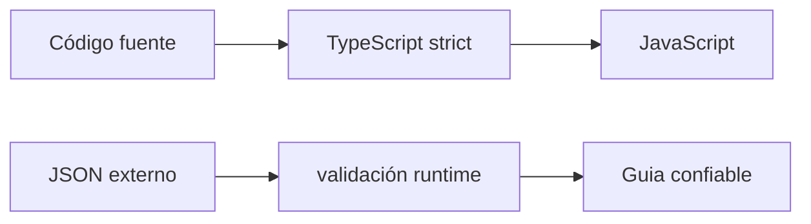

# Módulo 11: TypeScript esencial para devs de JavaScript


## Aprende construyendo

### Tema 1: Tipos básicos, interfaces y type aliases

#### Paso 1 · Objetivo y preparación

Al finalizar podrás instalar TypeScript, modelar una entrega con unión e interfaz y comprobar tipos sin generar archivos. Separarás el comando de creación del estado completo de una guía de RutaFlow.

**Conocimiento previo:** objetos, funciones, módulos ESM y npm. Comprueba Node.js y parte del proyecto `rutaflow-web`; TypeScript se compila a JavaScript y no reemplaza el runtime.

#### Paso 2 · Contexto y caso real

Una guía no puede tener cualquier texto como estado y al crearla aún no posee fecha de entrega. En este incremento del proyecto RutaFlow modelaremos contratos diferentes para entrada y entidad persistida, evitando una interfaz gigante llena de opcionales.

#### Paso 3 · Teoría, modelo mental y analogía

**Conceptos clave:** anotaciones de tipo, `interface`, `type`, tipos opcionales y unión.

TypeScript añade un sistema de tipos estático sobre JavaScript, verificado en tiempo de compilación (no en tiempo de ejecución), permitiendo declarar explícitamente qué forma de datos espera y produce cada función, variable y estructura. Una `interface` describe la forma esperada de un objeto: qué propiedades tiene, de qué tipo es cada una, y cuáles son opcionales (marcadas con `?`, como `rol?: "admin" | "lector"`, indicando que la propiedad puede estar ausente sin que eso sea un error de tipo). Un `type alias` (`type EstadoPedido = "pendiente" | "enviado" | "entregado";`) da un nombre reutilizable a cualquier tipo, incluyendo tipos unión (donde el valor debe ser exactamente uno de un conjunto específico de valores literales posibles, no cualquier string arbitrario).

La diferencia práctica entre `interface` y `type` es sutil pero relevante en casos avanzados: una `interface` puede extenderse posteriormente en declaraciones separadas (declaration merging) y es la forma tradicionalmente preferida para describir la forma de objetos y clases; un `type` es más flexible para expresar uniones, intersecciones y tipos que no son simplemente formas de objeto (como el tipo unión `EstadoPedido` del ejemplo, que no tendría sentido expresar como `interface`). En la práctica cotidiana, muchos equipos adoptan la convención de usar `interface` para formas de objetos y `type` para todo lo demás (uniones, tipos primitivos con nombre, tipos de función), aunque ambas herramientas se solapan considerablemente y la elección entre ellas para casos simples es, en gran medida, una cuestión de convención de equipo más que de una diferencia técnica decisiva.

Anotar el tipo de retorno de una función explícitamente (`function saludar(usuario: Usuario): string {...}`) no es estrictamente necesario en la mayoría de casos, porque TypeScript infiere automáticamente el tipo de retorno a partir del cuerpo de la función; sin embargo, anotarlo explícitamente en funciones públicas o exportadas es una práctica recomendada, porque actúa como documentación verificada por el compilador y como una salvaguarda que detecta inmediatamente si una modificación futura del cuerpo de la función cambia accidentalmente su tipo de retorno de forma incompatible con su uso en el resto del código.

Definir tipos precisos para las estructuras de datos centrales de una aplicación desde el principio (en vez de posponerlo o usar tipos genéricos vagos) paga dividendos considerables a medida que el proyecto crece: cada uso incorrecto de esa estructura en cualquier parte del código se detecta inmediatamente en tiempo de compilación, mucho antes de que ese error llegue a manifestarse como un bug real en producción observado por un usuario final.

**Analogía:** una `interface` es como el plano arquitectónico formal de un edificio, especificando exactamente qué habitaciones existen y de qué tipo es cada una (algunas opcionales, como un sótano que puede o no estar presente); un `type alias` con unión es como una lista cerrada y explícita de códigos postales válidos para una zona de entrega, donde cualquier valor fuera de esa lista específica se rechaza de inmediato como inválido.

**¿Por qué es importante?** Definir tipos precisos convierte errores que de otro modo se descubrirían en producción (accediendo a una propiedad que no existe, pasando un tipo incorrecto a una función) en errores detectados inmediatamente en tiempo de compilación, antes de que el código llegue siquiera a ejecutarse.

#### Paso 4 · Demostración guiada desde cero

Instala TypeScript e inicializa configuración:

```bash
npm install --save-dev typescript
npx tsc --init
```

Desde una carpeta vacía crea `ejemplo-typescript-basico`, instala TypeScript y crea `src` y después `src/guia.ts`:

```bash
mkdir ejemplo-typescript-basico
cd ejemplo-typescript-basico
npm init -y
npm install -D typescript
mkdir src
```

```ts
export type EstadoGuia = "CREADA" | "EN_RUTA" | "ENTREGADA";

export interface CrearGuia {
  numero: string;
  pesoKg: number;
  notas?: string; // Solo este dato puede estar ausente durante creación.
}

export interface Guia extends CrearGuia {
  estado: EstadoGuia;
  creadaEn: Date;
}

export function crearGuia(entrada: CrearGuia): Guia {
  return {
    ...entrada,
    estado: "CREADA",
    creadaEn: new Date(),
  };
}
```

Ejecuta desde `rutaflow-web`:

```bash
npx tsc --noEmit
```

**Resultado esperado:** el compilador termina sin diagnósticos; `crearGuia` acepta número y peso y devuelve además estado y fecha con tipos conocidos.

**Fallo deliberado:** cambia `estado: "CREADA"` por `estado: "PERDIDA"`. TypeScript señala que el literal no pertenece a `EstadoGuia`, con archivo y línea. Restaura un estado válido en vez de ampliar la unión sin una regla del negocio.

#### Paso 5 · Práctica guiada

Añade `entregadaEn` únicamente al estado entregado mediante una unión discriminada. **Pista:** dos interfaces con `estado` literal expresan mejor la relación que `entregadaEn?: Date` disponible para todos.

#### Paso 6 · Práctica independiente

Modela dirección, servicio y destinatario sin `any`, prueba asignaciones válidas e inválidas con `@ts-expect-error` documentado y explica qué campos pertenecen a creación, tránsito y entrega.

#### Paso 7 · Cierre y evidencia

Ya puedes hacer que estados imposibles fallen antes de ejecutar. El siguiente tema conservará relaciones de tipos al reutilizar repositorios y respuestas paginadas. **Evidencia:** entrega archivo, compilación limpia y diagnóstico `PERDIDA`; explica por qué se separaron `CrearGuia` y `Guia`.

**Errores comunes:** usar `string` para estados cerrados; volver todo opcional; duplicar interfaces casi iguales; anotar lo que la inferencia ya sabe sin aportar contrato; creer que una interface valida datos en runtime.

**Fuentes oficiales:** [TypeScript Handbook — Everyday Types](https://www.typescriptlang.org/docs/handbook/2/everyday-types.html) y [Object Types](https://www.typescriptlang.org/docs/handbook/2/objects.html).

### Tema 2: Generics

#### Paso 1 · Objetivo y preparación

Al finalizar podrás crear una abstracción genérica que preserve la relación entre entidad e identificador, usar inferencia y añadir restricciones solo cuando sean necesarias. Implementarás un repositorio en memoria tipado para guías de RutaFlow.

**Prerrequisitos:** interfaces, Promesas, `Map` y tipos unión. Si una función siempre trabaja únicamente con `Guia`, mantenla concreta; generic no significa automáticamente mejor diseño.

#### Paso 2 · Contexto y caso real

RutaFlow necesita repositorios para guías y rutas con operaciones parecidas, pero no debe permitir guardar un usuario en el almacén de guías. El parámetro `T` expresará qué entidad entra y sale; `Id` conservará el tipo de búsqueda.

#### Paso 3 · Teoría, modelo mental y analogía

**Conceptos clave:** funciones y tipos parametrizados, inferencia automática de tipo genérico.

Los generics permiten escribir funciones, interfaces y clases que funcionan con cualquier tipo, sin sacrificar la seguridad de tipos específica de cada uso concreto: `function primero<T>(lista: T[]): T | undefined { return lista[0]; }` define una función que acepta un array de cualquier tipo `T` (un parámetro de tipo, no un valor), y devuelve un valor de ese mismo tipo `T` (o `undefined` si el array está vacío), preservando la relación de tipo entre la entrada y la salida: invocar `primero([1, 2, 3])` produce un resultado tipado como `number | undefined`, mientras que invocar `primero(["a", "b"])` produce un resultado tipado como `string | undefined`, sin necesidad de escribir una versión separada de la función para cada tipo posible de array.

En la mayoría de los casos, no es necesario especificar explícitamente el tipo genérico al invocar una función genérica (`primero<number>([1,2,3])`); TypeScript infiere automáticamente `T` a partir de los argumentos proporcionados en la llamada, y solo es necesario especificarlo explícitamente en casos donde la inferencia automática sería ambigua o insuficiente para determinar el tipo con precisión (por ejemplo, al invocar una función genérica sin ningún argumento cuyo tipo dependa de `T`, donde no hay ninguna pista disponible en la llamada para inferir el tipo automáticamente).

Sin generics, la alternativa sería usar `any` (renunciando a toda verificación de tipo, perdiendo por completo la seguridad que TypeScript ofrece) o escribir una versión separada y duplicada de la función para cada tipo específico necesario (una violación directa del principio de no repetir código, y una carga de mantenimiento creciente a medida que se necesitan más tipos). Los generics resuelven exactamente esta tensión: preservan la reutilización de código genérico sin sacrificar ninguna precisión de tipo específica para cada uso concreto de esa función genérica.

Los generics se extienden más allá de funciones simples a interfaces y clases completas (`interface Caja<T> { contenido: T; }`), y son la base sobre la que se construyen tipos utilitarios extremadamente comunes en código TypeScript real, como `Array<T>` (la propia notación genérica de array), `Promise<T>` (una promesa que resuelve con un valor de tipo `T` específico), y `Map<K, V>` (con tipos de clave y valor genéricos independientes), todos ejemplos de tipos genéricos ya integrados en el propio lenguaje que se usan constantemente sin necesariamente notar explícitamente que son, en efecto, generics.

**Analogía:** una función genérica es como una plantilla de contrato legal con espacios en blanco marcados consistentemente (`[NOMBRE]`, `[NOMBRE]` de nuevo en otra cláusula), donde rellenar todos los espacios con el mismo valor específico (por ejemplo, "Juan Pérez") en cada uso concreto del contrato mantiene la consistencia interna del documento, sin necesidad de redactar un contrato completamente distinto para cada persona que lo firme.

**¿Por qué es importante?** Los generics permiten escribir código verdaderamente reutilizable sin sacrificar seguridad de tipos, y son omnipresentes en TypeScript real (incluyendo tipos integrados del lenguaje como `Array`, `Promise` y `Map`), haciendo indispensable entenderlos para leer y escribir TypeScript idiomático con fluidez.

#### Paso 4 · Demostración guiada desde cero

Desde una carpeta vacía crea `ejemplo-generics-ts`, instala TypeScript y crea `src` y después `src/repositorio.ts`:

```bash
mkdir ejemplo-generics-ts
cd ejemplo-generics-ts
npm init -y
npm install -D typescript
mkdir src
```

```ts
export interface Repositorio<T, Id> {
  obtener(id: Id): Promise<T | undefined>;
  guardar(id: Id, entidad: T): Promise<void>;
}

export class RepositorioMemoria<T, Id> implements Repositorio<T, Id> {
  private readonly datos = new Map<Id, T>();

  async obtener(id: Id): Promise<T | undefined> {
    return this.datos.get(id);
  }

  async guardar(id: Id, entidad: T): Promise<void> {
    // El mismo T usado al crear el repositorio controla cada escritura.
    this.datos.set(id, entidad);
  }
}
```

En `src/main.ts`, instancia `new RepositorioMemoria<Guia, string>()`, guarda una guía y asigna la búsqueda a `Guia | undefined`.

```bash
npx tsc --noEmit
```

**Resultado esperado:** cero diagnósticos; TypeScript infiere que buscar por string produce `Promise<Guia | undefined>` y rechaza ids numéricos.

**Fallo deliberado:** intenta `repositorio.guardar("U-1", { nombre: "Ana" })`. El compilador muestra propiedades faltantes de `Guia`; no uses `as Guia` para silenciarlo, corrige el repositorio o la entidad.

#### Paso 5 · Práctica guiada

Crea `Pagina<T>` con `items`, `total` y `siguienteCursor`, y devuelve `Pagina<Guia>`. **Pista:** `T` cambia los elementos, mientras metadatos permanecen iguales.

#### Paso 6 · Práctica independiente

Implementa repositorios de Ruta y Guia, prueba inferencia y agrega `T extends { numero: string }` únicamente a una función que realmente lee `numero`. Explica cada parámetro de tipo con una frase.

#### Paso 7 · Cierre y evidencia

Ya puedes reutilizar estructura sin renunciar a precisión. El siguiente tema reducirá uniones y exigirá manejar cada evento de entrega. **Evidencia:** demuestra compilación, tipo inferido y error al guardar Usuario; explica por qué no se usó `any`.

**Errores comunes:** crear letras genéricas sin relación; usar `any`; imponer constraints innecesarios; especificar tipos que el compilador infiere; confundir tipo genérico con valor disponible en runtime.

**Fuentes oficiales:** [TypeScript Handbook — Generics](https://www.typescriptlang.org/docs/handbook/2/generics.html) y [Type Inference](https://www.typescriptlang.org/docs/handbook/type-inference.html).

### Tema 3: Narrowing y union types

#### Paso 1 · Objetivo y preparación

Al finalizar podrás modelar eventos con una unión discriminada, reducir el tipo mediante `switch` y obligar al compilador a detectar variantes sin manejar. Describirás eventos de geolocalización y entrega de RutaFlow sin conversiones inseguras.

**Conocimiento previo:** uniones, interfaces, funciones y `never`. Recuerda que `as` no valida nada; solo cambia lo que el compilador supone.

#### Paso 2 · Contexto y caso real

Un evento de ubicación contiene coordenadas y uno de entrega contiene receptor. En el proyecto RutaFlow, una propiedad `tipo` permitirá que cada rama acceda únicamente a sus datos y que una nueva variante rompa compilación hasta decidir su comportamiento.

#### Paso 3 · Teoría, modelo mental y analogía

**Conceptos clave:** restricción progresiva de tipo posible, `typeof`, `instanceof`, `in`.

Un tipo unión (`string | number`) indica que un valor puede ser de cualquiera de los tipos listados, pero dentro del cuerpo de una función, TypeScript no permite usar directamente métodos específicos de un solo tipo (como `.toFixed()`, exclusivo de `number`) sobre un valor cuyo tipo declarado es una unión, precisamente porque el valor real podría ser del otro tipo de la unión en ese momento específico, y aplicar un método incompatible causaría un error real en tiempo de ejecución. El narrowing es el proceso mediante el cual, dentro de una rama condicional específica del código, TypeScript reduce progresivamente el conjunto de tipos posibles de una variable según las comprobaciones explícitas realizadas en el código (verificaciones que el propio desarrollador ya necesitaría hacer en JavaScript puro para manejar el valor correctamente, pero que en TypeScript además informan al compilador sobre el tipo específico dentro de esa rama).

`typeof valor === "number"` es la forma más común de narrowing para tipos primitivos: dentro del bloque `if` correspondiente, TypeScript automáticamente reduce (narrows) el tipo de `valor` a `number` específicamente para ese bloque, permitiendo usar `.toFixed()` con seguridad total sin ningún error de tipo, mientras que en la rama `else` correspondiente, TypeScript sabe automáticamente que el tipo restante debe ser `string` (el otro miembro de la unión original), permitiendo usar `.toUpperCase()` con la misma seguridad garantizada por el compilador.

`instanceof` cumple un papel de narrowing equivalente para tipos de clase (`valor instanceof Error` reduce el tipo dentro de esa rama a la clase específica `Error`, permitiendo acceder con seguridad a sus propiedades y métodos específicos como `.message`), y el operador `in` permite narrowing basado en la presencia de una propiedad específica (`"volar" in animal` reduce el tipo a la variante de una unión de tipos de objeto que efectivamente incluye esa propiedad `volar`, distinguiendo entre distintas formas posibles de un objeto dentro de una unión de tipos de estructura).

El narrowing es lo que hace que trabajar con tipos unión en TypeScript sea seguro y ergonómico simultáneamente: en vez de forzar una conversión explícita insegura (`as number`, que el desarrollador podría escribir incorrectamente sin ninguna verificación real), el narrowing exige (y aprovecha) verificaciones explícitas del tipo real del valor antes de permitir operaciones específicas de ese tipo, garantizando en tiempo de compilación que esas operaciones nunca se aplicarán accidentalmente al tipo incorrecto de la unión.

**Analogía:** el narrowing es como un guardia de seguridad en la entrada de dos salas distintas de un evento (una para adultos, otra para menores) que, tras verificar la identificación de cada visitante en la puerta compartida de entrada, dirige a cada persona hacia la sala correspondiente exacta; una vez dentro de una sala específica, el personal de esa sala puede confiar con seguridad total en que todos los presentes cumplen exactamente el criterio verificado en la puerta, sin necesidad de volver a comprobarlo.

**¿Por qué es importante?** El narrowing permite trabajar con tipos unión de forma completamente segura, sin conversiones de tipo forzadas e inseguras, garantizando en tiempo de compilación que operaciones específicas de un tipo nunca se aplican accidentalmente al otro tipo de la unión.

#### Paso 4 · Demostración guiada desde cero

Desde una carpeta vacía crea `ejemplo-unions-ts`, instala TypeScript y crea `src` y después `src/eventos.ts`:

```bash
mkdir ejemplo-unions-ts
cd ejemplo-unions-ts
npm init -y
npm install -D typescript
mkdir src
```

```ts
type EventoGuia =
  | { tipo: "UBICACION_ACTUALIZADA"; latitud: number; longitud: number }
  | { tipo: "ENTREGA_CONFIRMADA"; receptor: string };

function assertNever(valor: never): never {
  throw new Error(`Evento no manejado: ${JSON.stringify(valor)}`);
}

export function describirEvento(evento: EventoGuia): string {
  switch (evento.tipo) {
    case "UBICACION_ACTUALIZADA":
      // El discriminante reduce evento y habilita coordenadas con seguridad.
      return `Posición ${evento.latitud}, ${evento.longitud}`;
    case "ENTREGA_CONFIRMADA":
      return `Recibió ${evento.receptor}`;
    default:
      return assertNever(evento);
  }
}
```

Ejecuta:

```bash
npx tsc --noEmit
```

**Resultado esperado:** compilación limpia y acceso a coordenadas solo en su caso; autocompletado muestra propiedades específicas después del narrowing.

**Fallo deliberado:** añade `{ tipo: "ENTREGA_FALLIDA"; motivo: string }` a la unión sin agregar un `case`. `assertNever(evento)` deja de aceptar el valor y la compilación falla. Implementa la rama en vez de eliminar exhaustividad.

#### Paso 5 · Práctica guiada

Escribe `esEventoGuia(valor: unknown): valor is EventoGuia` que compruebe objeto, discriminante y campos. **Pista:** empieza descartando `null` y valores cuyo `typeof` no sea `object`.

#### Paso 6 · Práctica independiente

Añade eventos cancelada y reprogramada, crea pruebas por variante y procesa JSON válido e inválido desde `unknown`. Compara discriminante con checks por presencia usando `in`.

#### Paso 7 · Cierre y evidencia

Ya puedes representar alternativas y mantener exhaustividad al evolucionar. El siguiente tema activará comprobaciones estrictas y validará datos externos antes de confiar en ellos. **Evidencia:** demuestra dos salidas, error al añadir variante y guard de runtime; explica por qué `never` prueba exhaustividad.

**Errores comunes:** usar `as`; discriminar con texto opcional; olvidar `null`; acceder a campos antes del narrowing; dejar un `default` genérico que oculta variantes nuevas.

**Fuentes oficiales:** [TypeScript Handbook — Narrowing](https://www.typescriptlang.org/docs/handbook/2/narrowing.html) y [Union Exhaustiveness](https://www.typescriptlang.org/docs/handbook/unions-and-intersections.html#union-exhaustiveness-checking).

### Tema 4: tsconfig esencial y modo strict

#### Paso 1 · Objetivo y preparación

Al finalizar podrás configurar un proyecto estricto, manejar índices posiblemente ausentes y convertir `unknown` en una guía validada en runtime. Establecerás la frontera confiable entre JSON externo y dominio RutaFlow.

**Prerrequisitos:** TypeScript instalado, interfaces, narrowing y terminal. Migra archivos gradualmente, pero no habilites `allowJs` sin entender qué parte sigue fuera del chequeo estricto.

#### Paso 2 · Contexto y caso real

La API puede devolver un número como `7` o eliminar `estado` aunque la interface diga lo contrario. En este incremento del proyecto RutaFlow, TypeScript protegerá código propio y un parser verificará cada respuesta antes de declararla `Guia`.

#### Paso 3 · Teoría, modelo mental y analogía

**Conceptos clave:** `strict`, `noImplicitAny`, `noUncheckedIndexedAccess`, límites de TypeScript en runtime.

`tsconfig.json` configura el comportamiento del compilador de TypeScript para un proyecto, y la opción más importante de todas es `"strict": true`, que activa simultáneamente un conjunto completo de verificaciones más rigurosas (incluyendo `noImplicitAny`, `strictNullChecks`, y varias otras), en vez de tener que activarlas manualmente una por una. Adoptar `strict` desde el inicio de un proyecto nuevo es la práctica ampliamente recomendada por la comunidad de TypeScript, porque migrar un proyecto grande existente hacia el modo estricto después de haberlo desarrollado sin él suele revelar una cantidad considerable de errores de tipo previamente ocultos, un esfuerzo de corrección que crece proporcionalmente con el tamaño acumulado del proyecto.

`noImplicitAny`, incluida dentro de `strict`, exige que cada parámetro y variable tenga un tipo explícito o inferible; sin esta opción, TypeScript permitiría silenciosamente que una variable sin anotación de tipo explícita se trate implícitamente como `any` (el tipo que desactiva completamente la verificación de tipos, aceptando cualquier valor y cualquier operación sobre él sin ninguna comprobación), socavando silenciosamente gran parte del valor real que TypeScript ofrece. `strictNullChecks`, otra verificación clave incluida en `strict`, obliga a manejar explícitamente los casos donde un valor podría ser `null` o `undefined`, en vez de asumir implícitamente (y con frecuencia incorrectamente) que un valor siempre está presente, una fuente extremadamente común de errores en tiempo de ejecución en JavaScript puro sin esta protección adicional del compilador.

`noUncheckedIndexedAccess`, una opción adicional recomendada más allá del propio `strict`, hace que acceder a un array o a un objeto mediante un índice (`array[i]`) devuelva un tipo que incluye explícitamente `undefined` en su unión, reflejando con precisión la realidad de que ese índice específico podría estar fuera de rango, en vez de asumir optimistamente (y de forma potencialmente incorrecta) que el acceso siempre produce un valor válido del tipo esperado del array.

Es fundamental entender un límite real e importante de TypeScript, incluso en su configuración más estricta posible: todas estas verificaciones ocurren exclusivamente en tiempo de compilación, sobre el código fuente tal como está escrito; TypeScript no tiene ninguna forma de verificar en tiempo de ejecución que datos provenientes de una fuente externa (como la respuesta JSON de una API, vista en el Módulo 6) realmente cumplen la forma declarada por una `interface`. Si una API cambia su formato de respuesta sin que el código TypeScript se actualice para reflejarlo, TypeScript confiará ciegamente en la anotación de tipo declarada (`interface Usuario`), sin verificar en absoluto que los datos reales recibidos en tiempo de ejecución realmente tengan esa forma exacta, un desajuste que solo una biblioteca de validación en tiempo de ejecución (como Zod) puede detectar de forma efectiva, verificando explícitamente la forma real de los datos externos en el momento en que se reciben, más allá de lo que TypeScript puede garantizar únicamente en tiempo de compilación.

**Analogía:** el modo `strict` de TypeScript es como un inspector de calidad extremadamente meticuloso que revisa cada pieza de un producto antes de que salga de la fábrica (tiempo de compilación); pero ese inspector nunca puede garantizar que un proveedor externo de materia prima (una API externa) siga entregando exactamente la especificación acordada en cada envío futuro, sin un control de calidad adicional específico verificando cada envío real a su llegada.

**¿Por qué es importante?** El modo estricto maximiza las garantías que TypeScript puede ofrecer en tiempo de compilación, pero entender que esas garantías no se extienden a datos externos verificados únicamente en tiempo de ejecución es esencial para diseñar aplicaciones robustas frente a APIs externas que puedan cambiar o comportarse de forma inesperada.

#### Paso 4 · Demostración guiada desde cero

Desde una carpeta vacía crea `ejemplo-strict-ts`, instala TypeScript y crea `src` y `tsconfig.json`:

```bash
mkdir ejemplo-strict-ts
cd ejemplo-strict-ts
npm init -y
npm install -D typescript
mkdir src
```

Crea `tsconfig.json`:

```json
{
  "compilerOptions": {
    "target": "ES2022",
    "module": "ESNext",
    "moduleResolution": "Bundler",
    "strict": true,
    "noUncheckedIndexedAccess": true,
    "noEmit": true
  },
  "include": ["src"]
}
```


Crea `src/parsear-guia.ts`:

```ts
import type { Guia, EstadoGuia } from "../dominio/guia";

const estados: readonly string[] = ["CREADA", "EN_RUTA", "ENTREGADA"];

function esRegistro(valor: unknown): valor is Record<string, unknown> {
  return typeof valor === "object" && valor !== null;
}

function esEstado(valor: unknown): valor is EstadoGuia {
  return typeof valor === "string" && estados.includes(valor);
}

export function parsearGuia(valor: unknown): Guia {
  if (!esRegistro(valor)) {
    throw new TypeError("La guía debe ser un objeto");
  }
  if (
    typeof valor.numero !== "string" ||
    typeof valor.pesoKg !== "number" ||
    !esEstado(valor.estado) ||
    typeof valor.creadaEn !== "string" ||
    Number.isNaN(Date.parse(valor.creadaEn)) ||
    (valor.notas !== undefined && typeof valor.notas !== "string")
  ) {
    throw new TypeError("La guía externa no cumple el contrato");
  }

  // Se construye una entidad nueva solo después de validar todos sus campos.
  return {
    numero: valor.numero,
    pesoKg: valor.pesoKg,
    estado: valor.estado,
    creadaEn: new Date(valor.creadaEn),
    ...(valor.notas === undefined ? {} : { notas: valor.notas }),
  };
}
```

Ejecuta comprobación y luego una prueba que pase `{ numero: 7 }`:

```bash
npx tsc
npm test -- src/api/parsear-guia.test.ts
```

**Resultado esperado:** TypeScript termina sin errores; el parser acepta un objeto completo válido y rechaza el número no string con un error controlado.

**Fallo deliberado:** toma `const primera = guias[0]` y accede directamente a `primera.estado`. Con `noUncheckedIndexedAccess`, el compilador advierte que puede ser `undefined`; comprueba existencia o usa una operación que modele lista vacía.

#### Paso 5 · Práctica guiada

Extrae validadores reutilizables para peso positivo y fecha válida o usa un esquema Zod que infiera el tipo. **Pista:** conserva mensajes por campo; un único “payload inválido” dificulta diagnosticar integraciones.

#### Paso 6 · Práctica independiente

Migra un módulo sin `any`, prueba payloads nulo, incompleto, incorrecto y válido y compara errores de compilación con errores de runtime. Documenta cada opción no predeterminada de tsconfig.

#### Paso 7 · Cierre y evidencia

Ya puedes separar garantías estáticas de validación externa y mantener strict desde el inicio. El próximo módulo integrará contratos, UI, red, pruebas y rendimiento en una aplicación completa. **Evidencia:** entrega tsconfig, parser y tests, demuestra error de índice y payload inválido; explica por qué una interface desaparece al ejecutar.

**Errores comunes:** usar `any`; confiar en `as`; duplicar `noImplicitAny` sin entender que strict lo incluye; ignorar índices; afirmar que TypeScript valida JSON externo.

**Fuentes oficiales:** [TypeScript — TSConfig Reference](https://www.typescriptlang.org/tsconfig/), [Strict](https://www.typescriptlang.org/tsconfig/strict.html) y [noUncheckedIndexedAccess](https://www.typescriptlang.org/tsconfig/noUncheckedIndexedAccess.html).

---


## Construcción guiada del capítulo

**Objetivo del laboratorio:** migrar un módulo JavaScript existente (la biblioteca de funciones del Módulo 1) a TypeScript estricto, sin usar `any` en ningún punto.

**Requisitos previos:** Módulos 0-10 completados, TypeScript instalado (`npm install -D typescript`).

| Paso | Acción | Código | Explicación |
|---|---|---|---|
| 1 | Renombrar un archivo `.js` a `.ts` | Activa `strict: true` en `tsconfig.json` | Corrige todos los errores que aparezcan |
| 2 | Definir `interface Usuario` y `type EstadoPedido` | Ver Tema 1 | Úsalos en al menos una función real |
| 3 | Escribir una función genérica `primero<T>` | Ver Tema 2 | Verifica que funciona para arrays de cualquier tipo |
| 4 | Aplicar narrowing sobre un parámetro `string | number` | Ver Tema 3 | Usa `typeof` para manejar ambos casos con seguridad |
| 5 | Tipar la respuesta de un `fetch` con una interface | Combina con el Módulo 6 | Añade un type guard que valide la forma real en runtime |
| 6 | Activar `noImplicitAny` y corregir cada `any` implícito | Revisa el código del Módulo 1 migrado | Ningún `any`, ni implícito ni explícito, debe quedar |

**Verificación:** el laboratorio se considera exitoso si `tsc --noEmit` (o el comando equivalente de verificación de tipos) no reporta ningún error sobre el módulo migrado, y si una búsqueda explícita de la palabra `any` en el código migrado no encuentra ninguna ocurrencia.

### Comprueba lo construido

#### Ejercicio verificable 1

¿Qué tipo representa un valor externo que todavía debe validarse?

**Respuesta esperada:** unknown

#### Ejercicio verificable 2

¿Qué opción activa el conjunto principal de comprobaciones rigurosas?

**Respuesta esperada:** strict|strict true

#### Ejercicio verificable 3

¿Los tipos de TypeScript existen para validar el JSON cuando la aplicación ya se está ejecutando?

**Respuesta esperada:** no

**Errores comunes y soluciones**

- **Usar `as any` para silenciar un error de tipo en vez de resolverlo correctamente.** Esto anula completamente la verificación de tipos en ese punto; busca la anotación de tipo correcta en su lugar, o usa un type guard apropiado.
- **Asumir que tipar la respuesta de una API con una `interface` garantiza que los datos reales cumplen esa forma.** Recuerda que TypeScript no verifica datos externos en runtime; añade validación explícita si la fuente externa no es completamente confiable.
- **Olvidar manejar el caso `undefined` al indexar un array con `noUncheckedIndexedAccess` activado.** Verifica explícitamente antes de usar el valor, en vez de asumir que siempre existe.

---
