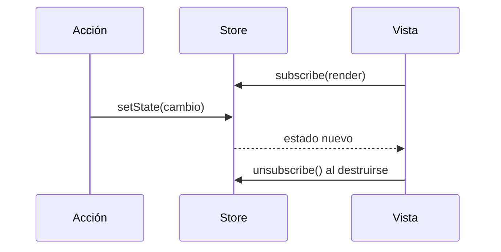
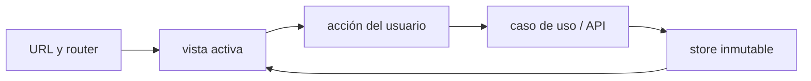

# Módulo 12: Proyecto integrador — SPA sin framework


## Aprende construyendo

### Tema 1: Routing manual con History API

#### Paso 1 · Objetivo y preparación

Al finalizar podrás resolver rutas estáticas y con parámetro, navegar sin recarga, responder a atrás/adelante y respetar enlaces modificados. Construirás el router accesible de la SPA del proyecto.

**Conocimiento previo:** DOM, eventos, URLs, módulos y pruebas. Configura el servidor de producción para devolver `index.html` ante rutas conocidas; History API no resuelve por sí sola una recarga profunda.

#### Paso 2 · Contexto y caso real

El proyecto necesita inicio, listado y detalle `/guias/RF-101`. La URL debe poder copiarse, recargarse y recorrerse con el historial. El proyecto separará resolución pura de efectos del navegador para probarla sin depender de clics manuales.

#### Paso 3 · Teoría, modelo mental y analogía

**Conceptos clave:** `history.pushState`, evento `popstate`, navegación sin recarga completa.

Una Single Page Application (SPA) mantiene la ilusión de navegación entre "páginas" distintas sin que el navegador realice una recarga completa del documento HTML en cada cambio de ruta, algo que requiere gestionar manualmente tanto la URL visible en la barra de direcciones como el contenido renderizado en pantalla, sincronizados entre sí de forma coherente. La History API del navegador, específicamente `history.pushState(estado, titulo, nuevaURL)`, permite cambiar la URL visible en la barra de direcciones sin disparar ninguna recarga de página, añadiendo además una nueva entrada al historial de navegación del navegador, de modo que el botón de retroceso del navegador funcione de forma coherente con esta navegación simulada.

El evento `popstate`, disparado en `window` cuando el usuario navega usando los botones de retroceso o avanzar del navegador (o invoca programáticamente `history.back()`/`history.forward()`), es el complemento necesario de `pushState`: sin escuchar este evento, el navegador cambiaría la URL visible correctamente al usar el botón de retroceso, pero el contenido renderizado en pantalla no se actualizaría en consecuencia, produciendo una desincronización perceptible y confusa entre la URL mostrada y el contenido real visible. Escuchar `popstate` y volver a ejecutar la lógica de renderizado según la nueva URL resultante cierra ese ciclo, manteniendo URL y contenido siempre sincronizados sin importar cómo el usuario navegue (mediante enlaces internos de la aplicación, o mediante los controles nativos de navegación del propio navegador).

Interceptar clics sobre enlaces internos de la aplicación (marcados, por ejemplo, con un atributo personalizado `data-link`) mediante `event.preventDefault()` es necesario para evitar que el navegador realice su comportamiento nativo por defecto de navegación con recarga completa de página al hacer clic en un elemento `<a>`, sustituyendo ese comportamiento nativo por la llamada a `pushState` y la lógica de renderizado manual correspondiente a la nueva ruta, mientras se preserva la apariencia y accesibilidad de un enlace real (incluyendo, por ejemplo, la posibilidad de abrir el enlace en una nueva pestaña mediante clic central o clic con una tecla modificadora, comportamientos que un router manual bien diseñado debería respetar y no interceptar indebidamente).

Un router manual mínimo, aunque simplificado comparado con las capacidades de un router de un framework maduro (parámetros de ruta anidados, guards de navegación, transiciones animadas), captura el mecanismo esencial que cualquier router más sofisticado, incluyendo los de Angular y React estudiados en sus tracks correspondientes, construye internamente sobre esta misma base: sincronizar la URL de la barra de direcciones con el contenido renderizado, respondiendo tanto a navegación programática interna como a los controles nativos del navegador.

**Analogía:** un router manual con History API es como un sistema de señalización interna en un museo grande que, en vez de obligar a los visitantes a salir completamente del edificio y volver a entrar por una puerta distinta cada vez que quieren ver una sala diferente (una recarga completa de página), simplemente los guía internamente hacia la sala correcta manteniendo un registro coherente de qué sala visitaron, de modo que puedan retroceder a la sala anterior siguiendo ese mismo registro sin confusión.

**¿Por qué es importante?** Entender el mecanismo exacto de la History API es la base sobre la que se construye cualquier sistema de routing de una SPA, incluyendo los routers de Angular y React que se estudiarán en sus tracks correspondientes, que automatizan esta misma sincronización de forma más sofisticada pero conceptualmente equivalente.

#### Paso 4 · Demostración guiada desde cero

Desde una carpeta vacía crea `ejemplo-history-router`, ejecuta `npm init -y`, crea `src` y después `src/router.js`:

```bash
mkdir ejemplo-history-router
cd ejemplo-history-router
npm init -y
mkdir src
```

```js
export function resolverRuta(pathname) {
  if (pathname === "/") return { vista: "inicio", parametros: {} };
  if (pathname === "/guias") return { vista: "guias", parametros: {} };
  const detalle = pathname.match(/^\/guias\/([^/]+)$/);
  if (detalle) return { vista: "detalle", parametros: { numero: decodeURIComponent(detalle[1]) } };
  return { vista: "no-encontrada", parametros: {} };
}

export function crearRouter({ renderizar }) {
  const renderActual = () => renderizar(resolverRuta(location.pathname));
  const navegar = (ruta) => { history.pushState({}, "", ruta); renderActual(); };
  const alClick = (evento) => {
    const enlace = evento.target.closest("a[data-link]");
    if (!enlace || evento.defaultPrevented || evento.button !== 0 ||
        evento.metaKey || evento.ctrlKey || evento.shiftKey || evento.altKey) return;
    evento.preventDefault();
    navegar(enlace.pathname);
  };
  addEventListener("popstate", renderActual);
  document.addEventListener("click", alClick);
  return { navegar, iniciar: renderActual, destruir: () => {
    removeEventListener("popstate", renderActual);
    document.removeEventListener("click", alClick);
  } };
}
```

Ejecuta pruebas de `resolverRuta` y luego desarrollo:

```bash
npm test -- src/router/router.test.js
npm run dev
```

**Resultado esperado:** `/guias/RF-101` produce vista detalle y número; enlaces, recarga configurada y atrás/adelante mantienen URL y vista; Ctrl/Cmd+clic conserva nueva pestaña.

**Fallo deliberado:** comenta `popstate`, navega y pulsa Atrás. La URL cambia pero la vista permanece. Restaura el listener y usa ese desajuste como diagnóstico.

#### Paso 5 · Práctica guiada

Después de navegar, mueve foco al `h1` de la vista con `tabindex="-1"`. **Pista:** cambiar DOM sin anunciar contexto deja a lectores de pantalla en una posición engañosa.

#### Paso 6 · Práctica independiente

Añade query de filtro, 404, trailing slash y caracteres codificados. Prueba resolución pura, clic modificado, cleanup y fallback del servidor de preview.

#### Paso 7 · Cierre y evidencia

Ya puedes sincronizar URL, historial y contenido. El siguiente tema centralizará estado compartido sin convertir el DOM en base de datos. **Evidencia:** demuestra tres rutas, atrás/adelante, nueva pestaña y fallo sin popstate; explica qué resuelve el servidor.

Este router manual es la última pieza estructural del proyecto integrador de este track (SPA sin framework): junto con el estado del próximo tema y el consumo de API del Tema 3, completa la aplicación de una sola página construida sin ningún framework.

**Cuándo no usarlo:** implementar routing manual con `pushState`/`popstate` tiene sentido para entender qué automatiza un framework; en un proyecto real con más de un puñado de rutas y necesidades como rutas anidadas o guards de navegación, un router de framework (Angular Router, React Router) resuelve estos mismos casos con mucho menos código propio que mantener.

**Errores comunes:** interceptar enlaces externos o modificados; olvidar popstate; no decodificar parámetros; carecer de 404; asumir que pushState configura el servidor.

**Fuentes oficiales:** [MDN — History API](https://developer.mozilla.org/en-US/docs/Web/API/History_API) y [MDN — popstate](https://developer.mozilla.org/en-US/docs/Web/API/Window/popstate_event).

### Tema 2: Estado de aplicación con un store propio

#### Paso 1 · Objetivo y preparación

Al finalizar podrás crear un store con lectura, actualización funcional, suscripción y cleanup, verificando inmutabilidad y orden de notificación. Centralizarás filtro y carga de guías del proyecto.

**Prerrequisitos:** closures, `Set`, objetos inmutables y Vitest. El store no hará fetch ni tocará DOM: solo administra transiciones y notifica.

#### Paso 2 · Contexto y caso real

Cabecera, lista y filtros necesitan el mismo estado. En este proyecto, el store será una única fuente y cada vista podrá abandonar la suscripción al cambiar de ruta.

#### Paso 3 · Teoría, modelo mental y analogía

**Conceptos clave:** patrón store, suscriptores, notificación de cambios, actualización inmutable.

Un store centraliza el estado compartido de una aplicación (los datos que múltiples partes de la interfaz necesitan leer y que cambian a lo largo del tiempo) en un único lugar bien definido, en vez de dispersar ese estado de forma descoordinada entre múltiples variables globales o entre el propio DOM directamente, un patrón que se vuelve rápidamente insostenible a medida que una aplicación crece más allá de una interacción trivial. Un store mínimo propio, sin ninguna biblioteca externa, expone típicamente tres capacidades: `getState()` para leer el estado actual en cualquier momento, `setState(cambios)` para actualizar el estado (idealmente de forma inmutable, aplicando el mismo principio de actualización sin mutación estudiado en el Módulo 4), y `subscribe(callback)` para registrar funciones que deben notificarse automáticamente cada vez que el estado cambia.

El mecanismo de notificación mediante `subscribe` es, en esencia, una aplicación directa del patrón observador: cualquier parte de la interfaz que necesite reaccionar a cambios de estado se registra una vez como suscriptor, y el store se encarga de invocar a todos los suscriptores registrados automáticamente cada vez que `setState` se invoca, desacoplando completamente la lógica que modifica el estado (que no necesita saber qué partes específicas de la interfaz dependen de ese estado) de la lógica que renderiza la interfaz en respuesta a esos cambios (que no necesita saber qué acción específica disparó el cambio, solo que el estado cambió y debe volver a renderizarse en consecuencia).

Devolver una función de cancelación de suscripción desde `subscribe` (`return () => listeners.delete(fn);`) es una práctica importante de higiene: permite que un componente de UI que deja de existir (por ejemplo, al navegar hacia otra ruta que ya no lo necesita) se dé de baja explícitamente de la lista de suscriptores del store, evitando que continúe recibiendo notificaciones innecesarias indefinidamente después de haber dejado de ser relevante, un descuido que de otro modo acumularía progresivamente suscriptores obsoletos y consumo de memoria innecesario en una aplicación de larga duración con muchas transiciones de vista.

Construir este patrón desde cero, aunque considerablemente más simplificado que las implementaciones completas de gestión de estado de bibliotecas dedicadas (Redux, o los propios mecanismos internos de Angular y React estudiados en sus tracks), revela con claridad el problema fundamental que esas herramientas resuelven de forma más sofisticada: mantener sincronizados de forma eficiente y predecible el estado de una aplicación y la interfaz que lo refleja visualmente, sin que cada parte de la aplicación necesite coordinar manualmente y de forma ad-hoc con cada otra parte que también depende del mismo estado compartido.

**Analogía:** un store es como un tablón de anuncios central de una oficina, donde cualquier departamento puede consultar el estado actual de un proyecto compartido, y cualquier departamento interesado puede suscribirse para recibir una notificación automática cada vez que ese tablón se actualiza, sin que el departamento que actualiza el tablón necesite conocer ni contactar individualmente a cada departamento interesado en enterarse del cambio.

**¿Por qué es importante?** Construir un store propio desde cero revela el mecanismo esencial de sincronización entre estado y UI que automatizan Angular y React, dando una base conceptual sólida para entender por qué esos frameworks están diseñados como están, antes de depender de sus abstracciones específicas.

#### Paso 4 · Demostración guiada desde cero

Desde una carpeta vacía crea `ejemplo-store`, ejecuta `npm init -y`, crea `src` y `test`, y después `src/store.js`:

```bash
mkdir ejemplo-store
cd ejemplo-store
npm init -y
npm install -D vitest
mkdir src test
```

```js
export function crearStore(estadoInicial) {
  let estado = estadoInicial;
  const listeners = new Set();
  return {
    getState: () => estado,
    setState: (actualizacion) => {
      const parcial = typeof actualizacion === "function"
        ? actualizacion(estado)
        : actualizacion;
      // Crea referencia nueva para que cambios sean observables y predecibles.
      estado = Object.freeze({ ...estado, ...parcial });
      listeners.forEach((listener) => listener(estado));
    },
    subscribe: (listener) => {
      listeners.add(listener);
      return () => listeners.delete(listener);
    },
  };
}
```



Crea `test/store.test.js` con dos suscriptores, guarda la referencia anterior, actualiza filtro y desuscribe uno.

```bash
npm test -- src/estado/store.test.js
```

**Resultado esperado:** ambos reciben la primera actualización, solo uno la segunda y la referencia nueva difiere de la anterior; actualizar funcionalmente puede leer estado reciente.

**Fallo deliberado:** reemplaza spread por `Object.assign(estado, parcial)`. Una prueba de referencia e inmutabilidad falla y un consumidor basado en identidad puede no detectar cambio. Restaura creación de objeto nuevo.

#### Paso 5 · Práctica guiada

Evita notificar si una actualización no cambia valores relevantes. **Pista:** primero define igualdad y mide; comparar profundamente cada estado puede costar más que renderizar.

#### Paso 6 · Práctica independiente

Prueba suscripción duplicada, desuscripción idempotente, actualización durante notificación y estado congelado. Documenta límites: efectos, concurrencia, selectores y DevTools no están incluidos.

#### Paso 7 · Cierre y evidencia

Ya puedes coordinar estado sin variables globales dispersas. El siguiente tema modelará carga, éxito y error como transiciones explícitas. **Evidencia:** demuestra dos suscriptores, cleanup, referencia nueva y fallo por mutación; explica por qué set funcional evita estado obsoleto.

**Errores comunes:** mutar; permitir fetch dentro del store genérico; olvidar cleanup; notificar antes de actualizar; suponer que este ejemplo reemplaza herramientas ante requisitos complejos.

**Fuentes oficiales:** [MDN — Set](https://developer.mozilla.org/en-US/docs/Web/JavaScript/Reference/Global_Objects/Set) y [MDN — Object.freeze](https://developer.mozilla.org/en-US/docs/Web/JavaScript/Reference/Global_Objects/Object/freeze).

### Tema 3: Consumo de una API real con manejo de errores

#### Paso 1 · Objetivo y preparación

Al finalizar podrás modelar una operación remota como estados mutuamente excluyentes, validar JSON y cancelar al abandonar la vista. Conectarás el cliente de guías del proyecto al store sin dejar pantallas ambiguas.

**Conocimiento previo:** fetch, AbortController, parser del módulo 11, store y pruebas de mocks. Necesitas distinguir error HTTP, red, datos y cancelación.

#### Paso 2 · Contexto y caso real

Una lista puede estar esperando, lista, vacía o fallida. En este proyecto cada transición será visible y un reintento iniciará una solicitud nueva; la vista no recibirá simultáneamente datos antiguos y un error nuevo.

#### Paso 3 · Teoría, modelo mental y analogía

**Conceptos clave:** estados de carga/error/datos, integración del store con `fetch`.

Conectar el store del Tema 2 a datos reales obtenidos mediante `fetch` (Módulo 6) requiere modelar explícitamente en el propio estado los distintos momentos posibles de una operación asíncrona: antes de que la petición inicie, mientras está en curso (estado de carga, típicamente mostrando un indicador visual al usuario para comunicar que algo está sucediendo), y después de que termina, ya sea con éxito (datos disponibles para renderizar) o con fallo (un mensaje de error que comunicar de forma clara y útil al usuario, en vez de dejar la interfaz en un estado ambiguo o simplemente vacío sin ninguna explicación).

Un patrón robusto y ampliamente usado es representar estos tres momentos explícitamente como parte del estado (`{ cargando: boolean, datos: T | null, error: string | null }`), actualizando el store en cada transición: `setState({cargando: true, error: null})` inmediatamente antes de disparar la petición; `setState({cargando: false, datos: resultado})` al recibir una respuesta exitosa; `setState({cargando: false, error: mensaje})` si la petición falla, ya sea por un error de red genuino o por una respuesta HTTP de error (recordando del Módulo 6 que `fetch` no rechaza automáticamente ante estas últimas, requiriendo verificación explícita de `respuesta.ok`).

La interfaz, suscrita al store mediante el mecanismo del Tema 2, simplemente reacciona a estos tres estados posibles renderizando el contenido apropiado en cada caso: un indicador de carga mientras `cargando` es verdadero, el contenido real cuando `datos` está disponible y `cargando` es falso, o un mensaje de error claro cuando `error` no es nulo, sin necesidad de que la lógica de renderizado conozca los detalles internos de cómo o cuándo se disparó la petición original, simplemente reaccionando al estado actual disponible en el store en cualquier momento dado.

Esta separación entre "la lógica que dispara y gestiona la petición asíncrona" y "la lógica que renderiza según el estado resultante" es exactamente el mismo principio de separación de responsabilidades que sustenta el manejo de datos asíncronos en frameworks completos como Angular (con sus Observables y servicios) o React (con sus Hooks de estado y efectos), estudiados en sus tracks correspondientes, donde este mismo patrón de "cargando/datos/error" reaparece consistentemente como la forma estándar y ampliamente adoptada de modelar operaciones asíncronas en una interfaz de usuario.

**Analogía:** modelar explícitamente los tres estados de una operación asíncrona es como un semáforo con tres luces claras y bien diferenciadas —amarillo intermitente mientras se procesa una solicitud en curso, verde cuando la solicitud se completó con éxito, rojo cuando falló— en vez de un indicador ambiguo de una sola luz que no comunica con precisión en cuál de los tres momentos posibles se encuentra realmente la situación en cada instante.

**¿Por qué es importante?** Modelar explícitamente carga, datos y error como parte del estado (en vez de dejarlos implícitos o parcialmente gestionados) es el patrón estándar para construir interfaces que comunican claramente al usuario qué está sucediendo en cada momento de una operación asíncrona, un patrón que reaparece consistentemente en cualquier framework de UI moderno.

#### Paso 4 · Demostración guiada desde cero

Desde una carpeta vacía crea `ejemplo-api-client`, ejecuta `npm init -y`, crea `src` y después `src/cargar.js`:

```bash
mkdir ejemplo-api-client
cd ejemplo-api-client
npm init -y
mkdir src
```

```js
export async function cargarGuias(store, { fetchImpl = fetch, signal } = {}) {
  store.setState({ remoto: { tipo: "loading" } });
  try {
    const respuesta = await fetchImpl("/api/guias", { signal });
    if (!respuesta.ok) throw new Error(`HTTP ${respuesta.status}`);
    const json = await respuesta.json();
    if (!Array.isArray(json)) throw new TypeError("Respuesta de guías inválida");
    // parsearGuia valida cada frontera antes de entrar al dominio.
    const guias = json.map(parsearGuia);
    store.setState({ remoto: { tipo: "success", guias } });
  } catch (error) {
    if (error instanceof DOMException && error.name === "AbortError") return;
    console.error("Carga de guías", error);
    store.setState({ remoto: {
      tipo: "error",
      mensaje: "No pudimos cargar las entregas. Intenta de nuevo.",
    } });
  }
}
```

Importa `parsearGuia`, crea pruebas con fetch inyectado y ejecuta:

```bash
npm test -- src/api/cargar-guias.test.js
npm run dev
```

**Resultado esperado:** la prueba observa `loading` seguido de `success`; HTTP 500 y JSON inválido terminan en `error` con mensaje seguro; la vista muestra carga, lista o botón Reintentar según `tipo`.

**Fallo deliberado:** elimina `respuesta.ok` y simula 500 con cuerpo JSON. La función puede tratar error como éxito. Restaura la verificación y demuestra que HTTP no equivale a rechazo de red.

#### Paso 5 · Práctica guiada

Crea un `AbortController` por vista y cancela en `destroy`. **Pista:** una cancelación intencional no debe mostrar “No pudimos cargar”; tampoco debe actualizar una vista ya desmontada.

#### Paso 6 · Práctica independiente

Prueba carga, lista vacía, éxito, HTTP, red, JSON inválido y abort. Añade reintento sin listeners duplicados y separa diagnóstico técnico de texto visible.

#### Paso 7 · Cierre y evidencia

Ya puedes integrar red sin estados contradictorios. El siguiente tema ensamblará router, store, cliente y vistas en un único composition root. **Evidencia:** demuestra secuencias de estado, error visible, parser y abort silencioso; explica por qué `fetchImpl` se inyecta.

**Errores comunes:** modelar varios booleanos incompatibles; omitir `ok`; confiar en JSON; mostrar detalles internos; actualizar después de desmontar; confundir vacío con error.

**Fuentes oficiales:** [MDN — Fetch API](https://developer.mozilla.org/en-US/docs/Web/API/Fetch_API/Using_Fetch) y [MDN — AbortController](https://developer.mozilla.org/en-US/docs/Web/API/AbortController).

### Tema 4: Conectando todo — el patrón completo de una SPA

#### Paso 1 · Objetivo y preparación

Al finalizar podrás ensamblar dependencias en un composition root, montar una vista por ruta y ejecutar su `destroy` antes de cambiar. Entregarás una SPA funcional en desarrollo y producción.

**Prerrequisitos:** router, store, cliente, render DOM, módulos, pruebas y build. Conserva cada unidad en su carpeta; `app.js` conectará contratos pero no reimplementará sus detalles.

#### Paso 2 · Contexto y caso real

Las piezas aisladas funcionan, pero una aplicación necesita ordenar creación y destrucción. En este proyecto, navegar desmontará la vista anterior, cancelará red, retirará listeners y suscripciones y montará la siguiente con dependencias explícitas.

#### Paso 3 · Teoría, modelo mental y analogía

**Conceptos clave:** integración de routing, store y renderizado, lo que un framework automatiza.

El patrón completo de esta SPA sin framework integra los tres temas anteriores en un ciclo coherente: una ruta activa (gestionada por el router del Tema 1) determina qué vista específica debe renderizarse; esa vista lee su información necesaria del store (Tema 2), que puede a su vez estar poblado con datos reales obtenidos de una API (Tema 3); las acciones del usuario dentro de esa vista (un clic, el envío de un formulario) invocan `store.setState(...)` directamente, o disparan una nueva petición `fetch` que eventualmente actualiza el store con su resultado; y cuando el store notifica un cambio a través de sus suscriptores, la función de renderizado correspondiente a la vista actualmente activa se vuelve a ejecutar, actualizando el DOM manualmente para reflejar el nuevo estado.

Este ciclo completo —ruta activa → lectura del store → renderizado → acción del usuario → actualización del store → nuevo renderizado— es, en esencia, exactamente lo que un framework de UI como Angular o React automatiza y abstrae mediante sus propios mecanismos específicos: el "binding" declarativo entre estado y DOM (en vez de actualizar el DOM manualmente con `createElement`/`appendChild` en cada cambio, un framework declara qué debería mostrarse dado un estado, y el framework mismo se encarga de calcular y aplicar eficientemente los cambios mínimos necesarios al DOM real), el diffing eficiente (determinar exactamente qué partes del DOM necesitan actualizarse ante un cambio de estado, sin re-renderizar innecesariamente partes que no cambiaron), y la gestión del ciclo de vida de los componentes (inicialización, actualización, destrucción, incluyendo la cancelación automática de suscripciones al store cuando un componente deja de existir).

Haber construido manualmente cada una de estas piezas —el router, el store, la integración con datos asíncronos, el renderizado manual del DOM en respuesta a cambios— antes de aprender un framework completo en los tracks siguientes (Angular, React) tiene un valor pedagógico deliberado y considerable: permite apreciar con precisión exactamente qué problema resuelve cada capacidad específica de un framework, en vez de aprender esas capacidades como "magia" que simplemente funciona sin entender el problema real subyacente que resuelven, ni por qué esas soluciones específicas fueron diseñadas de la forma en que lo fueron.

Reflexionar honestamente, al completar este proyecto, sobre en qué punto exacto del desarrollo un framework habría ahorrado tiempo real y reducido complejidad genuina (probablemente en el renderizado eficiente del DOM ante cambios frecuentes de estado, y en la gestión coordinada del ciclo de vida de múltiples vistas simultáneas) es un ejercicio de síntesis que consolida de forma duradera tanto el conocimiento de JavaScript puro de este track completo como la motivación genuina y bien fundamentada para adoptar un framework en los tracks siguientes.

**Analogía:** construir esta SPA sin framework es como construir manualmente un reloj mecánico completo antes de empezar a usar relojes con movimiento automático: una vez que entiendes exactamente cómo cada engranaje individual contribuye al movimiento final completo, apreciar y confiar en un mecanismo automático más sofisticado (que internamente sigue dependiendo de los mismos principios mecánicos fundamentales) se vuelve una decisión informada, no un acto de fe ciega en una caja negra que nunca se entendió realmente.

**¿Por qué es importante?** Este proyecto integrador consolida todo el conocimiento de JavaScript puro de los doce módulos anteriores en un sistema coherente y funcional, y sienta las bases conceptuales exactas sobre las que se construirán los tracks de Angular y React que siguen a continuación.

**Diagrama:**



#### Paso 4 · Demostración guiada desde cero

Desde una carpeta vacía crea `ejemplo-spa-completa`, ejecuta `npm init -y`, crea `src` y `index.html`, y después `src/app.js`:

```bash
mkdir ejemplo-spa-completa
cd ejemplo-spa-completa
npm init -y
mkdir src
touch index.html
```

```js
import { crearRouter } from "./router/router.js";
import { crearStore } from "./estado/store.js";
import { crearVistaGuias, crearVistaInicio, crearVista404 } from "./vistas/index.js";

export function crearAplicacion(raiz, dependencias) {
  const store = crearStore({ remoto: { tipo: "idle" }, filtro: "TODAS" });
  let vistaActual = { destroy() {} };

  const renderizar = (ruta) => {
    // El ciclo de vida anterior termina antes de montar el siguiente.
    vistaActual.destroy();
    raiz.replaceChildren();
    if (ruta.vista === "inicio") vistaActual = crearVistaInicio(raiz);
    else if (ruta.vista === "guias") {
      vistaActual = crearVistaGuias(raiz, { store, cliente: dependencias.cliente });
    } else vistaActual = crearVista404(raiz);
  };

  const router = crearRouter({ renderizar });
  router.iniciar();
  return { destroy() { vistaActual.destroy(); router.destruir(); } };
}
```

Ejecuta desarrollo, build y vista previa:

```bash
npm run dev
npm run build
npm run preview
```

**Resultado esperado:** inicio, lista, detalle/404 y atrás/adelante funcionan; carga/error son visibles; build termina y preview mantiene navegación configurada.

**Fallo deliberado:** comenta `vistaActual.destroy()` y navega diez veces. Un clic o cambio de store se procesa varias veces por listeners acumulados. Restaura cleanup y confirma una sola reacción.

#### Paso 5 · Práctica guiada

Carga auditoría con `import()` solo al entrar a su ruta y muestra estado de chunk fallido. **Pista:** la vista lazy conserva el mismo contrato `destroy`, aunque su módulo llegue después.

#### Paso 6 · Práctica independiente

Añade detalle real, 404, foco, error boundary de vista y pruebas de navegación con cleanup. Documenta tamaño del bundle, limitaciones del router/store y qué justificaría adoptar un framework.

#### Paso 7 · Cierre y evidencia

Ya puedes explicar el ciclo completo que automatizan Angular y React. El siguiente módulo preparará seguridad, accesibilidad, observabilidad y despliegue del producto. **Evidencia:** entrega SPA y build, demuestra rutas, estados y teardown, y explica el resultado del fallo con listeners duplicados; dibuja el flujo URL → vista → acción → API → store → render.

**Errores comunes:** hacer service locator global; llamar fetch desde DOM; olvidar destruir; mezclar resolución con render; considerar el build suficiente sin probar recarga profunda.

**Fuentes oficiales:** [MDN — SPA glossary](https://developer.mozilla.org/en-US/docs/Glossary/SPA), [Vite — Static Deploy](https://vite.dev/guide/static-deploy.html) y [Web.dev — Code splitting](https://web.dev/articles/reduce-javascript-payloads-with-code-splitting).

---

## Construcción guiada del capítulo

**Objetivo del laboratorio:** construir una SPA completa y funcional (varias vistas, estado compartido, datos reales de una API) sin ningún framework de UI, integrando todos los conceptos del track.

**Requisitos previos:** todos los Módulos 0-11 completados, Node.js con Vite instalado.

| Paso | Acción | Código | Explicación |
|---|---|---|---|
| 1 | Implementar el router manual | Ver Tema 1, al menos 3 rutas (`/inicio`, `/detalle/:id`, `/404`) | Verifica navegación con clic y con retroceso del navegador |
| 2 | Construir el store propio | Ver Tema 2 | Verifica que múltiples suscriptores se notifican correctamente |
| 3 | Conectar el store a datos reales | Ver Tema 3, usa la misma API pública del Módulo 6 | Modela explícitamente `cargando`/`datos`/`error` |
| 4 | Renderizar las vistas según ruta y estado | Actualiza el DOM manualmente en cada notificación del store | Verifica sincronización entre URL, estado y contenido visible |
| 5 | Manejar errores visibles al usuario | Ruta inexistente → vista 404; fetch fallido → mensaje de error | Ningún estado de fallo debe quedar sin comunicar al usuario |
| 6 | Generar el build de producción | `npm run build` | Documenta el tamaño final del bundle y qué se podría optimizar más |

**Verificación:** el laboratorio se considera exitoso si la SPA completa navega correctamente entre las 3 rutas (incluyendo con los botones nativos de retroceso/avance del navegador), si los datos reales se cargan y muestran correctamente con sus tres estados (carga/datos/error) claramente comunicados, y si el build de producción se genera sin errores.

### Comprueba lo construido

#### Ejercicio verificable 1

¿Qué evento debes escuchar para responder a los botones atrás y adelante?

**Respuesta esperada:** popstate

#### Ejercicio verificable 2

¿Qué función debe devolver `subscribe` para evitar suscriptores obsoletos?

**Respuesta esperada:** unsubscribe|desuscripcion|desuscripción

#### Ejercicio verificable 3

¿Qué método del ciclo de vida debe limpiar listeners y peticiones al abandonar una vista?

**Respuesta esperada:** destroy|destroy()

**Errores comunes y soluciones**

- **Olvidar escuchar `popstate`, dejando el botón de retroceso del navegador desincronizado del contenido mostrado.** Verifica que la lógica de renderizado se vuelva a ejecutar tanto en navegación programática como en `popstate`.
- **No desuscribirse del store al cambiar de vista, acumulando suscriptores obsoletos.** Guarda y ejecuta la función de cancelación devuelta por `subscribe` al desmontar una vista.
- **Dejar la interfaz en un estado ambiguo cuando `fetch` falla, sin ningún mensaje visible.** Verifica que el estado `error` del store siempre se traduzca en un mensaje claro y visible para el usuario.

---
