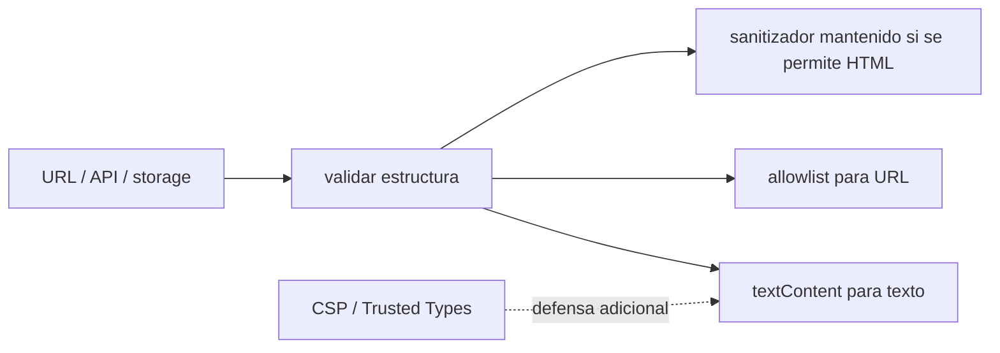
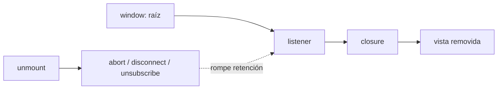
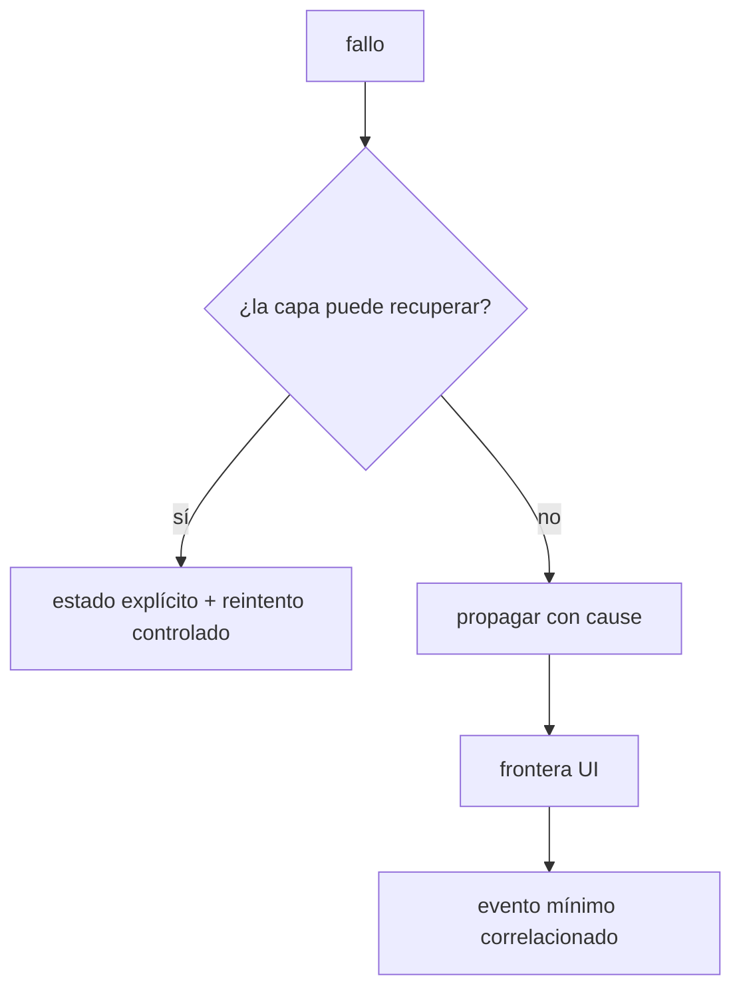
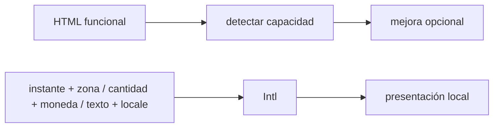

# Módulo 13: JavaScript en producción — seguridad, memoria y compatibilidad

Una aplicación no está terminada cuando muestra datos. En producción recibe entradas hostiles, permanece abierta durante horas, corre en dispositivos diferentes y debe explicar qué falló sin filtrar información privada. En este módulo endurecerás la SPA del módulo 12 mediante evidencia reproducible.


## Aprende construyendo

### Tema 1: Datos no confiables y seguridad en el navegador

#### Paso 1 · Objetivo y preparación

Al finalizar podrás identificar una frontera de confianza, renderizar texto sin interpretarlo, permitir únicamente URLs HTTPS y explicar el papel limitado de CSP, CORS y CSRF. Endurecerás el seguimiento público de RutaFlow con una prueba de regresión XSS.

**Conocimiento previo:** DOM, URLs, HTTP, cookies y pruebas. Usa únicamente payloads inocuos en un entorno local sin sesiones ni datos reales; el objetivo es observar interpretación, no ejecutar daño.

#### Paso 2 · Contexto y caso real

El código público y estado pueden venir de una API comprometida o de datos almacenados por otra persona. En el proyecto RutaFlow, cada valor seguirá siendo `unknown` hasta validar estructura y cada salida usará una defensa apropiada a texto o URL.

#### Paso 3 · Teoría, modelo mental y analogía

**Conceptos clave:** activo, actor, frontera de confianza, entrada no confiable, XSS, contexto HTML, atributo, URL, DOM sink, CSP, nonce, Trusted Types, CSRF, CORS, dependencia y prototype pollution.

Todo dato externo conserva condición de no confiable aunque venga de “tu API”: pudo almacenarse antes, ser manipulado en tránsito fuera de TLS o provenir de otro usuario. XSS ocurre cuando datos se interpretan como código ejecutable. El remedio depende del contexto. Texto, atributo, URL, CSS y JavaScript tienen reglas distintas; una función casera que reemplaza `<` no constituye una defensa general.

Prefiere APIs que mantienen texto como texto:

```javascript
const title = document.createElement('h2');
title.textContent = product.name;
card.replaceChildren(title);
```

`innerHTML` interpreta markup y solo debe recibir plantillas controladas o contenido procesado por una biblioteca mantenida y adecuada al contexto. `setAttribute('href', value)` tampoco vuelve segura una URL: valida protocolo y construye con `new URL`. Nunca pases texto externo a `eval`, `Function`, `setTimeout` como string ni handlers inline.

Content Security Policy agrega defensa en profundidad al limitar fuentes ejecutables. Empieza en modo report-only, observa violaciones, elimina scripts inline y despliega una política explícita con nonces o hashes cuando sean necesarios. CSP no corrige el render inseguro y permitir `unsafe-inline` reduce gran parte de su valor. Trusted Types puede impedir que sinks peligrosos acepten strings sin una política declarada.

CORS controla qué orígenes pueden leer una respuesta desde el navegador; no autentica usuarios ni impide que una petición llegue. CSRF afecta credenciales enviadas automáticamente, como cookies, y se mitiga con SameSite apropiado, tokens y validación de origen según el diseño. Los tokens en `localStorage` quedan expuestos ante XSS.

Las dependencias ejecutan código con privilegios del build o página. Reduce paquetes, fija lockfile, revisa scripts de instalación, actualiza con pruebas y analiza procedencia. Fusionar objetos externos con claves como `__proto__` puede contaminar prototipos; selecciona campos esperados en vez de copiar indiscriminadamente.

**Analogía:** recibir JSON es como recibir un paquete en recepción. La etiqueta “interno” no autoriza a conectarlo directamente al sistema eléctrico; primero se valida su contenido y destino.

**¿Por qué es importante?** porque el navegador combina datos, identidad y ejecución en el dispositivo del usuario. Una sola inserción insegura puede robar sesión, modificar operaciones o leer información visible.

**Casos de uso reales:** comentarios almacenados con scripts, enlaces `javascript:`, dependencias comprometidas, configuración inyectada, formularios con cookie de sesión y merge de preferencias.

**Diagrama:**



#### Paso 4 · Demostración guiada desde cero

Desde una carpeta vacía crea `ejemplo-seguridad-browser`, ejecuta `npm init -y`, instala Vitest y crea `src` y `test`, y después `src/render.js`:

```bash
mkdir ejemplo-seguridad-browser
cd ejemplo-seguridad-browser
npm init -y
npm install -D vitest
mkdir src test
```

```js
function urlHttps(valor, base = location.origin) {
  const url = new URL(valor, base);
  if (url.protocol !== "https:") throw new TypeError("Solo se permiten enlaces HTTPS");
  return url.href;
}

export function renderSeguimiento(raiz, entrada) {
  if (typeof entrada !== "object" || entrada === null) {
    throw new TypeError("Seguimiento inválido");
  }
  const { publicCode, status, helpUrl } = entrada;
  if (![publicCode, status, helpUrl].every((valor) => typeof valor === "string")) {
    throw new TypeError("Campos de seguimiento inválidos");
  }

  const titulo = document.createElement("h2");
  // textContent conserva el payload como texto literal.
  titulo.textContent = publicCode;
  const enlace = document.createElement("a");
  enlace.textContent = `Ayuda para ${status}`;
  enlace.href = urlHttps(helpUrl);
  raiz.replaceChildren(titulo, enlace);
}
```

Crea `test/render.test.js` y prueba texto `` y URL `javascript:alert(1)`.

Desde la raíz de `rutaflow-web`, ejecuta:

```bash
npm test -- src/seguridad/render-seguimiento.test.js
```

**Resultado esperado:** el payload aparece como texto y no existe un nodo `img`; la URL HTTPS se acepta y `javascript:` lanza `TypeError`.

**Fallo deliberado:** sustituye `textContent` por `innerHTML` en el laboratorio aislado. El navegador crea un `img`, demostrando cambio de contexto. Restaura construcción DOM; no intentes corregir HTML arbitrario con una regex.

#### Paso 5 · Práctica guiada

Añade CSP `Report-Only` sin `unsafe-inline`, registra violaciones y documenta cada fuente. **Pista:** CSP es defensa adicional; la prueba del sink seguro debe seguir pasando aunque retires la cabecera.

#### Paso 6 · Práctica independiente

Dibuja activos, actores y fronteras; prueba protocolos, claves `__proto__`, texto y atributos. Explica diferencias CORS/autenticación y CSRF/XSS, y revisa una dependencia con lockfile.

#### Paso 7 · Cierre y evidencia

Ya puedes conservar datos como datos y aplicar defensa según contexto. El siguiente tema demostrará cómo recursos alcanzables sobreviven al GC. **Evidencia:** entrega threat model, prueba XSS, rechazo de URL y reporte CSP; explica el resultado del fallo con `innerHTML`.

**Errores comunes:** confiar en datos internos; sanitizar con regex; aceptar cualquier protocolo; usar CORS como autenticación; guardar tokens accesibles a XSS; desplegar CSP permisiva para silenciar alertas.

**Fuentes oficiales:** [OWASP — XSS Prevention](https://owasp.org/www-community/attacks/xss/), [MDN — CSP](https://developer.mozilla.org/en-US/docs/Web/HTTP/CSP) y [MDN — Trusted Types](https://developer.mozilla.org/en-US/docs/Web/API/Trusted_Types_API).

### Tema 2: Memoria administrada no significa memoria infinita

#### Paso 1 · Objetivo y preparación

Al finalizar podrás explicar reachability, diseñar montaje/desmontaje simétricos y confirmar una fuga mediante snapshots comparables. Eliminarás listeners y suscripciones retenidos al navegar en RutaFlow.

**Prerrequisitos:** closures, listeners, AbortController, store y DevTools Memory. Una subida aislada del heap no prueba fuga; repite el mismo escenario y permite recolección.

#### Paso 2 · Contexto y caso real

La búsqueda global se monta cada vez que el operador vuelve a la lista. Si conserva listeners, cada tecla ejecuta más callbacks y retiene vistas desconectadas. El proyecto RutaFlow asignará propietario y cleanup a cada recurso.

#### Paso 3 · Teoría, modelo mental y analogía

**Conceptos clave:** heap, raíz, alcance, reachability, garbage collector, retención, closure, listener, timer, detached DOM, WeakMap, heap snapshot y allocation timeline.

El recolector libera objetos que ya no son alcanzables desde raíces como el objeto global, stacks activos o callbacks registrados. No necesita que el programa llame a `free`, pero no puede saber que un objeto alcanzable ya no es útil. Una fuga en JavaScript es retención accidental.

Una vista puede registrar un listener global en cada navegación. Aunque sus nodos se retiren del DOM, el callback conserva mediante closure el estado y quizá el árbol completo. Timers, observers, suscripciones, caches sin límite y promesas pendientes crean patrones similares.

#### Paso 4 · Demostración guiada desde cero

Desde una carpeta vacía crea `ejemplo-lifecycle`, ejecuta `npm init -y`, instala Vitest y crea `src` y `test`, y después `src/mount-search.js`:

```bash
mkdir ejemplo-lifecycle
cd ejemplo-lifecycle
npm init -y
npm install -D vitest
mkdir src test
```

```javascript
export function mountSearch(root, store, render) {
  const controller = new AbortController();
  const onKeydown = (event) => {
    if (event.key === "/") root.querySelector("input")?.focus();
  };
  window.addEventListener("keydown", onKeydown, { signal: controller.signal });
  const unsubscribe = store.subscribe(render);

  return function unmount() {
    // Rompe listener y suscripción que mantienen alcanzable esta vista.
    controller.abort();
    unsubscribe();
    root.replaceChildren();
  };
}
```

Diseña cada montaje con desmontaje simétrico. `AbortSignal` permite cancelar listeners y fetch; `clearInterval`, `disconnect` y funciones unsubscribe liberan otras fuentes. WeakMap sirve cuando la vida de un valor debe seguir a una clave objeto, pero no reemplaza límites de cache ni una arquitectura clara.

Para demostrar una fuga: fija un escenario, fuerza varias navegaciones, toma snapshots comparables, busca detached nodes y rutas de retención. Una subida temporal no prueba fuga porque el GC puede no haberse ejecutado. Repite después de recolección y observa crecimiento monotónico de objetos que deberían desaparecer.

**Analogía:** el garbage collector retira cajas sin ninguna cuerda conectada a la casa. Si olvidaste una cuerda en una ventana global, la caja parece todavía necesaria aunque nadie la use.

**¿Por qué es importante?** porque una SPA vive mucho tiempo. Retenciones pequeñas por navegación degradan móviles, disparan pausas y terminan en cierres que las pruebas cortas no revelan.

**Casos de uso reales:** listeners duplicados, observers sin desconectar, historial conservando vistas, cache de imágenes ilimitada, Web Workers activos y closures con respuestas grandes.

**Diagrama:**



Crea `test/mount-search.test.js` con store falso y ejecuta pruebas y aplicación:

```bash
npm test -- src/lifecycle/mount-search.test.js
npm run dev
```

**Resultado esperado:** después de `unmount`, teclado y store no renderizan. Tras 100 navegaciones y GC comparable, vistas desconectadas no crecen monotónicamente.

**Fallo deliberado:** comenta `controller.abort()` y repite 100 ciclos. Heap Snapshot muestra listeners que retienen closures/vistas y una tecla dispara varias veces. Restaura cleanup y compara la ruta de retención.

#### Paso 5 · Práctica guiada

Incluye worker, observer e intervalo y devuelve un cleanup idempotente. **Pista:** crea una tabla recurso → propietario → creación → destrucción y prueba dos llamadas a unmount.

#### Paso 6 · Práctica independiente

Automatiza ciclos, toma tres snapshots comparables, busca Detached DOM y documenta retained size y ruta a raíz. Compara WeakMap con una caché limitada; no lo presentes como solución universal.

#### Paso 7 · Cierre y evidencia

Ya puedes diferenciar memoria temporal de retención accidental. El siguiente tema observará fallos con contexto mínimo y privacidad. **Evidencia:** entrega test, snapshots antes/después y ruta de retención; explica el resultado al omitir abort.

**Errores comunes:** concluir por un snapshot; olvidar timers/observers/workers; conservar historial ilimitado; creer que GC entiende intención; usar WeakMap para ocultar una caché sin límites.

**Fuentes oficiales:** [MDN — Memory management](https://developer.mozilla.org/en-US/docs/Web/JavaScript/Guide/Memory_management) y [Chrome DevTools — Memory](https://developer.chrome.com/docs/devtools/memory-problems/heap-snapshots).

### Tema 3: Errores útiles sin convertir usuarios en sensores involuntarios

#### Paso 1 · Objetivo y preparación

Al finalizar podrás distinguir fallo operacional de defecto, propagar `cause`, redactar telemetría mediante allowlist y evitar recursión si el reporter falla. Registrarás errores correlacionables de RutaFlow sin cuerpos, tokens ni direcciones.

**Conocimiento previo:** excepciones, Promesas, fetch y privacidad básica. Usa datos ficticios; inspecciona el evento final como si fuera a salir del dispositivo.

#### Paso 2 · Contexto y caso real

“Algo salió mal” no permite encontrar el despliegue afectado, pero enviar toda la entrega vulnera a la persona usuaria. En el proyecto RutaFlow se conservarán tipo, versión, ruta lógica, duración y traceId, separando mensaje visible de diagnóstico protegido.

#### Paso 3 · Teoría, modelo mental y analogía

**Conceptos clave:** excepción, rechazo, error operacional, defecto de programación, Error.cause, stack trace, frontera de error, unhandledrejection, correlation ID, telemetry, source map, sampling y redacción.

No todos los fallos se manejan igual. Una entrada inválida es esperable y debe producir feedback; una invariancia rota es un defecto y no debe transformarse silenciosamente en datos vacíos. Captura donde puedas añadir contexto o recuperar. Un `catch` que solo imprime y continúa crea estado corrupto.

#### Paso 4 · Demostración guiada desde cero

Desde una carpeta vacía crea `ejemplo-errores-privacidad`, ejecuta `npm init -y`, instala Vitest y crea `src` y `test`, y después `src/reportar-error.js`:

```bash
mkdir ejemplo-errores-privacidad
cd ejemplo-errores-privacidad
npm init -y
npm install -D vitest
mkdir src test
```

```javascript
const camposPermitidos = ["tipo", "version", "rutaLogica", "traceId", "duracionMs"];
let reportando = false;

export async function reportarError(datos, enviar = fetch) {
  if (reportando) return; // Evita un bucle si la propia telemetría falla.
  reportando = true;
  try {
    const evento = Object.fromEntries(
      camposPermitidos.flatMap((campo) => campo in datos ? [[campo, datos[campo]]] : []),
    );
    await enviar("/telemetria/errores", {
      method: "POST",
      headers: { "content-type": "application/json" },
      body: JSON.stringify(evento),
      keepalive: true,
    });
    return evento;
  } catch {
    return undefined; // La observabilidad no debe romper la recuperación de UI.
  } finally {
    reportando = false;
  }
}
```

Una frontera de UI traduce el fallo a un estado recuperable sin revelar stack ni detalles internos. Registra versión, ruta lógica, tipo, duración y correlation ID. No envíes tokens, cuerpos completos, email, texto escrito ni parámetros sensibles. Define retención y acceso.

`error` y `unhandledrejection` son últimas redes de observación, no estrategia principal. Deduplica, aplica sampling y prueba que la telemetría también puede fallar sin crear un bucle. Los source maps traducen stacks minificados a fuentes, pero publicarlos abiertamente puede revelar código y rutas; almacénalos en el servicio de errores o controla acceso.

**Analogía:** una caja negra conserva instrumentos relevantes para reconstruir un evento, no una grabación indiscriminada de toda conversación del pasajero.

**¿Por qué es importante?** porque “algo salió mal” no permite corregir, mientras registrar todo vulnera privacidad. La observabilidad necesita propósito y minimización.

**Casos de uso reales:** rechazo no esperado, chunk que no carga después de despliegue, API 503, source map de bundle, error offline y fallo específico de una versión.

**Diagrama:**



Crea `test/reportar-error.test.js` pasando datos permitidos junto con `token`, `direccion` y `body`, e inyecta una función `enviar` controlada.

```bash
npm test -- src/observabilidad/reportar-error.test.js
```

**Resultado esperado:** el cuerpo contiene solo cinco campos permitidos; secretos y datos personales no aparecen; si `enviar` rechaza, el reporter termina sin rechazo ni segunda llamada.

**Fallo deliberado:** reemplaza allowlist por `{ ...datos }`. La prueba de privacidad encuentra token/dirección y falla. Restaura selección positiva; una blacklist no conoce campos sensibles futuros.

#### Paso 5 · Práctica guiada

Agrega deduplicación por huella y muestreo configurable. **Pista:** conserva siempre errores críticos acordados y prueba decisiones con una fuente aleatoria inyectada.

#### Paso 6 · Práctica independiente

Envuelve un error HTTP con `new Error(mensaje, { cause })`, crea frontera UI y evento mínimo. Prueba reporter caído, offline, unhandledrejection y source map almacenado fuera del bundle público.

#### Paso 7 · Cierre y evidencia

Ya puedes observar sin registrar indiscriminadamente. El siguiente tema adaptará capacidades, moneda, texto y tiempo sin alterar el dato de dominio. **Evidencia:** entrega prueba de privacidad, evento correlacionado y reporter fallido; explica el resultado peligroso del spread.

**Errores comunes:** capturar y continuar en estado corrupto; enviar stack al usuario; registrar request completo; usar blacklist; convertir handlers globales en estrategia primaria; crear bucle de telemetría.

**Fuentes oficiales:** [MDN — Error cause](https://developer.mozilla.org/en-US/docs/Web/JavaScript/Reference/Global_Objects/Error/cause), [MDN — unhandledrejection](https://developer.mozilla.org/en-US/docs/Web/API/Window/unhandledrejection_event) y [OWASP — Logging](https://cheatsheetseries.owasp.org/cheatsheets/Logging_Cheat_Sheet.html).

### Tema 4: Compatibilidad, idioma y tiempo son requisitos de datos

#### Paso 1 · Objetivo y preparación

Al finalizar podrás detectar capacidades, ofrecer fallback, formatear cantidad/moneda/instante según locale y respetar zona y movimiento reducido. Presentarás seguimiento RutaFlow en Colombia y Estados Unidos sin cambiar el dato original.

**Prerrequisitos:** Intl, fechas ISO, DOM y feature detection. Define explícitamente locale, moneda y zona; no deduzcas una regla de negocio de otra.

#### Paso 2 · Contexto y caso real

Una entrega ocurre en un instante UTC, pero Bogotá y Madrid pueden mostrar fechas distintas. Además, un navegador puede carecer de observer. El proyecto RutaFlow mantendrá una experiencia base y aplicará mejoras solo cuando la capacidad existe.

#### Paso 3 · Teoría, modelo mental y analogía

**Conceptos clave:** feature detection, progressive enhancement, polyfill, transpilation, browserslist, capability, locale, Intl, Unicode, zona horaria, instante, fecha civil, accesibilidad y reduced motion.

Detecta capacidades, no nombres de navegador. `if ('IntersectionObserver' in window)` expresa la dependencia; analizar user-agent es frágil. Diseña una función básica que opere con HTML y navegación normal y mejora cuando JavaScript o una API está disponible. Un polyfill implementa una API ausente; transpilar cambia sintaxis. Ninguno corrige APIs ni comportamientos que no se incluyeron deliberadamente.

#### Paso 4 · Demostración guiada desde cero

Desde una carpeta vacía crea `ejemplo-locale-time`, ejecuta `npm init -y`, crea `src` y después `src/formatear.js`:

```bash
mkdir ejemplo-locale-time
cd ejemplo-locale-time
npm init -y
mkdir src
```

```javascript
export function formatearSeguimiento(entrega, { locale, timeZone }) {
  const costo = new Intl.NumberFormat(locale, {
    style: "currency",
    currency: entrega.moneda,
  }).format(entrega.costo);
  const actualizado = new Intl.DateTimeFormat(locale, {
    dateStyle: "long",
    timeStyle: "short",
    timeZone,
  }).format(new Date(entrega.actualizadoEn));
  return { costo, actualizado };
}

export function observarConFallback(elemento, alVisible) {
  if (!("IntersectionObserver" in globalThis)) {
    alVisible(); // La función base permanece disponible sin mejora moderna.
    return () => {};
  }
  const observer = new IntersectionObserver(([entrada]) => {
    if (entrada.isIntersecting) alVisible();
  });
  observer.observe(elemento);
  return () => observer.disconnect();
}
```

No construyas moneda concatenando símbolos ni fechas separando strings. Locale define convenciones; moneda y zona horaria son datos distintos y obligatorios. Un instante UTC representa un punto temporal; “9:00 del 3 de marzo en Bogotá” es fecha civil más zona. Horarios de verano producen horas repetidas o inexistentes. Conserva instantes para eventos ocurridos y modela zona/regla para eventos futuros.

Unicode significa que longitud de código no siempre equivale a caracteres percibidos. No cortes nombres con `slice(0, 10)` asumiendo diez glifos. Usa `Intl.Segmenter` cuando la experiencia lo requiera. Ordenar texto con `<` tampoco sigue reglas lingüísticas; usa `Intl.Collator`.

La compatibilidad incluye preferencias y dispositivos: teclado, lectores, contraste, `prefers-reduced-motion`, touch y conexiones lentas. Presupuesto de bundle y carga progresiva son parte funcional para quien no puede descargar varios megabytes.

**Analogía:** traducir solo etiquetas es como cambiar los letreros de una estación sin adaptar horarios, moneda, orden alfabético ni accesos.

**¿Por qué es importante?** porque supuestos locales producen precios engañosos, fechas desplazadas y funciones inaccesibles aunque el código “pase” en la máquina del equipo.

**Casos de uso reales:** catálogo multimoneda, agenda internacional, navegador sin observer, usuario con movimiento reducido, nombres Unicode y conexión móvil lenta.

**Diagrama:**



Crea pruebas para `es-CO`, `en-US`, `America/Bogota` y `Europe/Madrid` y ejecuta:

```bash
npm test -- src/i18n/formatear-seguimiento.test.js
```

**Resultado esperado:** el mismo costo conserva valor aunque cambia presentación; un instante cercano a medianoche puede cambiar de día por zona; sin IntersectionObserver el callback base se ejecuta una vez.

**Fallo deliberado:** formatea la fecha omitiendo `timeZone` y ejecuta tests en dos máquinas configuradas distinto. El resultado cambia por ambiente. Restaura zona explícita y fija el contrato.

#### Paso 5 · Práctica guiada

Ordena nombres con `Intl.Collator` y corta por grafemas con `Intl.Segmenter`. **Pista:** prueba tildes, emoji compuesto y dos locales; `slice` cuenta unidades de código.

#### Paso 6 · Práctica independiente

Define browserslist, prueba fallback, reduced motion, teclado, conexión lenta y zona con cambio de día. Compara polyfill con transpilation y mide el coste del primero antes de incluirlo.

#### Paso 7 · Cierre y evidencia

Ya puedes tratar compatibilidad e internacionalización como datos y capacidades. El siguiente módulo profundizará APIs Master y decisiones avanzadas. **Evidencia:** entrega matriz locale/zona/capacidad, salida formateada y fallback; explica el fallo por zona implícita.

**Errores comunes:** analizar user-agent; concatenar símbolo monetario; omitir zona; cortar Unicode con slice; confundir polyfill y transpilación; desactivar movimiento sin ofrecer estado final.

**Fuentes oficiales:** [MDN — Intl](https://developer.mozilla.org/en-US/docs/Web/JavaScript/Reference/Global_Objects/Intl), [MDN — Feature detection](https://developer.mozilla.org/en-US/docs/Learn_web_development/Extensions/Testing/Feature_detection) y [ECMA-402](https://tc39.es/ecma402/).

## Revisión oficial de plataforma — julio de 2026

### ECMAScript vivo, propuestas y fechas modernas

La referencia estable del curso es **ECMAScript 2026**. La especificación viva de TC39 ya incorpora propuestas terminadas para la siguiente edición, pero una propuesta solo se enseña como parte del lenguaje cuando alcanza **Stage 4**; etapas anteriores se estudian como experimentos y nunca como requisito de producción. `Temporal` resuelve fechas, horas, zonas y duraciones con tipos explícitos, evitando mutaciones y ambigüedades habituales de `Date`. Antes de usarlo verifica soporte del runtime o selecciona un polyfill mantenido, mide su coste y prueba cambios de zona y horario de verano.

**Aplicación al proyecto:** reemplaza una fecha logística modelada como string por `Temporal.Instant` más zona de presentación; prueba un cambio de horario y documenta fallback. Revisa también ECMA-402 para internacionalización y registra la edición consultada en el README.


## Construcción guiada del capítulo

### Proyecto de endurecimiento de la SPA

Trabaja sobre el proyecto del módulo 12 y conserva una rama o tag previo para comparar.

1. Dibuja flujo de datos y fronteras de confianza. Prioriza al menos cuatro amenazas.
2. Introduce de forma controlada un nombre de producto con `` y demuestra la vulnerabilidad en un entorno aislado sin datos reales.
3. Sustituye sinks inseguros por construcción DOM contextual y añade una prueba de regresión que verifique texto, no ejecución.
4. Despliega CSP primero report-only y luego aplicada. Documenta cada directiva y elimina `unsafe-inline`.
5. Ejecuta auditoría de dependencias, elimina paquetes innecesarios y revisa cambios del lockfile.
6. Automatiza 100 ciclos de navegación. Toma snapshots y corrige listeners, timers, observers o caches retenidos.
7. Añade fronteras de error para carga, render y routing; correlaciona logs sin datos sensibles.
8. Genera build con source maps separados y demuestra que un stack minificado puede simbolizarse.
9. Formatea moneda, cantidades, orden y fechas para `es-CO`, `en-US` y otra locale; prueba dos zonas con cambio de día.
10. Desactiva una API moderna mediante stub y verifica fallback. Audita teclado, reduced motion y carga lenta.

**Verificación:** entrega threat model, payload de prueba inocuo, headers CSP, suite de seguridad, inventario de dependencias, snapshots antes/después, evento de error redactado, stack simbolizado y matriz de locale/zona/capacidad. Ninguna evidencia debe contener credenciales ni información personal.

### Comprueba lo construido

#### Ejercicio verificable 1

¿Qué propiedad del DOM conserva una entrada no confiable como texto literal?

**Respuesta esperada:** textContent|text content

#### Ejercicio verificable 2

¿Qué método de `AbortController` permite cancelar listeners y peticiones asociados?

**Respuesta esperada:** abort|abort()

#### Ejercicio verificable 3

¿Qué objeto estándar formatea fechas, números y texto según locale sin cambiar el dato original?

**Respuesta esperada:** Intl

**Errores comunes y soluciones**

- “Arreglar” XSS con regex: conserva texto como texto o usa sanitización mantenida para un subconjunto HTML explícito.
- CSP demasiado permisiva: comienza observando y elimina causas, no añadas comodines hasta silenciar reportes.
- Concluir fuga por un snapshot: repite escenario, fuerza condiciones comparables y analiza rutas de retención.
- Capturar y continuar: recupera solo si puedes restaurar un estado válido; de lo contrario propaga con causa.
- Publicar source maps junto al bundle: separa carga de producción del almacenamiento de diagnóstico.
- Guardar fechas sin semántica: decide si es instante ocurrido o fecha civil futura y conserva zona cuando corresponda.

<!-- OFFICIAL-TOPIC-ATLAS:START -->
## Atlas completo de temas oficiales

Derivado de la [documentación oficial](https://developer.mozilla.org/en-US/docs/Web/JavaScript/Guide), sus referencias, migraciones y guías de operación. Inventariar no equivale a dominar: cada selección se demuestra con código, prueba, medición y explicación. **Cobertura: 42 temas.**

| Área | Temas que deben poder explicarse y aplicarse | Evidencia práctica |
|---|---|---|
| Lenguaje | `gramática y tipos` · `coerción e igualdad` · `alcance y closures` · `prototipos` · `clases y campos privados` · `símbolos` · `Proxy y Reflect` | widget web |
| Datos | `arrays inmutables` · `Map y Set` · `WeakMap y WeakSet` · `typed arrays` · `ArrayBuffer y DataView` · `Temporal` · `Intl y Unicode` | widget web |
| Asincronía | `errores y causas` · `promesas` · `async/await` · `iteradores` · `generadores` · `iteradores asíncronos` · `AbortController` | widget web |
| Módulos | `ES modules` · `import dinámico` · `top-level await` · `ciclos` · `import maps` · `using y await using` · `DisposableStack` | widget web |
| Web | `DOM y eventos` · `formularios` · `Fetch y streams` · `WebSocket` · `workers` · `IndexedDB` · `service workers y PWA` | widget web |
| Calidad | `testing` · `profiling` · `memoria y GC` · `accesibilidad` · `XSS y CSP` · `compatibilidad` · `supply chain` | widget web |

### Método de estudio y proyecto de ampliación

Para cada tema responde qué problema resuelve, cuál es su modelo mental, cómo falla, cómo se verifica y cuándo no conviene. Elige uno por área e intégralos en un proyecto propio de ampliación. Entrega diagrama, ADR, pruebas de éxito y fallo, una medición, una amenaza y el enlace oficial con versión y fecha. Una API preview se aísla en laboratorio y nunca se presenta como base estable.
<!-- OFFICIAL-TOPIC-ATLAS:END -->

