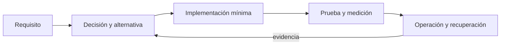
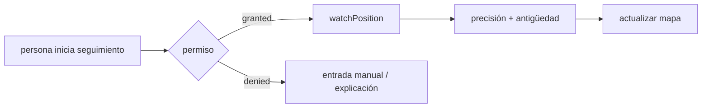
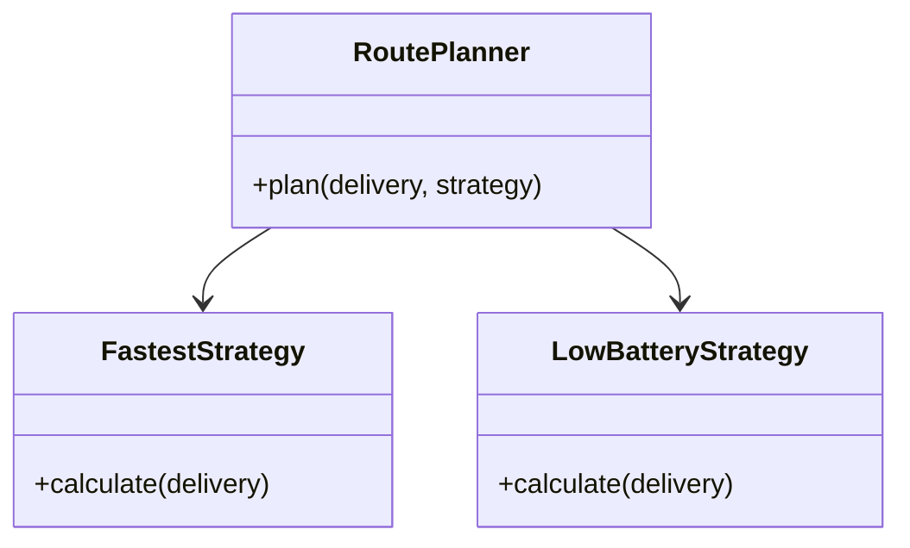
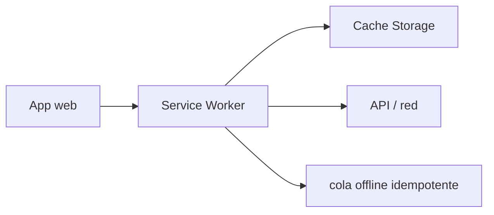
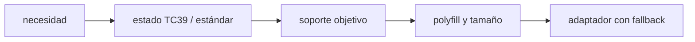

# Módulo 14: JavaScript Master: TypeScript, WASM y cómputo emergente


## Aprende construyendo

### Tema 1: TypeScript avanzado

#### Paso 1 · Objetivo y preparación

Al finalizar podrás construir una unión discriminada exhaustiva, derivar tipos con utilidades y mantener un contrato público que falle al añadir estados sin manejar. Endurecerás el ciclo de entrega del proyecto sin `any` ni assertions que oculten deuda.

**Conocimiento previo:** TypeScript strict, generics, narrowing, `never` y pruebas de tipos. Ejecuta `npx tsc --noEmit` limpio antes de modificar el dominio.

#### Paso 2 · Contexto y caso real

El proyecto incorpora cancelación y devolución a estados existentes. Si cada pantalla usa strings y condicionales parciales, una variante nueva puede quedar sin UI. El proyecto usará discriminante, exhaustividad y tipos derivados para que el cambio rompa en todos los lugares pendientes.

#### Paso 3 · Teoría, modelo mental y analogía

**Conceptos clave:** propósito, modelo de ejecución, configuración, seguridad, coste, pruebas y operación.

TypeScript avanzado se estudia como una decisión de ingeniería y no como una colección de comandos. Primero identifica el problema que resuelve y los límites de la plataforma; luego construye el incremento mínimo dentro de este proyecto. Registra entradas, salidas, dependencias y condiciones de fallo. Compara al menos una alternativa y conserva la medición que justifica la elección. Si la tecnología es experimental, se aísla del camino estable y se documenta la estrategia de retirada.

En producción debes considerar configuración por ambiente, identidad de máquina y persona, secretos, compatibilidad, telemetría y recuperación. Una demostración exitosa no prueba comportamiento bajo concurrencia, reintentos, pérdida de red o datos inválidos. Por eso el laboratorio introduce un fallo deliberado y exige una prueba de regresión. El resultado debe poder repetirse desde terminal y CI sin pasos secretos del editor.

**Analogía:** es como incorporar una nueva estación a una red logística: no basta con construirla; hay que definir rutas, capacidad, controles, contingencias y cómo sabremos que funciona.

**¿Por qué es importante?** Porque TypeScript avanzado aparece cuando el sistema crece y las decisiones dejan de ser locales. Comprender su coste evita adoptar una herramienta por popularidad o descartarla por una primera experiencia incompleta.

**Casos de uso reales:** operación normal, configuración inválida, dependencia lenta, solicitud duplicada, cambio incompatible y recuperación posterior a un despliegue fallido.

**Diagrama:**


#### Paso 4 · Demostración guiada desde cero

Parte de una carpeta vacía para que el ejemplo sea reproducible sin depender del proyecto:
```bash
mkdir ejemplo-js-modulo-14-tema-1 && cd ejemplo-js-modulo-14-tema-1
npm init -y
mkdir src
```

Crea `academia-web/src/domain/delivery-status.ts`:

```ts
// La unión discriminada obliga a tratar cada estado de la entrega.
type DeliveryStatus =
  | { kind: 'assigned'; courierId: string }
  | { kind: 'in-transit'; latitude: number; longitude: number }
  | { kind: 'delivered'; receivedBy: string };

export function statusLabel(status: DeliveryStatus): string {
  switch (status.kind) {
    case 'assigned': return `Asignada a ${status.courierId}`;
    case 'in-transit': return `En ruta: ${status.latitude}, ${status.longitude}`;
    case 'delivered': return `Recibida por ${status.receivedBy}`;
    default: return assertNever(status); // Falla al compilar si aparece un estado nuevo.
  }
}

function assertNever(value: never): never {
  throw new Error(`Estado no soportado: ${JSON.stringify(value)}`);
}
```

Ejecuta:

```bash
npx tsc --noEmit
```

**Resultado esperado:** termina sin errores y `statusLabel` devuelve texto específico para cada variante.

**Fallo deliberado:** añade `{ kind: "cancelled"; reason: string }` sin incorporarlo al `switch`. `assertNever` recibe un valor distinto de `never` y TypeScript señala la rama faltante antes de ejecutar.

#### Paso 5 · Práctica guiada

Deriva `DeliveryKind = DeliveryStatus["kind"]` y un `Record<DeliveryKind, string>` para iconos. **Pista:** al añadir una variante, el `Record` también debe exigir su icono.

#### Paso 6 · Práctica independiente

Modela devolución y reprogramación, crea un tipo `DeliverySummary` con `Pick` y pruebas `@ts-expect-error`. Compara unión exhaustiva con clase jerárquica y registra la decisión.

#### Paso 7 · Cierre y evidencia

Ya puedes hacer que evolución del dominio revele consumidores incompletos. El siguiente tema llevará cálculo tipado fuera del hilo principal con validación runtime. **Evidencia:** entrega compilación limpia, diagnóstico cancelled y tipos derivados; explica el resultado del fallo exhaustivo.

**Errores comunes:** usar enum/string sin payload específico; default que oculta variantes; `as never`; tipos condicionales ilegibles; confundir seguridad estática con validación externa.

**Fuentes oficiales:** [TypeScript — Unions](https://www.typescriptlang.org/docs/handbook/unions-and-intersections.html) y [Utility Types](https://www.typescriptlang.org/docs/handbook/utility-types.html).

### Tema 2: Workers y ejecución fuera del hilo principal

#### Paso 1 · Objetivo y preparación

Al finalizar podrás definir un protocolo de mensajes discriminado, validar entradas dentro del worker, correlacionar respuestas y cancelar solicitudes obsoletas. Calcularás distancia del proyecto sin bloquear UI ni confiar ciegamente en TypeScript.

**Prerrequisitos:** Web Workers, TypeScript, uniones discriminadas y medición de hilo principal. Vite debe ejecutar el ejemplo; el contrato de tipos desaparece cuando un mensaje cruza el límite runtime.

#### Paso 2 · Contexto y caso real

El planificador recibe recalculados sucesivos al mover una parada. El proyecto debe devolver solo el cálculo más reciente, rechazar payloads inválidos y terminar workers al destruir la vista.

#### Paso 3 · Teoría, modelo mental y analogía

**Conceptos clave:** propósito, modelo de ejecución, configuración, seguridad, coste, pruebas y operación.

Workers y ejecución fuera del hilo principal se estudia como una decisión de ingeniería y no como una colección de comandos. Primero identifica el problema que resuelve y los límites de la plataforma; luego construye el incremento mínimo dentro de este proyecto. Registra entradas, salidas, dependencias y condiciones de fallo. Compara al menos una alternativa y conserva la medición que justifica la elección. Si la tecnología es experimental, se aísla del camino estable y se documenta la estrategia de retirada.

En producción debes considerar configuración por ambiente, identidad de máquina y persona, secretos, compatibilidad, telemetría y recuperación. Una demostración exitosa no prueba comportamiento bajo concurrencia, reintentos, pérdida de red o datos inválidos. Por eso el laboratorio introduce un fallo deliberado y exige una prueba de regresión. El resultado debe poder repetirse desde terminal y CI sin pasos secretos del editor.

**Analogía:** es como incorporar una nueva estación a una red logística: no basta con construirla; hay que definir rutas, capacidad, controles, contingencias y cómo sabremos que funciona.

**¿Por qué es importante?** Porque Workers y ejecución fuera del hilo principal aparece cuando el sistema crece y las decisiones dejan de ser locales. Comprender su coste evita adoptar una herramienta por popularidad o descartarla por una primera experiencia incompleta.

**Casos de uso reales:** operación normal, configuración inválida, dependencia lenta, solicitud duplicada, cambio incompatible y recuperación posterior a un despliegue fallido.

**Diagrama:**


#### Paso 4 · Demostración guiada desde cero

Parte de una carpeta vacía para que el ejemplo sea reproducible sin depender del proyecto:
```bash
mkdir ejemplo-js-modulo-14-tema-2 && cd ejemplo-js-modulo-14-tema-2
npm init -y
mkdir src
```

Crea `academia-web/src/workers/route.worker.ts`:

```ts
// route.worker.ts: el cálculo pesado ocurre fuera del hilo de la interfaz.
self.onmessage = (event: MessageEvent<unknown>) => {
  const data = event.data;
  if (typeof data !== "object" || data === null ||
      !("segments" in data) || !Array.isArray(data.segments) ||
      !data.segments.every((value) => typeof value === "number")) {
    self.postMessage({ kind: "error", message: "Segmentos inválidos" });
    return;
  }
  const total = data.segments.reduce((distance, segment) => distance + segment, 0);
  self.postMessage({ kind: "success", total });
};
```

Crea `academia-web/src/route-client.ts` con `new Worker(new URL("./workers/route.worker.ts", import.meta.url), { type: "module" })`, maneja las variantes success/error, envía `{ segments: [2.4, 3.1, 1.5] }` y expone `destroy()` que llama `terminate()`.

```bash
npm run dev
```

**Resultado esperado:** `Distancia planificada: 7 km`; el botón de la UI sigue respondiendo durante un lote grande.

**Fallo deliberado:** envía `{ segments: [2, "3"] }`. Aunque un cast podría silenciar al editor, el worker responde `Segmentos inválidos`. Conserva validación en la frontera.

#### Paso 5 · Práctica guiada

Añade `requestId` a solicitud/respuesta y descarta respuestas antiguas. **Pista:** correlación pertenece al protocolo, no a una variable global invisible.

#### Paso 6 · Práctica independiente

Implementa cancelación, timeout, error del worker y transferencia de ArrayBuffer. Mide coste de clonación y define umbral donde otro hilo aporta valor.

#### Paso 7 · Cierre y evidencia

Ya puedes operar un protocolo fuera del hilo con límites runtime. El siguiente tema decidirá cómo dividir y entregar ese código. **Evidencia:** entrega UI fluida, resultado, payload rechazado y terminate; explica el fallo pese a TypeScript.

**Errores comunes:** confiar en MessageEvent tipado; olvidar terminate; perder correlación; enviar DOM/funciones; usar worker para tareas pequeñas sin medir.

**Fuentes oficiales:** [MDN — Web Workers](https://developer.mozilla.org/en-US/docs/Web/API/Web_Workers_API) y [Vite — Web Workers](https://vite.dev/guide/features.html#web-workers).

### Tema 3: Bundlers y optimización

#### Paso 1 · Objetivo y preparación

Al finalizar podrás auditar el grafo de producción, crear un chunk bajo demanda y comparar bytes/solicitudes antes y después. Separarás el mapa del proyecto solo si no permanece importado de forma ansiosa.

**Conocimiento previo:** ESM, import dinámico, Vite, Rollup y DevTools Network. Conserva un build base y mide comprimido además de tamaño en disco.

#### Paso 2 · Contexto y caso real

La mayoría de operadores consulta listas; pocos abren el mapa avanzado. En este proyecto el mapa se descargará al entrar a su ruta, con estado de carga/error y presupuesto documentado.

#### Paso 3 · Teoría, modelo mental y analogía

**Conceptos clave:** propósito, modelo de ejecución, configuración, seguridad, coste, pruebas y operación.

Bundlers y optimización se estudia como una decisión de ingeniería y no como una colección de comandos. Primero identifica el problema que resuelve y los límites de la plataforma; luego construye el incremento mínimo dentro de este proyecto. Registra entradas, salidas, dependencias y condiciones de fallo. Compara al menos una alternativa y conserva la medición que justifica la elección. Si la tecnología es experimental, se aísla del camino estable y se documenta la estrategia de retirada.

En producción debes considerar configuración por ambiente, identidad de máquina y persona, secretos, compatibilidad, telemetría y recuperación. Una demostración exitosa no prueba comportamiento bajo concurrencia, reintentos, pérdida de red o datos inválidos. Por eso el laboratorio introduce un fallo deliberado y exige una prueba de regresión. El resultado debe poder repetirse desde terminal y CI sin pasos secretos del editor.

**Analogía:** es como incorporar una nueva estación a una red logística: no basta con construirla; hay que definir rutas, capacidad, controles, contingencias y cómo sabremos que funciona.

**¿Por qué es importante?** Porque Bundlers y optimización aparece cuando el sistema crece y las decisiones dejan de ser locales. Comprender su coste evita adoptar una herramienta por popularidad o descartarla por una primera experiencia incompleta.

**Casos de uso reales:** operación normal, configuración inválida, dependencia lenta, solicitud duplicada, cambio incompatible y recuperación posterior a un despliegue fallido.

**Diagrama:**


#### Paso 4 · Demostración guiada desde cero

Parte de una carpeta vacía para que el ejemplo sea reproducible sin depender del proyecto:
```bash
mkdir ejemplo-js-modulo-14-tema-3 && cd ejemplo-js-modulo-14-tema-3
npm init -y
mkdir src
```

Crea `academia-web/vite.config.ts`:

```ts
import { defineConfig } from 'vite';

export default defineConfig({
  build: {
    // Crea un artefacto inspeccionable y evita mapas de producción accidentales.
    sourcemap: false,
    rollupOptions: {
      output: {
        // Separa el mapa: solo se descarga cuando la pantalla lo necesita.
        manualChunks: { maps: ['maplibre-gl'] },
      },
    },
  },
});
```

En la vista usa `await import("maplibre-gl")` únicamente después de navegar al mapa. Ejecuta:

```bash
npm run build
npm run preview
```

**Resultado esperado:** `dist/assets` contiene un chunk maps y Network no lo solicita en inicio; aparece al abrir mapa.

**Fallo deliberado:** agrega además `import maplibregl from "maplibre-gl"` en `main.ts`. El chunk puede descargarse inicialmente o duplicar estrategia; inspecciona el grafo y elimina la importación ansiosa.

#### Paso 5 · Práctica guiada

Genera un reporte visual del bundle y establece presupuesto para chunk inicial. **Pista:** registra versión, bytes gzip/brotli y número de solicitudes, no solo nombres minificados.

#### Paso 6 · Práctica independiente

Compara manualChunks con import dinámico, precarga y caché HTTP. Simula red lenta y fallo de chunk; diseña mensaje/reintento y decide si la división mejora LCP/INP.

#### Paso 7 · Cierre y evidencia

Ya puedes relacionar grafo, entrega y experiencia en vez de “hacer chunks”. El siguiente tema verificará que la interfaz resultante sea operable sin ratón ni visión. **Evidencia:** entrega builds antes/después, Network inicial/lazy y fallo ansioso; explica el resultado de la importación duplicada.

**Errores comunes:** dividir sin medir; importar lazy y eager; publicar source maps; crear chunks diminutos; olvidar estado de error; comparar tamaño sin compresión.

**Fuentes oficiales:** [Vite — Build](https://vite.dev/guide/build.html), [Rollup — Configuration](https://rollupjs.org/configuration-options/) y [web.dev — Code splitting](https://web.dev/articles/reduce-javascript-payloads-with-code-splitting).

### Tema 4: Accesibilidad web

#### Paso 1 · Objetivo y preparación

Al finalizar podrás construir una confirmación operable con teclado, foco visible, nombre accesible y feedback anunciado, y probarla manual y automáticamente. Harás que confirmar una entrega del proyecto no dependa de ratón, color o visión.

**Prerrequisitos:** HTML semántico, eventos, formularios y lector de pantalla del sistema. Prueba primero con teclado; ARIA complementa semántica, no reemplaza un `<button>` real.

#### Paso 2 · Contexto y caso real

Confirmar entrega es una acción crítica. En este proyecto debe conservar foco, impedir duplicados, anunciar carga/éxito/error y explicar corrección sin mover inesperadamente al operador.

#### Paso 3 · Teoría, modelo mental y analogía

**Conceptos clave:** propósito, modelo de ejecución, configuración, seguridad, coste, pruebas y operación.

Accesibilidad web se estudia como una decisión de ingeniería y no como una colección de comandos. Primero identifica el problema que resuelve y los límites de la plataforma; luego construye el incremento mínimo dentro de este proyecto. Registra entradas, salidas, dependencias y condiciones de fallo. Compara al menos una alternativa y conserva la medición que justifica la elección. Si la tecnología es experimental, se aísla del camino estable y se documenta la estrategia de retirada.

En producción debes considerar configuración por ambiente, identidad de máquina y persona, secretos, compatibilidad, telemetría y recuperación. Una demostración exitosa no prueba comportamiento bajo concurrencia, reintentos, pérdida de red o datos inválidos. Por eso el laboratorio introduce un fallo deliberado y exige una prueba de regresión. El resultado debe poder repetirse desde terminal y CI sin pasos secretos del editor.

**Analogía:** es como incorporar una nueva estación a una red logística: no basta con construirla; hay que definir rutas, capacidad, controles, contingencias y cómo sabremos que funciona.

**¿Por qué es importante?** Porque Accesibilidad web aparece cuando el sistema crece y las decisiones dejan de ser locales. Comprender su coste evita adoptar una herramienta por popularidad o descartarla por una primera experiencia incompleta.

**Casos de uso reales:** operación normal, configuración inválida, dependencia lenta, solicitud duplicada, cambio incompatible y recuperación posterior a un despliegue fallido.

**Diagrama:**


#### Paso 4 · Demostración guiada desde cero

Parte de una carpeta vacía para que el ejemplo sea reproducible sin depender del proyecto:
```bash
mkdir ejemplo-js-modulo-14-tema-4 && cd ejemplo-js-modulo-14-tema-4
npm init -y
mkdir src
```

Añade un `<button id="confirm-delivery">Confirmar entrega</button>` y `<p id="delivery-feedback" role="status" aria-live="polite"></p>`. Crea `academia-web/src/ui/delivery-button.ts`:

```ts
const button = document.querySelector<HTMLButtonElement>('#confirm-delivery');
const feedback = document.querySelector<HTMLElement>('#delivery-feedback');

button?.addEventListener('click', async () => {
  button.disabled = true; // Evita dos confirmaciones mientras la petición está activa.
  button.setAttribute('aria-busy', 'true');
  if (feedback) feedback.textContent = 'Confirmando entrega…';

  try {
    await confirmDelivery();
    if (feedback) feedback.textContent = 'Entrega confirmada'; // aria-live lo anuncia.
  } catch {
    if (feedback) feedback.textContent = 'No se pudo confirmar. Intenta nuevamente.';
  } finally {
    button.disabled = false;
    button.removeAttribute('aria-busy');
  }
});
```

Ejecuta:

```bash
npx eslint src
npm test -- src/ui/delivery-button.test.ts
```

**Resultado esperado:** Tab enfoca el botón, Enter/Espacio activan una sola vez, `aria-busy` existe durante la espera y el status anuncia éxito/error sin perder foco.

**Fallo deliberado:** reemplaza `<button>` por `<div onclick>`. Desaparecen activación de teclado, rol y foco nativos. Restaura semántica antes de añadir ARIA o handlers personalizados.

#### Paso 5 · Práctica guiada

Tras navegación SPA, enfoca el `h1` con `tabindex="-1"` y conserva un enlace “Saltar al contenido”. **Pista:** inspecciona orden Tab y evita foco atrapado.

#### Paso 6 · Práctica independiente

Audita lista, formulario, error y diálogo con teclado, lector, zoom 200%, contraste y reduced motion. Ejecuta axe, pero documenta problemas manuales que la automatización no detecta.

#### Paso 7 · Cierre y evidencia

Ya puedes verificar operabilidad y comunicación, no solo atributos. El siguiente tema evaluará WebAssembly para cálculo medido, manteniendo un fallback accesible. **Evidencia:** entrega recorrido teclado, anuncio, prueba automática y fallo con div; explica el resultado de recuperar semántica nativa.

**Errores comunes:** div como botón; aria-label que contradice texto; quitar outline; feedback solo por color; mover foco sin razón; afirmar accesibilidad solo por Lighthouse.

**Fuentes oficiales:** [WAI — ARIA Authoring Practices](https://www.w3.org/WAI/ARIA/apg/), [WCAG 2.2](https://www.w3.org/TR/WCAG22/) y [MDN — Accessibility](https://developer.mozilla.org/en-US/docs/Web/Accessibility).

### Tema 5: WebAssembly con Rust o C

#### Paso 1 · Objetivo y preparación

Al finalizar podrás compilar una función Rust a WebAssembly, cargarla con fallback JavaScript y medir carga/cómputo antes de decidir. Evaluarás un score de ruta del proyecto sin asumir que WASM siempre es más rápido.

**Conocimiento previo:** Rust básico o capacidad de seguir una función pura, npm, Vite y medición. Instala Rust, `wasm-pack` y verifica sus versiones; si no están disponibles, conserva el fallback funcional.

#### Paso 2 · Contexto y caso real

El optimizador ejecuta un cálculo numérico muchas veces. En este proyecto se aislará una función pura, se comparará con JavaScript y el resto de la aplicación seguirá funcionando si descarga o instanciación WASM falla.

#### Paso 3 · Teoría, modelo mental y analogía

**Conceptos clave:** propósito, modelo de ejecución, configuración, seguridad, coste, pruebas y operación.

WebAssembly con Rust o C se estudia como una decisión de ingeniería y no como una colección de comandos. Primero identifica el problema que resuelve y los límites de la plataforma; luego construye el incremento mínimo dentro de este proyecto. Registra entradas, salidas, dependencias y condiciones de fallo. Compara al menos una alternativa y conserva la medición que justifica la elección. Si la tecnología es experimental, se aísla del camino estable y se documenta la estrategia de retirada.

En producción debes considerar configuración por ambiente, identidad de máquina y persona, secretos, compatibilidad, telemetría y recuperación. Una demostración exitosa no prueba comportamiento bajo concurrencia, reintentos, pérdida de red o datos inválidos. Por eso el laboratorio introduce un fallo deliberado y exige una prueba de regresión. El resultado debe poder repetirse desde terminal y CI sin pasos secretos del editor.

**Analogía:** es como incorporar una nueva estación a una red logística: no basta con construirla; hay que definir rutas, capacidad, controles, contingencias y cómo sabremos que funciona.

**¿Por qué es importante?** Porque WebAssembly con Rust o C aparece cuando el sistema crece y las decisiones dejan de ser locales. Comprender su coste evita adoptar una herramienta por popularidad o descartarla por una primera experiencia incompleta.

**Casos de uso reales:** operación normal, configuración inválida, dependencia lenta, solicitud duplicada, cambio incompatible y recuperación posterior a un despliegue fallido.

**Diagrama:**


#### Paso 4 · Demostración guiada desde cero

Parte de una carpeta vacía para que el ejemplo sea reproducible sin depender del proyecto:
```bash
mkdir ejemplo-js-modulo-14-tema-5 && cd ejemplo-js-modulo-14-tema-5
npm init -y
mkdir src
```

Crea `academia-web/wasm/src/lib.rs`:

```rust
use wasm_bindgen::prelude::*;

#[wasm_bindgen]
pub fn route_score(distance_km: f64, late_stops: u32) -> f64 {
    // Función pura: fácil de comparar contra la implementación JavaScript.
    distance_km + f64::from(late_stops) * 5.0
}
```

```ts
import init, { route_score } from '../../wasm/pkg/route_score.js';

await init(); // Instancia el módulo antes de invocar sus exportaciones.
console.log(route_score(12.5, 2));
```

Guarda el cargador en `academia-web/src/wasm/route-score.ts` y ejecuta:

```bash
wasm-pack build wasm --target web
npm run dev
```

**Resultado esperado:** imprime `22.5`; Network muestra el módulo `.wasm` y la UI conserva un resultado equivalente al fallback JavaScript.

**Fallo deliberado:** renombra temporalmente el `.wasm` generado. `init()` rechaza; captura el error, registra diagnóstico y usa la implementación JS en vez de dejar la pantalla rota.

#### Paso 5 · Práctica guiada

Ejecuta warm-up y compara mediana de 100, 10 000 y 1 000 000 iteraciones. **Pista:** mide por separado descarga/instanciación y cálculo; una función pequeña puede perder por overhead.

#### Paso 6 · Práctica independiente

Prueba paridad JS/WASM, límites numéricos, módulo corrupto y navegador compatible. Registra tamaño comprimido, complejidad de toolchain y criterio de retirada.

#### Paso 7 · Cierre y evidencia

Ya puedes evaluar WASM como intercambio medido, no como reemplazo general. El siguiente tema aislará decisiones experimentales de ML/Web3 con revisión humana. **Evidencia:** entrega build, paridad, medición y fallback al fallo; explica el resultado por tamaño de carga.

**Errores comunes:** usar WASM para DOM; ignorar frontera/memoria; medir solo ejecución caliente; no ofrecer fallback; adoptar toolchain sin beneficio reproducible.

**Fuentes oficiales:** [MDN — WebAssembly](https://developer.mozilla.org/en-US/docs/WebAssembly), [Rust and WebAssembly](https://rustwasm.github.io/docs/book/) y [wasm-bindgen](https://rustwasm.github.io/wasm-bindgen/).

### Tema 6: Web3 y machine learning en navegador

#### Paso 1 · Objetivo y preparación

Al finalizar podrás construir una puntuación local explicable, probar fronteras/sesgo y decidir si ML o una red distribuida resuelven un requisito real. Crearás una señal de riesgo del proyecto que nunca sanciona automáticamente.

**Prerrequisitos:** funciones puras, estadística descriptiva básica, privacidad y threat modeling. Este laboratorio no es un modelo predictivo validado ni una recomendación laboral; usa datos sintéticos.

#### Paso 2 · Contexto y caso real

Batería baja, GPS impreciso y retraso pueden sugerir que una entrega necesita asistencia, pero también reflejan dispositivo, cobertura o zona. El proyecto mostrará factores y permitirá revisión humana; no enviará ubicación a un tercero.

#### Paso 3 · Teoría, modelo mental y analogía

**Conceptos clave:** propósito, modelo de ejecución, configuración, seguridad, coste, pruebas y operación.

Web3 y machine learning en navegador se estudia como una decisión de ingeniería y no como una colección de comandos. Primero identifica el problema que resuelve y los límites de la plataforma; luego construye el incremento mínimo dentro de este proyecto. Registra entradas, salidas, dependencias y condiciones de fallo. Compara al menos una alternativa y conserva la medición que justifica la elección. Si la tecnología es experimental, se aísla del camino estable y se documenta la estrategia de retirada.

En producción debes considerar configuración por ambiente, identidad de máquina y persona, secretos, compatibilidad, telemetría y recuperación. Una demostración exitosa no prueba comportamiento bajo concurrencia, reintentos, pérdida de red o datos inválidos. Por eso el laboratorio introduce un fallo deliberado y exige una prueba de regresión. El resultado debe poder repetirse desde terminal y CI sin pasos secretos del editor.

**Analogía:** es como incorporar una nueva estación a una red logística: no basta con construirla; hay que definir rutas, capacidad, controles, contingencias y cómo sabremos que funciona.

**¿Por qué es importante?** Porque Web3 y machine learning en navegador aparece cuando el sistema crece y las decisiones dejan de ser locales. Comprender su coste evita adoptar una herramienta por popularidad o descartarla por una primera experiencia incompleta.

**Casos de uso reales:** operación normal, configuración inválida, dependencia lenta, solicitud duplicada, cambio incompatible y recuperación posterior a un despliegue fallido.

**Diagrama:**


#### Paso 4 · Demostración guiada desde cero

Parte de una carpeta vacía para que el ejemplo sea reproducible sin depender del proyecto:
```bash
mkdir ejemplo-js-modulo-14-tema-6 && cd ejemplo-js-modulo-14-tema-6
npm init -y
mkdir src
```

Crea `academia-web/src/risk/delivery-risk.ts`:

```ts
interface RiskInput { battery: number; accuracyMeters: number; minutesLate: number }

export function deliveryRisk(input: RiskInput): number {
  // Modelo local explicable; no envía ubicación ni batería a un tercero.
  const batteryRisk = input.battery < 15 ? 0.35 : 0;
  const gpsRisk = input.accuracyMeters > 80 ? 0.35 : 0;
  const delayRisk = Math.min(input.minutesLate / 120, 0.3);
  return Number((batteryRisk + gpsRisk + delayRisk).toFixed(2));
}

console.log(deliveryRisk({ battery: 10, accuracyMeters: 120, minutesLate: 30 }));
```

Ejecuta:

```bash
npx tsx src/risk/delivery-risk.ts
```

**Resultado esperado:** `0.78` y factores explicables; ningún dato sale del navegador.

**Fallo deliberado:** pasa batería `-1` o precisión `NaN`. Sin validación se produce una puntuación aparentemente legítima. Rechaza rangos inválidos antes de calcular y añade regresión.

#### Paso 5 · Práctica guiada

Devuelve `{ score, factors }` y compara grupos sintéticos por zona/dispositivo. **Pista:** una correlación no prueba culpa; busca diferencias de error y falsos positivos.

#### Paso 6 · Práctica independiente

Compara regla explícita con un modelo pequeño local: precisión, latencia, tamaño, privacidad y explicabilidad. Escribe un ADR separado para Web3 que exija múltiples organizaciones sin autoridad común y contraste con base de datos firmada.

#### Paso 7 · Cierre y evidencia

Ya puedes aislar cómputo emergente detrás de límites éticos y reversibles. El siguiente tema tratará GPS como dato sensible con incertidumbre. **Evidencia:** entrega casos frontera, factores, análisis de sesgo y ADR; explica el resultado del fallo con entrada inválida.

**Errores comunes:** llamar IA a una regla; automatizar sanciones; usar datos personales sin propósito/consentimiento; confundir blockchain con integridad; introducir dependencias pesadas antes de validar valor.

**Fuentes oficiales:** [TensorFlow.js — Guides](https://www.tensorflow.org/js/guide), [WebNN API](https://www.w3.org/TR/webnn/) y [NIST AI Risk Management Framework](https://www.nist.gov/itl/ai-risk-management-framework).

### Tema 7: Geolocalización, permisos y precisión GPS

#### Paso 1 · Objetivo y preparación

Al finalizar podrás solicitar ubicación con consentimiento, interpretar precisión y cancelar el seguimiento sin convertir una coordenada imprecisa en una decisión logística.

**Conocimiento previo:** Promesas/callbacks, permisos, fechas y ciclo de vida. Geolocation requiere HTTPS o localhost y una acción visible; prepara un fallback manual.

#### Paso 2 · Contexto y caso real

**¿Por qué es importante?** El proyecto necesita posición para mostrar avance, pero la API puede ser rechazada, tardar, entregar datos antiguos o reportar una precisión de cientos de metros. La ubicación es un dato sensible y debe pedirse solo mientras una función visible la necesita.

Este incremento del proyecto inicia seguimiento únicamente al pulsar “Compartir ubicación”, muestra margen/tiempo y destruye el watch al salir de la entrega.

#### Paso 3 · Teoría, modelo mental y analogía

**Analogía:** una coordenada es como una dirección comunicada por radio junto con un margen de error; “estoy aquí” sin precisión ni momento de medición no es una evidencia suficiente.

**Conceptos clave:** `getCurrentPosition` obtiene una muestra; `watchPosition` observa cambios; `accuracy` expresa radio estimado en metros; `Permissions API` consulta estado; `clearWatch` detiene el sensor.



#### Paso 4 · Demostración guiada desde cero

Parte de una carpeta vacía para que el ejemplo sea reproducible sin depender del proyecto:
```bash
mkdir ejemplo-js-modulo-14-tema-7 && cd ejemplo-js-modulo-14-tema-7
npm init -y
mkdir src
```

Crea `academia-web/src/location/watch-location.js`:

```js
export function iniciarUbicacion({ onPosition, onError }) {
  if (!('geolocation' in navigator)) throw new Error('Geolocalización no disponible');
  const id = navigator.geolocation.watchPosition(
    ({ coords, timestamp }) => onPosition({
      // Precisión y captura viajan con la coordenada; no son metadatos opcionales.
      latitude: coords.latitude,
      longitude: coords.longitude,
      accuracyMeters: coords.accuracy,
      capturedAt: new Date(timestamp).toISOString(),
    }),
    onError,
    { enableHighAccuracy: true, timeout: 10_000, maximumAge: 5_000 },
  );
  return () => navigator.geolocation.clearWatch(id);
}
```

Ejecuta sobre HTTPS o localhost:

```bash
npm run dev
```

**Resultado esperado:** tras acción explícita y permiso concedido se muestran posición, precisión y hora; al desmontar deja de actualizarse.

**Fallo deliberado:** simula `PERMISSION_DENIED` en DevTools. Debe aparecer explicación y entrada manual, sin reintentos automáticos que vuelvan a pedir permiso.

#### Paso 5 · Práctica guiada

Simula los tres códigos de error y presenta alternativas. **Pista:** diferencia `PERMISSION_DENIED`, `POSITION_UNAVAILABLE` y `TIMEOUT`.

#### Paso 6 · Práctica independiente

Rechaza para asignación automática muestras con más de 30 segundos o precisión peor que 100 m, pero permite mostrarlas como “aproximadas”. Prueba cleanup y batería.

#### Paso 7 · Cierre y evidencia

Una coordenada solo es útil junto con precisión, tiempo y consentimiento. El siguiente tema estudia qué datos pueden persistirse en cada almacén. **Evidencia:** entrega salida con accuracy/fecha, fallback por permiso y cleanup; explica el resultado del fallo denegado.

**Errores comunes:** iniciar `watchPosition` al cargar; omitir `clearWatch`; tratar muestra vieja como actual; ocultar precisión; pedir high accuracy sin justificar batería.

**Fuentes oficiales:** [MDN — Geolocation API](https://developer.mozilla.org/docs/Web/API/Geolocation_API) y [Permissions API](https://developer.mozilla.org/en-US/docs/Web/API/Permissions_API).

### Tema 8: sessionStorage, cookies e IndexedDB

#### Paso 1 · Objetivo y preparación

Al finalizar podrás elegir almacenamiento según vida útil, tamaño, consulta y riesgo, y construir un borrador offline sin guardar credenciales accesibles a JavaScript.

**Conocimiento previo:** JSON, Promesas, transacciones y amenazas XSS/CSRF. Prueba siempre datos ausentes, corruptos y migraciones; el navegador puede borrar almacenamiento.

#### Paso 2 · Contexto y caso real

**¿Por qué es importante?** `localStorage`, `sessionStorage`, cookies e IndexedDB no son alternativas equivalentes. Elegir por costumbre puede bloquear la UI, perder datos al cerrar una pestaña o exponer tokens ante XSS.

El proyecto conservará un borrador por pestaña y una cola offline estructurada con claves idempotentes, pero la sesión se manejará con cookie segura emitida por el servidor.

#### Paso 3 · Teoría, modelo mental y analogía

**Analogía:** `sessionStorage` es una mesa de trabajo de una pestaña; una cookie es una credencial que el navegador puede adjuntar a solicitudes; IndexedDB es un archivo estructurado local con transacciones.

**Conceptos clave:** `sessionStorage` vive por pestaña; cookies `HttpOnly` no son legibles desde JS; `SameSite` reduce CSRF; IndexedDB guarda objetos y consultas asíncronas; cualquier almacenamiento cliente puede borrarse.

| Necesidad | Opción | Límite principal |
|---|---|---|
| borrador de una pestaña | `sessionStorage` | desaparece al cerrar |
| sesión enviada al servidor | cookie `HttpOnly; Secure; SameSite` | requiere diseño CSRF |
| cola offline estructurada | IndexedDB | API transaccional y migraciones |

#### Paso 4 · Demostración guiada desde cero

Parte de una carpeta vacía para que el ejemplo sea reproducible sin depender del proyecto:
```bash
mkdir ejemplo-js-modulo-14-tema-8 && cd ejemplo-js-modulo-14-tema-8
npm init -y
mkdir src
```

Crea `academia-web/src/storage/delivery-draft.js`:

```js
const KEY = 'app:delivery-draft';
export const saveDraft = (draft) => sessionStorage.setItem(KEY, JSON.stringify(draft));
export function loadDraft() {
  try {
    // Incluso el almacenamiento propio se trata como dato externo al leer.
    return JSON.parse(sessionStorage.getItem(KEY) ?? 'null');
  } catch {
    sessionStorage.removeItem(KEY);
    return null;
  }
}
```

```bash
npm run dev
```

**Resultado esperado:** el borrador sobrevive a una recarga de la misma pestaña, pero no se comparte con otra sesión independiente.

**Fallo deliberado:** escribe `{mal-json` bajo la clave desde DevTools. `loadDraft` se recupera con `null`, elimina corrupción y la pantalla continúa.

#### Paso 5 · Práctica guiada

Crea una base IndexedDB `academia-offline` y almacena confirmaciones con clave idempotente. **Pista:** resuelve la Promesa solo en `transaction.oncomplete`, no cuando termina una única request.

#### Paso 6 · Práctica independiente

Migra versión 1 a 2 agregando `createdAt`, prueba cuota, transacción abortada y reenvío idempotente. Documenta cookie `HttpOnly; Secure; SameSite` del servidor sin intentar crear HttpOnly desde JS.

#### Paso 7 · Cierre y evidencia

La persistencia se elige por semántica y amenaza, no por comodidad. El próximo tema validará formatos textuales complejos. **Evidencia:** entrega borrador, migración y matriz de almacenes; demuestra salida recuperada y explica el fallo JSON.

**Errores comunes:** guardar access tokens en almacenamiento legible; usar localStorage para colecciones grandes; ignorar transacciones/versiones; asumir persistencia permanente; confundir SameSite con solución total de CSRF.

**Fuentes oficiales:** [MDN — Web Storage](https://developer.mozilla.org/docs/Web/API/Web_Storage_API), [IndexedDB](https://developer.mozilla.org/docs/Web/API/IndexedDB_API) y [Cookies](https://developer.mozilla.org/en-US/docs/Web/HTTP/Cookies).

### Tema 9: Expresiones regulares avanzadas y Unicode

#### Paso 1 · Objetivo y preparación

Al finalizar podrás construir y probar una expresión regular con grupos, anclas y Unicode, medir backtracking y reconocer cuándo un parser explícito es más seguro.

**Prerrequisitos:** strings, normalización Unicode, performance.now y pruebas. Define primero una gramática de código; una regex no debe inventar la regla.

#### Paso 2 · Contexto y caso real

**¿Por qué es importante?** Los identificadores logísticos y entradas textuales necesitan validación consistente, pero una regex compleja puede aceptar formatos incorrectos o causar consumo excesivo de CPU con backtracking catastrófico.

El proyecto parseará códigos públicos `CO-2026-000123` y conservará política de normalización separada de validación.

#### Paso 3 · Teoría, modelo mental y analogía

**Analogía:** una regex es una plantilla de inspección para etiquetas; funciona bien cuando el formato es regular, pero no reemplaza abrir y comprender un documento con gramática anidada.

**Conceptos clave:** grupos capturan partes; grupos nombrados documentan; lookahead verifica sin consumir; flags `u`/`v` tratan Unicode correctamente; anclas definen toda la entrada.

#### Paso 4 · Demostración guiada desde cero

Parte de una carpeta vacía para que el ejemplo sea reproducible sin depender del proyecto:
```bash
mkdir ejemplo-js-modulo-14-tema-9 && cd ejemplo-js-modulo-14-tema-9
npm init -y
mkdir src
```

Crea `academia-web/src/validation/tracking-code.js`:

```js
const TRACKING_CODE = /^(?<country>[A-Z]{2})-(?<year>\d{4})-(?<sequence>\d{6})$/u;
export function parseTrackingCode(value) {
  // Las anclas obligan a que toda la entrada cumpla la gramática.
  const match = TRACKING_CODE.exec(value.normalize('NFC'));
  if (!match?.groups) throw new TypeError('Código esperado: CO-2026-000123');
  return { ...match.groups, year: Number(match.groups.year) };
}
```

Ejecuta desde un punto de entrada con casos válidos e inválidos:

```bash
node src/validation/tracking-code.js
```

**Resultado esperado:** `CO-2026-000123` produce country/year/sequence y una cadena parcial se rechaza.

**Fallo deliberado:** mide `/^(a+)+$/` contra `"a".repeat(n) + "!"` incrementando n. El tiempo crece peligrosamente por backtracking; reemplázala por una condición lineal o regex sin cuantificadores anidados.

#### Paso 5 · Práctica guiada

Añade casos con espacios y minúsculas antes de decidir si normalizarlos. **Pista:** separar normalización de validación hace visible la política.

#### Paso 6 · Práctica independiente

Prueba Unicode compuesto, límites y 10 000 caracteres; crea benchmark y compara parser manual. Documenta máximo de entrada y timeout/cancelación donde aplique.

#### Paso 7 · Cierre y evidencia

Ya puedes aplicar regex a formatos regulares con pruebas y límites. El siguiente tema organiza comportamientos mediante patrones deliberados. **Evidencia:** entrega parser, tabla de casos y benchmark; demuestra salida correcta y explica el fallo exponencial.

**Errores comunes:** parsear HTML/JSON; olvidar anclas; ignorar flag u/v; normalizar ocultamente; aceptar regex ilegible sin casos límite; procesar entrada ilimitada.

**Fuentes oficiales:** [MDN — Regular expressions](https://developer.mozilla.org/docs/Web/JavaScript/Guide/Regular_expressions) y [Unicode escapes](https://developer.mozilla.org/en-US/docs/Web/JavaScript/Reference/Regular_expressions/Unicode_character_class_escape).

### Tema 10: Patrones Factory, Strategy, Observer y Pub/Sub

#### Paso 1 · Objetivo y preparación

Al finalizar podrás reconocer Factory, Strategy, Observer y Pub/Sub, implementar una política intercambiable y justificar por qué no necesitas Singleton global para compartir estado.

**Conocimiento previo:** funciones de primera clase, módulos, closures y pruebas. Parte del problema y sus fuerzas; no agregues una clase solo para poder nombrar un patrón.

#### Paso 2 · Contexto y caso real

**¿Por qué es importante?** Un patrón nombra una solución recurrente y sus consecuencias. Aplicarlo sin problema real añade capas, dependencias invisibles y dificultad de prueba.

El proyecto debe elegir una ruta por tiempo, batería o peajes sin modificar el planificador cada vez; Strategy representa esa variación explícita.

#### Paso 3 · Teoría, modelo mental y analogía

**Analogía:** Factory construye vehículos, Strategy cambia la regla de ruta, Observer notifica a quienes miran un tablero y Pub/Sub usa una central que desacopla emisores y receptores.

**Conceptos clave:** Factory encapsula creación; Strategy intercambia algoritmos; Observer conoce suscriptores directos; Pub/Sub usa un canal intermediario; Singleton impone una instancia y estado global.



#### Paso 4 · Demostración guiada desde cero

Parte de una carpeta vacía para que el ejemplo sea reproducible sin depender del proyecto:
```bash
mkdir ejemplo-js-modulo-14-tema-10 && cd ejemplo-js-modulo-14-tema-10
npm init -y
mkdir src
```

Crea `academia-web/src/routing/route-strategy.js`:

```js
export const strategies = {
  fastest: ({ routes }) => routes.toSorted((a, b) => a.minutes - b.minutes)[0],
  lowBattery: ({ routes }) => routes.toSorted((a, b) => a.energy - b.energy)[0],
};
export function planRoute(delivery, strategy) {
  // El planificador depende del contrato función, no de estrategias concretas.
  if (typeof strategy !== 'function') throw new TypeError('Strategy requerida');
  return strategy(delivery);
}
```

Ejecuta desde un punto de entrada con dos rutas:

```bash
node src/routing/route-strategy.js
```

**Resultado esperado:** cada Strategy selecciona una ruta distinta sin modificar `planRoute`.

**Fallo deliberado:** pasa `"fastest"` directamente en vez de resolver la factory. `planRoute` lanza `Strategy requerida`; corrige la frontera para traducir nombres a funciones y rechazar claves desconocidas.

#### Paso 5 · Práctica guiada

Agrega `avoidTolls` registrándola en la factory `strategies`. **Pista:** la función central no debe contener otro `if` por estrategia.

#### Paso 6 · Práctica independiente

Implementa Observer con unsubscribe y compáralo con Pub/Sub para eventos entre módulos. Prueba cleanup, nombres y orden; documenta cuándo una llamada directa es más clara.

#### Paso 7 · Cierre y evidencia

Los patrones son vocabulario para decisiones, no objetivos. El siguiente bloque ampliará plataforma offline, tiempo real y datos binarios. **Evidencia:** entrega tres strategies, Observer y comparación Pub/Sub; demuestra salidas y explica el fallo de clave sin resolver.

**Errores comunes:** convertir todo en Singleton; if central creciente; Observer sin unsubscribe; bus global sin contratos; patrones que agregan capas sin variación real.

**Fuentes oficiales:** [web.dev — Design patterns](https://web.dev/learn/design-patterns/) y [MDN — Working with objects](https://developer.mozilla.org/en-US/docs/Web/JavaScript/Guide/Working_with_objects).

### Tema 11: Service Workers, PWA y estrategias de caché

#### Paso 1 · Objetivo y preparación

Al finalizar podrás registrar un Service Worker, precachear la aplicación mínima, diseñar una estrategia offline y actualizarla sin servir archivos incompatibles.

**Conocimiento previo:** build de producción, Promesas, HTTP caching y DevTools Application. Service Worker requiere HTTPS o localhost; desregistra versiones del laboratorio al reiniciar pruebas.

#### Paso 2 · Contexto y caso real

**¿Por qué es importante?** Una operación logística puede perder conectividad. Una PWA debe seguir mostrando el último estado seguro y encolar acciones idempotentes, sin fingir que una confirmación offline ya llegó al servidor.

El proyecto permitirá consultar el shell y último seguimiento público, pero una confirmación offline quedará “pendiente de sincronizar” hasta acuse del servidor.

#### Paso 3 · Teoría, modelo mental y analogía

**Analogía:** el Service Worker es una bodega intermedia entre la aplicación y la red: puede entregar una copia, pedir una nueva o guardar un envío pendiente, pero necesita reglas de inventario y renovación.

**Conceptos clave:** ciclo `install/activate/fetch`; Cache Storage guarda respuestas; cache-first favorece disponibilidad; network-first favorece frescura; Background Sync es mejora progresiva; manifest no convierte por sí solo un sitio en PWA confiable.



#### Paso 4 · Demostración guiada desde cero

Parte de una carpeta vacía para que el ejemplo sea reproducible sin depender del proyecto:
```bash
mkdir ejemplo-js-modulo-14-tema-11 && cd ejemplo-js-modulo-14-tema-11
npm init -y
mkdir src
```

Crea `academia-web/public/sw.js`:

```js
const CACHE = 'app-shell-v1'; // Cambia versión cuando cambie el contrato del shell.
const SHELL = ['/', '/index.html'];
self.addEventListener('install', (event) => event.waitUntil(caches.open(CACHE).then((c) => c.addAll(SHELL))));
self.addEventListener('activate', (event) => event.waitUntil(
  caches.keys().then((keys) => Promise.all(keys.filter((k) => k !== CACHE).map((k) => caches.delete(k))))
));
self.addEventListener('fetch', (event) => {
  if (event.request.method !== 'GET') return;
  event.respondWith(fetch(event.request).catch(() => caches.match(event.request)));
});
```

Regístralo desde `src/pwa/register-service-worker.js` solo en producción.

Después, desde la raíz de `academia-web`, ejecuta:

```bash
npm run build
npm run preview
```

**Resultado esperado:** en Offline el shell abre; una API no cacheada muestra estado offline explícito y no una confirmación falsa.

**Fallo deliberado:** cambia assets sin aumentar `CACHE` y conserva pestaña controlada. Puede aparecer una mezcla incompatible. Versiona, activa actualización consciente y prueba dos pestañas.

#### Paso 5 · Práctica guiada

Cambia `CACHE` a `v2` y verifica eliminación de `v1`. **Pista:** una actualización queda esperando mientras existan pestañas controladas por la versión anterior.

#### Paso 6 · Práctica independiente

Implementa stale-while-revalidate solo para seguimiento público, prueba expiración, cuota, instalación fallida y cola idempotente. Documenta qué nunca se cachea.

#### Paso 7 · Cierre y evidencia

Ya puedes separar disponibilidad offline de confirmación remota. El siguiente tema mantendrá tiempo real con reconexión controlada. **Evidencia:** entrega shell offline, actualización v2 y política; demuestra salida offline y explica el fallo por caché vieja.

**Errores comunes:** cachear todo; datos privados; llamar skipWaiting sin coordinar; no versionar; asumir que manifest garantiza offline; marcar acción pendiente como confirmada.

**Fuentes oficiales:** [MDN — Service Worker API](https://developer.mozilla.org/docs/Web/API/Service_Worker_API) y [web.dev — PWA](https://web.dev/learn/pwa/).

### Tema 12: WebSocket y comunicación en tiempo real

#### Paso 1 · Objetivo y preparación

Al finalizar podrás abrir un WebSocket, validar mensajes, mantener heartbeat y reconectar con backoff sin duplicar suscripciones.

**Prerrequisitos:** eventos, JSON, temporizadores, backoff e idempotencia. Usa servidor local; define autenticación y autorización en servidor, no confíes en la conexión abierta.

#### Paso 2 · Contexto y caso real

**¿Por qué es importante?** El seguimiento en vivo no debe consultar la API cada segundo. WebSocket mantiene un canal bidireccional, pero introduce conexión persistente, orden, duplicados, autenticación y recuperación.

El proyecto mantendrá un socket por vista/servicio, validará cada evento y deduplicará `event.id` al reconectar.

#### Paso 3 · Teoría, modelo mental y analogía

**Analogía:** HTTP es enviar cartas independientes; WebSocket es una llamada abierta. Si la llamada se corta, necesitas saber qué conversación recuperar y qué mensajes ya procesaste.

**Conceptos clave:** handshake inicia sobre HTTP; estados `CONNECTING/OPEN/CLOSING/CLOSED`; mensajes son datos no confiables; heartbeat detecta conexiones muertas; backoff evita tormentas; SSE es alternativa unidireccional más simple.

#### Paso 4 · Demostración guiada desde cero

Parte de una carpeta vacía para que el ejemplo sea reproducible sin depender del proyecto:
```bash
mkdir ejemplo-js-modulo-14-tema-12 && cd ejemplo-js-modulo-14-tema-12
npm init -y
mkdir src
```

Crea `academia-web/src/realtime/tracking-socket.js`:

```js
export function connectTracking(url, { onEvent, onState }) {
  const socket = new WebSocket(url);
  socket.addEventListener('open', () => onState('connected'));
  socket.addEventListener('message', ({ data }) => {
    try {
      const event = JSON.parse(data); // El canal autenticado sigue enviando datos no confiables.
      if (typeof event.id !== 'string' || typeof event.type !== 'string') return;
      onEvent(event);
    } catch { onState('invalid-message'); }
  });
  socket.addEventListener('close', () => onState('disconnected'));
  socket.addEventListener('error', () => socket.close());
  return () => socket.close(1000, 'view-unmounted');
}
```

Ejecuta servidor y app:

```bash
npx wscat -l 8080
npm run dev
```

**Resultado esperado:** UI anuncia conexión, procesa JSON válido, marca inválido sin caer y se desconecta al destruir.

**Fallo deliberado:** envía `{mal-json`. Sin `try/catch` el handler lanza y pierde el evento; con frontera informa `invalid-message` y mantiene conexión.

#### Paso 5 · Práctica guiada

Añade reconexión exponencial con jitter y límite. **Pista:** cancela temporizador al destruir y reinicia intento solo tras conexión estable.

#### Paso 6 · Práctica independiente

Añade heartbeat, deduplicación, resume token y estados offline/auth. Compara SSE cuando solo se reciben eventos y prueba conexiones repetidas.

#### Paso 7 · Cierre y evidencia

El tiempo real requiere contrato, ciclo de vida y recuperación. El próximo tema trabajará con bytes. **Evidencia:** entrega estados, reconexión, deduplicación y cleanup; demuestra salida válida/inválida y explica el fallo JSON.

**Errores comunes:** socket por render; reconectar sin límite; confiar JSON; no deduplicar; heartbeat sin timeout; olvidar cleanup o autorización.

**Fuentes oficiales:** [MDN — WebSocket](https://developer.mozilla.org/docs/Web/API/WebSocket) y [WHATWG WebSockets](https://websockets.spec.whatwg.org/).

### Tema 13: Typed Arrays, ArrayBuffer y DataView

#### Paso 1 · Objetivo y preparación

Al finalizar podrás interpretar un paquete binario con endianness explícito, validar fronteras y elegir entre `Uint8Array` y `DataView`.

**Conocimiento previo:** representación binaria, enteros con signo, Workers y pruebas. Define el protocolo byte por byte antes de decodificar.

#### Paso 2 · Contexto y caso real

**¿Por qué es importante?** GPS, imágenes, archivos y protocolos pueden entregar bytes, no JSON. Interpretarlos con tamaño u orden incorrecto produce valores corruptos difíciles de diagnosticar.

El proyecto recibe dos coordenadas escaladas por un millón en ocho bytes big-endian; el decoder será la frontera hacia dominio.

#### Paso 3 · Teoría, modelo mental y analogía

**Analogía:** `ArrayBuffer` es una cinta de bytes; Typed Array coloca una regla uniforme sobre ella; DataView permite leer campos de tamaños distintos indicando el sentido de lectura.

**Conceptos clave:** buffer reserva memoria; una vista no copia; `byteOffset` ubica; endianness define orden; transferencia a Worker puede mover propiedad sin copiar; los límites deben validarse.

#### Paso 4 · Demostración guiada desde cero

Parte de una carpeta vacía para que el ejemplo sea reproducible sin depender del proyecto:
```bash
mkdir ejemplo-js-modulo-14-tema-13 && cd ejemplo-js-modulo-14-tema-13
npm init -y
mkdir src
```

Crea `academia-web/src/binary/decode-gps.js`:

```js
export function decodeGps(buffer) {
  if (!(buffer instanceof ArrayBuffer) || buffer.byteLength !== 8) {
    throw new RangeError('Paquete GPS esperado: 8 bytes');
  }
  const view = new DataView(buffer);
  return {
    // false declara big-endian; el protocolo no depende de la máquina.
    latitudeE6: view.getInt32(0, false),
    longitudeE6: view.getInt32(4, false),
  };
}
```

Ejecuta desde un punto de entrada que escriba dos enteros big-endian:

```bash
node src/binary/decode-gps.js
```

**Resultado esperado:** coordenadas codificadas/decodificadas coinciden y buffer inválido lanza RangeError.

**Fallo deliberado:** cambia `false` por `true`. Los bytes se interpretan little-endian y producen coordenadas corruptas; restaura orden del protocolo, no ajustes valores a mano.

#### Paso 5 · Práctica guiada

Añade versión y flags con `Uint8Array`, manteniendo coordenadas con DataView. **Pista:** valida longitud antes de cada offset y documenta unidad/escala.

#### Paso 6 · Práctica independiente

Transfiere buffer a Worker, comprueba original detached y mide frente a copiar. Prueba extremos Int32, offset y paquete truncado.

#### Paso 7 · Cierre y evidencia

Puedes convertir bytes en datos de dominio con contrato explícito. El siguiente tema separará características estables de propuestas experimentales. **Evidencia:** entrega protocolo, pruebas y transferencia; demuestra salida y explica fallo de endianness.

**Errores comunes:** usar buffer.length; asumir offset cero; omitir endianness; no validar tamaño; transferir y reutilizar buffer detached; olvidar escala/unidad.

**Fuentes oficiales:** [MDN — Typed arrays](https://developer.mozilla.org/docs/Web/JavaScript/Guide/Typed_arrays), [ArrayBuffer](https://developer.mozilla.org/en-US/docs/Web/JavaScript/Reference/Global_Objects/ArrayBuffer) y [DataView](https://developer.mozilla.org/en-US/docs/Web/JavaScript/Reference/Global_Objects/DataView).

### Tema 14: ECMAScript moderno, Temporal e iterator helpers

#### Paso 1 · Objetivo y preparación

Al finalizar podrás verificar el estado de una característica, usar alternativas estables y aislar `Temporal`, iterator helpers y gestión explícita de recursos detrás de compatibilidad comprobada.

**Prerrequisitos:** especificación TC39, feature detection, Intl, iteradores y bundling. Define runtimes objetivo y consulta fuentes oficiales; Stage 4 no implica soporte inmediato universal.

#### Paso 2 · Contexto y caso real

**¿Por qué es importante?** ECMAScript evoluciona. Enseñar una propuesta como universal puede romper producción; ignorar características nuevas mantiene soluciones complejas cuando el runtime ya ofrece una mejor.

El proyecto formateará instantes mediante un adaptador estable y cargará polyfill solo cuando el análisis de soporte/coste lo justifique.

#### Paso 3 · Teoría, modelo mental y analogía

**Analogía:** TC39 es una línea de certificación: una pieza en prototipo no se instala en toda la flota; Stage 4 indica que está lista para entrar en la especificación, pero todavía debes verificar los vehículos reales.

**Conceptos clave:** especificación y soporte son distintos; feature detection supera version sniffing; `Temporal` modela instante/zona/fecha civil; iterator helpers procesan perezosamente; `using`/`await using` expresa liberación determinista cuando el runtime lo soporta.



#### Paso 4 · Demostración guiada desde cero

Parte de una carpeta vacía para que el ejemplo sea reproducible sin depender del proyecto:
```bash
mkdir ejemplo-js-modulo-14-tema-14 && cd ejemplo-js-modulo-14-tema-14
npm init -y
mkdir src
```

Crea `academia-web/src/platform/time.js`:

```js
export function formatDeliveryInstant(iso, timeZone, locale = 'es-CO') {
  const instant = new Date(iso);
  // Date + Intl constituye el fallback estable del contrato de presentación.
  if (Number.isNaN(instant.getTime())) throw new TypeError('Instante inválido');
  return new Intl.DateTimeFormat(locale, { dateStyle: 'medium', timeStyle: 'short', timeZone }).format(instant);
}

export const supportsTemporal = () => typeof globalThis.Temporal !== 'undefined';
```

Ejecuta con un instante y dos zonas:

```bash
node src/platform/time.js
```

**Resultado esperado:** ambas salidas representan el mismo instante con horas locales diferentes; `supportsTemporal` informa capacidad real.

**Fallo deliberado:** usa `Temporal.Instant.from` sin feature detection en un runtime sin soporte. Obtendrás ReferenceError; restaura adaptador y carga polyfill de forma condicionada.

#### Paso 5 · Práctica guiada

Consulta compatibilidad antes de cargar un polyfill Temporal. **Pista:** usa import dinámico y mide coste del chunk, zona y horario de verano.

#### Paso 6 · Práctica independiente

Implementa secuencia perezosa con iterator helpers cuando existan y generadores como fallback; prueba ambos. Evalúa `using`/DisposableStack solo con soporte y necesidad de cleanup determinista.

#### Paso 7 · Cierre y evidencia

Adoptar novedades es una decisión verificable. Con esto el track incorpora las brechas principales; el siguiente trabajo amplía Node y demás tracks. **Evidencia:** entrega matriz estado/soporte/coste, ambos adaptadores y fallback; demuestra salida y explica fallo sin detección.

**Errores comunes:** copiar novedades por año; confundir Stage con soporte; cargar polyfill inicial innecesario; usar Date para fecha civil futura sin zona; no probar fallback.

**Fuentes oficiales:** [TC39 — Proposals](https://github.com/tc39/proposals), [ECMAScript specification](https://tc39.es/ecma262/) y [ECMA-402](https://tc39.es/ecma402/).

## Trazabilidad de la auditoría original

- **TypeScript**: cubierto mediante fundamento, laboratorio y evidencia del capítulo.
- **WebAssembly**: cubierto mediante fundamento, laboratorio y evidencia del capítulo.
- **Web3**: cubierto mediante fundamento, laboratorio y evidencia del capítulo.
- **Machine Learning en navegador**: cubierto mediante fundamento, laboratorio y evidencia del capítulo.
- **Web Workers**: cubierto mediante fundamento, laboratorio y evidencia del capítulo.
- **Bundlers**: cubierto mediante fundamento, laboratorio y evidencia del capítulo.
- **Accessibility (a11y)**: cubierto mediante fundamento, laboratorio y evidencia del capítulo.
