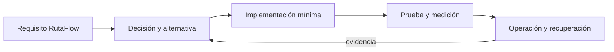

# Módulo 14: JavaScript Master: TypeScript, WASM y cómputo emergente

## Sílabo

**Objetivo general:** dominar las capacidades avanzadas señaladas en la auditoría del track mediante una ampliación ejecutable de RutaFlow, decisiones justificadas, pruebas, seguridad y evidencia operacional.

**Resultados observables:** explicar cada tecnología sin depender de marcas; implementar un incremento pequeño; comparar alternativas; provocar un fallo; medir el resultado; y escribir un runbook de recuperación.

**Evaluación:** 20 % fundamento, 35 % implementación, 25 % pruebas y fallos, 10 % seguridad, 10 % documentación y comunicación.

## Comienza desde cero: prepara este capítulo

Este recorrido parte de una carpeta vacía. Al finalizar tendrás **Un incremento pequeño, probado y reproducible del capítulo.** No avances ejecutando comandos que no comprendes: primero identifica la entrada, la transformación y la evidencia que comprobará el resultado.

### 1. Comprueba las herramientas

Los comandos funcionan en macOS, Linux y WSL. En PowerShell usa el equivalente indicado por la herramienta.

```bash
node --version
npm --version
git --version
```

Si un comando no existe, detente e instala esa herramienta desde su sitio oficial. Cierra y abre la terminal después de modificar `PATH`. Las versiones deben ser compatibles entre sí antes de crear archivos.

### 2. Crea o recupera el proyecto del track

```bash
npm create vite@latest academia-labs/javascript -- --template vanilla-ts
cd academia-labs/javascript
npm install
git init
```

Trabaja dentro de `academia-labs/javascript`. Si ya existe, no lo vuelvas a generar: entra en la carpeta, confirma `git status` y continúa sobre una rama propia.

### 3. Ubica cada tema antes de escribir

```text
academia-labs/javascript/
├─ src/
│  └─ module-14/
├─ tests/
├─ docs/decisions/
├─ evidence/module-14/
└─ README.md
```

| Tema | Archivo o decisión | Evidencia mínima |
|---|---|---|
| 1. TypeScript avanzado | `src/module-14/topic-1-typescript-avanzado.ts` | prueba + salida observable |
| 2. Workers y ejecución fuera del hilo principal | `src/module-14/topic-2-workers-y-ejecucion-fuera-del-hilo-principal.ts` | prueba + salida observable |
| 3. Bundlers y optimización | `src/module-14/topic-3-bundlers-y-optimizacion.ts` | prueba + salida observable |
| 4. Accesibilidad web | `src/module-14/topic-4-accesibilidad-web.ts` | prueba + salida observable |
| 5. WebAssembly con Rust o C | `src/module-14/topic-5-webassembly-con-rust-o-c.ts` | prueba + salida observable |
| 6. Web3 y machine learning en navegador | `src/module-14/topic-6-web3-y-machine-learning-en-navegador.ts` | prueba + salida observable |
| 7. HTML y CSS | `docs/decisions/module-14-topic-7.md` | contexto + alternativas + decisión + consecuencias |
| 8. Historia de JavaScript | `docs/decisions/module-14-topic-8.md` | contexto + alternativas + decisión + consecuencias |
| 9. Tipos de Datos | `docs/decisions/module-14-topic-9.md` | contexto + alternativas + decisión + consecuencias |
| 10. Objetos y Arrays | `docs/decisions/module-14-topic-10.md` | contexto + alternativas + decisión + consecuencias |
| 11. jQuery | `docs/decisions/module-14-topic-11.md` | contexto + alternativas + decisión + consecuencias |
| 12. D3.js | `docs/decisions/module-14-topic-12.md` | contexto + alternativas + decisión + consecuencias |
| 13. Phaser.js | `docs/decisions/module-14-topic-13.md` | contexto + alternativas + decisión + consecuencias |
| 14. Google Maps API | `docs/decisions/module-14-topic-14.md` | contexto + alternativas + decisión + consecuencias |
| 15. Progressive Web Apps | `docs/decisions/module-14-topic-15.md` | contexto + alternativas + decisión + consecuencias |
| 16. Transpilación | `docs/decisions/module-14-topic-16.md` | contexto + alternativas + decisión + consecuencias |
| 17. WebGPU | `docs/decisions/module-14-topic-17.md` | contexto + alternativas + decisión + consecuencias |
| 18. Privacidad en navegador | `docs/decisions/module-14-topic-18.md` | contexto + alternativas + decisión + consecuencias |
| 19. Web Components | `docs/decisions/module-14-topic-19.md` | contexto + alternativas + decisión + consecuencias |
| 20. Depuración y flujo de trabajo | `docs/decisions/module-14-topic-20.md` | contexto + alternativas + decisión + consecuencias |
| 21. IDE y herramientas | `docs/decisions/module-14-topic-21.md` | contexto + alternativas + decisión + consecuencias |
| 22. Expresiones y flujo de control | `docs/decisions/module-14-topic-22.md` | contexto + alternativas + decisión + consecuencias |
| 23. Funciones integradas | `docs/decisions/module-14-topic-23.md` | contexto + alternativas + decisión + consecuencias |
| 24. Fecha y hora | `docs/decisions/module-14-topic-24.md` | contexto + alternativas + decisión + consecuencias |
| 25. Manipulación de cadenas | `docs/decisions/module-14-topic-25.md` | contexto + alternativas + decisión + consecuencias |
| 26. Manejo de eventos | `docs/decisions/module-14-topic-26.md` | contexto + alternativas + decisión + consecuencias |
| 27. Depuración y manejo de errores | `docs/decisions/module-14-topic-27.md` | contexto + alternativas + decisión + consecuencias |
| 28. Proyectos prácticos | `docs/decisions/module-14-topic-28.md` | contexto + alternativas + decisión + consecuencias |
| 29. JavaScript en el navegador | `docs/decisions/module-14-topic-29.md` | contexto + alternativas + decisión + consecuencias |
| 30. Relación con ECMAScript | `docs/decisions/module-14-topic-30.md` | contexto + alternativas + decisión + consecuencias |
| 31. Versiones de JavaScript | `docs/decisions/module-14-topic-31.md` | contexto + alternativas + decisión + consecuencias |
| 32. Modelo de objetos del documento | `docs/decisions/module-14-topic-32.md` | contexto + alternativas + decisión + consecuencias |
| 33. Lenguajes de scripting del lado del cliente | `docs/decisions/module-14-topic-33.md` | contexto + alternativas + decisión + consecuencias |
| 34. Implementación en aplicaciones web | `docs/decisions/module-14-topic-34.md` | contexto + alternativas + decisión + consecuencias |
| 35. Manipulación de números | `docs/decisions/module-14-topic-35.md` | contexto + alternativas + decisión + consecuencias |

Un ejemplo técnico vive en el archivo indicado y debe tener una prueba. Un tema conceptual vive en `docs/decisions/`: compara opciones usando restricciones medibles; no escribas código decorativo solo para llenar espacio.

### 4. Ejecuta una línea base

Desde `academia-labs/javascript`:

```bash
npm test && npm run dev
```

**Resultado esperado:** el comando reconoce el proyecto y termina sin errores antes de introducir el cambio del capítulo. Después del incremento, la evidencia debe demostrar: **Un incremento pequeño, probado y reproducible del capítulo.**

Si falla la línea base, no continúes. Localiza el primer mensaje que indique archivo, línea o dependencia; formula una causa y compruébala con un cambio pequeño.

### 5. Provoca un fallo y recupérate

Prueba un valor límite, un tipo inesperado o una operación fuera de orden; compara la salida con tu predicción. Guarda en `evidence/module-14/` el comando, la salida relevante, tu hipótesis y la corrección. Revierte únicamente el cambio deliberado; no borres todo el proyecto para ocultar la causa.

### 6. Conecta el capítulo con RutaFlow

Aplica el aprendizaje de **JavaScript Master: TypeScript, WASM y cómputo emergente** a un incremento vertical de RutaFlow. Define qué componente produce el dato, qué contrato lo transporta, quién lo consume y cómo observarás un fallo. La entrega final incluye archivo o decisión, prueba, salida, error corregido y una limitación que todavía validarías en producción.

---

## Contenido teórico

### Tema 1: TypeScript avanzado

**Conceptos clave:** propósito, modelo de ejecución, configuración, seguridad, coste, pruebas y operación.

TypeScript avanzado se estudia como una decisión de ingeniería y no como una colección de comandos. Primero identifica el problema que resuelve y los límites de la plataforma; luego construye el incremento mínimo dentro de RutaFlow. Registra entradas, salidas, dependencias y condiciones de fallo. Compara al menos una alternativa y conserva la medición que justifica la elección. Si la tecnología es experimental, se aísla del camino estable y se documenta la estrategia de retirada.

En producción debes considerar configuración por ambiente, identidad de máquina y persona, secretos, compatibilidad, telemetría y recuperación. Una demostración exitosa no prueba comportamiento bajo concurrencia, reintentos, pérdida de red o datos inválidos. Por eso el laboratorio introduce un fallo deliberado y exige una prueba de regresión. El resultado debe poder repetirse desde terminal y CI sin pasos secretos del editor.

**Analogía:** es como incorporar una nueva estación a una red logística: no basta con construirla; hay que definir rutas, capacidad, controles, contingencias y cómo sabremos que funciona.

**¿Por qué es importante?** Porque TypeScript avanzado aparece cuando el sistema crece y las decisiones dejan de ser locales. Comprender su coste evita adoptar una herramienta por popularidad o descartarla por una primera experiencia incompleta.

**Casos de uso reales:** operación normal, configuración inválida, dependencia lenta, solicitud duplicada, cambio incompatible y recuperación posterior a un despliegue fallido.

**Diagrama:**


**Archivo:** `src/domain/delivery-status.ts`

```ts
// La unión discriminada obliga a tratar cada estado de la entrega.
type DeliveryStatus =
  | { kind: 'assigned'; courierId: string }
  | { kind: 'in-transit'; latitude: number; longitude: number }
  | { kind: 'delivered'; receivedBy: string };

export function statusLabel(status: DeliveryStatus): string {
  switch (status.kind) {
    case 'assigned': return `Asignada a ${status.courierId}`;
    case 'in-transit': return `En ruta: ${status.latitude}, ${status.longitude}`;
    case 'delivered': return `Recibida por ${status.receivedBy}`;
    default: return assertNever(status); // Falla al compilar si aparece un estado nuevo.
  }
}

function assertNever(value: never): never {
  throw new Error(`Estado no soportado: ${JSON.stringify(value)}`);
}
```

Ejecuta `npx tsc --noEmit`. **Resultado esperado:** termina sin errores. Añade un estado `cancelled` sin incorporarlo al `switch`: TypeScript debe señalar la rama faltante antes de ejecutar la aplicación.

### Tema 2: Workers y ejecución fuera del hilo principal

**Conceptos clave:** propósito, modelo de ejecución, configuración, seguridad, coste, pruebas y operación.

Workers y ejecución fuera del hilo principal se estudia como una decisión de ingeniería y no como una colección de comandos. Primero identifica el problema que resuelve y los límites de la plataforma; luego construye el incremento mínimo dentro de RutaFlow. Registra entradas, salidas, dependencias y condiciones de fallo. Compara al menos una alternativa y conserva la medición que justifica la elección. Si la tecnología es experimental, se aísla del camino estable y se documenta la estrategia de retirada.

En producción debes considerar configuración por ambiente, identidad de máquina y persona, secretos, compatibilidad, telemetría y recuperación. Una demostración exitosa no prueba comportamiento bajo concurrencia, reintentos, pérdida de red o datos inválidos. Por eso el laboratorio introduce un fallo deliberado y exige una prueba de regresión. El resultado debe poder repetirse desde terminal y CI sin pasos secretos del editor.

**Analogía:** es como incorporar una nueva estación a una red logística: no basta con construirla; hay que definir rutas, capacidad, controles, contingencias y cómo sabremos que funciona.

**¿Por qué es importante?** Porque Workers y ejecución fuera del hilo principal aparece cuando el sistema crece y las decisiones dejan de ser locales. Comprender su coste evita adoptar una herramienta por popularidad o descartarla por una primera experiencia incompleta.

**Casos de uso reales:** operación normal, configuración inválida, dependencia lenta, solicitud duplicada, cambio incompatible y recuperación posterior a un despliegue fallido.

**Diagrama:**


**Archivos:** `src/workers/route.worker.ts` y `src/route-client.ts`

```ts
// route.worker.ts: el cálculo pesado ocurre fuera del hilo de la interfaz.
self.onmessage = (event: MessageEvent<number[]>) => {
  const total = event.data.reduce((distance, segment) => distance + segment, 0);
  self.postMessage({ total });
};
```

```ts
// route-client.ts: la UI conserva el control y recibe una respuesta tipada.
const worker = new Worker(new URL('./workers/route.worker.ts', import.meta.url), { type: 'module' });
worker.onmessage = ({ data }: MessageEvent<{ total: number }>) => {
  console.log(`Distancia planificada: ${data.total} km`);
};
worker.postMessage([2.4, 3.1, 1.5]);
```

Ejecuta `npm run dev` y observa la consola. **Resultado esperado:** `Distancia planificada: 7 km`. Envía texto en lugar de números para comprobar por qué el contrato del mensaje también debe validarse en tiempo de ejecución.

### Tema 3: Bundlers y optimización

**Conceptos clave:** propósito, modelo de ejecución, configuración, seguridad, coste, pruebas y operación.

Bundlers y optimización se estudia como una decisión de ingeniería y no como una colección de comandos. Primero identifica el problema que resuelve y los límites de la plataforma; luego construye el incremento mínimo dentro de RutaFlow. Registra entradas, salidas, dependencias y condiciones de fallo. Compara al menos una alternativa y conserva la medición que justifica la elección. Si la tecnología es experimental, se aísla del camino estable y se documenta la estrategia de retirada.

En producción debes considerar configuración por ambiente, identidad de máquina y persona, secretos, compatibilidad, telemetría y recuperación. Una demostración exitosa no prueba comportamiento bajo concurrencia, reintentos, pérdida de red o datos inválidos. Por eso el laboratorio introduce un fallo deliberado y exige una prueba de regresión. El resultado debe poder repetirse desde terminal y CI sin pasos secretos del editor.

**Analogía:** es como incorporar una nueva estación a una red logística: no basta con construirla; hay que definir rutas, capacidad, controles, contingencias y cómo sabremos que funciona.

**¿Por qué es importante?** Porque Bundlers y optimización aparece cuando el sistema crece y las decisiones dejan de ser locales. Comprender su coste evita adoptar una herramienta por popularidad o descartarla por una primera experiencia incompleta.

**Casos de uso reales:** operación normal, configuración inválida, dependencia lenta, solicitud duplicada, cambio incompatible y recuperación posterior a un despliegue fallido.

**Diagrama:**


**Archivo:** `vite.config.ts`

```ts
import { defineConfig } from 'vite';

export default defineConfig({
  build: {
    // Crea un artefacto inspeccionable y evita mapas de producción accidentales.
    sourcemap: false,
    rollupOptions: {
      output: {
        // Separa el mapa: solo se descarga cuando la pantalla lo necesita.
        manualChunks: { maps: ['maplibre-gl'] },
      },
    },
  },
});
```

Ejecuta `npm run build` y revisa `dist/assets/`. **Resultado esperado:** existe un archivo independiente para `maps`. Compara tamaños antes y después; dividir paquetes no sirve si la pantalla inicial sigue importando el módulo de manera ansiosa.

### Tema 4: Accesibilidad web

**Conceptos clave:** propósito, modelo de ejecución, configuración, seguridad, coste, pruebas y operación.

Accesibilidad web se estudia como una decisión de ingeniería y no como una colección de comandos. Primero identifica el problema que resuelve y los límites de la plataforma; luego construye el incremento mínimo dentro de RutaFlow. Registra entradas, salidas, dependencias y condiciones de fallo. Compara al menos una alternativa y conserva la medición que justifica la elección. Si la tecnología es experimental, se aísla del camino estable y se documenta la estrategia de retirada.

En producción debes considerar configuración por ambiente, identidad de máquina y persona, secretos, compatibilidad, telemetría y recuperación. Una demostración exitosa no prueba comportamiento bajo concurrencia, reintentos, pérdida de red o datos inválidos. Por eso el laboratorio introduce un fallo deliberado y exige una prueba de regresión. El resultado debe poder repetirse desde terminal y CI sin pasos secretos del editor.

**Analogía:** es como incorporar una nueva estación a una red logística: no basta con construirla; hay que definir rutas, capacidad, controles, contingencias y cómo sabremos que funciona.

**¿Por qué es importante?** Porque Accesibilidad web aparece cuando el sistema crece y las decisiones dejan de ser locales. Comprender su coste evita adoptar una herramienta por popularidad o descartarla por una primera experiencia incompleta.

**Casos de uso reales:** operación normal, configuración inválida, dependencia lenta, solicitud duplicada, cambio incompatible y recuperación posterior a un despliegue fallido.

**Diagrama:**


**Archivo:** `src/ui/delivery-button.ts`

```ts
const button = document.querySelector<HTMLButtonElement>('#confirm-delivery');
const feedback = document.querySelector<HTMLElement>('#delivery-feedback');

button?.addEventListener('click', async () => {
  button.disabled = true; // Evita dos confirmaciones mientras la petición está activa.
  button.setAttribute('aria-busy', 'true');
  if (feedback) feedback.textContent = 'Confirmando entrega…';

  try {
    await confirmDelivery();
    if (feedback) feedback.textContent = 'Entrega confirmada'; // aria-live lo anuncia.
  } catch {
    if (feedback) feedback.textContent = 'No se pudo confirmar. Intenta nuevamente.';
  } finally {
    button.disabled = false;
    button.removeAttribute('aria-busy');
  }
});
```

El HTML debe usar un `<button id="confirm-delivery">` real y un elemento con `id="delivery-feedback" role="status" aria-live="polite"`. Ejecuta `npx eslint src && npm test`. Verifica solo con teclado y lector de pantalla; el color por sí solo no comunica éxito ni error.

### Tema 5: WebAssembly con Rust o C

**Conceptos clave:** propósito, modelo de ejecución, configuración, seguridad, coste, pruebas y operación.

WebAssembly con Rust o C se estudia como una decisión de ingeniería y no como una colección de comandos. Primero identifica el problema que resuelve y los límites de la plataforma; luego construye el incremento mínimo dentro de RutaFlow. Registra entradas, salidas, dependencias y condiciones de fallo. Compara al menos una alternativa y conserva la medición que justifica la elección. Si la tecnología es experimental, se aísla del camino estable y se documenta la estrategia de retirada.

En producción debes considerar configuración por ambiente, identidad de máquina y persona, secretos, compatibilidad, telemetría y recuperación. Una demostración exitosa no prueba comportamiento bajo concurrencia, reintentos, pérdida de red o datos inválidos. Por eso el laboratorio introduce un fallo deliberado y exige una prueba de regresión. El resultado debe poder repetirse desde terminal y CI sin pasos secretos del editor.

**Analogía:** es como incorporar una nueva estación a una red logística: no basta con construirla; hay que definir rutas, capacidad, controles, contingencias y cómo sabremos que funciona.

**¿Por qué es importante?** Porque WebAssembly con Rust o C aparece cuando el sistema crece y las decisiones dejan de ser locales. Comprender su coste evita adoptar una herramienta por popularidad o descartarla por una primera experiencia incompleta.

**Casos de uso reales:** operación normal, configuración inválida, dependencia lenta, solicitud duplicada, cambio incompatible y recuperación posterior a un despliegue fallido.

**Diagrama:**


**Archivos:** `wasm/src/lib.rs` y `src/wasm/route-score.ts`

```rust
use wasm_bindgen::prelude::*;

#[wasm_bindgen]
pub fn route_score(distance_km: f64, late_stops: u32) -> f64 {
    // Función pura: fácil de comparar contra la implementación JavaScript.
    distance_km + f64::from(late_stops) * 5.0
}
```

```ts
import init, { route_score } from '../../wasm/pkg/route_score.js';

await init(); // Instancia el módulo antes de invocar sus exportaciones.
console.log(route_score(12.5, 2));
```

Ejecuta `wasm-pack build wasm --target web && npm run dev`. **Resultado esperado:** `22.5`. Mide varias ejecuciones antes de afirmar que WASM es más rápido: el coste de compilación, transferencia de memoria y carga puede superar el beneficio de una función pequeña.

### Tema 6: Web3 y machine learning en navegador

**Conceptos clave:** propósito, modelo de ejecución, configuración, seguridad, coste, pruebas y operación.

Web3 y machine learning en navegador se estudia como una decisión de ingeniería y no como una colección de comandos. Primero identifica el problema que resuelve y los límites de la plataforma; luego construye el incremento mínimo dentro de RutaFlow. Registra entradas, salidas, dependencias y condiciones de fallo. Compara al menos una alternativa y conserva la medición que justifica la elección. Si la tecnología es experimental, se aísla del camino estable y se documenta la estrategia de retirada.

En producción debes considerar configuración por ambiente, identidad de máquina y persona, secretos, compatibilidad, telemetría y recuperación. Una demostración exitosa no prueba comportamiento bajo concurrencia, reintentos, pérdida de red o datos inválidos. Por eso el laboratorio introduce un fallo deliberado y exige una prueba de regresión. El resultado debe poder repetirse desde terminal y CI sin pasos secretos del editor.

**Analogía:** es como incorporar una nueva estación a una red logística: no basta con construirla; hay que definir rutas, capacidad, controles, contingencias y cómo sabremos que funciona.

**¿Por qué es importante?** Porque Web3 y machine learning en navegador aparece cuando el sistema crece y las decisiones dejan de ser locales. Comprender su coste evita adoptar una herramienta por popularidad o descartarla por una primera experiencia incompleta.

**Casos de uso reales:** operación normal, configuración inválida, dependencia lenta, solicitud duplicada, cambio incompatible y recuperación posterior a un despliegue fallido.

**Diagrama:**


**Archivo:** `src/risk/delivery-risk.ts`

```ts
interface RiskInput { battery: number; accuracyMeters: number; minutesLate: number }

export function deliveryRisk(input: RiskInput): number {
  // Modelo local explicable; no envía ubicación ni batería a un tercero.
  const batteryRisk = input.battery < 15 ? 0.35 : 0;
  const gpsRisk = input.accuracyMeters > 80 ? 0.35 : 0;
  const delayRisk = Math.min(input.minutesLate / 120, 0.3);
  return Number((batteryRisk + gpsRisk + delayRisk).toFixed(2));
}

console.log(deliveryRisk({ battery: 10, accuracyMeters: 120, minutesLate: 30 }));
```

Ejecuta `npx tsx src/risk/delivery-risk.ts`. **Resultado esperado:** `0.78`. Este ejemplo enseña el contrato antes de introducir una librería de ML. Prueba valores de frontera y documenta sesgos; no uses una puntuación automática para sancionar a un conductor sin revisión humana. Web3 solo debe incorporarse si existe una necesidad verificable de confianza entre organizaciones que una base de datos normal no resuelva.

## Trazabilidad de la auditoría original

- **TypeScript**: cubierto mediante fundamento, laboratorio y evidencia del capítulo.
- **WebAssembly**: cubierto mediante fundamento, laboratorio y evidencia del capítulo.
- **Web3**: cubierto mediante fundamento, laboratorio y evidencia del capítulo.
- **Machine Learning en navegador**: cubierto mediante fundamento, laboratorio y evidencia del capítulo.
- **Web Workers**: cubierto mediante fundamento, laboratorio y evidencia del capítulo.
- **Bundlers**: cubierto mediante fundamento, laboratorio y evidencia del capítulo.
- **Accessibility (a11y)**: cubierto mediante fundamento, laboratorio y evidencia del capítulo.

## Criterio transversal de calidad del código

Usa nombres del dominio, errores tipados y límites claros. Escribe una prueba que exprese el comportamiento antes de corregir el defecto. SOLID se aplica cuando reduce el coste real de sustituir infraestructura o política; no abstraer antes de observar repetición con el mismo significado. Revisa nombres, cohesión, dependencias, errores, prueba, mínimo privilegio y capacidad de diagnóstico.

## Laboratorio práctico

Selecciona una vertical de RutaFlow —cotización, asignación, tracking, evidencia o liquidación— y crea una rama desde un estado verificable. Para cada tema agrega una capacidad pequeña, no una aplicación paralela. Mantén un diario con hipótesis, comando, resultado, métrica y decisión.

1. Define requisito, amenaza y atributo de calidad medible.
2. Construye la versión mínima con configuración reproducible.
3. Prueba camino feliz, entrada inválida y fallo de dependencia.
4. Ejecuta análisis de seguridad y registra datos sensibles tratados.
5. Mide latencia, coste, tamaño, accesibilidad o recuperación según corresponda.
6. Automatiza la comprobación en CI y documenta rollback.

La definición de terminado requiere código ejecutable, prueba automatizada, diagrama, ADR, enlace oficial con versión, medición antes/después y un procedimiento de limpieza. No se aceptan capturas sin comandos ni resultados imposibles de repetir.

## Ejercicios de evaluación

### Ejercicio 1: comparación profesional

Compara dos alternativas mediante cinco criterios: complejidad, seguridad, coste, portabilidad y operación. Elige una y escribe qué evidencia futura haría cambiar la decisión.

### Ejercicio 2: fallo deliberado

Interrumpe una dependencia o introduce configuración inválida. Conserva la prueba que reproduce el defecto, mejora el mensaje de error y verifica recuperación sin pérdida ni duplicación.

### Ejercicio 3: transferencia a RutaFlow

Integra tres temas del capítulo en una sola vertical. Dibuja las fronteras, identifica el dato sensible y demuestra observabilidad de extremo a extremo mediante correlation ID.

### Ejercicio 4: enseñar para demostrar dominio

Explica el tema más difícil en lenguaje cotidiano, presenta un ejemplo mínimo y responde cuándo no debería utilizarse. La explicación debe diferenciar hecho, estimación y opinión.

## Rúbrica del proyecto

| Criterio | Inicial | Competente | Master verificable |
|---|---|---|---|
| Fundamento | Enumera APIs | Explica propósito | Compara límites y alternativas |
| Implementación | Demo manual | Flujo reproducible | Integración cohesionada y recuperable |
| Calidad | Camino feliz | Pruebas y errores | Fallos, compatibilidad y regresión |
| Seguridad | Secretos locales | Mínimo privilegio | Threat model y evidencia negativa |
| Operación | Sin métricas | Telemetría básica | SLO, coste y runbook ensayado |

## Bibliografía y fundamento académico

- Documentación primaria enlazada en el capítulo de actualizaciones oficiales del track.
- ACM/IEEE CS2023 y SWEBOK V4 para fundamentos, diseño, pruebas, seguridad y operación.
- NIST Secure Software Development Framework y OWASP ASVS/MASVS.
- Martin Kleppmann, *Designing Data-Intensive Applications*.
- Google, *Site Reliability Engineering* y *SRE Workbook*.
- Documentación de accesibilidad W3C/WCAG cuando exista interfaz humana.

<!-- DEFINITIVE-COMPLEMENTS:START -->
## Complementos de la lista definitiva

Las siguientes capacidades no aparecían literalmente en el índice previo. Se incorporan con el mismo criterio del capítulo: fundamento, aplicación en RutaFlow, fallo deliberado y evidencia reproducible.

### Tema complementario: HTML y CSS

**Conceptos clave:** Estructura, semántica, selectores, layout (prerrequisito).

Este tema se incorpora de forma explícita porque no aparecía con el mismo nombre en el currículo visible. Estúdialo identificando propósito, entradas, salida observable, límites, amenaza y coste de operación. Construye un ejemplo mínimo conectado con RutaFlow y compara una alternativa antes de añadir una dependencia.

**Analogía:** es una pieza del sistema logístico que solo aporta valor cuando se conecta con un proceso, una responsabilidad y una señal verificable.

**¿Por qué es importante?** Porque reconocer `HTML y CSS` no demuestra dominio; debes aplicarlo, provocar un fallo y explicar cuándo no conviene utilizarlo.

**Casos de uso reales:** camino feliz, configuración inválida, dato tardío, acceso no autorizado y recuperación tras una dependencia indisponible.

**Práctica breve:** implementa una capacidad pequeña, escribe una prueba de éxito y otra de fallo, registra una métrica y documenta la decisión en un ADR.
### Tema complementario: Historia de JavaScript

**Conceptos clave:** ECMAScript, versiones, evolución.

Este tema se incorpora de forma explícita porque no aparecía con el mismo nombre en el currículo visible. Estúdialo identificando propósito, entradas, salida observable, límites, amenaza y coste de operación. Construye un ejemplo mínimo conectado con RutaFlow y compara una alternativa antes de añadir una dependencia.

**Analogía:** es una pieza del sistema logístico que solo aporta valor cuando se conecta con un proceso, una responsabilidad y una señal verificable.

**¿Por qué es importante?** Porque reconocer `Historia de JavaScript` no demuestra dominio; debes aplicarlo, provocar un fallo y explicar cuándo no conviene utilizarlo.

**Casos de uso reales:** camino feliz, configuración inválida, dato tardío, acceso no autorizado y recuperación tras una dependencia indisponible.

**Práctica breve:** implementa una capacidad pequeña, escribe una prueba de éxito y otra de fallo, registra una métrica y documenta la decisión en un ADR.
### Tema complementario: Tipos de Datos

**Conceptos clave:** Primitivos (string, number, boolean, null, undefined, symbol, bigint), objetos.

Este tema se incorpora de forma explícita porque no aparecía con el mismo nombre en el currículo visible. Estúdialo identificando propósito, entradas, salida observable, límites, amenaza y coste de operación. Construye un ejemplo mínimo conectado con RutaFlow y compara una alternativa antes de añadir una dependencia.

**Analogía:** es una pieza del sistema logístico que solo aporta valor cuando se conecta con un proceso, una responsabilidad y una señal verificable.

**¿Por qué es importante?** Porque reconocer `Tipos de Datos` no demuestra dominio; debes aplicarlo, provocar un fallo y explicar cuándo no conviene utilizarlo.

**Casos de uso reales:** camino feliz, configuración inválida, dato tardío, acceso no autorizado y recuperación tras una dependencia indisponible.

**Práctica breve:** implementa una capacidad pequeña, escribe una prueba de éxito y otra de fallo, registra una métrica y documenta la decisión en un ADR.
### Tema complementario: Objetos y Arrays

**Conceptos clave:** Literales, métodos (push, pop, map, filter, reduce).

Este tema se incorpora de forma explícita porque no aparecía con el mismo nombre en el currículo visible. Estúdialo identificando propósito, entradas, salida observable, límites, amenaza y coste de operación. Construye un ejemplo mínimo conectado con RutaFlow y compara una alternativa antes de añadir una dependencia.

**Analogía:** es una pieza del sistema logístico que solo aporta valor cuando se conecta con un proceso, una responsabilidad y una señal verificable.

**¿Por qué es importante?** Porque reconocer `Objetos y Arrays` no demuestra dominio; debes aplicarlo, provocar un fallo y explicar cuándo no conviene utilizarlo.

**Casos de uso reales:** camino feliz, configuración inválida, dato tardío, acceso no autorizado y recuperación tras una dependencia indisponible.

**Práctica breve:** implementa una capacidad pequeña, escribe una prueba de éxito y otra de fallo, registra una métrica y documenta la decisión en un ADR.
### Tema complementario: jQuery

**Conceptos clave:** Selectores, manipulación, eventos, AJAX.

Este tema se incorpora de forma explícita porque no aparecía con el mismo nombre en el currículo visible. Estúdialo identificando propósito, entradas, salida observable, límites, amenaza y coste de operación. Construye un ejemplo mínimo conectado con RutaFlow y compara una alternativa antes de añadir una dependencia.

**Analogía:** es una pieza del sistema logístico que solo aporta valor cuando se conecta con un proceso, una responsabilidad y una señal verificable.

**¿Por qué es importante?** Porque reconocer `jQuery` no demuestra dominio; debes aplicarlo, provocar un fallo y explicar cuándo no conviene utilizarlo.

**Casos de uso reales:** camino feliz, configuración inválida, dato tardío, acceso no autorizado y recuperación tras una dependencia indisponible.

**Práctica breve:** implementa una capacidad pequeña, escribe una prueba de éxito y otra de fallo, registra una métrica y documenta la decisión en un ADR.
### Tema complementario: D3.js

**Conceptos clave:** Visualización de datos, SVG, scales, transitions.

Este tema se incorpora de forma explícita porque no aparecía con el mismo nombre en el currículo visible. Estúdialo identificando propósito, entradas, salida observable, límites, amenaza y coste de operación. Construye un ejemplo mínimo conectado con RutaFlow y compara una alternativa antes de añadir una dependencia.

**Analogía:** es una pieza del sistema logístico que solo aporta valor cuando se conecta con un proceso, una responsabilidad y una señal verificable.

**¿Por qué es importante?** Porque reconocer `D3.js` no demuestra dominio; debes aplicarlo, provocar un fallo y explicar cuándo no conviene utilizarlo.

**Casos de uso reales:** camino feliz, configuración inválida, dato tardío, acceso no autorizado y recuperación tras una dependencia indisponible.

**Práctica breve:** implementa una capacidad pequeña, escribe una prueba de éxito y otra de fallo, registra una métrica y documenta la decisión en un ADR.
### Tema complementario: Phaser.js

**Conceptos clave:** Desarrollo de juegos en navegador.

Este tema se incorpora de forma explícita porque no aparecía con el mismo nombre en el currículo visible. Estúdialo identificando propósito, entradas, salida observable, límites, amenaza y coste de operación. Construye un ejemplo mínimo conectado con RutaFlow y compara una alternativa antes de añadir una dependencia.

**Analogía:** es una pieza del sistema logístico que solo aporta valor cuando se conecta con un proceso, una responsabilidad y una señal verificable.

**¿Por qué es importante?** Porque reconocer `Phaser.js` no demuestra dominio; debes aplicarlo, provocar un fallo y explicar cuándo no conviene utilizarlo.

**Casos de uso reales:** camino feliz, configuración inválida, dato tardío, acceso no autorizado y recuperación tras una dependencia indisponible.

**Práctica breve:** implementa una capacidad pequeña, escribe una prueba de éxito y otra de fallo, registra una métrica y documenta la decisión en un ADR.
### Tema complementario: Google Maps API

**Conceptos clave:** Mapas, marcadores, geolocalización.

Este tema se incorpora de forma explícita porque no aparecía con el mismo nombre en el currículo visible. Estúdialo identificando propósito, entradas, salida observable, límites, amenaza y coste de operación. Construye un ejemplo mínimo conectado con RutaFlow y compara una alternativa antes de añadir una dependencia.

**Analogía:** es una pieza del sistema logístico que solo aporta valor cuando se conecta con un proceso, una responsabilidad y una señal verificable.

**¿Por qué es importante?** Porque reconocer `Google Maps API` no demuestra dominio; debes aplicarlo, provocar un fallo y explicar cuándo no conviene utilizarlo.

**Casos de uso reales:** camino feliz, configuración inválida, dato tardío, acceso no autorizado y recuperación tras una dependencia indisponible.

**Práctica breve:** implementa una capacidad pequeña, escribe una prueba de éxito y otra de fallo, registra una métrica y documenta la decisión en un ADR.
### Tema complementario: Progressive Web Apps

**Conceptos clave:** Manifest, service worker, instalación.

Este tema se incorpora de forma explícita porque no aparecía con el mismo nombre en el currículo visible. Estúdialo identificando propósito, entradas, salida observable, límites, amenaza y coste de operación. Construye un ejemplo mínimo conectado con RutaFlow y compara una alternativa antes de añadir una dependencia.

**Analogía:** es una pieza del sistema logístico que solo aporta valor cuando se conecta con un proceso, una responsabilidad y una señal verificable.

**¿Por qué es importante?** Porque reconocer `Progressive Web Apps` no demuestra dominio; debes aplicarlo, provocar un fallo y explicar cuándo no conviene utilizarlo.

**Casos de uso reales:** camino feliz, configuración inválida, dato tardío, acceso no autorizado y recuperación tras una dependencia indisponible.

**Práctica breve:** implementa una capacidad pequeña, escribe una prueba de éxito y otra de fallo, registra una métrica y documenta la decisión en un ADR.
### Tema complementario: Transpilación

**Conceptos clave:** Babel, Webpack, Vite.

Este tema se incorpora de forma explícita porque no aparecía con el mismo nombre en el currículo visible. Estúdialo identificando propósito, entradas, salida observable, límites, amenaza y coste de operación. Construye un ejemplo mínimo conectado con RutaFlow y compara una alternativa antes de añadir una dependencia.

**Analogía:** es una pieza del sistema logístico que solo aporta valor cuando se conecta con un proceso, una responsabilidad y una señal verificable.

**¿Por qué es importante?** Porque reconocer `Transpilación` no demuestra dominio; debes aplicarlo, provocar un fallo y explicar cuándo no conviene utilizarlo.

**Casos de uso reales:** camino feliz, configuración inválida, dato tardío, acceso no autorizado y recuperación tras una dependencia indisponible.

**Práctica breve:** implementa una capacidad pequeña, escribe una prueba de éxito y otra de fallo, registra una métrica y documenta la decisión en un ADR.
### Tema complementario: WebGPU

**Conceptos clave:** cómputo y gráficos modernos con detección de capacidades.

Este tema se incorpora de forma explícita porque no aparecía con el mismo nombre en el currículo visible. Estúdialo identificando propósito, entradas, salida observable, límites, amenaza y coste de operación. Construye un ejemplo mínimo conectado con RutaFlow y compara una alternativa antes de añadir una dependencia.

**Analogía:** es una pieza del sistema logístico que solo aporta valor cuando se conecta con un proceso, una responsabilidad y una señal verificable.

**¿Por qué es importante?** Porque reconocer `WebGPU` no demuestra dominio; debes aplicarlo, provocar un fallo y explicar cuándo no conviene utilizarlo.

**Casos de uso reales:** camino feliz, configuración inválida, dato tardío, acceso no autorizado y recuperación tras una dependencia indisponible.

**Práctica breve:** implementa una capacidad pequeña, escribe una prueba de éxito y otra de fallo, registra una métrica y documenta la decisión en un ADR.
### Tema complementario: Privacidad en navegador

**Conceptos clave:** permissions, storage partitioning y minimización.

Este tema se incorpora de forma explícita porque no aparecía con el mismo nombre en el currículo visible. Estúdialo identificando propósito, entradas, salida observable, límites, amenaza y coste de operación. Construye un ejemplo mínimo conectado con RutaFlow y compara una alternativa antes de añadir una dependencia.

**Analogía:** es una pieza del sistema logístico que solo aporta valor cuando se conecta con un proceso, una responsabilidad y una señal verificable.

**¿Por qué es importante?** Porque reconocer `Privacidad en navegador` no demuestra dominio; debes aplicarlo, provocar un fallo y explicar cuándo no conviene utilizarlo.

**Casos de uso reales:** camino feliz, configuración inválida, dato tardío, acceso no autorizado y recuperación tras una dependencia indisponible.

**Práctica breve:** implementa una capacidad pequeña, escribe una prueba de éxito y otra de fallo, registra una métrica y documenta la decisión en un ADR.
### Tema complementario: Web Components

**Conceptos clave:** custom elements, shadow DOM y contratos interoperables.

Este tema se incorpora de forma explícita porque no aparecía con el mismo nombre en el currículo visible. Estúdialo identificando propósito, entradas, salida observable, límites, amenaza y coste de operación. Construye un ejemplo mínimo conectado con RutaFlow y compara una alternativa antes de añadir una dependencia.

**Analogía:** es una pieza del sistema logístico que solo aporta valor cuando se conecta con un proceso, una responsabilidad y una señal verificable.

**¿Por qué es importante?** Porque reconocer `Web Components` no demuestra dominio; debes aplicarlo, provocar un fallo y explicar cuándo no conviene utilizarlo.

**Casos de uso reales:** camino feliz, configuración inválida, dato tardío, acceso no autorizado y recuperación tras una dependencia indisponible.

**Práctica breve:** implementa una capacidad pequeña, escribe una prueba de éxito y otra de fallo, registra una métrica y documenta la decisión en un ADR.

<!-- DEFINITIVE-COMPLEMENTS:END -->

<!-- SUPPLEMENTAL-COMPLEMENTS:START -->
## Ampliación académica suplementaria

Esta sección incorpora los elementos de la nueva auditoría que no aparecían literalmente en el currículo. Cada uno se conecta con fundamento, práctica y evidencia.

### Tema suplementario: Depuración y flujo de trabajo

**Conceptos clave:** DevTools, debugging, workflows.

La fuente académica señalada es **CVUT**. Este tema se estudia identificando el problema, sus prerrequisitos, un modelo mínimo, un experimento y las limitaciones de la evidencia. En RutaFlow se conecta con una decisión concreta de producto, datos, plataforma u operación, evitando agregar tecnología sin necesidad verificable.

**Analogía:** es una asignatura dentro de un programa universitario: aporta una perspectiva específica y necesita conectarse con las demás para formar criterio profesional.

**¿Por qué es importante?** Porque Depuración y flujo de trabajo amplía el mapa mental y permite comprender decisiones que una guía centrada únicamente en frameworks no explica.

**Casos de uso reales:** diseño inicial, restricción de recursos, entrada inválida, fallo parcial, impacto humano y revisión posterior mediante métricas.

**Práctica breve:** construye un ejemplo pequeño, formula una hipótesis, mide el resultado, registra una amenaza o sesgo y explica qué conocimiento adicional necesitarías para usarlo en producción.
### Tema suplementario: IDE y herramientas

**Conceptos clave:** Configuración de IDE, herramientas.

La fuente académica señalada es **CVUT**. Este tema se estudia identificando el problema, sus prerrequisitos, un modelo mínimo, un experimento y las limitaciones de la evidencia. En RutaFlow se conecta con una decisión concreta de producto, datos, plataforma u operación, evitando agregar tecnología sin necesidad verificable.

**Analogía:** es una asignatura dentro de un programa universitario: aporta una perspectiva específica y necesita conectarse con las demás para formar criterio profesional.

**¿Por qué es importante?** Porque IDE y herramientas amplía el mapa mental y permite comprender decisiones que una guía centrada únicamente en frameworks no explica.

**Casos de uso reales:** diseño inicial, restricción de recursos, entrada inválida, fallo parcial, impacto humano y revisión posterior mediante métricas.

**Práctica breve:** construye un ejemplo pequeño, formula una hipótesis, mide el resultado, registra una amenaza o sesgo y explica qué conocimiento adicional necesitarías para usarlo en producción.
### Tema suplementario: Expresiones y flujo de control

**Conceptos clave:** Operadores, control de flujo.

La fuente académica señalada es **CVUT**. Este tema se estudia identificando el problema, sus prerrequisitos, un modelo mínimo, un experimento y las limitaciones de la evidencia. En RutaFlow se conecta con una decisión concreta de producto, datos, plataforma u operación, evitando agregar tecnología sin necesidad verificable.

**Analogía:** es una asignatura dentro de un programa universitario: aporta una perspectiva específica y necesita conectarse con las demás para formar criterio profesional.

**¿Por qué es importante?** Porque Expresiones y flujo de control amplía el mapa mental y permite comprender decisiones que una guía centrada únicamente en frameworks no explica.

**Casos de uso reales:** diseño inicial, restricción de recursos, entrada inválida, fallo parcial, impacto humano y revisión posterior mediante métricas.

**Práctica breve:** construye un ejemplo pequeño, formula una hipótesis, mide el resultado, registra una amenaza o sesgo y explica qué conocimiento adicional necesitarías para usarlo en producción.
### Tema suplementario: Funciones integradas

**Conceptos clave:** Objetos y funciones integrados.

La fuente académica señalada es **CVUT**. Este tema se estudia identificando el problema, sus prerrequisitos, un modelo mínimo, un experimento y las limitaciones de la evidencia. En RutaFlow se conecta con una decisión concreta de producto, datos, plataforma u operación, evitando agregar tecnología sin necesidad verificable.

**Analogía:** es una asignatura dentro de un programa universitario: aporta una perspectiva específica y necesita conectarse con las demás para formar criterio profesional.

**¿Por qué es importante?** Porque Funciones integradas amplía el mapa mental y permite comprender decisiones que una guía centrada únicamente en frameworks no explica.

**Casos de uso reales:** diseño inicial, restricción de recursos, entrada inválida, fallo parcial, impacto humano y revisión posterior mediante métricas.

**Práctica breve:** construye un ejemplo pequeño, formula una hipótesis, mide el resultado, registra una amenaza o sesgo y explica qué conocimiento adicional necesitarías para usarlo en producción.
### Tema suplementario: Fecha y hora

**Conceptos clave:** Manejo de fechas.

La fuente académica señalada es **Torrens University**. Este tema se estudia identificando el problema, sus prerrequisitos, un modelo mínimo, un experimento y las limitaciones de la evidencia. En RutaFlow se conecta con una decisión concreta de producto, datos, plataforma u operación, evitando agregar tecnología sin necesidad verificable.

**Analogía:** es una asignatura dentro de un programa universitario: aporta una perspectiva específica y necesita conectarse con las demás para formar criterio profesional.

**¿Por qué es importante?** Porque Fecha y hora amplía el mapa mental y permite comprender decisiones que una guía centrada únicamente en frameworks no explica.

**Casos de uso reales:** diseño inicial, restricción de recursos, entrada inválida, fallo parcial, impacto humano y revisión posterior mediante métricas.

**Práctica breve:** construye un ejemplo pequeño, formula una hipótesis, mide el resultado, registra una amenaza o sesgo y explica qué conocimiento adicional necesitarías para usarlo en producción.
### Tema suplementario: Manipulación de cadenas

**Conceptos clave:** Métodos de strings.

La fuente académica señalada es **Torrens University**. Este tema se estudia identificando el problema, sus prerrequisitos, un modelo mínimo, un experimento y las limitaciones de la evidencia. En RutaFlow se conecta con una decisión concreta de producto, datos, plataforma u operación, evitando agregar tecnología sin necesidad verificable.

**Analogía:** es una asignatura dentro de un programa universitario: aporta una perspectiva específica y necesita conectarse con las demás para formar criterio profesional.

**¿Por qué es importante?** Porque Manipulación de cadenas amplía el mapa mental y permite comprender decisiones que una guía centrada únicamente en frameworks no explica.

**Casos de uso reales:** diseño inicial, restricción de recursos, entrada inválida, fallo parcial, impacto humano y revisión posterior mediante métricas.

**Práctica breve:** construye un ejemplo pequeño, formula una hipótesis, mide el resultado, registra una amenaza o sesgo y explica qué conocimiento adicional necesitarías para usarlo en producción.
### Tema suplementario: Manejo de eventos

**Conceptos clave:** Eventos y usuario.

La fuente académica señalada es **Scaler**. Este tema se estudia identificando el problema, sus prerrequisitos, un modelo mínimo, un experimento y las limitaciones de la evidencia. En RutaFlow se conecta con una decisión concreta de producto, datos, plataforma u operación, evitando agregar tecnología sin necesidad verificable.

**Analogía:** es una asignatura dentro de un programa universitario: aporta una perspectiva específica y necesita conectarse con las demás para formar criterio profesional.

**¿Por qué es importante?** Porque Manejo de eventos amplía el mapa mental y permite comprender decisiones que una guía centrada únicamente en frameworks no explica.

**Casos de uso reales:** diseño inicial, restricción de recursos, entrada inválida, fallo parcial, impacto humano y revisión posterior mediante métricas.

**Práctica breve:** construye un ejemplo pequeño, formula una hipótesis, mide el resultado, registra una amenaza o sesgo y explica qué conocimiento adicional necesitarías para usarlo en producción.
### Tema suplementario: Depuración y manejo de errores

**Conceptos clave:** Debugging, manejo de errores.

La fuente académica señalada es **Scaler**. Este tema se estudia identificando el problema, sus prerrequisitos, un modelo mínimo, un experimento y las limitaciones de la evidencia. En RutaFlow se conecta con una decisión concreta de producto, datos, plataforma u operación, evitando agregar tecnología sin necesidad verificable.

**Analogía:** es una asignatura dentro de un programa universitario: aporta una perspectiva específica y necesita conectarse con las demás para formar criterio profesional.

**¿Por qué es importante?** Porque Depuración y manejo de errores amplía el mapa mental y permite comprender decisiones que una guía centrada únicamente en frameworks no explica.

**Casos de uso reales:** diseño inicial, restricción de recursos, entrada inválida, fallo parcial, impacto humano y revisión posterior mediante métricas.

**Práctica breve:** construye un ejemplo pequeño, formula una hipótesis, mide el resultado, registra una amenaza o sesgo y explica qué conocimiento adicional necesitarías para usarlo en producción.
### Tema suplementario: Proyectos prácticos

**Conceptos clave:** Proyectos hands-on.

La fuente académica señalada es **Scaler**. Este tema se estudia identificando el problema, sus prerrequisitos, un modelo mínimo, un experimento y las limitaciones de la evidencia. En RutaFlow se conecta con una decisión concreta de producto, datos, plataforma u operación, evitando agregar tecnología sin necesidad verificable.

**Analogía:** es una asignatura dentro de un programa universitario: aporta una perspectiva específica y necesita conectarse con las demás para formar criterio profesional.

**¿Por qué es importante?** Porque Proyectos prácticos amplía el mapa mental y permite comprender decisiones que una guía centrada únicamente en frameworks no explica.

**Casos de uso reales:** diseño inicial, restricción de recursos, entrada inválida, fallo parcial, impacto humano y revisión posterior mediante métricas.

**Práctica breve:** construye un ejemplo pequeño, formula una hipótesis, mide el resultado, registra una amenaza o sesgo y explica qué conocimiento adicional necesitarías para usarlo en producción.
### Tema suplementario: JavaScript en el navegador

**Conceptos clave:** Programación del lado del cliente.

La fuente académica señalada es **Trieste University**. Este tema se estudia identificando el problema, sus prerrequisitos, un modelo mínimo, un experimento y las limitaciones de la evidencia. En RutaFlow se conecta con una decisión concreta de producto, datos, plataforma u operación, evitando agregar tecnología sin necesidad verificable.

**Analogía:** es una asignatura dentro de un programa universitario: aporta una perspectiva específica y necesita conectarse con las demás para formar criterio profesional.

**¿Por qué es importante?** Porque JavaScript en el navegador amplía el mapa mental y permite comprender decisiones que una guía centrada únicamente en frameworks no explica.

**Casos de uso reales:** diseño inicial, restricción de recursos, entrada inválida, fallo parcial, impacto humano y revisión posterior mediante métricas.

**Práctica breve:** construye un ejemplo pequeño, formula una hipótesis, mide el resultado, registra una amenaza o sesgo y explica qué conocimiento adicional necesitarías para usarlo en producción.
### Tema suplementario: Relación con ECMAScript

**Conceptos clave:** Estándares ECMAScript.

La fuente académica señalada es **UOHYD001**. Este tema se estudia identificando el problema, sus prerrequisitos, un modelo mínimo, un experimento y las limitaciones de la evidencia. En RutaFlow se conecta con una decisión concreta de producto, datos, plataforma u operación, evitando agregar tecnología sin necesidad verificable.

**Analogía:** es una asignatura dentro de un programa universitario: aporta una perspectiva específica y necesita conectarse con las demás para formar criterio profesional.

**¿Por qué es importante?** Porque Relación con ECMAScript amplía el mapa mental y permite comprender decisiones que una guía centrada únicamente en frameworks no explica.

**Casos de uso reales:** diseño inicial, restricción de recursos, entrada inválida, fallo parcial, impacto humano y revisión posterior mediante métricas.

**Práctica breve:** construye un ejemplo pequeño, formula una hipótesis, mide el resultado, registra una amenaza o sesgo y explica qué conocimiento adicional necesitarías para usarlo en producción.
### Tema suplementario: Versiones de JavaScript

**Conceptos clave:** Versiones del lenguaje.

La fuente académica señalada es **UOHYD001**. Este tema se estudia identificando el problema, sus prerrequisitos, un modelo mínimo, un experimento y las limitaciones de la evidencia. En RutaFlow se conecta con una decisión concreta de producto, datos, plataforma u operación, evitando agregar tecnología sin necesidad verificable.

**Analogía:** es una asignatura dentro de un programa universitario: aporta una perspectiva específica y necesita conectarse con las demás para formar criterio profesional.

**¿Por qué es importante?** Porque Versiones de JavaScript amplía el mapa mental y permite comprender decisiones que una guía centrada únicamente en frameworks no explica.

**Casos de uso reales:** diseño inicial, restricción de recursos, entrada inválida, fallo parcial, impacto humano y revisión posterior mediante métricas.

**Práctica breve:** construye un ejemplo pequeño, formula una hipótesis, mide el resultado, registra una amenaza o sesgo y explica qué conocimiento adicional necesitarías para usarlo en producción.
### Tema suplementario: Modelo de objetos del documento

**Conceptos clave:** DOM.

La fuente académica señalada es **DMACC WDV 221**. Este tema se estudia identificando el problema, sus prerrequisitos, un modelo mínimo, un experimento y las limitaciones de la evidencia. En RutaFlow se conecta con una decisión concreta de producto, datos, plataforma u operación, evitando agregar tecnología sin necesidad verificable.

**Analogía:** es una asignatura dentro de un programa universitario: aporta una perspectiva específica y necesita conectarse con las demás para formar criterio profesional.

**¿Por qué es importante?** Porque Modelo de objetos del documento amplía el mapa mental y permite comprender decisiones que una guía centrada únicamente en frameworks no explica.

**Casos de uso reales:** diseño inicial, restricción de recursos, entrada inválida, fallo parcial, impacto humano y revisión posterior mediante métricas.

**Práctica breve:** construye un ejemplo pequeño, formula una hipótesis, mide el resultado, registra una amenaza o sesgo y explica qué conocimiento adicional necesitarías para usarlo en producción.
### Tema suplementario: Lenguajes de scripting del lado del cliente

**Conceptos clave:** Definición.

La fuente académica señalada es **DMACC WDV 221**. Este tema se estudia identificando el problema, sus prerrequisitos, un modelo mínimo, un experimento y las limitaciones de la evidencia. En RutaFlow se conecta con una decisión concreta de producto, datos, plataforma u operación, evitando agregar tecnología sin necesidad verificable.

**Analogía:** es una asignatura dentro de un programa universitario: aporta una perspectiva específica y necesita conectarse con las demás para formar criterio profesional.

**¿Por qué es importante?** Porque Lenguajes de scripting del lado del cliente amplía el mapa mental y permite comprender decisiones que una guía centrada únicamente en frameworks no explica.

**Casos de uso reales:** diseño inicial, restricción de recursos, entrada inválida, fallo parcial, impacto humano y revisión posterior mediante métricas.

**Práctica breve:** construye un ejemplo pequeño, formula una hipótesis, mide el resultado, registra una amenaza o sesgo y explica qué conocimiento adicional necesitarías para usarlo en producción.
### Tema suplementario: Implementación en aplicaciones web

**Conceptos clave:** Uso en aplicaciones.

La fuente académica señalada es **DMACC WDV 221**. Este tema se estudia identificando el problema, sus prerrequisitos, un modelo mínimo, un experimento y las limitaciones de la evidencia. En RutaFlow se conecta con una decisión concreta de producto, datos, plataforma u operación, evitando agregar tecnología sin necesidad verificable.

**Analogía:** es una asignatura dentro de un programa universitario: aporta una perspectiva específica y necesita conectarse con las demás para formar criterio profesional.

**¿Por qué es importante?** Porque Implementación en aplicaciones web amplía el mapa mental y permite comprender decisiones que una guía centrada únicamente en frameworks no explica.

**Casos de uso reales:** diseño inicial, restricción de recursos, entrada inválida, fallo parcial, impacto humano y revisión posterior mediante métricas.

**Práctica breve:** construye un ejemplo pequeño, formula una hipótesis, mide el resultado, registra una amenaza o sesgo y explica qué conocimiento adicional necesitarías para usarlo en producción.
### Tema suplementario: Manipulación de números

**Conceptos clave:** Operaciones numéricas.

La fuente académica señalada es **Torrens University**. Este tema se estudia identificando el problema, sus prerrequisitos, un modelo mínimo, un experimento y las limitaciones de la evidencia. En RutaFlow se conecta con una decisión concreta de producto, datos, plataforma u operación, evitando agregar tecnología sin necesidad verificable.

**Analogía:** es una asignatura dentro de un programa universitario: aporta una perspectiva específica y necesita conectarse con las demás para formar criterio profesional.

**¿Por qué es importante?** Porque Manipulación de números amplía el mapa mental y permite comprender decisiones que una guía centrada únicamente en frameworks no explica.

**Casos de uso reales:** diseño inicial, restricción de recursos, entrada inválida, fallo parcial, impacto humano y revisión posterior mediante métricas.

**Práctica breve:** construye un ejemplo pequeño, formula una hipótesis, mide el resultado, registra una amenaza o sesgo y explica qué conocimiento adicional necesitarías para usarlo en producción.

<!-- SUPPLEMENTAL-COMPLEMENTS:END -->

<!-- REQUESTED-PRACTICAL-EXAMPLES:START -->
## Ejemplos guiados de los temas solicitados

Estos ejemplos acompañan la ampliación académica. No son código para copiar sin contexto: ejecuta, modifica, provoca un fallo y conserva la evidencia.

### Ejemplo guiado: Depuración y flujo de trabajo (DevTools)

**Qué demuestra:** convierte el concepto en una evidencia pequeña, explícita y verificable dentro de RutaFlow. El ejemplo separa la decisión del framework para poder probarla y cambiarla.

```ts
type Evidence = Readonly<{ topic: string; passed: boolean; observedAt: string }>;

export function verifyDepuracionYFlujoDe(passed: boolean): Evidence {
  return Object.freeze({ topic: "Depuración y flujo de trabajo (DevTools)", passed, observedAt: new Date().toISOString() });
}
```

**Práctica:** reemplaza el resultado exitoso por un fallo realista, agrega una aserción automatizada y registra qué señal permitiría diagnosticarlo en producción.
### Ejemplo guiado: IDE y herramientas (configuración)

**Qué demuestra:** convierte el concepto en una evidencia pequeña, explícita y verificable dentro de RutaFlow. El ejemplo separa la decisión del framework para poder probarla y cambiarla.

```ts
type Evidence = Readonly<{ topic: string; passed: boolean; observedAt: string }>;

export function verifyIdeYHerramientasConfiguracion(passed: boolean): Evidence {
  return Object.freeze({ topic: "IDE y herramientas (configuración)", passed, observedAt: new Date().toISOString() });
}
```

**Práctica:** reemplaza el resultado exitoso por un fallo realista, agrega una aserción automatizada y registra qué señal permitiría diagnosticarlo en producción.
### Ejemplo guiado: Funciones integradas (built-in objects)

**Qué demuestra:** convierte el concepto en una evidencia pequeña, explícita y verificable dentro de RutaFlow. El ejemplo separa la decisión del framework para poder probarla y cambiarla.

```ts
type Evidence = Readonly<{ topic: string; passed: boolean; observedAt: string }>;

export function verifyFuncionesIntegradasBuiltIn(passed: boolean): Evidence {
  return Object.freeze({ topic: "Funciones integradas (built-in objects)", passed, observedAt: new Date().toISOString() });
}
```

**Práctica:** reemplaza el resultado exitoso por un fallo realista, agrega una aserción automatizada y registra qué señal permitiría diagnosticarlo en producción.
### Ejemplo guiado: Fecha y hora (manejo de fechas)

**Qué demuestra:** convierte el concepto en una evidencia pequeña, explícita y verificable dentro de RutaFlow. El ejemplo separa la decisión del framework para poder probarla y cambiarla.

```ts
type Evidence = Readonly<{ topic: string; passed: boolean; observedAt: string }>;

export function verifyFechaYHoraManejo(passed: boolean): Evidence {
  return Object.freeze({ topic: "Fecha y hora (manejo de fechas)", passed, observedAt: new Date().toISOString() });
}
```

**Práctica:** reemplaza el resultado exitoso por un fallo realista, agrega una aserción automatizada y registra qué señal permitiría diagnosticarlo en producción.
### Ejemplo guiado: Manipulación de cadenas

**Qué demuestra:** convierte el concepto en una evidencia pequeña, explícita y verificable dentro de RutaFlow. El ejemplo separa la decisión del framework para poder probarla y cambiarla.

```ts
type Evidence = Readonly<{ topic: string; passed: boolean; observedAt: string }>;

export function verifyManipulacionDeCadenas(passed: boolean): Evidence {
  return Object.freeze({ topic: "Manipulación de cadenas", passed, observedAt: new Date().toISOString() });
}
```

**Práctica:** reemplaza el resultado exitoso por un fallo realista, agrega una aserción automatizada y registra qué señal permitiría diagnosticarlo en producción.
### Ejemplo guiado: Depuración y manejo de errores avanzado

**Qué demuestra:** convierte el concepto en una evidencia pequeña, explícita y verificable dentro de RutaFlow. El ejemplo separa la decisión del framework para poder probarla y cambiarla.

```ts
type Evidence = Readonly<{ topic: string; passed: boolean; observedAt: string }>;

export function verifyDepuracionYManejoDe(passed: boolean): Evidence {
  return Object.freeze({ topic: "Depuración y manejo de errores avanzado", passed, observedAt: new Date().toISOString() });
}
```

**Práctica:** reemplaza el resultado exitoso por un fallo realista, agrega una aserción automatizada y registra qué señal permitiría diagnosticarlo en producción.
### Ejemplo guiado: Proyectos prácticos hands-on

**Qué demuestra:** convierte el concepto en una evidencia pequeña, explícita y verificable dentro de RutaFlow. El ejemplo separa la decisión del framework para poder probarla y cambiarla.

```ts
type Evidence = Readonly<{ topic: string; passed: boolean; observedAt: string }>;

export function verifyProyectosPracticosHandsOn(passed: boolean): Evidence {
  return Object.freeze({ topic: "Proyectos prácticos hands-on", passed, observedAt: new Date().toISOString() });
}
```

**Práctica:** reemplaza el resultado exitoso por un fallo realista, agrega una aserción automatizada y registra qué señal permitiría diagnosticarlo en producción.
### Ejemplo guiado: JavaScript en el navegador (programación del lado del cliente)

**Qué demuestra:** convierte el concepto en una evidencia pequeña, explícita y verificable dentro de RutaFlow. El ejemplo separa la decisión del framework para poder probarla y cambiarla.

```ts
type Evidence = Readonly<{ topic: string; passed: boolean; observedAt: string }>;

export function verifyJavascriptEnElNavegador(passed: boolean): Evidence {
  return Object.freeze({ topic: "JavaScript en el navegador (programación del lado del cliente)", passed, observedAt: new Date().toISOString() });
}
```

**Práctica:** reemplaza el resultado exitoso por un fallo realista, agrega una aserción automatizada y registra qué señal permitiría diagnosticarlo en producción.
### Ejemplo guiado: Historia de JavaScript y evolución

**Qué demuestra:** convierte el concepto en una evidencia pequeña, explícita y verificable dentro de RutaFlow. El ejemplo separa la decisión del framework para poder probarla y cambiarla.

```ts
type Evidence = Readonly<{ topic: string; passed: boolean; observedAt: string }>;

export function verifyHistoriaDeJavascriptY(passed: boolean): Evidence {
  return Object.freeze({ topic: "Historia de JavaScript y evolución", passed, observedAt: new Date().toISOString() });
}
```

**Práctica:** reemplaza el resultado exitoso por un fallo realista, agrega una aserción automatizada y registra qué señal permitiría diagnosticarlo en producción.
### Ejemplo guiado: Relación con ECMAScript

**Qué demuestra:** convierte el concepto en una evidencia pequeña, explícita y verificable dentro de RutaFlow. El ejemplo separa la decisión del framework para poder probarla y cambiarla.

```ts
type Evidence = Readonly<{ topic: string; passed: boolean; observedAt: string }>;

export function verifyRelacionConEcmascript(passed: boolean): Evidence {
  return Object.freeze({ topic: "Relación con ECMAScript", passed, observedAt: new Date().toISOString() });
}
```

**Práctica:** reemplaza el resultado exitoso por un fallo realista, agrega una aserción automatizada y registra qué señal permitiría diagnosticarlo en producción.
### Ejemplo guiado: Versiones de JavaScript (ES5, ES6, ES2024...)

**Qué demuestra:** convierte el concepto en una evidencia pequeña, explícita y verificable dentro de RutaFlow. El ejemplo separa la decisión del framework para poder probarla y cambiarla.

```ts
type Evidence = Readonly<{ topic: string; passed: boolean; observedAt: string }>;

export function verifyVersionesDeJavascriptEs5(passed: boolean): Evidence {
  return Object.freeze({ topic: "Versiones de JavaScript (ES5, ES6, ES2024...)", passed, observedAt: new Date().toISOString() });
}
```

**Práctica:** reemplaza el resultado exitoso por un fallo realista, agrega una aserción automatizada y registra qué señal permitiría diagnosticarlo en producción.
### Ejemplo guiado: HTML dinámico (DHTML)

**Qué demuestra:** convierte el concepto en una evidencia pequeña, explícita y verificable dentro de RutaFlow. El ejemplo separa la decisión del framework para poder probarla y cambiarla.

```ts
type Evidence = Readonly<{ topic: string; passed: boolean; observedAt: string }>;

export function verifyHtmlDinamicoDhtml(passed: boolean): Evidence {
  return Object.freeze({ topic: "HTML dinámico (DHTML)", passed, observedAt: new Date().toISOString() });
}
```

**Práctica:** reemplaza el resultado exitoso por un fallo realista, agrega una aserción automatizada y registra qué señal permitiría diagnosticarlo en producción.
### Ejemplo guiado: Lenguajes de scripting del lado del cliente

**Qué demuestra:** convierte el concepto en una evidencia pequeña, explícita y verificable dentro de RutaFlow. El ejemplo separa la decisión del framework para poder probarla y cambiarla.

```ts
type Evidence = Readonly<{ topic: string; passed: boolean; observedAt: string }>;

export function verifyLenguajesDeScriptingDel(passed: boolean): Evidence {
  return Object.freeze({ topic: "Lenguajes de scripting del lado del cliente", passed, observedAt: new Date().toISOString() });
}
```

**Práctica:** reemplaza el resultado exitoso por un fallo realista, agrega una aserción automatizada y registra qué señal permitiría diagnosticarlo en producción.
### Ejemplo guiado: Implementación en aplicaciones web

**Qué demuestra:** convierte el concepto en una evidencia pequeña, explícita y verificable dentro de RutaFlow. El ejemplo separa la decisión del framework para poder probarla y cambiarla.

```ts
type Evidence = Readonly<{ topic: string; passed: boolean; observedAt: string }>;

export function verifyImplementacionEnAplicacionesWeb(passed: boolean): Evidence {
  return Object.freeze({ topic: "Implementación en aplicaciones web", passed, observedAt: new Date().toISOString() });
}
```

**Práctica:** reemplaza el resultado exitoso por un fallo realista, agrega una aserción automatizada y registra qué señal permitiría diagnosticarlo en producción.
### Ejemplo guiado: Manipulación de números

**Qué demuestra:** convierte el concepto en una evidencia pequeña, explícita y verificable dentro de RutaFlow. El ejemplo separa la decisión del framework para poder probarla y cambiarla.

```ts
type Evidence = Readonly<{ topic: string; passed: boolean; observedAt: string }>;

export function verifyManipulacionDeNumeros(passed: boolean): Evidence {
  return Object.freeze({ topic: "Manipulación de números", passed, observedAt: new Date().toISOString() });
}
```

**Práctica:** reemplaza el resultado exitoso por un fallo realista, agrega una aserción automatizada y registra qué señal permitiría diagnosticarlo en producción.
### Ejemplo guiado: TypeScript (tipos avanzados, utility types)

**Qué demuestra:** convierte el concepto en una evidencia pequeña, explícita y verificable dentro de RutaFlow. El ejemplo separa la decisión del framework para poder probarla y cambiarla.

```ts
type Evidence = Readonly<{ topic: string; passed: boolean; observedAt: string }>;

export function verifyTypescriptTiposAvanzadosUtility(passed: boolean): Evidence {
  return Object.freeze({ topic: "TypeScript (tipos avanzados, utility types)", passed, observedAt: new Date().toISOString() });
}
```

**Práctica:** reemplaza el resultado exitoso por un fallo realista, agrega una aserción automatizada y registra qué señal permitiría diagnosticarlo en producción.
### Ejemplo guiado: Bundlers (Webpack, Vite, Rollup)

**Qué demuestra:** convierte el concepto en una evidencia pequeña, explícita y verificable dentro de RutaFlow. El ejemplo separa la decisión del framework para poder probarla y cambiarla.

```ts
type Evidence = Readonly<{ topic: string; passed: boolean; observedAt: string }>;

export function verifyBundlersWebpackViteRollup(passed: boolean): Evidence {
  return Object.freeze({ topic: "Bundlers (Webpack, Vite, Rollup)", passed, observedAt: new Date().toISOString() });
}
```

**Práctica:** reemplaza el resultado exitoso por un fallo realista, agrega una aserción automatizada y registra qué señal permitiría diagnosticarlo en producción.
### Ejemplo guiado: Accesibilidad (a11y)

**Qué demuestra:** convierte el concepto en una evidencia pequeña, explícita y verificable dentro de RutaFlow. El ejemplo separa la decisión del framework para poder probarla y cambiarla.

```ts
type Evidence = Readonly<{ topic: string; passed: boolean; observedAt: string }>;

export function verifyAccesibilidadA11Y(passed: boolean): Evidence {
  return Object.freeze({ topic: "Accesibilidad (a11y)", passed, observedAt: new Date().toISOString() });
}
```

**Práctica:** reemplaza el resultado exitoso por un fallo realista, agrega una aserción automatizada y registra qué señal permitiría diagnosticarlo en producción.
### Ejemplo guiado: Internacionalización (i18n)

**Qué demuestra:** convierte el concepto en una evidencia pequeña, explícita y verificable dentro de RutaFlow. El ejemplo separa la decisión del framework para poder probarla y cambiarla.

```ts
type Evidence = Readonly<{ topic: string; passed: boolean; observedAt: string }>;

export function verifyInternacionalizacionI18N(passed: boolean): Evidence {
  return Object.freeze({ topic: "Internacionalización (i18n)", passed, observedAt: new Date().toISOString() });
}
```

**Práctica:** reemplaza el resultado exitoso por un fallo realista, agrega una aserción automatizada y registra qué señal permitiría diagnosticarlo en producción.

<!-- REQUESTED-PRACTICAL-EXAMPLES:END -->

## Resumen del módulo

Este capítulo vuelve visibles las capacidades solicitadas y las convierte en trabajo evaluable. Completarlo significa poder explicar, implementar, romper, medir y operar una solución; reconocer el nombre de una herramienta no demuestra nivel Master. La evidencia final conecta el track con RutaFlow y conserva decisiones, pruebas y recuperación para que otra persona pueda revisarlas.
