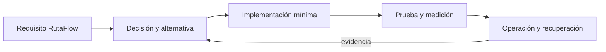

# Módulo 14: JavaScript Master: TypeScript, WASM y cómputo emergente

## Sílabo

**Objetivo general:** dominar las capacidades avanzadas señaladas en la auditoría del track mediante una ampliación ejecutable de RutaFlow, decisiones justificadas, pruebas, seguridad y evidencia operacional.

**Resultados observables:** explicar cada tecnología sin depender de marcas; implementar un incremento pequeño; comparar alternativas; provocar un fallo; medir el resultado; y escribir un runbook de recuperación.

**Evaluación:** 20 % fundamento, 35 % implementación, 25 % pruebas y fallos, 10 % seguridad, 10 % documentación y comunicación.

## Contenido teórico

### Tema 1: TypeScript avanzado

**Conceptos clave:** propósito, modelo de ejecución, configuración, seguridad, coste, pruebas y operación.

TypeScript avanzado se estudia como una decisión de ingeniería y no como una colección de comandos. Primero identifica el problema que resuelve y los límites de la plataforma; luego construye el incremento mínimo dentro de RutaFlow. Registra entradas, salidas, dependencias y condiciones de fallo. Compara al menos una alternativa y conserva la medición que justifica la elección. Si la tecnología es experimental, se aísla del camino estable y se documenta la estrategia de retirada.

En producción debes considerar configuración por ambiente, identidad de máquina y persona, secretos, compatibilidad, telemetría y recuperación. Una demostración exitosa no prueba comportamiento bajo concurrencia, reintentos, pérdida de red o datos inválidos. Por eso el laboratorio introduce un fallo deliberado y exige una prueba de regresión. El resultado debe poder repetirse desde terminal y CI sin pasos secretos del editor.

**Analogía:** es como incorporar una nueva estación a una red logística: no basta con construirla; hay que definir rutas, capacidad, controles, contingencias y cómo sabremos que funciona.

**¿Por qué es importante?** Porque TypeScript avanzado aparece cuando el sistema crece y las decisiones dejan de ser locales. Comprender su coste evita adoptar una herramienta por popularidad o descartarla por una primera experiencia incompleta.

**Casos de uso reales:** operación normal, configuración inválida, dependencia lenta, solicitud duplicada, cambio incompatible y recuperación posterior a un despliegue fallido.

**Diagrama:**


**Archivo:** `src/domain/delivery-status.ts`

```ts
// La unión discriminada obliga a tratar cada estado de la entrega.
type DeliveryStatus =
  | { kind: 'assigned'; courierId: string }
  | { kind: 'in-transit'; latitude: number; longitude: number }
  | { kind: 'delivered'; receivedBy: string };

export function statusLabel(status: DeliveryStatus): string {
  switch (status.kind) {
    case 'assigned': return `Asignada a ${status.courierId}`;
    case 'in-transit': return `En ruta: ${status.latitude}, ${status.longitude}`;
    case 'delivered': return `Recibida por ${status.receivedBy}`;
    default: return assertNever(status); // Falla al compilar si aparece un estado nuevo.
  }
}

function assertNever(value: never): never {
  throw new Error(`Estado no soportado: ${JSON.stringify(value)}`);
}
```

Ejecuta `npx tsc --noEmit`. **Resultado esperado:** termina sin errores. Añade un estado `cancelled` sin incorporarlo al `switch`: TypeScript debe señalar la rama faltante antes de ejecutar la aplicación.

### Tema 2: Workers y ejecución fuera del hilo principal

**Conceptos clave:** propósito, modelo de ejecución, configuración, seguridad, coste, pruebas y operación.

Workers y ejecución fuera del hilo principal se estudia como una decisión de ingeniería y no como una colección de comandos. Primero identifica el problema que resuelve y los límites de la plataforma; luego construye el incremento mínimo dentro de RutaFlow. Registra entradas, salidas, dependencias y condiciones de fallo. Compara al menos una alternativa y conserva la medición que justifica la elección. Si la tecnología es experimental, se aísla del camino estable y se documenta la estrategia de retirada.

En producción debes considerar configuración por ambiente, identidad de máquina y persona, secretos, compatibilidad, telemetría y recuperación. Una demostración exitosa no prueba comportamiento bajo concurrencia, reintentos, pérdida de red o datos inválidos. Por eso el laboratorio introduce un fallo deliberado y exige una prueba de regresión. El resultado debe poder repetirse desde terminal y CI sin pasos secretos del editor.

**Analogía:** es como incorporar una nueva estación a una red logística: no basta con construirla; hay que definir rutas, capacidad, controles, contingencias y cómo sabremos que funciona.

**¿Por qué es importante?** Porque Workers y ejecución fuera del hilo principal aparece cuando el sistema crece y las decisiones dejan de ser locales. Comprender su coste evita adoptar una herramienta por popularidad o descartarla por una primera experiencia incompleta.

**Casos de uso reales:** operación normal, configuración inválida, dependencia lenta, solicitud duplicada, cambio incompatible y recuperación posterior a un despliegue fallido.

**Diagrama:**


**Archivos:** `src/workers/route.worker.ts` y `src/route-client.ts`

```ts
// route.worker.ts: el cálculo pesado ocurre fuera del hilo de la interfaz.
self.onmessage = (event: MessageEvent<number[]>) => {
  const total = event.data.reduce((distance, segment) => distance + segment, 0);
  self.postMessage({ total });
};
```

```ts
// route-client.ts: la UI conserva el control y recibe una respuesta tipada.
const worker = new Worker(new URL('./workers/route.worker.ts', import.meta.url), { type: 'module' });
worker.onmessage = ({ data }: MessageEvent<{ total: number }>) => {
  console.log(`Distancia planificada: ${data.total} km`);
};
worker.postMessage([2.4, 3.1, 1.5]);
```

Ejecuta `npm run dev` y observa la consola. **Resultado esperado:** `Distancia planificada: 7 km`. Envía texto en lugar de números para comprobar por qué el contrato del mensaje también debe validarse en tiempo de ejecución.

### Tema 3: Bundlers y optimización

**Conceptos clave:** propósito, modelo de ejecución, configuración, seguridad, coste, pruebas y operación.

Bundlers y optimización se estudia como una decisión de ingeniería y no como una colección de comandos. Primero identifica el problema que resuelve y los límites de la plataforma; luego construye el incremento mínimo dentro de RutaFlow. Registra entradas, salidas, dependencias y condiciones de fallo. Compara al menos una alternativa y conserva la medición que justifica la elección. Si la tecnología es experimental, se aísla del camino estable y se documenta la estrategia de retirada.

En producción debes considerar configuración por ambiente, identidad de máquina y persona, secretos, compatibilidad, telemetría y recuperación. Una demostración exitosa no prueba comportamiento bajo concurrencia, reintentos, pérdida de red o datos inválidos. Por eso el laboratorio introduce un fallo deliberado y exige una prueba de regresión. El resultado debe poder repetirse desde terminal y CI sin pasos secretos del editor.

**Analogía:** es como incorporar una nueva estación a una red logística: no basta con construirla; hay que definir rutas, capacidad, controles, contingencias y cómo sabremos que funciona.

**¿Por qué es importante?** Porque Bundlers y optimización aparece cuando el sistema crece y las decisiones dejan de ser locales. Comprender su coste evita adoptar una herramienta por popularidad o descartarla por una primera experiencia incompleta.

**Casos de uso reales:** operación normal, configuración inválida, dependencia lenta, solicitud duplicada, cambio incompatible y recuperación posterior a un despliegue fallido.

**Diagrama:**


**Archivo:** `vite.config.ts`

```ts
import { defineConfig } from 'vite';

export default defineConfig({
  build: {
    // Crea un artefacto inspeccionable y evita mapas de producción accidentales.
    sourcemap: false,
    rollupOptions: {
      output: {
        // Separa el mapa: solo se descarga cuando la pantalla lo necesita.
        manualChunks: { maps: ['maplibre-gl'] },
      },
    },
  },
});
```

Ejecuta `npm run build` y revisa `dist/assets/`. **Resultado esperado:** existe un archivo independiente para `maps`. Compara tamaños antes y después; dividir paquetes no sirve si la pantalla inicial sigue importando el módulo de manera ansiosa.

### Tema 4: Accesibilidad web

**Conceptos clave:** propósito, modelo de ejecución, configuración, seguridad, coste, pruebas y operación.

Accesibilidad web se estudia como una decisión de ingeniería y no como una colección de comandos. Primero identifica el problema que resuelve y los límites de la plataforma; luego construye el incremento mínimo dentro de RutaFlow. Registra entradas, salidas, dependencias y condiciones de fallo. Compara al menos una alternativa y conserva la medición que justifica la elección. Si la tecnología es experimental, se aísla del camino estable y se documenta la estrategia de retirada.

En producción debes considerar configuración por ambiente, identidad de máquina y persona, secretos, compatibilidad, telemetría y recuperación. Una demostración exitosa no prueba comportamiento bajo concurrencia, reintentos, pérdida de red o datos inválidos. Por eso el laboratorio introduce un fallo deliberado y exige una prueba de regresión. El resultado debe poder repetirse desde terminal y CI sin pasos secretos del editor.

**Analogía:** es como incorporar una nueva estación a una red logística: no basta con construirla; hay que definir rutas, capacidad, controles, contingencias y cómo sabremos que funciona.

**¿Por qué es importante?** Porque Accesibilidad web aparece cuando el sistema crece y las decisiones dejan de ser locales. Comprender su coste evita adoptar una herramienta por popularidad o descartarla por una primera experiencia incompleta.

**Casos de uso reales:** operación normal, configuración inválida, dependencia lenta, solicitud duplicada, cambio incompatible y recuperación posterior a un despliegue fallido.

**Diagrama:**


**Archivo:** `src/ui/delivery-button.ts`

```ts
const button = document.querySelector<HTMLButtonElement>('#confirm-delivery');
const feedback = document.querySelector<HTMLElement>('#delivery-feedback');

button?.addEventListener('click', async () => {
  button.disabled = true; // Evita dos confirmaciones mientras la petición está activa.
  button.setAttribute('aria-busy', 'true');
  if (feedback) feedback.textContent = 'Confirmando entrega…';

  try {
    await confirmDelivery();
    if (feedback) feedback.textContent = 'Entrega confirmada'; // aria-live lo anuncia.
  } catch {
    if (feedback) feedback.textContent = 'No se pudo confirmar. Intenta nuevamente.';
  } finally {
    button.disabled = false;
    button.removeAttribute('aria-busy');
  }
});
```

El HTML debe usar un `<button id="confirm-delivery">` real y un elemento con `id="delivery-feedback" role="status" aria-live="polite"`. Ejecuta `npx eslint src && npm test`. Verifica solo con teclado y lector de pantalla; el color por sí solo no comunica éxito ni error.

### Tema 5: WebAssembly con Rust o C

**Conceptos clave:** propósito, modelo de ejecución, configuración, seguridad, coste, pruebas y operación.

WebAssembly con Rust o C se estudia como una decisión de ingeniería y no como una colección de comandos. Primero identifica el problema que resuelve y los límites de la plataforma; luego construye el incremento mínimo dentro de RutaFlow. Registra entradas, salidas, dependencias y condiciones de fallo. Compara al menos una alternativa y conserva la medición que justifica la elección. Si la tecnología es experimental, se aísla del camino estable y se documenta la estrategia de retirada.

En producción debes considerar configuración por ambiente, identidad de máquina y persona, secretos, compatibilidad, telemetría y recuperación. Una demostración exitosa no prueba comportamiento bajo concurrencia, reintentos, pérdida de red o datos inválidos. Por eso el laboratorio introduce un fallo deliberado y exige una prueba de regresión. El resultado debe poder repetirse desde terminal y CI sin pasos secretos del editor.

**Analogía:** es como incorporar una nueva estación a una red logística: no basta con construirla; hay que definir rutas, capacidad, controles, contingencias y cómo sabremos que funciona.

**¿Por qué es importante?** Porque WebAssembly con Rust o C aparece cuando el sistema crece y las decisiones dejan de ser locales. Comprender su coste evita adoptar una herramienta por popularidad o descartarla por una primera experiencia incompleta.

**Casos de uso reales:** operación normal, configuración inválida, dependencia lenta, solicitud duplicada, cambio incompatible y recuperación posterior a un despliegue fallido.

**Diagrama:**


**Archivos:** `wasm/src/lib.rs` y `src/wasm/route-score.ts`

```rust
use wasm_bindgen::prelude::*;

#[wasm_bindgen]
pub fn route_score(distance_km: f64, late_stops: u32) -> f64 {
    // Función pura: fácil de comparar contra la implementación JavaScript.
    distance_km + f64::from(late_stops) * 5.0
}
```

```ts
import init, { route_score } from '../../wasm/pkg/route_score.js';

await init(); // Instancia el módulo antes de invocar sus exportaciones.
console.log(route_score(12.5, 2));
```

Ejecuta `wasm-pack build wasm --target web && npm run dev`. **Resultado esperado:** `22.5`. Mide varias ejecuciones antes de afirmar que WASM es más rápido: el coste de compilación, transferencia de memoria y carga puede superar el beneficio de una función pequeña.

### Tema 6: Web3 y machine learning en navegador

**Conceptos clave:** propósito, modelo de ejecución, configuración, seguridad, coste, pruebas y operación.

Web3 y machine learning en navegador se estudia como una decisión de ingeniería y no como una colección de comandos. Primero identifica el problema que resuelve y los límites de la plataforma; luego construye el incremento mínimo dentro de RutaFlow. Registra entradas, salidas, dependencias y condiciones de fallo. Compara al menos una alternativa y conserva la medición que justifica la elección. Si la tecnología es experimental, se aísla del camino estable y se documenta la estrategia de retirada.

En producción debes considerar configuración por ambiente, identidad de máquina y persona, secretos, compatibilidad, telemetría y recuperación. Una demostración exitosa no prueba comportamiento bajo concurrencia, reintentos, pérdida de red o datos inválidos. Por eso el laboratorio introduce un fallo deliberado y exige una prueba de regresión. El resultado debe poder repetirse desde terminal y CI sin pasos secretos del editor.

**Analogía:** es como incorporar una nueva estación a una red logística: no basta con construirla; hay que definir rutas, capacidad, controles, contingencias y cómo sabremos que funciona.

**¿Por qué es importante?** Porque Web3 y machine learning en navegador aparece cuando el sistema crece y las decisiones dejan de ser locales. Comprender su coste evita adoptar una herramienta por popularidad o descartarla por una primera experiencia incompleta.

**Casos de uso reales:** operación normal, configuración inválida, dependencia lenta, solicitud duplicada, cambio incompatible y recuperación posterior a un despliegue fallido.

**Diagrama:**


**Archivo:** `src/risk/delivery-risk.ts`

```ts
interface RiskInput { battery: number; accuracyMeters: number; minutesLate: number }

export function deliveryRisk(input: RiskInput): number {
  // Modelo local explicable; no envía ubicación ni batería a un tercero.
  const batteryRisk = input.battery < 15 ? 0.35 : 0;
  const gpsRisk = input.accuracyMeters > 80 ? 0.35 : 0;
  const delayRisk = Math.min(input.minutesLate / 120, 0.3);
  return Number((batteryRisk + gpsRisk + delayRisk).toFixed(2));
}

console.log(deliveryRisk({ battery: 10, accuracyMeters: 120, minutesLate: 30 }));
```

Ejecuta `npx tsx src/risk/delivery-risk.ts`. **Resultado esperado:** `0.78`. Este ejemplo enseña el contrato antes de introducir una librería de ML. Prueba valores de frontera y documenta sesgos; no uses una puntuación automática para sancionar a un conductor sin revisión humana. Web3 solo debe incorporarse si existe una necesidad verificable de confianza entre organizaciones que una base de datos normal no resuelva.

## Trazabilidad de la auditoría original

- **TypeScript**: cubierto mediante fundamento, laboratorio y evidencia del capítulo.
- **WebAssembly**: cubierto mediante fundamento, laboratorio y evidencia del capítulo.
- **Web3**: cubierto mediante fundamento, laboratorio y evidencia del capítulo.
- **Machine Learning en navegador**: cubierto mediante fundamento, laboratorio y evidencia del capítulo.
- **Web Workers**: cubierto mediante fundamento, laboratorio y evidencia del capítulo.
- **Bundlers**: cubierto mediante fundamento, laboratorio y evidencia del capítulo.
- **Accessibility (a11y)**: cubierto mediante fundamento, laboratorio y evidencia del capítulo.

## Criterio transversal de calidad del código

Usa nombres del dominio, errores tipados y límites claros. Escribe una prueba que exprese el comportamiento antes de corregir el defecto. SOLID se aplica cuando reduce el coste real de sustituir infraestructura o política; no abstraer antes de observar repetición con el mismo significado. Revisa nombres, cohesión, dependencias, errores, prueba, mínimo privilegio y capacidad de diagnóstico.

## Laboratorio práctico

Selecciona una vertical de RutaFlow —cotización, asignación, tracking, evidencia o liquidación— y crea una rama desde un estado verificable. Para cada tema agrega una capacidad pequeña, no una aplicación paralela. Mantén un diario con hipótesis, comando, resultado, métrica y decisión.

1. Define requisito, amenaza y atributo de calidad medible.
2. Construye la versión mínima con configuración reproducible.
3. Prueba camino feliz, entrada inválida y fallo de dependencia.
4. Ejecuta análisis de seguridad y registra datos sensibles tratados.
5. Mide latencia, coste, tamaño, accesibilidad o recuperación según corresponda.
6. Automatiza la comprobación en CI y documenta rollback.

La definición de terminado requiere código ejecutable, prueba automatizada, diagrama, ADR, enlace oficial con versión, medición antes/después y un procedimiento de limpieza. No se aceptan capturas sin comandos ni resultados imposibles de repetir.


## Rúbrica del proyecto

| Criterio | Inicial | Competente | Master verificable |
|---|---|---|---|
| Fundamento | Enumera APIs | Explica propósito | Compara límites y alternativas |
| Implementación | Demo manual | Flujo reproducible | Integración cohesionada y recuperable |
| Calidad | Camino feliz | Pruebas y errores | Fallos, compatibilidad y regresión |
| Seguridad | Secretos locales | Mínimo privilegio | Threat model y evidencia negativa |
| Operación | Sin métricas | Telemetría básica | SLO, coste y runbook ensayado |

## Bibliografía y fundamento académico

- Documentación primaria enlazada en el capítulo de actualizaciones oficiales del track.
- ACM/IEEE CS2023 y SWEBOK V4 para fundamentos, diseño, pruebas, seguridad y operación.
- NIST Secure Software Development Framework y OWASP ASVS/MASVS.
- Martin Kleppmann, *Designing Data-Intensive Applications*.
- Google, *Site Reliability Engineering* y *SRE Workbook*.
- Documentación de accesibilidad W3C/WCAG cuando exista interfaz humana.


## Resumen del módulo

Este capítulo vuelve visibles las capacidades solicitadas y las convierte en trabajo evaluable. Completarlo significa poder explicar, implementar, romper, medir y operar una solución; reconocer el nombre de una herramienta no demuestra nivel Master. La evidencia final conecta el track con RutaFlow y conserva decisiones, pruebas y recuperación para que otra persona pueda revisarlas.
