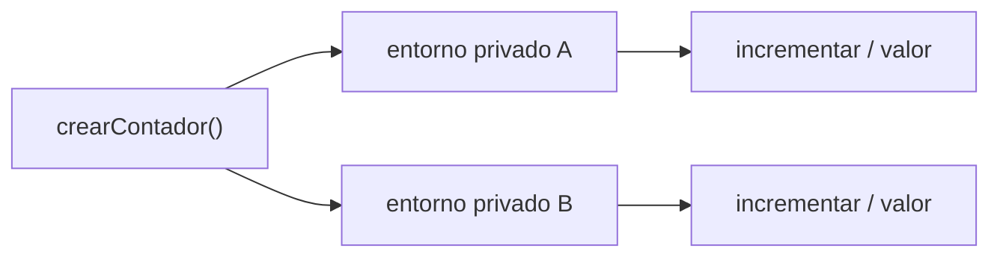
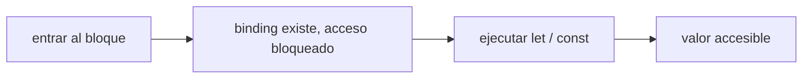
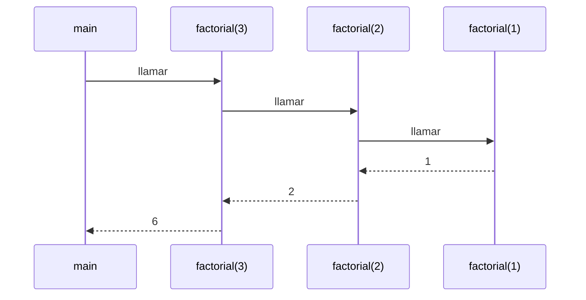
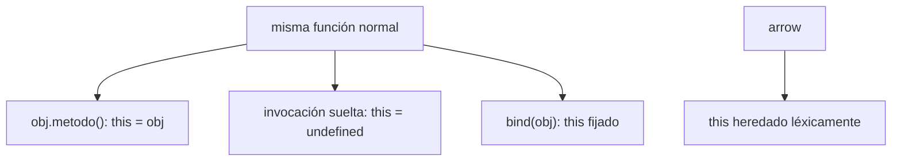
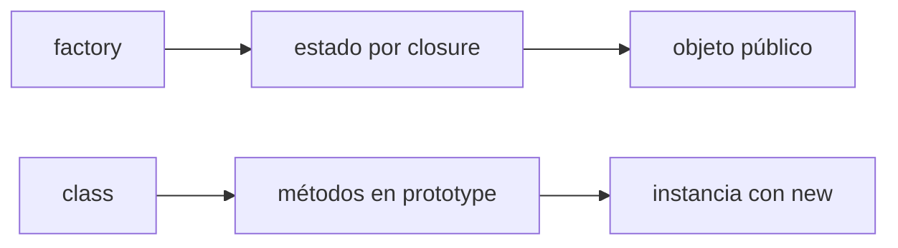
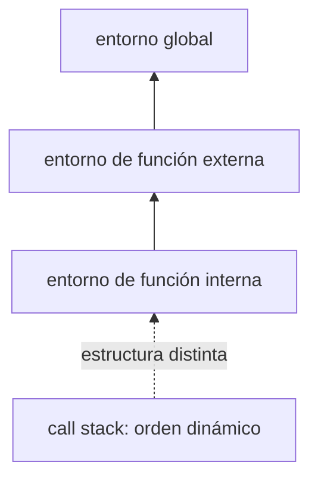

# Módulo 2: Scope, closures y el modelo de ejecución


## Aprende construyendo

### Tema 1: Scope léxico y closures

#### Paso 1 · Objetivo y preparación

Al finalizar podrás crear estado privado mediante closures y explicar qué conserva una función después de terminar su contexto creador.

**Conocimiento previo:** funciones, alcance de bloque, objetos y módulos.

#### Paso 2 · Contexto y caso real

**¿Por qué es importante?** RutaFlow necesita historiales que no puedan alterarse directamente desde cualquier archivo. Un closure expone operaciones controladas sin publicar el estado interno.

#### Paso 3 · Teoría con analogía

**Conceptos clave:** scope léxico, closure, variable privada, entorno capturado.

El scope léxico significa que el alcance de una variable se determina por dónde está escrita físicamente en el código fuente (su posición "léxica"), no por dónde se invoca la función en tiempo de ejecución. Una función definida dentro de otra tiene acceso a las variables de la función contenedora, sin importar desde dónde se llame después esa función interna; este acceso permanece fijo según la estructura del código, no según el flujo dinámico de ejecución.

Un closure ocurre cuando una función "recuerda" y mantiene acceso a las variables de su entorno de creación, incluso después de que ese entorno (la ejecución de la función contenedora) haya terminado formalmente. El ejemplo canónico, `createCounter()`, define una variable local `valor` y devuelve un objeto con tres funciones (`increment`, `decrement`, `value`) que la referencian; aunque la ejecución de `createCounter()` termina inmediatamente después de devolver ese objeto, las tres funciones devueltas siguen teniendo acceso a `valor`, porque mantienen una referencia activa a su entorno léxico de creación, evitando que el motor de JavaScript libere esa memoria mediante el recolector de basura (que se estudiará con más detalle en el Módulo 5, en el contexto del motor V8).

Este mecanismo es lo que permite crear variables verdaderamente privadas en JavaScript sin depender de sintaxis especial: `valor` es inaccesible desde fuera de las funciones devueltas por `createCounter()`, no existe ninguna forma de leerla o modificarla directamente salvo a través de la interfaz controlada (`increment`, `decrement`, `value`) que la función expone deliberadamente. Este patrón de "estado privado + interfaz pública controlada" precede históricamente a la introducción de campos privados reales con `#` en clases (vista en el Módulo 3), y sigue siendo ampliamente usado, especialmente en código funcional que no usa clases.

Es importante notar que cada invocación de `createCounter()` crea un entorno completamente nuevo e independiente: `const contadorA = createCounter(); const contadorB = createCounter();` produce dos contadores con sus propias variables `valor` privadas, totalmente aisladas entre sí, aunque ambas fueron creadas por la misma función. Esto es consecuencia directa de que cada llamada a una función crea un nuevo Execution Context (contexto de ejecución, discutido en el Tema 6), con su propio Lexical Environment (entorno léxico) asociado.

**Analogía:** un closure es como un investigador que, tras terminar formalmente un proyecto de investigación en un laboratorio, se lleva consigo un cuaderno de notas privado con los datos exactos de ese proyecto; aunque el laboratorio (la ejecución de la función contenedora) ya cerró, el investigador (la función devuelta) sigue teniendo acceso completo a esas notas específicas, sin que nadie más externo pueda leerlas directamente.

**¿Por qué es importante?** Los closures son el mecanismo fundamental detrás de patrones extremadamente comunes en JavaScript: variables privadas, factory functions, memoización (Módulo 10), y el propio modelo de Hooks de React, que depende internamente de closures para mantener el estado entre renderizados.

**Diagrama:**



#### Paso 4 · Demostración guiada desde cero

Desde una carpeta vacía crea `ejemplo-closures`, ejecuta `npm init -y`, crea `src` y después `src/closures.js`:

```bash
mkdir ejemplo-closures
cd ejemplo-closures
npm init -y
mkdir src
```

```javascript
function crearSeguimiento(guia) {
  const eventos = []; // permanece accesible para las funciones retornadas
  return {
    registrar: (estado) => eventos.push({ estado, orden: eventos.length + 1 }),
    resumen: () => ({ guia, eventos: eventos.map((evento) => ({ ...evento })) }),
  };
}

const seguimiento = crearSeguimiento('RF-10');
seguimiento.registrar('creado');
seguimiento.registrar('asignado');
console.log(seguimiento.resumen());
```

```bash
node src/closures.js
```

**Resultado esperado:** guía `RF-10` y dos eventos; `seguimiento.eventos` es `undefined`.

**Fallo deliberado:** devuelve directamente `eventos`, modifícalo desde fuera y observa la fuga. El closure oculta el nombre, pero no protege una referencia compartida; restaura la copia defensiva.

#### Construcción RutaFlow: estado privado por envío

Crea `academia-javascript/src/closures.js` con `crearSeguimiento(guia)` y estado privado de eventos. Construye dos seguimientos, añade eventos distintos y ejecuta `node src/closures.js`; el resultado esperado demuestra historiales independientes e imposibilidad de mutar el array interno directamente.

Devuelve el array original para provocar una fuga de encapsulación y modifícalo desde fuera; corrige devolviendo copia. Añade un límite de eventos y una función de resumen. RutaFlow usa closures cuando el estado simple necesita una API pequeña; una referencia capturada innecesariamente también puede prolongar memoria.

#### Paso 5 · Práctica guiada

Crea dos seguimientos con cantidades distintas. **Pista:** si comparten eventos, el array fue declarado fuera de la factory.

#### Paso 6 · Práctica independiente

Limita el historial a cinco eventos y añade `ultimoEstado()`. Prueba cero, uno y seis eventos sin exponer el array.

#### Paso 7 · Cierre y evidencia

Ya encapsulas estado por instancia y sabes que privacidad no implica inmutabilidad. El siguiente tema explica cuándo se inicializan los enlaces. **Evidencia:** demuestra el resultado de dos instancias aisladas, la fuga deliberada y el límite. Fuente oficial: [MDN — closures](https://developer.mozilla.org/es/docs/Web/JavaScript/Closures).

**Errores comunes:** declarar estado fuera de la factory; devolver referencias mutables; capturar objetos innecesarios; confundir memoria local con persistencia.

### Tema 2: Hoisting y Temporal Dead Zone

#### Paso 1 · Objetivo y preparación

Al finalizar podrás predecir el acceso a declaraciones, `var`, `let` y `const` antes de inicializarlos y ordenar el arranque de RutaFlow.

**Conocimiento previo:** scope léxico, funciones y módulos.

#### Paso 2 · Contexto y caso real

**¿Por qué es importante?** Un servicio puede intentar usar un repositorio antes de crearlo. Comprender hoisting y TDZ evita ocultar dependencias mediante cambios de sintaxis.

#### Paso 3 · Teoría con analogía

**Conceptos clave:** hoisting de declaraciones, TDZ de let/const, orden de evaluación.

El hoisting es el comportamiento por el cual el motor de JavaScript procesa ciertas declaraciones antes de ejecutar el código línea por línea, "elevándolas" conceptualmente al inicio de su scope. Las function declarations se hoistean completas (cuerpo incluido), lo que permite invocarlas antes de su línea de definición en el código fuente, como se vio en el Módulo 1. Las declaraciones `var` se hoistean solo su existencia, inicializadas automáticamente con `undefined`, de modo que leerlas antes de su asignación no lanza error, simplemente devuelve `undefined` silenciosamente.

`let` y `const` también se hoistean —técnicamente existen desde el inicio de su scope de bloque— pero permanecen en la Temporal Dead Zone (TDZ) hasta que la línea de su declaración se ejecuta efectivamente. Intentar leerlas dentro de la TDZ no devuelve `undefined` silenciosamente como haría `var`, sino que lanza un `ReferenceError: Cannot access 'x' before initialization`, un error explícito y fácil de diagnosticar. Este diseño deliberado de la TDZ fue introducido específicamente para hacer que errores de orden de código, que con `var` fallaban silenciosamente, se conviertan en errores ruidosos y detectables durante el desarrollo.

Es fundamental distinguir la TDZ de un simple "todavía no declarada": la variable técnicamente ya existe en el motor interno de JavaScript desde el inicio del bloque (por eso el error dice "before initialization", antes de inicialización, y no "is not defined", no está definida), pero el acceso está bloqueado deliberadamente hasta el punto exacto de su declaración en el código. Esta distinción técnica explica por qué el mensaje de error de la TDZ es diferente del mensaje que se obtiene al referenciar una variable que jamás fue declarada en absoluto en ningún scope accesible.

Comprender el hoisting con precisión evita errores de razonamiento comunes, como asumir que declarar una variable con `let` en cualquier punto del código la hace disponible desde el inicio de la función solo porque técnicamente "ya existe" en el motor; en la práctica, para todo propósito de uso correcto del código, una variable `let`/`const` debe tratarse como si no existiera en absoluto hasta la línea exacta de su declaración.

**Analogía:** el hoisting de `var` es como reservar una mesa en un restaurante con antelación, donde la mesa existe (está reservada) pero la comida ("el valor real") aún no ha llegado y se sirve automáticamente un plato vacío (`undefined`) si preguntas antes de tiempo; la TDZ de `let`/`const` es como una mesa que existe en el plano del restaurante pero está físicamente bloqueada con una cinta hasta el momento exacto de la reserva, y cualquiera que intente sentarse antes recibe una alarma inmediata (`ReferenceError`) en vez de servírsele algo vacío silenciosamente.

**¿Por qué es importante?** Entender la TDZ con precisión es la base para depurar correctamente errores de "variable no accesible" en código moderno con `let`/`const`, distinguiéndolos de errores genuinos de variable jamás declarada.

**Diagrama:**



#### Paso 4 · Demostración guiada desde cero

Desde una carpeta vacía crea `ejemplo-hoisting`, ejecuta `npm init -y`, crea `src` y después `src/hoisting.js`:

```bash
mkdir ejemplo-hoisting
cd ejemplo-hoisting
npm init -y
mkdir src
```

```javascript
iniciar(); // la declaración completa está disponible

function iniciar() {
  const repositorio = crearRepositorio();
  console.log(repositorio.nombre);
}

const crearRepositorio = () => ({ nombre: 'entregas-en-memoria' });
```

```bash
node src/hoisting.js
```

**Resultado esperado:** `entregas-en-memoria`.

**Fallo deliberado:** mueve una llamada a `crearRepositorio()` encima de su declaración. `ReferenceError: Cannot access ... before initialization` señala la TDZ; el enlace existe, pero todavía no tiene valor utilizable.

#### Construcción RutaFlow: inicialización en orden explícito

Crea `academia-javascript/src/hoisting.js` con una declaración invocada antes de escribirse, un `var` leído antes de asignar y un `const` leído en TDZ. Ejecuta `node src/hoisting.js`; captura por separado `undefined` y `ReferenceError`, mostrando que no significan lo mismo.

Mueve la configuración RutaFlow debajo de una función que la usa para reproducir el error y luego reordena el archivo por dependencias claras. Compara un loop asíncrono con `var` y con `let`, prediciendo `3,3,3` frente a `0,1,2`. Prefiere `const` y no diseñes lógica dependiente de hoisting implícito salvo declaraciones deliberadas.

#### Paso 5 · Práctica guiada

Predice declaración de función, expresión con `var` y flecha con `const` invocadas antes de su línea. **Pista:** separa creación del enlace e inicialización del valor.

#### Paso 6 · Práctica independiente

Divide factory y arranque en `src/repositorio.js` y `src/main.js`. Importar el primero no debe abrir conexiones; demuestra que el efecto ocurre solo en `main`.

#### Paso 7 · Cierre y evidencia

Ya distingues hoisting de inicialización. El siguiente tema muestra cómo cada llamada ocupa el call stack. **Evidencia:** demuestra el resultado de tres predicciones, los errores observados y el módulo sin efectos al importar. Fuente oficial: [MDN — hoisting](https://developer.mozilla.org/es/docs/Glossary/Hoisting).

**Errores comunes:** afirmar que `let` no se eleva; convertir todo a declaraciones; iniciar conexiones al importar; confundir `undefined` con función válida.

### Tema 3: Call stack y contexto de ejecución

#### Paso 1 · Objetivo y preparación

Al finalizar podrás leer un stack trace, reconstruir la cadena de llamadas y corregir una recursión sin caso base.

**Conocimiento previo:** funciones, errores y condicionales.

#### Paso 2 · Contexto y caso real

**¿Por qué es importante?** Cuando el proyecto RutaFlow rechaza una entrega, la traza permite saber qué flujo llegó a la validación. Sin ese modelo, el estudiante corrige la última línea visible aunque la causa esté en una llamada anterior.

#### Paso 3 · Teoría con analogía

**Conceptos clave:** call stack, frame de ejecución, recursión, stack overflow.

Cada vez que se invoca una función, el motor de JavaScript crea un nuevo "frame" (marco) de ejecución y lo apila sobre el call stack (pila de llamadas), una estructura de datos LIFO (último en entrar, primero en salir) que registra la secuencia de funciones actualmente en ejecución. Cuando una función retorna (termina su ejecución), su frame se desapila, y el control vuelve al frame anterior, exactamente en el punto donde había quedado pausado esperando el resultado de la llamada.

Una función recursiva —una función que se llama a sí misma— apila un nuevo frame en cada invocación recursiva, y cada frame consume una porción finita de memoria. Si la recursión no tiene un caso base que detenga las llamadas recursivas (o si el caso base nunca se alcanza debido a un error lógico), el call stack crece indefinidamente hasta agotar el límite de memoria asignado, lanzando el error `RangeError: Maximum call stack size exceeded`, comúnmente conocido como "stack overflow".

Leer un stack trace (la traza que JavaScript imprime automáticamente al lanzar cualquier error, incluyendo un stack overflow) es una habilidad de depuración fundamental: la traza lista, en orden, cada frame que estaba activo en el momento del error, permitiendo identificar exactamente la cadena de llamadas que condujo al problema. En el caso de una recursión sin caso base, la traza típicamente muestra la misma función repetida cientos de veces consecutivas, una señal inequívoca de recursión descontrolada que ayuda a localizar rápidamente el origen del bug.

El call stack también explica por qué JavaScript es fundamentalmente síncrono en su ejecución de código normal (no asíncrono): mientras el call stack no esté vacío, el motor no puede procesar ninguna otra tarea pendiente, incluyendo callbacks de temporizadores o promesas resueltas (el mecanismo completo del Event Loop, que coordina el call stack con las colas de tareas asíncronas, se estudiará en profundidad en el Módulo 5).

**Analogía:** el call stack es como una pila de bandejas en una cafetería de autoservicio: cada vez que alguien coge una tarea nueva (invoca una función), se apila una bandeja nueva encima; cuando termina esa tarea (la función retorna), se retira la bandeja superior y se vuelve a la que estaba debajo. Una recursión sin caso base es como seguir apilando bandejas sin nunca retirar ninguna, hasta que la pila colapsa por su propio peso (stack overflow).

**¿Por qué es importante?** Entender el call stack es indispensable para depurar recursiones descontroladas, para leer cualquier stack trace de error con criterio, y como base conceptual necesaria antes de abordar el Event Loop en el Módulo 5.

**Diagrama:**



#### Paso 4 · Demostración guiada desde cero

Desde una carpeta vacía crea `ejemplo-call-stack`, ejecuta `npm init -y`, crea `src` y después `src/pila.js`:

```bash
mkdir ejemplo-call-stack
cd ejemplo-call-stack
npm init -y
mkdir src
```

```javascript
function validarDestino(envio) {
  if (!envio.destino) throw new Error(`Destino ausente en ${envio.guia}`);
}
function procesarGuia(envio) { validarDestino(envio); }
function procesarLote(envios) { envios.forEach(procesarGuia); }

procesarLote([{ guia: 'RF-20', destino: '' }]);
```

```bash
node src/pila.js
```

**Resultado esperado:** una traza que empieza en `validarDestino` y continúa por `procesarGuia` y `procesarLote`.

**Fallo deliberado:** crea `function contar(n) { return contar(n + 1); }` y ejecútala en un archivo separado. `RangeError: Maximum call stack size exceeded` muestra recursión sin caso base ni progreso hacia él.

#### Construcción RutaFlow: leer la cadena del fallo

Crea `academia-javascript/src/pila.js` con `procesarLote -> procesarGuia -> validarDestino`, lanzando un error en la última. Ejecuta `node src/pila.js`; lee el stack trace y localiza archivo, línea y cadena de llamadas. Después agrega una recursión sin caso base en un script separado y observa `RangeError`.

Corrige la recursión con caso base y progreso, y añade prueba para entrada vacía. Convierte un recorrido lineal profundo en iterativo y compara límites. RutaFlow conserva contexto del error sin capturar y relanzar inútilmente en cada frame; el call stack ordena ejecución, no resuelve variables.

#### Paso 5 · Práctica guiada

Agrega `asignarRuta` entre lote y guía, vuelve a ejecutar y localiza el nuevo frame. **Pista:** lee la traza de arriba hacia abajo para el origen y de abajo hacia arriba para el recorrido.

#### Paso 6 · Práctica independiente

Implementa suma recursiva de paradas con caso base y versión iterativa. Prueba lista vacía y 20 000 elementos; explica qué versión soporta mejor la profundidad.

#### Paso 7 · Cierre y evidencia

Ya conviertes una traza en una historia de ejecución. El siguiente tema explica por qué un método pierde `this` al separarlo de su objeto. **Evidencia:** demuestra el resultado de la traza, el `RangeError` y ambas versiones del recorrido. Fuente oficial: [MDN — call stack](https://developer.mozilla.org/en-US/docs/Glossary/Call_stack).

**Errores comunes:** leer solo el mensaje; capturar y relanzar sin causa; olvidar el caso base; confundir call stack con scope chain.

### Tema 4: this según el modo de invocación

#### Paso 1 · Objetivo y preparación

Al finalizar podrás predecir `this` según la forma de llamada y conservar un receptor al entregar un método como callback.

**Conocimiento previo:** funciones normales, flechas, callbacks y modo estricto.

#### Paso 2 · Contexto y caso real

**¿Por qué es importante?** RutaFlow entrega métodos a temporizadores y manejadores. Al separar `centro.describir` de `centro`, cambia la forma de invocación y el método puede perder su centro.

#### Paso 3 · Teoría con analogía

**Conceptos clave:** `this` dinámico, invocación como método, `call`/`apply`/`bind`.

A diferencia de la mayoría de variables en JavaScript, cuyo valor se determina por scope léxico (dónde está escrita la función), el valor de `this` dentro de una función normal (no arrow) se determina por cómo se invoca esa función, no por dónde se define. La misma función exacta puede tener valores completamente distintos de `this` según la sintaxis de invocación: invocada como método de un objeto (`obj.metodo()`), `this` apunta a `obj`; invocada como función suelta (`const fn = obj.metodo; fn()`), `this` es `undefined` en modo estricto (o el objeto global en modo no estricto); invocada con `new` (`new Constructor()`), `this` apunta a la instancia recién creada.

Las arrow functions rompen deliberadamente esta regla dinámica: no tienen su propio `this` en absoluto, y en su lugar heredan (capturan léxicamente, como un closure) el `this` del scope donde fueron definidas. Esto explica por qué un método de objeto definido como arrow function (`obj = { nombre: "Ana", flecha: () => this?.nombre }`) no apunta a `obj` al invocarse como `obj.flecha()`: la arrow function captura el `this` del scope léxico externo (típicamente el módulo o el objeto global), no el de `obj`, sin importar cómo se invoque después.

`call`, `apply` y `bind` son tres métodos disponibles en toda función normal que permiten fijar explícitamente el valor de `this` en una invocación, en vez de dejar que se determine implícitamente por la sintaxis de la llamada. `fn.call(contexto, arg1, arg2)` invoca `fn` inmediatamente con `this` fijado a `contexto` y los argumentos listados individualmente; `fn.apply(contexto, [arg1, arg2])` hace lo mismo pero recibiendo los argumentos como un array; `fn.bind(contexto)` no invoca la función inmediatamente, sino que devuelve una nueva función con `this` permanentemente fijado a `contexto`, útil quando se necesita pasar una referencia a la función (por ejemplo, como callback de un evento) preservando su `this` original.

Comprender profundamente esta mecánica de `this` es esencial antes de trabajar con clases (Módulo 3), donde es común encontrarse con el bug clásico de pasar un método de una instancia como callback (`boton.addEventListener("click", instancia.metodo)`) y descubrir que, al invocarse, `this` dentro de `metodo` ya no apunta a `instancia`, sino que es `undefined`, precisamente porque la forma de invocación cambió (ya no es `instancia.metodo()`, sino una invocación suelta disparada por el listener de eventos).

**Analogía:** `this` es como un pronombre que se refiere a "quien está hablando en este momento", y depende de quién pronuncia la frase, no de dónde se escribió el guion originalmente; `bind` es como grabar esa frase en un audio permanente donde el hablante queda fijado para siempre, sin importar quién reproduzca después la grabación.

**¿Por qué es importante?** El comportamiento dinámico de `this` es una de las características más distintivas (y más propensas a confusión) de JavaScript frente a otros lenguajes orientados a objetos, y dominarlo es un prerequisito indispensable para trabajar con clases, event listeners, y frameworks que dependen de callbacks de métodos.

**Diagrama:**



#### Paso 4 · Demostración guiada desde cero

Desde una carpeta vacía crea `ejemplo-this`, ejecuta `npm init -y`, crea `src` y después `src/this.js`:

```bash
mkdir ejemplo-this
cd ejemplo-this
npm init -y
mkdir src
```

```javascript
const centro = {
  nombre: 'Bogotá',
  describir(guia) { // this depende del receptor de la llamada
    return `${this.nombre}: ${guia}`;
  },
};

console.log(centro.describir('RF-21'));
const describirBogota = centro.describir.bind(centro);
console.log(describirBogota('RF-22'));
```

```bash
node src/this.js
```

**Resultado esperado:** `Bogotá: RF-21` y `Bogotá: RF-22`.

**Fallo deliberado:** ejecuta `const suelta = centro.describir; suelta('RF-23')`. En un módulo estricto aparece `TypeError` al leer `nombre` de `undefined`: la función ya no fue invocada como método.

#### Construcción RutaFlow: callback sin perder el receptor

Crea `academia-javascript/src/this.js` con un objeto `centro` y método `describirGuia`. Invócalo como método, suelto, con `call`, `apply` y `bind`; ejecuta `node src/this.js` y registra cada salida. El caso suelto debe fallar o devolver `undefined` en modo estricto, mientras bind conserva el centro.

Pasa el método sin bind a un temporizador para reproducir la pérdida. Corrige con bind o una arrow envolvente y explica la diferencia. Crea dos centros usando la misma función y comprueba `call`. RutaFlow evita arrows como métodos que necesitan receptor y evita bind indiscriminado cuando una función pura sería más clara.

#### Paso 5 · Práctica guiada

Invoca el método con `call` y `apply` usando otro centro. **Pista:** ambos ejecutan inmediatamente; cambia únicamente cómo reciben los argumentos.

#### Paso 6 · Práctica independiente

Programa el método con `setTimeout` de tres formas: suelto, con `bind` y con una arrow envolvente. Registra resultados y justifica cuál usarías si también necesitas argumentos dinámicos.

#### Paso 7 · Cierre y evidencia

Ya separas scope léxico de receptor dinámico. El siguiente tema compara factories con clases y módulos. **Evidencia:** demuestra los resultados como método, suelto, `call`, `apply`, `bind` y temporizador. Fuente oficial: [MDN — `this`](https://developer.mozilla.org/es/docs/Web/JavaScript/Reference/Operators/this).

**Errores comunes:** definir con arrow un método que necesita receptor; asumir que `this` depende de dónde se escribió; ejecutar `bind` esperando una llamada inmediata; encadenar bind varias veces.

### Tema 5: Module pattern y factory functions

#### Paso 1 · Objetivo y preparación

Al finalizar podrás construir factories con estado privado y decidir cuándo usarlas frente a clases o módulos sin estado.

**Conocimiento previo:** closures, objetos, `Map`, copias defensivas y módulos ESM.

#### Paso 2 · Contexto y caso real

**¿Por qué es importante?** RutaFlow necesita repositorios sustituibles para aprender y probar sin base real. Una factory crea instancias aisladas e inyecta dependencias sin recurrir a variables globales.

#### Paso 3 · Teoría con analogía

**Conceptos clave:** module pattern, factory function, encapsulación sin clases.

El module pattern es una técnica, anterior a la existencia de módulos ESM nativos (Módulo 7), que usa una IIFE (Módulo 1) combinada con closures para crear un scope privado con estado interno y una interfaz pública controlada, exactamente el mismo principio que `createCounter()` del Tema 1 pero aplicado típicamente a un módulo completo de funcionalidad relacionada, en vez de a una única pieza de estado simple. Aunque los módulos ESM han reemplazado en gran medida la necesidad práctica de este patrón para organizar código en archivos separados, el mecanismo subyacente de "closure como encapsulación" sigue siendo directamente relevante y ampliamente usado dentro de un mismo archivo o función.

Una factory function es, simplemente, cualquier función que devuelve un nuevo objeto cada vez que se invoca, encapsulando la lógica de construcción de ese objeto en un único lugar reutilizable, sin necesidad de usar `class` ni `new`. `createCounter()` del Tema 1 es, en sí misma, una factory function: cada invocación produce un objeto nuevo e independiente, con su propio estado privado capturado por closure. Este enfoque es una alternativa completamente válida a las clases para modelar objetos con estado y comportamiento, y algunos desarrolladores la prefieren explícitamente por evitar la complejidad adicional de `this`, `new` y la cadena de prototipos, apoyándose en cambio exclusivamente en closures, que tienen una semántica más simple y predecible de scope léxico puro.

La elección entre factory functions (basadas en closures) y clases (basadas en prototipos, Módulo 3) no tiene una respuesta universal correcta: las clases ofrecen herencia formal con `extends`/`super` y son la convención dominante en frameworks como Angular; las factory functions evitan por completo la complejidad dinámica de `this` (cada método definido dentro de la factory captura el estado por closure de forma directa y predecible, sin depender de cómo se invoque después), lo cual algunos equipos consideran una ventaja de simplicidad y previsibilidad frente a las clases.

En la práctica, es común encontrar ambos enfoques conviviendo dentro de una misma base de código: clases para modelar jerarquías de objetos con herencia explícita y bien definida, y factory functions para módulos de utilidad con estado simple donde la encapsulación por closure resulta más directa y con menos superficie de error potencial que gestionar manualmente el valor de `this`.

**Analogía:** una factory function es como una línea de producción que entrega, en cada pedido, un producto completamente nuevo y ensamblado según una especificación fija, con todas sus piezas internas ya montadas y ocultas dentro de una carcasa sellada (el closure), sin que el comprador final necesite entender ni pueda acceder directamente a los mecanismos internos.

**¿Por qué es importante?** Las factory functions son una alternativa legítima y ampliamente usada a las clases para encapsular estado y comportamiento, y entender ambos enfoques (closures frente a prototipos/clases) da flexibilidad real para elegir la herramienta más apropiada según el contexto específico de cada problema.

**Diagrama:**



#### Paso 4 · Demostración guiada desde cero

Desde una carpeta vacía crea `ejemplo-factory`, ejecuta `npm init -y`, crea `src` y después `src/repositorio.js`:

```bash
mkdir ejemplo-factory
cd ejemplo-factory
npm init -y
mkdir src
```

```javascript
export function crearRepositorioGuias(generarId) {
  const guias = new Map(); // privado para cada invocación
  return {
    guardar(datos) {
      const guia = { ...datos, id: generarId() };
      guias.set(guia.id, guia);
      return { ...guia };
    },
    buscar(id) {
      const guia = guias.get(id);
      return guia ? { ...guia } : null;
    },
    listar: () => [...guias.values()].map((guia) => ({ ...guia })),
  };
}

let secuencia = 0;
const repo = crearRepositorioGuias(() => `RF-${++secuencia}`);
console.log(repo.guardar({ estado: 'creado' }));
console.log(repo.listar());
```

```bash
node src/repositorio.js
```

**Resultado esperado:** la misma guía `RF-1` aparece al guardar y listar; el `Map` no es accesible desde `repo`.

**Fallo deliberado:** devuelve el `Map` o sus objetos originales, cambia el estado desde fuera y comprueba la corrupción. La privacidad del enlace no protege referencias entregadas; devuelve copias.

#### Construcción RutaFlow: fábrica de repositorios en memoria

Crea `academia-javascript/src/repositorio.js` con `crearRepositorioGuias`, mapa privado y métodos guardar/buscar/listar. Ejecuta `node src/repositorio.js`; dos repositorios deben mantener datos aislados y `listar` no permitir mutación interna.

Expón por accidente el Map y demuestra la corrupción; restaura una vista copiada. Inyecta una función para generar IDs sin introducir clase ni global. RutaFlow elige factory para estado pequeño y composición; elegirá clase cuando compartir métodos/prototipo o integrarse con una convención lo justifique.

#### Paso 5 · Práctica guiada

Crea dos repositorios con generadores distintos. **Pista:** cada factory debe conservar su propio `Map`; guarda en uno y verifica que el otro sigue vacío.

#### Paso 6 · Práctica independiente

Añade `actualizarEstado(id, estado)` que no exponga referencias y rechace IDs inexistentes. Sustituye el generador por un doble determinista en una prueba.

#### Paso 7 · Cierre y evidencia

Ya puedes crear componentes pequeños por composición e inyección. El siguiente tema formaliza cómo el motor encuentra sus variables. **Evidencia:** demuestra el resultado de repositorios aislados, la corrupción deliberada y su corrección. Fuente oficial: [MDN — factory functions y closures](https://developer.mozilla.org/es/docs/Web/JavaScript/Closures).

**Errores comunes:** compartir estado fuera de la factory; entregar objetos internos; usar una factory para ocultar dependencias globales; asumir que clases siempre son superiores.

### Tema 6: Execution Context, Scope Chain y Lexical Environment

#### Paso 1 · Objetivo y preparación

Al finalizar podrás diferenciar contexto de ejecución, entorno léxico, scope chain y call stack usando una ejecución observable.

**Conocimiento previo:** closures, hoisting, call stack y funciones anidadas.

#### Paso 2 · Contexto y caso real

**¿Por qué es importante?** En el proyecto RutaFlow una función puede llamarse desde distintos lugares y aun así resolver las mismas variables externas. Confundir quién llama con dónde se definió produce predicciones erróneas sobre closures.

#### Paso 3 · Teoría con analogía

**Conceptos clave:** Execution Context, Scope Chain, Lexical Environment, Global Execution Context.

Cada vez que el motor de JavaScript ejecuta código —ya sea el script completo al cargar, o el cuerpo de una función al invocarse— crea una estructura interna llamada Execution Context (contexto de ejecución), que contiene, entre otra información, el Lexical Environment (entorno léxico) correspondiente: un registro de todas las variables y funciones declaradas en ese contexto, junto con una referencia al Lexical Environment del contexto contenedor (el scope "padre" léxicamente). Esta referencia encadenada hacia el contexto padre es lo que se llama la Scope Chain (cadena de scope): cuando el motor necesita resolver una variable que no encuentra en el contexto actual, la busca sucesivamente en cada Lexical Environment de la cadena, hacia afuera, hasta llegar eventualmente al Global Execution Context (el contexto más externo de todos).

Este mecanismo interno es, precisamente, lo que hace posible el scope léxico y los closures descritos en el Tema 1: cuando una función interna se define dentro de otra, su Lexical Environment mantiene una referencia al Lexical Environment de la función contenedora, y esa referencia persiste (evitando que el recolector de basura libere esa memoria) mientras exista alguna función que aún la necesite, incluso después de que la ejecución de la función contenedora original haya terminado formalmente.

Es importante distinguir la Scope Chain (determinada estáticamente por dónde está escrito el código, resuelta en cada acceso a variable) de la Call Stack del Tema 3 (determinada dinámicamente por el orden real de invocación de funciones en tiempo de ejecución): ambas son estructuras distintas que coexisten, una gestionando la resolución de variables, la otra gestionando el orden de ejecución y retorno de funciones. Confundir ambas es un error conceptual común, pero comprender que son mecanismos independientes (aunque relacionados) es clave para razonar correctamente sobre el comportamiento completo del motor de JavaScript.

Aunque estos términos —Execution Context, Lexical Environment, Scope Chain— rara vez se usan explícitamente en el código cotidiano, entenderlos conceptualmente proporciona un modelo mental preciso y verificable de por qué el scope léxico y los closures funcionan exactamente como funcionan, en vez de simplemente memorizar el comportamiento observado sin entender su causa subyacente en el diseño del motor.

**Analogía:** el Lexical Environment de cada función es como una libreta de contactos personal que, además de sus propios contactos, incluye una referencia a la libreta de contactos de la persona que la "presentó" originalmente en la organización; si buscas un contacto que no está en tu libreta, consultas automáticamente la libreta de quien te presentó, y así sucesivamente hacia arriba en la jerarquía, hasta llegar a la libreta general de toda la organización (el scope global).

**¿Por qué es importante?** Este modelo formal (aunque interno y rara vez visible directamente) es lo que sustenta y explica con precisión todo el comportamiento de scope y closures estudiado en este módulo, dando una base conceptual sólida en vez de reglas memorizadas sin justificación subyacente.

**Diagrama:**



#### Paso 4 · Demostración guiada desde cero

Desde una carpeta vacía crea `ejemplo-contextos`, ejecuta `npm init -y`, crea `src` y después `src/contextos.js`:

```bash
mkdir ejemplo-contextos
cd ejemplo-contextos
npm init -y
mkdir src
```

```javascript
const aplicacion = 'RutaFlow';

function crearProcesador(centro) {
  const prefijo = `${aplicacion}:${centro}`;
  return function procesar(guia) {
    const mensaje = `${prefijo}:${guia}`;
    console.trace(mensaje); // muestra quién llamó, no cambia el scope
    return mensaje;
  };
}

const procesarBogota = crearProcesador('BOG');
function ejecutarDesdeOtroLugar(fn) { return fn('RF-30'); }
console.log(ejecutarDesdeOtroLugar(procesarBogota));
```

```bash
node src/contextos.js
```

**Resultado esperado:** `RutaFlow:BOG:RF-30`; la traza incluye `ejecutarDesdeOtroLugar`, pero `prefijo` continúa siendo el capturado en `crearProcesador`.

**Fallo deliberado:** cambia `prefijo` por `nombreInexistente`. El motor busca en entorno local, entorno de `crearProcesador` y global; al agotar la cadena lanza `ReferenceError`.

#### Construcción RutaFlow: scope léxico frente a orden de llamada

Crea `academia-javascript/src/contextos.js` con una variable global, otra en `crearProcesador` y otra en la función devuelta. Invoca esa función desde dos sitios distintos y ejecuta `node src/contextos.js`; debe resolver siempre según dónde fue definida, no según quién la llamó.

Referencia un nombre inexistente para llegar a `ReferenceError` tras agotar la scope chain. Dibuja en comentarios el entorno capturado y el call stack de una invocación, mostrando que no son la misma estructura. RutaFlow usa este modelo para explicar closures y memoria; los nombres internos del motor pueden variar, pero la semántica observable del lenguaje es el contrato.

#### Paso 5 · Práctica guiada

Invoca `procesarBogota` directamente y desde dos funciones diferentes. **Pista:** compara trazas y mensaje; cambia el stack, no el valor capturado.

#### Paso 6 · Práctica independiente

Crea procesadores para Bogotá y Medellín, intercala llamadas y dibuja dos diagramas Mermaid: scope chain estable de cada closure y call stack de una llamada concreta.

#### Paso 7 · Cierre y evidencia

Completaste el modelo de ejecución sin confundir resolución léxica con orden dinámico. El siguiente módulo estudia prototipos y clases. **Evidencia:** demuestra el resultado estable, las trazas diferentes, el `ReferenceError` y ambos diagramas. Fuente oficial: [ECMAScript — execution contexts](https://tc39.es/ecma262/multipage/executable-code-and-execution-contexts.html).

**Errores comunes:** creer que el llamador aporta scope; confundir scope chain con stack; depender de variables globales; presentar nombres internos del motor como API pública.

---


## Construcción guiada del capítulo

**Objetivo del laboratorio:** implementar closures funcionales reales (contador privado y módulo con estado), y demostrar experimentalmente el comportamiento de la TDZ, el call stack y `this`.

**Requisitos previos:** Node.js o consola del navegador, Módulos 0 y 1 completados.

| Paso | Acción | Código | Explicación |
|---|---|---|---|
| 1 | Implementar `createCounter()` | Ver Tema 1 | Verifica que dos instancias tienen estado independiente |
| 2 | Demostrar la TDZ | `console.log(x); let x = 5;` | Captura y examina el `ReferenceError` exacto |
| 3 | Reproducir el bug clásico de `var` en un loop | `for (var i=0;i<3;i++) setTimeout(()=>console.log(i), 0);` luego con `let` | Observa que `var` imprime `3,3,3` y `let` imprime `0,1,2` |
| 4 | Comparar `this` en método normal y arrow | Ver Tema 4 | Invoca ambos como `obj.metodo()` y compara resultados |
| 5 | Usar `call`, `apply` y `bind` | Invoca la misma función con 3 contextos distintos de `this` | Verifica que cada mecanismo produce el resultado esperado |
| 6 | Provocar un stack overflow deliberado | Recursión sin caso base | Lee el stack trace y localiza la función repetida |

**Verificación:** el laboratorio se considera exitoso si `createCounter()` produce instancias con estado verdaderamente independiente, si el bug de `var` en el loop se reproduce y se corrige con `let`, y si el stack trace del stack overflow se lee e interpreta correctamente.

**Errores comunes y soluciones**

- **Esperar que `let` en un loop comparta la misma variable entre iteraciones (comportamiento de `var`).** Recuerda que `let` crea un nuevo binding por cada iteración del bucle, resolviendo exactamente el bug clásico de closures dentro de loops con `var`.
- **Pasar un método de una instancia como callback y perder `this`.** Usa `.bind(instancia)` explícitamente, o una arrow function que capture `this` léxicamente, al pasar el método como referencia a un callback.
- **Confundir la Scope Chain con el Call Stack.** Recuerda: la Scope Chain resuelve variables según dónde está escrito el código; el Call Stack gestiona el orden de invocación y retorno de funciones en tiempo de ejecución. Son mecanismos distintos.

---
