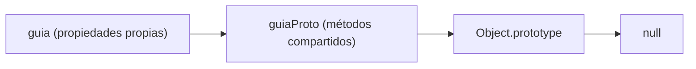
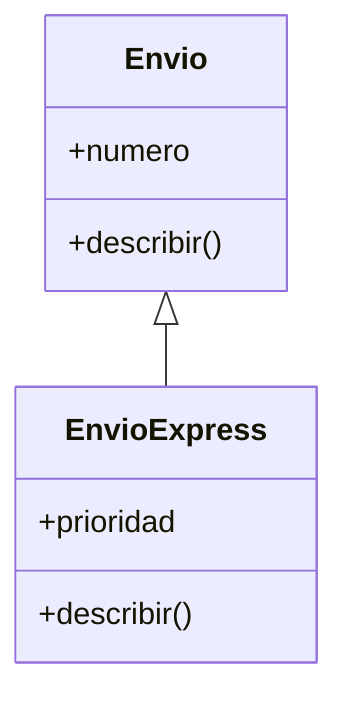
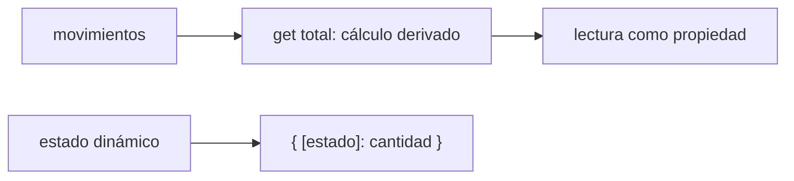
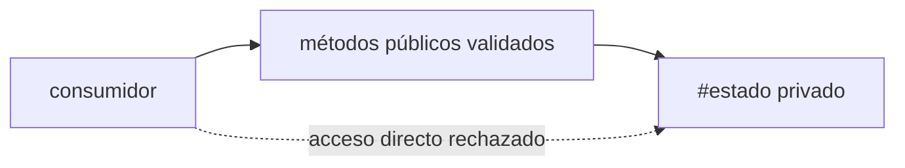

# Módulo 3: Objetos, prototipos y clases


## Aprende construyendo

### Tema 1: Prototype chain y Object.create

#### Paso 1 · Objetivo y preparación

Al finalizar podrás crear objetos que delegan métodos, recorrer su cadena y distinguir propiedades propias, heredadas y sombreadas.

**Conocimiento previo:** objetos, funciones, `this` y lectura de diagramas.

#### Paso 2 · Contexto y caso real

**¿Por qué es importante?** Varias entregas de RutaFlow comparten comportamiento. La delegación evita copiar el mismo método y explica el mecanismo real que después utiliza `class`.

#### Paso 3 · Teoría con analogía

**Conceptos clave:** prototipo, cadena de prototipos, herencia por delegación, `Object.create`.

Todo objeto en JavaScript tiene un enlace interno (accesible mediante `Object.getPrototypeOf()`, e internamente conocido como `[[Prototype]]`) hacia otro objeto, llamado su prototipo, del cual hereda propiedades y métodos por delegación: cuando se accede a una propiedad que no existe directamente en el objeto, el motor de JavaScript busca automáticamente en su prototipo, y si tampoco está ahí, continúa subiendo por la cadena de prototipos hasta llegar a `Object.prototype` (el prototipo raíz de prácticamente todos los objetos), o hasta encontrar la propiedad, o hasta llegar a `null` (el final de la cadena) sin encontrarla, devolviendo entonces `undefined`.

`Object.create(prototipo)` es la forma más directa y explícita de crear un objeto con un prototipo específico elegido deliberadamente: `Object.create(animalProto)` crea un objeto nuevo cuyo prototipo es exactamente `animalProto`, heredando por delegación cualquier método definido ahí (como `hablar()`), sin necesidad de copiar ese método individualmente a cada instancia. Esta es la diferencia fundamental entre herencia por delegación (JavaScript) y herencia por copia (otros modelos): el método `hablar()` existe en un único lugar (`animalProto`), y cada objeto que lo hereda simplemente delega la búsqueda hacia ese lugar compartido en tiempo de ejecución, en vez de tener su propia copia independiente del método.

Es importante notar que la cadena de prototipos afecta la lectura de propiedades pero no su escritura: asignar una propiedad a un objeto (`perro.nombre = "Rex"`) siempre crea (o sobreescribe) esa propiedad directamente en el objeto mismo, sin modificar el prototipo compartido; solo cuando se lee una propiedad que no existe directamente en el objeto, el motor consulta el prototipo. Esto explica por qué modificar un método en el prototipo compartido (`animalProto.hablar = function() {...}`) afecta instantáneamente a todos los objetos que lo heredan (porque todos delegan a la misma referencia compartida), mientras que asignar una propiedad directamente en una instancia específica no afecta a ninguna otra instancia.

Este modelo de "herencia por delegación" es fundamentalmente distinto del modelo de "herencia por clase" presente en lenguajes como Java o C++, donde una instancia recibe una copia completa de la estructura definida por su clase en el momento de su creación. En JavaScript, incluso cuando se usa la sintaxis de `class` (Tema 2), el mecanismo subyacente sigue siendo exactamente este mismo sistema de prototipos: `class` es, literalmente, una capa de sintaxis más legible construida encima del mismo mecanismo de prototipos que `Object.create` expone directamente.

**Analogía:** la cadena de prototipos es como un sistema de bibliotecas conectadas: si un libro que buscas no está en tu biblioteca local (el objeto), automáticamente se consulta la biblioteca regional conectada (su prototipo), y si tampoco está ahí, se consulta la biblioteca nacional (el prototipo del prototipo), y así sucesivamente, sin que ninguna biblioteca individual necesite tener una copia física de cada libro disponible en el sistema completo.

**¿Por qué es importante?** Entender la cadena de prototipos como delegación (no como copia) es la base conceptual indispensable para entender qué es realmente `class` en JavaScript, y para depurar correctamente comportamientos donde una propiedad "aparece" en un objeto sin haber sido asignada directamente ahí.

**Diagrama:**



#### Paso 4 · Demostración guiada desde cero

Desde una carpeta vacía crea `ejemplo-prototipos`, ejecuta `npm init -y`, crea `src` y después `src/prototipos.js`:

```bash
mkdir ejemplo-prototipos
cd ejemplo-prototipos
npm init -y
mkdir src
```

```javascript
const guiaProto = {
  describir() { // se comparte y usa la instancia receptora
    return `${this.numero}: ${this.estado}`;
  },
};

const guia = Object.create(guiaProto);
guia.numero = 'RF-40';
guia.estado = 'creado';

console.log(guia.describir());
console.log(Object.hasOwn(guia, 'describir'));
console.log(Object.getPrototypeOf(guia) === guiaProto);
```

```bash
node src/prototipos.js
```

**Resultado esperado:** `RF-40: creado`, `false` y `true`.

**Fallo deliberado:** asigna `guia.describir = 'texto'` y vuelve a invocarla. El `TypeError` ocurre porque una propiedad propia sombrea el método heredado; elimina esa propiedad para recuperar la delegación.

#### Construcción RutaFlow: delegación visible

Crea `academia-javascript/src/prototipos.js` con `guiaProto.describir` y dos objetos creados mediante `Object.create`. Ejecuta `node src/prototipos.js`; verifica con `hasOwn`, `Object.getPrototypeOf` y conteo que el método vive una sola vez en el prototipo.

Asigna `describir` solo a una instancia para observar *shadowing* sin modificar el prototipo. Después cambia el método compartido y comprueba que la otra instancia delega a la nueva versión. Recorre la cadena hasta `null`. RutaFlow usa prototipos para comprender el lenguaje, no para mutar prototipos globales ni extender `Object.prototype`.

#### Paso 5 · Práctica guiada

Crea dos guías y modifica `guiaProto.describir`. **Pista:** predice cuáles observan el cambio si una de ellas tiene un método propio.

#### Paso 6 · Práctica independiente

Implementa `imprimirCadena(objeto)` que liste cada nivel hasta `null`, sin usar `__proto__`. Explica en qué nivel vive `toString`.

#### Paso 7 · Cierre y evidencia

Ya entiendes herencia como delegación dinámica. El siguiente tema expresa el mismo mecanismo con sintaxis de clases. **Evidencia:** demuestra el resultado inicial, el shadowing, el cambio compartido y la cadena completa. Fuente oficial: [MDN — inheritance and prototype chain](https://developer.mozilla.org/es/docs/Web/JavaScript/Inheritance_and_the_prototype_chain).

**Errores comunes:** confundir delegación con copia; modificar `Object.prototype`; usar `__proto__`; asumir que escribir una propiedad cambia el prototipo.

### Tema 2: class, extends y super

#### Paso 1 · Objetivo y preparación

Al finalizar podrás implementar una jerarquía pequeña con `class`, `extends` y `super`, y decidir cuándo composición representa mejor el dominio.

**Conocimiento previo:** prototype chain, `this`, constructores y validación.

#### Paso 2 · Contexto y caso real

**¿Por qué es importante?** RutaFlow posee envíos normales y expresos. Heredar solo es correcto si el subtipo conserva todo el contrato del envío base; una característica opcional suele modelarse mejor con composición.

#### Paso 3 · Teoría con analogía

**Conceptos clave:** azúcar sintáctica sobre prototipos, herencia con `extends`, `super`.

La sintaxis `class`, introducida en ES6, no crea un mecanismo de herencia nuevo o distinto del sistema de prototipos ya existente: es, precisamente, "azúcar sintáctica" (una forma más legible de escribir algo que ya era posible antes, de forma más verbosa, con funciones constructoras y manipulación manual de `prototype`). Cuando se define `class Animal { constructor(nombre) { this.nombre = nombre; } hablar() {...} }`, el método `hablar` se almacena internamente en `Animal.prototype`, exactamente en el mismo lugar donde se habría colocado manualmente con la sintaxis de funciones constructoras anterior a ES6, y cada instancia creada con `new Animal(...)` hereda ese método por la misma delegación de prototipos descrita en el Tema 1.

`extends` establece la relación de herencia entre clases, configurando internamente que el prototipo de la clase hija apunte a un objeto cuyo prototipo, a su vez, es el prototipo de la clase padre, formando una cadena de prototipos de dos (o más) niveles. `class Perro extends Animal {...}` significa que las instancias de `Perro` heredan tanto los métodos definidos directamente en `Perro` como los heredados de `Animal`, resolviéndose por la misma búsqueda ascendente en la cadena de prototipos.

`super` cumple dos funciones distintas según el contexto donde se usa: dentro del `constructor` de una clase hija, `super(argumentos)` invoca el `constructor` de la clase padre (obligatorio invocarlo antes de usar `this` en el constructor de la hija, una regla estricta impuesta por el lenguaje); dentro de un método normal de la clase hija, `super.metodo()` invoca explícitamente la versión de ese método definida en la clase padre, permitiendo "extender" el comportamiento heredado en vez de reemplazarlo completamente (como se ve en `Perro.hablar()`, que invoca `super.hablar()` y añade contenido adicional al resultado).

Comparar la implementación de una jerarquía `Animal`/`Perro` usando funciones constructoras con `.prototype` (el estilo anterior a ES6) frente a la misma jerarquía usando `class` es un ejercicio revelador: ambas producen exactamente el mismo comportamiento en tiempo de ejecución y la misma estructura de cadena de prototipos, confirmando de forma tangible que `class` es, efectivamente, solo una forma más legible de expresar el mismo mecanismo subyacente, sin introducir ningún modelo de herencia fundamentalmente nuevo.

**Analogía:** `class` es como un formulario estandarizado y con plantilla clara para rellenar una solicitud, mientras que la sintaxis anterior de funciones constructoras y `.prototype` es como rellenar la misma solicitud a mano libre en una hoja en blanco: el contenido final que se procesa (el mecanismo de prototipos) es exactamente el mismo, pero el formulario estandarizado (`class`) es más legible y menos propenso a errores de formato.

**¿Por qué es importante?** Entender que `class` es azúcar sintáctica sobre prototipos, no un mecanismo nuevo, evita concepciones erróneas sobre "clases verdaderas" al estilo Java, y prepara el terreno para entender por qué ciertos comportamientos de JavaScript (como la delegación dinámica de métodos) difieren de lenguajes con clases en sentido más tradicional.

**Diagrama:**



#### Paso 4 · Demostración guiada desde cero

Desde una carpeta vacía crea `ejemplo-clases`, ejecuta `npm init -y`, crea `src` y después `src/clases.js`:

```bash
mkdir ejemplo-clases
cd ejemplo-clases
npm init -y
mkdir src
```

```javascript
class Envio {
  constructor(numero) {
    if (!numero) throw new TypeError('Número requerido');
    this.numero = numero;
  }
  describir() { return `Envío ${this.numero}`; }
}

class EnvioExpress extends Envio {
  constructor(numero, prioridad) {
    super(numero); // inicializa this mediante el constructor base
    this.prioridad = prioridad;
  }
  describir() { return `${super.describir()} · prioridad ${this.prioridad}`; }
}

console.log(new EnvioExpress('RF-41', 'alta').describir());
```

```bash
node src/clases.js
```

**Resultado esperado:** `Envío RF-41 · prioridad alta`.

**Fallo deliberado:** usa `this.prioridad` antes de `super(numero)`. JavaScript lanza `ReferenceError` porque una clase derivada no dispone de `this` hasta ejecutar el constructor base.

#### Construcción RutaFlow: herencia con contrato real

Crea `academia-javascript/src/clases.js` con `Envio` y `EnvioExpress extends Envio`; usa `super` para validar número y ampliar `describir`. Ejecuta `node src/clases.js`; el resultado esperado incluye la descripción base y prioridad, y confirma que el método está en `Envio.prototype`.

Usa `this` antes de `super()` para reproducir `ReferenceError`; corrige el orden. Reemplaza herencia por composición de una política de prioridad y compara cuál modela mejor “tiene” frente a “es”. RutaFlow no crea jerarquías profundas: `extends` se usa solo cuando el subtipo respeta el contrato completo.

#### Paso 5 · Práctica guiada

Agrega `EnvioRefrigerado` con temperatura y extiende la descripción. **Pista:** llama `super` antes de tocar `this` y conserva la validación base.

#### Paso 6 · Práctica independiente

Refactoriza prioridad como objeto `politicaEntrega` inyectado en `Envio`. Compara pruebas, extensión y posibilidad de combinar refrigeración con prioridad; justifica herencia o composición.

#### Paso 7 · Cierre y evidencia

Ya sabes que `class` organiza prototipos y que `extends` expresa un contrato fuerte. El siguiente tema presenta valores derivados con getters. **Evidencia:** demuestra el resultado, el fallo antes de `super` y ambas alternativas de diseño. Fuente oficial: [MDN — classes](https://developer.mozilla.org/es/docs/Web/JavaScript/Reference/Classes).

**Errores comunes:** usar `this` antes de `super`; construir jerarquías profundas; confundir “tiene” con “es”; olvidar que los métodos continúan en el prototipo.

### Tema 3: Getters, setters y propiedades computadas

#### Paso 1 · Objetivo y preparación

Al finalizar podrás exponer valores derivados con getters, validar escrituras deliberadas y construir claves dinámicas sin duplicar estado.

**Conocimiento previo:** clases, arrays, objetos y métodos de transformación.

#### Paso 2 · Contexto y caso real

**¿Por qué es importante?** RutaFlow calcula peso total desde paquetes. Guardar simultáneamente paquetes y total permite que se contradigan; un getter deriva el valor desde una única fuente de verdad.

#### Paso 3 · Teoría con analogía

**Conceptos clave:** propiedades de acceso, `get`/`set`, claves computadas.

Un getter (`get nombre() {...}`) y un setter (`set nombre(valor) {...}`) definen propiedades que, aunque se acceden con la sintaxis normal de propiedad (`objeto.nombre`, sin paréntesis), en realidad ejecutan una función cada vez que se leen o se asignan respectivamente. Esto permite ejecutar lógica adicional de forma transparente para quien consume el objeto: un getter puede calcular un valor derivado sobre la marcha (en vez de almacenarlo y arriesgarse a que quede desincronizado), y un setter puede validar un valor antes de aceptarlo, como se ve en `CuentaBancaria`, donde el getter `saldo` expone el valor del campo privado `#saldo` de forma controlada, sin permitir asignación directa (no existe un `set saldo`, así que `cuenta.saldo = 1000` simplemente no tendría efecto o lanzaría error en modo estricto).

Las propiedades computadas permiten usar el valor de una variable (o el resultado de una expresión) como el nombre de una clave dentro de un objeto literal, usando la sintaxis de corchetes: `{ [clave]: valor }` crea una propiedad cuyo nombre es el valor de la variable `clave` en el momento de evaluar el literal, no literalmente el texto `"clave"`. Esto es especialmente útil cuando el nombre de una propiedad debe determinarse dinámicamente en tiempo de ejecución, por ejemplo al construir un objeto de conteo donde la clave es una palabra extraída de un texto que no se conoce de antemano.

`Object.groupBy()`, una adición relativamente reciente al lenguaje, resuelve directamente un patrón extremadamente común que antes requería escribir manualmente un `reduce`: agrupar los elementos de un array según el resultado de una función aplicada a cada uno, produciendo un objeto donde cada clave es un valor de agrupación posible y cada valor es un array de los elementos que pertenecen a ese grupo. `Object.fromEntries()` hace la operación inversa a `Object.entries()`: convierte un array de pares `[clave, valor]` de vuelta en un objeto, particularmente útil al combinarse con métodos de array como `map` o `filter` sobre las entradas de un objeto existente, antes de reconstruirlo.

Combinar destructuring anidado con estas herramientas permite extraer directamente valores de estructuras de datos complejas y profundamente anidadas en una sola expresión declarativa, evitando accesos manuales encadenados como `usuario.direccion.ciudad`, y en su lugar escribiendo `const { direccion: { ciudad } } = usuario;`, extrayendo directamente `ciudad` como una variable local independiente.

**Analogía:** un getter es como un cajero automático que, en vez de simplemente entregarte un saldo guardado estáticamente, recalcula ese saldo en tiempo real cada vez que lo consultas, garantizando que nunca esté desincronizado con las transacciones más recientes; una propiedad computada es como escribir una etiqueta para un archivador usando el contenido de un post-it que tienes en la mano, en vez de escribir el texto literal "post-it" en la etiqueta.

**¿Por qué es importante?** Getters/setters permiten exponer una interfaz de propiedad simple mientras se ejecuta lógica de validación o cálculo por detrás, y las propiedades computadas son indispensables para construir objetos dinámicamente a partir de datos cuya estructura no se conoce en tiempo de escritura del código.

**Diagrama:**



#### Paso 4 · Demostración guiada desde cero

Desde una carpeta vacía crea `ejemplo-propiedades`, ejecuta `npm init -y`, crea `src` y después `src/propiedades.js`:

```bash
mkdir ejemplo-propiedades
cd ejemplo-propiedades
npm init -y
mkdir src
```

```javascript
class Manifiesto {
  #paquetes = [];

  agregar(paquete) {
    if (!Number.isFinite(paquete.pesoKg) || paquete.pesoKg <= 0) {
      throw new TypeError('Peso positivo requerido');
    }
    this.#paquetes.push({ ...paquete });
  }

  get pesoTotal() { // se calcula al leer; no se almacena otra copia
    return this.#paquetes.reduce((total, paquete) => total + paquete.pesoKg, 0);
  }
}

const manifiesto = new Manifiesto();
manifiesto.agregar({ guia: 'RF-42', pesoKg: 2 });
manifiesto.agregar({ guia: 'RF-43', pesoKg: 1.5 });
console.log(manifiesto.pesoTotal);
```

```bash
node src/propiedades.js
```

**Resultado esperado:** `3.5`.

**Fallo deliberado:** agrega un setter `pesoTotal` que guarde otro valor y asigna `100`. Ahora paquetes y total pueden contradecirse. Elimina el setter: un dato derivado no debe admitir una escritura sin significado de dominio.

#### Construcción RutaFlow: valores derivados sin duplicación

Crea `academia-javascript/src/propiedades.js` con una clase `Manifiesto` cuyo getter `pesoTotal` calcule desde movimientos y un método validado para agregar. Agrupa guías por estado con claves computadas. Ejecuta `node src/propiedades.js`; el total debe actualizarse sin almacenar una segunda copia desincronizable.

Agrega un setter que acepte peso negativo para observar una invariante rota; elimínalo o valida mediante operación de dominio con nombre. Transforma entradas con `Object.entries`/`fromEntries` sin mutar el original. RutaFlow evita getters costosos o con efectos ocultos: leer una propiedad no debería realizar red ni escritura.

#### Paso 5 · Práctica guiada

Agrega el getter `cantidadPaquetes`. **Pista:** derívalo de `#paquetes.length`; no mantengas un contador adicional.

#### Paso 6 · Práctica independiente

Agrupa entregas por estado usando `{ [estado]: cantidad }` o `Object.groupBy` si tu runtime lo soporta. Implementa una alternativa compatible y compara el resultado sin mutar entradas.

#### Paso 7 · Cierre y evidencia

Ya distingues propiedades derivadas de operaciones que cambian estado. El siguiente tema impone esa frontera con campos privados. **Evidencia:** demuestra el resultado `3.5`, la contradicción deliberada, su corrección y la agrupación. Fuente oficial: [MDN — getters](https://developer.mozilla.org/es/docs/Web/JavaScript/Reference/Functions/get).

**Errores comunes:** ejecutar red dentro de un getter; almacenar un valor derivado; crear setters genéricos sin invariantes; asumir soporte universal de APIs recientes.

### Tema 4: Encapsulación con campos privados (#campo)

#### Paso 1 · Objetivo y preparación

Al finalizar podrás proteger una transición con `#campo`, exponer lectura controlada y diferenciar privacidad real de la convención `_campo`.

**Conocimiento previo:** clases, getters, errores y máquina de estados.

#### Paso 2 · Contexto y caso real

**¿Por qué es importante?** Una entrega de RutaFlow no debe convertirse en entregada dos veces ni saltarse reglas mediante asignación directa. El motor puede impedir el acceso al estado y obligar a usar operaciones válidas.

#### Paso 3 · Teoría con analogía

**Conceptos clave:** campos privados reales, diferencia con convención `_campo`, encapsulación impuesta por el motor.

Antes de la introducción de campos privados reales (sintaxis `#campo`) en una versión relativamente reciente del lenguaje, la única forma de señalar que una propiedad "debería" tratarse como privada era una convención puramente visual: anteponer un guion bajo (`_saldo`), sin ninguna protección real impuesta por el motor de JavaScript. Cualquier código externo podía acceder o modificar `instancia._saldo` directamente, sin ningún error ni restricción; la convención dependía enteramente de la disciplina voluntaria de quien consumía la clase, sin ninguna garantía técnica real.

Los campos privados con `#` son fundamentalmente distintos: son encapsulación real, impuesta directamente por el motor de JavaScript, no una simple convención de nomenclatura. Intentar acceder a `instancia.#saldo` desde fuera del cuerpo de la clase donde `#saldo` fue declarado no solo falla silenciosamente, sino que produce un `SyntaxError` en tiempo de análisis del código (no siquiera llega a ejecutarse), porque `#saldo` ni siquiera es una propiedad accesible mediante la sintaxis normal de acceso a propiedades fuera del scope léxico de la clase que lo define.

Esta diferencia tiene una implicación de diseño importante: los campos privados solo pueden accederse y modificarse a través de la interfaz pública que la propia clase decide exponer deliberadamente (métodos públicos, getters, setters), lo que fuerza a cualquier consumidor de la clase a pasar por las validaciones y la lógica que esos métodos públicos implementan, en vez de poder saltárselas accediendo directamente a la propiedad interna, como sí era técnicamente posible (aunque desaconsejado) con la convención `_saldo`.

Combinar campos privados con getters (Tema 3) es un patrón extremadamente común y recomendado: el campo permanece completamente inaccesible desde fuera (`#saldo`), mientras que un getter público (`get saldo()`) expone su valor de forma controlada y de solo lectura, sin exponer nunca una forma de asignación directa que evite las validaciones del método `depositar()`, garantizando así que el estado interno de cualquier instancia solo pueda cambiar a través de caminos explícitamente validados por la propia clase.

**Analogía:** la convención `_campo` es como un cartel de "prohibido el paso" colocado sobre una puerta sin cerradura, que cualquiera podría ignorar y cruzar de todas formas; un campo privado `#campo` es una puerta con una cerradura real cuya llave literalmente no existe fuera del edificio donde se definió, haciendo el acceso no autorizado no solo desaconsejado sino técnicamente imposible.

**¿Por qué es importante?** Los campos privados permiten diseñar clases con garantías reales de invariantes internas (por ejemplo, "el saldo nunca puede ser negativo"), algo que una simple convención de nomenclatura nunca pudo garantizar de forma técnica y verificable por el propio lenguaje.

**Diagrama:**



#### Paso 4 · Demostración guiada desde cero

Desde una carpeta vacía crea `ejemplo-encapsulacion`, ejecuta `npm init -y`, crea `src` y después `src/encapsulacion.js`:

```bash
mkdir ejemplo-encapsulacion
cd ejemplo-encapsulacion
npm init -y
mkdir src
```

```javascript
class Entrega {
  #estado;

  constructor(estado = 'EN_RUTA') { this.#estado = estado; }
  get estado() { return this.#estado; }

  confirmar() {
    if (this.#estado !== 'EN_RUTA') {
      throw new Error(`No se puede confirmar desde ${this.#estado}`);
    }
    this.#estado = 'ENTREGADA';
  }
}

const entrega = new Entrega();
entrega.confirmar();
console.log(entrega.estado);
```

```bash
node src/encapsulacion.js
```

**Resultado esperado:** `ENTREGADA`.

**Fallo deliberado:** llama `confirmar()` por segunda vez; recibe `No se puede confirmar desde ENTREGADA`. En `src/acceso-privado.js` intenta `entrega.#estado`: el archivo ni siquiera se analiza y produce `SyntaxError`.

#### Construcción RutaFlow: transición protegida por el motor

Crea `academia-javascript/src/encapsulacion.js` con `Entrega`, campo `#estado`, getter y método `confirmar` que valide la transición. Ejecuta `node src/encapsulacion.js`; debe pasar de `EN_RUTA` a `ENTREGADA` y rechazar una segunda confirmación.

En un archivo separado intenta `entrega.#estado` para observar `SyntaxError` durante análisis; no pongas ese acceso en el script principal porque impediría ejecutar todo. Compara `_estado` y demuestra que sí puede corromperse externamente. RutaFlow expone operaciones con lenguaje de dominio, no setters genéricos que evadan invariantes.

#### Paso 5 · Práctica guiada

Agrega `cancelar()` permitido solo desde `EN_RUTA`. **Pista:** concentra la transición dentro de la clase y prueba confirmar después de cancelar.

#### Paso 6 · Práctica independiente

Modela `CREADA → ASIGNADA → EN_RUTA → ENTREGADA` con métodos de dominio. Prueba cada transición válida y dos saltos inválidos sin añadir un setter público.

#### Paso 7 · Cierre y evidencia

Completaste objetos y clases con invariantes impuestas por el motor. El siguiente módulo transforma colecciones de entregas. **Evidencia:** demuestra el resultado, la segunda confirmación, el `SyntaxError`, la corrupción de `_estado` y la máquina completa. Fuente oficial: [MDN — private elements](https://developer.mozilla.org/en-US/docs/Web/JavaScript/Reference/Classes/Private_elements).

**Errores comunes:** confundir `_` con privacidad; probar sintaxis privada en el mismo archivo principal; exponer setters que evaden reglas; intentar acceder a privados desde subclases.

---


## Construcción guiada del capítulo

**Objetivo del laboratorio:** construir una jerarquía de clases con herencia real y encapsulación mediante campos privados, comparándola explícitamente con el modelo de prototipos subyacente.

**Requisitos previos:** Módulos 0-2 completados, entorno con soporte de campos privados (Node.js reciente o navegador moderno).

| Paso | Acción | Código | Explicación |
|---|---|---|---|
| 1 | Crear herencia con `Object.create` | Ver Tema 1 | Verifica que `hablar()` se hereda, no se copia |
| 2 | Definir `Animal` y `Perro extends Animal` | Ver Tema 2 | `Perro.hablar()` debe invocar `super.hablar()` |
| 3 | Añadir campo privado `#saldo` a `CuentaBancaria` | Ver Tema 4 | Expón un getter `saldo` y un método `depositar()` validado |
| 4 | Recorrer la cadena de prototipos | `Object.getPrototypeOf(instanciaDePerro)` repetidamente hasta `null` | Verifica que llega hasta `Object.prototype` |
| 5 | Crear una propiedad computada | `{ [claveDinamica]: valor }` | Verifica que la clave real es el valor de la variable, no su nombre literal |
| 6 | Comparar el estilo pre-ES6 con `class` | Implementa `Animal`/`Perro` con funciones constructoras y `.prototype` manualmente | Confirma que el comportamiento es idéntico al de `class` |

**Verificación:** el laboratorio se considera exitoso si `new Perro("Rex").hablar()` invoca correctamente el método heredado extendido con `super`, si `cuenta.#saldo` fuera de la clase produce un `SyntaxError`, y si la implementación pre-ES6 con `.prototype` produce exactamente el mismo comportamiento observable que la versión con `class`.

**Errores comunes y soluciones**

- **Olvidar invocar `super()` en el constructor de una clase hija antes de usar `this`.** JavaScript lanza un `ReferenceError` explícito si se intenta usar `this` antes de invocar `super()`; siempre invoca `super(...)` como la primera línea del constructor de la hija.
- **Confundir `_campo` (convención) con `#campo` (privado real) en términos de protección real.** Recuerda que `_campo` es solo una señal visual sin ninguna protección técnica; solo `#campo` es verdaderamente inaccesible desde fuera de la clase.
- **Intentar usar una propiedad computada sin corchetes.** `{ clave: valor }` crea una propiedad literalmente llamada `"clave"`; se necesita `{ [clave]: valor }` para que el nombre real sea el valor de la variable `clave`.

---
