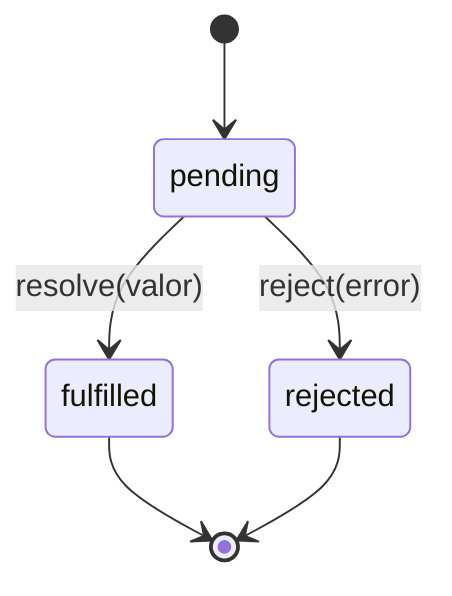
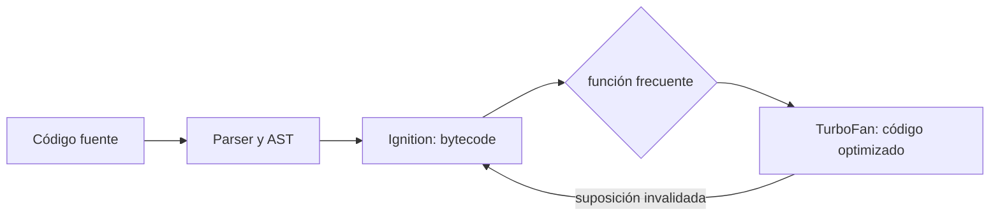
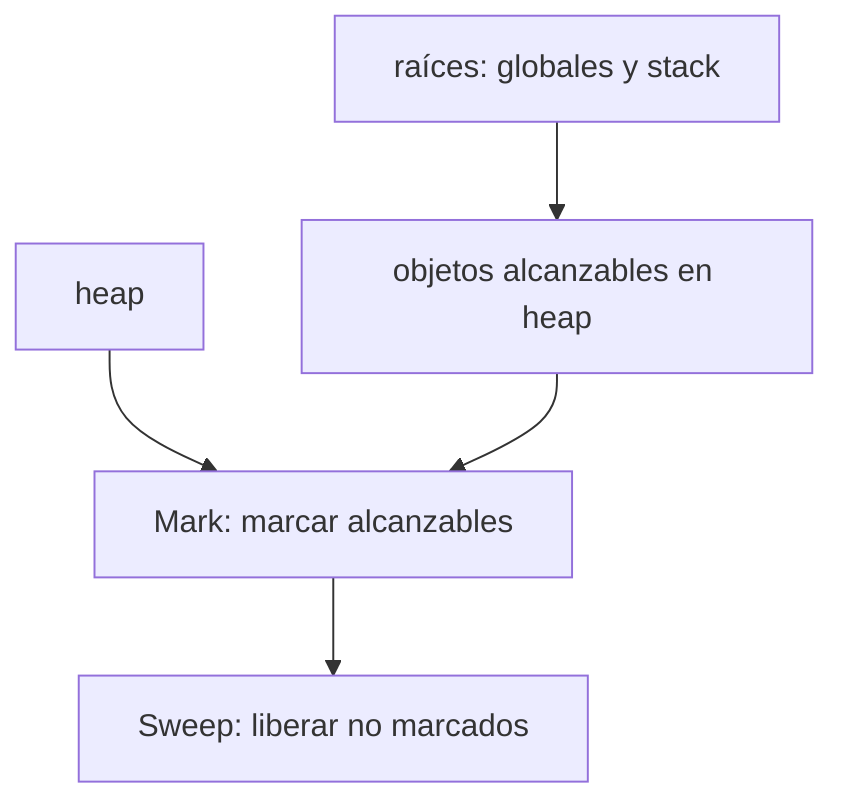

```mermaid
flowchart TD
    ASK{"¿Qué resultado necesita el llamador?"}
    ASK -->|"todos o ninguno"| ALL["Promise.all"]
    ASK -->|"reporte de cada operación"| SETTLED["Promise.allSettled"]
    ASK -->|"primera finalizada"| RACE["Promise.race"]
    ASK -->|"primera exitosa"| ANY["Promise.any"]
```

# Módulo 5: Asincronía I — Event Loop y Promesas


## Aprende construyendo

### Tema 1: El Event Loop

#### Paso 1 · Objetivo y preparación

Al finalizar podrás predecir el orden entre código síncrono, microtareas y tareas, y reconocer cuándo una operación bloquea el hilo.

**Conocimiento previo:** call stack, callbacks, temporizadores y funciones.

#### Paso 2 · Contexto y caso real

**¿Por qué es importante?** El proyecto combina confirmaciones de entrega, temporizadores y actualizaciones de pantalla. Sin el modelo del event loop, el orden observado parece aleatorio aunque siga reglas concretas.

#### Paso 3 · Teoría con analogía

**Conceptos clave:** single-threaded, no bloqueante, call stack, task queue, ciclo del Event Loop.

JavaScript ejecuta código en un único hilo: en cualquier instante, solo una pieza de código se está ejecutando activamente en el call stack (visto en el Módulo 2). Sin embargo, JavaScript no es un lenguaje bloqueante a pesar de esta limitación de un solo hilo, gracias al Event Loop: un mecanismo que coordina el call stack con colas de tareas pendientes, permitiendo que operaciones que tardan (peticiones de red, temporizadores, lectura de archivos en Node) se procesen sin congelar la ejecución del resto del programa mientras se espera su resultado.

El funcionamiento del Event Loop, en su forma más simplificada, sigue este ciclo continuo: primero, ejecuta todo el código síncrono actualmente en el call stack hasta que este queda completamente vacío; luego, antes de continuar con cualquier otra cosa, procesa y vacía completamente la cola de microtasks (las callbacks de Promesas resueltas); solo después de que la cola de microtasks queda completamente vacía, toma una única tarea de la cola de macrotasks (por ejemplo, un `setTimeout` cuyo tiempo ya expiró) y la ejecuta, repitiendo el ciclo completo desde el principio.

Esta secuencia estricta —código síncrono, luego TODAS las microtasks pendientes, luego UNA macrotask, y vuelta a empezar— explica un comportamiento que sorprende a quien aprende JavaScript por primera vez: un `console.log("1"); setTimeout(() => console.log("2"), 0); Promise.resolve().then(() => console.log("3")); console.log("4");` imprime, en este orden exacto, `1, 4, 3, 2`, no `1, 2, 3, 4` como el orden de aparición en el código podría sugerir ingenuamente. El código síncrono (`1` y `4`) se ejecuta primero por completo; luego la microtask de la Promesa (`3`) se procesa antes que la macrotask del `setTimeout` (`2`), incluso con un delay de `0` milisegundos, porque las microtasks siempre tienen prioridad total sobre las macrotasks en cada ciclo del Event Loop.

Comprender este orden con precisión no es un ejercicio académico abstracto: explica comportamientos reales y frecuentes en aplicaciones de producción, como por qué una actualización de estado basada en una Promesa puede procesarse antes que un temporizador programado previamente, o por qué anidar múltiples `.then()` puede retrasar inesperadamente cuándo se ejecuta finalmente un `setTimeout` que, en apariencia, se programó antes en el código.

**Analogía:** el Event Loop es como un camarero en un restaurante con una única persona atendiendo mesas (single-threaded): atiende completamente la mesa donde está en este momento (código síncrono), luego revisa y atiende TODOS los pedidos que ya están listos en la ventanilla de la cocina (microtasks) antes de aceptar una única mesa nueva de la fila de espera (una macrotask), y vuelve a repetir el ciclo completo.

**¿Por qué es importante?** Predecir correctamente el orden de ejecución asíncrona es esencial para depurar comportamientos inesperados en cualquier aplicación real que combine Promesas, temporizadores y eventos, que es prácticamente cualquier aplicación JavaScript no trivial.

**Diagrama:**


#### Paso 4 · Demostración guiada desde cero

Desde una carpeta vacía crea el ejemplo independiente y guarda `src/event-loop.js`:

```bash
mkdir ejemplo-event-loop
cd ejemplo-event-loop
npm init -y
mkdir src
```

```javascript
console.log('A: código síncrono');
setTimeout(() => console.log('B: tarea del temporizador'), 0);
Promise.resolve().then(() => console.log('C: microtarea'));
console.log('D: fin síncrono');
```

```bash
node src/event-loop.js
```

**Salida esperada:** A, D, C y B. La pila termina primero, después se vacían microtareas y finalmente entra la tarea del temporizador. **Fallo deliberado:** predice que B aparece antes que C por tener demora cero; ejecuta, compara y diagnostica la diferencia entre temporizador y microtarea.

#### Paso 5 · Práctica guiada

Añade otro `.then` dentro de la microtarea y una promesa dentro del temporizador. **Pista:** dibuja las colas y vacía todas las microtareas antes de escoger la siguiente tarea.

#### Paso 6 · Práctica independiente

Implementa un procesamiento de 50 000 guías en fragmentos usando `setTimeout` para ceder control. Compara cuánto tarda en responder un temporizador de interfaz con la versión bloqueante.

#### Paso 7 · Cierre y evidencia

Ya predices orden y distingues concurrencia de paralelismo. El siguiente tema representa resultados futuros con promesas. **Evidencia:** demuestra el resultado `A,D,C,B`, el fallo de predicción, el diagrama y la medición por fragmentos. Fuente oficial: [MDN — event loop](https://developer.mozilla.org/es/docs/Web/JavaScript/Event_loop).

**Errores comunes:** creer que delay cero es inmediato; procesar microtareas infinitas; confundir APIs del entorno con el lenguaje; asumir varios hilos para JavaScript normal.

### Tema 2: Promesas

#### Paso 1 · Objetivo y preparación

Al finalizar podrás crear y encadenar una promesa con caminos de éxito, rechazo y limpieza, sin ejecutar dos resultados lógicos.

**Conocimiento previo:** event loop, callbacks, errores y retornos tempranos.

#### Paso 2 · Contexto y caso real

**¿Por qué es importante?** Una consulta de entrega en este proyecto todavía no contiene una guía: contiene el compromiso de producirla o explicar un fallo. Confundir ambos valores genera accesos antes de tiempo y errores sin manejar.

#### Paso 3 · Teoría con analogía

**Conceptos clave:** estados de una promesa (pending/fulfilled/rejected), `new Promise`, `.then`/`.catch`.

Una Promesa representa un valor que estará disponible en algún momento futuro, encapsulando el resultado (aún desconocido) de una operación asíncrona en uno de tres estados posibles: `pending` (pendiente, el resultado aún no está disponible), `fulfilled` (cumplida, la operación tuvo éxito y hay un valor resultante disponible), o `rejected` (rechazada, la operación falló y hay una razón de error disponible). Una vez que una Promesa transiciona de `pending` a `fulfilled` o `rejected`, su estado queda fijo permanentemente; no puede volver a `pending` ni cambiar de un estado resuelto a otro, una garantía fundamental que hace el comportamiento de las Promesas predecible y componible.

Crear una Promesa manualmente con `new Promise((resolve, reject) => {...})` es útil principalmente para envolver APIs basadas en callbacks (el patrón anterior a las Promesas, dominante en el Node.js clásico) en una interfaz basada en Promesas: la función ejecutora recibe dos funciones, `resolve` y `reject`, y se invoca inmediata y síncronamente al crear la Promesa; invocar `resolve(valor)` dentro de esa función transiciona la Promesa a `fulfilled` con ese valor, mientras que invocar `reject(razon)` la transiciona a `rejected`. Este patrón de "promisificar" una API de callbacks es exactamente el mecanismo detrás de utilidades como `util.promisify` en Node.js.

`.then(callbackExito, callbackError)` registra callbacks que se ejecutarán cuando la Promesa se resuelva (en cualquiera de sus dos estados finales); `.catch(callbackError)` es azúcar sintáctica equivalente a `.then(undefined, callbackError)`, específicamente para manejar el caso de rechazo sin necesitar también manejar el éxito en la misma llamada. Encadenar múltiples `.then()` es posible porque cada `.then()` devuelve, a su vez, una nueva Promesa, que se resuelve con el valor que devuelve el callback (o se encadena automáticamente si el callback a su vez devuelve otra Promesa), permitiendo componer secuencias de operaciones asíncronas dependientes de forma lineal y legible.

Es importante distinguir claramente entre el momento en que se crea una Promesa (que ejecuta su función ejecutora de forma síncrona e inmediata) y el momento en que se resuelve (que puede ocurrir de forma asíncrona, mucho después, cuando la operación subyacente finalmente completa); esta distinción es la raíz de por qué las callbacks registradas con `.then()` siempre se ejecutan como microtasks, incluso si la Promesa ya estaba resuelta en el momento exacto de registrar el callback, nunca de forma síncrona e inmediata en esa misma línea de código.

**Analogía:** una Promesa es como un recibo que te entrega una tintorería al dejar ropa para lavar: el recibo (la Promesa) existe inmediatamente, en estado "pendiente", y representa el compromiso de que en algún momento futuro la ropa (el valor) estará lista (`fulfilled`) o habrá un problema que impidió completarla (`rejected`); el estado final del recibo, una vez determinado, no vuelve a cambiar.

**¿Por qué es importante?** Las Promesas son la abstracción fundamental sobre la que se construye prácticamente toda la asincronía moderna en JavaScript, incluyendo `async`/`await` (Módulo 6), que es sintaxis construida directamente sobre este mismo mecanismo.

**Diagrama:**



#### Paso 4 · Demostración guiada desde cero

Desde una carpeta vacía crea el ejemplo independiente y guarda `src/promesa.js`:

```bash
mkdir ejemplo-promesa
cd ejemplo-promesa
npm init -y
mkdir src
```

```javascript
function buscarGuia(codigo) {
  return new Promise((resolve, reject) => {
    if (!codigo.startsWith('RF-')) return reject(new Error('código inválido'));
    resolve({ codigo, estado: 'EN_RUTA' });
  });
}

buscarGuia('RF-101')
  .then(guia => console.log(guia.estado))
  .catch(error => console.error(error.message))
  .finally(() => console.log('consulta terminada'));
```

```bash
node src/promesa.js
```

**Resultado esperado:** `EN_RUTA` y `consulta terminada`. **Fallo deliberado:** usa `buscarGuia('101')`; la promesa se rechaza con `código inválido`, `catch` lo diagnostica y `finally` se ejecuta igualmente.

#### Paso 5 · Práctica guiada

Agrega `.finally(() => console.log('Carga finalizada'))`. **Pista:** debe ejecutarse tanto con `RF-101` como con `101`, sin transformar el valor ni ocultar el error.

#### Paso 6 · Práctica independiente

Envuelve una API de callback `buscar(numero, callback)` en una promesa. Prueba éxito, error y una implementación defectuosa que llama dos veces al callback; protege el contrato.

#### Paso 7 · Cierre y evidencia

Ya modelas una operación futura con estado final inmutable y cadenas claras. El siguiente tema coordina varias promesas. **Evidencia:** demuestra el resultado exitoso, el rechazo, `finally` y la adaptación del callback. Fuente oficial: [MDN — Promise](https://developer.mozilla.org/es/docs/Web/JavaScript/Reference/Global_Objects/Promise).

**Errores comunes:** envolver APIs que ya devuelven promesas; olvidar retornar una promesa dentro de `then`; capturar y ocultar errores; confundir promesa con valor resuelto.

### Tema 3: Promise.all, allSettled, race y any

#### Paso 1 · Objetivo y preparación

Al finalizar podrás seleccionar el combinador según la política de fallos y construir resultados parciales, timeout y primera respuesta exitosa.

**Conocimiento previo:** promesas, errores, arrays y `async` a nivel superior en módulos.

#### Paso 2 · Contexto y caso real

**¿Por qué es importante?** El proyecto consulta varias transportadoras para una entrega. Un fallo no crítico puede registrarse sin descartar éxitos, mientras una operación transaccional puede exigir que todo se complete.

#### Paso 3 · Teoría con analogía

**Conceptos clave:** combinadores de promesas, fallo total frente a resultados parciales, primera en resolver.

JavaScript ofrece cuatro combinadores estáticos para trabajar con múltiples Promesas simultáneas, cada uno con una semántica distinta ante el éxito y el fallo parcial. `Promise.all(promesas)` espera a que todas las promesas de la lista se resuelvan exitosamente, devolviendo un array con todos los resultados en el mismo orden que las promesas originales; sin embargo, si UNA sola de las promesas se rechaza, `Promise.all` se rechaza inmediatamente con esa razón, sin esperar a que las demás terminen, un comportamiento de "todo o nada" apropiado cuando genuinamente se necesita que todas las operaciones tengan éxito para que el resultado combinado tenga sentido.

`Promise.allSettled(promesas)` es la alternativa cuando se necesita el resultado de cada promesa independientemente de si tuvo éxito o falló: nunca se rechaza, y en su lugar siempre resuelve con un array de objetos, cada uno indicando `{status: "fulfilled", value: ...}` o `{status: "rejected", reason: ...}` según el resultado individual de cada promesa. Esto es apropiado cuando las operaciones son independientes entre sí y se desea procesar los éxitos parciales aunque algunas fallen, en vez de descartar todo el conjunto por el fallo de una sola.

`Promise.race(promesas)` resuelve (o rechaza) tan pronto como la primera de las promesas de la lista se resuelve o se rechaza, ignorando el resultado eventual de las demás; su aplicación práctica más común es implementar un timeout manual, corriendo una operación real "en carrera" contra una Promesa que se rechaza automáticamente tras un tiempo límite, de modo que la primera en completarse determina el resultado final. `Promise.any(promesas)`, la incorporación más reciente de las cuatro, resuelve tan pronto como CUALQUIERA de las promesas tiene éxito (ignorando los rechazos individuales), y solo se rechaza si TODAS las promesas fallan, siendo útil para escenarios como intentar la misma petición contra varios servidores espejo simultáneamente, aceptando el primero que responda con éxito.

Elegir el combinador correcto según la semántica real del problema —¿necesito que todo tenga éxito, o me basta con los resultados parciales, o solo necesito el primero en cualquier sentido, o el primero exitoso específicamente?— es una decisión de diseño que afecta directamente la robustez del código ante fallos parciales de operaciones concurrentes.

**Analogía:** `Promise.all` es como esperar a que todos los pasajeros de un grupo de viaje aborden el avión antes de despegar (si uno falta, el vuelo entero se cancela); `allSettled` es un chequeo de asistencia que anota quién llegó y quién no, sin cancelar nada; `race` es una carrera donde solo importa quién cruza la meta primero, sin importar si es descalificado después; `any` es una carrera donde se busca al primer corredor que termine legítimamente, ignorando a los descalificados.

**¿Por qué es importante?** Elegir el combinador incorrecto es una fuente común de bugs de robustez: usar `Promise.all` cuando en realidad se necesitaban resultados parciales tolerantes a fallos (que exigiría `allSettled`) puede hacer que un único fallo no crítico derribe una operación completa que, de otro modo, podría haber tenido éxito parcial.

**Diagrama:**



#### Paso 4 · Demostración guiada desde cero

Desde una carpeta vacía crea el ejemplo independiente y guarda `src/combinadores.js`:

```bash
mkdir ejemplo-combinadores
cd ejemplo-combinadores
npm init -y
mkdir src
```

```javascript
const ok = Promise.resolve('ubicación');
const falla = Promise.reject(new Error('foto no disponible'));

const resultados = await Promise.allSettled([ok, falla]);
console.log(resultados.map(resultado => resultado.status));

try {
  await Promise.all([ok, falla]);
} catch (error) {
  console.log('all rechazó:', error.message);
}
```

```bash
node src/combinadores.js
```

**Salida esperada:** `[ 'fulfilled', 'rejected' ]` y `all rechazó: foto no disponible`. **Fallo deliberado:** sustituye `allSettled` por `all` sin `try/catch`; Node mostrará un rechazo no manejado. Elige el combinador según si necesitas todos los resultados o fallo rápido.

#### Paso 5 · Práctica guiada

Implementa un timeout con `Promise.race([consulta, timeout])`. **Pista:** que `race` termine no cancela automáticamente la consulta perdedora; documenta esa diferencia.

#### Paso 6 · Práctica independiente

Consulta dos réplicas con `Promise.any`, captura `AggregateError` cuando ambas fallen y registra cada causa. Construye una tabla que justifique qué combinador usarías en cuatro casos del proyecto.

#### Paso 7 · Cierre y evidencia

Ya eliges combinadores por semántica de negocio y no por conveniencia. El siguiente tema observa cómo V8 analiza el código sin convertir detalles internos en reglas mágicas. **Evidencia:** demuestra el resultado parcial, el rechazo total, el timeout y `AggregateError`. Fuente oficial: [MDN — Promise concurrency](https://developer.mozilla.org/es/docs/Web/JavaScript/Reference/Global_Objects/Promise#promise_concurrency).

**Errores comunes:** creer que `race` cancela perdedores; usar `all` para tareas independientes; ignorar `AggregateError.errors`; confundir orden de resultados con orden de finalización.

### Tema 4: El motor V8 — JIT y AST

#### Paso 1 · Objetivo y preparación

Al finalizar podrás reconocer las etapas fuente→AST→bytecode→optimización y obtener evidencia sin asumir que una función fue optimizada.

**Conocimiento previo:** funciones, tipos, medición básica y Node.js.

#### Paso 2 · Contexto y caso real

**¿Por qué es importante?** El proyecto calcula miles de tarifas. Comprender V8 ayuda a medir con criterio, pero la corrección y un contrato estable importan más que perseguir microoptimizaciones no demostradas.

#### Paso 3 · Teoría con analogía

**Conceptos clave:** parseo a AST, compilación JIT, Ignition y TurboFan.

Cuando el motor V8 (usado tanto en Chrome como en Node.js) recibe código JavaScript, primero lo analiza sintácticamente (parsea) para producir un AST (Abstract Syntax Tree, árbol de sintaxis abstracta): una representación estructurada en forma de árbol del código fuente, donde cada nodo representa una construcción del lenguaje (una declaración de variable, una llamada a función, un operador), en vez del texto plano original. Este AST es la base sobre la que operan las siguientes etapas de procesamiento del motor.

V8 no interpreta el AST directamente de forma lenta en cada ejecución, ni tampoco compila todo el código a código máquina optimizado por adelantado (lo cual sería costoso para código que solo se ejecuta una vez); en cambio, usa una estrategia de compilación JIT (Just-In-Time, "justo a tiempo") de dos niveles. Ignition, el intérprete inicial de V8, genera y ejecuta rápidamente bytecode a partir del AST, permitiendo que el código empiece a ejecutarse casi inmediatamente sin esperar una compilación completa y costosa. Mientras el código se ejecuta, V8 monitorea qué funciones se invocan repetidamente con frecuencia ("funciones calientes"), y esas funciones específicas se envían a TurboFan, el compilador optimizador de V8, que las compila a código máquina altamente optimizado, aprovechando información recopilada durante la ejecución real (como los tipos concretos de los argumentos observados en la práctica) para generar código más eficiente que una compilación genérica sin esa información.

Un aspecto importante de esta estrategia es que las optimizaciones de TurboFan pueden "deoptimizarse" (revertirse) si las suposiciones sobre las que se basó la optimización dejan de cumplirse; por ejemplo, si una función optimizada asumiendo que siempre recibe números empieza de pronto a recibir strings, V8 puede revertir esa función a una versión no optimizada temporalmente, mientras recopila nueva información para volver a optimizarla de forma apropiada al nuevo patrón de uso observado. Esta es, precisamente, la razón práctica detrás de la recomendación de escribir funciones con formas de argumentos consistentes (por ejemplo, evitar que una misma función a veces reciba un número y otras veces un string para el mismo parámetro): ayuda a V8 a mantener sus optimizaciones estables sin deoptimizaciones repetidas.

Aunque como desarrollador de aplicaciones rara vez se interactúa directamente con estos detalles internos del motor, entender conceptualmente que existe esta capa de análisis (AST) y de compilación adaptativa en dos niveles (Ignition/TurboFan) proporciona un modelo mental útil para entender por qué el rendimiento de JavaScript puede variar según el patrón de uso del código, y por qué ciertas recomendaciones de rendimiento (formas consistentes de objetos, tipos consistentes de parámetros) tienen una justificación técnica real, no son solo convención arbitraria.

**Analogía:** Ignition es como un cocinero que prepara rápidamente cualquier plato solicitado usando una receta genérica flexible, sin optimizar nada de antemano; TurboFan es un cocinero especializado que, tras observar que un plato específico se pide con mucha frecuencia y siempre con los mismos ingredientes exactos, desarrolla una receta ultra optimizada específicamente para ese caso, aunque si de pronto llegan ingredientes distintos a los esperados, tiene que volver temporalmente a la receta genérica flexible mientras aprende el nuevo patrón.

**¿Por qué es importante?** Entender la compilación JIT en dos niveles explica por qué el rendimiento de JavaScript puede degradarse con patrones de código inconsistentes, y da contexto técnico real a recomendaciones de optimización que de otro modo parecerían arbitrarias.

**Diagrama:**



#### Paso 4 · Demostración guiada desde cero

Desde una carpeta vacía crea un ejemplo independiente que inspecciona el AST de `src/regla.js`:

```bash
mkdir ejemplo-ast
cd ejemplo-ast
npm init -y
npm install acorn
mkdir src
```

```javascript
// src/regla.js
export const tarifa = peso => peso * 2500;
```

```javascript
// src/ast.mjs
import { readFile } from 'node:fs/promises';
import { parse } from 'acorn';

const codigo = await readFile('src/regla.js', 'utf8');
const ast = parse(codigo, { ecmaVersion: 'latest', sourceType: 'module' });
console.log(ast.type, ast.body[0].type);
```

```bash
node src/ast.mjs
```

**Resultado esperado:** `Program ExportNamedDeclaration`. **Fallo deliberado:** elimina la flecha `=>` de `regla.js`; Acorn informa posición y token inesperado. El parser falla antes de que V8 pueda ejecutar la regla.

#### Paso 5 · Práctica guiada

Pega solo la función en [AST Explorer](https://astexplorer.net/) y localiza declaración, parámetros, condicional y retorno. **Pista:** cambia `function` por arrow y compara nodos, no resultados.

#### Paso 6 · Práctica independiente

Construye un benchmark con calentamiento, varias muestras y `performance.now()`. Compara entradas consistentes y mixtas sin concluir causalidad sobre TurboFan solo por una medición.

#### Paso 7 · Cierre y evidencia

Ya separas semántica ECMAScript de decisiones internas de V8. El siguiente tema mide objetos retenidos y cachés limitadas. **Evidencia:** demuestra el resultado, el error de tipo, ambos AST y una tabla de mediciones con limitaciones. Fuentes oficiales: [V8 — Ignition and TurboFan](https://v8.dev/docs) y [ESTree](https://github.com/estree/estree).

**Errores comunes:** usar un único tiempo; medir con logs dentro del bucle; atribuir toda diferencia al JIT; sacrificar validación por una optimización supuesta.

### Tema 5: Stack, Heap y Garbage Collection

#### Paso 1 · Objetivo y preparación

Al finalizar podrás identificar referencias que retienen objetos, implementar una caché limitada y medir memoria sin asumir cuándo se ejecutará el GC.

**Conocimiento previo:** call stack, objetos, `Map`, campos privados y ciclos.

#### Paso 2 · Contexto y caso real

**¿Por qué es importante?** El proyecto consulta muchas entregas. Una caché sin límite conserva cada objeto y el recolector no puede liberarlo mientras siga siendo alcanzable.

#### Paso 3 · Teoría con analogía

**Conceptos clave:** memoria Stack frente a Heap, Garbage Collection, Mark and Sweep, recolección generacional.

La memoria que un programa JavaScript usa en tiempo de ejecución se divide conceptualmente en dos regiones con propósitos distintos. El Stack (pila) almacena valores primitivos y referencias a objetos de forma muy eficiente, organizados exactamente según el orden del call stack (Módulo 2): cada frame de función tiene su propia porción de stack para sus variables locales primitivas, que se libera automáticamente y de forma instantánea en cuanto la función retorna. El Heap (montículo) es una región de memoria más grande y menos estructurada donde se almacenan los objetos, arrays y funciones (estructuras de tamaño variable y potencialmente compartidas entre múltiples referencias), cuya liberación no puede determinarse simplemente por el retorno de una función, porque un objeto puede seguir siendo referenciado desde múltiples lugares del programa después de que la función que lo creó haya terminado (precisamente el mecanismo detrás de los closures, Módulo 2).

Dado que los objetos en el Heap no se liberan automáticamente al terminar una función, JavaScript depende de un proceso llamado Garbage Collection (recolección de basura) para identificar y liberar la memoria de objetos que ya no son alcanzables desde ningún punto activo del programa. El algoritmo predominante, "Mark and Sweep" (marcar y barrer), funciona en dos fases: primero recorre todas las referencias alcanzables desde las "raíces" del programa (variables globales, el call stack actual) marcando cada objeto visitado como "vivo"; luego recorre todo el Heap y libera (barre) cualquier objeto que no fue marcado como vivo, es decir, que ya no es alcanzable desde ningún punto activo del programa, sin importar cuántas referencias circulares pudiera tener entre sí con otros objetos igualmente inalcanzables.

V8 implementa además una estrategia de recolección "generacional", basada en la observación empírica de que la mayoría de objetos creados en un programa típico tienen una vida extremadamente corta (variables temporales de una función que termina rápido), mientras que una minoría de objetos sobrevive mucho más tiempo (configuración global, cachés de larga duración). Por esta razón, V8 divide el Heap en una "generación joven" (escaneada con mucha frecuencia, de forma rápida, porque la mayoría de su contenido se descarta pronto) y una "generación vieja" (escaneada con mucha menor frecuencia, porque sus objetos ya demostraron sobrevivir varios ciclos de recolección de la generación joven, y es estadísticamente menos probable que se liberen pronto).

Comprender este modelo, aunque el desarrollador de aplicaciones rara vez interactúa con él directamente, explica por qué mantener referencias innecesarias a objetos grandes (por ejemplo, en un closure que vive más tiempo del necesario, o en una estructura de caché sin límite de tamaño) puede causar un crecimiento sostenido del uso de memoria de una aplicación, un problema conocido coloquialmente como "fuga de memoria", aunque JavaScript técnicamente sí tiene recolección automática de basura: el problema no es la ausencia de recolección, sino mantener referencias activas más tiempo del necesario, impidiendo que el recolector considere esos objetos como inalcanzables.

**Analogía:** el Stack es como una pila de bandejas de autoservicio que se retiran automáticamente en cuanto se termina de usarlas, en un orden estrictamente predecible; el Heap es como un gran almacén compartido donde se guardan objetos de tamaño variable que distintas personas pueden seguir necesitando por tiempos distintos e impredecibles, y periódicamente un equipo de limpieza (el recolector de basura) recorre el almacén completo, identifica qué artículos ya nadie reclama activamente, y los retira para liberar espacio.

**¿Por qué es importante?** Entender Stack, Heap y Garbage Collection da un modelo mental correcto de por qué ciertos patrones (closures de larga vida, cachés sin límite) pueden acumular uso de memoria, y por qué "fuga de memoria" en JavaScript significa "referencias innecesarias mantenidas activas", no "ausencia de recolección automática".

**Diagrama:**



#### Paso 4 · Demostración guiada desde cero

Desde una carpeta vacía crea el ejemplo independiente y guarda `src/memoria.js`:

```bash
mkdir ejemplo-memoria-js
cd ejemplo-memoria-js
npm init -y
mkdir src
```

```javascript
const original = { estado: 'CREADA' };
const alias = original;
alias.estado = 'EN_RUTA';
console.log(original.estado, original === alias);

function desbordar() {
  return desbordar();
}

try {
  desbordar();
} catch (error) {
  console.log(error.name);
}
```

```bash
node src/memoria.js
```

**Salida esperada:** `EN_RUTA true` y `RangeError`. Los objetos comparten identidad en el heap; las llamadas recursivas llenan la pila. **Fallo deliberado:** elimina el `try/catch`; el proceso termina con `Maximum call stack size exceeded`. No uses este ejemplo para medir el recolector: su ejecución no es determinista.

#### Paso 5 · Práctica guiada

Añade `obtener(numero)` que refresque el orden LRU. **Pista:** elimina y vuelve a insertar la entrada consultada; comprueba cuál se expulsa después.

#### Paso 6 · Práctica independiente

Implementa límites por cantidad y TTL, limpia el temporizador al cerrar y compara tres escenarios. Documenta referencias retenidas, política de expulsión y mediciones repetidas.

#### Paso 7 · Cierre y evidencia

Completaste asincronía inicial entendiendo ejecución y memoria. El siguiente módulo usa `async`/`await`, cancelación y reintentos. **Evidencia:** demuestra el resultado limitado, el crecimiento sin expulsión, la política LRU y la limpieza de TTL. Fuente oficial: [V8 — garbage collection](https://v8.dev/blog/trash-talk).

**Errores comunes:** creer que GC evita toda fuga; forzar conclusiones con una muestra; guardar listeners sin retirarlos; confundir stack de llamadas con memoria heap.

---


## Construcción guiada del capítulo

**Objetivo del laboratorio:** predecir y verificar experimentalmente el orden exacto de ejecución de un script con código síncrono, microtasks y macrotasks mezclados, y aplicar correctamente los combinadores de Promesas.

**Requisitos previos:** Módulos 0-4 completados, Node.js o consola del navegador, acceso a una API pública para pruebas (`https://jsonplaceholder.typicode.com`).

| Paso | Acción | Código | Explicación |
|---|---|---|---|
| 1 | Predecir el orden de un script mixto | `console.log`, `setTimeout(...,0)`, `Promise.resolve().then(...)` | Escribe tu predicción ANTES de ejecutar |
| 2 | Ejecutar y comparar con la predicción | Ejecuta el script del paso 1 | Corrige tu modelo mental si la predicción falló |
| 3 | Convertir un callback a Promesa | `new Promise((resolve, reject) => ...)` | Envuelve una función de callback clásica |
| 4 | Lanzar 3 fetch en paralelo con `Promise.all` | Mide el tiempo frente a hacerlos secuenciales con `await` | Verifica la ganancia real de paralelismo |
| 5 | Probar `Promise.allSettled` con un fallo intencional | Una de las 3 promesas debe rechazar deliberadamente | Verifica que las otras 2 completan de todas formas |
| 6 | Implementar una carrera con `Promise.race` | Petición real contra un timeout de 2 segundos | Verifica cuál gana según la latencia real |
| 7 | Dibujar el diagrama call stack → microtask → macrotask | Para un script con anidamiento de 2 niveles | Verifica el diagrama contra la ejecución real |

**Verificación:** el laboratorio se considera exitoso si la predicción del paso 1 (hecha antes de ejecutar) coincide con el resultado real tras corregir el modelo mental, y si `Promise.allSettled` del paso 5 efectivamente devuelve resultados de las 3 promesas (2 fulfilled, 1 rejected) sin lanzar ningún error global.

**Errores comunes y soluciones**

- **Asumir que `setTimeout(fn, 0)` ejecuta `fn` inmediatamente, antes que cualquier Promesa pendiente.** Recuerda: todas las microtasks pendientes se procesan completamente antes de cualquier macrotask, sin importar el delay de esta última.
- **Usar `Promise.all` cuando en realidad se necesitan resultados parciales tolerantes a fallos.** Cambia a `Promise.allSettled` si un fallo individual no debería descartar los resultados exitosos de las demás.
- **Olvidar que una Promesa rechazada sin `.catch()` produce una advertencia de "unhandled rejection".** Siempre maneja el caso de rechazo, ya sea con `.catch()` o con el bloque `catch` de `async`/`await` (Módulo 6).

---
