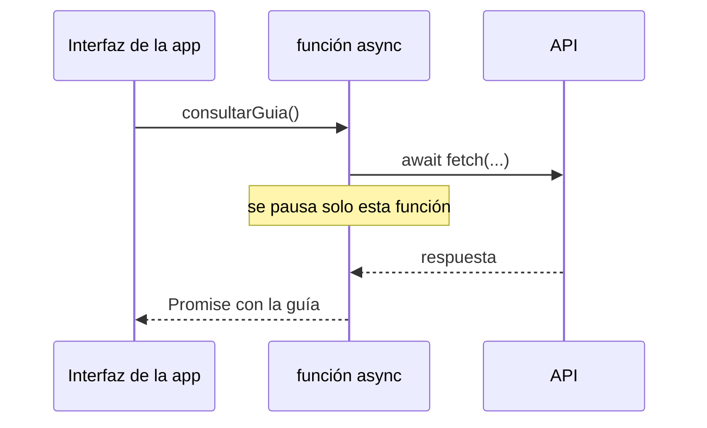

# Módulo 6: Asincronía II — async/await y fetch


## Aprende construyendo

### Tema 1: async/await sobre promesas

#### Paso 1 · Objetivo y preparación

Al finalizar podrás escribir flujos asíncronos legibles, distinguir dependencia de concurrencia y demostrar que `await` pausa una función, no el hilo.

**Conocimiento previo:** promesas, event loop, combinadores y funciones.

#### Paso 2 · Contexto y caso real

**¿Por qué es importante?** El proyecto consulta una entrega y después obtiene su ruta; esos pasos dependen entre sí. En cambio, dos guías independientes deben consultarse en paralelo para no sumar latencias.

#### Paso 3 · Teoría con analogía

**Conceptos clave:** azúcar sintáctica sobre Promesas, pausa no bloqueante, legibilidad secuencial.

`async`/`await`, introducido en ES2017, no es un mecanismo de concurrencia distinto de las Promesas estudiadas en el Módulo 5: es sintaxis construida directamente encima de ellas, diseñada para que el código asíncrono se lea de forma secuencial y familiar, en vez de encadenar múltiples `.then()`. Declarar una función con la palabra clave `async` garantiza que esa función siempre devuelve una Promesa (incluso si internamente retorna un valor simple, JavaScript lo envuelve automáticamente en una Promesa resuelta), y habilita el uso de `await` dentro de su cuerpo.

`await` pausa la ejecución de la función `async` (no del programa completo, ni del hilo único de JavaScript) hasta que la Promesa a su derecha se resuelve, devolviendo entonces el valor resuelto directamente como si fuera una expresión síncrona normal. Es fundamental entender que esta "pausa" no bloquea el hilo principal de ejecución: mientras la función `async` está pausada esperando un `await`, el Event Loop (Módulo 5) sigue libre para procesar otras tareas pendientes (otros eventos, otras funciones), y solo cuando la Promesa esperada se resuelve, la ejecución de esa función específica se reanuda, como una microtask.

Esta distinción —pausa de una función específica frente a bloqueo del hilo completo— es la razón por la que `async`/`await` no sacrifica ninguna de las propiedades no bloqueantes de JavaScript: es exactamente el mismo modelo de concurrencia basado en Promesas y en el Event Loop, simplemente expresado con una sintaxis que se lee de arriba a abajo como código síncrono tradicional, en vez de requerir seguir visualmente una cadena de callbacks anidados o de `.then()` encadenados.

Reescribir una cadena de `.then().then().catch()` como una función `async` con `try/catch` no cambia el comportamiento en tiempo de ejecución (ambas formas son, en el fondo, exactamente las mismas Promesas resolviéndose de la misma manera), pero mejora sustancialmente la legibilidad, especialmente cuando hay lógica condicional o manejo de errores intercalado entre pasos asíncronos sucesivos, un escenario donde el anidamiento de `.then()` puede volverse difícil de seguir visualmente.

**Analogía:** `async`/`await` es como leer una receta de cocina escrita en pasos secuenciales normales ("hierve el agua, luego añade la pasta, luego escurre"), en vez de la misma receta escrita como una cadena de instrucciones condicionales anidadas ("cuando el agua hierva, entonces añade la pasta, y cuando la pasta esté lista, entonces escurre"); el resultado final es idéntico, pero la primera forma se sigue con mucha menos carga cognitiva.

**¿Por qué es importante?** `async`/`await` es la forma dominante y recomendada de escribir código asíncrono en JavaScript moderno, y entender que es sintaxis sobre Promesas (no un mecanismo distinto) evita confusiones sobre cómo interactúa con el Event Loop y con los combinadores de Promesas del Módulo 5.

**Diagrama:**



#### Paso 4 · Demostración guiada desde cero

Desde una carpeta vacía crea el ejemplo independiente y guarda `src/consultas.js`:

```bash
mkdir ejemplo-async-await
cd ejemplo-async-await
npm init -y
mkdir src
```

```javascript
const esperar = (ms, valor) => new Promise(resolve => setTimeout(() => resolve(valor), ms));

async function consultarSecuencial() {
  const guia = await esperar(50, 'RF-101');
  const ruta = await esperar(50, `ruta-${guia}`);
  return ruta;
}

async function consultarEnParalelo() {
  return Promise.all([esperar(50, 'RF-101'), esperar(50, 'RF-102')]);
}

console.time('secuencial');
console.log(await consultarSecuencial());
console.timeEnd('secuencial');
console.time('paralelo');
console.log(await consultarEnParalelo());
console.timeEnd('paralelo');
```

```bash
node src/consultas.js
```

**Resultado esperado:** la secuencia tarda cerca de 100 ms y la consulta paralela cerca de 50 ms. **Fallo deliberado:** elimina `async` de `consultarSecuencial`; Node mostrará que `await` solo es válido dentro de una función async o en el nivel superior de un módulo. Restáuralo y explica que se pausa la función, no el hilo.

#### Paso 5 · Práctica guiada

Usa `Promise.all` para iniciar ambas consultas y mide cerca de 50 ms. **Pista:** crea las dos promesas antes de esperar sus resultados.

#### Paso 6 · Práctica independiente

Modela `consultarGuia → consultarRuta`, donde el segundo paso necesita el ID del primero. Combina esa secuencia con otra entrega independiente y dibuja dependencias y concurrencia.

#### Paso 7 · Cierre y evidencia

Ya usas `await` para dependencias y combinadores para concurrencia. El siguiente tema clasifica y propaga errores. **Evidencia:** demuestra el resultado, los dos tiempos y el flujo mixto. Fuente oficial: [MDN — async function](https://developer.mozilla.org/es/docs/Web/JavaScript/Reference/Statements/async_function).

**Errores comunes:** creer que `async` devuelve un valor directo; esperar operaciones independientes una por una; usar `await` fuera de contexto compatible; confundir pausa con bloqueo.

### Tema 2: try/catch en flujos asíncronos

#### Paso 1 · Objetivo y preparación

Al finalizar podrás convertir fallos de red, HTTP y datos en errores diferenciados, limpiar siempre el estado visual y conservar la causa técnica.

**Conocimiento previo:** `async`/`await`, `fetch`, excepciones y códigos HTTP.

#### Paso 2 · Contexto y caso real

**¿Por qué es importante?** Una entrega del proyecto puede fallar por conexión, por respuesta 404 o por JSON inválido. Mostrar “algo salió mal” para todos los casos impide actuar y diagnosticar.

#### Paso 3 · Teoría con analogía

**Conceptos clave:** captura de rechazos, manejo explícito de errores, propagación de excepciones asíncronas.

Dentro de una función `async`, un `await` sobre una Promesa que se rechaza lanza una excepción síncrona equivalente en el punto exacto del `await`, que puede capturarse con un bloque `try/catch` normal, exactamente igual que cualquier error síncrono. Esto es lo que permite que el manejo de errores asíncronos se exprese con la misma sintaxis familiar de manejo de errores síncronos, en vez de requerir un segundo argumento o un `.catch()` separado como en la cadena de Promesas tradicional.

Es crítico rodear con `try/catch` cualquier `await` cuya Promesa pueda rechazarse de forma esperada (por ejemplo, una petición de red que puede fallar por conectividad, o un servidor que puede responder con un código de error); omitir el manejo de errores en una función `async` no hace que el error desaparezca, sino que la Promesa devuelta por la función `async` completa se rechaza con esa misma razón, propagando la responsabilidad de manejarlo hacia quien haya invocado la función, y si nadie en la cadena lo maneja finalmente, se produce una advertencia de "unhandled promise rejection", el mismo problema mencionado en el Módulo 5 para Promesas no capturadas.

Un patrón común y recomendado es manejar el error lo más cerca posible del punto donde tiene sentido decidir qué hacer al respecto: mostrar un mensaje al usuario, reintentar la operación, o usar un valor por defecto, en vez de dejar que el error se propague silenciosamente hacia capas superiores del programa que quizás no tengan suficiente contexto para decidir la respuesta apropiada. `fetch` tiene una particularidad importante que sorprende a quien lo usa por primera vez: no rechaza la Promesa ante respuestas HTTP de error (404, 500); solo rechaza ante fallos de red genuinos (sin conexión, DNS no resuelto). Por esta razón, es necesario verificar explícitamente `respuesta.ok` (o el código `respuesta.status`) y lanzar un error manualmente si la respuesta indica un fallo, para que ese caso también sea capturado correctamente por el `try/catch`.

Combinar `try/catch` con un bloque `finally` es útil para ejecutar lógica de limpieza que debe ocurrir sin importar si la operación tuvo éxito o falló, como ocultar un indicador de carga que se mostró antes de iniciar la petición asíncrona, garantizando que ese indicador se oculte tanto en el camino de éxito como en el de error.

**Analogía:** `try/catch` alrededor de un `await` es como tener una red de seguridad instalada exactamente debajo de un tramo específico y conocido de un trapecio: si el artista (la operación asíncrona) cae en ese tramo exacto, la red lo atrapa ahí mismo; si no se instala ninguna red en ese tramo, la caída continúa hacia abajo (se propaga) hasta encontrar, si existe, una red instalada en un nivel inferior (un `try/catch` en una función que invocó a esta).

**¿Por qué es importante?** Manejar explícitamente los errores en cada punto de `await` que pueda fallar de forma esperada es la diferencia entre una aplicación que degrada de forma controlada ante fallos de red (mostrando un mensaje útil al usuario) y una que simplemente se rompe silenciosamente o produce errores no manejados en la consola.

**Código del ejemplo:**

#### Paso 4 · Demostración guiada desde cero

Desde una carpeta vacía crea `ejemplo-errores-async`:

```bash
mkdir ejemplo-errores-async
cd ejemplo-errores-async
npm init -y
mkdir src
```

```js
async function obtenerUsuarios() {
  try {
    const r = await fetch(url);
    if (!r.ok) throw new Error(`HTTP ${r.status}`); // fetch NO rechaza por 404/500 solo
    return await r.json();
  } catch (error) {
    console.error("Fallo:", error.message);
    return []; // valor por defecto controlado
  } finally {
    ocultarIndicadorDeCarga(); // se ejecuta siempre, éxito o error
  }
}
```

Guarda una versión ejecutable en `academia-javascript/src/errores-asincronos.js`, define allí `url` y reemplaza la limpieza visual por `console.log('Carga finalizada')`.

```bash
node src/errores-asincronos.js
```

**Resultado esperado:** con una URL válida devuelve datos y siempre imprime `Carga finalizada`.

**Fallo deliberado:** usa una ruta inexistente. `fetch` resuelve con una respuesta 404; solo `if (!r.ok) throw ...` la convierte en el error `HTTP 404` que captura el flujo.

#### Paso 5 · Práctica guiada

Crea `ErrorHttp` con propiedad `status`. **Pista:** conserva `cause` al envolver otro error y decide en una capa superior qué mensaje mostrar.

#### Paso 6 · Práctica independiente

Clasifica red, HTTP, JSON inválido y validación de dominio. Escribe un caso reproducible por categoría y demuestra que `finally` se ejecuta en todos sin devolver silenciosamente `[]` cuando eso oculte el fallo.

#### Paso 7 · Cierre y evidencia

Ya manejas errores donde existe contexto para decidir y propagas los demás con causa. El siguiente tema cancela solicitudes obsoletas. **Evidencia:** demuestra éxito, 404, datos inválidos y limpieza en todos los caminos. Fuente oficial: [MDN — try...catch](https://developer.mozilla.org/es/docs/Web/JavaScript/Reference/Statements/try...catch).

**Errores comunes:** asumir que fetch rechaza 404; capturar y devolver vacío siempre; perder la causa original; omitir `finally` para indicadores de carga.

### Tema 3: fetch API y AbortController

#### Paso 1 · Objetivo y preparación

Al finalizar podrás cancelar una petición obsoleta, distinguir cancelación intencional de error y evitar que una respuesta antigua sobrescriba la más reciente.

**Conocimiento previo:** `fetch`, promesas, `try/catch` y eventos de interfaz.

#### Paso 2 · Contexto y caso real

**¿Por qué es importante?** En este proyecto un operador puede buscar varias entregas rápidamente. Sin cancelación, una respuesta lenta de la primera búsqueda puede reemplazar el resultado correcto de la última.

#### Paso 3 · Teoría con analogía

**Conceptos clave:** `fetch`, `Response`, cancelación de peticiones en curso.

`fetch(url, opciones)` es la API estándar y moderna para realizar peticiones HTTP desde JavaScript, reemplazando a `XMLHttpRequest` (la API anterior, mucho más verbosa y basada en callbacks) en prácticamente todo código nuevo. `fetch` devuelve una Promesa que se resuelve con un objeto `Response`, del cual se puede extraer el cuerpo en distintos formatos (`.json()`, `.text()`, `.blob()`), cada uno de ellos también devolviendo, a su vez, una Promesa (porque leer el cuerpo completo de la respuesta es en sí mismo una operación potencialmente asíncrona, especialmente para respuestas grandes).

`AbortController` es el mecanismo estándar para cancelar una petición `fetch` en curso: se crea una instancia (`const controlador = new AbortController();`), se pasa su propiedad `signal` en las opciones de `fetch` (`fetch(url, { signal: controlador.signal })`), y en cualquier momento posterior se puede invocar `controlador.abort()` para cancelar la petición, lo que hace que la Promesa de `fetch` se rechace con un error cuyo `name` es `"AbortError"`, distinguible explícitamente de otros tipos de fallo de red en el bloque `catch`.

El caso de uso más común de `AbortController` es una interfaz de búsqueda en vivo: cada vez que el usuario escribe un nuevo carácter, se dispara una nueva petición de búsqueda, pero si la petición anterior aún está en curso cuando llega la nueva, cancelarla explícitamente evita que una respuesta desactualizada (correspondiente a una búsqueda anterior y ya obsoleta) llegue después que la respuesta de la búsqueda más reciente, y sobrescriba incorrectamente los resultados mostrados al usuario con datos obsoletos, un bug de "race condition" (condición de carrera) extremadamente común en interfaces de búsqueda mal implementadas sin cancelación explícita.

Combinar `AbortController` con `debounce` (visto en el Módulo 1) es un patrón robusto y frecuente: `debounce` evita disparar una petición nueva en cada pulsación de tecla individual, esperando una pequeña pausa en la escritura; `AbortController` cancela cualquier petición previa que aún esté en curso cuando efectivamente se dispara la siguiente, cubriendo conjuntamente tanto el problema de exceso de peticiones como el de respuestas desordenadas llegando fuera de secuencia.

**Analogía:** `fetch` sin `AbortController` es como enviar una carta por correo sin ninguna forma de interceptarla una vez enviada, incluso si te das cuenta después de que ya no la necesitas; `AbortController` es como tener la capacidad de llamar a la oficina de correos y cancelar el envío mientras la carta aún está en tránsito, antes de que llegue a su destino.

**¿Por qué es importante?** La cancelación explícita de peticiones evita condiciones de carrera donde una respuesta desactualizada sobrescribe una más reciente, un bug sutil y frecuente en interfaces de búsqueda o de filtrado dinámico sin esta protección.

**Código del ejemplo:**

#### Paso 4 · Demostración guiada desde cero

Desde una carpeta vacía crea `ejemplo-fetch-abort`:

```bash
mkdir ejemplo-fetch-abort
cd ejemplo-fetch-abort
npm init -y
mkdir src
```

```js
const controlador = new AbortController();
fetch(url, { signal: controlador.signal })
  .catch(error => {
    if (error.name === "AbortError") console.log("petición cancelada");
  });
// en una interacción posterior del usuario (nueva búsqueda):
controlador.abort(); // cancela la petición anterior en curso
```

Crea `academia-javascript/src/busqueda-cancelable.js` y usa una promesa controlada o servidor local lento para que la práctica sea determinista.

```bash
node src/busqueda-cancelable.js
```

**Resultado esperado:** al llamar `abort()` antes de completar aparece `petición cancelada`; no se muestra como fallo al usuario.

**Fallo deliberado:** elimina la cancelación y dispara búsqueda lenta `RF-1`, seguida de búsqueda rápida `RF-10`. La respuesta antigua puede escribirse al final y dejar datos obsoletos.

#### Paso 5 · Práctica guiada

Conserva un controlador activo y cancélalo antes de cada nueva búsqueda. **Pista:** crea otro controlador después de abortar; una señal abortada no puede reutilizarse.

#### Paso 6 · Práctica independiente

Combina debounce, cancelación y un contador de solicitud. Prueba respuesta fuera de orden, cancelación intencional y fallo real; solo el último debe mostrar error.

#### Paso 7 · Cierre y evidencia

Ya evitas actualizaciones obsoletas y distingues cancelación de fallo. El siguiente tema limita tiempo y reintenta solo operaciones seguras. **Evidencia:** demuestra el resultado cancelado, la carrera sin protección y la búsqueda final correcta. Fuente oficial: [MDN — AbortController](https://developer.mozilla.org/es/docs/Web/API/AbortController).

Cada campo de búsqueda o filtro en vivo del proyecto integrador (SPA sin framework, Módulo 12) necesitará este mismo par debounce + `AbortController` para no mostrar resultados obsoletos cuando el usuario escribe más rápido de lo que responde la API.

**Cuándo no usarlo:** para una petición única disparada por una acción explícita (un botón "Buscar", no cada tecla), cancelar peticiones previas no aporta nada porque no hay una petición anterior en curso que pueda quedar obsoleta; `AbortController` se justifica cuando el mismo tipo de petición puede dispararse varias veces antes de que la anterior responda.

**Errores comunes:** reutilizar una señal abortada; mostrar cancelación como error; creer que ignorar una respuesta cancela la red; no limpiar listeners asociados.

### Tema 4: Reintentos y timeouts manuales

#### Paso 1 · Objetivo y preparación

Al finalizar podrás aplicar timeout por intento, backoff exponencial con jitter y una política limitada de reintentos para operaciones idempotentes.

**Conocimiento previo:** `async`/`await`, `AbortController`, códigos HTTP y combinadores.

#### Paso 2 · Contexto y caso real

**¿Por qué es importante?** El proyecto debe recuperarse de una caída breve sin duplicar una confirmación de entrega ni saturar un servicio degradado. No todos los errores ni comandos son reintentables.

#### Paso 3 · Teoría con analogía

**Conceptos clave:** backoff exponencial, reintentos limitados, timeout con `Promise.race`.

Una función de reintentos automáticos (`fetchConReintentos`) mejora la robustez de una aplicación frente a fallos de red transitorios (una petición que falla ocasionalmente por una interrupción momentánea de conectividad, pero que probablemente tendría éxito si se intentara de nuevo unos instantes después). El patrón típico ejecuta la operación en un bucle acotado (con un número máximo de intentos, para evitar reintentar indefinidamente ante un fallo permanente), y entre cada intento fallido espera un tiempo antes de reintentar, típicamente con backoff (el tiempo de espera aumenta progresivamente en cada intento sucesivo, en vez de reintentar inmediatamente), para no sobrecargar un servidor que ya está teniendo problemas con reintentos inmediatos y repetidos.

Un timeout manual —limitar cuánto tiempo se está dispuesto a esperar una operación antes de considerarla fallida, aunque la operación en sí no tenga ningún mecanismo nativo de timeout— se implementa combinando `Promise.race` (visto en el Módulo 5) entre la operación real y una Promesa que se rechaza automáticamente tras un tiempo límite fijo usando `setTimeout`. Cualquiera de las dos que se resuelva primero determina el resultado: si la operación real termina antes del límite, su resultado gana la carrera; si el límite de tiempo se cumple primero, la Promesa de timeout gana, y el código trata ese caso como un fallo por tiempo excedido.

Combinar reintentos con timeout requiere cuidado en el orden de composición: normalmente se aplica el timeout a cada intento individual (para no esperar indefinidamente en un intento específico que esté colgado), y el bucle de reintentos envuelve esa combinación completa, de modo que si un intento individual excede su timeout, se cuenta como un fallo de ese intento específico y se procede al siguiente intento del bucle de reintentos, en vez de que el timeout aplique una sola vez al conjunto completo de todos los reintentos sumados.

Estas dos técnicas —reintentos con backoff y timeout manual— son extremadamente comunes en clientes de API de producción, y su ausencia es una causa frecuente de aplicaciones frágiles que fallan completamente ante cualquier interrupción transitoria de red, en vez de recuperarse automáticamente de forma silenciosa para el usuario final.

**Analogía:** el backoff en reintentos es como llamar por teléfono a alguien que no contesta: en vez de volver a marcar inmediatamente una y otra vez sin pausa (lo cual sería inútil e insistente), esperas un poco más cada vez antes de volver a intentar, dando tiempo a que la situación que impidió la respuesta se resuelva por sí sola. Un timeout manual es como decidir de antemano que, si nadie contesta después de cierto número de tonos, cuelgas y consideras la llamada fallida, en vez de esperar indefinidamente sin límite.

**¿Por qué es importante?** Reintentos con backoff y timeouts manuales son prácticas de robustez estándar en cualquier cliente de API de producción seria, protegiendo a la aplicación de fallos transitorios de red sin requerir intervención manual del usuario.

**Código del ejemplo:**

#### Paso 4 · Demostración guiada desde cero

Desde una carpeta vacía crea `ejemplo-reintentos`:

```bash
mkdir ejemplo-reintentos
cd ejemplo-reintentos
npm init -y
mkdir src
```

```js
async function fetchConReintentos(url, intentos = 3) {
  for (let i = 0; i < intentos; i++) {
    try {
      const r = await fetch(url);
      if (r.ok) return await r.json();
    } catch { /* reintenta */ }
    await new Promise(res => setTimeout(res, 300 * (i + 1))); // backoff
  }
  throw new Error("Falló tras varios intentos");
}

function conTimeout(promesa, ms) {
  const timeout = new Promise((_, rej) => setTimeout(() => rej(new Error("timeout")), ms));
  return Promise.race([promesa, timeout]);
}
```

Guarda el cliente en `academia-javascript/src/resiliencia.js`, instrumenta cada intento y ejecuta:

```bash
node src/resiliencia.js
```

**Resultado esperado:** como máximo tres intentos y un resultado o error final explícito.

**Fallo deliberado:** configura timeout de `1` ms. La carrera rechaza, pero la operación perdedora continúa si no recibe una señal; combina timeout con `AbortController` para cancelar trabajo real.

#### Paso 5 · Práctica guiada

Implementa espera `base * 2 ** intento + jitter`. **Pista:** inyecta la función aleatoria y el reloj para probar demoras sin esperar realmente.

#### Paso 6 · Práctica independiente

Clasifica red, 408, 429, 400 y 500; respeta `Retry-After`, limita presupuesto total y exige idempotencia para comandos. Escribe pruebas deterministas de éxito al tercer intento y fallo permanente.

#### Paso 7 · Cierre y evidencia

Ya aplicas resiliencia sin convertir reintentos en duplicación o tormenta de tráfico. El siguiente tema crea secuencias perezosas con generadores. **Evidencia:** demuestra el resultado, timeout cancelado, backoff inyectado y matriz de errores reintentables. Fuente oficial: [MDN — AbortSignal.timeout](https://developer.mozilla.org/en-US/docs/Web/API/AbortSignal/timeout_static).

**Errores comunes:** reintentar 400; omitir jitter; no cancelar el intento vencido; reintentar comandos no idempotentes; ignorar `Retry-After`.

### Tema 5: Generadores — function*, yield y yield*

#### Paso 1 · Objetivo y preparación

Al finalizar podrás construir una secuencia perezosa con `function*`, detenerla con `yield`, reanudarla con `.next()` y componerla con `yield*`. La aplicarás al proyecto para recorrer entregas por lotes sin crear todas las páginas en memoria.

**Conocimiento previo:** funciones, arrays, ciclos `for`, objetos y el protocolo iterable presentado en el módulo de colecciones. Si todavía no distingues un iterable de un iterador, repasa que el iterable puede producir un iterador y que `.next()` devuelve `{ value, done }`.

#### Paso 2 · Contexto y caso real

El panel de operaciones puede recibir miles de entregas. Convertirlas todas en páginas antes de usar la primera aumenta memoria y demora la primera respuesta. En este incremento del proyecto construiremos un paginador perezoso: cada lote se calcula únicamente cuando el consumidor lo solicita.

#### Paso 3 · Teoría, modelo mental y analogía

**Conceptos clave:** funciones generadoras, pausar y reanudar ejecución, iteradores personalizados.

Una función generadora, declarada con `function*` (asterisco después de la palabra clave `function`), tiene una capacidad única entre las funciones de JavaScript: puede pausar su propia ejecución en cualquier punto marcado con `yield`, devolviendo un valor en ese punto exacto, y reanudar su ejecución exactamente desde donde se pausó cuando se solicita el siguiente valor. Invocar una función generadora no ejecuta su cuerpo inmediatamente (a diferencia de una función normal); en cambio, devuelve un objeto iterador especial, y cada llamada a `.next()` sobre ese iterador ejecuta el cuerpo de la función hasta el siguiente `yield` (o hasta el final de la función), devolviendo un objeto `{value, done}` con el valor producido y un booleano que indica si el generador ya terminó.

Esta capacidad de pausar y reanudar ejecución hace a los generadores la herramienta idónea para implementar iteradores personalizados y flujos de datos que se producen de forma perezosa (uno a la vez, bajo demanda), en vez de generar una colección completa en memoria de antemano. Un generador que produce una secuencia infinita (por ejemplo, números de Fibonacci sin límite) es perfectamente viable, porque cada valor solo se calcula cuando efectivamente se solicita con `.next()`, sin necesidad de calcular ni almacenar toda la secuencia infinita de antemano, algo imposible con un array normal.

`yield*` delega la iteración a otro iterable (incluyendo otro generador), permitiendo componer generadores más pequeños en generadores más grandes, de forma similar a cómo `pipe` (Módulo 1) compone funciones más pequeñas en transformaciones más complejas. Los generadores también son la base conceptual sobre la que históricamente se construyeron algunas implementaciones tempranas de `async`/`await` (antes de que se estandarizara como sintaxis nativa del lenguaje), porque comparten la misma capacidad fundamental de pausar y reanudar ejecución en puntos específicos.

Aunque los generadores son una herramienta relativamente especializada en el uso cotidiano (comparado con `map`/`filter`/`async`/`await`, mucho más frecuentes en código de aplicación típico), aparecen en contextos específicos como la implementación de iteradores personalizados para estructuras de datos propias (haciendo que una clase propia sea compatible con `for...of`), y en bibliotecas de gestión de efectos asíncronos complejos como Redux-Saga en el ecosistema React.

**Analogía:** una función normal es como una película que, una vez que empieza a reproducirse, corre de principio a fin sin posibilidad de pausa intermedia controlada por quien la mira; una función generadora es como un video con capacidad de pausa en marcadores específicos predefinidos, donde cada vez que se pulsa "reproducir" de nuevo, continúa exactamente desde el marcador donde se pausó anteriormente, no desde el principio.

**¿Por qué es importante?** Los generadores permiten expresar secuencias perezosas e infinitas de forma natural, y son la base conceptual de mecanismos avanzados de control de flujo asíncrono en bibliotecas especializadas del ecosistema JavaScript.

#### Paso 4 · Demostración guiada

Desde una carpeta vacía crea `ejemplo-generadores`, ejecuta `npm init -y`, crea `src` y después `src/generadores.js`. El ejemplo valida primero el tamaño para que el ciclo siempre avance; después `yield` entrega una sola página y conserva internamente la posición `inicio` hasta la siguiente petición.

```bash
mkdir ejemplo-generadores
cd ejemplo-generadores
npm init -y
mkdir src
```

```js
function* paginarEntregas(entregas, tamano) {
  // La validación protege la condición de avance del ciclo.
  if (!Number.isInteger(tamano) || tamano <= 0) {
    throw new RangeError("tamano debe ser un entero mayor que cero");
  }

  for (let inicio = 0; inicio < entregas.length; inicio += tamano) {
    // yield pausa aquí; la siguiente iteración continúa después de esta línea.
    yield entregas.slice(inicio, inicio + tamano);
  }
}

const entregas = [
  { numero: "RF-101", prioridad: true },
  { numero: "RF-102", prioridad: false },
  { numero: "RF-103", prioridad: false },
];

const paginas = paginarEntregas(entregas, 2);
console.log("Primera solicitud:", paginas.next());
console.log("Segunda solicitud:", paginas.next());
console.log("Fin:", paginas.next());
```

Desde `academia-javascript`, ejecuta:

```bash
node src/generadores.js
```

**Resultado esperado:** la primera llamada contiene `RF-101` y `RF-102` con `done: false`; la segunda contiene `RF-103`; la tercera devuelve `{ value: undefined, done: true }`. Observa que llamar a `paginarEntregas` no ejecuta el cuerpo: el trabajo comienza con `.next()`.

**Fallo deliberado:** elimina temporalmente la validación y usa tamaño `0`. El incremento `inicio += tamano` nunca cambia `inicio`, por lo que el generador puede producir la misma página indefinidamente. Detén la ejecución, restaura el `RangeError` y confirma que el diagnóstico aparece antes de entrar al ciclo.

#### Paso 5 · Práctica guiada

Implementa `function* entregasOrdenadas(prioritarias, normales)` que delegue primero con `yield* prioritarias` y luego con `yield* normales`. **Pista:** `yield*` recibe cualquier iterable; no necesitas escribir dos ciclos ni copiar ambos arrays.

#### Paso 6 · Práctica independiente

Crea un generador infinito de números de guía `RF-000001`, `RF-000002`, etc., y una función que consuma solamente los primeros cinco. Explica por qué el programa no reserva memoria para una colección infinita y añade una prueba que verifique el quinto identificador.

#### Paso 7 · Cierre y evidencia

Ya puedes producir datos bajo demanda y reconocer cuándo un array completo es innecesario. El siguiente tema estudia cómo interceptar operaciones sobre objetos con Proxy y Reflect. **Evidencia:** entrega el archivo, demuestra la salida de las tres llamadas a `.next()`, el fallo controlado para tamaño cero y explica en qué línea se pausa y se reanuda el generador.

**Errores comunes:** creer que invocar la función ejecuta su cuerpo; ignorar `done`; crear un ciclo infinito sin limitar el consumo; usar un generador esperando paralelismo o comportamiento asíncrono; olvidar validar que el estado avance.

**Fuente oficial:** [MDN — Iterators and generators](https://developer.mozilla.org/en-US/docs/Web/JavaScript/Guide/Iterators_and_generators) y [MDN — `yield*`](https://developer.mozilla.org/en-US/docs/Web/JavaScript/Reference/Operators/yield*).

### Tema 6: Proxies y Reflect

#### Paso 1 · Objetivo y preparación

Al finalizar podrás interceptar lecturas y escrituras con `Proxy`, conservar la semántica del lenguaje mediante `Reflect` y decidir cuándo esta metaprogramación es adecuada. Protegerás el estado de una entrega del proyecto sin ocultar las reglas centrales del dominio.

**Prerrequisitos:** objetos, propiedades, funciones, excepciones y modo estricto. Recuerda que una asignación puede tener reglas internas —propiedades no escribibles, accesores o herencia— que no conviene reimplementar manualmente.

#### Paso 2 · Contexto y caso real

El proyecto recibe objetos desde formularios, almacenamiento local y APIs. En el borde de infraestructura queremos auditar cambios y rechazar estados desconocidos antes de que contaminen el proyecto. El Proxy funcionará como una frontera observable; las transiciones de negocio más complejas seguirán en métodos explícitos de la entrega.

#### Paso 3 · Teoría, modelo mental y analogía

**Conceptos clave:** intercepción de operaciones sobre objetos, traps (`get`/`set`/`has`), `Reflect`.

Un `Proxy` envuelve un objeto (llamado el "target") y permite interceptar y personalizar operaciones fundamentales sobre él —leer una propiedad, asignar una propiedad, comprobar si una propiedad existe con `in`, entre otras— mediante funciones llamadas "traps" (trampas), definidas en un segundo objeto llamado "handler". Por ejemplo, un trap `get` se ejecuta cada vez que se intenta leer cualquier propiedad del Proxy, permitiendo ejecutar lógica personalizada (registrar accesos, calcular valores derivados, lanzar validaciones) de forma completamente transparente para quien usa el objeto, sin que necesite saber que está interactuando con un Proxy en vez de con el objeto original directamente.

`Reflect` es un objeto global que expone, como métodos estáticos, exactamente las mismas operaciones fundamentales que los traps de `Proxy` interceptan, proporcionando la forma "por defecto" y estándar de realizar cada operación. Dentro de un trap de `Proxy`, es una práctica extremadamente común invocar el método correspondiente de `Reflect` para delegar hacia el comportamiento original si el trap no necesita modificarlo (por ejemplo, un trap `set` que solo necesita registrar un log antes de la asignación real invocaría `Reflect.set(target, propiedad, valor)` para efectivamente realizar la asignación tras registrar el log), evitando reimplementar manualmente la semántica exacta de esa operación fundamental.

Un caso de uso instructivo de Proxy es implementar validación transparente: un Proxy sobre un objeto de configuración cuyo trap `set` verifica que el valor asignado sea del tipo esperado antes de permitir la asignación, lanzando un error si no lo es, de forma completamente invisible para el código que simplemente asigna `configuracion.puerto = 8080` como si fuera un objeto normal, sin necesidad de llamar a un método de validación explícito por separado. Frameworks reactivos modernos (Vue.js, notablemente) usan Proxies internamente para detectar automáticamente cuándo cambia una propiedad de un objeto de estado y disparar actualizaciones de la interfaz de forma transparente, sin que el desarrollador necesite llamar manualmente a una función de notificación de cambio.

Aunque Proxy es una herramienta de uso relativamente avanzado y especializado (rara vez necesaria en código de aplicación cotidiano), entender su existencia y su propósito —interceptar y personalizar operaciones fundamentales sobre objetos de forma transparente— completa el panorama de las capacidades de metaprogramación de JavaScript, y ayuda a entender internamente cómo funcionan ciertos frameworks reactivos populares.

**Analogía:** un Proxy es como un asistente personal que intercepta todas las llamadas telefónicas dirigidas a ti (las operaciones sobre el objeto original), decide qué hacer con cada una según reglas personalizadas (los traps), y puede optar por pasarte la llamada exactamente como llegó (delegando con `Reflect`) o gestionarla de forma completamente distinta antes de responder.

**¿Por qué es importante?** Proxy y Reflect son la base de metaprogramación transparente en JavaScript, usada internamente por frameworks reactivos modernos para detectar cambios de estado automáticamente, un mecanismo que vale la pena entender conceptualmente aunque rara vez se implemente Proxies propios en código de aplicación típico.

#### Paso 4 · Demostración guiada

Desde una carpeta vacía crea `ejemplo-proxy`, ejecuta `npm init -y`, crea `src` y después `src/proxy.js`. El trap `set` valida una regla pequeña de frontera, registra el cambio y delega la asignación real a `Reflect.set`; el trap `get` conserva la lectura estándar.

```bash
mkdir ejemplo-proxy
cd ejemplo-proxy
npm init -y
mkdir src
```

```js
"use strict";

const estadosPermitidos = new Set(["CREADA", "EN_RUTA", "ENTREGADA"]);
const entrega = { numero: "RF-201", estado: "CREADA" };

const entregaAuditada = new Proxy(entrega, {
  set(target, propiedad, valor, receiver) {
    // Esta validación protege datos que llegan desde el borde de la aplicación.
    if (propiedad === "estado" && !estadosPermitidos.has(valor)) {
      throw new TypeError(`Estado no permitido: ${valor}`);
    }

    console.log(`AUDITORÍA ${String(propiedad)}: ${target[propiedad]} -> ${valor}`);
    // Reflect respeta accesores, herencia y el booleano real de la operación.
    return Reflect.set(target, propiedad, valor, receiver);
  },

  get(target, propiedad, receiver) {
    return Reflect.get(target, propiedad, receiver);
  },
});

entregaAuditada.estado = "EN_RUTA";
console.log(`${entregaAuditada.numero}: ${entregaAuditada.estado}`);
```

Desde `academia-javascript`, ejecuta:

```bash
node src/proxy.js
```

**Salida esperada:** primero aparece `AUDITORÍA estado: CREADA -> EN_RUTA` y después `RF-201: EN_RUTA`.

**Fallo deliberado:** cambia el estado a `"PERDIDA"`. Debes obtener `TypeError: Estado no permitido: PERDIDA` y el objeto original debe conservar `EN_RUTA`. Después sustituye temporalmente `return Reflect.set(...)` por `return false`: en modo estricto la asignación lanza `TypeError`, demostrando que el booleano del trap forma parte del contrato.

#### Paso 5 · Práctica guiada

Añade una lista `camposPermitidos` y rechaza la escritura de una propiedad desconocida como `estatus`. **Pista:** valida con `Reflect.has(target, propiedad)` antes de delegar; permite únicamente las excepciones que hayas definido de manera explícita.

#### Paso 6 · Práctica independiente

Construye un Proxy que cuente lecturas de `estado`, escribe pruebas para lectura, escritura válida e inválida y compara esta solución con un método explícito `entrega.cambiarEstado()`. Documenta por qué elegirías el método para reglas del negocio y el Proxy para observabilidad o adaptación en una frontera.

#### Paso 7 · Cierre y evidencia

Ahora distingues una intercepción transversal de una regla de dominio y sabes delegar sin romper invariantes. El próximo módulo organiza estas capacidades en módulos, herramientas y una aplicación mantenible. **Evidencia:** entrega el archivo y demuestra la salida correcta, el fallo por estado inválido y explica el resultado de reemplazar `Reflect.set` por `false`.

**Errores comunes:** esconder reglas esenciales dentro de traps difíciles de rastrear; olvidar devolver el booleano de `set`; violar invariantes de propiedades no configurables; provocar recursión leyendo el Proxy dentro de su propio trap; asumir que el Proxy y el objeto original tienen la misma identidad.

**Fuentes oficiales:** [MDN — Proxy](https://developer.mozilla.org/en-US/docs/Web/JavaScript/Reference/Global_Objects/Proxy) y [MDN — Reflect](https://developer.mozilla.org/en-US/docs/Web/JavaScript/Reference/Global_Objects/Reflect).

---


## Construcción guiada del capítulo

**Objetivo del laboratorio:** construir un cliente de API robusto que consuma una API pública con manejo de errores, cancelación, reintentos y timeout, usando `async`/`await` de principio a fin.

**Requisitos previos:** Módulos 0-5 completados, acceso a `https://jsonplaceholder.typicode.com`.

| Paso | Acción | Código | Explicación |
|---|---|---|---|
| 1 | Reescribir una cadena `.then()` como `async`/`try/catch` | Ver Tema 1 | Verifica comportamiento idéntico entre ambas formas |
| 2 | Consumir la API pública con `fetch` | `await fetch(".../users")` | Verifica `respuesta.ok` antes de parsear el JSON |
| 3 | Manejar un fetch que falla (URL inválida) | `try/catch` con mensaje claro al usuario | Distingue error de red de error HTTP |
| 4 | Implementar cancelación con `AbortController` | Ver Tema 3 | Simula una nueva búsqueda cancelando la anterior |
| 5 | Implementar `fetchConReintentos` | Ver Tema 4 | Verifica hasta 3 intentos con backoff creciente |
| 6 | Implementar timeout manual de 5 segundos | `conTimeout(fetch(url), 5000)` | Verifica que se rechaza si la petición excede el límite |

**Verificación:** el laboratorio se considera exitoso si el cliente maneja correctamente los tres escenarios de fallo (red caída, HTTP de error, timeout excedido), mostrando en cada caso un mensaje claro y distinto al usuario, sin ningún error no manejado en la consola.

### Comprueba lo construido

#### Ejercicio verificable 1

Ejecuta el ejemplo del Event Loop del módulo anterior y responde qué cola se vacía antes de tomar una macrotask.

**Pista:** las continuaciones de `await` usan la misma prioridad que `.then()`.

**Respuesta esperada:** microtasks|microtareas

#### Ejercicio verificable 2

Una API responde HTTP 404. Escribe la propiedad de `Response` que debes comprobar porque `fetch` no rechaza automáticamente.

**Pista:** es un booleano.

**Respuesta esperada:** ok|response.ok|respuesta.ok

#### Ejercicio verificable 3

Escribe el nombre exacto del error usado para reconocer una cancelación intencional de `fetch`.

**Pista:** se consulta en `error.name`.

**Respuesta esperada:** AbortError

**Errores comunes y soluciones**

- **Asumir que `fetch` rechaza automáticamente ante un 404 o 500.** `fetch` solo rechaza ante fallos de red genuinos; verifica siempre `respuesta.ok` explícitamente y lanza un error manualmente si es necesario.
- **Reintentar sin backoff, machacando el servidor con peticiones inmediatas repetidas.** Añade una espera creciente entre cada intento fallido.
- **Olvidar distinguir un `AbortError` de otros tipos de error en el `catch`.** Verifica `error.name === "AbortError"` para no tratar una cancelación intencional como un fallo real que deba mostrarse al usuario.

---
