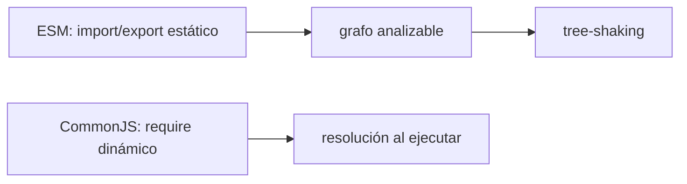
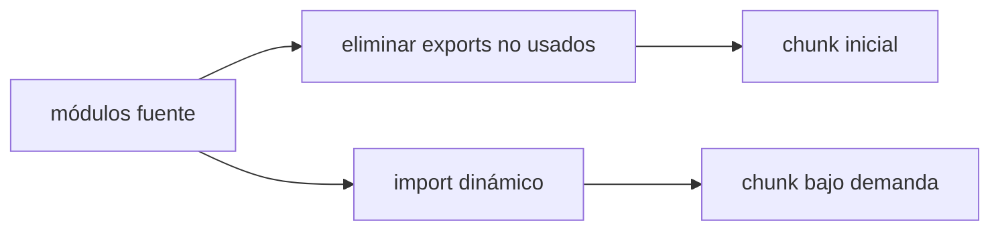
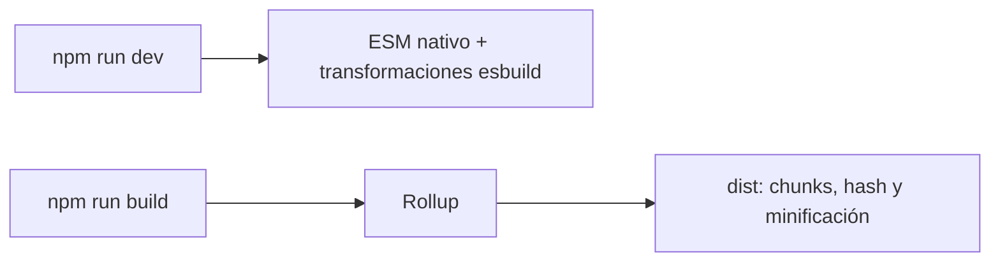
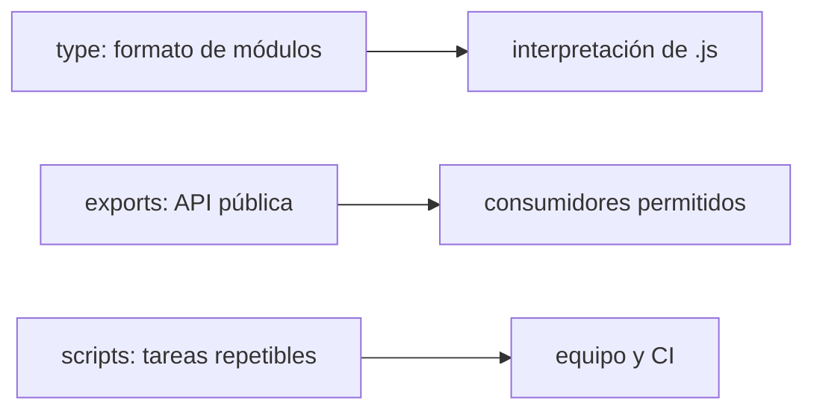
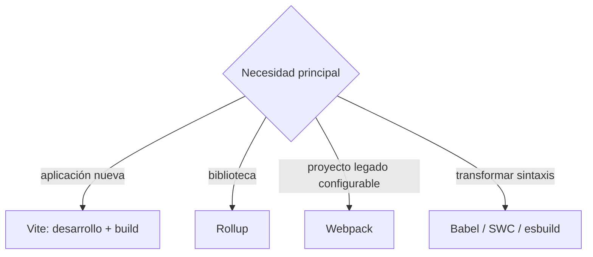

# Módulo 7: Módulos modernos y herramientas de build


## Aprende construyendo

### Tema 1: ESM frente a CommonJS

#### Paso 1 · Objetivo y preparación

Al finalizar podrás crear y ejecutar un proyecto modular con ESM, reconocer un módulo CommonJS y diagnosticar el error que aparece al mezclar ambos formatos. Separarás el dominio de entregas de RutaFlow de su punto de entrada mediante exports nombrados.

**Conocimiento previo:** funciones, objetos, rutas relativas y uso básico de la terminal. Necesitas Node.js 20 o posterior; compruébalo con `node --version`. Si el comando no existe, instala la versión LTS desde la fuente oficial antes de continuar.

#### Paso 2 · Contexto y caso real

Cuando toda la aplicación vive en un solo archivo, una modificación en reportes puede romper la creación de entregas. En este incremento del proyecto RutaFlow, `guia.js` será responsable del dominio y `main.js` de iniciar el programa. El contrato entre ambos será visible mediante `export` e `import`.

#### Paso 3 · Teoría, modelo mental y analogía

**Conceptos clave:** análisis estático frente a resolución dinámica, `import`/`export`, `require`/`module.exports`.

ESM (ECMAScript Modules, la sintaxis `import`/`export`) es el sistema de módulos estandarizado como parte del propio lenguaje JavaScript desde ES6, y tiene una propiedad fundamental que lo distingue de CommonJS: es estático y analizable en tiempo de build, sin necesidad de ejecutar el código. Las declaraciones `import`/`export` deben aparecer en el nivel superior de un módulo (no dentro de un `if` o una función condicional), lo que permite que una herramienta externa (como un bundler) analice el árbol completo de dependencias del proyecto sin ejecutar ni una sola línea de código, simplemente inspeccionando la estructura sintáctica de los `import`/`export`.

CommonJS (`require`/`module.exports`), el sistema de módulos que Node.js adoptó originalmente (antes de que ESM se estandarizara y Node añadiera soporte para él), resuelve las dependencias de forma dinámica, en tiempo de ejecución: `require(ruta)` puede aparecer condicionalmente dentro de un `if`, con una ruta calculada dinámicamente en tiempo de ejecución, lo cual es imposible de analizar completamente de antemano sin ejecutar el código. Esta flexibilidad dinámica de CommonJS tiene un coste directo: un bundler no puede determinar con certeza absoluta, sin ejecutar el código, exactamente qué se exporta y qué se usa de cada módulo, lo que limita significativamente las optimizaciones de tree-shaking que sí son posibles con ESM.

Determinar si un archivo se interpreta como ESM o como CommonJS depende de la configuración del proyecto: un `package.json` con `"type": "module"` hace que todos los archivos `.js` del proyecto se interpreten por defecto como ESM (permitiendo usar `import`/`export` directamente); sin esa configuración, `.js` se interpreta como CommonJS por defecto en Node, y hay que usar explícitamente la extensión `.mjs` para forzar la interpretación como ESM en un archivo individual, independientemente de la configuración general del proyecto (o `.cjs` para forzar CommonJS explícitamente en un proyecto configurado como ESM por defecto).

Aunque ambos sistemas coexisten en el ecosistema JavaScript actual (gran cantidad de código y bibliotecas legadas siguen usando CommonJS), la dirección clara de la industria y del propio lenguaje es hacia ESM como el sistema de módulos estándar y preferido para código nuevo, en gran parte precisamente por las ventajas de análisis estático que habilita, incluyendo el tree-shaking del Tema 2.

**Analogía:** ESM es como una lista de ingredientes impresa y fija en el envase de un producto, visible y verificable sin necesidad de abrir el paquete ni cocinar nada; CommonJS es como una receta que decide qué ingredientes usar en el momento mismo de cocinar, potencialmente de forma distinta cada vez según condiciones que solo se conocen al momento de la preparación real, imposibilitando verificar de antemano exactamente qué ingredientes se usarán sin ejecutar la receta completa.

**¿Por qué es importante?** Entender la diferencia de análisis estático frente a dinámico entre ESM y CommonJS explica directamente por qué el tree-shaking funciona de forma mucho más confiable con ESM, una consideración práctica relevante al elegir el formato de las propias bibliotecas o al configurar un proyecto nuevo.

**Diagrama:**



#### Paso 4 · Demostración guiada desde cero

Desde una carpeta vacía crea `ejemplo-esm-cjs` y su estructura:

```bash
mkdir ejemplo-esm-cjs
cd ejemplo-esm-cjs
npm init -y
mkdir src
```

Crea esta estructura; la extensión `.js` del import es obligatoria para que Node resuelva el archivo de forma inequívoca:

```text
rutaflow-web/
├── package.json
└── src/
    ├── dominio/
    │   └── guia.js
    └── main.js
```

Guarda en `rutaflow-web/package.json`:

```json
{
  "name": "rutaflow-web",
  "private": true,
  "type": "module",
  "scripts": { "start": "node src/main.js" }
}
```

Guarda en `rutaflow-web/src/dominio/guia.js`:

```js
// Export nombrado: el consumidor conoce el nombre del contrato.
export const ESTADOS = Object.freeze({ CREADA: "CREADA" });

export function crearGuia(numero) {
  // El dominio construye un objeto válido; no imprime ni lee la terminal.
  if (!numero?.trim()) throw new TypeError("numero es obligatorio");
  return { numero, estado: ESTADOS.CREADA };
}
```

Guarda en `rutaflow-web/src/main.js`:

```js
// La ruta incluye la extensión porque este archivo se ejecuta directamente en Node.
import { crearGuia } from "./dominio/guia.js";

const guia = crearGuia("RF-101");
console.log(guia);
```

Ejecuta desde `rutaflow-web`:

```bash
npm start
```

**Resultado esperado:** `{ numero: 'RF-101', estado: 'CREADA' }`. `main.js` conoce el contrato público, pero no necesita saber cómo se valida o construye la guía.

**Fallo deliberado:** reemplaza el `import` por `const { crearGuia } = require("./dominio/guia.js")`. Node mostrará `ReferenceError: require is not defined in ES module scope`, porque `"type": "module"` define el formato de todos los `.js`. Restaura el import y confirma que el programa vuelve a funcionar.

#### Paso 5 · Práctica guiada

Crea `src/dominio/ruta.js`, exporta `calcularParadas(entregas)` e impórtala desde `main.js`. **Pista:** usa un export nombrado y una ruta relativa que termine en `.js`; no agregues un export `default` solo para evitar escribir llaves.

#### Paso 6 · Práctica independiente

Reproduce el mismo dominio en una carpeta separada `comparacion-cjs/` con `module.exports` y `require`, sin mezclarlo con ESM. Ejecuta ambos programas y escribe una comparación de cuándo se conocen sus dependencias y qué formato escogerías para código nuevo.

#### Paso 7 · Cierre y evidencia

Ya puedes dividir responsabilidades con el formato estándar del lenguaje y diagnosticar incompatibilidades con CommonJS. El siguiente tema aprovechará el análisis estático de ESM para reducir y dividir el bundle. **Evidencia:** entrega la estructura, demuestra la salida correcta y el fallo deliberado, y explica por qué `import` debe permanecer en el nivel superior.

**Errores comunes:** omitir `"type": "module"`; olvidar `.js` en imports ejecutados por Node; mezclar `require` e `import` en el mismo archivo; confundir export nombrado con default; crear dependencias circulares entre dominio y entrada.

**Fuentes oficiales:** [Node.js — ECMAScript modules](https://nodejs.org/api/esm.html) y [MDN — JavaScript modules](https://developer.mozilla.org/en-US/docs/Web/JavaScript/Guide/Modules).

### Tema 2: Tree-shaking y code-splitting

#### Paso 1 · Objetivo y preparación

Al finalizar podrás diferenciar eliminación de código no usado y carga bajo demanda, generar un bundle de producción y comprobar ambos efectos inspeccionando artefactos reales. Optimizarás el reporte de entregas de RutaFlow con evidencia, no por suposición.

**Prerrequisitos:** haber completado ESM frente a CommonJS, tener el proyecto `rutaflow-web` funcionando y disponer de Node.js y npm. Debes poder explicar qué es un export nombrado antes de continuar.

#### Paso 2 · Contexto y caso real

Los operadores usan la lista de entregas en cada sesión, pero abren el reporte de auditoría solo ocasionalmente. El proyecto RutaFlow debe enviar lo esencial al inicio, eliminar una función que nadie consume y descargar la auditoría únicamente cuando se solicite.

#### Paso 3 · Teoría, modelo mental y analogía

**Conceptos clave:** eliminación de código muerto, división en chunks, carga bajo demanda.

Tree-shaking es el proceso mediante el cual un bundler analiza qué exports de un módulo se usan realmente en algún punto de la aplicación, y elimina del bundle final cualquier código exportado que nunca se importa ni se usa, reduciendo el tamaño total del código entregado al navegador. Este proceso depende directamente del análisis estático que ESM habilita (Tema 1): el bundler necesita poder determinar, sin ejecutar código, exactamente qué se importa de cada módulo, algo que la naturaleza dinámica de CommonJS dificulta considerablemente, siendo la razón práctica principal por la que bibliotecas modernas suelen distribuirse en formato ESM (frecuentemente identificable por el sufijo `-es` en el nombre del paquete, como `lodash-es` frente a `lodash`).

Un ejemplo concreto ilustra el impacto real: importar `import { debounce } from "lodash-es";` permite que el bundler incluya en el bundle final únicamente el código de la función `debounce` y sus dependencias internas directas, excluyendo el resto de las decenas de funciones que la biblioteca completa de Lodash contiene pero que la aplicación nunca usa; importar en cambio `import _ from "lodash";` (la versión CommonJS tradicional) típicamente incluye la biblioteca completa en el bundle, porque el bundler no puede determinar con certeza estática qué subconjunto de sus funciones se usará realmente.

Code-splitting es una técnica complementaria pero conceptualmente distinta: en vez de (o además de) eliminar código no usado, divide el bundle final en múltiples archivos ("chunks") más pequeños, que se cargan bajo demanda solo cuando efectivamente se necesitan, en vez de cargar toda la aplicación de una sola vez al inicio. Un caso típico es dividir el código específico de cada ruta de una aplicación (usando `import()` dinámico, visto en el Tema 5) en su propio chunk, de modo que un usuario que solo visita la página de inicio no descarga el código de páginas que nunca visitó en esa sesión, mejorando directamente el tiempo de carga inicial de la aplicación.

Vite (Tema 3), en su modo de producción, aplica ambas técnicas de forma automática usando Rollup internamente: tree-shaking elimina código verdaderamente no usado, y code-splitting divide el resultado en chunks razonables según los puntos de importación dinámica presentes en el código, sin que el desarrollador necesite configurar manualmente ninguna de las dos técnicas en la mayoría de casos comunes.

**Analogía:** tree-shaking es como empacar una maleta de viaje llevando únicamente la ropa que realmente vas a usar en el viaje específico, en vez de empacar el armario completo "por si acaso"; code-splitting es como dividir el equipaje en varias maletas más pequeñas organizadas por actividad (una para la playa, otra para la ciudad), de modo que solo cargas la maleta correspondiente cuando efectivamente vas a esa actividad específica, no todo el equipaje completo todo el tiempo.

**¿Por qué es importante?** Tree-shaking y code-splitting son las dos técnicas principales por las que aplicaciones web modernas mantienen tiempos de carga razonables a pesar de depender de un volumen creciente de código y bibliotecas de terceros.

**Diagrama:**



#### Paso 4 · Demostración guiada desde cero

Desde una carpeta vacía crea `ejemplo-code-splitting`:

```bash
mkdir ejemplo-code-splitting
cd ejemplo-code-splitting
npm init -y
mkdir src
```

Instala Vite en el proyecto existente y añade los scripts de construcción:

```bash
npm install --save-dev vite
npm pkg set scripts.dev="vite" scripts.build="vite build"
```

Crea `rutaflow-web/index.html` con `<button id="auditoria">Abrir auditoría</button><script type="module" src="/src/main.js"></script>` y guarda en `src/reportes.js`:

```js
export function resumenDiario(entregas) {
  // Este export sí se usa y debe permanecer en el chunk inicial.
  return `Entregas del día: ${entregas.length}`;
}

export function reporteNuncaUsado() {
  // Al no importarse y no tener efectos laterales, Rollup puede eliminarlo.
  return "MARCADOR_ELIMINADO";
}
```

Crea `rutaflow-web/src/auditoria.js`:

```js
export function abrirAuditoria() {
  // Este texto permite localizar el módulo en el chunk diferido.
  console.log("AUDITORIA_CARGADA");
}
```

Actualiza `rutaflow-web/src/main.js`:

```js
import { resumenDiario } from "./reportes.js";

console.log(resumenDiario([{ numero: "RF-101" }]));

document.querySelector("#auditoria").addEventListener("click", async () => {
  // import() crea un límite de carga bajo demanda para el bundler.
  const { abrirAuditoria } = await import("./auditoria.js");
  abrirAuditoria();
});
```

Genera producción e inspecciona los artefactos:

```bash
npm run build
grep -R "MARCADOR_ELIMINADO\|AUDITORIA_CARGADA" dist/assets
```

**Resultado esperado:** Vite crea al menos un archivo principal y un chunk de auditoría. `MARCADOR_ELIMINADO` no aparece; `AUDITORIA_CARGADA` aparece en el chunk diferido. Esa diferencia demuestra tree-shaking y code-splitting respectivamente.

**Fallo deliberado:** añade `console.log("efecto")` en el nivel superior de `reportes.js` y vuelve a construir. Aunque un export no se use, el módulo con efectos laterales puede tener que conservarse. El diagnóstico no es “Vite falló”: el código dejó de ser eliminable con seguridad.

#### Paso 5 · Práctica guiada

Abre las herramientas de red del navegador, recarga y verifica que el chunk de auditoría no se descarga hasta pulsar el botón. **Pista:** filtra por `JS`, conserva el registro y compara las solicitudes antes y después del clic.

#### Paso 6 · Práctica independiente

Mide tamaño del chunk inicial, cantidad de solicitudes y tiempo de carga antes y después de mover un reporte pesado a `import()`. Conserva la división solamente si la medición mejora la experiencia; documenta también el coste de una solicitud adicional.

#### Paso 7 · Cierre y evidencia

Ahora diferencias quitar código imposible de alcanzar de aplazar código que sí se utilizará. El siguiente tema explica cómo Vite sirve módulos en desarrollo y cómo produce estos artefactos con Rollup. **Evidencia:** entrega la lista de archivos de `dist/assets`, la salida de búsqueda que prueba eliminación y carga diferida, y explica el resultado del fallo con efectos laterales.

**Errores comunes:** creer que minificación y tree-shaking son lo mismo; esperar eliminación fiable de CommonJS dinámico; introducir efectos laterales al importar; dividir funciones diminutas sin medir; validar solo el servidor de desarrollo y no el build.

**Fuentes oficiales:** [Vite — Features: dynamic import](https://vite.dev/guide/features.html#dynamic-import) y [Rollup — Tree-shaking](https://rollupjs.org/introduction/#tree-shaking).

### Tema 3: Vite y esbuild

#### Paso 1 · Objetivo y preparación

Al finalizar podrás crear desde una carpeta vacía una aplicación con Vite, explicar qué ocurre durante desarrollo y producción, ejecutar ambos modos e interpretar un error de resolución. El resultado será la primera interfaz web ejecutable del proyecto RutaFlow.

**Conocimiento previo:** ESM, terminal, HTML básico y los conceptos de tree-shaking y code-splitting. Comprueba `node --version` y `npm --version`; usa una versión LTS activa de Node.js para evitar incompatibilidades con la versión actual de Vite.

#### Paso 2 · Contexto y caso real

RutaFlow necesita ciclos de desarrollo rápidos, pero también artefactos optimizados para producción. Vite servirá los módulos mientras programamos y generará una carpeta `dist/` desplegable. No trataremos `npm run dev` como prueba suficiente: el incremento se completa solamente cuando el build y su vista previa funcionan.

#### Paso 3 · Teoría, modelo mental y analogía

**Conceptos clave:** servidor de desarrollo con ESM nativo, esbuild, build de producción con Rollup.

Vite representa un cambio de enfoque significativo frente a bundlers anteriores como Webpack en cómo funciona el servidor de desarrollo: en vez de empaquetar toda la aplicación completa antes de servirla (un proceso que puede tardar considerablemente en proyectos grandes y que debe repetirse en cada cambio de código), Vite sirve los módulos ESM directamente al navegador sin empaquetarlos durante el desarrollo, aprovechando que los navegadores modernos soportan `import`/`export` de forma nativa. Esto permite que el servidor de desarrollo arranque casi instantáneamente, independientemente del tamaño total del proyecto, porque no necesita procesar y empaquetar todo el código de antemano.

Para el código que sí necesita transformación antes de poder ejecutarse en el navegador (TypeScript, JSX), Vite usa esbuild, un compilador escrito en Go extremadamente rápido comparado con transformadores basados en JavaScript puro como Babel, procesando archivos individuales bajo demanda según el navegador los solicita durante el desarrollo, en vez de procesar el proyecto completo de una sola vez por adelantado.

Para el build de producción (`npm run build`), Vite cambia de estrategia y usa Rollup internamente, un bundler especializado en producir bundles optimizados y pequeños mediante tree-shaking agresivo y code-splitting inteligente (Tema 2), aceptando un tiempo de procesamiento mayor que el servidor de desarrollo a cambio de un resultado final más pequeño y eficiente para servir a usuarios reales, una decisión de diseño razonable dado que el build de producción se ejecuta una vez por despliegue, mientras que el servidor de desarrollo se reinicia y recarga constantemente durante la sesión de trabajo diaria de un desarrollador.

Inspeccionar el resultado de `npm run build` —abriendo los archivos generados en la carpeta de salida— revela directamente los efectos de la minificación (eliminación de espacios y renombrado de variables para reducir tamaño) y el hashing de nombres de archivo (incluir un hash del contenido en el nombre del archivo, como `main.a3f8c2.js`, permitiendo cachear agresivamente ese archivo en el navegador del usuario mientras su contenido no cambie, e invalidando automáticamente la caché con un nombre distinto en cuanto el contenido sí cambia en un despliegue posterior).

**Analogía:** el servidor de desarrollo de Vite es como un restaurante que prepara cada plato individual bajo demanda, exactamente cuando el cliente lo pide, permitiendo empezar a servir casi instantáneamente sin preparar el menú completo de antemano; el build de producción con Rollup es como preparar con antelación un banquete completo cuidadosamente optimizado para servir eficientemente a muchos comensales simultáneos, aceptando más tiempo de preparación previa a cambio de una entrega final más eficiente.

**¿Por qué es importante?** Entender esta diferencia de estrategia entre desarrollo (ESM nativo sin empaquetar, esbuild bajo demanda) y producción (Rollup, tree-shaking y code-splitting completos) explica por qué el comportamiento y el rendimiento observado durante el desarrollo puede diferir del comportamiento en producción, y por qué siempre conviene probar el build de producción real antes de desplegar.

**Diagrama:**



#### Paso 4 · Demostración guiada desde cero

Desde una carpeta vacía crea `ejemplo-vite`:

```bash
mkdir ejemplo-vite
cd ejemplo-vite
npm init -y
npm install -D vite
mkdir src
```

Implementa la pantalla creando `rutaflow-web/src/main.js`; antes prepara el proyecto con estos comandos.

Si todavía no creaste el proyecto del tema anterior, ejecuta desde tu carpeta de trabajo:

```bash
npm create vite@latest rutaflow-web -- --template vanilla
cd rutaflow-web
npm install
```

Reemplaza `rutaflow-web/src/main.js` por:

```js
import "./style.css";

const entregas = [
  { numero: "RF-101", estado: "CREADA" },
  { numero: "RF-102", estado: "EN_RUTA" },
];

// map transforma datos del dominio en elementos visuales independientes.
const elementos = entregas
  .map(({ numero, estado }) => `<li><strong>${numero}</strong> — ${estado}</li>`)
  .join("");

document.querySelector("#app").innerHTML = `
  <main>
    <h1>RutaFlow</h1>
    <p>Entregas activas</p>
    <ul>${elementos}</ul>
  </main>
`;
```

Inicia desarrollo y abre la dirección que imprime Vite:

```bash
npm run dev
```

Detén el servidor con `Ctrl+C`, genera producción y sirve el resultado:

```bash
npm run build
npm run preview
```

**Resultado esperado:** desarrollo muestra dos entregas; el build crea `dist/index.html` y assets con hash; la vista previa reproduce la misma interfaz desde los artefactos de producción.

**Fallo deliberado:** cambia `import "./style.css"` por `import "./styles.css"` sin crear ese archivo. Vite informa `Failed to resolve import`, junto con archivo, línea y ruta buscada. Restaura el nombre real y comprueba de nuevo desarrollo y build.

#### Paso 5 · Práctica guiada

Añade una tercera entrega y un estilo distinto para `ENTREGADA`. **Pista:** primero conserva el estado como dato, luego deriva una clase CSS segura; evita insertar texto recibido de un usuario directamente con `innerHTML`.

#### Paso 6 · Práctica independiente

Mide cuánto tarda el arranque de desarrollo y cuánto ocupa `dist/assets`. Cambia código, reconstruye y explica por qué cambia el hash del archivo afectado. Conserva captura o salida de terminal como comparación reproducible.

#### Paso 7 · Cierre y evidencia

Ya puedes distinguir el servidor ágil de desarrollo del artefacto optimizado de producción. El siguiente tema formaliza formato de módulos, API pública y comandos repetibles en `package.json`. **Evidencia:** demuestra la interfaz, la estructura de `dist/`, el fallo de importación diagnosticado y explica qué responsabilidades cumplen esbuild y Rollup dentro de Vite.

**Errores comunes:** ejecutar Vite con una versión de Node incompatible; editar archivos dentro de `dist`; desplegar el servidor de desarrollo; ignorar errores del build porque desarrollo funciona; asumir que esbuild produce el bundle final de Vite.

**Fuentes oficiales:** [Vite — Getting Started](https://vite.dev/guide/) y [Vite — Why Vite](https://vite.dev/guide/why.html).

### Tema 4: package.json — exports, type y scripts

#### Paso 1 · Objetivo y preparación

Al finalizar podrás configurar `type`, `scripts` y `exports` con una intención concreta, ejecutar el contrato operativo del proyecto y diagnosticar JSON inválido o una exportación no autorizada. Dejarás el proyecto RutaFlow reproducible para otra persona.

**Prerrequisitos:** proyecto Vite funcionando, ESM y terminal. Debes distinguir una aplicación privada de una biblioteca publicada: `exports` define la API de un paquete consumible, no las rutas del navegador.

#### Paso 2 · Contexto y caso real

Si cada integrante inicia RutaFlow con un comando diferente, el entorno deja de ser reproducible. `package.json` será el manifiesto del proyecto: declara su formato, fija tareas comunes y, en el paquete de dominio, limita qué contratos pueden consumir otras aplicaciones.

#### Paso 3 · Teoría, modelo mental y analogía

**Conceptos clave:** punto de entrada de un paquete, `exports` map, `type`, scripts npm.

El campo `"type"` en `package.json` determina cómo Node.js interpreta por defecto los archivos `.js` del proyecto: `"module"` los interpreta como ESM (`import`/`export` disponibles directamente), mientras que su ausencia (o el valor explícito `"commonjs"`) los interpreta como CommonJS (`require`/`module.exports`). Esta configuración afecta a todo el proyecto salvo excepciones puntuales marcadas explícitamente con la extensión de archivo contraria (`.mjs` fuerza ESM en un proyecto CommonJS; `.cjs` fuerza CommonJS en un proyecto ESM).

El campo `"exports"`, una adición más reciente y más precisa que el tradicional campo `"main"`, permite a un paquete definir explícitamente qué archivos internos son accesibles públicamente al importar el paquete desde fuera, y con qué condiciones (por ejemplo, exponiendo una versión distinta del punto de entrada según si quien importa usa ESM o CommonJS, permitiendo que un mismo paquete publicado sea compatible con ambos sistemas de módulos simultáneamente). Esta capacidad de "exports condicionales" es importante para autores de bibliotecas que necesitan dar soporte tanto a consumidores modernos (ESM) como a proyectos legados que aún dependen de CommonJS.

Los `"scripts"` de `package.json` son comandos con nombre, invocables mediante `npm run <nombre>` (o directamente sin `run` para ciertos nombres convencionales como `start` y `test`), que encapsulan comandos de shell frecuentemente usados durante el desarrollo (`dev`, `build`, `test`, `lint`), evitando que cada desarrollador del equipo necesite recordar o escribir manualmente comandos largos y con opciones específicas cada vez; un nuevo miembro del equipo puede familiarizarse rápidamente con el flujo de trabajo de un proyecto simplemente leyendo la sección `scripts` del `package.json`, sin necesidad de documentación adicional externa para las tareas más comunes.

Entender estos tres campos —`type`, `exports`, `scripts`— es esencial no solo para configurar proyectos propios correctamente, sino también para diagnosticar problemas de compatibilidad al integrar una biblioteca de terceros que, por ejemplo, solo expone un formato de módulo que no coincide con la configuración `type` del proyecto que la consume, un problema de integración sorprendentemente común en el ecosistema JavaScript actual, dada la coexistencia de ESM y CommonJS.

**Analogía:** `"type"` es como el idioma principal en el que se redactan todos los documentos de una organización por defecto; `"exports"` es como el directorio oficial de una empresa que especifica exactamente qué departamentos y personas son de contacto público autorizado desde fuera, y bajo qué protocolo según quién pregunte; `"scripts"` es como un manual de procedimientos estándar con nombres cortos y memorables para las tareas más frecuentes de la organización.

**¿Por qué es importante?** Configurar correctamente estos campos evita problemas de compatibilidad frecuentes al integrar bibliotecas de terceros, y hace que un proyecto sea más fácil de entender y operar para cualquier nuevo colaborador.

#### Paso 4 · Demostración guiada desde cero

Desde una carpeta vacía crea `ejemplo-package-exports`:

```bash
mkdir ejemplo-package-exports
cd ejemplo-package-exports
npm init -y
mkdir src
```

Actualiza `rutaflow-web/package.json`. No copies comentarios dentro del JSON porque el formato no los admite:

```json
{
  "name": "rutaflow-web",
  "private": true,
  "type": "module",
  "scripts": {
    "dev": "vite",
    "build": "vite build",
    "preview": "vite preview",
    "check": "npm run build"
  },
  "devDependencies": { "vite": "^7.0.0" }
}
```



En un paquete independiente `rutaflow-dominio/package.json`, sí puedes definir una API pública:

```json
{
  "name": "@rutaflow/dominio",
  "type": "module",
  "exports": {
    ".": "./src/index.js",
    "./estados": "./src/estados.js"
  }
}
```

Ejecuta el contrato de verificación de la aplicación:

```bash
npm run check
```

**Resultado esperado:** npm encuentra el script, Vite termina sin errores y crea `dist/`. La aplicación privada no publica `exports`; el paquete de dominio solo permite importar la raíz y `@rutaflow/dominio/estados`.

**Fallo deliberado:** elimina la coma después de `"private": true` y ejecuta `npm run check`. npm informa un error `EJSONPARSE` con la zona inválida. Restaura la coma; después intenta importar una ruta interna no declarada en `exports` y observa `ERR_PACKAGE_PATH_NOT_EXPORTED`.

#### Paso 5 · Práctica guiada

Añade scripts `lint` y `test` únicamente si instalaste herramientas reales para ejecutarlos; luego crea `verify` que encadene tareas existentes. **Pista:** un script que apunta a un comando ausente no documenta el proyecto: crea una falsa promesa.

#### Paso 6 · Práctica independiente

Entrega el repositorio a otra persona o a una carpeta limpia y comprueba que puede ejecutar instalación, `npm run dev` y `npm run check` leyendo solo README y scripts. Registra cualquier conocimiento implícito y conviértelo en requisito o comando explícito.

#### Paso 7 · Cierre y evidencia

Ya puedes leer `package.json` como contrato técnico y no como archivo incidental. El siguiente tema cargará una capacidad opcional mediante `import()` y usará `import.meta` para resolver recursos. **Evidencia:** entrega ambos manifiestos, demuestra build correcto, `EJSONPARSE` y ruta no exportada, y explica por qué la aplicación y la biblioteca no necesitan el mismo mapa `exports`.

**Errores comunes:** poner comentarios o comas finales en JSON; usar rangos de dependencias sin lockfile; exponer todos los archivos internos; confundir `exports` con un alias del bundler; declarar scripts que no funcionan en una instalación limpia.

**Fuentes oficiales:** [Node.js — Packages](https://nodejs.org/api/packages.html) y [npm — package.json](https://docs.npmjs.com/cli/configuring-npm/package-json).

### Tema 5: import() dinámico e import.meta

#### Paso 1 · Objetivo y preparación

Al finalizar podrás cargar un módulo solo cuando el usuario lo solicite, manejar el rechazo de esa carga y resolver un recurso relativo con `import.meta.url`. Integrarás una auditoría diferida en RutaFlow sin bloquear la experiencia principal.

**Conocimiento previo:** Promesas, `async`/`await`, eventos del DOM, ESM y build con Vite. Mantén abierto el panel Network del navegador para observar cuándo se descarga cada chunk.

#### Paso 2 · Contexto y caso real

La pantalla de entregas es esencial; el visor avanzado de auditoría es opcional y pesado. En este incremento del proyecto RutaFlow, el código principal mostrará la operación diaria y descargará auditoría después de un clic, con un mensaje comprensible si la red impide obtener el chunk.

#### Paso 3 · Teoría, modelo mental y analogía

**Conceptos clave:** importación dinámica, code-splitting basado en `import()`, metadatos del módulo.

`import()` usado como una función (a diferencia de la declaración estática `import ... from ...`) devuelve una Promesa que resuelve con el módulo solicitado, y puede invocarse en cualquier punto del código, incluyendo dentro de condicionales, bucles o en respuesta a un evento del usuario, precisamente porque, a diferencia de la declaración estática, no está limitado al nivel superior del archivo. Esta forma dinámica es la base técnica sobre la que los bundlers implementan code-splitting (Tema 2): cada llamada a `import()` se convierte automáticamente en un punto de división, generando un chunk separado que solo se descarga cuando esa línea específica de código efectivamente se ejecuta.

Un caso de uso extremadamente común es cargar el código de una ruta específica de la aplicación solo cuando el usuario navega hacia ella (`const Modulo = await import("./paginas/detalle.js");`), en vez de incluir el código de todas las rutas posibles en el bundle inicial que se descarga al cargar la aplicación por primera vez, mejorando directamente el tiempo de carga inicial percibido por el usuario, especialmente en aplicaciones con muchas rutas o funcionalidades opcionales poco usadas.

`import.meta` es un objeto especial disponible dentro de cualquier módulo ESM que expone metadatos sobre el propio módulo en tiempo de ejecución; su propiedad más comúnmente usada es `import.meta.url`, que contiene la URL completa del propio archivo del módulo, útil para resolver rutas relativas a recursos (como imágenes o archivos de datos) de forma robusta independientemente de desde dónde se haya importado el módulo. Vite además expone `import.meta.env` con variables de entorno específicas del build (distinguiendo, por ejemplo, entre modo de desarrollo y modo de producción), una convención propia de Vite construida sobre esta capacidad estándar de `import.meta` del lenguaje.

Combinar `import()` dinámico con un framework de routing (como el router manual construido en el Módulo 12, o el router de Angular/React en sus tracks correspondientes) es el patrón estándar de "lazy loading de rutas" en aplicaciones modernas de una sola página, una técnica de optimización de rendimiento ampliamente adoptada en la industria precisamente porque reduce directamente el tamaño del bundle inicial sin sacrificar ninguna funcionalidad de la aplicación completa.

**Analogía:** la declaración estática `import` es como pedir por adelantado, al hacer una reserva de restaurante, absolutamente todos los platos del menú que podrías llegar a querer durante toda la velada; `import()` dinámico es pedir cada plato exactamente en el momento en que decides que lo quieres, sin comprometerte de antemano con nada que quizás nunca termines pidiendo.

**¿Por qué es importante?** `import()` dinámico es la base técnica del lazy loading de rutas y funcionalidades, una de las optimizaciones de rendimiento más directamente impactantes y ampliamente adoptadas en aplicaciones web modernas de cualquier escala no trivial.

#### Paso 4 · Demostración guiada desde cero

Desde una carpeta vacía crea `ejemplo-import-dinamico`:

```bash
mkdir ejemplo-import-dinamico
cd ejemplo-import-dinamico
npm init -y
mkdir src
```

Crea `rutaflow-web/src/auditoria.js`:

```js
export function abrirAuditoria(contenedor) {
  // El módulo opcional recibe explícitamente el nodo donde debe renderizar.
  contenedor.textContent = "Auditoría cargada para RF-101";
}

export const rutaCatalogo = new URL("./datos/catalogo.json", import.meta.url);
```

Actualiza `rutaflow-web/src/main.js`:

```js
const boton = document.querySelector("#auditoria");
const estado = document.querySelector("#estado-auditoria");

boton.addEventListener("click", async () => {
  boton.disabled = true;
  estado.textContent = "Cargando auditoría…";

  try {
    // El navegador solicita este chunk únicamente al ejecutar import().
    const { abrirAuditoria } = await import("./auditoria.js");
    abrirAuditoria(estado);
  } catch (error) {
    console.error("No se pudo cargar auditoría", error);
    estado.textContent = "Auditoría no disponible. Intenta de nuevo.";
    boton.disabled = false;
  }
});
```

El HTML debe incluir `<button id="auditoria">Abrir auditoría</button>` y `<p id="estado-auditoria"></p>`. Ejecuta:

```bash
npm run dev
npm run build
```

**Resultado esperado:** al recargar, Network no muestra el chunk de auditoría; al pulsar aparece una nueva solicitud y el texto `Auditoría cargada para RF-101`. El build contiene un asset adicional asociado al módulo dinámico.

**Fallo deliberado:** cambia la ruta a `./auditoria-inexistente.js`. Vite detectará la ruta literal durante build o la Promesa rechazará si falta el chunk en ejecución. El `catch` debe mostrar un estado recuperable; lee el diagnóstico y restaura la ruta.

#### Paso 5 · Práctica guiada

Añade un botón “Reintentar” y evita imports simultáneos con un estado `cargando`. **Pista:** deshabilita durante la espera y restablece solo en `catch`; un módulo cargado correctamente queda en caché.

#### Paso 6 · Práctica independiente

Carga bajo demanda un visor de mapa simulado, mide el chunk inicial y el diferido y diseña estados de cargando, listo y error accesibles. Prueba navegación lenta y documenta si la división aporta valor frente a incluir el código inicialmente.

#### Paso 7 · Cierre y evidencia

Ya puedes convertir una capacidad opcional en un límite de carga observable y recuperable. El siguiente tema compara bundlers y transformadores para elegir herramientas por restricciones reales. **Evidencia:** demuestra la red antes y después del clic, la salida correcta, el fallo manejado y explica qué representa `import.meta.url`.

**Errores comunes:** olvidar que `import()` devuelve una Promesa; no mostrar estado de carga; construir rutas imposibles de analizar; confundir `import.meta.url` con la URL de la página; crear chunks minúsculos sin medir.

**Fuentes oficiales:** [MDN — import()](https://developer.mozilla.org/en-US/docs/Web/JavaScript/Reference/Operators/import) y [MDN — import.meta](https://developer.mozilla.org/en-US/docs/Web/JavaScript/Reference/Operators/import.meta).

### Tema 6: Webpack, Rollup y Babel/SWC

#### Paso 1 · Objetivo y preparación

Al finalizar podrás separar las responsabilidades de servidor de desarrollo, bundler y transformador, comparar alternativas con criterios medibles y registrar una decisión técnica. Mantendrás Vite en RutaFlow o justificarás un cambio con evidencia reproducible.

**Prerrequisitos:** build de Vite funcionando, ESM, `package.json` e inspección de `dist`. No necesitas dominar configuraciones avanzadas de Webpack: necesitas reconocer qué problema resuelve cada herramienta.

#### Paso 2 · Contexto y caso real

El equipo de RutaFlow propone migrar porque otra herramienta “es más rápida”. Cambiar el pipeline afecta desarrollo, pruebas, plugins, despliegue y mantenimiento. Este tema convierte la preferencia en una decisión del proyecto basada en restricciones, mediciones y consecuencias.

#### Paso 3 · Teoría, modelo mental y analogía

**Conceptos clave:** panorama de herramientas de build, cuándo cada una es apropiada.

Webpack fue, durante buena parte de la década pasada, el bundler dominante del ecosistema JavaScript, con un modelo de configuración extremadamente flexible y potente (capaz de manejar prácticamente cualquier tipo de asset mediante "loaders" configurables), a costa de una configuración inicial considerablemente más compleja y verbosa que las alternativas más modernas como Vite. Webpack sigue siendo ampliamente usado en proyectos existentes de gran escala y en algunos frameworks específicos que lo integran internamente, aunque para proyectos nuevos, Vite (con Rollup para producción) ha ganado adopción significativa precisamente por su configuración considerablemente más simple y su servidor de desarrollo más rápido.

Rollup, el bundler que Vite usa internamente para producción, está optimizado específicamente para producir bundles pequeños mediante tree-shaking de alta calidad, y es particularmente popular como herramienta de build para bibliotecas (en contraste con aplicaciones completas), donde producir un output limpio, pequeño y bien tree-shaken es la prioridad principal por encima de otras capacidades más orientadas a aplicaciones, como el hot module replacement durante desarrollo.

Babel fue, durante años, la herramienta estándar para transformar sintaxis moderna de JavaScript (o JSX, o TypeScript) a una versión compatible con navegadores más antiguos que no soportaban esa sintaxis nativamente, mediante un sistema de plugins altamente configurable escrito en JavaScript puro. SWC (Speedy Web Compiler) y esbuild son alternativas más recientes que realizan transformaciones similares pero escritas en lenguajes compilados (Rust y Go respectivamente), ofreciendo mejoras de velocidad de un orden de magnitud frente a Babel para las transformaciones más comunes, siendo la razón técnica concreta detrás de la velocidad notablemente mayor de herramientas modernas como Vite (que usa esbuild) frente a configuraciones tradicionales basadas puramente en Babel y Webpack.

Elegir entre estas herramientas en un proyecto nuevo, en la práctica actual de la industria, rara vez requiere una decisión completamente manual desde cero: frameworks y herramientas de scaffolding modernas (como `npm create vite@latest`) ya vienen preconfiguradas con una combinación sensata (Vite + esbuild + Rollup para producción) que cubre la gran mayoría de necesidades comunes sin configuración manual adicional, reservando la necesidad de entender estas herramientas individualmente principalmente para diagnosticar problemas específicos o para necesidades de configuración avanzada que excedan lo que la configuración por defecto cubre.

**Analogía:** Webpack es como una fábrica industrial completamente configurable capaz de producir literalmente cualquier cosa con suficiente configuración manual detallada; Rollup es una línea de producción especializada y optimizada específicamente para un tipo de producto (bibliotecas pequeñas y limpias); Babel es un traductor humano experto pero relativamente lento; SWC/esbuild son traductores automáticos ultra rápidos que cubren la gran mayoría de casos comunes con una fracción del tiempo.

**¿Por qué es importante?** Conocer el panorama general de estas herramientas, aunque la configuración por defecto de Vite cubra la mayoría de casos sin intervención manual, es útil para entender por qué un proyecto legado usa Webpack, o para diagnosticar un problema de configuración de build que exceda lo que el scaffolding por defecto resuelve automáticamente.

**Diagrama:**



#### Paso 4 · Demostración guiada desde cero

Desde una carpeta vacía crea `ejemplo-build-tools`:

```bash
mkdir ejemplo-build-tools
cd ejemplo-build-tools
npm init -y
mkdir src
```

Crea primero el medidor ejecutable `rutaflow-web/scripts/medir-build.js` y acompáñalo con el registro de decisión descrito a continuación.

Crea `rutaflow-web/docs/adr/001-herramienta-build.md`:

```md
# ADR-001: herramienta de build de RutaFlow

## Contexto
La aplicación usa ESM, carga diferida y necesita desarrollo rápido.

## Alternativas
- Vite: servidor de desarrollo y build de aplicación.
- Webpack: ecosistema maduro y configuración granular.
- Rollup directo: control fino para bibliotecas.

## Decisión
Mantener Vite mientras soporte navegadores, plugins y despliegue requeridos.

## Consecuencias
Aceptamos su convención y mediremos build, chunks y compatibilidad en CI.
```

Crea `rutaflow-web/scripts/medir-build.js`:

```js
import { readdir, stat } from "node:fs/promises";

const carpeta = new URL("../dist/assets/", import.meta.url);
const archivos = await readdir(carpeta);
const tamanos = await Promise.all(
  archivos.map(async (archivo) => (await stat(new URL(archivo, carpeta))).size),
);

// Una medición repetible es evidencia; una impresión subjetiva no lo es.
console.log({ chunks: archivos.length, bytes: tamanos.reduce((a, b) => a + b, 0) });
```

Ejecuta build y medición:

```bash
npm run build
node scripts/medir-build.js
```

**Resultado esperado:** aparece un objeto con número de chunks y bytes mayor que cero; el ADR relaciona esos datos con restricciones del proyecto, no con popularidad.

**Fallo deliberado:** ejecuta la medición antes del build o renombra `dist/assets`. Node muestra `ENOENT`, indicando que falta el artefacto previo. No ocultes el error: agrega al proceso la dependencia explícita `npm run build` antes de medir.

#### Paso 5 · Práctica guiada

Añade al ADR una matriz con compatibilidad de plugins, tiempo de build, tamaño, experiencia del equipo y coste de migración. **Pista:** define cómo verificar cada criterio; “mejor” o “moderno” no son métricas.

#### Paso 6 · Práctica independiente

Transforma un archivo pequeño con Babel o SWC y con esbuild en una carpeta experimental, registra comandos, tiempo y resultado, pero no migres RutaFlow. Decide si la diferencia observada justifica complejidad adicional en este proyecto concreto.

#### Paso 7 · Cierre y evidencia

Ahora puedes distinguir bundling de transformación y defender una herramienta mediante una decisión reversible. El próximo módulo aplicará pruebas automatizadas al código construido. **Evidencia:** entrega ADR, comando y salida de medición, fallo `ENOENT` diagnosticado y explica por qué Rollup, Babel y Webpack no son sustitutos equivalentes en todos los contextos.

**Errores comunes:** migrar por tendencia; comparar desarrollo de una herramienta con producción de otra; ignorar plugins y navegadores objetivo; medir una sola ejecución sin entorno comparable; confundir transpilación con empaquetado.

**Fuentes oficiales:** [Webpack — Concepts](https://webpack.js.org/concepts/), [Rollup — Introduction](https://rollupjs.org/introduction/), [Babel — Learn](https://babeljs.io/docs/) y [SWC — Getting Started](https://swc.rs/docs/getting-started/).

---


## Construcción guiada del capítulo

**Objetivo del laboratorio:** construir un proyecto multi-módulo con Vite, comparar ESM con CommonJS, y auditar el bundle de producción resultante.

**Requisitos previos:** Node.js instalado, Módulos 0-6 completados.

| Paso | Acción | Comando/Código | Explicación |
|---|---|---|---|
| 1 | Crear 3 archivos ESM interconectados | `math.mjs`, `format.mjs`, `main.mjs` con exports nombrados y un default | Impórtalos entre sí y verifica que funcionan |
| 2 | Recrear el mismo ejemplo con CommonJS | `require`/`module.exports` | Compara sintaxis y el momento de resolución |
| 3 | Inicializar un proyecto con Vite | `npm create vite@latest` | Observa la estructura generada y `vite.config` |
| 4 | Ejecutar el build de producción | `npm run build` | Abre el bundle final: identifica minificación y hashing |
| 5 | Verificar tree-shaking real | Importa solo una función de `lodash-es` | Confirma con el analizador de bundle que el resto no entra |
| 6 | Configurar un alias de import | `@/utils` en `vite.config` | Úsalo en vez de rutas relativas largas |

**Verificación:** el laboratorio se considera exitoso si el bundle de producción generado en el paso 4 es sustancialmente más pequeño que la suma del código fuente sin procesar, y si el paso 5 confirma visualmente (con un analizador de bundle) que solo la función importada de `lodash-es` entra al resultado final, no la biblioteca completa.

### Comprueba lo construido

#### Ejercicio verificable 1

Escribe el valor de `type` que hace que Node interprete los archivos `.js` como ESM.

**Respuesta esperada:** module

#### Ejercicio verificable 2

Escribe el nombre de la técnica que elimina exports no utilizados del bundle.

**Respuesta esperada:** tree-shaking|tree shaking

#### Ejercicio verificable 3

¿Qué comando genera el bundle de producción definido por Vite?

**Respuesta esperada:** npm run build

**Errores comunes y soluciones**

- **Mezclar `import`/`export` con `require`/`module.exports` en el mismo archivo sin configurar `type` correctamente.** Verifica el campo `"type"` en `package.json` y usa extensiones `.mjs`/`.cjs` si necesitas forzar un formato específico en un archivo puntual.
- **Importar la biblioteca completa (`import _ from "lodash"`) y esperar tree-shaking.** Usa la versión ESM del paquete (`lodash-es`) e importa solo las funciones específicas necesarias.
- **Confundir el comportamiento del servidor de desarrollo con el del build de producción.** Siempre verifica el comportamiento real con `npm run build` antes de asumir que el rendimiento de desarrollo representa el de producción.

---
