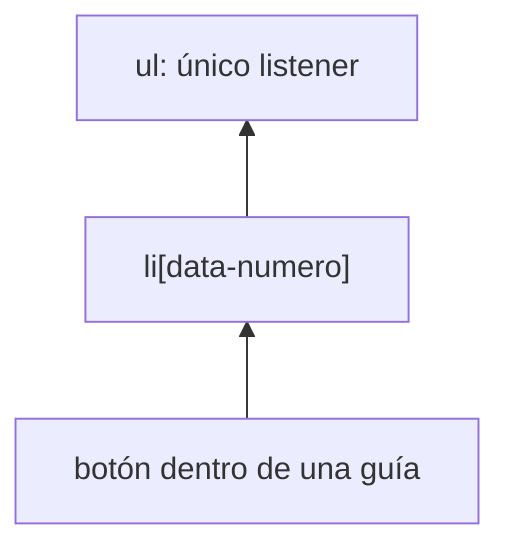

# Módulo 8: El DOM y eventos del navegador


## Aprende construyendo

### Tema 1: Selección y manipulación del DOM

#### Paso 1 · Objetivo y preparación

Al finalizar podrás traducir una colección de entregas a elementos DOM seguros, separar datos de presentación y actualizar una lista con `DocumentFragment`. Construirás la primera vista operativa de RutaFlow sin depender de un framework.

**Conocimiento previo:** arrays, funciones, objetos, ESM, HTML y proyecto Vite del módulo anterior. Abre las herramientas del navegador y localiza las pestañas Elements y Console antes de comenzar.

#### Paso 2 · Contexto y caso real

La API entrega objetos; el operador necesita una lista legible y segura. En este incremento del proyecto RutaFlow, una función recibirá el nodo destino y los datos, creará cada elemento sin interpretar contenido externo como HTML y reemplazará el resultado anterior de manera controlada.

#### Paso 3 · Teoría, modelo mental y analogía

**Conceptos clave:** DOM como árbol de nodos, `querySelector`, creación dinámica de elementos.

El DOM (Document Object Model) es la representación en forma de árbol de nodos que el navegador construye a partir del HTML de una página, y que JavaScript puede consultar y modificar dinámicamente en tiempo de ejecución. `document.querySelector(selector)` y `document.querySelectorAll(selector)` son los métodos modernos y preferidos para seleccionar elementos, aceptando cualquier selector CSS válido (incluyendo combinadores complejos), y devolviendo respectivamente el primer elemento coincidente o una `NodeList` estática con todos los coincidentes, reemplazando métodos más antiguos y específicos como `getElementById` o `getElementsByClassName` en la mayoría de código nuevo, precisamente por la flexibilidad de aceptar cualquier selector CSS.

Crear elementos dinámicamente sigue un patrón consistente: `document.createElement(tag)` crea un nuevo elemento desconectado del árbol del documento; se configuran sus propiedades (`textContent`, atributos, clases); y finalmente se inserta en su posición deseada del árbol con métodos como `appendChild`, `prepend`, o el más moderno y flexible `insertAdjacentElement`. Es importante usar `textContent` en vez de `innerHTML` cuando se inserta texto proveniente de datos (especialmente si esos datos provienen de una fuente no completamente confiable, como la entrada de un usuario), porque `innerHTML` interpreta el string como HTML, abriendo la puerta a un ataque de XSS (Cross-Site Scripting, que se estudiará en el Módulo 10) si el string contiene marcado malicioso; `textContent` siempre trata el valor como texto plano literal, sin ningún riesgo de interpretación como HTML ejecutable.

Insertar elementos uno por uno dentro de un bucle, cada uno con su propia llamada a `appendChild`, provoca múltiples "reflows" (recálculos del layout de la página) si se hace de forma ingenua directamente sobre un elemento ya insertado en el documento visible; una técnica de optimización común es construir la estructura completa en un `DocumentFragment` (un contenedor ligero que vive fuera del árbol visible del documento) y añadir todos los elementos hijos a ese fragmento primero, insertando finalmente el fragmento completo de una sola vez en el documento real, provocando un único reflow en vez de uno por cada elemento insertado individualmente.

Dominar la manipulación directa del DOM, aunque frameworks como Angular o React (estudiados en sus tracks correspondientes) automatizan gran parte de este trabajo mediante mecanismos de renderizado declarativo, sigue siendo relevante: entender qué ocurre realmente "por debajo" de esos frameworks facilita diagnosticar problemas de rendimiento y entender por qué ciertos patrones de esos frameworks (como las claves en listas renderizadas) existen precisamente para optimizar estas mismas operaciones de bajo nivel sobre el DOM real.

**Analogía:** manipular el DOM directamente es como reorganizar los muebles de una habitación físicamente, uno por uno; usar un `DocumentFragment` para insertar varios elementos de golpe es como preparar completamente una habitación entera en un espacio separado antes de trasladarla de una sola vez a su ubicación final, evitando reorganizar la habitación real visible varias veces de forma incremental y costosa.

**¿Por qué es importante?** Entender la manipulación directa del DOM es la base indispensable para comprender qué automatizan realmente los frameworks de UI, y sigue siendo directamente relevante para cualquier optimización de rendimiento de bajo nivel en aplicaciones reales.

#### Paso 4 · Demostración guiada desde cero

Desde una carpeta vacía crea `ejemplo-dom`, ejecuta `npm init -y`, crea `src` y `index.html`:

```bash
mkdir ejemplo-dom
cd ejemplo-dom
npm init -y
mkdir src
touch index.html
```

Añade `<ul id="guias" aria-live="polite"></ul>` dentro de `rutaflow-web/index.html`.

Después crea `rutaflow-web/src/ui/render-guias.js`:

```js
export function renderGuias(lista, guias) {
  // El fragmento permanece fuera del documento hasta estar completo.
  const fragmento = document.createDocumentFragment();

  for (const guia of guias) {
    const elemento = document.createElement("li");
    elemento.dataset.numero = guia.numero;

    const numero = document.createElement("strong");
    // textContent trata cualquier valor externo como texto, no como HTML.
    numero.textContent = guia.numero;
    elemento.append(numero, ` — ${guia.estado}`);
    fragmento.append(elemento);
  }

  // replaceChildren evita duplicar filas al volver a renderizar.
  lista.replaceChildren(fragmento);
}
```

Actualiza `rutaflow-web/src/main.js`:

```js
import { renderGuias } from "./ui/render-guias.js";

const guias = [
  { numero: "RF-101", estado: "CREADA" },
  { numero: "RF-102", estado: "EN_RUTA" },
  { numero: "", estado: "REVISAR" },
];

const lista = document.querySelector("#guias");
if (!lista) throw new Error("No existe #guias en index.html");
renderGuias(lista, guias);
```

Ejecuta:

```bash
npm run dev
```

**Resultado esperado:** aparecen tres filas; la tercera muestra literalmente `` y no ejecuta código. En Elements se observan nodos `li` creados dentro de `ul#guias`.

**Fallo deliberado:** cambia el id HTML a `guias-pendientes` sin actualizar JavaScript. El guard clause lanza `No existe #guias en index.html`; usa el selector del mensaje para encontrar la discrepancia y restaura un contrato único.

#### Paso 5 · Práctica guiada

Añade peso y ciudad usando elementos `span` con clases específicas. **Pista:** crea nodos con `createElement` y asigna datos con `textContent`; no formes una cadena HTML con información de la entrega.

#### Paso 6 · Práctica independiente

Implementa estado vacío (“No hay entregas para mostrar”), actualiza la misma lista dos veces y verifica que no se duplican filas. Escribe una prueba DOM que confirme cantidad de `li` y contenido literal de un número malicioso.

#### Paso 7 · Cierre y evidencia

Ya puedes convertir datos en una vista segura y predecible. El siguiente tema añadirá interacción a filas actuales y futuras mediante un único listener delegado. **Evidencia:** entrega la estructura, demuestra tres filas, el texto potencialmente malicioso sin ejecutar y el fallo por selector; explica por qué `textContent` reduce riesgo.

**Errores comunes:** usar `innerHTML` con datos externos; asumir que `querySelector` siempre encuentra un nodo; registrar datos dentro de la función de render; añadir uno por uno al documento sin necesidad; olvidar limpiar una vista antes de renderizar de nuevo.

**Fuentes oficiales:** [MDN — Document Object Model](https://developer.mozilla.org/en-US/docs/Web/API/Document_Object_Model) y [MDN — DocumentFragment](https://developer.mozilla.org/en-US/docs/Web/API/DocumentFragment).

### Tema 2: Delegación de eventos

#### Paso 1 · Objetivo y preparación

Al finalizar podrás manejar acciones de una colección dinámica con un solo listener, localizar la fila correcta con `closest` y descartar clics irrelevantes. Permitirás cambiar el estado de una entrega de RutaFlow sin acoplar comportamiento a cada nodo.

**Prerrequisitos:** propagación básica de eventos, selectores CSS y la lista renderizada en el tema anterior. Cada fila debe incluir `data-numero`; cada botón de acción debe incluir `data-action`.

#### Paso 2 · Contexto y caso real

Las entregas se agregan al recibir actualizaciones de red. Si cada fila conserva su propio listener, la aplicación debe registrar y limpiar comportamiento continuamente. El proyecto RutaFlow delegará clics al contenedor estable y emitirá una intención `{ accion, numero }` que el dominio pueda procesar.

#### Paso 3 · Teoría, modelo mental y analogía

**Conceptos clave:** delegación, `event.target`, eficiencia con elementos dinámicos.

Añadir un listener de evento individual a cada uno de muchos elementos similares (por ejemplo, cada `<li>` de una lista larga) tiene dos desventajas concretas: consume memoria adicional proporcional al número de elementos (cada listener registrado ocupa recursos), y no funciona automáticamente para elementos añadidos dinámicamente después de que los listeners iniciales se registraron, requiriendo volver a añadir un listener manualmente a cada nuevo elemento creado posteriormente. La delegación de eventos resuelve ambos problemas aprovechando que los eventos del DOM se propagan (hacen "bubbling") desde el elemento donde ocurrieron hacia sus ancestros en el árbol: registrar un único listener en un elemento contenedor (el `<ul>` padre, por ejemplo) permite capturar clics ocurridos en cualquiera de sus elementos hijos, actuales o futuros, sin necesidad de un listener individual por cada uno.

Dentro del listener del contenedor, `event.target` identifica exactamente cuál de los elementos hijos disparó el evento originalmente (el elemento específico donde ocurrió el clic, no el contenedor donde el listener está registrado), permitiendo distinguir y actuar de forma específica según qué hijo particular fue el origen real del evento. Esto requiere típicamente verificar la etiqueta o clase del `event.target` (`if (event.target.tagName === "LI")` o `event.target.matches(".item")`) para asegurarse de que el clic ocurrió efectivamente sobre un elemento hijo relevante, y no sobre el propio contenedor o algún elemento intermedio no relevante para la lógica del listener.

Este patrón es especialmente valioso para listas dinámicas donde elementos se añaden o eliminan constantemente: sin delegación, cada elemento nuevo requeriría registrar explícitamente su propio listener en el momento de su creación (y, con la misma disciplina, eliminar ese listener cuando el elemento se remueve, para evitar fugas de memoria por listeners huérfanos); con delegación, el único listener registrado en el contenedor padre automáticamente cubre cualquier elemento hijo presente en cualquier momento, presente o futuro, sin ningún trabajo adicional de gestión de listeners individuales.

Frameworks modernos de UI (React, notablemente) usan delegación de eventos internamente de forma sistemática precisamente por estas ventajas, registrando típicamente un único listener a nivel de la raíz de la aplicación completa y despachando internamente los eventos hacia los componentes correspondientes según su lógica interna de reconciliación, en vez de registrar listeners individuales de DOM real por cada elemento de la interfaz.

**Analogía:** la delegación de eventos es como tener un único recepcionista en la entrada principal de un edificio que registra y dirige a cualquier visitante hacia el departamento correcto, en vez de asignar un recepcionista dedicado y permanente a la puerta de cada oficina individual del edificio, incluyendo oficinas que aún no existen pero que podrían construirse en el futuro.

**¿Por qué es importante?** La delegación de eventos es más eficiente en memoria y funciona automáticamente con elementos añadidos dinámicamente después del registro inicial del listener, siendo el patrón estándar recomendado para listas y colecciones de elementos similares en JavaScript sin frameworks.

#### Paso 4 · Demostración guiada desde cero

Desde una carpeta vacía crea `ejemplo-eventos-dom`, ejecuta `npm init -y`, crea `src` y `index.html`, y después `src/eventos.js`:

```bash
mkdir ejemplo-eventos-dom
cd ejemplo-eventos-dom
npm init -y
mkdir src
touch index.html
```

```js
export function delegarAcciones(lista, alSeleccionar) {
  const manejarClick = (event) => {
    // closest tolera que el clic ocurra en un icono dentro del botón.
    const boton = event.target.closest("button[data-action]");
    if (!boton || !lista.contains(boton)) return;

    const fila = boton.closest("li[data-numero]");
    if (!fila) return;

    alSeleccionar({ accion: boton.dataset.action, numero: fila.dataset.numero });
  };

  lista.addEventListener("click", manejarClick);
  // Devolver cleanup permite desmontar la vista sin dejar listeners vivos.
  return () => lista.removeEventListener("click", manejarClick);
}
```



En `src/main.js`, después de renderizar, integra la función:

```js
import { delegarAcciones } from "./ui/eventos-guias.js";

const dejarDeEscuchar = delegarAcciones(lista, ({ accion, numero }) => {
  console.log(`ACCIÓN ${accion} PARA ${numero}`);
});

// La fila añadida después queda cubierta por el listener del contenedor.
lista.insertAdjacentHTML(
  "beforeend",
  '<li data-numero="RF-103"><button data-action="entregar">Entregar RF-103</button></li>',
);
```

Ejecuta:

```bash
npm run dev
```

**Resultado esperado:** pulsar el botón recién añadido imprime `ACCIÓN entregar PARA RF-103`; pulsar el espacio vacío de la lista no imprime ni genera error. Ejecutar `dejarDeEscuchar()` detiene nuevas acciones.

**Fallo deliberado:** usa temporalmente `event.target.dataset.action` y pulsa un `span` dentro del botón. La acción será `undefined` porque el target es el nodo más profundo; restaura `closest("button[data-action]")` y confirma el diagnóstico inspeccionando `event.target`.

#### Paso 5 · Práctica guiada

Añade acciones `ver` y `entregar` en la misma fila y enrútalas con un `switch`. **Pista:** el handler delegado identifica intención; no debe contener directamente peticiones HTTP ni reglas de transición de estado.

#### Paso 6 · Práctica independiente

Renderiza cien filas, registra un solo listener y crea una prueba que haga clic en un elemento interno del botón. Verifica payload, guard clause y cleanup sin depender del texto visual.

#### Paso 7 · Cierre y evidencia

Ya puedes mantener interacción estable aunque cambie la colección. El siguiente tema capturará nuevas entregas con validación accesible antes de enviarlas a la API. **Evidencia:** demuestra clic sobre una fila dinámica, clic ignorado, cleanup y fallo de `event.target`; explica bubbling y el papel de `closest`.

**Errores comunes:** comparar solo `tagName`; olvidar comprobar que el nodo pertenece al contenedor; usar listeners por fila; mezclar interacción con reglas del dominio; no retirar el listener al destruir una vista persistente.

**Fuentes oficiales:** [MDN — Event bubbling](https://developer.mozilla.org/en-US/docs/Learn_web_development/Core/Scripting/Event_bubbling) y [MDN — Element.closest](https://developer.mozilla.org/en-US/docs/Web/API/Element/closest).

### Tema 3: Formularios y validación nativa

#### Paso 1 · Objetivo y preparación

Al finalizar podrás construir un formulario accesible, combinar restricciones HTML con mensajes específicos, extraer datos con `FormData` y explicar por qué el servidor debe validar otra vez. Crearás entregas de RutaFlow sin dejar al usuario adivinar qué dato falló.

**Conocimiento previo:** HTML semántico, eventos, funciones y manipulación DOM. Conserva la consola y el panel de accesibilidad disponibles; no uses colores como único indicador de error.

#### Paso 2 · Contexto y caso real

Un número de guía inválido o un peso negativo puede detener clasificación y facturación. En el proyecto RutaFlow, el navegador dará retroalimentación inmediata, pero el objeto resultante seguirá considerándose no confiable hasta que la API lo valide.

#### Paso 3 · Teoría, modelo mental y analogía

**Conceptos clave:** atributos de validación HTML, `setCustomValidity`, eventos `invalid` e `input`.

HTML ofrece validación nativa de formularios mediante atributos declarativos —`required` (obligatorio), `pattern` (una expresión regular que el valor debe cumplir), `min`/`max` (límites numéricos), `type="email"` (formato de correo)— que el navegador verifica automáticamente antes de permitir el envío del formulario, sin necesidad de escribir lógica de validación en JavaScript para los casos más comunes cubiertos por estos atributos estándar. El navegador muestra automáticamente un mensaje de error predeterminado (con estilo y texto que varían según el navegador y el idioma configurado del usuario) cuando un campo no cumple su validación al intentar enviar el formulario.

`setCustomValidity(mensaje)` permite personalizar el mensaje de error mostrado por la validación nativa, reemplazando el mensaje genérico predeterminado del navegador por uno específico y más útil para el contexto de la aplicación; invocar `setCustomValidity("")` (una cadena vacía) marca el campo como nuevamente válido, siendo necesario limpiar explícitamente cualquier mensaje personalizado previo cuando el usuario corrige el valor, típicamente escuchando el evento `input` para reevaluar y limpiar la validez en cada cambio, mientras el evento `invalid` se dispara específicamente en el momento en que el navegador determina que el campo no es válido al intentar el envío.

Aunque la validación nativa cubre gran parte de los casos comunes, validaciones más complejas (que dependen de comparar el valor de un campo con otro, o de una verificación asíncrona contra un servidor, como comprobar si un nombre de usuario ya está en uso) requieren lógica de JavaScript adicional, típicamente combinada con `setCustomValidity` para integrar esa lógica personalizada dentro del mismo mecanismo de validación nativa del navegador, en vez de construir un sistema de validación completamente separado y paralelo al comportamiento nativo esperado del formulario.

Confiar en la validación nativa del lado del cliente nunca reemplaza la necesidad de validar también en el servidor: la validación del navegador es una mejora de experiencia de usuario (feedback inmediato sin esperar un viaje de red completo), pero un cliente malicioso o simplemente una petición HTTP directa sin pasar por el formulario del navegador puede saltarse completamente cualquier validación del lado del cliente, haciendo que la validación del lado del servidor sea la única garantía real e ineludible de integridad de los datos recibidos.

**Analogía:** la validación nativa del navegador es como un guardia de seguridad en la entrada de un edificio que revisa visualmente que los visitantes cumplan un código de vestimenta básico antes de dejarlos pasar, dando feedback inmediato en el momento; pero la verificación de identidad realmente seria y definitiva ocurre después, dentro del edificio (el servidor), donde no se puede confiar únicamente en lo que el guardia de la entrada ya aprobó superficialmente.

**¿Por qué es importante?** La validación nativa reduce significativamente la cantidad de JavaScript necesario para casos comunes de formularios, mejorando la experiencia del usuario con feedback inmediato, aunque nunca sustituye la validación obligatoria del lado del servidor.

#### Paso 4 · Demostración guiada desde cero

Añade a `rutaflow-web/index.html`:

```html
<form id="nueva-guia">
  <label for="numero">Número de guía</label>
  <input id="numero" name="numero" required pattern="RF-[0-9]+"
         aria-describedby="ayuda-numero" />
  <small id="ayuda-numero">Ejemplo: RF-200</small>
  <label for="peso">Peso en kg</label>
  <input id="peso" name="peso" type="number" min="0.1" step="0.1" required />
  <button>Crear entrega</button>
</form>
```

Desde una carpeta vacía crea `ejemplo-formularios`, ejecuta `npm init -y`, crea `src` y `index.html`, y después `src/formulario.js`:

```bash
mkdir ejemplo-formularios
cd ejemplo-formularios
npm init -y
mkdir src
touch index.html
```

```js
export function prepararFormulario(formulario, alCrear) {
  const numero = formulario.elements.namedItem("numero");

  numero.addEventListener("invalid", () => {
    // El mensaje ofrece formato y ejemplo, no solamente dice “inválido”.
    numero.setCustomValidity("Usa RF- seguido de números, por ejemplo RF-200");
  });
  numero.addEventListener("input", () => numero.setCustomValidity(""));

  formulario.addEventListener("submit", (event) => {
    event.preventDefault();
    if (!formulario.reportValidity()) return;
    const datos = new FormData(formulario);
    alCrear({ numero: datos.get("numero"), pesoKg: Number(datos.get("peso")) });
    formulario.reset();
  });
}
```

Integra desde `src/main.js`, llamando `prepararFormulario(document.querySelector("#nueva-guia"), console.log)`, y ejecuta:

```bash
npm run dev
```

**Resultado esperado:** `200` permanece bloqueado con el ejemplo correcto; `RF-200` y peso `1.5` producen `{ numero: "RF-200", pesoKg: 1.5 }` y limpian el formulario.

**Fallo deliberado:** comenta el listener `input`, intenta enviar `200` y luego corrige a `RF-200`. El mensaje personalizado permanece porque `setCustomValidity` sigue conteniendo texto; restaura la limpieza y confirma que el campo vuelve a ser válido.

#### Paso 5 · Práctica guiada

Añade ciudad de origen y destino y rechaza que sean iguales mediante `setCustomValidity`. **Pista:** recalcula al cambiar cualquiera de los dos campos y limpia primero el mensaje anterior para no dejar un error obsoleto.

#### Paso 6 · Práctica independiente

Diseña una función pura de validación equivalente para la API y prueba vacío, patrón incorrecto, peso límite y número válido. Explica qué validación pertenece a UX y cuál protege la integridad del sistema.

#### Paso 7 · Cierre y evidencia

Ya puedes ofrecer feedback inmediato sin confundirlo con seguridad del servidor. El siguiente tema conservará una preferencia no sensible y cargará más entregas al acercarse al final. **Evidencia:** demuestra caso inválido, corrección, salida tipada y fallo del mensaje persistente; explica por qué `Number()` es necesario al leer `FormData`.

**Errores comunes:** confiar solo en el cliente; olvidar limpiar `setCustomValidity`; eliminar labels visibles; leer números como strings; mostrar un mensaje genérico que no explica cómo corregir el valor.

**Fuentes oficiales:** [MDN — Client-side form validation](https://developer.mozilla.org/en-US/docs/Learn_web_development/Extensions/Forms/Form_validation) y [MDN — Constraint validation](https://developer.mozilla.org/en-US/docs/Web/HTML/Guides/Constraint_validation).

### Tema 4: Web APIs — localStorage e IntersectionObserver

#### Paso 1 · Objetivo y preparación

Al finalizar podrás persistir una preferencia no sensible, recuperarte de datos dañados y cargar páginas cuando un sentinela se acerque al viewport. Aplicarás ambas APIs a la lista de entregas de RutaFlow sin bloquear el hilo con eventos `scroll` continuos.

**Conocimiento previo:** JSON, funciones, DOM y callbacks. Necesitas una lista desplazable, un `<select id="filtro-estado">` y un `<div id="sentinela">Cargar más</div>` al final del documento.

#### Paso 2 · Contexto y caso real

El operador quiere conservar su filtro entre recargas y consultar más entregas al llegar al final. En este incremento del proyecto RutaFlow guardaremos solo la preferencia de interfaz; tokens, direcciones y datos sensibles permanecerán fuera de `localStorage`.

#### Paso 3 · Teoría, modelo mental y analogía

**Conceptos clave:** persistencia simple del lado del cliente, observación eficiente de visibilidad.

`localStorage` proporciona una forma simple de persistir datos como strings en el navegador del usuario, sobreviviendo entre recargas de página e incluso entre sesiones completas del navegador (a diferencia de `sessionStorage`, que se limpia al cerrar la pestaña), útil para casos como recordar preferencias del usuario o guardar un borrador de formulario sin necesidad de un servidor. Es importante recordar que `localStorage` solo almacena strings: guardar objetos requiere serializarlos explícitamente con `JSON.stringify()` antes de guardar, y deserializarlos con `JSON.parse()` al leer, y que su capacidad es limitada (típicamente unos pocos megabytes según el navegador), inapropiado para almacenar volúmenes grandes de datos.

`IntersectionObserver` es una API moderna y eficiente para detectar cuándo un elemento entra o sale del viewport visible (o de cualquier otro elemento contenedor especificado), reemplazando el patrón anterior, mucho menos eficiente, de escuchar el evento `scroll` y calcular manualmente en cada disparo si un elemento específico está visible (una operación costosa si se ejecuta en cada uno de los muchos eventos de scroll que ocurren durante un desplazamiento continuo del usuario). En vez de eso, `IntersectionObserver` notifica de forma asíncrona y eficiente, gestionada internamente por el navegador, exactamente cuándo ocurre un cambio real de intersección, sin necesidad de recalcular constantemente en cada pequeño movimiento de scroll.

El caso de uso más común de `IntersectionObserver` es el scroll infinito: colocar un elemento "sentinela" invisible al final de una lista de resultados, y observar cuándo ese sentinela se vuelve visible en el viewport (indicando que el usuario se ha desplazado hasta cerca del final de la lista actual), disparando en ese momento la carga de más resultados adicionales, típicamente mediante una petición a una API (Módulo 6). Otro uso frecuente es implementar "lazy loading" de imágenes: cargar la imagen real de un elemento solo cuando ese elemento se acerca a entrar en el viewport visible, en vez de cargar todas las imágenes de la página completa desde el inicio, mejorando el tiempo de carga inicial percibido.

Ambas APIs —`localStorage` e `IntersectionObserver`— ilustran un principio recurrente en el diseño de APIs modernas del navegador: preferir mecanismos declarativos y eficientes gestionados internamente por el navegador (observadores) sobre patrones imperativos que requieren que el propio JavaScript de la aplicación recalcule constantemente el estado relevante en respuesta a eventos de alta frecuencia como el scroll.

**Analogía:** `localStorage` es como una libreta personal que cada visitante deja guardada en su propia casillero al salir de un edificio, disponible de nuevo exactamente donde la dejó en su próxima visita; `IntersectionObserver` es como un sensor de movimiento inteligente que notifica automáticamente cuando algo entra en un área específica, en vez de requerir que alguien revise constantemente y de forma manual esa área cada fracción de segundo.

**¿Por qué es importante?** `IntersectionObserver` es sustancialmente más eficiente que escuchar `scroll` manualmente para detectar visibilidad, y `localStorage` es la forma más simple de persistencia del lado del cliente sin requerir un backend, ambas ampliamente usadas en interfaces web reales.

#### Paso 4 · Demostración guiada desde cero

Desde una carpeta vacía crea `ejemplo-web-apis`, ejecuta `npm init -y`, crea `src` y `index.html`, y después `src/preferencias.js`:

```bash
mkdir ejemplo-web-apis
cd ejemplo-web-apis
npm init -y
mkdir src
touch index.html
```

```js
const CLAVE = "rutaflow:filtro";

export function prepararPreferencias(select) {
  try {
    // JSON.parse puede fallar si otra versión escribió un valor incompatible.
    const guardado = JSON.parse(localStorage.getItem(CLAVE) ?? "null");
    if (["TODAS", "CREADA", "EN_RUTA"].includes(guardado)) select.value = guardado;
  } catch (error) {
    console.warn("Preferencia dañada; se usará TODAS", error);
    localStorage.removeItem(CLAVE);
    select.value = "TODAS";
  }

  select.addEventListener("change", () => {
    localStorage.setItem(CLAVE, JSON.stringify(select.value));
  });
}

export function observarSiguientePagina(sentinela, cargarPagina) {
  let cargando = false;
  const observador = new IntersectionObserver(async ([entrada]) => {
    if (!entrada.isIntersecting || cargando) return;
    cargando = true;
    try {
      const hayMas = await cargarPagina();
      if (!hayMas) observador.disconnect();
    } finally {
      cargando = false;
    }
  }, { rootMargin: "200px" });
  observador.observe(sentinela);
  return () => observador.disconnect();
}
```

Integra ambas funciones en `src/main.js`; usa un contador dentro de `cargarPagina` y devuelve `false` después de la tercera página. Ejecuta:

```bash
npm run dev
```

**Resultado esperado:** al elegir `EN_RUTA` y recargar, el filtro permanece; al acercar el sentinela aparecen hasta tres lotes y luego cesan las cargas. No se disparan solicitudes paralelas mientras `cargando` es verdadero.

**Fallo deliberado:** desde Console ejecuta `localStorage.setItem("rutaflow:filtro", "{mal-json")` y recarga. `JSON.parse` falla, el `catch` registra el diagnóstico, elimina el valor y recupera `TODAS` sin romper la página.

#### Paso 5 · Práctica guiada

Añade versión al objeto persistido `{ version: 1, estado }` y migra o descarta formatos antiguos. **Pista:** valida estructura después de `JSON.parse`; que el JSON sea válido no significa que tenga la forma esperada.

#### Paso 6 · Práctica independiente

Prueba almacenamiento vacío, corrupto y válido; simula dos intersecciones simultáneas y verifica una sola carga; demuestra que el observer se desconecta al agotarse páginas. Documenta por qué un token no pertenece en este almacenamiento.

#### Paso 7 · Cierre y evidencia

Ya puedes conservar una preferencia y reaccionar eficientemente a visibilidad. El siguiente tema observará cambios de tamaño y mutaciones externas, con limpieza explícita. **Evidencia:** demuestra recarga persistente, tres páginas, fallo JSON recuperado y explica la función de `rootMargin` y del bloqueo `cargando`.

**Errores comunes:** guardar secretos; olvidar que todo se almacena como string; no validar el resultado de `JSON.parse`; cargar varias páginas por una misma intersección; dejar el observador conectado al terminar.

**Fuentes oficiales:** [MDN — localStorage](https://developer.mozilla.org/en-US/docs/Web/API/Window/localStorage) y [MDN — IntersectionObserver](https://developer.mozilla.org/en-US/docs/Web/API/IntersectionObserver).

### Tema 5: ResizeObserver y MutationObserver

#### Paso 1 · Objetivo y preparación

Al finalizar podrás reaccionar al tamaño real de un contenedor y a inserciones realizadas por código externo, limitar el alcance observado y liberar ambos observers. Harás que el tablero RutaFlow se adapte sin sondeo ni listeners globales innecesarios.

**Prerrequisitos:** DOM, callbacks, estilos CSS y patrón de cleanup del tema de eventos. Añade `section id="panel-guias"` con una lista interna para poder cambiar su ancho de manera visible.

#### Paso 2 · Contexto y caso real

El tablero puede vivir en una ventana completa o en un panel lateral, por lo que el ancho de `window` no describe su espacio real. Además, un widget de terceros inserta avisos dentro del panel. El proyecto RutaFlow observará solo esas dos señales y desconectará todo al abandonar la pantalla.

#### Paso 3 · Teoría, modelo mental y analogía

**Conceptos clave:** observación de cambios de tamaño y de cambios en el árbol del DOM.

`ResizeObserver` notifica de forma eficiente cuándo el tamaño de un elemento observado cambia, ya sea por una acción directa del usuario (redimensionar la ventana del navegador) o indirectamente por cambios de layout provocados por otro contenido de la página (como una imagen que termina de cargar y empuja el tamaño de un contenedor adyacente). Antes de esta API, detectar cambios de tamaño de un elemento específico (no de toda la ventana) requería trucos indirectos y menos confiables, como escuchar el evento `resize` global de la ventana y recalcular manualmente el tamaño de cada elemento de interés, un enfoque que además no capturaba cambios de tamaño provocados por causas distintas al redimensionamiento de la ventana completa.

`MutationObserver` notifica cuándo el árbol del DOM cambia dentro de un elemento observado: adición o eliminación de nodos hijos, cambios de atributos, o cambios de texto, según qué tipos de mutación se configuren explícitamente al crear el observador. Este mecanismo es útil para reaccionar a cambios en el DOM provocados por código externo sobre el que no se tiene control directo (por ejemplo, una biblioteca de terceros que inserta contenido dinámicamente en un contenedor específico), permitiendo ejecutar lógica propia en respuesta a esos cambios sin necesidad de modificar el código de esa biblioteca externa directamente.

Ambos observadores comparten un patrón de diseño común con `IntersectionObserver` (Tema 4): en vez de sondear activamente el estado (verificar repetidamente y de forma manual si algo cambió, un patrón costoso e ineficiente conocido como "polling"), se registra un callback una única vez, y el navegador se encarga internamente de notificar de forma eficiente y asíncrona exactamente cuándo ocurre el cambio relevante, sin desperdiciar ciclos de procesamiento en verificaciones innecesarias cuando nada ha cambiado realmente.

Es importante desconectar estos observadores explícitamente (`observer.disconnect()`) cuando el elemento que observan se elimina de la página o cuando la lógica que depende de ellos ya no es necesaria, para evitar que el observador siga consumiendo recursos innecesariamente de forma indefinida, un descuido de limpieza que, aunque no cause errores visibles inmediatos, puede acumular overhead innecesario en aplicaciones de larga duración con muchos componentes creándose y destruyéndose dinámicamente.

**Analogía:** `ResizeObserver` es como un sastre que automáticamente te notifica en cuanto detecta que tu talla cambió, sin que tengas que medirte constantemente tú mismo; `MutationObserver` es como una cámara de seguridad que notifica automáticamente cualquier cambio específico en una habitación vigilada (algo que entra, sale, o se mueve), sin necesidad de revisar manualmente la habitación cada cierto tiempo para comprobar si algo cambió.

**¿Por qué es importante?** Estos observadores permiten reaccionar eficientemente a cambios de tamaño o de estructura del DOM sin recurrir a sondeo costoso e ineficiente, un patrón de diseño consistente y recomendado en las Web APIs modernas del navegador.

#### Paso 4 · Demostración guiada desde cero

Desde una carpeta vacía crea `ejemplo-observers`, ejecuta `npm init -y`, crea `src` y `index.html`, y después `src/observadores.js`:

```bash
mkdir ejemplo-observers
cd ejemplo-observers
npm init -y
mkdir src
touch index.html
```

```js
export function observarPanel(panel, lista) {
  const tamanos = new ResizeObserver(([entrada]) => {
    // El ancho del componente decide su layout, no el ancho de la ventana.
    const columnas = entrada.contentRect.width >= 720 ? 3 : 1;
    lista.style.setProperty("--columnas", columnas);
    console.log("COLUMNAS", columnas);
  });

  const mutaciones = new MutationObserver((registros) => {
    const agregados = registros.reduce((total, registro) => total + registro.addedNodes.length, 0);
    console.log("NODOS EXTERNOS", agregados);
  });

  tamanos.observe(panel);
  // Observamos solo hijos directos; no atributos ni todo el subárbol.
  mutaciones.observe(lista, { childList: true });

  return function destruir() {
    tamanos.disconnect();
    mutaciones.disconnect();
  };
}
```

Llama la función desde `src/main.js`, cambia el ancho del panel con DevTools y agrega una fila desde Console. Ejecuta:

```bash
npm run dev
```

**Resultado esperado:** bajo 720 px aparece `COLUMNAS 1`; sobre el umbral aparece `COLUMNAS 3`; insertar una fila registra `NODOS EXTERNOS 1`. Después de ejecutar `destruir()`, nuevos cambios no generan logs.

**Fallo deliberado:** dentro del callback de `ResizeObserver`, alterna un ancho fijo del mismo panel entre dos valores. El callback modifica aquello que observa y puede producir `ResizeObserver loop completed with undelivered notifications`. Retira esa escritura; cambia solamente una propiedad de presentación que no retroalimente el tamaño observado.

#### Paso 5 · Práctica guiada

Compara `{ childList: true }` con `{ childList: true, subtree: true, attributes: true }` al editar una clase interna. **Pista:** elige la configuración más estrecha que detecte la señal necesaria; más registros implican más trabajo y ruido.

#### Paso 6 · Práctica independiente

Escribe pruebas con observers simulados que verifiquen umbral, conteo y cleanup. Documenta un caso donde una llamada directa es preferible porque tu propio código ya conoce el cambio.

#### Paso 7 · Cierre y evidencia

Ya puedes observar señales que no controlas sin recurrir a polling y liberar recursos al desmontar. El siguiente tema sincronizará movimiento visible con el repintado y trabajo secundario con tiempo ocioso. **Evidencia:** demuestra ambos logs, ausencia después del cleanup, fallo de realimentación y explica por qué se limitó `MutationObserver` a `childList`.

**Errores comunes:** observar todo el documento; sustituir flujo de datos explícito con mutaciones; modificar el tamaño observado desde el callback; olvidar `disconnect`; hacer trabajo pesado por cada registro sin agruparlo.

**Fuentes oficiales:** [MDN — ResizeObserver](https://developer.mozilla.org/en-US/docs/Web/API/ResizeObserver) y [MDN — MutationObserver](https://developer.mozilla.org/en-US/docs/Web/API/MutationObserver).

### Tema 6: requestAnimationFrame y requestIdleCallback

#### Paso 1 · Objetivo y preparación

Al finalizar podrás animar un marcador según tiempo transcurrido, cancelar el ciclo, respetar movimiento reducido y reservar tareas prescindibles para períodos ociosos con fallback. Visualizarás el avance de una entrega de RutaFlow sin ligar velocidad al número de frames.

**Conocimiento previo:** callbacks, tiempo en milisegundos, estilos transform y ciclo de renderizado. Añade una pista con `<div id="marcador"></div>` y verifica `window.matchMedia` en la consola.

#### Paso 2 · Contexto y caso real

El mapa de RutaFlow recibe posiciones discretas y necesita una transición comprensible entre dos puntos. La confirmación de una entrega es crítica y nunca esperará tiempo ocioso; solo el precálculo opcional de estadísticas se diferirá.

#### Paso 3 · Teoría, modelo mental y analogía

**Conceptos clave:** sincronización con el ciclo de renderizado, trabajo de baja prioridad en tiempo ocioso.

`requestAnimationFrame(callback)` programa la ejecución de `callback` justo antes de que el navegador realice el siguiente repintado visual de la página, típicamente sincronizado con la frecuencia de actualización de la pantalla del usuario (comúnmente 60 veces por segundo). Esto lo hace la herramienta correcta para cualquier animación programada directamente en JavaScript (en vez de usar animaciones CSS, que suelen ser preferibles cuando son suficientes para el efecto deseado): usar `setTimeout` con un intervalo fijo para animaciones produce resultados visualmente inconsistentes, porque no está sincronizado con el ciclo real de repintado del navegador y puede disparar la actualización en momentos que no coinciden con cuándo el navegador realmente va a repintar la pantalla, mientras que `requestAnimationFrame` garantiza que cada actualización de la animación ocurra exactamente en sincronía con un repintado real, evitando tanto actualizaciones desperdiciadas (que ocurren pero nunca se muestran porque el navegador aún no repintó) como saltos visuales perceptibles.

`requestIdleCallback(callback)` programa la ejecución de `callback` durante un período de tiempo en que el navegador está genuinamente ocioso (sin trabajo urgente pendiente de renderizado o de respuesta a interacción del usuario), siendo apropiado para trabajo de baja prioridad que puede posponerse sin afectar la experiencia percibida por el usuario, como el registro de analíticas no urgentes, pre-cálculos especulativos que podrían no llegar a necesitarse, o limpieza de datos en segundo plano. El callback recibe un objeto con información sobre cuánto tiempo restante de ociosidad está disponible, permitiendo que el propio código decida ceder el control de vuelta al navegador antes de que ese tiempo se agote, en vez de monopolizar el hilo principal con trabajo prolongado que podría retrasar una interacción urgente del usuario que llegue en medio de esa ejecución.

Elegir entre estos dos mecanismos según la naturaleza del trabajo —visualmente crítico y sincronizado con el repintado (`requestAnimationFrame`) frente a genuinamente prescindible y de baja prioridad (`requestIdleCallback`)— es importante para no congestionar innecesariamente el hilo principal de JavaScript con trabajo que compite por los mismos recursos que la interactividad y la fluidez visual que el usuario percibe directamente, una consideración de rendimiento particularmente relevante en aplicaciones con animaciones complejas o con volúmenes grandes de procesamiento de datos en segundo plano.

Ambas APIs, junto con los observadores del Tema 5, forman parte de un conjunto más amplio de herramientas del navegador diseñadas específicamente para que el código de la aplicación pueda cooperar de forma eficiente con el ciclo de renderizado y con la disponibilidad real de recursos del navegador, en vez de competir ciegamente por el hilo único de JavaScript sin ninguna consideración de prioridad o de sincronización con el repintado visual real.

**Analogía:** `requestAnimationFrame` es como sincronizar cada paso de un bailarín exactamente con el compás de la música (el ciclo de repintado del navegador), garantizando que cada movimiento se vea fluido y en el momento correcto; `requestIdleCallback` es como aprovechar los momentos de pausa genuina entre tareas urgentes de un equipo de trabajo para adelantar tareas de baja prioridad que pueden esperar, sin interrumpir nunca el trabajo urgente cuando este llega.

**¿Por qué es importante?** Usar la API correcta según la naturaleza del trabajo —animaciones sincronizadas frente a trabajo de baja prioridad diferible— evita competir innecesariamente por recursos del hilo principal con la interactividad y fluidez visual que el usuario percibe directamente.

#### Paso 4 · Demostración guiada desde cero

Desde una carpeta vacía crea `ejemplo-animacion`, ejecuta `npm init -y`, crea `src` y `index.html`, y después `src/animacion.js`:

```bash
mkdir ejemplo-animacion
cd ejemplo-animacion
npm init -y
mkdir src
touch index.html
```

```js
export function animarMarcador(elemento, destinoPx, duracionMs = 800) {
  if (matchMedia("(prefers-reduced-motion: reduce)").matches) {
    elemento.style.transform = `translateX(${destinoPx}px)`;
    return () => {};
  }

  let id;
  let inicio;
  function frame(timestamp) {
    inicio ??= timestamp;
    // El progreso depende del tiempo; una pantalla lenta no cambia la duración.
    const progreso = Math.min((timestamp - inicio) / duracionMs, 1);
    elemento.style.transform = `translateX(${destinoPx * progreso}px)`;
    if (progreso < 1) id = requestAnimationFrame(frame);
  }
  id = requestAnimationFrame(frame);
  return () => cancelAnimationFrame(id);
}

export function cuandoHayaTiempo(tarea) {
  // Safari puede no ofrecer requestIdleCallback; el fallback conserva funcionalidad.
  if ("requestIdleCallback" in window) return requestIdleCallback(tarea, { timeout: 2000 });
  return setTimeout(() => tarea({ timeRemaining: () => 0 }), 0);
}
```

Desde `src/main.js` llama `animarMarcador(document.querySelector("#marcador"), 240)` y difiere un `console.log("ESTADÍSTICA PRECALCULADA")`. Ejecuta:

```bash
npm run dev
```

**Resultado esperado:** el marcador llega a 240 px aproximadamente en 800 ms; con movimiento reducido salta directamente al destino; la estadística aparece cuando el navegador dispone de oportunidad o vence el timeout.

**Fallo deliberado:** reemplaza el cálculo temporal por `posicion += 1` en cada frame y limita el CPU desde DevTools. La animación tarda más porque depende de cuántos frames se ejecutan. Restaura el timestamp y confirma que los frames pueden variar sin cambiar la duración lógica.

#### Paso 5 · Práctica guiada

Interpola entre dos coordenadas `{ x, y }` y cancela la animación anterior al recibir una posición nueva. **Pista:** conserva la función cleanup retornada y ejecútala antes de iniciar el siguiente movimiento.

#### Paso 6 · Práctica independiente

Prueba duración, destino, cancelación y preferencia de movimiento reducido con reloj simulado. Divide una cola de estadísticas en porciones usando `deadline.timeRemaining()`, pero garantiza que ninguna confirmación crítica dependa de esa cola.

#### Paso 7 · Cierre y evidencia

Ya puedes cooperar con el ciclo visual y asignar prioridad según impacto para el usuario. El próximo módulo introducirá pruebas automatizadas para verificar estas decisiones sin depender siempre de inspección manual. **Evidencia:** demuestra destino, duración, cancelación, modo reducido y fallo basado en frames; explica por qué `requestIdleCallback` no garantiza un momento exacto.

**Errores comunes:** medir progreso contando frames; olvidar cancelar una animación reemplazada; ignorar `prefers-reduced-motion`; usar trabajo ocioso para acciones críticas; asumir disponibilidad universal de `requestIdleCallback`.

**Fuentes oficiales:** [MDN — requestAnimationFrame](https://developer.mozilla.org/en-US/docs/Web/API/Window/requestAnimationFrame), [MDN — requestIdleCallback](https://developer.mozilla.org/en-US/docs/Web/API/Window/requestIdleCallback) y [MDN — prefers-reduced-motion](https://developer.mozilla.org/en-US/docs/Web/CSS/@media/prefers-reduced-motion).

---


## Construcción guiada del capítulo

**Objetivo del laboratorio:** construir un componente de UI interactivo (lista filtrable con scroll infinito) usando exclusivamente DOM API, sin ningún framework.

**Requisitos previos:** un navegador moderno, Módulos 0-7 completados.

| Paso | Acción | Código | Explicación |
|---|---|---|---|
| 1 | Renderizar una lista dinámica desde un array | Ver Tema 1 | Usa un `DocumentFragment` para inserción eficiente |
| 2 | Aplicar delegación de eventos en el `<ul>` padre | Ver Tema 2 | Verifica que funciona con elementos añadidos después |
| 3 | Construir un formulario con validación nativa | `required`, `pattern`, `setCustomValidity` | Muestra mensajes de error personalizados |
| 4 | Persistir el texto de un input en `localStorage` | Ver Tema 4 | Recupera el valor al recargar la página |
| 5 | Implementar scroll infinito con `IntersectionObserver` | Elemento sentinela al final de la lista | Carga más resultados al acercarse al final |
| 6 | Construir la lista filtrable completa | Input de búsqueda que oculta/muestra `<li>` según coincidencia | Sin ningún framework, solo DOM API |

**Verificación:** el laboratorio se considera exitoso si la lista filtrable responde correctamente a la búsqueda en tiempo real, si la delegación de eventos funciona con elementos añadidos dinámicamente después de la carga inicial, y si el scroll infinito dispara la carga de más resultados exactamente al acercarse al final de la lista visible.

### Comprueba lo construido

#### Ejercicio verificable 1

¿Qué propiedad debes usar para insertar texto no confiable sin interpretarlo como HTML?

**Respuesta esperada:** textContent|text content

#### Ejercicio verificable 2

¿Qué método permite encontrar el ancestro interactivo correcto desde `event.target`?

**Respuesta esperada:** closest|closest()

#### Ejercicio verificable 3

¿Qué método libera todos los elementos observados por un observer cuando destruyes la vista?

**Respuesta esperada:** disconnect|disconnect()

**Errores comunes y soluciones**

- **Usar `innerHTML` con datos de usuario sin sanitizar.** Usa `textContent` cuando el contenido es texto plano, para evitar el riesgo de XSS (se profundizará en el Módulo 10).
- **Registrar un listener individual por cada elemento de una lista larga.** Usa delegación de eventos en el contenedor padre en su lugar.
- **Olvidar desconectar un `IntersectionObserver`/`MutationObserver`/`ResizeObserver` cuando el elemento observado se elimina.** Llama a `.disconnect()` explícitamente para evitar overhead innecesario acumulado.

---
