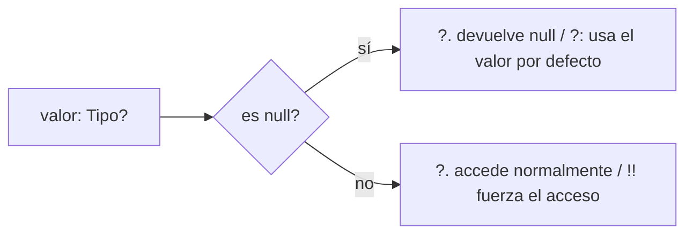
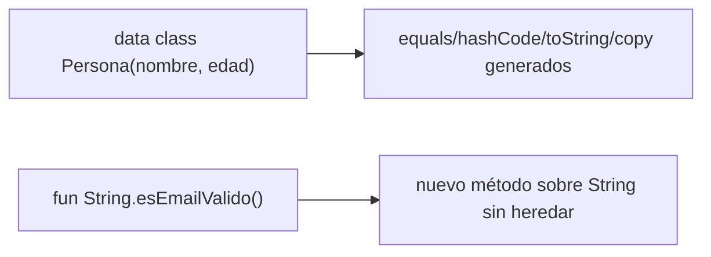
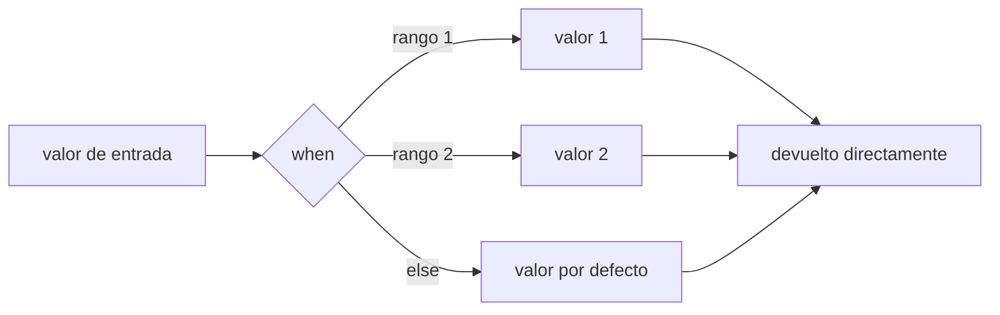

# Módulo 0: Fundamentos de Kotlin

Este módulo no se lee una sola vez: se practica hasta que la sintaxis sale sin pensarla. Cada tema se estudia por separado, con su propia demostración, su propia repetición progresiva y su propio reto de memoria — para que null safety, `data class`, `when` y destructuring queden en el mismo lugar mental que el resto de la sintaxis que ya usas sin esfuerzo.


## Antes de comenzar: entorno Kotlin Multiplatform

Kotlin Multiplatform combina herramientas de varias plataformas. Para empezar instala **JDK 21**, Git e **IntelliJ IDEA** con el plugin Kotlin. Para Android necesitarás Android Studio; para compilar el destino iOS necesitarás obligatoriamente un Mac con Xcode.

| Sistema | Qué puedes desarrollar | Instalación mínima |
|---|---|---|
| Windows | commonMain, JVM, Android y Desktop | JDK 21, IntelliJ/Android Studio, Git |
| macOS | Todos los destinos, incluido iOS | JDK 21, Xcode, Android Studio, Git |
| Linux | commonMain, JVM, Android y Desktop | OpenJDK 21, IntelliJ/Android Studio, Git |

Verifica `java --version` y `git --version`. En macOS abre Xcode una vez y acepta su licencia; comprueba `xcodebuild -version`. Crea un proyecto desde el asistente **Kotlin Multiplatform** de Android Studio/IntelliJ y ejecuta primero el destino Desktop o Android. Usa siempre el Gradle Wrapper incluido:

```bash
./gradlew tasks          # macOS/Linux
.\gradlew.bat tasks      # Windows
```

Si Gradle no encuentra Java, configura `JAVA_HOME` hacia el JDK, no hacia una JRE. No intentes resolver problemas de lógica común y de toolchain iOS al mismo tiempo: haz funcionar primero `commonTest`, después cada plataforma por separado.


## Aprende construyendo

### Tema 1: Null safety real

#### Paso 1 · Objetivo y preparación

Al finalizar podrás distinguir en cualquier firma de tipo si un valor puede ser `null`, elegir entre safe call, non-null assertion y operador Elvis según el contexto, y explicar por qué el compilador rechaza el acceso directo a un tipo nullable.

**Conocimiento previo:** ninguno específico de Kotlin; ayuda haber programado antes en cualquier lenguaje de tipado estático.

#### Paso 2 · Contexto y caso real

**¿Por qué es importante?** Una respuesta de API donde un campo opcional (`usuario.telefono: String?`) no viene en el JSON, o una búsqueda en base de datos que no encuentra ningún registro, son casos cotidianos donde "no hay valor" es un resultado legítimo, no un error — el null safety de Kotlin obliga a decidir explícitamente qué hacer en ese caso, en tiempo de compilación, en vez de descubrirlo como una excepción en producción.

#### Paso 3 · Teoría con analogía

**Conceptos clave:** tipos nullable (`String?`) distintos de los no-nullable (`String`), safe call (`?.`), non-null assertion (`!!`), operador Elvis (`?:`).

Kotlin distingue en su sistema de tipos entre `String` (nunca `null`, garantizado por el compilador) y `String?` (explícitamente nullable). No puedes asignar un valor potencialmente nulo a una variable no-nullable sin manejarlo, ni acceder a un miembro de una variable nullable sin antes verificar el caso `null`. `apodo?.length` devuelve `null` automáticamente si `apodo` es `null`, sin lanzar excepción. `apodo!!.length` fuerza el acceso, lanzando una excepción si la suposición de no-nulidad resulta incorrecta — resérvalo para certezas reales y verificables. `val largo = apodo?.length ?: 0` combina el safe call con un valor por defecto explícito.

**Analogía:** el sistema de tipos nullable es como exigir una etiqueta en cada paquete indicando si podría estar vacío, obligando a verificarla antes de asumir que contiene algo.

**Diagrama:**



#### Paso 4 · Demostración guiada desde cero

Desde una carpeta vacía (o créala con `mkdir -p academia-kmp` si es tu primera vez), crea `shared/src/commonMain/kotlin/com/academia/kmp/NullSafety.kt`:

```bash
# python verifica después el comportamiento equivalente de cada operador
mkdir -p academia-kmp/shared/src/commonMain/kotlin/com/academia/kmp
cd academia-kmp
cat > shared/src/commonMain/kotlin/com/academia/kmp/NullSafety.kt <<'EOF'
package com.academia.kmp

fun describirApodo(apodo: String?): String {
    val largo = apodo?.length ?: 0
    return if (apodo != null) "El apodo '$apodo' tiene $largo caracteres" else "Sin apodo (largo: $largo)"
}
EOF
./gradlew :shared:compileKotlinMetadata
```

**Explicación línea por línea:** `apodo: String?` declara el parámetro explícitamente nullable; `apodo?.length` evalúa a `null` si `apodo` es `null`, sin lanzar excepción; `?: 0` sustituye ese `null` por el valor por defecto `0` en la misma expresión, sin un `if` separado.

Ejecuta en Python el mismo comportamiento (safe call + Elvis) para confirmar los tres casos: valor presente, valor ausente, y acceso forzado sobre un valor ausente:

```bash
python3 -c "
def describir_apodo(apodo):
    largo = len(apodo) if apodo is not None else 0  # equivalente a apodo?.length ?: 0
    if apodo is not None:
        return f\"El apodo '{apodo}' tiene {largo} caracteres\"
    return f'Sin apodo (largo: {largo})'

print(describir_apodo('Nico'))
print(describir_apodo(None))

def forzar_acceso(apodo):
    if apodo is None:
        raise ValueError('!! sobre null: NullPointerException')  # equivalente a apodo!!.length
    return len(apodo)

try:
    forzar_acceso(None)
    print('INESPERADO: no debería llegar aquí')
except ValueError as e:
    print('acceso forzado sobre null RECHAZADO:', e)
"
```

**Resultado esperado:** con `'Nico'` obtienes `\"El apodo 'Nico' tiene 4 caracteres\"`; con `None` obtienes `'Sin apodo (largo: 0)'`, sin ningún error; el acceso forzado sobre `None` lanza la excepción esperada, confirmando por qué `!!` debe reservarse para certezas verificadas.

**Fallo deliberado:** cambia `apodo?.length ?: 0` por `apodo!!.length` en el Kotlin y ejecuta `describirApodo(null)` mentalmente (o repite el equivalente `forzar_acceso(None)` en Python). El programa lanzaría `NullPointerException` en tiempo de ejecución en vez de manejar el caso `null` con elegancia — diagnostica confirmando que `!!` traslada un problema que el compilador ya te obligaba a resolver de vuelta a un fallo de tiempo de ejecución, exactamente lo que null safety busca evitar.

#### Construcción RutaFlow: teléfono opcional del contacto de entrega

Modela en `shared/src/commonMain/kotlin/com/academia/kmp/ContactoEntrega.kt` un campo `telefono: String?` para el contacto de entrega de RutaFlow, usando `?:` para mostrar `"sin teléfono registrado"` cuando esté ausente, sin ningún `!!`.

#### Paso 5 · Práctica guiada — repetición progresiva

Repite el mismo patrón (safe call + Elvis) cinco veces con datos distintos, hasta que la sintaxis salga sin consultar el ejemplo:

1. `val a: String? = "hola"; val largoA = a?.length ?: 0` — calcula y anota el resultado antes de ejecutar.
2. `val b: String? = null; val largoB = b?.length ?: -1` — cambia el valor por defecto y confirma que se usa cuando es `null`.
3. `val c: Int? = 42; val dobleC = c?.times(2) ?: 0` — el mismo patrón sobre un `Int?` en vez de `String?`.
4. `val d: List<Int>? = null; val tamanoD = d?.size ?: 0` — el mismo patrón sobre una colección nullable.
5. Escribe de memoria (sin ver los anteriores) una sexta variante con un tipo y valor por defecto que elijas tú.

**Pista:** en cada repetición, primero identifica el tipo nullable, después decide el valor por defecto del lado derecho de `?:` antes de escribir la expresión completa.

#### Paso 6 · Práctica independiente

**Completa el código:** rellena los espacios en blanco para que la función devuelva `"invitado"` cuando `nombre` sea `null`, sin usar `!!`:

```kotlin
fun saludo(nombre: String?): String {
    val quienSaluda = nombre ____ "invitado"
    return "Hola, $quienSaluda"
}
```

**Reto de memoria sin mirar:** cierra este documento y escribe, solo de memoria, una función que reciba un `Int?`, devuelva su valor duplicado si existe o `0` si es `null`, usando safe call y Elvis en una sola línea. Compara después contra el patrón del Paso 4.

#### Paso 7 · Cierre y evidencia

Ya distingues un tipo nullable de uno no-nullable en cualquier firma, y eliges entre `?.`, `!!` y `?:` según haya o no certeza real de no-nulidad. El siguiente tema aplica esta misma disciplina de tipos a `data class` y funciones de extensión. **Evidencia:** entrega el resultado de las cinco repeticions del Paso 5 con sus valores calculados, y explica por qué el fallo deliberado con `!!` traslada un problema de compilación a uno de ejecución. Fuente oficial: [Kotlin docs — Null safety](https://kotlinlang.org/docs/null-safety.html).

**Errores comunes:** usar `!!` para evitar pensar en el caso `null`, en vez de resolverlo con `?.`/`?:`; olvidar que el operador Elvis solo se activa cuando el lado izquierdo es exactamente `null`, no cuando es un valor "vacío" como `""` o `0`.

**Cuándo no usarlo:** si un valor es estructuralmente imposible de ser `null` en tu dominio (una constante definida en el mismo archivo), declararlo como nullable y manejarlo con `?:` en cada uso añade ruido innecesario; decláralo directamente no-nullable.

### Tema 2: data class y funciones de extensión

#### Paso 1 · Objetivo y preparación

Al finalizar podrás declarar una `data class` y usar `copy()` para producir una variante inmutable, y escribir una función de extensión que agregue comportamiento a un tipo existente sin heredar de él.

**Conocimiento previo:** Tema 1 de este módulo (null safety); conveniente pero no obligatorio: clases y objetos en cualquier lenguaje orientado a objetos.

#### Paso 2 · Contexto y caso real

**¿Por qué es importante?** Un modelo de dominio (`Tarea`, `Usuario`) se compara, copia y depura (`toString`) constantemente en pruebas y logs; escribir `equals`/`hashCode`/`toString`/`copy` a mano por cada clase es repetitivo y propenso a error humano — `data class` los genera automáticamente a partir de una sola declaración.

#### Paso 3 · Teoría con analogía

**Conceptos clave:** igualdad estructural generada automáticamente, `copy()` inmutable, funciones de extensión sin herencia.

`data class Persona(val nombre: String, val edad: Int)` genera `equals()` (comparación por valor, no por referencia), `hashCode()` consistente, `toString()` legible, y `copy()` (`ana.copy(edad = 29)`, nueva instancia con los campos indicados sobrescritos). Las funciones de extensión (`fun String.esEmailValido(): Boolean = this.contains("@") && this.contains(".")`) agregan métodos a una clase existente —incluso de la librería estándar— sin heredar de ella; se resuelven en compilación como funciones estáticas que reciben el receptor como primer argumento implícito.

**Analogía:** `data class` es un formulario preimpreso con toda la lógica de comparación y copia ya incluida; una función de extensión es agregar una nueva capacidad a una herramienta ya fabricada sin rediseñarla.

**Diagrama:**



#### Paso 4 · Demostración guiada desde cero

Desde una carpeta vacía (o continuando en `academia-kmp`, o créala con `mkdir -p academia-kmp` si es tu primera vez), crea `shared/src/commonMain/kotlin/com/academia/kmp/Persona.kt`:

```bash
# python confirma después la igualdad estructural y la copia inmutable
mkdir -p academia-kmp/shared/src/commonMain/kotlin/com/academia/kmp
cd academia-kmp
cat > shared/src/commonMain/kotlin/com/academia/kmp/Persona.kt <<'EOF'
package com.academia.kmp

data class Persona(val nombre: String, val edad: Int)

fun String.esEmailValido(): Boolean = this.contains("@") && this.contains(".")
EOF
./gradlew :shared:compileKotlinMetadata
```

**Explicación línea por línea:** `data class Persona(val nombre: String, val edad: Int)` genera automáticamente los cuatro métodos a partir de los parámetros del constructor; `fun String.esEmailValido()` declara `String` como receptor, permitiendo llamarla como `"texto".esEmailValido()` aunque `String` sea una clase de la librería estándar que no modificaste.

Ejecuta en Python el mismo comportamiento con `dataclasses`, confirmando igualdad por valor y `copy()` real:

```bash
python3 -c "
from dataclasses import dataclass, replace

@dataclass
class Persona:
    nombre: str
    edad: int

ana = Persona('Ana', 28)
ana_cumpleanos = replace(ana, edad=29)  # equivalente a ana.copy(edad = 29)

print('ana:', ana)
print('ana_cumpleanos:', ana_cumpleanos)
print('igualdad por valor (misma nombre/edad):', Persona('Ana', 28) == Persona('Ana', 28))
print('identidad distinta (objetos diferentes):', Persona('Ana', 28) is not Persona('Ana', 28))

def es_email_valido(texto):
    return '@' in texto and '.' in texto

print('ana@ejemplo.com válido:', es_email_valido('ana@ejemplo.com'))
print('ana-sin-arroba válido:', es_email_valido('ana-sin-arroba'))
"
```

**Resultado esperado:** `Persona('Ana', 28) == Persona('Ana', 28)` es `True` (igualdad por valor, no por identidad), `ana_cumpleanos` tiene `edad=29` conservando `nombre='Ana'`, y `es_email_valido` distingue correctamente el email válido del inválido.

**Fallo deliberado:** reemplaza la comparación por `Persona('Ana', 28) is Persona('Ana', 28)` (identidad, no igualdad). El resultado es `False` aunque ambos objetos tengan los mismos valores — diagnostica confirmando que `data class`/`@dataclass` generan igualdad **estructural** (`equals`/`==`), distinta de la identidad de referencia (`is`), la misma distinción vista en Android (Módulo 10 del track Android) entre `is` y `==`.

#### Construcción RutaFlow: modelo de tarea con copy()

Declara `data class Tarea(val id: String, val titulo: String, val completada: Boolean)` en RutaFlow y usa `tarea.copy(completada = true)` para producir la versión completada sin mutar el original.

#### Paso 5 · Práctica guiada — repetición progresiva

Repite el patrón `data class` + `copy()` cuatro veces con modelos distintos:

1. `data class Punto(val x: Int, val y: Int)` — crea uno, cópialo cambiando solo `x`.
2. `data class Producto(val nombre: String, val precio: Double)` — cópialo aplicando un 10% de descuento al precio.
3. `data class Direccion(val calle: String, val ciudad: String)` — compara dos instancias con los mismos valores y confirma `==` verdadero.
4. Escribe de memoria (sin mirar) una cuarta `data class` de tu elección con al menos dos campos, y su `copy()`.

**Pista:** declara siempre los campos con `val` dentro del constructor primario; sin eso, `data class` no genera `equals`/`copy` sobre ellos.

#### Paso 6 · Práctica independiente

**Completa el código:** rellena el espacio para que `emailValido` reutilice la función de extensión ya definida, sin reimplementar la lógica:

```kotlin
val correo = "ana@ejemplo.com"
val emailValido: Boolean = correo.____()
```

**Reto de memoria sin mirar:** cierra este documento y escribe, solo de memoria, una `data class Libro(titulo, autor, paginas)` y una función de extensión `Int.esNumeroPar()`. Compara después contra el patrón del Paso 4.

#### Paso 7 · Cierre y evidencia

Ya generas igualdad estructural y copia inmutable con `data class`, y agregas comportamiento a un tipo existente con funciones de extensión, distinguiendo igualdad de identidad. El siguiente tema usa `when` como expresión, frecuentemente combinado con los modelos de `data class` que acabas de practicar. **Evidencia:** entrega el resultado de las cuatro repeticiones del Paso 5, y explica por qué `is` y `==` dieron resultados distintos en el fallo deliberado. Fuente oficial: [Kotlin docs — Data classes](https://kotlinlang.org/docs/data-classes.html).

**Errores comunes:** comparar instancias de `data class` con `===` (identidad) esperando el comportamiento de `==` (valor); intentar agregar estado (una nueva propiedad) mediante una función de extensión — las extensiones solo agregan comportamiento, no estado real al tipo original.

**Cuándo no usarlo:** para una clase que representa una entidad con identidad propia más allá de sus valores (por ejemplo, una conexión de red activa, donde dos conexiones con los mismos parámetros siguen siendo objetos distintos), una `class` ordinaria con igualdad por identidad es más apropiada que `data class`.

### Tema 3: when como expresión

#### Paso 1 · Objetivo y preparación

Al finalizar podrás usar `when` para devolver un valor directamente en vez de asignarlo dentro de cada rama, y aprovechar la verificación de exhaustividad del compilador sobre una sealed class.

**Conocimiento previo:** Tema 2 de este módulo (data class); útil: cualquier experiencia previa con `switch`/`match` en otro lenguaje.

#### Paso 2 · Contexto y caso real

**¿Por qué es importante?** Mapear un código de estado HTTP a un mensaje legible, o decidir qué componente mostrar según un rango de tamaño de pantalla, son decisiones de selección entre alternativas que `when` como expresión resuelve devolviendo el valor directamente, sin declarar una variable mutable de antemano.

#### Paso 3 · Teoría con analogía

**Conceptos clave:** `when` como expresión (devuelve valor), exhaustividad verificada por el compilador.

`val descripcion = when (edad) { in 0..12 -> "niño"; in 13..17 -> "adolescente"; else -> "adulto" }` usa `when` como expresión que produce y devuelve un valor directamente, asignable de inmediato, eliminando la necesidad de una variable mutable asignada condicionalmente dentro de cada rama de un `if`/`else if` tradicional. Combinado con una sealed class (conjunto cerrado y conocido de tipos), el compilador puede verificar que todas las posibilidades están cubiertas sin necesidad de una rama `else` de respaldo.

**Analogía:** `when` como expresión es un clasificador automático que entrega directamente la etiqueta correspondiente, en vez de un proceso donde primero se determina la categoría y luego, en un paso separado, se asigna manualmente el resultado.

**Diagrama:**



#### Paso 4 · Demostración guiada desde cero

Desde una carpeta vacía (o continuando en `academia-kmp`, o créala con `mkdir -p academia-kmp` si es tu primera vez), crea `shared/src/commonMain/kotlin/com/academia/kmp/EstadoUI.kt`:

```bash
# python reproduce después la exhaustividad del when sobre los tres estados
mkdir -p academia-kmp/shared/src/commonMain/kotlin/com/academia/kmp
cd academia-kmp
cat > shared/src/commonMain/kotlin/com/academia/kmp/EstadoUI.kt <<'EOF'
package com.academia.kmp

sealed class EstadoUI {
    object Cargando : EstadoUI()
    data class Exito(val datos: List<String>) : EstadoUI()
    data class Error(val mensaje: String) : EstadoUI()
}

fun describir(estado: EstadoUI): String = when (estado) {
    is EstadoUI.Cargando -> "cargando..."
    is EstadoUI.Exito -> "éxito: ${estado.datos.size} elementos"
    is EstadoUI.Error -> "error: ${estado.mensaje}"
    // sin else: el compilador exige cubrir los tres casos de la sealed class
}
EOF
./gradlew :shared:compileKotlinMetadata
```

**Explicación línea por línea:** `sealed class EstadoUI` cierra el conjunto de subtipos posibles a los declarados en el mismo archivo; `when (estado) { is EstadoUI.Cargando -> ...; ... }` devuelve directamente el `String` de cada rama como resultado de la función `describir`, sin una variable intermedia; la ausencia de `else` es intencional — el compilador exige que las tres ramas cubran todos los casos.

Ejecuta en Python el mismo modelo (equivalente a sealed class con `match`), confirmando el resultado para cada estado y qué ocurriría si se agregara un cuarto estado sin manejarlo:

```bash
python3 -c "
from dataclasses import dataclass

class Cargando: pass

@dataclass
class Exito:
    datos: list

@dataclass
class Error:
    mensaje: str

def describir(estado):
    if isinstance(estado, Cargando):
        return 'cargando...'
    elif isinstance(estado, Exito):
        return f'éxito: {len(estado.datos)} elementos'
    elif isinstance(estado, Error):
        return f'error: {estado.mensaje}'
    else:
        raise NotImplementedError(f'estado no manejado: {type(estado)}')  # Kotlin: error de COMPILACIÓN, no de ejecución

print(describir(Cargando()))
print(describir(Exito(['a', 'b', 'c'])))
print(describir(Error('sin conexión')))
"
```

**Resultado esperado:** los tres casos producen `'cargando...'`, `'éxito: 3 elementos'` y `'error: sin conexión'` respectivamente; en Python, un cuarto estado no manejado lanzaría `NotImplementedError` en tiempo de EJECUCIÓN, mientras que en Kotlin real, agregar un cuarto subtipo a `EstadoUI` sin cubrirlo en el `when` produce un error de COMPILACIÓN inmediato — la diferencia central que motiva usar sealed class + `when` exhaustivo.

**Fallo deliberado:** agrega una rama `else -> "desconocido"` al `when` de `EstadoUI.kt`. El código sigue compilando, pero ahora si en el futuro alguien agrega un cuarto subtipo a `EstadoUI` y olvida manejarlo explícitamente, caerá silenciosamente en `else` en vez de que el compilador señale el caso faltante — diagnostica confirmando que agregar `else` a un `when` ya exhaustivo sobre una sealed class renuncia deliberadamente a la garantía de exhaustividad que era el punto central de usar sealed class en primer lugar.

#### Construcción RutaFlow: estado de sincronización de RutaFlow

Modela `sealed class EstadoSincronizacion { object Sincronizado, object Pendiente, data class Conflicto(val detalle: String) }` y un `when` exhaustivo que decida qué ícono mostrar para cada estado, sin rama `else`.

#### Paso 5 · Práctica guiada — repetición progresiva

Repite el patrón `when` como expresión cuatro veces:

1. `val letra = when (numero) { 1 -> "A"; 2 -> "B"; else -> "?" }` — con un `Int`.
2. `val tamano = when { ancho < 600 -> "compacto"; ancho < 900 -> "medio"; else -> "expandido" }` — `when` sin argumento, con condiciones booleanas.
3. Convierte una sealed class de dos subtipos (`object Encendido`, `object Apagado`) en un `when` exhaustivo sin `else`.
4. Escribe de memoria (sin mirar) un `when` exhaustivo sobre una sealed class de tres subtipos de tu elección.

**Pista:** cuenta primero cuántos subtipos declara la sealed class; el `when` necesita exactamente esa cantidad de ramas `is` para ser exhaustivo sin `else`.

#### Paso 6 · Práctica independiente

**Completa el código:** rellena el espacio para que el `when` sea exhaustivo sin necesitar una rama `else`:

```kotlin
sealed class Semaforo { object Rojo : Semaforo(); object Amarillo : Semaforo(); object Verde : Semaforo() }

val accion = when (semaforo) {
    is Semaforo.Rojo -> "detente"
    is Semaforo.Amarillo -> "prepárate"
    ____ -> "avanza"
}
```

**Reto de memoria sin mirar:** cierra este documento y escribe, solo de memoria, una sealed class con dos subtipos y un `when` exhaustivo que devuelva un `String` distinto para cada uno, sin rama `else`. Compara después contra el patrón del Paso 4.

#### Paso 7 · Cierre y evidencia

Ya usas `when` como expresión que devuelve un valor directamente, y aprovechas la exhaustividad verificada por el compilador sobre sealed classes, confirmando en Python la diferencia entre un error de compilación y uno de ejecución. El siguiente tema extiende el modelado de datos con destructuring y rangos, dos patrones que aparecen junto a `data class` y `when` en código idiomático cotidiano. **Evidencia:** entrega el resultado de los tres estados descritos correctamente, y explica por qué agregar `else` a un `when` ya exhaustivo renuncia a una garantía del compilador. Fuente oficial: [Kotlin docs — When expression](https://kotlinlang.org/docs/control-flow.html#when-expression).

**Errores comunes:** agregar `else` "por si acaso" a un `when` ya exhaustivo sobre sealed class, perdiendo la verificación de exhaustividad; usar `when` como sentencia (sin devolver valor) cuando el propósito real era producir un resultado, dejando una variable mutable asignada manualmente en cada rama.

**Cuándo no usarlo:** para una única condición booleana simple (`if (activo) "sí" else "no"`), un `when` es más verboso que un `if`/`else` de expresión equivalente; resérvalo para tres o más alternativas, o para exhaustividad sobre un tipo cerrado.

### Tema 4: Destructuring declarations y rangos

#### Paso 1 · Objetivo y preparación

Al finalizar podrás desestructurar una `data class` en variables individuales con una sola declaración, e iterar un rango con el paso y la dirección correctos.

**Conocimiento previo:** Tema 2 de este módulo (data class); Tema 3 de este módulo (when con rangos `in 0..12`).

#### Paso 2 · Contexto y caso real

**¿Por qué es importante?** Recorrer una lista de coordenadas, o iterar un rango de fechas con un paso específico, aparece constantemente en lógica de negocio compartida (Módulo 4) y en UI (Módulo 7); destructuring y rangos son la forma idiomática de expresar ambas cosas sin código manual repetitivo.

#### Paso 3 · Teoría con analogía

**Conceptos clave:** destructuring declarations (`val (x, y) = punto`), rangos (`1..10`, `10 downTo 1`, `1..10 step 2`).

Una `data class` genera automáticamente funciones `component1()`, `component2()`, etc. según el orden de sus parámetros, lo que permite `val (nombre, edad) = persona` para extraer ambos campos en una sola declaración, en vez de `val nombre = persona.nombre; val edad = persona.edad` por separado. Un rango (`1..10`) representa una secuencia de valores entre dos límites inclusive; `10 downTo 1` invierte la dirección; `1..10 step 2` salta de dos en dos. Los rangos se usan tanto en bucles (`for (i in 1..10)`) como en comparaciones (`edad in 18..65`, ya visto en el `when` del Tema 3).

**Analogía:** destructuring es como abrir un paquete etiquetado y sacar cada compartimento directamente a su propia caja, en vez de acceder al paquete cerrado cada vez que necesitas un compartimento específico; un rango con `step` es una escalera donde defines cada cuántos escalones te detienes.

**Diagrama:**

```
┌── data class Punto(x, y) ──┐
│  val (a, b) = punto          │  →  a = punto.x (component1), b = punto.y (component2)
└───────────────────────────┘

1 ..2.. 3 ..4.. 5 ..6.. 7   con step 2:  1, 3, 5, 7
7 ..6.. 5 ..4.. 3 ..2.. 1   con downTo:  7, 6, 5, 4, 3, 2, 1
```

#### Paso 4 · Demostración guiada desde cero

Desde una carpeta vacía (o continuando en `academia-kmp`, o créala con `mkdir -p academia-kmp` si es tu primera vez), crea `shared/src/commonMain/kotlin/com/academia/kmp/Destructuring.kt`:

```bash
# python reproduce después el mismo destructuring y la misma iteración de rango
mkdir -p academia-kmp/shared/src/commonMain/kotlin/com/academia/kmp
cd academia-kmp
cat > shared/src/commonMain/kotlin/com/academia/kmp/Destructuring.kt <<'EOF'
package com.academia.kmp

data class Punto(val x: Int, val y: Int)

fun distanciaAlOrigen(punto: Punto): Double {
    val (x, y) = punto  // destructuring: usa component1()/component2() generados por data class
    return kotlin.math.sqrt((x * x + y * y).toDouble())
}

fun pasosImpares(hasta: Int): List<Int> {
    return (1..hasta step 2).toList()
}
EOF
./gradlew :shared:compileKotlinMetadata
```

**Explicación línea por línea:** `val (x, y) = punto` invoca implícitamente `punto.component1()` y `punto.component2()` (generados automáticamente por `data class Punto`), asignando cada resultado a `x` e `y` respectivamente; `1..hasta step 2` construye un rango desde `1` hasta `hasta` (inclusive), avanzando de dos en dos.

Ejecuta en Python el mismo destructuring (con tuplas, el equivalente directo) y la misma generación de rango con paso:

```bash
python3 -c "
from dataclasses import dataclass
import math

@dataclass
class Punto:
    x: int
    y: int

def distancia_al_origen(punto):
    x, y = punto.x, punto.y  # Python no tiene component1/component2, pero el destructuring de tuplas es análogo
    return math.sqrt(x * x + y * y)

p = Punto(3, 4)
print('distancia al origen de Punto(3, 4):', distancia_al_origen(p))

# destructuring real de una tupla, el equivalente directo en Python
coordenada = (10, 20)
a, b = coordenada
print('destructuring de tupla:', a, b)

def pasos_impares(hasta):
    return list(range(1, hasta + 1, 2))  # equivalente a (1..hasta step 2).toList()

print('pasos impares hasta 10:', pasos_impares(10))
print('pasos impares hasta 7:', pasos_impares(7))
"
```

**Resultado esperado:** la distancia al origen de `Punto(3, 4)` es `5.0` (triángulo 3-4-5); el destructuring de la tupla `(10, 20)` asigna correctamente `a=10, b=20`; `pasos_impares(10)` produce `[1, 3, 5, 7, 9]`, confirmando el mismo comportamiento que `1..10 step 2` en Kotlin.

**Fallo deliberado:** cambia el orden de los campos en el destructuring a `val (y, x) = punto` (invertido) sin cambiar `data class Punto(val x: Int, val y: Int)`. Para `Punto(3, 4)`, ahora `y` recibe `3` y `x` recibe `4` — silenciosamente invertidos, sin ningún error de compilación, porque el destructuring asigna por **posición** (`component1()`, `component2()`), no por nombre — diagnostica confirmando que destructuring depende estrictamente del orden de declaración de la `data class`, no de los nombres de las variables destino; reordenar los parámetros de la `data class` original rompería silenciosamente cualquier destructuring existente en el mismo orden.

#### Construcción RutaFlow: coordenadas de la ruta de entrega

Declara `data class Coordenada(val lat: Double, val lon: Double)` en RutaFlow y usa `val (lat, lon) = coordenadaActual` al calcular la distancia entre dos puntos de la ruta; itera `for (parada in 1..totalParadas)` para numerar las paradas de la ruta.

#### Paso 5 · Práctica guiada — repetición progresiva

Repite el patrón de destructuring y rangos cuatro veces:

1. `val (nombre, edad) = Persona("Ana", 28)` (Tema 2) — desestructura y usa ambas variables en un `println`.
2. `for (i in 1..5) { println(i) }` — un rango simple ascendente.
3. `for (i in 10 downTo 1 step 3) { println(i) }` — invertido, con paso 3.
4. Escribe de memoria (sin mirar) un destructuring de una `data class` de tres campos, usando solo dos de las tres variables (con `_` para el ignorado).

**Pista:** en un rango descendente, `downTo` reemplaza a `..`; el `step` siempre se declara como número positivo, sin importar la dirección.

#### Paso 6 · Práctica independiente

**Completa el código:** rellena los espacios para desestructurar `Producto` y recorrer un rango descendente de 5 a 1:

```kotlin
data class Producto(val nombre: String, val precio: Double)
val (nombre, precio) ____ Producto("Café", 3.50)

for (i in 5 ____ 1) {
    println(i)
}
```

**Reto de memoria sin mirar:** cierra este documento y escribe, solo de memoria, una `data class` de dos campos, su destructuring en una función, y un `for` que itere un rango con `step` distinto de 1. Compara después contra el patrón del Paso 4.

#### Paso 7 · Cierre y evidencia

Ya desestructuras una `data class` en variables individuales por posición, e iteras rangos con dirección y paso explícitos, confirmando en Python el comportamiento equivalente y el riesgo de invertir el orden del destructuring. Esto cierra los fundamentos de Kotlin; el siguiente módulo aplica estos mismos patrones —incluida la desestructuración de `data class` sobre colecciones— a funciones de orden superior y programación funcional. **Evidencia:** entrega el resultado de `distanciaAlOrigen` (`5.0`), el resultado del destructuring de tupla, y explica por qué invertir el orden en `val (y, x) = punto` produce un error silencioso en vez de uno de compilación. Fuente oficial: [Kotlin docs — Destructuring declarations](https://kotlinlang.org/docs/destructuring-declarations.html).

**Errores comunes:** asumir que destructuring asigna por nombre de campo en vez de por posición, produciendo asignaciones invertidas silenciosas si el orden de las variables destino no coincide con el de la `data class`; usar `until` cuando en realidad se necesita el límite superior inclusive (`..`), excluyendo por error el último valor esperado.

**Cuándo no usarlo:** para una `data class` con muchos campos (más de tres o cuatro) donde solo necesitas uno o dos, el destructuring completo es menos claro que acceder directamente por nombre (`punto.x`); resérvalo para casos con pocos campos donde todos o casi todos se usan.

---


## Ruta de proyecto progresivo desde carpeta vacía

No crees un proyecto desechable por módulo. Conserva un único repositorio que evoluciona durante todo el track y etiqueta cada hito (`git tag modulo-N`). Empieza con crea `academia-kmp` con el asistente oficial Kotlin Multiplatform en una carpeta vacía y ejecuta `git init`. Ejecuta el comando paso a paso, inspecciona los archivos generados y registra versiones y precondiciones en el README.

| Hito | Evolución acumulativa | Evidencia antes de avanzar |
|---|---|---|
| Base | dominio común y targets. | Arranque reproducible, commit limpio y prueba mínima. |
| Aplicación | red, datos e integración nativa. | Casos normales, límite y error automatizados. |
| Integración | Conecta capas y reemplaza dobles por infraestructura controlada. | Diagrama, contratos y prueba de integración. |
| Experto | compatibilidad y operación multi-target. | Perfil o threat model, telemetría y runbook de recuperación. |

Al iniciar cada laboratorio crea una rama `modulo-N`, implementa el incremento, verifica el criterio de éxito y fusiona solo con pruebas verdes. Si un módulo necesita un experimento aislado, colócalo en `experiments/modulo-N/`; el producto acumulativo permanece ejecutable. Al terminar, otra persona debe poder clonar el repositorio y reproducir el último hito siguiendo únicamente el README.


## Laboratorio práctico

**Objetivo del laboratorio:** construir un programa de consola sin un solo `NullPointerException` posible, con modelos `data class` desestructurados y estados manejados exhaustivamente.

**Requisitos previos:** conocimientos generales de programación (cualquier lenguaje de tipado estático es útil).

| Paso | Acción | Código | Explicación |
|---|---|---|---|
| 1 | Declarar variables con `val`/`var` | — | Explica cuándo el compilador exige cada una |
| 2 | Declarar una variable nullable y usarla sin verificar | Ver Tema 1 | Observa el error de compilación |
| 3 | Usar el operador Elvis para un valor por defecto | Ver Tema 1 | `?:` |
| 4 | Crear una `data class` y verificar `copy()`/`equals` | Ver Tema 2 | Compara instancias por valor |
| 5 | Escribir una función de extensión | Ver Tema 2 | Agrega comportamiento sin heredar |
| 6 | Reemplazar una cadena if/else con `when` | Ver Tema 3 | Como expresión que devuelve un valor |
| 7 | Desestructurar una `data class` en variables | Ver Tema 4 | `val (a, b) = instancia` |
| 8 | Iterar un rango con `step` y `downTo` | Ver Tema 4 | Direcciones y pasos distintos |

**Verificación:** el laboratorio se considera exitoso si el programa completo compila sin ningún uso injustificado de `!!`, si cada acceso a un valor nullable está correctamente manejado, y si puedes reproducir de memoria al menos uno de los cuatro patrones sin ver el ejemplo original.

**Errores comunes y soluciones**

- **Usar `!!` para evitar el manejo explícito de null.** Reserva `!!` solo para casos con certeza real verificable; usa `?.`/`?:` en el resto.
- **Escribir una cadena larga de if/else en vez de `when`.** Usa `when` como expresión para mayor concisión.
- **Olvidar que `data class` genera `equals` por valor, no por referencia.** Aprovecha esa igualdad estructural en vez de comparar manualmente campo por campo.
- **Asumir que destructuring asigna por nombre en vez de por posición.** Verifica siempre el orden de declaración de la `data class` original.

---
