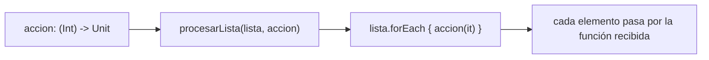
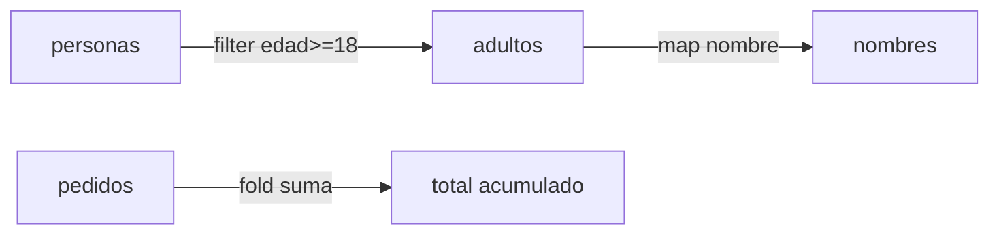

# Módulo 1: Programación funcional en Kotlin

Cada tema de este módulo se practica hasta que la sintaxis sale sin pensarla, con su propia repetición progresiva y su propio reto de memoria — funciones de orden superior, scope functions, sealed classes y lambdas con receptor son patrones que vas a usar en cada línea de código del resto del track.


## Aprende construyendo

### Tema 1: Funciones de orden superior

#### Paso 1 · Objetivo y preparación

Al finalizar podrás declarar una función que recibe otra función como parámetro, y usar la sintaxis de lambda final de Kotlin para invocarla de forma idiomática.

**Conocimiento previo:** Módulo 0 completo (null safety, data class, when, destructuring).

#### Paso 2 · Contexto y caso real

**¿Por qué es importante?** Los callbacks `onClick`/`onValueChange` en Jetpack Compose (Módulo 2 del track Android), o una estrategia de reintento configurable al llamar una API, dependen de pasar comportamiento como parámetro sin que la función receptora conozca de antemano qué hará ese comportamiento.

#### Paso 3 · Teoría con analogía

**Conceptos clave:** funciones como parámetros, sintaxis de lambda al final, firma de tipo de función.

`fun procesarLista(lista: List<Int>, accion: (Int) -> Unit) { lista.forEach { accion(it) } }` declara una función de orden superior que recibe `accion: (Int) -> Unit` como parámetro. `procesarLista(listOf(1, 2, 3)) { numero -> println(numero * 2) }` demuestra que si el último parámetro es una lambda, puede escribirse fuera de los paréntesis. La firma de tipo `(Int) -> Unit` es verificada por el compilador: pasar una función con firma incompatible es un error de compilación.

**Analogía:** una función de orden superior es una máquina de procesamiento genérica que acepta una herramienta intercambiable, sin saber de antemano cuál, solo que debe encajar en la ranura esperada (la firma de tipo).

**Diagrama:**



#### Paso 4 · Demostración guiada desde cero

Desde una carpeta vacía (o continuando en `academia-kmp`, o créala con `mkdir -p academia-kmp` si es tu primera vez), crea `shared/src/commonMain/kotlin/com/academia/kmp/OrdenSuperior.kt` con este contenido:

```kotlin
package com.academia.kmp

fun procesarLista(lista: List<Int>, accion: (Int) -> Unit) {
    lista.forEach { accion(it) }
}
```

Guarda el archivo y compila el módulo compartido:

```bash
# compila el módulo compartido de Kotlin Multiplatform con Gradle
mkdir -p academia-kmp/shared/src/commonMain/kotlin/com/academia/kmp
cd academia-kmp
./gradlew :shared:compileKotlinMetadata
```

**Explicación línea por línea:** `accion: (Int) -> Unit` documenta que el parámetro es una función que recibe un `Int` y no devuelve nada relevante; `lista.forEach { accion(it) }` invoca esa función recibida sobre cada elemento, sin que `procesarLista` sepa qué hace `accion` internamente.

Escribe un test que pase dos comportamientos distintos sin modificar `procesarLista`, en `shared/src/commonTest/kotlin/com/academia/kmp/OrdenSuperiorTest.kt`:

```kotlin
package com.academia.kmp

import kotlin.test.Test
import kotlin.test.assertEquals

class OrdenSuperiorTest {
    @Test
    fun duplicaCadaElemento() {
        val resultados = mutableListOf<Int>()
        procesarLista(listOf(1, 2, 3)) { numero -> resultados.add(numero * 2) }
        assertEquals(listOf(2, 4, 6), resultados)
    }

    @Test
    fun elevaAlCuadradoCadaElemento() {
        val resultadosCuadrado = mutableListOf<Int>()
        procesarLista(listOf(1, 2, 3)) { numero -> resultadosCuadrado.add(numero * numero) }
        assertEquals(listOf(1, 4, 9), resultadosCuadrado)
    }
}
```

Ejecuta el test real con Gradle:

```bash
# ejecuta el test Kotlin del módulo compartido
cd academia-kmp
./gradlew :shared:allTests
```

**Resultado esperado:** las dos pruebas pasan en verde, confirmando que la misma función `procesarLista` produce comportamientos completamente distintos según la función recibida, sin ninguna modificación a `procesarLista` en sí.

**Fallo deliberado:** intenta pasar `accion: (String) -> Unit` en Kotlin donde se espera `(Int) -> Unit` (por ejemplo, `procesarLista(listOf(1,2,3)) { texto: String -> println(texto) }`). `./gradlew :shared:compileKotlinMetadata` rechaza el código inmediatamente en tiempo de COMPILACIÓN porque la firma de tipo no coincide — diagnostica confirmando que la verificación de tipos de funciones de orden superior ocurre antes de ejecutar una sola línea, a diferencia de lenguajes con tipado dinámico donde el mismo error solo aparecería al ejecutar el código con ese argumento incompatible.

#### Paso 5 · Práctica guiada — repetición progresiva

1. `fun aplicarATodos(lista: List<Int>, f: (Int) -> Int): List<Int> = lista.map(f)` — usa `map` en vez de `forEach` para transformar y devolver.
2. `procesarLista(listOf(4, 5, 6)) { n -> println(n + 10) }` — el mismo patrón, otra operación.
3. Declara `fun repetir(veces: Int, accion: () -> Unit)` (sin parámetros) y llama a `repetir(3) { println("hola") }`.
4. Escribe de memoria (sin mirar) una función de orden superior con una firma `(Double) -> Boolean`.

**Pista:** identifica primero cuántos parámetros recibe la función que vas a pasar y qué devuelve, antes de escribir la firma de tipo completa entre paréntesis.

#### Paso 6 · Práctica independiente

**Completa el código:** rellena el espacio para que `transformar` reciba una función y la aplique al valor:

```kotlin
fun transformar(valor: Int, f: ____ -> Int): Int = f(valor)
val resultado = transformar(5) { it * 3 }
```

**Reto de memoria sin mirar:** cierra este documento y escribe, solo de memoria, una función de orden superior que reciba una lista de `String` y una función `(String) -> Boolean`, devolviendo cuántos elementos cumplen esa condición. Compara después contra el patrón del Paso 4.

#### Paso 7 · Cierre y evidencia

Ya declaras funciones que reciben comportamiento como parámetro, usas la sintaxis de lambda final, y confirmas que el compilador verifica la firma de tipo antes de ejecutar nada. El siguiente tema usa scope functions, frecuentemente combinadas con lambdas pasadas como parámetro. **Evidencia:** entrega el resultado de las dos pruebas pasando en verde, y el error real de compilación al pasar una firma de tipo incompatible. Fuente oficial: [Kotlin docs — Higher-order functions and lambdas](https://kotlinlang.org/docs/lambdas.html).

**Errores comunes:** olvidar que si la lambda es el único parámetro, los paréntesis vacíos son opcionales (`repetir(3) { ... }`, no `repetir(3) () { ... }`); declarar la firma de tipo con el orden de parámetros invertido respecto a como realmente se invoca la función.

**Cuándo no usarlo:** para una operación que siempre hace exactamente lo mismo sin ninguna variación posible, una función de orden superior agrega una capa de indirección innecesaria; resérvala para comportamiento genuinamente configurable por quien la invoca.

### Tema 2: Scope functions

#### Paso 1 · Objetivo y preparación

Al finalizar podrás elegir entre `let`, `run`, `apply` y `also` según qué necesites devolver (el receptor original o el resultado de un bloque) y cómo referenciar el receptor (`this` o `it`).

**Conocimiento previo:** Tema 1 de este módulo; null safety (Módulo 0, Tema 1).

#### Paso 2 · Contexto y caso real

**¿Por qué es importante?** Configurar un cliente HTTP con varios parámetros, ejecutar lógica solo si un valor nullable de una API existe, o registrar una traza sin alterar un objeto en una cadena de llamadas, son casos cotidianos donde cada scope function resuelve un propósito específico distinto.

#### Paso 3 · Teoría con analogía

**Conceptos clave:** `let` (ejecuta si no-null, devuelve resultado del bloque), `apply` (configura, devuelve el receptor), `run` (ejecuta bloque, devuelve resultado), `also` (efecto secundario, devuelve el receptor).

`usuario?.let { u -> println("Hola ${u.nombre}") }` ejecuta el bloque solo si `usuario` no es `null`. `val config = Config().apply { timeout = 30; reintentos = 3 }` configura y devuelve el mismo objeto configurado. `val resultado = obtenerDatos().run { procesar(this) }` ejecuta un bloque y devuelve el resultado de ESE bloque, no el objeto original. `also` es similar a `apply` (devuelve el receptor) pero recibe el receptor como `it` explícito, apropiado para logging (`objeto.also { println("Creado: $it") }`).

**Analogía:** `apply` es personalizar un producto y quedarte con el mismo producto personalizado; `run` es consultar algo del producto y quedarte con la respuesta, no el producto; `let` es actuar sobre un objeto solo si existe; `also` es anotar algo de paso sin alterarlo.

**Diagrama:**

```
┌──────────────┬───────────────────────┬───────────────────────────────┐
│              │ devuelve el RECEPTOR   │ devuelve el RESULTADO del bloque │
├──────────────┼───────────────────────┼───────────────────────────────┤
│ this implícito │        apply         │              run                │
│ it explícito   │        also          │              let                │
└──────────────┴───────────────────────┴───────────────────────────────┘
```

#### Paso 4 · Demostración guiada desde cero

Desde una carpeta vacía (o continuando en `academia-kmp`, o créala con `mkdir -p academia-kmp` si es tu primera vez), crea `shared/src/commonMain/kotlin/com/academia/kmp/ScopeFunctions.kt` con este contenido:

```kotlin
package com.academia.kmp

data class Config(var timeout: Int = 10, var reintentos: Int = 1)

fun construirConfig(): Config = Config().apply {
    timeout = 30
    reintentos = 3
}

fun saludarSiExiste(nombre: String?): String? = nombre?.let { n -> "Hola, $n" }
```

Guarda el archivo y compila el módulo compartido:

```bash
# compila el módulo compartido de Kotlin Multiplatform con Gradle
mkdir -p academia-kmp/shared/src/commonMain/kotlin/com/academia/kmp
cd academia-kmp
./gradlew :shared:compileKotlinMetadata
```

**Explicación línea por línea:** `Config().apply { timeout = 30; reintentos = 3 }` configura el objeto recién creado dentro del bloque (usando `this` implícito) y devuelve ESE MISMO objeto como resultado de toda la expresión; `nombre?.let { n -> "Hola, $n" }` ejecuta el bloque solo si `nombre` no es `null`, devolviendo el resultado del bloque (el saludo) en vez del `nombre` original.

Escribe un test que confirme qué devuelve cada scope function, en `shared/src/commonTest/kotlin/com/academia/kmp/ScopeFunctionsTest.kt`:

```kotlin
package com.academia.kmp

import kotlin.test.Test
import kotlin.test.assertEquals
import kotlin.test.assertNull

class ScopeFunctionsTest {
    @Test
    fun applyDevuelveElReceptorConfigurado() {
        val config = construirConfig()
        assertEquals(30, config.timeout)
        assertEquals(3, config.reintentos)
    }

    @Test
    fun letDevuelveElResultadoDelBloqueConValorPresente() {
        assertEquals("Hola, Nico", saludarSiExiste("Nico"))
    }

    @Test
    fun letNoEjecutaElBloqueConNull() {
        assertNull(saludarSiExiste(null))
    }
}
```

Ejecuta el test real con Gradle:

```bash
# ejecuta el test Kotlin del módulo compartido
cd academia-kmp
./gradlew :shared:allTests
```

**Resultado esperado:** las tres pruebas pasan en verde: `construirConfig()` devuelve el mismo objeto `Config` configurado (`timeout = 30, reintentos = 3`); `saludarSiExiste("Nico")` devuelve `"Hola, Nico"` (el resultado del bloque, no el `Config`); `saludarSiExiste(null)` devuelve `null` sin ejecutar el bloque.

**Fallo deliberado:** cambia `construirConfig` para usar `run` en vez de `apply` (`Config().run { timeout = 30; reintentos = 3 }`). `./gradlew :shared:compileKotlinMetadata` falla, porque el bloque de `run` termina con dos asignaciones (`reintentos = 3`) que no producen ningún valor de tipo `Config` — el tipo de retorno de `run` es el resultado del bloque (`Unit` en este caso), no el receptor, así que `construirConfig(): Config` deja de coincidir con lo que la expresión devuelve — diagnostica confirmando que confundir qué devuelve cada scope function (`apply`/`also` el receptor; `run`/`let` el resultado del bloque) rompe el tipo de retorno esperado, un error que el compilador atrapa inmediatamente.

#### Paso 5 · Práctica guiada — repetición progresiva

1. `Config().apply { timeout = 5 }` — confirma que el resultado es un `Config`, no un `Unit`.
2. `usuario?.let { it.nombre.uppercase() }` — confirma que el resultado es un `String?`, no un `Usuario?`.
3. `objeto.also { println("log: $it") }` — confirma que el resultado sigue siendo `objeto`, no lo que imprime `println`.
4. Escribe de memoria (sin mirar) un uso de `run` que reciba un objeto y devuelva un `Boolean` calculado a partir de él.

**Pista:** para saber qué devuelve cada scope function, pregúntate: ¿necesito seguir usando el objeto original después, o necesito el resultado de una operación sobre él?

#### Paso 6 · Práctica independiente

**Completa el código:** rellena el espacio para que la función se ejecute solo si `direccion` no es `null`:

```kotlin
val texto: String? = direccion ____ { d -> "Envía a: $d" }
```

**Reto de memoria sin mirar:** cierra este documento y escribe, solo de memoria, un ejemplo de `apply` y un ejemplo de `let` sobre el mismo tipo de objeto, explicando en una frase qué diferencia sus resultados. Compara después contra el patrón del Paso 4.

#### Paso 7 · Cierre y evidencia

Ya distingues las cuatro scope functions según qué devuelven y cómo referencian el receptor, confirmando con el compilador real qué ocurre al confundir `apply` con `run`. El siguiente tema modela estados exhaustivos con sealed classes, frecuentemente construidos dentro de un `apply`. **Evidencia:** entrega el resultado de las tres pruebas pasando en verde, y explica por qué cambiar `apply` por `run` en `construirConfig` rompe la compilación. Fuente oficial: [Kotlin docs — Scope functions](https://kotlinlang.org/docs/scope-functions.html).

**Errores comunes:** usar `apply` cuando en realidad se necesita el resultado de una transformación (debería ser `run` o `let`); anidar múltiples scope functions sin necesidad, dificultando saber a qué objeto se refiere `it`/`this` en cada nivel.

**Cuándo no usarlo:** para una única línea de asignación simple (`val x = 5`), envolverla en una scope function agrega indirección sin beneficio; resérvalas para configuración de múltiples propiedades, manejo de nulls, o efectos secundarios explícitos.

### Tema 3: Sealed classes y colecciones funcionales

#### Paso 1 · Objetivo y preparación

Al finalizar podrás modelar un conjunto cerrado de estados con sealed class, y encadenar `filter`/`map`/`fold` para transformar una colección de forma declarativa.

**Conocimiento previo:** when como expresión (Módulo 0, Tema 3); Tema 1 de este módulo (funciones de orden superior, base de `filter`/`map`).

#### Paso 2 · Contexto y caso real

**¿Por qué es importante?** Modelar el estado de una pantalla completa (cargando/éxito/error) en apps Android o Compose Multiplatform (Módulo 7), o filtrar y transformar una respuesta de API antes de mostrarla, son casos donde sealed classes y colecciones funcionales se combinan constantemente.

#### Paso 3 · Teoría con analogía

**Conceptos clave:** sealed class (conjunto cerrado de subtipos), `filter`/`map` encadenados, `fold` para acumular.

`sealed class EstadoUI { object Cargando : EstadoUI(); data class Exito(val datos: List<Tarea>) : EstadoUI(); data class Error(val mensaje: String) : EstadoUI() }` modela el conjunto completo de estados posibles. `val nombres = personas.filter { it.edad >= 18 }.map { it.nombre }` encadena transformaciones: filtrar primero, transformar después. `fold` (`pedidos.fold(0.0) { acumulado, pedido -> acumulado + pedido.monto }`) acumula un resultado combinando cada elemento con un valor inicial explícito.

**Analogía:** una sealed class para modelar estados es un semáforo con exactamente tres estados conocidos de antemano; encadenar `filter`+`map` es una línea de producción donde primero se descartan piezas que no cumplen un criterio y luego se transforman las restantes.

**Diagrama:**



#### Paso 4 · Demostración guiada desde cero

Desde una carpeta vacía (o continuando en `academia-kmp`, o créala con `mkdir -p academia-kmp` si es tu primera vez), crea `shared/src/commonMain/kotlin/com/academia/kmp/EstadoYColecciones.kt` con este contenido:

```kotlin
package com.academia.kmp

data class Persona(val nombre: String, val edad: Int)
data class Pedido(val monto: Double)

fun nombresAdultos(personas: List<Persona>): List<String> =
    personas.filter { it.edad >= 18 }.map { it.nombre }

fun totalPedidos(pedidos: List<Pedido>): Double =
    pedidos.fold(0.0) { acumulado, pedido -> acumulado + pedido.monto }
```

Guarda el archivo y compila el módulo compartido:

```bash
# compila el módulo compartido de Kotlin Multiplatform con Gradle
mkdir -p academia-kmp/shared/src/commonMain/kotlin/com/academia/kmp
cd academia-kmp
./gradlew :shared:compileKotlinMetadata
```

**Explicación línea por línea:** `personas.filter { it.edad >= 18 }` produce una nueva lista solo con adultos; `.map { it.nombre }` transforma esa lista filtrada extrayendo solo el nombre; `pedidos.fold(0.0) { acumulado, pedido -> acumulado + pedido.monto }` recorre cada pedido acumulando su monto sobre el valor inicial `0.0`.

Escribe un test que confirme el resultado de cada operación encadenada, en `shared/src/commonTest/kotlin/com/academia/kmp/EstadoYColeccionesTest.kt`:

```kotlin
package com.academia.kmp

import kotlin.test.Test
import kotlin.test.assertEquals

class EstadoYColeccionesTest {
    private val personas = listOf(Persona("Ana", 25), Persona("Leo", 15), Persona("Sofía", 30))
    private val pedidos = listOf(Pedido(19.99), Pedido(5.50), Pedido(100.0))

    @Test
    fun filtraYExtraeSoloLosNombresDeAdultos() {
        assertEquals(listOf("Ana", "Sofía"), nombresAdultos(personas))
    }

    @Test
    fun acumulaElTotalDeLosPedidos() {
        assertEquals(125.49, totalPedidos(pedidos), 0.001)
    }
}
```

Ejecuta el test real con Gradle:

```bash
# ejecuta el test Kotlin del módulo compartido
cd academia-kmp
./gradlew :shared:allTests
```

**Resultado esperado:** las dos pruebas pasan en verde: `nombresAdultos` devuelve `["Ana", "Sofía"]` (excluyendo a Leo, de 15 años); `totalPedidos` devuelve `125.49`, la suma acumulada de los tres montos.

**Fallo deliberado:** invierte el orden a `map` antes de `filter` (`personas.map { it.nombre }.filter { it.edad >= 18 }`). `./gradlew :shared:compileKotlinMetadata` falla en tiempo de COMPILACIÓN con `Unresolved reference: edad`, porque tras el `map`, el tipo de la lista pasó de `List<Persona>` a `List<String>`, y `String` no tiene una propiedad `edad` — diagnostica confirmando que el ORDEN de las operaciones encadenadas importa: una vez que `map` descarta información (aquí, transformando `Persona` en solo su nombre), esa información ya no está disponible para un `filter` posterior; filtra siempre antes de transformar si la transformación descarta datos que el filtro necesita.

#### Paso 5 · Práctica guiada — repetición progresiva

1. `numeros.filter { it % 2 == 0 }.map { it * it }` — filtra pares, eleva al cuadrado.
2. `palabras.filter { it.length > 3 }.map { it.uppercase() }` — filtra por longitud, transforma mayúsculas.
3. `productos.fold(0) { acumulado, p -> acumulado + p.cantidad }` — acumula una suma de enteros.
4. Escribe de memoria (sin mirar) un `filter`+`map` encadenado sobre una lista de tu elección, seguido de un `fold` sobre el resultado.

**Pista:** dibuja mentalmente cada paso como una lista nueva completa antes de encadenar el siguiente; nunca asumas que una operación posterior puede "ver" datos que una anterior ya descartó.

#### Paso 6 · Práctica independiente

**Completa el código:** rellena los espacios para filtrar tareas completadas y sumar sus prioridades:

```kotlin
val completadas = tareas.____ { it.completada }
val sumaPrioridades = completadas.____(0) { acumulado, t -> acumulado + t.prioridad }
```

**Reto de memoria sin mirar:** cierra este documento y escribe, solo de memoria, una sealed class de tres estados y un `when` exhaustivo que la maneje, seguido de un `filter`+`map` sobre una lista relacionada. Compara después contra los patrones de este módulo y del Módulo 0.

#### Paso 7 · Cierre y evidencia

Ya modelas estados exhaustivos con sealed classes y encadenas `filter`/`map`/`fold` respetando el orden en que cada operación consume o descarta datos. El siguiente tema extiende las lambdas hacia funciones con receptor, la base de los DSL que verás en Gradle y Compose. **Evidencia:** entrega los resultados de `adultos`, `nombres_adultos` y `total` del Paso 4, y explica por qué invertir `map` antes de `filter` habría roto la compilación en Kotlin real. Fuente oficial: [Kotlin docs — Collection operations](https://kotlinlang.org/docs/collection-operations.html).

**Errores comunes:** encadenar `map` antes de `filter` cuando el `map` descarta información que el `filter` necesita; usar `fold` sin un valor inicial explícito compatible con el tipo acumulado, produciendo un error de tipos.

**Cuándo no usarlo:** para una colección con miles de elementos donde el rendimiento es crítico y se encadenan muchas operaciones, cada `filter`/`map` intermedio crea una lista nueva; considera `asSequence()` para evaluación perezosa en ese caso específico, en vez de encadenar directamente sobre `List`.

### Tema 4: Lambdas con receptor y builders tipo DSL

#### Paso 1 · Objetivo y preparación

Al finalizar podrás escribir una función que reciba una lambda con receptor (`T.() -> Unit`), y explicar por qué esta capacidad es la base de los DSL que usarás en Gradle y Compose Multiplatform.

**Conocimiento previo:** Tema 2 de este módulo (`apply`, que ya usa lambda con receptor internamente); Tema 1 de este módulo (funciones de orden superior).

#### Paso 2 · Contexto y caso real

**¿Por qué es importante?** La sintaxis de `build.gradle.kts` (`dependencies { implementation("...") }`) y de Compose (`Column { Text("hola"); Button { ... } }`, Módulo 7 de este track) no son características especiales del lenguaje: son funciones ordinarias que reciben una lambda con receptor, la misma capacidad que vas a construir aquí desde cero.

#### Paso 3 · Teoría con analogía

**Conceptos clave:** lambda con receptor (`T.() -> Unit`), `this` implícito dentro del bloque, DSL (Domain Specific Language).

Una lambda normal (`(T) -> Unit`) recibe el objeto como parámetro (`it`); una lambda CON RECEPTOR (`T.() -> Unit`) hace que el objeto sea el receptor implícito (`this`) dentro del bloque, permitiendo llamar a sus miembros directamente sin prefijo. `apply` (Tema 2) ya usa esto: `Config().apply { timeout = 30 }` funciona porque `apply` recibe `T.() -> Unit`, no `(T) -> Unit`. Esta capacidad, combinada con funciones que construyen objetos anidados, es la base de cualquier DSL de Kotlin.

**Analogía:** una lambda normal te entrega el objeto para que lo uses explícitamente (`it.nombre`); una lambda con receptor te "transporta dentro" del objeto, como si estuvieras parado adentro de él, pudiendo referirte a sus propiedades directamente sin decir de quién son.

**Diagrama:**

```
┌── lambda normal ──────────────────────────────────────────┐
│  (persona) -> println(persona.nombre)   -- "it." explícito │
└─────────────────────────────────────────────────────────┘
┌── lambda con receptor ────────────────────────────────────┐
│  Persona.() -> println(nombre)   -- "this." implícito, se omite │
└─────────────────────────────────────────────────────────┘
```

#### Paso 4 · Demostración guiada desde cero

Desde una carpeta vacía (o continuando en `academia-kmp`, o créala con `mkdir -p academia-kmp` si es tu primera vez), crea `shared/src/commonMain/kotlin/com/academia/kmp/DslBuilder.kt` con este contenido:

```kotlin
package com.academia.kmp

class RutaBuilder {
    private val paradas = mutableListOf<String>()
    fun parada(nombre: String) { paradas.add(nombre) }
    fun construir(): List<String> = paradas.toList()
}

fun ruta(bloque: RutaBuilder.() -> Unit): List<String> {
    val builder = RutaBuilder()
    builder.bloque()  // el bloque se ejecuta CON RutaBuilder como receptor implícito
    return builder.construir()
}
```

Guarda el archivo y compila el módulo compartido:

```bash
# compila el módulo compartido de Kotlin Multiplatform con Gradle
mkdir -p academia-kmp/shared/src/commonMain/kotlin/com/academia/kmp
cd academia-kmp
./gradlew :shared:compileKotlinMetadata
```

**Explicación línea por línea:** `bloque: RutaBuilder.() -> Unit` declara que `bloque` es una función que, al ejecutarse, tiene `RutaBuilder` como receptor implícito (`this`); `builder.bloque()` ejecuta ese bloque usando `builder` como el `this` dentro de él; dentro de `ruta { parada("Depósito central") }`, `parada(...)` se resuelve como `builder.parada(...)` sin necesitar el prefijo, porque `this` dentro del bloque ES `builder`.

Escribe un test que construya una ruta usando la sintaxis sin prefijo, en `shared/src/commonTest/kotlin/com/academia/kmp/DslBuilderTest.kt`:

```kotlin
package com.academia.kmp

import kotlin.test.Test
import kotlin.test.assertEquals

class DslBuilderTest {
    @Test
    fun construyeRutaSinPrefijoDentroDelBloque() {
        val miRuta = ruta {
            parada("Depósito central")  // llamado sin prefijo: "this." implícito es el RutaBuilder
            parada("Cliente A")
            parada("Cliente B")
        }
        assertEquals(listOf("Depósito central", "Cliente A", "Cliente B"), miRuta)
    }
}
```

Ejecuta el test real con Gradle:

```bash
# ejecuta el test Kotlin del módulo compartido
cd academia-kmp
./gradlew :shared:allTests
```

**Resultado esperado:** la prueba pasa en verde, confirmando que `parada(...)` se escribe SIN ningún prefijo dentro del bloque de `ruta { ... }` — la lambda con receptor hace que `parada` se resuelva como `builder.parada(...)` automáticamente, la capacidad que hace que los DSL de Kotlin luzcan como si fueran una extensión del lenguaje en vez de llamadas a función ordinarias.

**Fallo deliberado:** cambia la firma de `ruta` de `bloque: RutaBuilder.() -> Unit` a `bloque: (RutaBuilder) -> Unit` (lambda normal, sin receptor) sin cambiar el resto. `./gradlew :shared:compileKotlinMetadata` falla, porque dentro de una lambda normal no existe un `this` implícito de tipo `RutaBuilder` — el test tendría que reescribirse como `ruta { it.parada("Depósito central") }`, con el receptor explícito — diagnostica confirmando que la diferencia entre `T.() -> Unit` y `(T) -> Unit` no es cosmética: determina si el código dentro del bloque puede omitir el receptor o debe nombrarlo explícitamente en cada llamada.

#### Paso 5 · Práctica guiada — repetición progresiva

1. Cambia `parada("Cliente C")` dentro de `miRuta` y confirma que la lista construida incluye el nuevo elemento.
2. Agrega un segundo método a `RutaBuilder` (`fun prioridad(nivel: Int)`) y llámalo dentro del mismo bloque `ruta { ... }` sin prefijo.
3. Declara un `PersonaBuilder` con `nombre` y `edad`, y una función `persona(bloque: PersonaBuilder.() -> Unit): Persona`.
4. Escribe de memoria (sin mirar) una función con lambda con receptor sobre un tipo de tu elección, con al menos dos métodos configurables dentro del bloque.

**Pista:** para saber si necesitas `T.() -> Unit` o `(T) -> Unit`, pregúntate si quieres escribir los métodos del bloque CON o SIN el prefijo del objeto.

#### Paso 6 · Práctica independiente

**Completa el código:** rellena el espacio para que `configurar` reciba una lambda con receptor sobre `Ajustes`:

```kotlin
class Ajustes { var modoOscuro = false; var idioma = "es" }

fun configurar(bloque: Ajustes.____ Unit): Ajustes {
    val ajustes = Ajustes()
    ajustes.bloque()
    return ajustes
}
```

**Reto de memoria sin mirar:** cierra este documento y escribe, solo de memoria, un builder simple (una clase con dos propiedades configurables) y una función que reciba una lambda con receptor sobre ese builder. Compara después contra el patrón del Paso 4.

#### Paso 7 · Cierre y evidencia

Ya distingues una lambda con receptor de una lambda normal, y construyes una función tipo DSL donde el bloque interno omite el prefijo del receptor. Esto cierra el módulo de programación funcional; el siguiente módulo usa coroutines y Flow, donde varias funciones (`launch { }`, `flow { }`) también reciben lambdas con receptor sobre su scope correspondiente. **Evidencia:** entrega el resultado de la prueba con `miRuta` construida, y explica qué cambia exactamente al pasar de `T.() -> Unit` a `(T) -> Unit` en la firma de `ruta`. Fuente oficial: [Kotlin docs — Function literals with receiver](https://kotlinlang.org/docs/lambdas.html#function-literals-with-receiver).

**Errores comunes:** confundir cuándo se necesita `T.()` (receptor implícito, sin prefijo) frente a `(T)` (parámetro explícito, con prefijo); anidar builders con receptores del mismo nombre de método, generando ambigüedad sobre a qué nivel de `this` se refiere una llamada.

**Cuándo no usarlo:** para una función que solo necesita leer datos de un objeto sin ninguna intención de ofrecer una sintaxis tipo DSL, una lambda normal (`(T) -> Unit`) es más clara porque hace explícito de qué objeto proviene cada llamada; resérvalo para builders donde la fluidez sintáctica es el objetivo deliberado.

---


## Laboratorio práctico

**Objetivo del laboratorio:** modelar un estado de UI (loading/success/error) con sealed classes manejado exhaustivamente, y construir un builder tipo DSL simple.

**Requisitos previos:** Módulo 0 completado.

| Paso | Acción | Código | Explicación |
|---|---|---|---|
| 1 | Escribir una función de orden superior | Ver Tema 1 | Recibe una lambda y la aplica a cada elemento |
| 2 | Usar `let` para una variable nullable | Ver Tema 2 | Sin un `if` explícito |
| 3 | Usar `apply` para configurar un objeto | Ver Tema 2 | En una sola expresión |
| 4 | Modelar `EstadoUI` con sealed class | Ver Tema 3 | Maneja todos los casos con `when` exhaustivo |
| 5 | Encadenar `map`/`filter`/`fold` | Ver Tema 3 | En una sola expresión |
| 6 | Escribir una función con lambda con receptor | Ver Tema 4 | Un builder simple tipo DSL |

**Verificación:** el laboratorio se considera exitoso si el `when` sobre `EstadoUI` compila sin rama `else` y sigue siendo exhaustivo, si puedes explicar la diferencia práctica entre las cuatro scope functions con un ejemplo propio de cada una, y si reproduces de memoria al menos uno de los cuatro patrones sin ver el ejemplo original.

**Errores comunes y soluciones**

- **Confundir cuándo usar `apply` frente a `run`.** `apply` devuelve el receptor original; `run` devuelve el resultado del bloque.
- **Agregar una rama `else` innecesaria a un `when` exhaustivo sobre sealed class.** Omítela para que el compilador verifique exhaustividad real.
- **Escribir un bucle manual en vez de `map`/`filter`/`fold`.** Prefiere las operaciones funcionales encadenadas para mayor legibilidad declarativa.
- **Confundir `T.() -> Unit` con `(T) -> Unit`.** El primero omite el prefijo del receptor dentro del bloque; el segundo lo requiere explícitamente.

---
