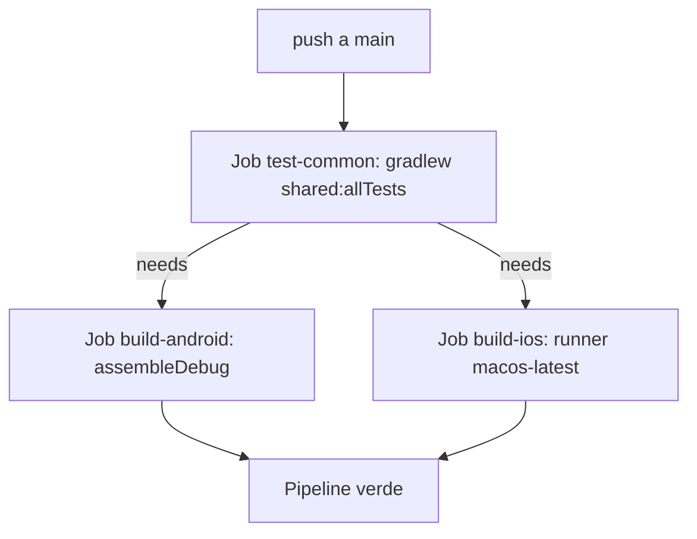
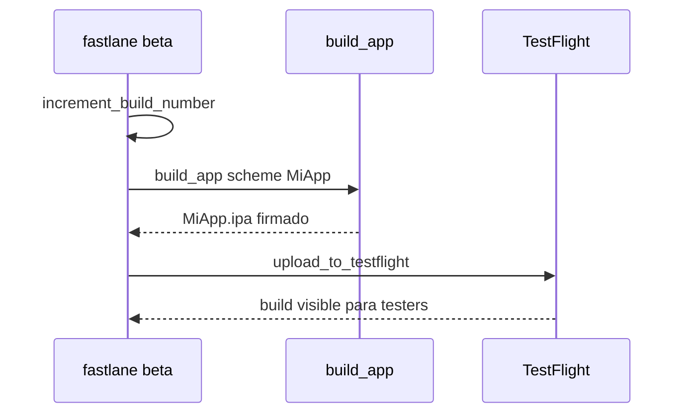

# Módulo 10: CI/CD para KMP


## Aprende construyendo

### Tema 1: Pipeline Gradle multiplataforma en CI

#### Paso 1 · Objetivo y preparación
Al finalizar vas a configurar un pipeline de CI que compile y pruebe el módulo `shared` contra el target Android y el target iOS en cada push, usando un runner macOS específicamente para iOS. Prerrequisitos: JDK 17+, Gradle, acceso a un runner CI con macOS disponible.

#### Paso 2 · Contexto y caso real
Un cambio en `commonMain` compiló perfectamente en el pipeline que solo corría `assembleDebug` de Android, se mergeó a `main`, y recién se descubrió roto para iOS tres días después, cuando alguien intentó hacer un build de release.

#### Paso 3 · Teoría, modelo mental y analogía
Un build exitoso en un target no garantiza éxito en el otro: un cambio puede usar accidentalmente una API no disponible para todos los targets desde `commonMain` (Módulo 3). Validar ambos targets en cada push detecta la regresión con el contexto todavía fresco. La analogía es probar un vehículo en ciudad y en montaña cada vez que se modifica el motor, no solo en el terreno más cómodo de probar.

#### Paso 4 · Demostración guiada desde cero
```yaml
jobs:
  test-common:
    steps:
      - run: ./gradlew :shared:allTests
  build-android:
    steps:
      - run: ./gradlew :androidApp:assembleDebug
  build-ios:
    runs-on: macos-latest
    steps:
      - run: ./gradlew :shared:linkDebugFrameworkIosArm64
```
Resultado esperado: el job `build-ios` corre específicamente en un runner `macos-latest` (porque el toolchain de Apple solo está disponible en macOS) y falla el pipeline completo si `commonMain` rompe la compilación de iOS, incluso si `build-android` pasó sin problemas.

#### Paso 5 · Práctica guiada
Pista: quitá el job `build-ios` del workflow "para ahorrar minutos de runner macOS, que son más caros". Ese es el fallo deliberado: un cambio en `commonMain` que rompe la compilación de iOS ahora pasa el pipeline completo en verde (porque solo se valida Android), y el equipo se entera del build roto recién cuando alguien intenta compilar la app de iOS localmente, días después del merge.

#### Paso 6 · Práctica independiente
Corregí el Paso 5 restaurando el job `build-ios` con `runs-on: macos-latest`, y agregá el job `test-common` como requisito previo (`needs:`) de ambos builds de plataforma, para que ninguno corra si la lógica compartida ya falla.

#### Paso 7 · Cierre y evidencia
Entregá el workflow con los tres jobs del Paso 4, el pipeline verde engañoso del Paso 5, y la corrección con `needs:` del Paso 6; explicá por qué ahorrar minutos de runner quitando un target de la validación traslada el costo real a un descubrimiento tardío y más caro. Siguiente paso: automatizá la firma y distribución de cada build con Fastlane. Errores comunes: validar solo un target asumiendo que el otro compilará igual, usar un runner Linux estándar para builds de iOS, y no declarar dependencias explícitas (`needs:`) entre el test de lógica compartida y los builds de plataforma. Fuentes oficiales: https://www.jetbrains.com/help/kotlin-multiplatform-dev/multiplatform-ci-cd.html y https://docs.github.com/actions/using-github-hosted-runners/about-github-hosted-runners.
**¿Por qué es importante?** Validar ambos targets en cada push detecta regresiones específicas de plataforma inmediatamente tras introducirse, con contexto fresco para diagnosticar, en vez de descubrirlas tardíamente justo antes de un release planificado.
**Evidencia de aprendizaje:** entrega workflow con los tres jobs, pipeline verde engañoso reproducido y dependencias needs corregidas.
**Conceptos clave:** validar ambos targets en cada push, runner macOS requerido para iOS.

```yaml
jobs:
  test-common:
    steps:
      - run: ./gradlew :shared:allTests   # corre commonTest en ambos targets
  build-android:
    steps:
      - run: ./gradlew :androidApp:assembleDebug
  build-ios:
    runs-on: macos-latest   # builds de iOS requieren un runner macOS
    steps:
      - run: ./gradlew :shared:linkDebugFrameworkIosArm64
```

Un pipeline de CI para un proyecto KMP necesita validar explícitamente ambos targets en cada push (no solo uno), dado que un cambio de código que compila perfectamente para Android puede fallar de forma completamente inesperada al compilar para iOS (por ejemplo, si usa accidentalmente una API no disponible en `commonMain` para todos los targets, Módulo 3), un problema que solo se detectaría ejecutando efectivamente el build de ambos targets, no asumiendo que un build exitoso en un target garantiza éxito en el otro. Un detalle técnico importante: compilar para targets de iOS requiere específicamente un runner de CI que ejecute macOS (dado que las herramientas de compilación de Apple, como el propio Xcode toolchain, solo están disponibles en ese sistema operativo), a diferencia del build de Android, que puede ejecutarse en cualquier runner Linux estándar más económico.

Validar ambos targets en cada push individual (no solo antes de un release) detecta regresiones de plataforma específica inmediatamente después de que se introducen, cuando el contexto del cambio todavía está fresco y es fácil de diagnosticar, en vez de descubrir días o semanas después, justo antes de un release planificado, que algún cambio intermedio rompió silenciosamente el build de una plataforma específica sin que nadie lo notara durante todo ese tiempo intermedio.

**Analogía:** validar ambos targets en cada push es como hacer una prueba de manejo de un vehículo en ambos tipos de terreno (ciudad y montaña) cada vez que se modifica algo del motor, en vez de probarlo solo en un terreno y asumir que funcionará igual de bien en el otro, descubriendo el problema real recién cuando efectivamente se necesita conducir en el terreno no probado.

**¿Por qué es importante?** Validar ambos targets en cada push detecta regresiones específicas de plataforma inmediatamente tras introducirse, con contexto fresco para diagnosticar, en vez de descubrirlas tardíamente justo antes de un release planificado.

**Casos de uso reales:**
- Detectar en un pull request que un cambio en `commonMain` rompe la compilación de iOS antes de hacer merge.
- Ejecutar `commonTest` (Módulo 9) en cada push para atrapar regresiones de lógica compartida temprano.
- Presupuestar el costo de CI sabiendo que los runners macOS para iOS son más caros que los runners Linux para Android.

**Configuración del ejemplo:**

```yaml
jobs:
  test-common:
    steps:
      - run: ./gradlew :shared:allTests   # corre commonTest en ambos targets
  build-android:
    steps:
      - run: ./gradlew :androidApp:assembleDebug
  build-ios:
    runs-on: macos-latest   # builds de iOS requieren un runner macOS
    steps:
      - run: ./gradlew :shared:linkDebugFrameworkIosArm64
```

Este pipeline vive como `.github/workflows/ci.yml` en el repositorio. El siguiente diagrama muestra por qué `test-common` debe ser `needs:` de ambos builds de plataforma:



El proyecto integrador RutaFlow aplica exactamente esta estructura: su módulo `shared` (`examples/rutaflow/kotlin-multiplatform/SyncEngine.kt`) se valida en `test-common` antes de que corran los builds de Android e iOS, para que un cambio roto en `SyncEngine` nunca llegue a compilarse como app completa en ninguna de las dos plataformas.

### Tema 2: Fastlane

#### Paso 1 · Objetivo y preparación
Al finalizar vas a automatizar con Fastlane la secuencia de build y subida a TestFlight de la app iOS en un único comando. Prerrequisitos: Tema 1 de este módulo; Xcode y Fastlane instalados (`fastlane --version`).

#### Paso 2 · Contexto y caso real
Cada release a TestFlight se hacía manualmente: alguien del equipo seguía una checklist de 6 pasos escrita en un documento compartido, y en el último release se olvidó incrementar el número de build, bloqueando la subida con un error de App Store Connect.

#### Paso 3 · Teoría, modelo mental y analogía
Fastlane reduce una secuencia de pasos manuales de release (firma, incremento de build, subida) a un único comando (`fastlane beta`) ejecutado de forma consistente cada vez. La analogía es un asistente automatizado que ejecuta una checklist compleja en el orden correcto, sin depender de que una persona la recuerde.

#### Paso 4 · Demostración guiada desde cero
```ruby
# fastlane/Fastfile
lane :beta do
  increment_build_number
  build_app(scheme: "MiApp")
  upload_to_testflight
end
```
Resultado esperado: `fastlane beta` incrementa automáticamente el número de build, compila el scheme correcto, y sube el `.ipa` resultante a TestFlight sin que nadie tenga que recordar manualmente el orden ni el número de build anterior.

#### Paso 5 · Práctica guiada
Pista: quitá la línea `increment_build_number` del lane "porque ya lo hacíamos a mano antes". Ese es el fallo deliberado: la siguiente vez que alguien corre `fastlane beta` sin recordar incrementar el número de build manualmente antes, la subida falla con el mismo error de "build number ya utilizado" que Fastlane estaba destinado a eliminar.

#### Paso 6 · Práctica independiente
Corregí el Paso 5 restaurando `increment_build_number` al inicio del lane, y agregá una verificación: corré `fastlane beta` dos veces seguidas y confirmá que la segunda subida tiene un número de build distinto a la primera sin intervención manual.

#### Paso 7 · Cierre y evidencia
Entregá el lane completo del Paso 4, el error de build number duplicado del Paso 5, y la verificación de dos ejecuciones consecutivas del Paso 6; explicá por qué automatizar "casi todos" los pasos de una checklist manual no elimina el riesgo del paso que queda afuera. Siguiente paso: sincronizá el número de versión entre ambas plataformas para evitar confusión al diagnosticar bugs. Errores comunes: automatizar solo algunos pasos de la checklist manual original, firmar con el certificate/provisioning profile equivocado por tener múltiples configurados, y no verificar el resultado de la subida antes de notificar al equipo que el release está listo. Fuentes oficiales: https://docs.fastlane.tools/ y https://docs.fastlane.tools/actions/upload_to_testflight/.
**¿Por qué es importante?** Fastlane automatiza pasos de release tediosos y propensos a error humano en un único comando consistente y repetible, pero solo elimina el riesgo de los pasos que efectivamente automatiza.
**Evidencia de aprendizaje:** entrega lane completo, error de build number duplicado reproducido y verificación de dos ejecuciones consecutivas.
**Conceptos clave:** automatización de pasos de release tediosos y propensos a error.

```ruby
# fastlane/Fastfile
lane :beta do
  build_app(scheme: "MiApp")
  upload_to_testflight
end
```

Fastlane automatiza una secuencia de pasos manuales de release que, realizados a mano en cada ciclo, son tanto tediosos como propensos a error humano: firma de código con los certificados y perfiles de aprovisionamiento correctos, incremento consistente del número de build entre releases sucesivos, y la subida efectiva hacia plataformas de distribución (TestFlight para iOS, un track interno o de producción de Play Console para Android), todo reducido a un único comando (`fastlane beta`) que ejecuta la secuencia completa de forma consistente y repetible cada vez, sin depender de que una persona recuerde correctamente cada paso individual en el orden correcto.

Esta automatización es particularmente valiosa en un contexto multiplataforma como KMP, donde el proceso de release involucra necesariamente dos plataformas de distribución completamente distintas (App Store Connect para iOS, Google Play Console para Android), cada una con su propio conjunto de requisitos, formatos, y pasos específicos de configuración, un proceso manual combinado considerablemente más propenso a errores u omisiones que automatizar cada mitad del proceso con Fastlane de forma independiente pero coordinada.

**Analogía:** Fastlane es como un asistente automatizado que ejecuta consistentemente toda una checklist compleja de preparación antes de un evento importante, en el orden correcto y sin omitir ningún paso, en vez de depender de que una persona recuerde manualmente cada elemento específico de esa checklist cada vez que se repite el proceso.

**¿Por qué es importante?** Fastlane automatiza pasos de release tediosos y propensos a error humano (firma, versionado, subida a las plataformas de distribución) en un único comando consistente y repetible.

**Casos de uso reales:**
- Publicar una nueva build a TestFlight automáticamente al mergear a la rama `release`, sin intervención manual.
- Subir simultáneamente builds de Android e iOS de la misma versión en un único paso de CI coordinado.
- Evitar el error humano clásico de subir a producción una build firmada con el certificado de desarrollo equivocado.

**Código del ejemplo:**

```ruby
lane :beta do
  build_app(scheme: "MiApp")
  upload_to_testflight
end
```

El lane termina firmando y subiendo el binario de una app como `examples/rutaflow/ios/RutaFlowApp.swift` (proyecto integrador RutaFlow) empaquetado con el `Shared.framework` del Módulo 8. Antes de confiar en `fastlane beta` en CI, conviene validar el toolchain por separado: `swift --version` confirma que el runner tiene Swift disponible para compilar el `.ipa`. La secuencia completa del lane:



**Cuándo no conviene:** si el equipo libera a producción una vez por trimestre y con un solo certificado, el costo de mantener lanes, certificados y perfiles de aprovisionamiento actualizados puede superar el ahorro frente a ejecutar esos pocos pasos a mano desde Xcode; Fastlane paga su propio mantenimiento recién cuando la frecuencia de release es alta. Es un trade-off entre automatizar el pipeline y mantener el propio Fastfile actualizado con cada cambio de Xcode o de las APIs de las tiendas.

### Tema 3: Versionado compartido

#### Paso 1 · Objetivo y preparación
Al finalizar vas a centralizar el número de versión del módulo compartido en un único archivo leído por los pipelines de build de Android y de iOS. Prerrequisitos: Tema 2 de este módulo.

#### Paso 2 · Contexto y caso real
Un usuario reporta un bug desde la app iOS versión "2.3.1", y el equipo tarda media hora en determinar qué versión específica de la lógica de `commonMain` corresponde a esa build, porque Android e iOS versionan de forma completamente independiente.

#### Paso 3 · Teoría, modelo mental y analogía
Centralizar el número de versión en un archivo compartido leído por ambos pipelines de build evita la confusión de no saber con certeza qué versión del módulo compartido corre cada plataforma. La analogía es todas las sucursales de una franquicia siguiendo exactamente la misma edición del manual de operaciones central.

#### Paso 4 · Demostración guiada desde cero
```properties
# version.properties (leído por ambos pipelines de build)
sharedVersion=2.3.1
```
```kotlin
// shared/build.gradle.kts
val sharedVersion = file("../version.properties").readLines()
    .first { it.startsWith("sharedVersion=") }.substringAfter("=")
version = sharedVersion
```
Resultado esperado: tanto el pipeline de Android como el de iOS leen el mismo `version.properties` al compilar, de modo que una build de Android "2.3.1" y una build de iOS "2.3.1" corresponden exactamente al mismo commit del módulo compartido.

#### Paso 5 · Práctica guiada
Pista: dejá que cada plataforma siga incrementando su propio número de versión de forma independiente en su respectivo proyecto "porque ya tienen su propio ciclo de release". Ese es el fallo deliberado: un usuario reporta un bug desde "iOS 2.3.1", pero esa versión puede corresponder a una versión distinta del módulo compartido que "Android 2.3.1", y el equipo no tiene ninguna forma confiable de saberlo sin revisar manualmente el historial de commits de cada plataforma.

#### Paso 6 · Práctica independiente
Corregí el Paso 5 centralizando de nuevo el número de versión en `version.properties`, y documentá en el README del proyecto que ningún pipeline de plataforma debe sobrescribir ese valor de forma independiente.

#### Paso 7 · Cierre y evidencia
Entregá el archivo de versión compartido del Paso 4, la confusión de versiones divergentes del Paso 5, y la corrección documentada del Paso 6; explicá por qué un "ciclo de release independiente por plataforma" no justifica versionar el módulo compartido de forma independiente. Siguiente paso: usá este mismo principio de fuente única de verdad al diseñar la arquitectura del proyecto integrador completo. Errores comunes: dejar que cada plataforma versione el módulo compartido por su cuenta, no documentar la fuente única de verdad del versionado para nuevos integrantes del equipo, y confundir la versión de la app con la versión del módulo compartido. Fuentes oficiales: https://docs.gradle.org/current/userguide/writing_build_scripts.html y https://developer.android.com/studio/publish/versioning.
**¿Por qué es importante?** Sincronizar el versionado entre ambas plataformas evita la confusión de no saber con certeza qué versión del módulo compartido corre cada plataforma, simplificando el diagnóstico de bugs reportados por usuarios.
**Evidencia de aprendizaje:** entrega archivo de versión compartido funcionando, confusión de versiones divergentes reproducida y corrección documentada.
**Conceptos clave:** mismo número de versión entre ambas apps, evitando confusión.

Mantener el número de versión sincronizado entre la app Android y la app iOS, típicamente centralizado en un archivo de configuración compartido leído por ambos pipelines de build respectivos, evita la confusión concreta de no saber con certeza qué versión específica del módulo compartido corre efectivamente cada plataforma en un momento dado, un problema particularmente relevante al diagnosticar un bug reportado por un usuario: sin versionado sincronizado, sería necesario primero determinar qué versión específica de la lógica compartida corresponde a la versión de la app reportada por el usuario en cada plataforma, una complejidad adicional evitable centralizando el versionado desde el origen.

**Analogía:** el versionado compartido es como asegurarse de que todas las sucursales de una franquicia sigan exactamente la misma edición del manual de operaciones central, evitando la confusión de que distintas sucursales operen simultáneamente según versiones distintas y potencialmente incompatibles del mismo manual base.

**¿Por qué es importante?** Sincronizar el versionado entre ambas plataformas evita la confusión de no saber con certeza qué versión del módulo compartido corre cada plataforma, simplificando el diagnóstico de bugs reportados por usuarios.

**Casos de uso reales:**
- Un usuario reporta un bug desde la app iOS 2.3.1; el equipo identifica de inmediato qué versión de `commonMain` corresponde.
- Coordinar un release simultáneo donde Android e iOS despliegan la misma versión del módulo compartido el mismo día.
- Auditar en logs de crash qué versión del módulo compartido estaba activa en el momento del fallo.

**Diagrama:**

```
Archivo de versión compartido → leído por el pipeline de build de Android y de iOS
Evita: "¿qué versión del módulo compartido corre esta versión específica de cada app?"
```

---


## Laboratorio práctico

**Objetivo del laboratorio:** construir un pipeline CI que compile el módulo compartido para Android e iOS en cada push.

**Requisitos previos:** Módulos 0-9 completados.

| Paso | Acción | Código | Explicación |
|---|---|---|---|
| 1 | Configurar el pipeline que compile ambos targets | Ver Tema 1 | En cada push |
| 2 | Agregar `commonTest` como paso obligatorio | Ver Tema 1 | Debe pasar para continuar |
| 3 | Configurar Fastlane para Android | Ver Tema 2 | Build y firma automatizados |
| 4 | Documentar la extensión hacia TestFlight/Play Console | Ver Tema 2 | Subida automática |

**Verificación:** el laboratorio se considera exitoso si el pipeline falla correctamente ante un cambio que rompe el build de cualquiera de los dos targets, y si Fastlane ejecuta el build y la firma de la app Android con un único comando.

**Errores comunes y soluciones**

- **Validar solo un target en CI, asumiendo que el otro compilará igual.** Valida explícitamente ambos targets en cada push.
- **Usar un runner Linux estándar para builds de iOS.** Los builds de iOS requieren específicamente un runner macOS.
- **Desincronizar el número de versión entre las apps Android e iOS.** Centraliza el versionado en un archivo compartido leído por ambos pipelines.

---
