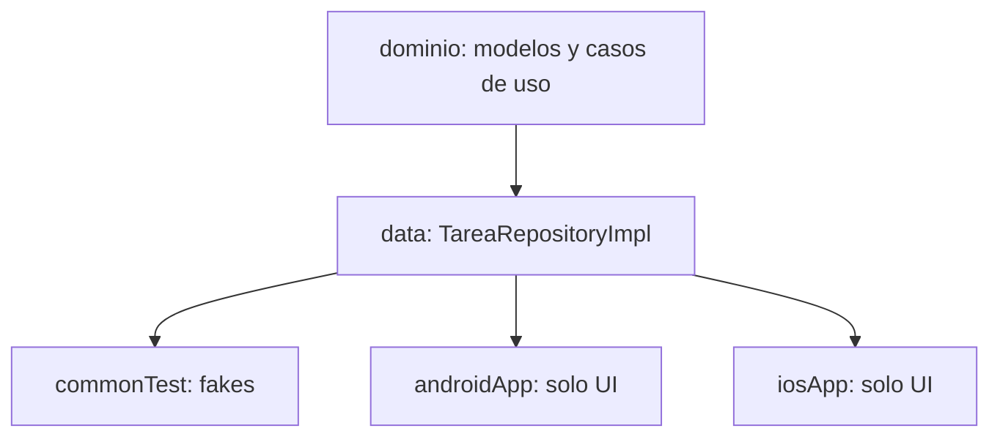
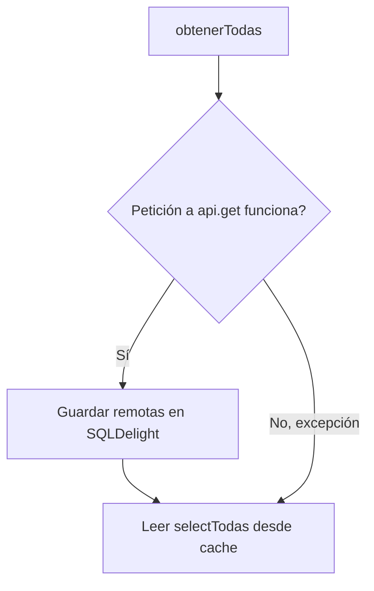
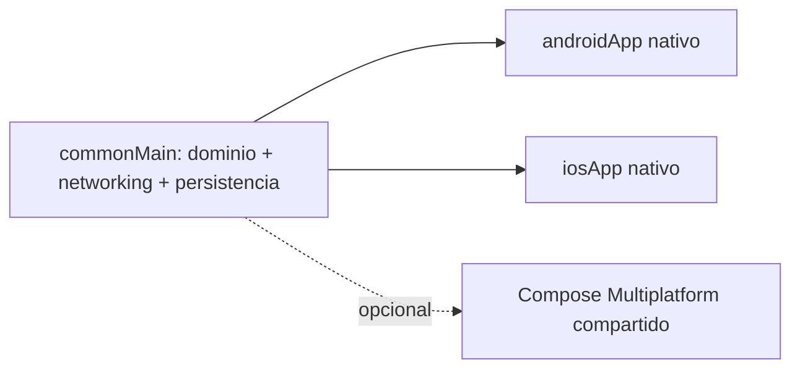

# Módulo 11: Proyecto integrador — app KMP completa


## Aprende construyendo

### Tema 1: Arquitectura del proyecto integrador

#### Paso 1 · Objetivo y preparación
Al finalizar vas a organizar el proyecto integrador completo en `commonMain` (dominio + datos), `commonTest`, `androidApp` e `iosApp`, documentando qué vive en cada capa. Prerrequisitos: Módulos 0-10 completados.

#### Paso 2 · Contexto y caso real
Un desarrollador nuevo se incorpora al proyecto integrador y no tiene claro si debe implementar una nueva validación de tareas en `androidApp`, en `iosApp`, o en algún lugar compartido — termina duplicándola en ambos antes de que alguien lo corrija en code review.

#### Paso 3 · Teoría, modelo mental y analogía
La arquitectura organiza `shared/src/commonMain/kotlin/` en `dominio/` (modelos y casos de uso) y `data/` (repositorios combinando Ktor y SQLDelight), con `commonTest/` verificando esa lógica con fakes; `androidApp/` e `iosApp/` contienen solo la UI específica de cada plataforma. La analogía es una fábrica central que produce el componente común, distribuido hacia dos plantas de ensamblaje final especializadas.

#### Paso 4 · Demostración guiada desde cero
```text
shared/src/
  commonMain/kotlin/
    dominio/        <- modelos + casos de uso (Módulo 4)
    data/           <- TareaRepositoryImpl (Ktor + SQLDelight, Módulos 5-6)
  commonTest/        <- tests con fakes (Módulo 9)
androidApp/           <- UI Compose o Jetpack Compose nativo
iosApp/                <- UI SwiftUI consumiendo Shared.framework (Módulo 8)
```
Resultado esperado: cualquier regla de negocio nueva (como una validación de tareas) tiene un lugar inequívoco donde vivir — `dominio/` si es lógica pura, `data/` si involucra persistencia — y ninguna de las dos apps específicas de plataforma necesita reimplementarla.

#### Paso 5 · Práctica guiada
Pista: cuando el desarrollador nuevo pregunta dónde poner la nueva validación, decile "poné una copia en Android y otra en iOS, así cada equipo controla su propia versión". Ese es el fallo deliberado: ahora existen dos implementaciones independientes de la misma regla de negocio que, inevitablemente, divergen en el primer cambio futuro que solo se aplique a una de las dos copias.

#### Paso 6 · Práctica independiente
Corregí el Paso 5 moviendo la validación a `dominio/` en `commonMain`, escribiendo su test en `commonTest`, y documentando en el README del proyecto el criterio explícito: "toda regla de negocio nueva vive en `commonMain` salvo que dependa genuinamente de una API nativa de plataforma".

#### Paso 7 · Cierre y evidencia
Entregá la estructura documentada del Paso 4, la duplicación evitable del Paso 5, y el criterio documentado del Paso 6; explicá por qué una decisión de arquitectura sin un criterio explícito y escrito termina resolviéndose caso por caso de forma inconsistente entre desarrolladores. Siguiente paso: implementá la sincronización de datos remotos con caché local dentro de `data/`. Errores comunes: no documentar explícitamente el criterio de qué vive en `commonMain` frente a cada plataforma, dejar que cada desarrollador decida el límite caso por caso sin un criterio compartido, y mezclar lógica de UI dentro de `dominio/`. Fuentes oficiales: https://kotlinlang.org/docs/multiplatform-discover-project.html y https://kotlinlang.org/docs/multiplatform-architect-your-app.html.
**¿Por qué es importante?** El proyecto integrador demuestra el patrón central de KMP en su forma más completa: maximizar código compartido verificado una única vez, aislando en cada plataforma únicamente lo que genuinamente requiere integración nativa específica.
**Evidencia de aprendizaje:** entrega estructura documentada, duplicación evitable detectada y criterio de capas documentado en el README.
**Conceptos clave:** capas compartidas frente a UI específica o compartida, tests con fakes.

El proyecto integrador organiza el código compartido en `shared/src/commonMain/kotlin/` con `dominio/` (modelos y casos de uso, Módulo 4) y `data/` (`TareaRepositoryImpl` combinando Ktor para datos remotos y SQLDelight para caché local, Módulos 5-6), con `commonTest/` conteniendo los tests que verifican esa lógica compartida usando fakes (Módulo 9); `androidApp/` e `iosApp/` contienen la UI específica de cada plataforma (ya sea nativa completa — Jetpack Compose en Android, SwiftUI en iOS consumiendo el `Shared.framework`, Módulo 8 — o Compose Multiplatform compartido, Módulo 7, según la decisión de arquitectura tomada para ese proyecto específico).

Esta estructura demuestra el patrón central de todo el track aplicado en su forma más completa: maximizar el código en `commonMain` (dominio, datos, y potencialmente UI si se opta por Compose Multiplatform) mientras se aísla en cada `App` específico únicamente lo que genuinamente requiere una integración nativa profunda de cada plataforma particular, con `commonTest` verificando exhaustivamente esa capa compartida una única vez, con la garantía de que esa verificación es igualmente válida para ambas plataformas de destino.

**Analogía:** la arquitectura del proyecto integrador es como una fábrica central que produce el componente principal común (compartido en `commonMain`) distribuido hacia dos plantas de ensamblaje final especializadas (`androidApp`, `iosApp`), cada una encargándose únicamente del acabado final específico según el mercado particular al que se dirige.

**¿Por qué es importante?** El proyecto integrador demuestra el patrón central de KMP en su forma más completa: maximizar código compartido verificado una única vez, aislando en cada plataforma únicamente lo que genuinamente requiere integración nativa específica.

**Casos de uso reales:**
- Una app de gestión de tareas real, con la misma lógica de dominio publicada simultáneamente en Google Play y App Store.
- Onboarding de un nuevo desarrollador al proyecto, que entiende de un vistazo qué vive en `commonMain` frente a cada `App`.
- Estimar el esfuerzo de una nueva funcionalidad según cuánto de ella puede vivir en código compartido frente a UI nativa.

**Diagrama:**

```
shared/src/
  commonMain/kotlin/
    dominio/        ← modelos + casos de uso (módulo 4)
    data/           ← TareaRepositoryImpl (Ktor + SQLDelight, módulos 5-6)
  commonTest/        ← tests con fakes (módulo 9)
androidApp/           ← UI Compose o Jetpack Compose nativo
iosApp/                ← UI SwiftUI consumiendo Shared.framework (módulo 8)
```

La misma frontera se verifica compilando solo el módulo compartido con Gradle (`./gradlew :shared:build`), sin tocar `androidApp` ni `iosApp`, lo que confirma que el dominio y los datos no dependen de ninguna de las dos apps:



### Tema 2: Sincronización de datos remotos con caché local

#### Paso 1 · Objetivo y preparación
Al finalizar vas a implementar un `TareaRepositoryImpl` que combine Ktor (datos remotos) y SQLDelight (caché local) con fallback automático cuando la red falla. Prerrequisitos: Tema 1 de este módulo.

#### Paso 2 · Contexto y caso real
Un usuario de la app de tareas entra a un túnel sin señal y la app muestra una pantalla de error vacía en vez de las tareas que ya había cargado minutos antes, porque el repositorio actual falla por completo ante cualquier error de red.

#### Paso 3 · Teoría, modelo mental y analogía
El patrón "red primero, con fallback a caché local" combina ambas capas de persistencia en una única fuente de verdad: si la petición remota tiene éxito, actualiza la caché local antes de leerla; si falla, recurre directamente a los datos ya existentes en la caché. La analogía es un asistente que consulta primero la fuente más actualizada, pero recurre a la última copia confiable si esa fuente no está accesible.

#### Paso 4 · Demostración guiada desde cero
```kotlin
class TareaRepositoryImpl(
    private val api: HttpClient,
    private val db: Database,
) : TareaRepository {
    override suspend fun obtenerTodas(): List<Tarea> = try {
        val remotas = api.get("/tareas").body<List<TareaDTO>>()
        db.tareaQueries.transaction { remotas.forEach { guardarLocal(it) } }
        db.tareaQueries.selectTodas().executeAsList()
    } catch (e: Exception) {
        db.tareaQueries.selectTodas().executeAsList() // fallback offline a la caché local
    }
}
```
Resultado esperado: con conexión, `obtenerTodas()` devuelve datos remotos frescos ya persistidos en caché; sin conexión, el mismo método devuelve los últimos datos guardados en caché en vez de propagar la excepción de red hacia la UI.

#### Paso 5 · Práctica guiada
Pista: quitá el bloque `try/catch` dejando solo la llamada directa a `api.get(...)` "porque simplifica el código". Ese es el fallo deliberado: al simular un corte de red (apagando el servidor Floci local), `obtenerTodas()` ahora propaga la excepción sin capturarla, y la pantalla de tareas muestra un error completo en vez de las tareas ya cacheadas de la sesión anterior.

#### Paso 6 · Práctica independiente
Corregí el Paso 5 restaurando el `try/catch` con fallback a `db.tareaQueries.selectTodas()`, y verificá manualmente el comportamiento apagando el servidor Floci local (Módulo 5) y confirmando que la pantalla sigue mostrando las tareas de la última sincronización exitosa.

#### Paso 7 · Cierre y evidencia
Entregá el repositorio con fallback del Paso 4, la pantalla de error reproducida del Paso 5, y la verificación manual sin red del Paso 6; explicá por qué "simplificar" eliminando el manejo de errores de red convierte un problema de conectividad temporal en una falla completa de la aplicación. Siguiente paso: cerrá el track reflexionando sobre qué compartir realmente entre Android e iOS. Errores comunes: no implementar ningún fallback offline en el repositorio, decidir compartir la lógica de sincronización pero duplicarla por error en cada plataforma, y no probar manualmente el comportamiento sin conexión antes de confiar en el fallback. Fuentes oficiales: https://ktor.io/docs/client-exceptions.html y https://cashapp.github.io/sqldelight/.
**¿Por qué es importante?** Combinar Ktor y SQLDelight en el repositorio compartido, con fallback offline a la caché local, hace que ambas plataformas se beneficien exactamente del mismo comportamiento de resiliencia ante conectividad intermitente, sin duplicar esa lógica de sincronización por separado.
**Evidencia de aprendizaje:** entrega repositorio con fallback funcionando, pantalla de error sin manejo reproducida y verificación manual sin red confirmada.
**Conceptos clave:** repositorio como única fuente de verdad, fallback offline.

```kotlin
class TareaRepositoryImpl(
    private val api: HttpClient,
    private val db: Database,
) : TareaRepository {
    override suspend fun obtenerTodas(): List<Tarea> = try {
        val remotas = api.get("/tareas").body<List<TareaDTO>>()
        db.tareaQueries.transaction { remotas.forEach { guardarLocal(it) } }
        db.tareaQueries.selectTodas().executeAsList()
    } catch (e: Exception) {
        db.tareaQueries.selectTodas().executeAsList() // fallback offline a la caché local
    }
}
```

Esta implementación del repositorio combina ambas capas de persistencia estudiadas en el track (Ktor para obtener datos remotos actualizados, SQLDelight para persistir localmente esos datos como caché) en una única fuente de verdad coherente hacia el resto de la aplicación: si la petición de red exitosa, actualiza la caché local con los datos remotos más recientes antes de devolver el resultado leído desde esa misma caché local recién actualizada; si la petición de red falla (sin conexión, timeout, o cualquier otro error), el `catch` recurre directamente a los datos ya existentes en la caché local como fallback, permitiendo que la aplicación siga siendo funcional (mostrando los últimos datos conocidos) incluso sin conexión de red disponible, en vez de fallar completamente ante cualquier problema de conectividad.

Este patrón de "red primero, con fallback a caché local" (u otras variantes similares, como "caché primero, actualizar en segundo plano") es una decisión de arquitectura de sincronización de datos extremadamente común en aplicaciones móviles reales, donde la conectividad de red del usuario nunca puede asumirse como garantizada ni constante, y compartir esta lógica de sincronización específica en `commonMain` significa que ambas plataformas se benefician exactamente del mismo comportamiento de resiliencia ante conectividad intermitente, sin necesidad de implementar esa lógica de sincronización por separado en cada plataforma.

**Analogía:** este patrón de sincronización es como un asistente que siempre intenta primero consultar la fuente de información más actualizada disponible, pero que, si esa fuente no está accesible en este momento, recurre automáticamente a la última copia confiable que ya tiene guardada, permitiendo seguir operando razonablemente bien incluso cuando la fuente principal está temporalmente inaccesible.

**¿Por qué es importante?** Combinar Ktor y SQLDelight en el repositorio compartido, con fallback offline a la caché local, hace que ambas plataformas se beneficien exactamente del mismo comportamiento de resiliencia ante conectividad intermitente, sin duplicar esa lógica de sincronización por separado.

**Casos de uso reales:**
- Una app de notas que sigue mostrando el contenido guardado aunque el usuario entre a un túnel sin señal.
- Un catálogo de productos de e-commerce que muestra precios de la última sincronización exitosa durante un corte de red.
- Cola de cambios pendientes de subir (Módulo 6) que se sincroniza automáticamente al recuperar conexión.

**Código del ejemplo:**

```kotlin
override suspend fun obtenerTodas(): List<Tarea> = try {
    val remotas = api.get("/tareas").body<List<TareaDTO>>()
    db.tareaQueries.transaction { remotas.forEach { guardarLocal(it) } }
    db.tareaQueries.selectTodas().executeAsList()
} catch (e: Exception) {
    db.tareaQueries.selectTodas().executeAsList() // fallback offline a la caché local
}
```

Este repositorio vive en `shared/src/commonMain/kotlin/com/academia/kmp/TareaRepositoryImpl.kt`, y se recompila para ambos targets con Gradle (`./gradlew :shared:build`). El flujo de decisión red-primero-fallback-caché:



El proyecto integrador RutaFlow resuelve el mismo problema desde el otro extremo: en vez de leer con fallback, `SyncEngine.drain()` (`examples/rutaflow/kotlin-multiplatform/SyncEngine.kt`) escribe con reintento — cuando `DeliveryApi.send()` falla, el comando queda en el `Outbox` con `scheduleRetry` en vez de perderse, el mismo principio de "la red puede fallar, el dato local no se descarta" aplicado a escrituras en vez de lecturas.

**Cuándo no conviene este patrón:** si los datos cambian con una frecuencia tan alta que una lectura desde caché desactualizada induce al usuario a tomar una decisión incorrecta (precios en una subasta en vivo, por ejemplo), servir un fallback silencioso es peor que mostrar explícitamente un error de conectividad; el trade-off entre disponibilidad (mostrar algo, aunque esté desactualizado) y consistencia (no mostrar nada que no esté confirmado) depende del costo real de un dato obsoleto en ese dominio específico.

### Tema 3: Cierre del track — la promesa realista de KMP

#### Paso 1 · Objetivo y preparación
Al finalizar vas a auditar el proyecto integrador completo y documentar explícitamente qué se comparte (y por qué) frente a qué se mantuvo nativo por plataforma. Prerrequisitos: Tema 2 de este módulo.

#### Paso 2 · Contexto y caso real
En la retrospectiva final del proyecto integrador, alguien del equipo pregunta "¿por qué no compartimos también la navegación y las pantallas, si ya compartimos todo lo demás?" — sin una respuesta clara, el próximo proyecto corre el riesgo de forzar una abstracción compartida donde no corresponde.

#### Paso 3 · Teoría, modelo mental y analogía
La promesa realista de KMP es compartir específicamente lo que es redundancia pura entre plataformas (lógica de negocio, networking, persistencia), dejando la UI como decisión de arquitectura deliberada: nativa por fidelidad, o Compose Multiplatform por velocidad de desarrollo compartido. La analogía es una cocina central que prepara los ingredientes base compartidos, mientras cada sucursal presenta el plato final según las preferencias de su clientela local.

#### Paso 4 · Demostración guiada desde cero
```text
Compartido (redundancia pura si se duplicara): lógica de negocio, networking, persistencia
Decisión de arquitectura del equipo: UI nativa (fidelidad) vs Compose Multiplatform (velocidad compartida)
```
Resultado esperado: un documento de cierre del proyecto que lista explícitamente cada capa del proyecto integrador (dominio, datos, UI) junto con la razón concreta de por qué se comparte o por qué se mantiene nativa, en vez de una decisión implícita o "por costumbre".

#### Paso 5 · Práctica guiada
Pista: respondé la pregunta de la retrospectiva con "sí, compartamos la navegación y las pantallas también en el próximo proyecto, así compartimos el 100%". Ese es el fallo deliberado: forzar una capa de UI compartida sin evaluar que la navegación y los gestos nativos de Android e iOS tienen modelos de interacción genuinamente distintos, termina produciendo una UI que ninguna de las dos plataformas simula bien, o un wrapper tan complejo que anula el ahorro de tiempo que se buscaba.

#### Paso 6 · Práctica independiente
Corregí el Paso 5 reemplazando la meta de "100% compartido" por una decisión explícita basada en las prioridades reales del equipo: si la fidelidad nativa importa genuinamente, la UI se mantiene nativa; si la velocidad de entrega importa más, se evalúa Compose Multiplatform con ese trade-off documentado explícitamente.

#### Paso 7 · Cierre y evidencia
Entregá el documento de cierre del Paso 4, la meta de "100% compartido" sin evaluar trade-offs del Paso 5, y la decisión documentada con su justificación del Paso 6; explicá por qué maximizar el porcentaje de código compartido no es, por sí mismo, un objetivo válido de arquitectura. Siguiente paso: si el proyecto crece, estudia cómo mantener la frontera compartida estable frente a múltiples equipos consumidores. Errores comunes: tratar "porcentaje compartido" como una métrica de éxito en sí misma, forzar una UI compartida sin evaluar si los modelos de interacción nativos realmente convergen, y no documentar la decisión para que el próximo proyecto no repita la misma discusión sin contexto. Fuentes oficiales: https://www.jetbrains.com/help/kotlin-multiplatform-dev/multiplatform-samples.html y https://kotlinlang.org/docs/multiplatform.html.
**¿Por qué es importante?** Entender que KMP comparte específicamente lo que es redundancia pura entre plataformas, dejando la UI como una decisión de arquitectura deliberada, evita expectativas poco realistas sobre qué KMP puede y debe compartir.
**Evidencia de aprendizaje:** entrega documento de cierre, meta de 100% compartido sin trade-offs detectada y decisión final justificada y documentada.
**Conceptos clave:** compartir donde la duplicación es redundancia, UI nativa donde importa la experiencia específica.

KMP no reemplaza el desarrollo nativo completo ni pretende hacerlo: la promesa realista y consolidada de KMP es compartir específicamente la lógica de negocio, el networking, y la persistencia (Módulos 4-6), áreas donde la duplicación entre Android e iOS es efectivamente redundancia pura sin ningún beneficio real (la lógica de filtrar tareas pendientes, o de sincronizar datos remotos con caché local, no tiene ninguna razón conceptual para diferir entre plataformas), mientras la UI puede seguir siendo completamente nativa por plataforma donde la experiencia específica de cada sistema operativo importa genuinamente (aprovechando al máximo las convenciones, gestos y patrones de interacción nativos específicos que los usuarios de cada plataforma esperan), o compartida con Compose Multiplatform (Módulo 7) cuando el equipo decide priorizar la velocidad de desarrollo compartido sobre la fidelidad exacta a las convenciones nativas de cada plataforma.

Esta decisión de dónde trazar exactamente la línea entre lo compartido y lo específico de plataforma es, en última instancia, una decisión de arquitectura que cada equipo debe tomar según sus propias prioridades concretas (velocidad de desarrollo compartido frente a fidelidad nativa exacta), sin que exista una única respuesta correcta universal aplicable a todos los proyectos por igual — el track completo proporciona las herramientas y el criterio necesario para tomar esa decisión de forma informada en cada caso específico.

**Analogía:** la promesa realista de KMP es como una cocina central que prepara los ingredientes base compartidos por todos los platos del menú de una cadena de restaurantes (donde preparar esos ingredientes por separado en cada sucursal sería pura redundancia), mientras cada sucursal individual conserva la libertad de presentar y servir el plato final según las preferencias específicas y las expectativas particulares de su clientela local.

**¿Por qué es importante?** Entender que KMP comparte específicamente lo que es redundancia pura entre plataformas (lógica, networking, persistencia), dejando la UI como una decisión de arquitectura deliberada (nativa por fidelidad, o compartida por velocidad), evita expectativas poco realistas sobre qué KMP puede y debe compartir.

**Casos de uso reales:**
- Una fintech que elige UI 100% nativa por plataforma (cumplimiento normativo y confianza del usuario) pero comparte toda la lógica de cálculo.
- Una herramienta interna de empresa que elige Compose Multiplatform para maximizar velocidad de entrega sobre fidelidad nativa exacta.
- Revisar en retrospectiva del equipo qué se compartió realmente y qué debería haberse mantenido nativo, ajustando el siguiente proyecto.

**Diagrama:**

```
Compartido (redundancia pura si se duplicara): lógica de negocio, networking, persistencia
Decisión de arquitectura del equipo: UI nativa (fidelidad) vs Compose Multiplatform (velocidad compartida)
```

El documento de cierre del proyecto (`shared/README.md` junto a `shared/src/commonMain/kotlin/`) resume con un diagrama qué quedó compartido y qué quedó nativo, y se verifica ejecutando una última vez Gradle (`./gradlew :shared:allTests :androidApp:assembleDebug`) para confirmar que la decisión documentada compila realmente en ambos targets:



---

## Laboratorio práctico

**Objetivo del laboratorio:** construir la app KMP integradora completa con lógica, networking, persistencia y UI, funcionando en Android e iOS.

**Requisitos previos:** Módulos 0-10 completados.

| Paso | Acción | Código | Explicación |
|---|---|---|---|
| 1 | Diseñar la arquitectura compartida completa | Ver Tema 1 | dominio + casos de uso + repositorios con Ktor+SQLDelight |
| 2 | Implementar la UI consumiendo el módulo compartido | Módulo 7 u 8 | Compose Multiplatform o nativa por plataforma |
| 3 | Sincronizar datos remotos con caché local | Ver Tema 2 | Con fallback offline |
| 4 | Configurar CI para ambos targets | Módulo 10 | Compilación y tests en cada push |

**Verificación:** el laboratorio (y el track completo) se considera exitoso si la app funciona correctamente en Android e iOS compartiendo la misma lógica de negocio, networking y persistencia, si sigue siendo funcional (mostrando datos en caché) sin conexión de red, y si el pipeline de CI valida ambos targets en cada push.

**Errores comunes y soluciones**

- **Duplicar la lógica de sincronización de datos por separado en cada plataforma.** Compártela en el repositorio de `commonMain`.
- **No implementar un fallback offline en el repositorio.** Sin él, la app falla completamente ante cualquier problema de conectividad.
- **Decidir compartir o no compartir UI sin evaluar las prioridades reales del equipo.** Evalúa fidelidad nativa frente a velocidad de desarrollo compartido según el contexto específico del proyecto.

---
