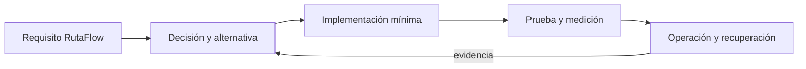

# Módulo 13: KMP Master: Native, Swift Export y publicación


## Aprende construyendo

### Tema 1: Kotlin/Native

#### Paso 1 · Objetivo y preparación
Al finalizar podrás aplicar este tema KMP desde cero. Prerrequisitos: JDK 17+, Kotlin, Gradle, Xcode cuando corresponda y editor. Verifica java --version, ./gradlew --version y xcodebuild -version.

#### Paso 2 · Contexto y caso real
En un caso real, una librería compartida debe compilar para sus targets, integrarse con plataformas y poder recuperarse de cambios incompatibles.

#### Paso 3 · Teoría, modelo mental y analogía
La frontera multiplataforma separa código común de adaptadores; Gradle coordina artefactos y CI; compatibilidad requiere API, ABI y metadata. La analogía es una pieza industrial con medidas y conectores documentados para varias máquinas.

#### Paso 4 · Demostración guiada desde cero
Parte de una carpeta vacía:
```bash
mkdir ejemplo-kmp-avanzado
cd ejemplo-kmp-avanzado
gradle init
mkdir -p shared/src/commonMain/kotlin
./gradlew tasks
```
Crea shared/build.gradle.kts y una API Kotlin mínima del tema; ejecuta la tarea real correspondiente y conserva su salida.

#### Paso 5 · Práctica guiada
Pista: cambia deliberadamente un target, símbolo o versión para provocar un fallo deliberado de Gradle/interoperabilidad; lee el diagnóstico y corrígelo. Resultado esperado: artefacto generado y contrato comprobable.

#### Paso 6 · Práctica independiente
Añade una prueba commonTest, un target adicional, documentación de API y un workflow CI; explica qué parte es común y qué parte es específica.

#### Paso 7 · Cierre y evidencia
Guarda archivos, comandos, artefacto, log y diff; como siguiente paso revisa publicación. Errores comunes: targets sin probar, API pública accidental, versiones flotantes y ocultar fallos del compilador. Fuentes oficiales: https://www.jetbrains.com/help/kotlin-multiplatform-dev/ y https://kotlinlang.org/docs/multiplatform.html.
**¿Por qué es importante?** Porque compartir código solo funciona cuando los contratos y artefactos son reproducibles.
**Evidencia de aprendizaje:** entrega estructura, build, fallo, corrección y prueba.
**Conceptos clave:** propósito, modelo de ejecución, configuración, seguridad, coste, pruebas y operación.

Kotlin/Native se estudia como una decisión de ingeniería y no como una colección de comandos. Primero identifica el problema que resuelve y los límites de la plataforma; luego construye el incremento mínimo dentro de RutaFlow. Registra entradas, salidas, dependencias y condiciones de fallo. Compara al menos una alternativa y conserva la medición que justifica la elección. Si la tecnología es experimental, se aísla del camino estable y se documenta la estrategia de retirada.

En producción debes considerar configuración por ambiente, identidad de máquina y persona, secretos, compatibilidad, telemetría y recuperación. Una demostración exitosa no prueba comportamiento bajo concurrencia, reintentos, pérdida de red o datos inválidos. Por eso el laboratorio introduce un fallo deliberado y exige una prueba de regresión. El resultado debe poder repetirse desde terminal y CI sin pasos secretos del editor.

**Analogía:** es como incorporar una nueva estación a una red logística: no basta con construirla; hay que definir rutas, capacidad, controles, contingencias y cómo sabremos que funciona.

**¿Por qué es importante?** Porque Kotlin/Native aparece cuando el sistema crece y las decisiones dejan de ser locales. Comprender su coste evita adoptar una herramienta por popularidad o descartarla por una primera experiencia incompleta.

**Casos de uso reales:** operación normal, configuración inválida, dependencia lenta, solicitud duplicada, cambio incompatible y recuperación posterior a un despliegue fallido.

**Diagrama:**


### Tema 2: Interop con C

#### Paso 1 · Objetivo y preparación
Al finalizar podrás aplicar este tema KMP desde cero. Prerrequisitos: JDK 17+, Kotlin, Gradle, Xcode cuando corresponda y editor. Verifica java --version, ./gradlew --version y xcodebuild -version.

#### Paso 2 · Contexto y caso real
En un caso real, una librería compartida debe compilar para sus targets, integrarse con plataformas y poder recuperarse de cambios incompatibles.

#### Paso 3 · Teoría, modelo mental y analogía
La frontera multiplataforma separa código común de adaptadores; Gradle coordina artefactos y CI; compatibilidad requiere API, ABI y metadata. La analogía es una pieza industrial con medidas y conectores documentados para varias máquinas.

#### Paso 4 · Demostración guiada desde cero
Parte de una carpeta vacía:
```bash
mkdir ejemplo-kmp-avanzado
cd ejemplo-kmp-avanzado
gradle init
mkdir -p shared/src/commonMain/kotlin
./gradlew tasks
```
Crea shared/build.gradle.kts y una API Kotlin mínima del tema; ejecuta la tarea real correspondiente y conserva su salida.

#### Paso 5 · Práctica guiada
Pista: cambia deliberadamente un target, símbolo o versión para provocar un fallo deliberado de Gradle/interoperabilidad; lee el diagnóstico y corrígelo. Resultado esperado: artefacto generado y contrato comprobable.

#### Paso 6 · Práctica independiente
Añade una prueba commonTest, un target adicional, documentación de API y un workflow CI; explica qué parte es común y qué parte es específica.

#### Paso 7 · Cierre y evidencia
Guarda archivos, comandos, artefacto, log y diff; como siguiente paso revisa publicación. Errores comunes: targets sin probar, API pública accidental, versiones flotantes y ocultar fallos del compilador. Fuentes oficiales: https://www.jetbrains.com/help/kotlin-multiplatform-dev/ y https://kotlinlang.org/docs/multiplatform.html.
**¿Por qué es importante?** Porque compartir código solo funciona cuando los contratos y artefactos son reproducibles.
**Evidencia de aprendizaje:** entrega estructura, build, fallo, corrección y prueba.
**Conceptos clave:** propósito, modelo de ejecución, configuración, seguridad, coste, pruebas y operación.

Interop con C se estudia como una decisión de ingeniería y no como una colección de comandos. Primero identifica el problema que resuelve y los límites de la plataforma; luego construye el incremento mínimo dentro de RutaFlow. Registra entradas, salidas, dependencias y condiciones de fallo. Compara al menos una alternativa y conserva la medición que justifica la elección. Si la tecnología es experimental, se aísla del camino estable y se documenta la estrategia de retirada.

En producción debes considerar configuración por ambiente, identidad de máquina y persona, secretos, compatibilidad, telemetría y recuperación. Una demostración exitosa no prueba comportamiento bajo concurrencia, reintentos, pérdida de red o datos inválidos. Por eso el laboratorio introduce un fallo deliberado y exige una prueba de regresión. El resultado debe poder repetirse desde terminal y CI sin pasos secretos del editor.

**Analogía:** es como incorporar una nueva estación a una red logística: no basta con construirla; hay que definir rutas, capacidad, controles, contingencias y cómo sabremos que funciona.

**¿Por qué es importante?** Porque Interop con C aparece cuando el sistema crece y las decisiones dejan de ser locales. Comprender su coste evita adoptar una herramienta por popularidad o descartarla por una primera experiencia incompleta.

**Casos de uso reales:** operación normal, configuración inválida, dependencia lenta, solicitud duplicada, cambio incompatible y recuperación posterior a un despliegue fallido.

**Diagrama:**


### Tema 3: Swift Export

#### Paso 1 · Objetivo y preparación
Al finalizar podrás aplicar este tema KMP desde cero. Prerrequisitos: JDK 17+, Kotlin, Gradle, Xcode cuando corresponda y editor. Verifica java --version, ./gradlew --version y xcodebuild -version.

#### Paso 2 · Contexto y caso real
En un caso real, una librería compartida debe compilar para sus targets, integrarse con plataformas y poder recuperarse de cambios incompatibles.

#### Paso 3 · Teoría, modelo mental y analogía
La frontera multiplataforma separa código común de adaptadores; Gradle coordina artefactos y CI; compatibilidad requiere API, ABI y metadata. La analogía es una pieza industrial con medidas y conectores documentados para varias máquinas.

#### Paso 4 · Demostración guiada desde cero
Parte de una carpeta vacía:
```bash
mkdir ejemplo-kmp-avanzado
cd ejemplo-kmp-avanzado
gradle init
mkdir -p shared/src/commonMain/kotlin
./gradlew tasks
```
Crea shared/build.gradle.kts y una API Kotlin mínima del tema; ejecuta la tarea real correspondiente y conserva su salida.

#### Paso 5 · Práctica guiada
Pista: cambia deliberadamente un target, símbolo o versión para provocar un fallo deliberado de Gradle/interoperabilidad; lee el diagnóstico y corrígelo. Resultado esperado: artefacto generado y contrato comprobable.

#### Paso 6 · Práctica independiente
Añade una prueba commonTest, un target adicional, documentación de API y un workflow CI; explica qué parte es común y qué parte es específica.

#### Paso 7 · Cierre y evidencia
Guarda archivos, comandos, artefacto, log y diff; como siguiente paso revisa publicación. Errores comunes: targets sin probar, API pública accidental, versiones flotantes y ocultar fallos del compilador. Fuentes oficiales: https://www.jetbrains.com/help/kotlin-multiplatform-dev/ y https://kotlinlang.org/docs/multiplatform.html.
**¿Por qué es importante?** Porque compartir código solo funciona cuando los contratos y artefactos son reproducibles.
**Evidencia de aprendizaje:** entrega estructura, build, fallo, corrección y prueba.
**Conceptos clave:** propósito, modelo de ejecución, configuración, seguridad, coste, pruebas y operación.

Swift Export se estudia como una decisión de ingeniería y no como una colección de comandos. Primero identifica el problema que resuelve y los límites de la plataforma; luego construye el incremento mínimo dentro de RutaFlow. Registra entradas, salidas, dependencias y condiciones de fallo. Compara al menos una alternativa y conserva la medición que justifica la elección. Si la tecnología es experimental, se aísla del camino estable y se documenta la estrategia de retirada.

En producción debes considerar configuración por ambiente, identidad de máquina y persona, secretos, compatibilidad, telemetría y recuperación. Una demostración exitosa no prueba comportamiento bajo concurrencia, reintentos, pérdida de red o datos inválidos. Por eso el laboratorio introduce un fallo deliberado y exige una prueba de regresión. El resultado debe poder repetirse desde terminal y CI sin pasos secretos del editor.

**Analogía:** es como incorporar una nueva estación a una red logística: no basta con construirla; hay que definir rutas, capacidad, controles, contingencias y cómo sabremos que funciona.

**¿Por qué es importante?** Porque Swift Export aparece cuando el sistema crece y las decisiones dejan de ser locales. Comprender su coste evita adoptar una herramienta por popularidad o descartarla por una primera experiencia incompleta.

**Casos de uso reales:** operación normal, configuración inválida, dependencia lenta, solicitud duplicada, cambio incompatible y recuperación posterior a un despliegue fallido.

**Diagrama:**


### Tema 4: XCFramework y API pública

#### Paso 1 · Objetivo y preparación
Al finalizar podrás aplicar este tema KMP desde cero. Prerrequisitos: JDK 17+, Kotlin, Gradle, Xcode cuando corresponda y editor. Verifica java --version, ./gradlew --version y xcodebuild -version.

#### Paso 2 · Contexto y caso real
En un caso real, una librería compartida debe compilar para sus targets, integrarse con plataformas y poder recuperarse de cambios incompatibles.

#### Paso 3 · Teoría, modelo mental y analogía
La frontera multiplataforma separa código común de adaptadores; Gradle coordina artefactos y CI; compatibilidad requiere API, ABI y metadata. La analogía es una pieza industrial con medidas y conectores documentados para varias máquinas.

#### Paso 4 · Demostración guiada desde cero
Parte de una carpeta vacía:
```bash
mkdir ejemplo-kmp-avanzado
cd ejemplo-kmp-avanzado
gradle init
mkdir -p shared/src/commonMain/kotlin
./gradlew tasks
```
Crea shared/build.gradle.kts y una API Kotlin mínima del tema; ejecuta la tarea real correspondiente y conserva su salida.

#### Paso 5 · Práctica guiada
Pista: cambia deliberadamente un target, símbolo o versión para provocar un fallo deliberado de Gradle/interoperabilidad; lee el diagnóstico y corrígelo. Resultado esperado: artefacto generado y contrato comprobable.

#### Paso 6 · Práctica independiente
Añade una prueba commonTest, un target adicional, documentación de API y un workflow CI; explica qué parte es común y qué parte es específica.

#### Paso 7 · Cierre y evidencia
Guarda archivos, comandos, artefacto, log y diff; como siguiente paso revisa publicación. Errores comunes: targets sin probar, API pública accidental, versiones flotantes y ocultar fallos del compilador. Fuentes oficiales: https://www.jetbrains.com/help/kotlin-multiplatform-dev/ y https://kotlinlang.org/docs/multiplatform.html.
**¿Por qué es importante?** Porque compartir código solo funciona cuando los contratos y artefactos son reproducibles.
**Evidencia de aprendizaje:** entrega estructura, build, fallo, corrección y prueba.
**Conceptos clave:** propósito, modelo de ejecución, configuración, seguridad, coste, pruebas y operación.

XCFramework y API pública se estudia como una decisión de ingeniería y no como una colección de comandos. Primero identifica el problema que resuelve y los límites de la plataforma; luego construye el incremento mínimo dentro de RutaFlow. Registra entradas, salidas, dependencias y condiciones de fallo. Compara al menos una alternativa y conserva la medición que justifica la elección. Si la tecnología es experimental, se aísla del camino estable y se documenta la estrategia de retirada.

En producción debes considerar configuración por ambiente, identidad de máquina y persona, secretos, compatibilidad, telemetría y recuperación. Una demostración exitosa no prueba comportamiento bajo concurrencia, reintentos, pérdida de red o datos inválidos. Por eso el laboratorio introduce un fallo deliberado y exige una prueba de regresión. El resultado debe poder repetirse desde terminal y CI sin pasos secretos del editor.

**Analogía:** es como incorporar una nueva estación a una red logística: no basta con construirla; hay que definir rutas, capacidad, controles, contingencias y cómo sabremos que funciona.

**¿Por qué es importante?** Porque XCFramework y API pública aparece cuando el sistema crece y las decisiones dejan de ser locales. Comprender su coste evita adoptar una herramienta por popularidad o descartarla por una primera experiencia incompleta.

**Casos de uso reales:** operación normal, configuración inválida, dependencia lenta, solicitud duplicada, cambio incompatible y recuperación posterior a un despliegue fallido.

**Diagrama:**


### Tema 5: Publicación en Maven Central

#### Paso 1 · Objetivo y preparación
Al finalizar podrás aplicar este tema KMP desde cero. Prerrequisitos: JDK 17+, Kotlin, Gradle, Xcode cuando corresponda y editor. Verifica java --version, ./gradlew --version y xcodebuild -version.

#### Paso 2 · Contexto y caso real
En un caso real, una librería compartida debe compilar para sus targets, integrarse con plataformas y poder recuperarse de cambios incompatibles.

#### Paso 3 · Teoría, modelo mental y analogía
La frontera multiplataforma separa código común de adaptadores; Gradle coordina artefactos y CI; compatibilidad requiere API, ABI y metadata. La analogía es una pieza industrial con medidas y conectores documentados para varias máquinas.

#### Paso 4 · Demostración guiada desde cero
Parte de una carpeta vacía:
```bash
mkdir ejemplo-kmp-avanzado
cd ejemplo-kmp-avanzado
gradle init
mkdir -p shared/src/commonMain/kotlin
./gradlew tasks
```
Crea shared/build.gradle.kts y una API Kotlin mínima del tema; ejecuta la tarea real correspondiente y conserva su salida.

#### Paso 5 · Práctica guiada
Pista: cambia deliberadamente un target, símbolo o versión para provocar un fallo deliberado de Gradle/interoperabilidad; lee el diagnóstico y corrígelo. Resultado esperado: artefacto generado y contrato comprobable.

#### Paso 6 · Práctica independiente
Añade una prueba commonTest, un target adicional, documentación de API y un workflow CI; explica qué parte es común y qué parte es específica.

#### Paso 7 · Cierre y evidencia
Guarda archivos, comandos, artefacto, log y diff; como siguiente paso revisa publicación. Errores comunes: targets sin probar, API pública accidental, versiones flotantes y ocultar fallos del compilador. Fuentes oficiales: https://www.jetbrains.com/help/kotlin-multiplatform-dev/ y https://kotlinlang.org/docs/multiplatform.html.
**¿Por qué es importante?** Porque compartir código solo funciona cuando los contratos y artefactos son reproducibles.
**Evidencia de aprendizaje:** entrega estructura, build, fallo, corrección y prueba.
**Conceptos clave:** propósito, modelo de ejecución, configuración, seguridad, coste, pruebas y operación.

Publicación en Maven Central se estudia como una decisión de ingeniería y no como una colección de comandos. Primero identifica el problema que resuelve y los límites de la plataforma; luego construye el incremento mínimo dentro de RutaFlow. Registra entradas, salidas, dependencias y condiciones de fallo. Compara al menos una alternativa y conserva la medición que justifica la elección. Si la tecnología es experimental, se aísla del camino estable y se documenta la estrategia de retirada.

En producción debes considerar configuración por ambiente, identidad de máquina y persona, secretos, compatibilidad, telemetría y recuperación. Una demostración exitosa no prueba comportamiento bajo concurrencia, reintentos, pérdida de red o datos inválidos. Por eso el laboratorio introduce un fallo deliberado y exige una prueba de regresión. El resultado debe poder repetirse desde terminal y CI sin pasos secretos del editor.

**Analogía:** es como incorporar una nueva estación a una red logística: no basta con construirla; hay que definir rutas, capacidad, controles, contingencias y cómo sabremos que funciona.

**¿Por qué es importante?** Porque Publicación en Maven Central aparece cuando el sistema crece y las decisiones dejan de ser locales. Comprender su coste evita adoptar una herramienta por popularidad o descartarla por una primera experiencia incompleta.

**Casos de uso reales:** operación normal, configuración inválida, dependencia lenta, solicitud duplicada, cambio incompatible y recuperación posterior a un despliegue fallido.

**Diagrama:**


### Tema 6: Compatibilidad binaria y CI multi-target

#### Paso 1 · Objetivo y preparación
Al finalizar podrás aplicar este tema KMP desde cero. Prerrequisitos: JDK 17+, Kotlin, Gradle, Xcode cuando corresponda y editor. Verifica java --version, ./gradlew --version y xcodebuild -version.

#### Paso 2 · Contexto y caso real
En un caso real, una librería compartida debe compilar para sus targets, integrarse con plataformas y poder recuperarse de cambios incompatibles.

#### Paso 3 · Teoría, modelo mental y analogía
La frontera multiplataforma separa código común de adaptadores; Gradle coordina artefactos y CI; compatibilidad requiere API, ABI y metadata. La analogía es una pieza industrial con medidas y conectores documentados para varias máquinas.

#### Paso 4 · Demostración guiada desde cero
Parte de una carpeta vacía:
```bash
mkdir ejemplo-kmp-avanzado
cd ejemplo-kmp-avanzado
gradle init
mkdir -p shared/src/commonMain/kotlin
./gradlew tasks
```
Crea shared/build.gradle.kts y una API Kotlin mínima del tema; ejecuta la tarea real correspondiente y conserva su salida.

#### Paso 5 · Práctica guiada
Pista: cambia deliberadamente un target, símbolo o versión para provocar un fallo deliberado de Gradle/interoperabilidad; lee el diagnóstico y corrígelo. Resultado esperado: artefacto generado y contrato comprobable.

#### Paso 6 · Práctica independiente
Añade una prueba commonTest, un target adicional, documentación de API y un workflow CI; explica qué parte es común y qué parte es específica.

#### Paso 7 · Cierre y evidencia
Guarda archivos, comandos, artefacto, log y diff; como siguiente paso revisa publicación. Errores comunes: targets sin probar, API pública accidental, versiones flotantes y ocultar fallos del compilador. Fuentes oficiales: https://www.jetbrains.com/help/kotlin-multiplatform-dev/ y https://kotlinlang.org/docs/multiplatform.html.
**¿Por qué es importante?** Porque compartir código solo funciona cuando los contratos y artefactos son reproducibles.
**Evidencia de aprendizaje:** entrega estructura, build, fallo, corrección y prueba.
**Conceptos clave:** propósito, modelo de ejecución, configuración, seguridad, coste, pruebas y operación.

Compatibilidad binaria y CI multi-target se estudia como una decisión de ingeniería y no como una colección de comandos. Primero identifica el problema que resuelve y los límites de la plataforma; luego construye el incremento mínimo dentro de RutaFlow. Registra entradas, salidas, dependencias y condiciones de fallo. Compara al menos una alternativa y conserva la medición que justifica la elección. Si la tecnología es experimental, se aísla del camino estable y se documenta la estrategia de retirada.

En producción debes considerar configuración por ambiente, identidad de máquina y persona, secretos, compatibilidad, telemetría y recuperación. Una demostración exitosa no prueba comportamiento bajo concurrencia, reintentos, pérdida de red o datos inválidos. Por eso el laboratorio introduce un fallo deliberado y exige una prueba de regresión. El resultado debe poder repetirse desde terminal y CI sin pasos secretos del editor.

**Analogía:** es como incorporar una nueva estación a una red logística: no basta con construirla; hay que definir rutas, capacidad, controles, contingencias y cómo sabremos que funciona.

**¿Por qué es importante?** Porque Compatibilidad binaria y CI multi-target aparece cuando el sistema crece y las decisiones dejan de ser locales. Comprender su coste evita adoptar una herramienta por popularidad o descartarla por una primera experiencia incompleta.

**Casos de uso reales:** operación normal, configuración inválida, dependencia lenta, solicitud duplicada, cambio incompatible y recuperación posterior a un despliegue fallido.

**Diagrama:**


## Trazabilidad de la auditoría original

- **Kotlin Native**: cubierto mediante fundamento, laboratorio y evidencia del capítulo.
- **Publicación de Librerías**: cubierto mediante fundamento, laboratorio y evidencia del capítulo.
- **Kotlin-to-Swift Export**: cubierto mediante fundamento, laboratorio y evidencia del capítulo.
