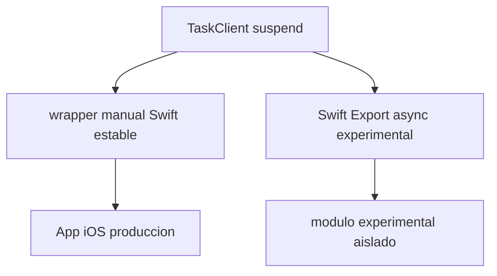
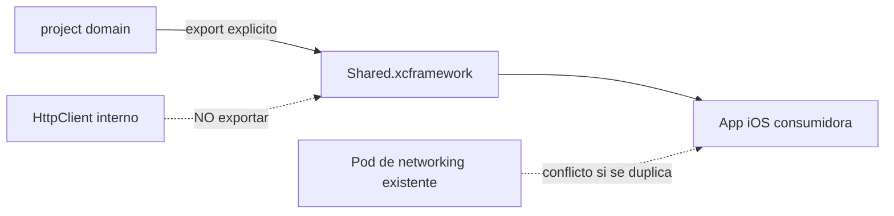
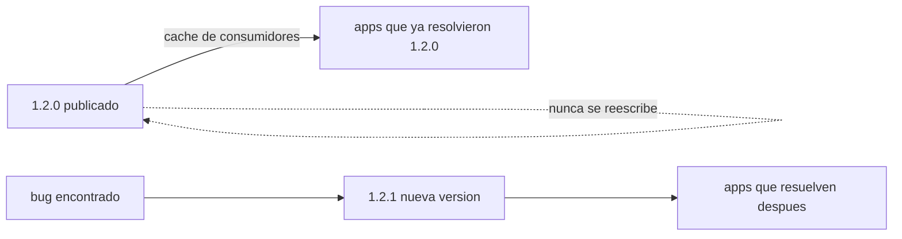
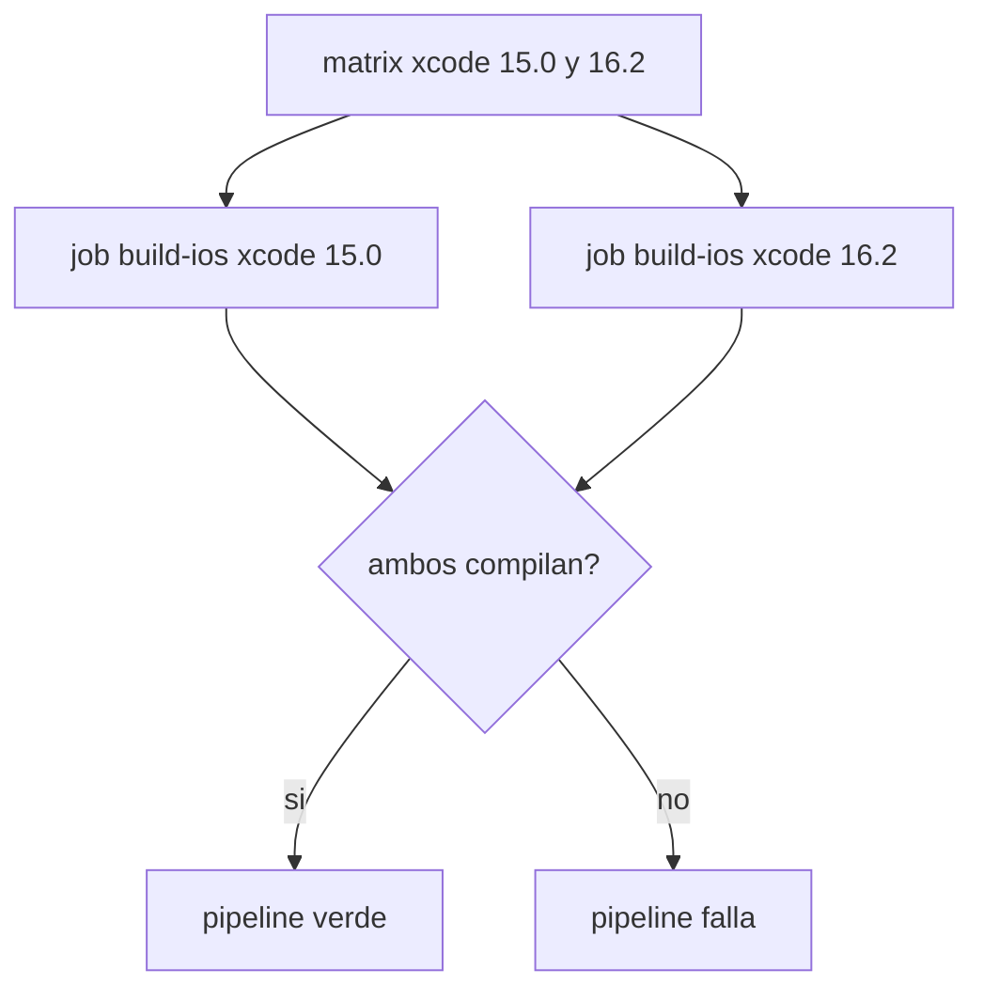

# Módulo 13: KMP Master: Native, Swift Export y publicación


## Aprende construyendo

### Tema 1: Kotlin/Native

#### Paso 1 · Objetivo y preparación
Al finalizar vas a compilar el framework de Kotlin/Native para el target del simulador de iOS y para el dispositivo físico, y combinarlos en un único framework universal con `lipo`. Prerrequisitos: Xcode instalado, módulo `shared` del proyecto integrador (Módulo 11).

#### Paso 2 · Contexto y caso real
Un desarrollador corre la app en un dispositivo físico sin problema, pero al intentar correrla en el Simulador de Xcode obtiene el error "building for iOS Simulator, but linking against a dylib built for iOS" — el framework que el equipo distribuye solo se compiló para el target de dispositivo.

#### Paso 3 · Teoría, modelo mental y analogía
Kotlin/Native compila directamente a código máquina nativo por arquitectura/target específico (no una VM compartida); un framework para dispositivo físico (`iosArm64`) y uno para el simulador (`iosSimulatorArm64`) son binarios distintos que deben combinarse explícitamente para funcionar en ambos contextos. La analogía es una pieza industrial con medidas distintas según la máquina que la recibe: no alcanza con fabricar una sola versión y esperar que encaje en todas.

#### Paso 4 · Demostración guiada desde cero

Crea `shared/build.gradle.kts` con targets iOS nativos y ejecuta `gradle` con `lipo` para combinar:

```bash
./gradlew :shared:linkReleaseFrameworkIosArm64
./gradlew :shared:linkReleaseFrameworkIosSimulatorArm64
lipo -create \
  shared/build/bin/iosArm64/releaseFramework/shared.framework/shared \
  shared/build/bin/iosSimulatorArm64/releaseFramework/shared.framework/shared \
  -output shared.framework/shared
```
Resultado esperado: el framework resultante corre tanto en un dispositivo físico como en el Simulador de Xcode, porque `lipo` combinó ambas arquitecturas en un único binario "fat" (universal) dentro del mismo bundle `.framework`.

#### Paso 5 · Práctica guiada
Pista: distribuí únicamente el framework compilado con `linkReleaseFrameworkIosArm64` (solo para dispositivo), asumiendo que "el simulador es solo para desarrollo, no importa". Ese es el fallo deliberado: cualquier desarrollador que intente correr la app en el Simulador de Xcode obtiene el error de arquitectura incompatible, bloqueando su trabajo local aunque el framework funcione perfectamente en un dispositivo real.

#### Paso 6 · Práctica independiente
Corregí el Paso 5 generando también el build para `iosSimulatorArm64`, combinando ambos con `lipo -create` como en el Paso 4, y verificá corriendo la app tanto en un dispositivo físico como en el Simulador sin recompilar nada entre ambas corridas.

#### Paso 7 · Cierre y evidencia
Entregá el framework universal del Paso 4, el error de arquitectura del Simulador del Paso 5, y la verificación en ambos contextos del Paso 6; explicá por qué "funciona en mi dispositivo" no es evidencia suficiente de que un framework nativo está completo. Siguiente paso: si el proyecto necesita interactuar con una librería C existente, estudiá cómo Kotlin/Native expone ese interop. Errores comunes: distribuir un framework compilado para una sola arquitectura asumiendo que cubre todos los casos de uso del equipo, no probar el Simulador antes de distribuir un build, y mezclar binarios de distintas versiones de Kotlin/Native con `lipo` sin verificar compatibilidad. Fuentes oficiales: https://kotlinlang.org/docs/native-overview.html y https://kotlinlang.org/docs/multiplatform-build-native-binaries.html.
**¿Por qué es importante?** Kotlin/Native compila a binarios específicos por arquitectura; un framework que no cubre explícitamente el target del Simulador bloquea el flujo de desarrollo diario de todo el equipo, no solo un caso extremo.
**Evidencia de aprendizaje:** entrega framework universal combinado con lipo, error de arquitectura del simulador reproducido y verificación en ambos contextos confirmada.
**Conceptos clave:** compilación nativa por target, iosArm64, iosSimulatorArm64, framework, lipo, fat binary, toolchain Apple y cross-compilation.
### Tema 2: Interop con C

#### Paso 1 · Objetivo y preparación
Al finalizar vas a declarar un binding cinterop hacia una función C que recibe un buffer, y a usar `usePinned` correctamente para pasar memoria Kotlin de forma segura sin retener el puntero después del bloque. Prerrequisitos: Tema 1 de este módulo; definición `.def` de cinterop configurada.

#### Paso 2 · Contexto y caso real
Una función que envuelve una llamada C guarda el puntero obtenido dentro de `usePinned` en una variable fuera del bloque "para reusarlo después sin tener que pinnear de nuevo" — la app funciona en pruebas rápidas pero falla de forma intermitente y difícil de reproducir en uso real.

#### Paso 3 · Teoría, modelo mental y analogía
El interop con C permite llamar funciones nativas que esperan punteros estables en memoria; `usePinned` garantiza que el objeto Kotlin no se mueva durante la llamada, pero esa garantía termina exactamente al cerrar el bloque. La analogía es una pieza prestada temporalmente con medidas garantizadas solo mientras dura el préstamo; conservarla más allá de ese tiempo ya no garantiza nada.

#### Paso 4 · Demostración guiada desde cero
```kotlin
fun procesarBuffer(datos: ByteArray) {
    datos.usePinned { pinned ->
        c_funcion_nativa(pinned.addressOf(0), datos.size) // puntero válido SOLO dentro de este bloque
    }
}
```
Resultado esperado: `c_funcion_nativa` recibe un puntero válido porque la llamada ocurre completamente dentro del bloque `usePinned`; apenas termina el bloque, el runtime de Kotlin/Native puede volver a mover o liberar esa memoria libremente.

#### Paso 5 · Práctica guiada
Pista: extraé el puntero fuera del bloque con `val puntero = datos.usePinned { it.addressOf(0) }` y usalo después en una segunda llamada C separada "para no pinnear dos veces". Ese es el fallo deliberado: ese puntero queda apuntando a memoria que el runtime ya puede haber movido o reutilizado apenas terminó el bloque `usePinned`, y la segunda llamada C corrompe datos o crashea de forma intermitente.

#### Paso 6 · Práctica independiente
Corregí el Paso 5 asegurando que toda llamada C que use ese puntero ocurra dentro del mismo bloque `usePinned`, y agregá una prueba que repita la operación 1000 veces buscando corrupción intermitente.

#### Paso 7 · Cierre y evidencia
Entregá el uso correcto de `usePinned` del Paso 4, el puntero colgante del Paso 5, y la prueba repetida 1000 veces del Paso 6; explicá por qué un bug de memoria de este tipo puede no manifestarse en pruebas rápidas pero sí en uso prolongado o bajo presión de memoria real. Siguiente paso: si necesitás exponer esta misma funcionalidad directamente a Swift, explorá qué ofrece Swift Export frente al interop manual. Errores comunes: retener un puntero obtenido de `usePinned` fuera de su bloque, asumir que una prueba rápida sin crash es evidencia suficiente de manejo correcto de memoria, y copiar buffers innecesariamente cuando pinnear directamente sería más simple y igual de seguro. Fuentes oficiales: https://kotlinlang.org/docs/native-c-interop.html y https://kotlinlang.org/api/latest/jvm/stdlib/kotlin.native/-pinned/.
**¿Por qué es importante?** Un puntero colgante hacia memoria gestionada por Kotlin/Native produce corrupción intermitente difícil de reproducir, no un fallo inmediato y obvio, lo que lo vuelve particularmente peligroso en producción.
**Evidencia de aprendizaje:** entrega binding cinterop con usePinned correcto, puntero colgante reproducido y prueba de 1000 repeticiones sin corrupción confirmada.
**Conceptos clave:** cinterop, puntero C, usePinned, memoria estable, binding .def, ownership nativo, dangling pointer y stress test.
### Tema 3: Swift Export

#### Paso 1 · Objetivo y preparación
Al finalizar vas a exportar una función `suspend` de `TaskClient` directamente como una función `async` de Swift usando Swift Export, y a aislar su uso detrás de un experimento verificable. Prerrequisitos: Tema 2 de este módulo; Swift Export habilitado en el proyecto.

#### Paso 2 · Contexto y caso real
El equipo adoptó Swift Export como la única forma de consumir `TaskClient` desde Swift, reemplazando todos los wrappers manuales existentes — en el siguiente upgrade de Kotlin, un cambio en el mapeo de Swift Export (todavía en estado Alpha) rompe la compilación de toda la app iOS de una sola vez.

#### Paso 3 · Teoría, modelo mental y analogía
Swift Export mapea tipos Kotlin (incluyendo funciones `suspend`) de forma más directa que el interop manual tradicional, pero su estado de estabilidad concreto determina si puede ser la única vía de producción o debe convivir como experimento aislado junto a los wrappers manuales existentes. La analogía es adoptar una herramienta nueva y prometedora en todas las líneas de producción de una vez, en vez de probarla primero en una línea aislada mientras la línea estable sigue funcionando.

#### Paso 4 · Demostración guiada desde cero
```kotlin
public suspend fun TaskClient.task(id: TaskId): TaskResult // Swift Export mapea esto a: func task(id: TaskId) async -> TaskResult
```
```swift
let resultado = await taskClient.task(id: taskId) // consumido directamente como async de Swift
```
Resultado esperado: la función `suspend` de Kotlin se consume en Swift como una función `async` nativa, sin necesidad de un wrapper manual de cancelación como el de `TaskScreenModel` (Módulo 12) para este caso específico — pero esta vía queda documentada explícitamente como dependiente del estado de estabilidad actual de Swift Export.

#### Paso 5 · Práctica guiada
Pista: reemplazá TODOS los wrappers manuales de interop existentes (incluyendo los de la facade `TaskClient` del Módulo 12) por Swift Export, eliminando el código manual "porque ya no hace falta". Ese es el fallo deliberado: en el siguiente upgrade de versión de Kotlin, un cambio en cómo Swift Export (todavía Alpha) mapea `sealed interface` rompe la compilación de `TaskResult` en Swift, y como no queda ningún wrapper manual de respaldo, toda la app iOS deja de compilar.

#### Paso 6 · Práctica independiente
Corregí el Paso 5 manteniendo la facade manual de `TaskClient` (Módulo 12) como la vía estable de producción, y aislando el uso de Swift Export detrás de un flag o módulo claramente marcado como experimental, documentando su versión y estado de estabilidad exactos.

#### Paso 7 · Cierre y evidencia
Entregá el mapeo de la función async del Paso 4, la ruptura total del build tras el upgrade del Paso 5, y el aislamiento del experimento del Paso 6; explicá por qué adoptar una herramienta en estado Alpha como única vía de producción traslada el riesgo de su inestabilidad a toda la app de una sola vez. Siguiente paso: empaquetá el framework resultante en un XCFramework con una API pública explícita. Errores comunes: adoptar Swift Export como única vía de producción sin revisar su estado de estabilidad declarado, eliminar wrappers manuales de respaldo antes de confirmar la estabilidad del reemplazo, y no fijar la versión de Kotlin exacta cuando se depende de una característica en estado Alpha. Fuentes oficiales: https://kotlinlang.org/docs/multiplatform-swift-export-overview.html y https://kotlinlang.org/docs/components-stability.html.
**¿Por qué es importante?** Una característica en estado Alpha puede cambiar su comportamiento entre versiones menores de Kotlin; tratarla como la única vía de producción traslada ese riesgo a toda la app de una sola vez.
**Evidencia de aprendizaje:** entrega función async exportada funcionando, ruptura total del build tras upgrade reproducida y aislamiento del experimento documentado con su versión.
**Conceptos clave:** Swift Export, async/await, suspend mapping, estado Alpha/Beta/estable, wrapper manual de respaldo, sealed interface mapping y riesgo de adopción temprana.

El experimento de Swift Export se aísla en `iosApp/SwiftExportExperiment.swift`, separado del wrapper manual de `TaskClient` (`shared/src/commonMain/kotlin/com/academia/kmp/TaskClient.kt`, Módulo 12) que sigue siendo la vía estable de producción:


```mermaid
flowchart TD
    TaskClient[TaskClient suspend] --> Manual[wrapper manual Swift estable]
    TaskClient --> Export[Swift Export async experimental]
    Manual --> AppProd[App iOS produccion]
    Export --> Lab[modulo experimental aislado]
```

El proyecto integrador RutaFlow aplicaría la misma cautela si expusiera `SyncEngine.drain()` (`examples/rutaflow/kotlin-multiplatform/SyncEngine.kt`) vía Swift Export: la app de entregas seguiría consumiendo el wrapper manual como vía estable, dejando el `async` exportado detrás de un flag mientras Swift Export madura. **Cuándo no conviene** adoptarlo todavía: si la app ya tiene wrappers manuales estables y funcionando, migrar todo de una sola vez a una herramienta en estado Alpha es un trade-off que cambia riesgo conocido (mantenimiento manual) por riesgo desconocido (una dependencia que puede romper el mapeo en el siguiente upgrade de Kotlin) — conviene esperar a Beta/estable antes de ese reemplazo total.

### Tema 4: XCFramework y API pública

#### Paso 1 · Objetivo y preparación
Al finalizar vas a empaquetar el framework compartido en un XCFramework con una API pública mínima, decidiendo explícitamente qué dependencias transitivas exportar. Prerrequisitos: Tema 3 de este módulo.

#### Paso 2 · Contexto y caso real
La app iOS que consume el XCFramework del proyecto integrador falla al compilar con un error de "símbolo duplicado" para una librería de networking — tanto el XCFramework como un Pod que la app ya usaba de forma independiente incluyen la misma dependencia nativa.

#### Paso 3 · Teoría, modelo mental y analogía
Construir un XCFramework exige decidir explícitamente si cada dependencia es estática o dinámica, y si se exporta transitivamente o no: exportar una dependencia transitiva aumenta la superficie y el tamaño del framework, y puede duplicar símbolos si la app consumidora ya incluye esa misma dependencia por otra vía. La analogía es empaquetar una pieza industrial con todos sus repuestos internos incluidos, cuando la fábrica que la recibe ya tiene esos mismos repuestos en su inventario.

#### Paso 4 · Demostración guiada desde cero
```kotlin
kotlin {
    listOf(iosX64(), iosArm64(), iosSimulatorArm64()).forEach {
        it.binaries.framework {
            baseName = "Shared"
            export(project(":domain")) // export explícito y deliberado, no transitivo por defecto
            isStatic = true
        }
    }
}
```
```bash
xcodebuild -create-xcframework \
  -framework shared-iosArm64/Shared.framework \
  -framework shared-iosSimulatorArm64/Shared.framework \
  -output Shared.xcframework
```
Resultado esperado: el XCFramework resultante expone únicamente los módulos marcados explícitamente con `export(...)`, sin incluir transitivamente el motor HTTP interno de Ktor ni otras dependencias que la app consumidora pueda ya tener por su cuenta.

#### Paso 5 · Práctica guiada
Pista: agregá `export(project(":networking-engine"))` a la configuración del framework "para que el consumidor tenga todo disponible sin instalar nada aparte". Ese es el fallo deliberado: la app iOS que consume este XCFramework y que ya incluye esa misma librería de networking como Pod independiente ahora tiene dos copias de los mismos símbolos nativos en el binario final, y el linker falla con "duplicate symbol" al compilar la app.

#### Paso 6 · Práctica independiente
Corregí el Paso 5 quitando el `export` de la dependencia de networking interna, dejando que solo el dominio (`:domain`) se exporte explícitamente, y verificá que la app consumidora compila sin conflictos aunque ya tenga su propio Pod de networking instalado por separado.

#### Paso 7 · Cierre y evidencia
Entregá el XCFramework con export explícito del Paso 4, el conflicto de símbolos duplicados del Paso 5, y la corrección verificada del Paso 6; explicá por qué "incluir todo para comodidad del consumidor" puede romper exactamente a los consumidores que ya tienen esas dependencias por su cuenta. Siguiente paso: publicá este mismo artefacto en un repositorio donde otros equipos puedan consumirlo de forma versionada. Errores comunes: exportar transitivamente todas las dependencias internas sin evaluar conflictos con el consumidor, no decidir explícitamente entre framework estático y dinámico, y no probar la integración contra una app consumidora real antes de publicar. Fuentes oficiales: https://kotlinlang.org/docs/multiplatform-build-native-binaries.html#build-xcframeworks y https://developer.apple.com/documentation/xcode/creating-a-multi-platform-binary-framework-bundle.
**¿Por qué es importante?** No exportar todas las dependencias transitivas por defecto, decidiendo explícitamente qué forma parte de la API pública, evita conflictos de símbolos duplicados en los consumidores reales del framework.
**Evidencia de aprendizaje:** entrega XCFramework con export explícito, conflicto de símbolos duplicados reproducido y corrección verificada contra un consumidor real.
**Conceptos clave:** XCFramework, static vs dynamic framework, export transitivo, duplicate symbol, API pública mínima, linker y consumidor real.

La configuración de export vive en `shared/build.gradle.kts`, junto al `TaskClient.kt` del Módulo 12 cuya facade es justamente lo único que debería cruzar hacia Swift. Antes de empaquetar, conviene confirmar el toolchain de Swift disponible en el runner con `swift --version`, porque `xcodebuild -create-xcframework` depende de él:


```mermaid
flowchart LR
    Domain["project domain"] -->|export explicito| XCF[Shared.xcframework]
    Ktor[HttpClient interno] -.NO exportar.-> XCF
    XCF --> AppIOS[App iOS consumidora]
    PodExterno[Pod de networking existente] -.conflicto si se duplica.-> AppIOS
```

**Cuándo no conviene** exportar una dependencia transitiva, incluso si "simplifica" la integración: cuando la app consumidora ya trae esa misma librería nativa por otra vía (un Pod, otro XCFramework), exportarla de nuevo no es una conveniencia sino la causa directa del error de símbolo duplicado — la decisión correcta depende de qué trae realmente cada consumidor, no de una regla universal de "exportar todo por si acaso".

### Tema 5: Publicación en Maven Central

#### Paso 1 · Objetivo y preparación
Al finalizar vas a publicar el módulo compartido en un repositorio Maven con coordenadas, firma y checksums inmutables. Prerrequisitos: Tema 4 de este módulo; credenciales de publicación configuradas.

#### Paso 2 · Contexto y caso real
Alguien del equipo encuentra un bug menor inmediatamente después de publicar la versión `1.2.0`, y en vez de publicar `1.2.1`, vuelve a publicar `1.2.0` con la corrección "porque el cambio es mínimo y nadie debería notar la diferencia".

#### Paso 3 · Teoría, modelo mental y analogía
Una publicación Maven produce metadata raíz y artefactos firmados por target, con checksums que los consumidores verifican al resolver una dependencia; esas coordenadas deben ser inmutables porque otros sistemas (incluyendo cachés de dependencias) asumen que una misma versión siempre resuelve exactamente al mismo contenido. La analogía es un número de lote de un producto industrial — una vez impreso y distribuido, no puede referirse después a un contenido distinto.

#### Paso 4 · Demostración guiada desde cero
```kotlin
publishing {
    publications.withType<MavenPublication> {
        groupId = "com.proyecto.tareas"
        artifactId = "shared"
        version = "1.2.1" // nueva versión, nunca se reescribe 1.2.0
    }
}
```
```bash
./gradlew publishAllPublicationsToMavenCentralRepository
```
Resultado esperado: la versión `1.2.1` se publica como una entrada completamente nueva e inmutable; cualquier consumidor que ya haya resuelto y cacheado `1.2.0` sigue recibiendo exactamente el mismo contenido que resolvió originalmente, sin sorpresas.

#### Paso 5 · Práctica guiada
Pista: volvé a publicar bajo la misma coordenada `1.2.0` con el fix aplicado, sobrescribiendo el artefacto original "porque el repositorio lo permite técnicamente". Ese es el fallo deliberado: un consumidor que ya había cacheado localmente la `1.2.0` original nunca vuelve a descargarla, mientras que un consumidor nuevo que resuelve `1.2.0` por primera vez obtiene un contenido distinto bajo la misma versión exacta, rompiendo la garantía fundamental de que una versión siempre significa el mismo contenido.

#### Paso 6 · Práctica independiente
Corregí el Paso 5 publicando el fix como `1.2.1` (nunca reescribiendo `1.2.0`), y documentá en el changelog del proyecto que `1.2.0` queda marcada como conocida con el bug, dirigiendo a todos los consumidores hacia `1.2.1`.

#### Paso 7 · Cierre y evidencia
Entregá la publicación inmutable del Paso 4, la reescritura de versión detectada del Paso 5, y el changelog corregido del Paso 6; explicá por qué sobrescribir una versión ya publicada rompe una garantía que todo el ecosistema de dependencias asume como verdadera. Siguiente paso: asegurate de que esta versión sea binariamente compatible antes de publicarla, verificándolo en el pipeline de CI multi-target. Errores comunes: sobrescribir una versión ya publicada en vez de incrementarla, no firmar los artefactos publicados, y no publicar sources/docs junto con el binario principal. Fuentes oficiales: https://central.sonatype.org/publish/ y https://kotlinlang.org/docs/multiplatform-publish-lib-setup.html.
**¿Por qué es importante?** Las coordenadas de una versión publicada deben ser inmutables porque todo el ecosistema de dependencias asume que una misma versión siempre resuelve exactamente al mismo contenido.
**Evidencia de aprendizaje:** entrega publicación con versión inmutable, reescritura de versión detectada y changelog con la corrección documentada.
**Conceptos clave:** Maven publication, checksum, coordenadas inmutables, firma de artefactos, sources/docs, semantic versioning y caché de dependencias.

Las coordenadas de publicación (`groupId`, `artifactId`, `version`) se declaran en `shared/build.gradle.kts`, y el comando completo con Gradle es `./gradlew publishAllPublicationsToMavenCentralRepository`. Si el proyecto integrador RutaFlow publicara su módulo `SyncEngine` (`examples/rutaflow/kotlin-multiplatform/SyncEngine.kt`) como librería reutilizable por otros equipos, aplicaría exactamente esta misma regla de inmutabilidad:


```mermaid
flowchart LR
    V120[1.2.0 publicado] -->|cache de consumidores| Cliente[apps que ya resolvieron 1.2.0]
    Bug[bug encontrado] --> V121[1.2.1 nueva version]
    V121 --> NuevoCliente[apps que resuelven despues]
    V120 -.nunca se reescribe.-> V120
```

### Tema 6: Compatibilidad binaria y CI multi-target

#### Paso 1 · Objetivo y preparación
Al finalizar vas a configurar una matriz de CI que pruebe la compilación del módulo compartido contra la versión mínima soportada de Xcode, no solo la más reciente. Prerrequisitos: Tema 5 de este módulo.

#### Paso 2 · Contexto y caso real
El equipo publica una nueva versión del módulo compartido probada únicamente con la versión más reciente de Xcode instalada en las máquinas del equipo — un equipo consumidor externo, todavía en una versión de Xcode anterior pero oficialmente soportada, no puede compilar la nueva versión.

#### Paso 3 · Teoría, modelo mental y analogía
La matriz de CI debe probar explícitamente las versiones mínimas soportadas declaradas (Kotlin, Gradle, JDK, Xcode), no solo las más recientes disponibles: no es viable toda combinación posible, así que hay que priorizar los límites declarados y los consumidores reales conocidos. La analogía es certificar un producto solo con el combustible premium más reciente, cuando el manual promete compatibilidad también con el combustible estándar más antiguo que los clientes reales siguen usando.

#### Paso 4 · Demostración guiada desde cero
```yaml
strategy:
  matrix:
    xcode: ["15.0", "16.2"]   # mínima soportada declarada y la más reciente
    jdk: ["17", "21"]
jobs:
  build-ios:
    runs-on: macos-latest
    steps:
      - run: sudo xcode-select -s /Applications/Xcode_${{ matrix.xcode }}.app
      - run: ./gradlew :shared:linkDebugFrameworkIosArm64
```
Resultado esperado: el pipeline de CI compila explícitamente contra la versión mínima de Xcode declarada como soportada (`15.0`) y contra la más reciente (`16.2`), detectando si un cambio reciente usa accidentalmente una API solo disponible en la versión más nueva.

#### Paso 5 · Práctica guiada
Pista: dejá la matriz con un solo valor, la versión de Xcode más reciente instalada en el runner, asumiendo que "si compila con la más nueva, compila con todas". Ese es el fallo deliberado: un cambio reciente usa accidentalmente una API de Swift interop disponible solo desde Xcode 16, el pipeline pasa en verde porque solo prueba esa versión, y un equipo consumidor que todavía usa Xcode 15 (la versión mínima que el proyecto declara soportar) no puede compilar la nueva versión en absoluto.

#### Paso 6 · Práctica independiente
Corregí el Paso 5 restaurando ambas versiones en la matriz (mínima declarada y más reciente), y agregá una verificación explícita: el pipeline debe fallar si cualquier combinación de la matriz no compila, no solo reportarlo como advertencia.

#### Paso 7 · Cierre y evidencia
Entregá la matriz de CI del Paso 4, la API exclusiva de la versión nueva no detectada del Paso 5, y la verificación obligatoria de toda la matriz del Paso 6; explicá por qué "compila con la versión más nueva" no implica "compila con la versión mínima que el proyecto promete soportar". Siguiente paso: con esta matriz verificada, el proyecto integrador queda listo para publicarse y ser consumido por otros equipos con garantías reales de compatibilidad. Errores comunes: probar la matriz de CI solo contra las versiones más recientes disponibles, no declarar explícitamente cuál es la versión mínima soportada en la documentación del proyecto, y tratar un fallo de una combinación de la matriz como advertencia en vez de bloquear el pipeline. Fuentes oficiales: https://kotlinlang.org/docs/gradle-configure-project.html y https://developer.apple.com/support/xcode/.
**¿Por qué es importante?** Una matriz de CI que solo prueba las versiones más recientes no detecta regresiones contra la versión mínima que el proyecto promete soportar, dejando a consumidores reales con un build roto.
**Evidencia de aprendizaje:** entrega matriz de CI con versión mínima y más reciente, API exclusiva no detectada reproducida y bloqueo obligatorio de toda la matriz verificado.
**Conceptos clave:** target matrix, versión mínima soportada, CI multi-target, Xcode version, JDK version, consumidor real y bloqueo de pipeline.

La matriz vive en `.github/workflows/ci.yml`, el mismo workflow del Módulo 10 ahora extendido con `strategy.matrix`:


```mermaid
flowchart TD
    Matrix["matrix xcode 15.0 y 16.2"] --> J1[job build-ios xcode 15.0]
    Matrix --> J2[job build-ios xcode 16.2]
    J1 --> Gate{ambos compilan?}
    J2 --> Gate
    Gate -->|si| Verde[pipeline verde]
    Gate -->|no| Rojo[pipeline falla]
```

---


## Laboratorio práctico

**Objetivo del laboratorio:** empaquetar y publicar el framework Kotlin/Native del proyecto integrador (Módulo 11) como un artefacto real consumible desde Xcode y Maven, validado contra interop C seguro, con Swift Export aislado como experimento y una matriz de CI que cubre la versión mínima de Xcode soportada.

**Requisitos previos:** Módulos 0-12 completados.

| Paso | Acción | Código | Explicación |
|---|---|---|---|
| 1 | Compilar el framework para dispositivo físico y para el simulador, y combinarlos con `lipo` | Ver Tema 1 | Framework universal que corre en ambos contextos |
| 2 | Declarar un binding cinterop hacia una función C que recibe un buffer | Ver Tema 2 | `usePinned` limitado estrictamente al bloque, sin puntero colgante |
| 3 | Exportar una función `suspend` como `async` nativo de Swift con Swift Export | Ver Tema 3 | Aislado detrás de un experimento; la facade manual sigue siendo la vía estable |
| 4 | Empaquetar el framework en un XCFramework con export explícito | Ver Tema 4 | Solo el dominio, nunca dependencias transitivas internas como Ktor |
| 5 | Publicar el módulo compartido en Maven Central con una versión nueva | Ver Tema 5 | Coordenadas y checksums inmutables; nunca se reescribe una versión ya publicada |
| 6 | Configurar la matriz de CI contra la versión mínima y la más reciente de Xcode soportadas | Ver Tema 6 | El pipeline falla si cualquier combinación de la matriz no compila |

**Verificación:** el laboratorio se considera exitoso si el framework universal generado con `lipo` corre tanto en un dispositivo físico como en el Simulador de Xcode, si una prueba de 1000 repeticiones del binding cinterop no muestra corrupción de memoria, si el experimento de Swift Export queda aislado detrás de un flag sin reemplazar la facade manual estable, si el XCFramework expone únicamente el dominio (sin conflicto de símbolo duplicado con dependencias del consumidor), si la versión publicada en Maven Central es nueva e inmutable, y si la matriz de CI bloquea el pipeline ante cualquier combinación de Xcode que no compile.

**Errores comunes y soluciones**

- **Distribuir el framework compilado solo para el target de dispositivo físico.** Genera también el build para `iosSimulatorArm64` y combina ambos con `lipo -create` antes de distribuir.
- **Retener un puntero obtenido de `usePinned` fuera de su bloque.** Usa ese puntero exclusivamente dentro del mismo bloque `usePinned`, nunca después de que termine.
- **Reemplazar todos los wrappers manuales de interop por Swift Export mientras sigue en estado Alpha.** Mantén la facade manual como vía estable de producción y aísla Swift Export detrás de un experimento documentado.
- **Exportar dependencias transitivas internas (como el motor HTTP de Ktor) en el XCFramework "para comodidad del consumidor".** Exporta explícitamente solo el dominio; evita conflictos de símbolo duplicado con Pods o paquetes que el consumidor ya incluye.
- **Sobrescribir una versión ya publicada en Maven Central.** Publica siempre una versión nueva e inmutable; nunca reescribas `1.2.0`.
- **Probar la matriz de CI solo contra la versión de Xcode más reciente disponible.** Incluye también la versión mínima soportada que el proyecto declara, no solo la más nueva.

---

## Trazabilidad de la auditoría original

- **Kotlin Native**: cubierto mediante fundamento, laboratorio y evidencia del capítulo.
- **Publicación de Librerías**: cubierto mediante fundamento, laboratorio y evidencia del capítulo.
- **Kotlin-to-Swift Export**: cubierto mediante fundamento, laboratorio y evidencia del capítulo.
