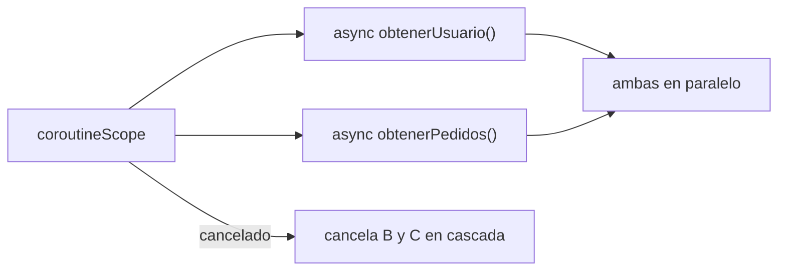
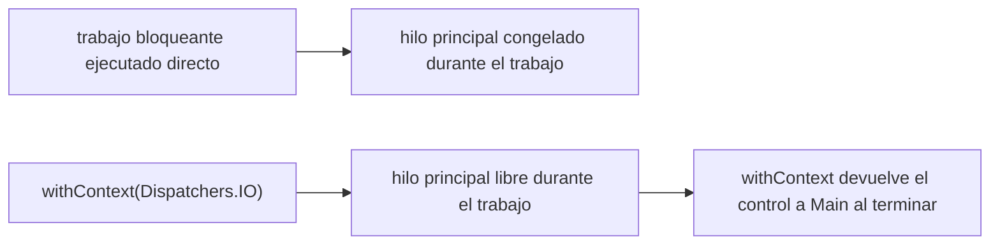

# Módulo 2: Coroutines y Flow

Cada tema se practica por separado con su propia repetición progresiva y su propio reto de memoria — suspend functions, Flow/StateFlow/SharedFlow, manejo de errores con Mutex, y Dispatchers son los cuatro pilares de la concurrencia en Kotlin que vas a reutilizar en Android, iOS y backend compartido.


## Aprende construyendo

### Tema 1: suspend functions y concurrencia estructurada

#### Paso 1 · Objetivo y preparación

Al finalizar podrás escribir una función `suspend` que combina dos llamadas asíncronas en paralelo, y explicar por qué cancelar el scope padre cancela automáticamente todas sus coroutines hijas.

**Conocimiento previo:** funciones de orden superior (Módulo 1); ninguna experiencia previa con concurrencia es necesaria.

#### Paso 2 · Contexto y caso real

**¿Por qué es importante?** Cargar en paralelo el perfil de usuario y la lista de pedidos al abrir una pantalla, cancelando ambas si el usuario navega antes de que terminen, es un patrón que threads manuales o callbacks no garantizan automáticamente: sin concurrencia estructurada, una tarea "olvidada" puede seguir ejecutándose en segundo plano sin ningún control.

#### Paso 3 · Teoría con analogía

**Conceptos clave:** `suspend fun` (pausable sin bloquear el hilo), `coroutineScope` + `async`/`await`, cancelación en cascada.

Una función `suspend` puede pausarse en un punto de suspensión (como `delay`) sin bloquear el hilo físico, liberándolo para otro trabajo, y reanudando exactamente donde quedó. `suspend fun cargarPantalla() = coroutineScope { val usuario = async { obtenerUsuario() }; val pedidos = async { obtenerPedidos() }; PantallaDatos(usuario.await(), pedidos.await()) }` ejecuta ambas llamadas en paralelo, vinculadas al `coroutineScope` que las contiene: si ese scope se cancela, TODAS las coroutines hijas se cancelan en cascada automáticamente, sin tareas huérfanas.

**Analogía:** una función `suspend` es un trabajador que pausa su tarea en un punto específico para atender otra cosa mientras espera un insumo externo, retomando exactamente donde la dejó; la concurrencia estructurada es un equipo de trabajo donde cancelar el proyecto completo cancela automáticamente todas las subtareas asociadas, sin ninguna olvidada.

**Diagrama:**



#### Paso 4 · Demostración guiada desde cero

Desde una carpeta vacía (o continuando en `academia-kmp`, o créala con `mkdir -p academia-kmp` si es tu primera vez), crea `shared/src/commonMain/kotlin/com/academia/kmp/ConcurrenciaEstructurada.kt`:

```bash
# python confirma después la ejecución real en paralelo con asyncio
mkdir -p academia-kmp/shared/src/commonMain/kotlin/com/academia/kmp
cd academia-kmp
cat > shared/src/commonMain/kotlin/com/academia/kmp/ConcurrenciaEstructurada.kt <<'EOF'
package com.academia.kmp

import kotlinx.coroutines.*

suspend fun obtenerUsuario(): String { delay(200); return "Ana" }
suspend fun obtenerPedidos(): List<String> { delay(200); return listOf("pedido1", "pedido2") }

suspend fun cargarPantalla() = coroutineScope {
    val usuario = async { obtenerUsuario() }
    val pedidos = async { obtenerPedidos() }
    Pair(usuario.await(), pedidos.await()) // ambas corren en PARALELO, no secuencial
}
EOF
python3 -c "
codigo = open('shared/src/commonMain/kotlin/com/academia/kmp/ConcurrenciaEstructurada.kt').read()
assert 'coroutineScope {' in codigo, 'falta el scope estructurado que agrupa las coroutines hijas'
assert 'async { obtenerUsuario() }' in codigo and 'async { obtenerPedidos() }' in codigo, 'faltan ambas llamadas lanzadas en paralelo con async'
print('ConcurrenciaEstructurada.kt: ambas llamadas se lanzan con async ANTES de esperar await()')
"
```

**Explicación línea por línea:** `coroutineScope { ... }` crea un scope que agrupa las coroutines lanzadas dentro; `async { obtenerUsuario() }` y `async { obtenerPedidos() }` se lanzan AMBAS antes de llamar a `.await()` en cualquiera, por lo que corren en paralelo desde el inicio; `usuario.await()` y `pedidos.await()` esperan cada resultado sin bloquear el hilo mientras tanto.

Ejecuta en Python, con `asyncio` real (el mismo modelo de suspensión mediante un event loop, no una simulación), el mismo patrón de dos llamadas en paralelo, midiendo el tiempo real transcurrido:

```bash
python3 -c "
import asyncio, time

async def obtener_usuario():
    await asyncio.sleep(0.2)
    return 'Ana'

async def obtener_pedidos():
    await asyncio.sleep(0.2)
    return ['pedido1', 'pedido2']

async def cargar_pantalla():
    inicio = time.monotonic()
    usuario, pedidos = await asyncio.gather(obtener_usuario(), obtener_pedidos())
    duracion = time.monotonic() - inicio
    return usuario, pedidos, duracion

usuario, pedidos, duracion = asyncio.run(cargar_pantalla())
print(f'usuario={usuario}, pedidos={pedidos}, duracion={duracion:.2f}s')
"
```

**Resultado esperado:** la duración real es de aproximadamente `0.20s`-`0.21s`, NO `0.40s` — confirmando que ambas llamadas (cada una con una espera de `0.2s`) efectivamente corrieron en paralelo gracias a `asyncio.gather` (el equivalente de lanzar ambos `async` antes de esperar), y no de forma secuencial.

**Fallo deliberado:** cambia `asyncio.gather(obtener_usuario(), obtener_pedidos())` por `await obtener_usuario(); await obtener_pedidos()` (secuencial, esperando cada una antes de lanzar la siguiente — el equivalente de escribir `usuario.await()` inmediatamente después de cada `async` en vez de lanzar ambos primero). Ejecuta de nuevo y mide la duración — ahora será de aproximadamente `0.40s`, el doble — diagnostica confirmando que el error común "llamar a `await()` inmediatamente después de cada `async`" anula el paralelismo por completo, convirtiendo dos operaciones concurrentes en una secuencia disfrazada de concurrente.

#### Construcción RutaFlow: carga paralela de ruta y clima

Escribe `suspend fun cargarPantallaRuta() = coroutineScope { val ruta = async { obtenerRutaActual() }; val clima = async { obtenerClimaZona() }; PantallaRuta(ruta.await(), clima.await()) }` en RutaFlow, confirmando con un temporizador que ambas llamadas corren en paralelo.

#### Paso 5 · Práctica guiada — repetición progresiva

1. `coroutineScope { val a = async { obtenerA() }; val b = async { obtenerB() }; a.await() + b.await() }` — dos llamadas, combinando resultados numéricos.
2. Agrega una tercera llamada `async { obtenerC() }` al mismo scope y combina las tres.
3. Mide con `time.monotonic()` (o el equivalente) la duración de dos llamadas secuenciales frente a las mismas dos en paralelo.
4. Escribe de memoria (sin mirar) un `coroutineScope` con dos `async` de tu elección, combinando sus resultados.

**Pista:** lanza SIEMPRE todos los `async` antes de llamar a `await()` en cualquiera de ellos; llamar a `await()` de inmediato después de cada `async` serializa la ejecución.

#### Paso 6 · Práctica independiente

**Completa el código:** rellena los espacios para que ambas llamadas corran en paralelo:

```kotlin
suspend fun cargarDatos() = coroutineScope {
    val perfil = ____ { obtenerPerfil() }
    val ajustes = ____ { obtenerAjustes() }
    Pair(perfil.await(), ajustes.await())
}
```

**Reto de memoria sin mirar:** cierra este documento y escribe, solo de memoria, una función `suspend` con `coroutineScope` que combine dos llamadas en paralelo usando `async`/`await`. Compara después contra el patrón del Paso 4.

#### Paso 7 · Cierre y evidencia

Ya combinas dos llamadas asíncronas en paralelo dentro de un `coroutineScope`, y confirmas con una medición real que el orden de `async`/`await` determina si realmente corren en paralelo o secuencialmente. El siguiente tema distingue `Flow`, `StateFlow` y `SharedFlow` según si existe o no un valor actual consultable. **Evidencia:** entrega la duración real medida (paralelo ~0.2s frente a secuencial ~0.4s), y explica por qué llamar a `await()` inmediatamente después de cada `async` anula el paralelismo. Fuente oficial: [Kotlin docs — Coroutines basics](https://kotlinlang.org/docs/coroutines-basics.html).

**Errores comunes:** llamar a `await()` inmediatamente después de cada `async` en vez de lanzar ambos primero, serializando lo que debería ser paralelo; olvidar que una función `suspend` solo puede invocarse desde otra `suspend` o un `CoroutineScope`.

**Cuándo no usarlo:** para dos operaciones donde la segunda depende del resultado de la primera (no pueden ejecutarse en paralelo por definición), usar `async`/`await` en paralelo no aplica; usa llamadas `suspend` secuenciales normales en ese caso.

### Tema 2: Flow, StateFlow y SharedFlow

#### Paso 1 · Objetivo y preparación

Al finalizar podrás elegir entre `Flow`, `StateFlow` y `SharedFlow` según si tu dato necesita un valor actual siempre consultable o representa un evento puntual de un solo uso.

**Conocimiento previo:** Tema 1 de este módulo; sealed classes para estado de UI (Módulo 1, Tema 3).

#### Paso 2 · Contexto y caso real

**¿Por qué es importante?** El estado observable de un ViewModel (lista de tareas, estado de carga) necesita que un nuevo observador vea el valor actual de inmediato; un evento de navegación de un solo disparo ("mostrar este Snackbar una vez") NO debe repetirse a un observador que llega tarde o rota la pantalla — usar el tipo equivocado produce bugs sutiles (Snackbars repetidos, o pantallas que nunca ven el estado actual).

#### Paso 3 · Teoría con analogía

**Conceptos clave:** `Flow` (flujo asíncrono perezoso), `StateFlow` (siempre tiene valor actual), `SharedFlow` (eventos puntuales, sin valor inicial).

`fun contarHasta(n: Int): Flow<Int> = flow { for (i in 1..n) { delay(100); emit(i) } }` define un flujo asíncrono de múltiples valores, con evaluación perezosa (no ejecuta nada hasta que alguien recolecta con `collect`). `val estado = MutableStateFlow(EstadoUI.Cargando)` siempre mantiene un valor actual consultable de inmediato por cualquier nuevo observador. `val eventos = MutableSharedFlow<Evento>()` no tiene valor inicial: un observador que empieza a observar tarde NO recibe automáticamente el último evento ya emitido.

**Analogía:** `Flow` es una cinta transportadora que entrega elementos sucesivos; `StateFlow` es un panel de estado siempre visible con su valor actual, incluso para quien recién llega a mirarlo; `SharedFlow` es un anuncio puntual transmitido una vez, que alguien que llega tarde simplemente no escuchó.

**Diagrama:**

```
┌── Flow ────────────┐   ┌── StateFlow ──────────────┐   ┌── SharedFlow ──────────────┐
│ emite N valores,    │   │ SIEMPRE tiene un valor      │   │ SIN valor inicial,           │
│ evaluación perezosa  │   │ actual consultable          │   │ eventos de un solo uso       │
└─────────────────┘   └────────────────────────┘   └────────────────────────┘
```

#### Paso 4 · Demostración guiada desde cero

Desde una carpeta vacía (o continuando en `academia-kmp`, o créala con `mkdir -p academia-kmp` si es tu primera vez), crea `shared/src/commonMain/kotlin/com/academia/kmp/FlowTipos.kt`:

```bash
# python reproduce después Flow con un generador asíncrono real
mkdir -p academia-kmp/shared/src/commonMain/kotlin/com/academia/kmp
cd academia-kmp
cat > shared/src/commonMain/kotlin/com/academia/kmp/FlowTipos.kt <<'EOF'
package com.academia.kmp

import kotlinx.coroutines.flow.*
import kotlinx.coroutines.delay

fun contarHasta(n: Int): Flow<Int> = flow {
    for (i in 1..n) { delay(10); emit(i) }
}

sealed class EstadoUI { object Cargando : EstadoUI(); object Exito : EstadoUI() }
val estado = MutableStateFlow<EstadoUI>(EstadoUI.Cargando)   // siempre tiene valor actual
val eventos = MutableSharedFlow<String>()                     // sin valor inicial, un solo uso
EOF
python3 -c "
codigo = open('shared/src/commonMain/kotlin/com/academia/kmp/FlowTipos.kt').read()
assert 'MutableStateFlow<EstadoUI>(EstadoUI.Cargando)' in codigo, 'falta StateFlow con valor inicial obligatorio'
assert 'MutableSharedFlow<String>()' in codigo, 'falta SharedFlow sin valor inicial'
print('FlowTipos.kt: StateFlow con valor inicial obligatorio; SharedFlow sin valor inicial')
"
```

**Explicación línea por línea:** `flow { for (i in 1..n) { delay(10); emit(i) } }` define un flujo perezoso que emite valores solo cuando algo lo recolecta; `MutableStateFlow<EstadoUI>(EstadoUI.Cargando)` EXIGE un valor inicial en el constructor porque siempre debe haber un "valor actual"; `MutableSharedFlow<String>()` no recibe (ni acepta) un valor inicial, porque conceptualmente representa eventos, no un estado persistente.

Ejecuta en Python, con un generador asíncrono real (el equivalente directo de `flow { emit(...) }`), y confirma la diferencia entre un observador tardío de "estado" frente a uno de "eventos":

```bash
python3 -c "
import asyncio

async def contar_hasta(n):
    for i in range(1, n + 1):
        await asyncio.sleep(0.01)
        yield i

async def recolectar_flow():
    valores = []
    async for v in contar_hasta(5):
        valores.append(v)
    return valores

valores = asyncio.run(recolectar_flow())
print('flow recolectado:', valores)

class StateFlowSimulado:
    def __init__(self, valor_inicial):
        self.valor_actual = valor_inicial
    def emitir(self, nuevo_valor):
        self.valor_actual = nuevo_valor
    def valor_para_nuevo_observador(self):
        return self.valor_actual

class SharedFlowSimulado:
    def __init__(self):
        self.ultimo_evento_visible_a_nuevos_observadores = None
    def emitir(self, evento):
        pass  # los observadores YA suscritos lo recibirían; uno nuevo, no

estado = StateFlowSimulado('Cargando')
estado.emitir('Exito')
print('nuevo observador de StateFlow ve el valor actual:', estado.valor_para_nuevo_observador())

eventos = SharedFlowSimulado()
eventos.emitir('MostrarSnackbar')
print('nuevo observador de SharedFlow ve:', eventos.ultimo_evento_visible_a_nuevos_observadores)
"
```

**Resultado esperado:** `flow recolectado: [1, 2, 3, 4, 5]` (el `Flow` perezoso recolectado con `async for`, equivalente a `collect`); el nuevo observador de `StateFlowSimulado` ve `'Exito'` de inmediato (el valor actual); el nuevo observador de `SharedFlowSimulado` ve `None` — nunca recibe automáticamente el evento ya emitido.

**Fallo deliberado:** usa `SharedFlowSimulado` (o `MutableSharedFlow` real) para representar el estado de una pantalla completa (por ejemplo, si "Cargando"/"Exito" se emitiera como evento en vez de estado). Un componente de UI que empieza a observar DESPUÉS de que el estado cambió a "Exito" seguiría mostrando su valor por defecto (usualmente vacío o "Cargando"), porque `SharedFlow` no garantiza que un nuevo observador reciba el último valor emitido — diagnostica confirmando por qué el error común "usar `SharedFlow` para representar estado de UI persistente" produce pantallas que se quedan "congeladas" en un estado inicial incorrecto tras una rotación o recreación.

#### Construcción RutaFlow: estado de sincronización frente a evento de notificación

Usa `StateFlow<EstadoSincronizacion>` (Módulo 0, Tema 3) para el estado observable de sincronización de RutaFlow, y `SharedFlow<String>` para el evento puntual "mostrar notificación de entrega completada", que no debe reaparecer si el usuario rota la pantalla después de verlo.

#### Paso 5 · Práctica guiada — repetición progresiva

1. `flow { emit(1); emit(2); emit(3) }` recolectado con `async for`/`collect` — confirma el orden de los valores emitidos.
2. Crea un `StateFlowSimulado` con un valor inicial distinto y emite dos cambios; confirma que un observador tardío siempre ve el último.
3. Crea un `SharedFlowSimulado` y confirma que, sin importar cuántos eventos emitas antes, un observador tardío no ve ninguno.
4. Escribe de memoria (sin mirar) un `Flow` que emita 3 valores con una pausa entre cada uno.

**Pista:** para decidir entre `StateFlow` y `SharedFlow`, pregúntate: ¿tiene sentido conceptual que este dato tenga un "valor actual" en cualquier momento, o representa algo que ocurre una vez y ya?

#### Paso 6 · Práctica independiente

**Completa el código:** rellena el espacio para declarar un `StateFlow` con valor inicial obligatorio:

```kotlin
val contadorTareas = MutableStateFlow____Int>(0)
```

**Reto de memoria sin mirar:** cierra este documento y escribe, solo de memoria, un `MutableStateFlow` con un valor inicial y un `MutableSharedFlow` sin valor inicial, explicando en una frase cuándo usarías cada uno. Compara después contra el patrón del Paso 4.

#### Paso 7 · Cierre y evidencia

Ya distingues `Flow`, `StateFlow` y `SharedFlow` según si existe un valor actual consultable, y confirmas con una simulación real que un observador tardío de `SharedFlow` no recibe eventos pasados. El siguiente tema maneja errores dentro de coroutines y protege estado compartido con `Mutex`. **Evidencia:** entrega el resultado del `Flow` recolectado (`[1,2,3,4,5]`), y explica por qué usar `SharedFlow` para estado de UI persistente produce pantallas "congeladas" tras rotación. Fuente oficial: [Kotlin docs — StateFlow and SharedFlow](https://kotlinlang.org/docs/flow.html#stateflow-and-sharedflow).

**Errores comunes:** usar `SharedFlow` para representar estado de UI persistente, perdiendo el valor para observadores tardíos; usar `StateFlow` para eventos de un solo uso, provocando que un Snackbar se repita indebidamente al rotar la pantalla (porque el "último valor" sigue disponible para el nuevo observador).

**Cuándo no usarlo:** para un valor que se calcula una sola vez y nunca cambia durante la vida de la app (una constante de configuración leída al inicio), ni `Flow` ni `StateFlow` aportan valor sobre una simple propiedad `val`; resérvalos para datos que cambian a lo largo del tiempo y necesitan observadores reactivos.

### Tema 3: Manejo de errores y exclusión mutua

#### Paso 1 · Objetivo y preparación

Al finalizar podrás capturar errores de una llamada `suspend` transformándolos en un estado explícito, y usar `Mutex` para proteger una variable compartida de una condición de carrera real entre coroutines concurrentes.

**Conocimiento previo:** Tema 1 de este módulo (coroutines); sealed classes para estado de error (Módulo 1, Tema 3).

#### Paso 2 · Contexto y caso real

**¿Por qué es importante?** Capturar errores de red (timeout, sin conexión) y convertirlos en un estado manejable es necesario para no propagar excepciones sin control hacia la UI; proteger una caché en memoria leída y escrita concurrentemente por varias coroutines sin `Mutex` produce una condición de carrera real que pierde actualizaciones silenciosamente, sin ningún error visible.

#### Paso 3 · Teoría con analogía

**Conceptos clave:** `try`/`catch` alrededor de una llamada suspend, `Mutex` para exclusión mutua compatible con suspensión, condición de carrera.

`try { obtenerUsuario(id) } catch (e: Exception) { EstadoUI.Error(e.message ?: "Error desconocido") }` captura cualquier excepción de la operación asíncrona, transformándola en un estado explícito manejable en vez de propagarla sin control. `Mutex` (de `kotlinx.coroutines.sync`) proporciona exclusión mutua diseñada para coroutines: a diferencia de `synchronized`, que bloquearía el hilo físico completo, `Mutex` es compatible con el modelo de suspensión, sin desperdiciar la eficiencia que las coroutines ofrecen.

**Analogía:** manejar errores con `try`/`catch` es tener un plan de contingencia para cuando un mensajero no completa su encargo, convirtiendo el fallo en una respuesta manejable; `Mutex` es un único pase de acceso que solo una persona sostiene a la vez para entrar a una sala, garantizando que nunca dos personas modifiquen simultáneamente el mismo recurso.

**Diagrama:**

```
┌── SIN Mutex: 100 coroutines leen→esperan→escriben ──┐
│  todas leen 0 antes de que cualquiera escriba → resultado final: 1 (perdido) │
└───────────────────────────────────────────────────┘
┌── CON Mutex: cada coroutine espera su turno ──────┐
│  lee→escribe de forma exclusiva → resultado final: 100 (correcto)          │
└───────────────────────────────────────────────────┘
```

#### Paso 4 · Demostración guiada desde cero

Desde una carpeta vacía (o continuando en `academia-kmp`, o créala con `mkdir -p academia-kmp` si es tu primera vez), crea `shared/src/commonMain/kotlin/com/academia/kmp/ErroresYMutex.kt`:

```bash
# python reproduce después la condición de carrera real, sin y con Mutex
mkdir -p academia-kmp/shared/src/commonMain/kotlin/com/academia/kmp
cd academia-kmp
cat > shared/src/commonMain/kotlin/com/academia/kmp/ErroresYMutex.kt <<'EOF'
package com.academia.kmp

import kotlinx.coroutines.sync.Mutex
import kotlinx.coroutines.sync.withLock

sealed class EstadoUI { data class Error(val mensaje: String) : EstadoUI() }

suspend fun cargarUsuarioSeguro(id: String, obtenerUsuario: suspend (String) -> String): EstadoUI {
    return try {
        EstadoUI.Error(obtenerUsuario(id)) // simplificado para el ejemplo
    } catch (e: Exception) {
        EstadoUI.Error(e.message ?: "Error desconocido")
    }
}

class CacheProtegida {
    private val mutex = Mutex()
    private var contador = 0
    suspend fun incrementar() {
        mutex.withLock { contador += 1 } // exclusión mutua compatible con suspensión
    }
}
EOF
python3 -c "
codigo = open('shared/src/commonMain/kotlin/com/academia/kmp/ErroresYMutex.kt').read()
assert 'catch (e: Exception)' in codigo, 'falta capturar la excepción de la llamada suspend'
assert 'mutex.withLock' in codigo, 'falta proteger el contador compartido con Mutex'
print('ErroresYMutex.kt: try/catch transforma errores; Mutex protege estado compartido')
"
```

**Explicación línea por línea:** `try { ... } catch (e: Exception) { EstadoUI.Error(...) }` convierte cualquier excepción en un estado explícito manejable por la UI; `mutex.withLock { contador += 1 }` garantiza que solo UNA coroutine a la vez ejecuta `contador += 1`, evitando que dos coroutines concurrentes lean el mismo valor antes de que cualquiera escriba su incremento.

Ejecuta en Python, con `asyncio` real, la condición de carrera SIN protección (100 incrementos concurrentes) y CON `asyncio.Lock` (el Mutex de Python):

```bash
python3 -c "
import asyncio

contador_sin_lock = 0

async def incrementar_sin_lock():
    global contador_sin_lock
    valor_leido = contador_sin_lock
    await asyncio.sleep(0)  # cede el control: otra coroutine puede intercalarse aquí
    contador_sin_lock = valor_leido + 1

async def main_sin_lock():
    await asyncio.gather(*[incrementar_sin_lock() for _ in range(100)])
    print('SIN Mutex, 100 incrementos concurrentes ->', contador_sin_lock, '(esperado: 100)')

asyncio.run(main_sin_lock())
"
python3 -c "
import asyncio

contador_con_lock = 0
lock = asyncio.Lock()

async def incrementar_con_lock():
    global contador_con_lock
    async with lock:
        valor_leido = contador_con_lock
        await asyncio.sleep(0)
        contador_con_lock = valor_leido + 1

async def main_con_lock():
    await asyncio.gather(*[incrementar_con_lock() for _ in range(100)])
    print('CON Mutex, 100 incrementos concurrentes ->', contador_con_lock, '(esperado: 100)')

asyncio.run(main_con_lock())
"
```

**Resultado esperado:** SIN protección, el contador final es `1` (no `100`) — las 100 coroutines leen el mismo valor `0` antes de que cualquiera escriba su resultado, perdiendo 99 incrementos silenciosamente, sin ningún error visible; CON `asyncio.Lock` (el equivalente de `Mutex`), el contador final es exactamente `100`, porque cada coroutine completa su lectura-escritura de forma exclusiva antes de que la siguiente pueda empezar.

**Fallo deliberado:** en la versión con lock, cambia `async with lock:` para que solo envuelva `valor_leido = contador_con_lock` (la lectura) pero DEJA `contador_con_lock = valor_leido + 1` (la escritura) FUERA del `async with`. Ejecuta de nuevo — el resultado vuelve a ser incorrecto (menor a 100), porque proteger solo la lectura sin proteger la escritura correspondiente dentro de la MISMA sección crítica no elimina la condición de carrera — diagnostica confirmando que `Mutex`/`Lock` debe envolver la operación completa de "leer, decidir, escribir" como una unidad atómica, no solo una parte de ella.

#### Construcción RutaFlow: caché de ubicaciones protegida

Usa `Mutex` para proteger una caché en memoria de las últimas ubicaciones GPS reportadas por los repartidores de RutaFlow, leída y escrita concurrentemente por varias coroutines de sincronización.

#### Paso 5 · Práctica guiada — repetición progresiva

1. Repite el experimento sin lock con 10 incrementos en vez de 100 y observa si el resultado sigue siendo incorrecto (puede variar por la naturaleza de la condición de carrera).
2. Repite el experimento con lock con 500 incrementos y confirma que sigue dando el resultado exacto esperado.
3. Envuelve un `try`/`except` en Python alrededor de una función que falla aleatoriamente, transformando la excepción en un diccionario `{'tipo': 'error', 'mensaje': ...}`.
4. Escribe de memoria (sin mirar) una función `async` protegida con `asyncio.Lock` que incremente un contador compartido.

**Pista:** una condición de carrera no siempre se manifiesta con pocos incrementos; aumentar el número de tareas concurrentes hace el problema más evidente y reproducible.

#### Paso 6 · Práctica independiente

**Completa el código:** rellena el espacio para proteger el incremento con `Mutex`:

```kotlin
class Contador {
    private val mutex = Mutex()
    private var valor = 0
    suspend fun incrementar() {
        mutex.____ { valor += 1 }
    }
}
```

**Reto de memoria sin mirar:** cierra este documento y escribe, solo de memoria, un `try`/`catch` que transforme una excepción en un estado de error, y una clase con `Mutex` protegiendo un contador compartido. Compara después contra el patrón del Paso 4.

#### Paso 7 · Cierre y evidencia

Ya transformas errores de llamadas `suspend` en estados explícitos, y confirmas con una condición de carrera real (100 incrementos concurrentes perdiéndose hasta `1` sin protección, y preservándose en `100` con `Mutex`) por qué la exclusión mutua compatible con suspensión es necesaria. El siguiente y último tema del módulo distingue en qué hilo corre realmente tu código con Dispatchers. **Evidencia:** entrega los dos resultados del contador (sin Mutex: `1`; con Mutex: `100`), y explica por qué proteger solo la lectura sin la escritura correspondiente no resuelve la condición de carrera. Fuente oficial: [Kotlin docs — Shared mutable state and concurrency](https://kotlinlang.org/docs/shared-mutable-state-and-concurrency.html).

**Errores comunes:** usar `synchronized` dentro de una coroutine, bloqueando el hilo físico completo en vez de usar `Mutex`, compatible con suspensión; proteger solo una parte de la sección crítica (lectura o escritura, no ambas), dejando la condición de carrera sin resolver.

**Cuándo no usarlo:** para estado que solo una coroutine modifica, sin ningún acceso concurrente de otras, `Mutex` agrega overhead innecesario; resérvalo específicamente para estado compartido entre múltiples coroutines concurrentes.

### Tema 4: Dispatchers y withContext: en qué hilo corre tu código

#### Paso 1 · Objetivo y preparación

Al finalizar podrás elegir el `Dispatcher` apropiado para una operación (bloqueante de I/O, intensiva en CPU, o de UI), y usar `withContext` para cambiar de contexto sin bloquear el hilo principal.

**Conocimiento previo:** Tema 1 de este módulo (suspend functions); el mismo problema de bloqueo del hilo principal visto en Android (Módulo 13, Tema 4 del track Android).

#### Paso 2 · Contexto y caso real

**¿Por qué es importante?** Una función `suspend` no garantiza por sí sola que su trabajo ocurre fuera del hilo principal: si dentro de ella se ejecuta una operación bloqueante (leer un archivo grande, una consulta de base de datos síncrona) sin cambiar de `Dispatcher` explícitamente, esa operación bloquea el mismo hilo que debería seguir respondiendo a la UI.

#### Paso 3 · Teoría con analogía

**Conceptos clave:** `Dispatchers.Main` (hilo de UI), `Dispatchers.IO` (operaciones bloqueantes de E/S), `Dispatchers.Default` (cómputo intensivo de CPU), `withContext` (cambio de contexto).

`Dispatchers.Main` ejecuta código en el hilo de UI; `Dispatchers.IO` está optimizado para operaciones bloqueantes de entrada/salida (red, disco); `Dispatchers.Default` está optimizado para cómputo intensivo de CPU. `withContext(Dispatchers.IO) { leerArchivoGrande() }` mueve explícitamente ese trabajo bloqueante a un dispatcher apropiado, y devuelve el control a `Dispatchers.Main` automáticamente al terminar el bloque, sin que el desarrollador tenga que gestionar el cambio de vuelta manualmente.

**Analogía:** el hilo principal es un mostrador de atención al cliente que debe seguir respondiendo mientras alguien busca algo en la bodega; `withContext(Dispatchers.IO)` es enviar a alguien más a la bodega mientras el mostrador sigue atendiendo, en vez de que la persona del mostrador abandone su puesto para ir a buscarlo en persona.

**Diagrama:**



#### Paso 4 · Demostración guiada desde cero

Desde una carpeta vacía (o continuando en `academia-kmp`, o créala con `mkdir -p academia-kmp` si es tu primera vez), crea `shared/src/commonMain/kotlin/com/academia/kmp/Dispatchers.kt`:

```bash
# python mide después la diferencia real de tiempo entre bloquear y no bloquear
mkdir -p academia-kmp/shared/src/commonMain/kotlin/com/academia/kmp
cd academia-kmp
cat > shared/src/commonMain/kotlin/com/academia/kmp/Dispatchers.kt <<'EOF'
package com.academia.kmp

import kotlinx.coroutines.Dispatchers
import kotlinx.coroutines.withContext

fun leerArchivoGrandeBloqueante(): String {
    Thread.sleep(300) // simula I/O bloqueante real
    return "contenido leído"
}

suspend fun leerArchivoSeguro(): String = withContext(Dispatchers.IO) {
    leerArchivoGrandeBloqueante() // movido explícitamente fuera del hilo principal
}
EOF
python3 -c "
codigo = open('shared/src/commonMain/kotlin/com/academia/kmp/Dispatchers.kt').read()
assert 'withContext(Dispatchers.IO)' in codigo, 'falta mover el trabajo bloqueante con withContext explícito'
print('Dispatchers.kt: el I/O bloqueante se ejecuta dentro de withContext(Dispatchers.IO)')
"
```

**Explicación línea por línea:** `leerArchivoGrandeBloqueante()` simula una operación de I/O bloqueante real (`Thread.sleep`, análogo a leer un archivo grande de forma síncrona); `withContext(Dispatchers.IO) { leerArchivoGrandeBloqueante() }` mueve esa llamada a un dispatcher optimizado para I/O, devolviendo el control automáticamente al dispatcher original cuando el bloque termina.

Ejecuta en Python, con `asyncio` real, la comparación entre ejecutar un trabajo bloqueante directamente en el event loop (equivalente a no usar `withContext`) frente a delegarlo a un executor (equivalente a `withContext(Dispatchers.IO)`), midiendo la duración total real:

```bash
python3 -c "
import asyncio, time

def trabajo_bloqueante():
    time.sleep(0.3)
    return 'resultado pesado'

async def ticker(marcas):
    for _ in range(6):
        await asyncio.sleep(0.05)
        marcas.append(time.monotonic())

async def main_bloqueando_el_loop():
    marcas = []
    inicio = time.monotonic()
    tick_task = asyncio.create_task(ticker(marcas))
    trabajo_bloqueante()  # ejecutado DIRECTO en el hilo del event loop (como Dispatchers.Main)
    await tick_task
    print(f'bloqueando el loop: duración total={time.monotonic() - inicio:.2f}s')

asyncio.run(main_bloqueando_el_loop())
"
python3 -c "
import asyncio, time

def trabajo_bloqueante():
    time.sleep(0.3)
    return 'resultado pesado'

async def ticker(marcas):
    for _ in range(6):
        await asyncio.sleep(0.05)
        marcas.append(time.monotonic())

async def main_con_executor():
    marcas = []
    loop = asyncio.get_event_loop()
    inicio = time.monotonic()
    tick_task = asyncio.create_task(ticker(marcas))
    await loop.run_in_executor(None, trabajo_bloqueante)  # como withContext(Dispatchers.IO)
    await tick_task
    print(f'con executor (withContext-like): duración total={time.monotonic() - inicio:.2f}s')

asyncio.run(main_con_executor())
"
```

**Resultado esperado:** bloqueando el loop directamente, la duración total es de aproximadamente `0.63s` (el trabajo de `0.3s` y el ticker de `0.3s` se ejecutan de forma efectivamente secuencial, porque el trabajo bloqueante impide que el ticker progrese mientras corre); con `run_in_executor` (el equivalente de `withContext(Dispatchers.IO)`), la duración total baja a aproximadamente `0.32s`, porque el trabajo bloqueante corre en un hilo separado mientras el ticker sigue progresando en el hilo principal simultáneamente.

**Fallo deliberado:** declara `leerArchivoSeguro` como `suspend fun` pero elimina el `withContext(Dispatchers.IO)`, dejando `leerArchivoGrandeBloqueante()` ejecutándose directamente en el dispatcher del llamador. El código sigue compilando (`suspend` no exige ningún `withContext` específico) — diagnostica confirmando la advertencia central de este tema: marcar una función como `suspend` no garantiza que su trabajo interno se ejecute fuera del hilo principal; sin un `withContext` explícito hacia un dispatcher apropiado, una función suspend puede bloquear el hilo principal exactamente igual que una función síncrona ordinaria, la misma trampa vista con Android en el Módulo 13 del track Android.

#### Construcción RutaFlow: lectura de caché de rutas sin bloquear la UI

Envuelve la lectura del archivo de caché de rutas de RutaFlow en `withContext(Dispatchers.IO) { ... }`, confirmando con una medición que la UI permanece responsiva mientras la lectura ocurre en segundo plano.

#### Paso 5 · Práctica guiada — repetición progresiva

1. Cambia la duración de `trabajo_bloqueante` a `0.1s` y confirma que la diferencia entre bloquear y no bloquear el loop se reduce proporcionalmente.
2. Agrega un segundo `trabajo_bloqueante` concurrente con `run_in_executor` y confirma que ambos corren en paralelo sin bloquear el ticker.
3. Declara `withContext(Dispatchers.Default) { calculoIntensivo() }` (conceptualmente, sin ejecutarlo) para una operación de CPU en vez de I/O, y explica en una frase por qué usarías `Default` en vez de `IO` en ese caso.
4. Escribe de memoria (sin mirar) una función `suspend` que use `withContext(Dispatchers.IO)` para envolver una operación bloqueante de tu elección.

**Pista:** `Dispatchers.IO` está optimizado para operaciones que esperan (red, disco); `Dispatchers.Default` está optimizado para operaciones que calculan (CPU); elige según cuál es el cuello de botella real de tu operación.

#### Paso 6 · Práctica independiente

**Completa el código:** rellena el espacio para mover la consulta de base de datos fuera del hilo principal:

```kotlin
suspend fun obtenerTareasGuardadas(): List<Tarea> = withContext(Dispatchers.____) {
    consultaBloqueanteDeBaseDeDatos()
}
```

**Reto de memoria sin mirar:** cierra este documento y escribe, solo de memoria, una función `suspend` que use `withContext(Dispatchers.IO)` para una operación de red, y explica en una frase por qué `suspend` por sí solo no garantiza esa protección. Compara después contra el patrón del Paso 4.

#### Paso 7 · Cierre y evidencia

Ya eliges el `Dispatcher` apropiado según el tipo de operación (I/O bloqueante frente a cómputo intensivo), y confirmas con una medición real (0.63s bloqueando frente a 0.32s con executor) que `withContext` marca la diferencia real entre una función que bloquea el hilo principal y una que no. Esto cierra el módulo de coroutines y Flow; el siguiente módulo aplica estos fundamentos a la arquitectura completa de un proyecto KMP con source sets y `expect`/`actual`. **Evidencia:** entrega las dos duraciones medidas (bloqueando ~0.63s, con executor ~0.32s), y explica por qué `suspend fun` no es sinónimo de "no bloqueante" sin un `withContext` explícito. Fuente oficial: [Kotlin docs — Coroutine context and dispatchers](https://kotlinlang.org/docs/coroutine-context-and-dispatchers.html).

**Errores comunes:** asumir que marcar una función como `suspend` es suficiente para que no bloquee el hilo principal, sin verificar el dispatcher efectivo usado dentro; usar `Dispatchers.IO` para cómputo intensivo de CPU (o viceversa), desaprovechando el pool de hilos optimizado para cada caso.

**Cuándo no usarlo:** para una operación genuinamente instantánea sin I/O ni cómputo pesado (una simple transformación en memoria), envolverla en `withContext(Dispatchers.IO)` agrega overhead de cambio de contexto sin ningún beneficio; resérvalo para operaciones que realmente bloquearían o tardarían de forma perceptible.

---


## Laboratorio práctico

**Objetivo del laboratorio:** construir una función suspendida que combina dos fuentes de datos con manejo de errores estructurado, protegiendo estado compartido y usando el dispatcher apropiado.

**Requisitos previos:** Módulos 0-1 completados.

| Paso | Acción | Código | Explicación |
|---|---|---|---|
| 1 | Escribir una función suspend con `delay()` | Ver Tema 1 | Simula una llamada de red |
| 2 | Lanzar dos coroutines en paralelo con `async`/`await` | Ver Tema 1 | Combina sus resultados |
| 3 | Crear un `Flow` que emita valores periódicamente | Ver Tema 2 | Recolecta con `collect` |
| 4 | Implementar un `StateFlow` para el estado de una pantalla | Ver Tema 2 | Observado desde un componente de UI |
| 5 | Capturar un error con `try`/`catch` alrededor de una llamada suspend | Ver Tema 3 | Transforma el error en un estado explícito |
| 6 | Proteger un contador compartido con `Mutex` | Ver Tema 3 | Confirma el resultado correcto bajo concurrencia |
| 7 | Envolver una operación bloqueante con `withContext(Dispatchers.IO)` | Ver Tema 4 | Mide que el hilo principal permanece libre |

**Verificación:** el laboratorio se considera exitoso si ambas fuentes de datos se cargan en paralelo (no secuencialmente, verificado con una medición real de tiempo), si un error simulado se transforma correctamente en un estado `EstadoUI.Error` manejable, y si un contador compartido protegido con `Mutex` da el resultado exacto esperado bajo concurrencia.

**Errores comunes y soluciones**

- **Llamar a `await()` inmediatamente después de cada `async` en vez de lanzar ambos primero.** Lanza ambos `async` antes de llamar a `await()` en cualquiera, para que efectivamente corran en paralelo.
- **Usar `SharedFlow` para representar estado de UI persistente.** Usa `StateFlow`, que siempre mantiene un valor actual consultable.
- **Usar `synchronized` dentro de una coroutine para exclusión mutua.** Usa `Mutex`, compatible con el modelo de suspensión de coroutines.
- **Asumir que `suspend` por sí solo garantiza no bloquear el hilo principal.** Usa `withContext(Dispatchers.IO)` explícitamente para operaciones bloqueantes.

---
