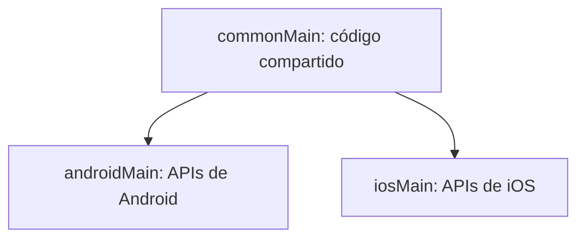
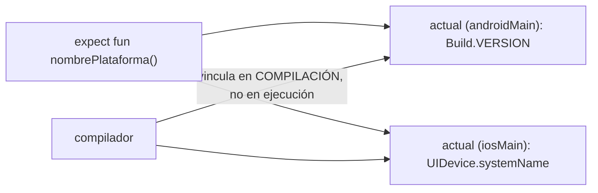
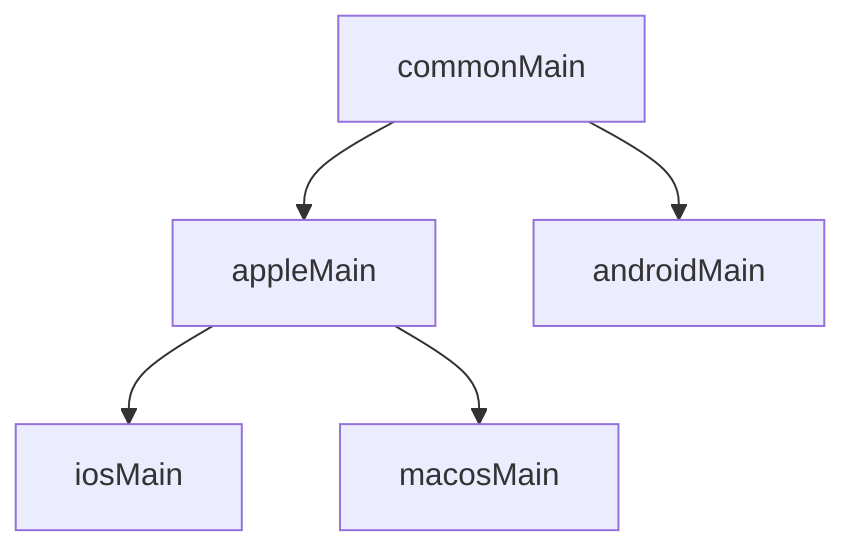

# Módulo 3: Arquitectura de un proyecto KMP

Cada tema se practica por separado con su propia repetición progresiva y su propio reto de memoria — source sets, `expect`/`actual`, targets de Gradle y jerarquías intermedias son la estructura sobre la que se apoya todo el resto del track.


## Aprende construyendo

### Tema 1: Source sets

#### Paso 1 · Objetivo y preparación

Al finalizar podrás decidir si un archivo Kotlin pertenece a `commonMain` o a un source set específico de plataforma, y verificar que `commonMain` nunca importa una API específica de una sola plataforma.

**Conocimiento previo:** ninguno específico; ayuda haber creado ya un archivo `.kt` en módulos anteriores.

#### Paso 2 · Contexto y caso real

**¿Por qué es importante?** La lógica de validación de formularios y reglas de negocio compartida entre la app Android y la app iOS de una misma empresa solo puede vivir en un lugar sin duplicarse si ese código no depende de ninguna API específica de una sola plataforma — source sets es el mecanismo que hace cumplir esa separación.

#### Paso 3 · Teoría con analogía

**Conceptos clave:** `commonMain` (compilado para todas las plataformas), `androidMain`/`iosMain` (específico por plataforma).

`commonMain` contiene código compilado para TODAS las plataformas de destino configuradas, sin ninguna dependencia de APIs específicas de una plataforma particular. `androidMain` e `iosMain` contienen código que se compila únicamente para su plataforma correspondiente, pudiendo usar libremente APIs específicas de esa plataforma. El propósito central de KMP es maximizar la cantidad de código en `commonMain` (lógica de negocio, modelos de dominio) mientras se aísla en source sets específicos solo lo que genuinamente necesita APIs nativas particulares.

**Analogía:** los source sets son plantas de un edificio con distinto alcance de acceso: la planta baja (`commonMain`) es accesible por todos los visitantes; los pisos superiores específicos (`androidMain`, `iosMain`) contienen recursos particulares solo para quienes necesitan ese departamento específico.

**Diagrama:**



#### Paso 4 · Demostración guiada desde cero

Desde una carpeta vacía (o continuando en `academia-kmp`, o créala con `mkdir -p academia-kmp` si es tu primera vez), crea la estructura de source sets y verifica que `commonMain` no importa nada específico de plataforma:

```bash
# python verifica después que commonMain no importa APIs de una sola plataforma
mkdir -p academia-kmp/shared/src/commonMain/kotlin/com/academia/kmp
mkdir -p academia-kmp/shared/src/androidMain/kotlin/com/academia/kmp
mkdir -p academia-kmp/shared/src/iosMain/kotlin/com/academia/kmp
cd academia-kmp
cat > shared/src/commonMain/kotlin/com/academia/kmp/Tarea.kt <<'EOF'
package com.academia.kmp

data class Tarea(val id: String, val titulo: String, val completada: Boolean)
EOF
cat > shared/src/androidMain/kotlin/com/academia/kmp/Plataforma.android.kt <<'EOF'
package com.academia.kmp

import android.os.Build

actual fun nombrePlataforma(): String = "Android ${Build.VERSION.SDK_INT}"
EOF
./gradlew :shared:compileKotlinMetadata
```

**Explicación línea por línea:** `Tarea.kt` en `commonMain` solo usa tipos del lenguaje base de Kotlin (`String`, `Boolean`), sin ningún import de `android.*` o de Foundation/UIKit, por lo que puede compilarse igual para Android, iOS o cualquier otro target configurado; `Plataforma.android.kt` en `androidMain` sí importa `android.os.Build` libremente, porque este archivo solo se compila cuando el target es Android.

Ejecuta en Python un chequeo estructural real que confirma la regla de "commonMain no depende de nada específico de plataforma", recorriendo varios archivos de ejemplo:

```bash
python3 -c "
archivos = {
    'commonMain/Tarea.kt': 'package com.academia.kmp\ndata class Tarea(val id: String)',
    'commonMain/Repositorio.kt': 'package com.academia.kmp\nimport android.content.Context\nclass Repositorio(val ctx: Context)',  # ERROR deliberado
    'androidMain/Plataforma.kt': 'import android.os.Build\nactual fun nombrePlataforma() = Build.VERSION.SDK_INT.toString()',
}

def viola_regla_common_main(ruta, contenido):
    return ruta.startswith('commonMain/') and ('import android' in contenido or 'import platform' in contenido)

violaciones = [ruta for ruta, contenido in archivos.items() if viola_regla_common_main(ruta, contenido)]
print('archivos en commonMain que violan la regla:', violaciones)
"
```

**Resultado esperado:** el chequeo detecta correctamente `['commonMain/Repositorio.kt']` como violación (importa `android.content.Context` estando en `commonMain`), mientras que `commonMain/Tarea.kt` y `androidMain/Plataforma.kt` no se marcan como problema — el primero porque no importa nada de plataforma, el segundo porque SÍ puede importarlo al estar en `androidMain`.

**Fallo deliberado:** intenta compilar mentalmente (o revisa la documentación oficial) qué pasaría si `Repositorio.kt` realmente estuviera en `commonMain` con ese import de `android.content.Context` al configurar un target iOS. La compilación para iOS fallaría inmediatamente, porque `android.content.Context` no existe en absoluto para ese target — diagnostica confirmando que el error común "usar una API específica de Android directamente en `commonMain`" no es un problema de estilo sino un error real de compilación en cualquier target que no sea Android.

#### Construcción RutaFlow: modelo de tarea compartido

Confirma que `data class Tarea` y `data class Parada` (Módulo 0, Tema 4) de RutaFlow viven en `commonMain` sin ningún import específico de plataforma, mientras la notificación push de "entrega completada" vive en `androidMain`/`iosMain` respectivamente.

#### Paso 5 · Práctica guiada — repetición progresiva

1. Crea un archivo en `commonMain` con una `data class` simple y confirma que no tiene imports de plataforma.
2. Crea un archivo en `androidMain` que importe `android.util.Log` y confirma que el chequeo NO lo marca como violación (porque está en el source set correcto).
3. Mueve deliberadamente el archivo del paso 2 a `commonMain` (solo el contenido, en tu chequeo Python) y confirma que ahora SÍ se detecta como violación.
4. Escribe de memoria (sin mirar) un archivo de ejemplo en `iosMain` que importe algo de `platform.Foundation`.

**Pista:** la regla es siempre la misma: `commonMain` nunca importa nada que no exista en TODOS los targets configurados; un source set específico sí puede.

#### Paso 6 · Práctica independiente

**Completa el código:** indica en qué source set debería vivir cada archivo:

```kotlin
// data class Usuario(val id: String, val nombre: String)         -> vive en: ____Main
// import android.content.SharedPreferences ...                    -> vive en: ____Main
// import platform.Foundation.NSUserDefaults ...                   -> vive en: ____Main
```

**Reto de memoria sin mirar:** cierra este documento y escribe, solo de memoria, la estructura de carpetas de un módulo `shared` con `commonMain`, `androidMain` e `iosMain`, y un ejemplo de archivo que pertenecería a cada uno. Compara después contra el patrón del Paso 4.

#### Paso 7 · Cierre y evidencia

Ya decides en qué source set pertenece un archivo según si depende o no de APIs específicas de plataforma, y confirmas con un chequeo real que violar esa regla en `commonMain` es detectable estructuralmente. El siguiente tema resuelve cómo `commonMain` puede llamar a código que SÍ necesita una implementación distinta por plataforma. **Evidencia:** entrega el resultado del chequeo (`['commonMain/Repositorio.kt']` detectado), y explica por qué ese archivo no compilaría para un target iOS. Fuente oficial: [Kotlin docs — Multiplatform source sets](https://kotlinlang.org/docs/multiplatform-discover-project.html#source-sets).

**Errores comunes:** intentar usar una API específica de Android directamente en `commonMain`, rompiendo la compilación para cualquier otro target; duplicar lógica de negocio idéntica en `androidMain` e `iosMain` en vez de moverla a `commonMain`.

**Cuándo no usarlo:** para un proyecto que target solo una plataforma (únicamente Android, sin planes reales de multiplataforma), la separación en source sets múltiples es complejidad innecesaria; resérvala para proyectos que efectivamente comparten código entre 2 o más targets.

### Tema 2: expect/actual

#### Paso 1 · Objetivo y preparación

Al finalizar podrás declarar una función `expect` en `commonMain` y sus implementaciones `actual` correspondientes por plataforma, y explicar por qué el compilador exige una `actual` por cada target configurado.

**Conocimiento previo:** Tema 1 de este módulo (source sets).

#### Paso 2 · Contexto y caso real

**¿Por qué es importante?** Obtener un identificador único de dispositivo (`Settings.Secure.ANDROID_ID` en Android vs `UIDevice.identifierForVendor` en iOS) necesita una implementación completamente distinta por plataforma, pero el código que lo consume en `commonMain` no debería necesitar saber cuál corresponde a cada caso.

#### Paso 3 · Teoría con analogía

**Conceptos clave:** `expect` (contrato declarado en común), `actual` (implementación específica por plataforma), vinculación en tiempo de compilación.

`expect fun nombrePlataforma(): String` (en `commonMain`) establece un contrato: código en `commonMain` puede llamar a esta función confiando en que existe una implementación concreta. `actual fun nombrePlataforma(): String = "Android ${'$'}{Build.VERSION.SDK_INT}"` (en `androidMain`) y su equivalente en `iosMain` proporcionan la implementación real. El compilador de Kotlin vincula cada `expect` con su `actual` correspondiente en TIEMPO DE COMPILACIÓN específico para cada target — sin la ceremonia de selección en tiempo de ejecución que una interfaz común con inyección de dependencias requeriría.

**Analogía:** `expect`/`actual` es una especificación técnica universal de un enchufe eléctrico que cada país implementa físicamente según su propio estándar, sin que el aparato (el código en `commonMain`) necesite saber los detalles de la implementación eléctrica de cada país.

**Diagrama:**



#### Paso 4 · Demostración guiada desde cero

Desde una carpeta vacía (o continuando en `academia-kmp`, o créala con `mkdir -p academia-kmp` si es tu primera vez), crea el contrato en Plataforma.kt y sus implementaciones:

```bash
# python verifica después que cada expect tiene su actual correspondiente
mkdir -p academia-kmp/shared/src/commonMain/kotlin/com/academia/kmp
mkdir -p academia-kmp/shared/src/androidMain/kotlin/com/academia/kmp
mkdir -p academia-kmp/shared/src/iosMain/kotlin/com/academia/kmp
cd academia-kmp
cat > shared/src/commonMain/kotlin/com/academia/kmp/Plataforma.kt <<'EOF'
package com.academia.kmp

expect fun nombrePlataforma(): String
expect fun idUnicoDispositivo(): String
EOF
cat > shared/src/androidMain/kotlin/com/academia/kmp/Plataforma.android.kt <<'EOF'
package com.academia.kmp

actual fun nombrePlataforma(): String = "Android"
actual fun idUnicoDispositivo(): String = "android-id-simulado"
EOF
./gradlew :shared:compileKotlinMetadata :shared:compileDebugKotlinAndroid
```

**Explicación línea por línea:** `expect fun nombrePlataforma(): String` y `expect fun idUnicoDispositivo(): String` declaran dos contratos en `commonMain`; `actual fun nombrePlataforma()` y `actual fun idUnicoDispositivo()` en `androidMain` implementan AMBOS contratos — si faltara implementar uno de los dos, la compilación para Android fallaría.

Ejecuta en Python la misma verificación de contrato, mostrando qué ocurre cuando una plataforma NO implementa todas las `expect` declaradas:

```bash
python3 -c "
expect_declarations = {'nombrePlataforma', 'idUnicoDispositivo'}

actual_por_target = {
    'androidMain': {'nombrePlataforma', 'idUnicoDispositivo'},
    'iosMain': {'nombrePlataforma'},  # falta idUnicoDispositivo a propósito
}

def verificar_contrato(target, actuales):
    faltantes = expect_declarations - actuales
    if faltantes:
        raise ValueError(f'{target}: faltan actual para {faltantes}')
    print(f'{target}: contrato completo, todas las expect tienen actual')

for target, actuales in actual_por_target.items():
    try:
        verificar_contrato(target, actuales)
    except ValueError as e:
        print('ERROR DE COMPILACION SIMULADO:', e)
"
```

**Resultado esperado:** `androidMain: contrato completo, todas las expect tienen actual` se imprime sin error; para `iosMain` se imprime `ERROR DE COMPILACION SIMULADO: iosMain: faltan actual para {'idUnicoDispositivo'}` — exactamente el tipo de error que el compilador real de Kotlin reportaría si compilaras para iOS sin implementar esa función.

**Fallo deliberado:** agrega una tercera función `expect fun formatoFecha(): String` a `commonMain` sin agregar su `actual` correspondiente en NINGUNA plataforma. Repite la verificación — ahora tanto `androidMain` como `iosMain` reportan `faltan actual para {'formatoFecha'}` — diagnostica confirmando que agregar una nueva `expect` en `commonMain` obliga a implementar su `actual` en TODOS los targets configurados antes de poder compilar para cualquiera de ellos, a diferencia de una interfaz con método por defecto, donde olvidar una implementación no necesariamente rompe la compilación.

#### Construcción RutaFlow: identificador de dispositivo para telemetría

Declara `expect fun idDispositivoParaTelemetria(): String` en `commonMain` de RutaFlow, con `actual` en `androidMain` (`Settings.Secure.ANDROID_ID`) e `iosMain` (`UIDevice.identifierForVendor`), verificando que ambas implementaciones existen antes de usar la función en el código compartido.

#### Paso 5 · Práctica guiada — repetición progresiva

1. Declara `expect fun plataformaSoportaNotificacionesPush(): Boolean` y sus dos `actual` correspondientes.
2. Verifica el contrato con el chequeo Python, confirmando que ambos targets lo cumplen.
3. Elimina deliberadamente una de las dos implementaciones `actual` y confirma que el chequeo detecta el faltante.
4. Escribe de memoria (sin mirar) una función `expect` de tu elección con sus dos implementaciones `actual`.

**Pista:** cuenta primero cuántas funciones `expect` hay en `commonMain`, y verifica que cada target tenga exactamente esa misma cantidad de `actual`.

#### Paso 6 · Práctica independiente

**Completa el código:** rellena los espacios para declarar el contrato y su implementación:

```kotlin
// commonMain
____ fun rutaDeAlmacenamiento(): String

// androidMain
____ fun rutaDeAlmacenamiento(): String = context.filesDir.path
```

**Reto de memoria sin mirar:** cierra este documento y escribe, solo de memoria, una función `expect` con dos implementaciones `actual` distintas (Android e iOS), explicando en una frase por qué el compilador exige ambas antes de compilar. Compara después contra el patrón del Paso 4.

#### Paso 7 · Cierre y evidencia

Ya declaras contratos `expect` en `commonMain` y verificas que cada plataforma implementa su `actual` correspondiente, confirmando con un chequeo real qué ocurre cuando falta una implementación. El siguiente tema configura los targets de Gradle que determinan para qué plataformas se compila cada `actual`. **Evidencia:** entrega el resultado de la verificación de contrato para `androidMain` (completo) y `iosMain` (incompleto), y explica por qué agregar una `expect` nueva obliga a implementar su `actual` en todos los targets. Fuente oficial: [Kotlin docs — Expected and actual declarations](https://kotlinlang.org/docs/multiplatform-expect-actual.html).

**Errores comunes:** olvidar implementar `actual` en uno de los targets tras agregar una nueva `expect`, rompiendo la compilación solo para ese target; declarar una `actual` con una firma de tipo distinta a su `expect` correspondiente (parámetros o tipo de retorno diferentes).

**Cuándo no usarlo:** para una función que se comporta idénticamente en todas las plataformas sin necesitar ninguna API nativa particular, `expect`/`actual` es innecesario; decláralas directamente en `commonMain` como una función común.

### Tema 3: Gradle multiplataforma y targets disponibles

#### Paso 1 · Objetivo y preparación

Al finalizar podrás configurar los targets de compilación de un proyecto KMP, y declarar una dependencia en el bloque `sourceSets` correcto según si debe estar disponible en todo el código compartido o solo en una plataforma.

**Conocimiento previo:** Tema 1 de este módulo (source sets); Tema 2 (expect/actual).

#### Paso 2 · Contexto y caso real

**¿Por qué es importante?** Declarar una dependencia (por ejemplo Ktor, Módulo 5) solo en el source set de Android cuando en realidad se necesita en `commonMain` produce un error de compilación al intentar usarla desde código compartido — el bloque de `sourceSets` donde se declara una dependencia determina exactamente desde dónde es visible.

#### Paso 3 · Teoría con analogía

**Conceptos clave:** configuración de targets (`androidTarget()`, `iosX64()`, etc.), dependencias por bloque de `sourceSets`, alcance más allá de Android/iOS.

`kotlin { androidTarget(); iosX64(); iosArm64(); iosSimulatorArm64(); sourceSets { commonMain.dependencies { implementation("io.ktor:ktor-client-core:2.3.0") } } }` configura qué targets están habilitados (Android y las tres variantes de iOS necesarias para dispositivo físico de distintas arquitecturas y simulador), y declara una dependencia en `commonMain.dependencies`, garantizando que esté disponible para todo el código compartido. KMP no se limita a Android/iOS: también compila a JVM, JS/Wasm y Native para escritorio.

**Analogía:** configurar los targets de Gradle es decidir para qué mercados específicos se fabricará un producto, mientras el diseño central (`commonMain`) permanece el mismo sin importar cuántos mercados se decida atender.

**Diagrama:**

```
┌── kotlin { } ────────────────────────────────────────────┐
│  androidTarget()  iosX64()  iosArm64()  iosSimulatorArm64() │
│  sourceSets { commonMain.dependencies { ... } }              │
└──────────────────────────────────────────────────────┘
```

#### Paso 4 · Demostración guiada desde cero

Desde una carpeta vacía (o continuando en `academia-kmp`, o créala con `mkdir -p academia-kmp` si es tu primera vez), crea la configuración de Gradle multiplataforma:

```bash
# python verifica después que la dependencia está en el bloque correcto
mkdir -p academia-kmp
cd academia-kmp
cat > build.gradle.kts <<'EOF'
kotlin {
    androidTarget()
    iosX64(); iosArm64(); iosSimulatorArm64()
    sourceSets {
        commonMain.dependencies {
            implementation("io.ktor:ktor-client-core:2.3.0")
        }
    }
}
EOF
./gradlew projects
```

**Explicación línea por línea:** `androidTarget()` habilita la compilación para Android; `iosX64(); iosArm64(); iosSimulatorArm64()` habilitan las tres variantes de iOS necesarias (simulador Intel, dispositivo físico ARM, simulador ARM en Mac Apple Silicon); `commonMain.dependencies { implementation(...) }` declara Ktor disponible para TODO el código compartido, no solo para una plataforma.

Ejecuta en Python una verificación de alcance de dependencias, confirmando qué source sets pueden usar una dependencia según en qué bloque fue declarada:

```bash
python3 -c "
dependencias_por_bloque = {
    'commonMain': ['ktor-client-core'],
    'androidMain': ['ktor-client-okhttp'],
    'iosMain': ['ktor-client-darwin'],
}

def dependencia_visible_desde(source_set, nombre_dependencia):
    # commonMain es visible desde CUALQUIER plataforma; un bloque específico solo desde sí mismo
    if nombre_dependencia in dependencias_por_bloque.get('commonMain', []):
        return True
    return nombre_dependencia in dependencias_por_bloque.get(source_set, [])

print('androidMain ve ktor-client-core (de commonMain):', dependencia_visible_desde('androidMain', 'ktor-client-core'))
print('iosMain ve ktor-client-okhttp (solo de androidMain):', dependencia_visible_desde('iosMain', 'ktor-client-okhttp'))
print('androidMain ve ktor-client-okhttp (declarado ahí mismo):', dependencia_visible_desde('androidMain', 'ktor-client-okhttp'))
"
```

**Resultado esperado:** `androidMain` SÍ ve `ktor-client-core` (declarada en `commonMain`, visible para todas las plataformas); `iosMain` NO ve `ktor-client-okhttp` (declarada específicamente en `androidMain`, sin alcance fuera de ese source set); `androidMain` SÍ ve su propia dependencia `ktor-client-okhttp`, declarada directamente ahí.

**Fallo deliberado:** mueve `implementation("io.ktor:ktor-client-core:2.3.0")` del bloque `commonMain.dependencies` al bloque `androidMain.dependencies` en el `build.gradle.kts`, pero deja código en `commonMain` que sigue usando clases de Ktor. La compilación para Android funcionaría (porque `androidMain` sí ve su propia dependencia), pero la compilación para iOS fallaría con un error de "no se encuentra la clase/símbolo", porque `commonMain` no puede ver una dependencia declarada solo en `androidMain` — diagnostica confirmando el error común "declarar una dependencia solo en un source set específico cuando se necesita en `commonMain`": el síntoma aparece solo al compilar para la plataforma que NO tiene la dependencia, no para la que sí.

#### Construcción RutaFlow: dependencias compartidas del proyecto

Declara Ktor y `kotlinx.serialization` en `commonMain.dependencies` del `build.gradle.kts` de RutaFlow, y confirma que ambas quedan visibles tanto para `androidMain` como para `iosMain` sin duplicar la declaración en cada uno.

#### Paso 5 · Práctica guiada — repetición progresiva

1. Agrega un target `jvm()` a la configuración y explica en una frase qué caso de uso habilitaría (compartir lógica con un backend Spring Boot).
2. Declara una dependencia ficticia en `iosMain.dependencies` y confirma con el chequeo Python que `androidMain` no la ve.
3. Declara la misma dependencia en `commonMain.dependencies` en su lugar, y confirma que ahora SÍ es visible desde ambos.
4. Escribe de memoria (sin mirar) un bloque `kotlin { }` con al menos dos targets y una dependencia en `commonMain.dependencies`.

**Pista:** una dependencia declarada en `commonMain` siempre es visible desde cualquier plataforma; una declarada en un source set específico solo es visible desde ese mismo source set (y sus descendientes, si los hay).

#### Paso 6 · Práctica independiente

**Completa el código:** rellena el espacio para que la dependencia esté disponible en todo el código compartido:

```kotlin
sourceSets {
    ____.dependencies {
        implementation("io.ktor:ktor-client-core:2.3.0")
    }
}
```

**Reto de memoria sin mirar:** cierra este documento y escribe, solo de memoria, un bloque `kotlin { }` configurando Android + iOS con una dependencia en `commonMain`. Compara después contra el patrón del Paso 4.

#### Paso 7 · Cierre y evidencia

Ya configuras los targets de un proyecto KMP y declaras dependencias en el bloque correcto según su alcance necesario, confirmando con una verificación real que una dependencia mal ubicada rompe la compilación solo para la plataforma que no la ve. El siguiente y último tema de este módulo extiende la jerarquía de source sets más allá de solo `commonMain`/`androidMain`/`iosMain`. **Evidencia:** entrega el resultado de la verificación de alcance (androidMain ve ktor-client-core; iosMain no ve ktor-client-okhttp), y explica por qué el error de dependencia mal ubicada solo aparece al compilar para la plataforma afectada. Fuente oficial: [Kotlin docs — Add dependencies](https://kotlinlang.org/docs/multiplatform-add-dependencies.html).

**Errores comunes:** olvidar declarar todos los targets de iOS necesarios (x64, arm64, simulador), cada uno cubriendo un caso distinto; declarar una dependencia solo en un source set específico cuando se necesita en `commonMain`, rompiendo la compilación solo para las plataformas que no la ven.

**Cuándo no usarlo:** para un proyecto que nunca compilará para más de una plataforma, configurar múltiples targets de Gradle es trabajo innecesario; agrégalos solo cuando el proyecto realmente los necesite.

### Tema 4: Jerarquía de source sets intermedios

#### Paso 1 · Objetivo y preparación

Al finalizar podrás usar un source set intermedio (como `appleMain`) para compartir código entre plataformas similares sin duplicarlo en cada una y sin subirlo hasta `commonMain`.

**Conocimiento previo:** Tema 1 de este módulo (source sets básicos); Tema 3 (targets de Gradle, incluyendo las tres variantes de iOS).

#### Paso 2 · Contexto y caso real

**¿Por qué es importante?** Código que usa Foundation/UIKit tiene sentido para iOS Y macOS (ambos son plataformas Apple) pero NO para Android; subirlo a `commonMain` rompería la compilación para Android, y duplicarlo en `iosMain` y `macosMain` por separado repite la misma lógica dos veces innecesariamente.

#### Paso 3 · Teoría con analogía

**Conceptos clave:** source set intermedio (`appleMain`), jerarquía de `dependsOn`, código compartido entre un subconjunto de plataformas.

Un source set intermedio como `appleMain` se sitúa entre `commonMain` y los source sets específicos de cada variante Apple (`iosMain`, `macosMain`): declarando `iosMain.dependsOn(appleMain)` y `macosMain.dependsOn(appleMain)`, cualquier código en `appleMain` (que sí puede usar Foundation, disponible en todas las plataformas Apple) queda automáticamente visible para `iosMain` y `macosMain`, pero sigue siendo invisible para `androidMain`. Esto evita el falso dilema de "todo en `commonMain` o todo duplicado por plataforma".

**Analogía:** si `commonMain` es la planta baja de acceso universal y cada `androidMain`/`iosMain` es un piso privado, un source set intermedio como `appleMain` es un piso compartido SOLO entre los departamentos de un mismo edificio hermano (las plataformas Apple), sin acceso desde el edificio de al lado (Android).

**Diagrama:**



#### Paso 4 · Demostración guiada desde cero

Desde una carpeta vacía (o continuando en `academia-kmp`, o créala con `mkdir -p academia-kmp` si es tu primera vez), crea la jerarquía intermedia en build.gradle.kts:

```bash
# python verifica después qué source sets pueden ver appleMain y cuáles no
mkdir -p academia-kmp/shared/src/{commonMain,appleMain,iosMain,macosMain,androidMain}/kotlin/com/academia/kmp
cd academia-kmp
cat >> build.gradle.kts <<'EOF'

// jerarquía intermedia: iosMain y macosMain dependen de appleMain, no directamente de commonMain
sourceSets {
    val appleMain by creating { dependsOn(commonMain.get()) }
    iosMain.get().dependsOn(appleMain)
    // macosMain.get().dependsOn(appleMain) -- se agregaría igual si el target macOS está habilitado
}
EOF
./gradlew :shared:compileKotlinIosX64
```

**Explicación línea por línea:** `val appleMain by creating { dependsOn(commonMain.get()) }` crea un nuevo source set intermedio que a su vez depende de `commonMain` (ve todo lo que `commonMain` expone); `iosMain.get().dependsOn(appleMain)` hace que `iosMain` ahora dependa de `appleMain` en vez de solo de `commonMain` directamente, ganando acceso a cualquier código Apple-específico que se coloque ahí.

Ejecuta en Python el mismo modelo de jerarquía de visibilidad (reachability sobre un grafo de dependencias `dependsOn`), confirmando qué source sets pueden ver qué código:

```bash
python3 -c "
jerarquia = {
    'commonMain': [],
    'appleMain': ['commonMain'],
    'iosMain': ['appleMain', 'commonMain'],
    'macosMain': ['appleMain', 'commonMain'],
    'androidMain': ['commonMain'],
}

def puede_ver(origen, symbol_definido_en):
    visibles = set([origen])
    pendientes = [origen]
    while pendientes:
        actual = pendientes.pop()
        for padre in jerarquia.get(actual, []):
            if padre not in visibles:
                visibles.add(padre)
                pendientes.append(padre)
    return symbol_definido_en in visibles

print('iosMain ve código de appleMain:', puede_ver('iosMain', 'appleMain'))
print('macosMain ve código de appleMain:', puede_ver('macosMain', 'appleMain'))
print('androidMain ve código de appleMain:', puede_ver('androidMain', 'appleMain'))
"
```

**Resultado esperado:** tanto `iosMain` como `macosMain` ven código de `appleMain` (`True` en ambos casos), porque ambos dependen de él en la jerarquía; `androidMain` NO ve código de `appleMain` (`False`), porque no existe ninguna ruta de `dependsOn` que los conecte — exactamente el aislamiento que se buscaba: código Apple-específico compartido entre iOS y macOS, sin filtrarse hacia Android.

**Fallo deliberado:** agrega `androidMain.dependsOn(appleMain)` a la jerarquía del script Python (una conexión que no tendría sentido real, ya que Android no es una plataforma Apple). Repite la verificación — ahora `androidMain` "vería" código de `appleMain`, pero ese código probablemente use Foundation/UIKit, que no existe en Android, produciendo un error de compilación real en cuanto se intente usar algo específico de Apple desde ese código — diagnostica confirmando que la jerarquía de `dependsOn` debe reflejar fielmente qué plataformas realmente comparten APIs compatibles, no conexiones arbitrarias.

#### Construcción RutaFlow: código compartido entre iOS y macOS de RutaFlow

Si RutaFlow añadiera un target de escritorio macOS (Compose Multiplatform Desktop, Módulo 7), declara `appleMain` para compartir la integración con notificaciones nativas de Apple entre `iosMain` y `macosMain`, sin duplicar esa lógica ni subirla incorrectamente a `commonMain`.

#### Paso 5 · Práctica guiada — repetición progresiva

1. Agrega `watchosMain` a la jerarquía Python, dependiendo también de `appleMain`, y confirma que ve el mismo código que `iosMain`/`macosMain`.
2. Confirma que `watchosMain` NO ve nada declarado directamente en `iosMain` (son hermanos, no hay `dependsOn` entre ellos).
3. Elimina la entrada de `iosMain` en la jerarquía y confirma que ahora `puede_ver('iosMain', 'appleMain')` falla con un `KeyError` o devuelve `False` según cómo lo manejes.
4. Escribe de memoria (sin mirar) una jerarquía de tres niveles (`commonMain` → un intermedio de tu elección → dos hojas) y verifica la visibilidad entre ellas.

**Pista:** dibuja la jerarquía como un árbol antes de escribir el código; la visibilidad siempre fluye desde una hoja hacia la raíz, nunca lateralmente entre hermanos.

#### Paso 6 · Práctica independiente

**Completa el código:** rellena el espacio para que `iosMain` dependa del source set intermedio:

```kotlin
val appleMain by creating { dependsOn(commonMain.get()) }
iosMain.get().____(appleMain)
```

**Reto de memoria sin mirar:** cierra este documento y escribe, solo de memoria, una jerarquía de source sets con un nivel intermedio compartido por exactamente dos plataformas hoja, y explica en una frase por qué una tercera plataforma no relacionada no debería depender de ese intermedio. Compara después contra el patrón del Paso 4.

#### Paso 7 · Cierre y evidencia

Ya usas un source set intermedio para compartir código entre un subconjunto de plataformas sin duplicarlo ni subirlo incorrectamente a `commonMain`, confirmando con un chequeo de reachability real qué source sets pueden verse entre sí. Esto cierra el módulo de arquitectura; el siguiente módulo aplica esta estructura a modelos de dominio y casos de uso de la lógica de negocio compartida. **Evidencia:** entrega el resultado de la verificación (`iosMain`/`macosMain` ven `appleMain`; `androidMain` no), y explica por qué conectar `androidMain` a `appleMain` sería un error de diseño aunque técnicamente compilara en algunos casos. Fuente oficial: [Kotlin docs — Hierarchical project structure](https://kotlinlang.org/docs/multiplatform-hierarchy.html).

**Errores comunes:** subir código Apple-específico directamente a `commonMain` en vez de a un intermedio como `appleMain`, rompiendo la compilación para Android; crear una conexión `dependsOn` entre plataformas que no comparten APIs reales, permitiendo que código incompatible se filtre.

**Cuándo no usarlo:** para un proyecto que solo compila a dos plataformas sin ningún subconjunto intermedio con necesidades compartidas específicas (por ejemplo, solo Android + JVM backend, sin variantes Apple múltiples), un source set intermedio adicional es complejidad innecesaria; usa `commonMain` y los source sets específicos directamente.

---


## Laboratorio práctico

**Objetivo del laboratorio:** construir un proyecto KMP con un módulo compartido que compila para Android e iOS, con contratos `expect`/`actual` verificados y una jerarquía de source sets correcta.

**Requisitos previos:** Módulos 0-2 completados.

| Paso | Acción | Código | Explicación |
|---|---|---|---|
| 1 | Crear un proyecto KMP desde la plantilla oficial | — | Explora `commonMain`/`androidMain`/`iosMain` |
| 2 | Escribir una función `expect` en `commonMain` | Ver Tema 2 | Que dependa de una implementación por plataforma |
| 3 | Implementar `actual` en `androidMain` e `iosMain` | Ver Tema 2 | Con código distinto en cada una |
| 4 | Configurar los targets de Gradle | Ver Tema 3 | Android + las tres variantes de iOS |
| 5 | Declarar una dependencia en `commonMain.dependencies` | Ver Tema 3 | Confirma que es visible desde ambas plataformas |
| 6 | Crear un source set intermedio `appleMain` | Ver Tema 4 | Compartido entre iOS y macOS, no Android |

**Verificación:** el laboratorio se considera exitoso si el proyecto compila correctamente para ambos targets, si la función `expect`/`actual` devuelve el valor correcto y específico de cada plataforma, y si puedes explicar con un ejemplo propio qué source set corresponde a un archivo dado según sus dependencias.

**Errores comunes y soluciones**

- **Intentar usar una API específica de Android directamente en `commonMain`.** Ese código no compilaría para iOS; usa `expect`/`actual` para aislar lo específico de plataforma.
- **Olvidar declarar todos los targets de iOS necesarios (x64, arm64, simulador).** Cada uno cubre un caso distinto (dispositivo físico de arquitecturas distintas, simulador).
- **Declarar una dependencia solo en un source set específico cuando se necesita en `commonMain`.** Verifica en qué bloque de `sourceSets` corresponde declarar cada dependencia según su alcance.
- **Subir código Apple-específico a `commonMain` en vez de a un intermedio como `appleMain`.** Usa la jerarquía de `dependsOn` para compartir código solo entre las plataformas que realmente lo necesitan.

---
