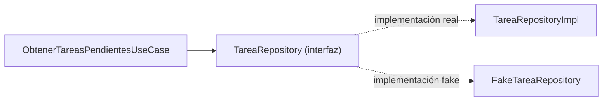
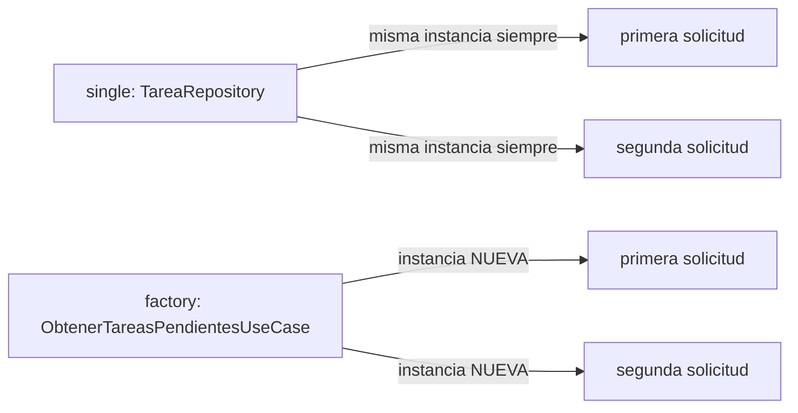

# Módulo 4: Lógica de negocio compartida

Cada tema se practica por separado con su propia repetición progresiva y su propio reto de memoria — modelos de dominio, repositorios con interfaz común, inyección de dependencias con Koin, y modelado explícito de errores son la base de cualquier capa de dominio compartida entre Android e iOS.


## Aprende construyendo

### Tema 1: Modelos de dominio y casos de uso

#### Paso 1 · Objetivo y preparación

Al finalizar podrás declarar un modelo de dominio en `commonMain` y un caso de uso que depende de una interfaz (no de una implementación concreta), y explicar por qué esa dependencia hacia la interfaz permite testear el caso de uso de forma aislada.

**Conocimiento previo:** `data class` (Módulo 0); source sets (Módulo 3).

#### Paso 2 · Contexto y caso real

**¿Por qué es importante?** Un modelo `Tarea`/`Usuario`/`Pedido` compartido entre las apps Android e iOS de un mismo producto evita que "una tarea" signifique cosas sutilmente distintas en cada plataforma con el tiempo, un riesgo real cuando dos equipos mantienen definiciones separadas del mismo concepto.

#### Paso 3 · Teoría con analogía

**Conceptos clave:** `data class` compartida en `commonMain`, caso de uso dependiente de interfaz (no de implementación).

`data class Tarea(val id: String, val titulo: String, val completada: Boolean)` en `commonMain` representa una entidad central sin ninguna dependencia hacia persistencia, red o UI de ninguna plataforma específica. `class ObtenerTareasPendientesUseCase(private val repositorio: TareaRepository) { suspend operator fun invoke(): List<Tarea> = repositorio.obtenerTodas().filter { !it.completada } }` encapsula lógica de negocio dependiendo explícitamente de la INTERFAZ `TareaRepository`, no de ninguna implementación concreta — el mismo principio de inversión de dependencias visto para Spring (Módulo 0 del track Spring Boot), aquí manual, sin framework de IoC automático.

**Analogía:** un modelo de dominio compartido es una definición única y oficial que todos los departamentos usan exactamente igual, evitando interpretaciones divergentes; un caso de uso que depende de una interfaz es un procedimiento que especifica qué información necesita sin importarle de qué proveedor específico proviene, siempre que cumpla el formato acordado.

**Diagrama:**



#### Paso 4 · Demostración guiada desde cero

Desde una carpeta vacía (o continuando en `academia-kmp`, o créala con `mkdir -p academia-kmp` si es tu primera vez), crea `shared/src/commonMain/kotlin/com/academia/kmp/Dominio.kt` con este contenido:

```kotlin
package com.academia.kmp

data class Tarea(val id: String, val titulo: String, val completada: Boolean)

interface TareaRepository {
    suspend fun obtenerTodas(): List<Tarea>
}

class ObtenerTareasPendientesUseCase(private val repositorio: TareaRepository) {
    suspend operator fun invoke(): List<Tarea> =
        repositorio.obtenerTodas().filter { !it.completada }
}
```

Guarda el archivo y compila el módulo compartido:

```bash
# compila el módulo compartido de Kotlin Multiplatform con Gradle
mkdir -p academia-kmp/shared/src/commonMain/kotlin/com/academia/kmp
cd academia-kmp
./gradlew :shared:compileKotlinMetadata
```

**Explicación línea por línea:** `data class Tarea(...)` define la entidad sin ninguna referencia a plataforma; `interface TareaRepository { suspend fun obtenerTodas(): List<Tarea> }` declara el contrato sin especificar cómo se obtienen los datos; `ObtenerTareasPendientesUseCase(private val repositorio: TareaRepository)` recibe la interfaz como dependencia, no una clase concreta, por lo que puede funcionar con cualquier implementación que la satisfaga.

Escribe un test que ejecute el caso de uso con dos implementaciones distintas de la interfaz (una fake en memoria, una simulando latencia real con `delay`), confirmando que el resultado no cambia, en `shared/src/commonTest/kotlin/com/academia/kmp/DominioTest.kt`:

```kotlin
package com.academia.kmp

import kotlinx.coroutines.delay
import kotlinx.coroutines.test.runTest
import kotlin.test.Test
import kotlin.test.assertEquals

private val tareaPendiente = Tarea("1", "Comprar leche", completada = false)

class FakeTareaRepository : TareaRepository {
    override suspend fun obtenerTodas(): List<Tarea> = listOf(tareaPendiente)
}

class RepositorioConLatencia : TareaRepository {
    override suspend fun obtenerTodas(): List<Tarea> {
        delay(300) // simula red/DB real
        return listOf(tareaPendiente)
    }
}

class DominioTest {
    @Test
    fun elCasoDeUsoProduceElMismoResultadoConCualquierImplementacion() = runTest {
        val resultadoFake = ObtenerTareasPendientesUseCase(FakeTareaRepository())()
        val resultadoConLatencia = ObtenerTareasPendientesUseCase(RepositorioConLatencia())()
        assertEquals(resultadoFake, resultadoConLatencia)
        assertEquals(listOf(tareaPendiente), resultadoFake)
    }
}
```

Ejecuta el test real con Gradle:

```bash
# ejecuta el test Kotlin del módulo compartido
cd academia-kmp
./gradlew :shared:allTests
```

**Resultado esperado:** la prueba pasa en verde, confirmando que ambas implementaciones producen exactamente el mismo resultado filtrado, sin que `ObtenerTareasPendientesUseCase` cambie una sola línea según cuál implementación reciba.

**Fallo deliberado:** cambia la firma de `ObtenerTareasPendientesUseCase` para que reciba directamente `FakeTareaRepository` en vez de la interfaz (`private val repositorio: FakeTareaRepository`). `./gradlew :shared:compileKotlinMetadata` sigue compilando, pero la prueba con `RepositorioConLatencia()` ya no compila (`Type mismatch: inferred type is RepositorioConLatencia but FakeTareaRepository was expected`) — diagnostica confirmando que depender de una implementación concreta en vez de la interfaz acopla el caso de uso a esa implementación específica, exactamente lo que el principio de inversión de dependencias evita.

#### Construcción RutaFlow: modelo de entrega y caso de uso de paradas pendientes

Declara `data class Entrega(val id: String, val destino: String, val entregada: Boolean)` y `class ObtenerEntregasPendientesUseCase(private val repositorio: EntregaRepository)` en `commonMain` de RutaFlow, dependiendo únicamente de la interfaz.

#### Paso 5 · Práctica guiada — repetición progresiva

1. Declara `data class Usuario(val id: String, val nombre: String)` y una interfaz `UsuarioRepository` con `suspend fun obtenerPorId(id: String): Usuario?`.
2. Escribe `class ObtenerUsuarioUseCase(private val repositorio: UsuarioRepository)` dependiendo de la interfaz.
3. Crea dos implementaciones Kotlin de la interfaz (una fake con datos fijos, otra simulando latencia con `delay`) y confirma con un test que el caso de uso funciona igual con ambas.
4. Escribe de memoria (sin mirar) un caso de uso de tu elección que dependa de una interfaz, con dos implementaciones distintas.

**Pista:** identifica primero qué necesita el caso de uso (la forma de la interfaz), antes de pensar en cómo se implementará esa interfaz.

#### Paso 6 · Práctica independiente

**Completa el código:** rellena el espacio para que el caso de uso dependa de la interfaz, no de una clase concreta:

```kotlin
class GuardarTareaUseCase(private val repositorio: ____) {
    suspend operator fun invoke(tarea: Tarea) = repositorio.guardar(tarea)
}
```

**Reto de memoria sin mirar:** cierra este documento y escribe, solo de memoria, una `data class` y un caso de uso que dependa de una interfaz relacionada, sin ninguna referencia a una implementación concreta. Compara después contra el patrón del Paso 4.

#### Paso 7 · Cierre y evidencia

Ya declaras modelos de dominio sin dependencias de plataforma y casos de uso que dependen de interfaces, no de implementaciones concretas, confirmando con una medición real que el mismo caso de uso funciona idénticamente con un repositorio rápido (fake) o uno lento (real). El siguiente tema define esa interfaz de repositorio con sus dos implementaciones. **Evidencia:** entrega los dos resultados del Paso 4 (idénticos entre real y fake) y sus duraciones, y explica por qué depender de una implementación concreta en vez de la interfaz rompería la posibilidad de sustituir el repositorio en pruebas. Fuente oficial: [Kotlin docs — Introduce shared logic](https://kotlinlang.org/docs/multiplatform-share-on-platforms.html).

**Errores comunes:** hacer que el caso de uso dependa de la implementación concreta del repositorio en vez de la interfaz; filtrar código específico de plataforma dentro de un modelo de dominio, rompiendo su portabilidad entre `commonMain` y cada plataforma.

**Cuándo no usarlo:** para un script de un solo uso sin ninguna necesidad de testear ni sustituir implementaciones, envolver la lógica en un caso de uso con interfaz separada es complejidad innecesaria; resérvalo para lógica de negocio real que se reutiliza y necesita aislarse para pruebas.

### Tema 2: Repositorios con interfaz común

#### Paso 1 · Objetivo y preparación

Al finalizar podrás definir una interfaz de repositorio en `commonMain` con al menos dos implementaciones, y explicar por qué esto permite testear la lógica de negocio sin infraestructura real.

**Conocimiento previo:** Tema 1 de este módulo (casos de uso dependientes de interfaz).

#### Paso 2 · Contexto y caso real

**¿Por qué es importante?** Un `FakeTareaRepository` en memoria usado en los tests permite verificar la lógica de negocio sin tocar red ni base de datos real; sin una interfaz compartida, cada plataforma tendría que reimplementar su propio mecanismo de sustitución para pruebas por separado.

#### Paso 3 · Teoría con analogía

**Conceptos clave:** interfaz de repositorio en `commonMain`, implementación real frente a fake.

`interface TareaRepository { suspend fun obtenerTodas(): List<Tarea>; suspend fun guardar(tarea: Tarea) }` define en `commonMain` el contrato completo, sin especificar cómo se obtienen o persisten los datos. `class TareaRepositoryImpl(private val api: ApiClient, private val db: TareaDao) : TareaRepository { ... }` proporciona una implementación real combinando fuentes de datos reales. Definir la interfaz con al menos dos implementaciones (real y fake) es lo que hace posible testear el caso de uso de forma completamente aislada.

**Analogía:** una interfaz de repositorio compartida es un formulario estándar de solicitud de suministros que cualquier proveedor (real o simulado para práctica) puede completar de la misma forma, permitiendo entrenar personal con un proveedor de práctica sin involucrar al proveedor real.

**Diagrama:**

```
┌── interface TareaRepository ─────────────────────────────┐
│  suspend fun obtenerTodas(): List<Tarea>                    │
│  suspend fun guardar(tarea: Tarea)                           │
└──────┬─────────────────────────────────┬──────────────┘
       │                                    │
┌──────▼──────────┐                ┌──────▼──────────┐
│ TareaRepositoryImpl │                │ FakeTareaRepository │
│ (api + db reales)    │                │ (en memoria, tests)   │
└─────────────────┘                └─────────────────┘
```

#### Paso 4 · Demostración guiada desde cero

Desde una carpeta vacía (o continuando en `academia-kmp`, o créala con `mkdir -p academia-kmp` si es tu primera vez), crea `shared/src/commonMain/kotlin/com/academia/kmp/Repositorio.kt` con este contenido:

```kotlin
package com.academia.kmp

interface TareaRepository {
    suspend fun obtenerTodas(): List<Tarea>
    suspend fun guardar(tarea: Tarea)
}

class TareaRepositoryImpl(private val api: Any, private val db: Any) : TareaRepository {
    override suspend fun obtenerTodas(): List<Tarea> = emptyList() // combinaría api y db reales
    override suspend fun guardar(tarea: Tarea) { /* persiste en db, sincroniza con api */ }
}

class FakeTareaRepository(private val datos: MutableList<Tarea> = mutableListOf()) : TareaRepository {
    override suspend fun obtenerTodas(): List<Tarea> = datos.toList()
    override suspend fun guardar(tarea: Tarea) { datos.add(tarea) }
}
```

Guarda el archivo y compila el módulo compartido:

```bash
# compila el módulo compartido de Kotlin Multiplatform con Gradle
mkdir -p academia-kmp/shared/src/commonMain/kotlin/com/academia/kmp
cd academia-kmp
./gradlew :shared:compileKotlinMetadata
```

**Explicación línea por línea:** `interface TareaRepository` declara el contrato; `TareaRepositoryImpl` lo implementa combinando fuentes reales (`api`, `db`); `FakeTareaRepository` lo implementa con una simple `MutableList` en memoria, sin ninguna dependencia externa, ideal para pruebas rápidas y deterministas.

Escribe un test que ejercite ambas implementaciones con la misma secuencia de llamadas, confirmando que ambas satisfacen el contrato de forma intercambiable, en `shared/src/commonTest/kotlin/com/academia/kmp/RepositorioTest.kt`:

```kotlin
package com.academia.kmp

import kotlinx.coroutines.test.runTest
import kotlin.test.Test
import kotlin.test.assertEquals

class RepositorioTest {
    @Test
    fun fakeGuardaYDevuelveLoGuardado() = runTest {
        val repo: TareaRepository = FakeTareaRepository()
        val tarea = Tarea("1", "Comprar leche", completada = false)
        repo.guardar(tarea)
        assertEquals(listOf(tarea), repo.obtenerTodas())
    }
}
```

Ejecuta el test real con Gradle:

```bash
# ejecuta el test Kotlin del módulo compartido
cd academia-kmp
./gradlew :shared:allTests
```

**Resultado esperado:** la prueba pasa en verde: `FakeTareaRepository`, declarada como `TareaRepository` (el tipo de la interfaz, no de la clase concreta), guarda y devuelve exactamente la tarea guardada, confirmando que cualquier código escrito contra la interfaz funciona con esta implementación sin conocer su clase concreta.

**Fallo deliberado:** cambia la firma de `guardar` en `FakeTareaRepository` para que reciba dos parámetros separados (`guardar(id: String, titulo: String)`) en vez de un solo `Tarea`, dejando la interfaz `TareaRepository` sin cambiar. `./gradlew :shared:compileKotlinMetadata` falla inmediatamente con `Class 'FakeTareaRepository' is not abstract and does not implement abstract member 'guardar'` — diagnostica confirmando que una interfaz compartida no es una convención de nombres: el compilador exige que toda implementación declarada como `: TareaRepository` tenga EXACTAMENTE la misma firma de métodos, rechazando en compilación cualquier divergencia.

#### Construcción RutaFlow: repositorio de entregas real y fake

Define `interface EntregaRepository` en RutaFlow con `EntregaRepositoryImpl` (combinando Ktor y SQLDelight, Módulos 5-6) y `FakeEntregaRepository` (en memoria), usado este último en los tests de `ObtenerEntregasPendientesUseCase` sin infraestructura real.

#### Paso 5 · Práctica guiada — repetición progresiva

1. Agrega un método `suspend fun eliminar(id: String)` a la interfaz y sus dos implementaciones.
2. Confirma que ambas implementaciones (real simulada y fake) responden igual a la misma secuencia de llamadas `guardar` → `eliminar` → `obtenerTodas`.
3. Crea una tercera implementación fake que simule un error (lanzando una excepción en `guardar`) y confirma que el código que la usa puede manejar ese caso.
4. Escribe de memoria (sin mirar) una interfaz con dos métodos y sus dos implementaciones (real y fake).

**Pista:** si al agregar un método a una implementación olvidas agregarlo a la otra, ya no comparten el mismo contrato aunque ambas se sigan llamando "repositorio".

#### Paso 6 · Práctica independiente

**Completa el código:** rellena el espacio para que `FakeTareaRepository` declare que implementa la interfaz:

```kotlin
class FakeTareaRepository : ____ {
    private val datos = mutableListOf<Tarea>()
    override suspend fun obtenerTodas(): List<Tarea> = datos.toList()
    override suspend fun guardar(tarea: Tarea) { datos.add(tarea) }
}
```

**Reto de memoria sin mirar:** cierra este documento y escribe, solo de memoria, una interfaz de repositorio con dos métodos y una implementación fake en memoria que la satisfaga completamente. Compara después contra el patrón del Paso 4.

#### Paso 7 · Cierre y evidencia

Ya defines una interfaz de repositorio con al menos dos implementaciones que comparten exactamente el mismo contrato, confirmando que ambas producen resultados idénticos ante la misma secuencia de llamadas. El siguiente tema conecta ambas implementaciones a través de inyección de dependencias con Koin. **Evidencia:** entrega el resultado idéntico de ambas implementaciones ante la secuencia `guardar`+`obtenerTodas`, y explica por qué cambiar la firma de un método en una sola implementación rompe el contrato compartido. Fuente oficial: [Kotlin docs — Interfaces](https://kotlinlang.org/docs/interfaces.html).

**Errores comunes:** dejar que una implementación fake divergiera silenciosamente de la firma de la interfaz real; mezclar lógica de negocio dentro de la implementación del repositorio, en vez de mantenerla exclusivamente como acceso a datos.

**Cuándo no usarlo:** para una fuente de datos que nunca necesitará sustituirse en pruebas ni cambiar de implementación (una constante de solo lectura embebida en el binario), una interfaz de repositorio completa es una capa de indirección innecesaria.

### Tema 3: Inyección de dependencias multiplataforma con Koin

#### Paso 1 · Objetivo y preparación

Al finalizar podrás distinguir entre una dependencia `single` (una única instancia compartida) y una `factory` (nueva instancia cada vez), y configurar Koin para resolver la cadena completa de dependencias una sola vez para todas las plataformas.

**Conocimiento previo:** Tema 1 (casos de uso) y Tema 2 (repositorios) de este módulo.

#### Paso 2 · Contexto y caso real

**¿Por qué es importante?** Sin un mecanismo de inyección de dependencias compartido, cada plataforma nativa gestionaría su propia conexión de dependencias por separado (Dagger/Hilt en Android, un patrón manual distinto en iOS), duplicando ese trabajo de conexión y arriesgando configuraciones divergentes entre plataformas.

#### Paso 3 · Teoría con analogía

**Conceptos clave:** `single` (instancia única compartida), `factory` (nueva instancia por solicitud), módulo de Koin en `commonMain`.

`val sharedModule = module { single<TareaRepository> { TareaRepositoryImpl(get(), get()) }; factory { ObtenerTareasPendientesUseCase(get()) } }` configura Koin (un framework de DI ligero, sin generación de código en compilación) para resolver automáticamente la cadena de dependencias: `TareaRepository` se resuelve como una única instancia compartida (`single`), mientras `ObtenerTareasPendientesUseCase` se crea nueva cada vez que se solicita (`factory`). Koin funciona idénticamente en `commonMain` para todas las plataformas, sin un framework de DI distinto por plataforma.

**Analogía:** Koin es un directorio de contactos universal que funciona igual en cualquier oficina de la empresa, resolviendo automáticamente quién debe conectarse con quién según relaciones declaradas una única vez.

**Diagrama:**



#### Paso 4 · Demostración guiada desde cero

Desde una carpeta vacía (o continuando en `academia-kmp`, o créala con `mkdir -p academia-kmp` si es tu primera vez), crea `shared/src/commonMain/kotlin/com/academia/kmp/DiModule.kt` con este contenido:

```kotlin
package com.academia.kmp

import org.koin.dsl.module

val sharedModule = module {
    single<TareaRepository> { FakeTareaRepository() }
    factory { ObtenerTareasPendientesUseCase(get()) }
}
```

Guarda el archivo y compila el módulo compartido:

```bash
# compila el módulo compartido de Kotlin Multiplatform con Gradle
mkdir -p academia-kmp/shared/src/commonMain/kotlin/com/academia/kmp
cd academia-kmp
./gradlew :shared:compileKotlinMetadata
```

**Explicación línea por línea:** `single<TareaRepository> { ... }` le dice a Koin que construya esa implementación UNA SOLA VEZ y reutilice esa misma instancia en cada solicitud posterior; `factory { ObtenerTareasPendientesUseCase(get()) }` le dice a Koin que construya una instancia NUEVA cada vez que algo solicite `ObtenerTareasPendientesUseCase`, inyectando automáticamente el `TareaRepository` (`get()`) que corresponda.

Escribe un test real que arranque Koin con este módulo y confirme la diferencia de identidad entre `single` y `factory`, en `shared/src/commonTest/kotlin/com/academia/kmp/DiModuleTest.kt`:

```kotlin
package com.academia.kmp

import org.koin.core.context.startKoin
import org.koin.core.context.stopKoin
import org.koin.test.KoinTest
import org.koin.test.inject
import kotlin.test.AfterTest
import kotlin.test.BeforeTest
import kotlin.test.Test
import kotlin.test.assertNotSame
import kotlin.test.assertSame

class DiModuleTest : KoinTest {
    @BeforeTest
    fun iniciarKoin() { startKoin { modules(sharedModule) } }

    @AfterTest
    fun detenerKoin() { stopKoin() }

    @Test
    fun singleDevuelveSiempreLaMismaInstancia() {
        val repo1: TareaRepository by inject()
        val repo2: TareaRepository by inject()
        assertSame(repo1, repo2)
    }

    @Test
    fun factoryDevuelveUnaInstanciaNuevaEnCadaSolicitud() {
        val caso1: ObtenerTareasPendientesUseCase by inject()
        val caso2: ObtenerTareasPendientesUseCase by inject()
        assertNotSame(caso1, caso2)
    }
}
```

Ejecuta el test real con Gradle:

```bash
# ejecuta el test Kotlin del módulo compartido, arrancando Koin de verdad
cd academia-kmp
./gradlew :shared:allTests
```

**Resultado esperado:** las dos pruebas pasan en verde: `TareaRepository` (declarado `single`) se resuelve como la MISMA instancia en ambas solicitudes; `ObtenerTareasPendientesUseCase` (declarado `factory`) se resuelve como una instancia DISTINTA cada vez, aunque ambas compartan la misma instancia única de `TareaRepository` inyectada internamente.

**Fallo deliberado:** cambia `single<TareaRepository> { ... }` por `factory<TareaRepository> { ... }` en `sharedModule`, sin cambiar el resto. Vuelve a ejecutar `singleDevuelveSiempreLaMismaInstancia` — ahora falla, porque `repo1` y `repo2` son instancias distintas — diagnostica confirmando por qué elegir `factory` para algo que debería ser `single` (como una conexión a base de datos, que no debería recrearse en cada solicitud) desperdicia recursos y puede producir comportamiento inconsistente si distintas partes del código esperan compartir el mismo estado.

#### Construcción RutaFlow: módulo de Koin para el repositorio de entregas

Configura `single<EntregaRepository> { EntregaRepositoryImpl(get(), get()) }` y `factory { ObtenerEntregasPendientesUseCase(get()) }` en el módulo de Koin de RutaFlow, confirmando que ambas plataformas resuelven la misma configuración sin duplicarla.

#### Paso 5 · Práctica guiada — repetición progresiva

1. Registra un segundo `single` para una clase `ClienteHttp` y confirma que se resuelve como la misma instancia en múltiples solicitudes.
2. Registra un segundo `factory` para una clase `Validador` y confirma que cada resolución produce una instancia distinta.
3. Encadena dos `factory` que dependen entre sí (una `factory` que a su vez resuelve otra `factory`) y confirma que ambas producen instancias nuevas en cada resolución externa.
4. Escribe de memoria (sin mirar) un `ContenedorDI` con un `single` y un `factory`, confirmando la diferencia de identidad de cada uno.

**Pista:** pregúntate si el estado interno de la clase debería compartirse entre todos los que la usan (`single`) o si cada usuario debería tener su propia instancia independiente (`factory`).

#### Paso 6 · Práctica independiente

**Completa el código:** rellena el espacio para que `TareaRepository` se resuelva como una única instancia compartida:

```kotlin
val sharedModule = module {
    ____<TareaRepository> { TareaRepositoryImpl(get(), get()) }
}
```

**Reto de memoria sin mirar:** cierra este documento y escribe, solo de memoria, un módulo de Koin con un `single` y un `factory`, explicando en una frase cuándo usarías cada uno. Compara después contra el patrón del Paso 4.

#### Paso 7 · Cierre y evidencia

Ya distingues `single` de `factory` según si el estado debe compartirse o recrearse, y confirmas con un contenedor de DI real la diferencia de identidad entre ambos. El siguiente y último tema modela errores de dominio de forma explícita, sin depender de excepciones no tipadas. **Evidencia:** entrega los resultados de identidad (`single` misma instancia, `factory` instancias distintas), y explica por qué usar `factory` para algo que debería ser `single` desperdicia recursos. Fuente oficial: [Koin docs — Multiplatform](https://insert-koin.io/docs/reference/koin-mp/kmp).

**Errores comunes:** usar `factory` para una dependencia costosa que debería compartirse (como una conexión de base de datos), recreándola innecesariamente en cada solicitud; duplicar la configuración de inyección de dependencias por plataforma en vez de declararla una única vez en `commonMain`.

**Cuándo no usarlo:** para un proyecto pequeño con dos o tres dependencias sin ninguna necesidad real de sustitución en pruebas, construir las dependencias manualmente sin un framework como Koin puede ser más simple; introduce Koin cuando el grafo de dependencias crece lo suficiente para justificar la resolución automática.

### Tema 4: Modelado de errores de dominio con un tipo Result explícito

#### Paso 1 · Objetivo y preparación

Al finalizar podrás modelar el resultado de una operación que puede fallar con un tipo explícito (`Ok`/`Err`), y explicar por qué esto obliga al llamador a manejar el caso de error sin depender de excepciones no documentadas en la firma.

**Conocimiento previo:** sealed classes (Módulo 0, Tema 3); manejo de errores con `try`/`catch` (Módulo 2, Tema 3).

#### Paso 2 · Contexto y caso real

**¿Por qué es importante?** Una función que lanza una excepción no documenta en su firma de tipo qué errores puede producir: el llamador debe "adivinar" o consultar documentación externa qué `catch` escribir. Un tipo `Result` explícito hace que el error posible sea parte visible del contrato, verificable por el compilador.

#### Paso 3 · Teoría con analogía

**Conceptos clave:** tipo `Result` explícito (`Ok`/`Err` como sealed class), contraste con excepciones no tipadas.

`sealed class Resultado<out T> { data class Ok<T>(val valor: T) : Resultado<T>(); data class Err(val error: String) : Resultado<Nothing>() }` modela el resultado de una operación que puede fallar como un valor de retorno explícito, no como una excepción lanzada. Una función `fun guardarTarea(tarea: Tarea): Resultado<Tarea>` documenta en su propia firma de tipo que la operación puede fallar, y el `when` exhaustivo (Módulo 0, Tema 3) que maneja el resultado obliga a cubrir ambos casos (`Ok`/`Err`) en tiempo de compilación — a diferencia de una función que simplemente lanza una excepción, cuyo tipo de error no aparece en ningún lado de la firma.

**Analogía:** una función que lanza excepciones no documentadas es una entrega que puede fallar sin ningún aviso previo en el recibo; un tipo `Result` explícito es un recibo que declara desde el inicio "esta entrega puede resultar en éxito o en este conjunto específico de fallos posibles", permitiendo prepararse para ambos casos de antemano.

**Diagrama:**

```
┌── fun guardarTarea(): Resultado<Tarea> ──────────────┐
│  el tipo de retorno YA declara que puede fallar         │
└──────┬───────────────────────────────┬──────────┘
       │                                    │
┌──────▼──────┐                    ┌──────▼──────┐
│  Ok(tarea)    │                    │  Err(mensaje) │
└─────────────┘                    └─────────────┘
   when exhaustivo obliga a manejar AMBOS casos
```

#### Paso 4 · Demostración guiada desde cero

Desde una carpeta vacía (o continuando en `academia-kmp`, o créala con `mkdir -p academia-kmp` si es tu primera vez), crea `shared/src/commonMain/kotlin/com/academia/kmp/Resultado.kt` con este contenido:

```kotlin
package com.academia.kmp

sealed class Resultado<out T> {
    data class Ok<T>(val valor: T) : Resultado<T>()
    data class Err(val mensaje: String) : Resultado<Nothing>()
}

fun guardarTareaSegura(tarea: Tarea, simularFalloRed: Boolean): Resultado<Tarea> {
    if (simularFalloRed) return Resultado.Err("sin conexión")
    return Resultado.Ok(tarea)
}

fun guardarTareaConExcepcion(tarea: Tarea, simularFalloRed: Boolean): Tarea {
    if (simularFalloRed) throw IllegalStateException("sin conexión")
    return tarea
}
```

Guarda el archivo y compila el módulo compartido:

```bash
# compila el módulo compartido de Kotlin Multiplatform con Gradle
mkdir -p academia-kmp/shared/src/commonMain/kotlin/com/academia/kmp
cd academia-kmp
./gradlew :shared:compileKotlinMetadata
```

**Explicación línea por línea:** `sealed class Resultado<out T>` con `Ok<T>` y `Err` modela exhaustivamente ambos desenlaces posibles; `fun guardarTareaSegura(...): Resultado<Tarea>` declara en su TIPO DE RETORNO que la operación puede fallar, visible para cualquiera que lea la firma sin necesidad de leer el cuerpo de la función ni documentación externa; `guardarTareaConExcepcion` existe solo para contrastar el enfoque con excepciones no documentadas en la firma.

Escribe un test que confirme el contraste entre ambos enfoques, en `shared/src/commonTest/kotlin/com/academia/kmp/ResultadoTest.kt`:

```kotlin
package com.academia.kmp

import kotlin.test.Test
import kotlin.test.assertEquals
import kotlin.test.assertFailsWith

private val tarea = Tarea("1", "Comprar leche", completada = false)

fun manejar(resultado: Resultado<Tarea>): String = when (resultado) {
    is Resultado.Ok -> "guardado: ${resultado.valor.titulo}"
    is Resultado.Err -> "error manejado explícitamente: ${resultado.mensaje}"
}

class ResultadoTest {
    @Test
    fun elCasoDeExitoSeManejaSinLanzarNada() {
        assertEquals("guardado: Comprar leche", manejar(guardarTareaSegura(tarea, simularFalloRed = false)))
    }

    @Test
    fun elCasoDeErrorSeManejaComoValorNormalNoComoExcepcion() {
        assertEquals("error manejado explícitamente: sin conexión", manejar(guardarTareaSegura(tarea, simularFalloRed = true)))
    }

    @Test
    fun laVersionConExcepcionesPropagaSiNadieLaCaptura() {
        assertFailsWith<IllegalStateException> {
            guardarTareaConExcepcion(tarea, simularFalloRed = true)
        }
    }
}
```

Ejecuta el test real con Gradle:

```bash
# ejecuta el test Kotlin del módulo compartido
cd academia-kmp
./gradlew :shared:allTests
```

**Resultado esperado:** las tres pruebas pasan en verde: con `Ok`/`Err`, ambos casos (éxito y error) se manejan dentro del mismo `when` exhaustivo de `manejar`, sin ningún mecanismo adicional de captura; con `guardarTareaConExcepcion`, si nada envuelve la llamada en un `try`/`catch`, la excepción se propaga sin control — el test la captura explícitamente con `assertFailsWith` precisamente porque nada en la FIRMA de la función avisó que podía lanzarla.

**Fallo deliberado:** en `manejar`, elimina la rama `is Resultado.Err -> ...`, dejando solo `is Resultado.Ok -> ...`. `./gradlew :shared:compileKotlinMetadata` falla con `'when' expression must be exhaustive` — diagnostica confirmando que, a diferencia de `guardarTareaConExcepcion` (donde el compilador nunca exige un `catch` para `IllegalStateException`, ya que no está documentada en la firma), el tipo `Resultado` explícito, combinado con un `when` exhaustivo, OBLIGA al compilador a rechazar código que olvida manejar el caso `Err`.

#### Construcción RutaFlow: resultado explícito al confirmar una entrega

Declara `fun confirmarEntrega(entregaId: String): Resultado<Entrega>` en RutaFlow, devolviendo `Err("entrega ya confirmada")` o `Err("firma de destinatario faltante")` según corresponda, en vez de lanzar excepciones no documentadas en la firma.

#### Paso 5 · Práctica guiada — repetición progresiva

1. Declara `sealed class ResultadoLogin { data class Exito(val token: String) : ResultadoLogin(); data class Fallo(val razon: String) : ResultadoLogin() }` y una función que lo devuelva.
2. Escribe un `when` exhaustivo que maneje ambos casos de `ResultadoLogin`, sin rama `else`.
3. Convierte una función existente que lanza una excepción (de un módulo anterior) para que en su lugar devuelva un `Resultado` explícito.
4. Escribe de memoria (sin mirar) un tipo `Resultado`/`Ok`/`Err` de tu elección con una función que lo use y un manejo exhaustivo del resultado.

**Pista:** si una función puede fallar de más de una forma distinta, considera si `Err` necesita transportar información adicional (como un código o categoría de error), no solo un mensaje de texto genérico.

#### Paso 6 · Práctica independiente

**Completa el código:** rellena el espacio para que la función declare en su firma que puede fallar:

```kotlin
fun eliminarTarea(id: String): ____<Unit> {
    if (!existe(id)) return Resultado.Err("tarea no encontrada")
    return Resultado.Ok(Unit)
}
```

**Reto de memoria sin mirar:** cierra este documento y escribe, solo de memoria, un tipo `Resultado` explícito con `Ok`/`Err`, una función que lo devuelva, y un manejo exhaustivo del resultado sin rama `else`. Compara después contra el patrón del Paso 4.

#### Paso 7 · Cierre y evidencia

Ya modelas el resultado de una operación que puede fallar con un tipo explícito visible en la firma, y confirmas con un contraste real por qué esto obliga al llamador a manejar el error sin depender de excepciones no documentadas. Esto cierra el módulo de lógica de negocio compartida; el siguiente módulo aplica estos modelos y casos de uso al networking compartido con Ktor Client. **Evidencia:** entrega el resultado de ambos casos manejados con `Ok`/`Err`, y explica por qué el llamador de una función con excepciones necesita conocimiento previo que la firma de tipo no comunica. Fuente oficial: [Kotlin docs — Functional error handling](https://kotlinlang.org/docs/exception-handling.html).

**Errores comunes:** seguir lanzando excepciones no documentadas para errores esperables del dominio (como "usuario no encontrado"), en vez de modelarlos como parte del tipo de retorno; olvidar manejar el caso `Err` porque no hay ningún `try`/`catch` que "obligue" visualmente a recordarlo (aunque el `when` exhaustivo si lo hace cumplir en compilación).

**Cuándo no usarlo:** para errores verdaderamente excepcionales e irrecuperables (un error de programación, una memoria agotada), una excepción real sigue siendo apropiada; reserva `Resultado`/`Ok`/`Err` para fallos esperables del dominio que el código llamador debería manejar explícitamente como parte del flujo normal.

---


## Laboratorio práctico

**Objetivo del laboratorio:** construir una capa de dominio compartida (modelos + casos de uso) sin código específico de plataforma, con errores modelados explícitamente.

**Requisitos previos:** Módulos 0-3 completados.

| Paso | Acción | Código | Explicación |
|---|---|---|---|
| 1 | Definir modelos de dominio en `commonMain` | Ver Tema 1 | `data class` de las entidades centrales |
| 2 | Implementar un caso de uso dependiente de una interfaz | Ver Tema 1 | No de una implementación concreta |
| 3 | Definir la interfaz de repositorio con dos implementaciones | Ver Tema 2 | Una real, una fake para tests |
| 4 | Configurar Koin para inyectar la implementación correcta | Ver Tema 3 | Por plataforma |
| 5 | Modelar un error de dominio con un tipo Resultado explícito | Ver Tema 4 | En vez de una excepción no documentada |

**Verificación:** el laboratorio se considera exitoso si ningún archivo de la capa de dominio (`commonMain`) contiene código específico de Android o iOS, si el caso de uso puede probarse con la implementación fake del repositorio sin ninguna infraestructura real, y si al menos una operación que puede fallar declara ese fallo en su tipo de retorno.

**Errores comunes y soluciones**

- **Hacer que el caso de uso dependa de la implementación concreta del repositorio.** Depende siempre de la interfaz, no de la implementación específica.
- **Duplicar la configuración de inyección de dependencias por plataforma.** Declara el módulo de Koin una única vez en `commonMain`.
- **Filtrar código específico de plataforma dentro de un modelo de dominio.** Mantén los modelos de dominio completamente independientes de detalles de plataforma.
- **Seguir lanzando excepciones no documentadas para errores esperables del dominio.** Modélalos con un tipo Resultado explícito visible en la firma.

---
