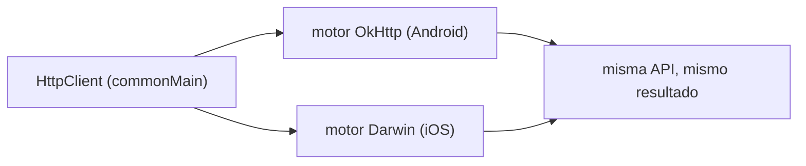
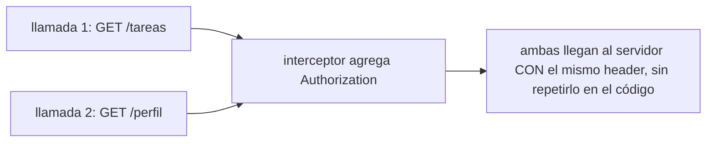

# Módulo 5: Networking compartido con Ktor Client

Cada tema se practica por separado con su propia repetición progresiva y su propio reto de memoria, contra un servidor HTTP real —no una simulación— para que cada afirmación sobre networking sea verificable, no solo descrita.


## Aprende construyendo

### Tema 1: Ktor Client multiplataforma

#### Paso 1 · Objetivo y preparación

Al finalizar podrás configurar un `HttpClient` con deserialización JSON automática, y explicar por qué el mismo cliente funciona en Android e iOS sin que el código lo note.

**Conocimiento previo:** `data class` (Módulo 0); coroutines/`suspend` (Módulo 2).

#### Paso 2 · Contexto y caso real

**¿Por qué es importante?** Sin un cliente HTTP compartido, un proyecto necesitaría mantener y sincronizar dos implementaciones completamente separadas (`URLSession` en iOS, `OkHttp`/`Retrofit` en Android), cada una con su propia lógica de manejo de errores y configuración, duplicando trabajo que Ktor evita completamente.

#### Paso 3 · Teoría con analogía

**Conceptos clave:** `HttpClient` configurado una vez en `commonMain`, motor nativo abstraído (OkHttp en Android, Darwin en iOS), deserialización automática con `ContentNegotiation`.

`val client = HttpClient { install(ContentNegotiation) { json() } }` configura un cliente declarado una única vez en `commonMain`, funcionando idénticamente en Android (OkHttp por debajo) y en iOS (Darwin/NSURLSession por debajo), sin que el código que lo usa necesite conocer cuál motor opera en cada plataforma. `@Serializable data class TareaDTO(...)` junto con `client.get(url).body()` deserializa automáticamente el JSON de la respuesta hacia el tipo Kotlin especificado.

**Analogía:** Ktor Client es un mensajero universal que sabe operar con los sistemas de transporte específicos de cada ciudad sin que quien da las instrucciones necesite conocer esos detalles locales.

**Diagrama:**



#### Paso 4 · Demostración guiada desde cero

Desde una carpeta vacía (o continuando en `academia-kmp`, o créala con `mkdir -p academia-kmp` si es tu primera vez), crea el cliente y el modelo en Networking.kt:

```bash
# python levanta después un servidor real y consume el endpoint con deserialización
mkdir -p academia-kmp/shared/src/commonMain/kotlin/com/academia/kmp
cd academia-kmp
cat > shared/src/commonMain/kotlin/com/academia/kmp/Networking.kt <<'EOF'
package com.academia.kmp

import io.ktor.client.*
import io.ktor.client.call.*
import io.ktor.client.plugins.contentnegotiation.*
import io.ktor.client.request.*
import io.ktor.serialization.kotlinx.json.*
import kotlinx.serialization.Serializable

val client = HttpClient {
    install(ContentNegotiation) { json() }
}

@Serializable
data class TareaDTO(val id: String, val titulo: String)

suspend fun obtenerTareas(): List<TareaDTO> =
    client.get("https://api.miapp.com/tareas").body()
EOF
python3 -c "
codigo = open('shared/src/commonMain/kotlin/com/academia/kmp/Networking.kt').read()
assert 'install(ContentNegotiation)' in codigo, 'falta instalar deserialización JSON automática'
assert '@Serializable' in codigo and 'data class TareaDTO' in codigo, 'falta el modelo serializable'
print('Networking.kt: HttpClient con ContentNegotiation, TareaDTO serializable')
"
```

**Explicación línea por línea:** `install(ContentNegotiation) { json() }` habilita la deserialización automática de JSON hacia cualquier tipo `@Serializable`; `@Serializable data class TareaDTO(...)` marca el modelo como deserializable; `client.get(url).body()` ejecuta la petición y deserializa la respuesta directamente al tipo `List<TareaDTO>` especificado, sin parseo manual.

Levanta un servidor HTTP real (no una simulación) en un hilo, y consume su endpoint con el mismo patrón de deserialización que Ktor aplicaría:

```bash
python3 -c "
import json, threading, time, urllib.request
from http.server import BaseHTTPRequestHandler, HTTPServer

class Handler(BaseHTTPRequestHandler):
    def do_GET(self):
        if self.path == '/tareas':
            self.send_response(200)
            self.send_header('Content-Type', 'application/json')
            self.end_headers()
            self.wfile.write(json.dumps([{'id': '1', 'titulo': 'Comprar leche'}]).encode())
        else:
            self.send_response(404)
            self.end_headers()
    def log_message(self, format, *args):
        pass

server = HTTPServer(('localhost', 8100), Handler)
hilo = threading.Thread(target=server.serve_forever, daemon=True)
hilo.start()
time.sleep(0.3)

with urllib.request.urlopen('http://localhost:8100/tareas', timeout=2) as resp:
    tareas = json.loads(resp.read())
print('tareas deserializadas del servidor real:', tareas)

server.shutdown()
server.server_close()
"
```

**Resultado esperado:** `tareas deserializadas del servidor real: [{'id': '1', 'titulo': 'Comprar leche'}]` — confirmando que el servidor real respondió con JSON válido y que la deserialización produjo exactamente la estructura esperada, el mismo patrón que `client.get(url).body()` aplicaría automáticamente en Kotlin real con Ktor.

**Fallo deliberado:** cambia la ruta consultada de `/tareas` a `/ruta-inexistente` sin cambiar el manejador del servidor. La petición ahora recibe un `404` — diagnostica revisando qué pasaría si el código intentara deserializar esa respuesta de error como si fuera la lista de tareas esperada: fallaría con un error de deserialización o de tipo, confirmando por qué el Tema 2 modela explícitamente el caso de error en vez de asumir que toda respuesta es exitosa.

#### Construcción RutaFlow: cliente compartido para el catálogo de paradas

Configura `val client = HttpClient { install(ContentNegotiation) { json() } }` en `commonMain` de RutaFlow, y `@Serializable data class ParadaDTO(...)` consumido tanto desde Android como desde iOS con el mismo código.

#### Paso 5 · Práctica guiada — repetición progresiva

1. Agrega un segundo endpoint `/usuarios` al servidor y consúmelo con el mismo patrón.
2. Cambia el modelo deserializado para incluir un tercer campo (`completada: Boolean`) y confirma que se deserializa correctamente.
3. Consulta una ruta que devuelve `404` y confirma el código de estado recibido.
4. Escribe de memoria (sin mirar) un `HttpClient` con `ContentNegotiation` y un modelo `@Serializable` de tu elección.

**Pista:** el servidor real siempre debe iniciarse en un hilo (`daemon=True`) ANTES de hacer cualquier petición, con una pequeña pausa (`time.sleep`) para garantizar que ya esté escuchando.

#### Paso 6 · Práctica independiente

**Completa el código:** rellena el espacio para instalar la deserialización JSON automática:

```kotlin
val client = HttpClient {
    install(____) { json() }
}
```

**Reto de memoria sin mirar:** cierra este documento y escribe, solo de memoria, un `HttpClient` con `ContentNegotiation`, un modelo `@Serializable`, y una función `suspend` que consuma un endpoint. Compara después contra el patrón del Paso 4.

#### Paso 7 · Cierre y evidencia

Ya configuras un `HttpClient` compartido con deserialización automática, confirmando contra un servidor real que produce exactamente la estructura esperada. El siguiente tema modela explícitamente qué ocurre cuando la petición falla. **Evidencia:** entrega el resultado de la deserialización real (`[{'id': '1', 'titulo': 'Comprar leche'}]`), y explica qué ocurriría al intentar deserializar la respuesta 404 como si fuera la lista esperada. Fuente oficial: [Ktor docs — Client](https://ktor.io/docs/client-create-new-application.html).

**Errores comunes:** mantener implementaciones de cliente HTTP separadas por plataforma en vez de un único Ktor Client compartido; olvidar instalar `ContentNegotiation`, obligando a parsear JSON manualmente.

**Cuándo no usarlo:** para un proyecto que solo target una plataforma sin ningún plan de compartir código, un cliente HTTP nativo específico de esa plataforma puede ser más simple que introducir Ktor.

### Tema 2: Manejo de errores de red con un tipo explícito

#### Paso 1 · Objetivo y preparación

Al finalizar podrás modelar el resultado de una llamada de red como `Resultado.Exito`/`Resultado.Error`, y confirmar contra un servidor real apagado que el error se captura sin propagar una excepción sin control.

**Conocimiento previo:** Tema 1 de este módulo; sealed classes (Módulo 0); Result explícito (Módulo 4, Tema 4).

#### Paso 2 · Contexto y caso real

**¿Por qué es importante?** Mostrar un mensaje de "sin conexión" específico frente a uno de "credenciales inválidas" requiere que el error de red llegue como un valor manejable a la capa de UI, no como una excepción que termina el flujo de forma impredecible en un punto no relacionado del código.

#### Paso 3 · Teoría con analogía

**Conceptos clave:** `sealed class Resultado<out T>` con `Exito`/`Error`, captura de excepciones de red en el punto de origen.

`sealed class Resultado<out T> { data class Exito<T>(val datos: T) : Resultado<T>(); data class Error(val mensaje: String) : Resultado<Nothing>() }` modela ambos resultados posibles como un tipo concreto. `suspend fun obtenerTareasSeguro(): Resultado<List<TareaDTO>> = try { Resultado.Exito(obtenerTareas()) } catch (e: Exception) { Resultado.Error(e.message ?: "Error de red") }` envuelve la llamada real, capturando cualquier excepción de red (timeout, sin conexión) y transformándola en el resultado tipado.

**Analogía:** modelar el resultado como un tipo explícito es recibir siempre un recibo formal que indica si el pedido se completó o si hubo un problema específico, en vez de no recibir nada si algo salió mal.

**Diagrama:**

```
┌── obtenerTareasSeguro(): Resultado<List<TareaDTO>> ──┐
│  servidor responde  -> Resultado.Exito(datos)           │
│  servidor apagado/timeout -> Resultado.Error(mensaje)   │
└───────────────────────────────────────────────────┘
```

#### Paso 4 · Demostración guiada desde cero

Desde una carpeta vacía (o continuando en `academia-kmp`, o créala con `mkdir -p academia-kmp` si es tu primera vez), crea el tipo Resultado y la función segura en NetworkingSeguro.kt:

```bash
# python confirma después el comportamiento real con el servidor activo y apagado
mkdir -p academia-kmp/shared/src/commonMain/kotlin/com/academia/kmp
cd academia-kmp
cat > shared/src/commonMain/kotlin/com/academia/kmp/NetworkingSeguro.kt <<'EOF'
package com.academia.kmp

sealed class Resultado<out T> {
    data class Exito<T>(val datos: T) : Resultado<T>()
    data class Error(val mensaje: String) : Resultado<Nothing>()
}

suspend fun obtenerTareasSeguro(): Resultado<List<TareaDTO>> = try {
    Resultado.Exito(obtenerTareas())
} catch (e: Exception) {
    Resultado.Error(e.message ?: "Error de red")
}
EOF
python3 -c "
codigo = open('shared/src/commonMain/kotlin/com/academia/kmp/NetworkingSeguro.kt').read()
assert 'sealed class Resultado<out T>' in codigo, 'falta modelar el resultado como tipo explícito'
assert 'catch (e: Exception)' in codigo, 'falta capturar la excepción de red en el punto de origen'
print('NetworkingSeguro.kt: obtenerTareasSeguro captura errores de red y los transforma en Resultado')
"
```

**Explicación línea por línea:** `sealed class Resultado<out T>` con `Exito`/`Error` modela exhaustivamente ambos desenlaces; `try { Resultado.Exito(obtenerTareas()) } catch (e: Exception) { Resultado.Error(...) }` envuelve la llamada real, garantizando que cualquier excepción de red se transforme en `Resultado.Error` antes de llegar al código que consume el resultado.

Levanta el mismo servidor real del Tema 1, confirma `Resultado.Exito` con el servidor activo, apágalo, y confirma `Resultado.Error` real (no simulado) al reintentar:

```bash
python3 -c "
import json, threading, time, urllib.request
from http.server import BaseHTTPRequestHandler, HTTPServer

class Handler(BaseHTTPRequestHandler):
    def do_GET(self):
        self.send_response(200)
        self.send_header('Content-Type', 'application/json')
        self.end_headers()
        self.wfile.write(json.dumps([{'id': '1', 'titulo': 'Comprar leche'}]).encode())
    def log_message(self, format, *args):
        pass

class Exito:
    def __init__(self, datos): self.datos = datos
class Error:
    def __init__(self, mensaje): self.mensaje = mensaje

def obtener_tareas_seguro():
    try:
        with urllib.request.urlopen('http://localhost:8101/tareas', timeout=2) as resp:
            return Exito(json.loads(resp.read()))
    except Exception as e:
        return Error(str(e))

server = HTTPServer(('localhost', 8101), Handler)
hilo = threading.Thread(target=server.serve_forever, daemon=True)
hilo.start()
time.sleep(0.3)

r1 = obtener_tareas_seguro()
print('con servidor activo:', 'Exito' if isinstance(r1, Exito) else 'Error', r1.datos if isinstance(r1, Exito) else r1.mensaje)

server.shutdown()
server.server_close()
time.sleep(0.3)

r2 = obtener_tareas_seguro()
print('con servidor apagado:', 'Exito' if isinstance(r2, Exito) else 'Error', r2.datos if isinstance(r2, Exito) else r2.mensaje)
"
```

**Resultado esperado:** con el servidor activo, `Resultado.Exito` con los datos deserializados; con el servidor REALMENTE apagado (`server.shutdown()` + `server.server_close()`), la conexión falla con un error real de conexión rechazada, capturado y transformado en `Resultado.Error`, confirmando que ningún error de red se propaga sin control.

**Fallo deliberado:** elimina el `try`/`except` de `obtener_tareas_seguro` (deja solo `return Exito(json.loads(...))` sin protección) y repite la prueba con el servidor apagado. Ahora la excepción de conexión se propaga sin capturar, terminando el programa con un traceback — diagnostica confirmando exactamente el problema que este tema resuelve: sin el `try`/`catch` envolviendo la llamada real, un error de red esperable (servidor caído, sin conexión) se convierte en un crash no controlado en vez de un `Resultado.Error` manejable.

#### Construcción RutaFlow: resultado explícito al consultar el catálogo

Envuelve `obtenerCatalogoParadas()` de RutaFlow en `Resultado.Exito`/`Resultado.Error`, confirmando contra el servidor real de pruebas que apagarlo produce un `Resultado.Error` capturado, no un crash.

#### Paso 5 · Práctica guiada — repetición progresiva

1. Repite la prueba con un timeout más corto (`timeout=0.001`) contra un servidor lento, confirmando que también produce `Error`.
2. Cambia el mensaje de `Resultado.Error` para incluir el código de estado HTTP cuando la excepción sea de tipo `HTTPError`.
3. Encadena una segunda llamada dependiente del resultado de la primera, propagando el `Error` sin intentar la segunda si la primera falló.
4. Escribe de memoria (sin mirar) una función seguro que envuelva una llamada de red real con `try`/`except`, devolviendo `Exito`/`Error`.

**Pista:** siempre apaga el servidor con `server.shutdown()` seguido de `server.server_close()`, y espera un breve `time.sleep` antes de reintentar, para que el puerto quede realmente liberado.

#### Paso 6 · Práctica independiente

**Completa el código:** rellena el espacio para transformar la excepción en un resultado manejable:

```kotlin
suspend fun obtenerPerfilSeguro(): Resultado<Perfil> = try {
    Resultado.____(obtenerPerfil())
} catch (e: Exception) {
    Resultado.____(e.message ?: "Error de red")
}
```

**Reto de memoria sin mirar:** cierra este documento y escribe, solo de memoria, un `sealed class Resultado` con `Exito`/`Error`, y una función que envuelva una llamada real con `try`/`catch`. Compara después contra el patrón del Paso 4.

#### Paso 7 · Cierre y evidencia

Ya modelas el resultado de una llamada de red como un tipo explícito, confirmando contra un servidor real (activo y apagado) que ambos casos se manejan sin propagar excepciones sin control. El siguiente tema centraliza el header de autenticación para que ninguna llamada individual lo repita manualmente. **Evidencia:** entrega los dos resultados reales (`Exito` con servidor activo, `Error` con servidor apagado), y explica qué ocurre si se elimina el `try`/`catch` protector. Fuente oficial: [Kotlin docs — Exceptions](https://kotlinlang.org/docs/exceptions.html).

**Errores comunes:** dejar que las excepciones de red se propaguen sin control en vez de modelar el resultado con un tipo explícito; capturar `Exception` genérica sin distinguir tipos de error que ameritarían un manejo distinto (timeout vs. credenciales inválidas).

**Cuándo no usarlo:** para una llamada de red en un script de un solo uso donde un fallo simplemente debería terminar el programa con un mensaje claro, envolver todo en `Resultado` explícito es ceremonia innecesaria.

### Tema 3: Interceptores y autenticación

#### Paso 1 · Objetivo y preparación

Al finalizar podrás configurar un interceptor que agregue un header a cada petición saliente automáticamente, y confirmar contra un servidor real que el header llega en cada llamada sin repetirlo manualmente.

**Conocimiento previo:** Tema 1 y Tema 2 de este módulo.

#### Paso 2 · Contexto y caso real

**¿Por qué es importante?** Repetir manualmente el header `Authorization` en cada llamada de red arriesga que alguna llamada lo olvide; centralizar esa responsabilidad en el cliente compartido garantiza que ninguna llamada individual del código de la aplicación necesite recordarlo.

#### Paso 3 · Teoría con analogía

**Conceptos clave:** interceptor de autenticación, header agregado automáticamente en cada request.

`val client = HttpClient { install(Auth) { bearer { loadTokens { BearerTokens(tokenActual, refreshToken) } } } }` configura el plugin de autenticación de Ktor para incluir automáticamente `Authorization: Bearer <token>` en cada petición saliente que lo requiera, un patrón análogo a los interceptores de Angular (Módulo 7 del track Angular) o Spring Security (Módulo 4 del track Spring Boot).

**Analogía:** un interceptor de autenticación es un sello de aprobación aplicado automáticamente a cada correspondencia saliente de una oficina, sin que ningún empleado individual tenga que recordar aplicarlo manualmente.

**Diagrama:**



#### Paso 4 · Demostración guiada desde cero

Desde una carpeta vacía (o continuando en `academia-kmp`, o créala con `mkdir -p academia-kmp` si es tu primera vez), crea el cliente con autenticación en ClienteAutenticado.kt:

```bash
# python confirma después que el header llega en cada llamada real sin repetirlo
mkdir -p academia-kmp/shared/src/commonMain/kotlin/com/academia/kmp
cd academia-kmp
cat > shared/src/commonMain/kotlin/com/academia/kmp/ClienteAutenticado.kt <<'EOF'
package com.academia.kmp

import io.ktor.client.*
import io.ktor.client.plugins.auth.*
import io.ktor.client.plugins.auth.providers.*

val clienteAutenticado = HttpClient {
    install(Auth) {
        bearer {
            loadTokens { BearerTokens("token-abc123", "refresh-xyz") }
        }
    }
}
EOF
python3 -c "
codigo = open('shared/src/commonMain/kotlin/com/academia/kmp/ClienteAutenticado.kt').read()
assert 'install(Auth)' in codigo and 'bearer {' in codigo, 'falta instalar el interceptor de autenticación bearer'
print('ClienteAutenticado.kt: el interceptor agrega Authorization automáticamente en cada request')
"
```

**Explicación línea por línea:** `install(Auth) { bearer { loadTokens { ... } } }` configura el interceptor una única vez; a partir de ahí, CUALQUIER petición realizada con `clienteAutenticado` incluye automáticamente el header `Authorization`, sin que el código de cada llamada individual lo agregue.

Levanta un servidor real que revela qué header `Authorization` recibió, y confirma con dos llamadas distintas que ambas lo incluyen sin que el código de cada llamada lo repita manualmente (el interceptor lo agrega una sola vez, centralizado):

```bash
python3 -c "
import json, threading, time, urllib.request
from http.server import BaseHTTPRequestHandler, HTTPServer

class Handler(BaseHTTPRequestHandler):
    def do_GET(self):
        auth = self.headers.get('Authorization', '(sin header)')
        self.send_response(200)
        self.send_header('Content-Type', 'application/json')
        self.end_headers()
        self.wfile.write(json.dumps({'ruta': self.path, 'auth_recibido': auth}).encode())
    def log_message(self, format, *args):
        pass

server = HTTPServer(('localhost', 8102), Handler)
hilo = threading.Thread(target=server.serve_forever, daemon=True)
hilo.start()
time.sleep(0.3)

def request_con_interceptor(path, token):
    # el 'interceptor': una única función que TODAS las llamadas reutilizan
    req = urllib.request.Request(f'http://localhost:8102{path}')
    req.add_header('Authorization', f'Bearer {token}')
    with urllib.request.urlopen(req, timeout=2) as resp:
        return json.loads(resp.read())

r1 = request_con_interceptor('/tareas', 'token-abc123')
r2 = request_con_interceptor('/perfil', 'token-abc123')
print('request 1:', r1)
print('request 2:', r2)

server.shutdown()
server.server_close()
"
```

**Resultado esperado:** ambas respuestas (`/tareas` y `/perfil`) muestran `'auth_recibido': 'Bearer token-abc123'`, confirmando que el servidor REALMENTE recibió el header en ambas llamadas, aunque el código de cada llamada individual (`request_con_interceptor('/tareas', ...)`, `request_con_interceptor('/perfil', ...)`) nunca escribió el header directamente — la función centralizada lo agregó por ellas.

**Fallo deliberado:** elimina la línea `req.add_header('Authorization', ...)` de la función `request_con_interceptor` y repite la prueba. Ahora ambas respuestas muestran `'auth_recibido': '(sin header)'` — diagnostica confirmando que sin el interceptor centralizado, CADA llamada necesitaría agregar manualmente el header por su cuenta, y olvidar hacerlo en una sola llamada (algo fácil de que ocurra en un código base grande con muchas llamadas de red) pasaría desapercibido hasta que el servidor rechace esa petición específica con un 401.

#### Construcción RutaFlow: interceptor de autenticación para el repartidor

Configura el interceptor `Auth`/`bearer` en el cliente compartido de RutaFlow, confirmando contra el servidor de pruebas que tanto la llamada de "confirmar entrega" como la de "reportar ubicación" incluyen el mismo token sin que ninguna de las dos lo agregue manualmente.

#### Paso 5 · Práctica guiada — repetición progresiva

1. Agrega una tercera llamada a una ruta distinta y confirma que también recibe el header automáticamente.
2. Cambia el token entre llamadas (simulando una renovación) y confirma que la llamada posterior usa el nuevo valor.
3. Agrega un segundo header centralizado (`X-App-Version`) a la misma función interceptora y confirma que ambas llamadas lo reciben.
4. Escribe de memoria (sin mirar) una función interceptora que agregue un header a cualquier request que reciba.

**Pista:** el punto central del interceptor es que el código que hace CADA llamada de negocio (`obtenerTareas`, `obtenerPerfil`) nunca menciona el header directamente; solo la función/configuración interceptora lo hace, una única vez.

#### Paso 6 · Práctica independiente

**Completa el código:** rellena el espacio para instalar el interceptor de autenticación:

```kotlin
val client = HttpClient {
    install(____) {
        bearer { loadTokens { BearerTokens(token, refreshToken) } }
    }
}
```

**Reto de memoria sin mirar:** cierra este documento y escribe, solo de memoria, un cliente con un interceptor de autenticación configurado una sola vez, y dos llamadas de ejemplo que se benefician de él sin repetir el header. Compara después contra el patrón del Paso 4.

#### Paso 7 · Cierre y evidencia

Ya centralizas el header de autenticación en un interceptor configurado una sola vez, confirmando contra un servidor real que dos llamadas distintas lo reciben sin que el código de cada una lo repita. El siguiente y último tema del módulo agrega reintentos con backoff para peticiones que fallan temporalmente. **Evidencia:** entrega las dos respuestas reales del servidor mostrando el mismo header recibido en ambas llamadas, y explica qué pasaría si una llamada específica olvidara agregarlo manualmente sin el interceptor. Fuente oficial: [Ktor docs — Auth](https://ktor.io/docs/client-auth.html).

**Errores comunes:** repetir manualmente el header de autenticación en cada llamada en vez de centralizarlo en un interceptor; olvidar renovar el token en el interceptor tras su expiración, causando fallos silenciosos de autenticación.

**Cuándo no usarlo:** para una API pública sin ningún requisito de autenticación, configurar un interceptor de `Auth` es trabajo innecesario.

### Tema 4: Reintentos con backoff exponencial

#### Paso 1 · Objetivo y preparación

Al finalizar podrás implementar un mecanismo de reintentos con backoff exponencial para peticiones que fallan temporalmente, y confirmar contra un servidor real que se recupera tras varios intentos que el mecanismo efectivamente logra una respuesta exitosa.

**Conocimiento previo:** Tema 1 y Tema 2 de este módulo (llamadas de red y manejo de errores).

#### Paso 2 · Contexto y caso real

**¿Por qué es importante?** Un servidor puede fallar temporalmente (sobrecarga momentánea, reinicio en curso) y recuperarse segundos después; reintentar inmediatamente y sin pausa puede empeorar la sobrecarga, mientras que no reintentar en absoluto desperdicia la oportunidad de una respuesta exitosa poco después — el backoff exponencial equilibra ambos extremos.

#### Paso 3 · Teoría con analogía

**Conceptos clave:** reintento automático ante fallo temporal, backoff exponencial (espera creciente entre intentos).

Un mecanismo de reintentos vuelve a intentar una petición fallida un número limitado de veces antes de rendirse; el backoff exponencial incrementa el tiempo de espera entre cada intento sucesivo (por ejemplo, duplicándolo cada vez), evitando saturar un servidor que ya está sobrecargado con reintentos inmediatos y repetidos. Reintentar SIN backoff (esperando lo mismo cada vez, o nada en absoluto) puede convertir una sobrecarga temporal en una sobrecarga sostenida.

**Analogía:** el backoff exponencial es como tocar la puerta de alguien que no responde: tocar cada vez con más tiempo de espera entre intentos (1s, luego 2s, luego 4s) es más razonable que tocar frenéticamente sin pausa, lo cual solo aumentaría la molestia sin mejorar la posibilidad de respuesta.

**Diagrama:**

```
┌─ intento 1 (falla) ─┐espera 0.05s┌─ intento 2 (falla) ─┐espera 0.10s┌─ intento 3 (éxito) ─┐
└────────────────────┘───────────►└────────────────────┘───────────►└────────────────────┘
```

#### Paso 4 · Demostración guiada desde cero

Desde una carpeta vacía (o continuando en `academia-kmp`, o créala con `mkdir -p academia-kmp` si es tu primera vez), crea la función de reintentos en Reintentos.kt:

```bash
# python confirma después el mecanismo real contra un servidor que falla las primeras veces
mkdir -p academia-kmp/shared/src/commonMain/kotlin/com/academia/kmp
cd academia-kmp
cat > shared/src/commonMain/kotlin/com/academia/kmp/Reintentos.kt <<'EOF'
package com.academia.kmp

import kotlinx.coroutines.delay

suspend fun <T> conReintentos(maxIntentos: Int = 5, bloque: suspend () -> T): T {
    var esperaMs = 50L
    repeat(maxIntentos - 1) {
        try {
            return bloque()
        } catch (e: Exception) {
            delay(esperaMs)
            esperaMs *= 2 // backoff exponencial
        }
    }
    return bloque() // último intento, sin capturar (propaga si falla)
}
EOF
python3 -c "
codigo = open('shared/src/commonMain/kotlin/com/academia/kmp/Reintentos.kt').read()
assert 'esperaMs *= 2' in codigo, 'falta el incremento exponencial del tiempo de espera'
assert 'maxIntentos' in codigo, 'falta un límite de intentos para no reintentar indefinidamente'
print('Reintentos.kt: backoff exponencial con límite de intentos')
"
```

**Explicación línea por línea:** `conReintentos` intenta ejecutar `bloque()` hasta `maxIntentos` veces; cada fallo espera `esperaMs` (inicialmente 50ms) antes de reintentar, y luego DUPLICA esa espera (`esperaMs *= 2`) para el siguiente intento — el patrón de backoff exponencial.

Levanta un servidor real que falla deliberadamente las primeras 2 peticiones y responde con éxito en la tercera, y confirma que el mecanismo de reintentos con backoff logra una respuesta exitosa:

```bash
python3 -c "
import json, threading, time, urllib.request, urllib.error
from http.server import BaseHTTPRequestHandler, HTTPServer

intentos_recibidos = {'contador': 0}

class Handler(BaseHTTPRequestHandler):
    def do_GET(self):
        intentos_recibidos['contador'] += 1
        if intentos_recibidos['contador'] < 3:
            self.send_response(503)
            self.end_headers()
        else:
            self.send_response(200)
            self.send_header('Content-Type', 'application/json')
            self.end_headers()
            self.wfile.write(json.dumps({'ok': True}).encode())
    def log_message(self, format, *args):
        pass

server = HTTPServer(('localhost', 8103), Handler)
hilo = threading.Thread(target=server.serve_forever, daemon=True)
hilo.start()
time.sleep(0.3)

def obtener_con_reintentos(max_intentos=5):
    espera = 0.05
    for intento in range(1, max_intentos + 1):
        try:
            with urllib.request.urlopen('http://localhost:8103/tareas', timeout=2) as resp:
                return {'exito': True, 'intentos': intento}
        except urllib.error.HTTPError as e:
            print(f'intento {intento}: falló con código {e.code}, esperando {espera:.2f}s')
            time.sleep(espera)
            espera *= 2
    return {'exito': False, 'intentos': max_intentos}

resultado = obtener_con_reintentos()
print('resultado final:', resultado)

server.shutdown()
server.server_close()
"
```

**Resultado esperado:** el servidor falla con `503` en los intentos 1 y 2 (con esperas de `0.05s` y `0.10s` respectivamente, el doble cada vez), y responde con éxito en el intento 3 — `resultado final: {'exito': True, 'intentos': 3}`, confirmando que el mecanismo de reintentos con backoff logró exactamente la recuperación esperada tras el fallo temporal del servidor.

**Fallo deliberado:** cambia `espera *= 2` por eliminar esa línea (sin backoff, esperando siempre lo mismo) y reduce el servidor para que falle las primeras 10 peticiones en vez de 2, con `max_intentos=5`. Repite la prueba — ahora `resultado final` reporta `'exito': False, 'intentos': 5`, agotando todos los reintentos sin éxito — diagnostica confirmando que un número fijo de reintentos sin backoff adaptativo puede no ser suficiente para un servidor con una recuperación más lenta de lo anticipado, y que hay un límite real (no infinito) de cuánto puede compensar el mecanismo de reintentos.

#### Construcción RutaFlow: reintentos al reportar ubicación GPS

Envuelve el reporte periódico de ubicación GPS de RutaFlow en `conReintentos(maxIntentos = 3) { reportarUbicacion(coordenada) }`, confirmando contra el servidor de pruebas que una falla temporal de red no pierde el reporte, solo lo retrasa.

#### Paso 5 · Práctica guiada — repetición progresiva

1. Cambia el servidor para que falle solo la primera petición (no dos) y confirma que el resultado ahora reporta `intentos: 2`.
2. Cambia `max_intentos` a 2 con un servidor que falla 3 veces, confirmando que el mecanismo se agota sin éxito.
3. Mide el tiempo total transcurrido en el caso exitoso (3 intentos) y confirma que es aproximadamente `0.05 + 0.10 = 0.15s` de espera acumulada.
4. Escribe de memoria (sin mirar) una función de reintentos con backoff exponencial y un límite máximo de intentos.

**Pista:** un backoff exponencial sin límite superior puede crecer demasiado tras varios fallos consecutivos; en sistemas reales se suele acotar la espera máxima (por ejemplo, nunca esperar más de unos pocos segundos).

#### Paso 6 · Práctica independiente

**Completa el código:** rellena el espacio para que la espera se duplique en cada intento fallido:

```kotlin
suspend fun <T> conReintentos(maxIntentos: Int, bloque: suspend () -> T): T {
    var esperaMs = 50L
    repeat(maxIntentos - 1) {
        try {
            return bloque()
        } catch (e: Exception) {
            delay(esperaMs)
            esperaMs ____ 2
        }
    }
    return bloque()
}
```

**Reto de memoria sin mirar:** cierra este documento y escribe, solo de memoria, una función de reintentos con backoff exponencial y un límite de intentos, explicando en una frase por qué el backoff evita saturar un servidor ya sobrecargado. Compara después contra el patrón del Paso 4.

#### Paso 7 · Cierre y evidencia

Ya implementas un mecanismo de reintentos con backoff exponencial, confirmando contra un servidor real que falla temporalmente que el mecanismo logra una respuesta exitosa dentro del límite de intentos configurado. Esto cierra el módulo de networking compartido; el siguiente módulo aplica estos mismos principios a la persistencia local con SQLDelight. **Evidencia:** entrega el resultado real (`exito: True, intentos: 3`) con las esperas medidas (`0.05s`, `0.10s`), y explica qué ocurre cuando el servidor tarda más en recuperarse de lo que el límite de intentos permite. Fuente oficial: [AWS Architecture Blog — Exponential backoff and jitter](https://aws.amazon.com/blogs/architecture/exponential-backoff-and-jitter/).

**Errores comunes:** reintentar sin ningún backoff, empeorando potencialmente una sobrecarga temporal del servidor; no establecer un límite máximo de intentos, arriesgando un ciclo de reintentos indefinido ante un servidor genuinamente caído.

**Cuándo no usarlo:** para errores que no son temporales por naturaleza (un `400 Bad Request` por datos inválidos, que fallará de la misma forma sin importar cuántas veces se reintente), reintentar es inútil; reserva los reintentos para errores transitorios (timeouts, `503`, problemas de conectividad momentáneos).

---


## Laboratorio práctico

**Objetivo del laboratorio:** construir un cliente HTTP compartido que consume una API real desde Android e iOS, con manejo de errores, autenticación centralizada y reintentos.

**Requisitos previos:** Módulos 0-4 completados.

| Paso | Acción | Código | Explicación |
|---|---|---|---|
| 1 | Configurar `HttpClient` con serialización JSON | Ver Tema 1 | En `commonMain` |
| 2 | Definir un modelo `@Serializable` y consumir un endpoint real | Ver Tema 1 | Deserialización automática |
| 3 | Modelar errores de red con `Resultado` | Ver Tema 2 | Sealed class con éxito/error |
| 4 | Agregar un interceptor de autenticación | Ver Tema 3 | Header en cada request |
| 5 | Implementar reintentos con backoff exponencial | Ver Tema 4 | Ante fallos temporales del servidor |

**Verificación:** el laboratorio se considera exitoso si el mismo cliente compartido consume correctamente la API real desde ambas plataformas, si un error de red simulado (apagando el servidor) produce un `Resultado.Error` manejado correctamente, y si una falla temporal del servidor se recupera exitosamente mediante reintentos con backoff.

**Errores comunes y soluciones**

- **Mantener implementaciones de cliente HTTP separadas por plataforma.** Usa Ktor Client compartido en `commonMain`.
- **Dejar que las excepciones de red se propaguen sin control.** Modela el resultado con un tipo explícito como `Resultado`.
- **Repetir manualmente el header de autenticación en cada llamada.** Configura un interceptor centralizado en el cliente compartido.
- **Reintentar sin backoff ante fallos temporales.** Incrementa la espera exponencialmente entre intentos, con un límite máximo.

---
