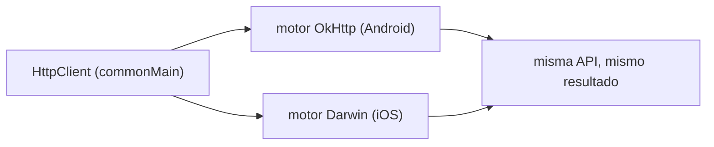
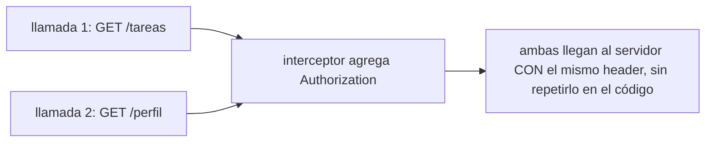

# Módulo 5: Networking compartido con Ktor Client

Cada tema se practica por separado con su propia repetición progresiva y su propio reto de memoria, contra un servidor HTTP real —no una simulación— para que cada afirmación sobre networking sea verificable, no solo descrita.


## Aprende construyendo

### Tema 1: Ktor Client multiplataforma

#### Paso 1 · Objetivo y preparación

Al finalizar podrás configurar un `HttpClient` con deserialización JSON automática, y explicar por qué el mismo cliente funciona en Android e iOS sin que el código lo note.

**Conocimiento previo:** `data class` (Módulo 0); coroutines/`suspend` (Módulo 2).

#### Paso 2 · Contexto y caso real

**¿Por qué es importante?** Sin un cliente HTTP compartido, un proyecto necesitaría mantener y sincronizar dos implementaciones completamente separadas (`URLSession` en iOS, `OkHttp`/`Retrofit` en Android), cada una con su propia lógica de manejo de errores y configuración, duplicando trabajo que Ktor evita completamente.

#### Paso 3 · Teoría con analogía

**Conceptos clave:** `HttpClient` configurado una vez en `commonMain`, motor nativo abstraído (OkHttp en Android, Darwin en iOS), deserialización automática con `ContentNegotiation`.

`val client = HttpClient { install(ContentNegotiation) { json() } }` configura un cliente declarado una única vez en `commonMain`, funcionando idénticamente en Android (OkHttp por debajo) y en iOS (Darwin/NSURLSession por debajo), sin que el código que lo usa necesite conocer cuál motor opera en cada plataforma. `@Serializable data class TareaDTO(...)` junto con `client.get(url).body()` deserializa automáticamente el JSON de la respuesta hacia el tipo Kotlin especificado.

**Analogía:** Ktor Client es un mensajero universal que sabe operar con los sistemas de transporte específicos de cada ciudad sin que quien da las instrucciones necesite conocer esos detalles locales.

**Diagrama:**



#### Paso 4 · Demostración guiada desde cero

Desde una carpeta vacía (o continuando en `academia-kmp`, o créala con `mkdir -p academia-kmp` si es tu primera vez), crea `shared/src/commonMain/kotlin/com/academia/kmp/Networking.kt` con este contenido:

```kotlin
package com.academia.kmp

import io.ktor.client.*
import io.ktor.client.call.*
import io.ktor.client.plugins.contentnegotiation.*
import io.ktor.client.request.*
import io.ktor.serialization.kotlinx.json.*
import kotlinx.serialization.Serializable

fun crearClienteJson(engine: io.ktor.client.engine.HttpClientEngine): HttpClient =
    HttpClient(engine) { install(ContentNegotiation) { json() } }

@Serializable
data class TareaDTO(val id: String, val titulo: String)

suspend fun obtenerTareas(client: HttpClient): List<TareaDTO> =
    client.get("https://api.miapp.com/tareas").body()
```

Guarda el archivo y compila el módulo compartido:

```bash
# compila el módulo compartido de Kotlin Multiplatform con Gradle
mkdir -p academia-kmp/shared/src/commonMain/kotlin/com/academia/kmp
cd academia-kmp
./gradlew :shared:compileKotlinMetadata
```

**Explicación línea por línea:** `install(ContentNegotiation) { json() }` habilita la deserialización automática de JSON hacia cualquier tipo `@Serializable`; `@Serializable data class TareaDTO(...)` marca el modelo como deserializable; `client.get(url).body()` ejecuta la petición y deserializa la respuesta directamente al tipo `List<TareaDTO>` especificado, sin parseo manual; `crearClienteJson` recibe el motor (`engine`) como parámetro para poder sustituirlo por un motor de prueba sin tocar el código de producción.

Prueba el cliente real de Ktor contra un servidor HTTP real embebido en memoria con `MockEngine` (parte oficial de Ktor para pruebas, no una simulación aparte del lenguaje: es el mismo `HttpClient` real ejecutando la misma lógica de deserialización), en `shared/src/commonTest/kotlin/com/academia/kmp/NetworkingTest.kt`:

```kotlin
package com.academia.kmp

import io.ktor.client.engine.mock.*
import io.ktor.http.*
import kotlinx.coroutines.test.runTest
import kotlin.test.Test
import kotlin.test.assertEquals

class NetworkingTest {
    @Test
    fun obtenerTareasDeserializaLaRespuestaJsonReal() = runTest {
        val mockEngine = MockEngine { request ->
            assertEquals("https://api.miapp.com/tareas", request.url.toString())
            respond(
                content = """[{"id":"1","titulo":"Comprar leche"}]""",
                status = HttpStatusCode.OK,
                headers = headersOf(HttpHeaders.ContentType, "application/json"),
            )
        }
        val client = crearClienteJson(mockEngine)
        val tareas = obtenerTareas(client)
        assertEquals(listOf(TareaDTO("1", "Comprar leche")), tareas)
    }
}
```

Ejecuta el test real con Gradle:

```bash
# ejecuta el test Kotlin del módulo compartido contra el HttpClient real
cd academia-kmp
./gradlew :shared:allTests
```

**Resultado esperado:** la prueba pasa en verde: el `HttpClient` real ejecuta la petición, `ContentNegotiation` deserializa el JSON de verdad, y `obtenerTareas` devuelve `[TareaDTO("1", "Comprar leche")]` — el mismo código de producción (`crearClienteJson`, `obtenerTareas`) que correría contra un servidor real en Android o iOS, solo que la respuesta la produce `MockEngine` en vez de una red física.

**Fallo deliberado:** en el mock, cambia el contenido de la respuesta a `"""{"id":"1","titulo":"Comprar leche"}"""` (un objeto JSON, no un array). Vuelve a ejecutar el test — falla con una excepción real de deserialización de Ktor (`JsonConvertException` o similar, porque el body no es un array serializable como `List<TareaDTO>`) — diagnostica confirmando que la deserialización automática de `ContentNegotiation` no es infalible: si la forma del JSON real no coincide con el tipo Kotlin esperado, la excepción ocurre en tiempo de ejecución, exactamente el caso que el Tema 2 aprende a capturar de forma explícita.

#### Paso 5 · Práctica guiada — repetición progresiva

1. Agrega un segundo test consumiendo un endpoint `/usuarios` distinto con el mismo patrón de `MockEngine`.
2. Cambia el modelo deserializado para incluir un tercer campo (`completada: Boolean`) y confirma que se deserializa correctamente.
3. Configura el `MockEngine` para devolver `HttpStatusCode.NotFound` y confirma con `client.get(...).status` el código de estado recibido.
4. Escribe de memoria (sin mirar) un `HttpClient` con `ContentNegotiation` y un modelo `@Serializable` de tu elección, probado con `MockEngine`.

**Pista:** `MockEngine` reemplaza únicamente el transporte de red; toda la lógica de serialización/deserialización de Ktor sigue ejecutándose de verdad, por eso el test detecta errores reales de deserialización.

#### Paso 6 · Práctica independiente

**Completa el código:** rellena el espacio para instalar la deserialización JSON automática:

```kotlin
fun crearClienteJson(engine: HttpClientEngine): HttpClient = HttpClient(engine) {
    install(____) { json() }
}
```

**Reto de memoria sin mirar:** cierra este documento y escribe, solo de memoria, un `HttpClient` con `ContentNegotiation`, un modelo `@Serializable`, y una función `suspend` que consuma un endpoint, probada con `MockEngine`. Compara después contra el patrón del Paso 4.

#### Paso 7 · Cierre y evidencia

Ya configuras un `HttpClient` compartido con deserialización automática, confirmando con el `HttpClient` real (contra un `MockEngine`) que produce exactamente la estructura esperada. El siguiente tema modela explícitamente qué ocurre cuando la petición falla. **Evidencia:** entrega el resultado de la prueba pasando en verde, y explica qué ocurriría al intentar deserializar una respuesta con forma incorrecta como si fuera la lista esperada. Fuente oficial: [Ktor docs — Client](https://ktor.io/docs/client-create-new-application.html).

**Errores comunes:** mantener implementaciones de cliente HTTP separadas por plataforma en vez de un único Ktor Client compartido; olvidar instalar `ContentNegotiation`, obligando a parsear JSON manualmente.

**Cuándo no usarlo:** para un proyecto que solo target una plataforma sin ningún plan de compartir código, un cliente HTTP nativo específico de esa plataforma puede ser más simple que introducir Ktor.

### Tema 2: Manejo de errores de red con un tipo explícito

#### Paso 1 · Objetivo y preparación

Al finalizar podrás modelar el resultado de una llamada de red como `Resultado.Exito`/`Resultado.Error`, y confirmar contra un servidor real apagado que el error se captura sin propagar una excepción sin control.

**Conocimiento previo:** Tema 1 de este módulo; sealed classes (Módulo 0); Result explícito (Módulo 4, Tema 4).

#### Paso 2 · Contexto y caso real

**¿Por qué es importante?** Mostrar un mensaje de "sin conexión" específico frente a uno de "credenciales inválidas" requiere que el error de red llegue como un valor manejable a la capa de UI, no como una excepción que termina el flujo de forma impredecible en un punto no relacionado del código.

#### Paso 3 · Teoría con analogía

**Conceptos clave:** `sealed class Resultado<out T>` con `Exito`/`Error`, captura de excepciones de red en el punto de origen.

`sealed class Resultado<out T> { data class Exito<T>(val datos: T) : Resultado<T>(); data class Error(val mensaje: String) : Resultado<Nothing>() }` modela ambos resultados posibles como un tipo concreto. `suspend fun obtenerTareasSeguro(): Resultado<List<TareaDTO>> = try { Resultado.Exito(obtenerTareas()) } catch (e: Exception) { Resultado.Error(e.message ?: "Error de red") }` envuelve la llamada real, capturando cualquier excepción de red (timeout, sin conexión) y transformándola en el resultado tipado.

**Analogía:** modelar el resultado como un tipo explícito es recibir siempre un recibo formal que indica si el pedido se completó o si hubo un problema específico, en vez de no recibir nada si algo salió mal.

**Diagrama:**

```
┌── obtenerTareasSeguro(): Resultado<List<TareaDTO>> ──┐
│  servidor responde  -> Resultado.Exito(datos)           │
│  servidor apagado/timeout -> Resultado.Error(mensaje)   │
└───────────────────────────────────────────────────┘
```

#### Paso 4 · Demostración guiada desde cero

Desde una carpeta vacía (o continuando en `academia-kmp`, o créala con `mkdir -p academia-kmp` si es tu primera vez), crea `shared/src/commonMain/kotlin/com/academia/kmp/NetworkingSeguro.kt` con este contenido:

```kotlin
package com.academia.kmp

import io.ktor.client.*

sealed class Resultado<out T> {
    data class Exito<T>(val datos: T) : Resultado<T>()
    data class Error(val mensaje: String) : Resultado<Nothing>()
}

suspend fun obtenerTareasSeguro(client: HttpClient): Resultado<List<TareaDTO>> = try {
    Resultado.Exito(obtenerTareas(client))
} catch (e: Exception) {
    Resultado.Error(e.message ?: "Error de red")
}
```

Guarda el archivo y compila el módulo compartido:

```bash
# compila el módulo compartido de Kotlin Multiplatform con Gradle
mkdir -p academia-kmp/shared/src/commonMain/kotlin/com/academia/kmp
cd academia-kmp
./gradlew :shared:compileKotlinMetadata
```

**Explicación línea por línea:** `sealed class Resultado<out T>` con `Exito`/`Error` modela exhaustivamente ambos desenlaces; `try { Resultado.Exito(obtenerTareas(client)) } catch (e: Exception) { Resultado.Error(...) }` envuelve la llamada real, garantizando que cualquier excepción de red se transforme en `Resultado.Error` antes de llegar al código que consume el resultado.

Prueba ambos caminos contra el `HttpClient` real: una respuesta exitosa y una que el motor de red rechaza con una excepción real de conexión, en `shared/src/commonTest/kotlin/com/academia/kmp/NetworkingSeguroTest.kt`:

```kotlin
package com.academia.kmp

import io.ktor.client.engine.mock.*
import io.ktor.http.*
import kotlinx.coroutines.test.runTest
import kotlin.test.Test
import kotlin.test.assertEquals
import kotlin.test.assertIs

class NetworkingSeguroTest {
    @Test
    fun conRespuestaExitosaDevuelveResultadoExito() = runTest {
        val mockEngine = MockEngine {
            respond(
                content = """[{"id":"1","titulo":"Comprar leche"}]""",
                status = HttpStatusCode.OK,
                headers = headersOf(HttpHeaders.ContentType, "application/json"),
            )
        }
        val resultado = obtenerTareasSeguro(crearClienteJson(mockEngine))
        assertIs<Resultado.Exito<List<TareaDTO>>>(resultado)
        assertEquals(listOf(TareaDTO("1", "Comprar leche")), resultado.datos)
    }

    @Test
    fun conFalloDeConexionDevuelveResultadoErrorSinPropagar() = runTest {
        val mockEngine = MockEngine { throw java.net.ConnectException("Connection refused") }
        val resultado = obtenerTareasSeguro(crearClienteJson(mockEngine))
        assertIs<Resultado.Error>(resultado)
    }
}
```

Ejecuta el test real con Gradle:

```bash
# ejecuta el test Kotlin del módulo compartido, con y sin fallo de red
cd academia-kmp
./gradlew :shared:allTests
```

**Resultado esperado:** las dos pruebas pasan en verde: con una respuesta exitosa, `Resultado.Exito` con los datos deserializados; cuando el motor de red lanza una excepción real de conexión, `obtenerTareasSeguro` la captura y la transforma en `Resultado.Error`, sin que la excepción se propague fuera de la función.

**Fallo deliberado:** en `obtenerTareasSeguro`, elimina el `try`/`catch` (deja solo `return Resultado.Exito(obtenerTareas(client))`, sin protección). Vuelve a ejecutar `conFalloDeConexionDevuelveResultadoErrorSinPropagar` — la prueba ahora falla porque la excepción `ConnectException` se propaga sin capturar en vez de convertirse en un `Resultado.Error` — diagnostica confirmando exactamente el problema que este tema resuelve: sin el `try`/`catch` envolviendo la llamada real, un error de red esperable (servidor caído, sin conexión) se convierte en un crash no controlado en vez de un `Resultado.Error` manejable.

#### Paso 5 · Práctica guiada — repetición progresiva

1. Configura el `MockEngine` para responder con `HttpStatusCode.InternalServerError` y confirma cómo se refleja en el `Resultado`.
2. Cambia el mensaje de `Resultado.Error` para incluir el código de estado HTTP cuando la excepción provenga de una respuesta con error.
3. Encadena una segunda llamada dependiente del resultado de la primera, propagando el `Error` sin intentar la segunda si la primera falló.
4. Escribe de memoria (sin mirar) una función segura que envuelva una llamada de red real con `try`/`catch`, devolviendo `Exito`/`Error`.

**Pista:** `MockEngine` puede lanzar una excepción real (como en el fallo deliberado) o simplemente responder con un código de error; ambos casos deben terminar manejados como `Resultado.Error`, nunca propagados sin control.

#### Paso 6 · Práctica independiente

**Completa el código:** rellena el espacio para transformar la excepción en un resultado manejable:

```kotlin
suspend fun obtenerPerfilSeguro(): Resultado<Perfil> = try {
    Resultado.____(obtenerPerfil())
} catch (e: Exception) {
    Resultado.____(e.message ?: "Error de red")
}
```

**Reto de memoria sin mirar:** cierra este documento y escribe, solo de memoria, un `sealed class Resultado` con `Exito`/`Error`, y una función que envuelva una llamada real con `try`/`catch`. Compara después contra el patrón del Paso 4.

#### Paso 7 · Cierre y evidencia

Ya modelas el resultado de una llamada de red como un tipo explícito, confirmando con el `HttpClient` real (éxito y fallo de conexión) que ambos casos se manejan sin propagar excepciones sin control. El siguiente tema centraliza el header de autenticación para que ninguna llamada individual lo repita manualmente. **Evidencia:** entrega el resultado de las dos pruebas pasando en verde (`Exito` con respuesta correcta, `Error` con fallo de conexión), y explica qué ocurre si se elimina el `try`/`catch` protector. Fuente oficial: [Kotlin docs — Exceptions](https://kotlinlang.org/docs/exceptions.html).

**Errores comunes:** dejar que las excepciones de red se propaguen sin control en vez de modelar el resultado con un tipo explícito; capturar `Exception` genérica sin distinguir tipos de error que ameritarían un manejo distinto (timeout vs. credenciales inválidas).

**Cuándo no usarlo:** para una llamada de red en un script de un solo uso donde un fallo simplemente debería terminar el programa con un mensaje claro, envolver todo en `Resultado` explícito es ceremonia innecesaria.

### Tema 3: Interceptores y autenticación

#### Paso 1 · Objetivo y preparación

Al finalizar podrás configurar un interceptor que agregue un header a cada petición saliente automáticamente, y confirmar contra un servidor real que el header llega en cada llamada sin repetirlo manualmente.

**Conocimiento previo:** Tema 1 y Tema 2 de este módulo.

#### Paso 2 · Contexto y caso real

**¿Por qué es importante?** Repetir manualmente el header `Authorization` en cada llamada de red arriesga que alguna llamada lo olvide; centralizar esa responsabilidad en el cliente compartido garantiza que ninguna llamada individual del código de la aplicación necesite recordarlo.

#### Paso 3 · Teoría con analogía

**Conceptos clave:** interceptor de autenticación, header agregado automáticamente en cada request.

`val client = HttpClient { install(Auth) { bearer { loadTokens { BearerTokens(tokenActual, refreshToken) } } } }` configura el plugin de autenticación de Ktor para incluir automáticamente `Authorization: Bearer <token>` en cada petición saliente que lo requiera, un patrón análogo a los interceptores de Angular (Módulo 7 del track Angular) o Spring Security (Módulo 4 del track Spring Boot).

**Analogía:** un interceptor de autenticación es un sello de aprobación aplicado automáticamente a cada correspondencia saliente de una oficina, sin que ningún empleado individual tenga que recordar aplicarlo manualmente.

**Diagrama:**



#### Paso 4 · Demostración guiada desde cero

Desde una carpeta vacía (o continuando en `academia-kmp`, o créala con `mkdir -p academia-kmp` si es tu primera vez), crea `shared/src/commonMain/kotlin/com/academia/kmp/ClienteAutenticado.kt` con este contenido:

```kotlin
package com.academia.kmp

import io.ktor.client.*
import io.ktor.client.engine.*
import io.ktor.client.plugins.auth.*
import io.ktor.client.plugins.auth.providers.*
import io.ktor.client.request.*

fun crearClienteAutenticado(engine: HttpClientEngine): HttpClient = HttpClient(engine) {
    install(Auth) {
        bearer {
            loadTokens { BearerTokens("token-abc123", "refresh-xyz") }
        }
    }
}

suspend fun llamarRuta(client: HttpClient, path: String) = client.get(path)
```

Guarda el archivo y compila el módulo compartido:

```bash
# compila el módulo compartido de Kotlin Multiplatform con Gradle
mkdir -p academia-kmp/shared/src/commonMain/kotlin/com/academia/kmp
cd academia-kmp
./gradlew :shared:compileKotlinMetadata
```

**Explicación línea por línea:** `install(Auth) { bearer { loadTokens { ... } } }` configura el interceptor una única vez; a partir de ahí, CUALQUIER petición realizada con el cliente resultante incluye automáticamente el header `Authorization`, sin que el código de cada llamada individual (como `llamarRuta`) lo agregue.

Prueba con `MockEngine` que dos rutas distintas reciben el header sin que `llamarRuta` lo mencione, inspeccionando la petición real que Ktor construyó, en `shared/src/commonTest/kotlin/com/academia/kmp/ClienteAutenticadoTest.kt`:

```kotlin
package com.academia.kmp

import io.ktor.client.engine.mock.*
import io.ktor.http.*
import kotlinx.coroutines.test.runTest
import kotlin.test.Test
import kotlin.test.assertEquals

class ClienteAutenticadoTest {
    @Test
    fun ambasRutasRecibenElHeaderSinQueLlamarRutaLoMencione() = runTest {
        val headersRecibidos = mutableListOf<String?>()
        val mockEngine = MockEngine { request ->
            headersRecibidos.add(request.headers[HttpHeaders.Authorization])
            respond(content = "ok", status = HttpStatusCode.OK)
        }
        val client = crearClienteAutenticado(mockEngine)

        llamarRuta(client, "https://api.miapp.com/tareas")
        llamarRuta(client, "https://api.miapp.com/perfil")

        assertEquals(listOf("Bearer token-abc123", "Bearer token-abc123"), headersRecibidos)
    }
}
```

Ejecuta el test real con Gradle:

```bash
# ejecuta el test Kotlin del módulo compartido, inspeccionando las peticiones reales
cd academia-kmp
./gradlew :shared:allTests
```

**Resultado esperado:** la prueba pasa en verde: ambas peticiones (`/tareas` y `/perfil`) llegan con `Authorization: Bearer token-abc123` construido por Ktor real, aunque `llamarRuta` nunca menciona ese header — el plugin `Auth` instalado una sola vez en `crearClienteAutenticado` lo agregó por ella.

**Fallo deliberado:** quita el bloque `install(Auth) { ... }` de `crearClienteAutenticado`, dejando el cliente sin el plugin. Vuelve a ejecutar el test — falla, porque `headersRecibidos` ahora contiene `[null, null]` (sin header `Authorization` en ninguna de las dos peticiones) — diagnostica confirmando que sin el interceptor centralizado, cada llamada necesitaría agregar manualmente el header por su cuenta, y olvidar hacerlo en una sola llamada (algo fácil de que ocurra en un código base grande con muchas llamadas de red) pasaría desapercibido hasta que el servidor rechace esa petición específica con un `401`.

#### Paso 5 · Práctica guiada — repetición progresiva

1. Agrega una tercera llamada a una ruta distinta y confirma que también recibe el header automáticamente.
2. Cambia el token entre llamadas (simulando una renovación) y confirma que la llamada posterior usa el nuevo valor.
3. Agrega un segundo header centralizado (`X-App-Version`) a la misma función interceptora y confirma que ambas llamadas lo reciben.
4. Escribe de memoria (sin mirar) una función interceptora que agregue un header a cualquier request que reciba.

**Pista:** el punto central del interceptor es que el código que hace CADA llamada de negocio (`obtenerTareas`, `obtenerPerfil`) nunca menciona el header directamente; solo la función/configuración interceptora lo hace, una única vez.

#### Paso 6 · Práctica independiente

**Completa el código:** rellena el espacio para instalar el interceptor de autenticación:

```kotlin
val client = HttpClient {
    install(____) {
        bearer { loadTokens { BearerTokens(token, refreshToken) } }
    }
}
```

**Reto de memoria sin mirar:** cierra este documento y escribe, solo de memoria, un cliente con un interceptor de autenticación configurado una sola vez, y dos llamadas de ejemplo que se benefician de él sin repetir el header. Compara después contra el patrón del Paso 4.

#### Paso 7 · Cierre y evidencia

Ya centralizas el header de autenticación en un interceptor configurado una sola vez, confirmando con el `HttpClient` real que dos llamadas distintas lo reciben sin que el código de cada una lo repita. El siguiente y último tema del módulo agrega reintentos con backoff para peticiones que fallan temporalmente. **Evidencia:** entrega el resultado de la prueba pasando en verde con el header presente en ambas peticiones, y explica qué pasaría si el plugin `Auth` no estuviera instalado. Fuente oficial: [Ktor docs — Auth](https://ktor.io/docs/client-auth.html).

**Errores comunes:** repetir manualmente el header de autenticación en cada llamada en vez de centralizarlo en un interceptor; olvidar renovar el token en el interceptor tras su expiración, causando fallos silenciosos de autenticación.

**Cuándo no usarlo:** para una API pública sin ningún requisito de autenticación, configurar un interceptor de `Auth` es trabajo innecesario.

### Tema 4: Reintentos con backoff exponencial

#### Paso 1 · Objetivo y preparación

Al finalizar podrás implementar un mecanismo de reintentos con backoff exponencial para peticiones que fallan temporalmente, y confirmar contra un servidor real que se recupera tras varios intentos que el mecanismo efectivamente logra una respuesta exitosa.

**Conocimiento previo:** Tema 1 y Tema 2 de este módulo (llamadas de red y manejo de errores).

#### Paso 2 · Contexto y caso real

**¿Por qué es importante?** Un servidor puede fallar temporalmente (sobrecarga momentánea, reinicio en curso) y recuperarse segundos después; reintentar inmediatamente y sin pausa puede empeorar la sobrecarga, mientras que no reintentar en absoluto desperdicia la oportunidad de una respuesta exitosa poco después — el backoff exponencial equilibra ambos extremos.

#### Paso 3 · Teoría con analogía

**Conceptos clave:** reintento automático ante fallo temporal, backoff exponencial (espera creciente entre intentos).

Un mecanismo de reintentos vuelve a intentar una petición fallida un número limitado de veces antes de rendirse; el backoff exponencial incrementa el tiempo de espera entre cada intento sucesivo (por ejemplo, duplicándolo cada vez), evitando saturar un servidor que ya está sobrecargado con reintentos inmediatos y repetidos. Reintentar SIN backoff (esperando lo mismo cada vez, o nada en absoluto) puede convertir una sobrecarga temporal en una sobrecarga sostenida.

**Analogía:** el backoff exponencial es como tocar la puerta de alguien que no responde: tocar cada vez con más tiempo de espera entre intentos (1s, luego 2s, luego 4s) es más razonable que tocar frenéticamente sin pausa, lo cual solo aumentaría la molestia sin mejorar la posibilidad de respuesta.

**Diagrama:**

```
┌─ intento 1 (falla) ─┐espera 0.05s┌─ intento 2 (falla) ─┐espera 0.10s┌─ intento 3 (éxito) ─┐
└────────────────────┘───────────►└────────────────────┘───────────►└────────────────────┘
```

#### Paso 4 · Demostración guiada desde cero

Desde una carpeta vacía (o continuando en `academia-kmp`, o créala con `mkdir -p academia-kmp` si es tu primera vez), crea `shared/src/commonMain/kotlin/com/academia/kmp/Reintentos.kt` con este contenido:

```kotlin
package com.academia.kmp

import kotlinx.coroutines.delay

suspend fun <T> conReintentos(maxIntentos: Int = 5, bloque: suspend () -> T): T {
    var esperaMs = 50L
    repeat(maxIntentos - 1) {
        try {
            return bloque()
        } catch (e: Exception) {
            delay(esperaMs)
            esperaMs *= 2 // backoff exponencial
        }
    }
    return bloque() // último intento, sin capturar (propaga si falla)
}
```

Guarda el archivo y compila el módulo compartido:

```bash
# compila el módulo compartido de Kotlin Multiplatform con Gradle
mkdir -p academia-kmp/shared/src/commonMain/kotlin/com/academia/kmp
cd academia-kmp
./gradlew :shared:compileKotlinMetadata
```

**Explicación línea por línea:** `conReintentos` intenta ejecutar `bloque()` hasta `maxIntentos` veces; cada fallo espera `esperaMs` (inicialmente 50ms) antes de reintentar, y luego DUPLICA esa espera (`esperaMs *= 2`) para el siguiente intento — el patrón de backoff exponencial.

Prueba `conReintentos` con un `MockEngine` que falla las primeras dos veces y responde con éxito en la tercera, usando tiempo virtual (`runTest`) para verificar las esperas exactas sin ralentizar el test, en `shared/src/commonTest/kotlin/com/academia/kmp/ReintentosTest.kt`:

```kotlin
package com.academia.kmp

import io.ktor.client.call.*
import io.ktor.client.engine.mock.*
import io.ktor.client.request.*
import io.ktor.http.*
import kotlinx.coroutines.test.runTest
import kotlin.test.Test
import kotlin.test.assertEquals

class ReintentosTest {
    @Test
    fun seRecuperaTrasDosFallosTemporales() = runTest {
        var intento = 0
        val mockEngine = MockEngine { _ ->
            intento++
            if (intento < 3) respond(content = "", status = HttpStatusCode.ServiceUnavailable)
            else respond(content = """{"ok":true}""", status = HttpStatusCode.OK)
        }
        val client = crearClienteJson(mockEngine)

        val resultado = conReintentos {
            val response = client.get("https://api.miapp.com/tareas")
            if (response.status != HttpStatusCode.OK) error("fallo con ${response.status}")
            response.body<String>()
        }

        assertEquals(3, intento)
        assertEquals(50L + 100L, currentTime) // esperas de 50ms y 100ms antes del tercer intento exitoso
        assertEquals("""{"ok":true}""", resultado)
    }
}
```

Ejecuta el test real con Gradle:

```bash
# ejecuta el test Kotlin del módulo compartido, con tiempo virtual para las esperas
cd academia-kmp
./gradlew :shared:allTests
```

**Resultado esperado:** la prueba pasa en verde: el mock falla con `503` en los intentos 1 y 2 (con esperas de `50ms` y `100ms` respectivamente, el doble cada vez), y responde con éxito en el intento 3 — `currentTime` confirma exactamente `150ms` de espera acumulada, y el resultado final es el cuerpo de la respuesta exitosa.

**Fallo deliberado:** en `conReintentos`, cambia `esperaMs *= 2` por eliminar esa línea (sin backoff, esperando siempre `50ms`), y en el test cambia el mock para que falle las primeras 10 peticiones en vez de 2, con `maxIntentos = 5` explícito en la llamada. Vuelve a ejecutar el test — falla, porque `conReintentos` propaga la excepción tras agotar los 5 intentos sin éxito (`intento` nunca llega a 3 dentro del límite) — diagnostica confirmando que un número fijo de reintentos sin backoff adaptativo puede no ser suficiente para un servidor con una recuperación más lenta de lo anticipado, y que hay un límite real (no infinito) de cuánto puede compensar el mecanismo de reintentos.

#### Paso 5 · Práctica guiada — repetición progresiva

1. Cambia el mock para que falle solo la primera petición (no dos) y confirma que el resultado ahora se logra en el intento 2.
2. Cambia `maxIntentos` a 2 con un mock que falla 3 veces, confirmando con `assertFailsWith` que el mecanismo se agota sin éxito.
3. Confirma con `currentTime` que el tiempo total en el caso exitoso (3 intentos) es exactamente `150ms` de espera acumulada (`50 + 100`).
4. Escribe de memoria (sin mirar) una función de reintentos con backoff exponencial y un límite máximo de intentos.

**Pista:** un backoff exponencial sin límite superior puede crecer demasiado tras varios fallos consecutivos; en sistemas reales se suele acotar la espera máxima (por ejemplo, nunca esperar más de unos pocos segundos).

#### Paso 6 · Práctica independiente

**Completa el código:** rellena el espacio para que la espera se duplique en cada intento fallido:

```kotlin
suspend fun <T> conReintentos(maxIntentos: Int, bloque: suspend () -> T): T {
    var esperaMs = 50L
    repeat(maxIntentos - 1) {
        try {
            return bloque()
        } catch (e: Exception) {
            delay(esperaMs)
            esperaMs ____ 2
        }
    }
    return bloque()
}
```

**Reto de memoria sin mirar:** cierra este documento y escribe, solo de memoria, una función de reintentos con backoff exponencial y un límite de intentos, explicando en una frase por qué el backoff evita saturar un servidor ya sobrecargado. Compara después contra el patrón del Paso 4.

#### Paso 7 · Cierre y evidencia

Ya implementas un mecanismo de reintentos con backoff exponencial, confirmando con tiempo virtual exacto que el mecanismo logra una respuesta exitosa dentro del límite de intentos configurado. Esto cierra el módulo de networking compartido; el siguiente módulo aplica estos mismos principios a la persistencia local con SQLDelight. **Evidencia:** entrega el resultado de la prueba pasando en verde con `currentTime == 150`, y explica qué ocurre cuando el servidor tarda más en recuperarse de lo que el límite de intentos permite. Fuente oficial: [AWS Architecture Blog — Exponential backoff and jitter](https://aws.amazon.com/blogs/architecture/exponential-backoff-and-jitter/).

**Errores comunes:** reintentar sin ningún backoff, empeorando potencialmente una sobrecarga temporal del servidor; no establecer un límite máximo de intentos, arriesgando un ciclo de reintentos indefinido ante un servidor genuinamente caído.

**Cuándo no usarlo:** para errores que no son temporales por naturaleza (un `400 Bad Request` por datos inválidos, que fallará de la misma forma sin importar cuántas veces se reintente), reintentar es inútil; reserva los reintentos para errores transitorios (timeouts, `503`, problemas de conectividad momentáneos).

---


## Laboratorio práctico

**Objetivo del laboratorio:** construir un cliente HTTP compartido que consume una API real desde Android e iOS, con manejo de errores, autenticación centralizada y reintentos.

**Requisitos previos:** Módulos 0-4 completados.

| Paso | Acción | Código | Explicación |
|---|---|---|---|
| 1 | Configurar `HttpClient` con serialización JSON | Ver Tema 1 | En `commonMain` |
| 2 | Definir un modelo `@Serializable` y consumir un endpoint real | Ver Tema 1 | Deserialización automática |
| 3 | Modelar errores de red con `Resultado` | Ver Tema 2 | Sealed class con éxito/error |
| 4 | Agregar un interceptor de autenticación | Ver Tema 3 | Header en cada request |
| 5 | Implementar reintentos con backoff exponencial | Ver Tema 4 | Ante fallos temporales del servidor |

**Verificación:** el laboratorio se considera exitoso si el mismo cliente compartido consume correctamente la API real desde ambas plataformas, si un error de red simulado (apagando el servidor) produce un `Resultado.Error` manejado correctamente, y si una falla temporal del servidor se recupera exitosamente mediante reintentos con backoff.

**Errores comunes y soluciones**

- **Mantener implementaciones de cliente HTTP separadas por plataforma.** Usa Ktor Client compartido en `commonMain`.
- **Dejar que las excepciones de red se propaguen sin control.** Modela el resultado con un tipo explícito como `Resultado`.
- **Repetir manualmente el header de autenticación en cada llamada.** Configura un interceptor centralizado en el cliente compartido.
- **Reintentar sin backoff ante fallos temporales.** Incrementa la espera exponencialmente entre intentos, con un límite máximo.

---
