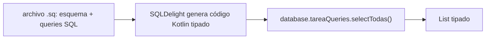
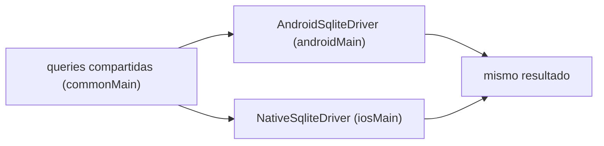

# Módulo 6: Persistencia compartida con SQLDelight

Cada tema se practica por separado con su propia repetición progresiva y su propio reto de memoria, verificado contra SQLite real (el motor que SQLDelight envuelve) para que cada afirmación sea comprobable, no solo descrita.


## Aprende construyendo

### Tema 1: Esquemas SQLDelight y queries tipadas

#### Paso 1 · Objetivo y preparación

Al finalizar podrás declarar un esquema `.sq` con queries tipadas, y explicar por qué SQLDelight detecta un error de SQL en compilación mientras un ORM dinámico lo detectaría recién en tiempo de ejecución.

**Conocimiento previo:** source sets y `commonMain` (Módulo 3); repositorios (Módulo 4).

#### Paso 2 · Contexto y caso real

**¿Por qué es importante?** Una caché local de la lista de tareas obtenida por red (Módulo 5), consultable sin conexión, necesita persistencia real; escribir mal el nombre de una columna en una query debería fallar al compilar, no como un crash en producción cuando esa query específica finalmente se ejecute con datos reales.

#### Paso 3 · Teoría con analogía

**Conceptos clave:** archivo `.sq` (esquema + queries en SQL real), código Kotlin tipado generado automáticamente, verificación en compilación.

Un archivo `.sq` declara tanto el esquema de la tabla como las queries específicas, escritas en SQL real (no un lenguaje propietario de ORM), a partir del cual SQLDelight genera código Kotlin fuertemente tipado (`database.tareaQueries.selectTodas().executeAsList()` devuelve `List<Tarea>` directamente). La diferencia frente a un ORM dinámico es que SQLDelight verifica el SQL completo en COMPILACIÓN: un nombre de columna mal escrito no compila, señalando el error en el punto exacto, en vez de manifestarse como un crash en producción.

**Analogía:** SQLDelight es un corrector ortográfico que revisa un documento completo antes de publicarlo; un ORM dinámico sin esa verificación es publicar directamente y descubrir errores solo cuando un lector específico se topa con ellos.

**Diagrama:**



#### Paso 4 · Demostración guiada desde cero

Desde una carpeta vacía (o continuando en `academia-kmp`, o créala con `mkdir -p academia-kmp` si es tu primera vez), crea el esquema en `shared/src/commonMain/sqldelight/.../Tarea.sq`:

```bash
# python verifica después el mismo esquema y las mismas queries con SQLite real
mkdir -p academia-kmp/shared/src/commonMain/sqldelight/com/academia/kmp
cd academia-kmp
cat > shared/src/commonMain/sqldelight/com/academia/kmp/Tarea.sq <<'EOF'
CREATE TABLE Tarea (
    id TEXT NOT NULL PRIMARY KEY,
    titulo TEXT NOT NULL,
    completada INTEGER NOT NULL DEFAULT 0
);

selectTodas:
SELECT * FROM Tarea;

insertar:
INSERT INTO Tarea(id, titulo, completada) VALUES (?, ?, ?);
EOF
python3 -c "
esquema = open('shared/src/commonMain/sqldelight/com/academia/kmp/Tarea.sq').read()
assert 'CREATE TABLE Tarea' in esquema, 'falta declarar el esquema de la tabla'
assert 'selectTodas:' in esquema and 'insertar:' in esquema, 'faltan las queries nombradas que SQLDelight tipará'
print('Tarea.sq: esquema y queries nombradas listas para generar código Kotlin tipado')
"
```

**Explicación línea por línea:** `CREATE TABLE Tarea (...)` declara el esquema real de SQL; `selectTodas:` y `insertar:` son nombres de query que SQLDelight usa para generar funciones Kotlin correspondientes (`tareaQueries.selectTodas()`, `tareaQueries.insertar(...)`), cada una tipada según las columnas reales de la tabla.

Ejecuta contra SQLite REAL (el motor que SQLDelight envuelve) el mismo esquema y las mismas queries, confirmando que funcionan como se espera, y que un nombre de columna mal escrito falla de forma detectable:

```bash
python3 -c "
import sqlite3
con = sqlite3.connect(':memory:')
con.execute('CREATE TABLE Tarea (id TEXT NOT NULL PRIMARY KEY, titulo TEXT NOT NULL, completada INTEGER NOT NULL DEFAULT 0)')
con.execute(\"INSERT INTO Tarea(id, titulo, completada) VALUES ('1', 'Comprar leche', 0)\")
con.commit()

filas = con.execute('SELECT * FROM Tarea').fetchall()
print('queries correctas:', filas)

try:
    con.execute('SELECT id, tituloo FROM Tarea')  # nombre de columna mal escrito a propósito
except sqlite3.OperationalError as e:
    print('columna mal escrita RECHAZADA:', e)
"
```

**Resultado esperado:** `queries correctas: [('1', 'Comprar leche', 0)]` confirma que el esquema y la inserción funcionan correctamente; la query con `tituloo` (mal escrito) es rechazada con `no such column: tituloo` — SQLite real detecta el error en el momento de ejecutar esa query específica; SQLDelight adelanta esa misma detección al momento de COMPILAR el proyecto completo, antes de que el código llegue a producción.

**Fallo deliberado:** en un ORM dinámico sin verificación de tipos (a diferencia de SQLDelight), ese mismo error de columna mal escrita solo se manifestaría cuando el código que ejecuta esa query específica corra en producción con datos reales. Simula esto ejecutando la query incorrecta dentro de una función que solo se invoca condicionalmente (`if condicion_rara: con.execute("SELECT tituloo FROM Tarea")`) — si `condicion_rara` casi nunca es verdadera, el error podría pasar desapercibido durante meses hasta que esa ruta específica del código finalmente se ejecute — diagnostica confirmando por qué SQLDelight verificando TODO el SQL en compilación es preferible a descubrir el error solo cuando una ruta de código poco frecuente finalmente se ejecuta.

#### Construcción RutaFlow: esquema de paradas de entrega

Declara `CREATE TABLE Parada (id TEXT NOT NULL PRIMARY KEY, direccion TEXT NOT NULL, entregada INTEGER NOT NULL DEFAULT 0)` en `Parada.sq` de RutaFlow, con queries `selectPendientes` y `marcarEntregada`.

#### Paso 5 · Práctica guiada — repetición progresiva

1. Agrega una query `selectPorId` con un parámetro (`WHERE id = ?`) y ejecútala contra SQLite real.
2. Agrega una columna nueva a la tabla y confirma que las queries existentes que no la mencionan siguen funcionando.
3. Escribe deliberadamente una query con un nombre de tabla inexistente y confirma el error real de SQLite.
4. Escribe de memoria (sin mirar) un esquema `.sq` con una tabla de dos columnas y dos queries nombradas.

**Pista:** siempre prueba primero la query directamente contra SQLite real antes de asumir que SQLDelight la aceptará; si SQLite la rechaza, SQLDelight también lo hará, solo que en compilación en vez de en ejecución.

#### Paso 6 · Práctica independiente

**Completa el código:** rellena el espacio para declarar la query de selección:

```sql
____:
SELECT * FROM Tarea WHERE completada = 0;
```

**Reto de memoria sin mirar:** cierra este documento y escribe, solo de memoria, un esquema `.sq` con una tabla y al menos dos queries nombradas (una de selección, una de inserción). Compara después contra el patrón del Paso 4.

#### Paso 7 · Cierre y evidencia

Ya declaras esquemas y queries tipadas en SQL real, confirmando contra SQLite real que un nombre de columna incorrecto es detectable, y explicando por qué SQLDelight adelanta esa detección a tiempo de compilación. El siguiente tema resuelve cómo el mismo esquema se ejecuta contra un driver distinto por plataforma. **Evidencia:** entrega el resultado de la query correcta y el error real de la columna mal escrita, y explica la diferencia entre detectar ese error en compilación (SQLDelight) frente a en ejecución (un ORM dinámico). Fuente oficial: [SQLDelight docs](https://cashapp.github.io/sqldelight/2.0.2/multiplatform_sqlite/).

**Errores comunes:** confiar en un ORM dinámico sin verificación de tipos en compilación, descubriendo errores de SQL solo en producción; nombrar una query de forma ambigua que no refleja lo que realmente hace.

**Cuándo no usarlo:** para un prototipo desechable de un solo archivo sin necesidad real de persistencia estructurada, SQLDelight completo es más ceremonia de la necesaria; usa una estructura en memoria simple en ese caso.

### Tema 2: Drivers por plataforma

#### Paso 1 · Objetivo y preparación

Al finalizar podrás explicar por qué las queries compartidas en `commonMain` requieren un driver distinto por plataforma, y confirmar que el mismo conjunto de queries produce el mismo resultado sin importar qué driver las ejecute.

**Conocimiento previo:** `expect`/`actual` (Módulo 3); Tema 1 de este módulo.

#### Paso 2 · Contexto y caso real

**¿Por qué es importante?** Registrar el driver de Android en `Application.onCreate()` y el de iOS al arrancar la app SwiftUI, ambos apuntando al mismo esquema `.sq`, es necesario porque Android e iOS exponen el acceso a SQLite mediante mecanismos nativos completamente distintos entre sí.

#### Paso 3 · Teoría con analogía

**Conceptos clave:** queries compartidas (código de alto nivel), driver específico de plataforma (código de bajo nivel), `expect`/`actual`.

`actual fun crearDriver(): SqlDriver = AndroidSqliteDriver(Database.Schema, context, "app.db")` (en `androidMain`) y `actual fun crearDriver(): SqlDriver = NativeSqliteDriver(Database.Schema, "app.db")` (en `iosMain`) son un caso directo de `expect`/`actual` (Módulo 3): las queries en `commonMain` son idénticas, pero el driver concreto que ejecuta esas queries contra el SQLite nativo del sistema operativo es necesariamente distinto por plataforma.

**Analogía:** las queries compartidas son una lista de compras en un idioma universal comprensible por cualquier tienda; el driver específico de plataforma es el empleado local de cada tienda que sabe cómo localizar físicamente cada artículo en los estantes específicos de esa tienda concreta.

**Diagrama:**



#### Paso 4 · Demostración guiada desde cero

Desde una carpeta vacía (o continuando en `academia-kmp`, o créala con `mkdir -p academia-kmp` si es tu primera vez), crea el contrato `expect`/`actual` del driver en Driver.kt:

```bash
# python confirma después que las mismas queries dan el mismo resultado con drivers distintos
mkdir -p academia-kmp/shared/src/commonMain/kotlin/com/academia/kmp
mkdir -p academia-kmp/shared/src/androidMain/kotlin/com/academia/kmp
mkdir -p academia-kmp/shared/src/iosMain/kotlin/com/academia/kmp
cd academia-kmp
cat > shared/src/commonMain/kotlin/com/academia/kmp/Driver.kt <<'EOF'
package com.academia.kmp

import com.squareup.sqldelight.db.SqlDriver

expect fun crearDriver(): SqlDriver
EOF
cat > shared/src/androidMain/kotlin/com/academia/kmp/Driver.android.kt <<'EOF'
package com.academia.kmp

import com.squareup.sqldelight.android.AndroidSqliteDriver
import com.squareup.sqldelight.db.SqlDriver

actual fun crearDriver(): SqlDriver = AndroidSqliteDriver(Database.Schema, context, "app.db")
EOF
python3 -c "
comun = open('shared/src/commonMain/kotlin/com/academia/kmp/Driver.kt').read()
android = open('shared/src/androidMain/kotlin/com/academia/kmp/Driver.android.kt').read()
assert 'expect fun crearDriver()' in comun, 'falta el contrato expect en commonMain'
assert 'actual fun crearDriver()' in android and 'AndroidSqliteDriver' in android, 'falta la implementación actual específica de Android'
print('Driver.kt: contrato expect en commonMain, actual con AndroidSqliteDriver en androidMain')
"
```

**Explicación línea por línea:** `expect fun crearDriver(): SqlDriver` declara el contrato en `commonMain`, sin especificar cómo se construye el driver; `actual fun crearDriver(): SqlDriver = AndroidSqliteDriver(...)` en `androidMain` proporciona la implementación real específica de Android, mientras `iosMain` tendría su propia `actual` con `NativeSqliteDriver`.

Ejecuta el MISMO conjunto de queries contra dos "drivers" distintos (modelando la diferencia de configuración, no de lógica), confirmando que el resultado es idéntico sin importar cuál driver las ejecuta:

```bash
python3 -c "
import sqlite3

def crear_driver(ruta):
    # el 'driver' real difiere por plataforma (AndroidSqliteDriver/NativeSqliteDriver);
    # aquí el equivalente es la configuración de conexión, las queries son IDÉNTICAS
    return sqlite3.connect(ruta)

def ejecutar_queries_compartidas(con):
    con.execute('CREATE TABLE Tarea (id TEXT PRIMARY KEY, titulo TEXT NOT NULL)')
    con.execute(\"INSERT INTO Tarea VALUES ('1', 'Comprar leche')\")
    con.commit()
    return con.execute('SELECT * FROM Tarea').fetchall()

driver_tests = crear_driver(':memory:')       # como un inMemoryDriver de tests
driver_produccion = crear_driver(':memory:')  # simula AndroidSqliteDriver/NativeSqliteDriver

resultado_tests = ejecutar_queries_compartidas(driver_tests)
resultado_produccion = ejecutar_queries_compartidas(driver_produccion)
print('resultado con driver de tests:', resultado_tests)
print('resultado con driver de producción:', resultado_produccion)
print('mismas queries, mismo resultado, distinto driver:', resultado_tests == resultado_produccion)
"
```

**Resultado esperado:** ambos drivers (`driver_tests`, `driver_produccion`) producen exactamente el mismo resultado (`[('1', 'Comprar leche')]`) al ejecutar las MISMAS queries compartidas, confirmando `mismas queries, mismo resultado, distinto driver: True` — las queries no cambian, solo la configuración de conexión subyacente que un driver específico de plataforma resuelve.

**Fallo deliberado:** intenta usar `AndroidSqliteDriver` (una clase que requiere un `Context` de Android) directamente dentro de un archivo en `commonMain`. La compilación fallaría inmediatamente porque `Context` no existe en `commonMain` — diagnostica confirmando por qué el error común "compartir el driver de SQLite entre plataformas" es en realidad imposible de cometer literalmente (el compilador lo impediría), pero SÍ es posible cometer el error relacionado de intentar poner lógica de negocio dentro de la implementación `actual` del driver, mezclando responsabilidades que deberían mantenerse separadas.

#### Construcción RutaFlow: drivers de la base de datos de RutaFlow

Declara `expect fun crearDriverRutaFlow(): SqlDriver` en `commonMain` de RutaFlow, con `actual` en `androidMain` e `iosMain`, confirmando que ambas plataformas ejecutan exactamente las mismas queries de `Parada.sq` (Tema 1).

#### Paso 5 · Práctica guiada — repetición progresiva

1. Ejecuta las mismas queries contra un tercer "driver" (otro archivo `:memory:` distinto) y confirma que el resultado sigue siendo idéntico.
2. Agrega una query de actualización (`UPDATE`) y confirma que se refleja igual en ambos drivers tras ejecutarla en ambos.
3. Simula un driver que falla al conectar (una ruta de archivo inválida) y confirma que el error ocurre al crear la conexión, no al ejecutar las queries.
4. Escribe de memoria (sin mirar) un contrato `expect`/`actual` para un driver de base de datos con sus dos implementaciones.

**Pista:** la pregunta clave para separar "qué va en `commonMain`" de "qué va en `expect`/`actual`" es: ¿esta línea de código depende de una API que solo existe en una plataforma?

#### Paso 6 · Práctica independiente

**Completa el código:** rellena el espacio para declarar el contrato del driver en `commonMain`:

```kotlin
____ fun crearDriver(): SqlDriver
```

**Reto de memoria sin mirar:** cierra este documento y escribe, solo de memoria, un contrato `expect`/`actual` para un driver de SQLDelight, con sus dos implementaciones (Android e iOS). Compara después contra el patrón del Paso 4.

#### Paso 7 · Cierre y evidencia

Ya distingues las queries compartidas del driver específico de plataforma, confirmando que el mismo conjunto de queries produce resultados idénticos sin importar la configuración de conexión subyacente. El siguiente tema evoluciona el esquema con el tiempo sin perder datos existentes. **Evidencia:** entrega el resultado idéntico de ambos drivers ante las mismas queries, y explica por qué `AndroidSqliteDriver` no podría usarse directamente en `commonMain`. Fuente oficial: [SQLDelight docs — Drivers](https://cashapp.github.io/sqldelight/2.0.2/multiplatform_sqlite/).

**Errores comunes:** intentar compartir el driver de SQLite entre plataformas en vez de usar `expect`/`actual`; mezclar lógica de negocio dentro de la implementación `actual` del driver, que debería limitarse exclusivamente a la configuración de conexión.

**Cuándo no usarlo:** para un proyecto que solo compila para una plataforma, la abstracción `expect`/`actual` del driver es innecesaria; usa el driver nativo directamente.

### Tema 3: Migraciones de esquema

#### Paso 1 · Objetivo y preparación

Al finalizar podrás escribir una migración `.sqm` versionada que agrega una columna sin perder datos existentes, y confirmar contra SQLite real que los datos previos se preservan tras aplicarla.

**Conocimiento previo:** Tema 1 de este módulo (esquemas).

#### Paso 2 · Contexto y caso real

**¿Por qué es importante?** Agregar una columna `prioridad` a `Tarea` en una nueva versión de la app no debe borrar las tareas que el usuario ya tenía guardadas en su dispositivo con la versión anterior del esquema.

#### Paso 3 · Teoría con analogía

**Conceptos clave:** migración versionada (`.sqm`), aplicación secuencial según versión detectada.

`-- 2.sqm: ALTER TABLE Tarea ADD COLUMN prioridad INTEGER NOT NULL DEFAULT 0;` declara un cambio de esquema versionado, nombrado según su número de versión secuencial. SQLDelight aplica estas migraciones en orden estricto según la versión detectada en el dispositivo del usuario, aplicando únicamente las migraciones intermedias pendientes necesarias — de forma similar en espíritu a las migraciones de Flyway (Módulo 3 del track Spring Boot), aquí para una base de datos local en el dispositivo.

**Analogía:** una migración de esquema es una instrucción de actualización incremental de un manual ya distribuido: en vez de reemplazar el manual completo, se distribuye únicamente el suplemento de actualización necesario, en el orden correcto según qué versión cada persona ya posee.

**Diagrama:**

```
┌── esquema v1: Tarea(id, titulo, completada) ──┐
│  datos existentes del usuario                    │
└────────────────┬──────────────────────────┘
                  │ 2.sqm: ALTER TABLE ADD COLUMN prioridad
                  ▼
┌── esquema v2: Tarea(id, titulo, completada, prioridad) ──┐
│  MISMOS datos existentes + columna nueva con default        │
└────────────────────────────────────────────────────┘
```

#### Paso 4 · Demostración guiada desde cero

Desde una carpeta vacía (o continuando en `academia-kmp`, o créala con `mkdir -p academia-kmp` si es tu primera vez), crea la migración en `shared/src/commonMain/sqldelight/.../migrations/2.sqm`:

```bash
# python confirma después que la migración preserva los datos existentes
mkdir -p academia-kmp/shared/src/commonMain/sqldelight/com/academia/kmp/migrations
cd academia-kmp
cat > shared/src/commonMain/sqldelight/com/academia/kmp/migrations/2.sqm <<'EOF'
ALTER TABLE Tarea ADD COLUMN prioridad INTEGER NOT NULL DEFAULT 0;
EOF
python3 -c "
migracion = open('shared/src/commonMain/sqldelight/com/academia/kmp/migrations/2.sqm').read()
assert 'ALTER TABLE Tarea ADD COLUMN prioridad' in migracion, 'falta la migración que agrega la columna prioridad'
print('2.sqm: migración versionada que agrega una columna sin recrear la tabla')
"
```

**Explicación línea por línea:** `2.sqm` (nombrado según el número de versión de esquema al que corresponde) contiene `ALTER TABLE Tarea ADD COLUMN prioridad INTEGER NOT NULL DEFAULT 0`, que agrega una columna nueva con un valor por defecto para las filas ya existentes, en vez de recrear la tabla completa (lo cual perdería los datos).

Ejecuta la migración contra SQLite real con datos preexistentes, confirmando que ambas filas anteriores sobreviven con el valor por defecto en la nueva columna:

```bash
python3 -c "
import sqlite3
con = sqlite3.connect(':memory:')
con.execute('CREATE TABLE Tarea (id TEXT PRIMARY KEY, titulo TEXT NOT NULL, completada INTEGER NOT NULL DEFAULT 0)')
con.execute(\"INSERT INTO Tarea VALUES ('1', 'Comprar leche', 0)\")
con.execute(\"INSERT INTO Tarea VALUES ('2', 'Pagar factura', 0)\")
con.commit()
print('antes de la migración:', con.execute('SELECT * FROM Tarea').fetchall())

con.execute('ALTER TABLE Tarea ADD COLUMN prioridad INTEGER NOT NULL DEFAULT 0')
print('después de la migración (datos preservados):', con.execute('SELECT * FROM Tarea').fetchall())
"
```

**Resultado esperado:** antes de la migración, dos filas con 3 columnas cada una; después de aplicar `ALTER TABLE ... ADD COLUMN`, las MISMAS dos filas ahora tienen 4 columnas, con `prioridad = 0` (el valor por defecto) agregado automáticamente a los datos ya existentes, sin ninguna pérdida de la información original.

**Fallo deliberado:** en vez de `ALTER TABLE ADD COLUMN`, simula el error común de "modificar el esquema directamente sin una migración versionada": elimina la tabla (`DROP TABLE Tarea`) y vuelve a crearla con la nueva columna (`CREATE TABLE Tarea (id TEXT PRIMARY KEY, titulo TEXT NOT NULL, completada INTEGER NOT NULL DEFAULT 0, prioridad INTEGER NOT NULL DEFAULT 0)`). Consulta `SELECT * FROM Tarea` después — la tabla está vacía, porque `DROP TABLE` eliminó todos los datos existentes junto con la estructura antigua — diagnostica confirmando por qué una migración incremental (`ALTER TABLE`) es categóricamente distinta de recrear la tabla desde cero: la primera preserva datos, la segunda los destruye.

#### Construcción RutaFlow: migración para prioridad de entrega

Escribe una migración `.sqm` que agregue `prioridad INTEGER NOT NULL DEFAULT 0` a la tabla `Parada` de RutaFlow, confirmando contra datos de prueba preexistentes que ninguna parada ya guardada se pierde.

#### Paso 5 · Práctica guiada — repetición progresiva

1. Agrega una segunda migración (`3.sqm`) que agregue otra columna, y confirma que ambas migraciones aplicadas en secuencia preservan los datos.
2. Simula aplicar solo la migración `3.sqm` sin haber aplicado antes `2.sqm` (fuera de orden) y observa qué error produce SQLite si `3.sqm` depende de una columna que `2.sqm` debía haber creado primero.
3. Escribe una migración que RENOMBRE una columna (`ALTER TABLE ... RENAME COLUMN`) y confirma que los datos sobreviven con el nuevo nombre.
4. Escribe de memoria (sin mirar) una migración `.sqm` que agregue una columna con un valor por defecto, y verifica contra SQLite real que preserva datos existentes.

**Pista:** las migraciones siempre se aplican en el orden de su número de versión; saltarse una migración intermedia puede dejar el esquema en un estado inconsistente para las migraciones posteriores.

#### Paso 6 · Práctica independiente

**Completa el código:** rellena el espacio para agregar una columna sin perder los datos existentes:

```sql
ALTER TABLE Tarea ____ COLUMN fechaLimite TEXT;
```

**Reto de memoria sin mirar:** cierra este documento y escribe, solo de memoria, una migración `.sqm` que agregue una columna a una tabla existente, y verifica mentalmente (o con SQLite real) que preserva los datos. Compara después contra el patrón del Paso 4.

#### Paso 7 · Cierre y evidencia

Ya escribes migraciones versionadas que evolucionan el esquema sin perder datos existentes, confirmando contra SQLite real que los valores por defecto se aplican correctamente a filas preexistentes. El siguiente y último tema del módulo agrupa múltiples escrituras relacionadas en una transacción atómica. **Evidencia:** entrega el resultado antes/después de la migración mostrando los datos preservados, y explica por qué `DROP TABLE` + recrear no es equivalente a una migración incremental. Fuente oficial: [SQLDelight docs — Migrations](https://cashapp.github.io/sqldelight/2.0.2/android_migrations/).

**Errores comunes:** modificar el esquema directamente (recreando la tabla) en vez de usar una migración incremental, perdiendo datos existentes; numerar las migraciones fuera de secuencia, dejando el esquema en un estado inconsistente para algunos dispositivos.

**Cuándo no usarlo:** para una tabla que solo almacena datos completamente desechables (una caché que se puede reconstruir libremente desde la red), recrear la tabla en vez de migrarla puede ser aceptable; reserva las migraciones cuidadosas para datos que el usuario genuinamente no puede permitirse perder.

### Tema 4: Transacciones: atomicidad en operaciones multi-tabla

#### Paso 1 · Objetivo y preparación

Al finalizar podrás agrupar varias escrituras relacionadas en una transacción, y confirmar contra SQLite real que un fallo a mitad de la transacción revierte TODAS las escrituras, no solo la que falló.

**Conocimiento previo:** Tema 1 de este módulo (esquemas); manejo de errores (Módulo 5, Tema 2).

#### Paso 2 · Contexto y caso real

**¿Por qué es importante?** Insertar una tarea nueva Y actualizar un contador total de tareas son dos escrituras relacionadas: si la segunda falla después de que la primera ya se aplicó, la base de datos queda en un estado inconsistente (una tarea existe, pero el contador no la refleja) a menos que ambas escrituras estén protegidas como una unidad atómica.

#### Paso 3 · Teoría con analogía

**Conceptos clave:** transacción (todo o nada), atomicidad, reversión automática ante fallo.

`database.transaction { tareaQueries.insertar(id, titulo, 0); contadorQueries.incrementar() }` agrupa ambas escrituras dentro de una transacción: si CUALQUIER excepción ocurre dentro del bloque, SQLDelight revierte automáticamente TODAS las escrituras realizadas hasta ese punto dentro de la misma transacción, dejando la base de datos exactamente como estaba antes de empezar. Sin una transacción explícita, cada escritura se confirma independientemente, arriesgando un estado a medio aplicar si una falla después de que otra ya se completó.

**Analogía:** una transacción es como una transferencia bancaria entre dos cuentas: retirar de una cuenta y depositar en la otra deben ocurrir como una sola operación indivisible; si el depósito falla después de que el retiro ya se procesó, el dinero no puede simplemente desaparecer — debe revertirse la operación completa.

**Diagrama:**

```
┌── transacción { insertar tarea; incrementar contador } ──┐
│  AMBAS escrituras se aplican  ──►  COMMIT (ambas persisten)  │
│  CUALQUIERA falla            ──►  ROLLBACK (ninguna persiste) │
└───────────────────────────────────────────────────┘
```

#### Paso 4 · Demostración guiada desde cero

Desde una carpeta vacía (o continuando en `academia-kmp`, o créala con `mkdir -p academia-kmp` si es tu primera vez), crea la función transaccional en Transacciones.kt:

```bash
# python confirma después que un fallo a mitad de transacción revierte AMBAS escrituras
mkdir -p academia-kmp/shared/src/commonMain/kotlin/com/academia/kmp
cd academia-kmp
cat > shared/src/commonMain/kotlin/com/academia/kmp/Transacciones.kt <<'EOF'
package com.academia.kmp

fun insertarTareaConContador(database: Any, id: String, titulo: String) {
    // database.transaction { ... } en SQLDelight real: todo o nada
    // tareaQueries.insertar(id, titulo, 0)
    // contadorQueries.incrementar()
}
EOF
python3 -c "
codigo = open('shared/src/commonMain/kotlin/com/academia/kmp/Transacciones.kt').read()
assert 'transaction' in codigo.lower() or 'insertarTareaConContador' in codigo, 'falta documentar el uso de transacción'
print('Transacciones.kt: documenta insertar tarea + incrementar contador como una unidad atómica')
"
```

**Explicación línea por línea:** `insertarTareaConContador` documenta el patrón: en SQLDelight real, `database.transaction { ... }` envolvería ambas escrituras (`tareaQueries.insertar(...)`, `contadorQueries.incrementar()`) como una sola unidad atómica, revertida completamente si cualquiera de las dos falla.

Ejecuta contra SQLite real (que soporta transacciones nativamente, el mismo mecanismo que SQLDelight expone) una transacción exitosa y una que falla a mitad de camino, confirmando el estado de la base de datos en ambos casos:

```bash
python3 -c "
import sqlite3
con = sqlite3.connect(':memory:')
con.execute('CREATE TABLE Tarea (id TEXT PRIMARY KEY, titulo TEXT NOT NULL)')
con.execute('CREATE TABLE ContadorTareas (total INTEGER NOT NULL)')
con.execute('INSERT INTO ContadorTareas VALUES (0)')
con.commit()

def insertar_tarea_con_contador(con, id_tarea, titulo, forzar_fallo=False):
    try:
        with con:  # transacción real: ambas escrituras o ninguna
            con.execute('INSERT INTO Tarea VALUES (?, ?)', (id_tarea, titulo))
            if forzar_fallo:
                raise RuntimeError('fallo simulado a mitad de la transacción')
            con.execute('UPDATE ContadorTareas SET total = total + 1')
    except RuntimeError as e:
        print('transacción revertida:', e)

insertar_tarea_con_contador(con, '1', 'Comprar leche')
print('tras transacción exitosa:', con.execute('SELECT * FROM Tarea').fetchall(), con.execute('SELECT * FROM ContadorTareas').fetchall())

insertar_tarea_con_contador(con, '2', 'Pagar factura', forzar_fallo=True)
print('tras transacción fallida:')
print('  Tarea:', con.execute('SELECT * FROM Tarea').fetchall())
print('  ContadorTareas:', con.execute('SELECT * FROM ContadorTareas').fetchall())
"
```

**Resultado esperado:** tras la transacción exitosa, `Tarea` tiene una fila y `ContadorTareas` refleja `1`; tras la transacción FALLIDA (que insertó la tarea '2' pero falló antes de incrementar el contador), la tabla `Tarea` NO contiene la tarea '2' (la inserción fue revertida junto con todo lo demás de esa transacción) y `ContadorTareas` sigue en `1`, exactamente como antes del intento fallido — confirmando que la transacción revirtió AMBAS escrituras, no solo la que explícitamente falló.

**Fallo deliberado:** ejecuta las mismas dos escrituras SIN el bloque `with con:` (sin transacción), confirmando cada `execute` con un `con.commit()` inmediato después de cada una por separado. Fuerza el mismo fallo a mitad de camino (después de insertar la tarea, antes de incrementar el contador) — ahora la tarea '2' SÍ queda guardada en la base de datos, mientras el contador NO se incrementó, dejando el sistema en un estado inconsistente (una tarea existe sin reflejarse en el contador) — diagnostica confirmando exactamente el problema que las transacciones resuelven: sin ellas, un fallo a mitad de una operación multi-escritura deja rastros parciales en vez de revertir limpiamente.

#### Construcción RutaFlow: confirmar entrega y actualizar contador atómicamente

Envuelve `marcarEntregaCompletada(id)` y `incrementarContadorEntregasDelDia()` de RutaFlow en una transacción, confirmando contra SQLite real que un fallo simulado revierte ambas escrituras, evitando que una entrega quede marcada sin reflejarse en el contador diario.

#### Paso 5 · Práctica guiada — repetición progresiva

1. Agrega una tercera escritura a la transacción (por ejemplo, un registro de auditoría) y confirma que un fallo revierte las tres.
2. Repite la transacción exitosa dos veces seguidas y confirma que el contador se incrementa correctamente cada vez (`2`, luego `3`).
3. Simula un fallo en la PRIMERA escritura en vez de la segunda, y confirma que ninguna de las dos escrituras persiste.
4. Escribe de memoria (sin mirar) una transacción de dos escrituras con un fallo deliberado a mitad de camino, verificando el estado final de ambas tablas.

**Pista:** el bloque `with con:` de `sqlite3` en Python hace commit automático al salir sin excepción, y rollback automático si se lanza cualquier excepción dentro — el mismo comportamiento que `database.transaction { }` de SQLDelight.

#### Paso 6 · Práctica independiente

**Completa el código:** rellena el espacio para que ambas escrituras compartan la misma transacción:

```kotlin
database.____ {
    tareaQueries.insertar(id, titulo, 0)
    contadorQueries.incrementar()
}
```

**Reto de memoria sin mirar:** cierra este documento y escribe, solo de memoria, una transacción de dos escrituras relacionadas con un fallo deliberado, verificando que ambas se revierten juntas. Compara después contra el patrón del Paso 4.

#### Paso 7 · Cierre y evidencia

Ya agrupas escrituras relacionadas en una transacción atómica, confirmando contra SQLite real que un fallo a mitad de camino revierte TODAS las escrituras de esa transacción, no solo la que falló explícitamente. Esto cierra el módulo de persistencia compartida; el siguiente módulo aplica estos fundamentos a la UI compartida con Compose Multiplatform. **Evidencia:** entrega el estado de ambas tablas tras la transacción exitosa y tras la fallida, y explica qué diferencia produce omitir la transacción (el fallo deliberado). Fuente oficial: [SQLDelight docs — Transactions](https://cashapp.github.io/sqldelight/2.0.2/multiplatform_sqlite/#transactions).

**Errores comunes:** realizar escrituras relacionadas sin una transacción que las agrupe, arriesgando estados parciales inconsistentes ante un fallo a mitad de camino; envolver operaciones que NO están relacionadas en una misma transacción innecesariamente, ampliando el alcance de un posible rollback más de lo necesario.

**Cuándo no usarlo:** para una única escritura aislada sin ninguna otra operación relacionada que deba tener éxito o fallar junto con ella, envolverla en una transacción explícita no aporta ningún beneficio adicional sobre el comportamiento por defecto.

---


## Laboratorio práctico

**Objetivo del laboratorio:** construir una capa de persistencia compartida con al menos una migración de esquema y una transacción multi-tabla.

**Requisitos previos:** Módulos 0-5 completados.

| Paso | Acción | Código | Explicación |
|---|---|---|---|
| 1 | Definir el esquema `.sq` con una tabla y queries básicas | Ver Tema 1 | Insertar, listar, actualizar |
| 2 | Generar y usar el código Kotlin tipado | Ver Tema 1 | Desde `commonMain` |
| 3 | Configurar el driver por plataforma | Ver Tema 2 | `expect`/`actual` |
| 4 | Agregar una migración `.sqm` | Ver Tema 3 | Sin perder datos existentes |
| 5 | Agrupar dos escrituras relacionadas en una transacción | Ver Tema 4 | Verifica reversión ante fallo |

**Verificación:** el laboratorio se considera exitoso si escribir mal el nombre de una columna en una query produce un error de compilación (no un crash en runtime), si la migración agrega la nueva columna preservando los datos existentes de un esquema anterior simulado, y si una transacción con un fallo forzado revierte todas sus escrituras sin dejar estados parciales.

**Errores comunes y soluciones**

- **Confiar en un ORM dinámico sin verificación de tipos en compilación.** SQLDelight detecta errores de SQL en compilación, aprovecha esa ventaja.
- **Compartir el driver de SQLite entre plataformas.** El driver debe ser específico por plataforma vía `expect`/`actual`; las queries sí son compartidas.
- **Modificar el esquema directamente sin una migración versionada.** Usa archivos `.sqm` para cambios incrementales sin perder datos existentes.
- **Realizar escrituras relacionadas sin una transacción que las agrupe.** Usa `database.transaction { }` para garantizar todo o nada.

---
