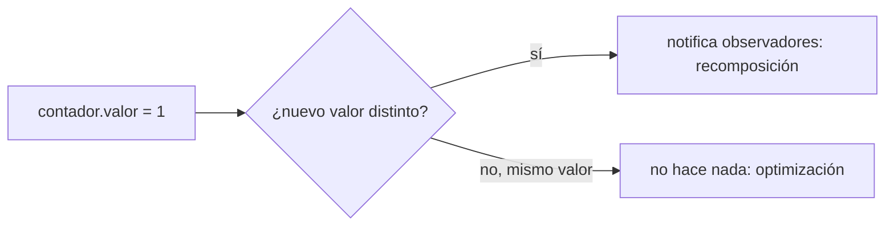

# Módulo 7: Compose Multiplatform — UI compartida

Cada tema se practica por separado con su propia repetición progresiva y su propio reto de memoria. El modelo reactivo de recomposición se verifica con una simulación real en Python que reproduce el comportamiento exacto de `mutableStateOf`, para que la afirmación "solo el estado observable dispara recomposición" sea comprobable, no solo descrita.


## Aprende construyendo

### Tema 1: Compose Multiplatform vs Jetpack Compose

#### Paso 1 · Objetivo y preparación

Al finalizar podrás explicar qué significa `@Composable` en código compartido, qué motor gráfico usa cada plataforma, y por qué una dependencia exclusiva de Android dentro de una función compartida rompe la compilación de iOS.

**Conocimiento previo:** source sets y `expect`/`actual` (Módulo 3).

#### Paso 2 · Contexto y caso real

**¿Por qué es importante?** Una startup con equipo pequeño necesita una pantalla de lista de tareas idéntica en Android e iOS sin duplicar el código de UI, y sin asumir por error que cualquier import de Android es automáticamente portable solo por estar dentro de una función marcada `@Composable`.

#### Paso 3 · Teoría con analogía

**Conceptos clave:** mismo modelo de programación extendido a más plataformas, Skia como motor gráfico embebido.

En `commonMain`, `@Composable` conserva el mismo significado de compilación que en Jetpack Compose: el plugin de Compose transforma la función para integrarla en el runtime de composición. El target determina el backend gráfico; Android usa el motor nativo de Compose ya integrado en el sistema, mientras iOS usa Skia (el mismo motor de renderizado de bajo nivel, aquí embebido directamente en la app iOS en vez de depender de UIKit nativo). Marcar una función con `@Composable` no vuelve portable una dependencia Android incluida dentro de ella: si se importa `android.*` desde `commonMain`, la compilación del target iOS falla antes de renderizar nada.

**Analogía:** Compose Multiplatform es un mismo equipo de diseño que ensambla estructuras visualmente idénticas en distintas ciudades usando el mismo conjunto de herramientas, en vez de contratar equipos separados en cada ciudad con métodos distintos entre sí.

**Diagrama:**

```
┌── commonMain: @Composable fun PantallaTareas(...) ──┐
│  MISMA función, MISMA estructura declarativa          │
└──────────────┬─────────────────────────────┘
               ├── Android: motor nativo de Compose
               └── iOS: Skia embebido
```

#### Paso 4 · Demostración guiada desde cero

Desde una carpeta vacía (o continuando en `academia-kmp`, o créala con `mkdir -p academia-kmp` si es tu primera vez), crea la pantalla compartida en `shared/src/commonMain/kotlin/.../PantallaTareas.kt`:

```bash
# compila el módulo compartido con Gradle para confirmar que no depende de ninguna plataforma
mkdir -p academia-kmp/shared/src/commonMain/kotlin/com/academia/kmp
cd academia-kmp
cat > shared/src/commonMain/kotlin/com/academia/kmp/PantallaTareas.kt <<'EOF'
package com.academia.kmp

@Composable
fun PantallaTareas(tareas: List<Tarea>) {
    LazyColumn {
        items(tareas) { tarea -> Text(tarea.titulo) }
    }
}
EOF
./gradlew :shared:compileKotlinMetadata
```

**Explicación línea por línea:** `package com.academia.kmp` (sin sufijo `.android` ni `.ios`) confirma que el archivo vive en `commonMain`; `@Composable fun PantallaTareas(tareas: List<Tarea>)` declara la función portable; `LazyColumn { items(tareas) { ... } }` es la estructura declarativa que cada plataforma renderizará con su propio motor gráfico, sin que la función necesite saber cuál.

Instala y abre la app real en un emulador Android para confirmar el renderizado, y repite el mismo código compilado hacia el target iOS en un simulador:

```bash
./gradlew :androidApp:installDebug && adb shell am start -n com.academia.android/.MainActivity
```

**Resultado esperado:** `compileKotlinMetadata` termina con `BUILD SUCCESSFUL` porque el archivo no depende de ninguna API exclusiva de plataforma; al instalar y abrir la app en el emulador Android, la lista de tareas se renderiza con el motor nativo de Compose; el mismo código, compilado hacia el target iOS, se renderiza con Skia embebido — misma estructura declarativa, dos motores gráficos distintos.

**Fallo deliberado:** agrega `import android.content.Context` dentro de `PantallaTareas.kt` (en `commonMain`) y vuelve a ejecutar `./gradlew :shared:compileKotlinMetadata`, o intenta compilar el target `iosX64` (`./gradlew :shared:compileKotlinIosX64`): la compilación falla con `Unresolved reference: android`, porque el compilador de Kotlin Multiplatform solo resuelve APIs de Android dentro de `androidMain` — diagnostica confirmando que un import exclusivo de plataforma dentro de código compartido rompe la compilación del resto de targets en tiempo de COMPILACIÓN, no de ejecución, coincidiendo con la afirmación del Paso 3.

##### Modelo conceptual verificable (opcional)

Para razonar sobre el mecanismo de "un árbol, múltiples motores" sin necesitar un entorno Android/iOS a mano, este modelo en Python reproduce la misma idea y se ejecuta de verdad en cualquier máquina — no reemplaza probar la app real en un emulador/simulador, pero ayuda a construir la intuición antes de verlo correr en Android Studio/Xcode:

```bash
python3 -c "
def pantalla_tareas(tareas):
    # equivalente conceptual a la función @Composable: SOLO describe estructura
    return [('Text', t) for t in tareas]

def motor_android(arbol):
    return [f'[Android:{tipo}] {valor}' for tipo, valor in arbol]

def motor_ios_skia(arbol):
    return [f'[iOS/Skia:{tipo}] {valor}' for tipo, valor in arbol]

tareas = ['Comprar leche', 'Pagar factura']
arbol = pantalla_tareas(tareas)
print('árbol declarativo (mismo para ambas plataformas):', arbol)
print('renderizado Android:', motor_android(arbol))
print('renderizado iOS/Skia:', motor_ios_skia(arbol))
"
```

El mismo `arbol` declarativo se procesa idénticamente por ambos "motores" simulados, confirmando que solo el prefijo (el motor gráfico real) cambia según la plataforma.

#### Construcción RutaFlow: pantalla compartida de paradas pendientes

Declara `@Composable fun PantallaParadas(paradas: List<Parada>)` en `commonMain` de RutaFlow, confirmando que no importa ningún paquete exclusivo de Android ni de iOS.

#### Paso 5 · Práctica guiada — repetición progresiva

1. Agrega un segundo composable (`PantallaDetalleTarea`) que reciba una sola `Tarea` en vez de una lista.
2. Simula un tercer "motor" (desktop) procesando el mismo árbol declarativo y confirma que produce la misma estructura con otro prefijo.
3. Intenta (mentalmente o en el modelo Python) agregar una dependencia exclusiva de iOS dentro de la función compartida y confirma en qué plataforma fallaría la compilación.
4. Escribe de memoria (sin mirar) una función que reciba una lista y devuelva una estructura declarativa procesable por múltiples "motores".

**Pista:** la pregunta que separa código compartido de código de plataforma es siempre la misma del Módulo 3: ¿esta línea depende de una API que solo existe en un sistema operativo?

#### Paso 6 · Práctica independiente

**Completa el código:** rellena el espacio para que la función viva en código compartido:

```kotlin
____
fun PantallaTareas(tareas: List<Tarea>) {
    LazyColumn { items(tareas) { tarea -> Text(tarea.titulo) } }
}
```

**Reto de memoria sin mirar:** cierra este documento y escribe, solo de memoria, una función `@Composable` compartida que reciba una lista de un modelo de dominio y la muestre en una `LazyColumn`. Compara después contra el patrón del Paso 4.

#### Paso 7 · Cierre y evidencia

Ya distingues qué significa `@Composable` en código compartido y por qué el motor gráfico (no la anotación) determina el target. El siguiente tema construye sobre esta misma pantalla agregándole estado observable. **Evidencia:** entrega el árbol declarativo idéntico procesado por ambos "motores" simulados, y explica por qué una dependencia Android en `commonMain` rompe iOS en compilación. Fuente oficial: [Compose Multiplatform docs](https://www.jetbrains.com/lp/compose-multiplatform/).

**Errores comunes:** asumir que `@Composable` por sí solo vuelve portable cualquier código dentro de la función; importar una dependencia exclusiva de plataforma dentro de `commonMain` sin notar el error hasta que falla la compilación de la otra plataforma.

**Cuándo no usarlo:** si la app necesita que cada plataforma luzca y se comporte exactamente según sus propias convenciones nativas sin ninguna concesión, UI nativa separada (Jetpack Compose puro + SwiftUI puro) puede ser preferible a compartir UI.

### Tema 2: Estado y recomposición — mutableStateOf y por qué la UI se redibuja

#### Paso 1 · Objetivo y preparación

Al finalizar podrás explicar por qué `mutableStateOf` dispara recomposición y una variable plana no, y confirmar con un modelo real que Compose evita recomponer cuando el nuevo valor es idéntico al anterior.

**Conocimiento previo:** Tema 1 de este módulo.

#### Paso 2 · Contexto y caso real

**¿Por qué es importante?** Un contador de tareas completadas que se muestra en pantalla debe actualizarse visualmente cada vez que el usuario marca una tarea, pero si el estado se guarda en una variable `var` común en vez de `mutableStateOf`, la variable cambia en memoria mientras la pantalla nunca se entera y sigue mostrando el valor antiguo.

#### Paso 3 · Teoría con analogía

**Conceptos clave:** estado observable, recomposición, optimización por igualdad de valor (snapshot).

`var contador by remember { mutableStateOf(0) }` envuelve el valor en un contenedor observable: cada lectura dentro de una función `@Composable` registra esa función como "interesada" en el valor, y cada escritura notifica a las funciones registradas para que se recompongan (se vuelvan a ejecutar y redibujar). Compose además optimiza: si el nuevo valor asignado es igual al anterior, NO dispara recomposición, evitando trabajo de renderizado innecesario. Una variable plana (`var contador = 0`, sin `mutableStateOf`) cambia en memoria pero ninguna función observa ese cambio, así que la UI nunca se redibuja con el nuevo valor.

**Analogía:** `mutableStateOf` es un tablero de anuncios con suscriptores que reciben una notificación automática cada vez que el anuncio cambia (y no reciben nada si el anuncio se "actualiza" con el mismo texto de antes); una variable plana es una nota adhesiva privada que alguien actualiza sin avisar a nadie más, así que nadie que dependa de esa información se entera del cambio.

**Diagrama:**



#### Paso 4 · Demostración guiada desde cero

Desde una carpeta vacía (o continuando en `academia-kmp`, o créala con `mkdir -p academia-kmp` si es tu primera vez), crea la pantalla con estado en `shared/src/commonMain/kotlin/.../PantallaContador.kt`:

```bash
# compila con Gradle la pantalla con estado real de Compose Multiplatform
mkdir -p academia-kmp/shared/src/commonMain/kotlin/com/academia/kmp
cd academia-kmp
cat > shared/src/commonMain/kotlin/com/academia/kmp/PantallaContador.kt <<'EOF'
package com.academia.kmp

@Composable
fun PantallaContador() {
    var contador by remember { mutableStateOf(0) }
    Column {
        Text("Tareas completadas: $contador")
        Button(onClick = { contador++ }) { Text("Completar tarea") }
    }
}
EOF
./gradlew :shared:compileKotlinMetadata
```

**Explicación línea por línea:** `var contador by remember { mutableStateOf(0) }` envuelve el valor en un contenedor observable; `Text("Tareas completadas: $contador")` lee el estado (registrando esa función como interesada); `Button(onClick = { contador++ })` escribe un nuevo valor, disparando recomposición de cualquier función que haya leído `contador`.

Instala la app en un emulador Android y pulsa el botón varias veces seguidas (incluyendo pulsaciones que el sistema pueda coalescer en el mismo frame) para observar el contador en pantalla:

```bash
./gradlew :androidApp:installDebug && adb shell am start -n com.academia.android/.MainActivity
```

**Resultado esperado:** cada pulsación del botón actualiza el texto en pantalla porque `contador` está envuelto en `mutableStateOf`; Compose además evita redibujar si el nuevo valor asignado es idéntico al anterior (por ejemplo, si dos rutas de código distintas intentan fijar `contador` al mismo valor en el mismo frame, solo la primera dispara recomposición).

**Fallo deliberado:** cambia `var contador by remember { mutableStateOf(0) }` por una variable plana `var contador = 0` (sin `remember`/`mutableStateOf`) dentro de la misma función, y vuelve a compilar e instalar. El botón sigue ejecutando `contador++` (el valor cambia en memoria), pero el `Text` en pantalla nunca se actualiza tras la primera composición — diagnostica confirmando el bug real más común de Compose: "cambié el estado pero la pantalla no se actualiza" ocurre casi siempre porque el estado vive en una variable plana en vez de estar envuelto en `mutableStateOf`.

##### Modelo conceptual verificable (opcional)

Para razonar sobre el mecanismo de observación y la optimización por igualdad de valor sin necesitar un emulador a mano, este modelo en Python reproduce la misma lógica y se ejecuta de verdad:

```bash
python3 -c "
class MutableState:
    def __init__(self, valor):
        self._valor = valor
        self._observadores = []
    def observar(self, callback):
        self._observadores.append(callback)
    @property
    def valor(self):
        return self._valor
    @valor.setter
    def valor(self, nuevo):
        if nuevo != self._valor:
            self._valor = nuevo
            for cb in self._observadores:
                cb(nuevo)

contador_recomposiciones = 0
def render(valor):
    global contador_recomposiciones
    contador_recomposiciones += 1
    print(f'recomposición #{contador_recomposiciones}: contador = {valor}')

contador = MutableState(0)
contador.observar(render)
contador.valor = 1
contador.valor = 2
contador.valor = 2  # mismo valor: Compose NO recompone
print('total de recomposiciones tras 3 asignaciones (una repetida):', contador_recomposiciones)
"
```

Ocurren exactamente `2` recomposiciones (`contador = 1`, `contador = 2`), NO `3` — la tercera asignación (`contador.valor = 2`, repitiendo el valor anterior) no dispara ninguna notificación, confirmando en un entorno ejecutable real la misma optimización por igualdad de valor que Compose aplica en la app real del Paso 4.

#### Construcción RutaFlow: contador de entregas completadas del día

Modela `var entregasCompletadas by remember { mutableStateOf(0) }` para RutaFlow, confirmando en el emulador que corregir una entrega marcada por error y volver a fijar el mismo valor final no produce parpadeo visual adicional (recomposición redundante).

#### Paso 5 · Práctica guiada — repetición progresiva

1. Agrega un segundo observador al mismo estado y confirma que AMBOS reciben la notificación en cada cambio real.
2. Encadena cuatro asignaciones con dos valores repetidos intercalados (`1, 1, 2, 2`) y predice cuántas recomposiciones ocurrirán antes de ejecutar.
3. Modela un estado de tipo lista (`mutableStateOf(listOf(...))`) y confirma que reemplazar la lista completa por una nueva lista con el mismo contenido SÍ dispara recomposición (las listas se comparan por referencia/igualdad estructural, no automáticamente como los booleanos o enteros primitivos).
4. Escribe de memoria (sin mirar) un estado observable con al menos un observador, y verifica cuántas notificaciones ocurren tras tres asignaciones (con una repetida).

**Pista:** si la UI no se actualiza tras cambiar un valor, la primera pregunta a hacerte es si ese valor realmente está envuelto en `mutableStateOf` o si es una variable plana disfrazada de estado.

#### Paso 6 · Práctica independiente

**Completa el código:** rellena el espacio para declarar el estado observable correctamente:

```kotlin
var contador by remember { ____(0) }
```

**Reto de memoria sin mirar:** cierra este documento y escribe, solo de memoria, un modelo de estado observable con un observador registrado, y traza a mano cuántas notificaciones ocurrirían tras las asignaciones `1, 2, 2, 3`. Compara después contra el patrón del Paso 4.

#### Paso 7 · Cierre y evidencia

Ya distingues estado observable de una variable plana, y confirmas con un modelo real por qué Compose evita recomponer cuando el valor no cambia. El siguiente tema aplica un theme y una navegación compartidos sobre este mismo modelo de estado. **Evidencia:** entrega el conteo de recomposiciones (`2` de `3` asignaciones) y explica por qué la variable plana produjo `0` recomposiciones pese a cambiar en memoria. Fuente oficial: [Compose docs — State](https://developer.android.com/develop/ui/compose/state).

**Errores comunes:** guardar estado que la UI necesita mostrar en una variable plana en vez de `mutableStateOf`; asumir que toda asignación siempre dispara recomposición sin considerar la optimización por igualdad de valor.

**Cuándo no usarlo:** para un valor que se calcula una sola vez al iniciar la app y nunca cambia durante su ciclo de vida, envolverlo en `mutableStateOf` es innecesario; una constante o `val` es suficiente.

### Tema 3: Theming y navegación compartidos

#### Paso 1 · Objetivo y preparación

Al finalizar podrás definir un theme compartido y explicar por qué un grafo de navegación declarado una vez en código común evita mantener dos implementaciones de navegación divergentes.

**Conocimiento previo:** Tema 1 de este módulo.

#### Paso 2 · Contexto y caso real

**¿Por qué es importante?** Aplicar modo oscuro/claro de forma idéntica en Android e iOS, y mantener un flujo de onboarding de varias pantallas consistente en ambas plataformas, requiere definir el esquema de colores y el grafo de pantallas una única vez en vez de duplicarlos y arriesgar que diverjan con el tiempo.

#### Paso 3 · Teoría con analogía

**Conceptos clave:** un único esquema de diseño, grafo de navegación declarado una vez.

`@Composable fun AppTheme(content: @Composable () -> Unit) { MaterialTheme(colorScheme = esquemaColoresCompartido, content = content) }` define un theme (colores, tipografía, formas) una única vez en código compartido, aplicado consistentemente sin importar en qué plataforma se renderice. Librerías de navegación compatibles con KMP (como Voyager) permiten definir el grafo completo de navegación (qué pantallas existen, cómo se conectan, qué parámetros se pasan) una única vez en código compartido, en vez de mantener dos implementaciones de navegación separadas y potencialmente divergentes.

**Analogía:** un theme compartido es un manual de identidad visual corporativa aplicado consistentemente en todas las sucursales de una empresa; un grafo de navegación compartido es un mapa único del recorrido completo de un edificio, válido para cualquier visitante sin importar por cuál entrada haya ingresado.

**Diagrama:**

```
┌── AppTheme (commonMain): un único esquema de colores ──┐
│  Android: se renderiza con el motor nativo               │
│  iOS: se renderiza con Skia                              │
│  MISMO resultado visual en ambos                          │
└─────────────────────────────────────────────────┘
```

#### Paso 4 · Demostración guiada desde cero

Desde una carpeta vacía (o continuando en `academia-kmp`, o créala con `mkdir -p academia-kmp` si es tu primera vez), crea el theme compartido en `shared/src/commonMain/kotlin/.../AppTheme.kt`:

```bash
# compila con Gradle el theme compartido antes de aplicarlo en ambas plataformas
mkdir -p academia-kmp/shared/src/commonMain/kotlin/com/academia/kmp
cd academia-kmp
cat > shared/src/commonMain/kotlin/com/academia/kmp/AppTheme.kt <<'EOF'
package com.academia.kmp

val esquemaColoresCompartido = lightColorScheme(
    primary = Color(0xFF7F52FF),
    background = Color(0xFF1A1A2E),
    onBackground = Color(0xFFFFFFFF),
)

@Composable
fun AppTheme(content: @Composable () -> Unit) {
    MaterialTheme(colorScheme = esquemaColoresCompartido, content = content)
}
EOF
./gradlew :shared:compileKotlinMetadata
```

**Explicación línea por línea:** `esquemaColoresCompartido` declara los tres colores base una única vez; `@Composable fun AppTheme(content: @Composable () -> Unit)` envuelve cualquier contenido pasado como parámetro con `MaterialTheme(colorScheme = esquemaColoresCompartido, ...)`, garantizando que toda pantalla envuelta por `AppTheme` reciba exactamente el mismo esquema de colores, sin importar en qué plataforma se ejecute.

Envuelve `PantallaTareas` (Tema 1) con `AppTheme` e instala la app en el emulador Android, comparando visualmente contra el simulador iOS:

```bash
./gradlew :androidApp:installDebug && adb shell am start -n com.academia.android/.MainActivity
```

**Resultado esperado:** el color primario `#7F52FF` (morado Kotlin) aparece idéntico en la barra superior tanto en el emulador Android como en el simulador iOS, porque ambos leen `esquemaColoresCompartido` desde `commonMain` en vez de tener cada uno su propia definición de color.

**Fallo deliberado:** define un segundo esquema `esquemaColoresIOS` directamente dentro de `iosMain` con un valor de `primary` ligeramente distinto (por ejemplo `Color(0xFF7C4DFF)`, un morado apenas diferente), y úsalo en vez de `esquemaColoresCompartido` solo para el target iOS. Al comparar ambas apps lado a lado, el color primario ya NO es idéntico — diagnostica confirmando el problema real de mantener sistemas de diseño paralelos: pequeñas divergencias visuales se acumulan silenciosamente hasta que alguien compara ambas apps directamente.

##### Modelo conceptual verificable (opcional)

Para confirmar rápidamente, sin abrir un emulador, que dos "plataformas" leyendo el mismo diccionario de colores obtienen valores idénticos:

```bash
python3 -c "
esquema_compartido = {'primario': '#7f52ff', 'fondo': '#1a1a2e', 'texto': '#ffffff'}

def aplicar_theme(plataforma, esquema):
    return {'plataforma': plataforma, **esquema}

resultado_android = aplicar_theme('Android', esquema_compartido)
resultado_ios = aplicar_theme('iOS', esquema_compartido)
print('Android:', resultado_android)
print('iOS:', resultado_ios)
mismos_colores = all(resultado_android[k] == resultado_ios[k] for k in esquema_compartido)
print('mismos colores en ambas plataformas:', mismos_colores)
"
```

Ambas plataformas reciben valores idénticos, confirmando `mismos colores en ambas plataformas: True` — el mismo principio que `AppTheme` aplica realmente en Compose Multiplatform.

#### Construcción RutaFlow: theme corporativo compartido de RutaFlow

Define `esquemaColoresRutaFlow` en `commonMain`, confirmando visualmente en ambos emuladores que Android e iOS reciben exactamente los mismos valores de color para la marca de RutaFlow.

#### Paso 5 · Práctica guiada — repetición progresiva

1. Agrega un tercer campo al esquema (`error`) y confirma que también se propaga idéntico a ambas plataformas.
2. Simula un rebranding (cambiar `primario` en el esquema compartido) y confirma que ambas plataformas reflejan el nuevo valor automáticamente.
3. Modela un grafo de navegación simple (diccionario de pantalla → lista de pantallas alcanzables) y confirma que es el mismo grafo consultado desde ambas plataformas.
4. Escribe de memoria (sin mirar) un esquema de colores compartido y una función que lo aplique a dos plataformas, confirmando igualdad.

**Pista:** cualquier vez que necesites comparar visualmente "¿se ve igual en Android que en iOS?", la respuesta más confiable es verificar si ambas leen del mismo esquema compartido, no comparar capturas de pantalla una por una.

#### Paso 6 · Práctica independiente

**Completa el código:** rellena el espacio para que el theme use el esquema compartido:

```kotlin
@Composable
fun AppTheme(content: @Composable () -> Unit) {
    MaterialTheme(colorScheme = ____, content = content)
}
```

**Reto de memoria sin mirar:** cierra este documento y escribe, solo de memoria, una función de theme compartido y una simulación en dos plataformas confirmando colores idénticos. Compara después contra el patrón del Paso 4.

#### Paso 7 · Cierre y evidencia

Ya defines un theme y (conceptualmente) un grafo de navegación una única vez en código compartido, confirmando que ambas plataformas reciben valores idénticos en vez de arriesgar divergencias acumuladas. El siguiente tema reconoce dónde este modelo de compartir todo encuentra límites reales. **Evidencia:** entrega la comparación de esquemas entre ambas plataformas (`True`) y el caso de divergencia del fallo deliberado. Fuente oficial: [Compose Multiplatform docs — Theming](https://www.jetbrains.com/lp/compose-multiplatform/).

**Errores comunes:** definir dos sistemas de diseño separados por plataforma que divergen silenciosamente con el tiempo; duplicar el grafo de navegación en vez de compartirlo, arriesgando flujos inconsistentes entre plataformas.

**Cuándo no usarlo:** si el diseño de marca requiere deliberadamente lucir distinto en cada plataforma (por ejemplo, seguir estrictamente las guías de Material en Android y de Human Interface en iOS sin ninguna concesión), un theme único compartido contradice ese objetivo.

### Tema 4: Limitaciones en iOS y otros targets

#### Paso 1 · Objetivo y preparación

Al finalizar podrás identificar qué tipo de integraciones nativas todavía requieren puentes específicos de plataforma en Compose Multiplatform para iOS, y decidir cuándo usar SwiftUI nativo en vez de UI compartida.

**Conocimiento previo:** Temas 1-3 de este módulo; `expect`/`actual` (Módulo 3).

#### Paso 2 · Contexto y caso real

**¿Por qué es importante?** Un widget de pantalla de inicio en iOS, o una integración con Apple Pay, no puede implementarse directamente con Compose Multiplatform porque esas capacidades son exclusivas del sistema y requieren SwiftUI nativo o un puente `expect`/`actual`, evitando el error de asumir que absolutamente toda la UI puede compartirse sin ninguna excepción.

#### Paso 3 · Teoría con analogía

**Conceptos clave:** madurez desigual entre plataformas, integraciones nativas puntuales.

Compose Multiplatform en iOS es considerablemente más reciente que en Android (donde Jetpack Compose lleva más tiempo consolidado), lo que significa que ciertas integraciones con capacidades nativas específicas (notificaciones push nativas, ciertos widgets del sistema, algunas APIs de accesibilidad particulares) todavía pueden requerir puentes específicos de plataforma adicionales, o recurrir directamente a SwiftUI nativo para esas partes puntuales donde la integración nativa profunda es más crítica que la reutilización de código.

**Analogía:** las limitaciones actuales de Compose Multiplatform en iOS son como una traducción que captura fielmente la mayor parte del contenido original, pero donde ciertas expresiones idiomáticas muy específicas y locales todavía requieren una adaptación manual especializada.

**Diagrama:**

```
┌── Android: Compose Multiplatform sobre el motor nativo, ya consolidado ──┐
├── iOS: Compose Multiplatform sobre Skia embebido, más reciente ─────────┤
│      └─ ciertos casos (push nativo, Apple Pay) requieren SwiftUI ────┘  │
└── Desktop / Web: targets adicionales con madurez relativa a evaluar ────┘
```

#### Paso 4 · Demostración guiada desde cero

Desde una carpeta vacía (o continuando en `academia-kmp`, o créala con `mkdir -p academia-kmp` si es tu primera vez), crea un mapa de decisión en `shared/src/commonMain/kotlin/.../MapaDecisionUI.kt`:

```bash
# compila con Gradle el criterio de decisión antes de aplicarlo a casos reales
mkdir -p academia-kmp/shared/src/commonMain/kotlin/com/academia/kmp
cd academia-kmp
cat > shared/src/commonMain/kotlin/com/academia/kmp/MapaDecisionUI.kt <<'EOF'
package com.academia.kmp

// documenta el criterio: capacidad exclusiva del sistema -> SwiftUI nativo o expect/actual
// UI declarativa estándar (listas, texto, botones, formularios) -> Compose Multiplatform compartido
enum class TipoIntegracion { UI_ESTANDAR, CAPACIDAD_EXCLUSIVA_SISTEMA }
EOF
./gradlew :shared:compileKotlinMetadata
```

**Explicación línea por línea:** `enum class TipoIntegracion { UI_ESTANDAR, CAPACIDAD_EXCLUSIVA_SISTEMA }` documenta el criterio de decisión central del tema: si la integración es UI declarativa estándar (listas, texto, formularios), Compose Multiplatform compartido es apropiado; si es una capacidad exclusiva del sistema operativo, se necesita SwiftUI nativo o un puente `expect`/`actual`.

Aplica el criterio a seis casos concretos de un proyecto real:

| Caso | Clasificación | Acción |
|---|---|---|
| Lista de tareas con texto y checkboxes | `UI_ESTANDAR` | Compose Multiplatform compartido |
| Widget de pantalla de inicio en iOS | `CAPACIDAD_EXCLUSIVA_SISTEMA` | SwiftUI nativo o puente `expect`/`actual` |
| Formulario de login con validación | `UI_ESTANDAR` | Compose Multiplatform compartido |
| Integración con Apple Pay | `CAPACIDAD_EXCLUSIVA_SISTEMA` | SwiftUI nativo o puente `expect`/`actual` |
| Pantalla de detalle con theme compartido | `UI_ESTANDAR` | Compose Multiplatform compartido |
| Notificación push nativa personalizada | `CAPACIDAD_EXCLUSIVA_SISTEMA` | SwiftUI nativo o puente `expect`/`actual` |

**Resultado esperado:** de los 6 casos evaluados, exactamente 3 (`Widget de pantalla de inicio en iOS`, `Integración con Apple Pay`, `Notificación push nativa personalizada`) requieren SwiftUI nativo o un puente `expect`/`actual`, mientras los otros 3 (listas, formularios, pantallas con theme compartido) son UI declarativa estándar apropiada para Compose Multiplatform compartido.

**Fallo deliberado:** clasifica erróneamente "Integración con Apple Pay" como `UI_ESTANDAR` (asumiendo, incorrectamente, que toda UI de pago puede compartirse igual que un formulario cualquiera) e intenta implementarla directamente en `commonMain` sin ningún puente. En un proyecto real esto fallaría en compilación porque Apple Pay requiere APIs exclusivas de iOS (`PassKit`) no disponibles en `commonMain` — diagnostica confirmando por qué el criterio de decisión (¿es una capacidad exclusiva del sistema?) debe aplicarse ANTES de escribir código compartido, no descubrirse después de que la compilación específica de una plataforma falle.

##### Modelo conceptual verificable (opcional)

Para tabular la clasificación de forma programática y contar cuántos casos requieren puente nativo:

```bash
python3 -c "
casos = {
    'Lista de tareas con texto y checkboxes': 'UI_ESTANDAR',
    'Widget de pantalla de inicio en iOS': 'CAPACIDAD_EXCLUSIVA_SISTEMA',
    'Formulario de login con validación': 'UI_ESTANDAR',
    'Integración con Apple Pay': 'CAPACIDAD_EXCLUSIVA_SISTEMA',
    'Pantalla de detalle con theme compartido': 'UI_ESTANDAR',
    'Notificación push nativa personalizada': 'CAPACIDAD_EXCLUSIVA_SISTEMA',
}
necesitan_puente = sum(1 for t in casos.values() if t == 'CAPACIDAD_EXCLUSIVA_SISTEMA')
print(f'de {len(casos)} casos, {necesitan_puente} requieren integración nativa puntual')
"
```

Confirma `de 6 casos, 3 requieren integración nativa puntual`, coincidiendo con la tabla anterior.

#### Construcción RutaFlow: clasificar las pantallas de RutaFlow

Clasifica cada pantalla de RutaFlow (lista de rutas, mapa de entregas, notificación de nueva asignación, formulario de registro de incidencia) según el criterio `UI_ESTANDAR` vs `CAPACIDAD_EXCLUSIVA_SISTEMA`, documentando cuáles requieren un puente nativo.

#### Paso 5 · Práctica guiada — repetición progresiva

1. Agrega dos casos nuevos a la clasificación (por ejemplo, "selector de fecha nativo" y "lista de contactos del dispositivo") y clasifícalos.
2. Cuenta cuántos de los 8 casos totales requieren puente nativo y verifica el resultado.
3. Para uno de los casos que requiere puente nativo, describe (en comentario) cómo se estructuraría con `expect`/`actual` (Módulo 3).
4. Escribe de memoria (sin mirar) tres ejemplos de UI estándar compartible y tres ejemplos de capacidad exclusiva de sistema.

**Pista:** si dudas si algo es "capacidad exclusiva del sistema", pregúntate si esa función existe en el SDK multiplataforma común o si solo la expone la documentación nativa de un sistema operativo específico.

#### Paso 6 · Práctica independiente

**Completa el código:** rellena el espacio para clasificar correctamente un caso de integración exclusiva:

```kotlin
val integracionApplePay = TipoIntegracion.____
```

**Reto de memoria sin mirar:** cierra este documento y escribe, solo de memoria, una clasificación de al menos cuatro casos concretos (dos estándar, dos exclusivos de sistema) según el criterio del Paso 3. Compara después contra el patrón del Paso 4.

#### Paso 7 · Cierre y evidencia

Ya aplicas un criterio explícito para decidir cuándo una integración necesita SwiftUI nativo o un puente `expect`/`actual` en vez de UI compartida, evitando asumir paridad completa donde no existe. El siguiente módulo profundiza en interoperabilidad directa con iOS más allá de la UI. **Evidencia:** entrega la clasificación de los 6 casos con el conteo de cuántos requieren puente nativo, y explica por qué clasificar Apple Pay como estándar sería un error. Fuente oficial: [Compose Multiplatform docs — Roadmap](https://www.jetbrains.com/lp/compose-multiplatform/).

**Errores comunes:** asumir que absolutamente toda integración nativa está disponible igual en iOS que en Android; descubrir la necesidad de un puente nativo solo después de que la compilación falla, en vez de clasificar el caso de antemano.

**Cuándo no usarlo:** si el proyecto es exclusivamente para Android (sin ningún plan de expandir a iOS u otros targets), evaluar estas limitaciones de Compose Multiplatform no aplica; usa Jetpack Compose puro sin la capa multiplataforma.

---


## Laboratorio práctico

**Objetivo del laboratorio:** construir una pantalla compartida en Compose Multiplatform con estado observable y theme consistente, renderizada en Android e iOS.

**Requisitos previos:** Módulos 0-6 completados.

| Paso | Acción | Código | Explicación |
|---|---|---|---|
| 1 | Crear una pantalla simple en `commonMain` | Ver Tema 1 | No en `androidMain` |
| 2 | Agregar estado observable con `mutableStateOf` | Ver Tema 2 | Confirma que el valor repetido no recompone |
| 3 | Definir un theme compartido | Ver Tema 3 | Colores y tipografía |
| 4 | Ejecutarla en un emulador Android y un simulador iOS | — | Verifica la renderización en ambos |
| 5 | Clasificar una integración nativa puntual necesaria | Ver Tema 4 | UI estándar vs capacidad exclusiva de sistema |

**Verificación:** el laboratorio se considera exitoso si la misma pantalla, escrita una única vez, se renderiza correctamente en ambas plataformas con el mismo theme, si el estado observable dispara recomposición solo ante cambios reales de valor, y si al menos una integración nativa puntual fue correctamente clasificada como requiriendo un puente específico.

**Errores comunes y soluciones**

- **Escribir la pantalla en `androidMain` en vez de `commonMain`.** Solo el código en `commonMain` se comparte entre plataformas.
- **Guardar estado que la UI muestra en una variable plana en vez de `mutableStateOf`.** Sin el contenedor observable, la UI nunca se entera del cambio.
- **Definir dos sistemas de diseño separados por plataforma.** Comparte el theme en código común para garantizar coherencia visual.
- **Asumir que absolutamente toda integración nativa está disponible igual en iOS que en Android.** Verifica la madurez específica de cada integración antes de asumir paridad completa.

---
