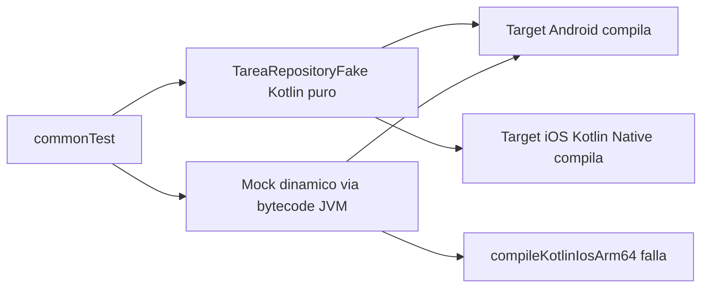
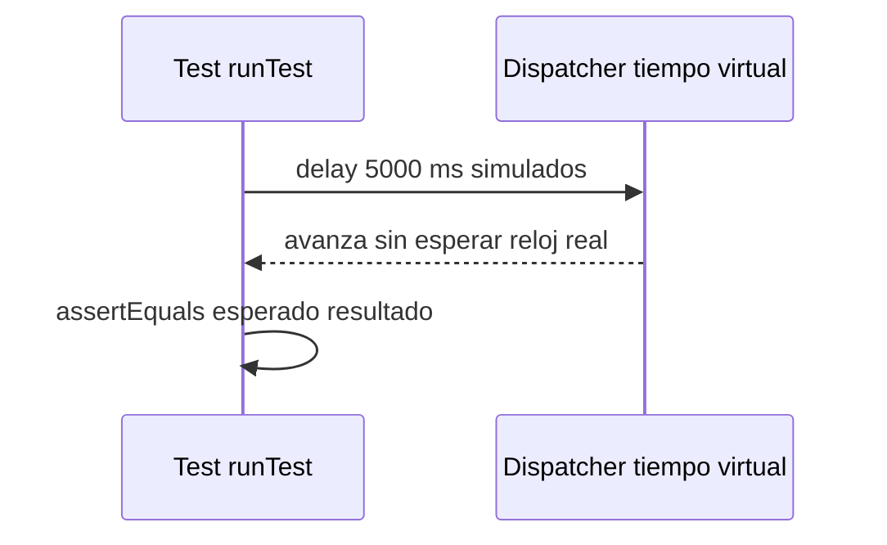

# Módulo 9: Testing multiplataforma


## Aprende construyendo

### Tema 1: kotlin.test en commonTest

#### Paso 1 · Objetivo y preparación
Al finalizar vas a escribir un test en `commonTest` que verifique `ObtenerTareasPendientesUseCase` (Módulo 4) una sola vez y lo ejecutes contra el target Android y el target iOS sin duplicar código. Prerrequisitos: JDK 17+, Kotlin, Gradle (`./gradlew --version`).

#### Paso 2 · Contexto y caso real
El equipo de tareas tiene duplicada la prueba del filtro de pendientes: una suite en Android con JUnit y otra en iOS con XCTest, ambas verificando la misma regla de negocio por separado, y ya divergieron ligeramente entre sí.

#### Paso 3 · Teoría, modelo mental y analogía
`kotlin.test` ofrece aserciones (`assertEquals`, `assertTrue`) que se compilan contra la implementación de testing de cada target, permitiendo escribir un único test en `commonTest` que corre de forma nativa en ambas plataformas. La analogía es una única inspección de calidad aplicada automáticamente a dos fábricas que siguen el mismo plano.

#### Paso 4 · Demostración guiada desde cero
```kotlin
class ObtenerTareasPendientesUseCaseTest {
    @Test
    fun filtraSoloPendientes() = runTest {
        val repoFake = TareaRepositoryFake(listOf(
            Tarea("1", "A", completada = false),
            Tarea("2", "B", completada = true),
        ))
        val resultado = ObtenerTareasPendientesUseCase(repoFake)()
        assertEquals(1, resultado.size)
    }
}
```
Resultado esperado: `./gradlew :shared:allTests` compila y ejecuta este mismo test contra el target de Android y contra el target de iOS (Kotlin/Native) de forma independiente, confirmando que ambos targets filtran exactamente 1 tarea pendiente sin ninguna diferencia de comportamiento entre plataformas.

#### Paso 5 · Práctica guiada
Pista: dejá la suite JUnit duplicada en `androidApp/src/test` y la suite XCTest duplicada en `iosApp` activas además de la nueva en `commonTest`. Ese es el fallo deliberado: ahora existen tres pruebas distintas de la misma regla, y cuando alguien corrige un bug en `ObtenerTareasPendientesUseCase`, solo actualiza dos de las tres, dejando una suite verde que verifica un comportamiento ya obsoleto.

#### Paso 6 · Práctica independiente
Corregí el Paso 5 eliminando las dos suites duplicadas específicas de plataforma, dejando `commonTest` como la única fuente de verdad para esta regla, y confirmá con `./gradlew :shared:allTests` que ambos targets siguen pasando con una sola suite.

#### Paso 7 · Cierre y evidencia
Entregá el test en `commonTest` del Paso 4, la triple duplicación detectada en el Paso 5, y la eliminación de las suites redundantes del Paso 6; explicá por qué una prueba de lógica compartida vive naturalmente en `commonTest` y no en cada plataforma. Siguiente paso: reemplazá cualquier mock específico de JVM por un fake compatible con todos los targets. Errores comunes: escribir el mismo test por separado en cada plataforma "por las dudas", no ejecutar `allTests` contra ambos targets antes de confiar en un cambio, y dejar pruebas obsoletas verdes que ya no reflejan el comportamiento real. Fuentes oficiales: https://kotlinlang.org/docs/multiplatform-run-tests.html y https://kotlinlang.org/api/latest/kotlin.test/.
**¿Por qué es importante?** Porque las pruebas compartidas reducen duplicación y detectan regresiones en todas las plataformas.
**Evidencia de aprendizaje:** entrega test en commonTest ejecutado contra ambos targets, triple duplicación detectada y suites redundantes eliminadas.
**Conceptos clave:** un único test, ejecutado contra ambos targets.

```kotlin
class ObtenerTareasPendientesUseCaseTest {
    @Test
    fun filtraSoloPendientes() = runTest {
        val repoFake = TareaRepositoryFake(listOf(
            Tarea("1", "A", completada = false),
            Tarea("2", "B", completada = true),
        ))
        val resultado = ObtenerTareasPendientesUseCase(repoFake)()
        assertEquals(1, resultado.size)
    }
}
```

Este test, escrito una única vez en el source set `commonTest` (el equivalente de `commonMain` pero para código de pruebas), se compila y ejecuta contra el target Android y contra el target iOS de forma completamente independiente, confirmando que la lógica del caso de uso `ObtenerTareasPendientesUseCase` (Módulo 4) se comporta de forma idéntica en ambas plataformas sin necesidad de duplicar el esfuerzo de escribir y mantener dos suites de pruebas separadas y potencialmente divergentes, una directa consecuencia de que la lógica bajo prueba en sí vive completamente en `commonMain` sin ningún código específico de plataforma que pudiera comportarse de forma distinta entre ambos targets.

Esta capacidad de "escribir una vez, probar en ambas plataformas" es el complemento natural de "escribir una vez, ejecutar en ambas plataformas" (el principio central de KMP estudiado desde el Módulo 3): si la lógica de negocio vive completamente en código compartido, las pruebas de esa lógica también pueden y deben vivir completamente en código compartido, obteniendo automáticamente el mismo beneficio de verificación dual sin trabajo adicional específico por plataforma.

**Analogía:** un test en `commonTest` es como una única inspección de calidad que se aplica automáticamente al producto fabricado en cualquiera de dos fábricas idénticas que siguen exactamente el mismo plano de fabricación, confirmando que ambas fábricas producen resultados consistentes sin necesidad de un inspector distinto y un criterio de evaluación separado para cada fábrica.

**¿Por qué es importante?** Un test escrito una única vez en `commonTest` confirma que la lógica compartida se comporta de forma idéntica en ambas plataformas, sin duplicar el esfuerzo de escribir y mantener suites de pruebas separadas por plataforma.

**Casos de uso reales:**
- Verificar `ObtenerTareasPendientesUseCase` (Módulo 4) una sola vez y confiar en que el resultado es idéntico en Android e iOS.
- Detectar en CI (Módulo 10) si un cambio en `commonMain` rompe la lógica compartida antes de compilar ambas apps completas.
- Cubrir reglas de negocio críticas (cálculo de precios, validaciones) con un único test suite mantenido por un solo equipo.

**Código del ejemplo:**

```kotlin
class ObtenerTareasPendientesUseCaseTest {
    @Test
    fun filtraSoloPendientes() = runTest {
        val repoFake = TareaRepositoryFake(listOf(
            Tarea("1", "A", completada = false),
            Tarea("2", "B", completada = true),
        ))
        val resultado = ObtenerTareasPendientesUseCase(repoFake)()
        assertEquals(1, resultado.size)
    }
}
```

### Tema 2: Fakes en vez de mocks

#### Paso 1 · Objetivo y preparación
Al finalizar vas a reemplazar un mock generado dinámicamente por un `TareaRepositoryFake` escrito a mano, compatible con cualquier target de Kotlin Multiplatform. Prerrequisitos: Tema 1 de este módulo.

#### Paso 2 · Contexto y caso real
Alguien del equipo intenta reusar en `commonTest` una librería de mocking que el equipo ya usaba en el proyecto Android puro — compila sin errores para el target Android, pero falla al intentar compilar el target de iOS.

#### Paso 3 · Teoría, modelo mental y analogía
Un fake es una implementación real y completa de la interfaz (`TareaRepository`) con comportamiento simplificado apropiado para pruebas; un mock generado dinámicamente depende de mecanismos específicos de la JVM (proxies dinámicos, bytecode) no disponibles en Kotlin/Native. La analogía es un maniquí de práctica funcional hecho con materiales universales, frente a un simulador que depende de tecnología de un laboratorio específico.

#### Paso 4 · Demostración guiada desde cero
```kotlin
class TareaRepositoryFake(private val datos: List<Tarea>) : TareaRepository {
    override suspend fun obtenerTodas() = datos
}
```
Resultado esperado: este fake compila y funciona de forma idéntica en el target Android y en el target iOS porque es código Kotlin ordinario sin ninguna dependencia de un runtime particular, a diferencia de un mock generado dinámicamente.

#### Paso 5 · Práctica guiada
Pista: agregá una dependencia de una librería de mocking típica de JVM al módulo `shared` para reemplazar el fake "y ahorrar código repetitivo". Ese es el fallo deliberado: `./gradlew :shared:compileKotlinIosArm64` falla porque esa librería no tiene implementación para el target de Kotlin/Native, bloqueando la compilación completa del módulo compartido para iOS.

#### Paso 6 · Práctica independiente
Corregí el Paso 5 quitando esa dependencia del módulo `shared` y restaurando el `TareaRepositoryFake` escrito a mano, y verificá que `./gradlew :shared:compileKotlinIosArm64` vuelve a compilar sin errores.

#### Paso 7 · Cierre y evidencia
Entregá el fake del Paso 4, el fallo de compilación de iOS del Paso 5, y la corrección del Paso 6; explicá por qué una dependencia de testing "conveniente" en un módulo `shared` puede bloquear la compilación de un target completo. Siguiente paso: usá `runTest` para probar específicamente la parte asíncrona de ese mismo repositorio. Errores comunes: agregar dependencias de testing específicas de JVM al módulo `shared`, escribir fakes con lógica tan compleja que necesitan sus propias pruebas, y no verificar la compilación de todos los targets después de agregar una dependencia nueva. Fuentes oficiales: https://kotlinlang.org/docs/multiplatform-run-tests.html y https://kotlinlang.org/docs/multiplatform-set-up-targets.html.
**¿Por qué es importante?** Porque las pruebas compartidas reducen duplicación y detectan regresiones en todas las plataformas.
**Evidencia de aprendizaje:** entrega fake funcionando en ambos targets, fallo de compilación de iOS reproducido y corrección verificada.
**Conceptos clave:** implementación real y simple, compatibilidad con todos los targets.

`class TareaRepositoryFake(private val datos: List<Tarea>) : TareaRepository { override suspend fun obtenerTodas() = datos }` es un fake: una implementación real y completa de la interfaz `TareaRepository` (Módulo 4), simplemente con un comportamiento simplificado apropiado específicamente para pruebas (devolver datos predefinidos en memoria, en vez de conectarse a red o base de datos real), en contraste con un mock generado dinámicamente por una librería de mocking (como Mockito, estudiado en el Módulo 9 del track de Java), que construye un objeto simulado en tiempo de ejecución mediante mecanismos como proxies dinámicos o generación de bytecode.

Preferir fakes sobre mocks en el contexto específico de `commonTest` tiene una razón técnica concreta: las librerías de mocking tradicionales dependen frecuentemente de mecanismos específicos de la JVM (como proxies dinámicos o manipulación de bytecode) que simplemente no están disponibles, o se comportan de forma distinta, en los demás targets de Kotlin/Native (como iOS); un fake, al ser código Kotlin ordinario y simple sin ninguna dependencia de mecanismos específicos de un runtime particular, funciona de forma idéntica y sin ninguna limitación especial en absolutamente cualquier target de Kotlin Multiplatform.

**Analogía:** un fake es como un maniquí de práctica completamente funcional para el propósito específico del entrenamiento, construido con materiales simples y universales; un mock generado dinámicamente es como un simulador sofisticado que depende de tecnología especializada disponible únicamente en ciertos laboratorios específicos, no reproducible fácilmente en cualquier ubicación.

**¿Por qué es importante?** Los fakes son código Kotlin ordinario compatible con cualquier target de Kotlin Multiplatform, mientras que las librerías de mocking tradicionales dependen frecuentemente de mecanismos específicos de la JVM no disponibles universalmente en todos los targets, incluyendo iOS.

**Casos de uso reales:**
- `TareaRepositoryFake` reutilizado en decenas de tests de distintos casos de uso, sin depender de una librería de mocking.
- Un `FakeApiClient` que simula respuestas de red exitosas y de error, sin levantar un servidor real ni Floci.
- Fakes compartidos entre el equipo Android y el equipo iOS, ya que ambos ejecutan exactamente los mismos tests de `commonTest`.

**Código del ejemplo:**

```kotlin
class TareaRepositoryFake(private val datos: List<Tarea>) : TareaRepository {
    override suspend fun obtenerTodas() = datos
}
```

El fake vive en `shared/src/commonTest/kotlin/com/academia/kmp/TareaRepositoryFake.kt`, junto a la prueba que lo usa. El siguiente diagrama contrasta por qué ese archivo compila igual en ambos targets mientras un mock dinámico de JVM no:



Esta regla de "fake por encima de mock" es la misma que aplica el proyecto integrador RutaFlow: `SyncEngine` (`examples/rutaflow/kotlin-multiplatform/SyncEngine.kt`) se prueba con un `Outbox` y un `DeliveryApi` fake, nunca con un mock de JVM, precisamente porque `SyncEngine` también debe compilar en el target iOS. Ejercicio de cierre: ejecutá `./gradlew :shared:compileKotlinIosArm64` después de restaurar el fake y confirmá en la salida que ya no aparece el error de bytecode.

### Tema 3: runTest para coroutines

#### Paso 1 · Objetivo y preparación
Al finalizar vas a escribir un test con `runTest` que verifique una función `suspend` con `delay()` interno, corriendo instantáneamente en tiempo real. Prerrequisitos: Tema 2 de este módulo.

#### Paso 2 · Contexto y caso real
La suite de tests de `commonTest` empezó a tardar notablemente más en CI a medida que el equipo agregó pruebas de funciones que simulan reintentos con backoff.

#### Paso 3 · Teoría, modelo mental y analogía
`runTest` gestiona un dispatcher de tiempo virtual: cualquier `delay()` dentro del código bajo prueba se "salta" automáticamente sin esperar ese tiempo en el reloj físico real. La analogía es un simulador de vuelo que prueba procedimientos de horas completas comprimidos a segundos reales.

#### Paso 4 · Demostración guiada desde cero
```kotlin
@Test
fun pruebaConDelay() = runTest {
    val resultado = funcionConDelay() // el delay() interno se "salta" en tiempo virtual
    assertEquals(esperado, resultado)
}
```
Resultado esperado: este test, que internamente simula un `delay(5000)` dentro de `funcionConDelay()`, corre en milisegundos reales de ejecución, no en los 5 segundos simulados.

#### Paso 5 · Práctica guiada
Pista: reemplazá el builder `runTest` por un builder de coroutines normal no especializado para testing (por ejemplo, `runBlocking`) "porque también compila y pasa". Ese es el fallo deliberado: sin el dispatcher de tiempo virtual, el `delay(5000)` interno ahora espera los 5 segundos reales completos, y una suite con varias pruebas de este tipo se vuelve progresivamente más lenta de ejecutar en CI a medida que el proyecto crece.

#### Paso 6 · Práctica independiente
Corregí el Paso 5 restaurando `runTest`, medí el tiempo real de ejecución de la suite completa antes y después del cambio (`time ./gradlew :shared:allTests`), y documentá la diferencia.

#### Paso 7 · Cierre y evidencia
Entregá el test con `runTest` del Paso 4, la suite lenta con `runBlocking` del Paso 5, y la medición de tiempo del Paso 6; explicá por qué un builder de coroutines "que también compila" no es intercambiable con uno diseñado específicamente para testing. Siguiente paso: automatizá esta suite completa en el pipeline de CI del próximo módulo. Errores comunes: usar un builder de coroutines genérico en vez de `runTest` para funciones con `delay()`, no medir el tiempo real de la suite antes de confiar en que "es rápida", y mezclar tiempo virtual con llamadas de red reales dentro del mismo test. Fuentes oficiales: https://kotlinlang.org/api/kotlinx.coroutines/kotlinx-coroutines-test/ y https://kotlinlang.org/docs/multiplatform-run-tests.html.
**¿Por qué es importante?** `runTest` permite que los tests de código con delays simulados corran instantáneamente en tiempo real, manteniendo la suite de pruebas rápida y ágil en CI incluso con lógica que internamente simula esperas prolongadas.
**Evidencia de aprendizaje:** entrega test con runTest, suite lenta con runBlocking reproducida y medición de tiempo documentada.
**Conceptos clave:** tiempo virtual, ejecución instantánea sin esperas reales.

`@Test fun pruebaConDelay() = runTest { val resultado = funcionConDelay(); assertEquals(esperado, resultado) }` envuelve el cuerpo de un test que involucra funciones `suspend` (Módulo 2) en un builder especializado (`runTest`) que gestiona un dispatcher de tiempo virtual: cualquier `delay()` interno invocado dentro del código bajo prueba se "salta" automáticamente sin esperar realmente ese tiempo en el reloj físico real, permitiendo que el test corra instantáneamente (en milisegundos reales de ejecución) incluso si la lógica bajo prueba contiene delays simulados de segundos o minutos completos.

Esta capacidad es crucial para mantener una suite de tests rápida y ágil: sin `runTest` (usando en cambio un builder de coroutines normal, no especializado para testing), cualquier `delay()` real dentro del código bajo prueba efectivamente pausaría la ejecución del test durante ese tiempo real completo, haciendo que una suite con muchos tests de este tipo se vuelva progresivamente más lenta de ejecutar a medida que crece, un problema que el tiempo virtual de `runTest` elimina completamente sin sacrificar la fidelidad de la prueba respecto al comportamiento real de la lógica bajo prueba.

**Analogía:** `runTest` es como un simulador de vuelo que permite probar procedimientos que en la realidad tomarían horas completas, comprimiendo ese tiempo a segundos reales sin alterar la validez de lo que efectivamente se está verificando en el procedimiento simulado.

**¿Por qué es importante?** `runTest` permite que los tests de código con delays simulados corran instantáneamente en tiempo real, manteniendo la suite de pruebas rápida y ágil incluso con lógica que internamente simula esperas prolongadas.

**Casos de uso reales:**
- Testear un mecanismo de reintento con backoff exponencial (varios segundos simulados) en milisegundos reales de test.
- Verificar timeouts de red configurados en el cliente Ktor (Módulo 5) sin esperar el timeout real completo.
- Mantener una suite de cientos de tests rápida en CI (Módulo 10) aunque varios simulen esperas de red o de UI.

**Código del ejemplo:**

```kotlin
@Test
fun pruebaConDelay() = runTest {
    val resultado = funcionConDelay() // el delay() interno se "salta" en tiempo virtual, el test corre instantáneo
    assertEquals(esperado, resultado)
}
```

Este test vive en `shared/src/commonTest/kotlin/com/academia/kmp/FuncionConDelayTest.kt`. El tiempo virtual que gestiona `runTest` se entiende mejor como una compresión de tiempo, no como una eliminación del `delay()`:



El proyecto integrador RutaFlow depende de esta misma técnica: `SyncEngine.drain()` (`examples/rutaflow/kotlin-multiplatform/SyncEngine.kt`) reintenta comandos con backoff, y su suite de `commonTest` usa `runTest` para que esos reintentos simulados no alarguen el pipeline de CI. Ejercicio: medí con Gradle (`./gradlew :shared:allTests`) cuánto tarda la suite si reemplazás `runTest` por `runBlocking` en un test con `delay(5000)`, y compará ese tiempo real contra la ejecución con `runTest`.

---


## Laboratorio práctico

**Objetivo del laboratorio:** construir una suite de tests sobre el módulo common que corre igual en Android e iOS.

**Requisitos previos:** Módulos 0-8 completados.

| Paso | Acción | Código | Explicación |
|---|---|---|---|
| 1 | Escribir un test con `kotlin.test` en `commonTest` | Ver Tema 1 | Sin depender de Android ni iOS |
| 2 | Usar un fake en vez de un mock | Ver Tema 2 | Aísla la prueba |
| 3 | Testear una función suspend con `runTest` | Ver Tema 3 | Tiempo virtual, sin esperas reales |
| 4 | Ejecutar la suite en el target Android y en el target iOS | — | Confirma que ambos pasan |

**Verificación:** el laboratorio se considera exitoso si la misma suite de tests pasa idénticamente al ejecutarse contra ambos targets, y si un test con `delay()` interno corre instantáneamente gracias a `runTest`.

**Errores comunes y soluciones**

- **Usar una librería de mocking dependiente de la JVM en `commonTest`.** Usa fakes, compatibles con cualquier target de Kotlin Multiplatform.
- **Olvidar `runTest` para tests con funciones suspend que usan `delay()`.** Sin él, el test esperaría el tiempo real completo, haciendo la suite lenta.
- **Duplicar la misma prueba por separado para Android e iOS.** Escríbela una única vez en `commonTest`, ejecutable contra ambos targets automáticamente.

---
