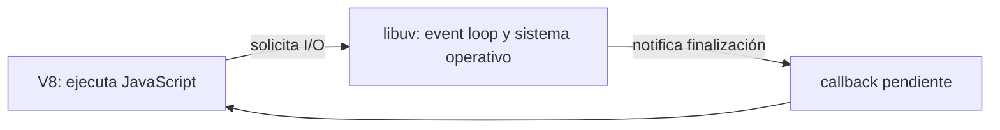
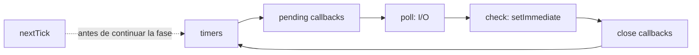

# Módulo 0: El runtime de Node — V8, libuv y el Event Loop


## Antes de comenzar: instala Node sin problemas de permisos

Instala una versión **LTS** de Node.js, Git y Visual Studio Code. Recomendamos un administrador de versiones porque más adelante distintos proyectos pueden requerir versiones distintas: `nvm-windows` en Windows y `nvm` en macOS/Linux.

- **Windows:** instala Git, VS Code y nvm-windows; abre PowerShell nuevo, ejecuta `nvm install lts` y `nvm use lts`.
- **macOS:** instala Homebrew/Git y luego `nvm`, o usa el instalador oficial de Node LTS.
- **Ubuntu/Debian:** instala Git con `apt` y Node LTS mediante `nvm`; evita el paquete `nodejs` antiguo de algunas distribuciones.

Verifica `node --version`, `npm --version` y `git --version`. Crea una carpeta y tu primer programa:

```bash
mkdir hola-node
cd hola-node
npm init -y
node -e "console.log('Node funciona', process.version)"
```

`npm init -y` crea `package.json`, el documento que describe el proyecto. Nunca copies `node_modules` ni lo subas a Git: se reconstruye con `npm install`. Si npm muestra `EACCES`, no lo arregles con `sudo`; reinstala Node con un administrador de versiones.

## Aprende construyendo

### Tema 1: Node no es "JavaScript en el servidor" sin más

**Objetivo:** Al finalizar este tema, podrás explicar qué responsabilidades tienen V8 y libuv, y demostrar con código por qué una operación de I/O no bloquea el hilo de JavaScript.

**Conceptos clave:** runtime, V8, libuv, I/O no bloqueante.

Node.js es un runtime de JavaScript construido combinando dos componentes con responsabilidades bien diferenciadas: V8, el motor de JavaScript de Google (el mismo que impulsa Chrome, estudiado en profundidad en el track de JavaScript), que compila y ejecuta el código JavaScript en sí; y libuv, una biblioteca escrita en C que proporciona el Event Loop y el acceso a operaciones de I/O (entrada/salida) no bloqueantes del sistema operativo subyacente —leer archivos, abrir conexiones de red, resolver DNS— capacidades que V8 por sí solo, diseñado originalmente para ejecutarse dentro de un navegador, no proporciona de forma nativa.

Esta arquitectura de dos capas es la razón exacta por la que Node puede manejar miles de conexiones simultáneas con un único hilo de JavaScript: cuando el código JavaScript solicita una operación de I/O (por ejemplo, leer un archivo), Node delega esa operación a libuv, que la ejecuta de forma asíncrona usando los mecanismos de I/O no bloqueante del sistema operativo (o, para ciertas operaciones que el sistema operativo no ofrece de forma asíncrona nativa, usando un pool de hilos internos gestionado por la propia libuv, invisible para el código JavaScript de la aplicación), liberando inmediatamente el hilo único de JavaScript para seguir procesando otro código mientras esa operación de I/O se completa en segundo plano.

Esta característica es fundamentalmente distinta del modelo de muchos runtimes de servidor tradicionales, que dedican un hilo del sistema operativo completo a cada conexión entrante, un modelo que escala pobremente con miles de conexiones simultáneas debido al coste de memoria y de cambio de contexto asociado a mantener tantos hilos activos. Node, al usar un único hilo de JavaScript combinado con I/O no bloqueante gestionado por libuv, puede sostener un volumen mucho mayor de conexiones concurrentes con una huella de memoria sustancialmente menor, siempre que el trabajo realizado en cada conexión sea predominantemente de I/O (esperar respuestas de una base de datos, de una API externa, de un sistema de archivos) y no de cómputo intensivo de CPU, un caso que bloquearía el único hilo de JavaScript disponible (el mismo problema estudiado en el Módulo 5 del track de JavaScript, ahora con implicaciones directas para un servidor que debe atender múltiples clientes simultáneamente).

Comprender esta arquitectura de dos capas —V8 ejecutando JavaScript, libuv gestionando I/O asíncrono y el Event Loop— es la base conceptual indispensable para todo lo demás en este track: explica tanto las fortalezas de Node (excelente para cargas de trabajo dominadas por I/O, como típicas APIs REST) como sus limitaciones (pobre para cómputo intensivo de CPU sostenido sin delegar ese trabajo a Worker Threads, estudiados en el Módulo 8).

**Analogía:** Node es como un único mesero extremadamente eficiente en un restaurante que, en vez de esperar de pie junto a la cocina hasta que cada plato individual esté listo (bloqueando su capacidad de atender a otros clientes mientras tanto), toma el pedido de una mesa, lo entrega a la cocina (libuv), y de inmediato atiende a la siguiente mesa mientras la cocina prepara el plato en paralelo, siendo notificado exactamente cuándo cada plato específico está listo para servir.

**¿Por qué es importante?** Entender que Node es I/O no bloqueante de un solo hilo (no "multi-hilo mágico") explica directamente por qué es excelente para APIs con mucho I/O y por qué el cómputo intensivo de CPU requiere una estrategia deliberada distinta (Worker Threads o clustering, Módulo 8).

**Diagrama:**



#### Paso 1 · Objetivo y preparación

Al finalizar podrás **demostrar**, no solo repetir, que V8 ejecuta JavaScript mientras Node delega el I/O. El conocimiento previo necesario es mínimo: crear archivos, usar `const`, importar un módulo y ejecutar un comando. Este ejemplo independiente comienza en una carpeta vacía y puede eliminarse al terminar.

#### Paso 2 · Contexto y caso real

En un caso real, una API debe leer datos y esperar servicios externos sin dejar de recibir solicitudes. Antes de construir un servidor completo, aislarás el runtime en un proyecto nuevo para reconocer si una operación espera I/O o bloquea el hilo con CPU.

#### Paso 3 · Teoría y analogía aplicada

La teoría anterior se resume en una regla operativa: iniciar I/O asíncrono devuelve el control a V8; terminar ese I/O agenda la continuación. En la analogía del restaurante, el mesero entrega la orden a cocina y sigue atendiendo. `await` pausa **esa función**, no congela el sistema operativo ni convierte la lectura en síncrona.

#### Paso 4 · Demostración guiada desde carpeta vacía

Desde la terminal crea la estructura del proyecto:

```bash
mkdir ejemplo-node-io
cd ejemplo-node-io
npm init -y
mkdir -p src/runtime
```

`npm` es el comando que gestiona el proyecto Node (`npm init -y` crea el `package.json` inicial); `node` es el comando que ejecuta el runtime sobre un archivo JavaScript. En Windows PowerShell, si `mkdir -p` falla, usa `New-Item -ItemType Directory -Force src/runtime`. Añade `"type": "module"` al nivel raíz de `package.json`; esta propiedad permite usar `import` en archivos `.js`.

Crea `src/runtime/io.js`:

```js
import { readFile } from "node:fs/promises";
import { performance } from "node:perf_hooks";

const inicio = performance.now();

// Inicia el trabajo de I/O, pero todavía no espera su resultado.
const lecturaPendiente = readFile(
  new URL("../../package.json", import.meta.url),
  "utf8",
);

console.log("1. V8 sigue disponible mientras libuv coordina la lectura");

// await suspende este módulo hasta que la promesa se resuelve.
const contenido = await lecturaPendiente;
const duracion = performance.now() - inicio;

console.log(`2. Lectura terminada: ${Buffer.byteLength(contenido)} bytes`);
console.log(`3. Duración aproximada: ${duracion.toFixed(2)} ms`);
```

La importación usa la API asíncrona de archivos; `new URL(..., import.meta.url)` resuelve una ruta estable desde el archivo actual; `lecturaPendiente` representa un resultado futuro; y `Buffer.byteLength` mide bytes reales, no caracteres. Desde la raíz de `ejemplo-node-io`, ejecuta:

```bash
node src/runtime/io.js
```

**Resultado esperado:** el mensaje `1. V8 sigue disponible...` siempre aparece antes de `2. Lectura terminada`. El número de bytes y el tiempo cambian según tu equipo; ese cambio no significa que el programa esté mal.

**Fallo deliberado y diagnóstico:** cambia la importación por `import { readFileSync } from "node:fs"`, reemplaza la promesa y el `await` por `const contenido = readFileSync(..., "utf8")`, y coloca el primer `console.log` después de esa llamada. Ahora no aparece ningún mensaje hasta terminar la lectura. No es un error de sintaxis: el diagnóstico es **bloqueo síncrono del hilo de JavaScript**. Revierte el cambio antes de continuar.

#### Paso 5 · Práctica guiada

Inicia tres lecturas del mismo archivo y resuélvelas con `Promise.all`. Antes de ejecutar, predice cuántas veces se imprimirá el resultado y dónde debe aparecer el mensaje “lecturas iniciadas”. **Pista:** crea primero un arreglo con tres promesas, imprime el mensaje y después usa `await Promise.all(promesas)`.

#### Paso 6 · Práctica independiente

Crea `src/runtime/cpu.js` con un bucle suficientemente grande, mide su duración y programa antes un `setTimeout(..., 0)`. Entrega la salida y explica por qué el timer espera al bucle aunque no exista I/O. Esa evidencia demuestra que distingues concurrencia de I/O y trabajo intensivo de CPU.

#### Paso 7 · Cierre y conexión

Ya puedes explicar con una salida observable qué ejecuta V8 y qué coordina Node. En el siguiente tema ubicarás callbacks, microtareas y timers en las fases del Event Loop. Conserva como evidencia el código y la salida; el próximo ejemplo comenzará desde cero.

**Errores comunes:** creer que `await` bloquea todo Node; usar APIs `Sync` dentro de una petición; atribuir cada operación a otro hilo de JavaScript; comparar tiempos sin repetir la prueba.

**Fuentes oficiales:** [Node.js: Event Loop](https://nodejs.org/en/learn/asynchronous-work/event-loop-timers-and-nexttick) y [`fs/promises`](https://nodejs.org/api/fs.html#promises-api).

### Tema 2: Fases del Event Loop de Node

**Objetivo:** Al finalizar este tema, podrás predecir y verificar el orden entre código síncrono, `nextTick`, promesas, timers, I/O y `setImmediate` sin memorizar una secuencia falsa.

**Conceptos clave:** timers, pending callbacks, poll, check, close callbacks.

El Event Loop de Node, aunque conceptualmente relacionado con el del navegador (estudiado en el Módulo 5 del track de JavaScript), tiene una estructura más elaborada, organizada en fases secuenciales que se ejecutan en un orden fijo y repetido en cada vuelta del ciclo. La fase de timers ejecuta los callbacks de `setTimeout` y `setInterval` cuyo tiempo ya expiró; la fase de pending callbacks ejecuta ciertos callbacks de operaciones del sistema diferidas de la vuelta anterior; la fase de poll es la más central, donde Node recupera nuevos eventos de I/O y ejecuta sus callbacks correspondientes (aquí es donde la mayoría de callbacks de red y de archivos se procesan), y puede bloquearse esperando nuevos eventos si no hay timers pendientes próximos a expirar; la fase de check ejecuta específicamente los callbacks registrados con `setImmediate`; y la fase de close callbacks maneja callbacks de cierre, como los de un socket cerrado.

`setImmediate(callback)` está diseñado específicamente para ejecutarse en la fase de check, inmediatamente después de que la fase de poll actual termine, lo que lo hace útil para ejecutar código deliberadamente después de que cualquier operación de I/O pendiente en el ciclo actual haya sido procesada. `process.nextTick(callback)`, a pesar de su nombre similar a un timer, no pertenece en absoluto a ninguna fase del Event Loop descrita: se procesa inmediatamente después de que la operación síncrona actual termine, antes de que el Event Loop continúe hacia su siguiente fase, dándole una prioridad incluso mayor que las microtasks de Promesas (que en Node se procesan justo después de la cola de `nextTick`, ambas antes de continuar hacia cualquier fase del Event Loop).

Esta jerarquía de prioridad —`process.nextTick` primero, luego microtasks de Promesas, y solo después las fases normales del Event Loop— es importante recordarla precisamente porque un uso excesivo o mal considerado de `process.nextTick` (por ejemplo, llamándolo recursivamente sin ningún límite) puede, en teoría, monopolizar el Event Loop indefinidamente, impidiendo que cualquier fase normal (incluyendo I/O) llegue a procesarse, un antipatrón conocido como "I/O starvation" (inanición de I/O) que vale la pena conocer para evitarlo deliberadamente en código de producción real.

El orden exacto entre `setTimeout(fn, 0)` y `setImmediate(fn)` es, de hecho, no determinista cuando ambos se programan desde el nivel superior del script (fuera de cualquier callback de I/O), porque depende de detalles de temporización del sistema operativo sobre cuánto tarda exactamente en iniciar el ciclo del Event Loop; sin embargo, dentro de un callback de I/O (por ejemplo, dentro de `fs.readFile(..., callback)`), el orden se vuelve determinista y predecible: `setImmediate` siempre se ejecuta antes que `setTimeout(fn, 0)` en ese contexto específico, porque la fase de check (donde vive `setImmediate`) ocurre inmediatamente después de la fase de poll donde ese callback de I/O se está ejecutando, mientras que la fase de timers ya pasó en esa vuelta del ciclo.

**Analogía:** las fases del Event Loop de Node son como las estaciones fijas y en orden de una ronda de inspección en una fábrica: primero se revisan los relojes vencidos (timers), luego los pendientes de la ronda anterior, luego se atiende el correo entrante (poll), luego los pendientes específicamente marcados como "revisar justo después del correo" (check), y finalmente los cierres. `process.nextTick` es como un mensaje urgente que se atiende inmediatamente al terminar cualquier tarea actual, antes incluso de continuar con la siguiente estación de la ronda.

**¿Por qué es importante?** Entender las fases del Event Loop de Node explica comportamientos de temporización que sorprenden a quien viene del navegador, y es esencial para diagnosticar correctamente problemas de orden de ejecución en aplicaciones Node reales.

**Diagrama:**



#### Paso 1 · Objetivo y preparación

Al finalizar podrás predecir el orden que **sí** garantiza Node y señalar el orden que depende del contexto. Como conocimiento previo basta reconocer una función callback y una promesa; este ejemplo independiente no necesita los archivos del tema anterior.

#### Paso 2 · Contexto y caso real

En una situación profesional, un servidor combina timers de reintento, respuestas de base de datos y mensajes de red. Si un callback monopoliza `nextTick`, el proceso sigue “encendido” pero deja de atender I/O. El experimento convierte ese riesgo en algo observable.

#### Paso 3 · Teoría y analogía aplicada

Usa la teoría y la analogía de la fábrica para razonar, no para memorizar una lista absoluta. Node termina el trabajo síncrono, vacía `nextTick`, procesa microtareas de promesas y continúa sus fases. Entre timer e immediate en el nivel superior no prometas un ganador; dentro de un callback de I/O, `setImmediate` entra en `check` antes del próximo ciclo de timers.

#### Paso 4 · Demostración guiada desde el código

Desde una carpeta vacía crea el proyecto nuevo y su archivo:

```bash
mkdir ejemplo-event-loop
cd ejemplo-event-loop
npm init -y
mkdir -p src/runtime
```

En PowerShell sustituye `mkdir -p src/runtime` por `New-Item -ItemType Directory -Force src/runtime`. Añade `"type": "module"` a `package.json` y crea `src/runtime/fases.js`:

```js
import { readFile } from "node:fs";

console.log("1. síncrono");

setTimeout(() => console.log("4/5. timer de nivel superior"), 0);
setImmediate(() => console.log("4/5. immediate de nivel superior"));
Promise.resolve().then(() => console.log("3. microtarea Promise"));
process.nextTick(() => console.log("2. cola nextTick"));

readFile(new URL("../../package.json", import.meta.url), () => {
  console.log("6. callback de I/O (fase poll)");

  // Estas dos colas se vacían antes de continuar a otra fase.
  process.nextTick(() => console.log("7. nextTick dentro de I/O"));
  Promise.resolve().then(() => console.log("8. Promise dentro de I/O"));

  // Desde poll, check ocurre antes que la próxima fase timers.
  setImmediate(() => console.log("9. immediate después de I/O"));
  setTimeout(() => console.log("10. timer después de I/O"), 0);
});
```

Los números `4/5` documentan que no existe un orden portable entre esas dos líneas. La segunda mitad sí crea un contexto controlado dentro de `poll`. Desde la raíz del proyecto, ejecuta:

```bash
node src/runtime/fases.js
```

**Salida esperada:** `1`, `2` y `3` aparecen en ese orden. Los mensajes `4/5` pueden intercambiarse. Después del callback `6`, aparecen `7`, `8`, `9` y `10` en ese orden.

**Fallo deliberado y diagnóstico:** añade temporalmente `const saturar = () => process.nextTick(saturar); saturar();`. El proceso deja de llegar al I/O. Deténlo con `Ctrl+C`. El diagnóstico es **inanición del Event Loop**, no lentitud del disco. Elimina esas líneas inmediatamente.

#### Paso 5 · Práctica guiada

Copia la salida en una tabla con columnas “mensaje”, “cola o fase” y “garantizado”. **Pista:** clasifica `nextTick` y promesas aparte de `timers`, `poll` y `check`; no marques `4/5` como orden garantizado.

#### Paso 6 · Práctica independiente

Añade dos archivos pequeños, lee ambos y registra sus callbacks. Ejecuta cinco veces y entrega las salidas junto con una explicación de qué orden puede variar. La evidencia debe separar claramente observación empírica de garantía contractual.

#### Paso 7 · Cierre y conexión

Ya puedes diagnosticar el orden sin inventar reglas. En el siguiente tema usarás `process` y módulos core para configurar otro proyecto nuevo. Tu evidencia es la tabla que distingue garantías de observaciones accidentales.

**Errores comunes:** asumir que `setTimeout(0)` es inmediato; confundir microtareas con fases; bloquear un callback de I/O; enseñar un orden accidental como contrato.

**Fuentes oficiales:** [Event Loop, timers y `nextTick`](https://nodejs.org/en/learn/asynchronous-work/event-loop-timers-and-nexttick) y [`process.nextTick`](https://nodejs.org/api/process.html#processnexttickcallback-args).

### Tema 3: process, global y módulos core

**Objetivo:** Al finalizar este tema, podrás leer configuración externa de manera segura, diagnosticar el runtime y usar módulos core con el prefijo `node:`.

**Conceptos clave:** el objeto `process`, `global`, módulos incluidos en Node.

El objeto `process`, disponible globalmente sin necesidad de importarlo, expone información y control sobre el proceso de Node actualmente en ejecución: `process.argv` contiene los argumentos de línea de comandos con los que se invocó el script; `process.env` expone las variables de entorno del sistema, el mecanismo estándar para inyectar configuración externa (como cadenas de conexión de base de datos, o el puerto en el que debe escuchar un servidor) sin necesidad de codificarla directamente en el código fuente; `process.version` y `process.platform` reportan la versión de Node y el sistema operativo subyacente respectivamente; y `process.exit(codigo)` termina el proceso explícitamente con un código de salida específico, útil en scripts de línea de comandos que necesitan comunicar éxito o fallo a quien los invocó.

`global` es el objeto global de Node, análogo conceptual a `window` en el navegador (estudiado en el Módulo 0 del track de JavaScript), aunque su uso directo es mucho menos común en código Node idiomático que el uso de `window` en código de navegador, precisamente porque Node fomenta el uso de módulos (Módulo 1 de este track) para compartir funcionalidad entre archivos, en vez de depender de variables verdaderamente globales compartidas implícitamente entre todo el código de la aplicación.

Node incluye un conjunto de módulos "core" (integrados directamente en el runtime, sin necesidad de instalarlos vía npm) que cubren funcionalidad fundamental del sistema: `os` expone información del sistema operativo (número de CPUs, memoria disponible, útil para decisiones de clustering en el Módulo 8); `buffer` maneja datos binarios crudos, una capacidad que JavaScript en el navegador no necesitaba tradicionalmente pero que es esencial para un runtime de servidor que procesa archivos y protocolos de red a bajo nivel; `crypto` proporciona funciones criptográficas (hashing, cifrado) directamente integradas, sin depender de una biblioteca externa para operaciones criptográficas básicas; `util` incluye utilidades variadas, incluyendo `util.promisify` (que convierte una función basada en callbacks al estilo Node clásico en una que devuelve una Promesa, un patrón mencionado en el Módulo 5 del track de JavaScript); `child_process` permite lanzar y comunicarse con otros procesos del sistema operativo; y `cluster`, que se estudiará en profundidad en el Módulo 8, permite bifurcar múltiples procesos Node para aprovechar múltiples núcleos de CPU.

Prefijar las importaciones de módulos core con `node:` (por ejemplo, `import { readFile } from "node:fs/promises";`) es la convención moderna recomendada, dejando explícito e inequívoco que el módulo importado es un módulo core de Node, y no un paquete de terceros instalado vía npm que coincidentemente tuviera un nombre similar, una ambigüedad que existía antes de que esta convención con prefijo se popularizara ampliamente en el ecosistema.

**Analogía:** `process` es como el panel de control y los indicadores de un vehículo, exponiendo información operativa (velocímetro, nivel de combustible) y controles directos (encender, apagar) sobre el vehículo mismo, en este caso el propio proceso de Node en ejecución; los módulos core son como el kit de herramientas de fábrica que viene incluido con el vehículo desde el concesionario, sin necesidad de comprarlas por separado en una tienda externa.

**¿Por qué es importante?** `process` y los módulos core proporcionan las capacidades fundamentales de un runtime de servidor (acceso a variables de entorno, información del sistema, datos binarios, criptografía) que JavaScript en el navegador nunca necesitó exponer de la misma forma directa.

**Código del ejemplo:**

```js
process.argv;         // argumentos de línea de comandos
process.env.PORT;     // variables de entorno externas (configuración)
process.version;      // versión de Node en ejecución

import { readFile } from "node:fs/promises"; // convención moderna con prefijo node:
import os from "node:os";
os.cpus().length; // número de núcleos disponibles, relevante para clustering
```

#### Paso 1 · Objetivo y preparación

Al finalizar podrás construir una configuración validada con `process.env`, leer argumentos y usar módulos core sin instalar paquetes. Los prerrequisitos son comprender imports ESM y distinguir número de texto; este ejemplo independiente comienza desde una carpeta vacía.

#### Paso 2 · Contexto y caso real

En un caso real, el mismo servicio se ejecuta en desarrollo, pruebas y producción, pero cambian puerto, región y nivel de logs. La lógica no debe recibir valores inválidos ni conocer todas las variables del sistema: crearás una frontera segura.

#### Paso 3 · Teoría y analogía aplicada

`process` es el panel del proceso actual; `process.env` siempre entrega cadenas o `undefined`, no números validados. En la analogía del vehículo, leer el tablero no basta: primero se comprueba que el indicador esté dentro de un rango seguro. `globalThis` existe, pero compartir estado global oculta dependencias; los módulos explícitos hacen visible quién usa cada dato.

#### Paso 4 · Demostración guiada con validación

Desde una carpeta vacía crea el proyecto nuevo:

```bash
mkdir ejemplo-config-node
cd ejemplo-config-node
npm init -y
mkdir -p src/config src/cli
```

En PowerShell crea ambas carpetas con `New-Item -ItemType Directory -Force src/config,src/cli`. Añade `"type": "module"` a `package.json` y crea `src/config/entorno.js`:

```js
const MODOS_VALIDOS = new Set(["development", "test", "production"]);

function leerPuerto(valor) {
  const puerto = Number(valor ?? 3000);

  // Number.isInteger evita aceptar decimales o texto convertido en NaN.
  if (!Number.isInteger(puerto) || puerto < 1 || puerto > 65_535) {
    throw new Error("PORT debe ser un entero entre 1 y 65535");
  }
  return puerto;
}

function leerModo(valor) {
  const modo = valor ?? "development";
  if (!MODOS_VALIDOS.has(modo)) {
    throw new Error(`NODE_ENV inválido: ${modo}`);
  }
  return modo;
}

// Object.freeze impide cambios accidentales en el primer nivel.
export const config = Object.freeze({
  port: leerPuerto(process.env.PORT),
  environment: leerModo(process.env.NODE_ENV),
});
```

Crea `src/cli/diagnostico.js`:

```js
import os from "node:os";
import path from "node:path";
import { config } from "../config/entorno.js";

const region = process.argv.find((arg) => arg.startsWith("--region="))
  ?.split("=")[1] ?? "sin-definir";

// Solo imprimimos una lista permitida; nunca todo process.env.
console.log({
  node: process.version,
  platform: process.platform,
  cpus: os.availableParallelism(),
  project: path.basename(process.cwd()),
  port: config.port,
  environment: config.environment,
  region,
});
```

En macOS o Linux ejecuta:

```bash
PORT=4000 NODE_ENV=development node src/cli/diagnostico.js --region=co
```

En Windows PowerShell ejecuta:

```bash
$env:PORT=4000; $env:NODE_ENV="development"; node src/cli/diagnostico.js --region=co
```

`--region` es un argumento propio del script (no una bandera de `node`): el código lo busca manualmente dentro de `process.argv` para extraer el valor después del signo `=`.

**Resultado esperado:** aparece un objeto con `port: 4000`, `environment: 'development'` y `region: 'co'`. La versión, plataforma y cantidad de CPU dependen de tu máquina.

**Fallo deliberado y diagnóstico:** ejecuta con `PORT=texto` (o `$env:PORT="texto"` en PowerShell). Debes ver `PORT debe ser un entero entre 1 y 65535` y un código de salida diferente de cero. El diagnóstico indica una configuración externa inválida antes de abrir el servidor; no la “corrijas” usando un valor silencioso.

#### Paso 5 · Práctica guiada

Añade `LOG_LEVEL` con valores `debug`, `info`, `warn` y `error`. **Pista:** replica el patrón `Set` de `NODE_ENV` y conserva un valor predeterminado explícito. Prueba un valor correcto y otro incorrecto.

#### Paso 6 · Práctica independiente

Crea una clave obligatoria `DATABASE_URL` sin imprimir su contenido. Entrega dos ejecuciones: una sin la variable que falle de forma clara y otra válida que solo muestre `databaseConfigured: true`. Esa salida demuestra validación sin filtrar secretos.

#### Paso 7 · Cierre y conexión

Ya construiste una frontera de configuración reproducible. En el siguiente tema desacoplarás efectos mediante eventos en otro ejemplo desde cero. La evidencia debe demostrar validación sin revelar secretos.

**Errores comunes:** imprimir `process.env`; creer que `PORT` ya es número; llamar `process.exit()` desde lógica de dominio; guardar secretos en Git; usar estado global mutable.

**Fuentes oficiales:** [`process`](https://nodejs.org/api/process.html), [`os`](https://nodejs.org/api/os.html) y [`path`](https://nodejs.org/api/path.html).

### Tema 4: Event-driven architecture y non-blocking I/O

**Objetivo:** Al finalizar este tema, podrás publicar y consumir un evento interno, limpiar sus listeners y decidir cuándo una llamada directa comunica mejor el contrato.

**Conceptos clave:** arquitectura orientada a eventos, `EventEmitter`, no bloqueo como principio de diseño.

Node adopta de forma sistemática una arquitectura orientada a eventos como patrón de diseño central, no solo como un detalle de implementación aislado del Event Loop: gran parte de la API core de Node (streams, servidores HTTP, procesos hijo) se construye sobre `EventEmitter`, una clase base que permite a un objeto emitir eventos con nombre (`emitter.emit("dato", valor)`) y registrar listeners para reaccionar a ellos (`emitter.on("dato", callback)`), un patrón que se repite consistentemente a través de prácticamente toda la superficie de la API de Node, y que las bibliotecas del ecosistema (Express, estudiado en el Módulo 4) también adoptan como convención familiar y predecible.

El principio de no bloqueo, mencionado en el Tema 1, se extiende como una convención de diseño que atraviesa el ecosistema completo de Node: las APIs asíncronas son la norma esperada y preferida, y las versiones síncronas de operaciones de I/O (como `fs.readFileSync`) existen deliberadamente como la excepción, reservadas para contextos específicos donde el bloqueo es aceptable o incluso deseable (como scripts de configuración ejecutados una sola vez al inicio de un proceso, antes de que el servidor empiece a atender tráfico real), pero desaconsejadas explícitamente dentro del código que maneja peticiones activas de un servidor en producción, donde bloquear el único hilo de JavaScript detendría el procesamiento de cualquier otra petición concurrente mientras esa operación síncrona se completa.

Esta convención de "asíncrono por defecto, síncrono como excepción deliberada" es una diferencia cultural importante frente a otros lenguajes de servidor donde el modelo predominante es sincrónico con concurrencia gestionada mediante múltiples hilos del sistema operativo; en Node, escribir código bloqueante dentro del camino crítico de una petición HTTP es un error de diseño con impacto directo y medible en la capacidad del servidor de atender múltiples clientes simultáneamente, no simplemente una preferencia estilística sin consecuencias prácticas reales.

Reconocer esta arquitectura orientada a eventos y el principio de no bloqueo como los dos pilares de diseño que unifican prácticamente toda la superficie de la API de Node —desde el manejo de streams (Módulo 2) hasta los servidores HTTP (Módulo 3)— proporciona un marco conceptual coherente para anticipar cómo se comportará y cómo debería usarse correctamente cualquier API nueva de Node que se encuentre por primera vez, incluso sin haberla usado nunca antes.

**Analogía:** la arquitectura orientada a eventos de Node es como un sistema de notificaciones de una oficina moderna, donde en vez de que cada empleado deba consultar activa y repetidamente el estado de cada tarea pendiente (sondeo costoso), cada empleado simplemente se suscribe a notificaciones específicas relevantes para su trabajo, y es notificado automáticamente exactamente cuándo ocurre el evento que le interesa, sin desperdiciar tiempo revisando constantemente algo que aún no ha cambiado.

**¿Por qué es importante?** Reconocer la arquitectura orientada a eventos y el no bloqueo como los principios de diseño unificadores de Node da un marco predictivo para entender rápidamente cualquier nueva API del ecosistema, y explica por qué código bloqueante en el camino crítico de una petición es un error de diseño serio, no solo una preferencia de estilo.

**Código del ejemplo:**

```js
import { EventEmitter } from "node:events";
const emisor = new EventEmitter();
emisor.on("dato", (valor) => console.log("recibido:", valor));
emisor.emit("dato", 42); // "recibido: 42"
// El mismo patrón subyace a streams, servidores HTTP, procesos hijo, etc.
```

#### Paso 1 · Objetivo y preparación

Al finalizar podrás publicar un evento, registrar y retirar listeners, y explicar por qué `emit()` no vuelve asíncrono el código automáticamente. Como conocimiento previo necesitas funciones, módulos y el modelo de Event Loop del tema anterior.

#### Paso 2 · Contexto y caso real

En un caso profesional, cuando una compra se confirma puede ser necesario auditar, notificar y actualizar métricas. El caso de uso principal no debería importar directamente cada efecto secundario. El ejemplo introduce un bus **interno al proceso**; no reemplaza una cola durable entre servicios.

#### Paso 3 · Teoría y analogía aplicada

`EventEmitter` aplica publicación/suscripción: el emisor conoce el nombre del hecho, no todos sus consumidores. En la analogía de la oficina, una notificación avisa a los suscriptores. Sin embargo, Node llama los listeners de `emit()` de manera síncrona y en orden de registro; un listener con CPU pesada bloquea a los demás. El I/O que ese listener inicie sí puede continuar de forma asíncrona.

#### Paso 4 · Demostración guiada con ciclo de vida

Desde una carpeta vacía crea el proyecto nuevo:

```bash
mkdir ejemplo-event-emitter
cd ejemplo-event-emitter
npm init -y
mkdir -p src/eventos
```

En PowerShell usa `New-Item -ItemType Directory -Force src/eventos`. Añade `"type": "module"` a `package.json` y crea `src/eventos/bus-entregas.js`:

```js
import { EventEmitter } from "node:events";
import { appendFile } from "node:fs/promises";

export function crearBusEntregas() {
  const bus = new EventEmitter({ captureRejections: true });

  // Un evento 'error' sin listener terminaría el proceso.
  bus.on("error", (error) => {
    console.error("Fallo controlado en listener:", error.message);
  });

  return bus;
}

export function conectarAuditoria(bus) {
  const auditar = ({ guia, estado }) => {
    // El listener inicia I/O y devuelve la promesa al emisor.
    return appendFile("auditoria.log", `${guia},${estado}\n`, "utf8");
  };

  bus.on("entrega.actualizada", auditar);

  // Devolver cleanup evita listeners acumulados en pruebas o reinicios.
  return () => bus.off("entrega.actualizada", auditar);
}

const bus = crearBusEntregas();
const desconectar = conectarAuditoria(bus);

console.log("1. antes de emitir");
bus.emit("entrega.actualizada", { guia: "RF-100", estado: "en-ruta" });
console.log("2. emit terminó; la escritura puede seguir pendiente");

desconectar();
console.log("3. listeners activos:", bus.listenerCount("entrega.actualizada"));
```

`captureRejections` dirige promesas rechazadas por listeners hacia el evento `error`; `off` necesita la misma referencia de función registrada; `listenerCount` hace observable la limpieza. Desde la raíz del proyecto, ejecuta:

```bash
node src/eventos/bus-entregas.js
```

**Resultado esperado:** aparecen los mensajes `1`, `2` y `3`; el último informa `0` listeners. También se crea `auditoria.log` con `RF-100,en-ruta`. El log `2` puede aparecer antes de terminar la escritura porque el listener inició I/O no bloqueante.

**Fallo deliberado y diagnóstico:** comenta el listener `bus.on("error", ...)` y, antes de `desconectar()`, añade `bus.emit("error", new Error("prueba controlada"))`. Node termina con `Unhandled 'error' event`. El diagnóstico no es “EventEmitter está roto”: falta el contrato especial de manejo de `error`. Revierte el cambio.

#### Paso 5 · Práctica guiada

Añade un listener `once("sistema.iniciado", ...)` y emite dos veces. **Pista:** verifica con un contador que el listener de inicialización se ejecuta exactamente una vez, aunque el evento se publique dos veces.

#### Paso 6 · Práctica independiente

Conecta un listener de notificación, ejecuta una actualización, retíralo y ejecuta otra. Entrega la salida con el conteo de listeners y explica por qué registrar listeners dentro de cada petición produciría duplicados y fugas de memoria.

#### Paso 7 · Cierre y conexión

Construiste eventos internos observables, con errores y limpieza explícitos. En el siguiente módulo organizarás scripts, dependencias y módulos mediante ejemplos independientes. Más adelante distinguirás este patrón de una cola durable entre servicios.

**Errores comunes:** suponer que `emit` es asíncrono; emitir `error` sin listener; registrar listeners por petición; usar eventos donde una llamada directa expresa mejor el contrato; confundir EventEmitter con mensajería durable.

**Fuentes oficiales:** [`EventEmitter`](https://nodejs.org/api/events.html) y [no bloquear el Event Loop](https://nodejs.org/en/learn/asynchronous-work/dont-block-the-event-loop).

---

## Ruta de proyecto progresivo desde carpeta vacía

No crees un proyecto desechable por módulo. Conserva un único repositorio que evoluciona durante todo el track y etiqueta cada hito (`git tag modulo-N`). Empieza con `mkdir academia-node && cd academia-node && git init && npm init -y`. Ejecuta el comando paso a paso, inspecciona los archivos generados y registra versiones y precondiciones en el README.

| Hito | Evolución acumulativa | Evidencia antes de avanzar |
|---|---|---|
| Base | CLI y HTTP. | Arranque reproducible, commit limpio y prueba mínima. |
| Aplicación | API, datos y autenticación. | Casos normales, límite y error automatizados. |
| Integración | Conecta capas y reemplaza dobles por infraestructura controlada. | Diagrama, contratos y prueba de integración. |
| Experto | observabilidad, resiliencia y operación. | Perfil o threat model, telemetría y runbook de recuperación. |

Al iniciar cada laboratorio crea una rama `modulo-N`, implementa el incremento, verifica el criterio de éxito y fusiona solo con pruebas verdes. Si un módulo necesita un experimento aislado, colócalo en `experiments/modulo-N/`; el producto acumulativo permanece ejecutable. Al terminar, otra persona debe poder clonar el repositorio y reproducir el último hito siguiendo únicamente el README.


## Construcción guiada del capítulo

**Objetivo del laboratorio:** predecir y verificar el orden exacto de ejecución entre `setTimeout`, `setImmediate` y `process.nextTick`, y explorar el objeto `process` y los módulos core.

**Requisitos previos:** Node.js instalado, terminal.

| Paso | Acción | Comando/Código | Explicación |
|---|---|---|---|
| 1 | Ejecutar un script y el REPL | `node script.js`, luego `node` a secas | Compara ejecución de archivo con exploración interactiva |
| 2 | Mezclar `console.log`, `setTimeout`, `setImmediate`, `process.nextTick` | Predice el orden ANTES de ejecutar | Verifica tu predicción contra el resultado real |
| 3 | Inspeccionar `process` | `process.version`, `process.platform`, `process.argv` | Entiende qué expone cada propiedad |
| 4 | Leer una variable de entorno propia | `PORT=4000 node script.js` con `process.env.PORT` | Verifica la inyección de configuración externa |
| 5 | Comparar el orden dentro de un callback de I/O | Mismo ejemplo del paso 2 pero dentro de `fs.readFile(..., callback)` | Verifica que el orden se vuelve determinista dentro de I/O |

**Verificación:** el laboratorio se considera exitoso si la predicción del paso 2 (hecha antes de ejecutar) se corrige correctamente tras el resultado real, y si el paso 5 confirma que `setImmediate` se ejecuta de forma determinista antes que `setTimeout(fn, 0)` dentro de un callback de I/O.

### Comprueba lo construido

#### Ejercicio verificable 1

¿Qué componente ejecuta el código JavaScript dentro de Node?

**Respuesta esperada:** V8

#### Ejercicio verificable 2

¿Qué función tiene prioridad antes de continuar con una fase del Event Loop de Node?

**Respuesta esperada:** process.nextTick|nextTick|process.nextTick()

#### Ejercicio verificable 3

¿Qué prefijo moderno identifica inequívocamente un módulo core?

**Respuesta esperada:** node:|node

**Errores comunes y soluciones**

- **Asumir que `setTimeout(fn, 0)` y `setImmediate(fn)` siempre tienen un orden fijo.** Fuera de un callback de I/O, el orden entre ambos no es determinista; dentro de un callback de I/O, `setImmediate` siempre gana.
- **Usar `process.nextTick` recursivamente sin límite.** Esto puede monopolizar el Event Loop indefinidamente (I/O starvation); evita la recursión no acotada de `nextTick`.
- **Confundir `global` con el uso idiomático de módulos.** Node fomenta módulos explícitos sobre variables verdaderamente globales; reserva `global` para casos muy específicos.

---
