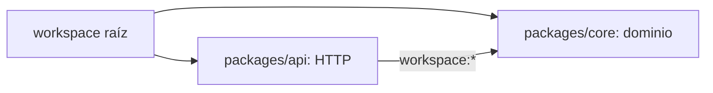

# Módulo 1: Módulos, npm/pnpm y gestión de dependencias


## Aprende construyendo

### Tema 1: package.json y semver

**Objetivo:** Al finalizar este tema, podrás clasificar dependencias, interpretar rangos semver y justificar qué actualizaciones acepta un servicio Node.

**Conceptos clave:** versionado semántico, rangos de versión, `dependencies` frente a `devDependencies`.

`package.json` es el archivo de manifiesto central de cualquier proyecto Node, declarando su nombre, versión, dependencias y scripts. El versionado semántico (semver) estructura los números de versión como `MAYOR.MENOR.PARCHE`, con una convención bien establecida sobre qué tipo de cambio justifica incrementar cada parte: un incremento de versión mayor señala cambios incompatibles con versiones anteriores (breaking changes); un incremento de versión menor señala nueva funcionalidad compatible hacia atrás; un incremento de parche señala correcciones de errores compatibles. Esta convención, aunque depende de que cada autor de paquete la respete honestamente (no hay ninguna verificación automática que garantice que un paquete realmente cumple lo que su número de versión promete), es ampliamente seguida en el ecosistema npm y es la base sobre la que operan los rangos de versión.

Los prefijos en los rangos de versión de `package.json` controlan qué actualizaciones automáticas se permiten al instalar: `^4.19.0` (caret) acepta cualquier actualización menor o de parche mientras el número mayor permanezca en `4` (es decir, `4.x.x` para cualquier `x`, pero nunca `5.0.0`), siendo el prefijo por defecto y más comúnmente usado, bajo la expectativa de que las actualizaciones menores y de parche son seguras según la convención de semver; `~4.19.0` (tilde) es más conservador, aceptando únicamente actualizaciones de parche (`4.19.x`); y una versión exacta sin ningún prefijo (`4.19.0`) fija ese número exacto, sin permitir ninguna actualización automática en absoluto, apropiado cuando se necesita máxima previsibilidad a costa de tener que actualizar manualmente cada vez.

La distinción entre `dependencies` y `devDependencies` en `package.json` comunica una diferencia semántica importante sobre el ciclo de vida del proyecto: `dependencies` lista paquetes necesarios para que la aplicación funcione en producción (como Express, si la aplicación es un servidor web); `devDependencies` lista paquetes necesarios únicamente durante el desarrollo (como Vitest para testing, o ESLint para análisis estático), que no necesitan estar presentes en el entorno de producción final. Esta distinción tiene un efecto práctico directo al construir una imagen de contenedor de producción (como se vio en el Módulo 11 del track DevOps y se verá en el Módulo 11 de este mismo track): instalar únicamente con `npm ci --omit=dev` excluye las `devDependencies`, reduciendo el tamaño final de la imagen y su superficie de dependencias innecesarias en producción.

**Analogía:** semver es como un sistema de semáforos para cambios de software: verde (parche) significa "cambio seguro, sin ninguna acción requerida de tu parte"; amarillo (menor) significa "algo nuevo se añadió, pero nada de lo que ya usabas debería romperse"; rojo (mayor) significa "detente y revisa, algo que dependías podría haber cambiado de forma incompatible".

**¿Por qué es importante?** Entender semver y los rangos de versión permite tomar decisiones informadas sobre cuánta actualización automática aceptar en un proyecto, equilibrando la comodidad de recibir correcciones automáticamente contra el riesgo de una actualización inesperada que rompa algo.

**Configuración del ejemplo:**

```json
{
  "dependencies": { "express": "^4.19.0" },   // acepta 4.x.x, nunca 5.0.0
  "devDependencies": { "vitest": "^2.0.0" }   // solo necesario en desarrollo
}
```

#### Paso 1 · Objetivo y preparación

Al finalizar podrás justificar cada dependencia y predecir qué versiones admite un rango. Los prerrequisitos son únicamente Node LTS y npm; este ejemplo independiente empieza en una carpeta vacía.

#### Paso 2 · Contexto y caso real

En un caso real, un servicio necesita Express al ejecutar y Vitest solo al desarrollar. `package.json` funciona como contrato operativo: runtime, comandos y política de actualización quedan visibles para personas, CI y contenedores.

#### Paso 3 · Teoría y analogía aplicada

Aplica la teoría y la analogía del semáforo con cautela: semver comunica intención del autor, pero no prueba compatibilidad. El rango decide candidatos; el lockfile del próximo tema fija la versión realmente instalada. Una dependencia de producción ausente rompe el servicio; una herramienta de desarrollo omitida en producción es normal.

#### Paso 4 · Demostración guiada del manifiesto

Crea `ejemplo-package-json/package.json` como parte de un proyecto nuevo desde una carpeta vacía y deja que npm escriba JSON válido y versiones existentes:

```bash
mkdir ejemplo-package-json
cd ejemplo-package-json
npm init -y
npm install express
npm install --save-dev vitest
npm pkg set type=module engines.node=">=20" scripts.start="node src/main.js" scripts.test="vitest run"
```

Revisa `package.json`. Su forma relevante será similar a esta; las versiones concretas pueden ser más nuevas:

```json
{
  "type": "module",
  "engines": { "node": ">=20" },
  "scripts": {
    "start": "node src/main.js",
    "test": "vitest run"
  },
  "dependencies": { "express": "^5.0.0" },
  "devDependencies": { "vitest": "^3.0.0" }
}
```

JSON no admite comentarios: por eso las explicaciones están fuera del archivo. `express` pertenece al runtime; `vitest`, al proceso de desarrollo. Inspecciona lo guardado:

```bash
npm pkg get engines scripts dependencies devDependencies
npm outdated
```

**Resultado esperado:** Express aparece únicamente en `dependencies`, Vitest en `devDependencies`, y cada script queda como una cadena. `npm outdated` puede no mostrar nada si todo está actualizado.

**Fallo deliberado y diagnóstico:** mueve temporalmente Express a `devDependencies`, ejecuta una instalación de producción en una copia del proyecto con `npm ci --omit=dev` y luego `npm start`. El error `ERR_MODULE_NOT_FOUND` demuestra que clasificaste mal una dependencia de runtime. Revierte el cambio y regenera el lockfile.

#### Paso 5 · Práctica guiada

Predice si `^4.19.0` admite `4.20.0` y `5.0.0`, y si `~4.19.0` admite `4.20.0`. **Pista:** `^` conserva el primer componente distinto de cero; `~` conserva mayor y menor.

#### Paso 6 · Práctica independiente

Añade un script `check:runtime` que imprima la versión de Node y un archivo `.nvmrc` con la mayor LTS elegida. Entrega `npm pkg get scripts engines` y explica por qué `engines` avisa pero el gestor puede requerir configuración adicional para imponerlo.

#### Paso 7 · Cierre y conexión

Ya puedes leer el manifiesto como contrato. El siguiente tema fijará el árbol transitivo exacto en otro proyecto nuevo. Una actualización compatible solo se acepta con lockfile, pruebas y revisión.

**Errores comunes:** escribir comentarios en JSON; usar `latest` sin control; confundir rango con versión instalada; clasificar una librería de runtime como desarrollo; asumir que semver garantiza calidad.

**Fuentes oficiales:** [`package.json`](https://docs.npmjs.com/cli/configuring-npm/package-json), [semver de npm](https://docs.npmjs.com/about-semantic-versioning) y [`npm install`](https://docs.npmjs.com/cli/commands/npm-install).

### Tema 2: Lockfiles e instalación reproducible

**Objetivo:** Al finalizar este tema, podrás reproducir exactamente una instalación y diagnosticar una desincronización entre manifiesto y lockfile.

**Conceptos clave:** `package-lock.json`, dependencias transitivas, `npm ci` frente a `npm install`.

Un lockfile (`package-lock.json` para npm, `pnpm-lock.yaml` para pnpm) congela el árbol completo y exacto de dependencias que se instaló en un momento dado, incluyendo no solo las dependencias directas declaradas en `package.json`, sino también todas las dependencias transitivas (las dependencias de las dependencias, que pueden extenderse varios niveles de profundidad). Esto resuelve un problema real de reproducibilidad: sin un lockfile, dos instalaciones del mismo `package.json` en momentos distintos podrían resolver rangos de versión (como `^4.19.0`) hacia versiones específicas distintas si el paquete publicó una nueva versión menor o de parche entre ambas instalaciones, potencialmente introduciendo un comportamiento distinto (o incluso un bug) sin que el `package.json` en sí haya cambiado en absoluto.

`npm install` respeta el lockfile existente si está presente y es compatible con el `package.json` actual, pero puede actualizarlo si detecta que necesita resolver algo nuevo (por ejemplo, si se añadió una dependencia nueva a `package.json` desde la última vez que se generó el lockfile). `npm ci` (de "clean install"), en cambio, instala exactamente lo que el lockfile especifica, sin ninguna resolución adicional, y falla explícitamente con un error si el lockfile no está sincronizado con `package.json` (por ejemplo, si alguien añadió una dependencia al `package.json` sin regenerar el lockfile correspondiente), en vez de intentar resolverlo silenciosamente como haría `npm install`.

Esta diferencia hace que `npm ci` sea la elección correcta y recomendada para entornos de integración continua (CI) y de producción: garantiza que exactamente las mismas versiones que un desarrollador probó localmente (y que quedaron registradas en el lockfile committeado al repositorio) son las que se instalan en el pipeline de CI y en el despliegue final, eliminando la categoría de bugs "funciona en mi máquina pero no en producción" causada específicamente por diferencias de versiones de dependencias transitivas entre distintos entornos. Además, `npm ci` es típicamente más rápido que `npm install` en estos contextos, porque omite parte del trabajo de resolución de versiones al confiar completamente en lo que el lockfile ya especifica con precisión.

Committear siempre el lockfile al control de versiones (nunca añadirlo a `.gitignore`) es una práctica fundamental y no negociable para cualquier proyecto que dependa de paquetes externos: sin el lockfile versionado, cada colaborador del equipo, y cada ejecución del pipeline de CI, podría terminar con un árbol de dependencias transitivas ligeramente distinto, sembrando la posibilidad de bugs difíciles de diagnosticar que solo se manifiestan en algunos entornos y no en otros.

**Analogía:** un lockfile es como una lista de ingredientes exacta y detallada (marca específica, lote específico) que un restaurante usó para preparar un plato específico que resultó perfecto; sin esa lista exacta, volver a preparar "el mismo plato" usando solo la receta general (equivalente al `package.json` sin lockfile) podría producir resultados ligeramente distintos si los ingredientes genéricos disponibles cambiaron de proveedor entre una preparación y otra.

**¿Por qué es importante?** El lockfile es la garantía de reproducibilidad exacta entre el entorno de desarrollo, el pipeline de CI y producción; `npm ci` en vez de `npm install` en esos contextos automatizados es la práctica estándar que hace cumplir esa garantía estrictamente, fallando explícitamente ante cualquier desincronización en vez de resolverla silenciosamente.

**Prueba en terminal:**

```bash
npm install   # respeta el lockfile si existe, lo actualiza si hace falta
npm ci        # instala EXACTAMENTE lo que dice el lockfile, falla si no coincide
              # → la opción correcta para CI y producción
```

#### Paso 1 · Objetivo y preparación

Al finalizar podrás reproducir una instalación y diagnosticar un manifiesto desincronizado. Como conocimiento previo necesitas distinguir rangos, dependencias directas y transitivas.

#### Paso 2 · Contexto y caso real

En una situación profesional, un servicio debe usar el mismo árbol probado en el portátil, CI y producción. El ejemplo versiona `package-lock.json` y establece `npm ci` como instalación automatizada.

#### Paso 3 · Teoría y analogía aplicada

`package.json` es la receta con rangos; `package-lock.json` es el inventario exacto, con versiones, integridad y relaciones transitivas. En la analogía del restaurante, no sustituye la receta: registra los ingredientes concretos que reprodujeron el resultado. No se edita manualmente porque npm debe conservar la coherencia del árbol.

#### Paso 4 · Demostración guiada reproducible

Desde una carpeta vacía crea un proyecto independiente con dependencias de runtime y desarrollo:

```bash
mkdir ejemplo-lockfile
cd ejemplo-lockfile
npm init -y
npm install express
npm install --save-dev vitest
npm install
npm ls --depth=0
```

Mueve `node_modules` fuera del proyecto o elimínalo solo si puedes reconstruirlo; después ejecuta:

```bash
npm ci
npm ls --depth=0
git diff -- package-lock.json
```

`npm ci` limpia la instalación existente, valida la sincronización y materializa exactamente el lockfile. **Resultado esperado:** el árbol directo coincide antes y después, y `git diff` no muestra cambios en `package-lock.json`.

**Fallo deliberado y diagnóstico:** agrega a mano `"nanoid": "^5.0.0"` dentro de `dependencies` de `package.json`, sin tocar el lockfile, y ejecuta `npm ci`. Debe fallar indicando que ambos archivos no están sincronizados. Corrige con `npm install nanoid`, no editando el lockfile; repite `npm ci` y elimina el paquete si era solo el experimento.

#### Paso 5 · Práctica guiada

Compara `npm ls --all` antes y después de `npm ci`. **Pista:** busca una dependencia transitiva que no hayas declarado directamente y localízala en `package-lock.json`.

#### Paso 6 · Práctica independiente

En una copia temporal ejecuta `npm ci --omit=dev` y demuestra con `npm ls vitest` que la herramienta no está disponible, mientras Express sí. Entrega comandos, salida y explicación; no alteres tu carpeta de trabajo principal.

#### Paso 7 · Cierre y conexión

La instalación ya es repetible. El siguiente tema organizará dos paquetes enlazados desde una carpeta nueva. La evidencia es un árbol idéntico y un lockfile sin cambios.

**Errores comunes:** ignorar el lockfile; editarlo a mano; usar `npm install` en CI; confundir omitir desarrollo con borrar su declaración; mezclar lockfiles de gestores diferentes.

**Fuentes oficiales:** [`npm ci`](https://docs.npmjs.com/cli/commands/npm-ci) y [formato de `package-lock.json`](https://docs.npmjs.com/cli/configuring-npm/package-lock-json).

### Tema 3: Workspaces — monorepos con npm/pnpm

**Objetivo:** Al finalizar este tema, podrás crear dos paquetes locales enlazados y decidir cuándo un monorepo reduce o aumenta el acoplamiento organizacional.

**Conceptos clave:** monorepo, enlace local de paquetes, workspaces.

Un monorepo organiza múltiples paquetes relacionados (por ejemplo, una API backend y una biblioteca compartida de utilidades usada tanto por esa API como por un frontend separado) dentro de un único repositorio Git, en contraste con un modelo de "polyrepo" donde cada paquete vive en su propio repositorio independiente, mencionado ya como consideración arquitectónica en el Módulo 1 del track DevOps. Los workspaces, una funcionalidad integrada tanto en npm como en pnpm (y en Yarn), permiten declarar en el `package.json` raíz del repositorio qué directorios contienen paquetes individuales del monorepo (típicamente mediante un patrón glob como `"workspaces": ["packages/*"]`), y automatizan el enlace entre esos paquetes cuando uno depende de otro.

Cuando un paquete del monorepo (por ejemplo, `packages/api`) declara una dependencia hacia otro paquete del mismo monorepo (`packages/core`), el gestor de paquetes con soporte de workspaces crea automáticamente un enlace simbólico local entre ambos, en vez de intentar descargar `packages/core` desde el registro público de npm (donde, de hecho, ese paquete interno probablemente ni siquiera está publicado). Esto significa que cualquier cambio realizado directamente en el código fuente de `packages/core` está inmediatamente disponible para `packages/api` sin necesidad de publicar una nueva versión a ningún registro intermedio, ni de reinstalar manualmente el paquete después de cada cambio, un flujo de trabajo considerablemente más ágil que gestionar paquetes internos como dependencias externas publicadas por separado.

Instalar dependencias en un monorepo con workspaces configurados típicamente se hace una única vez desde la raíz del repositorio (`npm install` ejecutado en el directorio raíz), y el gestor de paquetes resuelve inteligentemente las dependencias de todos los paquetes del monorepo simultáneamente, incluyendo la deduplicación de dependencias compartidas entre distintos paquetes del monorepo (instalando una única copia compartida de una biblioteca externa usada por múltiples paquetes internos, en vez de una copia redundante separada para cada uno), un beneficio adicional de eficiencia de espacio en disco y de instalación más rápida.

La decisión de adoptar un monorepo con workspaces frente a mantener paquetes completamente separados (como se discutió a nivel conceptual en el Módulo 1 del track DevOps) depende del grado de acoplamiento real entre los paquetes: cuando múltiples paquetes evolucionan conjuntamente con frecuencia y comparten código sustancial, un monorepo con workspaces reduce considerablemente la fricción de mantener esa relación sincronizada; cuando los paquetes son genuinamente independientes con ciclos de vida y equipos separados, un modelo de repositorios separados puede ser más apropiado.

**Analogía:** un monorepo con workspaces es como un campus universitario con múltiples facultades bajo una única administración compartida, donde los recursos comunes (biblioteca, cafetería) se comparten eficientemente entre todas las facultades, y un cambio en un departamento compartido (como una actualización del sistema de matrícula común) está inmediatamente disponible para todas las facultades sin ningún trámite adicional de "publicación" entre ellas.

**¿Por qué es importante?** Los workspaces automatizan el enlace entre paquetes internos relacionados de un monorepo, eliminando la fricción de publicar y reinstalar manualmente paquetes internos en cada cambio, un flujo de trabajo especialmente valioso cuando varios paquetes evolucionan conjuntamente con frecuencia.

**Configuración del ejemplo:**

```json
// package.json raíz
{ "workspaces": ["packages/*"] }
```
```
mi-monorepo/
  packages/
    core/   (paquete compartido)
    api/    (depende de core)
npm install   # enlaza packages/api → packages/core automáticamente, sin publicar
```



#### Paso 1 · Objetivo y preparación

Al finalizar podrás enlazar dos paquetes locales y explicar cuándo un monorepo ayuda. Los prerrequisitos son imports ESM, `package.json` y una instalación reproducible.

#### Paso 2 · Contexto y caso real

En un caso real, un producto puede separar reglas de negocio (`core`) de la entrada HTTP (`api`) sin publicarlas todavía en npm. Ambos paquetes evolucionan y se prueban juntos, por lo que el ejemplo usa un workspace; no es una regla universal para equipos independientes.

#### Paso 3 · Teoría y analogía aplicada

El manifiesto raíz administra el campus; cada paquete conserva nombre, scripts y dependencias propias. npm crea enlaces locales cuando el nombre declarado coincide. La analogía del campus explica recursos compartidos, pero no elimina fronteras: `api` puede depender de `core`; `core` no debe importar infraestructura de `api`.

#### Paso 4 · Demostración guiada del monorepo

Desde una carpeta vacía crea el proyecto nuevo y sus directorios:

```bash
mkdir ejemplo-workspaces
cd ejemplo-workspaces
npm init -y
mkdir -p packages/core/src packages/api/src
```

En PowerShell usa `New-Item -ItemType Directory -Force packages/core/src,packages/api/src`. Actualiza el `package.json` raíz para incluir `"private": true` y `"workspaces": ["packages/*"]`. Crea `packages/core/package.json`:

```json
{
  "name": "@academia/core",
  "version": "1.0.0",
  "type": "module",
  "exports": "./src/index.js"
}
```

Crea `packages/core/src/index.js`:

```js
export function crearGuia(numero) {
  const guia = String(numero).trim().toUpperCase();
  if (!/^RF-\d{3,}$/.test(guia)) {
    throw new Error("La guía debe tener formato RF- seguido de al menos 3 dígitos");
  }
  return Object.freeze({ numero: guia, estado: "creada" });
}
```

Crea `packages/api/package.json`:

```json
{
  "name": "@academia/api",
  "version": "1.0.0",
  "type": "module",
  "scripts": { "start": "node src/main.js" },
  "dependencies": { "@academia/core": "1.0.0" }
}
```

Crea `packages/api/src/main.js`:

```js
import { crearGuia } from "@academia/core";

const guia = crearGuia("rf-100");
console.log("Guía creada desde workspace:", guia);
```

Instala desde la raíz y ejecuta el paquete API:

```bash
npm install
npm run start --workspace @academia/api
```

**Resultado esperado:** imprime `{ numero: 'RF-100', estado: 'creada' }` sin publicar `@academia/core`. npm enlazó el paquete por su nombre y versión local compatible.

**Fallo deliberado y diagnóstico:** cambia el import a `@academia/dominio` y ejecuta de nuevo. `ERR_MODULE_NOT_FOUND` indica que el nombre solicitado no coincide con ningún workspace/dependencia; no copies archivos para “arreglarlo”. Restaura el import.

#### Paso 5 · Práctica guiada

Añade un script `check` en ambos paquetes y ejecútalo con `npm run check --workspaces`. **Pista:** cada paquete debe declarar el mismo nombre de script; la raíz coordina, no inventa scripts inexistentes.

#### Paso 6 · Práctica independiente

Crea `packages/tracking` con una función pura que valide coordenadas y úsala desde API. Entrega el árbol de carpetas, la salida y una explicación de la dirección de dependencias elegida.

#### Paso 7 · Cierre y conexión

El dominio compartido evoluciona sin publicaciones intermedias. El siguiente tema automatizará tareas en un proyecto independiente. La evidencia debe mostrar el enlace local y la dirección de dependencia.

**Errores comunes:** ejecutar instalación dentro de cada paquete; crear dependencias circulares; confundir hoisting con declaración; omitir `private` en la raíz; adoptar monorepo sin necesidad organizacional.

**Fuentes oficiales:** [npm workspaces](https://docs.npmjs.com/cli/using-npm/workspaces) y [campo `workspaces`](https://docs.npmjs.com/cli/configuring-npm/package-json#workspaces).

### Tema 4: Scripts de ciclo de vida

**Objetivo:** Al finalizar este tema, podrás ubicar una tarea en el hook correcto y auditar el riesgo de ejecutar scripts propios o transitivos automáticamente.

**Conceptos clave:** `preinstall`, `postinstall`, `prepare`, ejecución automática en momentos específicos.

npm reconoce un conjunto de nombres de scripts especiales dentro de `package.json` que se ejecutan automáticamente en momentos específicos del ciclo de vida de instalación de un paquete, sin necesidad de invocarlos explícitamente con `npm run`. `postinstall` se ejecuta automáticamente inmediatamente después de que `npm install` (o `npm ci`) termina de instalar las dependencias, siendo útil para tareas de configuración adicional que deben ocurrir tras la instalación, como compilar código nativo específico de la plataforma que algunos paquetes requieren, o generar código a partir de un esquema (como el cliente de Prisma, estudiado en el Módulo 5, que efectivamente usa un mecanismo de este tipo para generar su cliente tipado tras la instalación).

`preinstall` se ejecuta justo antes de que la instalación de dependencias comience, útil para verificaciones previas (como comprobar que se está usando la versión correcta del gestor de paquetes antes de proceder). `prepare` se ejecuta tanto tras `npm install` en desarrollo como antes de que un paquete se empaquete para publicación, siendo el lugar recomendado para pasos de compilación que deben garantizarse tanto en desarrollo local como al preparar el paquete para su distribución.

Aunque estos scripts automáticos son convenientes para automatizar pasos de configuración necesarios, representan también un vector de seguridad real a tener en cuenta: un `postinstall` malicioso dentro de una dependencia (o, más preocupante aún, dentro de una dependencia transitiva profundamente anidada que nunca se revisó directamente) se ejecuta automáticamente durante la instalación sin ninguna confirmación explícita del desarrollador, un vector de ataque real documentado en incidentes de la cadena de suministro de software del ecosistema npm en años recientes. Por esta razón, algunos equipos optan deliberadamente por deshabilitar la ejecución automática de scripts de ciclo de vida en instalaciones de producción o de CI (mediante configuraciones específicas del gestor de paquetes), revisando manualmente y de forma consciente cuándo permitir su ejecución.

Comprender qué scripts se ejecutan automáticamente y en qué momento, además de sus implicaciones de seguridad, es relevante tanto para diseñar correctamente el proceso de instalación de un paquete propio como para evaluar con criterio el riesgo real de instalar dependencias de terceros en un proyecto de producción.

**Analogía:** los scripts de ciclo de vida son como instrucciones automáticas de ensamblaje que se ejecutan sin necesidad de instrucción manual explícita cada vez que se recibe un paquete nuevo (por ejemplo, "desempaquetar y montar automáticamente"); son convenientes cuando el remitente es confiable, pero representan un riesgo real si el remitente resulta ser malicioso y las instrucciones automáticas ocultan una acción no deseada.

**¿Por qué es importante?** Los scripts de ciclo de vida automatizan pasos de configuración necesarios tras la instalación, pero también representan un vector de seguridad real de la cadena de suministro de software que vale la pena entender y mitigar conscientemente en proyectos de producción.

**Configuración del ejemplo:**

```json
{
  "scripts": {
    "preinstall": "echo 'Verificando versión de node...'",
    "postinstall": "echo 'Dependencias listas, generando cliente...'",
    "prepare": "npm run build"
  }
}
```

#### Paso 1 · Objetivo y preparación

Al finalizar podrás elegir un hook, observar cuándo corre y reducir riesgos de cadena de suministro. Los prerrequisitos son scripts npm, lockfiles y workspaces.

#### Paso 2 · Contexto y caso real

En un caso real, un paquete necesita verificar Node antes de instalar y preparar artefactos reproducibles, pero nunca migrar producción ni descargar ejecutables de forma oculta. El ejemplo hace cada automatización auditable.

#### Paso 3 · Teoría y analogía aplicada

Los hooks son instrucciones automáticas del paquete: convenientes, pero se ejecutan con los permisos del usuario. `preinstall` valida antes; `postinstall` ocurre después; `prepare` también participa al preparar distribución. La analogía del ensamblaje recuerda revisar instrucciones antes de confiar en el remitente.

#### Paso 4 · Demostración guiada y segura

Desde una carpeta vacía crea el proyecto independiente:

```bash
mkdir ejemplo-hooks-npm
cd ejemplo-hooks-npm
npm init -y
mkdir scripts
```

Crea `scripts/verificar-node.js`:

```js
const major = Number(process.versions.node.split(".")[0]);

if (major < 20) {
  console.error(`Node ${process.version} no es compatible; usa Node 20 o superior`);
  process.exitCode = 1;
} else {
  console.log(`Node compatible: ${process.version}`);
}
```

En el `package.json` raíz añade scripts sin red ni cambios irreversibles:

```json
{
  "scripts": {
    "preinstall": "node scripts/verificar-node.js",
    "generate": "node -e \"console.log('Artefactos reproducibles generados')\"",
    "prepare": "npm run generate"
  }
}
```

Ejecuta mostrando la salida de hooks:

```bash
npm install --foreground-scripts
```

**Resultado esperado:** aparece primero la verificación compatible y después el mensaje de generación durante `prepare`. No se modifica infraestructura externa.

**Fallo deliberado y diagnóstico:** cambia temporalmente `major < 20` por `major < 99`. La instalación termina con código distinto de cero y explica la versión requerida. Este es un fallo de precondición intencional, no un problema de npm. Restaura `20`.

#### Paso 5 · Práctica guiada

En una copia temporal ejecuta `npm ci --ignore-scripts` y anota qué mensajes desaparecen. **Pista:** deshabilitar hooks reduce ejecución automática, pero también omite tareas legítimas que deberás invocar explícitamente.

#### Paso 6 · Práctica independiente

Mueve una generación no indispensable fuera de `prepare` hacia `npm run generate`, documenta cuándo ejecutarla y entrega las salidas con y sin `--ignore-scripts`. Justifica por qué no incluirías una migración destructiva en `postinstall`.

#### Paso 7 · Cierre y conexión

Automatizaste sin ocultar efectos. El siguiente módulo aplicará streams a archivos grandes mediante un ejemplo nuevo. Conserva hooks pequeños y deterministas; las operaciones externas quedan en comandos explícitos de despliegue.

**Errores comunes:** ejecutar descargas en `postinstall`; ocultar migraciones; ignorar scripts transitivos; asumir que `--ignore-scripts` no tiene consecuencias; usar hooks distintos entre local y CI sin documentarlo.

**Fuentes oficiales:** [scripts npm](https://docs.npmjs.com/cli/using-npm/scripts), [`ignore-scripts`](https://docs.npmjs.com/cli/using-npm/config#ignore-scripts) y [seguridad de dependencias npm](https://docs.npmjs.com/auditing-package-dependencies-for-security-vulnerabilities).

---


## Construcción guiada del capítulo

**Objetivo del laboratorio:** construir un monorepo mínimo con dos paquetes propios enlazados vía workspaces, y experimentar con semver, lockfiles y scripts de ciclo de vida.

**Requisitos previos:** Node.js y npm instalados, Módulo 0 completado.

| Paso | Acción | Comando | Explicación |
|---|---|---|---|
| 1 | Inicializar un proyecto | `npm init -y` | Observa la estructura mínima generada |
| 2 | Instalar una dependencia normal y una de desarrollo | `npm install express`, `npm install -D vitest` | Compara cómo aparecen en `package.json` |
| 3 | Modificar un rango de versión | Cambia `^` por `~` o una versión exacta | Ejecuta `npm install` y observa el efecto en el lockfile |
| 4 | Comparar `npm install` con `npm ci` | Borra `node_modules`, reinstala con ambos comandos | Verifica la diferencia de comportamiento respecto al lockfile |
| 5 | Crear un monorepo con dos paquetes | `packages/core` y `packages/api` con workspaces | Enlaza uno como dependencia del otro |
| 6 | Agregar un script `postinstall` | Ver Tema 4 | Verifica que corre automáticamente tras `npm install` |

**Verificación:** el laboratorio se considera exitoso si `packages/api` puede importar y usar código de `packages/core` sin haberlo publicado a ningún registro, y si `npm ci` falla explícitamente al desincronizar deliberadamente el lockfile de `package.json`.

### Comprueba lo construido

#### Ejercicio verificable 1

¿Qué parte de `MAJOR.MINOR.PATCH` cambia ante una ruptura incompatible?

**Respuesta esperada:** major|mayor

#### Ejercicio verificable 2

¿Qué comando instala exactamente el árbol registrado y falla si está desincronizado?

**Respuesta esperada:** npm ci

#### Ejercicio verificable 3

¿Qué opción impide ejecutar scripts automáticos durante la instalación?

**Respuesta esperada:** --ignore-scripts|ignore-scripts

**Errores comunes y soluciones**

- **Añadir `package-lock.json` a `.gitignore`.** Nunca hagas esto; el lockfile debe versionarse siempre para garantizar reproducibilidad entre entornos.
- **Usar `npm install` en un pipeline de CI en vez de `npm ci`.** Usa siempre `npm ci` en CI y producción para instalaciones exactas y reproducibles.
- **Esperar que un paquete de workspace se actualice sin reinstalar tras cambios estructurales.** Tras cambios significativos (como añadir un nuevo paquete), vuelve a ejecutar `npm install` desde la raíz del monorepo.

---
