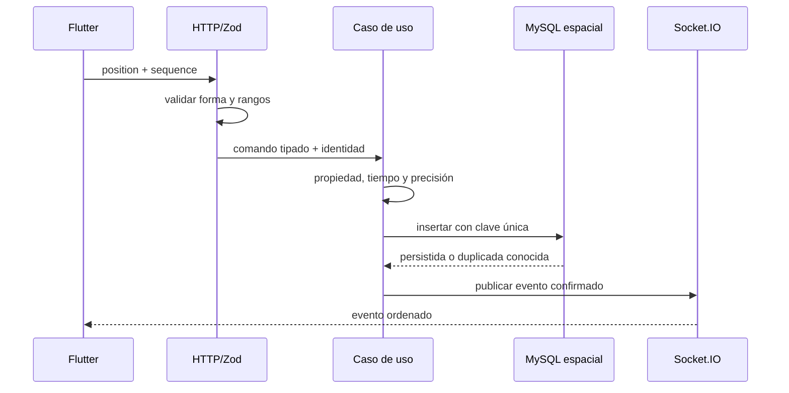

# Módulo 12: Proyecto integrador — API productiva


## Aprende construyendo

### Tema 1: Arquitectura por capas

#### Paso 1 · Objetivo y preparación

Al finalizar podrás separar entrada HTTP, casos de uso y persistencia. **Prerrequisitos:** Node LTS, módulos y HTTP; ejemplo independiente desde una carpeta vacía.

#### Paso 2 · Contexto y caso real

Una API de entregas cambia su base o proveedor de mapas con frecuencia. Si la ruta contiene toda la lógica, cada cambio multiplica el riesgo.

#### Paso 3 · Teoría y analogía aplicada

La capa de entrada traduce HTTP, la aplicación coordina y la infraestructura persiste. Es un edificio con recepción, oficinas y almacén: cada zona tiene responsabilidades y puertas claras.

#### Paso 4 · Demostración guiada desde cero

```bash
mkdir ejemplo-capas
cd ejemplo-capas
npm init -y
mkdir -p src/{http,application,infrastructure}
```

Crea `src/application/crear.js`, `src/infrastructure/memoria.js` y `src/http/server.js`:

```js
export function crearEntrega(repo, datos) { if (!datos.codigo) throw new Error("codigo requerido"); return repo.guardar(datos); }
```

```js
export function memoria() { const datos = []; return { guardar(item) { datos.push(item); return item; } }; }
```

```js
import http from "node:http"; import { crearEntrega } from "../application/crear.js"; import { memoria } from "../infrastructure/memoria.js";
const repo = memoria(); http.createServer((_req, res) => { try { res.end(JSON.stringify(crearEntrega(repo, { codigo: "RF-1" }))); } catch { res.statusCode = 400; res.end("bad"); } }).listen(3000);
```

Ejecuta `node src/http/server.js`. **Resultado esperado:** el servidor responde el objeto creado. **Fallo deliberado y diagnóstico:** elimina `codigo`; la aplicación devuelve 400, sin que la infraestructura valide HTTP.

#### Paso 5 · Práctica guiada

Inyecta un repositorio falso que registre llamadas. **Pista:** el caso de uso no debe importar Express ni `http`.

#### Paso 6 · Práctica independiente

Reemplaza memoria por un adaptador de archivo y entrega pruebas de ambos sin modificar la aplicación.

#### Paso 7 · Cierre y conexión

Ya tienes límites visibles entre capas. El siguiente tema conectará los conceptos del track en otro proyecto.

**Errores comunes:** capas por carpetas sin contratos; dominio importando infraestructura; controladores con SQL; mocks que no respetan interfaz.

**Fuentes oficiales:** [Node modules](https://nodejs.org/api/esm.html) y [Clean Architecture, Martin](https://blog.cleancoder.com/uncle-bob/2012/08/13/the-clean-architecture.html).

**Evidencia de aprendizaje:** entrega la salida 200, el fallo 400 y un adaptador sustituido.

**Conceptos clave:** separación de responsabilidades, rutas, controladores, servicios, repositorio.

Una arquitectura por capas organiza el código de una API en niveles con responsabilidades claramente delimitadas y sin superposición: las rutas (estudiadas en el Módulo 4) definen únicamente los endpoints HTTP y delegan inmediatamente hacia los controladores, sin contener ninguna lógica de negocio propia; los controladores traducen entre el mundo HTTP (extraer parámetros de la petición, formatear la respuesta) y el mundo de la lógica de negocio, invocando a los servicios correspondientes; los servicios contienen la lógica de negocio real (reglas de validación de dominio, cálculos, orquestación de múltiples operaciones), completamente ajenos a los detalles de HTTP o de la base de datos específica usada; y el repositorio encapsula el acceso a los datos (usando Prisma, estudiado en el Módulo 5, o cualquier otro mecanismo de persistencia), sin contener ninguna lógica de negocio propia más allá de las operaciones de acceso a datos mismas.

Esta separación no es un formalismo académico sin beneficio práctico: permite testear la lógica de negocio (la capa de servicios) de forma completamente aislada, sin necesidad de levantar un servidor HTTP real ni una base de datos real (usando un repositorio simulado, un mock o un fake, en el sentido estudiado en el Módulo 9 del track de JavaScript), acelerando considerablemente la ejecución de esa categoría específica de pruebas. También permite cambiar la base de datos subyacente (migrar de PostgreSQL a otro motor, por ejemplo) modificando únicamente la capa de repositorio, sin tocar en absoluto la lógica de negocio de los servicios ni las rutas HTTP, que permanecen completamente ajenas a ese detalle de implementación específico.

Un ejemplo concreto de servicio bien diseñado (`crearTarea(repo, datos)`) recibe el repositorio como parámetro (en vez de importarlo directamente y acoplarse a una implementación específica), valida la regla de negocio relevante (`if (!datos.titulo?.trim()) throw new Error(...)`), y delega la persistencia real al repositorio recibido, ilustrando cómo cada capa mantiene su responsabilidad estrictamente delimitada: el servicio decide qué reglas de negocio aplican, sin saber ni preocuparse por los detalles de cómo el repositorio efectivamente almacena los datos.

**Analogía:** una arquitectura por capas es como una empresa con departamentos claramente delimitados: recepción (rutas) recibe visitantes y los dirige; atención al cliente (controladores) traduce sus solicitudes a un formato interno procesable; el departamento técnico (servicios) aplica las políticas y reglas de negocio reales de la empresa; y el archivo central (repositorio) gestiona el almacenamiento físico real de los documentos, sin que ningún departamento necesite entender ni interferir con el trabajo interno específico de los demás.

**¿Por qué es importante?** La arquitectura por capas permite testear la lógica de negocio de forma aislada y rápida, y cambiar detalles de implementación (como la base de datos) sin afectar el resto del sistema, dos beneficios concretos que compensan ampliamente la disciplina adicional de mantener las capas separadas consistentemente.

**Diagrama:**

```
rutas/          → define endpoints HTTP, delega a controladores
controladores/  → traduce request/response, llama a servicios
servicios/      → lógica de negocio, sin saber nada de HTTP
repositorios/   → acceso a datos (Prisma/SQL), sin lógica de negocio
```

### Tema 2: Uniendo cada módulo del track

#### Paso 1 · Objetivo y preparación

Al finalizar podrás integrar configuración, HTTP, persistencia, pruebas y observabilidad en un servicio pequeño. **Prerrequisitos:** Node LTS; ejemplo independiente desde una carpeta vacía.

#### Paso 2 · Contexto y caso real

Un producto no se entrega por conceptos aislados: necesita un flujo reproducible que arranque, pruebe y exponga salud.

#### Paso 3 · Teoría y analogía aplicada

Integrar no significa mezclar responsabilidades; significa conectar contratos. Es ensamblar piezas con conectores definidos, no pegar todo en un archivo.

#### Paso 4 · Demostración guiada desde cero

```bash
mkdir ejemplo-integrador-node
cd ejemplo-integrador-node
npm init -y
mkdir src
```

Crea `src/app.js`:

```js
import http from "node:http";
const config = Object.freeze({ port: Number(process.env.PORT ?? 3000) });
const app = http.createServer((_req, res) => { res.setHeader("content-type", "application/json"); res.end(JSON.stringify({ ok: true, service: "demo" })); });
app.listen(config.port, () => console.log(`listo:${config.port}`));
```

Ejecuta `PORT=3100 node src/app.js` y consulta con curl. **Resultado esperado:** JSON `ok`. **Fallo deliberado y diagnóstico:** usa un puerto inválido; la configuración falla antes de iniciar, evitando un servicio ambiguo.

#### Paso 5 · Práctica guiada

Añade `/health` y una prueba de contrato. **Pista:** la prueba no debe iniciar un puerto en cada caso.

#### Paso 6 · Práctica independiente

Escribe README con instalación, prueba, variables y apagado; otra persona debe reproducir el resultado desde cero.

#### Paso 7 · Cierre y conexión

Ya integraste un servicio mínimo reproducible. El siguiente tema hará una revisión de producción y sus límites.

**Errores comunes:** saltar validación; no documentar puertos; integrar sin prueba; compartir estado global; confundir demo con producción.

**Fuentes oficiales:** [Node HTTP](https://nodejs.org/api/http.html), [npm scripts](https://docs.npmjs.com/cli/using-npm/scripts) y [12-factor](https://12factor.net/).

**Evidencia de aprendizaje:** entrega README, salida de arranque y prueba de configuración inválida.

**Conceptos clave:** integración horizontal de todo el track en un único proyecto coherente.

Este proyecto integrador conecta explícitamente cada módulo anterior del track en un flujo coherente y funcional: Express con middleware (Módulo 4) constituye la capa HTTP de rutas y controladores; Prisma con transacciones (Módulo 5) constituye la capa de persistencia, incluyendo al menos una relación uno-a-muchos entre entidades (por ejemplo, un usuario con múltiples tareas); JWT con access y refresh tokens (Módulo 6) protege las rutas que lo requieren, integrado con la base de datos real para verificar credenciales; Supertest combinado con Testcontainers (Módulo 7) prueba el flujo completo de principio a fin contra una base de datos real y efímera, no solo funciones aisladas; Pino con correlation ID (Módulo 9) proporciona observabilidad estructurada; y el Dockerfile multi-stage (Módulo 11) empaqueta todo el resultado en una imagen de producción optimizada y lista para desplegar.

Diseñar deliberadamente las conexiones entre estas piezas —no simplemente yuxtaponerlas, sino asegurarse de que realmente colaboran coherentemente como un sistema integrado— es lo que distingue este proyecto de una simple colección de ejercicios aislados de cada módulo: el middleware de autenticación del Módulo 6 debe integrarse correctamente con el router del Módulo 4; los tests de integración del Módulo 7 deben verificar genuinamente el flujo completo, incluyendo la capa de persistencia real del Módulo 5, no solo mockear cada pieza de forma aislada, que daría una falsa sensación de cobertura sin verificar realmente que las piezas colaboran correctamente entre sí.

Tomar decisiones de arquitectura propias durante este proyecto —en vez de simplemente copiar un boilerplate genérico ya armado sin entenderlo— es un ejercicio de síntesis valioso: decidir exactamente dónde va cada pieza de lógica (¿la validación de formato de un campo pertenece al controlador o al servicio? ¿el manejo de un error de negocio específico se traduce a qué código de estado HTTP, y en qué capa se toma esa decisión?) obliga a aplicar activamente los principios de separación de responsabilidades del Tema 1 a decisiones concretas y específicas, en vez de solo entenderlos en abstracto sin haberlos aplicado nunca a un caso real.

**Analogía:** este proyecto integrador es como ensamblar finalmente el motor completo de un automóvil, tras haber estudiado y practicado con cada componente individual por separado (el sistema de combustible, el de encendido, el de refrigeración); ver el motor completo arrancar y funcionar coherentemente, con cada componente colaborando correctamente con los demás, es la validación final de que cada pieza fue realmente comprendida, no solo memorizada de forma aislada.

**¿Por qué es importante?** Este proyecto integrador consolida los doce módulos anteriores del track en un sistema coherente y realmente operativo, revelando el valor real de cada pieza precisamente en cómo colabora con las demás, no solo en su funcionamiento aislado.

**Diagrama:**

```
Express+middleware (M4) → capa HTTP
Prisma+transacciones (M5) → persistencia con relaciones reales
JWT access/refresh (M6) → protección de rutas integrada con la BD
Supertest+Testcontainers (M7) → verificación del flujo completo end-to-end
Pino+correlation ID (M9) → observabilidad estructurada
Dockerfile multi-stage (M11) → empaquetado final de producción
```

### Tema 3: Qué le falta a esta API para producción real

#### Paso 1 · Objetivo y preparación

Al finalizar podrás hacer un checklist técnico antes de publicar una API. **Prerrequisitos:** Node LTS y HTTP; ejemplo independiente desde una carpeta vacía.

#### Paso 2 · Contexto y caso real

Una demo puede responder 200 y aun así carecer de autenticación, límites, backups, alertas y recuperación. La revisión convierte “funciona” en evidencia operativa.

#### Paso 3 · Teoría y analogía aplicada

Producción requiere seguridad, resiliencia, observabilidad, datos y operación. Es la inspección de una aeronave: no basta con que el motor arranque.

#### Paso 4 · Demostración guiada desde cero

```bash
mkdir ejemplo-readiness-produccion
cd ejemplo-readiness-produccion
npm init -y
mkdir docs
```

Crea `docs/checklist.md` con columnas `riesgo|evidencia|responsable|estado` y registra autenticación, backup, límites, healthcheck y rollback. Ejecuta `git diff --check` y revisa que cada fila tenga evidencia. **Resultado esperado:** checklist sin estados vacíos. **Fallo deliberado y diagnóstico:** deja una fila sin evidencia; la revisión debe marcarla pendiente, no asumir que está cubierta.

Crea también `src/checklist.js` para validar filas:

```js
const filas = [{ riesgo: "credenciales", evidencia: "rotación probada" }];
if (filas.some((fila) => !fila.evidencia)) throw new Error("falta evidencia");
console.log("checklist válido");
```

```md
| riesgo | evidencia | responsable | estado |
|---|---|---|---|
| credenciales | rotación probada | backend | pendiente |
```

#### Paso 5 · Práctica guiada

Añade una matriz de impacto/probabilidad. **Pista:** prioriza riesgos que pueden perder datos o exponer credenciales.

#### Paso 6 · Práctica independiente

Escribe un runbook de incidente con detección, mitigación, rollback y aprendizaje posterior.

#### Paso 7 · Cierre y conexión

Ya conviertes arquitectura en criterios operables. El siguiente tema comparará evoluciones tecnológicas.

**Errores comunes:** checklist sin evidencia; medir solo cobertura; omitir recuperación; no asignar responsables; llamar “producción” a un entorno sin alertas.

**Fuentes oficiales:** [SRE workbook](https://sre.google/workbook/), [OWASP ASVS](https://owasp.org/www-project-application-security-verification-standard/) y [12-factor](https://12factor.net/).

**Evidencia de aprendizaje:** entrega checklist completo y un runbook con un fallo simulado.

**Conceptos clave:** honestidad sobre las limitaciones del proyecto, próximos pasos de aprendizaje.

Una API "completa" en el contexto de este curso, aunque integra correctamente todos los módulos estudiados, todavía carece de varios elementos que un sistema de producción real y maduro necesitaría, y reconocer honestamente estas limitaciones es parte del ejercicio de madurez profesional que este proyecto busca fomentar. Monitoreo activo con alertas (no solo logs pasivos que alguien debe revisar manualmente) sobre métricas clave del servicio, en la línea de lo estudiado en el Módulo 9 del track DevOps (Prometheus/Grafana con reglas de alerta reales), es necesario para detectar proactivamente problemas antes de que un usuario los reporte, en vez de depender exclusivamente de logs que solo se consultan reactivamente después de que algo ya falló visiblemente.

Un plan de migración de base de datos sin downtime para cambios de esquema en producción (más elaborado que simplemente ejecutar `prisma migrate dev` en un entorno de desarrollo local) es necesario para aplicaciones con tráfico real continuo, donde una migración mal planificada podría bloquear tablas críticas durante un período inaceptablemente largo, o donde cambios incompatibles requieren una estrategia de migración gradual y cuidadosamente orquestada en múltiples pasos, no una aplicación directa e inmediata del cambio completo de una sola vez.

La gestión de secretos fuera del código (usando un servicio dedicado como Secrets Manager o Vault, exactamente lo estudiado en profundidad tanto en el Módulo 12 del track DevOps como en el Módulo 10 del track Cloud) es necesaria en vez de depender de archivos `.env` locales una vez que la aplicación pasa de un contexto de aprendizaje a un contexto de producción real con datos sensibles genuinos. Y pruebas de carga (simular tráfico realista a escala para conocer los límites reales de capacidad de la aplicación antes de que los usuarios reales los encuentren de forma inesperada durante un pico de tráfico genuino) completan el panorama de lo que separa este proyecto integrador educativo de un sistema verdaderamente listo para soportar tráfico de producción real y crítico para un negocio.

**Analogía:** este proyecto integrador es como un vehículo prototipo completamente funcional que ya incorpora todos los sistemas esenciales (motor, frenos, dirección) y que efectivamente puede conducirse con éxito en condiciones controladas; llevarlo a producción real es como someterlo a las pruebas de choque, de resistencia y de producción en masa que un fabricante automotriz real exige antes de certificarlo para la venta pública masiva a millones de conductores con condiciones de uso impredecibles.

**¿Por qué es importante?** Reconocer honestamente qué le falta a este proyecto para producción real (monitoreo activo, migraciones sin downtime, gestión de secretos, pruebas de carga) es tan valioso como haber construido correctamente lo que sí incluye, y traza un mapa claro y concreto de los próximos pasos de aprendizaje más allá de este track.

**Diagrama:**

```
Este proyecto integrador incluye:          Producción real adicionalmente necesita:
✓ Arquitectura por capas                    ☐ Monitoreo activo con alertas
✓ Auth JWT + persistencia real               ☐ Migraciones sin downtime en producción
✓ Tests de integración end-to-end             ☐ Gestión de secretos (Vault/Secrets Manager)
✓ Logging estructurado + correlation ID        ☐ Pruebas de carga a escala real
✓ Dockerfile de producción
```

### Tema 4: Próximos pasos — microservicios, colas de mensajes y TypeScript

#### Paso 1 · Objetivo y preparación

Al finalizar podrás escoger un siguiente paso sin convertir complejidad en objetivo. **Prerrequisitos:** Node LTS y lectura de arquitectura; ejemplo independiente desde una carpeta vacía.

#### Paso 2 · Contexto y caso real

Un monolito pequeño puede ser más operable que muchos servicios. La decisión depende de límites de equipo, despliegue, datos y fallos.

#### Paso 3 · Teoría y analogía aplicada

Microservicios añaden red y observabilidad; colas añaden eventual consistency; TypeScript añade verificación estática. Son herramientas, no niveles obligatorios.

#### Paso 4 · Demostración guiada desde cero

```bash
mkdir ejemplo-decision-arquitectura
cd ejemplo-decision-arquitectura
npm init -y
mkdir docs
```

Crea `docs/decision.md` con opciones monolito, servicio separado y cola, y columnas `beneficio|costo|riesgo|evidencia`. Ejecuta `git diff --check`. **Resultado esperado:** una decisión trazable. **Fallo deliberado y diagnóstico:** elimina la columna de costo; la revisión debe rechazar la decisión por evidencia incompleta.

Crea `src/decision.js` para comprobar que no falta una columna:

```js
const decision = { opcion: "monolito", beneficio: "simple", costo: "bajo", riesgo: "escala", evidencia: "carga medida" };
for (const campo of ["beneficio", "costo", "riesgo", "evidencia"]) if (!decision[campo]) throw new Error(`falta ${campo}`);
console.log("decisión trazable");
```

```md
| opción | beneficio | costo | riesgo | evidencia |
|---|---|---|---|---|
| monolito | simple | bajo | escala | carga medida |
```

#### Paso 5 · Práctica guiada

Añade una métrica de volumen y equipo que cambie la recomendación. **Pista:** no elijas tecnología antes de escribir restricciones.

#### Paso 6 · Práctica independiente

Propón una migración incremental con un límite reversible y entrega el criterio de rollback.

#### Paso 7 · Cierre y conexión

Ya puedes elegir evolución por evidencia. El siguiente tema profundizará geolocalización y tiempo real.

**Errores comunes:** microservicios por moda; ignorar consistencia; adoptar TypeScript sin plan; colas sin idempotencia; no medir costo operativo.

**Fuentes oficiales:** [TypeScript handbook](https://www.typescriptlang.org/docs/handbook/intro.html), [microservices](https://martinfowler.com/articles/microservices.html) y [messaging patterns](https://www.enterpriseintegrationpatterns.com/).

**Evidencia de aprendizaje:** entrega una matriz comparativa y una decisión reversible.

**Conceptos clave:** descomposición en servicios, Kafka/RabbitMQ, tipado estático en Node.

Más allá de este track, un camino natural de profundización es la arquitectura de microservicios: descomponer una API monolítica (como la construida en este proyecto) en servicios más pequeños e independientes, cada uno responsable de un dominio de negocio específico, comunicándose entre sí mediante APIs síncronas (REST o gRPC, estudiados en el Módulo 9) o mediante colas de mensajes asíncronas. Kafka y RabbitMQ son las dos tecnologías de mensajería más ampliamente adoptadas para este propósito: RabbitMQ implementa un modelo de colas de mensajes más tradicional orientado a tareas discretas (con cierto parentesco conceptual con BullMQ del Módulo 8, aunque a una escala y con garantías distintas), mientras que Kafka está diseñado específicamente para flujos de eventos de alto volumen y sostenido, con la capacidad distintiva de retener el historial completo de eventos durante un período configurable, permitiendo que múltiples consumidores distintos procesen el mismo flujo de eventos de forma independiente y en momentos distintos.

Adoptar TypeScript en un proyecto Node (ejecutado directamente en desarrollo con herramientas como `tsx` o `ts-node`, que compilan y ejecutan TypeScript sobre la marcha sin un paso de compilación manual separado previo) extiende al backend los mismos beneficios de seguridad de tipos estudiados en profundidad en el Módulo 11 del track de JavaScript: capturar errores de tipo en tiempo de compilación, documentación implícita verificada por el compilador, y mejor autocompletado del editor, beneficios que se vuelven cada vez más valiosos a medida que una base de código Node crece en tamaño y en número de colaboradores del equipo.

Este proyecto integrador y el track completo de Node.js, combinados con el conocimiento ya adquirido de JavaScript, DevOps y Cloud, constituyen una base sólida y coherente para abordar cualquiera de estos próximos pasos de profundización con criterio informado, entendiendo no solo la sintaxis específica de cada nueva herramienta, sino el problema real y concreto que cada una resuelve dentro del panorama más amplio de construir y operar sistemas backend robustos a escala creciente.

**Analogía:** completar este track de Node.js es como haber aprendido a construir y operar completamente un restaurante individual exitoso; los microservicios y las colas de mensajes son el siguiente nivel de complejidad, equivalente a coordinar una cadena completa de restaurantes especializados que colaboran entre sí (una cocina central de preparación, sucursales de servicio, un sistema de distribución), cada uno responsable de una parte específica de una operación mucho más grande y distribuida.

**¿Por qué es importante?** Conocer el panorama de microservicios, colas de mensajes y TypeScript en Node traza próximos pasos concretos y bien fundamentados de profundización, construidos directamente sobre la base sólida establecida por este track completo.

**Diagrama:**

```
Monolito (este proyecto) → descomposición en microservicios independientes
                                    │
                        comunicación síncrona (REST/gRPC)
                        o asíncrona (RabbitMQ: colas discretas / Kafka: flujos de eventos)

TypeScript + tsx/ts-node → mismos beneficios de tipos del track de JavaScript, aplicados al backend
```

### Tema 5: Posiciones espaciales y Socket.IO con orden recuperable

#### Paso 1 · Objetivo y preparación

Al finalizar podrás validar coordenadas y emitir una actualización con secuencia. **Prerrequisitos:** Node LTS, HTTP y JSON; ejemplo independiente desde una carpeta vacía.

#### Paso 2 · Contexto y caso real

Un conductor envía GPS con retrasos y duplicados. El cliente necesita descartar posiciones antiguas y solicitar recuperación tras reconectar.

#### Paso 3 · Teoría y analogía aplicada

Latitud y longitud tienen rangos; una secuencia ordena eventos, pero no garantiza que el transporte sea durable. Es una pizarra numerada: si pierdes una hoja, pides las faltantes.

#### Paso 4 · Demostración guiada desde cero

```bash
mkdir ejemplo-gps-socket
cd ejemplo-gps-socket
npm init -y
npm install socket.io
mkdir src
```

Crea `src/server.js`:

```js
import { createServer } from "node:http";
import { Server } from "socket.io";
const http = createServer(); const io = new Server(http, { cors: { origin: "*" } });
let secuencia = 0;
io.on("connection", (socket) => socket.on("location", (p) => {
  if (p.lat < -90 || p.lat > 90 || p.lng < -180 || p.lng > 180) return socket.emit("error", "coordenada inválida");
  io.emit("location", { ...p, seq: ++secuencia });
}));
http.listen(3000, () => console.log("socket listo"));
```

Ejecuta `node src/server.js` con un cliente Socket.IO. **Resultado esperado:** cada posición válida recibe `seq` creciente. **Fallo deliberado y diagnóstico:** envía `lat: 200`; el servidor emite error y no incrementa secuencia.

#### Paso 5 · Práctica guiada

Guarda las últimas 20 posiciones para recuperar desde una secuencia. **Pista:** limita el arreglo para no convertirlo en almacenamiento infinito.

#### Paso 6 · Práctica independiente

Simula reconexión y entrega eventos recuperados y una posición descartada por secuencia antigua.

#### Paso 7 · Cierre y conexión

Ya validas geodatos y orden lógico. El siguiente tema tratará archivos y push sin confundirlos con autorización.

**Errores comunes:** aceptar coordenadas sin rango; confiar en orden de llegada; guardar historial infinito; usar socket como base durable; mezclar identidad con ubicación.

**Fuentes oficiales:** [Socket.IO](https://socket.io/docs/v4/), [RFC 7946 GeoJSON](https://www.rfc-editor.org/rfc/rfc7946) y [Node events](https://nodejs.org/api/events.html).

**Evidencia de aprendizaje:** entrega la salida de una secuencia válida, un error de coordenadas y recuperación simulada.

**Conceptos clave:** validación geográfica, SRID, índice espacial, autorización por recurso, secuencia y reanudación.

El backend móvil no debería recibir un objeto genérico y guardarlo directamente. En `src/features/journeys/http/position.schema.ts`, Zod valida coordenadas, precisión, instante y secuencia en la frontera. Latitud pertenece a `[-90, 90]`, longitud a `[-180, 180]`, precisión no puede ser negativa y una secuencia debe ser un entero positivo. La validación de forma no decide todavía si el conductor está autorizado ni si la muestra es suficientemente reciente: esas son reglas del caso de uso.

```ts
import { z } from 'zod';

export const positionInput = z.object({
  journeyId: z.string().uuid(),
  sequence: z.number().int().positive(),
  latitude: z.number().min(-90).max(90),
  longitude: z.number().min(-180).max(180),
  accuracyMeters: z.number().finite().nonnegative().max(5_000),
  capturedAt: z.string().datetime({ offset: true }),
}).strict();
```

MySQL debe almacenar el punto con SRID conocido y orden correcto: `POINT(longitude, latitude)`. Invertirlos puede producir una coordenada válida numéricamente pero ubicada en otro continente. Prisma puede conservar el resto del modelo y delegar la operación espacial específica a un repositorio con consulta parametrizada; la capa de aplicación no debe conocer SQL ni el tipo geométrico del motor.

```ts
await prisma.$executeRaw`
  INSERT INTO driver_positions
    (journey_id, sequence_number, captured_at, accuracy_m, location)
  VALUES
    (${input.journeyId}, ${input.sequence}, ${capturedAt}, ${input.accuracyMeters},
     ST_SRID(POINT(${input.longitude}, ${input.latitude}), 4326))
  ON DUPLICATE KEY UPDATE journey_id = journey_id
`;
```

La tabla necesita una restricción única `(journey_id, sequence_number)` para que un reintento no cree otra muestra. Antes de insertar, el caso de uso comprueba que la identidad autenticada es el conductor asignado a esa jornada y rechaza muestras demasiado antiguas según una política explícita. El `ON DUPLICATE` evita duplicar el efecto, pero el servicio debe devolver el mismo resultado conocido, no fingir que procesó una nueva posición.

Socket.IO distribuye el evento **después** de persistirlo. El servidor autentica el *handshake*, autoriza la jornada antes de `socket.join()` y permite reanudar desde `lastSequence`. Emitir primero y persistir después crea un estado imposible de recuperar si el proceso cae entre ambas operaciones; para garantías mayores se usa outbox y un publicador separado.

```ts
io.use(async (socket, next) => {
  try {
    socket.data.identity = await verifyAccessToken(socket.handshake.auth.token);
    next();
  } catch { next(new Error('unauthorized')); }
});

io.on('connection', socket => {
  socket.on('journey:subscribe', async ({ journeyId, lastSequence }, acknowledge) => {
    await journeyAuthorizer.assertDriver(socket.data.identity.subject, journeyId);
    await socket.join(`journey:${journeyId}`);
    acknowledge(await positionRepository.findAfter(journeyId, lastSequence));
  });
});
```

**Analogía:** una secuencia es la numeración de páginas de un expediente: permite reconocer duplicados, detectar huecos y continuar desde la última página confirmada después de una interrupción.

**¿Por qué es importante?** Coordenadas válidas no son automáticamente posiciones confiables, y un socket autenticado no está automáticamente autorizado para cualquier jornada. Validación, propiedad, persistencia y distribución protegen riesgos distintos.

**Diagrama: frontera de aceptación y publicación:**



### Tema 6: Archivos y notificaciones push sin convertirlos en autorización

#### Paso 1 · Objetivo y preparación

Al finalizar podrás guardar un archivo con nombre controlado y enviar una notificación sin tratarla como permiso. **Prerrequisitos:** Node LTS, HTTP y seguridad básica; ejemplo independiente desde una carpeta vacía.

#### Paso 2 · Contexto y caso real

Una entrega puede adjuntar comprobante y avisar al cliente. El archivo debe aislarse del path traversal y el push debe ser un efecto posterior a una autorización ya verificada.

#### Paso 3 · Teoría y analogía aplicada

Normalizar rutas limita dónde escribir; el proveedor push transporta mensajes, no decide quién puede descargar. Es el mensajero de una oficina: entrega lo que le autorizan, no valida el expediente.

#### Paso 4 · Demostración guiada desde cero

```bash
mkdir ejemplo-archivos-push
cd ejemplo-archivos-push
npm init -y
mkdir src uploads
```

Crea `src/guardar.js`:

```js
import path from "node:path";
import { mkdir, writeFile } from "node:fs/promises";
const base = path.resolve("uploads");
export async function guardar(nombre, contenido) {
  const seguro = path.basename(nombre);
  const destino = path.join(base, seguro);
  if (!destino.startsWith(`${base}${path.sep}`)) throw new Error("ruta no permitida");
  await mkdir(base, { recursive: true }); await writeFile(destino, contenido, { flag: "wx" });
  return destino;
}
console.log(await guardar("comprobante.txt", "entrega confirmada"));
```

Ejecuta `node src/guardar.js`. **Resultado esperado:** crea solo `uploads/comprobante.txt`. **Fallo deliberado y diagnóstico:** intenta `../../secreto`; `basename` evita salir del directorio y el archivo queda dentro de uploads. Un push real requerirá proveedor y credenciales fuera del código.

#### Paso 5 · Práctica guiada

Limita tamaño y extensión permitida. **Pista:** valida bytes antes de escribir y no confíes en la extensión para contenido ejecutable.

#### Paso 6 · Práctica independiente

Diseña una cola de notificación posterior al guardado y entrega el caso donde el push falla sin deshacer el archivo.

#### Paso 7 · Cierre y siguiente paso

Ya separas almacenamiento, autorización y notificación. Este cierre deja preparado el paso hacia servicios externos y móviles.

**Errores comunes:** concatenar paths; sobrescribir archivos; servir uploads como código; guardar tokens push como permisos; no limpiar temporales.

**Fuentes oficiales:** [Node path](https://nodejs.org/api/path.html), [fs promises](https://nodejs.org/api/fs.html#promises-api) y [OWASP File Upload](https://owasp.org/www-community/vulnerabilities/Unrestricted_File_Upload).

**Evidencia de aprendizaje:** entrega la salida de archivo válido, path rechazado y flujo de push fallido sin pérdida de autorización.

**Conceptos clave:** carga multipart, límites, almacenamiento de objetos, metadatos mínimos, Firebase Admin y fuente de verdad.

Una foto de evidencia no debe cargarse completa en memoria sin límites ni guardarse como BLOB en la misma transacción principal. El endpoint acepta `multipart/form-data`, limita tamaño y tipo, genera una clave interna no predecible y transmite el archivo hacia almacenamiento de objetos. Extensión y `Content-Type` enviados por el cliente no prueban el formato; valida la firma del archivo y procesa imágenes en un entorno aislado. Conserva en MySQL únicamente identificador, propietario, hash, tamaño, estado de escaneo y clave del objeto.

El flujo correcto tiene estados explícitos: `UPLOADING → QUARANTINED → AVAILABLE` o `REJECTED`. Una entrega no queda confirmada únicamente porque la transferencia terminó; el caso de uso decide si la evidencia requerida está disponible, pertenece a esa entrega y cumple retención. Las URL de descarga deben ser temporales y autorizadas, no públicas permanentes.

Firebase Admin envía una notificación con datos mínimos después de confirmar un cambio. El token FCM identifica una instalación, no una persona ni un permiso. Los tokens rotan y las respuestas de Firebase que indican un registro inválido deben desactivar esa instalación. El cliente usa el mensaje para volver a consultar la API; nunca aplica como verdad un estado sensible recibido por push.

```ts
await firebase.messaging().send({
  token: installation.fcmToken,
  data: {
    type: 'delivery.updated',
    deliveryId: delivery.id,
    version: String(delivery.version),
  },
  android: { priority: 'high' },
});
```

No incluyas JWT, dirección completa, fotografía, PIN ni nombre del destinatario en el payload: puede aparecer en registros del proveedor o en una pantalla bloqueada. Si el push falla, la transición de entrega no se revierte; registra el intento y reintenta desde una cola con límite y *dead-letter*, porque la notificación es un efecto posterior, no parte atómica del dominio.

**Analogía:** el push es el timbre que avisa que llegó correspondencia; no contiene todo el expediente ni otorga permiso para abrirlo. La aplicación debe identificarse y consultar la fuente oficial.

**¿Por qué es importante?** Separar archivo, transición de dominio y notificación evita que una dependencia externa convierta una entrega válida en fallida, y reduce exposición de información sensible.

**Práctica verificable:** prueba archivo mayor al límite, contenido cuya firma no coincide con la extensión, entrega ajena, token FCM inválido y caída del proveedor después de confirmar. La API debe responder con errores diferenciados, no dejar archivos huérfanos silenciosos y conservar la entrega confirmada aunque el push vaya a reintento.

---

## Proyecto transversal RutaFlow: Comando idempotente de entrega

RutaFlow conecta este track con una plataforma completa de paquetería. La implementación de referencia está en `examples/rutaflow/node/confirm-delivery.ts`; se estudia como punto de partida pequeño, no como sistema terminado.

### Capacidad y fundamento

Implementa `confirmDelivery` alrededor de un comando con identidad estable. El caso de uso valida la frontera y depende de un contrato de repositorio, no del ORM. La implementación SQL debe guardar `commandId`, transición y resultado en una única transacción; una restricción única resuelve carreras que un `find` previo no puede evitar por sí solo.

### Implementación guiada

1. Copia el contrato y escribe primero casos normales, límite, inválidos y duplicados.
2. Ejecuta la referencia, provoca un fallo y explica el mensaje antes de modificarla.
3. Implementa una mejora pequeña manteniendo nombres de dominio, efectos visibles y errores tipados.
4. Integra con el contrato del track anterior sin compartir tablas, estado mutable ni detalles de framework.
5. Registra la decisión en el README y etiqueta el hito de RutaFlow correspondiente.

### Verificación profesional

Simula respuesta perdida y reenvía el mismo comando: ambos intentos deben devolver el mismo resultado y producir un solo evento. Añade pruebas para PIN inválido, envío ajeno, estado terminal, carrera concurrente y error transitorio de base de datos.

El capítulo se completa cuando la evidencia permite a otra persona reproducir el flujo y explicar qué garantías ofrece y cuáles todavía no.


## Laboratorio práctico

**Objetivo del laboratorio:** construir la API productiva final integrando arquitectura por capas, autenticación, persistencia, testing y un contenedor de producción listo para desplegar.

**Requisitos previos:** todos los Módulos 0-11 completados.

| Paso | Acción | Detalle | Explicación |
|---|---|---|---|
| 1 | Diseñar la arquitectura por capas | rutas → controladores → servicios → repositorio | Sin mezclar responsabilidades entre capas |
| 2 | Implementar autenticación JWT completa | Login, refresh, rutas protegidas | Integrada con la base de datos real |
| 3 | Agregar persistencia con una relación real | Al menos una relación uno-a-muchos con Prisma | Verifica con `include` que la relación funciona |
| 4 | Escribir tests de integración del flujo crítico | Supertest + Testcontainers | Cubre de principio a fin, no solo funciones aisladas |
| 5 | Agregar logging estructurado y `/health` | Correlation ID en cada log de cada request | Verifica la conexión a la base de datos en el healthcheck |
| 6 | Construir el Dockerfile de producción | Multi-stage, optimizado | Documenta cómo desplegarías esta API a un proveedor real |
| 7 | Persistir posiciones y reanudar el canal | Zod + MySQL Spatial + Socket.IO | Repite secuencia y recupera desde la última confirmada |
| 8 | Subir evidencia y enviar una señal push | Storage + Firebase Admin | Prueba archivo inválido y token FCM rotado |

**Verificación:** el laboratorio se considera exitoso si la API completa funciona de principio a fin (registro, login, operación protegida, refresh), si los tests de integración pasan contra una base de datos real y efímera, y si la imagen Docker de producción construida es funcional y optimizada.

**Errores comunes y soluciones**

- **Mezclar lógica de negocio directamente en las rutas.** Refactoriza hacia controladores y servicios según la arquitectura por capas del Tema 1.
- **Tests de integración que en realidad mockean toda la persistencia.** Verifica que al menos algunos tests críticos usan Testcontainers con una base de datos real, no solo mocks completos.
- **Olvidar documentar honestamente las limitaciones del proyecto para producción real.** Incluye explícitamente qué le faltaría (monitoreo activo, migraciones sin downtime, gestión de secretos, pruebas de carga).

---
