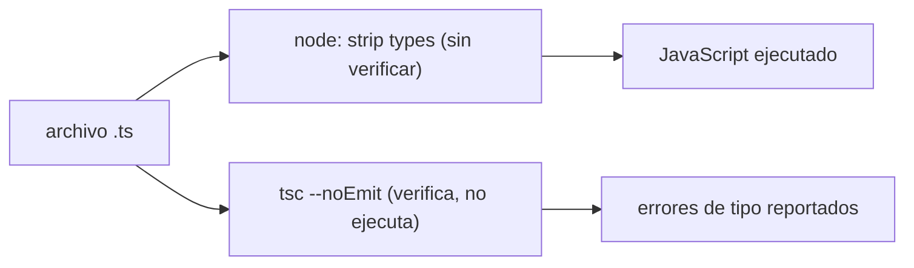
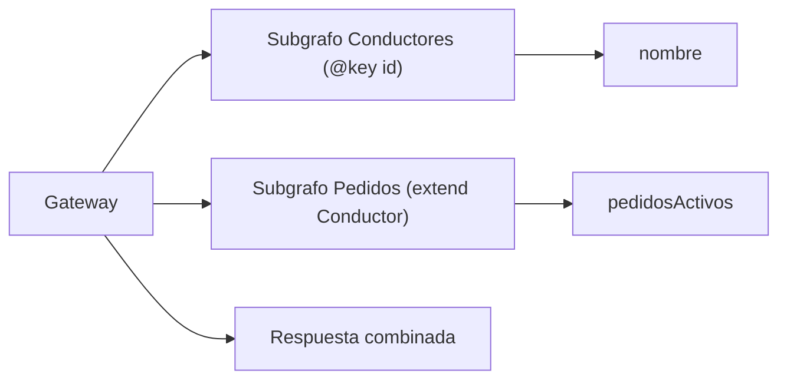
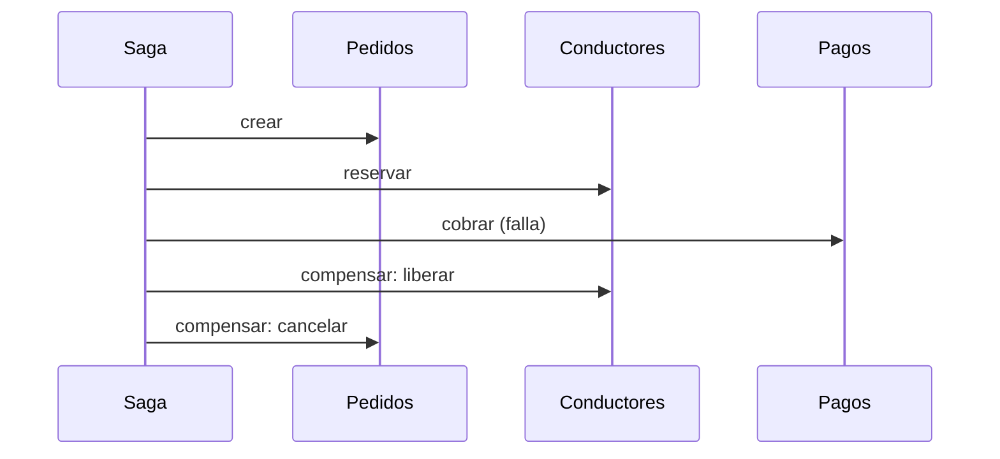
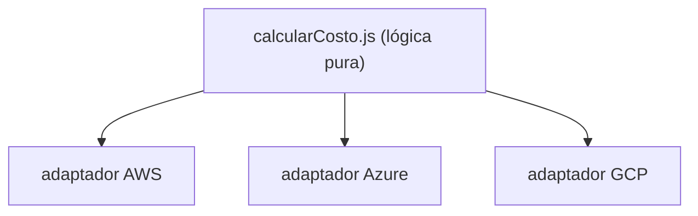
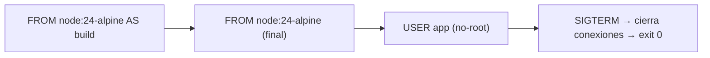
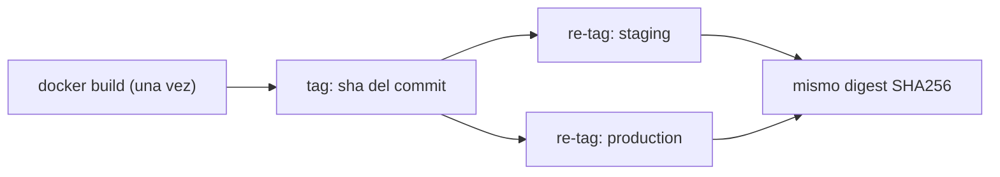

# Módulo 14: Node.js avanzado

## Aprende construyendo

Cada tema es independiente y comienza en una carpeta vacía.

### Tema 1: TypeScript en Node.js

#### Paso 1 · Objetivo y preparación

Al finalizar podrás ejecutar un archivo `.ts` directamente con `node archivo.ts`, sin paso de compilación previo, usando el soporte nativo de tipos de Node, y explicar qué validaciones NO hace ese soporte. Prerrequisitos: Node.js 22+ LTS; comprueba `node --version`.

#### Paso 2 · Contexto y caso real

El equipo quiere escribir el worker que asigna conductores a pedidos directamente en TypeScript, pero el pipeline actual compila con `tsc` a un directorio `dist/` antes de cada ejecución — un paso extra que ralentiza el ciclo de desarrollo local para un script que solo corre una vez por invocación.

#### Paso 3 · Teoría, modelo mental y analogía

Node ejecuta archivos `.ts` directamente eliminando (strip) las anotaciones de tipo del código fuente en memoria, sin verificar que esos tipos sean correctos — es "borrado de tipos" (type stripping), no un compilador: transforma `const x: number = 5` en `const x = 5` y ejecuta el resultado, sin comprobar si `5` realmente encaja con `number` en ningún otro punto del programa. La analogía: quitarle los carteles descriptivos a las cajas de un almacén antes de moverlas, sin revisar si el contenido real coincide con lo que decía cada cartel.

#### Paso 4 · Demostración guiada desde cero

Crea `src/asignar.ts`:

```ts
interface Pedido { id: string; conductorId: string | null; }

function asignarConductor(pedido: Pedido, conductorId: string): Pedido {
  return { ...pedido, conductorId };
}

const resultado = asignarConductor({ id: "p-1", conductorId: null }, "c-9");
console.log(resultado);
```

Ejecuta directamente con `node src/asignar.ts` (sin `tsc`, sin `ts-node`, sin ningún paso de compilación). **Resultado esperado:** Node elimina las anotaciones de tipo (`: Pedido`, `: string`) en memoria y ejecuta el JavaScript resultante, imprimiendo `{ id: 'p-1', conductorId: 'c-9' }`, sin que ningún archivo `.js` compilado se haya generado en disco.

#### Paso 5 · Práctica guiada

Pista: cambia la llamada a `asignarConductor({ id: "p-1", conductorId: null }, 42)` (pasando un número en vez de un string) y ejecuta de nuevo. Ese es el fallo deliberado: `node src/asignar.ts` ejecuta igual, sin ningún error, porque el soporte nativo de Node solo BORRA las anotaciones de tipo, no las VERIFICA; el error de tipos solo lo detectaría `tsc --noEmit` corriendo por separado como un paso de chequeo de tipos.

#### Paso 6 · Práctica independiente

Corregí el Paso 5 ejecutando `npx tsc --noEmit` sobre el mismo archivo y confirmá que SÍ reporta el error de tipos que la ejecución directa con `node` silenciosamente ignoró; documentá en una frase por qué ambos pasos (ejecución nativa + chequeo de tipos separado) son necesarios en un pipeline de CI real.

#### Paso 7 · Cierre y evidencia

Entregá la ejecución directa del `.ts` del Paso 4, el error de tipos no detectado en ejecución del Paso 5, y el chequeo separado con `tsc --noEmit` del Paso 6; explicá por qué el soporte nativo de tipos de Node acelera el desarrollo local pero no reemplaza un chequeo de tipos explícito en CI. Siguiente paso: aplica GraphQL Federation para componer varios subgrafos de este mismo dominio. Errores comunes: asumir que `node archivo.ts` valida tipos (solo los borra), omitir `tsc --noEmit` en el pipeline de CI confiando solo en la ejecución nativa, y mezclar sintaxis de TypeScript que requiere transformación real (enums con valores computados, decoradores) que el borrado de tipos simple no soporta. Fuentes oficiales: [Node.js — TypeScript](https://nodejs.org/en/learn/typescript/run-natively) y [TypeScript — tsc CLI](https://www.typescriptlang.org/docs/handbook/compiler-options.html).

**¿Por qué es importante?** Ejecutar `.ts` nativamente acelera el ciclo de desarrollo local sin compilación previa, pero como solo borra anotaciones sin verificarlas, un pipeline real todavía necesita `tsc --noEmit` como chequeo de tipos explícito.

**Evidencia de aprendizaje:** entrega la ejecución nativa funcionando, el error de tipos no detectado al pasar un valor incorrecto, y el chequeo separado con `tsc --noEmit` confirmando el error real.

**Conceptos clave:** type stripping, borrado de tipos sin verificación, `node archivo.ts`, `tsc --noEmit` como chequeo separado.

**Diagrama:**


```mermaid
flowchart LR
  F[archivo .ts] --> S["node: strip types (sin verificar)"]
  S --> E[JavaScript ejecutado]
  F --> T["tsc --noEmit (verifica, no ejecuta)"]
  T --> R[errores de tipo reportados]
```

Cada worker del proyecto propio que proceses en este track puede escribirse directamente en `.ts` y ejecutarse sin build local; **cuándo no usarlo:** para sintaxis que requiere transformación real (enums con valores computados, decoradores de clase), el borrado de tipos simple no alcanza y sigue siendo necesario `tsc` como compilador completo.

### Tema 2: GraphQL avanzado y Federation

#### Paso 1 · Objetivo y preparación

Al finalizar podrás componer dos subgrafos GraphQL independientes (Pedidos y Conductores) en un único supergrafo con Apollo Federation, resolviendo una referencia entre ellos sin que ningún subgrafo conozca los detalles internos del otro. Prerrequisitos: Módulo 5 de este track (bases de datos).

#### Paso 2 · Contexto y caso real

El equipo de Pedidos y el equipo de Conductores mantienen cada uno su propio servicio GraphQL; el frontend necesita una consulta que combine datos de ambos (el pedido y el conductor asignado) sin que ninguno de los dos equipos tenga que exponer tablas o endpoints internos del otro.

#### Paso 3 · Teoría, modelo mental y analogía

Apollo Federation permite que cada subgrafo declare una entidad con una clave (`@key`) y que OTRO subgrafo extienda esa entidad agregando campos propios, sin acceso directo a la base de datos del otro; un gateway compone ambos esquemas en un supergrafo único, resolviendo cada campo contra el subgrafo que lo declaró. La analogía: dos oficinas distintas que comparten únicamente un número de legajo común, cada una completando su propia parte del expediente sin acceso a los archivos internos de la otra.

#### Paso 4 · Demostración guiada desde cero

Crea el subgrafo de Conductores (`src/conductores/schema.graphql`):

```graphql
type Conductor @key(fields: "id") {
  id: ID!
  nombre: String!
}
```

Y el subgrafo de Pedidos extendiendo esa entidad (`src/pedidos/schema.graphql`):

```graphql
type Pedido {
  id: ID!
  conductor: Conductor
}
extend type Conductor @key(fields: "id") {
  id: ID! @external
  pedidosActivos: Int!
}
```

**Resultado esperado:** el gateway compone ambos subgrafos, y una consulta `{ pedido(id: "p-1") { conductor { nombre pedidosActivos } } }` resuelve `nombre` contra el subgrafo de Conductores y `pedidosActivos` contra el subgrafo de Pedidos, combinando ambas respuestas en un único resultado, sin que el subgrafo de Pedidos conozca ningún otro dato interno de Conductores.

#### Paso 5 · Práctica guiada

Pista: quitá la directiva `@key(fields: "id")` del tipo `Conductor` en su subgrafo original, dejando solo la extensión en Pedidos. Ese es el fallo deliberado: la composición del supergrafo falla al arrancar el gateway con un error de validación ("Conductor" no declara una clave resolvable), porque Federation necesita que la entidad ORIGINAL declare explícitamente su clave antes de que cualquier otro subgrafo pueda extenderla.

#### Paso 6 · Práctica independiente

Corregí el Paso 5 restaurando `@key(fields: "id")` en el subgrafo original de Conductores, y agregá un tercer subgrafo (Facturación) que también extienda `Conductor` con un campo propio (`saldoPendiente`), confirmando que Federation soporta múltiples extensiones de la misma entidad desde subgrafos distintos.

#### Paso 7 · Cierre y evidencia

Entregá la composición funcionando del Paso 4, el error de clave faltante del Paso 5, y la tercera extensión agregada del Paso 6; explicá por qué declarar una clave resolvable en el subgrafo propietario es un requisito, no una opción, para que otros subgrafos puedan extender esa entidad. Siguiente paso: coordina estos mismos servicios con mensajería y sagas para operaciones que cruzan varios de ellos. Errores comunes: extender una entidad sin que su subgrafo propietario declare `@key`, resolver el mismo campo en más de un subgrafo generando ambigüedad, y no versionar el supergrafo compuesto junto con cada subgrafo individual. Fuentes oficiales: [Apollo Federation](https://www.apollographql.com/docs/federation/) y [GraphQL — Federation spec](https://graphql.org/learn/federation/).

**¿Por qué es importante?** Federation permite que equipos independientes mantengan sus propios subgrafos sin acceso directo a los datos internos de otros, mientras el gateway compone un supergrafo único y consistente para el frontend.

**Evidencia de aprendizaje:** entrega la composición de dos subgrafos funcionando, el error de clave faltante reproducido y una tercera extensión agregada correctamente.

**Conceptos clave:** `@key`, `@external`, entidad federada, gateway, supergrafo, subgrafo propietario.

**Diagrama:**


```mermaid
flowchart LR
  G[Gateway] --> C["Subgrafo Conductores (@key id)"]
  G --> P["Subgrafo Pedidos (extend Conductor)"]
  C --> R1[nombre]
  P --> R2[pedidosActivos]
  G --> M["Respuesta combinada"]
```

Levantá ambos subgrafos con `node src/conductores/index.js` y `node src/pedidos/index.js`, y el gateway con `npx rover dev`. Esta misma composición es la que usarás para el proyecto propio que integre Pedidos y Conductores como servicios independientes; **cuándo no usarlo:** para un dominio chico con un único equipo y una sola base de datos, Federation agrega infraestructura (gateway, registro de esquemas) sin ningún beneficio frente a un esquema GraphQL monolítico simple.

### Tema 3: Microservicios, Kafka, RabbitMQ y sagas

#### Paso 1 · Objetivo y preparación

Al finalizar podrás implementar una saga orquestada (con compensación explícita) para la operación "crear pedido → reservar conductor → cobrar", confirmando que un fallo en cualquier paso revierte correctamente los pasos ya completados. Prerrequisitos: Tema 2 de este módulo.

#### Paso 2 · Contexto y caso real

La operación de crear un pedido involucra tres servicios independientes (Pedidos, Conductores, Pagos); una transacción de base de datos tradicional no puede abarcar los tres porque cada uno tiene su propia base de datos — si el cobro falla después de que el conductor ya fue reservado, esa reserva queda inconsistente a menos que algo la revierta explícitamente.

#### Paso 3 · Teoría, modelo mental y analogía

Una saga coordina una secuencia de pasos locales, cada uno con su propia transacción local y una acción de COMPENSACIÓN explícita que revierte su efecto si un paso posterior falla; en una saga orquestada, un coordinador central dirige la secuencia completa y decide cuándo compensar. La analogía: una serie de reservas de un viaje (vuelo, hotel, auto) donde, si la reserva del auto falla, alguien debe cancelar explícitamente el vuelo y el hotel ya reservados, no asumir que se cancelan solos.

#### Paso 4 · Demostración guiada desde cero

Crea `src/saga/crearPedidoSaga.js`:

```js
async function crearPedidoSaga(pedido) {
  const pasosCompletados = [];
  try {
    await crearPedido(pedido); pasosCompletados.push("pedido");
    await reservarConductor(pedido.conductorId); pasosCompletados.push("conductor");
    await cobrar(pedido.montoTotal); pasosCompletados.push("pago");
  } catch (error) {
    for (const paso of pasosCompletados.reverse()) {
      await compensar(paso, pedido);
    }
    throw error;
  }
}
```

**Resultado esperado:** si `cobrar` lanza una excepción (tarjeta rechazada), el `catch` compensa en orden inverso los pasos ya completados (`liberarConductor`, luego `cancelarPedido`), dejando el sistema en un estado consistente sin un pedido fantasma ni un conductor reservado indefinidamente.

#### Paso 5 · Práctica guiada

Pista: quitá el bloque `catch` completo (o dejalo vacío sin llamar a `compensar`) y simulá el mismo fallo de cobro. Ese es el fallo deliberado: el pedido queda creado y el conductor queda reservado permanentemente en la base de datos, aunque el cobro nunca se completó, y nadie revierte esos dos pasos porque ninguna compensación se ejecutó.

#### Paso 6 · Práctica independiente

Corregí el Paso 5 restaurando el bloque `catch` con compensación en orden inverso, y agregá un caso donde la COMPENSACIÓN MISMA falla (por ejemplo, `liberarConductor` lanza una excepción) documentando por qué ese caso requiere reintentos con backoff o alerta a un humano, no simplemente propagar el error hacia arriba.

#### Paso 7 · Cierre y evidencia

Entregá la saga con compensación del Paso 4, el estado inconsistente sin compensación del Paso 5, y el manejo del fallo de compensación del Paso 6; explicá por qué una saga orquestada necesita que CADA paso tenga una compensación explícita, no solo el último. Siguiente paso: empaqueta estos mismos servicios en contenedores productivos. Errores comunes: no definir una compensación para cada paso de la saga, compensar en el mismo orden en que se ejecutaron los pasos (debe ser inverso), y no manejar el caso donde la compensación misma falla. Fuentes oficiales: [Saga pattern — microservices.io](https://microservices.io/patterns/data/saga.html) y [KafkaJS — Getting started](https://kafka.js.org/docs/getting-started).

**¿Por qué es importante?** Sin compensación explícita por cada paso, un fallo a mitad de una operación distribuida entre varios servicios deja el sistema en un estado inconsistente permanente, sin que nada lo revierta automáticamente.

**Evidencia de aprendizaje:** entrega la saga con compensación funcionando, el estado inconsistente sin compensación reproducido y el manejo del fallo de compensación documentado.

**Conceptos clave:** saga orquestada, compensación, transacción local, coordinador, estado inconsistente distribuido.

**Diagrama:**


```mermaid
sequenceDiagram
  participant S as Saga
  participant Pe as Pedidos
  participant Co as Conductores
  participant Pa as Pagos
  S->>Pe: crear
  S->>Co: reservar
  S->>Pa: cobrar (falla)
  S->>Co: compensar: liberar
  S->>Pe: compensar: cancelar
```

Ejecutá el ejemplo con `node src/saga/crearPedidoSaga.js`. Este mismo patrón de compensación es el que coordinará las operaciones distribuidas del proyecto propio entre Pedidos, Conductores y Pagos.

### Tema 4: Serverless multi-cloud

#### Paso 1 · Objetivo y preparación

Al finalizar podrás escribir una función que calcula el costo de un envío y adaptarla para correr sin cambios de lógica en AWS Lambda y en Azure Functions, aislando las diferencias de "handler" de cada proveedor. Prerrequisitos: Módulo 4 del track de Cloud (Serverless con Lambda).

#### Paso 2 · Contexto y caso real

El equipo escribió la función de cálculo de costos directamente acoplada a la firma específica del handler de AWS Lambda; cuando la empresa decide evaluar Azure por un acuerdo comercial, migrar esa función obliga a reescribir toda la lógica de negocio mezclada con el código específico de AWS.

#### Paso 3 · Teoría, modelo mental y analogía

Aislar la lógica de negocio pura (una función normal de JavaScript, sin ningún detalle de un proveedor cloud específico) detrás de un adaptador delgado por proveedor permite migrar o correr en múltiples nubes sin tocar la lógica real, solo el adaptador. La analogía: un electrodoméstico con un enchufe universal removible — el aparato (la lógica) no cambia, solo el adaptador de enchufe según el país (el proveedor cloud).

#### Paso 4 · Demostración guiada desde cero

Crea `src/logica/calcularCosto.js` (lógica pura, sin ningún import de AWS o Azure):

```js
export function calcularCosto({ distanciaKm, pesoKg }) {
  return distanciaKm * 1500 + pesoKg * 200;
}
```

Y dos adaptadores delgados:

```js
// src/aws/handler.js
import { calcularCosto } from "../logica/calcularCosto.js";
export const handler = async (event) => {
  const body = JSON.parse(event.body);
  return { statusCode: 200, body: JSON.stringify({ costo: calcularCosto(body) }) };
};
```

```js
// src/azure/handler.js
import { calcularCosto } from "../logica/calcularCosto.js";
export default async function (context, req) {
  context.res = { body: { costo: calcularCosto(req.body) } };
}
```

**Resultado esperado:** la misma función `calcularCosto` (sin ningún cambio) produce el resultado correcto invocada desde el handler de AWS y desde el handler de Azure, confirmando que la lógica de negocio nunca dependió de ningún detalle específico de un proveedor.

#### Paso 5 · Práctica guiada

Pista: movés el cálculo directamente dentro de `src/aws/handler.js`, eliminando `calcularCosto.js` "para simplificar". Ese es el fallo deliberado: al crear el adaptador equivalente de Azure hay que copiar y pegar la misma fórmula, y el día que la fórmula cambie (por ejemplo, un recargo por zona), alguien actualiza un archivo y olvida el otro, dejando ambos proveedores calculando costos distintos para el mismo pedido.

#### Paso 6 · Práctica independiente

Corregí el Paso 5 extrayendo de nuevo la lógica a `calcularCosto.js`, y agregá un tercer adaptador para GCP Cloud Functions, confirmando que los tres adaptadores producen el mismo resultado sin duplicar la fórmula en ningún lugar.

#### Paso 7 · Cierre y evidencia

Entregá la lógica aislada con dos adaptadores del Paso 4, la duplicación de fórmula del Paso 5, y el tercer adaptador agregado del Paso 6; explicá por qué acoplar lógica de negocio a la firma específica de un handler cloud hace que cada proveedor nuevo duplique esa lógica en vez de reusarla. Siguiente paso: empaqueta la misma lógica en un contenedor productivo para los casos donde no se usa serverless. Errores comunes: mezclar lógica de negocio con el formato específico de evento/respuesta de un proveedor, duplicar la misma fórmula en cada adaptador en vez de extraerla una sola vez, y no probar la lógica pura de forma aislada de ningún handler cloud. Fuentes oficiales: [AWS Lambda — Handler en Node.js](https://docs.aws.amazon.com/lambda/latest/dg/nodejs-handler.html) y [Azure Functions — Node.js](https://learn.microsoft.com/azure/azure-functions/functions-reference-node).

**¿Por qué es importante?** Aislar la lógica de negocio detrás de un adaptador delgado por proveedor permite migrar o correr en múltiples nubes sin duplicar ni reescribir la lógica real en cada una.

**Evidencia de aprendizaje:** entrega la lógica aislada funcionando en dos adaptadores, la duplicación de fórmula reproducida y el tercer adaptador agregado sin duplicar lógica.

**Conceptos clave:** adaptador por proveedor, lógica de negocio pura, handler específico de AWS/Azure/GCP, portabilidad multi-cloud.

**Diagrama:**


```mermaid
flowchart TB
  L["calcularCosto.js (lógica pura)"] --> A[adaptador AWS]
  L --> Z[adaptador Azure]
  L --> G[adaptador GCP]
```

Esta misma separación lógica/adaptador es la que mantendrá portable el cálculo de costos del proyecto propio frente a cualquier proveedor cloud que el equipo decida evaluar después.

### Tema 5: Docker productivo con Node

#### Paso 1 · Objetivo y preparación

Al finalizar vas a construir una imagen Docker multi-stage para un servicio Node que corre como usuario no-root y responde correctamente a `SIGTERM` con un apagado ordenado. Prerrequisitos: Módulo 11 de este track (Despliegue y contenedores).

#### Paso 2 · Contexto y caso real

La imagen actual del servicio de pedidos corre como `root` dentro del contenedor e ignora las señales del sistema operativo durante un despliegue; cuando Kubernetes intenta terminar el pod de forma ordenada, el proceso Node no libera sus conexiones activas y las peticiones en curso se cortan abruptamente.

#### Paso 3 · Teoría, modelo mental y analogía

Un build multi-stage separa la etapa de instalación de dependencias (que necesita herramientas de build) de la imagen final de ejecución (mínima, sin esas herramientas); correr como un usuario no-root limita el daño si el proceso es comprometido; manejar `SIGTERM` explícitamente permite terminar las conexiones en curso antes de salir. La analogía: cerrar un restaurante ordenadamente (dejar de recibir clientes nuevos, pero terminar de atender a los que ya están sentados) frente a apagar las luces de golpe con gente todavía comiendo.

#### Paso 4 · Demostración guiada desde cero

Crea `Dockerfile`:

```dockerfile
FROM node:24-alpine AS build
WORKDIR /app
COPY package*.json ./
RUN npm ci --omit=dev

FROM node:24-alpine
RUN addgroup -S app && adduser -S app -G app
WORKDIR /app
COPY --from=build /app/node_modules ./node_modules
COPY . .
USER app
CMD ["node", "src/servidor.js"]
```

Y en `src/servidor.js`, el manejo explícito de la señal:

```js
const servidor = app.listen(3000);
process.on("SIGTERM", () => {
  servidor.close(() => process.exit(0));
});
```

**Resultado esperado:** `docker run` del contenedor muestra el proceso corriendo como el usuario `app` (no `root`, verificable con `docker exec <id> whoami`), y al enviar `docker stop` (que envía `SIGTERM`), el servidor termina las conexiones en curso antes de salir con código 0, en vez de cortarse abruptamente.

#### Paso 5 · Práctica guiada

Pista: quitá el bloque `process.on("SIGTERM", ...)` del servidor y hacé una petición lenta justo antes de `docker stop`. Ese es el fallo deliberado: el proceso termina inmediatamente al recibir `SIGTERM` sin esperar a que la conexión en curso complete, y el cliente de esa petición recibe una conexión cortada abruptamente en vez de una respuesta completa.

#### Paso 6 · Práctica independiente

Corregí el Paso 5 restaurando el manejo de `SIGTERM`, y agregá un timeout máximo de apagado ordenado (por ejemplo, 10 segundos) después del cual el proceso fuerza la salida aunque queden conexiones sin cerrar, documentando por qué un apagado ordenado sin límite de tiempo también es riesgoso.

#### Paso 7 · Cierre y evidencia

Entregá la imagen multi-stage con usuario no-root del Paso 4, la conexión cortada abruptamente del Paso 5, y el timeout de apagado forzado del Paso 6; explicá por qué un contenedor que ignora `SIGTERM` convierte cada despliegue en una fuente de errores para los clientes con peticiones en curso. Siguiente paso: automatiza este mismo build dentro de un pipeline de CI/CD con promoción de artefactos. Errores comunes: correr el proceso como `root` dentro del contenedor, ignorar `SIGTERM` dejando que Kubernetes mate el proceso con `SIGKILL` tras el timeout de gracia, y no limitar con un timeout máximo el apagado ordenado. Fuentes oficiales: [Docker — Multi-stage builds](https://docs.docker.com/build/building/multi-stage/) y [Node.js — Process signal events](https://nodejs.org/api/process.html#signal-events).

**¿Por qué es importante?** Un contenedor que corre como root y no maneja señales de apagado ordenado convierte cada despliegue rutinario en una fuente de errores para los clientes con peticiones en curso.

**Evidencia de aprendizaje:** entrega la imagen multi-stage no-root funcionando, la conexión cortada abruptamente reproducida y el timeout de apagado forzado documentado.

**Conceptos clave:** multi-stage build, usuario no-root, SIGTERM, apagado ordenado (graceful shutdown), timeout de apagado forzado.

**Diagrama:**


```mermaid
flowchart LR
  B["FROM node:24-alpine AS build"] --> F["FROM node:24-alpine (final)"]
  F --> U["USER app (no-root)"]
  U --> SIG["SIGTERM → cierra conexiones → exit 0"]
```

Esta misma imagen endurecida es la que empaquetará el servicio del proyecto propio para un despliegue real en Kubernetes.

### Tema 6: CI/CD y promoción de artefactos

#### Paso 1 · Objetivo y preparación

Al finalizar vas a construir una imagen Docker UNA sola vez por commit y promoverla (retaguearla) a través de dev, staging y producción, en vez de reconstruirla en cada etapa. Prerrequisitos: Tema 5 de este módulo.

#### Paso 2 · Contexto y caso real

El pipeline actual ejecuta `docker build` por separado en cada etapa (dev, staging, producción); dos builds del mismo commit, ejecutados en momentos distintos, pueden producir binarios ligeramente distintos (una dependencia transitiva se actualizó entre medio), rompiendo la garantía de que "lo que se probó en staging es exactamente lo que llega a producción".

#### Paso 3 · Teoría, modelo mental y analogía

El principio "build once, promote many" construye el artefacto UNA sola vez, lo etiqueta con un identificador inmutable (el hash del commit), y cada etapa posterior simplemente lo re-etiqueta y lo despliega, sin reconstruirlo. La analogía: un mismo lote de producción de una fábrica que se distribuye a distintas tiendas, en vez de fabricar un lote nuevo (con el riesgo de pequeñas variaciones) para cada tienda.

#### Paso 4 · Demostración guiada desde cero

Crea el workflow de CI:

```yaml
jobs:
  build:
    steps:
      - run: docker build -t registro/pedidos:${{ github.sha }} .
      - run: docker push registro/pedidos:${{ github.sha }}
  promover-a-staging:
    needs: build
    steps:
      - run: docker pull registro/pedidos:${{ github.sha }}
      - run: docker tag registro/pedidos:${{ github.sha }} registro/pedidos:staging
      - run: docker push registro/pedidos:staging
  promover-a-produccion:
    needs: promover-a-staging
    steps:
      - run: docker pull registro/pedidos:${{ github.sha }}
      - run: docker tag registro/pedidos:${{ github.sha }} registro/pedidos:production
      - run: docker push registro/pedidos:production
```

**Resultado esperado:** la imagen se construye una única vez con el tag inmutable `${{ github.sha }}`; tanto `staging` como `production` son simplemente ese mismo artefacto re-etiquetado, nunca reconstruido, garantizando bit por bit el mismo binario en ambos entornos.

#### Paso 5 · Práctica guiada

Pista: reemplazá los jobs `promover-a-staging` y `promover-a-produccion` por un `docker build` independiente en cada uno. Ese es el fallo deliberado: si una dependencia sin versión fijada (`^4.2.0` en vez de `4.2.1` exacto) publica una nueva versión menor entre el build de staging y el de producción, ambos binarios ya no son idénticos, aunque el código fuente no cambió.

#### Paso 6 · Práctica independiente

Corregí el Paso 5 restaurando el patrón de build único + promoción por re-tag, y agregá un paso de verificación que compare el digest SHA256 de la imagen en staging contra el digest en producción, confirmando que son bit por bit idénticos antes de considerar el despliegue exitoso.

#### Paso 7 · Cierre y evidencia

Entregá el pipeline de build único y promoción del Paso 4, la divergencia de binarios por reconstrucción del Paso 5, y la verificación de digest idéntico del Paso 6; explicá por qué reconstruir en cada etapa rompe la garantía central que la promoción de artefactos existe para dar. Siguiente paso: con esto cierras el módulo avanzado de Node, listo para operar en producción real. Errores comunes: reconstruir la imagen en cada etapa del pipeline en vez de promover el mismo artefacto, fijar dependencias con rangos semánticos abiertos (`^`) en vez de versiones exactas para un build reproducible, y no verificar el digest de la imagen antes de confirmar que staging y producción corren el mismo binario. Fuentes oficiales: [GitHub Actions — Environments](https://docs.github.com/actions/deployment/targeting-different-environments/using-environments-for-deployment) y [Docker — Image digests](https://docs.docker.com/engine/reference/commandline/images/#digests).

**¿Por qué es importante?** Construir una vez y promover el mismo artefacto a través de los entornos es la única forma de garantizar que lo que se validó en staging es exactamente lo mismo que llega a producción.

**Evidencia de aprendizaje:** entrega el pipeline de build único funcionando, la divergencia de binarios por reconstrucción reproducida y la verificación de digest idéntico confirmada.

**Conceptos clave:** build once promote many, tag inmutable por commit, digest de imagen, versiones exactas vs rangos semánticos abiertos.

**Diagrama:**


```mermaid
flowchart LR
  B["docker build (una vez)"] --> T["tag: sha del commit"]
  T --> S["re-tag: staging"]
  T --> P["re-tag: production"]
  S --> D["mismo digest SHA256"]
  P --> D
```

Guarda este workflow como `.github/workflows/promocion.yml`; es el mismo patrón que usarás para desplegar el proyecto propio con la garantía de que staging y producción corren bit por bit el mismo artefacto. **Cuándo no usarlo:** para un script interno de un solo uso, sin ambiente de staging real, la ceremonia de promoción por re-tag agrega pasos sin ningún beneficio frente a un build directo.

## Trazabilidad de la auditoría original

- **Serverless con Node.js**: adaptador portable y límites de ejecución.
- **Docker con Node.js**: imagen reproducible y usuario no root.
- **CI/CD con Node.js**: pruebas, artefactos y promoción.
- **Microservicios Avanzado**: eventos, brokers y compensaciones.
