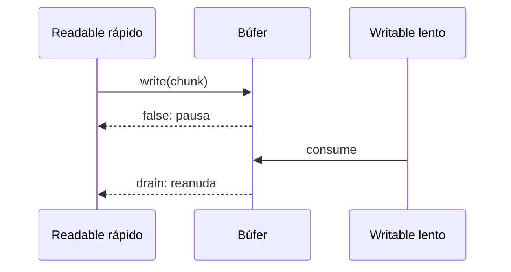

# Módulo 2: Sistema de archivos y streams


## Aprende construyendo

### Tema 1: fs/promises frente a callbacks

**Conceptos clave:** tres estilos de API de archivos, evolución histórica de Node.

Node ofrece tres estilos distintos para operaciones del sistema de archivos, reflejando la evolución histórica del propio lenguaje y del runtime. El estilo síncrono (`fs.readFileSync`) bloquea el hilo único de JavaScript hasta que la operación completa, siendo apropiado únicamente para scripts de configuración ejecutados una sola vez al inicio de un proceso (antes de que el servidor empiece a atender tráfico), nunca dentro del camino crítico de una petición HTTP activa, como se discutió en el Módulo 0. El estilo de callbacks clásico (`fs.readFile(ruta, callback)`) fue la forma original y predominante de Node antes de que las Promesas se estandarizaran en el propio lenguaje JavaScript, y sigue presente en gran cantidad de código legado y en ciertas APIs internas de Node que aún no tienen equivalente moderno.

`fs/promises` (importado como `import { readFile } from "node:fs/promises";`) es la interfaz moderna y recomendada para código nuevo, devolviendo Promesas en vez de requerir callbacks, permitiendo el uso directo de `async`/`await` (estudiado en profundidad en el Módulo 6 del track de JavaScript) para escribir código de manejo de archivos que se lee de forma secuencial y con manejo de errores mediante `try`/`catch` normal, en vez del patrón "error-first callback" (`(err, data) => {...}`) característico del estilo clásico de callbacks de Node, donde el primer argumento del callback está reservado convencionalmente para un posible error, y el desarrollador debe verificarlo explícitamente en cada callback antes de proceder a usar el resultado.

Elegir `fs/promises` para código nuevo no es solo una preferencia estilística: código basado en Promesas se compone naturalmente con `Promise.all` (Módulo 5 del track de JavaScript) para operaciones paralelas, con `try`/`catch` para manejo de errores unificado, y con el resto del ecosistema moderno de JavaScript que asume Promesas como el mecanismo estándar de asincronía, mientras que mezclar estilos de callback clásico con código moderno basado en `async`/`await` introduce fricción de composición y aumenta el riesgo de errores de manejo de errores olvidados (un callback de error no verificado explícitamente falla silenciosamente, mientras que una Promesa rechazada sin manejar produce al menos una advertencia visible de "unhandled rejection").

Reconocer y poder leer las tres formas es, sin embargo, necesario en la práctica real: código legado de Node con años de antigüedad frecuentemente usa el estilo de callbacks clásico, y comprender su patrón (incluyendo la convención "error-first") es indispensable para mantener y depurar ese código existente, incluso cuando código nuevo debería preferir consistentemente `fs/promises`.

**Analogía:** las tres formas de la API de archivos son como tres formas distintas de encargar un trabajo externo: la versión síncrona es esperar de pie, sin hacer nada más, hasta que el trabajo termine completamente; la versión de callback clásico es dejar un número de contacto para que te avisen cuando termine, revisando manualmente si hubo algún problema en ese aviso; la versión de Promesas es recibir un recibo formal con garantías claras sobre cómo se comunicará tanto el éxito como cualquier fallo, integrado naturalmente con el resto de tus herramientas de seguimiento modernas.

**¿Por qué es importante?** `fs/promises` es la interfaz recomendada para código nuevo por su composición natural con `async`/`await` y el manejo de errores unificado, pero reconocer el estilo de callbacks clásico sigue siendo necesario para trabajar con código legado ampliamente presente en el ecosistema Node.

**Código del ejemplo:**

```js
// Síncrono: bloquea el hilo, solo para scripts de configuración inicial
const datos = fs.readFileSync("config.json", "utf-8");

// Callback clásico: error-first, código legado común
fs.readFile("config.json", "utf-8", (err, datos) => { /* verificar err primero */ });

// fs/promises: moderno, recomendado, compone con async/await
const datos2 = await readFile("config.json", "utf-8");
```

#### Paso 1 · Objetivo y preparación

Al finalizar podrás leer y validar JSON con `fs/promises`, y reconocer código de callbacks sin mezclar ambos estilos. Los prerrequisitos son Node LTS, `async`/`await` básico y saber qué representa una ruta. Este ejemplo independiente comienza en una carpeta vacía.

#### Paso 2 · Contexto y caso real

En un caso profesional, una herramienta de línea de comandos carga configuración antes de ejecutar un trabajo. El archivo puede no existir, tener JSON inválido o contener datos con tipos incorrectos; cada fallo necesita un diagnóstico distinto y una acción concreta.

#### Paso 3 · Teoría y analogía aplicada

La API síncrona espera de pie; el callback deja un número; la promesa entrega un comprobante componible. Para código nuevo se prefiere `fs/promises`, pero eso no elimina la obligación de validar el contenido: leer bytes correctamente no garantiza que el JSON tenga la forma esperada.

#### Paso 4 · Demostración guiada desde cero

Desde una carpeta vacía crea el proyecto nuevo:

```bash
mkdir ejemplo-fs-promises
cd ejemplo-fs-promises
npm init -y
mkdir src
```

Añade `"type": "module"` a `package.json`. Crea `config.json`:

```json
{
  "port": 3000,
  "maxUploadMb": 25
}
```

Crea `src/cargar-config.js`:

```js
import { readFile } from "node:fs/promises";

function validarConfig(valor) {
  if (!Number.isInteger(valor.port) || valor.port < 1 || valor.port > 65_535) {
    throw new Error("config.port debe ser un entero entre 1 y 65535");
  }
  if (!Number.isFinite(valor.maxUploadMb) || valor.maxUploadMb <= 0) {
    throw new Error("config.maxUploadMb debe ser un número positivo");
  }
  return Object.freeze(valor);
}

async function cargarConfig(ruta) {
  try {
    // readFile rechaza la promesa ante errores del sistema de archivos.
    const texto = await readFile(ruta, "utf8");
    return validarConfig(JSON.parse(texto));
  } catch (error) {
    // cause conserva ENOENT, SyntaxError u otra causa original para diagnóstico.
    throw new Error(`No fue posible cargar la configuración desde ${ruta}`, {
      cause: error,
    });
  }
}

try {
  const config = await cargarConfig(new URL("../config.json", import.meta.url));
  console.log("Configuración válida:", config);
} catch (error) {
  console.error(error.message);
  console.error("Causa:", error.cause?.code ?? error.cause?.message);
  process.exitCode = 1;
}
```

La función separa transporte, parseo y validación; `cause` conserva el error técnico sin perder el mensaje útil. Ejecuta:

```bash
node src/cargar-config.js
```

**Resultado esperado:** imprime `Configuración válida` con puerto `3000` y límite `25`.

**Fallo deliberado y diagnóstico:** renombra `config.json` a `config.backup.json` y ejecuta otra vez. Debes ver la ruta solicitada y la causa `ENOENT`, que significa archivo inexistente. Restáuralo; luego elimina una comilla para observar que `SyntaxError` es un fallo diferente.

#### Paso 5 · Práctica guiada

Añade `region` y exige una cadena no vacía. **Pista:** valida después de `JSON.parse`, muestra un mensaje con el nombre exacto del campo y prueba primero con `"region": "co"` y después con `"region": ""`.

#### Paso 6 · Práctica independiente

Crea `limits.json`, cárgalo junto con `config.json` mediante `Promise.all` y entrega salida de éxito y de archivo ausente. Explica por qué las lecturas independientes pueden iniciarse juntas y cómo identificar cuál falló.

#### Paso 7 · Cierre y conexión

Ya puedes leer, parsear, validar y diagnosticar archivos sin bloquear. El siguiente tema procesará datos demasiado grandes para cargarlos completos en memoria mediante otro proyecto nuevo.

**Errores comunes:** olvidar `utf8` y recibir un `Buffer`; capturar el error sin conservar su causa; confiar en JSON sin validar; mezclar callback y `await`; usar lectura síncrona dentro de tráfico activo.

**Fuentes oficiales:** [`fs/promises`](https://nodejs.org/api/fs.html#promises-api), [`readFile`](https://nodejs.org/api/fs.html#fspromisesreadfilepath-options) y [errores de sistema Node](https://nodejs.org/api/errors.html#common-system-errors).

#### Paso 1 · Objetivo y preparación

Al finalizar podrás leer, transformar y escribir datos por fragmentos sin cargar todo el archivo. Necesitas Node LTS y reconocer una función callback; el ejemplo inicia en una carpeta vacía.

#### Paso 2 · Contexto y caso real

En una situación real, una exportación CSV puede ocupar gigabytes. Un stream permite convertir cada línea mientras llega, con memoria acotada y un error localizable.

#### Paso 3 · Teoría y analogía aplicada

Un `Readable` produce, un `Transform` modifica y un `Writable` consume. La analogía del pastel se aplica a chunks: nunca intentas guardar el pastel entero en la memoria. Un chunk tampoco equivale necesariamente a una línea, por lo que el parser debe conservar fragmentos parciales.

#### Paso 4 · Demostración guiada desde cero

Desde una carpeta vacía crea el ejemplo:

```bash
mkdir ejemplo-streams
cd ejemplo-streams
npm init -y
mkdir src
```

Añade `"type": "module"` a `package.json`. Crea `src/convertir.js`:

```js
import { createReadStream, createWriteStream } from "node:fs";
import { Transform } from "node:stream";
import { pipeline } from "node:stream/promises";

let pendiente = "";
const convertir = new Transform({
  transform(chunk, _encoding, callback) {
    pendiente += chunk.toString();
    const lineas = pendiente.split("\n");
    pendiente = lineas.pop();
    try {
      for (const linea of lineas.filter(Boolean)) {
        const [id, peso] = linea.split(",");
        const numero = Number(peso);
        if (!id || !Number.isFinite(numero)) throw new Error(`Línea inválida: ${linea}`);
        this.push(JSON.stringify({ id, peso: numero }) + "\n");
      }
      callback();
    } catch (error) { callback(error); }
  },
  flush(callback) {
    if (pendiente.trim()) this.push(JSON.stringify({ id: pendiente, peso: 0 }) + "\n");
    callback();
  },
});

await pipeline(
  createReadStream("datos.csv", { highWaterMark: 8 }),
  convertir,
  createWriteStream("salida.jsonl"),
);
console.log("Conversión completa: revisa salida.jsonl");
```

Crea `datos.csv` con `A1,2.5` y `B2,4`, y ejecuta desde la raíz:

```bash
node src/convertir.js
```

**Resultado esperado:** `salida.jsonl` contiene dos objetos JSON, aunque el tamaño de chunk sea menor que una línea.

**Fallo deliberado y diagnóstico:** cambia `B2,4` por `B2,cuatro`. El pipeline termina con código distinto de cero y señala la línea inválida; corrige el dato antes de publicar la salida.

#### Paso 5 · Práctica guiada

Añade una tercera columna `estado` y conserva el estado en cada objeto. **Pista:** separa el parseo de la validación para que el error diga qué columna falta.

#### Paso 6 · Práctica independiente

Genera un CSV de 10 000 líneas y registra `process.memoryUsage().rss` antes y después. Entrega la salida y explica por qué no crece proporcionalmente al archivo.

#### Paso 7 · Cierre y conexión

Ya transformas archivos grandes con una cadena legible y verificable. El siguiente tema demostrará qué ocurre cuando el consumidor es más lento que el productor.

**Errores comunes:** asumir que un chunk es una línea; olvidar `flush`; ignorar el error del callback; acumular todo en un arreglo; cerrar streams manualmente sin `pipeline`.

**Fuentes oficiales:** [Streams de Node](https://nodejs.org/api/stream.html), [`Transform`](https://nodejs.org/api/stream.html#class-streamtransform) y [`pipeline`](https://nodejs.org/api/stream.html#streampipelinestreams-options).

### Tema 2: Streams legibles, escribibles y transform

**Conceptos clave:** procesamiento por chunks, `Readable`, `Writable`, `Transform`.

Un stream procesa datos en fragmentos pequeños (chunks) a medida que están disponibles, en vez de esperar a que el conjunto completo de datos esté disponible en memoria antes de empezar a procesarlo, una diferencia fundamental que hace posible trabajar con archivos o flujos de datos de tamaño arbitrariamente grande (incluso mayor que la memoria RAM disponible del sistema) sin agotar los recursos del proceso. Node modela tres tipos principales de streams según su rol: un `Readable` produce datos (por ejemplo, `fs.createReadStream` lee un archivo del disco en chunks sucesivos, en vez de cargarlo completo de una sola vez con `readFile`); un `Writable` consume datos (`fs.createWriteStream` escribe chunks recibidos progresivamente a un archivo de destino); y un `Transform` hace ambas cosas simultáneamente, recibiendo datos de entrada, transformándolos de alguna forma específica, y produciendo datos de salida, actuando como un eslabón intermedio en una cadena de procesamiento.

Un `Transform` personalizado se implementa extendiendo la clase base e implementando el método `_transform(chunk, encoding, callback)`, que recibe cada chunk de entrada, realiza la transformación deseada (por ejemplo, convertir una línea de texto CSV a un objeto JSON serializado), e invoca `callback(error, resultadoTransformado)` para indicar que ese chunk específico terminó de procesarse y puede pasar al siguiente eslabón de la cadena (o señalar un error si la transformación de ese chunk específico falló). Este patrón permite construir pipelines de procesamiento de datos completamente personalizados, componiendo transformaciones específicas y reutilizables en cadenas más complejas según las necesidades exactas de cada caso de uso.

Trabajar directamente con streams requiere un cambio de mentalidad respecto a procesar datos completos en memoria: en vez de pensar "tengo el archivo CSV completo como un string, y ahora lo proceso todo de una vez", se piensa "cada línea (o chunk) llega, la proceso individualmente, y la envío hacia adelante", un modelo de procesamiento incremental que es, en esencia, el mismo principio detrás de la programación funcional con `map`/`filter` (Módulo 4 del track de JavaScript), pero aplicado a datos que fluyen progresivamente en el tiempo, en vez de a una colección ya completamente disponible en memoria de antemano.

Este modelo de streams no es exclusivo del manejo de archivos: subyace también a la comunicación de red en Node (una petición HTTP entrante, estudiada en el Módulo 3, es en sí misma un stream legible de la que se leen los datos del cuerpo de la petición progresivamente a medida que llegan por la red, no como un objeto ya completamente parseado desde el inicio), haciendo que dominar streams sea una habilidad transversal aplicable a múltiples contextos distintos dentro del ecosistema de Node.

**Analogía:** procesar un archivo completo en memoria es como intentar tragar un pastel entero de una sola vez; procesarlo con streams es como comerlo en bocados manejables, uno tras otro, permitiendo disfrutar (procesar) un pastel de cualquier tamaño sin importar cuán grande sea, sin necesidad de que quepa completo de una sola vez en la boca (la memoria RAM disponible).

**¿Por qué es importante?** Los streams son el patrón fundamental que hace posible que Node procese archivos y datos de red de tamaño arbitrariamente grande con un uso de memoria acotado y predecible, un mecanismo que subyace a gran parte de la API core de Node, incluyendo el manejo de peticiones HTTP.

**Código del ejemplo:**

```js
import { createReadStream, createWriteStream } from "node:fs";
import { Transform } from "node:stream";

const csvALinea = new Transform({
  transform(chunk, _enc, callback) {
    const json = csvLineaAJson(chunk.toString());
    callback(null, json + "\n");
  },
});
// lectura (Readable) → transformación (Transform) → escritura (Writable)
```

#### Paso 1 · Objetivo y preparación

Al finalizar podrás conectar un `Readable`, un `Transform` y un `Writable` sin confundir un chunk con una línea. **Prerrequisitos:** Node LTS y reconocer objetos JSON. Este ejemplo independiente no usa archivos de ningún tema anterior.

#### Paso 2 · Contexto y caso real

Una importación de productos puede recibir un CSV de cientos de megabytes. Cargar todo con `readFile` aumenta la memoria con el tamaño del archivo; el caso real requiere transformar cada fila mientras llega y escribir el resultado gradualmente.

#### Paso 3 · Teoría y analogía aplicada

Un `Readable` entrega porciones arbitrarias; por eso una línea puede partirse entre dos chunks. El `Transform` debe conservar la parte incompleta y emitir solo registros enteros. Como comer un pastel por bocados, cada etapa toma una porción manejable, pero el límite de un bocado no coincide con el final de una frase.

#### Paso 4 · Demostración guiada desde cero

Desde una carpeta vacía crea el proyecto nuevo:

```bash
mkdir ejemplo-streams-csv
cd ejemplo-streams-csv
npm init -y
mkdir src data salida
```

Añade `"type": "module"` a `package.json`. Crea `data/guias.csv`:

```csv
numero,pesoKg
PK-100,2.5
PK-101,1.2
```

Crea `src/csv-a-jsonl.js`:

```js
import { createReadStream, createWriteStream } from "node:fs";
import { Transform } from "node:stream";
import { pipeline } from "node:stream/promises";

let pendiente = "";

const separarLineas = new Transform({
  transform(chunk, _encoding, callback) {
    pendiente += chunk.toString("utf8");
    const lineas = pendiente.split("\n");
    pendiente = lineas.pop(); // Guarda la línea cortada para el próximo chunk.
    for (const linea of lineas) this.push(linea);
    callback();
  },
  flush(callback) {
    if (pendiente) this.push(pendiente);
    callback();
  },
});

let esCabecera = true;
const convertirGuia = new Transform({
  writableObjectMode: false,
  transform(linea, _encoding, callback) {
    const texto = linea.toString().trim();
    if (!texto || esCabecera) {
      esCabecera = false;
      return callback();
    }
    const [numero, pesoTexto] = texto.split(",");
    const pesoKg = Number(pesoTexto);
    if (!numero || !Number.isFinite(pesoKg) || pesoKg <= 0) {
      return callback(new Error(`Fila inválida: ${texto}`));
    }
    // JSON Lines deja un objeto completo por línea para procesarlo después.
    callback(null, `${JSON.stringify({ numero, pesoKg })}\n`);
  },
});

await pipeline(
  createReadStream("data/guias.csv", { highWaterMark: 8 }),
  separarLineas,
  convertirGuia,
  createWriteStream("salida/guias.jsonl"),
);

console.log("Conversión terminada: salida/guias.jsonl");
```

`highWaterMark: 8` fuerza chunks pequeños para hacer visible que el parser no puede asumir una línea por chunk. `flush` emite el último fragmento al terminar. Ejecuta:

```bash
node src/csv-a-jsonl.js
```

**Resultado esperado:** aparece el mensaje de conversión y `salida/guias.jsonl` contiene dos líneas JSON: una para `PK-100` y otra para `PK-101`.

**Fallo deliberado y diagnóstico:** cambia `PK-101,1.2` por `PK-101,no-peso`. El proceso falla con `Fila inválida`; el problema está en los datos de entrada, no en la memoria ni en el stream. Corrige el CSV y ejecuta nuevamente.

#### Paso 5 · Práctica guiada

Agrega una tercera fila y cambia `highWaterMark` de `8` a `64`. **Pista:** el archivo de salida debe ser idéntico; solo cambia cómo llegan los chunks, no la semántica de las filas.

#### Paso 6 · Práctica independiente

Añade un campo `ciudad`, valida que no esté vacío y crea una salida separada para las filas rechazadas. Entrega ambos archivos y explica por qué el separador de líneas conserva estado entre chunks.

#### Paso 7 · Cierre y conexión

Ya procesas registros incrementales con memoria acotada. El siguiente tema mostrará el mecanismo que impide que una fuente rápida sature a un destino lento, también desde un proyecto nuevo.

**Errores comunes:** tratar cada chunk como fila; olvidar `flush`; usar `split(",")` para CSV con comillas complejas sin un parser; acumular el archivo entero; emitir datos después de `callback`.

**Fuentes oficiales:** [Streams de Node](https://nodejs.org/api/stream.html), [`Transform`](https://nodejs.org/api/stream.html#class-streamtransform) y [`createReadStream`](https://nodejs.org/api/fs.html#fscreatereadstreampath-options).

#### Paso 1 · Objetivo y preparación

Al finalizar podrás detectar backpressure y respetar el valor booleano de `write()`. Necesitas Node LTS y el ejemplo anterior de streams como referencia conceptual, pero crearás una carpeta nueva.

#### Paso 2 · Contexto y caso real

En producción un lector de red puede entregar datos mucho más rápido que una base de datos. Sin backpressure, el búfer crece hasta presionar la memoria del proceso.

#### Paso 3 · Teoría y analogía aplicada

`Writable.write()` devuelve `false` cuando su búfer alcanzó el límite; el productor debe esperar `drain`. Es la analogía de una banda transportadora: cuando el almacén se llena, la fábrica pausa la entrada.

#### Paso 4 · Demostración guiada desde cero

Desde una carpeta vacía crea `ejemplo-backpressure` y `src/medir.js`:

```bash
mkdir ejemplo-backpressure
cd ejemplo-backpressure
npm init -y
mkdir src
```

Añade `"type": "module"` y escribe:

```js
import { Writable } from "node:stream";

let recibidos = 0;
const lento = new Writable({
  highWaterMark: 2,
  write(chunk, _encoding, callback) {
    setTimeout(() => { recibidos += 1; callback(); }, 20);
  },
});

for (let i = 0; i < 10; i += 1) {
  const puedeContinuar = lento.write(`paquete-${i}`);
  console.log({ i, puedeContinuar });
  if (!puedeContinuar) await new Promise((resolve) => lento.once("drain", resolve));
}
lento.end(() => console.log("Procesados:", recibidos));
```

Desde la raíz ejecuta `node src/medir.js`. **Resultado esperado:** aparecen valores `false` y el productor espera; finalmente `Procesados: 10`.

**Fallo deliberado y diagnóstico:** elimina la espera de `drain` y cambia el bucle a 100000 elementos. Observa el crecimiento de memoria y deténlo si es necesario. El diagnóstico es ignorar el contrato de `write()`, no “un stream lento”.

#### Paso 5 · Práctica guiada

Registra el tiempo total con `performance.now()`. **Pista:** el tiempo aumenta cuando respetas backpressure, pero la memoria permanece acotada.

#### Paso 6 · Práctica independiente

Compara `highWaterMark` 2 y 20 con 1000 mensajes. Entrega pausas, duración y memoria, y explica el compromiso entre rendimiento y memoria.

#### Paso 7 · Cierre y conexión

Ya sabes cuándo pausar un productor. El siguiente tema compondrá etapas y cancelación con `pipeline` en otra carpeta.

**Errores comunes:** ignorar `false`; usar buffers enormes como “solución”; llamar `end` antes de datos; medir solo tiempo y olvidar memoria; no esperar `drain`.

**Fuentes oficiales:** [`Writable.write`](https://nodejs.org/api/stream.html#writablewritechunk-encoding-callback) y [backpressure](https://nodejs.org/api/stream.html#highwatermark-discrepancy).

### Tema 3: Backpressure

**Conceptos clave:** autorregulación de flujo, productor más rápido que el consumidor.

Backpressure es el mecanismo mediante el cual un stream automáticamente pausa la producción de nuevos datos cuando el consumidor (el destino, como un archivo en disco, una conexión de red, o un stream de transformación siguiente en la cadena) no puede procesarlos con la misma rapidez con la que la fuente los produce. Sin este mecanismo, un archivo de lectura extremadamente rápida (por ejemplo, desde un disco SSD veloz) conectado a un destino de escritura mucho más lento (por ejemplo, una conexión de red congestionada, o un disco mecánico lento) acumularía datos en un búfer en memoria de forma indefinidamente creciente, eventualmente agotando la memoria disponible del proceso si el archivo fuera suficientemente grande, precisamente el mismo problema que los streams están diseñados para evitar en primer lugar.

Con backpressure activo, cuando el búfer interno de un stream escribible alcanza un límite configurado, el stream señala explícitamente (mediante el valor de retorno de `write()`, que devuelve `false` en ese caso) que está saturado, y el código responsable de leer del stream de origen debe pausar la lectura hasta recibir el evento `drain` (que indica que el búfer ya se vació lo suficiente para reanudar), coordinando así la velocidad de producción con la velocidad real de consumo, sin necesitar que el desarrollador calcule manualmente ningún límite de tamaño de búfer específico.

Gestionar backpressure manualmente, verificando explícitamente el valor de retorno de `write()` y escuchando el evento `drain` en cada punto de la cadena, es propenso a errores sutiles si se implementa incorrectamente; por esta razón, `pipeline()` (Tema 4) es fuertemente preferible a conectar streams manualmente uno por uno, porque gestiona correctamente el backpressure de forma automática y transparente a través de toda la cadena completa de streams conectados, sin requerir que el desarrollador implemente esa coordinación manualmente en cada punto de conexión entre streams.

Provocar backpressure deliberadamente en un entorno de laboratorio (por ejemplo, conectando una lectura rápida a una escritura artificialmente ralentizada) y observar cómo el stream de lectura se pausa automáticamente es un ejercicio revelador: demuestra que el mecanismo de backpressure no es simplemente una característica opcional de optimización, sino la razón fundamental por la que los streams pueden procesar archivos de tamaño arbitrario sin jamás agotar la memoria del proceso, sin importar cuán desbalanceadas sean las velocidades relativas de producción y consumo en cualquier caso de uso real.

**Analogía:** backpressure es como un sistema de tráfico inteligente en una autopista que automáticamente reduce el flujo de vehículos que ingresan cuando detecta congestión más adelante, evitando que la autopista se sature completamente más allá de su capacidad real, en vez de dejar que los vehículos sigan entrando sin control hasta que el sistema colapse por sobrecarga.

**¿Por qué es importante?** Backpressure es el mecanismo concreto que garantiza que procesar un archivo de cualquier tamaño con streams nunca agote la memoria del proceso, sin importar cuán desbalanceadas sean las velocidades relativas de la fuente y el destino en cualquier caso de uso real.

**Diagrama:**



#### Paso 1 · Objetivo y preparación

Al finalizar podrás observar `write()` devolviendo `false`, esperar `drain` y explicar por qué ese límite protege la memoria. **Prerrequisitos:** Node LTS; el laboratorio es un ejemplo independiente desde carpeta vacía.

#### Paso 2 · Contexto y caso real

Un servicio que recibe telemetría puede producir datos más rápido de lo que una conexión lenta puede guardarlos. Si ignora la señal de saturación, acumula memoria y empeora la latencia de todos los usuarios.

#### Paso 3 · Teoría y analogía aplicada

`highWaterMark` no es un límite exacto de memoria global: es el umbral interno que hace que `write()` diga “detente por ahora”. `drain` comunica que el destino volvió a aceptar datos. Como una rampa de acceso, no elimina los vehículos: regula su entrada para que la carretera siga utilizable.

#### Paso 4 · Demostración guiada desde cero

Desde una carpeta vacía crea el proyecto nuevo y `src/backpressure.js`:

```bash
mkdir ejemplo-backpressure
cd ejemplo-backpressure
npm init -y
mkdir src
```

```js
import { Writable } from "node:stream";
import { once } from "node:events";

class DestinoLento extends Writable {
  _write(chunk, _encoding, callback) {
    // Simula una escritura remota que tarda 15 ms por fragmento.
    setTimeout(() => {
      console.log("Consumido:", chunk.toString().trim());
      callback();
    }, 15);
  }
}

const destino = new DestinoLento({ highWaterMark: 12 });
let pausas = 0;

for (let indice = 1; indice <= 8; indice += 1) {
  const puedeContinuar = destino.write(`dato-${indice}\n`);
  if (!puedeContinuar) {
    pausas += 1;
    console.log("Pausa: búfer lleno; esperando drain");
    await once(destino, "drain");
    console.log("Drain: se puede reanudar");
  }
}

destino.end();
await once(destino, "finish");
console.log({ pausas, rssMb: Math.round(process.memoryUsage().rss / 1024 / 1024) });
```

La clase demora el consumo; el bucle verifica el booleano antes de producir el siguiente dato; `once` evita listeners permanentes. Ejecuta:

```bash
node src/backpressure.js
```

**Resultado esperado:** aparecen una o más parejas `Pausa`/`Drain`, los ocho datos se consumen y se imprime memoria RSS. El número de pausas puede variar al cambiar el límite o el equipo.

**Fallo deliberado y diagnóstico:** comenta temporalmente el bloque `if (!puedeContinuar)` y aumenta el bucle a `10000`, pero no ejecutes más de unos segundos. El búfer crece porque el productor ignora la señal `false`. Detén con `Ctrl+C`; el diagnóstico es presión de escritura no respetada. Restaura el límite de 8 y el bloque.

#### Paso 5 · Práctica guiada

Prueba `highWaterMark: 6` y `highWaterMark: 48`. **Pista:** compara número de pausas, no solo duración; un búfer mayor reduce pausas pero permite más datos en cola.

#### Paso 6 · Práctica independiente

Registra `writableLength` cada vez que `write()` devuelve `false` y entrega una tabla con los dos límites. Explica qué métrica usarías en producción antes de aumentar un búfer.

#### Paso 7 · Cierre y conexión

Ya observaste backpressure y sabes por qué no se debe ignorar. El siguiente tema dejará esta coordinación en manos de `pipeline()` para una cadena completa y segura.

**Errores comunes:** ignorar el retorno de `write`; usar listeners `drain` que nunca se retiran; confundir backpressure con error; aumentar buffers sin medir; bloquear `_write` con CPU.

**Fuentes oficiales:** [backpressuring en Node](https://nodejs.org/en/learn/modules/backpressuring-in-streams), [`Writable.write`](https://nodejs.org/api/stream.html#writablewritechunk-encoding-callback) y [`drain`](https://nodejs.org/api/stream.html#event-drain).

#### Paso 1 · Objetivo y preparación

Al finalizar podrás componer lectura, transformación y escritura con `pipeline`, propagando errores y cancelación. Necesitas Node LTS; el ejemplo es independiente.

#### Paso 2 · Contexto y caso real

Una importación profesional no debe dejar un archivo parcial si una fila es inválida o el usuario cancela. `pipeline` centraliza cierre y propagación de errores.

#### Paso 3 · Teoría y analogía aplicada

`pipeline` conecta etapas como una cadena de producción con un supervisor: si una estación falla, detiene y cierra las demás. Un `pipe` manual puede olvidar listeners, archivos abiertos o errores.

#### Paso 4 · Demostración guiada desde cero

Desde una carpeta vacía crea `ejemplo-pipeline`, `src/importar.js` y un `datos.txt`:

```bash
mkdir ejemplo-pipeline
cd ejemplo-pipeline
npm init -y
mkdir src
```

Añade `"type": "module"` y crea:

```js
import { createReadStream, createWriteStream } from "node:fs";
import { Transform } from "node:stream";
import { pipeline } from "node:stream/promises";

const mayusculas = new Transform({
  transform(chunk, _encoding, callback) {
    const texto = chunk.toString();
    if (texto.includes("ERROR")) return callback(new Error("Entrada rechazada"));
    callback(null, texto.toUpperCase());
  },
});

try {
  await pipeline(createReadStream("datos.txt"), mayusculas, createWriteStream("salida.txt"));
  console.log("Pipeline completo");
} catch (error) {
  console.error("Importación cancelada:", error.message);
  process.exitCode = 1;
}
```

Ejecuta `node src/importar.js`. **Resultado esperado:** `salida.txt` contiene el texto en mayúsculas. Cambia una línea a `ERROR`: el comando termina con código 1 y cierra la cadena.

#### Paso 5 · Práctica guiada

Añade un `AbortController` y cancela después de 10 ms. **Pista:** pasa `{ signal: controller.signal }` como cuarta opción de `pipeline`.

#### Paso 6 · Práctica independiente

Haz que la salida se escriba primero en `salida.tmp` y se publique solo tras éxito. Entrega qué archivo queda después de una fila inválida y por qué evita publicar datos parciales.

#### Paso 7 · Cierre y conexión

Ya puedes construir cadenas que fallan de forma segura. El próximo módulo aplicará estas garantías a servidores HTTP independientes.

**Errores comunes:** usar `pipe` sin manejo de errores; ignorar abortos; publicar salida parcial; reutilizar un stream terminado; capturar el error sin código de salida.

**Fuentes oficiales:** [`stream.pipeline`](https://nodejs.org/api/stream.html#streampipelinestreams-options) y [AbortSignal](https://nodejs.org/api/globals.html#class-abortcontroller).

### Tema 4: pipeline() para componer streams de forma segura

**Conceptos clave:** composición segura, propagación de errores, cierre correcto de recursos.

Conectar streams manualmente encadenando el método `.pipe()` (por ejemplo, `lectura.pipe(transformacion).pipe(escritura)`) funciona para el caso feliz donde ningún stream falla, pero tiene un problema serio de manejo de errores: si cualquier stream intermedio de la cadena emite un error, `.pipe()` encadenado manualmente no propaga ni maneja ese error de forma automática hacia los demás streams de la cadena, dejando potencialmente streams sin cerrar correctamente (una fuga de recursos del sistema operativo, como descriptores de archivo abiertos indefinidamente) y requiriendo que el desarrollador añada manualmente listeners de error en cada stream individual de la cadena para gestionar correctamente cualquier fallo parcial.

`pipeline()`, disponible tanto en su forma de callback (`stream.pipeline`) como en su forma de Promesa (`stream/promises`, permitiendo `await pipeline(...)` directamente con `async`/`await`), resuelve este problema conectando múltiples streams en una cadena mientras gestiona automáticamente tanto la propagación de errores (si cualquier stream de la cadena falla, `pipeline()` se asegura de que todos los demás streams de la cadena se cierren correctamente, liberando sus recursos subyacentes) como el backpressure a través de toda la cadena completa, sin requerir que el desarrollador implemente manualmente ninguna de estas dos responsabilidades en cada punto de conexión.

Esta es la razón concreta por la que la documentación oficial de Node recomienda `pipeline()` sobre encadenar `.pipe()` manualmente para prácticamente cualquier composición de streams no trivial: la diferencia no es solo de conveniencia sintáctica, sino de corrección real ante fallos parciales, que son considerablemente más probables en cadenas de procesamiento de datos del mundo real (un archivo corrupto a mitad de lectura, una conexión de red que se interrumpe durante la escritura) que en el escenario ideal donde todo funciona sin ningún fallo en ningún punto de la cadena.

Usar `await pipeline(lectura, transformacion, escritura)` dentro de una función `async` con manejo de errores mediante `try`/`catch` combina naturalmente el patrón de streams con el patrón de manejo de errores asíncrono estudiado en el Módulo 6 del track de JavaScript, produciendo código que se lee de forma secuencial y clara sobre una composición de streams, mientras internamente `pipeline()` gestiona correctamente toda la complejidad de propagación de errores y backpressure entre los streams conectados.

**Analogía:** encadenar `.pipe()` manualmente es como conectar varias mangueras de agua una tras otra sin ningún mecanismo de seguridad: si una manguera intermedia revienta, el agua sigue fluyendo descontroladamente por las demás sin que nada se detenga automáticamente. `pipeline()` es como un sistema de mangueras con válvulas de seguridad automáticas en cada conexión, que cierran instantáneamente todo el sistema completo si cualquier punto falla, evitando derrames descontrolados en cualquier parte de la cadena.

**¿Por qué es importante?** `pipeline()` es la forma correcta y recomendada de componer streams en Node, gestionando automáticamente tanto la propagación de errores como el backpressure a través de toda la cadena, evitando fugas de recursos que `.pipe()` encadenado manualmente no previene de forma segura.

**Código del ejemplo:**

```js
import { pipeline } from "node:stream/promises";

try {
  await pipeline(
    createReadStream("entrada.csv"),
    csvALinea,
    createWriteStream("salida.jsonl")
  );
  console.log("Transformación completa");
} catch (error) {
  console.error("Falló en algún punto de la cadena:", error);
  // pipeline() ya cerró correctamente todos los streams involucrados
}
```

#### Paso 1 · Objetivo y preparación

Al finalizar podrás componer una cadena de streams con `pipeline()`, tratar su rechazo y limpiar una salida parcial. **Prerrequisitos:** saber qué hacen `Readable`, `Transform` y `Writable`; este ejemplo independiente empieza desde una carpeta vacía.

#### Paso 2 · Contexto y caso real

Un proceso de importación debe generar un archivo final solo si todas las filas fueron válidas. Si una fila falla a mitad de camino, dejar un resultado parcial puede inducir a otro proceso a usar datos incompletos.

#### Paso 3 · Teoría y analogía aplicada

`.pipe()` conecta el caso feliz; `pipeline()` administra la cadena como una operación: propaga error, destruye sus streams y espera el cierre. En la analogía de las mangueras, una válvula de seguridad detiene el conjunto cuando una sección falla; luego tu código decide si elimina el producto parcial.

#### Paso 4 · Demostración guiada desde cero

Desde una carpeta vacía crea el proyecto nuevo:

```bash
mkdir ejemplo-pipeline
cd ejemplo-pipeline
npm init -y
mkdir src data salida
```

Añade `"type": "module"` a `package.json`. Crea `data/numeros.txt`:

```text
2
4
6
```

Crea `src/importar.js`:

```js
import { createReadStream, createWriteStream } from "node:fs";
import { rm } from "node:fs/promises";
import { Transform } from "node:stream";
import { pipeline } from "node:stream/promises";

const destino = "salida/cuadrados.jsonl";

let pendiente = "";
const convertirNumero = new Transform({
  transform(chunk, _encoding, callback) {
    pendiente += chunk.toString("utf8");
    const lineas = pendiente.split("\n");
    pendiente = lineas.pop();
    for (const linea of lineas) {
      const numero = Number(linea);
      if (!Number.isInteger(numero)) {
        return callback(new Error(`Valor no entero: ${linea}`));
      }
      this.push(`${JSON.stringify({ numero, cuadrado: numero ** 2 })}\n`);
    }
    callback();
  },
  flush(callback) {
    if (pendiente) {
      const numero = Number(pendiente);
      if (!Number.isInteger(numero)) return callback(new Error(`Valor no entero: ${pendiente}`));
      this.push(`${JSON.stringify({ numero, cuadrado: numero ** 2 })}\n`);
    }
    callback();
  },
});

try {
  await pipeline(
    createReadStream("data/numeros.txt"),
    convertirNumero,
    createWriteStream(destino),
  );
  console.log("Transformación completa:", destino);
} catch (error) {
  // force evita que un archivo inexistente o ya cerrado oculte el error original.
  await rm(destino, { force: true });
  console.error("Importación cancelada:", error.message);
  process.exitCode = 1;
}
```

`await pipeline(...)` resuelve solo después de que toda la cadena termina. El `catch` borra la salida que no debe publicarse. Ejecuta:

```bash
node src/importar.js
```

**Resultado esperado:** imprime `Transformación completa` y `salida/cuadrados.jsonl` contiene tres objetos con cuadrados `4`, `16` y `36`.

**Fallo deliberado y diagnóstico:** reemplaza `4` por `cuatro` y ejecuta. Debes ver `Importación cancelada: Valor no entero: cuatro`, código de salida distinto de cero y ningún archivo de salida. El diagnóstico confirma que `pipeline()` propagó el fallo y que tu aplicación limpió el resultado parcial.

#### Paso 5 · Práctica guiada

Añade una validación que rechace números negativos. **Pista:** valida antes de llamar a `this.push`; prueba `-3` y confirma que el archivo de salida se elimina.

#### Paso 6 · Práctica independiente

Usa `AbortController` para cancelar el pipeline después de procesar cierto número de líneas. Entrega el error de cancelación, verifica que no quede salida parcial y explica por qué cancelar no es lo mismo que completar correctamente.

#### Paso 7 · Cierre y conexión

Ya puedes construir una importación que falla de forma segura. El siguiente módulo introducirá HTTP, también con un ejemplo que se crea desde cero y se puede ejecutar sin preparación acumulada.

**Errores comunes:** usar `.pipe()` sin manejar errores; publicar la salida antes de terminar; limpiar el archivo y ocultar el error original; asumir que cada chunk contiene líneas completas; olvidar cerrar recursos al cancelar.

**Fuentes oficiales:** [`stream/promises.pipeline`](https://nodejs.org/api/stream.html#streampromisespipeline), [composición de streams](https://nodejs.org/api/stream.html#stream_pipeline_streams_callback) y [`AbortController` en Node](https://nodejs.org/api/globals.html#class-abortcontroller).

---


## Construcción guiada del capítulo

**Objetivo del laboratorio:** transformar un archivo CSV grande a formato JSON usando streams compuestos con `pipeline()`, sin cargarlo completo en memoria, y observar backpressure de forma experimental.

**Requisitos previos:** Node.js instalado, Módulos 0-1 completados.

| Paso | Acción | Código | Explicación |
|---|---|---|---|
| 1 | Comparar las tres formas de leer un archivo | `readFileSync`, callback clásico, `fs/promises` | Compara sintaxis y manejo de errores de cada una |
| 2 | Generar un CSV de 500k líneas | Script generador simple | Mide memoria usada al leerlo completo con `readFileSync` |
| 3 | Leer el mismo archivo con un stream | `fs.createReadStream` | Procesa línea por línea sin cargarlo completo en memoria |
| 4 | Implementar un `Transform` CSV→JSON | Ver Tema 2 | Convierte cada línea a un objeto JSON serializado |
| 5 | Componer los tres streams con `pipeline()` | Ver Tema 4 | Verifica manejo correcto de errores si el archivo está corrupto |
| 6 | Provocar backpressure intencionalmente | Escritura artificialmente ralentizada | Observa que la lectura se autorregula, pausándose |

**Verificación:** el laboratorio se considera exitoso si el uso de memoria al procesar el archivo con streams permanece acotado y bajo (no crece proporcionalmente al tamaño del archivo), a diferencia de `readFileSync` del paso 2, y si `pipeline()` maneja correctamente un fallo intencional (archivo corrupto) cerrando todos los streams sin dejar recursos abiertos.

### Comprueba lo construido

#### Ejercicio verificable 1

¿Qué módulo moderno permite usar archivos con `async/await`?

**Respuesta esperada:** node:fs/promises|fs/promises

#### Ejercicio verificable 2

¿Qué evento indica que un Writable saturado puede recibir más datos?

**Respuesta esperada:** drain

#### Ejercicio verificable 3

¿Qué función recomendada propaga errores y cierra toda una cadena de streams?

**Respuesta esperada:** pipeline|pipeline()

**Errores comunes y soluciones**

- **Usar `readFileSync` en un archivo de tamaño desconocido o potencialmente grande.** Usa streams para cualquier archivo cuyo tamaño no esté acotado y controlado de antemano.
- **Encadenar `.pipe()` manualmente sin manejo de errores en cada stream individual.** Usa `pipeline()` en su lugar, que gestiona la propagación de errores automáticamente.
- **Olvidar invocar el `callback` dentro de `_transform` de un stream personalizado.** Sin invocarlo, el stream se queda colgado indefinidamente esperando esa señal de que el chunk terminó de procesarse.

---
