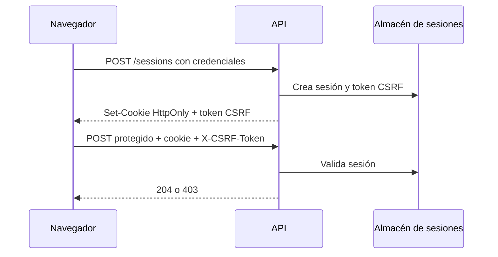

# Módulo 6: Autenticación y autorización


## Aprende construyendo

### Tema 1: Hashing de contraseñas

#### Paso 1 · Objetivo y preparación

Al finalizar podrás almacenar una contraseña sin guardar el texto original y verificarla al iniciar sesión. **Prerrequisitos:** Node LTS, npm y una terminal; este ejemplo es independiente y empieza en una carpeta vacía.

#### Paso 2 · Contexto y caso real

En una aplicación real, una fuga de la base de usuarios no debe revelar contraseñas reutilizadas. El servidor necesita una función lenta y con salt para que probar millones de candidatos sea costoso.

#### Paso 3 · Teoría y analogía aplicada

Hashing no es cifrado reversible: se guarda una huella y se compara otra huella. `scrypt` deriva una clave con trabajo configurable; el salt hace que dos usuarios con la misma contraseña produzcan valores distintos. Es como una cerradura que se puede comprobar, pero no abrir leyendo el registro.

#### Paso 4 · Demostración guiada desde cero

```bash
mkdir ejemplo-password-hash
cd ejemplo-password-hash
npm init -y
mkdir src
```

Crea `src/password.js`:

```js
import { randomBytes, scrypt as derivar } from "node:crypto";
import { promisify } from "node:util";
const scrypt = promisify(derivar);

export async function crearHash(password) {
  if (typeof password !== "string" || password.length < 12) throw new Error("Usa al menos 12 caracteres");
  const salt = randomBytes(16).toString("hex");
  const clave = await scrypt(password, salt, 64);
  return `${salt}:${clave.toString("hex")}`;
}

export async function verificar(password, registro) {
  const [salt, esperado] = registro.split(":");
  const actual = await scrypt(password, salt, 64);
  return actual.toString("hex") === esperado;
}

const registro = await crearHash("una-clave-larga-segura");
console.log({ registro, valida: await verificar("una-clave-larga-segura", registro) });
```

Desde la raíz ejecuta `node src/password.js`. **Resultado esperado:** `valida: true` y una huella distinta en cada ejecución. **Fallo deliberado y diagnóstico:** cambia la contraseña a `1234`; el programa rechaza la entrada antes de derivar la clave. Nunca “corrijas” guardando el texto original.

#### Paso 5 · Práctica guiada

Verifica una contraseña incorrecta. **Pista:** debe devolver `false` sin revelar cuál parte del hash coincide.

#### Paso 6 · Práctica independiente

Añade un registro de intento fallido sin guardar la contraseña. Entrega la salida de éxito y fallo, y explica por qué comparar hashes con `===` puede requerir una comparación resistente al tiempo en un sistema de alto riesgo.

#### Paso 7 · Cierre y conexión

Ya puedes separar almacenamiento de credenciales y verificación. El siguiente tema creará tokens firmados en otra carpeta.

**Errores comunes:** usar `md5`; reutilizar salt; cifrar esperando descifrar; aceptar contraseñas triviales; imprimir el hash en logs de producción.

**Fuentes oficiales:** [`node:crypto`](https://nodejs.org/api/crypto.html) y [OWASP Password Storage Cheat Sheet](https://cheatsheetseries.owasp.org/cheatsheets/Password_Storage_Cheat_Sheet.html).

**Conceptos clave:** hashing frente a cifrado, funciones lentas deliberadamente, `bcrypt`/`argon2`.

Una contraseña nunca debe almacenarse en texto plano, ni siquiera cifrada (encriptada) de forma reversible: debe almacenarse hasheada, un proceso unidireccional que transforma la contraseña en una cadena de longitud fija que no puede revertirse matemáticamente de vuelta a la contraseña original. La distinción entre hashing y cifrado es crucial: el cifrado está diseñado para ser reversible (existe una clave que permite recuperar el texto original), apropiado para datos que legítimamente necesitan recuperarse; el hashing está diseñado deliberadamente para ser irreversible, apropiado precisamente para contraseñas, donde el sistema nunca necesita "recordar" la contraseña original, solo verificar si un intento de login coincide con ella.

`bcrypt` y `argon2` son algoritmos de hashing diseñados específicamente para contraseñas, con una propiedad deliberada y contraintuitiva: son lentos a propósito, y ese costo computacional es ajustable mediante un parámetro de "factor de costo" (el `10` en `bcrypt.hash(contraseña, 10)`) que se puede aumentar con el tiempo a medida que el hardware se vuelve más rápido, manteniendo el costo de un ataque de fuerza bruta (probar millones de contraseñas candidatas) prohibitivamente alto incluso con hardware moderno especializado en cómputo paralelo masivo. Esto contrasta directamente con funciones hash de propósito general como SHA-256, diseñadas para ser extremadamente rápidas (apropiado para verificar integridad de archivos, por ejemplo), una propiedad que las hace inadecuadas específicamente para contraseñas, porque esa misma velocidad facilita enormemente los ataques de fuerza bruta.

`bcrypt.compare(contraseñaIngresada, hashAlmacenado)` verifica un intento de login sin necesitar revertir el hash almacenado: internamente, hashea la contraseña ingresada con los mismos parámetros usados originalmente (incluyendo la "sal" aleatoria embebida en el propio hash almacenado, que previene que dos usuarios con la misma contraseña produzcan el mismo hash) y compara el resultado con el hash almacenado. Nunca construir un algoritmo propio de hashing de contraseñas, ni siquiera "solo por curiosidad" en un proyecto pequeño, es una recomendación categórica de la industria: diseñar criptografía segura requiere experiencia especializada extremadamente profunda para evitar vulnerabilidades sutiles que un atacante experimentado explotaría, y bibliotecas como bcrypt/argon2 ya han sido revisadas y probadas exhaustivamente por la comunidad de seguridad durante años.

**Analogía:** hashear una contraseña es como triturar un documento en una trituradora industrial de alta seguridad: es fácil verificar que un fragmento específico coincide con el resultado esperado de triturar un documento particular, pero es prácticamente imposible reconstruir el documento original completo a partir de los fragmentos resultantes. Que bcrypt sea deliberadamente lento es como usar una trituradora que además funciona más despacio a propósito, dificultando que alguien pueda triturar (y probar) millones de documentos candidatos por segundo.

**¿Por qué es importante?** El hashing correcto de contraseñas es la defensa fundamental contra el robo masivo de credenciales en caso de una brecha de la base de datos; usar bcrypt/argon2 en vez de una implementación propia es una decisión de seguridad no negociable en cualquier sistema de autenticación real.

**Código del ejemplo:**

```js
import bcrypt from "bcrypt";
const hash = await bcrypt.hash(contraseñaPlano, 10); // lento a propósito, con sal embebida
const esValida = await bcrypt.compare(contraseñaIngresada, hash); // verifica sin revertir
```

### Tema 2: JWT — access y refresh tokens

**Evidencia de aprendizaje:** entrega la salida de verificación de un token válido, uno alterado y uno vencido, indicando el código de respuesta esperado.

#### Paso 1 · Objetivo y preparación

Al finalizar podrás emitir y verificar un access token firmado con expiración. **Prerrequisitos:** Node LTS, npm y nociones de JSON; empieza en una carpeta vacía.

#### Paso 2 · Contexto y caso real

Una API móvil necesita identificar cada solicitud sin guardar una sesión en memoria del proceso. Un token corto para acceder y otro de renovación reducen exposición, pero no sustituyen revocación ni almacenamiento seguro.

#### Paso 3 · Teoría y analogía aplicada

Un JWT contiene header, payload y firma; el payload no está cifrado. La firma permite detectar cambios, como un sello verificable en un pase. Nunca pongas contraseñas o secretos en claims.

#### Paso 4 · Demostración guiada desde cero

```bash
mkdir ejemplo-jwt
cd ejemplo-jwt
npm init -y
npm install jose
mkdir src
```

Crea `src/tokens.js`:

```js
import { SignJWT, jwtVerify } from "jose";
const secreto = new TextEncoder().encode("cambia-este-secreto-en-produccion");

const token = await new SignJWT({ sub: "usuario-1", role: "driver" })
  .setProtectedHeader({ alg: "HS256" })
  .setIssuedAt().setExpirationTime("5m").sign(secreto);
console.log("token emitido", token.split(".").length === 3);
const { payload } = await jwtVerify(token, secreto);
console.log({ subject: payload.sub, role: payload.role });
```

Ejecuta `node src/tokens.js`. **Resultado esperado:** token con tres segmentos y payload verificado. **Fallo deliberado y diagnóstico:** cambia un carácter del token; `jwtVerify` falla con firma inválida. El servidor debe responder 401, no confiar en el payload sin verificar.

#### Paso 5 · Práctica guiada

Añade `aud` e `issuer` y exige ambos al verificar. **Pista:** usa las opciones de `jwtVerify` para que un token de otra aplicación no sea aceptado.

#### Paso 6 · Práctica independiente

Implementa un refresh token con expiración mayor y una lista de revocación en memoria para el experimento. Entrega un token válido, uno vencido y uno revocado.

#### Paso 7 · Cierre y conexión

Ya puedes firmar y verificar identidad sin confundir codificación con cifrado. El siguiente tema protegerá rutas y roles en otro ejemplo independiente.

Este par access/refresh token es el mecanismo de autenticación que protegerá cada endpoint del proyecto integrador (API productiva, Módulo 12): las rutas que crean o borran datos reales exigirán un access token válido, y el cliente los renovará contra `/refresh` sin pedir la contraseña de nuevo.

**Cuándo no usarlo:** para una API interna consumida solo por otros servicios de confianza en la misma red (no por clientes externos), un token de servicio de larga duración o mTLS puede ser suficiente y más simple; el patrón access/refresh se justifica cuando el cliente es una app o navegador expuesto a robo de tokens.

**Errores comunes:** guardar JWT en URL; no verificar firma; no expirar; poner secretos en payload; usar una clave débil en producción.

**Fuentes oficiales:** [RFC 7519](https://www.rfc-editor.org/rfc/rfc7519) y [jose](https://github.com/panva/jose).

**Evidencia de aprendizaje:** entrega la verificación de un token válido, uno alterado y uno vencido, indicando el código de respuesta esperado.

**Conceptos clave:** JSON Web Token, tokens de corta y larga duración, header `Authorization`.

Un JWT (JSON Web Token) es una cadena firmada digitalmente que codifica información (llamada "claims", como el id del usuario) de forma verificable pero no necesariamente secreta: cualquiera puede leer el contenido de un JWT decodificándolo (no está cifrado), pero solo quien posee el secreto usado para firmarlo puede haberlo generado válidamente, y cualquier verificador con acceso a ese mismo secreto (o a la clave pública correspondiente, en esquemas de firma asimétrica) puede confirmar que el token no fue alterado desde su emisión. Esta propiedad hace a los JWT apropiados para autenticación sin estado (stateless): el servidor no necesita consultar una base de datos o un almacén de sesiones para verificar la identidad del usuario en cada petición, simplemente verifica la firma criptográfica del token recibido.

El patrón de access token y refresh token separa dos preocupaciones distintas: el access token tiene una duración de vida corta (típicamente minutos), viaja en cada petición (convencionalmente en la cabecera `Authorization: Bearer <token>`), y su corta duración limita el daño potencial si ese token específico es interceptado o robado (expira pronto, limitando la ventana de uso indebido posible); el refresh token tiene una duración de vida considerablemente más larga (días o semanas), se almacena de forma más segura (frecuentemente en una cookie httpOnly, inaccesible directamente desde JavaScript del lado del cliente, mitigando el riesgo de robo mediante ataques de XSS), y se usa exclusivamente contra un endpoint específico (`/refresh`) para obtener un nuevo access token sin requerir que el usuario vuelva a introducir su contraseña cada vez que el access token expira.

Este patrón de dos tokens equilibra seguridad (limitando la ventana de exposición del token de uso más frecuente) con experiencia de usuario (evitando pedir la contraseña repetidamente cada pocos minutos), y es la práctica estándar ampliamente adoptada para autenticación basada en tokens en APIs modernas, en contraste con usar un único token de larga duración (que maximiza el daño potencial si se roba, dado que permanece válido por mucho más tiempo) o requerir reautenticación completa constante (una experiencia de usuario considerablemente peor).

**Analogía:** el access token es como un pase temporal de acceso a un edificio, válido solo por unas pocas horas, que se debe mostrar en cada puerta interna; el refresh token es como la credencial maestra guardada de forma segura en la recepción, que solo se usa específicamente para emitir un nuevo pase temporal cuando el anterior expira, sin necesitar volver a verificar la identidad completa de la persona desde cero cada vez.

**¿Por qué es importante?** El patrón de access/refresh token es el estándar de la industria para autenticación con JWT, equilibrando la seguridad de tokens de corta duración con una experiencia de usuario fluida que no requiere reautenticación constante.

**Código del ejemplo:**

```js
const accessToken = jwt.sign({ sub: usuario.id }, SECRETO, { expiresIn: "15m" });
const refreshToken = jwt.sign({ sub: usuario.id }, SECRETO_REFRESH, { expiresIn: "7d" });
// Cliente usa accessToken en cada request; cuando expira, usa refreshToken contra /refresh
```

### Tema 3: Middleware de autenticación y control de roles

#### Paso 1 · Objetivo y preparación

Al finalizar podrás rechazar una petición sin credenciales y autorizarla por rol. **Prerrequisitos:** Node LTS, Express y JWT; este ejemplo inicia en una carpeta vacía.

El ejemplo independiente crea `ejemplo-auth-middleware` con `mkdir` y `npm init`; no depende de los tokens de otro tema.

#### Paso 2 · Contexto y caso real

Una ruta pública puede consultar el estado de un envío, mientras que cancelar una entrega exige identidad y rol de operador. Autenticación responde “quién eres”; autorización responde “qué puedes hacer”.

#### Paso 3 · Teoría y analogía aplicada

El middleware es un control en la entrada: valida el token y añade un usuario confiable a la solicitud. El siguiente control comprueba permisos. Nunca uses el `role` enviado por el cliente sin verificar la firma.

#### Paso 4 · Demostración guiada desde cero

```bash
mkdir ejemplo-auth-middleware
cd ejemplo-auth-middleware
npm init -y
npm install express jose
mkdir src
```

Añade `"type": "module"` y crea `src/server.js`:

```js
import express from "express";
import { jwtVerify } from "jose";
const app = express();
const secreto = new TextEncoder().encode("secreto-local-solo-demo");

async function exigirToken(req, res, next) {
  try {
    const token = req.headers.authorization?.replace("Bearer ", "");
    if (!token) return res.status(401).json({ error: "Falta Bearer token" });
    const { payload } = await jwtVerify(token, secreto);
    req.user = payload;
    next();
  } catch { res.status(401).json({ error: "Token inválido" }); }
}
function exigirRol(...roles) {
  return (req, res, next) => roles.includes(req.user.role)
    ? next() : res.status(403).json({ error: "Permiso insuficiente" });
}
app.get("/admin", exigirToken, exigirRol("admin"), (_req, res) => res.json({ ok: true }));
app.listen(3000, () => console.log("API en http://127.0.0.1:3000"));
```

Ejecuta `node src/server.js` y solicita `/admin` con `curl -i`. **Resultado esperado:** sin token `401`; con token válido pero rol `driver`, `403`. **Fallo deliberado y diagnóstico:** cambia la autorización para leer `x-role`; el cliente podrá elevar privilegios, demostrando por qué debe usarse el claim verificado.

#### Paso 5 · Práctica guiada

Añade una ruta `/driver` accesible a `driver` y `admin`. **Pista:** conserva el middleware genérico y cambia solo la lista de roles permitidos.

#### Paso 6 · Práctica independiente

Registra un identificador de correlación, nunca el token completo, y entrega respuestas 401/403 diferenciadas para tres solicitudes.

#### Paso 7 · Cierre y conexión

Ya separas autenticación y autorización. El siguiente tema explicará OAuth y proveedores externos desde una carpeta nueva.

**Evidencia de aprendizaje:** entrega tres respuestas (`401`, `403` y `200`) y explica qué comprobación produjo cada una.

**Errores comunes:** devolver 403 cuando falta identidad; confiar en headers de rol; imprimir tokens; olvidar `return` tras responder; permitir algoritmos inesperados.

**Fuentes oficiales:** [Express middleware](https://expressjs.com/en/guide/using-middleware.html), [RFC 6750 Bearer](https://www.rfc-editor.org/rfc/rfc6750) y [OWASP Broken Access Control](https://owasp.org/Top10/A01_2021-Broken_Access_Control/).

**Conceptos clave:** verificación de JWT, `req.usuario`, autorización basada en roles.

Un middleware de autenticación centraliza la verificación de JWT para cualquier ruta que requiera un usuario autenticado: extrae el token de la cabecera `Authorization`, lo verifica con `jwt.verify(token, secreto)` (que lanza una excepción si el token es inválido, expiró, o fue firmado con un secreto distinto), y si la verificación tiene éxito, adjunta la información decodificada del usuario a `req.usuario` para que las rutas posteriores en la cadena puedan acceder a ella directamente, sin necesidad de repetir la verificación en cada ruta individual. Si la verificación falla, el middleware responde inmediatamente con `401` (No autorizado), deteniendo la cadena sin invocar `next()`, protegiendo efectivamente cualquier ruta que dependa de este middleware.

El control de acceso basado en roles añade una capa adicional sobre la autenticación: no basta con verificar que el usuario está autenticado (sabe quién es), sino también que tiene el rol o permiso específico necesario para la acción solicitada. Un middleware `requireRole(rolNecesario)` (una función de orden superior que devuelve un middleware específico configurado para ese rol, un patrón directamente relacionado con las funciones de orden superior estudiadas en el Módulo 1 del track de JavaScript) verifica que `req.usuario.rol` coincida con el rol requerido, respondiendo con `403` (Prohibido, distinto semánticamente de `401`: el usuario está autenticado pero no tiene permiso suficiente) si no coincide.

Encadenar ambos middleware en una ruta específica (`app.delete("/tareas/:id", requireAuth, requireRole("admin"), borrarTarea)`) expresa declarativamente los requisitos exactos de esa ruta: primero verificar autenticación, luego verificar el rol específico, y solo entonces ejecutar la lógica real de borrado, un patrón legible y fácilmente auditable que deja explícito, con solo leer la declaración de la ruta, exactamente qué se requiere para acceder a ella.

**Analogía:** el middleware de autenticación es como un guardia de seguridad que verifica la identificación de cualquiera que intente entrar a un edificio; el middleware de control de roles es como un guardia adicional en un piso específico del edificio que, además de confirmar que la persona ya fue identificada por el guardia de entrada, verifica que tenga la credencial específica de acceso a esa área restringida particular.

**¿Por qué es importante?** Separar la verificación de autenticación (quién eres) del control de roles (qué puedes hacer) en middleware independientes y componibles permite expresar declarativamente los requisitos exactos de cada ruta, facilitando la auditoría de seguridad de una API completa.

**Código del ejemplo:**

```js
function requireAuth(req, res, next) {
  try { req.usuario = jwt.verify(req.headers.authorization?.split(" ")[1], SECRETO); next(); }
  catch { res.status(401).json({ error: "No autorizado" }); }
}
function requireRole(rol) {
  return (req, res, next) => req.usuario.rol === rol ? next() : res.status(403).end();
}
app.delete("/tareas/:id", requireAuth, requireRole("admin"), borrarTarea);
```

### Tema 4: OAuth 2.0 y Passport.js

#### Paso 1 · Objetivo y preparación

Al finalizar podrás explicar authorization code con PKCE y distinguir el cliente de la API. **Prerrequisitos:** HTTP, redirecciones y Node LTS; este experimento no requiere credenciales reales.

#### Paso 2 · Contexto y caso real

Una aplicación móvil quiere iniciar sesión con un proveedor externo sin conocer la contraseña. El proveedor devuelve un código de un solo uso y la aplicación lo intercambia por tokens según el cliente registrado.

#### Paso 3 · Teoría y analogía aplicada

OAuth delega autorización, no define por sí mismo identidad. PKCE añade un secreto temporal que ata la solicitud al cliente que inició el flujo: es un comprobante que solo puede canjear quien conserva la mitad privada.

#### Paso 4 · Demostración guiada desde cero

```bash
mkdir ejemplo-oauth-pkce
cd ejemplo-oauth-pkce
npm init -y
mkdir src
```

Crea `src/pkce.js`:

```js
import { randomBytes, createHash } from "node:crypto";
const verifier = randomBytes(32).toString("base64url");
const challenge = createHash("sha256").update(verifier).digest("base64url");
const url = new URL("https://provider.example/authorize");
url.searchParams.set("code_challenge", challenge);
url.searchParams.set("code_challenge_method", "S256");
console.log({ verifierGenerado: verifier.length > 0, url: url.toString() });
```

Ejecuta `node src/pkce.js`. **Resultado esperado:** URL con `code_challenge` y método `S256`. **Fallo deliberado y diagnóstico:** elimina `code_challenge`; un proveedor correcto rechaza el intercambio porque no puede vincularlo al cliente.

#### Paso 5 · Práctica guiada

Añade `state` aleatorio y verifica que el callback coincida con el valor guardado. **Pista:** un `state` inesperado indica posible CSRF de login.

#### Paso 6 · Práctica independiente

Dibuja en Mermaid la secuencia navegador → proveedor → callback → API y etiqueta quién posee cada token. Entrega el diagrama y explica por qué el access token no debe ir a logs.

#### Paso 7 · Cierre y conexión

Ya distingues delegación, PKCE y autenticación. El siguiente tema tratará sesiones y cookies desde cero.

**Errores comunes:** omitir PKCE; aceptar cualquier `redirect_uri`; confundir access token con identidad; almacenar client secret en una app móvil.

**Fuentes oficiales:** [OAuth 2.0 RFC 6749](https://www.rfc-editor.org/rfc/rfc6749), [PKCE RFC 7636](https://www.rfc-editor.org/rfc/rfc7636) y [OAuth Security BCP](https://www.rfc-editor.org/rfc/rfc9700).

**Evidencia de aprendizaje:** entrega la URL con challenge y el diagrama del intercambio, sin incluir secretos.

**Conceptos clave:** delegación de autenticación a un proveedor externo, estrategias de Passport.

OAuth 2.0 permite que un usuario se autentique usando una cuenta de un proveedor externo confiable (Google, GitHub, entre otros) sin que la aplicación necesite gestionar directamente ni ver la contraseña real del usuario en ese proveedor externo. El flujo típico redirige al usuario hacia el proveedor externo, donde inicia sesión (si no lo había hecho ya) y autoriza explícitamente a la aplicación a acceder a cierta información limitada de su perfil; el proveedor redirige de vuelta a la aplicación con un código de autorización temporal, que la aplicación intercambia (en una petición servidor a servidor, no visible directamente para el usuario) por un token de acceso que permite consultar la información del perfil del usuario autorizada.

Este enfoque delega la responsabilidad de gestionar credenciales sensibles (contraseñas) al proveedor externo, que típicamente invierte considerablemente más recursos en seguridad de lo que la mayoría de aplicaciones individuales podrían justificar, además de ofrecer una experiencia de login más fluida para el usuario (que no necesita crear ni recordar una contraseña adicional específica para cada aplicación distinta que use).

Passport.js es una biblioteca de middleware de autenticación para Node que abstrae la implementación de múltiples "estrategias" de autenticación (usuario/contraseña local, OAuth con Google, OAuth con GitHub, entre muchas otras) detrás de una interfaz consistente, permitiendo soportar múltiples métodos de login en una misma aplicación sin implementar el protocolo específico de cada proveedor externo manualmente desde cero, aunque para nuevos proyectos algunos equipos optan por implementar OAuth directamente (sin Passport) o usar servicios especializados de autenticación como identidad como servicio (Auth0, Clerk, entre otros) que abstraen aún más esta complejidad completa.

**Analogía:** OAuth 2.0 es como usar la llave maestra de un hotel de alta seguridad (el proveedor externo) para acceder a servicios de terceros afiliados (la aplicación), donde el hotel verifica tu identidad una vez y emite un pase temporal específico para cada servicio afiliado, sin que ese servicio afiliado necesite jamás conocer tu contraseña real de acceso al hotel.

**¿Por qué es importante?** OAuth 2.0 delega la gestión de credenciales sensibles a proveedores especializados con mayor inversión en seguridad, mejorando tanto la seguridad como la experiencia de usuario frente a gestionar contraseñas propias para cada aplicación individual.

**Diagrama:**

```
Usuario → [Login con Google] → Google (autentica, pide autorización)
                                       │
Usuario ◄── redirige con código ───────┘
    │
Aplicación intercambia código por token (servidor a servidor)
    │
Aplicación consulta perfil autorizado del usuario con ese token
```

---

#### Paso 1 · Objetivo y preparación

Al finalizar podrás crear una cookie de sesión con atributos seguros y explicar por qué una petición cross-site necesita protección CSRF. **Prerrequisitos:** Node LTS, Express y HTTP; ejemplo independiente desde una carpeta vacía.

#### Paso 2 · Contexto y caso real

Un panel web mantiene la sesión después del login. Como el navegador envía cookies automáticamente, un sitio malicioso podría intentar acciones usando la sesión de la víctima si el servidor no exige una prueba adicional.

#### Paso 3 · Teoría y analogía aplicada

`HttpOnly` evita acceso JavaScript, `Secure` exige HTTPS y `SameSite` reduce envío cross-site. CSRF añade un valor que el atacante no puede leer. La cookie es una pulsera automática; el token CSRF es la contraseña de la operación sensible.

#### Paso 4 · Demostración guiada desde cero

```bash
mkdir ejemplo-sesion-csrf
cd ejemplo-sesion-csrf
npm init -y
npm install express cookie-parser
mkdir src
```

Crea `src/server.js`:

```js
import express from "express";
import cookieParser from "cookie-parser";
import { randomBytes } from "node:crypto";
const app = express();
app.use(cookieParser()); app.use(express.urlencoded({ extended: false }));
app.get("/login", (_req, res) => {
  const csrf = randomBytes(16).toString("hex");
  res.cookie("session", "sesion-demo", { httpOnly: true, sameSite: "lax" });
  res.cookie("csrf", csrf, { sameSite: "lax" });
  res.send(`<form method="post" action="/transfer"><input name="csrf" value="${csrf}"><button>Transferir</button></form>`);
});
app.post("/transfer", (req, res) => req.body.csrf === req.cookies.csrf
  ? res.send("Operación aceptada") : res.status(403).send("CSRF inválido"));
app.listen(3000, () => console.log("http://127.0.0.1:3000/login"));
```

Ejecuta `node src/server.js`, abre `/login` y envía el formulario. **Resultado esperado:** operación aceptada. **Fallo deliberado y diagnóstico:** elimina el campo `csrf`; la respuesta `403` demuestra que tener una cookie de sesión no basta. En producción activa `secure: true` con HTTPS.

#### Paso 5 · Práctica guiada

Configura `SameSite: "strict"` y compara el comportamiento de navegación. **Pista:** documenta el impacto en retornos legítimos desde OAuth.

#### Paso 6 · Práctica independiente

Reemplaza la sesión fija por un identificador aleatorio almacenado en un mapa con expiración. Entrega una prueba de expiración y otra de CSRF rechazado.

#### Paso 7 · Cierre y conexión

Ya puedes explicar cookies, sesión y CSRF como controles distintos. El siguiente módulo aplicará autorización a una API completa en otra carpeta.

**Errores comunes:** guardar sesión en texto; omitir `HttpOnly`; usar `Secure` sin HTTPS local; confiar solo en `SameSite`; incluir tokens CSRF en logs.

**Fuentes oficiales:** [MDN cookies](https://developer.mozilla.org/es/docs/Web/HTTP/Cookies), [OWASP CSRF](https://owasp.org/www-community/attacks/csrf) y [Express cookies](https://expressjs.com/en/api.html#res.cookie).

### Tema 5: Sesiones, cookies seguras y protección CSRF

#### Paso 1 · Objetivo y preparación

Al finalizar podrás crear una sesión con cookies seguras y rechazar una petición CSRF. **Prerrequisitos:** Node LTS, Express, HTTP y una carpeta vacía.

#### Paso 2 · Contexto y caso real

Un panel web mantiene una sesión después del login; como el navegador envía cookies automáticamente, una petición cross-site podría ejecutar una acción si no se exige una prueba adicional.

#### Paso 3 · Teoría y analogía aplicada

`HttpOnly` evita acceso JavaScript, `Secure` exige HTTPS y `SameSite` reduce envío cross-site. El token CSRF funciona como una contraseña que el atacante no puede leer.

#### Paso 4 · Demostración guiada desde cero

```bash
mkdir ejemplo-sesion-csrf
cd ejemplo-sesion-csrf
npm init -y
npm install express cookie-parser
mkdir src
```

Crea `src/server.js`:

```js
import express from "express";
import cookieParser from "cookie-parser";
import { randomBytes } from "node:crypto";
const app = express(); app.use(cookieParser()); app.use(express.urlencoded({ extended: false }));
app.get("/login", (_req, res) => {
  const csrf = randomBytes(16).toString("hex");
  res.cookie("session", "sesion-demo", { httpOnly: true, sameSite: "lax" });
  res.cookie("csrf", csrf, { sameSite: "lax" });
  res.send(`<form method="post" action="/transfer"><input name="csrf" value="${csrf}"><button>Enviar</button></form>`);
});
app.post("/transfer", (req, res) => req.body.csrf === req.cookies.csrf
  ? res.send("Operación aceptada") : res.status(403).send("CSRF inválido"));
app.listen(3000, () => console.log("http://127.0.0.1:3000/login"));
```

Ejecuta `node src/server.js`, abre `/login` y envía el formulario. **Resultado esperado:** operación aceptada. **Fallo deliberado y diagnóstico:** elimina el campo `csrf`; recibirás `403`, porque la cookie de sesión por sí sola no prueba intención.

#### Paso 5 · Práctica guiada

Configura `SameSite: "strict"` y compara el comportamiento. **Pista:** documenta el impacto en retornos OAuth legítimos.

#### Paso 6 · Práctica independiente

Reemplaza la sesión fija por un identificador aleatorio con expiración. Entrega una prueba de expiración y otra de CSRF rechazado.

#### Paso 7 · Cierre y conexión

Ya puedes explicar cookies, sesión y CSRF como controles distintos. El siguiente módulo aplicará autorización a una API completa.

**Errores comunes:** guardar sesión en texto; omitir `HttpOnly`; usar `Secure` sin HTTPS local; confiar solo en `SameSite`; imprimir tokens.

**Fuentes oficiales:** [MDN cookies](https://developer.mozilla.org/es/docs/Web/HTTP/Cookies), [OWASP CSRF](https://owasp.org/www-community/attacks/csrf) y [Express cookies](https://expressjs.com/en/api.html#res.cookie).

**Evidencia de aprendizaje:** entrega las salidas de formulario válido, token ausente y token CSRF incorrecto con sus códigos.

**Objetivo:** autenticar el panel operativo con una sesión almacenada en el servidor, una cookie protegida y una defensa explícita contra solicitudes falsificadas.

**¿Por qué es importante?** Una cookie permite que el navegador envíe la credencial automáticamente, lo cual simplifica una aplicación web, pero esa comodidad también permite que otro sitio intente enviar una petición en nombre del usuario. Una sesión guarda en el servidor el estado sensible y entrega al navegador solamente un identificador opaco. Es una alternativa útil a JWT cuando el servidor necesita revocar accesos inmediatamente o controlar sesiones activas.

**Contexto:** el operador inicia sesión para reasignar entregas. Si un sitio malicioso consigue que su navegador haga `POST /deliveries/42/assign`, podría modificar una ruta sin que el operador lo advierta. `SameSite`, la validación de origen y un token CSRF forman capas complementarias; CORS, por sí solo, no evita el envío de todas las solicitudes.

**Analogía:** la cookie es el número de una ficha de guardarropa; el abrigo permanece detrás del mostrador. El token CSRF es una segunda marca que solo aparece en el formulario legítimo. Robar o adivinar una sola pieza no debería bastar para retirar el abrigo.

**Conceptos clave**

- `HttpOnly` impide que JavaScript lea la cookie, reduciendo el impacto de algunos ataques XSS.
- `Secure` exige HTTPS; en desarrollo local debe depender del entorno.
- `SameSite=Lax` o `Strict` limita envíos entre sitios, pero no reemplaza el token CSRF.
- Después del login se debe regenerar la sesión para evitar fijación de sesión.
- El almacén en memoria de `express-session` sirve para aprender, no para varias instancias en producción.



**Demostración guiada:** crea `demo-api/packages/api/src/auth/session.js`.

```js
import session from 'express-session';
import crypto from 'node:crypto';

export const sessionMiddleware = session({
  name: 'app.sid',
  secret: process.env.SESSION_SECRET,
  resave: false,
  saveUninitialized: false,
  cookie: {
    httpOnly: true,
    secure: process.env.NODE_ENV === 'production',
    sameSite: 'lax',
    maxAge: 30 * 60 * 1000,
  },
});

export function beginSession(req, userId) {
  return new Promise((resolve, reject) => {
    req.session.regenerate((error) => {
      if (error) return reject(error);
      req.session.userId = userId;
      req.session.csrfToken = crypto.randomBytes(32).toString('hex');
      resolve(req.session.csrfToken);
    });
  });
}

export function requireCsrf(req, res, next) {
  const received = req.get('x-csrf-token');
  if (!received || received !== req.session.csrfToken) {
    return res.status(403).json({ code: 'INVALID_CSRF_TOKEN' });
  }
  next();
}
```

Instala y ejecuta desde `demo-api/packages/api`:

```bash
npm install express-session
SESSION_SECRET='cambia-este-secreto-local' npm test -- session
```

**Resultado esperado:** el test conserva la cookie entre login y una petición protegida; sin `x-csrf-token` recibe `403`, y con el token correcto recibe `204`. Si `SESSION_SECRET` falta, la aplicación debe detenerse al arrancar en vez de usar un valor por defecto.

**Práctica guiada:** usa `supertest.agent(app)` para iniciar sesión y repetir la petición con la cookie. Primero omite la cabecera CSRF y confirma el fallo; luego recupérala del login y confirma el éxito.

**Pista:** un agente de Supertest conserva automáticamente `Set-Cookie`. No copies la cookie manualmente ni expongas su valor en logs.

**Práctica independiente:** sustituye el almacén en memoria por Redis, implementa cierre de sesión que destruya la sesión y prueba que una cookie anterior ya no autoriza operaciones.

**Errores comunes**

1. Confiar solo en CORS: controla lectura desde JavaScript, pero no representa una defensa CSRF completa.
2. Usar `secure: true` en HTTP local: el navegador no enviará la cookie y parecerá que el login “se pierde”.
3. No regenerar la sesión después del login: permite ataques de fijación de sesión.
4. Guardar contraseña o datos personales completos en la sesión: conserva solo identificadores y permisos mínimos.

**Cierre:** ya puedes decidir entre JWT y sesión según revocación, clientes y arquitectura. A continuación, conecta el almacén de sesiones con Redis y aprende a usarlo también para caché e idempotencia. Recurso oficial: [express-session](https://expressjs.com/en/resources/middleware/session.html).

---


## Laboratorio práctico

**Objetivo del laboratorio:** implementar autenticación completa con hashing de contraseñas, JWT de access y refresh, y control de roles sobre la API construida en módulos anteriores.

**Requisitos previos:** Módulos 0-5 completados.

| Paso | Acción | Código | Explicación |
|---|---|---|---|
| 1 | Implementar registro con contraseña hasheada | Ver Tema 1 | Nunca almacenar la contraseña en texto plano |
| 2 | Implementar login con verificación y access token | `bcrypt.compare` + `jwt.sign` | Access token de corta duración |
| 3 | Agregar refresh token y endpoint `/refresh` | Ver Tema 2 | Emite un nuevo access token sin pedir contraseña de nuevo |
| 4 | Crear el middleware `requireAuth` | Ver Tema 3 | Rechaza con 401 si el JWT es inválido |
| 5 | Agregar control de roles | `requireRole("admin")` | Solo un admin puede acceder a una ruta protegida específica |
| 6 | Documentar integración con OAuth (Google) | Sin implementación completa | Describe el flujo completo de intercambio de código por token |

**Verificación:** el laboratorio se considera exitoso si un usuario puede registrarse, iniciar sesión, refrescar su access token expirado sin volver a introducir la contraseña, y si una ruta protegida por rol rechaza correctamente a un usuario sin el rol requerido.

**Errores comunes y soluciones**

- **Almacenar contraseñas en texto plano "temporalmente, solo para probar".** Nunca hagas esto, ni siquiera en desarrollo; adopta el hábito de hashear desde la primera línea de código de autenticación.
- **Usar un único token de larga duración en vez del patrón access/refresh.** Esto maximiza el daño potencial si el token se roba; adopta el patrón de dos tokens desde el diseño inicial.
- **Confundir 401 (no autenticado) con 403 (autenticado pero sin permiso).** Usa 401 cuando el JWT es inválido o falta; usa 403 cuando el usuario es válido pero no tiene el rol requerido.

---
