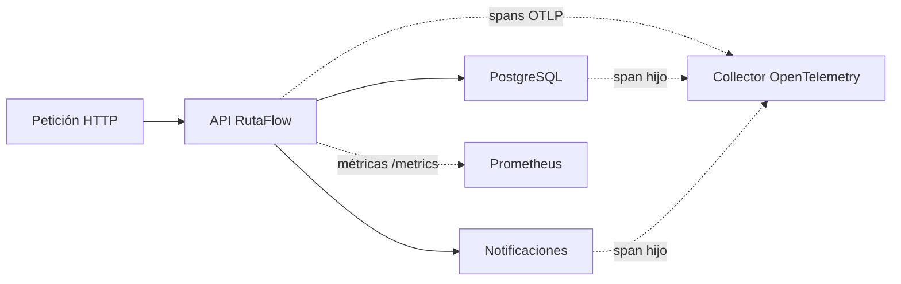

# Módulo 9: Observabilidad y manejo de errores en producción


## Aprende construyendo

### Tema 1: Logging estructurado

#### Paso 1 · Objetivo y preparación

Al finalizar podrás emitir logs JSON filtrables sin exponer secretos. **Prerrequisitos:** Node LTS y terminal; ejemplo independiente desde una carpeta vacía.

#### Paso 2 · Contexto y caso real

Cuando una API falla en producción, un párrafo libre no permite buscar por solicitud, usuario o nivel. Un log estructurado se indexa y se correlaciona con métricas.

#### Paso 3 · Teoría y analogía aplicada

Cada evento debe tener nivel, mensaje y campos estables. JSON es una ficha de inventario: máquinas pueden filtrarla sin interpretar frases ambiguas.

#### Paso 4 · Demostración guiada desde cero

```bash
mkdir ejemplo-logging
cd ejemplo-logging
npm init -y
mkdir src
```

Crea `src/logger.js`:

```js
function log(level, message, fields = {}) {
  const evento = { timestamp: new Date().toISOString(), level, message, ...fields };
  delete evento.password; delete evento.authorization;
  console.log(JSON.stringify(evento));
}
log("info", "servidor iniciado", { port: 3000 });
log("error", "consulta fallida", { code: "DB_TIMEOUT", requestId: "req-1" });
```

Ejecuta `node src/logger.js`. **Resultado esperado:** dos líneas JSON con timestamp. **Fallo deliberado y diagnóstico:** pasa `authorization: "Bearer secreto"`; el campo se elimina, demostrando una lista explícita de redacción.

#### Paso 5 · Práctica guiada

Añade nivel `warn` y un serializador de errores que conserve `name` y `message`. **Pista:** no serialices el objeto Error directamente.

#### Paso 6 · Práctica independiente

Filtra eventos por `LOG_LEVEL` y entrega salida de desarrollo y producción, sin cambiar el formato.

#### Paso 7 · Cierre y conexión

Ya produces logs útiles para máquinas y personas. El siguiente tema añadirá un identificador común a cada request.

**Errores comunes:** concatenar strings; imprimir tokens; usar niveles inconsistentes; loggear cada chunk; incluir datos personales sin necesidad.

**Fuentes oficiales:** [Node console](https://nodejs.org/api/console.html) y [OWASP Logging](https://cheatsheetseries.owasp.org/cheatsheets/Logging_Cheat_Sheet.html).

**Evidencia de aprendizaje:** entrega la salida JSON y demuestra que un secreto fue redactado.

**Conceptos clave:** logs en JSON frente a texto libre, indexación y filtrado.

`console.log` con mensajes de texto libre es adecuado para desarrollo local, pero se vuelve rápidamente insuficiente en producción, donde los logs de una aplicación real necesitan ser indexados, filtrados y correlacionados por herramientas de agregación de logs (Datadog, CloudWatch, Grafana Loki, mencionadas también en el Módulo 10 del track DevOps), capacidades que dependen de que cada línea de log tenga una estructura consistente y parseable, no texto libre arbitrario donde cada desarrollador elige su propio formato inconsistente de mensaje.

Pino es una biblioteca de logging para Node diseñada específicamente para producir logs estructurados en formato JSON con overhead de rendimiento mínimo (una consideración de diseño deliberada, dado que el logging ocurre en el camino crítico de cada petición de una aplicación de alto tráfico): `log.info({usuarioId: 42, accion: "crear_tarea"}, "Tarea creada")` produce una línea JSON con campos estructurados (`usuarioId`, `accion`) además del mensaje descriptivo, en vez de un string de texto libre donde esa misma información estaría incrustada de forma no estructurada y difícil de consultar programáticamente después.

Esta estructura consistente permite que un sistema de agregación de logs realice consultas precisas como "todos los logs donde `usuarioId` es 42 durante la última hora", algo prácticamente imposible de hacer de forma confiable sobre logs de texto libre sin una estructura consistente subyacente. Adoptar logging estructurado desde el inicio de un proyecto (en vez de migrar `console.log` disperso hacia un formato estructurado más adelante, un esfuerzo de refactorización considerable en un proyecto ya grande) es una práctica recomendada que paga dividendos considerables el día que se necesita diagnosticar un incidente real de producción bajo presión de tiempo.

**Analogía:** los logs de texto libre son como notas manuscritas dispersas en distintos formatos personales de cada empleado; los logs estructurados en JSON son como un formulario estandarizado con campos fijos y consistentes que cualquier sistema automatizado puede procesar, filtrar y buscar de forma confiable, sin depender de interpretar el estilo personal de redacción de cada autor individual.

**¿Por qué es importante?** Los logs estructurados en JSON son indexables y consultables de forma confiable por herramientas de agregación, una capacidad esencial para diagnosticar incidentes reales de producción que el texto libre de `console.log` no proporciona de forma consistente.

**Código del ejemplo:**

```js
import pino from "pino";
const log = pino();
log.info({ usuarioId: 42, accion: "crear_tarea" }, "Tarea creada");
// {"level":30,"time":...,"usuarioId":42,"accion":"crear_tarea","msg":"Tarea creada"}
```

### Tema 2: Correlation ID por request

#### Paso 1 · Objetivo y preparación

Al finalizar podrás conservar un `requestId` desde entrada hasta respuesta. **Prerrequisitos:** Node LTS, Express y HTTP; ejemplo independiente desde una carpeta vacía.

#### Paso 2 · Contexto y caso real

Una entrega puede atravesar API, base y proveedor de mapas. Sin un identificador común, unir logs de una sola solicitud es una conjetura.

#### Paso 3 · Teoría y analogía aplicada

El ID es una etiqueta de expediente, no una credencial. Se genera si falta y se propaga a logs y cabecera de respuesta.

#### Paso 4 · Demostración guiada desde cero

```bash
mkdir ejemplo-correlation-id
cd ejemplo-correlation-id
npm init -y
npm install express
mkdir src
```

Crea `src/server.js`:

```js
import express from "express";
import { randomUUID } from "node:crypto";
const app = express();
app.use((req, res, next) => {
  const id = req.get("x-request-id") || randomUUID();
  req.requestId = id; res.set("x-request-id", id); next();
});
app.get("/", (req, res) => { console.log(JSON.stringify({ requestId: req.requestId, route: req.path })); res.json({ requestId: req.requestId }); });
app.listen(3000, () => console.log("http://127.0.0.1:3000"));
```

Ejecuta `node src/server.js` y `curl -i -H 'x-request-id: demo-1' http://127.0.0.1:3000`. **Resultado esperado:** respuesta y log contienen `demo-1`. **Fallo deliberado y diagnóstico:** envía un ID de 5000 caracteres; valida longitud y genera uno nuevo, evitando abuso del header.

#### Paso 5 · Práctica guiada

Rechaza caracteres de control y conserva solo IDs de 1–64 caracteres. **Pista:** valida antes de escribir el header.

#### Paso 6 · Práctica independiente

Propaga el ID a una función asíncrona y entrega una salida con tres eventos que compartan etiqueta.

#### Paso 7 · Cierre y conexión

Ya puedes seguir una solicitud completa. El siguiente tema tratará fallos fatales y apagado seguro.

**Errores comunes:** reutilizar IDs globales; aceptar cualquier texto; loggear PII; perder el ID en callbacks; usarlo como autenticación.

**Fuentes oficiales:** [Express middleware](https://expressjs.com/en/guide/using-middleware.html), [`crypto.randomUUID`](https://nodejs.org/api/crypto.html#cryptorandomuuidoptions) y [W3C Trace Context](https://www.w3.org/TR/trace-context/).

**Evidencia de aprendizaje:** entrega dos requests, uno con ID válido y otro rechazado, con sus logs.

**Conceptos clave:** rastreo de una petición específica, `req.log` con contexto adjunto.

Un correlation ID es un identificador único generado al inicio de cada petición entrante (típicamente con `randomUUID()` del módulo `crypto` core, estudiado en el Módulo 0), adjuntado a cada línea de log producida durante el procesamiento de esa petición específica, permitiendo reconstruir después el rastro completo de una petición individual filtrando por su correlation ID único, incluso en un sistema con alto volumen de tráfico donde miles de peticiones concurrentes producen logs entrelazados en el mismo flujo de salida.

Implementar esto con un middleware (recordando el patrón middleware del Módulo 4) que genera el correlation ID al inicio de cada petición y crea un logger "hijo" con ese contexto ya adjunto (`req.log = log.child({correlationId: req.correlationId})`) permite que cualquier código posterior en la cadena de procesamiento de esa petición use `req.log` en vez de el logger global, garantizando automáticamente que cada línea de log que se produzca durante esa petición específica incluya el correlation ID correspondiente, sin necesidad de pasarlo manualmente como parámetro adicional a cada función que registra un log.

Este mecanismo se vuelve especialmente valioso en arquitecturas de microservicios (mencionadas en el Módulo 12 del track DevOps), donde una única petición de usuario puede atravesar múltiples servicios distintos; propagar el mismo correlation ID a través de las cabeceras de las peticiones internas entre servicios permite reconstruir el rastro completo de esa petición a través de todo el sistema distribuido, no solo dentro de un único servicio aislado, una capacidad de diagnóstico indispensable en sistemas distribuidos complejos donde un problema puede originarse en cualquier punto de una cadena de servicios interconectados.

**Analogía:** un correlation ID es como un número de seguimiento único asignado a un paquete en el momento de su envío, que permite rastrear exactamente ese paquete específico a través de cada etapa de su viaje (almacén, transporte, entrega), sin confundirlo con ningún otro paquete que esté viajando simultáneamente por el mismo sistema logístico.

**¿Por qué es importante?** El correlation ID es la herramienta fundamental que permite reconstruir el rastro completo de una petición específica entre el volumen masivo de logs concurrentes de un sistema de producción real, particularmente indispensable en arquitecturas distribuidas de microservicios.

**Código del ejemplo:**

```js
app.use((req, res, next) => {
  req.correlationId = randomUUID();
  req.log = log.child({ correlationId: req.correlationId }); // adjunto automáticamente
  next();
});
// cada log de esta request específica incluye el mismo correlationId
```

### Tema 3: Excepciones no capturadas y graceful shutdown

#### Paso 1 · Objetivo y preparación

Al finalizar podrás cerrar un servidor al recibir SIGTERM y distinguir errores recuperables de fallos fatales. **Prerrequisitos:** Node LTS y HTTP; ejemplo independiente desde una carpeta vacía.

#### Paso 2 · Contexto y caso real

Un despliegue necesita retirar una instancia sin cortar solicitudes activas. Un error no capturado puede dejar estado inconsistente y debe provocar reinicio supervisado.

#### Paso 3 · Teoría y analogía aplicada

Graceful shutdown es cerrar una tienda: dejar de aceptar clientes, terminar trabajos activos y liberar recursos. `uncaughtException` no debe usarse para continuar a ciegas.

#### Paso 4 · Demostración guiada desde cero

```bash
mkdir ejemplo-shutdown
cd ejemplo-shutdown
npm init -y
mkdir src
```

Crea `src/server.js`:

```js
import http from "node:http";
const server = http.createServer((_req, res) => setTimeout(() => res.end("ok"), 50));
server.listen(3000, () => console.log("listo"));
function cerrar(signal) { console.log(`recibido ${signal}`); server.close(() => { console.log("cerrado"); process.exitCode = 0; }); setTimeout(() => process.exit(1), 5000).unref(); }
process.once("SIGTERM", () => cerrar("SIGTERM"));
process.once("SIGINT", () => cerrar("SIGINT"));
```

Ejecuta `node src/server.js` y detén con `Ctrl+C`. **Resultado esperado:** se imprime `cerrado`. **Fallo deliberado y diagnóstico:** cambia el callback para lanzar un error; observa que el proceso termina y el supervisor debe reiniciarlo, en lugar de capturarlo y servir datos dudosos.

#### Paso 5 · Práctica guiada

Añade contador de solicitudes activas y espera a cero antes de cerrar. **Pista:** incrementa al entrar y decrementa en `finally`.

#### Paso 6 · Práctica independiente

Envía SIGTERM durante una respuesta lenta y entrega evidencia de que la respuesta termina o expira por timeout.

#### Paso 7 · Cierre y conexión

Ya distingues apagado ordenado de recuperación peligrosa. El siguiente tema comparará contratos REST, GraphQL y gRPC.

**Errores comunes:** llamar `process.exit` inmediatamente; ignorar conexiones; continuar tras excepción fatal; no tener timeout; no probar SIGTERM.

**Fuentes oficiales:** [Node process signals](https://nodejs.org/api/process.html#signal-events), [`server.close`](https://nodejs.org/api/net.html#serverclosecallback) y [12-factor disposability](https://12factor.net/disposability).

**Evidencia de aprendizaje:** entrega la salida de SIGINT, el cierre y un error fatal diagnosticado.

**Conceptos clave:** `uncaughtException`, `unhandledRejection`, `SIGTERM`, apagado ordenado.

Una excepción no capturada (`uncaughtException`) deja el proceso Node en un estado potencialmente corrupto e impredecible: alguna operación quedó a medias, algún recurso podría no haberse liberado correctamente, y continuar ejecutando el proceso normalmente después de un error de este tipo es arriesgado. La práctica recomendada es registrar un handler global (`process.on("uncaughtException", handler)`) que registre el error con la máxima información posible antes de terminar deliberadamente el proceso (`process.exit(1)`), en vez de intentar "seguir funcionando" tras un estado potencialmente corrupto, confiando en que el orquestador (Kubernetes, PM2) reinicie automáticamente un nuevo proceso limpio.

`process.on("unhandledRejection", handler)` cumple un rol equivalente para Promesas rechazadas sin ningún `.catch()` que las maneje, un escenario que, sin este handler global, produciría solo una advertencia en la consola sin terminar el proceso, dejando potencialmente un bug silencioso sin resolver indefinidamente en producción. Registrar ambos handlers globales, y decidir deliberadamente terminar el proceso en respuesta a ellos (en vez de simplemente registrarlos y continuar), es una práctica de robustez recomendada, aunque la solución real siempre es corregir el código para que esos casos de error se manejen apropiadamente en su origen, no depender permanentemente de estos handlers globales como red de seguridad de última instancia.

Graceful shutdown (apagado ordenado) responde a `SIGTERM` (la señal estándar que un orquestador envía para solicitar la terminación ordenada de un proceso, por ejemplo durante un despliegue de rolling update): en vez de terminar abruptamente el proceso, dejando peticiones en curso interrumpidas a la mitad, el proceso deja de aceptar nuevas conexiones (`servidor.close()`), espera a que las peticiones ya en curso terminen de procesarse completamente, cierra las conexiones a bases de datos y otros recursos externos de forma ordenada, y solo entonces termina el proceso definitivamente, garantizando que ningún cliente experimente una respuesta interrumpida abruptamente durante un despliegue rutinario o un escalado normal de la aplicación.

**Analogía:** una excepción no capturada es como un incendio pequeño en una parte del edificio: la respuesta prudente es evacuar completamente el edificio de forma controlada (terminar el proceso deliberadamente) en vez de intentar seguir operando normalmente con un riesgo desconocido latente. Graceful shutdown es como cerrar una tienda de forma ordenada al final del día: se deja de admitir nuevos clientes, se atiende completamente a los que ya están dentro, y solo entonces se cierran las puertas definitivamente, en vez de apagar las luces abruptamente con clientes todavía dentro comprando.

**¿Por qué es importante?** Manejar excepciones no capturadas terminando deliberadamente el proceso evita continuar en un estado corrupto impredecible; graceful shutdown evita que despliegues rutinarios o escalados normales corten peticiones de usuarios reales a la mitad.

**Código del ejemplo:**

```js
process.on("uncaughtException", (err) => { log.fatal(err); process.exit(1); });
process.on("unhandledRejection", (err) => { log.fatal(err); process.exit(1); });
process.on("SIGTERM", async () => {
  servidor.close(() => process.exit(0)); // deja de aceptar, termina las en curso
  await cerrarConexionesDB();
});
```

### Tema 4: REST, GraphQL y gRPC

#### Paso 1 · Objetivo y preparación

Al finalizar podrás elegir un contrato HTTP según clientes y rendimiento. **Prerrequisitos:** Node LTS, JSON y HTTP; ejemplo independiente desde una carpeta vacía.

#### Paso 2 · Contexto y caso real

Una app móvil puede necesitar recursos REST, una pantalla flexible puede pedir GraphQL y un servicio interno de alto rendimiento puede usar gRPC. La decisión es contractual, no de moda.

#### Paso 3 · Teoría y analogía aplicada

REST organiza recursos y caché; GraphQL permite seleccionar campos; gRPC usa contratos protobuf y HTTP/2. Son menús distintos: uno por platos, otro a la carta y otro con pedido binario estricto.

#### Paso 4 · Demostración guiada desde cero

```bash
mkdir ejemplo-contratos-api
cd ejemplo-contratos-api
npm init -y
npm install express
mkdir src
```

Crea `src/server.js`:

```js
import express from "express";
const app = express();
app.get("/paquetes/:id", (req, res) => res.json({ id: req.params.id, estado: "en-ruta" }));
app.post("/graphql", express.json(), (req, res) => res.json({ data: { echo: req.body.query ?? null } }));
app.listen(3000, () => console.log("API lista"));
```

Ejecuta `node src/server.js`, consulta `/paquetes/RF-1` y envía `{ "query": "paquetes" }` a `/graphql`. **Resultado esperado:** cada contrato devuelve JSON. **Fallo deliberado y diagnóstico:** solicita `/paquete/RF-1`; recibe `404`, que es un contrato REST diferente, no un problema de serialización.

#### Paso 5 · Práctica guiada

Documenta la misma operación en una tabla REST/GraphQL/gRPC. **Pista:** compara versionado, selección de campos y generación de cliente.

#### Paso 6 · Práctica independiente

Implementa content negotiation con `Accept` y entrega respuestas `application/json` y `406`.

#### Paso 7 · Cierre y conexión

Ya puedes justificar un estilo por contrato y consumidor. El siguiente tema expondrá métricas y trazas.

**Errores comunes:** usar GraphQL sin límites; confundir gRPC con seguridad; diseñar REST como acciones; ignorar versionado; no documentar errores.

**Fuentes oficiales:** [HTTP semantics](https://httpwg.org/specs/), [GraphQL specification](https://spec.graphql.org/) y [gRPC](https://grpc.io/docs/what-is-grpc/).

**Evidencia de aprendizaje:** entrega tres contratos comparados y las salidas 200/404/406.

**Conceptos clave:** estilos de diseño de API, sobreconsulta/subconsulta, contratos tipados, RPC binario.

REST, el estilo dominante estudiado a lo largo de este track, estructura una API alrededor de recursos identificados por URLs, con verbos HTTP estándar (GET, POST, PUT, DELETE) expresando la acción sobre esos recursos, y es ampliamente comprendido, cacheable de forma nativa por infraestructura HTTP estándar, pero puede sufrir de "sobreconsulta" (devolver más campos de los que un cliente específico realmente necesita) o "subconsulta" (requerir múltiples peticiones separadas para ensamblar la información completa que una vista específica necesita, cuando esos datos relacionados viven en recursos REST distintos).

GraphQL, implementado en Node típicamente con Apollo Server, resuelve directamente ambos problemas permitiendo que el cliente especifique exactamente qué campos necesita en una única petición (eliminando tanto la sobreconsulta como la subconsulta), a costa de una complejidad adicional en el servidor para resolver esas consultas flexibles de forma eficiente, y de perder parte de la cacheabilidad HTTP nativa y simple que REST ofrece por defecto (dado que, técnicamente, GraphQL típicamente usa un único endpoint POST para todas las consultas, dificultando el cacheo HTTP estándar basado en URLs distintas).

gRPC, un framework de RPC (llamada a procedimiento remoto) desarrollado por Google, usa Protocol Buffers (un formato binario compacto y eficiente, en contraste con el JSON textual de REST y GraphQL) y define contratos de servicio fuertemente tipados mediante archivos `.proto`, siendo particularmente popular para comunicación de alto rendimiento entre microservicios internos de una organización (donde el rendimiento binario y los contratos estrictamente tipados son especialmente valiosos), aunque menos apropiado para APIs consumidas directamente por navegadores web (que no soportan HTTP/2 con streaming bidireccional de la misma forma directa que gRPC requiere, sin una capa adicional de traducción).

**Analogía:** REST es como pedir en un restaurante con un menú de platos fijos predefinidos (cada endpoint devuelve una forma fija de datos); GraphQL es como un buffet donde el cliente elige exactamente qué ingredientes específicos quiere en su plato, ni más ni menos; gRPC es como un sistema de comunicación interno ultra eficiente entre departamentos de la misma empresa, optimizado para velocidad y contratos estrictos, pero no diseñado pensando en clientes externos casuales.

**¿Por qué es importante?** Elegir entre REST, GraphQL y gRPC según las necesidades reales del proyecto (simplicidad y cacheo HTTP nativo, flexibilidad de consulta del cliente, o rendimiento binario entre microservicios internos) es una decisión de arquitectura de API con implicaciones concretas de rendimiento y complejidad.

**Diagrama:**

```
REST:    URLs por recurso, verbos HTTP, cacheable nativamente, riesgo de sobre/subconsulta
GraphQL: un endpoint, el cliente pide exactamente los campos que necesita, sin sobreconsulta
gRPC:    binario (Protocol Buffers), contratos .proto tipados, ideal para microservicios internos
```

---

### Tema 5: Métricas Prometheus y trazas distribuidas con OpenTelemetry

#### Paso 1 · Objetivo y preparación

Al finalizar podrás exponer un contador Prometheus y crear un span OpenTelemetry. **Prerrequisitos:** Node LTS y HTTP; ejemplo independiente desde una carpeta vacía.

#### Paso 2 · Contexto y caso real

Los logs explican eventos; las métricas muestran tendencia y las trazas conectan una solicitud entre servicios. Juntas permiten saber si una ruta está lenta y dónde.

#### Paso 3 · Teoría y analogía aplicada

Un contador aumenta, un histograma mide distribución y un span representa una operación con contexto. Es el tablero de un vehículo: nivel, velocidad y recorrido cuentan cosas diferentes.

#### Paso 4 · Demostración guiada desde cero

```bash
mkdir ejemplo-observabilidad
cd ejemplo-observabilidad
npm init -y
npm install express prom-client
mkdir src
```

Crea `src/server.js`:

```js
import express from "express";
import client from "prom-client";
const app = express(); const requests = new client.Counter({ name: "http_requests_total", help: "Requests", labelNames: ["route"] });
app.get("/health", (_req, res) => { requests.inc({ route: "/health" }); res.json({ ok: true }); });
app.get("/metrics", async (_req, res) => { res.type(client.register.contentType); res.end(await client.register.metrics()); });
app.listen(3000, () => console.log("/health y /metrics"));
```

Ejecuta `node src/server.js`, llama `/health` y luego `/metrics`. **Resultado esperado:** aparece `http_requests_total{route="/health"} 1`. **Fallo deliberado y diagnóstico:** incrementa el contador con una etiqueta no declarada; prom-client rechaza el evento, señalando una métrica mal definida.

#### Paso 5 · Práctica guiada

Añade un histograma de duración alrededor del handler. **Pista:** observa `finally` para registrar también fallos.

#### Paso 6 · Práctica independiente

Instala OpenTelemetry en una copia y crea un span manual con atributos `route` y `status_code`; entrega la consola y explica qué exportador usarías en producción.

#### Paso 7 · Cierre y conexión

Ya distingues métrica agregada de traza individual. El siguiente módulo tratará despliegue desde otra carpeta.

**Errores comunes:** etiquetas de cardinalidad infinita; contar usuarios como labels; no cerrar spans; exponer `/metrics` públicamente; usar logs como única métrica.

**Fuentes oficiales:** [prom-client](https://github.com/siimon/prom-client), [Prometheus data model](https://prometheus.io/docs/concepts/data_model/) y [OpenTelemetry Node](https://opentelemetry.io/docs/languages/js/).

**Evidencia de aprendizaje:** entrega la salida de `/metrics`, una métrica mal definida diagnosticada y un span documentado.

**Objetivo:** medir tráfico, errores y duración de RutaFlow, y seguir una petición entre servicios sin depender de suposiciones.

**¿Por qué es importante?** Los logs explican eventos concretos, las métricas muestran tendencias agregadas y las trazas conectan el recorrido de una operación distribuida. Una API puede responder `200` y aun así degradarse lentamente; las señales permiten detectar el cambio antes de que el usuario reporte el problema.

**Contexto RutaFlow:** confirmar una entrega atraviesa API, base de datos y notificaciones. La métrica RED responde cuántas solicitudes llegan, cuántas fallan y cuánto tardan. Una traza permite descubrir que el retraso concreto está en el proveedor de notificaciones y no en PostgreSQL.

**Analogía:** las métricas son el tablero del vehículo, los logs son la bitácora y una traza es la ruta GPS de un viaje particular. Ninguna sustituye a las demás.



**Conceptos clave:** contador para totales, histograma para distribuciones de duración, etiquetas de baja cardinalidad y contexto de traza propagado entre servicios. Nunca uses `userId`, matrícula o número de guía como etiqueta: cada valor crea una serie nueva y puede agotar Prometheus.

**Demostración guiada:** crea `rutaflow-api/packages/api/src/observability/metrics.js`.

```js
import client from 'prom-client';

client.collectDefaultMetrics();

const requestDuration = new client.Histogram({
  name: 'rutaflow_http_request_duration_seconds',
  help: 'Duración de solicitudes HTTP',
  labelNames: ['method', 'route', 'status_code'],
  buckets: [0.05, 0.1, 0.25, 0.5, 1, 2],
});

export function observeRequests(req, res, next) {
  const stop = requestDuration.startTimer();
  res.on('finish', () => stop({
    method: req.method,
    route: req.route?.path ?? 'unmatched',
    status_code: String(res.statusCode),
  }));
  next();
}

export async function metricsEndpoint(_req, res) {
  res.type(client.register.contentType).send(await client.register.metrics());
}
```

Ejecuta desde `rutaflow-api/packages/api`:

```bash
npm install prom-client @opentelemetry/sdk-node @opentelemetry/auto-instrumentations-node
npm test -- observability
curl -s http://localhost:3000/metrics | grep rutaflow_http_request_duration
```

**Resultado esperado:** `/metrics` expone el histograma con etiquetas acotadas. Tras llamar a una ruta existente aparecen conteos y suma de duración; el test falla si se agrega una etiqueta de alta cardinalidad.

**Práctica guiada:** instrumenta una ruta exitosa y otra que responde `500`; verifica que ambas aparecen separadas por `status_code`. Configura el SDK de OpenTelemetry antes de importar la aplicación y confirma que la llamada a base genera un span hijo.

**Pista:** la instrumentación debe cargarse al inicio del proceso. Si llega después de Express o del driver, puede no interceptarlos.

**Práctica independiente:** define un objetivo SLO para `POST /deliveries/:id/confirm`, una alerta basada en errores y latencia, y un panel con tasa, errores y percentil 95. Justifica los umbrales con una prueba de carga pequeña.

**Errores comunes**

1. Usar identificadores únicos como labels y provocar explosión de cardinalidad.
2. Medir solo promedios: ocultan colas lentas; incluye percentiles mediante histogramas.
3. Crear spans sin propagar contexto: la traza queda fragmentada.
4. Alertar por cada error individual: define ventanas y presupuesto de error para evitar ruido.

**Cierre:** ya puedes observar RutaFlow desde el síntoma hasta la dependencia causante. Continúa convirtiendo el contrato HTTP en una pieza verificable para que documentación y comportamiento no se separen. Recursos oficiales: [Prometheus client para Node](https://github.com/siimon/prom-client) y [OpenTelemetry JavaScript](https://opentelemetry.io/docs/languages/js/).

---


## Laboratorio práctico

**Objetivo del laboratorio:** integrar logging estructurado con correlation ID, manejo robusto de excepciones y graceful shutdown en la API construida en módulos anteriores.

**Requisitos previos:** Módulos 0-8 completados.

| Paso | Acción | Código | Explicación |
|---|---|---|---|
| 1 | Reemplazar `console.log` por Pino | Ver Tema 1 | Configura logs en formato JSON estructurado |
| 2 | Agregar correlation ID por request | Ver Tema 2 | Verifica que aparece en todos los logs de esa request específica |
| 3 | Provocar una excepción no capturada intencional | `process.on("uncaughtException", ...)` | Verifica que se registra antes de cerrar el proceso |
| 4 | Implementar el endpoint `/health` | Verifica conexión a la base de datos antes de responder 200 | Útil para healthchecks de Kubernetes/Docker |
| 5 | Implementar graceful shutdown | Ver Tema 3 | Responde a `SIGTERM` cerrando ordenadamente |
| 6 | Simular una caída abrupta sin graceful shutdown | Compara qué pasa con requests en curso | Documenta la diferencia observada |

**Verificación:** el laboratorio se considera exitoso si todos los logs de una misma petición comparten el mismo correlation ID, y si el proceso responde ordenadamente a `SIGTERM` completando peticiones en curso antes de terminar, verificado comparando explícitamente contra el comportamiento sin graceful shutdown.

**Errores comunes y soluciones**

- **Seguir usando `console.log` de texto libre en producción.** Migra a logging estructurado con Pino desde el inicio del proyecto.
- **No registrar un handler para `unhandledRejection`.** Sin él, una Promesa rechazada sin manejar solo produce una advertencia silenciosa, dejando el bug sin resolver indefinidamente.
- **Terminar el proceso abruptamente ante `SIGTERM` sin esperar peticiones en curso.** Implementa graceful shutdown explícitamente para evitar cortar respuestas a mitad de camino durante despliegues rutinarios.

---
