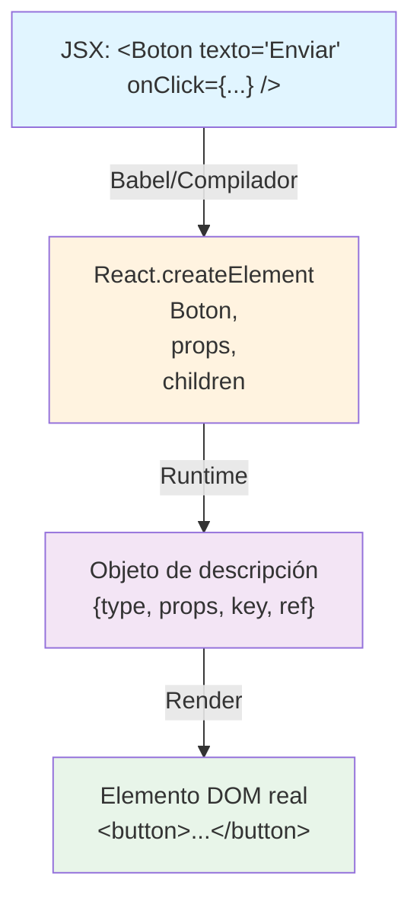
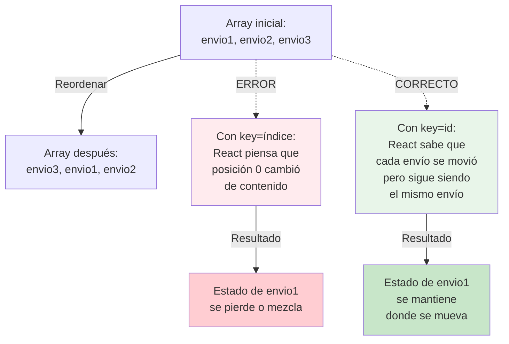
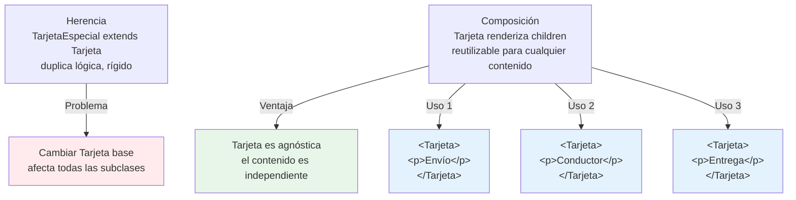
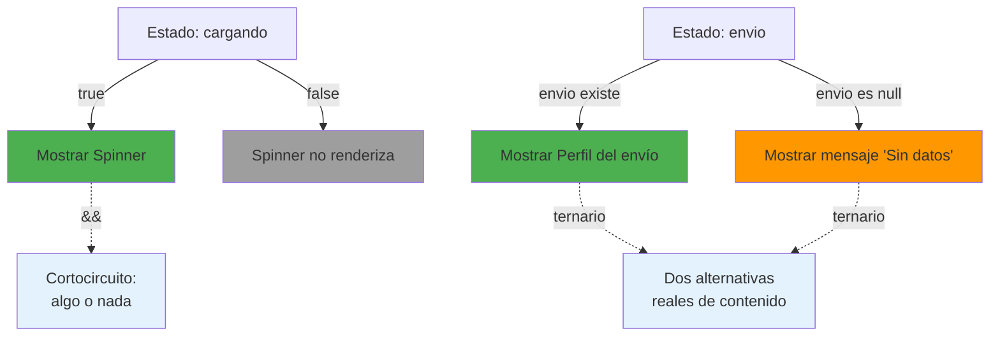

# Módulo 0: JSX, componentes y props


## Antes de comenzar: instala el entorno

React se estudia en el navegador, pero sus herramientas se ejecutan con Node.js. Instala **Node.js LTS**, **Git**, **Visual Studio Code** y un navegador moderno (Chrome, Edge o Firefox). No necesitas instalar React globalmente.

| Sistema | Instalación recomendada | Verificación |
|---|---|---|
| Windows | Instaladores oficiales de Node.js, Git y VS Code | `node -v`, `npm -v`, `git --version` en PowerShell |
| macOS | `brew install node git` después de instalar Homebrew | Los mismos tres comandos en Terminal |
| Ubuntu/Debian | Git con `apt`; Node LTS con `nvm` o NodeSource; VS Code desde su sitio oficial | Los mismos comandos en la terminal de VS Code |

### Crea tu primera aplicación

```bash
npm create vite@latest mi-react -- --template react
cd mi-react
npm install
npm run dev
```

Abre la dirección que muestra la terminal, normalmente `http://localhost:5173`. Edita `src/App.jsx`, guarda y confirma que el navegador cambia sin reiniciar el servidor. `npm install` descarga dependencias; `npm run dev` inicia el entorno de desarrollo; `Ctrl+C` lo detiene. Si aparece un error de permisos, no uses `sudo npm`: instala Node mediante `nvm` y vuelve a intentarlo.

## Aprende construyendo

### Tema 1: JSX es azúcar sintáctica sobre createElement

#### Paso 1 · Objetivo y preparación
Al finalizar podrás crear un componente React desde cero. Prerrequisitos: Node.js LTS, npm y un editor. Verifica node --version y npm --version.

#### Paso 2 · Contexto y caso real
En un caso real de entregas, una pantalla transforma datos en componentes reutilizables y debe conservar identidad al actualizar listas. RutaFlow (Módulo 12) construirá su dashboard de rastreo de envíos con estos mismos componentes.

#### Paso 3 · Teoría, modelo mental y analogía
JSX describe elementos que React transforma; key identifica una instancia de lista; composición combina piezas y fragments evita nodos extra. La analogía es una plantilla de despacho: cada paquete tiene etiqueta estable y cada sección puede reemplazarse sin rehacer el almacén.

**Diagrama: Transformación JSX a createElement**



#### Paso 4 · Demostración guiada desde cero
Parte de una carpeta vacía:
```bash
mkdir ejemplo-react-m0
cd ejemplo-react-m0
npm create vite@latest app -- --template react-ts
cd app
npm install
npm run dev
```

`npm` es el comando que gestiona el proyecto (`npm create vite@latest` es el subcomando que arma un proyecto Vite nuevo); `--template` es la bandera que elige el andamiaje inicial (aquí, `react-ts`, React con TypeScript).
Crea src/components/DeliveryCard.tsx y úsalo desde App.tsx; explica JSX, props, key y salida del navegador.

**Demo con React DevTools:**
1. Abre `http://localhost:5173` en Chrome
2. Abre DevTools (F12) → Componentes tab → busca `<DeliveryCard />`
3. En el panel derecho, mira las **props** en tiempo real: `{ id: 1, address: "..." }`
4. Edita el valor de una prop en el editor del panel de DevTools (p. ej., cambia el `id` a 999)
5. Observa cómo la UI se actualiza **sin recargar la página**
6. Resultado esperado: verás que React re-renderiza solo ese componente con el nuevo prop, demostrando cómo los props fluyen de arriba hacia abajo.

#### Paso 5 · Práctica guiada
Pista: crea dos componentes `<Boton>` idénticos pero con `onClick` handlers distintos (uno que incremente un contador, otro que lo decremente). Luego, usa deliberadamente el `id` de componente (no el tipo de componente) como clave en la inspección de DevTools. Intenta cambiar props desde DevTools — si lo haces correctamente, ambos botones responderán. Ahora comete el fallo deliberado: crea un componente `Boton` que no acepte un prop `key` en sus props visibles (porque `key` es especial en React y no llega al componente, solo React la usa), pero demuestra en la consola que React sí ve la `key` internamente. Resultado esperado: entender que `key` existe para React, no para tu código.

#### Paso 6 · Práctica independiente
Añade estados vacío/error, composición con Fragment y estilos accesibles; prueba teclado y responsive.

#### Paso 7 · Cierre y evidencia
Guarda estructura, comandos, captura y log; como siguiente paso estudia estado. Errores comunes: key aleatoria, componente gigante, HTML inválido y estilos que dependen solo de color. Fuentes oficiales: https://react.dev/learn y https://vite.dev/guide/.
**¿Por qué es importante?** Porque entender el modelo de renderizado evita bugs sutiles al crecer la interfaz.
**Evidencia de aprendizaje:** entrega componente, lista, fallo de key y corrección.
**Conceptos clave:** `createElement`, expresiones embebidas, JSX no es HTML.

`DeliveryCard` es el primer componente real del proyecto integrador de este track (SPA con datos reales, Módulo 12): la misma disciplina de props tipadas y key estable en listas se repetirá en cada componente que muestre datos de la API a lo largo del track.

**Cuándo no usarlo:** JSX y `createElement` son la base de React; si el proyecto no necesita interactividad ni estado (una página completamente estática), generar esa capa de componentes es más complejidad de la que aporta HTML plano — React se justifica en cuanto la UI necesita reaccionar a datos que cambian.

JSX es una extensión de sintaxis de JavaScript que permite escribir marcado similar a HTML directamente dentro de código JavaScript (`<button onClick={onClick}>{texto}</button>`), pero JSX no es HTML ni un lenguaje de plantillas propio: es transformado en tiempo de compilación (por Babel o el compilador integrado en el toolchain del proyecto) a llamadas planas de `React.createElement(tipo, props, ...hijos)`, que a su vez producen objetos JavaScript planos que describen qué debe renderizarse, no el elemento DOM real todavía. Esta transformación explica por qué las llaves `{}` dentro de JSX embeben cualquier expresión JavaScript válida (no solo texto): `{texto}` no es una plantilla de texto especial, es literalmente un argumento pasado a `createElement`, y por lo tanto puede ser cualquier expresión: una variable, una llamada a función, una expresión ternaria, o incluso otro elemento JSX anidado.

Comprender que JSX se convierte en llamadas a función explica comportamientos que de otro modo parecerían mágicos: por qué un componente debe devolver un único elemento raíz (porque `createElement` devuelve un único objeto, no una lista suelta de objetos, de ahí la necesidad de Fragments, Tema 3), por qué los atributos usan `className` en vez de `class` (`class` es una palabra reservada en JavaScript, por lo que no puede usarse como nombre de prop), y por qué JSX permite mezclar libremente lógica JavaScript y marcado, algo que un motor de plantillas tradicional (como los estudiados en frameworks basados en archivos `.html` separados) no permite con la misma naturalidad.

**Analogía:** JSX es como una notación taquigráfica para escribir instrucciones detalladas de ensamblaje: no es el objeto ensamblado en sí, sino una forma más legible de escribir exactamente las mismas instrucciones (`createElement(...)`) que, de escribirse literalmente, serían mucho más verbosas y difíciles de leer a simple vista.

**¿Por qué es importante?** Entender que JSX es azúcar sintáctica sobre `createElement` explica por qué las llaves embeben cualquier expresión JavaScript, por qué un componente devuelve un único elemento raíz, y por qué se usa `className` en vez de `class`.

**Código del ejemplo:**

```jsx
function Boton({ texto, onClick }) {
  return <button onClick={onClick}>{texto}</button>;
}
// Se transforma en:
// React.createElement('button', { onClick }, texto)
```

### Tema 2: Listas con key estable

#### Paso 1 · Objetivo y preparación
Al finalizar vas a renderizar una lista de envíos (`EnvioCard`) con `.map()`, usando el `id` de cada envío como `key` en vez de su posición en el array. Prerrequisitos: Tema 1 de este módulo.

#### Paso 2 · Contexto y caso real
La lista de envíos de RutaFlow se reordena seguido (los envíos urgentes suben al principio); si la `key` de cada fila fuera su posición en el array, React no podría distinguir "el envío que se movió" de "un envío nuevo en esa posición". Este patrón exacto se repetirá en el dashboard de rastreo (Módulo 12) cuando los operadores reordenen envíos por estado o prioridad.

#### Paso 3 · Teoría, modelo mental y analogía
`key` es la identidad estable que React usa para decidir qué actualizar, reordenar o recrear entre renders — identificar a las personas de una fila por su nombre, no por "la tercera posición".

**Diagrama: Key estable vs índice del array**



#### Paso 4 · Demostración guiada desde cero

#### Paso 4 · Demostración guiada desde cero
```jsx
function ListaEnvios({ envios }) {
  return (
    <ul>
      {envios.map(envio => <EnvioCard key={envio.id} envio={envio} />)}
    </ul>
  );
}
```
Resultado esperado: al reordenar `envios` (por ejemplo, moviendo un envío urgente al principio del array), cada `EnvioCard` conserva su propio estado interno (como un `<input>` de nota que el operador esté escribiendo en esa fila) asociado al envío correcto, porque `key={envio.id}` identifica cada fila por su identidad real, no por su posición circunstancial.

**Demo con React DevTools:**
1. Abre tu aplicación con una lista de 3+ elementos, cada uno con un `<input>` controlado dentro
2. Escribe algo en el input del primer elemento (ej. "nota importante")
3. Abre DevTools → Componentes tab → inspecciona `<EnvioCard key="envio-1" />`
4. Nota que en el árbol de componentes, cada `EnvioCard` muestra su `key` como etiqueta
5. **Hazlo mal primero (fallo deliberado):** cambia `key={envio.id}` a `key={indice}` en el código
6. Reinicia, escribe "nota importante" en el primer elemento de nuevo
7. Reordena el array (ej. con un botón que haga `setEnvios([envios[1], envios[0], envios[2]])`)
8. Observa en DevTools que el `<EnvioCard>` ahora tiene `key="0"` pero el contenido del input se movió junto con la posición, **no** con el envío real
9. Cambio de nuevo a `key={envio.id}` y repite: ahora el texto se mantiene con el envío correcto incluso al reordenar
10. Resultado esperado: ver en DevTools cómo la `key` es el identificador visual estable que React usa internamente.

#### Paso 5 · Práctica guiada
**Fallo deliberado #1 (índice como key):** 
Cambiá `key={envio.id}` por `key={indice}` usando el índice del `.map()` — reordená el array de `envios` y escribí algo en el `<input>` de nota de la primera fila; al reordenar de nuevo, ese texto aparece en la fila que ahora ocupa esa misma posición, no en el envío original donde lo escribiste.

**Fallo deliberado #2 (key aleatoria):**
Cambiá ahora a `key={Math.random()}` — cada render genera una key nueva, así que React piensa que todos los elementos son nuevos cada vez. Observa:
- Los inputs pierden el foco después de cada keystroke (porque React recreó el DOM)
- El console.log en el useEffect de cada `EnvioCard` se ejecuta constantemente (desmontaje/montaje continuo)
- El rendimiento se degrada visiblemente

**Fallo deliberado #3 (key duplicada):**
Crea una lista donde dos envíos tienen el mismo `id` accidentalmente y usa `key={envio.id}`. React renderiza ambos elementos en el DOM pero solo puede trackear uno correctamente, causando comportamientos impredecibles cuando filtras o reordenas.

#### Paso 6 · Práctica independiente
Corregí el Paso 5 devolviendo `key={envio.id}`, y agregá un botón "mover al principio" que reordene el array — confirmá que el texto escrito en el input de nota de cualquier fila sigue esa fila específica, sin importar a qué posición se mueva.

#### Paso 7 · Cierre y evidencia
Entregá la lista con key estable del Paso 4, el bug de identidad provocado en el Paso 5, y la prueba de reordenamiento del Paso 6; explicá por qué el índice "funciona" en una lista que nunca cambia de orden ni de longitud, pero falla en cuanto eso deja de ser cierto. Siguiente paso: estudia composición con `children` y Fragments. Errores comunes: usar el índice como key en listas que se reordenan o filtran, generar una key aleatoria en cada render (`key={Math.random()}`), y repetir keys duplicadas dentro de la misma lista. Fuentes oficiales: https://react.dev/learn/rendering-lists y https://react.dev/learn/preserving-and-resetting-state.
**¿Por qué es importante?** Porque una key inestable asocia estado o referencias del DOM al elemento equivocado en cuanto la lista se reordena, filtra, o modifica.
**Evidencia de aprendizaje:** entrega lista con key estable, bug de identidad provocado y prueba de reordenamiento.
**Conceptos clave:** identidad de elementos entre renders, riesgo del índice como key.

Cuando React renderiza una lista de elementos generada dinámicamente (típicamente con `.map()`), necesita una forma de identificar de forma estable qué elemento de una nueva lista corresponde a cuál elemento de la lista anterior, para decidir eficientemente qué debe actualizar, cuál debe reordenar, y cuál debe crear o eliminar del DOM real, en vez de descartar y recrear la lista completa en cada cambio; la prop especial `key` (`<li key={tarea.id}>{tarea.titulo}</li>`) es exactamente esa identidad estable que React usa para esa comparación entre renders sucesivos.

Usar el índice del array como `key` (`key={indice}`) parece funcionar en casos simples, pero se vuelve problemático en cuanto la lista se reordena, se filtra, o se inserta un elemento en medio: dado que el índice de un elemento cambia cuando la lista cambia de orden o de longitud, React puede terminar asociando el estado interno o las referencias del DOM del elemento equivocado a la posición equivocada (por ejemplo, si un input controlado con estado propio está dentro de cada fila, y la fila se reordena, el valor tecleado en el input puede aparecer asociado a la fila incorrecta tras el reordenamiento, porque React identificó las filas por posición, no por identidad real). Usar un identificador estable e inherente al dato (`tarea.id`, no su posición circunstancial en el array actual) evita completamente este problema, porque esa identidad no cambia sin importar cómo se reordene o filtre la lista.

**Analogía:** usar el índice como key es como identificar a las personas de una fila por su posición ("la tercera persona") en vez de por su nombre: si la fila se reordena, "la tercera persona" pasa a ser alguien completamente distinto, aunque la persona original que ocupaba esa posición siga siendo la misma persona en otra posición nueva de la fila.

**¿Por qué es importante?** Una `key` estable e inherente al dato (no la posición circunstancial) evita que React asocie estado o referencias del DOM al elemento equivocado cuando una lista se reordena, filtra, o modifica.

**Código del ejemplo:**

```jsx
{tareas.map(tarea => <li key={tarea.id}>{tarea.titulo}</li>)}
// key={tarea.id}: estable sin importar el orden
// key={indice}: riesgoso si la lista se reordena o filtra
```

* Ejecutar: `npm test`
* Código: `examples/rutaflow/react/use-shipment-tracking.tsx`
* Proyecto: proyecto integrador RutaFlow

### Tema 3: Composición sobre herencia, y Fragments

#### Paso 1 · Objetivo y preparación
Al finalizar vas a construir un componente `Tarjeta` genérico que use `children`, y a envolver su contenido en un Fragment en vez de un `<div>` extra sin propósito. Prerrequisitos: Tema 2 de este módulo.

#### Paso 2 · Contexto y caso real
`EnvioCard` y una futura `ConductorCard` comparten el mismo marco visual (borde, sombra, padding) pero contenido completamente distinto — duplicar ese marco en cada componente específico repetiría el mismo CSS en dos lugares. En RutaFlow (Módulo 12), reutilizarás esta misma `Tarjeta` para mostrar envíos, conductores y entregas completadas.

#### Paso 3 · Teoría, modelo mental y analogía
React compone componentes pequeños pasando contenido a través de `children`, en vez de heredar de una clase base — bloques de Lego intercambiables en vez de una pieza única hecha a medida.

**Diagrama: Composición vs Herencia**



#### Paso 4 · Demostración guiada desde cero
```jsx
function Tarjeta({ children }) {
  return <div className="tarjeta">{children}</div>;
}

function EnvioCard({ envio }) {
  return (
    <Tarjeta>
      <>
        <p>{envio.guia}</p>
        <p>{envio.direccion}</p>
      </>
    </Tarjeta>
  );
}
```
Resultado esperado: `Tarjeta` no sabe nada sobre guías ni direcciones — solo envuelve lo que reciba en `children` con el marco visual común; el Fragment (`<> </>`) agrupa los dos `<p>` sin agregar ningún `<div>` extra al DOM.

**Demo con React DevTools:**
1. Crea `<Tarjeta>`, `<EnvioCard>` y `<ConductorCard>` (distinto contenido)
2. Abre DevTools → Componentes tab
3. Inspecciona la estructura: verás `<Tarjeta>` una sola vez en el árbol, pero su contenido (children) varía
4. Expande `<EnvioCard>` → verás la estructura interna: `<Tarjeta>` → `<>` (Fragment) → dos `<p>`
5. Nota que **no hay un `<div>` vacío extra** que envuelva los dos `<p>` (gracias al Fragment)
6. Comparación: cambia `<>` a `<div className="wrapper">` — en DevTools verás un `<div>` adicional innecesario en la jerarquía
7. Resultado esperado: comprender visualmente que Fragments evitan contenedores DOM extra.

#### Paso 5 · Práctica guiada
**Fallo deliberado #1 (sin Fragment ni contenedor):**
Quitá el Fragment y dejá los dos `<p>` directamente como hijos sin nada que los agrupe — el proyecto deja de compilar: "Adjacent JSX elements must be wrapped in an enclosing tag" porque JSX exige que cualquier bloque devuelva un único elemento raíz.

**Fallo deliberado #2 (Fragment explícito vs abreviado):**
Reemplazá `<>...</>` por `<React.Fragment>...</React.Fragment>` — funciona igual, pero es más verboso. Luego intenta pasar una `key` a un Fragment: `<Fragment key={id}>` funciona, pero `<>` abreviado no acepta `key`. Este es un edge case real que encontrarás en listas de Fragments.

**Fallo deliberado #3 (children no es automático):**
Crea una versión incorrecta de `Tarjeta` que no use `children`: `function Tarjeta() { return <div>contenido fijo</div>; }`. Ahora usa `<Tarjeta><p>Esto se ignora</p></Tarjeta>` — el `<p>` simplemente desaparece, no se renderiza. Luego corrige a `function Tarjeta({ children })` para demostrar que `children` es un prop como cualquier otro, que debe ser recibido explícitamente.

#### Paso 6 · Práctica independiente
Corregí el Paso 5 restaurando el Fragment, y creá una segunda tarjeta (`ConductorCard`) que también use `Tarjeta` con contenido completamente distinto (nombre y vehículo del conductor) — confirmá que `Tarjeta` no necesitó ningún cambio para soportar este nuevo caso.

#### Paso 7 · Cierre y evidencia
Entregá `Tarjeta` con `children` del Paso 4, el error de compilación del Paso 5, y `ConductorCard` del Paso 6; explicá por qué `Tarjeta` pudo reutilizarse para un contenido completamente distinto sin ninguna modificación, algo que una jerarquía de herencia rígida no ofrece con la misma facilidad. Siguiente paso: estudia renderizado condicional y estilos. Errores comunes: hacer que un componente "contenedor" conozca detalles específicos del contenido que envuelve, olvidar que un componente debe devolver un único elemento raíz, y usar un `<div>` extra en vez de un Fragment cuando no se necesita ningún elemento real. Fuentes oficiales: https://react.dev/learn/passing-props-to-a-component#passing-jsx-as-children y https://react.dev/reference/react/Fragment.
**¿Por qué es importante?** Componer con `children` produce piezas de UI reutilizables e independientes entre sí; los Fragments evitan contenedores DOM innecesarios que la restricción de un único elemento raíz forzaría.
**Evidencia de aprendizaje:** entrega Tarjeta con children, error de compilación detectado y segundo caso de uso (ConductorCard).
**Conceptos clave:** `children`, composición de componentes pequeños, `<> </>`.

React favorece deliberadamente la composición de componentes pequeños sobre la herencia de clases como mecanismo de reutilización de UI: en vez de crear una jerarquía de clases donde un componente "TarjetaEspecial" hereda de un componente "Tarjeta" base y sobreescribe cierto comportamiento (el patrón típico de programación orientada a objetos tradicional), React resuelve el mismo problema componiendo componentes pequeños e independientes entre sí, pasando contenido a través de la prop especial `children` (`function Tarjeta({ children }) { return <div className="tarjeta">{children}</div>; }`, usado como `<Tarjeta><Avatar /><Nombre texto="Ana" /></Tarjeta>`), donde `Tarjeta` no necesita saber nada específico sobre qué contenido recibirá, simplemente lo envuelve en su propio marcado estructural.

Este enfoque de composición evita los problemas clásicos de jerarquías de herencia profundas y rígidas (donde cambiar el comportamiento de una clase base afecta impredeciblemente a todas sus subclases, un problema estudiado de forma más general en el Módulo 4 del track de JavaScript sobre composición frente a herencia), permitiendo en cambio ensamblar interfaces complejas a partir de piezas pequeñas, independientes y fácilmente reemplazables, cada una con una única responsabilidad clara.

Los Fragments (`<> </>`, o explícitamente `<React.Fragment>`) resuelven la restricción de que un componente debe devolver un único elemento raíz (Tema 1) sin necesidad de envolver el contenido en un `<div>` adicional puramente estructural que no tiene ningún propósito semántico ni visual real, evitando anidar el DOM con contenedores vacíos innecesarios que no aportan nada más que cumplir la restricción técnica de un único elemento raíz.

**Analogía:** la composición es como construir con bloques de Lego pequeños e intercambiables, cada uno con una función clara, ensamblados según se necesite; la herencia profunda es como fabricar una pieza única y rígida hecha a medida para un caso específico, difícil de adaptar o reutilizar para un caso ligeramente distinto.

**¿Por qué es importante?** Componer componentes pequeños con `children` produce piezas de UI más reutilizables e independientes entre sí que una jerarquía de herencia rígida; los Fragments evitan contenedores DOM innecesarios que la restricción de un único elemento raíz de otro modo forzaría.

**Código del ejemplo:**

```jsx
function Tarjeta({ children }) {
  return <div className="tarjeta">{children}</div>;
}

<Tarjeta><Avatar /><Nombre texto="Ana" /></Tarjeta>
// Composición: Tarjeta no sabe qué contenido recibirá, solo lo envuelve
```

* Ejecutar: `npm test`
* Código: `examples/rutaflow/react/use-shipment-tracking.tsx`
* Proyecto: proyecto integrador RutaFlow

### Tema 4: Renderizado condicional y estilos

#### Paso 1 · Objetivo y preparación
Al finalizar vas a mostrar un `Spinner` mientras `EnvioCard` carga, y a elegir entre `&&` y el operador ternario según si existe una sola alternativa o dos. Prerrequisitos: Tema 3 de este módulo.

#### Paso 2 · Contexto y caso real
Mientras RutaFlow todavía no recibió la respuesta de la API, `EnvioCard` no tiene ningún dato real que mostrar — necesita decidir qué renderizar durante ese instante sin dato. En el dashboard de rastreo (Módulo 12), distintos envíos estarán en distintos estados simultáneamente (algunos cargando, otros con datos, otros en error).

#### Paso 3 · Teoría, modelo mental y analogía
`{cargando && <Spinner />}` aprovecha el cortocircuito de `&&` cuando existe una sola alternativa (algo o nada); el ternario es apropiado cuando existen dos alternativas de contenido reales.

**Diagrama: Renderizado condicional**



#### Paso 4 · Demostración guiada desde cero
```jsx
function EnvioCard({ envio, cargando }) {
  return (
    <div className="tarjeta">
      {cargando && <Spinner />}
      {envio ? <p>{envio.direccion}</p> : <p>Sin datos todavía</p>}
    </div>
  );
}
```
Resultado esperado: mientras `cargando` es `true`, se muestra el `Spinner` (y nada más si `cargando` es `false`, gracias al cortocircuito); una vez que `envio` tiene datos, se muestra su dirección; si nunca llegó ningún envío, se muestra "Sin datos todavía" en vez de nada.

**Demo con React DevTools:**
1. Crea un componente `<EnvioCard envio={null} cargando={true} />`
2. Abre DevTools → Componentes tab → inspecciona el árbol
3. Verás `<Spinner />` renderizado porque `cargando` es `true`
4. En el panel lateral de DevTools, edita la prop `cargando` a `false`
5. Observa cómo el `<Spinner />` desaparece del árbol inmediatamente (DOM actualizado en tiempo real)
6. Ahora edita `envio` de `null` a un objeto con datos: `{ id: 1, direccion: "..." }`
7. Verás que el renderizado condicional cambia: ahora aparece `<p>Calle Principal 123</p>` en vez del "Sin datos todavía"
8. Resultado esperado: comprender en tiempo real cómo los props controlan qué se renderiza.

#### Paso 5 · Práctica guiada
**Fallo deliberado #1 (ternario con 0 falsy):**
Cambiá `{cargando && <Spinner />}` por `{cargando ? <Spinner /> : 0}` — cuando `cargando` es `false`, React renderiza literalmente el número `0` en la pantalla (porque `0` es un valor renderizable válido en JSX, a diferencia de `false` o `undefined`), mostrando un "0" visible y confuso. Esto es una trampa específica de JSX: `&&` con `0` también falla del mismo modo.

**Fallo deliberado #2 (renderizar valores falsy problemáticos):**
Intenta renderizar directamente:
- `{count}` cuando `count` es `0` → aparece "0" en la pantalla (a veces deseado, a veces no)
- `{isActive}` cuando `isActive` es `false` → no aparece nada (correcto, porque `false` no se renderiza)
- `{0 && <Spinner />}` → aparece "0" en la pantalla (ERROR)
- `{false && <Spinner />}` → no aparece nada (correcto)

**Fallo deliberado #3 (olvidar el return en expresiones condicionales):**
Escribe: `function Card() { if (loading) { <Spinner /> } return <div>...</div>; }` — el `<Spinner />` nunca se renderiza porque no está en un return. El if debe devolver algo que React pueda procesar.

#### Paso 6 · Práctica independiente
Corregí el Paso 5 volviendo a `{cargando && <Spinner />}`, y agregá estilos con CSS Modules o Tailwind a la tarjeta para que el estado de carga tenga una apariencia visualmente distinta al estado con datos.

#### Paso 7 · Cierre y evidencia
Entregá el renderizado condicional del Paso 4, el "0" fantasma detectado en el Paso 5, y los estilos del Paso 6; explicá por qué `&&` con un operando numérico falsy (`0`, no `false`) es una trampa específica de JSX que no ocurre con un booleano. Siguiente paso: estudia cómo React maneja el estado con `useState`. Errores comunes: usar `&&` con un valor que puede ser `0`, confundir cuándo usar `&&` (una alternativa) frente al ternario (dos alternativas reales), y depender solo del color para comunicar estado sin texto ni ícono adicional. Fuentes oficiales: https://react.dev/learn/conditional-rendering y https://react.dev/learn/writing-markup-with-jsx.
**¿Por qué es importante?** Elegir entre `&&` y el ternario según si existe una única alternativa o dos alternativas de contenido reales evita bugs como el "0" fantasma y produce código más predecible.
**Evidencia de aprendizaje:** entrega renderizado condicional, bug del "0" detectado y estilos agregados.
**Conceptos clave:** `&&` frente a ternario, trampa del `0` falsy en JSX, CSS Modules, Styled Components, Tailwind.

El renderizado condicional en JSX aprovecha directamente el comportamiento de cortocircuito de JavaScript: `{cargando && <Spinner />}` renderiza `<Spinner />` únicamente si `cargando` es verdadero (y no renderiza nada, ni siquiera un elemento vacío, si es falso, gracias al cortocircuito del operador `&&`), apropiado cuando existen solo dos posibilidades: mostrar algo, o no mostrar nada en absoluto. El operador ternario (`{usuario ? <Perfil usuario={usuario} /> : <BotonLogin />}`) es apropiado en cambio cuando existen genuinamente dos alternativas de contenido a mostrar, cada una con su propio elemento, no simplemente "algo o nada".

Angular resuelve este mismo problema con `@if`/`@else` como sintaxis dedicada de plantilla (Módulo 1 del track de Angular); React, al no tener un lenguaje de plantillas separado (JSX es simplemente JavaScript, Tema 1), reutiliza directamente los operadores lógicos y condicionales nativos del lenguaje para expresar la misma idea, sin necesidad de sintaxis adicional dedicada.

En cuanto a estilos, CSS Modules generan nombres de clase únicos automáticamente por archivo (evitando colisiones globales de nombres de clase entre componentes distintos), Styled Components permite escribir CSS directamente dentro de JavaScript usando template literals etiquetados, generando componentes con estilos encapsulados, y Tailwind aplica utilidades CSS predefinidas directamente como clases en el marcado (`className="flex items-center gap-2"`), cada enfoque con un balance distinto entre localidad del estilo, curva de aprendizaje, y velocidad de desarrollo.

**Analogía:** `&&` es como una puerta que solo se abre si la condición se cumple, sin alternativa; el ternario es como una bifurcación de caminos donde ambas ramas llevan a algún destino concreto, no a la nada.

**¿Por qué es importante?** Elegir entre `&&` y el ternario según si existe una única alternativa condicional o dos alternativas de contenido reales produce código de renderizado condicional más claro y predecible.

**Código del ejemplo:**

```jsx
{cargando && <Spinner />}                              // algo o nada
{usuario ? <Perfil usuario={usuario} /> : <BotonLogin />}  // dos alternativas reales
```

---

## Ruta de proyecto progresivo desde carpeta vacía

No crees un proyecto desechable por módulo. Conserva un único repositorio que evoluciona durante todo el track y etiqueta cada hito (`git tag modulo-N`). Empieza con `npm create vite@latest academia-react -- --template react-ts && cd academia-react && git init`. Ejecuta el comando paso a paso, inspecciona los archivos generados y registra versiones y precondiciones en el README.

| Hito | Evolución acumulativa | Evidencia antes de avanzar |
|---|---|---|
| Base | componentes y estado. | Arranque reproducible, commit limpio y prueba mínima. |
| Aplicación | rutas, formularios y datos. | Casos normales, límite y error automatizados. |
| Integración | Conecta capas y reemplaza dobles por infraestructura controlada. | Diagrama, contratos y prueba de integración. |
| Experto | arquitectura, accesibilidad y producción. | Perfil o threat model, telemetría y runbook de recuperación. |

Al iniciar cada laboratorio crea una rama `modulo-N`, implementa el incremento, verifica el criterio de éxito y fusiona solo con pruebas verdes. Si un módulo necesita un experimento aislado, colócalo en `experiments/modulo-N/`; el producto acumulativo permanece ejecutable. Al terminar, otra persona debe poder clonar el repositorio y reproducir el último hito siguiendo únicamente el README.


## Laboratorio práctico

**Objetivo del laboratorio:** construir un set de componentes de presentación reutilizables (botón, tarjeta, lista) con JSX, composición y renderizado condicional.

**Requisitos previos:** conocimientos de JavaScript ES6+ (Módulos del track de JavaScript).

| Paso | Acción | Código | Explicación |
|---|---|---|---|
| 1 | Crear `Boton` con props `texto`/`onClick` | Ver Tema 1 | Componente de función simple |
| 2 | Renderizar una lista con `key` estable | Ver Tema 2 | Usa `tarea.id`, no el índice |
| 3 | Crear `Tarjeta` con `children` | Ver Tema 3 | Composición sin herencia |
| 4 | Implementar renderizado condicional | Ver Tema 4 | `&&` y ternario según el caso |
| 5 | Componer `Avatar`, `Nombre` y `Tarjeta` en `Usuario` | Ver Tema 3 | Sin usar herencia |

**Verificación:** el laboratorio se considera exitoso si la lista renderizada mantiene el estado correcto de cada fila al reordenar (verificable con un input controlado por fila), y si los componentes se ensamblan mediante composición, sin ninguna clase que herede de otra.

**Errores comunes y soluciones**

- **Usar el índice del array como key.** Usa siempre un identificador estable inherente al dato (`item.id`).
- **Olvidar que un componente debe devolver un único elemento raíz.** Envuelve en un Fragment (`<>`) si no necesitas un `<div>` real.
- **Confundir `class` con `className`.** JSX usa `className` porque `class` es palabra reservada en JavaScript.

---

* Ejecutar: `npm test`
* Código: `examples/rutaflow/react/use-shipment-tracking.tsx`
* Proyecto: proyecto integrador RutaFlow
